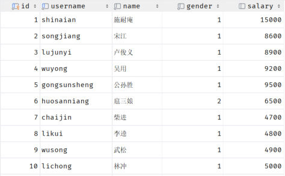

[46 篇](/posts/编程学习/javaweb学习笔记/46-dql基本查询与条件查询/)解决了"查哪些列、筛哪些行"；但如果需求变成"**一共多少人**""**平均薪资是多少**""**每个职位各有多少人**"，用前两篇的写法就只能把数据全查出来、在程序里一行行数——**数据库本身就能算**。

这一篇对应 PPT 第 56-61 页，讲的是完整 DQL 七段结构里的这两段：

| 七段结构 | 本篇位置 |
| --- | --- |
| `select` 字段列表 / `from` 表名 / `where` 条件 | [46 篇](/posts/编程学习/javaweb学习笔记/46-dql基本查询与条件查询/) |
| **`group by` 分组字段列表** | **本篇** |
| **`having` 分组后条件列表** | **本篇** |
| `order by` 排序字段列表 / `limit` 分页参数 | [48 篇](/posts/编程学习/javaweb学习笔记/48-dql排序与分页查询/) |

另外还有一个不属于"七段"、但处在 `where` 与 `having` 之间的东西——**聚合函数**。它俩是这一篇的两条腿：**聚合函数负责"算"，group by 负责"分"**。

本机实测环境：MySQL 9.0.1（课程用 8.0.34），库 `db01`、表 `emp`（30 条员工数据，其中"李云"这条数据的 `job` 和 `salary` 都是 `NULL`）。这一篇的很多结论，靠的就是这 1 条 `NULL` 数据。

## 聚合函数（PPT 第 57-59 页）

PPT 第 59 页给的原文定义只有一句，但很关键：

> **聚合函数：将一列数据作为一个整体，进行纵向计算。**

"**纵向**"这两个字是理解它的钥匙——普通查询是"横着"一行一行地看记录，聚合函数是"竖着"把一整列的值抓起来算一个结果。PPT 第 59 页的那张图就是 `emp` 表里的数据：


*图：PPT 第 59 页——DataGrip 里 `emp` 表的数据（id、username、name、gender、salary 等列）。聚合函数就是把这样的一列值（比如整列 salary）当成一个整体来算：整列加起来是总薪资 `sum`，整列平均一下是平均薪资 `avg`，整列里最小的那个是 `min`*

### 五个聚合函数（PPT 第 59 页）

| 函数 | 功能 |
| --- | --- |
| `count` | 统计数量 |
| `max` | 最大值 |
| `min` | 最小值 |
| `avg` | 平均值 |
| `sum` | 求和 |

五个函数在本机 `emp` 表（30 条数据）上跑出来的真实结果：

> [!TIP]
> 实测（MySQL 9.0.1，库 `db01`，表 `emp`）：
>
> ```sql
> select count(*) as c_star, count(id) as c_id, count(1) as c_1, count(job) as c_job, count(salary) as c_salary from emp;
> select avg(salary) as avg_s, round(avg(salary),2) as avg_r2, min(salary) as min_s, max(salary) as max_s, sum(salary) as sum_s from emp;
> ```
>
> ```text
> +--------+------+-----+-------+----------+
> | c_star | c_id | c_1 | c_job | c_salary |
> +--------+------+-----+-------+----------+
> |     30 |   30 |  30 |    29 |       29 |
> +--------+------+-----+-------+----------+
>
> +-----------+---------+-------+-------+--------+
> | avg_s     | avg_r2  | min_s | max_s | sum_s  |
> +-----------+---------+-------+-------+--------+
> | 7548.2759 | 7548.28 |  4700 | 15000 | 218900 |
> +-----------+---------+-------+-------+--------+
> ```
>
> 也就是——**员工数量 30、平均薪资 7548.2759（保留两位是 7548.28）、最低薪资 4700、最高薪资 15000、薪资总额 218900**。
>
> 注意上面那张表的最后两列：`count(job)` 和 `count(salary)` 都是 **29**，而 `count(*)`、`count(id)`、`count(1)` 都是 **30**。**差的这 1 条，就是李云。**

### 注意一：null 不参与所有聚合函数的运算（PPT 第 59 页）

PPT 第 59 页的第一条注意是原文：

> **null 值不参与所有聚合函数的运算。**

这句话看着平淡，实测一下就知道它有多容易算错：

| 写法 | 实测结果 | 为什么 |
| --- | --- | --- |
| `count(*)` | **30** | 数的是"有多少行"，`NULL` 行也算一行 |
| `count(job)` | **29** | 数的是"job 这一列有多少个**非空**的值"——李云没填职位，被排除了 |
| `count(salary)` | **29** | 同理，李云的薪资也是 `NULL` |
| `avg(salary)` | **7548.2759** | 分子是 `sum(salary)` = 218900，**分母是 29**（不是 30！） |
| `sum(salary)` | **218900** | 求和时跳过 `NULL`（跳过而不是当 0，结果一样） |
| `min(salary)` / `max(salary)` | **4700** / **15000** | `NULL` 不参与比较 |

平均薪资这个数最好验算一遍：**218900 ÷ 29 = 7548.27586……**，四舍五入就是 `7548.2759`；如果用 30 当分母（错误地以为"没薪资的人按 0 算"），会得到 7296.6667——和正确答案差了 250 多。

> [!IMPORTANT]
> `NULL` 和"0"、"空字符串"是两回事：**0 会参与运算**（求和会多一个 0，`count` 会把它算进去），**`NULL` 会被所有聚合函数跳过**。所以"统计平均薪资"这类需求，一定要先在心里问一句：**这一列有没有空值？空值会不会让分母变小？**

### 注意二：统计数量的三种写法，推荐 `count(*)`（PPT 第 59 页）

PPT 第 59 页的第二条注意是原文：

> **统计数量可以使用：count(\*)  count(字段)  count(常量)，推荐使用 count(\*)。**

三种写法实测出来的区别：

| 写法 | 数的是什么 | 实测结果 |
| --- | --- | --- |
| `count(*)` | 符合条件的**总行数**（含值为 `NULL` 的行） | **30** |
| `count(字段)` | 该字段**非空**的行数（`NULL` 不算） | `count(id)` = 30、`count(job)` = **29** |
| `count(常量)` | 因为常量永远不为空，等价于数总行数 | `count(1)` = **30** |

推荐 `count(*)` 的理由有两层：一是它**语义最直白**（"数行数"就该这么写）；二是它是 SQL 的**标准写法**，数据库自己知道怎么数最省事，不需要真的去读某一列的值。而 `count(字段)` 只有在一种情况下才是你想要的——**你确实想数"这一列填了值的有多少个"**（比如"有多少员工分配了职位"）。

## 分组查询（PPT 第 57-60 页）

聚合函数是"把整张表算成一个数"；可"每个职位各有多少人"这种需求，要求的是**分成几堆、每堆各算一个数**。PPT 第 57-58 页演示的正是这个思路：先按某个共同点把员工**分组**，再在每组里做**聚合**——

**分组 + 聚合 = 分组查询。**

### 语法（PPT 第 60 页）

```sql
select 字段列表 from 表名 [where 条件列表] group by 分组字段名 [having 分组后过滤条件];
```

中括号里的两段都是可选的：`where` 是"分组**之前**先筛掉一些行"（[46 篇](/posts/编程学习/javaweb学习笔记/46-dql基本查询与条件查询/)学过），`having` 是"分组**之后**再筛掉一些组"（下面马上讲）。

### 实测一：按职位分组统计人数

```sql
select job, count(*) from emp group by job;
```

> [!TIP]
> 实测（MySQL 9.0.1，库 `db01`，表 `emp`）：
>
> ```text
> +------+----------+
> | job  | count(*) |
> +------+----------+
> |    4 |        1 |
> |    2 |       12 |
> |    3 |        1 |
> |    1 |        6 |
> |    5 |        9 |
> | NULL |        1 |
> +------+----------+
> ```
>
> 一共 6 组、人数加起来正好 30。**职位为 `NULL` 的李云自己单独成一组**——分组时 `NULL` 也是一类值（这和 `count(job)` 只有 29 并不矛盾：`count(job)` 数的是"非空值有 29 个"，而分组是把"值为 `NULL` 的行"归成一组）。

这条结果对应的是"每个职位有多少人"（1 班主任 6 人、2 讲师 12 人、3 学工主管 1 人、4 教研主管 1 人、5 咨询师 9 人、没填职位 1 人）。

### 实测二：按性别分组看人数与平均薪资

`select` 里的字段列表可以同时放**分组字段**和**聚合函数**，一条 SQL 就能省掉两趟查询：

> [!TIP]
> 实测（MySQL 9.0.1，库 `db01`，表 `emp`）：
>
> ```sql
> select gender, count(*) from emp group by gender;
> ```
>
> ```text
> +--------+----------+
> | gender | count(*) |
> +--------+----------+
> |      1 |       27 |
> |      2 |        3 |
> +--------+----------+
> ```
>
> ```sql
> select gender, avg(salary) from emp group by gender;
> ```
>
> ```text
> +--------+-----------+
> | gender | avg(salary) |
> +--------+-----------+
> |      1 | 7346.1538 |
> |      2 | 9300.0000 |
> +--------+-----------+
> ```
>
> 两组的人数（27 + 3 = 30）和平均薪资都能互相印证：男性那一组的平均薪资分母是 26（27 个男性里，李云的薪资是 `NULL`，不参与计算）——`NULL` 不参与聚合这条规则，在分组里**同样生效**，而且**是每组各算各的**。

### 注意：分组之后查其他字段没有意义（PPT 第 60 页）

PPT 第 60 页的第三条注意是原文：

> **分组之后，查询的字段一般为聚合函数和分组字段，查询其他字段无任何意义。**

想要验证这句"无任何意义"，本机实测直接报错：

> [!TIP]
> 实测（MySQL 9.0.1，库 `db01`，表 `emp`）：
>
> ```sql
> select job, name, count(*) from emp group by job;
> ```
>
> ```text
> ERROR 1055 (42000): Expression #2 of SELECT list is not in GROUP BY clause and contains nonaggregated column 'db01.emp.name' which is not functionally dependent on columns in GROUP BY clause; this is incompatible with sql_mode=only_full_group_by
> ```
>
> 原因很直白：按职位分组后，`job = 2` 那一组有 12 个人，`count(*)` 好说（就是 12），可 **`name` 该显示哪一个**？12 个名字里挑谁都不对——所以 MySQL 8 默认的严格模式（`only_full_group_by`）直接把这个查询拦下来报错。
>
> `select` 里能放心写的只有两种：**分组字段**（`job`）和**聚合函数**（`count(*)`、`avg(salary)`……）。想连名字一起看，那就要回到 [46 篇](/posts/编程学习/javaweb学习笔记/46-dql基本查询与条件查询/)的写法——**别分组，直接 `where` 筛**。

## where 与 having 的区别（PPT 第 60-61 页）

`where` 和 `having` 都是"过滤"，位置也挨着，最容易混。PPT 第 60 页把它们的两条区别写得很清楚：

| 区别（PPT 原文） | 说明 |
| --- | --- |
| **执行时机不同** | `where` 是**分组之前**进行过滤，**不满足 where 条件的不参与分组**；而 `having` 是**分组之后**对结果进行过滤 |
| **判断条件不同** | **`where` 不能对聚合函数进行判断，而 `having` 可以** |

同一页还给了执行顺序：

> **`where` > 聚合函数 > `having`**

### 实测：where 里用聚合函数会报错

> [!TIP]
> 实测（MySQL 9.0.1，库 `db01`，表 `emp`）：
>
> ```sql
> select job, count(*) from emp where count(*) > 3 group by job;
> ```
>
> ```text
> ERROR 1111 (HY000): Invalid use of group function
> ```
>
> 报错原文的意思是"**group function（分组函数，也就是聚合函数）用在了非法的地方**"。为什么非法？因为执行顺序是 `where` **先**跑、聚合**后**算——`where` 执行的时候，`count(*)` 还是个没算出来的数，自然没法拿去比较。
>
> 换成 `having` 就正常了：
>
> ```sql
> select job, count(*) as cnt from emp group by job having count(*) > 3;
> ```
>
> ```text
> +------+-----+
> | job  | cnt |
> +------+-----+
> |    2 |  12 |
> |    1 |   6 |
> |    5 |   9 |
> +------+-----+
> ```
>
> 6 组里只剩讲师（12）、班主任（6）、咨询师（9）三组——`having` 是在分组、聚合**都完成之后**才做的过滤，所以它手里有 `count(*)` 的值可用。
>
> 顺带一个本机实测的小发现：`having` 后面**可以用 `select` 里起的别名**（写成 `having cnt > 3` 结果完全一样），因为 `having` 的执行已经晚于 `select` 的字段求值（这条线索在 [48 篇](/posts/编程学习/javaweb学习笔记/48-dql排序与分页查询/)的执行顺序实验里还会用到）。

### 组合实战：先筛、再分组、再过滤

真实需求往往三段都要：**先把一部分数据筛掉（`where`）→ 再分组统计（`group by` + 聚合）→ 最后把不满足条件的组去掉（`having`）**。

需求：**先只看 2000-01-01 之后入职的员工，按职位分组，找出人数大于 2 的职位**：

> [!TIP]
> 实测（MySQL 9.0.1，库 `db01`，表 `emp`）：
>
> ```sql
> select job, count(*) as cnt from emp where entry_date > '2000-01-01' group by job having count(*) > 2;
> ```
>
> ```text
> +------+-----+
> | job  | cnt |
> +------+-----+
> |    2 |  12 |
> |    1 |    6 |
> |    5 |    9 |
> +------+-----+
> ```
>
> 注意 `where` 里的条件（入职时间）作用在**行**上，`having` 里的条件（人数）作用在**组**上，两者各管一段、互不干扰。

课程配套练习里还有一道同型题——**先查入职时间在 `2015-01-01`（含）以前的员工，按职位分组，获取员工数量大于等于 2 的职位**：

> [!TIP]
> 实测（MySQL 9.0.1，库 `db01`，表 `emp`）：
>
> ```sql
> select job, count(*) from emp where entry_date <= '2015-01-01' group by job having count(*) >= 2;
> ```
>
> ```text
> +------+----------+
> | job  | count(*) |
> +------+----------+
> |    2 |       11 |
> |    1 |        5 |
> |    5 |        7 |
> +------+----------+
> ```
>
> 和上一题的差别只在 `where` 的条件（`<= '2015-01-01'` 比"2000 年之后"放进来更多行）——同一份数据、不同的前置条件，分组结果里的数字就变了，这也是"**`where` 先筛掉的行连分组都不参与**"的直观体现。

### 必答问答（PPT 第 61 页）

| 问题 | 答案 |
| --- | --- |
| DQL 语句中 where 与 having 的区别？ | ① **执行时机不同**（`where` → `group by` → `having`）；② **判断条件不同**（`having` 后可以用聚合函数，`where` 不可以） |

## 小结

| 问题 | 答案 |
| --- | --- |
| 聚合函数是什么 | 把**一列数据作为一个整体**，进行**纵向计算**；五个函数分别是 `count` 统计数量、`max` 最大值、`min` 最小值、`avg` 平均值、`sum` 求和 |
| 五个函数的实测结果 | 30 条数据上：`count(*)` = **30**、`avg(salary)` = **7548.2759**（保留两位 7548.28）、`min(salary)` = **4700**、`max(salary)` = **15000**、`sum(salary)` = **218900** |
| `null` 的影响 | **`null` 不参与所有聚合函数的运算**——`count(job)` = **29**（李云没填职位），`avg(salary)` 的分母是 **29** 不是 30；但分组时 `NULL` 会**自己成为一组** |
| 统计数量的三种写法 | `count(*)` 数总行数、`count(字段)` 只数该字段非空的值、`count(常量)` 等价于数总行数；**推荐 `count(*)`**（语义直白、标准写法） |
| 分组查询语法 | `select 字段列表 from 表名 [where 条件列表] group by 分组字段名 [having 分组后过滤条件];` |
| 分组查询的实测结果 | `select job, count(*) from emp group by job` → 4 有 1 人、2 有 12 人、3 有 1 人、1 有 6 人、5 有 9 人、`NULL` 一组 1 人；`select gender, count(*) from emp group by gender` → 1 有 **27** 人、2 有 **3** 人（平均薪资 7346.1538 / 9300.0000） |
| 分组后能查什么 | 只能查**分组字段**和**聚合函数**；查其他字段无意义——实测报 `ERROR 1055 (42000)`，提示与 `sql_mode=only_full_group_by` 不兼容 |
| where 与 having 的区别 | ① 执行时机：`where` **分组前**过滤（不满足的不参与分组），`having` **分组后**过滤；② 判断条件：`where` **不能**用聚合函数，`having` **可以**；执行顺序 **`where` > 聚合函数 > `having`** |
| 报错原文（实测） | `where count(*) > 3` → **`ERROR 1111 (HY000): Invalid use of group function`**；`group by job` 后 `select` 非分组字段 `name` → **`ERROR 1055 (42000)`**（only_full_group_by） |
| 本机环境 | MySQL **9.0.1**（课程用 8.0.34），库 `db01`、表 `emp`（30 条数据，李云这条的 `job`/`salary` 为 `NULL`） |

## 相关

- [上一篇：DQL基本查询与条件查询](/posts/编程学习/javaweb学习笔记/46-dql基本查询与条件查询/)
- [下一篇：DQL排序与分页查询](/posts/编程学习/javaweb学习笔记/48-dql排序与分页查询/)

## 练习题

### 一、知识回顾（读完直接做下面的实践题）

1. **聚合函数**的定义是"将一列数据作为**一个整体**，进行**纵向计算**"；五个函数：`count` 统计数量、`max` 最大值、`min` 最小值、`avg` 平均值、`sum` 求和
2. **`null` 不参与所有聚合函数的运算**：它会跳过 `count(字段)`、不进入 `sum`/`avg` 的分子分母、不参与 `min`/`max` 的比较
3. **统计数量的三种写法**：`count(*)`（数总行数，**推荐**）、`count(字段)`（只数该字段非空的值）、`count(常量)`（等价于数总行数）
4. **分组查询语法**：`select 字段列表 from 表名 [where 条件列表] group by 分组字段名 [having 分组后过滤条件];`——`select` 里能写的是**分组字段 + 聚合函数**
5. **分组时 `NULL` 自己成一组**：`group by job` 的结果里有单独一行 `job` 为 `NULL`（李云），而 `count(job)` 却数不到他——两个现象一个原因（`NULL` 不参与聚合，但分组时算一类值）
6. **`where` 与 `having` 的两条区别**：① **执行时机不同**（`where` 分组**前**过滤，不满足条件的行不参与分组；`having` 分组**后**过滤）；② **判断条件不同**（`where` 不能用聚合函数，`having` 可以）
7. **执行顺序**：`where` **>** 聚合函数 **>** `having`（再加上外层就是 `from → where → group by → 聚合 → having → select → order by → limit`）
8. **实测数字（本机 MySQL 9.0.1，emp 表 30 条）**：`count(*)` = **30**、`count(job)` = **29**、`avg(salary)` = **7548.2759**（保留两位 7548.28，分母是 **29**）、`min` = **4700**、`max` = **15000**、`sum` = **218900**
9. **实测分组结果**：按职位 `group by job` → 1 有 6 人、2 有 12 人、3 有 1 人、4 有 1 人、5 有 9 人、`NULL` 有 1 人；按性别 `group by gender` → 1 有 **27** 人（平均 7346.1538）、2 有 **3** 人（平均 9300.0000）
10. **两条报错原文**：`where count(*) > 3` → **`ERROR 1111 (HY000): Invalid use of group function`**；`group by job` 后 `select` 非分组字段 `name` → **`ERROR 1055 (42000)`**（提示与 `sql_mode=only_full_group_by` 不兼容）

### 二、裸写题

- [ ] **2-1 先把五个聚合函数各跑一遍**
  统计该公司：① 员工数量；② 平均薪资；③ 最低薪资；④ 最高薪资；⑤ 薪资总额。
  （练习文件 `test_47_聚合函数.sql` 里给了题目注释和写作区。）

  > [!TIP]- 提示（先自己想，实在想不出再点开）
  > **一级 · 思路**：这五问都是"把一整列当成一个整体算一个数"，用聚合函数；注意它们**不需要 `group by`**（整张表算一个值）
  > **二级 · 方法**：`select 聚合函数(字段) from 表名;`——统计数量 `count`、平均 `avg`、最小 `min`、最大 `max`、求和 `sum`；统计数量**推荐 `count(*)`**
  > **三级 · 骨架**：`select count(*) from emp;` / `select ____(salary) from emp;`（平均值）/ `select min(salary), ____(salary) from emp;` / `select ____(salary) from emp;`（求和）

  > [!TIP]- 参考答案（做完再点开）
  > ```sql
  > select count(*) as 员工数量 from emp;
  > select avg(salary) as 平均薪资 from emp;
  > select min(salary) as 最低薪资 from emp;
  > select max(salary) as 最高薪资 from emp;
  > select sum(salary) as 薪资总额 from emp;
  > -- 一条 SQL 里全查出来也可以
  > select count(*) as 员工数量, avg(salary) as 平均薪资, min(salary) as 最低薪资, max(salary) as 最高薪资, sum(salary) as 薪资总额 from emp;
  > ```
  > 本机实测结果（MySQL 9.0.1，`db01.emp`）：
  > ```text
  > +--------+-----------+-----------+-----------+-----------+
  > | 员工数量 | 平均薪资  | 最低薪资  | 最高薪资  | 薪资总额  |
  > +--------+-----------+-----------+-----------+-----------+
  > |     30 | 7548.2759 |      4700 |     15000 |    218900 |
  > +--------+-----------+-----------+-----------+-----------+
  > ```
  > **平均薪资这一格一定要会验算**：`218900 ÷ 29 = 7548.2759`——分母是 **29** 不是 30，因为李云那条数据的 `salary` 是 `NULL`，`NULL` 不参与聚合运算。想保留两位小数可以套一个四舍五入函数 `round(avg(salary), 2)`，结果是 **7548.28**。

- [ ] **2-2 按性别分组，看人数和平均薪资**
  把员工按性别分成两组，分别统计每组的**人数**和**平均薪资**。

  > [!TIP]- 提示（先自己想，实在想不出再点开）
  > **一级 · 思路**："按性别分成两组"是这件事的分组依据，"每组各算一个数"是聚合——同一个 `select` 里，分组字段和聚合函数可以并排放
  > **二级 · 方法**：`select 分组字段, 聚合函数 from 表名 group by 分组字段;`；人数用 `count(*)`，平均薪资用 `avg(salary)`
  > **三级 · 骨架**：`select gender, count(*), ____(salary) from emp ____ ____ gender;`

  > [!TIP]- 参考答案（做完再点开）
  > ```sql
  > select gender, count(*) from emp group by gender;
  > select gender, avg(salary) from emp group by gender;
  > -- 合并成一条
  > select gender, count(*) as 人数, avg(salary) as 平均薪资 from emp group by gender;
  > ```
  > 本机实测：
  > ```text
  > +--------+-----+-----------+
  > | gender | cnt | avg_s     |
  > +--------+-----+-----------+
  > |      1 |  27 | 7346.1538 |
  > |      2 |   3 | 9300.0000 |
  > +--------+-----+-----------+
  > ```
  > 两组人数 27 + 3 = 30，全员到齐；但男性组的平均薪资分母是 **26**（27 个男性里李云的薪资为 `NULL`）——`NULL` 不参与聚合，**在分组里是每组各算各的**。数据里 1 表示男、2 表示女（`emp` 表的 `gender` 是 `tinyint`，注释写的是"1:男, 2:女"），读结果时不要看反。

- [ ] **2-3 先筛、再分组、再过滤**
  查出**入职时间在 2015-01-01（含当天）以前**的员工，按**职位**分组统计人数，最后**只留下人数大于等于 2 的职位**。

  > [!TIP]- 提示（先自己想，实在想不出再点开）
  > **一级 · 思路**：一句话里藏着三段——"入职时间在……以前"是**筛行**（分组之前的事），"按职位分组统计人数"是**分组 + 聚合**，"人数大于等于 2"是**筛组**（分组之后的事）
  > **二级 · 方法**：筛选行的条件写在 `where`（这里放入职时间，含当天用 `<=`）；分组用 `group by 分组字段`；筛组的条件写在 `having`（这里放 `count(*) >= 2`）——**`having` 后面才能用聚合函数，`where` 里用会报 1111**
  > **三级 · 骨架**：`select job, count(*) from emp where entry_date ____ '2015-01-01' group by ____ having ____ >= 2;`

  > [!TIP]- 参考答案（做完再点开）
  > ```sql
  > select job, count(*) from emp where entry_date <= '2015-01-01' group by job having count(*) >= 2;
  > ```
  > 本机实测：
  > ```text
  > +------+----------+
  > | job  | count(*) |
  > +------+----------+
  > |    2 |       11 |
  > |    1 |        5 |
  > |    5 |        7 |
  > +------+----------+
  > ```
  > 三段各管一段、顺序不能颠倒：`where` 先砍掉 2015 年之后入职的人（他们**连分组都不参与**），`group by` 把剩下的人按职位分成几堆，`having` 再把人数不够的组整组去掉。所以结果里的数字（11、5、7）比"全表分组"时的 12、6、9 **小**——差的就是被 `where` 先筛掉的那些人。
  >
  > 对照一下：如果把 `where` 和 `having` 的位置写反（拿 `count(*) >= 2` 去 `where` 里比较），会直接报 **`ERROR 1111 (HY000): Invalid use of group function`**——这就是"执行顺序"这条规则在实际写 SQL 时最常撞上的一面墙。

- [ ] **2-4 排错：这两条 SQL 为什么跑不了**
  （1）下面是"找出人数超过 3 人的职位"，为什么报错？改成正确的写法。
  （2）下面是"按职位分组看看每组都有谁、各多少人"，为什么报错？应该怎么改（两条思路）？

  ```sql
  -- (1)
  select job, count(*) from emp where count(*) > 3 group by job;

  -- (2)
  select job, name, count(*) from emp group by job;
  ```

  > [!TIP]- 提示（先自己想，实在想不出再点开）
  > **一级 · 思路**：两条都撞在"**谁能用聚合函数、什么时候能用**"这条规则上——第 1 条错在"过滤条件的位置"，第 2 条错在"`select` 里写了不该写的字段"
  > **二级 · 方法**：聚合函数只能出现在 `having` 或 `select` 的字段列表里，**不能出现在 `where`**；分组之后 `select` 里只能写**分组字段**和**聚合函数**
  > **三级 · 骨架**：`... group by job ____ count(*) > 3;`（第 1 条把条件搬到后面那一段）/ 第 2 条要么删掉 `name`，要么别分组、改用 `where` 把某一组的人列出来

  > [!TIP]- 参考答案（做完再点开）
  > **（1）** 报错原文（本机实测）：
  > ```text
  > ERROR 1111 (HY000): Invalid use of group function
  > ```
  > 原因：`where` 在**分组之前**执行，那时 `count(*)` 还没算出来，没法拿来比较——所以"对聚合结果做判断"必须用 `having`（它在分组、聚合之后才执行）。正确写法：
  > ```sql
  > select job, count(*) as cnt from emp group by job having count(*) > 3;
  > ```
  > 本机实测得到三组：讲师 12、班主任 6、咨询师 9（`having cnt > 3` 用 `select` 里的别名也一样能跑）。
  >
  > **（2）** 报错原文（本机实测）：
  > ```text
  > ERROR 1055 (42000): Expression #2 of SELECT list is not in GROUP BY clause and contains nonaggregated column 'db01.emp.name' which is not functionally dependent on columns in GROUP BY clause; this is incompatible with sql_mode=only_full_group_by
  > ```
  > 原因：按职位分组后，"讲师"这一组有 12 个人，`count(*)` 是确定的，但 `name` 该显示哪一个完全说不清——所以严格模式下直接报 1055。两条改法：
  > ```sql
  > -- 思路一：分组只留分组字段 + 聚合函数
  > select job, count(*) from emp group by job;
  >
  > -- 思路二：不分组，把某一组的人用 where 列出来
  > select name from emp where job = 2;
  > ```
  > 结论一句话记牢：**`group by` 之后，`select` 里写的要么是分组字段、要么是聚合函数。**

### 三、综合题

- [ ] **3-1 给员工表做一份"薪资体检报告"**
  在 `db01` 库的 `emp` 表（30 条数据）上，模拟"人事要看一份数据汇总"，按下面的顺序做完并写清每个数字的来历：
  1. **总量**：统计员工总数，再统计**有多少员工分配了职位**——两个数字为什么不一样？差的是谁？（用姓名确认一下）
  2. **薪资总览**：平均薪资、最高薪资、最低薪资、薪资总额各是多少？**验算一遍平均薪资**（用"总额 ÷ 人数"核对，注意这里的"人数"到底该是几）；
  3. **按性别分组**：每组的人数、平均薪资分别是多少？
  4. **按职位分组**：每种职位各有多少人？（记得会多出一组 `NULL`）
  5. **先筛后分组再过滤**：只看 2015-01-01（含）以前入职的员工，按职位分组统计人数，只保留人数大于等于 2 的职位；
  6. **答一问**：如果直接写 `select job, name, count(*) from emp group by job;` 会怎样？把报错关键信息记下来，并解释"分组后为什么不能查 name"。

  **涉及知识点**

  | 知识点 | 在这里的应用 |
  | --- | --- |
  | 聚合函数 | 第 1-2 步——`count` / `avg` / `max` / `min` / `sum` |
  | null 不参与聚合 | 第 1 步——`count(*)` 与 `count(job)` 的差异；第 2 步——`avg` 的分母是 29 |
  | 分组查询 | 第 3-4 步——`group by gender`、`group by job`（`NULL` 自成一组） |
  | where 与 having | 第 5 步——先 `where` 筛行，再 `group by`，最后 `having` 筛组 |
  | 分组后的字段限制 | 第 6 步——只能在 `select` 里写分组字段和聚合函数 |

  > [!TIP]- 提示（先自己想，实在想不出再点开）
  > **一级 · 思路**：整题就是"聚合 → 分组 → 先筛后分再滤"三层递进；第 1、2 步重点是把 `NULL` 的影响看清楚，第 3、5 步是分组的常规用法
  > **二级 · 方法**：聚合函数 `count(*)`、`count(job)`、`avg(salary)`、`max`/`min`/`sum`；分组 `group by 字段`；三段式 `where ... group by ... having ...`；`NULL` 的两种表现（不进聚合、自成一 组）
  > **三级 · 骨架**：第 1 步 `select count(*), count(job) from emp;`（再用 `where job is null` 找出那个人）/ 第 5 步 `select job, count(*) from emp where entry_date <= '____' group by job ____ count(*) >= 2;`

  > [!TIP]- 参考答案（做完再点开）
  > ```sql
  > -- 1. 总数与"有职位的人数"
  > select count(*) as 员工总数, count(job) as 有职位人数 from emp;
  > select id, name, job from emp where job is null;
  >
  > -- 2. 薪资总览
  > select avg(salary) as 平均薪资, max(salary) as 最高薪资, min(salary) as 最低薪资, sum(salary) as 薪资总额 from emp;
  > select round(avg(salary), 2) from emp;
  >
  > -- 3. 按性别分组
  > select gender, count(*) as 人数, avg(salary) as 平均薪资 from emp group by gender;
  >
  > -- 4. 按职位分组
  > select job, count(*) as 人数 from emp group by job;
  >
  > -- 5. 先筛、再分组、再过滤
  > select job, count(*) as 人数 from emp where entry_date <= '2015-01-01' group by job having count(*) >= 2;
  >
  > -- 6. 复现报错
  > select job, name, count(*) from emp group by job;
  > ```
  > 本机实测结果（MySQL 9.0.1，`db01.emp`）：
  > 1. `count(*)` = **30**，`count(job)` = **29**——差的是**李云**（`where job is null` 查出来只有他一条）；他没填职位，`NULL` 不参与聚合，所以没被 `count(job)` 数到；
  > 2. 平均薪资 **7548.2759**、最高 **15000**（施耐庵）、最低 **4700**（柴进）、总额 **218900**；验算：**218900 ÷ 29 = 7548.2759**——分母是 29 而不是 30，因为李云**既没有薪资、也不算进平均**（他和第 1 步里的"差的那 1 条"是同一个人，两处现象一个原因）；
  > 3. 性别分组：
  >    ```text
  >    +--------+-----+-----------+
  >    | gender | 人数 | 平均薪资   |
  >    +--------+-----+-----------+
  >    |      1 |  27 | 7346.1538 |
  >    |      2 |   3 | 9300.0000 |
  >    +--------+-----+-----------+
  >    ```
  >    男性组 27 人的平均薪资分母是 **26**（李云又"缺席"了一次），这正是 `avg` 在分组内同样会跳过 `NULL` 的证据；
  > 4. 职位分组：
  >    ```text
  >    +------+------+
  >    | job  | 人数 |
  >    +------+------+
  >    |    4 |    1 |
  >    |    2 |   12 |
  >    |    3 |    1 |
  >    |    1 |    6 |
  >    |    5 |    9 |
  >    | NULL |    1 |
  >    +------+------+
  >    ```
  >    6 组一共 30 人；`NULL` 一组只有李云一个人——分组时 `NULL` 是"一类值"，而聚合时它被跳过，这两个表现并不矛盾；
  > 5. 结果为 **2 → 11 人、1 → 5 人、5 → 7 人**（比第 4 步的 12、6、9 少，差的就是 2015 年之后入职、被 `where` 提前筛掉的人）；
  > 6. 第 6 步会报 **`ERROR 1055 (42000)`**，关键信息是 `contains nonaggregated column 'db01.emp.name'` 和 `sql_mode=only_full_group_by`——按职位分组后，"讲师"这一组有 12 个人，`name` 显示谁都不对，所以严格模式下直接拦下。分组查询里 `select` 能写的只有**分组字段 + 聚合函数**。
