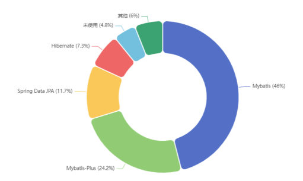
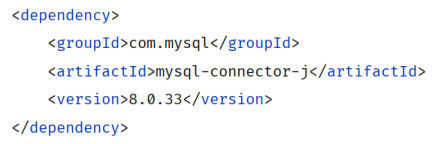
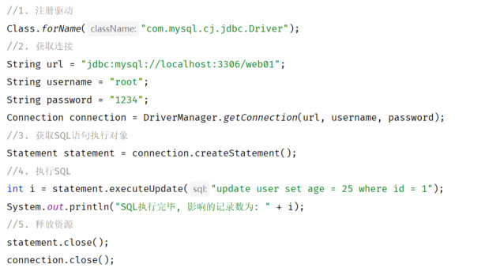

[48 篇](/posts/编程学习/javaweb学习笔记/48-dql排序与分页查询/)把 DQL 讲完，第 5 章的 SQL 就算练到手了——查、筛、分组、排序、分页都会写。但那些语句都是我们坐在客户端（DataGrip、命令行）前面**自己敲**的。

真实项目里没人替系统敲 SQL，**是 Java 程序自己在跑 SQL**。第 6 章就干这件事——PPT 第 1 页的标题页上写着「**Web后端开发 / java程序操作数据库**」，这一篇（第 1～8 页）就是这一章的地基：先看清有哪几条技术路线，再把 JDBC 是什么、本质是什么讲透，最后跑通第一个程序。

PPT 第 4 页把这一章切成两块（**JDBC** 和 **MyBatis**），第 5 页那个 "01" 就是 JDBC 这一块的分节页；后面第 14 页是转场页、第 16 页那个 "02" 才进入 MyBatis 那一块——所以这一篇和[下一篇](/posts/编程学习/javaweb学习笔记/50-jdbc查询与预编译sql/)都在第一块里。

本机实测环境：用户本机的 MySQL **9.0.1**（课程用 8.0.34），库 `web01`、表 `user`（5 条数据：daqiao/大乔/22、xiaoqiao/小乔/18、diaochan/貂蝉/24、lvbu/吕布/28、zhaoyun/赵云/27），工程就是课程提供的 `jdbc-demo`。

## Java 程序操作数据库的技术全景（PPT 第 1～3 页）

PPT 第 2 页把"java 程序操作数据库"能用到的技术一次列全了，一共五个名字：

| 技术 | 一句话说明 | 本课学不学 |
| --- | --- | --- |
| **JDBC** | Java DataBase Connectivity，Java 语言操作关系型数据库的**一套 API（规范）** | **学——这一篇到[下一篇](/posts/编程学习/javaweb学习笔记/50-jdbc查询与预编译sql/)** |
| **MyBatis** | **持久层框架**，用来**简化 JDBC** 的开发 | **学——第 51～55 篇** |
| **MyBatisPlus** | 在 MyBatis 上再包一层，把常见的增删改查都替你写好（零 SQL 也能用） | 不学，知道它是什么 |
| **SpringData JPA** | Spring 全家桶里的持久层方案，按方法名自动生成查询 | 不学，知道它是什么 |
| **Hibernate** | 老牌的**全自动 ORM** 框架，与 JPA 一脉相承 | 不学，知道它是什么 |

PPT 第 3 页把范围收窄成三个：**JDBC、MyBatis、MyBatisPlus**——这门课从最低层的 JDBC 讲起，把基本功打牢，再上 MyBatis。


*图：PPT 第 2 页配的占比图——MyBatis 占 46%、MyBatis-Plus 占 24.2%、Spring Data JPA 占 11.7%、Hibernate 占 7.3%，"未使用"只有 4.8%。这门课挑的正是占比最高的两个（JDBC 是它们共同的地基——MyBatis 底层同样是走 JDBC 这套 API 访问数据库），所以图里没有把它单列出来*

PPT 第 2 页给的 **JDBC 定义**（原文）：

> **JDBC：(Java DataBase Connectivity)，就是使用Java语言操作关系型数据库的一套API。**

拆开读这条定义，四个信息点：**Java 语言**（不是别的语言）、**关系型数据库**（MySQL、Oracle 这些）、**一套 API**（有一套现成的类和方法给你调）、**规范**（是"标准"，不是"实现"）。最后这个词才是重点——下一页专门讲它。

> [!IMPORTANT]
> 这一章的技术全景要记成一条链：**JDBC 是地基（底层 API），MyBatis 是在它上面的框架（简化它），MyBatisPlus 是在 MyBatis 上的再简化**。学习顺序反过来走：先 JDBC、再 MyBatis——把 JDBC 的"五步"和"预编译"搞懂了，MyBatis 那一篇才知道它在替你省掉什么。

## JDBC 的本质：一套接口 + 各家厂商的驱动（PPT 第 6 页）

PPT 第 6 页左边画了一张图，把 JDBC 的位置标得很清楚：**Java 程序**和**各数据库的实现**中间，夹着 **JDBC** 这一层，各家的"实现"底下标着**驱动**。

```text
                    ┌──────────────────────────┐
   Java 程序 ──调用─▶ │  JDBC（sun 定义的接口规范）│
                    └────────────┬─────────────┘
                                 │ 由各数据库厂商去实现
              ┌──────────────────┼──────────────────┐
        Mysql 实现          Oracle 实现         SqlServer 实现
        （驱动 jar）        （驱动 jar）        （驱动 jar）
```

PPT 第 6 页把**本质**写成三句话：

> **本质：**
> - **sun公司官方定义的一套操作所有关系型数据库的规范，即接口。**
> - **各个数据库厂商去实现这套接口，提供数据库驱动 jar 包。**
> - **我们可以使用这套接口（JDBC）编程，真正执行的代码是驱动 jar 包中的实现类。**

三句话对应三个角色：

| 角色 | 谁 | 干了什么 |
| --- | --- | --- |
| 定标准 | **sun 公司**（Java 官方） | 定义一套**接口**（约定了"连接数据库""执行 SQL"该有哪些方法） |
| 做实现 | **各数据库厂商** | 各自实现这套接口，打成 **驱动 jar 包**发出来（MySQL 的驱动就是我们在 [Maven](/posts/编程学习/javaweb学习笔记/26-maven依赖管理与生命周期/) 里引的那个） |
| 写代码 | **我们（程序员）** | **面向 JDBC 这套接口编程**；运行时真正干活的是驱动 jar 里的**实现类** |

这么设计的好处是"**换数据库不用改代码**"：面向 Oracle 写的那套调用（`DriverManager.getConnection` → `Connection` → `Statement` → 执行 SQL），换到 MySQL 上只是换一个驱动 jar 和一行 URL，方法一个都不用改。这个思路和 [38 篇](/posts/编程学习/javaweb学习笔记/38-分层解耦与ioc-di入门/)、[39 篇](/posts/编程学习/javaweb学习笔记/39-ioc与di详解/)里"面向接口编程、实现类可替换"是同一个道理，只不过这里"提供实现类的人"从我们自己变成了数据库厂商。

> [!TIP]
> **本机实测**（用户本机 MySQL 9.0.1，课程 `jdbc-demo` 工程）——代码里拿到的 `Connection` 是**接口**类型，可它运行时的真身是驱动 jar 里的实现类，打印一下类名就能看见：
>
> ```text
> connection.getClass().getName()  →  com.mysql.cj.jdbc.ConnectionImpl
> ```
>
> `com.mysql.cj.jdbc.ConnectionImpl` 这个名字来自 MySQL 的驱动（`com.mysql` 是 MySQL 的包名，`cj` = Connector/J）。**"我们写接口、驱动给实现"这句话，在运行时就是这样兑现的。**

## 入门程序：需求与准备工作（PPT 第 7 页）

PPT 第 7 页给的需求一句话：

> **需求：基于JDBC程序，执行update语句 (update user set age = 25 where id = 1)**

不是写页面、不是写接口，就是**让 Java 程序把一条 update 语句送到数据库去执行**——把 `id = 1` 那个人的年龄改成 25。PPT 把步骤分成两段：

| 步骤 | 做什么 |
| --- | --- |
| **准备工作** | 创建一个 **maven 项目**，引入依赖；并准备**数据库表 user** |
| **代码实现** | 编写 **JDBC 程序**，操作数据库 |

### 准备一：maven 工程 + 驱动依赖

新建 maven 工程（工程坐标、`pom.xml` 的结构见 [25 篇](/posts/编程学习/javaweb学习笔记/25-idea集成maven与项目坐标/)），在 `pom.xml` 的 `<dependencies>` 里加一段：

```xml
<dependency>
    <groupId>com.mysql</groupId>
    <artifactId>mysql-connector-j</artifactId>
    <version>8.0.33</version>
</dependency>
```


*图：PPT 里给出的这段依赖（就是上面这三行）——`com.mysql` 是组织名、`mysql-connector-j` 是 MySQL 官方驱动的名字、`8.0.33` 是版本。写进 pom 之后，Maven 会把它从中央仓库下载下来，JDBC 程序连的"那个实现"才在 classpath 上*

三个坐标的含义：

- `com.mysql` —— 提供者（MySQL 官方）；
- `mysql-connector-j` —— 驱动 jar 的名字（MySQL 8.x 的驱动即 **Connector/J**）；
- `8.0.33` —— 课件用的版本。

> [!TIP]
> **本机实测**：本机装的是 MySQL **9.0.1**，用的还是课程这个 **8.0.33** 的驱动（课件工程 `jdbc-demo` 的 pom 里就是它），连接、执行 SQL 全部正常——驱动能兼容比自己新的 MySQL 服务端，不用因为版本号不一样就慌。

### 准备二：数据库表 user

课程资料 `01. JDBC-数据库表/user.txt` 里给了建表和数据：

```sql
create table user(
    id int unsigned primary key auto_increment comment 'ID,主键',
    username varchar(20) comment '用户名',
    password varchar(32) comment '密码',
    name varchar(10) comment '姓名',
    age tinyint unsigned comment '年龄'
) comment '用户表';

insert into user(id, username, password, name, age) values (1, 'daqiao', '123456', '大乔', 22),
                                                           (2, 'xiaoqiao', '123456', '小乔', 18),
                                                           (3, 'diaochan', '123456', '貂蝉', 24),
                                                           (4, 'lvbu', '123456', '吕布', 28),
                                                           (5, 'zhaoyun', '12345678', '赵云', 27);
```

| 字段 | 类型 | 说明 |
| --- | --- | --- |
| `id` | `int unsigned primary key auto_increment` | 主键、自增（**插入时不用写**） |
| `username` | `varchar(20)` | 用户名 |
| `password` | `varchar(32)` | 密码 |
| `name` | `varchar(10)` | 姓名 |
| `age` | `tinyint unsigned` | 年龄 |

> [!IMPORTANT]
> 这张表建在哪个库？**`web01`**（第 5 章的 SQL 练习用的是 `db01`，这一章课程另开了一个库）。表的建法、5 条数据的来源都在上面这段 SQL 里——后面所有 JDBC 代码的 URL 都要指到这个库（`jdbc:mysql://localhost:3306/web01`）。

### 准备三：程序写在哪里

课件把它写成一个 **JUnit 测试方法**：新建类 `JdbcTest`，要跑的那段代码放在 `@Test` 标注的方法里，点方法左边的绿色箭头运行（JUnit 的用法见 [27 篇](/posts/编程学习/javaweb学习笔记/27-junit单元测试入门/)）。

```java
public class JdbcTest {

    @Test
    public void testUpdate() throws Exception {
        // 这里写 JDBC 的代码
    }
}
```

用测试方法（而不是 `main` 方法）的好处：**一个类里可以放好几个方法，一个一个跑**（`testUpdate` 跑完再跑 `testSelect`），不用为了跑第二件事去改主方法。

## JDBC 操作数据库的五个步骤（PPT 第 7～8 页）

PPT 第 7 页右边、第 8 页下半张，给的都是这段代码（课程 `jdbc-demo` 工程 `JdbcTest.testUpdate`，与课件一致）：

```java
package com.itheima;

import org.junit.jupiter.api.Test;

public class JdbcTest {

    /**
     * JDBC入门程序
     */
    @Test
    public void testUpdate() throws Exception {
        //1. 注册驱动
        Class.forName("com.mysql.cj.jdbc.Driver");

        //2. 获取数据库连接
        String url = "jdbc:mysql://localhost:3306/web01";
        String username = "root";
        String password = "1234";
        Connection connection = DriverManager.getConnection(url, username, password);

        //3. 获取SQL语句执行对象
        Statement statement = connection.createStatement();

        //4. 执行SQL
        int i = statement.executeUpdate("update user set age = 25 where id = 1");//DML
        System.out.println("SQL执行完毕影响的记录数为: " + i);

        //5. 释放资源
        statement.close();
        connection.close();
    }
}
```


*图：PPT 第 8 页配的这段代码截图。行号右边的 `className:`、`sql:` 是 IDEA 的参数名提示，不是代码的一部分；截图里那行 `System.out.println` 就是用来把"影响了几行"打印到控制台的那一行（课程代码里写的是"SQL执行完毕影响的记录数为: "）*

五步一句一步，先抄下来：

| 步骤 | 代码 | 在干什么 |
| --- | --- | --- |
| **1. 注册驱动** | `Class.forName("com.mysql.cj.jdbc.Driver");` | 把 MySQL 的驱动类加载进 JVM |
| **2. 获取连接** | `DriverManager.getConnection(url, username, password);` | 连上数据库，拿到 `Connection`（连接对象） |
| **3. 获取执行对象** | `connection.createStatement();` | 拿到一个"用来发 SQL 的对象" |
| **4. 执行 SQL** | `statement.executeUpdate("update ...");` | 把 SQL 发给数据库，接住返回值（**影响行数**） |
| **5. 释放资源** | `statement.close(); connection.close();` | 用完关掉，顺序和打开相反 |

这里只出现了 `java.sql.*` 里的东西，所以文件开头是 `import java.sql.*;`。**注意 `Connection`、`Statement` 全是接口**——上面讲的"本质"在这里正式生效：我们拿的是接口，干活的是驱动里的实现类。

### 第 1 步：注册驱动

`Class.forName(全限定类名)` 是 Java 反射里"**加载这个类**"的写法。MySQL 的驱动类在被加载的时候，会执行它自己的静态代码块，把自己"登记"到 `DriverManager` 那里——这一步就是**把驱动叫醒**。

类名要写全：**`com.mysql.cj.jdbc.Driver`**。`cj` 是 Connector/J 的缩写，这是 MySQL **8.x** 驱动的类名；老版本（5.x）的驱动类名是 `com.mysql.jdbc.Driver`，别混。

### 第 2 步：获取连接

`DriverManager` 是 JDBC 提供的"驱动管理器"（它知道有哪些驱动被注册过），`getConnection(url, username, password)` 三个参数给全就能拿到一个连好的 `Connection`。

URL 就一串字符串，逐段拆开看：

| 片段 | 含义 |
| --- | --- |
| `jdbc:` | **协议名**——所有 JDBC 的 URL 都从这个前缀开始 |
| `mysql` | **子协议**，说明连的是 MySQL（`DriverManager` 靠它挑驱动） |
| `localhost` | **主机名**（本机；写 `127.0.0.1` 也一样） |
| `3306` | **端口**（MySQL 的默认端口） |
| `web01` | **数据库名**——不写它，后面的 SQL 就要把表写成 `web01.user` |

> [!WARNING]
> 课件示例里的用户名密码是 `root` / `"1234"`，**这只是课程的示例值**——动手时把 `password` 换成**你自己 MySQL 的密码**（用户名不一样同理）。本机实测那几条输出，就是先把密码换成本机 MySQL 的密码才跑出来的。

### 第 3 步：获取 SQL 语句执行对象

`connection.createStatement()` 返回一个 **`Statement`** 对象，它是"**用来把 SQL 语句发给数据库**"的东西。第 4 步要写的那句 SQL，就是交给它去执行的。

记住这个 `Statement` ——[下一篇](/posts/编程学习/javaweb学习笔记/50-jdbc查询与预编译sql/)要讲它的一个致命缺点（把参数拼进 SQL 字符串里会出安全问题），解决方案是把这一步换成另一个对象。

### 第 4 步：执行 SQL

```java
int i = statement.executeUpdate("update user set age = 25 where id = 1");//DML
```

`executeUpdate(String sql)` 专门执行 **DML**（增删改），**返回值是 `int`——这次执行影响的记录数**。用一个 `int i` 接住它，就相当于跟数据库确认了一句"到底改了几行"：

- 条件写对了（`id = 1` 存在）→ 返回 **1**；
- 条件没命中（比如 id 写成了表里没有的 100）→ 返回 **0**（**不报错**，只是没改到任何行）；
- 一次改到多行（比如 `where age > 20`）→ 返回命中的行数。

> [!TIP]
> `executeUpdate` 的返回值不是"成功/失败"，而是"**影响了几行**"——0 也是一个正常结果。所以排查"数据怎么没变"这类问题时，第一件事就是看这个数字：是 0（条件没命中）还是 1（改了但你看错了地方）。

### 第 5 步：释放资源

```java
statement.close();
connection.close();
```

顺序是**后开先关**：先关 `Statement`，再关 `Connection`。连接是很珍贵的资源（一台数据库的并发连接数是有限的、建连接也很慢），不用了必须还回去——**连接池**（[53 篇](/posts/编程学习/javaweb学习笔记/53-数据库连接池/)）要解决的问题正是"别把连接漏掉"。

入门程序为了看清楚五步，`close` 是直接写在方法末尾的（中途出异常就漏掉了）。课件里紧接着的查询程序（`testSelect`）就换成了 `try ... finally` 的写法，保证**无论出不出异常都会关**——[下一篇](/posts/编程学习/javaweb学习笔记/50-jdbc查询与预编译sql/)会带你看这个版本。

## 实测：五步跑通的样子

> [!TIP]
> **本机实测**（用户本机 MySQL 9.0.1，库 `web01`、表 `user`，工程为课程 `jdbc-demo`，用 `mvn test` 跑 JUnit 测试）——`testUpdate` 执行 `update user set age = 25 where id = 1` 后控制台输出：
>
> ```text
> SQL执行完毕影响的记录数为: 1
> ```
>
> 同一次测试里 `Tests run: 2, Failures: 0, Errors: 0`——**五步全部跑通，那句 "1" 就是 `executeUpdate` 的返回值**（表里 `id = 1` 的 daqiao 这一行被改动，所以影响 1 行；他的年龄原来写的是 22，本条语句把它改成了 25）。
>
> 两点说明：① 课程示例里的 `password = "1234"`，本机实测时换成了本机 MySQL 的密码；② 这条语句**真的改了数据**，想恢复的话用课程资料 `01. JDBC-数据库表/user.txt` 重新导入一遍即可。
>
> 同一次测试的另一个方法（`testSelect`）输出的是 `User(id=1, username=daqiao, password=123456, name=大乔, age=22)`——**查询和 ResultSet 解析是[下一篇](/posts/编程学习/javaweb学习笔记/50-jdbc查询与预编译sql/)的内容。**

## 必答问答（PPT 第 8 页）

| PPT 的问题 | 答案 |
| --- | --- |
| **什么是 JDBC ？** | **sun 公司提供的一套操作关系型数据库的 API（规范）**——全称 Java DataBase Connectivity；本质是**接口**，各厂商提供**驱动 jar** 去实现它，我们面向 JDBC 编程、真正执行的是驱动里的实现类 |
| **JDBC 操作数据库步骤 ？** | **五步**：① 注册驱动 → ② 获取连接 → ③ 获取 SQL 语句执行对象 → ④ 执行 SQL → ⑤ 释放资源。这一篇演示的第 ④ 步是 **DML**（`executeUpdate`，返回值是影响行数）；如果是 **DQL**（查询），第 ④ 步换成 `executeQuery`，还要把结果集解析出来——见[下一篇](/posts/编程学习/javaweb学习笔记/50-jdbc查询与预编译sql/) |

## 小结

| 问题 | 答案 |
| --- | --- |
| JDBC 是什么 | **Java DataBase Connectivity**，**sun 官方定义的一套操作所有关系型数据库的规范（API）** |
| 它的本质 | **就是接口**——各数据库厂商实现这套接口、提供**驱动 jar 包**；我们面向接口编程，**真正执行的是驱动 jar 里的实现类**（实测连接对象真身是 `com.mysql.cj.jdbc.ConnectionImpl`） |
| java 操作数据库有哪几条路 | JDBC、MyBatis、MyBatisPlus、SpringData JPA、Hibernate；**本课只学前两个**（MyBatis 是"简化 JDBC"的**持久层框架**） |
| 准备工作要什么 | ① maven 工程 + 依赖 `com.mysql:mysql-connector-j:8.0.33`；② 库 `web01` 里的 `user` 表（建表语句与 5 条数据见 `user.txt`）；③ 一个 JUnit `@Test` 方法作为运行入口 |
| 五步是哪五步 | **注册驱动**（`Class.forName("com.mysql.cj.jdbc.Driver")`）→ **获取连接**（`DriverManager.getConnection(url, username, password)`）→ **获取执行对象**（`connection.createStatement()`）→ **执行 SQL**（`statement.executeUpdate(sql)`）→ **释放资源**（`statement.close()`、`connection.close()`，后开先关） |
| URL 怎么读 | `jdbc:mysql://localhost:3306/web01` = 协议 `jdbc:` + 子协议 `mysql` + 主机 `localhost` + 端口 `3306` + 数据库名 `web01` |
| `executeUpdate` 返回什么 | **`int`，这次执行影响的记录数**（DML 专用）；命中 1 行是 1、没命中是 0（不报错）、命中的多行就是多行 |
| 实测输出 | `SQL执行完毕影响的记录数为: 1`（同一次测试 `Tests run: 2, Failures: 0, Errors: 0`） |
| 密码要注意什么 | 课程示例 `root` / `1234` 只是示例，**换成你自己 MySQL 的密码**；本机实测就是这么跑的 |
| 本篇和下一篇的分工 | 本篇是 **DML**（改数据）+ 五步 + 概念；[下一篇](/posts/编程学习/javaweb学习笔记/50-jdbc查询与预编译sql/)是 **DQL**（`executeQuery` + `ResultSet` 解析）+ **预编译 SQL**（为什么不能拼字符串） |

## 相关

- [上一篇：DQL排序与分页查询](/posts/编程学习/javaweb学习笔记/48-dql排序与分页查询/)
- [下一篇：JDBC查询与预编译SQL](/posts/编程学习/javaweb学习笔记/50-jdbc查询与预编译sql/)

## 练习题

### 一、知识回顾（读完直接做下面的实践题）

1. **JDBC 全称与定义**：**Java DataBase Connectivity**，就是**使用 Java 语言操作关系型数据库的一套 API**；它是 sun 公司官方定义的**规范（接口）**——配套的完整说法是"sun 定义一套操作所有关系型数据库的规范，即接口；各厂商去实现这套接口并提供数据库驱动 jar 包；我们使用这套接口编程，真正执行的代码是驱动 jar 中的实现类"
2. **各个角色的分工**：**sun 定标准**（接口）、**数据库厂商做实现**（驱动 jar）、**我们写代码**（面向接口）；所以换数据库时只需要换驱动 jar 和一行 URL，**JDBC 代码一行都不用改**
3. **技术全景与学习范围**：java 操作数据库有 **JDBC、MyBatis、MyBatisPlus、SpringData JPA、Hibernate**；PPT 的占比图里 MyBatis 46%、MyBatis-Plus 24.2%、Spring Data JPA 11.7%、Hibernate 7.3%；**本课只学前两个**（MyBatis 是**持久层框架**，用途是**简化 JDBC**）
4. **驱动依赖坐标**：`com.mysql` : `mysql-connector-j` : `8.0.33`（MySQL 8.x 的驱动即 **Connector/J**）；驱动类是 **`com.mysql.cj.jdbc.Driver`**（老版本 5.x 才是 `com.mysql.jdbc.Driver`）；本机 MySQL 是 9.0.1，用 8.0.33 的驱动照样跑通
5. **五步（必须背下来）**：① 注册驱动 `Class.forName("com.mysql.cj.jdbc.Driver")`；② 获取连接 `DriverManager.getConnection(url, username, password)`；③ 获取 SQL 语句执行对象 `connection.createStatement()`；④ 执行 SQL `statement.executeUpdate(sql)`；⑤ 释放资源 `statement.close(); connection.close();`
6. **URL 的每一段**：`jdbc:mysql://localhost:3306/web01` = 协议 `jdbc:` + 子协议 `mysql` + 主机 `localhost` + 端口 `3306` + 数据库名 `web01`
7. **DML 用哪个方法、返回什么**：**`executeUpdate(String sql)`**，返回 **`int` 影响记录数**；命中 1 行返回 1、没命中返回 **0**（**不报错**）、命中多行返回多行
8. **实测输出原文**：`SQL执行完毕影响的记录数为: 1`（执行的是 `update user set age = 25 where id = 1`；同一次测试 `Tests run: 2, Failures: 0, Errors: 0`；本机运行时连接对象的实现类是 `com.mysql.cj.jdbc.ConnectionImpl`）
9. **释放资源的顺序**：**后开先关**——`statement.close()` 在前、`connection.close()` 在后；查询场景里 `ResultSet` 也要关（下一篇），课件查询程序用 `try ... finally` 保证一定关
10. **PPT 第 8 页两个必答问答**：什么是 JDBC → **sun 公司提供的一套操作关系型数据库的 API（规范）**；JDBC 操作数据库步骤 → **注册驱动、获取连接、获取 SQL 语句执行对象、执行 SQL、释放资源**（DML 用 `executeUpdate`，DQL 用 `executeQuery`）

### 二、裸写题

- [ ] **2-1 把 user 表里 id 为 1 的年龄改成 25**
  需求：写一个程序连上本机 MySQL 的 `web01` 库，把 `user` 表里 **id 为 1** 的那条记录的**年龄改成 25**，并在控制台打印出"这次改了几行"。
  要求：按"连接数据库要做的五个动作"的顺序写，**每一步用一行中文注释标出来**；跑完把控制台输出抄到练习文件末尾的空位里，并回答两个问题：① 打印出来的这个数字代表什么？② 如果把条件里的 id 换成 100（表里没有这个 id），这个数字会变成多少、会不会报错？
  （练习文件 `test_49_JDBC五步.java` 里给了题目注释、pom 依赖片段、表结构、运行方式和写作区。）

  > [!TIP]- 提示（先自己想，实在想不出再点开）
  > **一级 · 思路**：五个动作是固定顺序——把驱动"叫醒"、拿到连接、拿到一个能发 SQL 的东西、把 SQL 发出去接住返回值、最后把用过的都关掉
  > **二级 · 方法**：`Class.forName("com.mysql.cj.jdbc.Driver")` → `DriverManager.getConnection(url, username, password)` → `connection.createStatement()` → `statement.executeUpdate(sql)` → `statement.close()` + `connection.close()`；方法上用 JUnit 的 `@Test` 标注，方便单独跑
  > **三级 · 骨架**：`Class.forName("____"); Connection conn = ____.____("jdbc:mysql://localhost:3306/web01", "root", "你自己的密码"); Statement st = conn.____(); int i = st.____("update user set age = 25 where id = 1"); System.out.println("____" + i); st.close(); conn.close();`

  > [!TIP]- 参考答案（做完再点开）
  > ```java
  > package com.itheima;
  >
  > import org.junit.jupiter.api.Test;
  >
  > import java.sql.Connection;
  > import java.sql.DriverManager;
  > import java.sql.Statement;
  >
  > public class JdbcUpdateTest {
  >
  >     @Test
  >     public void testUpdate() throws Exception {
  >         //1. 注册驱动
  >         Class.forName("com.mysql.cj.jdbc.Driver");
  >
  >         //2. 获取数据库连接
  >         String url = "jdbc:mysql://localhost:3306/web01";
  >         String username = "root";
  >         String password = "1234";   // 换成你自己 MySQL 的密码
  >         Connection connection = DriverManager.getConnection(url, username, password);
  >
  >         //3. 获取SQL语句执行对象
  >         Statement statement = connection.createStatement();
  >
  >         //4. 执行SQL（DML）
  >         int i = statement.executeUpdate("update user set age = 25 where id = 1");
  >         System.out.println("SQL执行完毕影响的记录数为: " + i);
  >
  >         //5. 释放资源（后开先关）
  >         statement.close();
  >         connection.close();
  >     }
  > }
  > ```
  > 本机实测输出：`SQL执行完毕影响的记录数为: 1`。
  > 两问两答：① 这个数字是 **`executeUpdate` 的返回值——这条 SQL 影响的记录数**，1 表示 `id = 1` 那一行被改动了（`count` 表示"改动了几行"，不是"成功还是失败"）；② 换成 `id = 100` 会输出 **0**，**而且不会报错**——条件没命中任何一行，SQL 本身执行成功了，只是没有数据被改。所以看到 0 时先怀疑"条件写错了/数据不在了"，而不是"程序坏了"。
  > 顺便提醒：这条语句真的会改数据，跑完想恢复，用课程资料的 `user.txt` 重新导入一遍。

- [ ] **2-2 往 user 表里新增一个用户**
  需求：还是"五个动作"，这次执行一条**新增**语句，往 `user` 表里插一条记录——用户名 `zhouyu`、密码 `123456`、姓名 `周瑜`、年龄 `20`（id 是自增主键，不用管它）。
  要求：把影响行数打印出来；跑完去客户端（DataGrip / 命令行）里 `select` 一下，确认这行真的进去了；然后回答三个问题：① 这条记录最终分到的 **id 是多少**？② 为什么**不需要自己写 id**？③ 这条语句的**影响行数**应该是多少？
  （练习文件 `test_49_新增用户.java` 里给了题目注释和写作区。）

  > [!TIP]- 提示（先自己想，实在想不出再点开）
  > **一级 · 思路**：五个动作一个都不变，唯一要换的是"第 4 步那句 SQL"——insert 和 update 一样都是 DML，还是用同一个执行方法
  > **二级 · 方法**：SQL 写成 `insert into user(username, password, name, age) values('zhouyu', '123456', '周瑜', 20)`，还是 `statement.executeUpdate(sql)`；字段名后面的括号里只写要赋值的列
  > **三级 · 骨架**：`int i = st.____("insert into user(username, password, name, age) values('____', '____', '____', ____)"); System.out.println("____" + i);`

  > [!TIP]- 参考答案（做完再点开）
  > ```java
  > package com.itheima;
  >
  > import org.junit.jupiter.api.Test;
  >
  > import java.sql.Connection;
  > import java.sql.DriverManager;
  > import java.sql.Statement;
  >
  > public class JdbcInsertTest {
  >
  >     @Test
  >     public void testInsert() throws Exception {
  >         //1. 注册驱动
  >         Class.forName("com.mysql.cj.jdbc.Driver");
  >
  >         //2. 获取连接
  >         Connection connection = DriverManager.getConnection(
  >                 "jdbc:mysql://localhost:3306/web01", "root", "1234"); // 密码换成你自己的
  >
  >         //3. 获取SQL语句执行对象
  >         Statement statement = connection.createStatement();
  >
  >         //4. 执行SQL（insert 也是 DML，还是用 executeUpdate）
  >         int i = statement.executeUpdate(
  >                 "insert into user(username, password, name, age) values('zhouyu', '123456', '周瑜', 20)");
  >         System.out.println("SQL执行完毕影响的记录数为: " + i);
  >
  >         //5. 释放资源
  >         statement.close();
  >         connection.close();
  >     }
  > }
  > ```
  > 输出：`SQL执行完毕影响的记录数为: 1`。三问三答：
  > ① （第 1 问是"确认这行进去了"，`select * from user where username = 'zhouyu';` 能查到就对了）；
  > ② **因为 `id` 是 `auto_increment`（自增主键）**——插入时不写它，数据库会自动分配一个（本机这张表原来的数据是 1~5，新插入的一般就是 6，具体以你查到的那一行为准）；insert 语句里也**不能**把自增列硬写成一个已经存在的 id（会撞主键）；
  > ③ 插入一条记录，影响行数就是 **1**——insert 的返回值同样是"影响了几行"。
  > 跑完记得清场：`delete from user where username = 'zhouyu';`（或者用 `user.txt` 重新导入把表恢复原样）。

- [ ] **2-3 找错：这段 JDBC 代码有 5 处问题**
  下面是同学交上来的代码，编译能过、跑起来却连不上也改不动。请指出**每一处**问题，并把它改写成能跑通的版本：

  ```java
  public class JdbcBrokenTest {

      @Test
      public void testUpdate() throws Exception {
          Class.forName("com.mysql.jdbc.Driver");
          String url = "jdbc:mysql://localhost:3306";
          Connection connection = DriverManager.getConnection(url, "root", "123456");
          Statement statement = connection.prepareStatement("update user set age = 25 where id = 1");
          ResultSet rs = statement.executeQuery("update user set age = 25 where id = 1");
          statement.close();
      }
  }
  ```

  要求：把 5 处问题按行号/顺序写清"哪里错、错了会怎样"，再写出改好的完整方法。
  （练习文件 `test_49_找错.java` 里给了题目注释和写作区。）

  > [!TIP]- 提示（先自己想，实在想不出再点开）
  > **一级 · 思路**：五处问题正好分布在"五个动作"里——注册驱动的类名、URL、拿执行对象的方法、执行 DML 的方法、最后的收尾
  > **二级 · 方法**：8.x 的驱动类是 `com.mysql.cj.jdbc.Driver`；URL 要带上库名 `web01`；拿普通执行对象用 `connection.createStatement()`（`prepareStatement` 是[下一篇](/posts/编程学习/javaweb学习笔记/50-jdbc查询与预编译sql/)的预编译用法）；DML 用 `executeUpdate`（没有结果集可拿）；`Connection` 也要关
  > **三级 · 骨架**：`Class.forName("com.mysql.____.jdbc.Driver"); String url = "jdbc:mysql://localhost:3306/____"; Statement statement = connection.____(); int i = statement.____("update user set age = 25 where id = 1"); statement.close(); connection.____();`

  > [!TIP]- 参考答案（做完再点开）
  > 五处问题：
  > 1. **驱动类名是 5.x 的老名字**：`com.mysql.jdbc.Driver` 在 MySQL 8.x 的驱动里已经没有了（8.x 是 `com.mysql.cj.jdbc.Driver`），运行时会报 `ClassNotFoundException`；
  > 2. **URL 少写了数据库名**：`jdbc:mysql://localhost:3306` 只连到 MySQL 服务器、没指定库，后面的 SQL 里写 `user` 表就会报"表不存在"（要写 `jdbc:mysql://localhost:3306/web01`）；
  > 3. **第 3 步拿错了工具**：`connection.prepareStatement(...)` 是**预编译**用的创建方式（SQL 要在创建时交进去、之后靠 `setXxx` 填参数），它返回的是 `PreparedStatement`；这里要的是"普通执行对象"，应该用 **`connection.createStatement()`**——两种对象是给两种写法配套的（预编译那一套在[下一篇](/posts/编程学习/javaweb学习笔记/50-jdbc查询与预编译sql/)）；
  > 4. **第 4 步用错了方法**：update 是 **DML**，要用 **`statement.executeUpdate(sql)`**（返回值是影响行数）；`executeQuery` 是给查询用的（返回结果集），**DML 不该用它**；
  > 5. **第 5 步漏了 `connection.close()`**：`Statement` 关了、连接没关，连接就漏掉了（后开先关，两个都要关）。
  > 
  > 改好的版本：
  > ```java
  > public class JdbcBrokenTest {
  >
  >     @Test
  >     public void testUpdate() throws Exception {
  >         //1. 注册驱动（8.x 的类名带 cj）
  >         Class.forName("com.mysql.cj.jdbc.Driver");
  >
  >         //2. 获取连接（URL 末尾要带库名 web01）
  >         String url = "jdbc:mysql://localhost:3306/web01";
  >         Connection connection = DriverManager.getConnection(url, "root", "1234"); // 密码换成你自己的
  >
  >         //3. 获取SQL语句执行对象（普通执行对象用 createStatement）
  >         Statement statement = connection.createStatement();
  >
  >         //4. 执行SQL（DML 用 executeUpdate，接住影响行数）
  >         int i = statement.executeUpdate("update user set age = 25 where id = 1");
  >         System.out.println("SQL执行完毕影响的记录数为: " + i);
  >
  >         //5. 释放资源（后开先关，两个都要关）
  >         statement.close();
  >         connection.close();
  >     }
  > }
  > ```
  > 一句话总结这五处：**驱动类名要对（`cj`）、URL 要带库名、普通执行对象用 `createStatement`（不是 `prepareStatement`）、DML 用 `executeUpdate`、连接一定要关**。

### 三、综合题

- [ ] **3-1 从零跑通第一个 JDBC 程序（照课程做一遍）**
  把 PPT 第 7 页那两段"准备工作 + 代码实现"从头到尾走一遍，每一步都留下记录：
  1. **建 maven 工程**：新建工程，在 `pom.xml` 里加上 MySQL 驱动依赖（`com.mysql` 的 `mysql-connector-j`，版本 `8.0.33`）和 JUnit 依赖；
  2. **准备数据库表**：用课程资料的建表语句在 `web01` 库里建 `user` 表，并插入那 5 条数据（也可以直接跑 `user.txt` 里的全部 SQL）；
  3. **准备实体类**：写一个 `User` 类，属性 `id / username / password / name / age`（后面查询要用它装数据，这一步先把类建好就行）；
  4. **写第一个测试方法**：按**五个动作**执行 `update user set age = 25 where id = 1`，把影响行数打印出来；
  5. **跑一次**：把控制台输出原样抄到练习文件末尾的空位里；
  6. **跑第二次做对照**：把条件改成 `id = 100`（表里没有这个 id）再跑一次，记下影响行数，并解释为什么这次没有报错；
  7. **回去验证数据**：在客户端里执行 `select * from user where id = 1;`，确认年龄真的变成了 25，把查到的这一行抄下来；
  8. **收尾回答**：这五个动作里，哪一步是"真正把 SQL 送到数据库去"的那一步？剩下那几步分别在干什么？如果做的是查询（DQL），哪一步要换、换成什么？
  （练习文件 `test_49_综合_跑通第一个程序.java` 里按这 8 步给了写作区。）

  **涉及知识点**

  | 知识点 | 在这里的应用 |
  | --- | --- |
  | 驱动依赖 | 第 1 步——`com.mysql:mysql-connector-j:8.0.33` |
  | 数据库与建表 | 第 2 步——`web01.user` 的建表语句 + 5 条数据 |
  | 实体类 | 第 3 步——`User` 的属性要和表字段对得上 |
  | 五步流程 | 第 4 步——注册驱动、获取连接、获取执行对象、执行 SQL、释放资源 |
  | `executeUpdate` 的返回值 | 第 5、6 步——命中 1 行是 1、没命中是 0（不报错） |
  | 数据验证 | 第 7 步——用 `select` 回头确认改动的结果 |
  | DML 与 DQL 的区别 | 第 8 步——DML 用 `executeUpdate`，DQL 要换成 `executeQuery`（下一篇） |

  > [!TIP]- 提示（先自己想，实在想不出再点开）
  > **一级 · 思路**：这一题就是把"准备工作两件 + 代码五步"照顺序落地；第 6 步和第 7 步是"自己给自己找证据"——同一个程序跑两次、再去库里看一眼，比只看控制台更有说服力
  > **二级 · 方法**：pom 里写 `mysql-connector-j` 8.0.33；测试方法用 `@Test`；五步用 `Class.forName` / `DriverManager.getConnection` / `createStatement` / `executeUpdate` / `close`；验证用 `select * from user where id = 1;`
  > **三级 · 骨架**：第 4 步 `int i = statement.____("update user set age = ____ where id = 1");`；第 6 步把 `id = 1` 改成 `id = ____`；第 7 步 `select * from ____ where id = 1;`

  > [!TIP]- 参考答案（做完再点开）
  > **1~4 步** 的成品（工程坐标、pom 依赖、建表语句见上面正文里贴过的课程原文）：
  > ```xml
  > <!-- pom.xml 里要加的依赖 -->
  > <dependency>
  >     <groupId>com.mysql</groupId>
  >     <artifactId>mysql-connector-j</artifactId>
  >     <version>8.0.33</version>
  > </dependency>
  > ```
  > ```java
  > // User 实体类（课程用 lombok 的 @Data 自动生成 getter/setter/toString）
  > package com.itheima.pojo;
  >
  > import lombok.AllArgsConstructor;
  > import lombok.Data;
  > import lombok.NoArgsConstructor;
  >
  > @Data
  > @AllArgsConstructor
  > @NoArgsConstructor
  > public class User {
  >     private Integer id;
  >     private String username;
  >     private String password;
  >     private String name;
  >     private Integer age;
  > }
  > ```
  > ```java
  > package com.itheima;
  >
  > import org.junit.jupiter.api.Test;
  >
  > import java.sql.Connection;
  > import java.sql.DriverManager;
  > import java.sql.Statement;
  >
  > public class JdbcLabTest {
  >
  >     @Test
  >     public void testUpdate() throws Exception {
  >         //1. 注册驱动
  >         Class.forName("com.mysql.cj.jdbc.Driver");
  >         //2. 获取连接
  >         Connection connection = DriverManager.getConnection(
  >                 "jdbc:mysql://localhost:3306/web01", "root", "1234"); // 密码换成你自己的
  >         //3. 获取SQL语句执行对象
  >         Statement statement = connection.createStatement();
  >         //4. 执行SQL
  >         int i = statement.executeUpdate("update user set age = 25 where id = 1");
  >         System.out.println("SQL执行完毕影响的记录数为: " + i);
  >         //5. 释放资源
  >         statement.close();
  >         connection.close();
  >     }
  > }
  > ```
  > 5. 本机实测第 5 步的输出：`SQL执行完毕影响的记录数为: 1`；
  > 6. 把条件换成 `where id = 100` 之后输出 **`SQL执行完毕影响的记录数为: 0`**——**没有报错**。因为这条 SQL 本身是合法且执行成功的，只是表里没有 `id = 100` 这行，一行都没被改动，所以影响行数是 0。**0 是"条件没命中"，不是"程序出错"**，这正是排查"数据怎么没变"时的第一线索；
  > 7. `select * from user where id = 1;` 查到的这一行应该是 `1, daqiao, 123456, 大乔, 25`——年龄从 22 变成了 25，说明改动真的落到库里了（想恢复就重新导入 `user.txt`）；
  > 8. 五步里**第 4 步（`statement.executeUpdate`）**才是把 SQL 送到数据库去执行的那一步：第 1 步是把驱动加载进来（让 `DriverManager` 认识 MySQL 驱动），第 2 步是建立连接（连到哪个库、用哪个账号），第 3 步是拿到一个"能发 SQL 的东西"，第 5 步是把用掉的资源还回去。如果做的是**查询（DQL）**，第 4 步要换成 **`executeQuery`**——它返回的不是影响行数，而是一个**结果集对象**，还得把里面的数据一行行取出来，这就是[下一篇](/posts/编程学习/javaweb学习笔记/50-jdbc查询与预编译sql/)要干的事。
