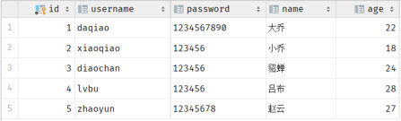
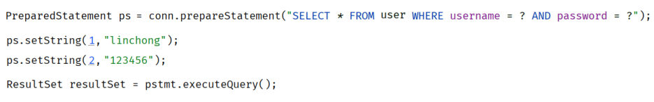

[上一篇](/posts/编程学习/javaweb学习笔记/49-jdbc入门/)把五个步骤跑通了，但执行的是 **DML**——`executeUpdate` 交回来的只有一个数字（影响行数）。如果换成**查询**（DQL），数据库交回来的可不是数字，而是"**一堆行**"，得我们自己把它取出来、装进对象里。

这一篇（PPT 第 9～13 页）干两件事：**① 怎么把查询结果取出来（ResultSet）**；**② 为什么参数不能拼进 SQL 字符串（预编译 SQL）**。第二件事是这一节的重头戏——它决定你的程序安不安全。

> [!IMPORTANT]
> 第 13 页是这一节的收尾问答页；再往后（第 15 页起）讲的就是 **MyBatis** 那一块了。也就是说，本篇是"直接玩 JDBC"的最后一块内容，后面 MyBatis 会把这些手工活全替你包掉——但**它包掉的东西正是这一篇讲的这些**。

## 查询数据：需求（PPT 第 9 页）

PPT 第 9 页给的需求：

> **需求：基于JDBC执行如下select语句，将查询结果封装到User对象中。**
> **SQL：`select * from user where username = 'daqiao' and password = '123456'`**

一句话拆成两半：**查**（这条 select 谁都会写，[46 篇](/posts/编程学习/javaweb学习笔记/46-dql基本查询与条件查询/)学过）和**装**（把查到的这一行，变成一个 `User` 对象）。

先看看要装的是什么数据：


*图：PPT 第 9 页配的 `user` 表数据截图——5 行记录，列是 id、username、password、name、age。"封装成 User 对象"就是把其中**一行的 5 个格子**，变成一个 `User` 对象的 5 个属性（PPT 这张老截图里 daqiao 的密码是 1234567890，课程资料 `user.txt` 和本机表里是 123456，只是同一张表的不同版本，不影响讲解）*

`User` 实体类长这样（课程 `jdbc-demo` 的 `com.itheima.pojo.User`，用 lombok 三个注解省掉 getter/setter/构造器/toString）：

```java
package com.itheima.pojo;

import lombok.AllArgsConstructor;
import lombok.Data;
import lombok.NoArgsConstructor;

@Data
@AllArgsConstructor
@NoArgsConstructor
public class User {
    private Integer id;
    private String username;
    private String password;
    private String name;
    private Integer age;
}
```

**为什么要有这个类？** 因为查出来的数据要往上一层传（[37 篇](/posts/编程学习/javaweb学习笔记/37-三层架构/)的 dao → service → controller 就是传对象/对象集合）。数据库里的一行是"散装的值"，进到 Java 世界先要变成一个对象，后面才好用——这一步就叫**封装**。

## ResultSet：结果集对象（PPT 第 9 页）

查询和增删改最大的区别在第 4 步：

| | DML（增删改） | DQL（查询） |
| --- | --- | --- |
| 第 4 步的方法 | `statement.executeUpdate(sql)` | `statement.executeQuery(sql)` |
| 返回什么 | **`int`**——影响的记录数 | **`ResultSet`**——结果集对象（装着查回来的那些行） |

PPT 第 9 页给的定义：

> **ResultSet（结果集对象）：`ResultSet rs = statement.executeQuery()`**

拿到结果集之后，靠两个方法把它"读"出来：

| 方法 | PPT 的解释 |
| --- | --- |
| **`next()`** | **将光标从当前位置向前移动一行，并判断当前行是否为有效行，返回值为 boolean**；`true` 表示有效行（当前行有数据）、`false` 表示无效行（当前行没有数据） |
| **`getXxx(...)`** | **获取数据，可以根据列的编号获取，也可以根据列名获取（推荐）** |

结果解析的步骤就写成这样（PPT 原文骨架）：

```java
while (resultSet.next()) {
    int id = resultSet.getInt("id");
    //...省略
}
```

把这一行"读全"，就是照着 `User` 的五个属性各取一次：

```java
//5. 解析结果集：next() 先往下走一行，getXxx() 再按列名把值取出来
while (resultSet.next()) {
    int id = resultSet.getInt("id");
    String username = resultSet.getString("username");
    String password = resultSet.getString("password");
    String name = resultSet.getString("name");
    int age = resultSet.getInt("age");
    User user = new User(id, username, password, name, age);
    System.out.println(user);
}
```

三件事要记牢：

1. **光标一开始停在"第一行之前"**——所以必须先 `next()` 才能读；`next()` 返回 `true` 说明"现在这一行有数据，可以读"，返回 `false` 说明没行了（循环结束）。这就是 `while (resultSet.next())` 能一行行读完的原因。
2. **`getXxx()` 的类型要和列的取值类型对得上**：整数列（`id`、`age`）用 `getInt`，字符串列（`username`、`password`、`name`）用 `getString`。列名写错会直接报错（不是返回空值）。
3. **取值推荐用列名，不要用列号**：列号虽然能写（`getInt(1)` 就是第一列），但它**从 1 开始数**、而且一旦表的列顺序调整了，所有列号都要跟着改；列名则一眼能看出取的是谁。PPT 那句"（推荐）"就是这个意思。

> [!TIP]
> **本机实测**（用户本机 MySQL 9.0.1，库 `web01`、表 `user`，工程为课程 `jdbc-demo`）——按上面的写法把 `daqiao` 查出来并封装，控制台输出：
>
> ```text
> User(id=1, username=daqiao, password=123456, name=大乔, age=22)
> ```
>
> 这行 `User(...)` 是 lombok 的 `@Data` 自动生成的 `toString`（`System.out.println(user)` 能打印得这么整齐就是它的功劳）。**一行记录 → 一个 User 对象**，值全对上了（`id=1`、`age=22`）。
>
> 说明：课程 `jdbc-demo` 的查询方法（`testSelect`）用的是**预编译版**的写法（下一节的主角），所以它顺便也验证了预编译能正常查到数据——**同样的输入，正确的账号密码，两种写法都能查到这 1 行**。

## 必答问答（PPT 第 10 页）

PPT 第 10 页把这一节的知识点收成两问：

| PPT 的问题 | 答案 |
| --- | --- |
| **JDBC程序执行DML语句? DQL语句?** | **DML 语句**用 **`int rowsAffected = statement.executeUpdate();`**（返回影响行数）；**DQL 语句**用 **`ResultSet rs = statement.executeQuery();`**（返回结果集） |
| **DQL语句执行完毕结果集ResultSet解析?** | 用 **`resultSet.next()`**——**光标往下移动一行**（并判断当前行是否有效行）；用 **`resultSet.getXxx()`**——**获取字段数据**（按列名或列号，推荐列名） |

拿[上一篇](/posts/编程学习/javaweb学习笔记/49-jdbc入门/)的五步对照一下，**只有第 3、4、5 步有变化**：

| 步骤 | DML（上一篇） | DQL（这一篇） |
| --- | --- | --- |
| 1. 注册驱动 | 一样 | 一样 |
| 2. 获取连接 | 一样 | 一样 |
| 3. 获取执行对象 | `createStatement()` | `createStatement()`（下一步就换掉它，见下一节） |
| 4. 执行 SQL | `executeUpdate(sql)` → `int` | **`executeQuery(sql)` → `ResultSet`**，**再多一步：while 循环把结果解析出来** |
| 5. 释放资源 | `statement.close(); connection.close();` | **多关一个 `resultSet.close()`**（先开的后关：`rs` → `statement` → `connection`） |

## 把它写成完整的一段：课程的 testSelect

入门程序里 `close` 是直接写在末尾的，中途抛异常就漏掉了。课程的查询程序换成了 **`try ... finally`**，把"关资源"放进 `finally` 里（**无论出不出异常都会执行**）：

```java
package com.itheima;

import com.itheima.pojo.User;
import org.junit.jupiter.api.Test;

import java.sql.*;

public class JdbcTest {

    @Test
    public void testSelect(){
        String URL = "jdbc:mysql://localhost:3306/web01";
        String USER = "root";
        String PASSWORD = "1234";

        Connection conn = null;
        PreparedStatement stmt = null;
        ResultSet rs = null; //封装查询返回的结果

        try {
            // 1. 注册 JDBC 驱动
            Class.forName("com.mysql.cj.jdbc.Driver");

            // 2. 打开链接
            conn = DriverManager.getConnection(URL, USER, PASSWORD);

            // 3. 执行查询
            String sql = "SELECT id, username, password, name, age FROM user WHERE username = ? AND password = ?"; //预编译SQL
            stmt = conn.prepareStatement(sql);

            stmt.setString(1, "daqiao");
            stmt.setString(2, "123456");

            rs = stmt.executeQuery();

            // 4. 处理结果集
            while (rs.next()) {
                User user = new User(
                        rs.getInt("id"),
                        rs.getString("username"),
                        rs.getString("password"),
                        rs.getString("name"),
                        rs.getInt("age")
                );
                System.out.println(user);
            }
        } catch (SQLException se) {
            se.printStackTrace();
        } catch (Exception e) {
            e.printStackTrace();
        } finally {
            // 5. 关闭资源
            try {
                if (rs != null) rs.close();
                if (stmt != null) stmt.close();
                if (conn != null) conn.close();
            } catch (SQLException se) {
                se.printStackTrace();
            }
        }
    }
}
```

几个写法要点：

- 三个对象**先声明成 `null`**（`conn`、`stmt`、`rs`），再在 `try` 里赋值——这样 `finally` 里能判断"有没有拿到过"（`if (rs != null)`）再决定关不关；
- `finally` 里**后开先关**：`rs` → `stmt` → `conn`（结果集挂在语句上、语句挂在连接上，反过来关会出问题）；
- **注意这段代码第 3 步用的是 `conn.prepareStatement(sql)`，SQL 里写的是 `?`**——不是[上一篇](/posts/编程学习/javaweb学习笔记/49-jdbc入门/)那个 `createStatement()` 拼字符串的写法。下面就是原因。

> [!WARNING]
> 课件示例里的用户名密码（`root` / `"1234"`）是示例值，动手时把 `password` 换成**你自己 MySQL 的密码**。

## 预编译 SQL：两种写法的对照（PPT 第 11 页）

PPT 第 11 页把两种写法并排放，这就是这一节的"岔路口"：

**1. 静态SQL（参数硬编码）**

```java
Statement statement = connection.createStatement();
int i = statement.executeUpdate("update user set age = 25 where id = 1");
System.out.println("SQL执行完毕, 影响的记录数为: " + i);
```

**2. 预编译SQL（参数动态传递）**

```java
PreparedStatement pstmt = conn.prepareStatement("SELECT * FROM user WHERE username = ? AND password = ?");
pstmt.setString(1, "daqiao");
pstmt.setString(2, "123456");
ResultSet resultSet = pstmt.executeQuery();
```

PPT 在第二种写法旁边只标了两个词，也正是预编译的**两大优势**：**安全**、**性能更高**。

对照着看差别：

| | 1. 静态 SQL（拼接） | 2. 预编译 SQL |
| --- | --- | --- |
| 拿执行对象 | `connection.createStatement()` | **`connection.prepareStatement(sql)`** |
| SQL 的形态 | 参数值**硬编码**在 SQL 字符串里（`where id = 1`） | 参数位置写 **`?` 占位符**（`where id = ?`） |
| 参数怎么给 | 拼进字符串（`"… = '" + username + "'"`） | **`setXxx(序号, 值)`**，如 `setString(1, "daqiao")` |
| 怎么执行 | `statement.executeUpdate(sql)` / `executeQuery(sql)`（**要再传一次 SQL**） | `pstmt.executeUpdate()` / `pstmt.executeQuery()`（**不用再传 SQL，参数已经给过了**） |
| 安全 | 有 **SQL 注入**风险 | **能防 SQL 注入** |
| 性能 | 每次都是一条"新语句"，要重新编译 | **编译一次、结果可缓存复用** |

`setXxx` 有几个必须养成习惯的细节：

- **序号从 1 开始**：第 1 个 `?` 是 `setString(1, …)`、第 2 个是 `setString(2, …)`——**不是从 0 开始**；
- **按参数类型挑方法**：字符串 `setString`、整数 `setInt`、小数 `setDouble`……给错了类型要么报错要么存错；
- **个数要对齐**：SQL 里有几个 `?`，就得 `set` 几次，少一个执行时直接报错。

## 优势一：防止 SQL 注入，更安全（PPT 第 12 页）

PPT 第 12 页给的定义：

> **SQL注入：通过控制输入来修改事先定义好的SQL语句，以达到执行代码对服务器进行攻击的方法。**

"通过控制输入"是什么意思？——**用户在输入框里填的东西，最后跑进了 SQL 语句里**。


*图：PPT 第 12 页配的那个后台管理系统登录页——帐号、密码两个输入框，点"登录"后后端就是拿这两个值去 `user` 表里查用户。这张页面上"帐号"和"密码"两个格子，就是攻击者能控制的全部输入*

### 直接把用户输入拼进 SQL，会出什么事

用 `Statement` 拼字符串的写法通常是这样的：

```java
// 危险写法：把参数直接拼进 SQL
String sql = "select id, username, password, name, age from user " +
             "where username = '" + username + "' and password = '" + password + "'";
ResultSet rs = statement.executeQuery(sql);
```

正常输入（daqiao / 123456）看上去一切正常。但如果有人在**用户名和密码里都填**：

```text
' or '1'='1
```

拼出来的 SQL 就变成了另一条语句——本机实测的对照结果如下。

> [!TIP]
> **本机实测**（用户本机 MySQL 9.0.1，库 `web01`、表 `user`，同一个登录查询分别用两种写法跑，输入都是 `' or '1'='1`）：
>
> **① `Statement` 拼接（有漏洞）**——打印出实际执行的 SQL：
>
> ```text
> 实际执行的 SQL：select id, username, password, name, age from user where username = '' or '1'='1' and password = '' or '1'='1'
>   查到：1 daqiao 大乔 22
>   查到：2 xiaoqiao 小乔 18
>   查到：3 diaochan 貂蝉 24
>   查到：4 lvbu 吕布 28
>   查到：5 zhaoyun 赵云 27
> 共 5 行
> ```
>
> **密码是错的，却把 5 条记录全查出来了——登录被绕过。**
>
> **② `PreparedStatement` 预编译（防住）**——同样的输入：
>
> ```text
> 实际执行的 SQL：select ... where username = ? and password = ? （参数：username=' or '1'='1 , password=' or '1'='1）
> 共 0 行
> ```
>
> **同样的输入、同样的表，一个查出 5 行、一个查出 0 行。** 而正常登录（daqiao / 123456）用哪种写法都还是 **1 行**——预编译不是"谁都不让进"，它只是**不认这段被伪装成语法结构的输入**。

### 拼字符串为什么会被打穿

关键在那条被拼出来的 SQL 上：

```sql
select id, username, password, name, age from user
where username = '' or '1'='1' and password = '' or '1'='1'
```

输入的 `' or '1'='1` 里的**第一个单引号，把原来那个字符串提前结束了**——本来 `username = '` 后面的内容是要填"用户名的值"的，结果提前收尾，`or '1'='1'` 就跑出来变成了**语法的一部分**。

再把这段条件按优先级拆开（SQL 里 **`and` 的优先级高于 `or`**）：

| 拆出来的三段 | 结果 |
| --- | --- |
| `username = ''` | 假（没有哪个用户的用户名是空串） |
| `'1'='1' and password = ''` | 假（`password = ''` 不成立） |
| **`'1'='1'`** | **恒为真** |

用 `or` 连起来：**只要有一段为真，整条条件就为真**——第三段 `'1'='1'` 永远为真，所以**每一行都符合条件**，5 条全被查出来。

> [!WARNING]
> 登录被绕过只是最轻的后果：**同一条口子，换成别的输入就是别人数据的泄露或破坏**。所以"把参数拼进 SQL"不是"写法不优雅"的问题，而是**安全问题**——这也是 PPT 把它排在预编译优势第一条的原因。

### 预编译为什么能防住

预编译的写法里，SQL 从一开始就是**带 `?` 的形状**：

```java
PreparedStatement pstmt = conn.prepareStatement(
        "select id, username, password, name, age from user where username = ? and password = ?");
pstmt.setString(1, "' or '1'='1");
pstmt.setString(2, "' or '1'='1");
ResultSet rs = pstmt.executeQuery();
```

区别在于：**这条语句在"编译"的时候，结构就已经定死了——`?` 的位置在数据库眼里"只能是一个值"，不是"一段可以当语法解析的文本"。** 所以 `setString` 给进去的 `' or '1'='1` 只会被当成一个**普通的字符串值**（就是"用户名等于这个奇怪字符串的人"），表里没有这样的用户 → 查出 **0 行**。

一句话记住这个区别：

> **静态 SQL 里，参数是"SQL 的一部分"；预编译 SQL 里，参数是"值"。**

> [!TIP]
> 课程资料里还有两个打包好的演示程序（`资料/02. SQL注入演示/sql_Injection_demo-0.0.1-SNAPSHOT.jar` 和 `sql_prepared_demo-0.0.1-SNAPSHOT.jar`），双击或 `java -jar` 就能跑课程版的注入演示——**上面本机实测那组数字，就是同一件事在自己的环境里复现出来的**。

## 优势二：性能更高（PPT 第 12 页）

PPT 第 12 页右边用三条 delete 对比了一把：

```sql
delete from user where id = 1;
delete from user where id = 2;
delete from user where id = 3;
```

```sql
delete from user where id = ? ;
```

三条静态 SQL 要**编译 3 次**，一条预编译 SQL 只要**编译 1 次**。PPT 画的那条流水线上写着这些环节：**执行SQL、编译SQL、优化SQL、SQL语法解析检查**，以及最后那格**缓存**：

```text
静态 SQL：三条语句长得都不一样，数据库眼里是三条"新语句"
delete from user where id = 1;  ─┐
delete from user where id = 2;  ─┼─▶ 语法解析检查 → 编译SQL → 优化SQL → 执行SQL
delete from user where id = 3;  ─┘        每一条都要走一遍：编译 3 次

预编译 SQL：语句结构只有一条，变的只是参数
delete from user where id = ?;  ───▶ 语法解析检查 → 编译SQL → 优化SQL → 缓存
                                                              │
                                         执行时把参数填进去：1 / 2 / 3     编译 1 次
```

道理说穿了很简单：**静态 SQL 每次参数一变就是一条"新语句"**（`id = 1` 和 `id = 2` 在数据库看来是两个不同的字符串），数据库得重新做语法解析、重新优化、重新生成执行计划；**预编译 SQL 的结构是固定的**，编译一次之后把结果放到缓存里，后面同样结构只换参数——**省下的就是重复编译的那部分开销**。

> [!IMPORTANT]
> 这个优势有前提：**同一条预编译 SQL 被反复执行**（参数不同）。项目里"一条 SQL 被无数请求复用"是常态，所以这个优化在大并发下特别值钱；但如果你只是随手执行一条语句，是看不出差别的——**预编译最不能省的还是"安全"那一条**。

## 必答问答（PPT 第 13 页）

PPT 第 13 页把这一节收成两问：

| PPT 的问题 | 答案 |
| --- | --- |
| **如何执行预编译 SQL ？** | 三步：① `conn.prepareStatement("… where username = ? and password = ?")` 拿到 `PreparedStatement`（SQL 里用 `?` 占位）；② `pstmt.setString(1, "daqiao")`、`pstmt.setString(2, "123456")` 按序号逐个给参数（**从 1 开始**）；③ `pstmt.executeQuery()`（查询）或 `pstmt.executeUpdate()`（增删改）——**不用再传 SQL** |
| **为什么要使用预编译 SQL ？** | 两个原因：**安全（防止 SQL 注入）**、**性能更高**（语句结构只编译一次，编译结果可缓存复用） |


*图：PPT 第 13 页配的"执行预编译 SQL"代码——`conn.prepareStatement(...)` 里 SQL 带着两个 `?`，接着两次 `setString` 按序号把值填进去，最后 `executeQuery()` 拿结果集。截图里填的用户名是 linchong（PPT 的旧版截图），换成 daqiao 就是本篇实测里那条查询，写法完全一样*

## AI 辅助：让 AI 写这段查询代码（PPT 第 9 页的"AI 辅助"标记）

PPT 第 9 页的角落里标着"（AI辅助）"——这节课的查询代码，是让 AI 帮忙生成的。课程资料里给的提示词（`资料/prompt.txt`）原文是：

```text
你是一名java开发工程师，帮我基于JDBC程序来操作数据库，执行如下SQL语句：select id,username,password,name,age from user  where username = 'daqiao' and password = '123456';
并将查询的每一行记录，都封装到实体类User中，然后将User对象的数据输出到控制台中。
User 实体类属性如下：
@Data
@NoArgsConstructor
@AllArgsConstructor
public class User {
    private Integer id; //ID
    private String username; //用户名
    private String password; //密码
    private String name; //姓名
    private Integer age; //年龄
}
```

这段提示词好用的地方，正好是写提示词该抄的五件事：

| 提示词里给的 | 为什么必须给 |
| --- | --- |
| **角色**（你是一名 java 开发工程师） | 让回答站在"写工程代码"的角度，而不是教学口吻 |
| **技术选型**（基于 JDBC 程序） | 不说清，AI 可能用 MyBatis、JPA 或别的东西给你写 |
| **要执行的 SQL**（完整贴出来） | 表名、列名、条件都定死，AI 不会猜表结构 |
| **结果处理要求**（每行封装成 User、输出到控制台） | 明确"输出成什么形态"，不然可能只给你一个 `ResultSet` 就结束 |
| **实体类的结构**（属性名 + 类型 + lombok 注解） | **最关键的一项**——属性名对不上，`rs.getXxx("...")` 就会取错或报错 |

拿到 AI 生成的代码后，**别直接信、更别直接跑**，逐项核对：

1. **表名、列名**与你的库是否一致（`user` 表、5 个字段）；
2. **驱动类名**（`com.mysql.cj.jdbc.Driver`）与 **pom 里的驱动版本**是否能对上（8.x 的类名带 `cj`）；
3. **URL、用户名、密码**有没有换成你自己的（AI 不知道你本机的密码）；
4. **资源关了没有**：`ResultSet`、`Statement`（或 `PreparedStatement`）、`Connection` 三个都要关，最好在 `finally` 或 try-with-resources 里关；
5. **用的是 `Statement` 还是 `PreparedStatement`**——如果 SQL 里带参数却是拼字符串，就要按这一篇讲的换成预编译；
6. **返回值/封装对象**对不对：查询要返回 `User` 或 `List<User>`，而不是把结果集直接抛出去。

最后一条也是最重要的：**让 AI 顺手讲一遍"为什么这么写"**，再自己跑一遍验证。这一步能过，说明你真的看懂了；看不懂又跑不通的地方，多半就是你还没掌握的那个知识点。

## 小结

| 问题 | 答案 |
| --- | --- |
| 查询在第 4 步换成什么 | **`ResultSet rs = statement.executeQuery(sql);`**（返回结果集对象，不是影响行数） |
| 结果集怎么解析 | **`next()`**——光标向下移动一行并判断当前行是否有效行（返回 `boolean`，`true` 才有数据）；**`getXxx(...)`**——取字段数据，**按列名或列号（推荐列名）** |
| 解析的标准写法 | `while (resultSet.next()) { … }` 里逐个 `getInt("id")` / `getString("username")` …，再 `new User(...)` 封装成对象打印 |
| DML 与 DQL 的方法对照 | DML → **`int rowsAffected = statement.executeUpdate();`**；DQL → **`ResultSet rs = statement.executeQuery();`** |
| 五步里查询版的变化 | 第 3 步拿执行对象（下一篇换成 `prepareStatement`）、第 4 步用 `executeQuery` **并多一步解析结果集**、第 5 步**多关一个 `ResultSet`**（`rs` → `stmt` → `conn`，后开先关） |
| 实测查询输出 | `User(id=1, username=daqiao, password=123456, name=大乔, age=22)` |
| 两种 SQL 写法 | **静态 SQL**：`createStatement()` + 参数硬编码/拼接；**预编译 SQL**：`prepareStatement()` + `?` 占位符 + `setXxx(序号, 值)`（**序号从 1 开始**）+ `executeQuery()` / `executeUpdate()`（不再传 SQL） |
| SQL 注入是什么 | **通过控制输入来修改事先定义好的 SQL 语句，以达到执行代码对服务器进行攻击的方法**（PPT 原文） |
| 注入实测对照 | 同样的输入 `' or '1'='1`：**拼接写法查出 5 行**（密码是错的也把全表查出来了）；**预编译写法 0 行**；正常登录两种写法都是 **1 行** |
| 预编译为什么能防注入 | 预编译后**语句结构已定死**，`?` 只能填"一个值"；参数里的引号/`or` 只是这个**值的字符**，不会变成语法 → 参数是"值"，不是"SQL 的一部分" |
| 预编译为什么性能更高 | 静态 SQL 参数一变就是"新语句"，要重新解析、优化、编译；预编译 SQL 结构固定，**编译 1 次**（三条 delete 的对比：3 次 vs 1 次），结果可缓存复用——前提是这条 SQL 被重复执行 |

## 相关

- [上一篇：JDBC入门](/posts/编程学习/javaweb学习笔记/49-jdbc入门/)
- [下一篇：MyBatis入门与辅助配置](/posts/编程学习/javaweb学习笔记/51-mybatis入门与辅助配置/)

## 练习题

### 一、知识回顾（读完直接做下面的实践题）

1. **查询和增删改在第 4 步的分岔**：DML 用 **`executeUpdate(sql)`**（返回 `int` 影响行数）；DQL 用 **`executeQuery(sql)`**（返回 **`ResultSet`** 结果集对象）
2. **`next()` 的作用**：把光标**从当前位置向前移动一行**，并**判断当前行是否为有效行**，返回值 `boolean`——`true` 是有效行（当前行有数据）、`false` 是无效行；所以配 `while (resultSet.next())` 能一行行读完
3. **`getXxx()` 的作用与取值方式**：获取字段数据，可以按**列的编号**（从 1 开始）取，也可以按**列名**取，**推荐列名**（可读、表的列顺序变了也不受影响）
4. **解析结果集的完整写法**：`while (resultSet.next()) { int id = resultSet.getInt("id"); String username = resultSet.getString("username"); … User user = new User(id, username, password, name, age); System.out.println(user); }`——**注意类型要对**（整数列 `getInt`、字符串列 `getString`）
5. **实测查询输出**：`User(id=1, username=daqiao, password=123456, name=大乔, age=22)`（lombok 的 `@Data` 自动生成的 `toString`）
6. **PPT 第 10 页两问**：DML 语句 → `int rowsAffected = statement.executeUpdate();`；DQL 语句 → `ResultSet rs = statement.executeQuery();`；结果集解析 → `resultSet.next()`（光标往下移动一行）+ `resultSet.getXxx()`（获取字段数据）
7. **资源释放**：查询版要多关一个 **`ResultSet`**，顺序是 **`rs` → `statement` → `connection`**（后开先关）；课程用 **`try ... finally`**，三个对象先声明为 `null`、`finally` 里判断非空再关
8. **两种 SQL 的写法对照**：静态 SQL 用 `connection.createStatement()`，参数硬编码/拼进字符串，执行时还要传 SQL；预编译 SQL 用 **`connection.prepareStatement(sql)`**，SQL 里用 **`?` 占位符**，用 **`setXxx(序号, 值)`** 给参数（**序号从 1 开始**、类型要匹配、个数要对齐），执行时**不用再传 SQL**
9. **SQL 注入的定义与实测**：**通过控制输入来修改事先定义好的 SQL 语句，以达到执行代码对服务器进行攻击的方法**；实测同样输入 `' or '1'='1`——**拼接写法查出 5 行**（密码错误却全表被查出，登录绕过）、**预编译写法 0 行**、正常登录（daqiao/123456）两种写法都是 **1 行**
10. **预编译的两大优势与原因**：**安全**——语句结构已定死，`?` 只能填"一个值"，参数里的引号/`or` 不会变成语法（参数是"值"，不是"SQL 的一部分"）；**性能更高**——静态 SQL 每次都是新语句（三条 delete 要编译 3 次），预编译 SQL 结构固定**只编译 1 次**、结果可缓存复用（前提是同一条 SQL 被重复执行）

### 二、裸写题

- [ ] **2-1 查出 daqiao 的信息，封装成 User 对象打印**
  需求：写一个程序连上 `web01` 库，把 `user` 表里**用户名是 `daqiao`、密码是 `123456`** 的那条记录查出来，**封装成一个对象**并打印到控制台（打印出来应该是一行 `User(...)` 的样子）。
  要求：查出来的每一个字段都要**按列名**取值；方法里最后**把三个资源都关掉**；写完后在文件末尾回答：① 为什么这里取值推荐用列名而不是列号？② 这条 SQL 最终只查到了几行，`while` 循环里的代码执行了几次？
  （练习文件 `test_50_查询封装User.java` 里给了题目注释、表结构、`User` 实体类和写作区。）

  > [!TIP]- 提示（先自己想，实在想不出再点开）
  > **一级 · 思路**：五步不变，只有第 4 步换成"查询 + 解析"——先拿到结果集，再让光标往下走一行、把这一行的值一格一格取出来装进对象
  > **二级 · 方法**：`statement.executeQuery(sql)` 返回 `ResultSet`；用 `resultSet.next()` 判断有没有数据，用 `resultSet.getInt("id")` / `resultSet.getString("username")` 取字段；最后 `rs.close()`、`statement.close()`、`connection.close()`（仍然可以先用 `Statement` + SQL 里写死参数，下一题再换预编译）
  > **三级 · 骨架**：`ResultSet rs = statement.____("select id, username, password, name, age from user where username = 'daqiao' and password = '123456'"); while (rs.____()) { User user = new User(rs.____("id"), rs.____("username"), rs.____("password"), rs.____("name"), rs.____("age")); System.out.println(user); }`

  > [!TIP]- 参考答案（做完再点开）
  > ```java
  > package com.itheima;
  >
  > import com.itheima.pojo.User;
  > import org.junit.jupiter.api.Test;
  >
  > import java.sql.*;
  >
  > public class JdbcQueryTest {
  >
  >     @Test
  >     public void testSelect() throws Exception {
  >         //1. 注册驱动
  >         Class.forName("com.mysql.cj.jdbc.Driver");
  >         //2. 获取连接
  >         Connection conn = DriverManager.getConnection(
  >                 "jdbc:mysql://localhost:3306/web01", "root", "1234"); // 密码换成你自己的
  >         //3. 获取SQL语句执行对象
  >         Statement statement = conn.createStatement();
  >         //4. 执行SQL（DQL：executeQuery 返回结果集）
  >         ResultSet rs = statement.executeQuery(
  >                 "select id, username, password, name, age from user where username = 'daqiao' and password = '123456'");
  >         //5. 解析结果集：先 next() 往下走一行，再按列名取值封装
  >         while (rs.next()) {
  >             User user = new User(
  >                     rs.getInt("id"),
  >                     rs.getString("username"),
  >                     rs.getString("password"),
  >                     rs.getString("name"),
  >                     rs.getInt("age"));
  >             System.out.println(user);
  >         }
  >         //6. 释放资源（后开先关）
  >         rs.close();
  >         statement.close();
  >         conn.close();
  >     }
  > }
  > ```
  > 本机实测控制台输出：
  > ```text
  > User(id=1, username=daqiao, password=123456, name=大乔, age=22)
  > ```
  > 两问两答：① **按列名取值可读性最好，而且抗改动**——表的列顺序调整了、或者中间插了新列，列名不用改；用列号则要重新数一遍（而且列号**从 1 开始**，很容易数错一格）；② 条件命中 1 行，所以 `while` 里的代码执行了 **1 次**，打印出 1 行 `User(...)`；如果没有命中的行，`next()` 第一次就返回 `false`，循环体一次都不会执行（**不报错**）。

- [ ] **2-2 把符合条件的多行都查出来，装成一个集合打印**
  需求：查出 `user` 表里**年龄大于 20** 的所有用户，把每一条都封装成对象、放进一个**集合**里，最后把集合打印出来。
  要求：用**循环**解析结果集（不要只取第一行）；打印时能看出集合里有几条数据；跑完回答：如果一条都没查到，这个集合里应该是什么？
  （练习文件 `test_50_查询用户列表.java` 里给了题目注释、表结构、`User` 实体类和写作区。）

  > [!TIP]- 提示（先自己想，实在想不出再点开）
  > **一级 · 思路**：和上一题的差别就在"要装的不止一个对象"——所以要准备一个能装多个对象的容器，每读到一行就往里放一个
  > **二级 · 方法**：`List<User> userList = new ArrayList<>();`，循环里 `userList.add(user)`；结果集还是 `while (resultSet.next())` 一行行读；条件写在 SQL 的 `where age > 20` 里
  > **三级 · 骨架**：`List<User> userList = new ____<>(); ResultSet rs = statement.____("select * from user where age > 20"); while (rs.next()) { User user = new User(…); userList.____(user); } System.out.println(userList); System.out.println("共 " + userList.size() + " 条");`

  > [!TIP]- 参考答案（做完再点开）
  > ```java
  > package com.itheima;
  >
  > import com.itheima.pojo.User;
  > import org.junit.jupiter.api.Test;
  >
  > import java.sql.*;
  > import java.util.ArrayList;
  > import java.util.List;
  >
  > public class JdbcQueryListTest {
  >
  >     @Test
  >     public void testSelectList() throws Exception {
  >         Class.forName("com.mysql.cj.jdbc.Driver");
  >         Connection conn = DriverManager.getConnection(
  >                 "jdbc:mysql://localhost:3306/web01", "root", "1234"); // 密码换成你自己的
  >         Statement statement = conn.createStatement();
  >
  >         // 查询：年龄大于 20 的用户
  >         ResultSet rs = statement.executeQuery("select id, username, password, name, age from user where age > 20");
  >
  >         // 每读到一行就封装一个对象，放进集合
  >         List<User> userList = new ArrayList<>();
  >         while (rs.next()) {
  >             userList.add(new User(
  >                     rs.getInt("id"),
  >                     rs.getString("username"),
  >                     rs.getString("password"),
  >                     rs.getString("name"),
  >                     rs.getInt("age")));
  >         }
  >         System.out.println(userList);
  >         System.out.println("共 " + userList.size() + " 条");
  >
  >         rs.close();
  >         statement.close();
  >         conn.close();
  >     }
  > }
  > ```
  > 按课程资料 `user.txt` 那张表的数据算一遍：5 条里年龄大于 20 的是 daqiao(22)、diaochan(24)、lvbu(28)、zhaoyun(27)，所以会输出 **4 个 `User(...)`** 和一句 `共 4 条`——循环体执行了 4 次。
  > 第三问的答案：**集合是一个空集合（`size()` 为 0），打印出来是 `[]`**——没查到数据是正常情况，不是错误；要判断"有没有查到"，看 `userList.isEmpty()` 或 `size()` 就行，千万别拿 `null` 当"没查到"（空集合和 `null` 是两件事）。

- [ ] **2-3 把一个能被人钻空子的登录查询改成预编译**
  下面这段代码是某个登录功能的核心：用户在登录页填的帐号密码，被直接拼进了 SQL。请把它**改成预编译写法**，并在文件末尾回答：① 攻击者填 `' or '1'='1` 时，原来的写法为什么会把整张表都查出来？② 改完之后同样的输入为什么查不到东西？

  ```java
  // 原来的写法（危险）
  String username = "daqiao";      // 实际上来自登录页的输入
  String password = "123456";      // 实际上来自登录页的输入
  String sql = "select id, username, password, name, age from user where username = '" + username + "' and password = '" + password + "'";
  Statement statement = connection.createStatement();
  ResultSet rs = statement.executeQuery(sql);
  ```

  要求：参数位置一个都不许再拼字符串；`setXxx` 的序号和类型都写对；执行时不再传 SQL。
  （练习文件 `test_50_预编译查询.java` 里给了题目注释和写作区。）

  > [!TIP]- 提示（先自己想，实在想不出再点开）
  > **一级 · 思路**：把"会变的两个值"从 SQL 里拿出去，SQL 里给它们留两个空位；值改从"填空"的方式给进去
  > **二级 · 方法**：`connection.prepareStatement("… = ? and … = ?")`；两个参数用 `setString(1, username)`、`setString(2, password)`（**从 1 开始**）；执行用 `pstmt.executeQuery()`（**不传 SQL**）
  > **三级 · 骨架**：`PreparedStatement pstmt = conn.____("select id, username, password, name, age from user where username = ? and password = ?"); pstmt.____(1, username); pstmt.____(2, password); ResultSet rs = pstmt.____();`

  > [!TIP]- 参考答案（做完再点开）
  > ```java
  > // 改完：预编译写法
  > String sql = "select id, username, password, name, age from user where username = ? and password = ?";
  > PreparedStatement pstmt = conn.prepareStatement(sql);
  > pstmt.setString(1, username);   // 第 1 个 ? —— 序号从 1 开始
  > pstmt.setString(2, password);   // 第 2 个 ?
  > ResultSet rs = pstmt.executeQuery();   // 注意：不用再传 SQL
  > ```
  > 两问两答：
  > ① 原来的写法把用户输入**当成 SQL 文本的一部分**——`' or '1'='1` 里开头的单引号把用户名那个字符串**提前闭合**，后面的 `or '1'='1'` 就变成了真正的 SQL 语法。本机实测这条拼出来的 SQL 是 `… where username = '' or '1'='1' and password = '' or '1'='1'`：`and` 比 `or` 先算，条件被切成三段，最后一段 `'1'='1'` **恒为真**，用 `or` 连起来整条条件就恒真——**5 行全被查出来，密码填错也能"登录成功"**。
  > ② 预编译时 SQL 的结构（哪里是列、哪里是值）**已经定死**，`?` 的位置只能填"一个值"。`setString` 把 `' or '1'='1` 当作**普通的字符串值**传进去（它就是"用户名等于这串字符的人"），表里没有这样的用户名 → 查出 **0 行**。一句话：**静态 SQL 里参数是"SQL 的一部分"，预编译 SQL 里参数是"值"。**

- [ ] **2-4 找错：这份预编译代码写不对**
  同学想用预编译查 `daqiao` 的登录信息，代码如下。请指出**每一处**问题并给出改正后的写法：

  ```java
  PreparedStatement pstmt = connection.prepareStatement("select * from user where username = ? and password = ?");
  pstmt.setString(0, "daqiao");
  pstmt.setInt(2, 123456);
  ResultSet rs = pstmt.executeUpdate();
  ```

  要求：把每处问题的"哪里错、会发生什么"写清楚，再写出改好的完整代码（连资源释放一起写）。
  （练习文件 `test_50_预编译排错.java` 里给了题目注释和写作区。）

  > [!TIP]- 提示（先自己想，实在想不出再点开）
  > **一级 · 思路**：从"序号、类型、执行方法、收尾"四个角度逐个检查——预编译的坑几乎都在这四处
  > **二级 · 方法**：`setXxx` 的序号**从 1 开始**（第 1 个 `?` 是 1）；参数是字符串就用 `setString`（密码列是 `varchar`，写 `123456` 也要当字符串）；查询要用 `executeQuery()` 拿结果集（`executeUpdate()` 是给 DML 用的）；`PreparedStatement`、`ResultSet`、`Connection` 都要关
  > **三级 · 骨架**：`pstmt.____(1, "daqiao"); pstmt.____(2, "123456"); ResultSet rs = pstmt.____(); … rs.close(); pstmt.close(); connection.close();`

  > [!TIP]- 参考答案（做完再点开）
  > 四处问题：
  > 1. **序号从 0 开始写了**：`pstmt.setString(0, …)` 是错的——**`?` 的序号从 1 开始**，第 1 个 `?` 要写 `setString(1, …)`；写 0 运行时会报"参数索引超出范围"这类错误；
  > 2. **类型给错了**：密码列是 `varchar(32)`（字符串），要用 `setString(2, "123456")`；`setInt(2, 123456)` 既把序号跳到了 2（第 1 个 `?` 没赋值），又给了个数字类型，执行时不是报错就是查不到；
  > 3. **执行方法用错了**：查询（DQL）要用 **`executeQuery()`** 拿 `ResultSet`；`executeUpdate()` 是给增删改用的（返回影响行数），用它接 `ResultSet` 直接编译不过；
  > 4. **资源没关**：`ResultSet`、`PreparedStatement`、`Connection` 三个都没关（后开先关）。
  > 
  > 改好的完整代码：
  > ```java
  > package com.itheima;
  >
  > import org.junit.jupiter.api.Test;
  >
  > import java.sql.*;
  >
  > public class JdbcPreparedTest {
  >
  >     @Test
  >     public void testPrepared() throws Exception {
  >         Class.forName("com.mysql.cj.jdbc.Driver");
  >         Connection connection = DriverManager.getConnection(
  >                 "jdbc:mysql://localhost:3306/web01", "root", "1234"); // 密码换成你自己的
  >
  >         // SQL 里只用 ? 占位，参数不拼字符串
  >         String sql = "select id, username, password, name, age from user where username = ? and password = ?";
  >         PreparedStatement pstmt = connection.prepareStatement(sql);
  >
  >         pstmt.setString(1, "daqiao");    // 第 1 个 ?（序号从 1 开始）
  >         pstmt.setString(2, "123456");    // 第 2 个 ?（字符串列用 setString）
  >
  >         ResultSet rs = pstmt.executeQuery();   // 查询用 executeQuery
  >         while (rs.next()) {
  >             System.out.println(rs.getInt("id") + " " + rs.getString("username")
  >                     + " " + rs.getString("name") + " " + rs.getInt("age"));
  >         }
  >
  >         // 资源释放：后开先关
  >         rs.close();
  >         pstmt.close();
  >         connection.close();
  >     }
  > }
  > ```
  > 本机实测输出：`1 daqiao 大乔 22`（正常登录那种情况，两种写法都是这一行）。
  > 记一条口诀：**序号从 1、类型要对、查询用 executeQuery、三个资源都要关**。

### 三、综合题

- [ ] **3-1 亲手把 SQL 注入实验做一遍（两种写法对照）**
  这是这一节最有说服力的一次实验：**同一个登录查询，分别用"拼字符串"和"预编译"两种写法跑，输入同一段攻击字符串，对比结果。**
  1. **准备**：写一个测试类，写好一个"连接数据库"的公共方法（或者像本机实测那样写成两个私有方法，一个 `Statement` 版、一个 `PreparedStatement` 版），都针对 `web01.user` 表做登录查询 `select id, username, password, name, age from user where username = ? and password = ?` 这件事；
  2. **跑正常登录**：输入 `daqiao` / `123456`，两种写法各跑一次，记下各自查到几行；
  3. **跑攻击输入**：输入都改成 `' or '1'='1`，再各跑一次——**在拼接写法里把拼出来的 SQL 也打印出来**（这是理解漏洞的关键），记下各自查到几行、查到了哪些记录；
  4. **解释漏洞**：对着第 3 步打印出来的 SQL，说明那段输入是怎么"改写"成 SQL 语法的一部分的（提示：注意单引号的位置，以及 `and` 和 `or` 谁先算）；
  5. **解释防线**：说明预编译写法为什么同样的输入查不到东西（提示：`?` 的位置只能是什么）；
  6. **收尾回答**：这次实验里，**哪一条写法的输出说明"密码错了也能登录成功"**？如果以后你觉得"这个参数反正不会有人乱填"，请用这次实验的结果反驳一下自己；
  7. **拓展记账**：把预编译的两大优势各写一句话（安全、性能），并说明"性能更高"成立的前提是什么。
  （练习文件 `test_50_综合_SQL注入实验.java` 里按上面的步骤给了写作区。）

  **涉及知识点**

  | 知识点 | 在这里的应用 |
  | --- | --- |
  | 五步流程 | 第 1 步——两种写法都要注册驱动、获取连接、关资源 |
  | `executeQuery` + `ResultSet` | 第 1～3 步——每查到一行都封装成对象并打印 |
  | 静态 SQL 拼接 | 第 2、3 步——把参数拼进 SQL 字符串（要能看见拼好的 SQL） |
  | SQL 注入 | 第 3、4 步——`' or '1'='1` 让条件恒真，5 行全被查出 |
  | 预编译 SQL | 第 3、5 步——`?` 占位符 + `setXxx`，同样输入查出 0 行 |
  | 运算符优先级 | 第 4 步——`and` 先算、`or` 后算，所以整条条件为真 |
  | 两大优势 | 第 7 步——安全（防注入）+ 性能更高（结构编译 1 次可复用） |

  > [!TIP]- 提示（先自己想，实在想不出再点开）
  > **一级 · 思路**：这一题不比写代码，比"设计对照实验"——同一张表、同一条查询、同一个输入，只让"写法"这一个变量不同；抓证据的方式是把**实际执行的 SQL** 打印出来
  > **二级 · 方法**：拼接版 `String sql = "… where username = '" + username + "' and password = '" + password + "'";` 再 `statement.executeQuery(sql)`；预编译版 `connection.prepareStatement("… = ? and … = ?")` + 两次 `setString`；两种写法各自记行数
  > **三级 · 骨架**：`queryByStatement("' or '1'='1", "' or '1'='1");` / `queryByPrepared("' or '1'='1", "' or '1'='1");`，每个方法里 `while (rs.next()) { rows++; … }` 最后打印 `共 X 行`

  > [!TIP]- 参考答案（做完再点开）
  > 参考实现（**本机实测就是照这个思路跑的**）：两个方法都接收 `username` / `password` 参数，一个用 `Statement` 拼接、一个用 `PreparedStatement` 预编译，各自统计行数并打印。
  >
  > ```java
  > package com.itheima;
  >
  > import java.sql.*;
  >
  > public class InjectionTest {
  >
  >     private static final String URL = "jdbc:mysql://localhost:3306/web01";
  >     private static final String USER = "root";
  >     private static final String PASSWORD = "1234";   // 换成你自己 MySQL 的密码
  >
  >     // 写法一：Statement 拼接（有漏洞）
  >     private void queryByStatement(String username, String password) throws Exception {
  >         Class.forName("com.mysql.cj.jdbc.Driver");
  >         try (Connection conn = DriverManager.getConnection(URL, USER, PASSWORD);
  >              Statement stmt = conn.createStatement()) {
  >             String sql = "select id, username, password, name, age from user where username = '"
  >                     + username + "' and password = '" + password + "'";
  >             System.out.println("实际执行的 SQL：" + sql);
  >             ResultSet rs = stmt.executeQuery(sql);
  >             int rows = 0;
  >             while (rs.next()) {
  >                 rows++;
  >                 System.out.println("  查到：" + rs.getInt("id") + " " + rs.getString("username")
  >                         + " " + rs.getString("name") + " " + rs.getInt("age"));
  >             }
  >             System.out.println("共 " + rows + " 行");
  >             rs.close();
  >         }
  >     }
  >
  >     // 写法二：PreparedStatement 预编译（防住）
  >     private void queryByPrepared(String username, String password) throws Exception {
  >         Class.forName("com.mysql.cj.jdbc.Driver");
  >         try (Connection conn = DriverManager.getConnection(URL, USER, PASSWORD);
  >              PreparedStatement pstmt = conn.prepareStatement(
  >                      "select id, username, password, name, age from user where username = ? and password = ?")) {
  >             pstmt.setString(1, username);
  >             pstmt.setString(2, password);
  >             System.out.println("实际执行的 SQL：select ... where username = ? and password = ? （参数：username="
  >                     + username + " , password=" + password + "）");
  >             ResultSet rs = pstmt.executeQuery();
  >             int rows = 0;
  >             while (rs.next()) {
  >                 rows++;
  >                 System.out.println("  查到：" + rs.getInt("id") + " " + rs.getString("username")
  >                         + " " + rs.getString("name") + " " + rs.getInt("age"));
  >             }
  >             System.out.println("共 " + rows + " 行");
  >             rs.close();
  >         }
  >     }
  > }
  > ```
  > 2~3. **本机实测结果**（用户本机 MySQL 9.0.1，库 `web01`、表 `user`）：
  > - **正常登录（daqiao / 123456）**：拼接写法 **1 行**、预编译写法 **1 行**（输出 `1 daqiao 大乔 22`）；
  > - **攻击输入（两边都填 `' or '1'='1`）**：
  >   ```text
  >   # Statement 拼接
  >   实际执行的 SQL：select id, username, password, name, age from user where username = '' or '1'='1' and password = '' or '1'='1'
  >     查到：1 daqiao 大乔 22
  >     查到：2 xiaoqiao 小乔 18
  >     查到：3 diaochan 貂蝉 24
  >     查到：4 lvbu 吕布 28
  >     查到：5 zhaoyun 赵云 27
  >   共 5 行
  >
  >   # PreparedStatement 预编译
  >   实际执行的 SQL：select ... where username = ? and password = ? （参数：username=' or '1'='1 , password=' or '1'='1）
  >   共 0 行
  >   ```
  > 4. 漏洞解释：输入的 `' or '1'='1` **开头的单引号把 `username = '` 这个字符串提前闭合**，后面的 `or '1'='1'` 脱离了"值"的身份、变成**真正的 SQL 语法**。拼出来的条件是 `username = '' or '1'='1' and password = '' or '1'='1'`——按优先级先算 `and`，条件被切成三段（`username = ''`、`'1'='1' and password = ''`、`'1'='1'`），**最后一段恒为真**，再用 `or` 一连，整条条件恒真 → **每一行都符合条件，5 行全被查出来**。
  > 5. 防线解释：预编译把**语句结构固定死了**——`?` 的位置只能填"一个值"，驱动把参数当**纯字符串值**交给数据库，即使值里带着引号和 `or`，也只是这个字符串的字符，不会升级成语法。所以 `' or '1'='1` 被当成"用户名等于这一串字符"，表里没有 → **0 行**。
  > 6. 第 5 条输出（`共 5 行` 那一次）就是"**密码是错的，却把 5 条全查出来**"——也就是密码校验被整个跳过了。所以"参数是内部用的、不会有人乱填"这种想法站不住脚：**只要有一个输入口通向 SQL 字符串，那个口子就是入口**。
  > 7. 两大优势各一句话：**安全**——预编译的参数只能当"值"，从根上堵住 SQL 注入；**性能更高**——预编译 SQL 的语句结构只需要编译一次、编译结果可缓存复用，而同一条语句如果用拼接写法，参数一变就是一条"新语句"，每次都要重新解析、优化、编译（PPT 那三条 delete：3 次 vs 1 次）。性能优势的**前提是"同一条 SQL 被反复执行"**（参数不同），项目里一条 SQL 被大量请求复用正是常态。
