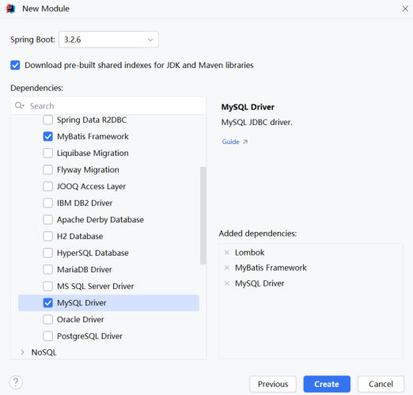
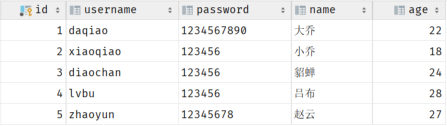
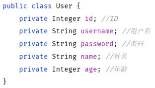
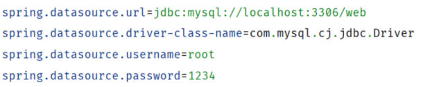
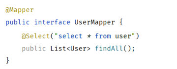
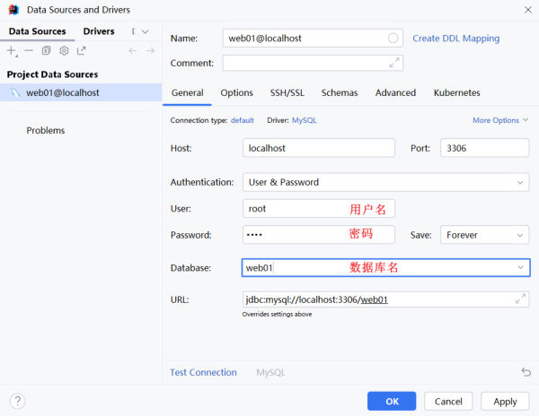
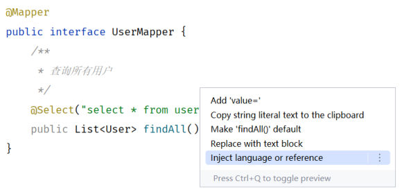

[50 篇](/posts/编程学习/javaweb学习笔记/50-jdbc查询与预编译sql/)把 JDBC 的两件大事讲完了——**五步走完一次数据库操作**、**用预编译 SQL 防住注入**。但真要写业务代码，JDBC 那套还是得自己一段段拼：注册驱动、拿连接、写 SQL、解析 `ResultSet`、关资源……这一篇开始进入第 6 章的**下半场**，认识那个专门来收拾这套繁琐流程的框架：**MyBatis**。

本篇对应 PPT 第 14-21 页，做三件事：

1. 说清 **MyBatis 是什么**、它在三层架构里站在哪一格（第 15 页）；
2. 把 **MyBatis 入门程序**从零走一遍，并用单元测试跑通（第 17-18 页）；
3. 配好两项 **辅助配置**——让 IDEA 认识你写的 SQL、把 MyBatis 的执行日志打出来（第 19-21 页）。

本机实测环境：MySQL **9.0.1**（课程用的是 8.0.34），库 `web01`、表 `user`（5 条数据：daqiao/大乔、xiaoqiao/小乔、diaochan/貂蝉、lvbu/吕布、zhaoyun/赵云）。笔记里标"本机实测"的输出都是真跑出来的。

> [!WARNING]
> 笔记里的连接信息沿用课程原样（库名 `web01`、用户名 `root`、`password=1234`）。**实际动手时把 `password` 换成你自己 MySQL 的密码**，否则连不上数据库。

## 这一节要走的路线（PPT 第 14、16 页）

PPT 第 14 页是一张只有两个词的分隔页：**JDBC**、**MyBatis**。它把第 6 章劈成了上下两半——上半场（[49](/posts/编程学习/javaweb学习笔记/49-jdbc入门/)、[50 篇](/posts/编程学习/javaweb学习笔记/50-jdbc查询与预编译sql/)）用原生 JDBC 把"Java 怎么操作数据库"这件事做通；下半场（本篇往后 5 篇）换成企业里真正在用的做法。

PPT 第 16 页给出了下半场的五格菜单，也正好是后面几篇的分布：

| PPT 第 16 页的菜单 | 落在哪篇 |
| --- | --- |
| **Mybatis 入门程序** | 本篇（51 篇，第 14-21 页） |
| **JDBC VS Mybatis** | [52 篇](/posts/编程学习/javaweb学习笔记/52-jdbc与mybatis的对比/)（第 22-24 页） |
| **数据库连接池** | [53 篇](/posts/编程学习/javaweb学习笔记/53-数据库连接池/)（第 25-29 页） |
| **增删改查操作** | [54 篇](/posts/编程学习/javaweb学习笔记/54-mybatis增删改查/)（第 30-37 页） |
| **XML映射配置** | [55 篇](/posts/编程学习/javaweb学习笔记/55-mybatis-xml映射配置/)（第 38-42 页） |

所以这一篇是"把 MyBatis 请进门"，重点在**能跑起来**：一条查询从建工程一路走到测试通过。

## MyBatis 是什么（PPT 第 15 页）

PPT 第 15 页的两句原话，建议直接背下来：

> **MyBatis是一款优秀的 持久层 框架，用于 简化JDBC 的开发。**

> **MyBatis本是 Apache的一个开源项目iBatis, 2010年这个项目由apache迁移到了google code，并且改名为MyBatis。2013年11月迁移到Github。**

拆开看三个信息点：

| 信息点 | 内容 |
| --- | --- |
| 是什么 | 一款优秀的**持久层框架**，用途一句话——**简化 JDBC 的开发** |
| 名字的来历 | 最初叫 **iBatis**（Apache 的开源项目）→ 2010 年迁到 **Google Code** 时改名为 **MyBatis** → **2013 年 11 月迁到 GitHub** |
| 官网 | <https://mybatis.org/mybatis-3/zh_CN/index.html>（有中文文档，配 MyBatis 的其它配置项时优先查它） |

"框架"跟"工具类"的区别在于——**框架帮你把整个流程接管了**。上一篇 JDBC 里那五步（注册驱动、获取连接、获取执行对象、执行 SQL、释放资源）都要我们写；用了 MyBatis，这些活儿由框架在背后干，我们只需要**声明"要执行什么 SQL"**。

### 它在三层架构里站哪一格（PPT 第 15 页）

PPT 第 15 页把三层架构和 MyBatis 的位置并排画了出来：

| 层 | 类名常见后缀 | 职责 | 谁来干活 |
| --- | --- | --- | --- |
| 控制层 | `Controller` | 接收请求、返回响应 | Spring MVC（[37 篇](/posts/编程学习/javaweb学习笔记/37-三层架构/)讲过） |
| 业务层 | `Service` | 组装业务逻辑 | 我们自己写 |
| **持久层** | `Dao` / **`Mapper`** | **操作数据库** | **这里换人——从 JDBC 换成 MyBatis** |

也就是说，三层架构没变、分层解耦的道理没变（[38 篇](/posts/编程学习/javaweb学习笔记/38-分层解耦与ioc-di入门/)），变的只是**持久层这一格的实现方式**：以前是手写 JDBC，现在是调 MyBatis 给的 Mapper 接口。PPT 上给这两个字的评语是——JDBC 那边**繁琐**，MyBatis 这边**简洁、优雅**。

> [!IMPORTANT]
> 别把 MyBatis 理解成"不用 JDBC 了"。它底层还是 JDBC 那一套（驱动、连接、预编译），只是把重复代码包起来，把"你要执行什么 SQL"和"结果怎么装进对象"这两件事做成了配置和注解。这也是为什么后面几节（连接池、预编译）讲的东西在 MyBatis 里照样成立。

## 入门程序：查询所有用户（PPT 第 17 页）

PPT 第 17 页给的需求很朴素：

> **使用Mybatis查询所有用户数据**

步骤一共四格（PPT 原文的编号就长这样）：

| 步骤 | 内容 |
| --- | --- |
| **1.1** | 创建 SpringBoot 工程、引入 MyBatis 相关依赖 |
| **1.2** | 准备数据库表 `user`、实体类 `User` |
| **1.3** | 配置 MyBatis（在 `application.properties` 中配置数据库连接信息） |
| **2** | 编写 MyBatis 程序：编写 MyBatis 的持久层接口，定义 SQL（注解 / XML） |

PPT 还在这一页给了个**提示**（原话）：

> **Mybatis的持久层接口命名规范为 `XxxMapper`，也称为 Mapper接口。**

> [!TIP]
> 这个命名规范不是形式主义——第 55 篇讲的 XML 映射配置默认规则里，有一整条就是"**XML 文件名要和 Mapper 接口名一致**"。名字起得规范，两种写法可以无缝切换。

### 1.1 创建工程、引入依赖（PPT 第 17 页）

用 IDEA 的 Spring Initializr 建工程时，在依赖屏幕上勾三样（PPT 第 17 页的截图）：

- **MyBatis Framework**（MyBatis 与 SpringBoot 的整合依赖）
- **MySQL Driver**（MySQL 驱动，也就是上一篇 `mysql-connector-j` 那个 jar）
- **Lombok**（用来给实体类自动生成 `getter/setter/toString` 等）


*图：PPT 第 17 页的创建工程界面——Spring Boot 版本 3.2.6，勾了 MyBatis Framework 与 MySQL Driver，右侧"Added dependencies"里还有 Lombok*

勾选之后 IDEA 会往 `pom.xml` 里写完依赖，等价的手写内容是这样的（课程工程 `springboot-mybatis-quickstart/pom.xml` 的节选）：

```xml
<!-- MyBatis 与 SpringBoot 的整合起步依赖（勾 MyBatis Framework 就是它） -->
<dependency>
    <groupId>org.mybatis.spring.boot</groupId>
    <artifactId>mybatis-spring-boot-starter</artifactId>
    <version>3.0.3</version>
</dependency>

<!-- MySQL 驱动：版本由 SpringBoot 统一管理，所以只写 scope -->
<dependency>
    <groupId>com.mysql</groupId>
    <artifactId>mysql-connector-j</artifactId>
    <scope>runtime</scope>
</dependency>

<!-- Lombok：给实体类自动生成 getter/setter/toString/构造器 -->
<dependency>
    <groupId>org.projectlombok</groupId>
    <artifactId>lombok</artifactId>
    <optional>true</optional>
</dependency>

<!-- 单元测试 -->
<dependency>
    <groupId>org.springframework.boot</groupId>
    <artifactId>spring-boot-starter-test</artifactId>
    <scope>test</scope>
</dependency>
```

课程工程用的父工程版本是 `spring-boot-starter-parent` **3.2.10**、Java **17**（和第 [30 篇](/posts/编程学习/javaweb学习笔记/30-springboot快速入门/)的工程一致）。

### 1.2 准备数据库表和实体类（PPT 第 17 页）

表就是上一篇一直在用的那张 `user`（[41 篇](/posts/编程学习/javaweb学习笔记/41-sql分类与数据库操作/)那套库表的延续），课程资料里给的建表与数据脚本：

```sql
create table user(
    id int unsigned primary key auto_increment comment 'ID,主键',
    username varchar(20) comment '用户名',
    password varchar(32) comment '密码',
    name varchar(10) comment '姓名',
    age tinyint unsigned comment '年龄'
) comment '用户表';

insert into user(id, username, password, name, age) values
    (1, 'daqiao',   '123456',   '大乔', 22),
    (2, 'xiaoqiao', '123456',   '小乔', 18),
    (3, 'diaochan', '123456',   '貂蝉', 24),
    (4, 'lvbu',     '123456',   '吕布', 28),
    (5, 'zhaoyun',  '12345678', '赵云', 27);
```


*图：PPT 第 17 页配的 user 表——5 条数据，五列分别是 id、username、password、name、age；本机实测用的就是这张表（PPT 截图里 daqiao 那行的密码是 `1234567890`，课程建表脚本里写的是 `123456`——以脚本为准）*

表有了，还要一个"装数据"的实体类 `User`，**属性名和列名一一对应**（PPT 第 17 页的截图）：

```java
package com.itheima.pojo;

import lombok.AllArgsConstructor;
import lombok.Data;
import lombok.NoArgsConstructor;

@Data                 // 生成 getter/setter/toString/equals/hashCode
@NoArgsConstructor    // 生成无参构造（MyBatis 封装结果时要用）
@AllArgsConstructor   // 生成全参构造（测试里 new User(...) 时省事）
public class User {
    private Integer id;       // ID
    private String username;  // 用户名
    private String password;  // 密码
    private String name;      // 姓名
    private Integer age;      // 年龄
}
```


*图：PPT 第 17 页的实体类——五个属性对应表里的五列，每个属性后面标了列的含义*

> [!TIP]
> 两个容易踩的小地方：① 实体类属于"业务数据容器"，放在 `pojo`（或 `entity`、`domain`）包里，课程放在 `com.itheima.pojo`；② `id` 和 `age` 用**包装类型** `Integer` 而不是 `int`——[47 篇](/posts/编程学习/javaweb学习笔记/47-dql聚合函数与分组查询/)里 `NULL` 值的那条规矩在这里同样适用，`int` 装不了 `null`。

### 1.3 配置数据源（PPT 第 17 页）

PPT 第 17 页说得很明确：在 **`application.properties`** 里配数据库连接信息。四行，全部以 `spring.datasource` 打头：

```properties
# 数据库连接信息（password 换成你自己 MySQL 的密码）
spring.datasource.url=jdbc:mysql://localhost:3306/web01
spring.datasource.driver-class-name=com.mysql.cj.jdbc.Driver
spring.datasource.username=root
spring.datasource.password=1234
```


*图：PPT 第 17 页的 application.properties——四行配置，第一行是 JDBC 连接地址（库里写着要连的数据库名 web01）*

对照[上一篇](/posts/编程学习/javaweb学习笔记/50-jdbc查询与预编译sql/)的 JDBC 代码看，这四行就是把当初**硬编码在 Java 里的** url、用户名、密码搬到了配置文件里——[52 篇](/posts/编程学习/javaweb学习笔记/52-jdbc与mybatis的对比/)会专门说这件事：JDBC 的痛点之一是"硬编码"，MyBatis 的第一个解法就是"配置化"。

> [!WARNING]
> 两个常见的启动报错都出在这里：① `password` 没改成本机密码 → `Access denied for user 'root'@'localhost'`；② `url` 里的数据库名写错（比如写成 `web`）→ 启动时就报 `Unknown database 'web'`。另外 SpringBoot 工程里如果同时存在 `application.properties` 和 `application.yml`，两套配置都生效、以 properties 优先，别放两份互相打脸。

### 2. 写 Mapper 接口、定义 SQL（PPT 第 17 页）

最后一步只写一个**接口**，不用写实现类：

```java
package com.itheima.mapper;

import com.itheima.pojo.User;
import org.apache.ibatis.annotations.Mapper;
import org.apache.ibatis.annotations.Select;

import java.util.List;

@Mapper // 程序运行时，MyBatis 会自动为该接口创建一个实现类对象（代理对象），并存入 IOC 容器
public interface UserMapper {

    /**
     * 查询所有用户
     */
    @Select("select id, username, password, name, age from user")
    public List<User> findAll();
}
```


*图：PPT 第 17 页的 Mapper 接口——@Mapper 标在接口上，方法上直接用 @Select 写 SQL，返回 List&lt;User&gt;*

三个关键点：

1. **接口名以 `Mapper` 结尾**（`UserMapper`），放在 `mapper` 包下，和 PPT 的命名规范一致；
2. **`@Mapper` 标在接口上**——它的作用课程注释写得很清楚：**程序运行时，MyBatis 会自动为该接口创建一个实现类对象（代理对象），并自动存入 IOC 容器**。这也解释了后面测试类里为什么能 `@Autowired` 一个"没有实现类的接口"（[39 篇](/posts/编程学习/javaweb学习笔记/39-ioc与di详解/)讲过 IOC 容器与依赖注入）；
3. **SQL 写在注解里**：`@Select("select ... from user")`，把要发给数据库的 SQL 原样写进去。返回 `List<User>`，MyBatis 会自动把每一行结果封装成一个 `User` 对象。

> [!TIP]
> 这就是上一篇 20 行 JDBC 代码对应的全部"工作量"。至于 SQL 是写在注解里还是写在 XML 里，PPT 这句话已经埋了伏笔——"定义 SQL（**注解 / XML**）"，两种都行；XML 那种写法在[第 55 篇](/posts/编程学习/javaweb学习笔记/55-mybatis-xml映射配置/)讲。

## 用单元测试验证：@SpringBootTest（PPT 第 18 页）

PPT 第 18 页是本节的问答页，把上面的步骤又串了一遍，还多了一个关键问题：

> **SpringBoot的单元测试类上需要加什么注解 ？**
>
> **@SpringBootTest：会在单元测试运行时，加载springBoot的环境**
>
> **注意：测试类所在包需要与引导类包名相同（或放在引导类所在包的子包下）**

测试类长这样（课程工程 `SpringbootMybatisQuickstartApplicationTests` 的第一段）：

```java
package com.itheima;   // 与引导类 SpringbootMybatisQuickstartApplication 同包

import com.itheima.mapper.UserMapper;
import com.itheima.pojo.User;
import org.junit.jupiter.api.Test;
import org.springframework.beans.factory.annotation.Autowired;
import org.springframework.boot.test.context.SpringBootTest;

import java.util.List;

@SpringBootTest // 当前测试类中的方法运行时，会启动 springboot 项目（加载 IOC 容器）
class SpringbootMybatisQuickstartApplicationTests {

    @Autowired
    private UserMapper userMapper;   // 注入的是 @Mapper 生成的代理对象

    @Test
    public void testFindAll(){
        List<User> userList = userMapper.findAll();
        userList.forEach(System.out::println);
    }
}
```

三个"为什么"值得想一遍：

| 写法 | 为什么必须这么写 |
| --- | --- |
| 类上加 **`@SpringBootTest`** | JUnit 单独跑测试方法时**不会**启动 SpringBoot，`@Autowired` 也就没法注入；加上它才会**加载 SpringBoot 的环境**（IOC 容器起来，Mapper 代理对象才在容器里） |
| 测试类包名要与引导类**相同或在子包下** | `@SpringBootTest` 默认是**从测试类所在包往上找引导类**（带 `@SpringBootApplication` 的那个类）的。测试类被放到别的包，找不到引导类就会报 `Unable to find a @SpringBootConfiguration` 这类错 |
| `@Autowired private UserMapper userMapper;` 能注入**接口** | 接口本身没有实现类，但 `@Mapper` 已经让 MyBatis 生成了一个**代理实现类对象**并放进了 IOC 容器，注入的就是它 |

### 本机实测：测试跑起来的样子

> [!TIP]
> **本机实测**（工程 `springboot-mybatis-quickstart`，MySQL 9.0.1，`web01.user` 5 条数据）——`mvn test` 跑课程那份测试类里的 5 个测试方法（查所有、按 id 删、新增、更新、按用户名密码查），**5 个全部通过**。其中"查询所有用户"打印出来的是：
>
> ```text
> User(id=1, username=daqiao, password=123456, name=大乔, age=22)
> User(id=2, username=xiaoqiao, password=123456, name=小乔, age=18)
> User(id=3, username=diaochan, password=123456, name=貂蝉, age=24)
> User(id=4, username=lvbu, password=123456, name=吕布, age=28)
> User(id=5, username=zhaoyun, password=12345678, name=赵云, age=27)
> ```
>
> 接口里只有一句 `@Select("select ... from user")`，**没有任何手写的解析代码**，5 行结果就各自变成了一个 `User` 对象——上面的 `@Data` 生成的 `toString()` 打出来的样子和[上一篇](/posts/编程学习/javaweb学习笔记/50-jdbc查询与预编译sql/) JDBC 版一模一样。

> [!TIP]
> 顺带说一个"工程名称与数据不一致"的地方：测试里的 `insert` 与 `update` 用的是"高圆圆""周瑜"这些课程数据，跑完会**改动** user 表内容（比如 id=1 变成 zhouyu、id=4 被删掉）。自己练习时如果想把数据恢复原样，重新执行一次 1.2 那份 `insert` 脚本即可。

## 辅助配置一：让 IDEA 认识你写的 SQL（PPT 第 19-20 页）

第 17 页那个 Mapper 写完，第一次打开可能会发现不对劲——

PPT 第 19 页原话：

> **默认在Mybatis中配置的SQL语句是不识别的。可以做如下配置：辅助配置-配置SQL提示**

表现就是：`@Select("select ... from user")` 里的 SQL **就是一坨普通字符串**（一种颜色、没有关键字高亮、表名不给提示也不能跳转）。PPT 第 20 页把原因和解决办法讲得很清楚：

> **产生原因：idea和数据库没有建立连接，不识别表信息**
>
> **解决方式：在idea中配置MySQL数据库连接**

做法有两种，推荐第一种：

**方式一：让 IDEA 连上数据库**（PPT 第 20 页的做法，一劳永逸）

1. 打开 IDEA 右侧的 **Database** 面板 → `+` → **Data Source** → **MySQL**；
2. 在弹出的窗口里填 **Host `localhost`、Port `3306`、User `root`、Password 你自己的密码、Database `web01`**（填好后 URL 会自动拼成 `jdbc:mysql://localhost:3306/web01`）；
3. 点 **Test Connection** 确认能连通，然后 OK。


*图：PPT 第 20 页的 Data Sources and Drivers 窗口——Host、Port、User、Password、Database 五格填完，URL 一栏自动生成，Test Connection 能过就说明 IDEA 拿到了表结构*

连上之后，IDEA 就知道 `user` 表有哪些列，Mapper 里的 SQL 立刻变得"可读"：关键字高亮、表名字段名有提示、点表名能跳转表结构。

**方式二：只给这一段字符串标注语言**（临时应急）

光标停在 `@Select("...")` 里 → 按 **Alt+Enter** → 选 **Inject language or reference** → 在列表里选 **MySQL (SQL)**：


*图：PPT 第 19 页的两步——Alt+Enter 打开上下文菜单里的 "Inject language or reference"，把这段字符串声明成 MySQL 的 SQL 语言*

> [!TIP]
> 两种方式的差别：方式二只是告诉 IDEA "**这段字符串请你按 SQL 来解析**"，它能给语法高亮，但**不知道表里的列**（提示和跳转还是差口气）；方式一则是把**数据库连接和元数据**都交给了 IDEA，所以列名提示、跳转、甚至直接在 IDEA 里跑 SQL 全都有。

## 辅助配置二：打开 MyBatis 的日志输出（PPT 第 21 页）

PPT 第 21 页点出的是另一个更容易让人慌的现象：

> **默认情况下，在Mybatis中，SQL语句执行时，我们并看不到SQL语句的执行日志。 加入如下配置，即可查看日志：**

```properties
# mybatis的配置
mybatis.configuration.log-impl=org.apache.ibatis.logging.stdout.StdOutImpl
```

就这一行，加进 `application.properties`，MyBatis 每次执行 SQL 都会把日志打到控制台。

### 本机实测：这条日志长什么样

> [!TIP]
> **本机实测**（配了上面那行 `log-impl`，跑 `testFindAll`）——控制台真实输出：
>
> ```text
> ==>  Preparing: select id, username, password, name, age from user
> ==> Parameters: 
> <==      Total: 5
> User(id=1, username=daqiao, password=123456, name=大乔, age=22)
> User(id=2, username=xiaoqiao, password=123456, name=小乔, age=18)
> User(id=3, username=diaochan, password=123456, name=貂蝉, age=24)
> User(id=4, username=lvbu, password=123456, name=吕布, age=28)
> User(id=5, username=zhaoyun, password=12345678, name=赵云, age=27)
> ```
>
> 再看一条带参数的（`deleteById(4)` 那次）：
>
> ```text
> ==>  Preparing: delete from user where id = ?
> ==> Parameters: 4(Integer)
> 执行完毕, 影响的记录数: 1
> ```

日志三行各有各的用处，读法如下：

| 日志行 | 含义 | 排查问题时看它做什么 |
| --- | --- | --- |
| `==>  Preparing:` | **MyBatis 真正发给数据库的 SQL**（注意这里是**已经变成 `?` 的样子**） | 确认"我以为要执行的 SQL"和"实际执行的 SQL"是不是一回事 |
| `==> Parameters:` | 这次填进占位符的**参数值**（带类型） | 确认参数有没有传错、传反、传成 `null` |
| `<==      Total:` | 结果集**返回了多少行** | 查不到数据时，先用它区分"SQL 没查出来"还是"查出来了但没装进去" |

> [!IMPORTANT]
> 看第一行的 `?`！注解里写的是 `#{id}`、`#{username}`（[54 篇](/posts/编程学习/javaweb学习笔记/54-mybatis增删改查/)细讲），**MyBatis 实际发出去的却是 `?` 占位符 + `Parameters`**——这正是[上一篇](/posts/编程学习/javaweb学习笔记/50-jdbc查询与预编译sql/)"预编译 SQL"的写法。换句话说：**MyBatis 默认就走预编译**，`#{}` 在底层被翻译成了 `PreparedStatement` 的 `?`。这个结论在本机实测里看得一清二楚。

> [!TIP]
> 课程里另一个工程（`springboot-mybatis-quickstart`）用的是 **yml** 格式的配置文件，同样这行配置写成：
>
> ```yaml
> mybatis:
>   configuration:
>     log-impl: org.apache.ibatis.logging.stdout.StdOutImpl
> ```
>
> yml 的语法规则（缩进、冒号后空格等）在[第 56 篇](/posts/编程学习/javaweb学习笔记/56-springboot配置文件/)讲；本篇先按 PPT 用 `application.properties` 的写法。

## 课程里有两个工程，别搞混（读代码时注意）

课程资料 `代码/` 下有两个 MyBatis 入门工程，它们是**同一件事的两种写法**，后面几篇会分别用到：

| | `aliyun-mybatis-quickstart` | `springboot-mybatis-quickstart` |
| --- | --- | --- |
| 配置文件 | **`application.properties`**（点分号、平铺） | **`application.yml`**（缩进、层级） |
| SQL 写在哪 | 全部写在**注解**里（`@Select` 等） | `findAll` 挪到了 **XML** 里，其余仍是注解 |
| 连接池 | **没配** → 用 SpringBoot 默认的 **Hikari** | 配了 `spring.datasource.type` → **Druid** |
| 对应本篇/哪一节 | **本篇（51 篇）讲的就是这一版** | [53](/posts/编程学习/javaweb学习笔记/53-数据库连接池/)、[55](/posts/编程学习/javaweb学习笔记/55-mybatis-xml映射配置/)、[56 篇](/posts/编程学习/javaweb学习笔记/56-springboot配置文件/)会用到 |

两者的**功能完全等价**——本机实测里，两个工程各自跑一遍测试都是全过（[56 篇](/posts/编程学习/javaweb学习笔记/56-springboot配置文件/)把这件事作为"properties 与 yml 等效"的实测证据）。

## 小结

| 问题 | 答案 |
| --- | --- |
| MyBatis 是什么？ | 一款优秀的**持久层框架**，用于**简化 JDBC 的开发** |
| 名字来历与官网 | Apache 的 **iBatis** → 2010 年迁 Google Code 时改名 **MyBatis** → **2013 年 11 月迁到 GitHub**；官网 <https://mybatis.org/mybatis-3/zh_CN/index.html> |
| 它站在三层架构的哪一层？ | **持久层（dao）**——controller 控制层、service 业务层、dao 持久层，MyBatis 在这一层**替代手写 JDBC** |
| 入门程序四步 | **1.1** 创建 SpringBoot 工程、引入 MyBatis 依赖 → **1.2** 准备数据库表 `user` 与实体类 `User` → **1.3** 在 `application.properties` 配数据源 → **2** 定义 **`XxxMapper`** 接口（`@Mapper` + SQL） |
| 接口的命名规范 | **`XxxMapper`**（如 `UserMapper`），也叫 Mapper 接口；接口上必须标 **`@Mapper`** |
| `@Mapper` 干了什么？ | 程序运行时 MyBatis **自动为该接口创建实现类对象（代理对象）**，并自动存入 **IOC 容器**——所以测试类里能 `@Autowired` 注入接口 |
| 数据源配置哪四行？ | `spring.datasource.url`（`jdbc:mysql://localhost:3306/web01`）、`driver-class-name`（`com.mysql.cj.jdbc.Driver`）、`username`、`password` |
| 单元测试为什么要加 `@SpringBootTest`？ | 不加就**不会加载 SpringBoot 环境**，IOC 容器不启动、注入不到 Mapper；加了之后测试方法运行时才会启动项目环境 |
| 测试类放在哪个包？ | 与**引导类同包**，或在**引导类所在包的子包**下（`@SpringBootTest` 要按包往上找引导类） |
| "SQL 不识别"的原因与解法 | 原因：**IDEA 和数据库没有建立连接，不识别表信息**；解法：在 IDEA 里**配置 MySQL 数据库连接**（Database → Data Source → MySQL），临时可用 Alt+Enter → Inject language or reference → MySQL (SQL) |
| 日志配置怎么写、日志怎么看？ | `mybatis.configuration.log-impl=org.apache.ibatis.logging.stdout.StdOutImpl`；三行分别是 `Preparing:`（真正发出去的 SQL）、`Parameters:`（参数值）、`Total:`（结果行数） |
| 本机实测结论 | 加日志后真实输出 `Preparing: select id, username, password, name, age from user` / `Parameters:` / `Total: 5` 加 5 行 `User(...)`；**注解里的 `#{id}` 到了数据库那头变成了 `?`**，说明 MyBatis 走的是预编译 SQL |

## 相关

- [上一篇：JDBC查询与预编译SQL](/posts/编程学习/javaweb学习笔记/50-jdbc查询与预编译sql/)
- [下一篇：JDBC与MyBatis的对比](/posts/编程学习/javaweb学习笔记/52-jdbc与mybatis的对比/)

## 练习题

### 一、知识回顾（读完直接做下面的实践题）

1. **MyBatis 的定义**：一款优秀的**持久层框架**，用途是**简化 JDBC 的开发**；PPT 第 15 页原话就是这两句
2. **名字来历与官网**：本是 Apache 的开源项目 **iBatis**，**2010 年**由 Apache 迁移到 **Google Code** 并改名 **MyBatis**，**2013 年 11 月**迁移到 **GitHub**；官网是 <https://mybatis.org/mybatis-3/zh_CN/index.html>
3. **在三层架构里的位置**：controller 控制层 / service 业务层 / **dao 持久层**；持久层这一格从"手写 JDBC"换成"调 MyBatis 的 Mapper 接口"，PPT 给的评语是 JDBC 繁琐、MyBatis **简洁优雅**
4. **入门程序四步**：**1.1** 创建 SpringBoot 工程、引入 MyBatis 相关依赖 → **1.2** 准备数据库表 `user`、实体类 `User` → **1.3** 在 `application.properties` 中配置数据库连接信息 → **2** 编写 MyBatis 的持久层接口，定义 SQL（注解 / XML）
5. **Mapper 接口的命名规范与注解**：接口命名规范为 **`XxxMapper`**（如 `UserMapper`），接口上必须加 **`@Mapper`**；`@Mapper` 的作用是程序运行时**自动为该接口创建实现类对象（代理对象）**并存入 **IOC 容器**
6. **数据源四行配置**：`spring.datasource.url=jdbc:mysql://localhost:3306/web01`、`spring.datasource.driver-class-name=com.mysql.cj.jdbc.Driver`、`spring.datasource.username=root`、`spring.datasource.password=1234`（**password 换成你自己 MySQL 的密码**）
7. **单元测试注解与包名要求**：测试类上要加 **`@SpringBootTest`**——**会在单元测试运行时加载 SpringBoot 的环境**；**测试类所在包需要与引导类包名相同，或放在引导类所在包的子包下**
8. **SQL 提示（辅助配置一）**：默认 MyBatis 里配置的 SQL 语句**不被识别**；产生原因是 **IDEA 和数据库没有建立连接、不识别表信息**；解决方式是**在 IDEA 中配置 MySQL 数据库连接**（Database → Data Source → MySQL，填 Host/Port/User/Password/Database）
9. **日志输出（辅助配置二）**：默认**看不到** SQL 执行日志，在 `application.properties` 加一行 `mybatis.configuration.log-impl=org.apache.ibatis.logging.stdout.StdOutImpl` 即可
10. **本机实测的三行日志**：`==>  Preparing: select id, username, password, name, age from user`、`==> Parameters:`、`<==      Total: 5`，随后 5 行 `User(...)`；`deleteById(4)` 那次是 `Preparing: delete from user where id = ?` + `Parameters: 4(Integer)` + 影响 1 行。**`#{…}` 被翻译成了 `?`，说明 MyBatis 走的是预编译 SQL**

### 二、裸写题

- [ ] **2-1 从零搭起一个能查用户数据的 MyBatis 工程**
  需求：新建一个 SpringBoot 工程，连上 `web01` 库的 `user` 表，用 MyBatis 把 5 条用户数据全部查出来并在控制台打印。
  做完在文件末尾回答：为什么这个"持久层接口"**没有实现类**却能调用？接口上那个必须加的注解它到底做了什么？
  （练习文件 `test_51_MyBatis入门程序.java` 里按步骤给了写作区。）

  > [!TIP]- 提示（先自己想，实在想不出再点开）
  > **一级 · 思路**：按 PPT 的四步走——先让工程具备"操作数据库"的能力（加依赖），再准备好"要操作的表和装数据的类"，然后把连库信息交给配置文件，最后写一个只有声明、没有实现的接口让框架去干活
  > **二级 · 方法**：依赖是 `mybatis-spring-boot-starter` 与 `mysql-connector-j`；配置写在 `application.properties` 里、四行都以 `spring.datasource.` 打头；接口命名 `XxxMapper`、标上 `@Mapper`，方法上用 `@Select("...")` 写 SQL，返回 `List<User>`
  > **三级 · 骨架**：
  > ```xml
  > <dependency>
  >     <groupId>____.mybatis.spring.boot</groupId>
  >     <artifactId>____</artifactId>
  >     <version>3.0.3</version>
  > </dependency>
  > ```
  > ```properties
  > spring.datasource.____=jdbc:mysql://localhost:3306/web01
  > spring.datasource.____-class-name=com.mysql.cj.jdbc.Driver
  > spring.datasource.username=____
  > spring.datasource.password=____
  > ```
  > ```java
  > ____            // 让 MyBatis 生成代理实现类对象的注解
  > public interface ____Mapper {
  >     @____("select id, username, password, name, age from user")
  >     public List<User> ____();
  > }
  > ```

  > [!TIP]- 参考答案（做完再点开）
  > 1. 依赖（`pom.xml`，勾了 MyBatis Framework + MySQL Driver 后 IDEA 自动生成，手写等价物如下）：
  >    ```xml
  >    <dependency>
  >        <groupId>org.mybatis.spring.boot</groupId>
  >        <artifactId>mybatis-spring-boot-starter</artifactId>
  >        <version>3.0.3</version>
  >    </dependency>
  >    <dependency>
  >        <groupId>com.mysql</groupId>
  >        <artifactId>mysql-connector-j</artifactId>
  >        <scope>runtime</scope>
  >    </dependency>
  >    ```
  > 2. 数据源（`src/main/resources/application.properties`）：
  >    ```properties
  >    # 数据库连接信息（password 换成你自己 MySQL 的密码）
  >    spring.datasource.url=jdbc:mysql://localhost:3306/web01
  >    spring.datasource.driver-class-name=com.mysql.cj.jdbc.Driver
  >    spring.datasource.username=root
  >    spring.datasource.password=1234
  >    ```
  > 3. 表与实体类：表用课程那份 `user` 建表脚本（5 条数据）；实体类 `com.itheima.pojo.User` 五个属性 `id/username/password/name/age`，用 Lombok 的 `@Data`、`@NoArgsConstructor`、`@AllArgsConstructor` 精简掉 getter/setter
  > 4. Mapper 接口（`src/main/java/com/itheima/mapper/UserMapper.java`）：
  >    ```java
  >    package com.itheima.mapper;
  >
  >    import com.itheima.pojo.User;
  >    import org.apache.ibatis.annotations.Mapper;
  >    import org.apache.ibatis.annotations.Select;
  >
  >    import java.util.List;
  >
  >    @Mapper   // 运行时自动生成实现类对象（代理对象）并存入 IOC 容器
  >    public interface UserMapper {
  >        /** 查询所有用户 */
  >        @Select("select id, username, password, name, age from user")
  >        public List<User> findAll();
  >    }
  >    ```
  > 5. 测试类（`src/test/java/com/itheima/SpringbootMybatisQuickstartApplicationTests.java`）：
  >    ```java
  >    @SpringBootTest   // 加载 SpringBoot 环境（IOC 容器）
  >    class SpringbootMybatisQuickstartApplicationTests {
  >
  >        @Autowired
  >        private UserMapper userMapper;
  >
  >        @Test
  >        public void testFindAll(){
  >            List<User> userList = userMapper.findAll();
  >            userList.forEach(System.out::println);
  >        }
  >    }
  >    ```
  > 两个回答：
  > ① **接口没有实现类却能调用，靠的是 `@Mapper`**——程序运行时 MyBatis 会**自动为该接口创建一个实现类对象（代理对象）**，并自动存入 IOC 容器；测试类里 `@Autowired` 注入的就是这个代理对象，方法调用时由它去执行注解里写的 SQL。
  > ② **接口上必须加的注解是 `@Mapper`**（丢了它启动时就报找不到 bean，因为 IOC 容器里没有这个对象）。
  > 本机实测：这样跑出来的 `testFindAll` 输出 5 行 `User(...)`（daqiao、xiaoqiao、diaochan、lvbu、zhaoyun），和[上一篇](/posts/编程学习/javaweb学习笔记/50-jdbc查询与预编译sql/) JDBC 版的解析结果一致。

- [ ] **2-2 只写"查询所有用户"这一段，并把日志打开读懂它**
  需求：工程的依赖、数据库、实体类都已备好，你只做两件事——① 写 Mapper 接口里的那个"查所有用户"的方法；② 写一个能跑起来的单元测试方法把它打印出来；③ 打开 MyBatis 日志配置，再跑一次，把控制台里 SQL 相关的那三行抄到练习文件里，并指出哪一行能证明"注解里的 `#{}` 变成了 `?`"。
  做完还要回答：测试类里注入的是一个**接口**，为什么不会报错？这个测试类能不能放到 `com.itheima.test` 包里？为什么？
  （练习文件 `test_51_查询所有用户.java` 里给了写作区。）

  > [!TIP]- 提示（先自己想，实在想不出再点开）
  > **一级 · 思路**：① 的答案只有"注解 + SQL + 返回值"三样东西；② 的测试方法离不开"注入接口 + 调用 + 打印"三步；③ 的日志配置是 `application.properties` 里的一行 `mybatis` 配置，抄的时候注意 `Preparing`、`Parameters`、`Total` 三种前缀
  > **二级 · 方法**：注解用 `@Select`；返回值是 `List<User>`；测试类要加 `@SpringBootTest`，用 `@Autowired` 注入 Mapper；日志配置项是 `mybatis.configuration.log-impl`，值是 `org.apache.ibatis.logging.stdout.StdOutImpl`；包名的问题回想"`@SpringBootTest` 要按包往上找引导类"
  > **三级 · 骨架**：
  > ```java
  > @____("select id, username, password, name, age from ____")
  > public List<User> ____();
  > ```
  > ```java
  > @____
  > class MyTest {
  >     @____
  >     private ____ userMapper;
  >
  >     @Test
  >     public void testFindAll(){
  >         List<User> userList = ____.____();
  >         userList.forEach(____);
  >     }
  > }
  > ```

  > [!TIP]- 参考答案（做完再点开）
  > ① Mapper 接口里的方法：
  > ```java
  > @Select("select id, username, password, name, age from user")
  > public List<User> findAll();
  > ```
  > ② 测试方法（放在与引导类同包的 `com.itheima` 下）：
  > ```java
  > @SpringBootTest
  > class SpringbootMybatisQuickstartApplicationTests {
  >
  >     @Autowired
  >     private UserMapper userMapper;
  >
  >     @Test
  >     public void testFindAll(){
  >         List<User> userList = userMapper.findAll();
  >         userList.forEach(System.out::println);
  >     }
  > }
  > ```
  > ③ 日志配置与三行实测日志：
  > ```properties
  > mybatis.configuration.log-impl=org.apache.ibatis.logging.stdout.StdOutImpl
  > ```
  > ```text
  > ==>  Preparing: select id, username, password, name, age from user
  > ==> Parameters: 
  > <==      Total: 5
  > ```
  > 能证明"`#{}` 变成了 `?`"的是 **`Preparing:` 那一行**——注解里写的是 `#{id}`、`#{username}` 这种占位符，MyBatis 实际发出去的却是带 `?` 的预编译 SQL，参数值单独放在 `Parameters:` 里（本机实测 `deleteById(4)`：`Preparing: delete from user where id = ?` + `Parameters: 4(Integer)`）。这正是[上一篇](/posts/编程学习/javaweb学习笔记/50-jdbc查询与预编译sql/)"预编译 SQL"在 MyBatis 里的默认形态。
  > 两个回答：
  > - **注入接口不会报错**，因为 `@Mapper` 让 MyBatis 在运行时生成了该接口的**代理实现类对象**并放进了 IOC 容器，`@Autowired` 按类型注入时容器里确实有这么一个对象。
  > - **放到 `com.itheima.test` 包是可以的**：`@SpringBootTest` 需要**按包往上找**带 `@SpringBootApplication` 的**引导类**，而引导类在 `com.itheima` 下、`com.itheima.test` 正是它的**子包**，找得到；真正会出问题的是放到与引导类无关的包（例如 `com.other.test`），那时就报找不到配置类的错。稳妥的做法就是**与引导类同包，或放在引导类所在包的子包下**。

- [ ] **2-3 让 IDEA 别再把你写的 SQL 当成一坨普通字符串**
  需求：Mapper 里的 `@Select("select ...")` 现在**没有关键字高亮、列名没有提示、表名也不能跳转**。请说出这是由什么原因造成的，并把两种解决办法各做一遍（做出效果即可，不用写代码），然后对比两种办法的效果差别。
  （练习文件 `test_51_查询所有用户.java` 的最后一个作答区里给了写作区。）

  > [!TIP]- 提示（先自己想，实在想不出再点开）
  > **一级 · 思路**：关键在"IDEA 手里有没有这张表的信息"——想想 IDEA 从哪儿才能拿到表结构
  > **二级 · 方法**：办法一是打开 IDEA 的 **Database** 面板 → `+` → **Data Source** → **MySQL**，填 Host/Port/User/Password/Database；办法二是光标停在字符串里按 **Alt+Enter** → **Inject language or reference** → 选 **MySQL (SQL)**
  > **三级 · 骨架**：办法一填五格：Host `____`、Port `____`、User `____`、Password `____`、Database `____`，再点 `____` 按钮确认连通

  > [!TIP]- 参考答案（做完再点开）
  > **原因**（PPT 第 20 页原话）：**idea 和数据库没有建立连接，不识别表信息**。`@Select("...")` 里的内容在 IDEA 眼里本来只是普通字符串，它既不知道这是 SQL，更不知道库里有没有 `user` 这张表。
  > **办法一（推荐）**：Database 面板 → `+` → Data Source → MySQL，填 **Host `localhost`、Port `3306`、User `root`、Password 你自己的密码、Database `web01`**，URL 一栏会自动拼成 `jdbc:mysql://localhost:3306/web01`，点 **Test Connection** 通过后 OK。
  > **办法二（应急）**：光标停在 `@Select("...")` 里 → **Alt+Enter** → **Inject language or reference** → 选 **MySQL (SQL)**，把这段字符串声明成 MySQL 方言的 SQL。
  > **差别**：办法二只解决"这是 SQL"这一层——关键字高亮有了，但它**没有表结构的元数据**，所以列名提示、表名跳转还是不行；办法一是把**数据库连接**交进了 IDEA，它拿到了整库的表结构，因此列名提示、跳转、在 IDEA 里直接执行 SQL 全都有。一句话：**办法二靠"声明"，办法一靠"连接"**。

### 三、综合题

- [ ] **3-1 从零把入门工程跑通，并完成两项辅助配置的验证**
  照着 PPT 第 17-21 页的顺序完整做一遍，每一步都在练习文件里留下记录：
  1. 新建 SpringBoot 工程，勾上 MyBatis Framework 与 MySQL Driver（也可手写 pom 依赖）；
  2. 用课程脚本建好 `web01.user`（5 条数据），写好实体类 `User`（五个属性 + Lombok 注解）；
  3. 在 `application.properties` 里配置数据源四行（**password 换成本机密码**），同时加好 MyBatis 日志配置一行；
  4. 定义 `UserMapper` 接口，用注解写"查询所有用户"，返回 `List<User>`；
  5. 写 `@SpringBootTest` 测试类（**注意包名**），注入 Mapper 并打印结果，先把测试跑通；
  6. 把控制台里 SQL 日志的**三行**（`Preparing` / `Parameters` / `Total`）抄下来，标出每一行分别说明什么；
  7. 在 IDEA 里配好 MySQL 数据库连接（或先用 Alt+Enter 注入语言应急），对比配置前后 `@Select` 里的 SQL 有什么变化；
  8. 回答：这套工程里**你自己写的代码一共几行**？其中的连接信息、SQL 分别放在了哪里？
  （练习文件 `test_51_MyBatis入门程序.java` 里按 8 步给了写作区。）

  **涉及知识点**

  | 知识点 | 在这里的应用 |
  | --- | --- |
  | 入门四步 | 第 1~4 步——建工程引依赖、备表与实体类、配数据源、写 Mapper 接口 |
  | `@Mapper` 与 IOC | 第 4~5 步——接口没有实现类，靠代理对象注入 |
  | `@SpringBootTest` 与包名 | 第 5 步——不加注解/包放错，测试跑不起来 |
  | 日志配置 | 第 3、6 步——`log-impl` 一行，换来三行可读日志 |
  | SQL 提示 | 第 7 步——IDEA 连库（或注入语言）后才能识别 SQL |
  | 预编译 | 第 6 步——日志里的 `?` 就是[上一篇](/posts/编程学习/javaweb学习笔记/50-jdbc查询与预编译sql/)的预编译 |

  > [!TIP]- 提示（先自己想，实在想不出再点开）
  > **一级 · 思路**：这一题就是把本篇的四步 + 两项辅助配置**照着做一遍**，重点不是写多少代码，而是每一步都在你的机器上留下可验证的结果（测试通过、日志三行、SQL 变彩色）
  > **二级 · 方法**：依赖看 1.1；数据源与日志都在 `application.properties`；Mapper 用 `@Mapper` + `@Select`；测试类用 `@SpringBootTest` + `@Autowired`；IDEA 连库走 Database → Data Source → MySQL
  > **三级 · 骨架**：第 6 步要抄的三行以 `==>  Preparing:` / `==> Parameters:` / `<==      Total:` 开头；第 8 步的答案在想"哪些内容其实一行 Java 代码都没写"

  > [!TIP]- 参考答案（做完再点开）
  > 1~5. 四块代码（与 2-1 的答案一致，这里只列关键部分）：
  >    ```properties
  >    # application.properties
  >    spring.datasource.url=jdbc:mysql://localhost:3306/web01
  >    spring.datasource.driver-class-name=com.mysql.cj.jdbc.Driver
  >    spring.datasource.username=root
  >    spring.datasource.password=1234
  >    mybatis.configuration.log-impl=org.apache.ibatis.logging.stdout.StdOutImpl
  >    ```
  >    ```java
  >    // UserMapper.java
  >    @Mapper
  >    public interface UserMapper {
  >        @Select("select id, username, password, name, age from user")
  >        public List<User> findAll();
  >    }
  >    ```
  >    ```java
  >    // 测试类（与引导类同包 com.itheima）
  >    @SpringBootTest
  >    class SpringbootMybatisQuickstartApplicationTests {
  >        @Autowired
  >        private UserMapper userMapper;
  >
  >        @Test
  >        public void testFindAll(){
  >            userMapper.findAll().forEach(System.out::println);
  >        }
  >    }
  >    ```
  > 6. 本机实测抄下来的三行：
  >    ```text
  >    ==>  Preparing: select id, username, password, name, age from user
  >    ==> Parameters: 
  >    <==      Total: 5
  >    ```
  >    `Preparing` = **MyBatis 真正发给数据库的 SQL**（这正是"排除故障时最想看的那一行"）；`Parameters` = 这次执行的**参数值**（本句没有参数，所以是空的）；`Total` = **返回结果的行数**（5 行，和表里的 5 条数据对得上）。后面 5 行 `User(...)` 是测试代码自己打印的，不是 MyBatis 的日志。
  > 7. 配置前后：配置前 `@Select("select ...")` 是一段**普通字符串**（单一颜色、无提示、无跳转）；IDEA 连上 `web01` 后，同一段 SQL **关键字高亮、列名有提示、表名可跳转**；用 Alt+Enter 注入 `MySQL (SQL)` 也能高亮，但因为没连库，**列名提示与跳转仍然缺失**。
  > 8. 这套工程里**真正的"业务代码"只有 Mapper 接口里的 3 行**（`@Mapper` + 方法声明 + `@Select` 注解）。连接信息搬到了 `application.properties`（**配置化**，不再硬编码在 Java 里），SQL 写在注解里（**不用再手写 ResultSet 解析**），连接的获取与释放交给框架（**连接池**，下一篇 [52](/posts/编程学习/javaweb学习笔记/52-jdbc与mybatis的对比/) 的痛点表里会一项项对上）。这三件事，正好就是 MyBatis 相对 JDBC 的价值。
