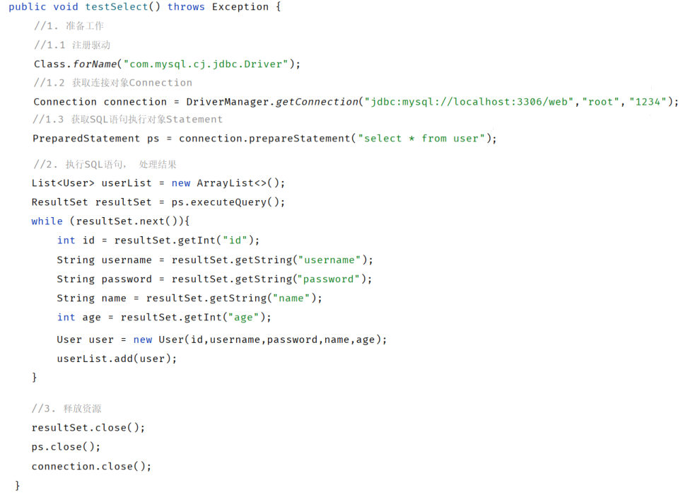
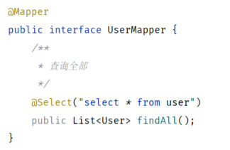

[51 篇](/posts/编程学习/javaweb学习笔记/51-mybatis入门与辅助配置/)把 MyBatis 请进了门，一个 Mapper 接口加一行注解就把"查所有用户"跑通了。但只看到"新的能跑"，还不足以理解**为什么值得换**——这一篇把**同一件事的两种写法**摆在一起看：这才是 PPT 第 22-24 页那一节"**JDBC VS Mybatis**"真正想讲的东西。

本篇是纯对比小节，PPT 只给了三页：一页菜单（第 22 页）、两页代码对照（第 23、24 页）。代码以课程 `代码/jdbc-demo` 与 `代码/springboot-mybatis-quickstart` 为准，输出以本机实测为准。

本机实测环境：MySQL **9.0.1**（课程用 8.0.34），库 `web01`、表 `user`（5 条数据）。连接信息沿用课程原样（`root` / `password=1234`），**自己动手时把 password 换成你自己 MySQL 的密码**。

## 这一节的菜单页（PPT 第 22 页）

PPT 第 22 页和第 16 页是同一张菜单：**Mybatis 入门程序 / JDBC VS Mybatis / 数据库连接池 / 增删改查操作 / XML映射配置**。高亮的那一格是 **JDBC VS Mybatis**——也就是本篇。

菜单的顺序本身就是一条学习路线：先"把 MyBatis 跑起来"（[51 篇](/posts/编程学习/javaweb学习笔记/51-mybatis入门与辅助配置/)），再"看清它到底替 JDBC 省了什么"（本篇），然后补上"连接这个资源由谁管"（[53 篇 数据库连接池](/posts/编程学习/javaweb学习笔记/53-数据库连接池/)），最后是"具体怎么写增删改查"（[54 篇](/posts/编程学习/javaweb学习笔记/54-mybatis增删改查/)）。

## 同一个需求，两段代码（PPT 第 23 页）

PPT 第 23 页把"**查询所有用户**"这一件事用两种技术各写了一遍，左边一栏是 JDBC 程序，右边一栏是 `application.properties` + `UserMapper`，最右边还挂着四个词：**硬编码、繁琐、资源浪费、性能降低**——那是 JDBC 的四个毛病；而两个箭头指向的 **SpringBoot+Mybatis** 与 **数据库连接池**，就是以它们为痛点的两剂药。

### JDBC 版：二十来行，一件都不能少

```java
public class JdbcTest {

    @Test
    public void testSelect() throws Exception {
        // 1. 准备工作
        // 1.1 注册驱动
        Class.forName("com.mysql.cj.jdbc.Driver");
        // 1.2 获取连接
        String url = "jdbc:mysql://localhost:3306/web01";
        String username = "root";
        String password = "1234";     // 换成你自己 MySQL 的密码
        Connection connection = DriverManager.getConnection(url, username, password);
        // 1.3 获取 SQL 语句执行对象（这里用预编译的 PreparedStatement）
        PreparedStatement ps = connection.prepareStatement("select * from user");

        // 2. 执行 SQL，处理结果
        List<User> userList = new ArrayList<>();
        ResultSet resultSet = ps.executeQuery();
        while (resultSet.next()) {                                 // 光标逐行下移
            int id = resultSet.getInt("id");                       // 按列名取每一列
            String username1 = resultSet.getString("username");
            String password1 = resultSet.getString("password");
            String name = resultSet.getString("name");
            int age = resultSet.getInt("age");
            User user = new User(id, username1, password1, name, age);  // 手工装配对象
            userList.add(user);
        }

        // 3. 释放资源
        resultSet.close();
        ps.close();
        connection.close();
    }
}
```


*图：PPT 第 23 页 JDBC 版代码的完整样子——"准备工作（注册驱动/获取连接/获取执行对象）→ 执行 SQL 并 while 解析结果集 → 释放资源"三段，中间那段每一列都要自己 `getXxx` 取出来、自己 `new User` 装进去*

几个"看一眼就懂"的负担：

1. **连接信息写在 Java 代码里**（`url`、`username`、`password`）——改一次数据库地址就得改代码、重新编译，这就是 PPT 说的**硬编码**；
2. **流程一步都不能少**：注册驱动 → 获取连接 → 获取执行对象 → 执行 → 解析 → 关闭，这就是**繁琐**；
3. **每一列都要手工取**：表有 5 列就写 5 行 `getXxx`，10 列就写 10 行，而且**只能按位置或列名一个个取**，改表结构就得跟着改代码；
4. **资源要自己关**：`resultSet`、`ps`、`connection` 三个都得 `close()`，而且真实项目里还得用 `try/finally` 包起来防止异常漏关（课程 `jdbc-demo` 里的 `JdbcTest#testSelect` 就是那种**更长**的写法：`try { ... } catch (SQLException se) { ... } finally { if (rs != null) rs.close(); ... }`）——这就是**资源浪费**的源头：每次用完都丢掉，下次再重新开一条。

### MyBatis 版：配置文件 4 行 + 接口 3 行

同一件事，MyBatis 这边"全部的工作量"如下：

```properties
# application.properties（PPT 第 23、24 页原文）
spring.datasource.url=jdbc:mysql://localhost:3306/web01
spring.datasource.driver-class-name=com.mysql.cj.jdbc.Driver
spring.datasource.username=root
spring.datasource.password=1234
```

```java
@Mapper
public interface UserMapper {
    @Select("select * from user")
    public List<User> findAll();
}
```


*图：PPT 第 24 页把 JDBC 版删光之后只剩这两段——数据源 4 行配置、Mapper 接口 3 行；PPT 专门给这张图配了一句"Mapper接口"*

PPT 第 24 页就是把第 23 页的 JDBC 代码拿掉，只留这两段——**演示"省下来的到底是什么"**。

一行一行对上去看：

| JDBC 里必须手写的东西 | MyBatis 里谁在做 |
| --- | --- |
| `Class.forName("com.mysql.cj.jdbc.Driver")` 注册驱动 | **框架自动做**（读配置里的 `driver-class-name`） |
| `DriverManager.getConnection(url, username, password)` 获取连接 | **连接池 + 自动配置**（下一篇 [53 篇](/posts/编程学习/javaweb学习笔记/53-数据库连接池/)的主角） |
| 拼 SQL 字符串 / 设参数 | **写在注解（或 XML）里**，参数用 `#{}` |
| `executeQuery()` + `while` + 一堆 `getXxx` + `new User(...)` | **MyBatis 自动把每一行封装成 `User` 对象**，直接给你 `List<User>` |
| `resultSet.close()`、`ps.close()`、`connection.close()` | **框架 + 连接池接管**（连接还回池里，不是真的关掉） |

> [!IMPORTANT]
> 换来的不是"少写代码"这一点，而是**关注点的转移**：JDBC 里我们要盯的是"流程"（怎么连、怎么执行、怎么关），MyBatis 里我们只需要盯"**要什么数据**"（SQL 怎么写、返回什么类型）。剩下的流程性工作被框架接走了——这也正是 [51 篇](/posts/编程学习/javaweb学习笔记/51-mybatis入门与辅助配置/) PPT 第 15 页那句"用于**简化 JDBC** 的开发"的实际含义。

## JDBC 的四个痛点（PPT 第 23 页）

PPT 第 23 页把 JDBC 的问题浓缩成四个词，逐个拆开看，每一条都能在上面的代码里找到证据：

| 痛点（PPT 原文） | 在 JDBC 代码里长什么样 | 后果 | 谁来解决 |
| --- | --- | --- | --- |
| **硬编码** | `url`、`username`、`password` 直接写在 Java 里；改环境必须改代码重新编译 | 换库、换密码、上生产都很别扭 | **配置化**——搬进 `application.properties`（[51 篇](/posts/编程学习/javaweb学习笔记/51-mybatis入门与辅助配置/) 1.3） |
| **繁琐** | 注册驱动、获取连接、获取执行对象、写 SQL、while 解析结果集、逐个关闭，一行行都是模板代码 | 写业务的时间被模板代码吃掉 | **一行注解**——`@Select("select * from user")` 就顶掉中间那一大段 |
| **资源浪费** | 每次操作都 `getConnection()` 新建、`close()` 丢掉，下次再来一遍 | 连接是稀缺资源，频繁创建/销毁开销大 | **数据库连接池**——连接用完还回池子复用（[53 篇](/posts/编程学习/javaweb学习笔记/53-数据库连接池/)） |
| **性能降低** | SQL 每次都要重新编译解析 | 高频操作下白白多花时间 | **预编译 SQL**——[50 篇](/posts/编程学习/javaweb学习笔记/50-jdbc查询与预编译sql/)讲的 `?` 占位符 + 编译缓存；MyBatis 的 `#{}` 默认就走这条 |

注意 PPT 第 23 页右侧那两个箭头的落点：

```text
硬编码 ┐
繁琐   ├──→ SpringBoot+Mybatis
资源浪费 ┐
性能降低 ┴──→ 数据库连接池
```

也就是把这四条分给了两块：**MyBatis（+SpringBoot）解决"代码层面"的两条**（硬编码、繁琐），**数据库连接池解决"资源与性能层面"的两条**（资源浪费、性能降低）。所以"JDBC VS MyBatis"这一节之后紧接着就是"数据库连接池"——四剂药要一起上才算完整。

## 本机实测：两边的结果其实一模一样

换技术不是为了"结果更好看"，是为了"过程更省事"。所以最该盯的是**输出**有没有差别：

> [!TIP]
> **本机实测**（同一台机器、同一个 `web01.user`，5 条数据）：
>
> - **JDBC 版**（课程 `jdbc-demo` 的 `JdbcTest#testSelect`，当时的查询需求是[50 篇](/posts/编程学习/javaweb学习笔记/50-jdbc查询与预编译sql/)的"按用户名和密码查一条"）：
>   ```text
>   User(id=1, username=daqiao, password=123456, name=大乔, age=22)
>   ```
>   同一个测试类里的 `testUpdate` 输出 `SQL执行完毕影响的记录数为: 1`；两个测试全过（`Tests run: 2, Failures: 0, Errors: 0`）。
>
> - **MyBatis 版**（课程 `springboot-mybatis-quickstart` 的 `testFindAll`，需求是"查所有"）：
>   ```text
>   ==>  Preparing: select id, username, password, name, age from user
>   ==> Parameters: 
>   <==      Total: 5
>   User(id=1, username=daqiao, password=123456, name=大乔, age=22)
>   User(id=2, username=xiaoqiao, password=123456, name=小乔, age=18)
>   User(id=3, username=diaochan, password=123456, name=貂蝉, age=24)
>   User(id=4, username=lvbu, password=123456, name=吕布, age=28)
>   User(id=5, username=zhaoyun, password=12345678, name=赵云, age=27)
>   ```
>
> 两边打印出来的 `User(...)` **长得完全一样**——因为**装数据的还是同一个实体类、打出来的还是同一个 Lombok `toString()`**。（JDBC 那次只出现一行是因为需求本身是"按用户名密码查一条"；PPT 第 23 页的 JDBC 版需求是"查所有"，`while` 循环会把 5 行逐条装进 `List<User>`。）
>
> 结论很清楚：**两种写法的"结果"没有区别，区别全在"写多少行代码、要不要自己管连接和解析"上。**

顺带一个只有对比才看得出的细节：MyBatis 版日志里那一行 `Preparing: select id, username, password, name, age from user`，说明**MyBatis 底层一样在发 SQL 给 MySQL，一样走预编译**——它没有把 JDBC 换掉，只是把 JDBC 包起来用了（[51 篇](/posts/编程学习/javaweb学习笔记/51-mybatis入门与辅助配置/)的 "别把 MyBatis 理解成不用 JDBC 了" 说的就是这件事）。

## 小结

| 问题 | 答案 |
| --- | --- |
| 这一节比的是什么？ | 同一件事（**查询所有用户**）的两种写法：JDBC 版要写完整流程、MyBatis 版只有**配置 4 行 + 接口 3 行** |
| JDBC 的四个痛点 | **硬编码**（连接信息写死在代码里）、**繁琐**（注册驱动→获取连接→执行→解析→关闭一大串）、**资源浪费**（每次新建/关闭连接）、**性能降低**（SQL 每次重新编译） |
| 四个痛点各自怎么解决？ | 硬编码 → **配置化**（`application.properties` 四行）；繁琐 → **一行注解** `@Select`；资源浪费 → **数据库连接池**载接；性能降低 → **预编译 SQL**（`#{}` → `?`） |
| PPT 上两个箭头什么意思？ | 硬编码、繁琐 归 **SpringBoot+Mybatis** 解决；资源浪费、性能降低 归 **数据库连接池** 解决 |
| JDBC 版为什么行数这么多？ | 每一列都要 `getXxx` 手工取、每个对象都要 `new User(...)` 手工装、每个资源都要 `close()` 手工关（真实项目还得 `try/finally` 兜底） |
| MyBatis 版省在哪？ | 驱动注册、连接获取/归还、结果封装、资源释放**全自动**；我们只声明"要执行什么 SQL、返回什么类型" |
| 实测里两边的结果有差别吗？ | **没有**——JDBC 打印出 `User(id=1, username=daqiao, password=123456, name=大乔, age=22)`，MyBatis 打印出格式完全相同的 `User(...)`（还多三行日志：`Preparing` / `Parameters` / `Total: 5`） |
| 换了技术以后谁被"换掉"了？ | 只有**手写 JDBC 的那堆代码**被换掉；底层仍然是 JDBC（MyBatis 日志里的 SQL 就是证据），连接由**连接池**接管 |

## 相关

- [上一篇：MyBatis入门与辅助配置](/posts/编程学习/javaweb学习笔记/51-mybatis入门与辅助配置/)
- [下一篇：数据库连接池](/posts/编程学习/javaweb学习笔记/53-数据库连接池/)

## 练习题

### 一、知识回顾（读完直接做下面的实践题）

1. **这一节对比的需求**：同一个"**查询所有用户**"，用 JDBC 和 MyBatis 各写一遍，比的是"代码量与要操心的流程"
2. **JDBC 版的完整流程**：注册驱动 → 获取连接 → 获取 SQL 执行对象 → 执行 SQL → `while` 逐行解析 `ResultSet`（每列 `getXxx`、再 `new User(...)` 装配）→ 释放资源（`resultSet`、`ps`、`connection` 逐个 close）
3. **MyBatis 版的全部工作量**：`application.properties` 里 **4 行**数据源配置 + Mapper 接口 **3 行**（`@Mapper`、方法声明、`@Select` 注解）
4. **JDBC 的四个痛点**（PPT 第 23 页原文）：**硬编码**、**繁琐**、**资源浪费**、**性能降低**
5. **硬编码体现在哪**：`url`、`username`、`password` 直接写在 Java 代码里，改环境必须改代码；解法是**配置化**（搬进 `application.properties`）
6. **繁琐体现在哪**：注册驱动、获取连接、获取执行对象、拼 SQL、解析结果集、关闭资源，一行行都是模板代码；解法是**用一行注解声明 SQL**，其余交给框架
7. **资源浪费体现在哪**：每次操作都新建连接、用完就关，下次重新来；解法是**数据库连接池**（连接复用）
8. **性能降低体现在哪**：SQL 每次都要重新编译解析；解法是**预编译 SQL**（`?` 占位符 + 编译缓存），MyBatis 的 `#{}` 默认就是这条路线
9. **PPT 第 23 页两个箭头的分工**：**SpringBoot+Mybatis** 针对硬编码与繁琐；**数据库连接池**针对资源浪费与性能降低
10. **本机实测的结论**：两边拿到的结果**完全一样**——JDBC 版 `User(id=1, username=daqiao, password=123456, name=大乔, age=22)`，MyBatis 版输出格式相同的 `User(...)`，日志显示 `Preparing: select id, username, password, name, age from user` / `Total: 5`；**底层仍是 JDBC，只是外面包了一层框架**

### 二、概念自测

- [ ] **2-1 说出 JDBC 的四个痛点，并各给一句证据**
  不看笔记，把 PPT 第 23 页那四个词写出来，并且每个词后面补一句"在代码里它是哪一行/哪种现象"，最后写出各自被什么解决。
  （本篇不出练习文件，答案写在你的笔记里。）

  > [!TIP]- 提示（先自己想，实在想不出再点开）
  > **一级 · 思路**：从"代码里写死了什么""要写多少步""连接怎么来的""SQL 每次怎么执行"四个角度各想一遍
  > **二级 · 方法**：四个词分别是**硬编码**、**繁琐**、**资源浪费**、**性能降低**；对照解法是**配置化**、**一行注解**、**连接池**、**预编译**
  > **三级 · 骨架**：硬编码 → 代码里的 `____`、`____`、`____` 三个变量；繁琐 → 从 `Class.forName(...)` 到 `____.close()` 那一整串；资源浪费 → 每次都 `____.getConnection()`；性能降低 → SQL 每次都要重新 `____`

  > [!TIP]- 参考答案（做完再点开）
  > | 痛点 | 一句证据 | 解法 |
  > | --- | --- | --- |
  > | **硬编码** | `String url = "jdbc:mysql://localhost:3306/web01"; String username = "root"; String password = "1234";` 三行写死在 Java 里 | 搬进 `application.properties`（**配置化**） |
  > | **繁琐** | 注册驱动、拿连接、拿执行对象、写 SQL、`while` 解析、逐个 `close()`——二十来行才完成一次查询 | MyBatis 的**一行注解** `@Select("select * from user")` |
  > | **资源浪费** | 每次操作都 `DriverManager.getConnection(...)` 新建一条连接，用完 `connection.close()` 丢掉，下次再来一遍 | **数据库连接池**（复用连接，[53 篇](/posts/编程学习/javaweb学习笔记/53-数据库连接池/)） |
  > | **性能降低** | SQL 每次执行都要重新编译解析 | **预编译 SQL**（[50 篇](/posts/编程学习/javaweb学习笔记/50-jdbc查询与预编译sql/)的 `?` + 编译缓存；MyBatis 的 `#{}` 默认走这条） |

- [ ] **2-2 同一段 JDBC 代码，找出"哪些能被自动化"**
  把下面的操作逐个归类：**必须自己写**还是**框架可以代劳**？
  ① 注册驱动
  ② 写 SQL 语句
  ③ 获取数据库连接
  ④ 把 `ResultSet` 的每一行、每一列装配成 `User` 对象
  ⑤ 关闭 `resultSet`/`ps`/`connection`
  ⑥ 决定"要查哪张表、返回什么类型"

  > [!TIP]- 提示（先自己想，实在想不出再点开）
  > **一级 · 思路**：判断标准是"这件事是不是**每次都一样**的机械动作"——每次都一样的可以自动化，跟业务有关的不行
  > **二级 · 方法**：MyBatis 干掉的正是"每次都一样"的部分（驱动、连接、结果封装、资源释放）；留下的是"这次要查什么"（SQL 与返回类型）
  > **三级 · 骨架**：自动化的是 ①③④⑤（其中 ③⑤ 还牵出**连接池**）；必须自己写的是 ②⑥

  > [!TIP]- 参考答案（做完再点开）
  > | 操作 | 归类 | 谁来做 |
  > | --- | --- | --- |
  > | ① 注册驱动 | **框架可代劳** | MyBatis/SpringBoot 读 `driver-class-name` 自动注册 |
  > | ② 写 SQL 语句 | **必须自己写** | 写在注解或 XML 里（MyBatis 不会替你写一句 SQL） |
  > | ③ 获取数据库连接 | **框架可代劳** | 连接池 + 数据源自动配置（[53 篇](/posts/编程学习/javaweb学习笔记/53-数据库连接池/)） |
  > | ④ 装配 `User` 对象 | **框架可代劳** | MyBatis 按"列名 ↔ 属性名"自动封装成 `List<User>` |
  > | ⑤ 关闭三个资源 | **框架可代劳** | 框架负责关闭/归还；连接池则把连接**还回池子**而不是真的关掉 |
  > | ⑥ 决定查哪张表、返回什么类型 | **必须自己写** | 方法签名与 SQL——这是业务信息，框架猜不出来 |
  > 一句话概括：**MyBatis 把"每次都一样"的机械动作收走了，只留下"这次要什么数据"。** 这也是为什么 MyBatis 版最终只剩"配置 4 行 + 接口 3 行"。

- [ ] **2-3 换技术以后，结果会变吗**
  有人说"用了 MyBatis，查询结果的格式就和 JDBC 不一样了"。请用本机实测的两段输出判断这句话对不对，并解释为什么。

  > [!TIP]- 提示（先自己想，实在想不出再点开）
  > **一级 · 思路**：想想"装数据的容器"是什么——两种写法最后都往哪里装？打出来的字符串是谁生成的？
  > **二级 · 方法**：JDBC 是手工 `new User(...)` 装进 `List`；MyBatis 是按列名自动封装成同样的对象。打印都是 Lombok 的 `toString()`
  > **三级 · 骨架**：结论是"格式**一样**"，因为两边用的是同一个实体类 `____`，输出由它的 `____()` 决定（`@Data` 生成）

  > [!TIP]- 参考答案（做完再点开）
  > 这句话**不对**。本机实测两边打出来的是同一种格式：
  > ```text
  > User(id=1, username=daqiao, password=123456, name=大乔, age=22)   ← JDBC 版（jdbc-demo 实测）
  > User(id=1, username=daqiao, password=123456, name=大乔, age=22)   ← MyBatis 版（springboot-mybatis-quickstart 实测）
  > ```
  > 原因：**数据最终都装进同一个实体类 `User`**——JDBC 版是我们手工 `new User(id, username, password, name, age)` 装进去的；MyBatis 版是按"列名 ↔ 属性名"的对应关系**自动**封装成同样的对象。两边的打印都来自 `User` 上 `@Data` 生成的 `toString()`，所以长得一模一样。
  > 换句话说：**换的是"干活的方式"，不是"数据的形状"**——这也是为什么换成 MyBatis 之后，上层 Service、Controller 的代码基本不用动。

- [ ] **2-4 给四个痛点配药**
  现在有三个"药方"：**A 配置文件（配置化）**、**B 一行注解（`@Select`）**、**C 数据库连接池**、**D 预编译 SQL**。请把四个痛点与四剂药一一对上，并说明为什么"JDBC VS MyBatis"这一节后面紧跟着讲连接池。

  > [!TIP]- 提示（先自己想，实在想不出再点开）
  > **一级 · 思路**：一个痛点配一味药；"代码层面"的两个归 MyBatis，**"资源与性能层面"的两个需要连接池和预编译**——它们不是 MyBatis 独有的，JDBC 也能用
  > **二级 · 方法**：硬编码 ↔ 配置化；繁琐 ↔ 注解/XML；资源浪费 ↔ 连接池；性能降低 ↔ 预编译
  > **三级 · 骨架**：PPT 第 23 页右侧两个箭头——**SpringBoot+Mybatis** 管 ____、____；**数据库连接池** 管 ____、____

  > [!TIP]- 参考答案（做完再点开）
  > | 痛点 | 药 |
  > | --- | --- |
  > | 硬编码 | **A 配置化**——连接信息搬到 `application.properties`（[51 篇](/posts/编程学习/javaweb学习笔记/51-mybatis入门与辅助配置/) 1.3） |
  > | 繁琐 | **B 一行注解**——`@Select("select * from user")` 顶掉一整段流程代码 |
  > | 资源浪费 | **C 数据库连接池**——连接用完还回池子复用 |
  > | 性能降低 | **D 预编译 SQL**——`?` 占位符 + 编译缓存（`#{}` 默认就是它） |
  > 为什么紧接着讲连接池？因为 PPT 第 23 页只把"硬编码、繁琐"这两条挂给了 **SpringBoot+Mybatis**，而"资源浪费、性能降低"这两条挂给了 **数据库连接池**——**MyBatis 一个人治不完 JDBC 的病**。[51 篇](/posts/编程学习/javaweb学习笔记/51-mybatis入门与辅助配置/)也提醒过：MyBatis 底层还是 JDBC 那一套，所以连接怎么管、SQL 怎么预编译，仍然要单独学（这才是 [53 篇](/posts/编程学习/javaweb学习笔记/53-数据库连接池/)存在的理由）。

### 三、综合题

- [ ] **3-1 把一段 JDBC 代码"逐行翻译"成 MyBatis 写法，并用输出对照证明等效**
  这是本篇最值钱的一次动手：不抄答案，自己完成一次**改造与验证**。
  1. 打开课程的 `jdbc-demo` 工程，找到 `JdbcTest` 里那段"查询用户"的代码，把它的执行流程按注释切成若干段（准备工作 / 执行与解析 / 释放资源）；
  2. 对着每一段，写一句话说明"这一段在 MyBatis 里由谁负责"（自己写 or 框架代劳，代劳的话是哪个配置/机制）；
  3. 照着 PPT 第 23-24 页，把它改写成 MyBatis 版：数据源配置 + Mapper 接口里的一个查询方法（返回 `List<User>`）；
  4. 用单元测试跑通改造后的版本，把两边的**输出**各抄一次（JDBC 版可以跑课程测试，MyBatis 版跑你自己的测试）；
  5. 逐项对比两次输出：`User` 对象的格式有没有差别？多出来/少掉了哪些行？
  6. 最后回答三个问题：① 改造后**你自己的代码**少写了哪些东西？② 哪些东西**一行也没少**（还是得自己写、自己配）？③ 如果数据库的密码从 1234 改成别的，两种写法各要改几个地方？
  （本篇不出练习文件：把 1~6 步的记录写在你的工程注释或笔记里。）

  **涉及知识点**

  | 知识点 | 在这里的应用 |
  | --- | --- |
  | JDBC 五步 | 第 1 步——按注释切段，认出"注册驱动/获取连接/获取执行对象/执行/释放" |
  | 硬编码 → 配置化 | 第 3、6 步——连接信息从 Java 挪到配置文件，改密码只改一处 |
  | 繁琐 → 注解 | 第 3 步——`@Select` 顶掉执行与解析那一大段 |
  | 结果封装 | 第 4、5 步——`ResultSet` 手工装配 vs MyBatis 自动封装 `List<User>` |
  | 资源与连接池 | 第 2 步——`connection.close()` 在 MyBatis 里由框架/连接池接管（[53 篇](/posts/编程学习/javaweb学习笔记/53-数据库连接池/)） |
  | 预编译 | 两边都是 `?` 占位符（[50 篇](/posts/编程学习/javaweb学习笔记/50-jdbc查询与预编译sql/)） |

  > [!TIP]- 提示（先自己想，实在想不出再点开）
  > **一级 · 思路**：改造的本质是"把每次都要写的机械动作删掉，只保留业务信息"；验证的本质是"输出必须不变"
  > **二级 · 方法**：MyBatis 版 = `application.properties` 四行 + `@Mapper` 接口 + `@Select` 方法 + `@SpringBootTest` 测试方法；输出对照时注意"JDBC 打印的是同一个实体类的 `toString`"
  > **三级 · 骨架**：第 6 步三问的答案方向——少写的是 `____`、`____`、`____`、`____`；没少的是"____ 与 ____"；改密码时 JDBC 要改**代码里的常量**，MyBatis 只改**配置文件里的那一行**

  > [!TIP]- 参考答案（做完再点开）
  > 1~2. 分段与归属：
  > | JDBC 的段落 | 具体代码 | MyBatis 里谁负责 |
  > | --- | --- | --- |
  > | 准备工作·注册驱动 | `Class.forName("com.mysql.cj.jdbc.Driver")` | **框架代劳**（配了 `driver-class-name` 后自动注册） |
  > | 准备工作·获取连接 | `DriverManager.getConnection(url, username, password)` | **框架 + 连接池代劳**（`spring.datasource.*` 四行配置，连接由池子给） |
  > | 准备工作·获取执行对象 | `connection.prepareStatement("select * from user")` | **框架代劳**（`@Select` 里的 SQL 由 MyBatis 编译成预编译语句） |
  > | 执行与解析 | `executeQuery()` + `while` + 5 行 `getXxx` + `new User(...)` + `add` | **框架代劳**（自动封装成 `List<User>`） |
  > | 释放资源 | `resultSet.close(); ps.close(); connection.close();` | **框架 + 连接池代劳**（连接还回池里） |
  > 3. 改造后的 MyBatis 版：
  > ```properties
  > # application.properties
  > spring.datasource.url=jdbc:mysql://localhost:3306/web01
  > spring.datasource.driver-class-name=com.mysql.cj.jdbc.Driver
  > spring.datasource.username=root
  > spring.datasource.password=1234
  > ```
  > ```java
  > @Mapper
  > public interface UserMapper {
  >     @Select("select * from user")
  >     public List<User> findAll();
  > }
  > ```
  > ```java
  > @SpringBootTest
  > class MybatisTests {
  >     @Autowired
  >     private UserMapper userMapper;
  >
  >     @Test
  >     public void testFindAll(){
  >         userMapper.findAll().forEach(System.out::println);
  >     }
  > }
  > ```
  > 4~5. 输出对照（**本机实测**）：
  > ```text
  > -- JDBC 版（jdbc-demo，需求是"按用户名密码查一条"）
  > User(id=1, username=daqiao, password=123456, name=大乔, age=22)
  >
  > -- MyBatis 版（springboot-mybatis-quickstart，需求是"查所有"）
  > ==>  Preparing: select id, username, password, name, age from user
  > ==> Parameters:
  > <==      Total: 5
  > User(id=1, username=daqiao, password=123456, name=大乔, age=22)
  > User(id=2, username=xiaoqiao, password=123456, name=小乔, age=18)
  > User(id=3, username=diaochan, password=123456, name=貂蝉, age=24)
  > User(id=4, username=lvbu, password=123456, name=吕布, age=28)
  > User(id=5, username=zhaoyun, password=12345678, name=赵云, age=27)
  > ```
  > `User` 的格式**完全一致**（同一个实体类 + 同一个 `toString()`）；MyBatis 版**多出三行日志**（`Preparing` / `Parameters` / `Total`），那是 MyBatis 的日志功能，不是结果本身；行数差别来自需求不同（一个是按条件查、一个是查所有）。
  > 6. 三个回答：
  > ① 少写的是——**注册驱动、获取连接、获取执行对象、`while` 解析结果集、逐个关闭资源**这一整套；以及"连接信息写在 Java 里"这件事本身。
  > ② 一行也没少的是——**SQL 还得自己写**（框架不会替你决定查什么）、**返回类型还得自己定**（`List<User>`）、**数据源四行还得自己配**（地址、驱动、用户名、密码）。框架能替你做机械动作，替不了你表达需求。
  > ③ 改密码：**JDBC 版要改代码里那个 `String password = "1234";`（然后重新编译打包）**，MyBatis 版只改 **`application.properties` 里的 `spring.datasource.password` 一行**（不改代码、不用重编译逻辑代码）。这就是"硬编码 → 配置化"最直观的收益。
