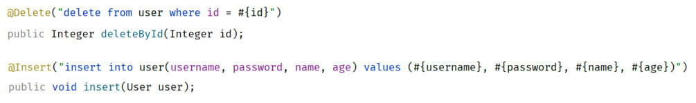

[51 篇](/posts/编程学习/javaweb学习笔记/51-mybatis入门与辅助配置/)把 MyBatis 的入门程序跑通了（Mapper 接口里只有一条 `findAll`），[53 篇](/posts/编程学习/javaweb学习笔记/53-数据库连接池/)把连接交给谁管说清了。这一篇（PPT 第 30-37 页）就把那个接口**填满**——删除、新增、修改、条件查询四个操作一个个写过来，最后把 MyBatis 里最容易考也最容易错的 `#{}` 与 `${}` 钉死。

本篇的所有代码都来自课程工程 `springboot-mybatis-quickstart`（权威写法），日志来自**本机实测**：MySQL 9.0.1 的 `web01` 库里那张 `user` 表（5 条数据），工程里已经按 [51 篇](/posts/编程学习/javaweb学习笔记/51-mybatis入门与辅助配置/)配好数据源（`jdbc:mysql://localhost:3306/web01`、用户名 `root`、`password=1234`——这里的 `password` 换成你自己 MySQL 的密码）和 MyBatis 日志输出。

## 动手之前：四个操作共用的一套写法（PPT 第 30 页）

PPT 第 30 页是本节的目录页，五格内容里前四格已经走完——「入门程序」（[51 篇](/posts/编程学习/javaweb学习笔记/51-mybatis入门与辅助配置/)）、「JDBC VS Mybatis」（[52 篇](/posts/编程学习/javaweb学习笔记/52-jdbc与mybatis的对比/)）、「数据库连接池」（[53 篇](/posts/编程学习/javaweb学习笔记/53-数据库连接池/)），这一篇进的是第 4 格「**增删改查操作**」（第 5 格「XML映射配置」是[下一篇](/posts/编程学习/javaweb学习笔记/55-mybatis-xml映射配置/)）。

四个操作写的都是**同一个接口**，位置和准备工作完全一样：

```java
package com.itheima.mapper;

import com.itheima.pojo.User;
import org.apache.ibatis.annotations.*;

import java.util.List;

@Mapper // 应用程序在运行时, 会自动的为该接口创建一个实现类对象(代理对象), 并且会自动将该实现类对象存入IOC容器 - bean
public interface UserMapper {

    /**
     * 查询所有用户
     */
    @Select("select id, username, password, name, age from user")
    public List<User> findAll();
}
```

配套的实体类（`com.itheima.pojo.User`）用 Lombok 三个注解生成 getter/setter/构造方法：

```java
@Data
@AllArgsConstructor
@NoArgsConstructor
public class User {
    private Integer id;
    private String username;
    private String password;
    private String name;
    private Integer age;
}
```

测试的套路也一样：测试类上打 `@SpringBootTest`（运行时加载 SpringBoot 环境）、用 `@Autowired` 把 Mapper 接口注入进来，每个操作写一个 `@Test` 方法。下面四个操作，就按 PPT 的顺序一个个来。

## 删除用户（PPT 第 31 页）

PPT 第 31 页的需求和 SQL：

> 需求：根据 ID 删除用户信息
> SQL：`delete from user where id = 5;`

### 从"写死 id"到"id 当参数"

第一版最直观——**把 id 直接写进 SQL 字符串**：

```java
@Delete("delete from user where id = 5")
public void deleteById();
```

这样只能删 id 为 5 的那一条，换个 id 就得改代码。所以要把它改成**参数**：方法上声明一个形参接收 id，SQL 里用 `#{id}` 把它取出来：

```java
@Delete("delete from user where id = #{id}")
public void deleteById(Integer id);
```

`#{}` 里写的名字（`id`）要和**方法形参的名字**对上；一个参数时名字可以随便起（比如 `#{aaa}` 也能用），但写成语义一致的名字才不容易看错。

### 返回值：DML 语句的影响行数

PPT 第 31 页紧接着放了一个问号，答案是这段"注意"：

> 注意：**DML 语句执行完毕的返回值，表示该 DML 语句执行完毕影响的行数。**

于是接口方法的返回值**可以声明成 `Integer` 把它接住**：

```java
@Delete("delete from user where id = #{id}")
public Integer deleteById(Integer id);
```

`void` 和 `Integer` 两种写法课程代码里都留着（源码里 `void` 那行被注释掉了，实际用的是 `Integer`）：

```java
    /**
     * 根据ID删除用户
     */
    @Delete("delete from user where id = #{id}")
    //public void deleteById(Integer id);
    public Integer deleteById(Integer id);
```

- **不需要行数**（比如只是"删掉就好"）→ 声明成 `void`，MyBatis 把结果丢掉；
- **需要知道到底删了几行**（比如要判断"id 不存在所以一行都没删"）→ 声明成 `Integer` 接住。

### 本机实测：删除 id 为 4 的用户

测试方法（课程 `SpringbootMybatisQuickstartApplicationTests` 里的 `testDeleteById`）：

```java
    @Test
    public void testDeleteById(){
        Integer i = userMapper.deleteById(4);
        System.out.println("执行完毕, 影响的记录数: " + i);
    }
```

> [!TIP]
> **本机实测**（`springboot-mybatis-quickstart` 工程，`web01.user` 表）——控制台里 MyBatis 的日志和打印结果是：
>
> ```text
> ==>  Preparing: delete from user where id = ?
> ==> Parameters: 4(Integer)
> 执行完毕, 影响的记录数: 1
> ```
>
> 三行分别说明三件事：
> ① **`#{id}` 变成了 `?`**——注解里写的是 `#{id}`，MyBatis 真正拼给数据库的是占位符 `?`（预编译 SQL，机制和 [50 篇](/posts/编程学习/javaweb学习笔记/50-jdbc查询与预编译sql/)的 `PreparedStatement` 一模一样）；
> ② **`Parameters: 4(Integer)`**——参数按类型安全地传进去，`4` 是 Java 的 `Integer`，不是被拼进 SQL 文本里；
> ③ **影响 1 行**——id 为 4 的那条（lvbu 吕布）被删掉了，这就是 DML 的返回值。

## MyBatis 的 `#{}` 与 `${}`（PPT 第 32-33 页）

PPT 第 32 页给了一张完整的对照表，这是本节的核心，也是 PPT 第 33 页明说的**面试题**：

| 符号 | 说明 | 场景 | 优缺点 |
| --- | --- | --- | --- |
| `#{…}` | **占位符**。执行时，会将 `#{…}` 替换为 `?`，生成预编译 SQL | **参数值传递** | **安全、性能高（推荐）** |
| `${…}` | **拼接符**。直接将参数拼接在 SQL 语句中，存在 **SQL 注入问题** | **表名、字段名动态设置时**使用 | **不安全、性能低** |

PPT 页面上配的两个例子正好覆盖这两种场景：

```java
// 参数值（id）用 #{}：安全
@Delete("delete from dept where id = #{id}")

// 表名、字段名要动态换的时候才用 ${}：把表名、排序字段拼进 SQL 文本
@Select("select id,name,score from ${tableName} order by ${sortField}")
```

### 为什么推荐 `#{}`：本机实测的证据

上面删除那条日志就是最直接的实证：

- 接口里写的是 `@Delete("delete from user where id = #{id}")`；
- MyBatis 实际发出去的是 `delete from user where id = ?`，参数另外用 `Parameters: 4(Integer)` 送进去。

**`#{}` 从来不"参与拼字符串"，它只负责在 SQL 文本里占一个 `?` 的位置。** 这正是 [50 篇](/posts/编程学习/javaweb学习笔记/50-jdbc查询与预编译sql/)用注入实验证明过的那件事：参数走 `?` 时，输入里的 `' or '1'='1` 只会被当成**一个普通字符串值**（数据库不会把它当 SQL 语法解析），注入因此失败；而如果换成字符串拼接，那句输入就会变成 SQL 的一部分，把整张表都查出来。

`#{}` 的两个好处再按 PPT 的表复述一遍：

1. **安全**——预编译，不存在 SQL 注入；
2. **性能高**——同一条 SQL 模板（`… where id = ?`）只编译一次，之后换参数重复执行时能复用编译结果；`${}` 每次参数不同就是一条全新的 SQL，得重新编译（编译/SQL语法解析检查/优化这套流程见 [50 篇](/posts/编程学习/javaweb学习笔记/50-jdbc查询与预编译sql/)的性能对比示意）。

### 那 `${}` 什么时候用

**只有"表名、字段名这类不可能是参数值的东西要动态换"时才用**。因为 SQL 的语法规定：表名、列名**不能用 `?` 占位**（`select * from ?` 是语法错误），所以当"查哪张表、按哪个字段排序"是运行时才决定的（比如后台的通用导出工具），只能把名字拼进 SQL 文本，这时用 `${}`。

用 `${}` 时必须警惕：**拼进去的内容一定要来自程序自己的白名单**（比如 `tableName` 只能是代码里写死的几个表名之一），绝不能直接拿用户在界面上输入的值去拼，否则注入就回来了。

> [!WARNING]
> 一句话总结这个面试题：**`#` 是占位符、生成预编译 SQL、用于参数值、安全又性能高（推荐）；`$` 是拼接符、直接把值拼进 SQL、只用于表名字段名这类动态标识、不安全性能低。** 平时写 SQL 一律用 `#{}`，看到 `${}` 要多想一秒"这里拼的是不是用户输入"。

## 新增用户（PPT 第 34 页）

PPT 第 34 页的需求和 SQL：

> 需求：添加一个用户
> SQL：`insert into user(username,password,name,age) values('zhouyu','123456','周瑜',20);`

### 写死版 → 对象版

写死的版本长这样（值全是常量，方法连参数都没有）：

```java
@Insert("insert into user(username,password,name,age) values('zhouyu', '123456', '周瑜', 20)")
public void insert();
```

要新增的往往是一个**从外面传进来的 User 对象**，所以改成"方法接收对象、SQL 里写**属性名**"：

```java
@Insert("insert into user(username,password,name,age) values(#{username},#{password},#{name},#{age})")
public void insert(User user);
```

PPT 在 `#{username}` 这排下面标了四个字：**对象属性名**。这一点很关键——

- `#{username}` 里的名字**对应的是 `User` 类的属性名**（`getUsername()` 去掉 get 首字母小写），不是数据库列名（当然这里两者恰好同名，容易看混）；
- 顺序不重要，只要名字对得上，MyBatis 会自己从对象里取值；
- 表里的主键 `id` 是 `auto_increment`（见课程建表语句），所以 SQL 里**不写 id**，插入的对象里把它放 `null` 就行。

课程源码里这个方法返回 `void`：

```java
    /**
     * 新增用户
     */
    @Insert("insert into user(username, password, name, age) values (#{username}, #{password}, #{name}, #{age})")
    public void insert(User user);
```

新增同样是 DML，**想要影响行数就把它声明成 `Integer`**（和删除那条一个道理）。

### 本机实测：插入高圆圆

测试方法：

```java
    @Test
    public void testInsert(){
        User user = new User(null,"gaoyuanyuan","666888","高圆圆", 18);
        userMapper.insert(user);
    }
```

> [!TIP]
> **本机实测**——日志输出：
>
> ```text
> ==>  Preparing: insert into user(username, password, name, age) values (?, ?, ?, ?)
> ==> Parameters: gaoyuanyuan(String), 666888(String), 高圆圆(String), 18(Integer)
> ```
>
> 四个 `#{属性名}` 全部变成了 `?`，值按类型依次传进去（三个 `String` + 一个 `Integer`）；`id` 没出现在 SQL 里，由数据库自增生成——所以构造对象时第一个参数（id）给了 `null`。

## 修改用户（PPT 第 35 页）

PPT 第 35 页的需求和 SQL：

> 需求：根据 ID 更新用户信息
> SQL：`update user set username = 'zhouyu', password = '123456', name = '周瑜', age = 20 where id = 1;`

修改和新增的套路完全一样：**整个对象传进来，SQL 里 `#{属性名}` 依次取值**，最后用 `where id = #{id}` 定位要改哪一行：

```java
    /**
     * 更新用户
     */
    @Update("update user set username = #{username}, password = #{password}, name = #{name}, age = #{age} where id = #{id}")
    public void update(User user);
```

注意 `#{id}` 也来自**同一个 User 对象**——对象里的 `id` 就是"要改哪一行"，其余四个属性是"改成什么"。

测试方法：

```java
    @Test
    public void testUpdate(){
        User user = new User(1,"zhouyu","666888","周瑜", 20);
        userMapper.update(user);
    }
```

> [!TIP]
> **本机实测**——日志输出：
>
> ```text
> ==>  Preparing: update user set username = ?, password = ?, name = ?, age = ? where id = ?
> ==> Parameters: zhouyu(String), 666888(String), 周瑜(String), 20(Integer), 1(Integer)
> ```
>
> 五个参数按 SQL 里 `?` 的顺序传：前四个是 `set` 的值，最后一个 `1(Integer)` 是 `where id = ?` 的条件——**顺序由 `#{}` 在 SQL 里出现的位置决定**，和对象属性的声明顺序无关。

## 按用户名和密码查询用户（PPT 第 36 页）

PPT 第 36 页的需求和 SQL：

> 需求：根据用户名和密码查询用户信息
> SQL：`select * from user where username = 'zhouyu' and password = '666888';`

改写后的接口方法：

```java
    /**
     * 根据用户名和密码查询用户信息
     */
    @Select("select * from user where username = #{username} and password = #{password}")
    public User findByUsernameAndPassword(@Param("username") String username, @Param("password") String password);
```

### `@Param` 是干什么的

PPT 原文：

> `@Param` 注解的作用是**为接口的方法形参起名字**的。

回到 `#{}` 的取值方式：MyBatis 得知道 `#{username}` 里的 `username` 指向哪个参数。**只有一个参数时**（比如删除的 `#{id}`）它不用猜；**有多个参数时**（这里两个 `String`）就必须靠 `@Param("名字")` 给每个形参挂上名字，`#{}` 才能按名字取到。

### `@Param` 可以省略的情况

PPT 在同页的"说明"里补了一条：

> 说明：基于**官方骨架**创建的 springboot 项目中，**接口编译时会保留方法形参名**，`@Param` 注解可以省略（`#{形参名}`）。

也就是这样写也成立：

```java
@Select("select * from user where username=#{uname} and password=#{pwd}")
public User findByUsernameAndPassword(String uname, String pwd);
```

（`#{uname}` 取第一个形参 `uname`、`#{pwd}` 取第二个形参 `pwd`。）课程的两个工程各留了一种写法：`springboot-mybatis-quickstart` 里实际用的是**省略 `@Param`** 的那版（带 `@Param` 的那行被注释掉了），`aliyun-mybatis-quickstart` 里实际用的是**带 `@Param`** 的那版。**写的时候建议还是老实加上 `@Param`**——它不依赖"编译时保留形参名"这个前提，换到别的工程里也不会突然失效。

### 返回单条还是多条

这里 SQL 的 `where username = … and password = …` 理论上只会命中一条，**返回类型写成 `User`（单个对象）**；如果要查的是"所有用户"这种可能有多条结果的，才写 `List<User>`（[51 篇](/posts/编程学习/javaweb学习笔记/51-mybatis入门与辅助配置/)的 `findAll`）。

顺着 PPT 第 33 页那条 `#` 与 `$` 的问答想一下：这里的 `username`、`password` 都是**参数值**，所以两个都用 `#{}`——如果用 `${}` 拼，登录接口就成了注入的靶子。


*图：课程 `UserMapper` 接口的截图——删除方法用 `#{id}` 取参数、把返回值声明成 `Integer` 接住影响行数；新增方法接收整个 `User` 对象，SQL 里直接写 `#{属性名}`*

## 必答问答（PPT 第 33、37 页）

PPT 这两页的问答是本节的口头考点：

| PPT 的问题 | 答案 |
| --- | --- |
| Mybatis 中执行 DML 语句时，有没有返回值？ | **有**，`int` 类型，表示 DML 语句执行**影响的记录数**（接口方法声明成 `Integer` 就能接住，不需要就写 `void`） |
| Mybatis 中 `#` 与 `$` 的区别是什么？（面试题） | **`#` 是占位符**，会替换为 `?` 生成预编译 SQL（**推荐**）；**`$` 是字符串拼接符号**，将参数值直接拼接在 SQL 中（有注入风险） |
| `@Param` 注解的使用场景？ | 接口方法形参中**需要传递多个参数**时，通过 `@Param` 为参数**起名字**；在基于 SpringBoot 官方骨架创建的项目中，该注解**可以省略**（编译时保留形参名） |

## 自己把这套跑起来：一个课程代码里的坑

四个操作对应的测试都在 `SpringbootMybatisQuickstartApplicationTests` 里（`testFindAll`、`testDeleteById`、`testInsert`、`testUpdate`、`testFindByUsernameAndPassword` 五个），本机把这一套跑下来是 **5 个测试全过**。自己动手时按 [51 篇](/posts/编程学习/javaweb学习笔记/51-mybatis入门与辅助配置/)的辅助配置把日志打开（`mybatis.configuration.log-impl=org.apache.ibatis.logging.stdout.StdOutImpl`），就能像上面那样把每条 SQL 和参数都看见。

> [!WARNING]
> 课程 `jdbc-demo` 工程里除 `JdbcTest` 外还有一个 `FileTest`，它硬编码了课程作者本机的路径 `C:\Users\deng\Desktop\filename.txt`，跑起来会报：
>
> ```text
> java.io.FileNotFoundException: C:\Users\deng\Desktop\filename.txt (系统找不到指定的路径。)
> ```
>
> **这不是你的环境坏了**——那是作者自己的临时测试类，跑不过可以直接删掉或忽略。（这也提醒一件事：读课程代码时，凡是硬编码了别人机器路径的地方都要换成自己的。）

## 小结

| 问题 | 答案 |
| --- | --- |
| 删除怎么写？ | `@Delete("delete from user where id = #{id}")` + `Integer deleteById(Integer id)`；需要影响行数就返回 `Integer`，不需要就 `void` |
| DML 的返回值是什么？ | **影响的记录数**；本机实测删 id=4 → `执行完毕, 影响的记录数: 1` |
| `#{}` 与 `${}` 怎么选？ | 参数值一律 `#{}`（占位符 → 预编译 SQL，**安全、性能高**）；只有表名/字段名这类动态标识才用 `${}`（拼接符，有注入风险） |
| 为什么推荐 `#{}`？ | 它生成的是 `?` + `Parameters`（本机实测：`#{id}` → `delete from user where id = ?` + `Parameters: 4(Integer)`），参数永远只当"值"，注入进不来；同一条 SQL 模板还能复用编译结果 |
| 新增怎么写？ | `@Insert("insert into user(username,password,name,age) values(#{username},#{password},#{name},#{age})")` + `void insert(User user)`；`#{}` 里写的是**对象属性名** |
| 修改怎么写？ | `@Update("update user set username=#{username}, …, age=#{age} where id=#{id}")` + `void update(User user)`；条件用的 `#{id}` 同样来自这个对象 |
| 条件查询怎么写？ | `@Select("select * from user where username = #{username} and password = #{password}")` + `User findByUsernameAndPassword(...)`；**返回多条时用 `List<User>`** |
| `@Param` 什么时候要写？ | **多个形参**时必须写（给参数起名字，`#{}` 才知道取谁）；官方骨架工程保留形参名 → 可省略，但建议照写 |

## 相关

- [上一篇：数据库连接池](/posts/编程学习/javaweb学习笔记/53-数据库连接池/)
- [下一篇：MyBatis-XML映射配置](/posts/编程学习/javaweb学习笔记/55-mybatis-xml映射配置/)

## 练习题

### 一、知识回顾（读完直接做下面的实践题）

1. **四个操作写在哪**：都写在 `com.itheima.mapper.UserMapper` 这一个接口里，接口上加 `@Mapper`；测试类上加 `@SpringBootTest`（加载 SpringBoot 环境）、用 `@Autowired` 把接口注入进来
2. **删除**：`@Delete("delete from user where id = #{id}")` + `Integer deleteById(Integer id)`；`#{id}` 里的名字对应**方法形参名**
3. **DML 的返回值**：**影响的记录数**（`int`）；接口方法用 `Integer` 接住，不需要就声明成 `void`。本机实测删 id=4 → `执行完毕, 影响的记录数: 1`
4. **`#{}`**：**占位符**，执行时替换为 `?`、生成**预编译 SQL**；用于**参数值传递**；**安全、性能高（推荐）**
5. **`${}`**：**拼接符**，直接把参数值拼进 SQL 文本，存在 **SQL 注入**问题；只在**表名、字段名动态设置**时使用；不安全、性能低
6. **为什么 `#{}` 安全**：它不参与拼字符串，只占一个 `?` 的位置——本机实测注解写 `#{id}`，实际发出的是 `delete from user where id = ?` + `Parameters: 4(Integer)`；机制与 [50 篇](/posts/编程学习/javaweb学习笔记/50-jdbc查询与预编译sql/)的 `PreparedStatement` 相同（注入进去的 `' or '1'='1` 被当成纯字符串值）
7. **新增**：`@Insert("insert into user(username, password, name, age) values (#{username}, #{password}, #{name}, #{age})")` + `void insert(User user)`；`#{}` 里写的是**对象属性名**（不是列名），主键 `id` 不写、交给自增
8. **修改**：`@Update("update user set username = #{username}, password = #{password}, name = #{name}, age = #{age} where id = #{id}")` + `void update(User user)`；`Parameters` 的顺序由 `#{}` 在 SQL 里出现的位置决定（本机实测：`zhouyu, 666888, 周瑜, 20, 1`）
9. **条件查询**：`@Select("select * from user where username = #{username} and password = #{password}")` + `User findByUsernameAndPassword(@Param("username") String username, @Param("password") String password)`；**返回单条用 `User`、可能多条用 `List<User>`**
10. **`@Param` 的使用场景**：**多个形参**时必须用它为参数**起名字**；基于 SpringBoot 官方骨架创建的项目，接口编译时会**保留形参名**，所以该注解**可以省略**

### 二、裸写题

- [ ] **2-1 按 id 删除一个用户，并且要拿到"删掉了几行"**
  需求：在 `UserMapper` 接口里加一个方法，**按用户 id 删除** `user` 表里的一行；调用完这个方法后，程序要能拿到"这次到底删了几行"。id **必须作为方法参数传进去**，不许写死。写完后配一个测试方法删掉 id 为 5 的用户，把行数打印出来。
  （练习文件 `test_54_增删改查.java` 的题目2-1 里给了写作区。）

  > [!TIP]- 提示（先自己想，实在想不出再点开）
  > **一级 · 思路**：SQL 还是那句 `delete from user where id = ?`，只是参数从"写死"改成"从方法参数来"；返回值直接接住再打印
  > **二级 · 方法**：接口方法上用 `@Delete("…")` 写 SQL，参数位置写 `#{id}`；返回值声明成 `Integer` 拿影响行数；测试方法用 `@Test` + `@Autowired` 注入的接口调用
  > **三级 · 骨架**：`@Delete("delete from user where id = ____") public ____ deleteById(____ id);`（注解名、符号从提示里抄）

  > [!TIP]- 参考答案（做完再点开）
  > ```java
  > // UserMapper 里新增
  > @Delete("delete from user where id = #{id}")
  > public Integer deleteById(Integer id);
  >
  > // 测试类里新增
  > @Test
  > public void testDeleteById(){
  >     Integer i = userMapper.deleteById(5);
  >     System.out.println("执行完毕, 影响的记录数: " + i);
  > }
  > ```
  > 本机实测（同样删 id=4 的那次）日志与输出：
  > ```text
  > ==>  Preparing: delete from user where id = ?
  > ==> Parameters: 4(Integer)
  > 执行完毕, 影响的记录数: 1
  > ```
  > 要点：**返回类型用 `Integer` 才能接住"影响行数"**；写成 `void` 也不会报错，只是拿不到这个数字。如果删一个**不存在的 id**，SQL 照样执行成功，返回的行数是 `0`——这也是"用返回值判断有没有删到"的用法。

- [ ] **2-2 把一个用户对象存进表里**
  需求：写一个方法，把外面传进来的一个用户对象**新增**到 `user` 表；SQL 里的四个值（用户名、密码、姓名、年龄）**全部来自对象的属性**，不许写常量。写完写个测试：新增一个"高圆圆"（用户名 `gaoyuanyuan`、密码 `666888`、年龄 18）的用户，跑完看一眼日志里参数是不是四个。
  （练习文件 `test_54_增删改查.java` 的题目2-2 里给了写作区；实体类 `User` 的字段是 `id / username / password / name / age`。）

  > [!TIP]- 提示（先自己想，实在想不出再点开）
  > **一级 · 思路**：SQL 用 `insert into …`，四个值的位置放占位符；占位符里的名字要和**对象的属性名**对上；主键不用给（数据库自增），对象里放 `null` 即可
  > **二级 · 方法**：接口方法上用 `@Insert("…")`；占位符 `#{username}`、`#{password}`、`#{name}`、`#{age}`；方法参数是 `User user`
  > **三级 · 骨架**：`@Insert("insert into user(username, password, name, age) values (____, ____, ____, ____)") public void insert(____ user);`

  > [!TIP]- 参考答案（做完再点开）
  > ```java
  > // UserMapper 里新增
  > @Insert("insert into user(username, password, name, age) values (#{username}, #{password}, #{name}, #{age})")
  > public void insert(User user);
  >
  > // 测试类里新增
  > @Test
  > public void testInsert(){
  >     User user = new User(null,"gaoyuanyuan","666888","高圆圆", 18);
  >     userMapper.insert(user);
  > }
  > ```
  > 本机实测日志：
  > ```text
  > ==>  Preparing: insert into user(username, password, name, age) values (?, ?, ?, ?)
  > ==> Parameters: gaoyuanyuan(String), 666888(String), 高圆圆(String), 18(Integer)
  > ```
  > 两个易错点：① `#{}` 里必须写**属性名**，写 `#{userName}` 这种对不上的名字会在运行时报错；② 表里有 5 个列而 SQL 只写了 4 个（`id` 交给 `auto_increment`），所以构造对象时 id 位置传 `null`。

- [ ] **2-3 按用户名和密码查一条用户记录**
  需求：写一个方法，按**用户名和密码两个条件**从 `user` 表里查出**一条**用户记录并封装成对象返回；两个条件都必须是方法参数。写完写个测试，用"用户名 `zhouyu`、密码 `666888`"查一次并打印结果（前提是 2-2 或课程里的修改测试已经把这条数据造出来）。
  （练习文件 `test_54_条件查询与Param.java` 里给了写作区。）

  > [!TIP]- 提示（先自己想，实在想不出再点开）
  > **一级 · 思路**：SQL 是 `select * from user where 条件一 and 条件二`；**两个参数**时 MyBatis 不知道 `#{}` 里的名字指谁，得给每个形参挂上名字
  > **二级 · 方法**：`@Select("…")` 写 SQL；用 `@Param("username")`、`@Param("password")` 给形参命名；返回单条记录，类型写 `User`
  > **三级 · 骨架**：`@Select("select * from user where username = ____ and password = ____") public ____ findByUsernameAndPassword(@Param("____") String username, @Param("____") String password);`

  > [!TIP]- 参考答案（做完再点开）
  > ```java
  > // UserMapper 里新增
  > @Select("select * from user where username = #{username} and password = #{password}")
  > public User findByUsernameAndPassword(@Param("username") String username, @Param("password") String password);
  >
  > // 测试类里新增
  > @Test
  > public void testFindByUsernameAndPassword(){
  >     User user = userMapper.findByUsernameAndPassword("zhouyu", "666888");
  >     System.out.println(user);
  > }
  > ```
  > 说明：
  > ① **两个参数时必须加 `@Param`**——它的作用就是给形参起名字，`#{username}` 才能找到对应参数；
  > ② 在基于 SpringBoot 官方骨架创建的项目里，方法形参名在编译时被保留，`@Param` 可以省略（`#{形参名}` 直接取），但换工程或改编译参数就可能失效，**建议照写**；
  > ③ 返回类型写 `User`（单条）。如果哪天 SQL 可能命中多条，就得改成 `List<User>`，否则 MyBatis 会因为"查到多条却只装一个对象"抛异常。

### 三、综合题

- [ ] **3-1 把四个操作串成一轮完整测试，并用日志解释 `#{}` 的机制**
  照着课程 `springboot-mybatis-quickstart` 工程的测试类，把这套 CRUD 亲手跑一遍——这套流程也是以后接手任何 MyBatis 工程的第一件事。
  1. 在 `UserMapper` 接口里把四个方法写齐：**按 id 删除**（返回行数）、**新增**（对象参数）、**修改**（对象参数）、**按用户名和密码查询**（两个参数）；
  2. 在测试类里给每个操作写一个 `@Test` 方法，依次执行：删掉 id 为 4 的用户 → 新增"高圆圆"（`gaoyuanyuan`/`666888`/18）→ 把 id 为 1 的用户改成"周瑜"（`zhouyu`/`666888`/20）→ 按 `zhouyu` + `666888` 查一条并打印；
  3. 确保 `application.properties` 或 `application.yml` 里打开了 MyBatis 日志（`mybatis.configuration.log-impl=org.apache.ibatis.logging.stdout.StdOutImpl`），把四次执行的 `Preparing` 与 `Parameters` 抄到练习文件末尾；
  4. 数一数：四条日志里，SQL 文本里出现的到底是参数值还是 `?`？参数值出现在哪一行？
  5. 回答 PPT 第 33、37 页的三个问题：DML 有没有返回值？`#` 与 `$` 的区别？`@Param` 的使用场景？
  6. 再补一个小实验：把删除那条 SQL 里的 `#{id}` 改成 `${id}` 跑一次（**只在本地试**），对照日志回答——这次 SQL 文本里出现的是 `?` 还是具体的数字？这样做安全吗？
  （练习文件 `test_54_增删改查.java` 的"综合题"一段里按这 6 步给了写作区。）

  **涉及知识点**

  | 知识点 | 在这里的应用 |
  | --- | --- |
  | `@Delete` + `Integer` 返回值 | 第 1、2 步——删除并接住影响行数 |
  | `@Insert` + 对象属性名 | 第 2 步——新增时四个 `#{}` 对应 `User` 的属性 |
  | `@Update` | 第 2 步——`set` 用对象属性、`where` 也用对象的 `#{id}` |
  | `@Select` + `@Param` | 第 2 步——两个形参必须起名字 |
  | 日志输出 | 第 3、4 步——`Preparing` 里是 `?`、`Parameters` 里是值 |
  | `#{}` 与 `${}` | 第 5、6 步——从日志里肉眼确认两者的差别 |

  > [!TIP]- 提示（先自己想，实在想不出再点开）
  > **一级 · 思路**：这是把 2-1～2-3 的三个方法加一条修改，放进同一个接口、同一个测试类；重点不是"写出来"，而是**从日志里读懂 `#{}` 变成了什么**
  > **二级 · 方法**：四个注解 `@Delete` / `@Insert` / `@Update` / `@Select`；参数取出统一用 `#{}`；影响行数用 `Integer` 接；多个形参加 `@Param`
  > **三级 · 骨架**：删除 `@Delete("delete from user where id = ____") Integer deleteById(____ id);` / 新增 `@Insert("insert into user(____,____,____,____) values(____,____,____,____)")` / 修改 `@Update("update user set ____ where id = ____")` / 查询 `@Select("select * from user where ____ and ____")`

  > [!TIP]- 参考答案（做完再点开）
  > **3-1**
  > 1~2. 接口与测试（与课程源码一致）：
  >    ```java
  >    // ===== UserMapper.java =====
  >    @Delete("delete from user where id = #{id}")
  >    public Integer deleteById(Integer id);
  >
  >    @Insert("insert into user(username, password, name, age) values (#{username}, #{password}, #{name}, #{age})")
  >    public void insert(User user);
  >
  >    @Update("update user set username = #{username}, password = #{password}, name = #{name}, age = #{age} where id = #{id}")
  >    public void update(User user);
  >
  >    @Select("select * from user where username = #{username} and password = #{password}")
  >    public User findByUsernameAndPassword(@Param("username") String username, @Param("password") String password);
  >    ```
  >    ```java
  >    // ===== 测试类 =====
  >    @Test
  >    public void testDeleteById(){
  >        Integer i = userMapper.deleteById(4);
  >        System.out.println("执行完毕, 影响的记录数: " + i);
  >    }
  >
  >    @Test
  >    public void testInsert(){
  >        User user = new User(null,"gaoyuanyuan","666888","高圆圆", 18);
  >        userMapper.insert(user);
  >    }
  >
  >    @Test
  >    public void testUpdate(){
  >        User user = new User(1,"zhouyu","666888","周瑜", 20);
  >        userMapper.update(user);
  >    }
  >
  >    @Test
  >    public void testFindByUsernameAndPassword(){
  >        User user = userMapper.findByUsernameAndPassword("zhouyu", "666888");
  >        System.out.println(user);
  >    }
  >    ```
  > 3~4. 本机实测的四条日志（前三条来自课程测试类的实际运行，本机 5 个测试全过）：
  >    ```text
  >    # 删除
  >    ==>  Preparing: delete from user where id = ?
  >    ==> Parameters: 4(Integer)
  >    执行完毕, 影响的记录数: 1
  >
  >    # 新增
  >    ==>  Preparing: insert into user(username, password, name, age) values (?, ?, ?, ?)
  >    ==> Parameters: gaoyuanyuan(String), 666888(String), 高圆圆(String), 18(Integer)
  >
  >    # 修改
  >    ==>  Preparing: update user set username = ?, password = ?, name = ?, age = ? where id = ?
  >    ==> Parameters: zhouyu(String), 666888(String), 周瑜(String), 20(Integer), 1(Integer)
  >    ```
  >    **四条 SQL 的文本里出现的全是 `?`，一个参数值都没有**；参数值统一在下一行 `Parameters:` 里按类型列出。MyBatis 打印的 `Preparing` 就是我们交给数据库的**预编译 SQL 模板**。
  > 5. 三个问答：① DML **有返回值**，是影响的记录数（`Integer` 接住，实测删一条得到 1）；② `#` 是**占位符**（替换为 `?`、预编译、安全性能高、推荐），`$` 是**字符串拼接符**（直接拼进 SQL、有注入风险，只在表名字段名动态设置时用）；③ `@Param` 用于**多参数**时给形参**起名字**，官方骨架项目里编译会保留形参名、可省略。
  > 6. 改成 `${id}` 后再跑，你看到的日志应该是：SQL 文本里**不再有 `?`**，数字被直接拼进去（形如 `delete from user where id = 5`），`Parameters:` 那行也就空了——这正是拼接符的特点：**参数值和 SQL 语法混在了一起**，而这句 SQL 一旦真的执行成功，就说明注入的入口已经打开了。所以正式代码里参数值一律用 `#{}`；本机实测的注入对照（`' or '1'='1` 在 `?` 面前失效）见 [50 篇](/posts/编程学习/javaweb学习笔记/50-jdbc查询与预编译sql/)。
