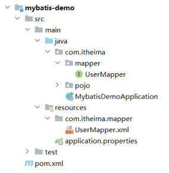
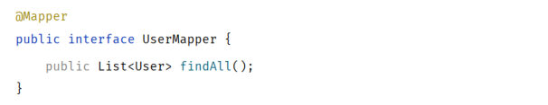
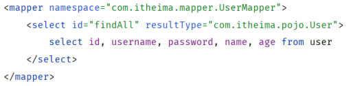
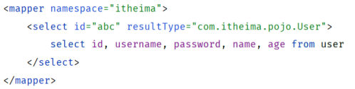
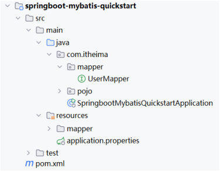
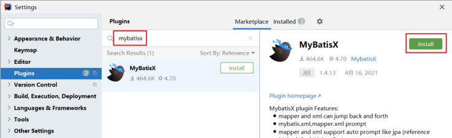

[54 篇](/posts/编程学习/javaweb学习笔记/54-mybatis增删改查/)把增删改查四个操作都写在**注解**里了。这一篇（PPT 第 38-42 页）说的是另一种写法：**把 SQL 搬进 XML 映射文件**。两种方式在 MyBatis 里长期并存，选哪个不是风格问题，而是"这条 SQL 复杂到什么程度"的问题——[54 篇](/posts/编程学习/javaweb学习笔记/54-mybatis增删改查/)那种简单语句用注解就够，复杂 SQL 才是 XML 的主场。

本机的课程工程里两种写法都跑过：`springboot-mybatis-quickstart` 是 **yml + XML**（`findAll` 的 SQL 放在 XML 里），`aliyun-mybatis-quickstart` 是 **properties + 注解**（`findAll` 的 SQL 写在 `@Select` 上），两套都跑通了 5 个测试——这个差异在下面"辅助配置"一节会讲清楚。

## 两种配置方式（PPT 第 38-39 页）

PPT 第 38 页是本节目录页，五格里这一篇进的是最后一格「**XML映射配置**」（前四格分别见 [51 篇](/posts/编程学习/javaweb学习笔记/51-mybatis入门与辅助配置/)/[52 篇](/posts/编程学习/javaweb学习笔记/52-jdbc与mybatis的对比/)/[53 篇](/posts/编程学习/javaweb学习笔记/53-数据库连接池/)/[54 篇](/posts/编程学习/javaweb学习笔记/54-mybatis增删改查/)）。

PPT 第 39 页开门见山：

> 在 Mybatis 中，既可以通过**注解**配置 SQL 语句，也可以通过 **XML 配置文件**配置 SQL 语句。

也就是说，[54 篇](/posts/编程学习/javaweb学习笔记/54-mybatis增删改查/)里 `@Select` / `@Delete` 那些注解并不是唯一的做法；同样一条 SQL，写进 XML 文件里照样生效——但 XML 文件必须**放对位置、写对名字**，这就是下一页那三条"默认规则"。

## XML 映射文件的三条默认规则（PPT 第 39、41 页）

PPT 第 39 页（第 41 页的问答又重复了一遍）给了三条规则，一条都不能少：

> 1. XML 映射文件的**名称与 Mapper 接口名称一致**，并且将 XML 映射文件和 Mapper 接口放置在**相同包**下（**同包同名**）。
> 2. XML 映射文件的 **`namespace` 属性为 Mapper 接口全限定名一致**。
> 3. XML 映射文件中 **SQL 语句的 `id` 与 Mapper 接口中的方法名一致**，并**保持返回类型一致**。

### 规则一：同包同名


*图：课程工程的目录结构——接口在 `src/main/java/com/itheima/mapper/UserMapper.java`，XML 在 `src/main/resources/com/itheima/mapper/UserMapper.xml`（在 resources 下把包路径一级一级建出来），两者"包名 + 文件名"完全对应，这就是"同包同名"*

这里有个初学时容易卡住的细节：**接口在 `java` 目录、XML 在 `resources` 目录，为什么算"同包"？** 因为 Java 代码编译后 class 文件在 `classpath:/com/itheima/mapper/` 下，而 `resources` 里的东西是**原样复制**到 `classpath` 根的——所以在 `resources` 下建出 `com/itheima/mapper/` 这串目录、把 `UserMapper.xml` 放进去，编译之后它在 classpath 里的位置正好和 `com.itheima.mapper.UserMapper` 这个接口"同包同名"。这样 MyBatis 拿着接口名就能**默认找到**同名 XML，**不用写任何配置**。

接口这边长这样（去掉 SQL，只剩方法签名）：


*图：Mapper 接口的写法——类上是 `@Mapper`，方法只剩一句 `public List<User> findAll();`，SQL 不在接口上了*

课程工程里 `findAll` 的注解就是被注释掉、SQL 交给 XML 的（源码原样）：

```java
    /**
     * 查询所有用户
     */
    //@Select("select id, username, password, name, age from user")
    public List<User> findAll();
```

### 规则二、三：namespace 与方法名

XML 那份文件的内容（课程 `UserMapper.xml` 全文）：

```xml
<?xml version="1.0" encoding="UTF-8" ?>
<!DOCTYPE mapper
        PUBLIC "-//mybatis.org//DTD Mapper 3.0//EN"
        "https://mybatis.org/dtd/mybatis-3-mapper.dtd">
<mapper namespace="com.itheima.mapper.UserMapper">

    <!--resultType: 查询返回的单条记录所封装的类型-->
    <select id="findAll" resultType="com.itheima.pojo.User">
        select id, username, password, name, age from user
    </select>

</mapper>
```

逐行对照三条规则：

| XML 里的东西 | 规则 | 这份文件里的值 |
| --- | --- | --- |
| 文件名与位置 | 同包同名 | `resources/com/itheima/mapper/UserMapper.xml` ⇄ 接口 `com.itheima.mapper.UserMapper` |
| `<mapper namespace="…">` | **接口全限定名** | `com.itheima.mapper.UserMapper` |
| `<select id="…">` | **接口里的方法名** | `findAll`（接口里正是 `List<User> findAll()`） |
| `<select resultType="…">` | **返回类型一致**（单条记录封装成什么类型） | `com.itheima.pojo.User`——接口返回 `List<User>`，所以单条的类型就是 `User` |

前两行 `<?xml …?>` 和 `<!DOCTYPE mapper …>` 是 **XML 的声明与约束（DTD）**，MyBatis 官方文档里给了现成的，照着复制过来就行，别手打。

> [!IMPORTANT]
> **`resultType` 写的是"单条记录"封装的类型**：接口返回 `List<User>`，XML 里写的还是 `com.itheima.pojo.User`（课程源码的注释原话是「查询返回的单条记录所封装的类型」）。这是最容易写错的一处——不要因为接口返回 List 就把 `resultType` 写成 `java.util.List`。

PPT 第 39 页还给了一份**错误的对照**，用来把三条规则钉死：


*图：正确写法——`namespace` 是接口全限定名 `com.itheima.mapper.UserMapper`，语句 `id` 是接口方法名 `findAll`*


*图：错误写法——`namespace="itheima"`（不是接口全限定名）、`id="abc"`（不是方法名），这样 MyBatis 根本找不到"这个方法该执行哪条 SQL"，项目启动时就会报错*

### 本机实测：SQL 走 XML 之后

接口上没有 SQL 了，那条 SQL 在 XML 里，跑起来是什么样？本机把工程里的查询测试跑了一遍：

> [!TIP]
> **本机实测**（`springboot-mybatis-quickstart`，`findAll` 的 SQL 在 XML 里）——日志与结果：
>
> ```text
> ==>  Preparing: select id, username, password, name, age from user
> ==> Parameters:
> <==      Total: 5
> User(id=1, username=daqiao, password=123456, name=大乔, age=22)
> User(id=2, username=xiaoqiao, password=123456, name=小乔, age=18)
> User(id=3, username=diaochan, password=123456, name=貂蝉, age=24)
> User(id=4, username=lvbu, password=123456, name=吕布, age=28)
> User(id=5, username=zhaoyun, password=12345678, name=赵云, age=27)
> ```
>
> 三行日志说明三件事：`Preparing` 里就是 XML 里那条 SQL（**从 XML 读出来的**）；这条语句没有参数，所以 `Parameters:` 后面是空的；`Total: 5` 表示查回 5 条，`forEach` 逐条打印后就是那 5 个 `User` 对象——**说明"接口声明方法 + XML 写 SQL + namespace/id 对上"这一套确实接通了**。

## 注解还是 XML（PPT 第 40 页）

PPT 第 40 页专门回答这个问题：

> 那在 Mybatis 的开发中，到底使用注解开发还是使用 XML 开发呢？
> 使用 Mybatis 的**注解**，主要是来完成一些**简单的增删改查**功能。如果需要实现**复杂的 SQL** 功能，建议使用 **XML** 来配置映射语句。

PPT 还给了官方说明的地址（MyBatis 中文文档「入门」页）：<https://mybatis.net.cn/getting-started.html>。

把这句话背后的道理展开：

| | 注解 | XML |
| --- | --- | --- |
| 写在哪 | 接口方法上方（`@Select("…")`） | 独立的 `.xml` 文件 |
| 适合什么 | **简单的增删改查**——一行 SQL 能写完的 | **复杂 SQL**——多表连接、动态条件（`<if>`/`<where>`/`<foreach>` 这类标签）、需要复用/拼装的语句 |
| 代码观感 | 接口和方法紧挨着，一眼看到"这个方法干什么" | 接口保持干净，SQL 集中在一处维护 |
| 配置成本 | 零 | 要遵守三条默认规则（或配 `mapper-locations`） |

所以选择标准很直接：**语句短、条件固定 → 注解；语句长、条件/表名要动态拼 → XML**。这两种方式在同一个工程里**可以混用**（有的方法走注解、有的走 XML），课程工程就是这么做的。

## 辅助配置一：XML 文件想放别处，就配 mapper-locations（PPT 第 42 页）

默认规则要求"同包同名"，但项目里也常见**把 XML 统一放在 `resources/mapper/` 目录**下的做法（本机的课程工程就是）：


*图：课程工程 `springboot-mybatis-quickstart` 的目录——XML 放在 `src/main/resources/mapper/UserMapper.xml`，**并没有**按"同包同名"放在 `resources/com/itheima/mapper/` 下*

这样一来 MyBatis 默认就找不到了，得在配置文件里告诉它去哪儿找：

```properties
#指定XML映射配置文件的位置
mybatis.mapper-locations=classpath:mapper/*.xml
```

这行配置的含义：

- `mybatis.mapper-locations` —— 告诉 MyBatis "XML 映射文件在哪些路径下"；
- `classpath:mapper/*.xml` —— `classpath` 指的是编译后的类路径根（也就是 `resources` 里的内容），这串通配符的意思是"**根目录下 `mapper` 文件夹里的所有 `.xml` 文件**"；
- **配了它就可以不遵守"同包同名"的第一条规则**（位置自由了），但 **namespace 和 id 那两条照样要遵守**——它们决定"哪条 SQL 属于哪个方法"，跟文件放哪儿无关。

两种放法对照着记：

| | 方式一：同包同名（默认） | 方式二：统一目录 + 配置 |
| --- | --- | --- |
| XML 位置 | `resources/com/itheima/mapper/UserMapper.xml`（把接口的包路径在 resources 下建出来） | `resources/mapper/UserMapper.xml`（或任何目录） |
| 要不要配 `mapper-locations` | **不用**（MyBatis 按接口名默认去找） | **必须配**（本课程用的是 `classpath:mapper/*.xml`） |
| 对应 PPT | 第 39 页的三条默认规则 | 第 42 页的辅助配置 |

> [!NOTE]
> 本机实测跑的是**方式二**：课程 `springboot-mybatis-quickstart` 把 XML 放在 `resources/mapper/` 下，并在 yml 里配了 `mybatis.mapper-locations: classpath:mapper/*.xml`；PPT 第 39 页演示的是**方式一**（同包同名、零配置）。选哪种都行，但一个工程里最好统一，别混着放——否则"为什么这条 XML 生效、那条不生效"会很难查。

课程工程完整的那份配置（`application.yml`，这里顺带把上一节的日志配置也放一起看）：

```yaml
#Mybatis的相关配置
mybatis:
  configuration:
    log-impl: org.apache.ibatis.logging.stdout.StdOutImpl
  mapper-locations: classpath:mapper/*.xml
```

而 `aliyun-mybatis-quickstart` 那套工程**没有任何 XML**——`findAll` 的 SQL 就写在 `@Select` 注解上：

```java
    /**
     * 查询所有用户
     */
    @Select("select id, username, password, name, age from user")
    public List<User> findAll();
```

**两个工程，两条路，结果一样**（都跑通 5 个测试、都查出那 5 条用户）——这就是"注解与 XML 并存"最直观的证明。

## 辅助配置二：MybatisX 插件（PPT 第 42 页）

XML 和接口分在两个文件里，来回跳转很烦，PPT 第 42 页推荐一个 IDEA 插件：

> **MybatisX** 是一款基于 IDEA 的快速开发 Mybatis 的插件，为效率而生。


*图：IDEA 的 Settings → Plugins 里搜索 `mybatisx`，点击 Install 安装（装完重启 IDEA 生效）*

装上它以后最大的好处是：**Mapper 接口和 XML 之间可以互相跳转**——点接口方法能跳到 XML 里对应的语句，点 XML 里的语句也能跳回接口方法（插件功能列表里的 "mapper and xml can jump back and forth"）。配合下面这些提示功能，写 XML 时不容易把方法名/参数写错：

- XML 里写 `mybatis.xml`/`mapper.xml` 相关标签有**代码提示**；
- 接口方法能**自动生成**对应的 XML 语句骨架（不用手抄方法名和参数）；
- 参数类型有提示（"support auto prompt like jpa"）。

## 必答问答（PPT 第 41 页）

| PPT 的问题 | 答案 |
| --- | --- |
| XML 映射文件的定义规则？ | ① **文件名与 Mapper 接口名称一致**，并且**放置在相同包下**（同包同名）；② XML 文件的 **`namespace` 属性为 Mapper 接口全限定名**一致；③ XML 文件中 **SQL 语句的 `id` 与 Mapper 接口中的方法名一致** |

（"到底用注解还是 XML 开发"这个问题的答案在第 40 页：**简单的增删改查用注解，复杂 SQL 用 XML**。）

## 小结

| 问题 | 答案 |
| --- | --- |
| SQL 有哪两种配置方式？ | **注解**（`@Select` / `@Delete` …写在接口方法上）和 **XML 映射文件**；两者可以混用 |
| XML 的三条默认规则？ | **同包同名**（名称与接口一致、放相同包下）；**`namespace` = 接口全限定名**；**语句 `id` = 方法名**且返回类型一致 |
| 为什么 XML 放 `resources/com/itheima/mapper/` 就算"同包"？ | `resources` 下的内容会被原样复制到 classpath 根，所以在那里把接口的包路径建出来，编译后两者在 classpath 中就是同包同名——**不用任何配置** |
| `resultType` 写什么？ | **单条记录封装的类型**（接口返回 `List<User>` 时也写 `com.itheima.pojo.User`） |
| XML 换到 `resources/mapper/` 下要配什么？ | `mybatis.mapper-locations=classpath:mapper/*.xml`（指定 XML 的位置）；namespace 和 id 两条规则照旧要守 |
| 本机实测怎么证明 XML 生效？ | `findAll` 的日志：`Preparing: select id, username, password, name, age from user` + 空 `Parameters` + `Total: 5`，接着打印 5 个 `User` 对象 |
| 课程两个工程的差别？ | `springboot-mybatis-quickstart` = **yml + XML**（`resources/mapper/` + `mapper-locations`），`aliyun-mybatis-quickstart` = **properties + 注解**（无 XML）；两套都跑通 5 个测试 |
| MybatisX 干什么？ | IDEA 插件：Mapper 接口与 XML 互相跳转、XML 标签提示、自动生成语句骨架——为效率而生 |

## 相关

- [上一篇：MyBatis增删改查](/posts/编程学习/javaweb学习笔记/54-mybatis增删改查/)
- [下一篇：SpringBoot配置文件](/posts/编程学习/javaweb学习笔记/56-springboot配置文件/)

## 练习题

### 一、知识回顾（读完直接做下面的实践题）

1. **两种配置方式**：SQL 既可以写在接口方法上的**注解**里（`@Select("…")`），也可以写进 **XML 映射文件**；同一个工程里可以混用
2. **规则一（同包同名）**：XML 文件名与 Mapper 接口名一致、放在相同包下；实际做法是在 `resources/com/itheima/mapper/` 下建出接口的包路径（`resources` 会原样复制到 classpath 根，所以编译后算同包）
3. **规则二（namespace）**：`<mapper namespace="…">` 的属性值必须是 **Mapper 接口的全限定名**，课程里是 `com.itheima.mapper.UserMapper`
4. **规则三（id 与返回类型）**：XML 里 SQL 语句的 `id` 与**接口方法名**一致；`resultType` 写**单条记录封装的类型**（接口返回 `List<User>` 时也写 `com.itheima.pojo.User`）
5. **XML 的抬头**：`<?xml version="1.0" encoding="UTF-8" ?>` + `<!DOCTYPE mapper …>` 声明与约束，从官方文档复制，不要手打
6. **注解还是 XML**：简单的增删改查用**注解**；**复杂 SQL** 用 **XML**（官方说明地址 <https://mybatis.net.cn/getting-started.html>）
7. **XML 换位置要配什么**：`mybatis.mapper-locations=classpath:mapper/*.xml`——告诉 MyBatis 去哪里找 XML 映射文件；配了它位置自由，但 `namespace`、`id` 两条规则仍要遵守
8. **本机实测（XML 生效的证据）**：`findAll` 走 XML 时的日志是 `Preparing: select id, username, password, name, age from user`、`Parameters:`（空）、`Total: 5`，然后打印出 5 个 `User` 对象
9. **课程两个工程的差异**：`springboot-mybatis-quickstart` = **yml + XML**（XML 在 `resources/mapper/`，用 `mapper-locations` 指定）；`aliyun-mybatis-quickstart` = **properties + 注解**（没有 XML），两套都跑通了 5 个测试
10. **MybatisX 插件**：IDEA 里安装的 MyBatis 开发插件，支持 **Mapper 接口与 XML 双向跳转**、XML 标签提示、自动生成语句骨架

### 二、裸写题

- [ ] **2-1 把"查询所有用户"的 SQL 从接口搬进 XML**
  需求：`UserMapper` 接口里有一个查全部用户的方法；现在**把 SQL 挪出接口**，写进一个**独立的 XML 映射文件**里，位置让 MyBatis 默认就能找到（不用改任何配置），保证项目启动后调用这个方法仍能查出 5 条数据。
  （练习文件 `test_55_XML映射文件.xml` 的题目2-1 里给了写作区；接口方法签名与实体类位置作为素材已写在素材区。）

  > [!TIP]- 提示（先自己想，实在想不出再点开）
  > **一级 · 思路**：先决定 XML 放哪、叫什么名字（默认规则）；文件里从官方文档抄声明与约束头，再写一个 `mapper` 根标签，把"接口全限定名"和"这条 SQL 的 id/返回类型"分别填对
  > **二级 · 方法**：文件放 `resources/com/itheima/mapper/UserMapper.xml`；根标签用 `<mapper namespace="…">`；查询语句用 `<select id="…" resultType="…">`
  > **三级 · 骨架**：`<?xml version="1.0" encoding="UTF-8" ?>` + `<!DOCTYPE mapper …>` + `<mapper namespace="____"> <select id="____" resultType="____"> select … from user </select> </mapper>`

  > [!TIP]- 参考答案（做完再点开）
  > 文件：`src/main/resources/com/itheima/mapper/UserMapper.xml`
  > ```xml
  > <?xml version="1.0" encoding="UTF-8" ?>
  > <!DOCTYPE mapper
  >         PUBLIC "-//mybatis.org//DTD Mapper 3.0//EN"
  >         "https://mybatis.org/dtd/mybatis-3-mapper.dtd">
  > <mapper namespace="com.itheima.mapper.UserMapper">
  >
  >     <!--resultType: 查询返回的单条记录所封装的类型-->
  >     <select id="findAll" resultType="com.itheima.pojo.User">
  >         select id, username, password, name, age from user
  >     </select>
  >
  > </mapper>
  > ```
  > 接口那边只留方法签名（原来方法上的 `@Select` 要注释/删掉，否则会冲突或让人看混）：
  > ```java
  > @Mapper
  > public interface UserMapper {
  >     public List<User> findAll();
  > }
  > ```
  > 检查三处是否对上：**文件名与位置**（`resources/com/itheima/mapper/UserMapper.xml`）、**namespace**（`com.itheima.mapper.UserMapper`）、**id 与 resultType**（`findAll` / `com.itheima.pojo.User`）。本机工程（放的是 `resources/mapper/`）里 `findAll` 走 XML 的实测日志是 `Preparing: select id, username, password, name, age from user`、`Parameters:`（空）、`Total: 5`——XML 放在上面哪种位置，跑起来这条日志都一样。

- [ ] **2-2 在同一个 XML 里再加一条"按 id 查询用户"**
  需求：接口里新增一个方法——**按用户 id 查一条**用户记录并返回；SQL 也写在同一个 XML 文件里（不要用注解）。写完后调用它查 id 为 1 的用户，确认能拿到"大乔"那条数据。
  （练习文件 `test_55_XML映射文件.xml` 的题目2-2 里给了写作区。）

  > [!TIP]- 提示（先自己想，实在想不出再点开）
  > **一级 · 思路**：接口加方法签名，XML 加一条语句；语句的 id 必须等于新方法名，返回类型还是单条记录的类型；参数照样用 `#{}`
  > **二级 · 方法**：新建的语句用 `<select id="findById" resultType="…">`；SQL 里用 `where id = #{id}`；接口方法叫 `User findById(Integer id);`
  > **三级 · 骨架**：接口 `public ____ findById(____ id);` / XML `<select id="____" resultType="____"> select id, username, password, name, age from user where id = ____ </select>`

  > [!TIP]- 参考答案（做完再点开）
  > 接口新增：
  > ```java
  > public User findById(Integer id);
  > ```
  > 同一个 XML 文件里新增一条语句：
  > ```xml
  >     <select id="findById" resultType="com.itheima.pojo.User">
  >         select id, username, password, name, age from user where id = #{id}
  >     </select>
  > ```
  > 要点：**一条方法对应一条语句**，`id` 和方法名一一对应；XML 里 `#{id}` 取的就是接口方法的形参（单个参数，名字随意但建议一致）。查 id=1 得到的就是 `User(id=1, username=daqiao, password=123456, name=大乔, age=22)` 这一条（该行数据见[54 篇](/posts/编程学习/javaweb学习笔记/54-mybatis增删改查/)实测里的 `findAll` 输出）。

- [ ] **2-3 找错：这份 XML 为什么会让项目起不来**
  背景：有同学把 XML 写成了下面这样，启动项目时报错说找不到方法对应的 SQL 语句：

  ```xml
  <mapper namespace="itheima">
      <select id="abc" resultType="com.itheima.pojo.User">
          select id, username, password, name, age from user
      </select>
  </mapper>
  ```

  完成：① 指出这份 XML 违反了三条默认规则里的哪两条；② 把它们改成正确的值；③ 再回答：如果 XML 不放在"同包同名"的位置，还需要在哪份配置里加一行什么，才能让 MyBatis 找到它？
  （练习文件 `test_55_XML映射文件.xml` 的题目2-3 里给了写作区。）

  > [!TIP]- 提示（先自己想，实在想不出再点开）
  > **一级 · 思路**：对照三条规则一行行看——根标签的属性对不对？语句的 id 对不对？再想想"换目录"时那条配置
  > **二级 · 方法**：根标签的 `namespace` 要写接口全限定名；语句 `id` 要写接口里的方法名；位置自由靠 `mybatis.mapper-locations`
  > **三级 · 骨架**：`<mapper namespace="____.____.____">` / `<select id="____" …>` / `mybatis.mapper-locations=classpath:____/*.xml`

  > [!TIP]- 参考答案（做完再点开）
  > ① 违反了两条：**`namespace` 不是接口全限定名**（写成 `itheima`）、**语句 `id` 不是接口方法名**（写成 `abc`）——这两处对不上，MyBatis 就建立不起"接口方法 → SQL 语句"的映射关系，启动即报错。第三条规则（同包同名）这份代码没体现，它决定"能不能被默认找到"。
  > ② 改成：
  > ```xml
  > <mapper namespace="com.itheima.mapper.UserMapper">
  >     <select id="findAll" resultType="com.itheima.pojo.User">
  >         select id, username, password, name, age from user
  >     </select>
  > </mapper>
  > ```
  > ③ 如果 XML 不放在"同包同名"的位置（比如统一放到 `resources/mapper/` 下），要在配置文件（`application.properties` 或 `application.yml`）里加：
  > ```properties
  > mybatis.mapper-locations=classpath:mapper/*.xml
  > ```
  > 注意：这行只解决"**去哪儿找文件**"；`namespace` 和 `id` 那两条规则**任何方式下都要遵守**。这也是课程 `springboot-mybatis-quickstart` 的实际做法（XML 在 `resources/mapper/`，配置里有这一行）。

### 三、综合题

- [ ] **3-1 把注解版 CRUD 改造成 XML 版，并对照两边的日志**
  把 [54 篇](/posts/编程学习/javaweb学习笔记/54-mybatis增删改查/)写好的四个注解方法整体迁到 XML 里，走一遍"两条路做同一件事"的完整流程。
  1. 准备：接口 `UserMapper` 里保留 `findAll`、`deleteById`、`insert`、`update`、`findByUsernameAndPassword` 五个方法，**把方法上的 `@Select`/`@Delete`/`@Insert`/`@Update` 全部注释掉**；
  2. 决定 XML 的放法并说明理由：要么放 `resources/com/itheima/mapper/UserMapper.xml`（同包同名、零配置），要么放 `resources/mapper/UserMapper.xml` 并在配置里加 `mybatis.mapper-locations=classpath:mapper/*.xml`；
  3. 在 XML 里把这五条语句补齐（每条语句的 `id` 与方法名一致、`resultType` 与返回类型一致，参数用 `#{}` 接）；
  4. 跑测试：查全部（应得 5 条）、按 id 删除、新增、修改、按用户名密码查一条；把每条语句的 `Preparing`/`Parameters` 抄到练习文件末尾；
  5. 对照回答：同一句 SQL，写在注解里和写在 XML 里，**日志里的 `Preparing` 有什么不同**？为什么？（提示：看参数是 `?` 还是具体值）
  6. 再回答 PPT 第 40 页的那个问题：什么时候用注解、什么时候用 XML？把你这五个方法按这个标准分一下类。
  （练习文件 `test_55_XML映射文件.xml` 的"综合题"一段里按这 6 步给了写作区。）

  **涉及知识点**

  | 知识点 | 在这里的应用 |
  | --- | --- |
  | 三条默认规则 | 第 2、3 步——位置、namespace、id 与返回类型 |
  | `mapper-locations` | 第 2 步——XML 换目录时必须配 |
  | XML 语句标签 | 第 3 步——`<select>` / `<insert>` / `<update>` / `<delete>` 的 id 与参数 |
  | `#{}` 预编译 | 第 4、5 步——XML 里同样生成 `?` + `Parameters` |
  | 注解与 XML 的选择 | 第 6 步——简单增删改查 vs 复杂 SQL |

  > [!TIP]- 提示（先自己想，实在想不出再点开）
  > **一级 · 思路**：把[54 篇](/posts/编程学习/javaweb学习笔记/54-mybatis增删改查/)四条注解里的 SQL 原样抄进 XML 的四个标签里，接口只留方法签名；测完拿日志对照
  > **二级 · 方法**：XML 里查询用 `<select>`、新增 `<insert>`、修改 `<update>`、删除 `<delete>`，每个都带 `id`；参数照旧 `#{}`；换个目录就在配置里写 `mybatis.mapper-locations`
  > **三级 · 骨架**：`<select id="findAll" resultType="____">…</select>` / `<delete id="deleteById">delete from user where id = ____</delete>` / `<insert id="insert">insert into user(____) values(____)</insert>` / `<update id="update">…</update>`

  > [!TIP]- 参考答案（做完再点开）
  > **3-1**
  > 1~3. 接口（只留签名）与 XML（放在 `resources/mapper/UserMapper.xml`，并在配置里加 `mybatis.mapper-locations=classpath:mapper/*.xml`）：
  >    ```java
  >    @Mapper
  >    public interface UserMapper {
  >        public List<User> findAll();
  >        public Integer deleteById(Integer id);
  >        public void insert(User user);
  >        public void update(User user);
  >        public User findByUsernameAndPassword(@Param("username") String username, @Param("password") String password);
  >    }
  >    ```
  >    ```xml
  >    <?xml version="1.0" encoding="UTF-8" ?>
  >    <!DOCTYPE mapper
  >            PUBLIC "-//mybatis.org//DTD Mapper 3.0//EN"
  >            "https://mybatis.org/dtd/mybatis-3-mapper.dtd">
  >    <mapper namespace="com.itheima.mapper.UserMapper">
  >
  >        <select id="findAll" resultType="com.itheima.pojo.User">
  >            select id, username, password, name, age from user
  >        </select>
  >
  >        <delete id="deleteById">
  >            delete from user where id = #{id}
  >        </delete>
  >
  >        <insert id="insert">
  >            insert into user(username, password, name, age) values (#{username}, #{password}, #{name}, #{age})
  >        </insert>
  >
  >        <update id="update">
  >            update user set username = #{username}, password = #{password}, name = #{name}, age = #{age} where id = #{id}
  >        </update>
  >
  >        <select id="findByUsernameAndPassword" resultType="com.itheima.pojo.User">
  >            select * from user where username = #{username} and password = #{password}
  >        </select>
  >
  >    </mapper>
  >    ```
  > 4~5. 本机实测里 `findAll` 走 XML 的日志是：
  >    ```text
  >    ==>  Preparing: select id, username, password, name, age from user
  >    ==> Parameters:
  >    <==      Total: 5
  >    ```
  >    而 [54 篇](/posts/编程学习/javaweb学习笔记/54-mybatis增删改查/)里那几条**走注解**的实测日志形如 `Preparing: delete from user where id = ?` + `Parameters: 4(Integer)`。**两边都生成了预编译 SQL**——`Preparing` 行是最终发给数据库的语句模板，注解或 XML 只是"SQL 写在哪儿"的区别，`#{}` 的机制完全一样（这就是[54 篇](/posts/编程学习/javaweb学习笔记/54-mybatis增删改查/)那条"`#{…}` 会变成 `?`"的结论在两处都成立的原因）。
  > 6. 按 PPT 第 40 页的标准：这五个方法都是**简单的增删改查**（每条一句话、条件固定），**用注解更合适**；只有出现多表连接、条件个数不定（需要 `<if>`/`<where>`）、SQL 很长需要单独维护时，才把它们搬到 XML 里。所以真实项目里常见"**注解为主、XML 兜底**"的混用方式——本机课程的两个工程正好各占一边。
