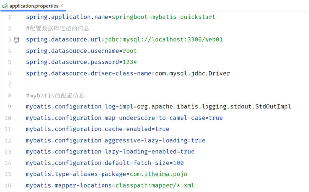
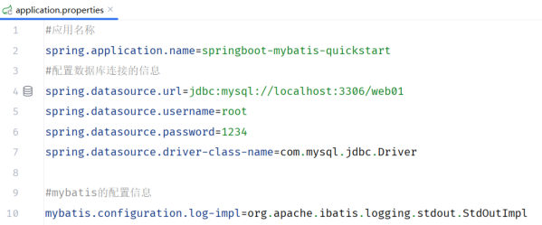
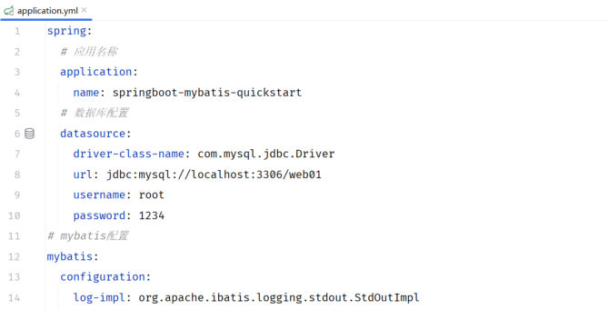
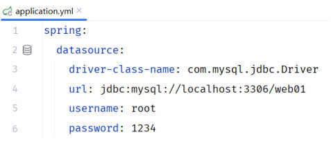

前面几篇一直在"用"配置文件：[51 篇](/posts/编程学习/javaweb学习笔记/51-mybatis入门与辅助配置/)用它配数据源、[53 篇](/posts/编程学习/javaweb学习笔记/53-数据库连接池/)用它切连接池、[55 篇](/posts/编程学习/javaweb学习笔记/55-mybatis-xml映射配置/)用它指定 XML 位置——用的都是 `application.properties`。这一篇（PPT 第 43-49 页，**本章最后一篇**）把这个天天在改的文件说清：它还能叫什么名字、换成另一种格式怎么写，以及一个踩过才知道的坑（`0` 开头）。

本机课程工程正好提供了两份对照样本：`aliyun-mybatis-quickstart` 用 `application.properties`（点分号、一行一项），`springboot-mybatis-quickstart` 用 `application.yml`（缩进、层级）——**两套配置跑同一套 5 个测试都通过**，这就是"两种格式等效"的实测证据。

## 为什么还要专门讲配置文件（PPT 第 43-45 页）

PPT 第 43 页是本章的两大块分隔页（JDBC / MyBatis），第 44 页进入本章第三个小节「**SpringBoot配置文件**」——前两节是 [49-50 篇](/posts/编程学习/javaweb学习笔记/49-jdbc入门/)的 JDBC 和 [51-55 篇](/posts/编程学习/javaweb学习笔记/51-mybatis入门与辅助配置/)的 MyBatis。

天天在改的那个 `application.properties` 长这样（本机课程工程的完整版）：


*图：PPT 第 45 页配的 `application.properties` 真身——同一个 `spring.datasource` 前缀重复了 4 遍、`mybatis.configuration` 重复了 6 遍，一眼看不出层级关系*

PPT 给它标了两个字：**臃肿**、**层级结构不清晰**。

问题就出在**点分号的写法**上：`spring.datasource.url`、`spring.datasource.username`……每一行都得把完整路径从头写一遍，前缀重复、层级被压平。所以 SpringBoot 提供了另一种写法——用**缩进**来表示层级，前缀只写一次。

## 三种配置文件格式（PPT 第 46 页）

PPT 第 46 页：

> SpringBoot 项目提供了多种属性配置方式（**properties、yaml、yml**）。

| 文件名 | 格式 | 写法特点 |
| --- | --- | --- |
| `application.properties` | properties | `点分号`平铺，一行一项；**臃肿、层级结构不清晰** |
| `application.yaml` | yaml | 缩进表示层级；**简洁、以数据为中心** |
| `application.yml` | yml | 同上（**yml 是 yaml 的简写**，两种扩展名等价） |

> [!NOTE]
> 三种文件都是 SpringBoot 的**约定名**：默认放在 `src/main/resources`（classpath 根）下、文件名必须是 `application`，SpringBoot 启动时会自动读取。这也是为什么换格式**不用改任何 Java 代码**——只是把同一份配置换个写法。

同一份数据源配置，两种格式对照（PPT 第 46 页的原文代码）：

```properties
spring.datasource.driver-class-name=com.mysql.jdbc.Driver
spring.datasource.url=jdbc:mysql://localhost:3306/web01
spring.datasource.username=root
spring.datasource.password=1234
```

```yaml
spring:
  datasource:
    driver-class-name: com.mysql.jdbc.Driver
    url: jdbc:mysql://localhost:3306/web01
    username: root
    password: 1234
```

（这两段示例里的 `password` 换成你自己 MySQL 的密码。）

看出规律了吗：**properties 里每一行的点（`.`）就是 yml 里的层级**，`spring.datasource.username` 拆开就是 `spring` → `datasource` → `username` 三层缩进。最后一层的名字（`username`、`password`）后面跟冒号和值。

> [!WARNING]
> PPT 第 46 页这段示例里驱动类名写的是 **`com.mysql.jdbc.Driver`**（MySQL 5.x 时代的旧类名）；课程**代码工程**里用的是 **`com.mysql.cj.jdbc.Driver`**（MySQL 8.x 驱动的新类名，`cj` = Connector/J）。照着现在用的 `mysql-connector-j` 8.x 依赖，应该写后者——这也是 [49 篇](/posts/编程学习/javaweb学习笔记/49-jdbc入门/)里 JDBC 注册驱动的那个类名。

## yml 的语法四条（PPT 第 47 页）

PPT 第 47 页把 yml 的格式规则列了四条，一条都不能违反：

> 1. **值前边必须有空格**，作为分隔符；
> 2. 使用**缩进表示层级关系**，缩进时，**不允许使用 Tab 键，只能用空格**（IDEA 中会自动将 Tab 转换为空格）；
> 3. **缩进的空格数目不重要**，只要**相同层级的元素左侧对齐**即可；
> 4. **`#` 表示注释**，从这个字符一直到行尾，都会被解析器忽略。

一条条展开：

1. **冒号后面那个空格不能省**。`name: 张三` 正确，`name:张三` 会被当成一个"键"（解析器不认）；写成 `name: 张三` 里 `:` 与值之间**至少一个空格**。
2. **层级靠缩进，且缩进只能用空格**——按 Tab 会出现"看起来对齐、解析出来层级不同"的灵异问题；好在 IDEA 会自动把 Tab 换成空格，所以用 IDEA 写基本不会踩。但**从别处复制粘贴时要小心**。
3. **缩进几个空格无所谓，只要同级左对齐**。有人用 2 个空格、有人用 4 个，都对；但同一个文件里**同一层级的兄弟节点必须左对齐**，否则就被解析成"上一项的下一层"。日常按 IDEA 的默认缩进（2 个空格）走就行。
4. **`#` 到行尾都是注释**——所以配置文件里那些说明性文字前面要加 `#`（本机工程里的 `#数据库的连接信息`、`#Mybatis的相关配置` 都是注释）。

### 定义对象 / Map 集合

课程工程里放着的 `application.yml` 示例（单位是一组"键值对"，值同样遵守上面四条）：

```yaml
#定义对象/Map集合
user:
  name: Tom
  age: 18
  gender: 男
```

PPT 第 47 页用的例子是"张三"，结构一样：

```yaml
user:
  name: 张三
  age: 18
  password: 123456
```

写法说明：`user` 下面缩进一层，写它的三个属性——**这就是"对象"**（在 Java 里对应一个 `User` 对象）；`user` 这个名字是自己起的（在代码里用 `@Value("${user.name}")` 这类方式取）。

### 定义数组 / List / Set 集合

```yaml
#定义数组/List/Set集合
hobby:
  - Java
  - Game
  - Sport
```

写法说明：**每一行用一个短横线 `-` 加一个空格开头**，表示"这是一个数组/集合的元素"，每个元素一行；元素可以是字符串、数字、也可以再嵌套对象。

> [!TIP]
> 两种写法的记忆点：**对象 = 名字下面缩进 + 键值对；数组 = 名字下面缩进 + 一排 `- `**。对象在 Java 里是"一个东西有若干属性"，数组是"一组并列的东西"——看 yml 时先问"这个键下面是一堆键值对，还是一排短横线"。

### 注意：以 0 开头的值要用引号引起来

PPT 第 47 页最后一条"注意"是本篇最值钱的一句：

> 在 yml 格式的配置文件中，如果配置项的值是以 **0** 开头的，值需要使用 **`''`** 引起来，因为**以 0 开头在 yml 中表示 8 进制的数据**。

为什么这件事不能只当"注意事项"背？因为它**不报错、不改提示，直接把值改掉**。本机专门做了这个实验：

```yaml
app-demo:
  code-no-quote: 0123456     # 不加引号
  code-quoted: '0123456'     # 加引号
```

> [!TIP]
> **本机实测**（SpringBoot 工程里用 `@Value` 把这两个值注入后打印）：
>
> ```text
> == yml 不加引号的 0123456 = [42798]      ← 被当成八进制解析了！
> == yml 加引号的 0123456   = [0123456]    ← 字符串原样
> ```
>
> 算一下就明白：`0123456` 按八进制读 = 1×8⁵ + 2×8⁴ + 3×8³ + 4×8² + 5×8 + 6 = **42798**（十进制）。也就是说，如果你把一个编号、学号、密码原样写成 `code: 0123456`，程序里拿到的会是 `42798`——**错得悄无声息**。
>
> 还有一个真实的细节：如果这个值里含 **8 或 9**（比如以 0 开头的日期、编号里带这两位），它**根本不是合法的八进制数**，YAML 只能把它当字符串处理、读出来还是原样。但你不能靠这个"侥幸"——**只要你的值恰好是合法八进制（像 `0123456`），它就会被改数字**。所以规范做法是：**凡是想原样保留的 0 开头值，一律加单引号**（`'0123456'`）。

另外要分清：上面这种"0 开头"说的是**数值**。如果值本来就是字符串（比如 `name: 张三`），本来也不会被当成数字。容易踩坑的正是**看起来像数字、你却想当字符串用的那些值**（编号、工号、密码、版本号）。

## 把数据源配置改写成 yml（PPT 第 48 页）

PPT 第 48 页的动作只有一个：**在 `application.yml` 配置文件里配置相关的配置项**——把原来写在 `application.properties` 里的内容整体改成 yml 写法。本机课程工程里正好有改写前、改写后的两份：


*图：改写前——`application.properties` 的数据源部分（`spring.datasource.xxx` 每行重复前缀）与 MyBatis 日志配置*


*图：改写后——同一份配置的 `application.yml` 版本：`spring` 下面缩进出 `application`、`datasource`，`mybatis` 下面缩进出 `configuration`；前缀只出现一次*


*图：PPT 第 49 页配的 yml 数据源写法（只保留了 `spring.datasource` 这一块）——`driver-class-name`、`url`、`username`、`password` 四个键左对齐*

把点换成层级，可供操作的做法就是"**一层一层往右退格**"：

```properties
# 改写前（application.properties）
spring.datasource.driver-class-name=com.mysql.cj.jdbc.Driver
spring.datasource.url=jdbc:mysql://localhost:3306/web01
spring.datasource.username=root
spring.datasource.password=1234
mybatis.configuration.log-impl=org.apache.ibatis.logging.stdout.StdOutImpl
mybatis.mapper-locations=classpath:mapper/*.xml
```

```yaml
# 改写后（application.yml）
spring:
  datasource:
    driver-class-name: com.mysql.cj.jdbc.Driver
    url: jdbc:mysql://localhost:3306/web01
    username: root
    password: 1234

mybatis:
  configuration:
    log-impl: org.apache.ibatis.logging.stdout.StdOutImpl
  mapper-locations: classpath:mapper/*.xml
```

改写时容易出的两个错：

- **`=` 要换成 `:` + 空格**（properties 用等号，yml 用冒号加空格）；
- **同层级的键要左对齐**（`url`、`username`、`password` 都缩进在 `datasource` 下面，`mapper-locations` 则和 `configuration` 同级、缩进在 `mybatis` 下面）。

课程工程改写后的完整文件（`springboot-mybatis-quickstart` 的 `application.yml`）：

```yaml
spring:
  application:
    name: springboot-mybatis-quickstart
  #数据库的连接信息
  datasource:
    type: com.alibaba.druid.pool.DruidDataSource
    url: jdbc:mysql://localhost:3306/web01
    driver-class-name: com.mysql.cj.jdbc.Driver
    username: root
    password: 1234

#Mybatis的相关配置
mybatis:
  configuration:
    log-impl: org.apache.ibatis.logging.stdout.StdOutImpl
  mapper-locations: classpath:mapper/*.xml
```

（这里的 `password` 换成你自己 MySQL 的密码；`type` 那行是 [53 篇](/posts/编程学习/javaweb学习笔记/53-数据库连接池/)切换 Druid 连接池时加的。）

### 实测：properties 与 yml 等效

改完格式会不会"有的配置生效、有的不生效"？本机用两个配套工程对照过：

> [!TIP]
> **本机实测**——`aliyun-mybatis-quickstart` 用 **`application.properties`**（点分号、平铺），`springboot-mybatis-quickstart` 用 **`application.yml`**（缩进、层级）；**两套配置都跑通了同一批 5 个测试**（查全部、删除、新增、修改、按用户名密码查询），功能完全等价。
>
> 也就是说：**格式只影响"怎么写"，不影响"写了算不算"**——只要键的层级对得上（`spring.datasource.username` ⇄ `spring: datasource: username:`），SpringBoot 读到的就是同一份配置。

## 必答问答（PPT 第 49 页）

| PPT 的问题 | 答案 |
| --- | --- |
| SpringBoot 支持哪几类配置文件？ | **`application.properties`**、**`application.yaml`**、**`application.yml`**（yaml 与 yml 是同一种格式的两种扩展名） |
| yml 配置文件的特点及格式？ | 特点：**简洁、以数据为中心**；格式四条——值前必须有空格、缩进用空格（禁用 Tab）、同级左对齐、`#` 注释；另有"**以 0 开头的值表示八进制，想表示它本身的含义需要用 `''` 引起来**" |

## 小结

| 问题 | 答案 |
| --- | --- |
| 为什么不用 properties？ | 点分号写法**前缀重复、臃肿**，**层级结构不清晰**；yml 用缩进直接表达层级，**简洁、以数据为中心** |
| 三种格式 | `application.properties`、`application.yaml`、`application.yml`（yaml = yml）；都放在 `resources` 下、文件名 `application` |
| properties 与 yml 的对应关系 | properties 里每行的**点（`.`）就是 yml 里的层级**；`=` 换成 `:` + 空格 |
| yml 语法四条 | ① 值前必须有空格；② 缩进表示层级、只能用空格（禁 Tab）；③ 缩进数目不重要、同级左对齐；④ `#` 注释到行尾 |
| 对象/Map 怎么写？ | `user:` 下面缩进一层写 `name: 张三`、`age: 18` 这样的键值对 |
| 数组/List/Set 怎么写？ | `hobby:` 下面缩进一层，每行一个 `- Java`（短横线 + 空格 + 元素） |
| 0 开头的值要注意什么？ | **必须用 `''` 引起来**——不加引号会被当成**八进制**；本机实测 `0123456` 读出来是 **42798**（八进制转十进制），加了引号才是字符串 `0123456` |
| properties 和 yml 等效吗？ | **等效**。本机两个工程各用一种格式，**同一批 5 个测试都跑通** |
| 驱动类名写哪个？ | PPT 示例用的旧名 `com.mysql.jdbc.Driver`；用 `mysql-connector-j` 8.x 时应写 **`com.mysql.cj.jdbc.Driver`**（课程代码工程用的是后者） |

## 相关

- [上一篇：MyBatis-XML映射配置](/posts/编程学习/javaweb学习笔记/55-mybatis-xml映射配置/)
- [下一篇：Tlias项目准备与开发规范](/posts/编程学习/javaweb学习笔记/57-tlias项目准备与开发规范/)

## 练习题

### 一、知识回顾（读完直接做下面的实践题）

1. **为什么要有 yml**：properties 的点分号写法把层级压平、前缀重复，**臃肿、层级结构不清晰**；yml 用**缩进**表达层级，**简洁、以数据为中心**
2. **三种配置文件**：`application.properties`、`application.yaml`、`application.yml`（yaml 与 yml 等价，都是 yaml 格式）；都放在 `src/main/resources` 下、文件名必须是 `application`（SpringBoot 的约定，换格式不用改 Java 代码）
3. **语法一**：**值前必须有空格**作为分隔符（`name: 张三`，冒号后至少一个空格）
4. **语法二**：用**缩进表示层级**，缩进**只能用空格、不允许 Tab**（IDEA 会自动把 Tab 转成空格）
5. **语法三**：**缩进的空格数目不重要，只要相同层级的元素左侧对齐**即可
6. **语法四**：`#` 表示注释，从 `#` 到行尾都被解析器忽略
7. **对象/Map 写法**：`user:` 下面缩进一层写 `name: 张三` / `age: 18` / `password: 123456`，这就是一个对象
8. **数组/List/Set 写法**：`hobby:` 下面缩进一层，每行 `- Java` / `- Game` / `- Sport`（短横线 + 空格 + 元素）
9. **0 开头的坑（本机实测）**：以 0 开头的值在 yml 中表示**八进制**；`0123456` 不加引号读出来是 **42798**，加 `''` 引号才是字符串 `0123456`——想原样保留就**一律加引号**
10. **两种格式等效（本机实测）**：`aliyun-mybatis-quickstart`（properties）与 `springboot-mybatis-quickstart`（yml）**同一批 5 个测试都跑通**；对应关系是"properties 里的点 = yml 里的层级"

### 二、裸写题

- [ ] **2-1 把这份数据源配置改写成 yml**
  需求：下面是一段 `application.properties` 里的数据源配置，请把它改写成 `application.yml` 的写法，要求**层级清晰、前缀只出现一次**（驱动类名用 MySQL 8.x 的新类名）：

  ```properties
  spring.datasource.driver-class-name=com.mysql.cj.jdbc.Driver
  spring.datasource.url=jdbc:mysql://localhost:3306/web01
  spring.datasource.username=root
  spring.datasource.password=1234
  ```

  做完再回答：properties 里每行那个点（`.`），在 yml 里变成了什么？
  （练习文件 `test_56_配置格式改写.yml` 的题目2-1 里给了写作区。）

  > [!TIP]- 提示（先自己想，实在想不出再点开）
  > **一级 · 思路**：把 `spring.datasource` 这个前缀抽出来当"父层"，它下面的四个键退一格变成子层；等号换成冒号 + 空格
  > **二级 · 方法**：第一层写 `spring:`，第二层缩进写 `datasource:`，第三层再缩进写四个键（`driver-class-name` / `url` / `username` / `password`）
  > **三级 · 骨架**：`spring:` ↳（缩进）`datasource:` ↳（再缩进）`driver-class-name: ____` / `url: ____` / `username: ____` / `password: ____`

  > [!TIP]- 参考答案（做完再点开）
  > ```yaml
  > spring:
  >   datasource:
  >     driver-class-name: com.mysql.cj.jdbc.Driver
  >     url: jdbc:mysql://localhost:3306/web01
  >     username: root
  >     password: 1234
  > ```
  > 回答：properties 里的**每个点（`.`）= yml 里的一层缩进**。`spring.datasource.username` 拆开就是 `spring` → `datasource` → `username` 三层。四个键是同级兄弟，**必须左对齐**（都缩进 4 个空格、写在 `datasource:` 下面）；冒号后面记得留空格。本机实测这套 yml 与 properties 版跑同一批测试结果一致。

- [ ] **2-2 用 yml 定义一组"对象"和一组"数组"**
  需求：在一个 yml 文件里写两块配置——① 一个叫 `user` 的对象，属性是姓名 `张三`、年龄 `18`、密码 `123456`；② 一个叫 `hobby` 的集合，元素依次是 `Java`、`Game`、`Sport`。要求注释写清哪块是对象、哪块是数组，且**不要违反四条语法规则**。
  （练习文件 `test_56_配置格式改写.yml` 的题目2-2 里给了写作区。）

  > [!TIP]- 提示（先自己想，实在想不出再点开）
  > **一级 · 思路**：对象是"名字下面缩进一层写键值对"；集合是"名字下面缩进一层、每行一个短横线开头的元素"
  > **二级 · 方法**：对象用 `user:` + 缩进键值对；数组用 `hobby:` + `- Java` 这样的行（短横线后必须有空格）；注释用 `#`
  > **三级 · 骨架**：`# 定义对象/Map集合` + `user:` ↳ `name: ____` / `age: ____` / `password: ____` ；`# 定义数组/List/Set集合` + `hobby:` ↳ `- ____` / `- ____` / `- ____`

  > [!TIP]- 参考答案（做完再点开）
  > ```yaml
  > #定义对象/Map集合
  > user:
  >   name: 张三
  >   age: 18
  >   password: 123456
  >
  > #定义数组/List/Set集合
  > hobby:
  >   - Java
  >   - Game
  >   - Sport
  > ```
  > 检查点：① 冒号后面都有空格；② 层级缩进用空格、同级左对齐（`name`/`age`/`password` 三个对得整整齐齐；三个 `- ` 也对齐）；③ 注释用 `#`。（课程 `资料/06. 后端Web基础…/代码/application.yml` 里就是这份示例，值换成了 `Tom`/`男`/`Java, Game, Sport`。）

- [ ] **2-3 0 开头的"编号"为什么读出来变了样**
  需求：你在 yml 里配了一个业务编号 `998877` 之外，还配了一个**以 0 开头**的编号 `0123456`，代码里读出来却发现不是 `0123456`。
  完成：① 不加引号时读出来的数值是多少？为什么会这样（按几进制解析）？② 把值改成什么写法才能原样读出来？③ 顺带回答：如果这个 0 开头的值里**含 8 或 9**（不是合法八进制），不加引号会怎样？
  （练习文件 `test_56_配置格式改写.yml` 的题目2-3 里给了写作区。）

  > [!TIP]- 提示（先自己想，实在想不出再点开）
  > **一级 · 思路**：yml（YAML）把 0 开头的数字当成别的进制，把 `0123456` 按这个进制换算成十进制是多少？
  > **二级 · 方法**：八进制按位权展开（第 n 位 × 8 的幂）；要原样保留就给值加**单引号**，把它变成字符串
  > **三级 · 骨架**：答案 `____`（用计算器算 8 进制 `123456` 的十进制值）；写法 `code: '____'`

  > [!TIP]- 参考答案（做完再点开）
  > ① 读出来是 **42798**——YAML 把 `0123456` 当**八进制**（`0` 前缀是八进制标记），按位权展开 1×8⁵ + 2×8⁴ + 3×8³ + 4×8² + 5×8 + 6 = **42798**。**本机实测**（用 `@Value` 注入后打印）：
  >    ```text
  >    == yml 不加引号的 0123456 = [42798]
  >    == yml 加引号的 0123456   = [0123456]
  >    ```
  > ② 写成 `code: '0123456'`（**加单引号**），它就被当成字符串、原样读出 `0123456`。PPT 第 47 页那句"以 0 开头的值需要用 `''` 引起来，因为以 0 开头在 yml 中表示 8 进制的数据"就是这个意思。
  > ③ 含 8 或 9 的值（如 `0123458`）**不是合法的八进制数**，YAML 无法把它当数字，只能当字符串、原样读出来——但这属于"侥幸"，值一变（换成合法八进制）就又会被改掉，所以**规范做法是凡 0 开头想原样保留的一律加引号**。

### 三、综合题

- [ ] **3-1 把工程里的整份配置从 properties 改写成 yml，并跑测试验证等效**
  这一题就是把本章天天在用的那份配置亲手换一次格式，顺便验证"换了写法有没有哪项失效"。
  1. 准备一份 `application.properties`（素材见练习文件），内容含四块：应用名 `springboot-mybatis-quickstart`、数据源四项（`web01`、`root`、`1234`、`com.mysql.cj.jdbc.Driver`）、MyBatis 日志输出 `org.apache.ibatis.logging.stdout.StdOutImpl`、XML 映射文件位置 `classpath:mapper/*.xml`；
  2. 在 yml 里把四块按层级写出来：`spring.application.name`、`spring.datasource.*`、`mybatis.configuration.log-impl`、`mybatis.mapper-locations`（**注意 `mapper-locations` 与 `configuration` 同级**）；
  3. 自查四条语法：每个冒号后有空格、缩进只用空格、同级左对齐、注释用 `#`；
  4. 把 properties 文件改名/移走（避免两份同时存在），只留 yml，启动工程跑那 5 个测试；
  5. 对照回答：**yml 版和 properties 版跑出来的日志与结果有没有差别**？为什么（想想 SpringBoot 是按什么读配置的）？
  6. 最后回答 PPT 第 49 页的两个问题（支持哪几类配置文件、yml 的特点与格式），并写出"0 开头的值"那条注意事项与你会采用的写法。
  （练习文件 `test_56_配置格式改写.yml` 的"综合题"一段里按这 6 步给了写作区。）

  **涉及知识点**

  | 知识点 | 在这里的应用 |
  | --- | --- |
  | 三种格式 | 第 1、2 步——从 properties 改写成 yml |
  | 层级与点 | 第 2 步——`spring.datasource.url` → `spring: datasource: url:` |
  | 语法四条 | 第 3 步——空格、缩进、对齐、注释 |
  | 配置等效 | 第 4、5 步——换格式后 5 个测试照跑（本机实测两个工程各用一种格式都通过） |
  | 0 开头的值 | 第 6 步——八进制坑与加引号的写法 |

  > [!TIP]- 提示（先自己想，实在想不出再点开）
  > **一级 · 思路**：把每条 properties 的键按"点"切开，变成本层的父节点 + 缩进一层的子节点；`mybatis` 那两块里，`log-impl` 在 `configuration` 下面、`mapper-locations` 直接在 `mybatis` 下面
  > **二级 · 方法**：`spring:` → `application:`（`name:`）/ `datasource:`（四项）；`mybatis:` → `configuration:`（`log-impl:`）/ `mapper-locations:`
  > **三级 · 骨架**：`spring:` ↳ `application:` ↳ `name: ____`，↳ `datasource:` ↳ `url:` / `driver-class-name:` / `username:` / `password:`；`mybatis:` ↳ `configuration:` ↳ `log-impl: ____`，↳ `mapper-locations: ____`

  > [!TIP]- 参考答案（做完再点开）
  > **3-1**
  > 2~3. yml 版（与课程 `springboot-mybatis-quickstart` 的 `application.yml` 一致）：
  >    ```yaml
  >    spring:
  >      application:
  >        name: springboot-mybatis-quickstart
  >      #数据库的连接信息
  >      datasource:
  >        url: jdbc:mysql://localhost:3306/web01
  >        driver-class-name: com.mysql.cj.jdbc.Driver
  >        username: root
  >        password: 1234
  >
  >    #Mybatis的相关配置
  >    mybatis:
  >      configuration:
  >        log-impl: org.apache.ibatis.logging.stdout.StdOutImpl
  >      mapper-locations: classpath:mapper/*.xml
  >    ```
  >    （课程工程里 `datasource` 下还有一行 `type: com.alibaba.druid.pool.DruidDataSource`，那是[53 篇](/posts/编程学习/javaweb学习笔记/53-数据库连接池/)切 Druid 用的，本题不含。）
  > 4~5. 本机实测：`aliyun-mybatis-quickstart` 用 `application.properties`、`springboot-mybatis-quickstart` 用 `application.yml`，**两套配置跑同一批 5 个测试（查全部/删除/新增/修改/按用户名密码查询）全部通过**，日志与数据结果一致。原因是 SpringBoot 按**约定的文件名**在 classpath 根目录读取配置，把内容解析成同一棵"配置树"——点分号的 `spring.datasource.username` 与缩进的 `spring: datasource: username:` 在它眼里是同一个键，**格式只影响写法、不影响是否生效**。
  > 6. PPT 第 49 页问答：① 支持 `application.properties`、`application.yaml`、`application.yml` 三类；② yml 的特点是**简洁、以数据为中心**，格式为"值前必须有空格 / 缩进用空格不许 Tab / 同级左对齐 / `#` 注释"，另有注意项——**以 0 开头的值表示八进制，想表示本身含义要用 `''` 引起来**。我会采用的写法：凡是编号、工号、密码这类"看着像数字但要当字符串用"的值，**一律加单引号**（如 `code: '0123456'`），避免被悄悄转成八进制（本机实测 `0123456` → `42798`）。
