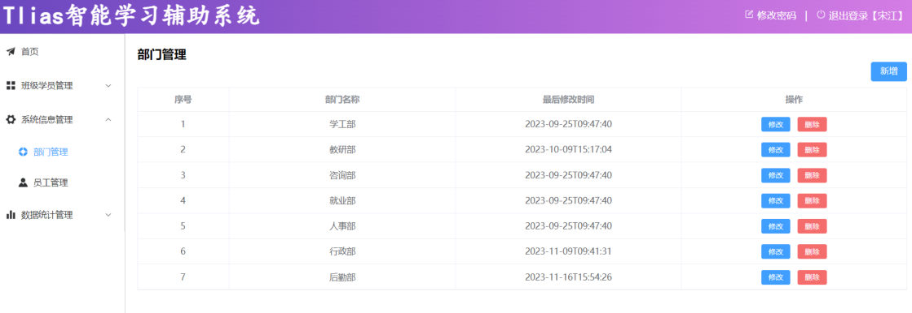
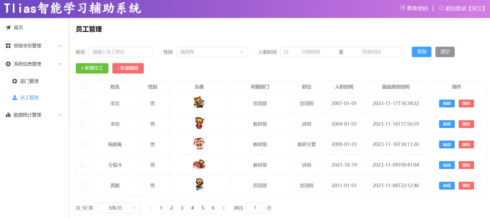
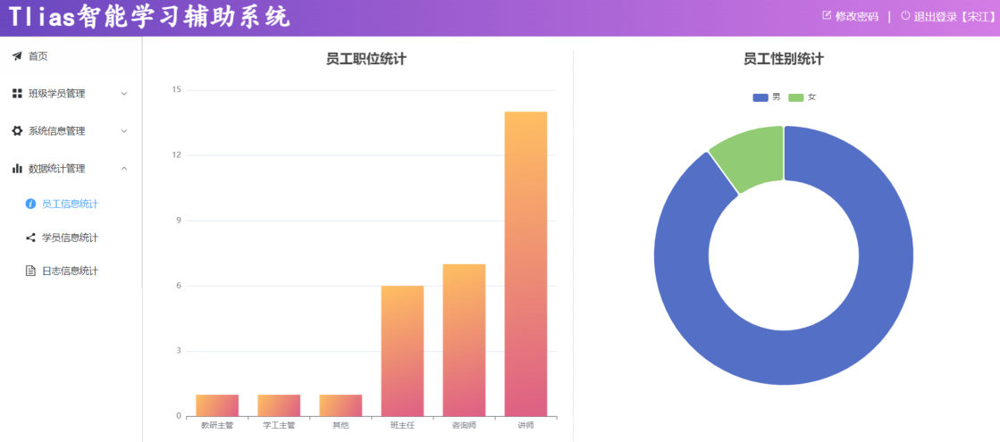
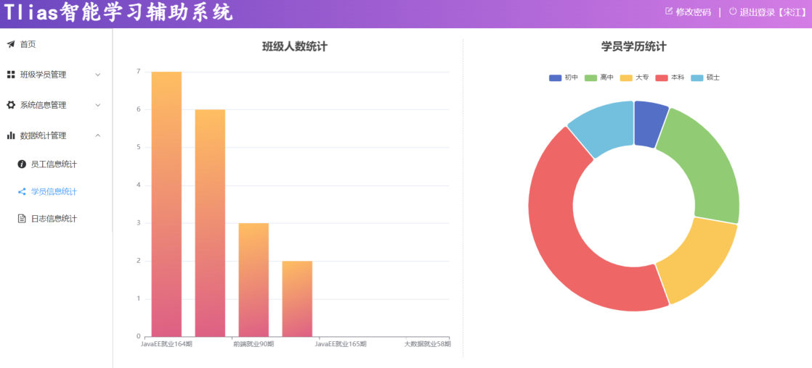
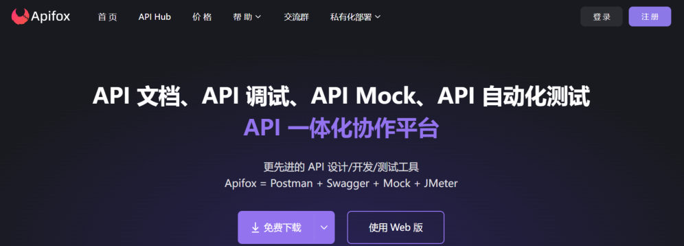
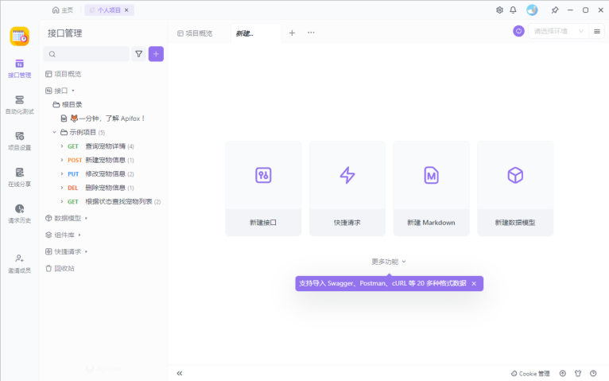
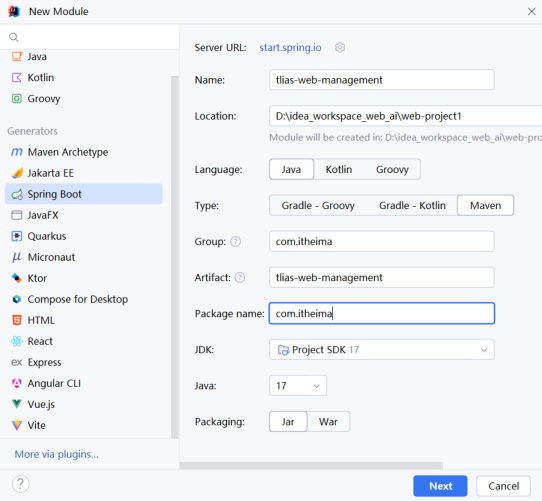
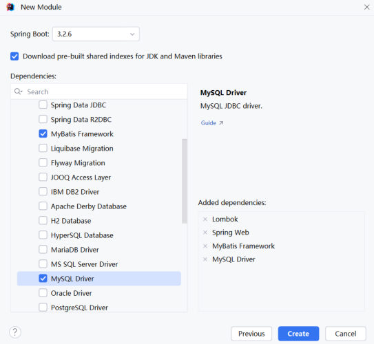

前面 15 篇（[40 篇](/posts/编程学习/javaweb学习笔记/40-数据库概述与mysql入门/)到 [56 篇](/posts/编程学习/javaweb学习笔记/56-springboot配置文件/)）一直在打"后端基础"：MySQL → JDBC → MyBatis → SpringBoot 配置。到这一篇，基础部分结束了，正式进入 **Web 后端实战**——用前面学的所有东西做一个完整项目：**Tlias 智能学习辅助系统**。

这一篇对应 PPT 第 1-23 页，是第 7 章的开篇（**准备工作**小节），它不写业务代码，只解决四个问题：这个系统要做什么（需求）、前后端怎么合作（开发模式）、接口按什么风格设计（Restful）、工程怎么搭起来（依赖 + 表 + 配置 + 两个基础类）。后面的 [58 篇](/posts/编程学习/javaweb学习笔记/58-部门管理-查询部门/)开始才逐个接口地写代码。

## 课程全景：这条学习路线走到哪了（PPT 第 1-2 页）

PPT 第 1 页是章节封面「**Web 开发(AI)**」，第 2 页把整门课的地图摊开，一共五块：

| 模块 | 包含内容 | 对应笔记 |
| --- | --- | --- |
| Web 前端基础 | HTML、CSS、JavaScript、Vue3、Ajax/Axios | 03-22 篇 |
| Web 后端基础 | Maven、Web 基础知识、MySQL、JDBC、MyBatis | 23-56 篇 |
| **Web 后端实战** | **Tlias 案例** | **57-63 篇（本篇开始）** |
| Web 前端实战 | Tlias 案例 | 后续章节 |
| Web 项目部署 | Linux、Docker | 后续章节 |

注意第 2 页里「Tlias 案例」出现了两次——同一个项目，后端实战做一遍它的服务端，前端实战做一遍它的页面，部署阶段再把它推到 Linux/Docker 上。本章（57-63）做的是**后端**这一遍，且只做其中一个模块（部门管理），把"三层架构 + 接口文档 + Restful"这套流程完整走一遍。

## Tlias 要做什么（PPT 第 3-6 页）

PPT 第 3 页给出项目名，第 4-6 页讲需求——**Tlias 智能学习辅助系统**，一个 IT 培训机构的内部管理系统（管班级、管学员、管员工、管部门，再看数据报表）。需求清单（PPT 第 5 页原文）：

| 功能 | 说明 |
| --- | --- |
| 部门管理 | 查询、新增、修改、删除 |
| 员工管理 | 查询、新增、修改、删除 |
| 文件上传 | 上传员工头像、学员资料等文件 |
| 报表统计 | 员工职位统计、员工性别统计、班级人数统计、学员学历统计等图表 |
| 登录认证 | 登录后才能进系统 |
| 日志管理 | 记录系统操作日志 |
| 班级、学员管理 | 班级与学员的整套管理（**实战内容**） |

这些功能不是靠文字想象的，PPT 配了系统页面截图（第 5 页把上面这些需求列成清单，**第 6 页干脆直接把部门管理的页面摆了出来**——本章接下来要做的正是这个模块）。挑几张最能说明问题的：


*图：系统的部门管理页（PPT 第 4-6 页）——一张表格展示所有部门，带「新增」按钮，每行有「修改」「删除」；本章做的就是这张表背后的接口*


*图：员工管理页（PPT 第 4-5 页）——比部门管理复杂得多：姓名/性别/入职时间三个条件查询、新增员工、批量删除、分页，还带头像列*


*图：报表统计（PPT 第 4-5 页）——员工职位统计（柱状图）与员工性别统计（环形图）*


*图：同一模块的另外两张报表（PPT 第 4-5 页）——班级人数统计与学员学历统计*

看这张图就能明白"前后端分离"为什么主流：**页面上的每一个数字、每一行表格，都是后端接口返回的数据渲染出来的**。本章要写的就是这些数据背后的接口。

## 本章路线图（PPT 第 7 页）

PPT 第 7 页列出本章的六个小节，也就是接下来七篇笔记的顺序：

| 小节 | 内容 | 对应笔记 |
| --- | --- | --- |
| 准备工作 | 开发模式、Restful、工程搭建 | 本篇 |
| 查询部门 | 第一个接口（含数据封装问题） | 58 篇 |
| 删除部门 | 接收简单请求参数 | 60 篇 |
| 新增部门 | 接收 JSON 请求参数 | 61 篇 |
| 修改部门 | 路径参数 + 查询回显 | 62 篇 |
| 日志技术 | Logback 与日志级别 | 63 篇 |
| （穿插） | 前后端联调与 Nginx 反向代理 | 59 篇 |

## 开发规范一：为什么不要"前后端混合开发"（PPT 第 8-9 页）

PPT 第 8 页是「准备工作」的目录页，它把本小节拆成三块：**开发规范-开发模式**、**开发规范-Restful风格**、**工程搭建**。先看开发模式。

第 9 页讲的是老做法——**前后端混合开发**：前端页面和后端代码写在**同一个工程**里，一起开发、一起部署（典型场景：后端程序员直接用模板把数据"填"进 HTML 页面里再返回）。PPT 给它标了三个缺点：

- **难以维护**——HTML、CSS、JS 和 Java 代码混在一个工程里，改一处牵动全身；
- **分工不明确**——前端和后端的活没有清晰边界，谁都能改别人的代码；
- **不便管理**——代码在一起、部署也在一起，前端改一个按钮也要把整个后端重新打包上线。

## 开发规范二：前后端分离开发（PPT 第 10-12 页）

PPT 第 10 页给出的结论是：**当前最为主流的开发模式就是前后端分离**。它的核心是一张图：

```text
       原型 + 需求
            │
        ┌───┴───┐
   前端开发    后端开发        ← 并行开发，各看各的接口文档
        │       │
     请求 ⇄ 响应（按接口文档的约定）
```

前后端各自"阅读-开发"：前端读接口文档，按约定的地址和参数写页面、发请求；后端读接口文档，按约定的格式返回数据。两边唯一的"合同"就是**接口文档**。

PPT 第 11 页把流程画成五步，第 12 页的问答页又重复了一遍：

```text
需求分析 → 接口设计(API接口文档) → 前后端并行开发(遵守规范) → 测试(前端、后端) → 前后端联调测试
```

一步一句地翻译：

1. **需求分析**——把"要做什么"定下来（比如部门管理页要有查询/新增/修改/删除）；
2. **接口设计**——产出 **API 接口文档**：每个接口的请求路径、请求方式、请求参数、响应数据的格式，全部写死；
3. **前后端并行开发**——前端照着文档写页面（数据先用 Mock），后端照着文档写接口，**两边同时干**；
4. **测试**——前端测自己页面的渲染和交互，后端用自己的工具测接口能不能返回正确的数据；
5. **前后端联调测试**——前端把请求真正打到后端上，跑通整条链路（这一步需要 Nginx 反向代理，59 篇讲）。

> [!IMPORTANT]
> 前后端分离的关键词是"**分开**"：PPT 第 12 页的答案是——**前端项目、后端项目，开发和部署都是分开的**。所以后端程序员不需要会写 Vue，前端程序员也不需要懂 Java，两拨人靠接口文档对齐。本章我们只负责后端那一半。

## 开发规范三：Restful 风格的接口（PPT 第 13-17 页）

PPT 第 13 页又出现一次「准备工作」目录（这一页只是分隔），第 14 页点题：接口文档里的接口，要按 **Restful** 来设计。

第 15 页给的定义：

> REST（REpresentational State Transfer），表述性状态转换，它是一种**软件架构风格**。

风格看不见摸不着，PPT 用两张对照表把它说清楚。**传统风格**的接口长这样：

| 传统风格 url | 请求方式 | 含义 | 备注 |
| --- | --- | --- | --- |
| `http://localhost:8080/user/getById?id=1` | GET | 查询 id 为 1 的用户 | 不规范、难维护 |
| `http://localhost:8080/user/saveUser` | POST | 新增用户 | |
| `http://localhost:8080/user/updateUser` | POST | 修改用户 | |
| `http://localhost:8080/user/deleteUser?id=1` | GET | 删除 id 为 1 的用户 | |

**REST 风格**的接口长这样（PPT 第 15、16 页）：

| REST 风格 url | 请求方式 | 含义 | 备注 |
| --- | --- | --- | --- |
| `http://localhost:8080/users/1` | GET | 查询 id 为 1 的用户 | URL 定位资源、HTTP 动词描述操作、简洁/规范/优雅 |
| `http://localhost:8080/users/1` | DELETE | 删除 id 为 1 的用户 | |
| `http://localhost:8080/users` | POST | 新增用户 | |
| `http://localhost:8080/users` | PUT | 修改用户 | |

两处别扭的地方一对比就露出来了：

- URL 里**带着动作名**（`getById`、`saveUser`、`updateUser`、`deleteUser`），动作和资源混在一起——而且"新增"这个动作，不同的人会写出 `addUser`、`add`、`insertUser`、`insert`、`saveUser`、`save` 六种（PPT 第 15 页下面那一排词就是举这个例子），一个团队里谁都记不住别人的写法；
- 想表达"删除"却用了 GET 请求（浏览器地址栏点一下就能触发删除，本身也不合理）。

REST 的做法是**把两件事分开**：URL 只用来**定位资源**（`/users` 就是"用户"这类资源，`/users/1` 就是"1 号用户"），**用 HTTP 请求方式（动词）描述对它做什么操作**：

| 请求方式 | 含义 |
| --- | --- |
| GET | 查询 |
| POST | 新增 |
| PUT | 修改 |
| DELETE | 删除 |

这样 `/users` 配 POST 是新增、配 PUT 是修改，`/users/1` 配 GET 是查询、配 DELETE 是删除——**URL 简洁固定，动作靠请求方式表达**。

PPT 第 16 页还专门写了两条"注意"：

> [!WARNING]
> 1. **REST 是风格，是约定方式，约定不是规定，可以打破**——它是团队共识，不是框架强制；真遇到 REST 表达不了的场景（比如批量删除），照样可以发明自己的写法。
> 2. **描述功能模块通常使用复数形式（加 s）**，表示"此类资源"而不是单个资源，例如 `users`、`books`……所以本项目里部门那类资源叫 `/depts` 而不是 `/dept`。

第 17 页的问答，答案就是上面两句加一张表：

| PPT 的问题 | 答案 |
| --- | --- |
| REST 风格的特点？ | **URL 定义资源**、**HTTP 动词描述操作** |
| REST 风格中四种请求方式及对应操作？ | **GET 查询**、**POST 新增**、**PUT 修改**、**DELETE 删除** |

本项目的接口就是照这个规范设计的（从这里就能看出后面几篇要做什么）：

| 接口 | 请求方式 | 路径 |
| --- | --- | --- |
| 查询全部部门 | GET | `/depts` |
| 新增部门 | POST | `/depts` |
| 修改部门 | PUT | `/depts` |
| 删除部门 | DELETE | `/depts?id=…` |
| 根据 ID 查询部门（回显用） | GET | `/depts/{id}` |

同一个 `/depts`，换个请求方式就是另一个接口——所以接口文档里"请求方式"那一栏必须写清楚。

## Apifox：接口的测试台（PPT 第 18-21 页）

PPT 第 18 页先抛了两个问题，都是前后端分离带来的：

> - 前后端都在并行开发，**后端开发完对应的接口之后，如何对接口进行请求测试呢**？
> - 前后端都在并行开发，**前端开发过程中，如何获取到数据，测试页面的渲染展示呢**？

第 19 页给出工具：

> **Apifox** 是一款集成了 **Api 文档、Api 调试、Api Mock、Api 测试**的一体化协作平台。
>
> **作用**：接口文档管理、接口请求测试、Mock 服务。官网：`https://apifox.com/`


*图：Apifox 官网首页（PPT 第 19 页）——标语写得很直白「API 文档、API 调试、API Mock、API 自动化测试」的"API 一体化协作平台"，右下角那句 `Apifox = Postman + Swagger + Mock + JMeter` 说明了它顶掉了四个工具*


*图：Apifox 的接口管理界面（PPT 第 20 页）——左侧按目录管理接口，示例项目里已经躺着 GET 查询/POST 新增/PUT 修改/DELETE 删除四个请求，右上角有"测试环境"下拉；底部还支持导入 Swagger、Postman、cURL 等 20 多种格式*

PPT 第 21 页回答了"**为什么要用 Apifox**"：

> 由于**浏览器地址栏发起的请求，都是 GET 方式的请求**，如果我们需要发起 **POST、PUT、DELETE** 方式的请求，就需要借助于这类工具。

这句话是理解 Apifox 用途的钥匙：浏览器地址栏只能"打开一个地址"（GET），而 [32 篇](/posts/编程学习/javaweb学习笔记/32-http协议与请求数据格式/)说过，POST/PUT 的参数要放在**请求体**里、DELETE 是另一种请求方式——这些光靠地址栏发不出来。所以：

- 后端开发完接口 → 用 Apifox **发请求测试**（改请求方式、填请求体、看响应）；
- 前端还没拿到后端接口时 → 用 Apifox 的 **Mock 服务**假装接口已经好了，先把页面渲染调通；
- 接口文档本身也可以放在 Apifox 里**管理与分享**（课程资料 `02. 接口文档` 里的 OpenAPI JSON 就是可以直接导入 Apifox 的格式）。

> [!TIP]
> **本机实测**：这台机器上就是用命令行工具（curl）按 Apifox 里同样的方式测通了本章的四个接口，响应就是下面「Result」一节里的真实格式。顺带踩到一个坑——在 Windows 命令行里直接发**中文** JSON 会 400（命令行参数是 GBK 编码，服务端按 UTF-8 解析失败），把 JSON 写进 UTF-8 文件再发、或者干脆用 Apifox 就没这个问题（这个坑在讲新增接口时会详细说）。

## 工程搭建（PPT 第 22-23 页）

PPT 第 22 页是「准备工作」目录页的第三次出现（说明工程搭建这个小节要开始了），第 23 页把搭建过程写成三条：

> 1. 创建 SpringBoot 工程，并引入 **web 开发起步依赖、mybatis、mysql 驱动、lombok**。
> 2. 创建数据库表 **dept**，并在 **application.yml** 中配置数据库的基本信息。
> 3. 准备基础代码结构，并引入实体类 **Dept** 及统一的响应结果封装类 **Result**。

一条条做。

### 第 1 步：创建 SpringBoot 工程并引入四个依赖

创建过程跟 [30 篇](/posts/编程学习/javaweb学习笔记/30-springboot快速入门/)一样，用 IDEA 的 Spring Initializr：填好工程名、包名、JDK，再在依赖页勾选需要的依赖。


*图：创建工程时填的信息（PPT 第 23 页）——Name 与 Artifact 都是 `tlias-web-management`，Group 是 `com.itheima`，Package name 是 `com.itheima`，JDK 与 Java 都选 17，打包方式 Jar*


*图：依赖选择页（PPT 第 23 页）——勾了 MyBatis Framework 和 MySQL Driver，右侧 Added dependencies 里能看到最终四项：Lombok、Spring Web、MyBatis Framework、MySQL Driver*

这正是 PPT 说的四个依赖，课程工程 `pom.xml` 里对应的坐标如下：

```xml
<!-- Web 开发起步依赖（内嵌 Tomcat、SpringMVC、JSON 转换） -->
<dependency>
    <groupId>org.springframework.boot</groupId>
    <artifactId>spring-boot-starter-web</artifactId>
</dependency>
<!-- MyBatis（含 spring-jdbc、mybatis、连接池等） -->
<dependency>
    <groupId>org.mybatis.spring.boot</groupId>
    <artifactId>mybatis-spring-boot-starter</artifactId>
    <version>3.0.3</version>
</dependency>
<!-- MySQL 驱动 -->
<dependency>
    <groupId>com.mysql</groupId>
    <artifactId>mysql-connector-j</artifactId>
    <scope>runtime</scope>
</dependency>
<!-- Lombok（实体类上 @Data 之类的注解靠它） -->
<dependency>
    <groupId>org.projectlombok</groupId>
    <artifactId>lombok</artifactId>
    <optional>true</optional>
</dependency>
```

（截图里创建向导选的是 Spring Boot 3.2.6，课程工程 `pom.xml` 里是 **3.2.10**，同一代 3.2.x，不影响任何写法；Java 版本都是 17。）

### 第 2 步：建 dept 表和配 application.yml

数据库还是用 [41 篇](/posts/编程学习/javaweb学习笔记/41-sql分类与数据库操作/)起的那套 MySQL，新建一个库 `tlias`，然后建表（课程资料 `05. 数据库表/dept.sql` 原文）：

```sql
create table dept (
  id int unsigned primary key auto_increment comment 'ID, 主键',
  name varchar(10) not null unique comment '部门名称',
  create_time datetime default null comment '创建时间',
  update_time datetime default null comment '修改时间'
) comment '部门表';

insert into dept values (1,'学工部','2024-09-25 09:47:40','2024-09-25 09:47:40'),
                        (2,'教研部','2024-09-25 09:47:40','2024-09-09 15:17:04'),
                        (3,'咨询部','2024-09-25 09:47:40','2024-09-30 21:26:24'),
                        (4,'就业部','2024-09-25 09:47:40','2024-09-25 09:47:40'),
                        (5,'人事部','2024-09-25 09:47:40','2024-09-25 09:47:40'),
                        (6,'行政部','2024-11-30 20:56:37','2024-09-30 20:56:37');
```

这张表有几个点后面会用到：

- `id` 是**无符号整数 + 主键 + 自增**（新增部门时不用给 id）；
- `name` **非空且唯一**（所以不能重复添加同名部门）；
- `create_time`、`update_time` 两条时间字段——**这就是 58 篇"数据封装"问题的源头**（`create_time` 和 Java 属性 `createTime` 名字对不上）；
- 先插了 6 条数据，且 `update_time` 各不相同（咨询部的 `2024-09-30` 最新），正好用来验证查询是按修改时间倒序排的。

然后在 `application.yml` 里配数据源（写法就是 [56 篇](/posts/编程学习/javaweb学习笔记/56-springboot配置文件/)整理的 yml 格式）：

```yaml
spring:
  application:
    name: tlias-web-management
  #配置数据库的连接信息
  datasource:
    url: jdbc:mysql://localhost:3306/tlias
    driver-class-name: com.mysql.cj.jdbc.Driver
    username: root
    password: 1234

#Mybatis的相关配置
mybatis:
  configuration:
    log-impl: org.apache.ibatis.logging.stdout.StdOutImpl
    #开启驼峰命名映射开关
    map-underscore-to-camel-case: true
```

（`password` 换成你自己 MySQL 的密码。`log-impl` 那行是把 MyBatis 的 SQL 日志打到控制台，方便调试；`map-underscore-to-camel-case` 是驼峰映射开关——它为什么出现在这里、不打开会怎样，是 58 篇的重点，这里先原样写上。）

### 第 3 步：准备代码结构 + 两个基础类

工程按[三层架构](/posts/编程学习/javaweb学习笔记/37-三层架构/)分包，每一层一个包，实体类单独放 `pojo`：

```text
src/main/java/com/itheima
├── TliasWebManagementApplication.java   # 启动类（创建工程时自动生成）
├── controller/                          # 控制层：接收请求、处理响应
│   └── DeptController.java
├── service/                             # 业务层接口
│   ├── DeptService.java
│   └── impl/                            # 业务层实现
│       └── DeptServiceImpl.java
├── mapper/                              # 数据访问层（MyBatis 接口）
│   └── DeptMapper.java
└── pojo/                                # 实体类与统一响应结果
    ├── Dept.java
    └── Result.java
```

**实体类 Dept**（跟 dept 表一一对应）：

```java
package com.itheima.pojo;

import lombok.AllArgsConstructor;
import lombok.Data;
import lombok.NoArgsConstructor;

import java.time.LocalDateTime;

@Data                   // 生成 getter/setter/toString 等
@NoArgsConstructor      // 无参构造
@AllArgsConstructor     // 全参构造
public class Dept {
    private Integer id;
    private String name;
    private LocalDateTime createTime;
    private LocalDateTime updateTime;
}
```

四个属性对应表里四个字段，时间类型用 `LocalDateTime`（MySQL 的 `datetime` 正好对上）。

**统一响应结果 Result**：这是 PPT 第 23 页的重点。为什么要有它？看 PPT 上举的反例——如果接口直接返回业务数据，有的接口返回一个对象、有的返回一个数组，前端拿到响应还得先猜"这次到底是什么形状的数据"，代码里到处是 `if`：

```json
{ "id": 1, "name": "教研部", "updateTime": "2024-10-20 00:00:00" }        ← 直接返回一个对象
[{ "id": 1, "name": "教研部", "updateTime": "2024-10-20 00:00:00" }]      ← 另一个接口返回数组
```

PPT 的规范是：**所有接口都返回同一个外壳**，业务数据放在 `data` 里——

```json
{ "code": 1, "msg": "操作成功", "data": … }    ← 成功
{ "code": 0, "msg": "密码错误", "data": … }    ← 失败
```

前端只认三个字段：`code` 是不是 1（成功还是失败）、`msg` 里是提示信息、`data` 里是真正的数据。课程工程的 `Result` 类就是照着这个结构写的（课程代码 `pojo/Result.java`）：

```java
package com.itheima.pojo;

import lombok.Data;

/**
 * 后端统一返回结果
 */
@Data
public class Result {

    private Integer code; //编码：1成功，0为失败
    private String msg; //错误信息
    private Object data; //数据

    public static Result success() {          // 成功、无数据（新增/修改/删除用）
        Result result = new Result();
        result.code = 1;
        result.msg = "success";
        return result;
    }

    public static Result success(Object object) {  // 成功、带数据（查询用）
        Result result = new Result();
        result.data = object;
        result.code = 1;
        result.msg = "success";
        return result;
    }

    public static Result error(String msg) {  // 失败，把失败原因传进来
        Result result = new Result();
        result.msg = msg;
        result.code = 0;
        return result;
    }
}
```

三个方法刚好覆盖三种场景：**只表示成功**（`success()`，响应里 `data` 为 null）、**成功并带回数据**（`success(data)`）、**失败并带回原因**（`error("部门不存在")`）。控制器里统一 `return Result.success(...)`，前端就永远只需要处理一种外壳。

> [!TIP]
> **本机实测**：工程跑起来后，`Result` 的真实响应长这样——
>
> ```json
> {"code":1,"msg":"success","data":null}
> ```
>
> 这是新增部门接口的响应（成功、没有数据要返回）。注意 `msg` 是 **`"success"`**，而 PPT 第 23 页上写的是 `"操作成功"`——**以代码为准**：`Result.success()` 里写死的就是 `"success"`。至于 `success(data)` 的响应，`data` 里装的就是接口返回的业务数据，比如查询部门的响应 `{"code":1,"msg":"success","data":[{"id":3,"name":"咨询部",…}]}`（58 篇细看）。
>
> 这件事也印证了"**接口文档是前后端唯一合同**"：`msg` 里到底放什么字符串，必须前后端对齐，不能一边看 PPT、一边看代码。

回头再看工程搭建这三步，其实正好对应前后端分离流程里的两个环节：**第 1、2 步是环境准备**，**第 3 步的 Dept 和 Result 就是"接口设计"的落地**——实体类决定了接口能返回哪些字段，Result 决定了响应的外壳格式。

## 必答问答（PPT 第 12、17、21 页）

| PPT 的问题 | 答案 |
| --- | --- |
| 什么是前后端分离开发？（第 12 页） | **前端项目、后端项目，开发和部署都是分开的**；两边靠接口文档协作，互不依赖对方的代码 |
| 前后端分离的开发流程？（第 12 页） | 需求分析 → 接口设计（API 接口文档）→ 前后端并行开发（遵守规范）→ 测试（前端、后端）→ 前后端联调测试 |
| REST 风格的特点？（第 17 页） | **URL 定义资源**、**HTTP 动词描述操作**（简洁、规范、优雅） |
| REST 风格中四种请求方式及对应操作？（第 17 页） | GET 查询、POST 新增、PUT 修改、DELETE 删除 |
| 为什么要使用 Apifox？（第 21 页） | **浏览器地址栏发起的请求都是 GET 方式**，要发 POST、PUT、DELETE 方式的请求就得借助这类工具；顺带它还能管接口文档、提供 Mock 服务 |

## 小结

| 问题 | 答案 |
| --- | --- |
| 这门课走到哪了？ | 前端基础（03-22）→ 后端基础（23-56）→ **后端实战 Tlias（本篇开始）** → 前端实战 → 部署（Linux/Docker） |
| Tlias 有哪些功能？ | 部门管理、员工管理（各含查询/新增/修改/删除）、文件上传、报表统计、登录认证、日志管理，外加班级、学员管理（实战内容） |
| 本章路线？ | 准备工作 → 查询部门 → 删除部门 → 新增部门 → 修改部门 → 日志技术 |
| 前后端混合开发有哪三个问题？ | 难以维护、分工不明确、不便管理 |
| 前后端分离靠什么协作？ | **接口文档**——前端照着它调数据，后端照着它返回数据 |
| REST 是什么？ | REST（表述性状态转换）是一种**软件架构风格**；**约定不是规定，可以打破**；资源名**通常用复数**（`users`、`depts`） |
| REST 怎么表达操作？ | URL 定位资源 + **HTTP 动词**描述操作：GET 查询、POST 新增、PUT 修改、DELETE 删除 |
| Apifox 是干什么的？ | 集 API 文档、API 调试、API Mock、API 测试于一体的协作平台；浏览器只能发 GET，所以需要它来测 POST/PUT/DELETE |
| 工程搭建三步？ | ① 建 SpringBoot 工程（web + mybatis + mysql 驱动 + lombok）② 建 dept 表并在 yml 配数据源 ③ 准备三层包结构，引入 Dept 与 Result |
| Result 的结构？ | `{code, msg, data}`：`code` 1 成功 / 0 失败，`msg` 提示信息，`data` 业务数据；配 `success()`、`success(data)`、`error(msg)` 三个静态方法；**本机实测 `msg` 是 `"success"`**（不是 PPT 上的"操作成功"，以代码为准） |
| 为什么所有接口都要包一层 Result？ | 前端不用再猜每次响应的形状，**按 `code` 判断成败、从 `data` 取数据**，把所有接口的错误处理统一成一条路径 |

## 相关

- [上一篇：SpringBoot配置文件](/posts/编程学习/javaweb学习笔记/56-springboot配置文件/)
- [下一篇：部门管理-查询部门](/posts/编程学习/javaweb学习笔记/58-部门管理-查询部门/)

## 练习题

### 一、知识回顾（读完直接做下面的实践题）

1. **课程全景**：Web 开发分五块——Web 前端基础（HTML/CSS/JavaScript/Vue3/Ajax-Axios）、Web 后端基础（Maven/Web 基础知识/MySQL/JDBC/MyBatis）、**Web 后端实战（Tlias 案例）**、Web 前端实战（Tlias 案例）、Web 项目部署（Linux/Docker）
2. **Tlias 需求清单**：部门管理（查询/新增/修改/删除）、员工管理（查询/新增/修改/删除）、文件上传、报表统计、登录认证、日志管理，外加班级、学员管理（实战内容）
3. **本章路线**：准备工作 → 查询部门 → 删除部门 → 新增部门 → 修改部门 → 日志技术
4. **前后端混合开发的三个问题**：难以维护、分工不明确、不便管理（页面和后端代码在同一个工程里，一起开发一起部署）
5. **前后端分离开发是什么**：**前端项目、后端项目，开发和部署都是分开的**；两边的唯一"合同"是**接口文档**
6. **前后端分离的开发流程（五步）**：需求分析 → 接口设计（API 接口文档）→ 前后端并行开发（遵守规范）→ 测试（前端、后端）→ 前后端联调测试
7. **REST 是什么**：REST（REpresentational State Transfer，表述性状态转换）是一种**软件架构风格**；**它是约定不是规定，可以打破**；描述功能模块**通常用复数**（`users`、`books`、`depts`），表示"此类资源"而非单个资源
8. **REST 的两个特点**：**URL 定义资源**（`/users/1` 就是 1 号用户）、**HTTP 动词描述操作**；四种请求方式 GET 查询、POST 新增、PUT 修改、DELETE 删除
9. **Apifox**：集 API 文档、API 调试、API Mock、API 测试于一体的一体化协作平台；作用是接口文档管理、接口请求测试、Mock 服务；要它的根本原因是**浏览器地址栏发起的请求都是 GET**，发不出 POST/PUT/DELETE
10. **工程搭建三步与 Result**：① 建 SpringBoot 工程（web 起步依赖 + mybatis + mysql 驱动 + lombok）② 建 dept 表并在 `application.yml` 配数据源 ③ 准备三层包结构并引入 `Dept`、`Result`（`{code,msg,data}`，**本机实测 `msg` 是 `"success"`**）

### 二、裸写题

- [ ] **2-1 把这些"传统风格"的接口改写成 REST 风格**
  需求：下面四个接口是同一个"用户模块"的功能，请把它们全部改写成 REST 风格的 URL，并写出每个接口该用的请求方式：

  | 原来的 URL | 原来的方式 | 含义 |
  | --- | --- | --- |
  | `http://localhost:8080/user/getById?id=1` | GET | 查询 id 为 1 的用户 |
  | `http://localhost:8080/user/saveUser` | POST | 新增用户 |
  | `http://localhost:8080/user/updateUser` | POST | 修改用户 |
  | `http://localhost:8080/user/deleteUser?id=1` | GET | 删除 id 为 1 的用户 |

  做完再回答：REST 里资源名用单数还是复数？"约定不是规定"是什么意思？
  （练习文件 `test_57_Result统一响应.java` 的题目2-1 里给了写作区。）

  > [!TIP]- 提示（先自己想，实在想不出再点开）
  > **一级 · 思路**：把 URL 里的"动作"全去掉，只留下"资源"（用户 → 复数）；动作交给请求方式表达，id 直接挂在路径后面
  > **二级 · 方法**：资源用 `/users`；带 id 的资源写成 `/users/{id}` 这种路径；查询用 GET、新增用 POST、修改用 PUT、删除用 DELETE
  > **三级 · 骨架**：`http://localhost:8080/____/1` + `____` ；`http://localhost:8080/____` + `____`（四个接口里有两个共用同一个 URL，靠请求方式区分）

  > [!TIP]- 参考答案（做完再点开）
  > | REST 风格 url | 请求方式 | 含义 |
  > | --- | --- | --- |
  > | `http://localhost:8080/users/1` | GET | 查询 id 为 1 的用户 |
  > | `http://localhost:8080/users` | POST | 新增用户 |
  > | `http://localhost:8080/users` | PUT | 修改用户 |
  > | `http://localhost:8080/users/1` | DELETE | 删除 id 为 1 的用户 |
  >
  > 回答：① 资源名**通常用复数**（`users`），表示"此类资源"而不是单个资源；② "约定不是规定"意思是 REST 只是一套团队共识的**风格**，不是框架强制的规则，遇到表达不了的场景可以打破它。对比一下：原来"新增"能写出 `saveUser`/`addUser`/`insertUser`/`save`/`add`/`insert` 六种 URL，现在只有 `/users` 一个，动作由请求方式表达——这就是"简洁、规范、优雅"。

- [ ] **2-2 判断这四条接口设计得对不对**
  需求：某项目里有下面四条接口，请逐条判断它**是否符合 REST 风格**，不符合的说明理由，并给出改法（只改 URL 与请求方式，不用写代码）：
  1. `GET http://localhost:8080/dept/getAllDeptList`
  2. `POST http://localhost:8080/depts`
  3. `GET http://localhost:8080/depts/delete?id=3`
  4. `PUT http://localhost:8080/depts`
  （练习文件 `test_57_Result统一响应.java` 的题目2-2 里给了写作区。）

  > [!TIP]- 提示（先自己想，实在想不出再点开）
  > **一级 · 思路**：一条一条问自己两件事——URL 里还有没有"动作名"？这个动作该不该用这个请求方式？
  > **二级 · 方法**：资源的"增删改查"分别对应 POST、DELETE、PUT、GET；删除应该把要删的那个 id 放进路径里而不是拼在查询串里
  > **三级 · 骨架**：第 1 条要砍掉 `____` 这种动作名、资源名改复数；第 3 条把方式换成 `____`、参数写进 `____`

  > [!TIP]- 参考答案（做完再点开）
  > 1. **不符合**。URL 里带着动作名 `getAllDeptList`，而且资源名 `dept` 用了单数。改为 `GET http://localhost:8080/depts`（"查询全部"这个语义由"GET 资源集合"表达，不需要额外的词）。
  > 2. **符合**。`/depts` 定位"部门"资源集合，POST 表示新增。
  > 3. **不符合**。URL 里有动作名 `delete`，还用 GET 表达删除。改为 `DELETE http://localhost:8080/depts/3`。
  > 4. **符合**。`/depts` 配 PUT 表示修改（修改的数据放在请求体里）——这也说明为什么"新增"和"修改"可以是同一个 URL。
  >
  > 补一句：这不是"对错题"而是"风格题"，REST 是约定不是规定；但在团队里按这套来，接口就一眼能看懂，前后端也不用为"这个动作用哪个单词"扯皮。

- [ ] **2-3 按需求写一个"统一响应结果"类**
  需求：写一个类，作为本项目**所有接口的统一返回外壳**，要求：① 三个属性——编码（整数，1 表示成功、0 表示失败）、提示信息（字符串）、数据（任意类型）；② 三种构造方式——只表示成功、成功且带回一份数据、失败并带回失败原因；③ 用 lombok 注解把 getter/setter 等生成出来。
  （练习文件 `test_57_Result统一响应.java` 的题目2-3 里给了类骨架。）

  > [!TIP]- 提示（先自己想，实在想不出再点开）
  > **一级 · 思路**：属性三个；再提供三个静态工厂方法，分别对应"成功/成功带数据/失败"三种场景，方法内部自己把 code 和 msg 填好，调用方只传它知道的东西
  > **二级 · 方法**：类名 `Result`，属性 `code`/`msg`/`data`；方法 `success()`、`success(Object object)`、`error(String msg)`；lombok 用 `@Data`
  > **三级 · 骨架**：`public class ____ { private Integer ____; private String ____; private Object ____; public static ____ success() {…} public static ____ success(Object object) {…} public static ____ error(String msg) {…} }`

  > [!TIP]- 参考答案（做完再点开）
  > ```java
  > package com.itheima.pojo;
  >
  > import lombok.Data;
  >
  > /**
  >  * 后端统一返回结果
  >  */
  > @Data
  > public class Result {
  >
  >     private Integer code; //编码：1成功，0为失败
  >     private String msg; //错误信息
  >     private Object data; //数据
  >
  >     public static Result success() {
  >         Result result = new Result();
  >         result.code = 1;
  >         result.msg = "success";
  >         return result;
  >     }
  >
  >     public static Result success(Object object) {
  >         Result result = new Result();
  >         result.data = object;
  >         result.code = 1;
  >         result.msg = "success";
  >         return result;
  >     }
  >
  >     public static Result error(String msg) {
  >         Result result = new Result();
  >         result.msg = msg;
  >         result.code = 0;
  >         return result;
  >     }
  > }
  > ```
  > 说明：`data` 的类型写成 `Object` 才能同时装对象（查一个部门）和集合（查部门列表）；两个 `success` 是**方法重载**（参数列表不同）。这段代码与课程工程 `pojo/Result.java` 完全一致——**本机实测**跑出来的成功响应就是 `{"code":1,"msg":"success","data":null}`，也就是 `msg` 里写的是 `"success"`，不是 PPT 上写的"操作成功"。

### 三、综合题

- [ ] **3-1 照着接口文档，把后端骨架设计出来**
  这一题把"接口设计"这一步亲手做一遍——**不写控制器代码，只出设计稿**：给定接口文档里「部门列表查询」这一节（请求 `GET /depts`，响应参数见下），把工程搭建里所有"固定不变"的东西定下来。
  1. **列依赖**：写出这个工程 `pom.xml` 里必须有的四项依赖（Web 开发起步依赖、持久层框架、数据库驱动、简化实体类代码的库），并说明每一项负责什么；
  2. **建库建表**：写出建 `dept` 表的 SQL（id 无符号整数、主键、自增；部门名称非空且唯一；两条时间字段），并插入两条示例数据；
  3. **配 yml**：写出 `application.yml`——数据源四项（库名 `tlias`、`root`、密码）连同 MyBatis 的 SQL 日志、驼峰映射开关；
  4. **写实体类**：照着接口文档响应里 `data` 内部的字段，写出实体类的属性名与类型（时间用什么类型？）；
  5. **写统一响应结果**：写出 `Result` 类，并用它表示出「查询部门列表成功、data 里装着部门集合」和「删除部门失败、提示"部门不存在"」两种情况下真实的 JSON 长什么样；
  6. **自查对齐**：把接口文档 1.1.3 响应参数表的每一行与 `Result`/`Dept` 的字段一一对上，回答——`msg` 这一栏到底该写什么字符串？为什么必须以代码/文档为准而不是以记忆为准？

  **涉及知识点**

  | 知识点 | 在这里的应用 |
  | --- | --- |
  | 工程搭建三步 | 第 1、2、3 步——依赖、表、配置 |
  | 实体类与字段对应 | 第 4 步——`Dept` 四个属性对应表四个字段 |
  | 统一响应结果 | 第 4、5 步——`Result` 外壳与 `Dept` 数据的关系 |
  | 接口文档 | 第 6 步——文档参数表 ⇄ 代码字段 |

  > [!TIP]- 提示（先自己想，实在想不出再点开）
  > **一级 · 思路**：把"接口文档的参数表"当成设计图纸——响应最外层三行就是 `Result` 的三个字段，`data` 里 `|-` 开头的四行就是 `Dept` 的四个属性；先把图纸翻译成类，再把类拼成工程
  > **二级 · 方法**：依赖用 `spring-boot-starter-web`、`mybatis-spring-boot-starter`、`mysql-connector-j`、`lombok`；建表用 `int unsigned primary key auto_increment`、`varchar` 加 `not null unique`、`datetime`；yml 里数据源写在 `spring.datasource` 下、MyBatis 配置写在 `mybatis.configuration` 下；时间属性用 `LocalDateTime`
  > **三级 · 骨架**：`Result`（`code`/`msg`/`data` + `success()`/`success(Object)`/`error(String)`）＋ `Dept`（`Integer id` / `String name` / `LocalDateTime createTime` / `LocalDateTime updateTime`）；两种响应：`{"code":1,"msg":"success","data":[…]}`、`{"code":0,"msg":"____","data":null}`

  > [!TIP]- 参考答案（做完再点开）
  > **1. 依赖**（说明见本篇「工程搭建 第 1 步」）：`spring-boot-starter-web`（内嵌 Tomcat + SpringMVC + JSON 转换，接口能收能发全靠它）、`mybatis-spring-boot-starter`（MyBatis 与 SpringBoot 整合）、`mysql-connector-j`（MySQL 驱动）、`lombok`（`@Data` 等注解）。
  > **2. 建表**：
  >    ```sql
  >    create table dept (
  >      id int unsigned primary key auto_increment comment 'ID, 主键',
  >      name varchar(10) not null unique comment '部门名称',
  >      create_time datetime default null comment '创建时间',
  >      update_time datetime default null comment '修改时间'
  >    ) comment '部门表';
  >
  >    insert into dept values (1,'学工部','2024-09-25 09:47:40','2024-09-25 09:47:40'),
  >                            (2,'教研部','2024-09-25 09:47:40','2024-09-09 15:17:04');
  >    ```
  >    （课程资料 `dept.sql` 里插了 6 条。）
  > **3. yml**：
  >    ```yaml
  >    spring:
  >      datasource:
  >        url: jdbc:mysql://localhost:3306/tlias
  >        driver-class-name: com.mysql.cj.jdbc.Driver
  >        username: root
  >        password: 1234
  >
  >    mybatis:
  >      configuration:
  >        log-impl: org.apache.ibatis.logging.stdout.StdOutImpl
  >        map-underscore-to-camel-case: true
  >    ```
  >    （`password` 换成你自己 MySQL 的密码。）
  > **4. 实体类**：
  >    ```java
  >    @Data
  >    @NoArgsConstructor
  >    @AllArgsConstructor
  >    public class Dept {
  >        private Integer id;
  >        private String name;
  >        private LocalDateTime createTime;
  >        private LocalDateTime updateTime;
  >    }
  >    ```
  >    时间用 `LocalDateTime`（对应 `datetime`），属性名用驼峰 `createTime`/`updateTime`。
  > **5. `Result` 类**见 2-3 的参考答案。两种响应：
  >    ```json
  >    {"code":1,"msg":"success","data":[{"id":1,"name":"学工部","createTime":"2024-09-25T09:47:40","updateTime":"2024-09-25T09:47:40"}]}
  >    {"code":0,"msg":"部门不存在","data":null}
  >    ```
  >    第二种由 `Result.error("部门不存在")` 生成（注意 `error` 方法没有给 `data` 赋值，所以 `data` 是 null）。
  > **6. 对齐自查**：接口文档 1.1.3 里 `code`/`msg`/`data` 三行 ⇄ `Result` 的三个属性；`|- id`/`|- name`/`|- createTime`/`|- updateTime` 四行 ⇄ `Dept` 的四个属性，类型也一一对上（number → Integer、string → String、时间 string → LocalDateTime）。`msg` 这一栏**以代码为准写 `"success"`**——PPT 上写的是"操作成功"，但课程代码 `Result.success()` 里写死的就是 `"success"`（本机实测响应 `{"code":1,"msg":"success","data":null}` 印证）。接口文档是前后端的合同，**文档/代码没对齐时以跑得起来的那份为准**，靠记忆写字符串迟早对不上。
