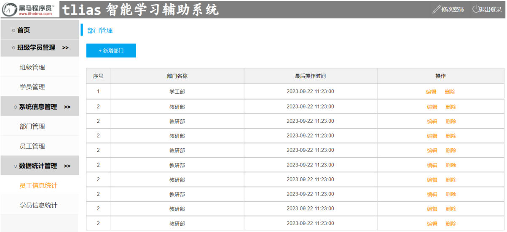
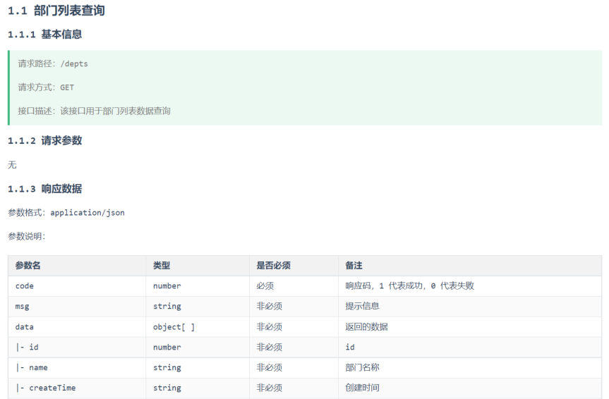
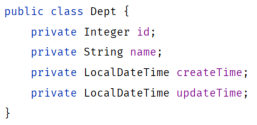

上一篇把工程搭起来、把 `Result` 定好，从这一篇开始写接口。第一个接口是**查询部门**（PPT 第 24-31 页）——它只有一条 SQL，却是本章信息量最大的一节：三层架构第一次落到真实工程上，而且实体类和表字段"名字对不上"这个坑第一次露头（新增/修改/删除接口全都绕不开它）。

本篇按 PPT 的顺序走：先看需求，再梳三层职责，然后写三层代码，最后专门解决数据封装。

## 需求：页面上要显示一张部门表（PPT 第 24-26 页）

PPT 第 24 页是本章的目录页（准备工作 / 查询部门 / 删除部门 / 新增部门 / 修改部门 / 日志技术），第 25 页说明「查询部门」这个小节包含两件事：**接口开发** + **前后端联调测试**（联调是 59 篇的内容）。

需求本身要看**页面原型**——第 26 页给的截图：


*图：部门管理页面原型（PPT 第 26 页）——顶部是「+ 新增部门」按钮，表格四列：序号、部门名称、最后操作时间、操作（编辑/删除）*

页面上的每一列都对应接口要做的事：

| 页面元素 | 来自哪 |
| --- | --- |
| 序号 | 前端自己加的，不是数据 |
| 部门名称 | 表里的 `name` |
| 最后操作时间 | 表里的 `update_time`（所以查询要按它倒序，最新的排最前） |
| 操作（编辑/删除） | 后面的接口：编辑要"查询回显 + 修改"，删除是删除接口 |
| 新增部门按钮 | 新增接口 |

而接口长什么样，以**接口文档**为准（PPT 第 26 页配的第二张图就是文档里「1.1 部门列表查询」这一节）：


*图：接口文档 1.1 节（PPT 第 26 页）——请求路径 `/depts`、请求方式 GET、接口描述"该接口用于部门列表数据查询"；响应 data 里的字段：id、name、createTime（下面还有一行 updateTime）*

逐条抄下来：

- **请求路径**：`/depts`
- **请求方式**：GET（符合 [57 篇](/posts/编程学习/javaweb学习笔记/57-tlias项目准备与开发规范/)讲的 Restful——URL 定位资源、GET 表示查询）
- **接口描述**：该接口用于部门列表数据查询
- **请求参数**：无
- **响应数据**：`application/json`，参数表里三行外壳 + 四行数据

| 参数名 | 类型 | 是否必须 | 备注 |
| --- | --- | --- | --- |
| code | number | 必须 | 响应码，1 代表成功，0 代表失败 |
| msg | string | 非必须 | 提示信息 |
| data | object[ ] | 非必须 | 返回的数据（下面以 ├─ 开头的几行都是它内部的字段） |
| ├─ id | number | 非必须 | id |
| ├─ name | string | 非必须 | 部门名称 |
| ├─ createTime | string | 非必须 | 创建时间 |
| └─ updateTime | string | 非必须 | 修改时间 |

> [!TIP]
> **本机实测**：接口写完后，`GET /depts` 的真实响应正是这个形状（部门按 `update_time` 倒序）：
>
> ```json
> {"code":1,"msg":"success","data":[
>   {"id":3,"name":"咨询部","createTime":"2024-09-25T09:47:40","updateTime":"2024-09-30T21:26:24"},
>   {"id":6,"name":"行政部","createTime":"2024-11-30T20:56:37","updateTime":"2024-09-30T20:56:37"},
>   {"id":1,"name":"学工部","createTime":"2024-09-25T09:47:40","updateTime":"2024-09-25T09:47:40"},
>   {"id":4,"name":"就业部","createTime":"2024-09-25T09:47:40","updateTime":"2024-09-25T09:47:40"},
>   {"id":5,"name":"人事部","createTime":"2024-09-25T09:47:40","updateTime":"2024-09-25T09:47:40"},
>   {"id":2,"name":"教研部","createTime":"2024-09-25T09:47:40","updateTime":"2024-09-09T15:17:04"}
> ]}
> ```
>
> 三个细节值得记：① 最外层就是 [57 篇](/posts/编程学习/javaweb学习笔记/57-tlias项目准备与开发规范/)定好的 `{code,msg,data}` 外壳；② **顺序**是"咨询部（09-30）→ 行政部（09-30 20:56）→ …… → 教研部（09-09）"，正好是 `update_time` 从晚到早——这是 SQL 里 `order by … desc` 的效果，不是数据库里的存储顺序（表里 1 号学工部在最前面）；③ 时间字段响应出来是 `2024-09-30T21:26:24`，**日期和时间之间是字母 T**（页面上会再格式化成 `2024-09-30 21:26:24` 给人看），这是 Java 的 `LocalDateTime` 被转成 JSON 后的默认写法。

## 三层职责分析（PPT 第 27 页）

需求明确之后，PPT 第 27 页先不写代码，而是"梳一遍三层架构每一层的职责"——这正是[37 篇](/posts/编程学习/javaweb学习笔记/37-三层架构/)学的三层在真实项目里的样子：

| 层 | 职责（PPT 原文） | 落到"查询部门"上 |
| --- | --- | --- |
| **Controller** | 接收请求、调用 Service 层、响应结果 | 接住 `GET /depts`，调 Service 拿数据，把数据包进 `Result` 返回 |
| **Service** | 调用 Mapper 接口方法 | 调 Mapper 的查询方法，把结果往上传（本例没有业务逻辑，纯透传） |
| **Mapper** | 写 SQL：`select * from dept order by update_time desc` | 真正执行 SQL、把结果集封装成 `List<Dept>` |

对照表能看出一条经验：**"查询"这类没有业务规则的接口，Service 层看起来"什么都没做"，但它不能省**——它在 Controller 和 Mapper 之间维持了统一的分层结构，等以后有业务规则（比如新增时补时间、删除前校验）时，代码有地方放。

## 功能实现：三层代码（PPT 第 28 页）

PPT 第 28 页把三层的代码一起给了出来，一层一层看。

**Controller：接收请求、处理响应**

```java
@RestController
public class DeptController {

    @Autowired
    private DeptService deptService;

    @GetMapping("/depts")
    public Result findAll(){
        List<Dept> deptList = deptService.findAll();
        return Result.success(deptList);
    }
}
```

- `@RestController`：等于 `@Controller` + `@ResponseBody`，标在类上表示"这是一个接收 HTTP 请求的控制器，而且方法返回的对象要直接转成 JSON 写回响应体"——所以 `return Result.success(deptList)` 出去的就是 JSON 文本；
- `@GetMapping("/depts")`：把 `GET /depts` 这个请求映射到 `findAll()` 方法上，这就是 [57 篇](/posts/编程学习/javaweb学习笔记/57-tlias项目准备与开发规范/)里 Restful 表里"查询全部"那一行的落地；
- `@Autowired`：把 Service 的实例注入进来（[39 篇](/posts/编程学习/javaweb学习笔记/39-ioc与di详解/)讲过）；
- 方法体两行：**调 Service 取数据 → 用 `Result.success(数据)` 包起来返回**。这里返回的是 `Result.success(deptList)`（带数据的那一个重载），不是 `Result.success()`——因为查询要把数据带回去。

**Service：业务处理**

```java
// 接口：DeptService
public interface DeptService {
    /**
     * 查询所有部门
     */
    List<Dept> findAll();
}
```

```java
// 实现类：DeptServiceImpl
@Service
public class DeptServiceImpl implements DeptService {

    @Autowired
    private DeptMapper deptMapper;

    @Override
    public List<Dept> findAll() {
        return deptMapper.findAll();
    }
}
```

`@Service` 把它交给 Spring 管理（才能被 Controller 注入），实现类里只做一件事：调 Mapper。这次是"透传"，因为没有业务逻辑要处理。

**Mapper：数据访问（只写 SQL）**

```java
@Mapper
public interface DeptMapper {
    /**
     * 查询全部部门
     */
    @Select("select * from dept order by update_time desc")
    public List<Dept> findAll();
}
```

`@Mapper` 让 MyBatis 在运行时为这个接口生成实现类（[51 篇](/posts/编程学习/javaweb学习笔记/51-mybatis入门与辅助配置/)讲过），`@Select` 里就是那条 SQL：**查全部 + 按修改时间倒序**。接口不需要写实现类，方法名起什么都行（这里是 `findAll`），真正干活的是注解里那句 SQL。

> [!NOTE]
> **与课程代码的两处写法差异**（效果完全一样，看到了不用慌）：
>
> 1. 课程工程把路径提到了类上——`@RequestMapping("/depts")` 写在 `DeptController` 类上，方法上只留 `@GetMapping`（表示"类路径 + 空路径"）：
>    ```java
>    @RequestMapping("/depts")
>    @RestController
>    public class DeptController {
>        @GetMapping
>        public Result list() { … }
>    }
>    ```
>    这两种写法访问的地址都是 `GET /depts`；`@RequestMapping` 的路径拼接规则在讲修改部门那一篇会专门说。
> 2. 课程工程的 Mapper 里写的是**明列字段**：`select id, name, create_time, update_time from dept order by update_time desc`，而 PPT 上写的是 `select *`。查询效果一样（都是这四个字段），明列字段的好处是不受表结构变动影响——不过这两种写法都会引出下面的"数据封装"问题，一样的。

## 数据封装：为什么 createTime 会是 null（PPT 第 29-31 页）

代码写完，接口一跑，可能就出问题了：**页面上"最后操作时间"一列是空的**。PPT 第 29 页把原因写成两条规则：

> - 实体类属性名 和 数据库表查询返回的字段名**一致**，mybatis 会**自动封装**。
> - 如果实体类属性名 和 数据库表查询返回的字段名**不一致**，**不能自动封装**。

对着实体类看一眼就明白了——PPT 配的图就是 `Dept` 的属性：


*图：Dept 实体类的四个属性（PPT 第 29 页）——id、name、createTime、updateTime*

和 `dept` 表的字段摆在一起对比：

| 表字段 | 实体属性 | 对得上吗 |
| --- | --- | --- |
| `id` | `id` | 对得上 → 自动封装 |
| `name` | `name` | 对得上 → 自动封装 |
| `create_time` | `createTime` | **对不上**（下划线 vs 驼峰）→ 封装不上，是 null |
| `update_time` | `updateTime` | **对不上** → 封装不上，是 null |

所以响应里那条 `{"id":3,"name":"咨询部","createTime":null,"updateTime":null}` 中，id 和 name 有值、两个时间字段是 null。

### 三种解法（PPT 第 30 页）

PPT 第 30 页给了三条路，前两条是"本地修"，第三条是"一劳永逸"。

**解法一：手动结果映射**——用 `@Results` 把"哪一列对应哪个属性"一条条写出来：

```java
@Results({
    @Result(column = "create_time", property = "createTime"),
    @Result(column = "update_time", property = "updateTime")
})
@Select("select id, name, create_time, update_time from dept order by update_time desc")
public List<Dept> findAll();
```

**解法二：起别名**——在 SQL 里给列起一个"和属性名一样"的别名，让字段名与属性名自己变一致：

```java
@Select("select id, name, create_time createTime, update_time updateTime from dept ...")
public List<Dept> findAll();
```

**解法三：开启驼峰命名（PPT 推荐）**——让 MyBatis 自己按规则把下划线转成驼峰：

```yaml
mybatis:
  configuration:
    map-underscore-to-camel-case: true
```

这一行写在 `application.yml` 里（就是 [57 篇](/posts/编程学习/javaweb学习笔记/57-tlias项目准备与开发规范/)工程搭建第 2 步里那份配置中已经带着的那行），开关一开，`create_time` 自动对应 `createTime`、`update_time` 自动对应 `updateTime`，Mapper 和 SQL 一个字都不用动。

> [!TIP]
> **本机实测**（这个开关的开关实验）：把 yml 里的 `map-underscore-to-camel-case` 改成 **false** 再查一次，响应立刻变成——
>
> ```json
> {"id":3,"name":"咨询部","createTime":null,"updateTime":null}
> ```
>
> **两个时间字段全变 null**（id、name 还在，因为它们本来就对得上）；把开关改回 `true`，数据马上恢复正常。这就证明了：数据库字段 `create_time` 与实体属性 `createTime` 就是靠**这个开关**对上的——不是 MyBatis 天生认识驼峰。

为什么推荐第三种？把三条路放在一起比一比：

| 解法 | 写在哪 | 代价 |
| --- | --- | --- |
| `@Results` 手动映射 | Mapper 接口的方法上 | **每个** 方法、**每张** 表都要写一遍，列多了很啰嗦 |
| 起别名 | 每条 SQL 里 | 同上，SQL 越长越容易漏 |
| **驼峰开关** | yml 里**一行** | 对**整个工程**生效，所有表所有方法都不用再管 |

> [!WARNING]
> 驼峰开关有**前提**：字段名和属性名必须符合"下划线转驼峰"的规则（`xxx_abc` → `xxxAbc`）。像 `create_time` → `createTime` 这样能推出来的才行；如果字段叫 `dname`、属性叫 `deptName`，怎么算都对不上，那就只能回去用 `@Results` 或起别名。（PPT 第 31 页的问答里把这个前提写得很明确。）

### 顺带看看 Mapper 干了什么（SQL 日志）

工程 yml 里开了 MyBatis 的日志输出（`log-impl` 那行），查一次部门，控制台能看到这次执行的 SQL 细节——这也是排查"字段是不是封装错"最快的办法：

```text
==>  Preparing: select id, name, create_time, update_time from dept order by update_time desc
==> Parameters:
<==      Total: 6
```

（`Total: 6` 就是一共查回 6 行数据；日志里 `Parameters` 为空，因为这次没有条件参数。）

## 必答问答（PPT 第 31 页）

| PPT 的问题 | 答案 |
| --- | --- |
| Mybatis 默认数据封装的规则？ | **实体类属性名与数据库表的字段名一致时，MyBatis 会自动封装**；不一致就不能自动封装（对应属性是 null） |
| 字段名与实体类属性名不一致，如何解决？ | ① **手动结果映射**：`@Results`、`@Result`；② **起别名**：SQL 里 `create_time createTime`；③ **开启驼峰命名开关**（要求 `xxx_abc` → `xxxAbc`），yml 里 `map-underscore-to-camel-case: true`，**推荐这一种** |

## 小结

| 问题 | 答案 |
| --- | --- |
| 查询部门接口是什么？ | `GET /depts`，无请求参数，响应 `application/json`，`data` 是部门对象数组 |
| 三层各干什么？ | Controller 接收请求 + 调 Service + 响应结果；Service 调 Mapper（本例透传）；Mapper 写 SQL |
| SQL 是什么？ | `select … from dept order by update_time desc`——按修改时间倒序，所以本机实测咨询部（09-30）排第一 |
| Controller 上用了哪些注解？ | `@RestController`（返回对象自动转 JSON）、`@GetMapping("/depts")`（映射 GET 请求）、`@Autowired`（注入 Service） |
| 响应长什么样？ | `{"code":1,"msg":"success","data":[…]}`——57 篇定好的 `Result` 外壳，数据在 `data` 里 |
| MyBatis 的封装规则？ | 属性名与字段名**一致就自动封装**；**不一致封装不上**（得到 null） |
| 不一致的三种解法？ | `@Results`/`@Result` 手动映射、SQL 起别名、**开驼峰开关（推荐）** |
| 驼峰开关写在哪？ | `application.yml` 的 `mybatis.configuration.map-underscore-to-camel-case: true` |
| 本机实测的开关实验？ | 改成 `false` 后 `createTime`/`updateTime` 全变 null，改回 `true` 恢复 |
| 时间字段响应出来什么样？ | `2024-09-30T21:26:24`（`LocalDateTime` 转 JSON 的默认格式，日期与时间之间是 `T`） |

## 相关

- [上一篇：Tlias项目准备与开发规范](/posts/编程学习/javaweb学习笔记/57-tlias项目准备与开发规范/)
- [下一篇：部门管理-前后端联调与反向代理](/posts/编程学习/javaweb学习笔记/59-部门管理-前后端联调与反向代理/)

## 练习题

### 一、知识回顾（读完直接做下面的实践题）

1. **接口信息**：查询部门是 `GET /depts`，无请求参数，响应 `application/json`，`data` 里是部门对象数组（id/name/createTime/updateTime）
2. **三层职责**：Controller 接收请求、调用 Service 层、响应结果；Service 调用 Mapper 接口方法；Mapper 写 SQL（查询这类没有业务规则的接口，Service 是透传，但结构不能省）
3. **排序 SQL**：`select … from dept order by update_time desc`——按**修改时间倒序**；本机实测 6 条数据里咨询部（`2024-09-30`）排最前，与库里存储顺序无关
4. **Controller 三件套**：类上 `@RestController`（返回对象转 JSON）、方法上 `@GetMapping("/depts")`（映射 GET 请求）、`@Autowired` 注入 Service；返回 `Result.success(deptList)`
5. **Mapper**：接口上 `@Mapper`（MyBatis 生成实现类），方法上用 `@Select` 写 SQL，返回 `List<Dept>`
6. **MyBatis 封装规则**：实体类属性名与表字段名**一致 → 自动封装**；**不一致 → 封装不上**（属性为 null）
7. **不一致的三种解法**：① `@Results`/`@Result` 手动结果映射 ② SQL 里起别名（`create_time createTime`）③ **开启驼峰命名开关**（`mybatis.configuration.map-underscore-to-camel-case: true`，PPT 推荐）
8. **为什么推荐驼峰开关**：一行配置对整个工程生效；`@Results` 和起别名都要逐方法、逐条 SQL 写
9. **驼峰开关的前提与实测**：字段名与属性名要符合 `xxx_abc` → `xxxAbc` 规则；**本机实测**把开关改成 `false` 后 `createTime`/`updateTime` 全变 null，改回 `true` 恢复
10. **响应细节**：外层是 `{"code":1,"msg":"success","data":…}`；时间字段响应成 `2024-09-30T21:26:24`（带 `T`，`LocalDateTime` 转 JSON 的默认格式）

### 二、裸写题

- [ ] **2-1 写数据访问层：查询全部部门、按最后修改时间倒序**
  需求：做一个"从 `dept` 表里查出所有部门"的数据访问方法，要求结果**按最后修改时间从晚到早**排好；返回类型要能装下多条部门记录。
  （练习文件 `test_58_查询部门接口.java` 的题目2-1 里给了写作区。）

  > [!TIP]- 提示（先自己想，实在想不出再点开）
  > **一级 · 思路**：这一层只干"取数据"，没有任何业务判断；所以就是**一个接口 + 一个注解 + 一条 SQL**，不用写实现类
  > **二级 · 方法**：接口标 `@Mapper`，方法标 `@Select("…")`；SQL 是 `select 字段 from dept order by update_time desc`；返回 `List<Dept>`
  > **三级 · 骨架**：`@Mapper public interface DeptMapper { @Select("select ____ from dept order by ____ desc") List<Dept> ____(); }`

  > [!TIP]- 参考答案（做完再点开）
  > ```java
  > @Mapper
  > public interface DeptMapper {
  >     /**
  >      * 查询全部部门
  >      */
  >     @Select("select id, name, create_time, update_time from dept order by update_time desc")
  >     List<Dept> findAll();
  > }
  > ```
  > 说明：`@Mapper` 让 MyBatis 运行时生成这个接口的实现（不用自己写 `Impl`）；方法名 `findAll` 是自取的，真正执行的是 `@Select` 里的 SQL；`desc` 是倒序——**本机实测**的响应里咨询部（update_time 最新）排第一。PPT 上写的是 `select *`，课程工程写成明列四个字段，查询效果一样（`*` 会把所有列都查出来，包括以后新增的列）。**注意**：这样查出来的 `createTime`/`updateTime` 只有在**驼峰开关开着**时才有值。

- [ ] **2-2 写业务层：接口 + 实现类**
  需求：给"查询全部部门"配一个业务层——一个接口 + 一个实现类，实现类里调用上一题写好那个数据访问方法、把结果原样返回。要求这个实现类能被 Spring 管理（后面控制器才能注入它）。
  （练习文件 `test_58_查询部门接口.java` 的题目2-2 里给了写作区。）

  > [!TIP]- 提示（先自己想，实在想不出再点开）
  > **一级 · 思路**：接口负责"声明能力"，实现类负责"干活"；这次的活很简单，就是转手调 Mapper
  > **二级 · 方法**：实现类标 `@Service` 交给 Spring；用 `@Autowired` 注入上题的 Mapper；方法上加 `@Override`
  > **三级 · 骨架**：`public interface DeptService { List<Dept> ____(); }` ＋ `@Service public class DeptServiceImpl implements DeptService { @Autowired private DeptMapper ____; @Override public List<Dept> findAll() { return ____.findAll(); } }`

  > [!TIP]- 参考答案（做完再点开）
  > ```java
  > // DeptService.java
  > public interface DeptService {
  >     /**
  >      * 查询所有部门
  >      */
  >     List<Dept> findAll();
  > }
  > ```
  > ```java
  > // DeptServiceImpl.java
  > @Service
  > public class DeptServiceImpl implements DeptService {
  >
  >     @Autowired
  >     private DeptMapper deptMapper;
  >
  >     @Override
  >     public List<Dept> findAll() {
  >         return deptMapper.findAll();
  >     }
  > }
  > ```
  > 说明：实现类放在 `service.impl` 包里，接口放在 `service` 包（与课程工程一致）；`@Service` 是 [38-39 篇](/posts/编程学习/javaweb学习笔记/39-ioc与di详解/)学的 IOC 注解——不加它，Controller 里 `@Autowired private DeptService deptService;` 启动就会失败。这一层现在"看着多余"（纯透传），但它是分层的固定结构，后面新增部门要在这里补 `createTime`/`updateTime`，业务逻辑就写在这一层。

- [ ] **2-3 写控制层：把查询部门做成一个 HTTP 接口**
  需求：对外提供一个接口——浏览器（或 Apifox）用 **GET** 方式访问 `/depts` 时，返回统一响应结果，`data` 里装着部门集合。要求这个类能接收请求、调业务层、把结果包起来返回。
  （练习文件 `test_58_查询部门接口.java` 的题目2-3 里给了写作区。）

  > [!TIP]- 提示（先自己想，实在想不出再点开）
  > **一级 · 思路**：控制层只做三件事——接请求、调业务、包响应；方法的返回值类型就是统一响应结果类的类型
  > **二级 · 方法**：类上 `@RestController`；方法上 `@GetMapping("/depts")`；用 `@Autowired` 注入业务层接口；最后 `return Result.success(deptList);`（注意要带数据，不是无参的那个 `success()`）
  > **三级 · 骨架**：`@RestController public class DeptController { @Autowired private DeptService ____; @GetMapping("____") public Result ____() { List<Dept> deptList = ____.findAll(); return ____; } }`

  > [!TIP]- 参考答案（做完再点开）
  > ```java
  > @RestController
  > public class DeptController {
  >
  >     @Autowired
  >     private DeptService deptService;
  >
  >     @GetMapping("/depts")
  >     public Result findAll(){
  >         List<Dept> deptList = deptService.findAll();
  >         return Result.success(deptList);
  >     }
  > }
  > ```
  > 说明：`@RestController` = `@Controller` + `@ResponseBody`，所以返回的 `Result` 对象会被自动转成 JSON；`@GetMapping("/depts")` 就是 Restful 里"GET 表示查询"的落地。课件代码把 `/depts` 提到类上的 `@RequestMapping("/depts")`、方法上只留 `@GetMapping`，访问地址同样是 `GET /depts`。**本机实测**响应：`{"code":1,"msg":"success","data":[{"id":3,"name":"咨询部",…}]}`——如果两个时间字段是 null，去看下一题的开关。

- [ ] **2-4 字段名与属性名对不上，把时间字段救回来**
  需求：数据库字段是 `create_time`、`update_time`，实体类属性是 `createTime`、`updateTime`，查询结果里两个时间字段是 null。请给出**三种**解法，并说明你选哪一种、为什么。
  （练习文件 `test_58_查询部门接口.java` 的题目2-4 里给了写作区。）

  > [!TIP]- 提示（先自己想，实在想不出再点开）
  > **一级 · 思路**：问题的本质是"名字没对上，MyBatis 不知道该把哪一列塞进哪个属性"；那就三条路——手工告诉它、让 SQL 里的名字变一致、让它自己按规则猜
  > **二级 · 方法**：手工告诉它用 `@Results` + `@Result(column=…, property=…)`；改名字用 SQL 别名；让它自己猜用 yml 里的驼峰开关
  > **三级 · 骨架**：① `@Results({ @Result(column = "____", property = "____") })` ② `select create_time ____` ③ `mybatis.configuration.____: true`

  > [!TIP]- 参考答案（做完再点开）
  > **解法一 · 手动结果映射**（写在 Mapper 方法上）：
  > ```java
  > @Results({
  >     @Result(column = "create_time", property = "createTime"),
  >     @Result(column = "update_time", property = "updateTime")
  > })
  > @Select("select id, name, create_time, update_time from dept order by update_time desc")
  > List<Dept> findAll();
  > ```
  > **解法二 · 起别名**（写进 SQL）：
  > ```java
  > @Select("select id, name, create_time createTime, update_time updateTime from dept order by update_time desc")
  > List<Dept> findAll();
  > ```
  > **解法三 · 开驼峰命名开关**（写在 `application.yml`）：
  > ```yaml
  > mybatis:
  >   configuration:
  >     map-underscore-to-camel-case: true
  > ```
  > 我选**第三种**：它一行配置对**整个工程**生效，Mapper 和 SQL 一个字都不用改；而前两种每张表、每个方法都得写一遍，字段一多就容易漏。
  > 补充两点：① **本机实测**把这个开关改成 `false`，响应里 `createTime`/`updateTime` 立刻变成 null，改回 `true` 恢复正常——它就是这个问题的开关；② 开关的前提是字段名与属性名**符合驼峰规则**（`xxx_abc` → `xxxAbc`）；如果名字根本对不上（如 `dname` 对 `deptName`），还得回去用 `@Results` 或起别名。

### 三、综合题

- [ ] **3-1 从零写出"查询部门"的三层代码，并用 Apifox 验证**
  这一题把本节从头到尾做一遍：**只照接口文档，不抄代码**——写完再用工具发请求，看响应对不对。
  1. 准备数据库：在 `tlias` 库里建 `dept` 表并插入 6 条数据（表结构见练习文件素材，`update_time` 要有先后差距，才能看出排序）；
  2. 写实体类：照接口文档响应里 `data` 内部的字段写一个对应类（属性名用驼峰、时间用 `LocalDateTime`）；
  3. 写数据访问层：查全部部门、按最后修改时间倒序；
  4. 写业务层：接口 + 实现类（实现类里调用第 3 步的方法）；
  5. 写控制层：对外提供 `GET /depts`，返回统一响应结果（`data` 里装部门集合）；
  6. 配置检查：确认 `application.yml` 里有数据源、MyBatis 的 SQL 日志、以及**驼峰映射开关**；启动工程；
  7. 用 **Apifox**（或 curl）发一个 GET 请求给 `http://localhost:8080/depts`，把响应的前两条数据抄下来，并回答下面三个问题：
     - 响应里部门是什么顺序？和数据库里 `select * from dept` 的顺序一样吗？为什么？
     - 把 yml 里的驼峰开关临时改成 `false`、重启，`createTime`/`updateTime` 变成什么？为什么？
     - 如果页面要展示"最后操作时间"，你打算用响应里的哪个字段？

  **涉及知识点**

  | 知识点 | 在这里的应用 |
  | --- | --- |
  | 接口文档 | 第 2、5 步——请求方式与响应字段照文档来 |
  | 三层架构 | 第 3、4、5 步——Mapper/Service/Controller 各写各的，靠注入串起来 |
  | Restful | 第 5 步——`GET /depts` 表示"查询部门集合" |
  | 排序 SQL | 第 3、7 步——`order by update_time desc` 与响应顺序 |
  | 数据封装与驼峰开关 | 第 6、7 步——null 字段与开关实验 |

  > [!TIP]- 提示（先自己想，实在想不出再点开）
  > **一级 · 思路**：从"数据"到"接口"倒着推——表 → 实体类 → Mapper（SQL）→ Service（透传）→ Controller（映射 + 包 Result）；最后用 Apifox 发 `GET` 请求看 JSON
  > **二级 · 方法**：建表用 `int unsigned primary key auto_increment` / `varchar(10) not null unique` / `datetime`；三层分别用 `@Mapper`+`@Select`、`@Service`+`@Autowired`、`@RestController`+`@GetMapping`；yml 里 `spring.datasource` 与 `mybatis.configuration.map-underscore-to-camel-case`
  > **三级 · 骨架**：`DeptMapper.findAll()` → `DeptServiceImpl.findAll()` → `DeptController` 的 `@GetMapping("/depts")` → `Result.success(deptList)`；Apifox 里新建请求、方法选 `GET`、URL 填 `http://localhost:8080/depts`、点"发送"

  > [!TIP]- 参考答案（做完再点开）
  > **1. 建表 + 造数据**：
  >    ```sql
  >    create table dept (
  >      id int unsigned primary key auto_increment comment 'ID, 主键',
  >      name varchar(10) not null unique comment '部门名称',
  >      create_time datetime default null comment '创建时间',
  >      update_time datetime default null comment '修改时间'
  >    ) comment '部门表';
  >
  >    insert into dept values (1,'学工部','2024-09-25 09:47:40','2024-09-25 09:47:40'),
  >                            (2,'教研部','2024-09-25 09:47:40','2024-09-09 15:17:04'),
  >                            (3,'咨询部','2024-09-25 09:47:40','2024-09-30 21:26:24'),
  >                            (4,'就业部','2024-09-25 09:47:40','2024-09-25 09:47:40'),
  >                            (5,'人事部','2024-09-25 09:47:40','2024-09-25 09:47:40'),
  >                            (6,'行政部','2024-11-30 20:56:37','2024-09-30 20:56:37');
  >    ```
  > **2. 实体类**：
  >    ```java
  >    @Data
  >    @NoArgsConstructor
  >    @AllArgsConstructor
  >    public class Dept {
  >        private Integer id;
  >        private String name;
  >        private LocalDateTime createTime;
  >        private LocalDateTime updateTime;
  >    }
  >    ```
  > **3~5. 三层代码**：与 2-1、2-2、2-3 的参考答案完全一致（Mapper 的 `@Select("select id, name, create_time, update_time from dept order by update_time desc")`、Service 透传、Controller 的 `@GetMapping("/depts")` 返回 `Result.success(deptList)`）。
  > **6. yml**（含两个 MyBatis 配置项）：
  >    ```yaml
  >    spring:
  >      datasource:
  >        url: jdbc:mysql://localhost:3306/tlias
  >        driver-class-name: com.mysql.cj.jdbc.Driver
  >        username: root
  >        password: 1234
  >
  >    mybatis:
  >      configuration:
  >        log-impl: org.apache.ibatis.logging.stdout.StdOutImpl
  >        map-underscore-to-camel-case: true
  >    ```
  >    （`password` 换成你自己 MySQL 的密码。）启动日志里能看到 `Tomcat started on port 8080 (http)`。
  > **7. Apifox 的请求与响应**：新建一个请求，方法选 **GET**、地址填 `http://localhost:8080/depts`、请求体留空，发送后拿到（**本机实测**）：
  >    ```json
  >    {"code":1,"msg":"success","data":[
  >      {"id":3,"name":"咨询部","createTime":"2024-09-25T09:47:40","updateTime":"2024-09-30T21:26:24"},
  >      {"id":6,"name":"行政部","createTime":"2024-11-30T20:56:37","updateTime":"2024-09-30T20:56:37"},
  >      …
  >    ]}
  >    ```
  >    三个问题的答案：
  >    - **顺序**：咨询部（09-30）在最前，往后 `update_time` 越来越早——与 `select * from dept` 的存储顺序**不一样**（存储顺序里 1 号学工部在最前）。原因就是 SQL 最后那句 `order by update_time desc`。
  >    - **关掉驼峰开关**（改 `false` 重启）后响应变成 `{"id":3,"name":"咨询部","createTime":null,"updateTime":null}`——字段 `create_time` 与属性 `createTime` 名字对不上、又没人告诉 MyBatis 怎么对应，就封装不上了（id/name 本来就一致，不受影响）。改回 `true` 即恢复。
  >    - **页面上的"最后操作时间"** 用 `updateTime`（表里的 `update_time`），这也正是 SQL 按它排序的原因。
