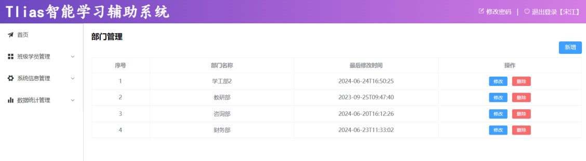
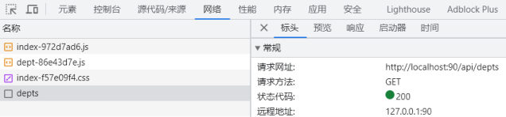
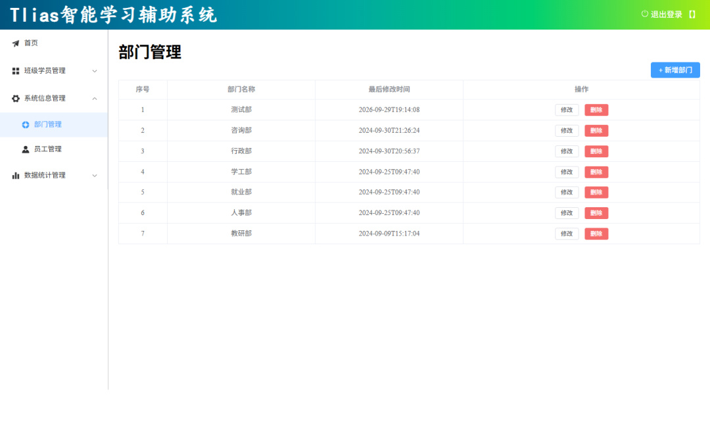
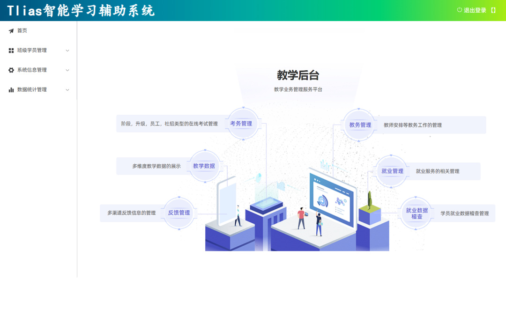

[58 篇](/posts/编程学习/javaweb学习笔记/58-部门管理-查询部门/)把 `GET /depts` 这个接口写完并用测试工具验过了，但页面上还是空的——因为**页面和接口是两个工程、两个端口**：页面在 nginx 的 90 端口上，接口在 SpringBoot 的 8080 端口上，两边谁也不认识谁。这一篇（PPT 第 32～36 页）解决的就是"把两边接上"：启动课程给的前端工程，让"点页面 → 发请求 → 调接口 → 查数据库 → 表格出现数据"这条链路真正跑通，顺带把 Nginx **反向代理**那段配置一行一行讲透。

## 这一篇在「查询部门」里的位置（PPT 第 32 页）

PPT 第 32 页是「查询部门」这个小节的目录页，它把这一节拆成了两件事：

> **查询部门** → **基本实现**（接口开发） / **前后端联调测试**

- **接口开发**：就是 [58 篇](/posts/编程学习/javaweb学习笔记/58-部门管理-查询部门/)做的事——Controller 接收请求、Service 调 Mapper、Mapper 写 `select * from dept order by update_time desc`，最后返回 `Result` 包起来的部门集合。做完只能靠 Apifox、curl 这类工具验。
- **前后端联调测试**：本篇——把**前端工程**跑起来，在真实页面上验证接口。做完之后你不用认识任何接口工具，点一下页面就知道通不通。

为什么必须"联调"而不能只各测各的？因为[前后端分离开发](/posts/编程学习/javaweb学习笔记/57-tlias项目准备与开发规范/)下**前端工程、后端工程是分开开发和部署的**：两边只有"接口文档"这一纸约定。前端按约定发请求、后端按约定收请求，分开测都过不代表合起来能跑（地址写法、参数位置、响应结构任何一处对不上，页面就是空的），所以要**两边同时跑起来、走一遍完整链路**。

## 联调测试：把前端工程跑起来（PPT 第 33 页）

PPT 第 33 页给的就是三步操作：

> 1. 将资料中提供的前端工程文件夹中的压缩包，拷贝到一个**没有中文不带空格**的目录下，解压。
> 2. 启动 nginx，访问测试：`http://localhost:90`

逐条展开说：

**① 压缩包是什么、为什么要挪地方。** 课程资料 `03. 前端环境/nginx-1.22.0-web.zip` 里装的是两样东西：**打包好的前端页面**（Vite 构建产物：一个 `index.html` + `assets/` 下的 js、css、图片）和**一份免安装的 Windows 版 nginx**（`nginx.exe`）。拷贝时课程特别强调"没有中文、不带空格"的目录——因为 nginx 的配置与日志里全是**路径字符串**，路径里带中文或空格在 Windows 下容易解析出岔子（命令行要加引号、编码不一致等等），放进 `D:\develop\nginx-1.22.0-web` 这样纯英文无空格的地方最省事。

**② 启动 nginx。** 解压出来直接运行 `nginx.exe`（双击或命令行 `.\nginx.exe`）即可，它是**绿色免安装**的，启动后没有窗口、在后台跑；它读的是同目录下的 `conf/nginx.conf`。本机实测就是"解压完直接 `./nginx.exe`"这一步起服务，配置里写的 `listen 90`，所以访问端口是 90。

**③ 访问测试。** 浏览器打开 `http://localhost:90`，看到的就是这套 Tlias 智能学习辅助系统的前端页面：


*图：PPT 第 33 页配的页面截图——`http://localhost:90` 打开后就是这套系统，左侧菜单走「系统信息管理 → 部门管理」，右侧就是部门表格（序号 / 部门名称 / 最后修改时间 / 操作），操作列里每行都有"修改""删除"，右上角有"+ 新增部门"*

> [!TIP]
> 看清这张图的来源：它是**前端工程里的静态页面**，跟后端一点关系都没有——现在这个页面是"死的"，表格里的数据要么是空的、要么是上一次请求残留的。真正让它"活"起来的是页面里的 js 脚本发出去的那些 Ajax 请求，也就是下面要说的事。

> [!WARNING]
> nginx 在 Windows 下的两个日常操作，改配置后必用：**改完 `conf/nginx.conf` 必须重载或重启**才生效（命令行进到 nginx 目录执行 `nginx.exe -s reload`，或者先 `nginx.exe -s stop` 再启动）；**两个服务要分别启动**，后端（8080，[58 篇](/posts/编程学习/javaweb学习笔记/58-部门管理-查询部门/)的工程）和前端（90，nginx）缺一个都跑不通。

## 前端发出的请求打在哪儿（PPT 第 34 页）

页面起来了，接下来是这个场景里最关键的一问——PPT 第 34 页把它原样写了出来：

> 前端工程请求服务器的地址为 `http://localhost:90/api/depts`，**是如何访问到后端的 tomcat 服务器的**？

答案四个字：**Nginx 的反向代理**。

先把这个请求地址看清楚。打开浏览器 F12 的「网络」面板，删掉筛选、刷新页面，能看到 `depts` 这条请求：


*图：PPT 第 34 页配的开发者工具截图——「网络」面板里这条 `depts` 请求的常规信息：请求网址 `http://localhost:90/api/depts`、请求方法 `GET`、状态代码 `200`、远程地址 `127.0.0.1:90`。地址栏和请求里全是 90，**8080 一次都没出现过***

那 `/api` 是哪儿来的？翻一下本机跑的那份前端工程构建产物（`html/assets` 里的 js）就能查到：里面统一建了一个 axios 实例，`baseURL` 写的就是 `/api`；各个接口只写自己的路径。把构建产物里那几个调用整理出来就是这样（写法与路径是工程里的原文，变量名是整理时起的）：

```js
const deptApi = {
  list:   () => axios.get("/depts"),              // 查询全部部门
  add:    (data) => axios.post("/depts", data),   // 新增部门（请求体 JSON）
  getInfo:(id)  => axios.get(`/depts/${id}`),     // 根据 ID 查询（修改前的回显）
  update: (data) => axios.put("/depts", data),    // 修改部门（请求体 JSON）
  delete: (id)  => axios.delete(`/depts?id=${id}`)// 删除部门（id 跟在地址后面）
};
```

每个路径前面都会被 `baseURL` 补上 `/api`，所以浏览器实际发出的是：

| 前端调用 | 浏览器实际请求的地址 | 后端对应的接口 |
| --- | --- | --- |
| 查询列表 | `GET http://localhost:90/api/depts` | `GET /depts`（[58 篇](/posts/编程学习/javaweb学习笔记/58-部门管理-查询部门/)） |
| 新增 | `POST http://localhost:90/api/depts` | `POST /depts`（[61 篇](/posts/编程学习/javaweb学习笔记/61-部门管理-新增部门/)） |
| 回显 | `GET http://localhost:90/api/depts/1` | `GET /depts/{id}`（[62 篇](/posts/编程学习/javaweb学习笔记/62-部门管理-修改部门/)） |
| 修改 | `PUT http://localhost:90/api/depts` | `PUT /depts`（[62 篇](/posts/编程学习/javaweb学习笔记/62-部门管理-修改部门/)） |
| 删除 | `DELETE http://localhost:90/api/depts?id=1` | `DELETE /depts?id=1`（[60 篇](/posts/编程学习/javaweb学习笔记/60-部门管理-删除部门/)） |

两个细节值得留意：

- **请求地址是"相对"的**：前端代码里写的是 `/depts`（前面加个 `/api`），没有协议、没有域名、没有端口。浏览器遇到这种相对地址，会自动补成"**当前页面所在的那台服务器**"——页面在 90，请求就发给 90。所以哪怕把整个工程搬到别的机器、换个端口，前端代码一行都不用改。
- **前缀统一是 `/api`**：这是前后端约定的"后端接口专用前缀"，好处是 nginx 一眼就能挑出哪些请求该转给后端、哪些是来要静态页面的。注意后端自己的接口路径**并不带** `/api`（[58 篇](/posts/编程学习/javaweb学习笔记/58-部门管理-查询部门/)的 `@GetMapping("/depts")`），这个前缀是在转发时被摘掉的——怎么摘，就是下一节的 `rewrite`。

### 什么叫反向代理

PPT 第 34、36 页给了定义，两页说的是同一件事：

> **反向代理**是一种网络架构，通过**代理服务器**为**后端的服务器**做代理，客户端的请求直接请求**代理服务器**，然后转发给后端的服务器。（安全、灵活、负载均衡）

对着上面的表格读这句话：**代理服务器 = nginx（90）**，**后端的服务器 = SpringBoot/Tomcat（8080）**，**客户端 = 浏览器**。浏览器从头到尾只认识 90，是 nginx 在背后替它把请求交给 8080 的，再把 8080 的响应原样带回去——浏览器全程不知道 8080 的存在（PPT 第 34 页的示意图画的正是"前端 → 代理 → 后端（多个）"）。

括号里那三个词是它的价值，逐个理解：

| 好处 | 怎么理解 |
| --- | --- |
| **安全** | 真正干活的 8080 不用暴露给外面（可以只让本机/内网访问，甚至藏在防火墙后面），外部只认识代理服务器这一个入口——被直接打的就是它，后端躲在后头 |
| **灵活** | 后端地址变了、多了几个服务，只改代理这一处配置，前端代码一句不用动；接口前缀的加减（比如这里的 `/api`）也能在代理层统一处理 |
| **负载均衡** | 一台代理后面可以挂**多台**后端（PPT 那张图画的"代理 → 后端、后端、后端"），请求按规则分给它们，一台扛不住就上几台——这也是"反向代理"最常见的用途 |

## 本机实测：直连 8080 与经 90 的 /api，拿到的是同一份数据

概念说完了，本机把两条路都走了一遍（后端 8080 与前端 nginx 90 同时起着）：

> [!TIP]
> **本机实测**（后端 8080 与前端 nginx 90 同时起着，四条都跑通）：
>
> 1. **直连后端**：`curl http://localhost:8080/depts` → 返回部门 JSON（6 个部门，`update_time` 倒序，"咨询部"排最前）
> 2. **经反向代理**：`curl http://localhost:90/api/depts` → 返回**同样的部门 JSON**（说明 nginx 确实把 `/api/depts` 转成了 8080 上的 `/depts`）
> 3. **经反向代理新增**：`curl -X POST http://localhost:90/api/depts`（请求体 `{"name":"测试部"}`）→ 返回 `{"code":1,"msg":"success","data":null}`，再查列表就多出"测试部"——**写操作也能经代理走通**
> 4. **浏览器打开 `http://localhost:90`**：页面标题「Tlias智能学习辅助系统」，左侧菜单「系统信息管理 → 部门管理」，右侧表格**真实渲染出 7 行数据**，第一行就是刚通过接口新增的"测试部"

第 4 条的页面长这样（就是本机联调时截的图）：


*图：本机实测——`http://localhost:90` 打开的部门管理页，表格里 7 行数据全部来自 8080 上的 `/depts` 接口：第一行"测试部"就是刚才通过 `POST /api/depts` 新增的那条，其余 6 条是 `dept.sql` 里导入的初始数据*

再打开首页（`http://localhost:90` 的"首页"菜单）说明另一件事——**页面本身也是 nginx 发出来的**：


*图：本机实测——同一台 nginx 上的前端首页（教学后台），静态资源同样由 90 返回；本机实测 `GET /` 的响应是 200 + `text/html`，响应体就是前端工程里的 `index.html`。顺带一个细节：这份 `index.html` 的 `<title>` 还是脚手架默认的 `Vite App`，而页面上显示的系统名称是「Tlias智能学习辅助系统」——说明看到的内容是 js 渲染出来的，不是静态 HTML 写死的*

顺手能读出三个"对不对得上"的证据：

1. **顺序对上了**：表格按"最后修改时间"从晚到早排——第一行是刚新增的"测试部"（2026-09-29），接着是"咨询部"（2024-09-30）、"行政部"（2024-09-30 20:56），最后一行是"教研部"（2024-09-09）——和 [58 篇](/posts/编程学习/javaweb学习笔记/58-部门管理-查询部门/) SQL 里 `order by update_time desc` 的排序一致；
2. **数据对上了**：7 行 = `dept.sql` 的 6 条初始数据 + 本机新增的 1 条；
3. **时间格式暴露了来源**：表格"最后修改时间"列显示的是 `2026-09-29T19:14:08` 这种**中间带 `T`** 的格式——这就是后端 `LocalDateTime` 序列化成 JSON（ISO-8601）之后被前端**原样**贴出来的样子（PPT 原型图上写的是 `2023-09-22 11:23:00`，实际页面没做美化，知道就行）。

## nginx.conf 里这段配置逐行讲（PPT 第 35 页）

PPT 第 35 页把 `conf/nginx.conf` 里管这件事的那段贴了出来（它把无关内容写成了 `#省略...`）：

```nginx
server {
    listen 90;
    #省略...
    location ^~ /api/ {
        rewrite ^/api/(.*)$ /$1 break;
        proxy_pass http://localhost:8080;
    }
}
```

PPT 对三条指令一句话解释：

> - **location**：用于定义匹配路径匹配的规则。
> - **`^~ /api/`**：表示精确匹配，即只匹配以 `/api/` 开头的路径。
> - **rewrite**：该指令用于**重写**匹配到的路径。
> - **proxy_pass**：该指令用于**代理转发**，它将匹配到的请求转发给位于后端的指令服务器。

逐行拆开看（顺带把"为什么 90 上的请求会变成 8080 上的 `/depts`"对上）：

| 配置 | 它在干什么 |
| --- | --- |
| `server { … }` | 一个服务的配置块，块里的规则只管"发到本机哪些端口的请求" |
| `listen 90;` | **监听 90 端口**——这就是访问地址写成 `http://localhost:90` 的原因（浏览器默认走 80，这里指定了 90） |
| `location ^~ /api/ { … }` | 按**路径**匹配的规则：`^~` 是修饰符（前缀匹配且命中后不再去试正则），`/api/` 是前缀 → **只处理以 `/api/` 开头的请求**，其它请求不归它管 |
| `rewrite ^/api/(.*)$ /$1 break;` | **重写路径**：`^/api/` 从行首匹配 `/api/`，`(.*)`把后面剩下的部分整段捕获，`$1` 再引用回来——效果就是"把 `/api` 这段前缀摘掉"：`/api/depts` → `/depts`；`break` 表示重写之后不再继续匹配后面的 rewrite 规则 |
| `proxy_pass http://localhost:8080;` | **代理转发**：把（重写后的）请求转发给本机 8080——[58 篇](/posts/编程学习/javaweb学习笔记/58-部门管理-查询部门/)那个 SpringBoot 工程的内嵌 Tomcat |

串起来就是一句话：**`http://localhost:90/api/depts` → 匹配 `location ^~ /api/` → `rewrite` 掉前缀变成 `/depts` → `proxy_pass` 转发到 `http://localhost:8080/depts` → 后端 `@GetMapping("/depts")` 接住。**

> [!NOTE]
> 关于 `^~` 和 `break` 这两个词的准确含义（PPT 的说法是"精确匹配"、"重写"，够用；想更准可以记下面这两句）：
> - `^~` 在 nginx 里表示**前缀匹配**，并且**一旦命中就不再尝试后面的正则 location**——它的作用是把这条规则"锁定"在 `/api/` 开头的路径上；
> - `break` 的作用是**本条重写规则执行完就停**，不要再拿新路径去套其它 rewrite。

### 本机跑的那份完整配置

PPT 只截了 `/api` 这一段，本机跑的那份 `conf/nginx.conf` 里的完整 `server` 块是这样（其余原样照抄，前后端要同时工作，缺一块都不行）：

```nginx
server {
    listen       90;
    server_name  localhost;
    client_max_body_size 10m;

    # 其它所有请求：由 nginx 自己返回前端页面（静态资源）
    location / {
        root   html;
        index  index.html index.htm;
        try_files $uri $uri/ /index.html;
    }

    # /api 开头的请求：转发给 8080 的后端
    location ^~ /api/ {
        rewrite ^/api/(.*)$ /$1 break;
        proxy_pass http://localhost:8080;
    }
}
```

多出来的这几行正好补全了另一条链路——**页面是怎么被打开的**：

- `location /` 管的是"**不在 `/api/` 里的其它请求**"（例如 `/`、`/assets/index.xxx.js`、`/favicon.ico`）；
- `root html;` 表示到 nginx 目录下的 **`html/` 文件夹**里找文件——前端页面就在那儿（所以本机实测 `GET /` 返回的是 `html/index.html`）；
- `index index.html` 表示目录请求默认给 `index.html`；
- `try_files $uri $uri/ /index.html;` 表示"先按路径找文件，找不到就回 `index.html`"——给前端路由兜底（前端页面里切菜单换的是 URL，并没有对应文件，都得交回 `index.html` 让 js 去处理）。

于是这个 90 端口上的服务其实在同时干两份活：**自己发静态页面 + 把 `/api` 请求转给后端**。这也是为什么浏览器眼里只有一个"源"（`localhost:90`），页面和接口都算"同门同户"——前端只要写相对地址 `/api/depts` 就能打到后端，不需要关心后端在哪个端口上。

> [!TIP]
> 反过来验证一下这段配置的必要性（读完上面的推导再看，很顺）：把 `rewrite` 那一行注释掉，转发出去的路径就成了 `/api/depts`，而后端接口是 `/depts`——**404**；后端没启动时，`proxy_pass` 转过去没人接，请求失败（nginx 报 502 Bad Gateway）。**代理只是"转发"，它并不替后端干活。**

## 一次请求的完整链路（把这一节的几张图串起来）

| 步骤 | 发生了什么 | 在哪里能看到 |
| --- | --- | --- |
| ① | 浏览器请求 `http://localhost:90`，nginx 用 `location /` 从 `html/` 里取出 `index.html` | 页面能打开（本机实测 `GET /` → 200 `text/html`） |
| ② | 页面再请求 `assets/` 下的 js、css，同样是 nginx 发的静态文件 | F12「网络」里那些 js/css 都是 200 |
| ③ | 进入"部门管理"页，页面 js 调 `axios.get("/depts")`，被 baseURL 补成 `/api/depts` 发给 90 | F12 里 `depts` 请求的请求网址是 `http://localhost:90/api/depts` |
| ④ | nginx 匹配 `location ^~ /api/`，`rewrite` 摘掉 `/api`，`proxy_pass` 转发到 `http://localhost:8080/depts` | nginx 的 access/error 日志（`logs/` 目录下） |
| ⑤ | Tomcat 把它交给 `DeptController` 的 `@GetMapping("/depts")`（[58 篇](/posts/编程学习/javaweb学习笔记/58-部门管理-查询部门/)），Service → Mapper → `select … from dept order by update_time desc` | IDEA 控制台里的 MyBatis 日志（`==> Preparing: select …`） |
| ⑥ | 查询结果被 `Result.success(deptList)` 包成 JSON 原路返回，页面把数组渲染成表格行 | 本机实测的 7 行数据截图 |

一句话总结这段链路：**静态页面归 nginx 管、`/api` 开头的请求归后端管，浏览器只知道 90，中间那一步"换门牌号"（去掉 `/api`、换成 8080）由反向代理完成。**

## 必答问答（PPT 第 36 页）

| PPT 的问题 | 答案 |
| --- | --- |
| 什么是反向代理？ | 反向代理是一种**网络架构技术**，通过**反向代理服务器**为**后端服务器**做代理（好处：**安全、灵活、负载均衡**）。客户端只请求代理服务器，由它把请求转发给后端服务器 |
| Nginx 中反向代理的配置？ | `location ^~ /api/ {`——**定义路径匹配方式**（只匹配 `/api/` 开头）；`rewrite ^/api/(.*)$ /$1 break;`——**路径重写指令**（摘掉 `/api` 前缀）；`proxy_pass http://localhost:8080;`——**代理转发指令**（转给后端） |

## 小结

| 问题 | 答案 |
| --- | --- |
| 联调测试要做什么？ | 把前端工程跑起来（**压缩包拷到没有中文、不带空格的目录 → 解压 → 启动 nginx**），访问 `http://localhost:90`，在真实页面上验证接口 |
| 前端工程是什么？ | `03. 前端环境/nginx-1.22.0-web.zip`：打包好的前端页面（`index.html` + `assets/`）**加**一份绿色版 nginx（`nginx.exe` + `conf/nginx.conf` + `html/`） |
| 前端请求的地址是什么？ | `http://localhost:90/api/depts`——前端 axios 统一配了 `baseURL: "/api"`，各接口只写 `/depts`；相对地址由浏览器补成"页面所在服务器" |
| 为什么发到 90 的请求会到 8080？ | nginx 的**反向代理**：匹配 `location ^~ /api/` → `rewrite` 摘掉前缀 → `proxy_pass` 转发到 `http://localhost:8080` |
| 反向代理的定义与好处？ | 通过代理服务器为后端服务器做代理，客户端直接请求代理服务器再由它转发；好处是**安全、灵活、负载均衡** |
| 三行配置分别是什么指令？ | `location`（路径匹配规则）、`rewrite`（重写路径）、`proxy_pass`（代理转发） |
| `/api` 前缀为什么会被摘掉？ | 后端接口本来就叫 `/depts`（[58 篇](/posts/编程学习/javaweb学习笔记/58-部门管理-查询部门/)），前缀是前端统一加的；`rewrite ^/api/(.*)$ /$1 break;` 把它摘掉，两边的路径就对上了 |
| `location /` 是干什么的？ | 承接其它请求，从 `html/` 目录里返回前端静态页面；`try_files $uri $uri/ /index.html` 是前端路由的兜底 |
| 本机实测的结果？ | 直连 `8080/depts` 与经 `90/api/depts` 拿到**同样的部门 JSON**；经代理 POST 新增成功；浏览器打开 90 **表格渲染出 7 行**真实数据 |
| 两个前提 | **后端先启动**（否则转发没人接）；**改完 nginx.conf 要重载/重启** nginx |

## 相关

- [上一篇：部门管理-查询部门](/posts/编程学习/javaweb学习笔记/58-部门管理-查询部门/)
- [下一篇：部门管理-删除部门](/posts/编程学习/javaweb学习笔记/60-部门管理-删除部门/)

## 练习题

### 一、知识回顾（读完直接做下面的实践题）

1. **这一篇在做什么**：[58 篇](/posts/编程学习/javaweb学习笔记/58-部门管理-查询部门/)把 `GET /depts` 接口写完，这一篇把**前端工程**跑起来做**前后端联调测试**（PPT 第 32 页把「查询部门」分成"接口开发"和"前后端联调测试"两件事）
2. **为什么要联调**：前后端分离开发下前后端是**分开开发和部署**的，只按接口文档各测各的不算数，必须**两边同时跑起来走一遍完整链路**
3. **前端工程怎么准备（PPT 第 33 页三步）**：压缩包拷到**没有中文、不带空格**的目录 → 解压 → 启动 nginx → 访问 `http://localhost:90`
4. **前端工程里有什么**：`03. 前端环境/nginx-1.22.0-web.zip` = 打包好的前端页面（`index.html` + `assets/` 里的 js、css）+ 一份绿色版 nginx（`nginx.exe`、`conf/nginx.conf`、`html/` 文件夹）
5. **前端请求的地址**：`http://localhost:90/api/depts`。前端 axios 统一配了 `baseURL: "/api"`，各接口只写 `/depts`；`/depts` 是**相对地址**，浏览器按"当前页面所在服务器"（90）补齐
6. **前端发出的五个请求**：`GET /api/depts`（查列表）、`POST /api/depts`（新增，JSON 请求体）、`GET /api/depts/{id}`（回显）、`PUT /api/depts`（修改，JSON 请求体）、`DELETE /api/depts?id={id}`（删除）——正好对应后端四类接口
7. **反向代理的定义与好处**：通过**代理服务器**为**后端服务器**做代理，客户端的请求直接请求代理服务器、再由它转发给后端服务器；好处记三个词——**安全、灵活、负载均衡**
8. **nginx 配置三行**：`location ^~ /api/`（**定义路径匹配方式**，只匹配 `/api/` 开头）、`rewrite ^/api/(.*)$ /$1 break;`（**路径重写**，摘掉 `/api` 前缀）、`proxy_pass http://localhost:8080;`（**代理转发**，转给后端 Tomcat）
9. **完整链路**：浏览器请求 90 → nginx 用 `location /` 返回 `html/index.html` → 页面把 `/api/depts` 发给 90 → 匹配 `/api/` → rewrite 成 `/depts` → 转发到 8080 → `@GetMapping("/depts")` 查库 → JSON 回页面渲染成表格
10. **本机实测（四条）**：直连 `http://localhost:8080/depts` 得到部门 JSON；经反向代理 `http://localhost:90/api/depts` 得到**同样的 JSON**；经 90 的 `/api` **POST 新增成功**；浏览器打开 `http://localhost:90` **表格真实渲染出 7 行数据**（第一行是刚新增的"测试部"）

### 二、概念自测

- [ ] **2-1 逐行解释这段 nginx 配置**
  题面：下面这段配置写在 `conf/nginx.conf` 的 `server` 块里，请逐行说明每一行在干什么、缺了哪一行会出什么问题：

  ```nginx
  listen 90;
  location ^~ /api/ {
      rewrite ^/api/(.*)$ /$1 break;
      proxy_pass http://localhost:8080;
  }
  ```

  回答要求：① `listen 90;` 决定了什么；② `location ^~ /api/` 匹配的是哪些请求；③ `rewrite` 那一行把什么变成了什么（拿 `/api/depts` 举例）；④ `proxy_pass` 把请求送去了哪里。
  （练习文件 `test_59_nginx反向代理.conf` 的题目2-1 里给了写作区。）

  > [!TIP]- 提示（先自己想，实在想不出再点开）
  > **一级 · 思路**：把配置分三块读——"服务在哪个端口""哪些请求归我管""接下来对请求做什么"；对请求做的又分两步（先改路径，再转发）
  > **二级 · 方法**：`listen` 是端口；`location` + 修饰符是匹配规则；`rewrite` 是**重写路径**（用正则把前缀摘掉）；`proxy_pass` 是**代理转发**（转给后端的地址与端口）
  > **三级 · 骨架（答题骨架）**：`listen 90` → 服务监听在 `____` 端口（所以访问地址是 `http://localhost:____`）；`location ^~ /api/` → 只处理以 `____` 开头的请求；`rewrite ^/api/(.*)$ /$1 break` → 把 `____` 变成 `____`；`proxy_pass http://localhost:8080` → 转发给 `____`（后端 Tomcat）

  > [!TIP]- 参考答案（做完再点开）
  > ① **`listen 90;`**：声明这个服务监听 **90 端口**——所以访问地址是 `http://localhost:90`（浏览器默认走 80，这里指定 90），也解释了"为什么前端工程访问的是 90 而不是 8080"。
  > ② **`location ^~ /api/`**：定义"按路径匹配"的规则，`^~` 是修饰符（前缀匹配且命中后不再去试正则），`/api/` 是前缀——**只匹配以 `/api/` 开头的请求**，其它请求（`/`、`/assets/xxx.js`）归另一条 `location /` 管。
  > ③ **`rewrite ^/api/(.*)$ /$1 break;`**：重写路径。`^/api/` 从行首匹配 `/api/`，`(.*)` 捕获剩下全部，`$1` 引用回来——`/api/depts` 被改写成 **`/depts`**（前缀被摘掉）；`break` 表示改完就停，不再套其它 rewrite。
  > ④ **`proxy_pass http://localhost:8080;`**：把（改写后的）请求**转发给本机 8080** 的 Tomcat，于是后端收到的是 `http://localhost:8080/depts`，由 [58 篇](/posts/编程学习/javaweb学习笔记/58-部门管理-查询部门/)的 `@GetMapping("/depts")` 处理。
  > 缺哪行都不行：没 `listen 90` 就不在 90 上服务；没 `location` 这段则 `/api/depts` 会被当成静态文件路径（找不到文件，404/回 index.html）；没 `rewrite` 则转发出去的是 `/api/depts`，后端没这个接口（**404**）；没 `proxy_pass` 则请求根本到不了后端。

- [ ] **2-2 浏览器打开的是 90，数据为什么来自 8080**
  题面：使用者只在地址栏敲了 `http://localhost:90`，F12 里看到请求也是打到 90 的，可页面上的部门数据明明是 8080 上那个 SpringBoot 接口查出来的。请把这条链路按顺序讲一遍（从地址栏回车开始，到表格出现数据结束）。
  （练习文件 `test_59_nginx反向代理.conf` 的文件末尾给了写作区。）

  > [!TIP]- 提示（先自己想，实在想不出再点开）
  > **一级 · 思路**：把链路分成"页面怎么来的"和"数据怎么来的"两段；数据那一段的关键是"请求地址没变，但被**转发**了"
  > **二级 · 方法**：页面段是 `location /` + `root html`；数据段是 `location ^~ /api/` + `rewrite`（改路径）+ `proxy_pass`（改主机端口）
  > **三级 · 骨架（答题骨架）**：① 请求 90 → nginx 用 `location /` 返回 `____`；② 页面 js 发 `____` 给 90；③ nginx 匹配 `____` → `rewrite` 成 `____`；④ `proxy_pass` 转到 `http://localhost:____`；⑤ 后端 `____` 方法查库返回 JSON → 页面渲染

  > [!TIP]- 参考答案（做完再点开）
  > ① 浏览器请求 `http://localhost:90` → nginx 用 `location /` 从 **`html/` 目录**里取出 `index.html` 返回（页面是 nginx 自己发的静态文件）；
  > ② 页面里的 js（axios，`baseURL` 是 `/api`）发出 `GET http://localhost:90/api/depts`——**还是 90**；
  > ③ nginx 匹配 `location ^~ /api/`，`rewrite` 把路径改成 `/depts`；
  > ④ `proxy_pass` 把它转发到 `http://localhost:8080/depts`（后端 Tomcat）；
  > ⑤ [58 篇](/posts/编程学习/javaweb学习笔记/58-部门管理-查询部门/)的 `@GetMapping("/depts")` 接住请求 → Service → Mapper 执行 `select … from dept order by update_time desc` → `Result.success(deptList)` 包成 JSON 原路返回 → 页面把数组渲染成表格行。
  > 一句话：**8080 从没出现在地址栏里，数据是 nginx 替浏览器"跑腿"取回来的**——这就是反向代理。本机实测：直连 `8080/depts` 与走 `90/api/depts` 得到的部门 JSON 一模一样。

- [ ] **2-3 反向代理的"安全、灵活、负载均衡"分别指什么**
  题面：PPT 用"安全、灵活、负载均衡"三个词概括反向代理的价值，请各用一两句话说明：这个好处具体体现在哪里？（提示两个场景：后端不想被外部直接访问；以后后端从一台变成三台。）
  （练习文件 `test_59_nginx反向代理.conf` 的文件末尾给了写作区。）

  > [!TIP]- 提示（先自己想，实在想不出再点开）
  > **一级 · 思路**：从"谁暴露在外面"想安全；从"改哪一边的代码"想灵活；从"请求可以分给谁"想负载均衡
  > **二级 · 方法**：安全→后端可只在内网/本机访问，外部只认识代理入口；灵活→后端地址或数量变了只改代理配置，前端不动（`/api` 前缀也是代理层统一处理的）；负载均衡→一台代理后面挂多台后端分流
  > **三级 · 骨架（答题骨架）**：安全：外部只知道 `____`，后端 `____` 不直接暴露；灵活：后端换了地址/端口只改 `____`，前端代码 `____`；负载均衡：代理后面可以挂 `____` 台后端，把请求 `____`

  > [!TIP]- 参考答案（做完再点开）
  > **安全**：真正干活的后端（8080）不必暴露给外部，可以只让本机或内网访问；外部看到的入口只有代理服务器（90）这一个，防护、限流、鉴权都能收在这一层做。
  > **灵活**：后端服务的地址、端口、数量变了，只改代理这一处配置，**前端代码一行都不用动**（这也是前端敢写相对地址 `/api/depts` 的原因）；像 `/api` 这种统一前缀，也是在代理层加/减的。
  > **负载均衡**：一台代理后面可以挂多台后端（PPT 的示意图就是"代理 → 后端、后端、后端"），请求按规则分给它们——并发上来了加机器就行，客户端完全无感。

- [ ] **2-4 前端为什么不把后端地址写死**
  题面：如果前端代码里直接写 `axios.get("http://localhost:8080/depts")`，页面也能拿到数据，为什么课程还要绕一层 nginx、前端只写 `/api/depts`？请至少说出两条理由。
  （练习文件 `test_59_nginx反向代理.conf` 的文件末尾给了写作区。）

  > [!TIP]- 提示（先自己想，实在想不出再点开）
  > **一级 · 思路**：想两件事——"换环境时前端要不要改代码"和"浏览器眼里的地址（协议+主机+端口）还是不是同一个"
  > **二级 · 方法**：写死 8080 = 前端知道了后端部署在哪（换个环境/换台机器就得改前端）；写相对地址 = 永远发给"页面所在的服务器"，由代理负责找后端
  > **三级 · 骨架（答题骨架）**：① 换环境/换地址时：写死要改 `____`，相对地址只改 `____`；② 从浏览器角度看，写死 8080 后请求地址和页面地址的 `____` 不同（跨来源），相对地址始终是 `____`

  > [!TIP]- 参考答案（做完再点开）
  > ① **换环境不用改前端**：写死 `http://localhost:8080` 等于把后端的地址写进了前端代码——后端换端口、换机器、上了网关，前端都得跟着重新打包。写成相对地址 `/api/depts`，浏览器永远发给"页面所在的服务器"（90），后端在哪、有几台，由 nginx 的 `proxy_pass` 决定；
  > ② **地址始终同源**：页面在 `localhost:90`，写死 8080 后请求的协议/主机/端口跟页面不一样（浏览器眼里是**另一个来源**）；而写成 `/api/depts` 时请求和页面同属 `localhost:90`，浏览器只认这一层，很多跨来源的限制（跨域）在这套结构下自然就不存在了；
  > ③ 顺带一个好处：`/api` 统一前缀让"哪些请求该转给后端"一眼可辨，也方便以后在代理层统一加鉴权、限流、日志。

- [ ] **2-5 少一步会怎样**
  题面：请分别说明下面两种情况页面会是什么表现，并解释原因：① 配置里把 `rewrite ^/api/(.*)$ /$1 break;` 这一行注释掉；② nginx 起来了，但后端的 SpringBoot 应用没启动。
  （练习文件 `test_59_nginx反向代理.conf` 的文件末尾给了写作区。）

  > [!TIP]- 提示（先自己想，实在想不出再点开）
  > **一级 · 思路**：`rewrite` 决定"转发出去的路径长什么样"，后端没启动决定"转发出去有没有人接"；两题都从"后端实际会收到什么"入手
  > **二级 · 方法**：没有 `rewrite` → 转发出去还是 `/api/depts`，而后端接口叫 `/depts`（没有 `/api` 前缀）→ 找不到资源；后端不在 → 8080 端口没人监听 → 代理转发失败
  > **三级 · 骨架（答题骨架）**：① 后端会收到 `____`，它的接口是 `____`，所以返回 `____`；② 8080 没人监听，转发失败，nginx 返回 `____`（Bad Gateway）

  > [!TIP]- 参考答案（做完再点开）
  > ① `rewrite` 去掉后，`proxy_pass` 转发出去的是**原路径** `/api/depts`；而后端接口是 `/depts`（[58 篇](/posts/编程学习/javaweb学习笔记/58-部门管理-查询部门/)的 `@GetMapping("/depts")`，不带 `/api`）——SpringMVC 找不到这个路径，返回 **404**，页面上表格空着、F12 里那条请求是红的。
  > ② 反向代理只是**转发**：8080 上没有服务在监听，请求转过去无人接收，nginx 只能报错返回 **502 Bad Gateway**，页面拿不到任何数据。所以联调时的启动顺序是——**先起后端，再起（或刷新）前端**。

- [ ] **2-6 补全这段反向代理配置**
  题面：下面是 `conf/nginx.conf` 里一个 `server` 块的骨架（静态页面那部分已经写好），请你补出能让 `/api` 开头的请求打到 8080 后端的三行配置，并给每行写注释：
  - 前端页面跑在 90 端口，页面地址是 `http://localhost:90`，前端发出的请求形如 `GET http://localhost:90/api/depts`；
  - 后端 SpringBoot 应用跑在 `http://localhost:8080`，接口路径**不带** `/api`（如 `/depts`）。

  ```nginx
  server {
      listen       90;
      server_name  localhost;

      location / {
          root   html;
          index  index.html index.htm;
          try_files $uri $uri/ /index.html;
      }

      # 在这里补全 /api 反向代理的配置

  }
  ```

  （练习文件 `test_59_nginx反向代理.conf` 的题目2-6 里给了写作区。）

  > [!TIP]- 提示（先自己想，实在想不出再点开）
  > **一级 · 思路**：三件事——"哪些请求归我管""路径要不要改""转发给谁"
  > **二级 · 方法**：`location ^~ /api/`（前缀匹配）+ `rewrite ^/api/(.*)$ /$1 break;`（摘前缀）+ `proxy_pass http://localhost:8080;`（转给后端）
  > **三级 · 骨架**：`location ^~ ____ {` ↳ `rewrite ^/api/(.*)$ ____$1 break;` ↳ `proxy_pass http://____:____;` ↳ `}`

  > [!TIP]- 参考答案（做完再点开）
  > ```nginx
  > # 以 /api/ 开头的请求：交给后端处理（前缀匹配）
  > location ^~ /api/ {
  >     # 把路径里的 /api 前缀摘掉：/api/depts → /depts
  >     rewrite ^/api/(.*)$ /$1 break;
  >     # 转发给本机 8080 上的后端（SpringBoot / Tomcat）
  >     proxy_pass http://localhost:8080;
  > }
  > ```
  > 自查三点：① 前缀写的是 `/api/`（带末尾斜杠）——和前端 `baseURL: "/api"` 对得上；② `rewrite` 的替换目标是 `/$1`（**以 `/` 开头**），这样 `/api/depts` 才会变成 `/depts` 而不是 `depts`；③ `proxy_pass` 后面**只写到主机端口**，不追加路径——转发用的就是重写后的 URI。
  > 本机实测这段配置生效：`curl http://localhost:90/api/depts` 与 `curl http://localhost:8080/depts` 返回的是同一份部门 JSON。

### 三、综合题

- [ ] **3-1 照着做一遍前后端联调，并用页面上点出来**
  这一题就是把 [58 篇](/posts/编程学习/javaweb学习笔记/58-部门管理-查询部门/)的接口和课程给的前端工程接起来，做完你就走过了从"接口能用"到"页面能用"的全过程。
  1. 启动后端：用 IDEA 运行 Tlias 工程（`TliasWebManagementApplication`），确认控制台出现 `Tomcat started on port 8080 (http)`；
  2. 准备前端：把课程资料 `03. 前端环境/nginx-1.22.0-web.zip` **拷到一个没有中文、不带空格的目录**下解压，看清解压出来有 `nginx.exe`、`conf/nginx.conf`、`html/`；
  3. 打开 `conf/nginx.conf`，找到 `server` 块，逐行核对：`listen 90;`、`location ^~ /api/`、`rewrite`、`proxy_pass http://localhost:8080;`——如果 `/api` 那段是空的，按上面「概念自测」的**题目 2-6** 补上；
  4. 启动 nginx，浏览器访问 `http://localhost:90`，打开「系统信息管理 → 部门管理」，确认表格里出现了 [58 篇](/posts/编程学习/javaweb学习笔记/58-部门管理-查询部门/)数据库里的部门数据；同时按 F12 →「网络」→ 刷新，找到 `depts` 这条请求，把它的**请求网址、请求方法、状态代码**抄下来；
  5. 再做两组对照实验，把结果抄下来：① 用命令行 `curl http://localhost:8080/depts` 直连后端；② `curl http://localhost:90/api/depts` 经反向代理——比较两份响应；
  6. 收尾：按下 `<Ctrl+C>` 或命令行 `nginx.exe -s stop` 关掉前端，把答案写进练习文件末尾。

  做完回答两个问题：① 页面上表格里的数据，从点开菜单到显示出来一共经过了哪几个"关口"？② 为什么地址栏里从头到尾只有 90、没有 8080？
  （练习文件 `test_59_nginx反向代理.conf` 的"综合题"一段里按这 6 步给了写作区。）

  **涉及知识点**

  | 知识点 | 在这里的应用 |
  | --- | --- |
  | 联调三步（PPT 33） | 第 2、4 步——拷到无中文无空格目录、解压、启动 nginx、访问 `http://localhost:90` |
  | 反向代理配置（PPT 35） | 第 3 步——核对/补全 `listen`、`location ^~ /api/`、`rewrite`、`proxy_pass` |
  | 前端请求地址（PPT 34） | 第 4 步——F12 里看到 `http://localhost:90/api/depts`、GET、200 |
  | 两条路拿到同一份数据（本机实测） | 第 5 步——直连 8080 与经 90 的 `/api` 对比 |
  | 反向代理的定义与好处（PPT 36） | 第 6 步两个问题的答案 |

  > [!TIP]- 提示（先自己想，实在想不出再点开）
  > **一级 · 思路**：这题考的是"顺序"——后端先起（否则代理转发没人接），前端后起；每一步都留一条可核对的痕迹（启动日志、F12 里的请求、两条 curl 的响应）
  > **二级 · 方法**：后端用 IDEA 直接运行主类；前端是运行 `nginx.exe`，配置在同目录 `conf/nginx.conf`；F12「网络」面板里按名称找 `depts` 这条请求
  > **三级 · 骨架**：① 后端启动日志 `Tomcat started on port ____`；② 前端目录里三个关键项 `nginx.exe` / `conf/____` / `____`（放页面的文件夹）；③ 配置三行 `listen ____` / `location ^~ ____` / `proxy_pass http://____:____`；④ F12 里请求网址 `http://localhost:____/api/depts`、方法 `____`、状态码 `____`

  > [!TIP]- 参考答案（做完再点开）
  > **3-1**
  > 1. 后端启动成功的标志（本机实测）：`Tomcat started on port 8080 (http)`、`Started TliasWebManagementApplication in 2.278 seconds`。
  > 2. 前端解压出来的关键三样：`nginx.exe`（绿色版可执行文件，双击即启动）、`conf/nginx.conf`（配置）、`html/`（前端页面存放处，`index.html` + `assets/` 就在里面）。
  > 3. `server` 块里那段配置：
  >    ```nginx
  >    listen       90;
  >    location ^~ /api/ {
  >        rewrite ^/api/(.*)$ /$1 break;
  >        proxy_pass http://localhost:8080;
  >    }
  >    ```
  >    另有 `location /` 负责返回静态页面（`root html; try_files $uri $uri/ /index.html;`）。
  > 4. F12「网络」里 `depts` 这条请求：**请求网址 `http://localhost:90/api/depts`、请求方法 `GET`、状态代码 `200`、远程地址 `127.0.0.1:90`**；页面上表格出现真实数据（本机实测 7 行：`dept.sql` 的 6 条 + 通过接口新增的"测试部"）。
  > 5. 两组对照（本机实测）：
  >    ```text
  >    $ curl http://localhost:8080/depts      # 直连后端
  >    {"code":1,"msg":"success","data":[{"id":3,"name":"咨询部",…}, …]}   # 部门 JSON
  >
  >    $ curl http://localhost:90/api/depts    # 经反向代理
  >    {"code":1,"msg":"success","data":[{"id":3,"name":"咨询部",…}, …]}   # 同一份 JSON
  >    ```
  >    两条响应内容一致，说明 `/api/depts` 最终就是被当成 `/depts` 交给后端处理的。
  > 6. 两个问题：
  >    ① 链路：地址栏 90 → nginx 从 `html/` 返回页面 → 页面 js 发 `/api/depts` 给 90 → nginx 匹配 `location ^~ /api/` → `rewrite` 成 `/depts` → `proxy_pass` 转给 8080 → `@GetMapping("/depts")` → Service → Mapper 执行 SQL 查库 → `Result.success(deptList)` 返回 JSON → 页面渲染成表格行；
  >    ② 因为**前端和接口的对外入口都是代理服务器**：页面存 `localhost:90`，请求走相对地址（`/api` 前缀 + 接口路径）也发到 `localhost:90`，由 nginx 在服务器内部转发给 8080——8080 是"幕后"的后端服务，浏览器全程不需要（也看不到）它。
