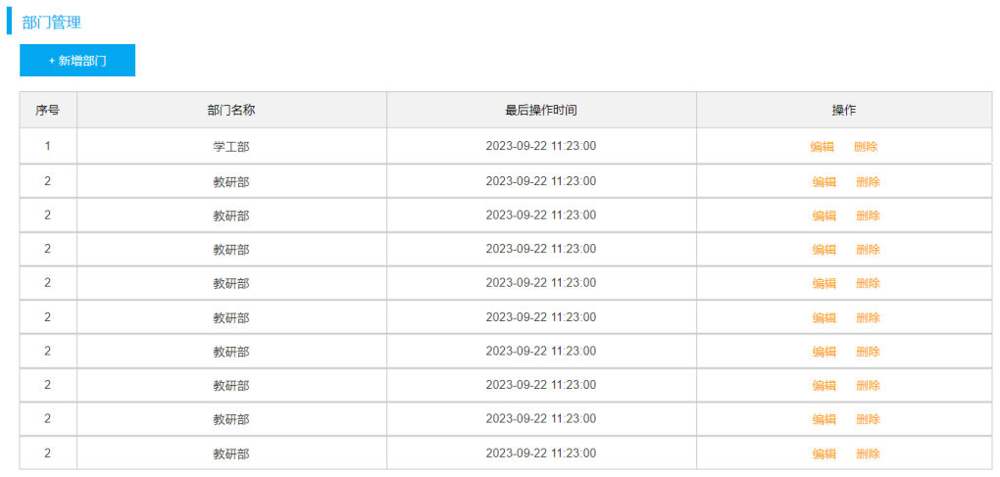
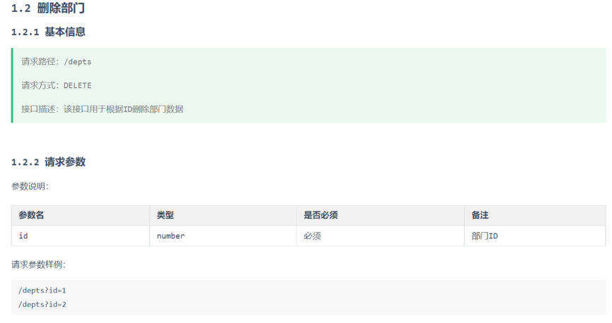

[59 篇](/posts/编程学习/javaweb学习笔记/59-部门管理-前后端联调与反向代理/)把"页面 → 接口 → 数据库"这条线接上了，页面上那排按钮已经能真正打到后端。这一篇（PPT 第 37～46 页）开始逐个把按钮后面的接口写出来，第一个是**删除部门**：从需求与接口文档出发，把三层代码写全，并把 Controller 接收"简单参数"的三种写法摆在一起比较——这三种写法是往后每一个带参数的接口都要用到的。

## 进度：实战的第三站（PPT 第 37～38 页）

PPT 第 37 页是这次 Tlias 实战的章节导航，一共六块：

> 准备工作 → 查询部门 → **删除部门** → 新增部门 → 修改部门 → 日志技术

[57 篇](/posts/编程学习/javaweb学习笔记/57-tlias项目准备与开发规范/)是"准备工作"，[58 篇](/posts/编程学习/javaweb学习笔记/58-部门管理-查询部门/)和[59 篇](/posts/编程学习/javaweb学习笔记/59-部门管理-前后端联调与反向代理/)做完了"查询部门"（接口 + 联调），PPT 第 38 页翻开的就是第三块——**删除部门**。

## 需求分析：删除的条件是主键 ID（PPT 第 39 页）

PPT 第 39 页只有一句需求：

> **删除的条件：主键 ID**

回到页面上看这句话对应的位置——部门列表每一行的「操作」列里都有"删除"：


*图：PPT 第 39 页配的页面原型——部门管理页（"+ 新增部门"按钮 + 表格的序号 / 部门名称 / 最后操作时间 / 操作四列）；操作列里每行都有"编辑""删除"，点某行的"删除"就是要按这一行部门的主键 ID 把数据删掉*

那么后端要提供什么样的接口，前端才好调用？看接口文档（`02. 接口文档`）里对好的这一条：


*图：PPT 第 39 页配的接口文档「1.2 删除部门」——请求路径 `/depts`、请求方式 `DELETE`、接口描述"该接口用于根据ID删除部门数据"；请求参数只有 `id`（number，必须），备注"部门ID"；请求参数样例 `/depts?id=1`、`/depts?id=2`*

三个信息落到代码里就是：

| 接口文档写着 | 代码里对应什么 |
| --- | --- |
| 请求路径 `/depts` + 请求方式 `DELETE` | Controller 方法上的 `@DeleteMapping`（类上已经有 `/depts`，见 [57 篇](/posts/编程学习/javaweb学习笔记/57-tlias项目准备与开发规范/)） |
| 参数 `id`，number，**必须** | 方法形参 `Integer id`，从地址栏的 `?id=8` 里取 |
| 响应是统一结果 | 方法返回 `Result`（`Result.success()`） |

> [!NOTE]
> 为什么删除是 `DELETE`、id 又跟在地址后面？这是 [57 篇](/posts/编程学习/javaweb学习笔记/57-tlias项目准备与开发规范/)讲的 **Restful** 风格：**URL 定位资源**（`/depts` 就是"部门"这个资源集合）、**HTTP 动词描述操作**（`DELETE` = 删除）；而 `id` 这种**简单参数**直接用 `?id=8` 放在地址上——这也解释了[59 篇](/posts/编程学习/javaweb学习笔记/59-部门管理-前后端联调与反向代理/)里前端那条请求为什么长这样：`DELETE /api/depts?id=7`（`/api` 前缀被 nginx 摘掉后，后端收到的就是 `DELETE /depts?id=7`）。

## 思路分析：三层各干什么（PPT 第 40、45 页）

PPT 第 40 页（第 45 页又重复了一遍）把这件事拆到三层：

| 层 | 职责 | 具体到删除部门 |
| --- | --- | --- |
| **Controller** | 接收请求参数、调用 Service 层、响应结果 | 从请求里拿到 `id`（地址是 `/depts?id=8`），调用 Service，最后 `return Result.success()` |
| **Service** | 业务处理，调用 Mapper 接口方法 | 这个功能业务上没什么要加工的，直接调 Mapper（不能自己写 SQL，也不能绕过 Mapper 去连库） |
| **Mapper** | 数据访问操作（增删改查） | SQL：`delete from dept where id = ?` |

三层的关系和"为什么必须分层"是[37～39 篇](/posts/编程学习/javaweb学习笔记/37-三层架构/)的内容，这里只需要记住一条纪律：**接收参数是 Controller 的事、写 SQL 是 Mapper 的事、中间业务归 Service**——删除这个功能虽然简单，代码也得按这个分工写。

## Controller 接收参数：三种方式（PPT 第 41～43 页）

这一节是本篇的重点：请求地址上的 `?id=8`，在 Controller 方法里到底怎么拿到？PPT 顺着讲了三种方式。

### 方式一：用 `HttpServletRequest` 自己取（PPT 第 41 页）

```java
@DeleteMapping("/depts")
public Result delete(HttpServletRequest request){
    String idStr = request.getParameter("id");   // 取出的是 String
    int id = Integer.parseInt(idStr);            // 还得自己转型
    System.out.println("根据ID删除部门: " + id);
    return Result.success();
}
```

请求对象 `HttpServletRequest` 是 [33 篇](/posts/编程学习/javaweb学习笔记/33-springboot获取请求数据/)学过的老熟人——Tomcat 解析请求后封装的对象，`getParameter("id")` 按名字取请求参数。PPT 在代码旁边标了两个词：**繁琐**、**手动类型转换**。具体繁在哪：

- `getParameter` 返回的永远是 **`String`**，数字要自己 `Integer.parseInt(idStr)` 转，转错了运行期才炸；
- 每多一个参数就多两行样板代码（取名 + 转型）；
- 参数没传时 `idStr` 是 `null`，`Integer.parseInt(null)` 会直接抛异常，还得自己判空。

### 方式二：用 `@RequestParam` 把请求参数绑定给形参（PPT 第 42 页）

```java
@DeleteMapping("/depts")
public Result delete(@RequestParam("id") Integer deptId){
    System.out.println("根据ID删除部门: " + deptId);
    return Result.success();
}
```

`@RequestParam("id")` 的意思是：**去请求参数里找名叫 `id` 的那个值，绑定到这个形参上**。注意形参可以叫别的名字（这里叫 `deptId`），注解里的 `"id"` 才是请求参数名。相比方式一，好处是：SpringMVC 顺手做了**类型转换**（`"8"` → `Integer 8`），不用再写 `parseInt`。

PPT 在这页底下放了一条**注意**：

> `@RequestParam` 注解 **`required` 属性默认为 `true`**，代表该参数**必须传递**，如果不传递将报错。如果参数可选，可以将属性设置为 `false`。

课程代码里那段被注释掉的写法正好演示了"可选"的版本：

```java
@RequestParam(value = "id", required = false) Integer deptId
```

### 方式三：参数名与形参名一致，直接写形参（PPT 第 43 页，推荐）

```java
@DeleteMapping("/depts")
public Result delete(Integer id){
    System.out.println("根据ID删除部门: " + id);
    return Result.success();
}
```

PPT 第 43 页的说法是：**如果请求参数名与形参变量名相同，直接定义方法形参即可接收**（省略 `@RequestParam`）。请求参数叫 `id`、形参也叫 `id`，SpringMVC 就自动对上了，**连注解都省了**。课程代码在注释里把这一种标为 **[推荐]**：

```java
/**
 * 删除部门 - 方式三: 省略@RequestParam (前端传递的请求参数名与服务端方法形参名一致) [推荐]
 */
@DeleteMapping
public Result delete(Integer id){
    log.info("根据ID删除部门: {}", id);
    deptService.deleteById(id);
    return Result.success();
}
```

（这里方法上写的是 `@DeleteMapping`、不带路径，因为类上已经有 `@RequestMapping("/depts")`——完整路径是"类上的 + 方法上的"拼起来，[62 篇](/posts/编程学习/javaweb学习笔记/62-部门管理-修改部门/)会专门讲这条规则。）

### 三种方式对照（PPT 第 44 页）

PPT 第 44 页把三种写法归在一张表里，并重申了那条注意事项：

| 方式 | 写法 | 特点 |
| --- | --- | --- |
| 一 | `String xxx = request.getParameter("xxx");` | 通过原始的 `HttpServletRequest` 对象获取；**繁琐、要手动类型转换** |
| 二 | `public Result del(@RequestParam("id") Integer deptId){}` | 通过 **`@RequestParam` 注解进行参数绑定**；形参名可以与请求参数名不同 |
| 三 | `public Result delete(Integer id){}` | 保证**请求参数名与形参变量名相同**，直接接收（**推荐**） |
| 注意 | —— | **一旦加了 `@RequestParam` 注解，该参数必须传递**，因为默认 `required` 为 `true` |

### 本机实测：不传 id 的两种结果（`required` 那条注意的实证）

"必须传递"到底是什么意思？本机专门做了对照实验，把形参改来改去各发一次请求：

> [!TIP]
> **本机实测**（把形参改来改去各发一次请求）：
>
> | 场景 | 结果 |
> | --- | --- |
> | `DELETE /depts`（**不传** id，形参是 `Integer id`、**没加** `@RequestParam`） | **200 + success**。服务端日志里 `Parameters: null`、`Updates: 0`——id 取到 `null`，SQL 变成 `where id = null`，**一条也没删，但也不报错** |
> | 形参改成 `@RequestParam Integer id` 后**不传** id | **400 Bad Request**。响应体是 Spring 默认的错误页 `{"timestamp":…,"status":400,"error":"Bad Request"}`，**不是**统一的 `Result` 结构 |

两条结论：

1. **加了 `@RequestParam` 就等于声明"这个参数必填"**（`required` 默认 `true`），缺了直接被 SpringMVC 拦在方法外面（400），根本进不了你的方法体；
2. **不加注解时，包装类型（`Integer`）可以缺省**，取到 `null` 也不会报错——代价是**错误被悄悄吞掉**：用户以为删了，服务器其实什么都没删（`Updates: 0`）。

> [!WARNING]
> 第二种"悄悄失败"比第一种"直接 400"更难查。所以正式项目里通常会在 Service 里补一层判断（比如 `id` 为空就直接返回错误结果 `Result.error("参数错误")`），把"没删到"这件事明确告诉前端。课程的例子里没有加这层判断，知道有这个坑就行。

## 完整实现：三层代码（PPT 第 46 页）

需求清楚了、参数接法定了，剩下的就是把三层填满。PPT 第 46 页的完整代码（方法名用的是 `delete`、日志用 `System.out.println`）：

```java
// DeptController
@DeleteMapping("/depts")
public Result delete(Integer id){
    System.out.println("根据ID删除部门数据: " + id);
    deptService.delete(id);
    return Result.success();
}
```

```java
// DeptServiceImpl
@Override
public void delete(Integer id) {
    deptMapper.delete(id);
}
```

```java
// DeptMapper
@Delete("delete from dept where id = #{id}")
void delete(Integer id);
```

课程**代码工程**里是同一套写法，只有两处命名/风格上的差别（以工程为准）：

```java
// DeptController（工程版：类上有 @RequestMapping("/depts")，方法上就不用再写路径了）
@DeleteMapping
public Result delete(Integer id){
    log.info("根据ID删除部门: {}", id);   // 用日志代替 System.out.println（见 63 篇）
    deptService.deleteById(id);
    return Result.success();
}
```

```java
// DeptService（接口）
void deleteById(Integer id);

// DeptServiceImpl
@Override
public void deleteById(Integer id) {
    deptMapper.deleteById(id);
}
```

```java
// DeptMapper
@Delete("delete from dept where id = #{id}")
void deleteById(Integer id);
```

两处差别记一下就好：**方法名 `delete` / `deleteById`**，**打日志用 `System.out.println` / `log.info`**（日志技术是[63 篇](/posts/编程学习/javaweb学习笔记/63-日志技术/)的内容）。

> [!TIP]
> Mapper 里那句 `@Delete("delete from dept where id = #{id}")` 有两个要点：
> - **注解名与动词对应**：删除用 `@Delete`，新增用 `@Insert`、修改用 `@Update`、查询用 `@Select`（[54 篇](/posts/编程学习/javaweb学习笔记/54-mybatis增删改查/)）；
> - **`#{id}` 是预编译占位符**（[50 篇](/posts/编程学习/javaweb学习笔记/50-jdbc查询与预编译sql/)）：MyBatis 最终发给数据库的是 `delete from dept where id = ?`，值单独传参——不是把 id 拼进 SQL 字符串里。

## 本机实测：删掉一个部门的响应与日志

接口写完，本机真删过一条（当时用新增接口造了一条 id = 7 的"测试部"）：

> [!TIP]
> **本机实测**：
>
> ```text
> $ curl -X DELETE http://localhost:8080/depts?id=7
> {"code":1,"msg":"success","data":null}      # 统一响应结果：code 1 成功、data 为 null
>
> # 再用根据ID查询的接口查这条 → data 已经是 null（记录真的没了）
> ```
>
> 服务端控制台里同时能看到 MyBatis 打出的 SQL（工程开了 `log-impl` 标准输出）：
>
> ```text
> ==>  Preparing: delete from dept where id = ?
> ```
>
> 注意这条 `Preparing` 里只有 **`?`**——id 不在 SQL 字符串里，是单独作为参数传下去的（所以即使 id 是恶意字符串也注入不进去）。
>
> 至于这个 `?` 实际拿到了什么值，日志紧接着的两行就是答案，而本机那次**不传 id** 的实验里它长这样：
>
> ```text
> ==>  Parameters: null
> <==    Updates: 0        # 一条也没删掉
> ```
>
> **同一条 SQL，参数不同、影响行数就不同**——这就是用日志判断"到底删没删到"的依据（下面一节再把这两行实验说全）。
> （本机连的是 MySQL 的 `tlias` 库、`dept` 表（6 条数据），用户名 `root`；`password` 换成你自己 MySQL 的密码。）

## 顺带一个真实的环境坑：Windows 命令行发中文 JSON

删除接口的参数是数字，用命令行测它没问题；但同一批接口测试里，一旦你**用命令行发带中文的 JSON**（比如测[新增部门](/posts/编程学习/javaweb学习笔记/61-部门管理-新增部门/)），就会撞上一个和代码无关的坑：

> [!WARNING]
> **本机实测**：在 Git Bash 里用 `curl -d '{"name":"测试部"}'` 直接发中文 JSON → **400 Bad Request**。原因是 **Windows 命令行的参数是 GBK 编码**，而请求体按 `application/json` 会被服务端按 **UTF-8** 解析，两边编码对不上，中文就成了乱码/非法字节。
>
> 两个绕开的办法：① 把 JSON 写进一个 **UTF-8 编码的文件**，用 `curl --data-binary @body.json` 发（`--data-binary` 保证不做任何转换）；② 干脆用 **Apifox**——课程推荐这个工具的原因之一就是它不存在这种命令行编码问题（[57 篇](/posts/编程学习/javaweb学习笔记/57-tlias项目准备与开发规范/)）。

## 小结

| 问题 | 答案 |
| --- | --- |
| 删除部门的需求是什么？ | 页面上点某行的"删除"，把那条部门按**主键 ID** 删掉；接口文档：`DELETE /depts`，参数 `id`（number，必须），样例 `/depts?id=1` |
| 三层各干什么？ | Controller 接收请求参数（`/depts?id=8`）+ 调用 Service + 响应结果；Service 调 Mapper 接口方法；Mapper 执行 `delete from dept where id = ?` |
| 接收简单参数有哪三种方式？ | ① `HttpServletRequest.getParameter("id")`（繁琐、要手动转型）② `@RequestParam("id") Integer deptId`（注解绑定）③ 请求参数名与形参名一致，直接写形参（**推荐**） |
| `@RequestParam` 有什么要注意的？ | `required` 默认 `true`——**加了注解就必须传**，不传报 **400**；要可选就写 `required = false` |
| 不加注解可以不传吗？ | 可以。形参是包装类型 `Integer` 时，不传取到 `null`，请求照样 200——但 MyBatis 日志里 `Updates: 0`，**一条也没删** |
| Mapper 怎么写？ | `@Delete("delete from dept where id = #{id}")`，方法名工程里叫 `deleteById`；最终发到数据库的是 `delete from dept where id = ?`（预编译） |
| 本机实测的响应？ | `DELETE /depts?id=7` → `{"code":1,"msg":"success","data":null}`；MyBatis 日志 `Preparing: delete from dept where id = ?` |
| 命令行测接口的坑？ | Windows 命令行发中文 JSON 会 **400**（GBK 与 UTF-8 不一致）——把 JSON 存成 UTF-8 文件用 `--data-binary @file` 发，或用 Apifox |

## 相关

- [上一篇：部门管理-前后端联调与反向代理](/posts/编程学习/javaweb学习笔记/59-部门管理-前后端联调与反向代理/)
- [下一篇：部门管理-新增部门](/posts/编程学习/javaweb学习笔记/61-部门管理-新增部门/)

## 练习题

### 一、知识回顾（读完直接做下面的实践题）

1. **需求**：页面操作列点"删除"→ 按这一行的**主键 ID** 删数据；接口文档：请求路径 `/depts`、请求方式 `DELETE`、参数 `id`（number，**必须**）、样例 `/depts?id=1`
2. **三层的职责（PPT 第 40 页）**：Controller **接收请求参数**（`/depts?id=8`）+ 调用 Service + 响应结果；Service 调 Mapper 接口方法；Mapper 执行 SQL `delete from dept where id = ?`
3. **方式一**：用 `HttpServletRequest` 的 `getParameter("id")` 取——**繁琐**，返回 `String` 要**手动类型转换**，参数没传时 `parseInt(null)` 还会抛异常
4. **方式二**：`@RequestParam("id") Integer deptId` 把请求参数**绑定**给形参——形参名可以与请求参数名不同，SpringMVC 自动做类型转换
5. **方式三（推荐）**：请求参数名与形参变量名**相同**时，直接定义方法形参即可，**省略 `@RequestParam`**
6. **注意事项**：**一旦加了 `@RequestParam`，该参数必须传递**——`required` 默认为 `true`，不传将被拦在方法外报错；要可选就设 `required = false`
7. **本机实测（不传 id）**：形参是 `Integer id` 且没加注解 → **200 + success**，`Parameters: null`、`Updates: 0`（删 0 行不报错）；形参加了 `@RequestParam` → **400 Bad Request**，响应体是 Spring 默认错误 JSON，不是统一 `Result`
8. **Mapper 写法**：`@Delete("delete from dept where id = #{id}")`，方法名课程工程里叫 `deleteById`；`#{}` 是**预编译占位符**，最终 SQL 是 `delete from dept where id = ?`
9. **本机实测（删成功）**：`DELETE /depts?id=7` → `{"code":1,"msg":"success","data":null}`；MyBatis 日志 `==> Preparing: delete from dept where id = ?`
10. **命令行坑**：Windows 命令行参数是 GBK，`curl -d '{"name":"测试部"}'` 这类中文 JSON 会 **400**；把 JSON 存成 UTF-8 文件用 `--data-binary @body.json` 发，或直接用 Apifox

### 二、裸写题

- [ ] **2-1 开发"根据 ID 删除部门"的接口**
  需求：页面操作列点"删除"时，把该行部门从数据库里删掉。接口地址 `/depts`、请求方式 `DELETE`、要删的部门 ID 跟着地址传（形如 `/depts?id=8`）；三层都要写：Controller 只负责接参数、调 Service、返回统一响应结果；Service 调 Mapper；Mapper 用一条删除的 SQL（条件按主键）。项目里已经准备好 `Result` 统一响应结果类、`Dept`/`DeptService`/`DeptMapper` 这些结构（[57 篇](/posts/编程学习/javaweb学习笔记/57-tlias项目准备与开发规范/)搭的），表是 `tlias` 库的 `dept`。
  （练习文件 `test_60_删除部门接口.java` 的题目2-1 里给了写作区。）

  > [!TIP]- 提示（先自己想，实在想不出再点开）
  > **一级 · 思路**：先给 Controller 标"哪条路径、哪种请求方式"，形参就按"请求参数名与形参名一致"的推荐写法写；Service 只做转发；Mapper 上写删除 SQL，SQL 里用预编译占位符取形参
  > **二级 · 方法**：类上（或方法上）用 `@DeleteMapping`，方法形参写 `Integer id`；Service 里 `deptMapper.deleteById(id)`；Mapper 里 `@Delete("delete from dept where id = #{id}")`；返回 `Result.success()`
  > **三级 · 骨架**：
  > - Controller：`@DeleteMapping("____") public Result delete(Integer ____){ deptService.____(id); return Result.____(); }`
  > - Service：接口 `void deleteById(____ id);`，实现 `deptMapper.____(id);`
  > - Mapper：`@Delete("delete from dept where ____ = #{id}") void deleteById(____ id);`

  > [!TIP]- 参考答案（做完再点开）
  > 与课程 `代码/tlias-web-management` 一致（方法名以工程为准，PPT 里叫 `delete`；代码里的 `log` 来自 [63 篇](/posts/编程学习/javaweb学习笔记/63-日志技术/)要讲的 `@Slf4j`，还没学到就先写 `System.out.println`）：
  > ```java
  > // ===== Controller 层：接收请求参数 + 调用 Service + 响应结果 =====
  > @RestController
  > @RequestMapping("/depts")
  > public class DeptController {
  >
  >     @Autowired
  >     private DeptService deptService;
  >
  >     /**
  >      * 根据 ID 删除部门
  >      */
  >     @DeleteMapping
  >     public Result delete(Integer id){
  >         log.info("根据ID删除部门: {}", id);
  >         deptService.deleteById(id);
  >         return Result.success();
  >     }
  > }
  > ```
  > ```java
  > // ===== Service 层：业务处理（这里只做转发） =====
  > public interface DeptService {
  >     void deleteById(Integer id);
  > }
  >
  > @Service
  > public class DeptServiceImpl implements DeptService {
  >
  >     @Autowired
  >     private DeptMapper deptMapper;
  >
  >     @Override
  >     public void deleteById(Integer id) {
  >         deptMapper.deleteById(id);
  >     }
  > }
  > ```
  > ```java
  > // ===== Mapper 层：数据访问 =====
  > @Mapper
  > public interface DeptMapper {
  >     /**
  >      * 根据 ID 删除部门
  >      */
  >     @Delete("delete from dept where id = #{id}")
  >     void deleteById(Integer id);
  > }
  > ```
  > 自查：① 类上写了 `@RequestMapping("/depts")` 时，方法上 `@DeleteMapping` 可以不带路径（完整路径 = 类上 + 方法上的）；② `#{}` 里的名字要和 Mapper 方法的形参名对得上（`#{id}` ↔ `Integer id`）；③ 删除没有要加工的字段，所以 Service 里不写业务处理，但也**不能省掉这一层**去 Controller 里直接调 Mapper。
  > 本机实测这条链路的结果：`DELETE /depts?id=7` → `{"code":1,"msg":"success","data":null}`。

- [ ] **2-2 同一个参数，三种写法各写一遍**
  需求：上面那个删除接口，请把接收 `id` 的三种写法各写一遍：① 用请求对象自己取（并说明为什么它"繁琐"）；② 用注解把请求参数绑定给形参（形参故意取一个与请求参数不同的名字）；③ 靠"请求参数名与形参名一致"省略注解。写完说明实际项目里选哪种、为什么。
  （练习文件 `test_60_删除部门接口.java` 的题目2-2 里给了写作区。）

  > [!TIP]- 提示（先自己想，实在想不出再点开）
  > **一级 · 思路**：三种写法的差别只在**方法签名**上（怎么把请求里的 id 拿到手），其余三层的代码完全一样
  > **二级 · 方法**：① `HttpServletRequest` + `getParameter` + 手动 `Integer.parseInt`；② `@RequestParam("id") Integer deptId`；③ `@DeleteMapping` + `Integer id`
  > **三级 · 骨架**：
  > ① `public Result delete(____ request){ String idStr = request.____("id"); int id = Integer.____(idStr); … }`
  > ② `public Result delete(@____("id") Integer ____){ … }`
  > ③ `public Result delete(Integer ____){ … }`

  > [!TIP]- 参考答案（做完再点开）
  > ```java
  > // 方式一：原始的 HttpServletRequest（繁琐 + 手动类型转换）
  > @DeleteMapping("/depts")
  > public Result delete(HttpServletRequest request){
  >     String idStr = request.getParameter("id");   // 取出来是 String
  >     int id = Integer.parseInt(idStr);            // 自己转型，参数没传时还会抛异常
  >     System.out.println("根据ID删除部门: " + id);
  >     return Result.success();
  > }
  >
  > // 方式二：@RequestParam 绑定（形参名可以和请求参数名不一样）
  > @DeleteMapping("/depts")
  > public Result delete(@RequestParam("id") Integer deptId){
  >     System.out.println("根据ID删除部门: " + deptId);
  >     return Result.success();
  > }
  >
  > // 方式三：请求参数名与形参名一致，省略注解（推荐）
  > @DeleteMapping("/depts")
  > public Result delete(Integer id){
  >     System.out.println("根据ID删除部门: " + id);
  >     return Result.success();
  > }
  > ```
  > 项目里选**方式三**：最常见、最短（PPT 第 43/44 页都标为推荐）；只有"请求参数名与形参名不一致"或"要控制必填/可选"时才用方式二（`@RequestParam(value = "id", required = false)`）；方式一是 Servlet 时代的做法，查参数多、还要手动转型，现在只用来理解"请求参数从哪来"。

- [ ] **2-3 参数不传会怎样：把两种结果解释清楚**
  需求：有人用工具发了一次 `DELETE /depts`——**不带 id**。请回答：① 如果方法形参是 `Integer id` 且**没有**加 `@RequestParam`，这次请求的状态码是什么、数据库里会发生什么？（结合服务端日志里的 `Parameters` 与 `Updates` 说明）② 如果形参加的是 `@RequestParam Integer id`，结果又是什么？③ 想让这个参数"可选"，注解上要加什么属性、写成什么样？
  （练习文件 `test_60_删除部门接口.java` 的题目2-3 里给了写作区。）

  > [!TIP]- 提示（先自己想，实在想不出再点开）
  > **一级 · 思路**：两问的区别是"有没有加注解"——不加注解没人检查参数在不在，加了注解就默认必填；`@RequestParam` 控制必填/可选的属性叫 `required`
  > **二级 · 方法**：不加注解 → 形参取到 `null` → SQL 的 `where id = null` 匹配不到任何行（`Updates: 0`）；加注解 → 参数缺失，SpringMVC 在调用方法前就返回 400；可选写成 `@RequestParam(value = "id", required = false)`
  > **三级 · 骨架（答题骨架）**：① 状态码 `____`，日志 `Parameters: ____`、`Updates: ____`，结果是 `____`；② 状态码 `____`，响应体是 `____`；③ 写法 `@RequestParam(value = "id", required = ____) Integer id`

  > [!TIP]- 参考答案（做完再点开）
  > ① **200 + success**。id 取到 `null`，MyBatis 日志里是 `==> Parameters: null`、`<== Updates: 0`——**一条也没删，但接口"成功"了**（本机实测）。这是最坑的一种：前端以为删掉了，数据库纹丝不动；
  > ② **400 Bad Request**，而且**进不了你的方法体**——SpringMVC 在参数绑定阶段就拒绝了；响应体是 Spring 默认的错误页 `{"timestamp":…,"status":400,"error":"Bad Request"}`，**不是**统一响应结果 `Result`（本机实测）。原因是 `@RequestParam` 的 `required` **默认是 `true`**（PPT 第 42/44 页的注意）；
  > ③ 把必填改成可选：`@RequestParam(value = "id", required = false) Integer deptId`（课程代码里注释掉的那段就是这么写的）。改成可选之后不传 id，行为回到 ① —— 能进方法，但 id 是 `null`，同样删不到东西，所以真正的做法是在 Service 里对 `null` 做判断并返回失败结果。

### 三、综合题

- [ ] **3-1 把删除部门从接口做到页面上点得动**
  照着课程把这一站的完整流程走一遍：写代码 → 启动 → 测接口 → 看日志 → 页面上点。
  1. 在工程的 `DeptMapper`、`DeptService`/`DeptServiceImpl`、`DeptController` 三层里把"根据 ID 删除部门"的方法补齐（课堂代码里的方法名是 `deleteById`）；
  2. 启动工程，用 Apifox（或命令行 `curl -X DELETE`，注意别在命令行里发中文）发一次 `DELETE /depts?id=1`，把返回的 JSON 抄下来；
  3. 去客户端里执行 `select * from dept;` 确认那条记录真的没了（**测完记得把数据恢复回去**：重新执行一遍 `dept.sql` 里的 `insert`）；
  4. 故意做一次对照实验：**把 id 去掉**再发一次同样的请求，先把当时的控制台日志（`Parameters`、`Updates` 两行）抄下来；再把形参改成"必须传递"的绑定写法（`@RequestParam`）重启，重复一次不带 id 的请求，记录状态码和响应体；
  5. 把[59 篇](/posts/编程学习/javaweb学习笔记/59-部门管理-前后端联调与反向代理/)的前端工程起着（90），在后端的删除接口做好之后，到页面上点某一行的"删除"，观察表格是不是少了一行；
  6. 收尾回答下面的两个问题。

  回答：① 这一站里"接收参数"为什么放在 Controller、而"删除条件"为什么要写成主键？② 两次对照实验（不加注解 / 加注解）的结果，说明了 `@RequestParam` 的什么特性？
  （练习文件 `test_60_删除部门接口.java` 的"综合题"一段里按这 6 步给了写作区。）

  **涉及知识点**

  | 知识点 | 在这里的应用 |
  | --- | --- |
  | 需求与接口文档（PPT 39） | 第 1、2 步——`DELETE /depts`、参数 `id` 必填、样例 `/depts?id=1` |
  | 三层职责（PPT 40） | 第 1 步——Controller 接参、Service 转发、Mapper 写 SQL |
  | 简单参数三种接收方式（PPT 41～44） | 第 2、4 步——推荐写法 + 对照实验 |
  | `required` 默认 true（PPT 42、44） | 第 4 步——不传 id 的两种结果（200 vs 400） |
  | 联调（59 篇） | 第 5 步——页面上点"删除"验证整条链路 |
  | MyBatis 日志（本机实测） | 第 4 步——`Parameters`、`Updates` 两行是判断"删没删到"的依据 |

  > [!TIP]- 提示（先自己想，实在想不出再点开）
  > **一级 · 思路**：写代码只写三层里"删除"这一条线；实验的变量只有一个——**形参上有没有 `@RequestParam`**，其余条件（同一地址、同样不带 id）保持一致
  > **二级 · 方法**：Mapper 用 `@Delete` + `#{id}`；Controller 推荐写法是 `public Result delete(Integer id)`；对照实验把形参改成 `@RequestParam Integer id` 重启后再发一次
  > **三级 · 骨架**：① `@DeleteMapping` + `public Result delete(____ id)` → `deptService.____(id)`；② 请求 `DELETE http://localhost:8080/depts?id=____`；③ 日志 `==> Preparing: delete from dept where id = ____`、`<== Updates: ____`；④ 加注解后不传 id → 状态码 `____`

  > [!TIP]- 参考答案（做完再点开）
  > **3-1**
  > 1. 三层代码（与 2-1 答案一致，方法名用工程的 `deleteById`；`log` 来自 `@Slf4j`，见 2-1 答案里的说明）：
  >    ```java
  >    @DeleteMapping
  >    public Result delete(Integer id){        // Controller：接收请求参数
  >        log.info("根据ID删除部门: {}", id);
  >        deptService.deleteById(id);
  >        return Result.success();
  >    }
  >
  >    @Override
  >    public void deleteById(Integer id) {     // Service：调用 Mapper
  >        deptMapper.deleteById(id);
  >    }
  >
  >    @Delete("delete from dept where id = #{id}")
  >    void deleteById(Integer id);             // Mapper：SQL delete from dept where id = ?
  >    ```
  > 2. 本机实测返回：`{"code":1,"msg":"success","data":null}`（`data` 是空——删除不需要回数据）。
  > 3. `select * from dept;` 里那条已经查不到了；恢复数据用 `dept.sql` 里的 `insert` 语句重新插回去。
  > 4. 两次对照实验（本机实测）：
  >    - 形参 `Integer id`、**不加**注解，发 `DELETE /depts`（不带 id）→ **200 + success**，日志 `==> Parameters: null` / `<== Updates: 0`（删 0 行，不报错）；
  >    - 形参改成 `@RequestParam Integer id`，同样不带 id → **400 Bad Request**，响应体 `{"timestamp":…,"status":400,"error":"Bad Request"}`（Spring 默认错误页，不是统一 `Result`）。
  > 5. 联调：前端工程（90）在跑、后端接口写好之后，页面上点某行"删除"→ 表格少一行；经反向代理删的还是 `/api/depts?id=xx` 被摘成 `/depts?id=xx`（[59 篇](/posts/编程学习/javaweb学习笔记/59-部门管理-前后端联调与反向代理/)）。
  > 6. 两个回答：
  >    ① 请求参数是"从 HTTP 请求里取数据"，属于**接收请求**的职责，所以放 Controller（前端传什么、怎么对上是接口层的事）；删除必须按**主键**是因为主键唯一标识一行——按名字之类的字段删可能误删多行（`dept` 表的 `name` 上虽然有唯一约束，但业务上"按 ID 操作"是标准做法：定位精准、不怕重复）；
  >    ② 说明 `@RequestParam` 的 **`required` 默认为 `true`**：一旦加了注解，这个参数就成了**必填**，缺失时 SpringMVC 在调用方法前就返回 400；不加注解时参数可以缺省（取到 `null`），**错误被悄悄吞掉**（`Updates: 0`）——所以判断"删没删到"要看日志里的影响行数。
