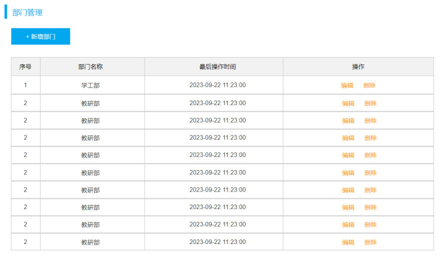
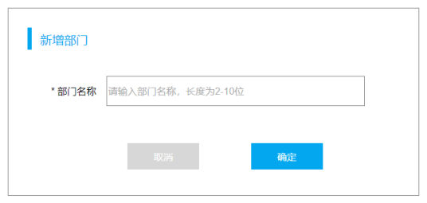
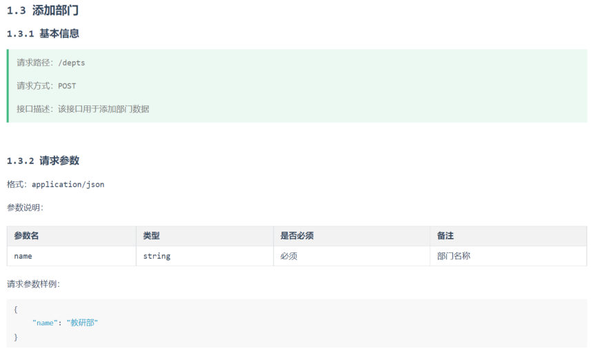

[60 篇](/posts/编程学习/javaweb学习笔记/60-部门管理-删除部门/)把"删除"写完了，参数是跟在地址后面的 `?id=8`。这一篇（PPT 第 47～53 页）写**新增部门**，它带来一个新东西：**参数不再挂在地址上，而是放在请求体里用 JSON 传**——这是往后每个"要提交一整个对象"的接口（新增、修改）都要用的参数格式；另一个新东西是：**时间字段不该由前端填，而是后端在 Service 里补**。

## 进度：实战的第四站（PPT 第 47～48 页）

PPT 第 47 页的章节导航再次出现：准备工作 → 查询部门 → 删除部门 → **新增部门** → 修改部门 → 日志技术。PPT 第 48 页翻开的就是第四块——**新增部门**。

## 需求分析：往 dept 表插入一条数据（PPT 第 49 页）

PPT 第 49 页的需求一句话：

> 往 dept 表插入一条数据

这句话在页面上的样子是"点按钮 → 弹窗 → 填名字 → 确定"三步：


*图：PPT 第 49 页配的页面原型——部门管理页右上角就是"+ 新增部门"按钮，新增功能从这个按钮开始*


*图：PPT 第 49 页配的新增弹窗——只有一个必填项"部门名称"（提示"请输入部门名称，长度为2-10位"），下面是"取消""确定"两个按钮；用户在这里**只填名字**，没有任何时间字段*

那后端要接的接口长什么样？看接口文档「1.3 添加部门」：


*图：PPT 第 49 页配的接口文档——请求路径 `/depts`、请求方式 `POST`、接口描述"该接口用于添加部门数据"；请求参数**格式 `application/json`**，参数只有 `name`（string，必须，备注"部门名称"）；请求参数样例 `{"name": "教研部"}`*

三个信息落到代码里：

| 接口文档写着 | 代码里对应什么 |
| --- | --- |
| 请求路径 `/depts` + 请求方式 `POST` | Controller 方法上的 `@PostMapping`（类上有 `/depts`，见 [57 篇](/posts/编程学习/javaweb学习笔记/57-tlias项目准备与开发规范/)） |
| 参数**格式 `application/json`**、参数 `name` | 方法用**实体对象**接收请求体 + 加 `@RequestBody` 注解（这一篇的重点） |
| 响应是统一结果 | 返回 `Result.success()` |

> [!NOTE]
> 和[删除](/posts/编程学习/javaweb学习笔记/60-部门管理-删除部门/)比一下就看出区别了：删除的参数是 `id` 这种**简单参数**，用 `?id=8` 挂在地址上；新增要传的是**一个对象**（`{"name":"教研部"}`），所以走**请求体 + JSON**。这也是 [57 篇](/posts/编程学习/javaweb学习笔记/57-tlias项目准备与开发规范/) Restful 里的分工——**POST = 新增**，数据放在请求体里。

## 思路分析：三层各干什么（PPT 第 50 页）

PPT 第 50 页把这件事拆到三层，注意中间那层的职责和删除**不一样**了：

| 层 | 职责 | 具体到新增部门 |
| --- | --- | --- |
| **Controller** | 接收请求参数、调用 Service 层、响应结果 | 接收请求体里的 JSON（`{"name":"教研部"}`）→ 调用 Service → `return Result.success()` |
| **Service** | 业务处理，调用 Mapper 接口方法 | **补全基础属性**（`create_time`、`update_time`）后再调 Mapper |
| **Mapper** | 数据访问操作（增删改查） | SQL：`insert into dept (name, create_time, update_time) values (?, ?, ?)` |

**Service 层那句"补全基础属性"是这一站的新知识点**，值得先想清楚：

- 弹窗里用户只填了**部门名称**——`create_time`、`update_time` 前端一个都没传；
- 而 `dept` 表的定义是 `create_time datetime DEFAULT NULL`、`update_time datetime DEFAULT NULL`（[57 篇](/posts/编程学习/javaweb学习笔记/57-tlias项目准备与开发规范/)建的 `dept` 表）——**允许为空，也没有"自动填当前时间"的默认值**；
- 所以如果代码不管，插进去的就会是两条 `NULL`，"最后修改时间"列永远是空的；
- 那谁来填？**业务规则**（"新增时记录创建时间和修改时间"）属于 Service 该管的事，Controller 只管收、Mapper 只管存。

## Controller 接收参数：JSON 用实体对象接收（PPT 第 51 页）

PPT 第 51 页把规则写得很清楚：

> JSON 格式的参数，通常会使用**一个实体对象**进行接收。
> 规则：**JSON 数据的键名与方法形参对象的属性名相同**，并需要使用 **`@RequestBody`** 注解标识。

接收这个请求（`POST /depts`，请求体 `{"name":"教研部"}`）：

```java
@PostMapping("/depts")
public Result add(@RequestBody Dept dept){
    System.out.println("添加部门: " + dept);
    deptService.add(dept);
    return Result.success();
}
```

被接收的实体类就是[57 篇](/posts/编程学习/javaweb学习笔记/57-tlias项目准备与开发规范/)准备好的 `Dept`：

```java
@Data
@NoArgsConstructor
@AllArgsConstructor
public class Dept {
    private Integer id;             // ID
    private String name;            // 部门名称
    private LocalDateTime createTime;  // 创建时间
    private LocalDateTime updateTime;  // 修改时间
}
```

三个要点：

1. **为什么用实体对象接收**：请求体里是一个 JSON **对象**（`{"name":"教研部"}`），而不是一串零散参数；用实体对象接，SpringMVC 会把 JSON 的键**按名字逐个填进同名的属性**里（`"name"` → `dept.name`），字段多了也不用改方法签名。前端传几个字段就填几个，没传的字段保持 `null`（所以这次 `id`、两个时间都是 `null`——本机日志里能看到 `Dept(id=null, name=测试部, createTime=null, updateTime=null)`）。
2. **键名必须与属性名一致**：JSON 里写 `"name"`，实体属性就叫 `name`，才对得上；写成 `"deptName"` 就对不上，那个属性会收到 `null`（**不报错**，但数据丢了）。这一点和 [58 篇](/posts/编程学习/javaweb学习笔记/58-部门管理-查询部门/)"字段名/属性名必须对得上"是同一个道理，只不过方向反过来——那次是查出来的列往属性里填，这次是 JSON 的键往属性里填。
3. **`@RequestBody` 是关键**：它告诉 SpringMVC"这个参数的值来自**请求体**，请把请求体的 JSON 反序列化成这个对象"。反序列化由消息转换器（`spring-boot-starter-web` 带进来的 **Jackson**）完成——所以我们不写一句解析 JSON 的代码。反过来说：**不带 `@RequestBody`，SpringMVC 会以为你在要一个"请求参数"，而 JSON 根本不在地址上，接到的就是空对象**。

> [!TIP]
> 三个注解对应请求里三个不同的位置，别混（[33 篇](/posts/编程学习/javaweb学习笔记/33-springboot获取请求数据/)讲过请求数据的分布）：
>
> | 注解 | 取的数据来自 | 用在什么场景 |
> | --- | --- | --- |
> | （不写注解） | 地址栏 `?key=value` 里的**简单参数** | `DELETE /depts?id=8`（[60 篇](/posts/编程学习/javaweb学习笔记/60-部门管理-删除部门/)） |
> | `@RequestBody` | **请求体**（JSON） | `POST /depts` 传 `{"name":"教研部"}`（本篇） |
> | `@PathVariable` | URL **路径里的占位**（如 `/depts/1`） | 根据 ID 查询/修改回显（[62 篇](/posts/编程学习/javaweb学习笔记/62-部门管理-修改部门/)） |
>
> 新增还有个"为什么不能用地址传"的原因：部门名称放在 URL 里要编码、长度也受限制，而且 JSON 请求体能一次带一整个对象。

## 完整实现：三层代码（PPT 第 52 页）

PPT 第 52 页的完整代码：

```java
// DeptController
@PostMapping("/depts")
public Result add(@RequestBody Dept dept){
    System.out.println("添加部门: " + dept);
    deptService.add(dept);
    return Result.success();
}
```

```java
// DeptServiceImpl
@Override
public void add(Dept dept) {
    dept.setCreateTime(LocalDateTime.now());   // 补全创建时间
    dept.setUpdateTime(LocalDateTime.now());   // 补全修改时间
    deptMapper.add(dept);
}
```

```java
// DeptMapper
@Insert("insert into dept(name, create_time, update_time) values(#{name}, #{createTime}, #{updateTime})")
void add(Dept dept);
```

课程**代码工程**里是同一套写法，差别只在方法名（`add` → `insert`）和日志风格：

```java
// DeptController（工程版：类上有 @RequestMapping("/depts")）
@PostMapping
public Result add(@RequestBody Dept dept){
    log.info("新增部门:{}", dept);     // 用日志代替 System.out.println（见 63 篇）
    deptService.add(dept);
    return Result.success();
}
```

```java
// DeptService（接口）
void add(Dept dept);

// DeptServiceImpl
@Override
public void add(Dept dept) {
    //1. 补全基础属性 - createTime, updateTime
    dept.setCreateTime(LocalDateTime.now());
    dept.setUpdateTime(LocalDateTime.now());

    //2. 调用Mapper接口方法插入数据
    deptMapper.insert(dept);
}
```

```java
// DeptMapper
@Insert("insert into dept(name, create_time, update_time) values(#{name}, #{createTime}, #{updateTime})")
void insert(Dept dept);
```

Mapper 那句 SQL 要逐段对上：

| 这一段 | 说明 |
| --- | --- |
| `insert into dept` | 表名 |
| `(name, create_time, update_time)` | **要插入的三列**——正好是"前端传的 1 个 + 后端补的 2 个" |
| `values(#{name}, #{createTime}, #{updateTime})` | 三个 `#{}` 取的是**实体对象的属性**（`dept.getName()`、`dept.getCreateTime()`、`dept.getUpdateTime()`），不是数据库列名——所以这里是驼峰 `#{createTime}` 而不是下划线 `#{create_time}` |
| （没有 `id`） | `id` 是**自增主键**，插入时不用写（[44 篇](/posts/编程学习/javaweb学习笔记/44-ddl表结构与建表案例/)），数据库自己分配 |
| `#{}` | MyBatis 的**预编译占位符**，最终发给数据库的是 `insert into dept(name, create_time, update_time) values(?,?,?)`（[50 篇](/posts/编程学习/javaweb学习笔记/50-jdbc查询与预编译sql/)） |

## 本机实测：新增一条部门，并看见时间是谁填的

这是"用日志验证代码"最漂亮的一个例子——本机新增"测试部"，把响应、SQL、日志三样都留下了：

> [!TIP]
> **本机实测**：
>
> ```text
> $ curl -X POST http://localhost:8080/depts   -d '{"name":"测试部"}'
> {"code":1,"msg":"success","data":null}      # 新增成功，不需要回数据
> ```
>
> 服务端控制台里，`@Slf4j` 打出的第一条日志是 **Controller 收到的东西**：
>
> ```text
> 2026-09-29 19:11:58.632 [http-nio-8080-exec-8] INFO  com.itheima.controller.DeptController - 新增部门:Dept(id=null, name=测试部, createTime=null, updateTime=null)
> ```
>
> 请盯住这个对象：**`id=null`、`createTime=null`、`updateTime=null`，只有 `name=测试部`**——说明前端（这次是 curl）确实只传了一个名字，实体对象接到的就是"用户填的那一个字段"，另外三个是空的。
>
> 紧接着 MyBatis 打出真正执行的 SQL：
>
> ```text
> ==>  Preparing: insert into dept(name, create_time, update_time) values(?,?,?)
> ```
>
> 三个 `?` 分别是 `name`、`create_time`、`update_time`——**两个时间占位符的值，就是 Service 里那两行 `dept.setCreateTime(LocalDateTime.now())` / `dept.setUpdateTime(LocalDateTime.now())` 补进去的**（`LocalDateTime.now()` 取的是服务器当前时间）。
> 之后按 ID 把这条查回来（回显接口，[62 篇](/posts/编程学习/javaweb学习笔记/62-部门管理-修改部门/)）能在 JSON 里看到两个时间都填上了同一个时刻：
>
> ```text
> {"code":1,"msg":"success","data":{"id":7,"name":"测试部","createTime":"2026-09-29T19:11:59","updateTime":"2026-09-29T19:11:59"}}
> ```
>
> （本机连的是 MySQL 的 `tlias` 库、`dept` 表，用户名 `root`；`password` 换成你自己 MySQL 的密码。实验后这张表已经恢复成 6 条初始数据。）

把这次实测拆成"谁给了什么"：

| 字段 | 谁给的 | 证据 |
| --- | --- | --- |
| `name` | **前端**（JSON 请求体） | Controller 日志里 `name=测试部` |
| `create_time` / `update_time` | **Service**（`LocalDateTime.now()`） | Controller 日志里这两个是 `null`，而插入后的记录里两个时间都有值 |
| `id` | **数据库**（自增主键） | 请求里没写 id，插完却拿到了 `id=7` |

> [!WARNING]
> 用命令行发中文 JSON 会踩编码坑（本机实测：Git Bash 里 `curl -d '{"name":"测试部"}'` → **400 Bad Request**，因为 Windows 命令行参数是 GBK、服务端按 UTF-8 解析）——把 JSON 存成 **UTF-8 文件**用 `curl --data-binary @body.json` 发，或者直接用 **Apifox**。详细解释见[60 篇](/posts/编程学习/javaweb学习笔记/60-部门管理-删除部门/)的"顺带一个真实环境坑"。

## 必答问答（PPT 第 53 页）

| PPT 的问题 | 答案 |
| --- | --- |
| 如何接收 JSON 格式的请求参数？ | 通常**通过实体对象接收**，保证 **JSON 格式的键名与对象属性名保持一致**，并添加 **`@RequestBody`** 注解 |
| JSON 格式的请求参数适用场景？ | 主要在 **POST、PUT 请求**中，在**请求体**里传递请求参数（新增用 POST、修改用 PUT——[62 篇](/posts/编程学习/javaweb学习笔记/62-部门管理-修改部门/)） |

## 小结

| 问题 | 答案 |
| --- | --- |
| 新增部门的需求？ | 往 `dept` 表插入一条数据：页面点"+ 新增部门"→ 弹窗只填**部门名称**→ 确定；接口文档：`POST /depts`、格式 `application/json`、参数 `name`（string，必须）、样例 `{"name":"教研部"}` |
| 三层各干什么？ | Controller 接收 JSON 参数（实体对象）+ 调 Service + 响应；**Service 补全基础属性**（`createTime`、`updateTime`）；Mapper 执行 insert |
| JSON 参数怎么接？ | 用**实体对象**接收 + JSON 键名与属性名一致 + **`@RequestBody`** 注解（值来自**请求体**，由 Jackson 反序列化成对象） |
| 键名对不上会怎样？ | 不报错，但那个属性收不到值（`null`）——数据悄悄丢了 |
| 为什么时间要后端补？ | 弹窗里用户只填名字；`dept` 表的两个时间列 `DEFAULT NULL` 且不会自动填；"新增时记录创建/修改时间"是业务规则，归 **Service** 管 |
| 补全的代码是什么？ | `dept.setCreateTime(LocalDateTime.now());` + `dept.setUpdateTime(LocalDateTime.now());` |
| Mapper 怎么写？ | `@Insert("insert into dept(name, create_time, update_time) values(#{name}, #{createTime}, #{updateTime})")`；三个 `#{}` 取**实体属性**，`id` 自增不用写 |
| 本机实测的结果？ | `POST /depts`（`{"name":"测试部"}`）→ `{"code":1,"msg":"success","data":null}`；日志 `Preparing: insert into dept(name, create_time, update_time) values(?,?,?)`；Controller 日志里接到的对象是 `Dept(id=null, name=测试部, createTime=null, updateTime=null)` |

## 相关

- [上一篇：部门管理-删除部门](/posts/编程学习/javaweb学习笔记/60-部门管理-删除部门/)
- [下一篇：部门管理-修改部门](/posts/编程学习/javaweb学习笔记/62-部门管理-修改部门/)

## 练习题

### 一、知识回顾（读完直接做下面的实践题）

1. **需求**：往 `dept` 表插一条数据；页面上是"+ 新增部门"→ 弹窗只填**部门名称**（必填、长度 2-10 位）→ 确定；接口文档：`POST /depts`、格式 `application/json`、参数 `name`（string，**必须**）、样例 `{"name": "教研部"}`
2. **三层的职责（PPT 第 50 页）**：Controller 接收请求参数（JSON）→ 调用 Service → 响应结果；**Service 补全基础属性**（`create_time`、`update_time`）→ 调 Mapper；Mapper 执行 `insert into dept(name, create_time, update_time) values (?, ?, ?)`
3. **JSON 参数的接收规则（PPT 第 51 页）**：通常**用一个实体对象接收**；**JSON 的键名要与对象属性名相同**；必须加 **`@RequestBody`** 注解
4. **为什么用实体对象**：请求体里是一整个 JSON 对象，实体对象能把键按名逐个填进属性；字段多了不用改方法签名，没传的字段保持 `null`（本机日志里 `Dept(id=null, name=测试部, createTime=null, updateTime=null)`）
5. **键名对不上的后果**：**不报错**，但那个属性收不到值（是 `null`）——数据悄悄丢了
6. **为什么时间要后端补**：弹窗里用户只填名字；`dept` 表两个时间列是 `DEFAULT NULL`、没有自动填时间的默认值；"新增时记录创建时间/修改时间"是**业务规则**，归 Service
7. **补全的写法**：`dept.setCreateTime(LocalDateTime.now());`、`dept.setUpdateTime(LocalDateTime.now());`——`LocalDateTime.now()` 取服务器当前时间
8. **Mapper 写法**：`@Insert("insert into dept(name, create_time, update_time) values(#{name}, #{createTime}, #{updateTime})")`——注意 `#{}` 里是**实体属性名**（驼峰），`id` 是自增主键**不用写**
9. **本机实测**：`POST /depts`（请求体 `{"name":"测试部"}`）→ `{"code":1,"msg":"success","data":null}`；MyBatis 日志 `==> Preparing: insert into dept(name, create_time, update_time) values(?,?,?)`；插完的记录里两个时间都被 Service 填上了同一个时刻
10. **JSON 参数的适用场景（PPT 第 53 页）**：主要在 **POST、PUT** 请求里，用**请求体**传参数（GET/DELETE 的简单参数走地址栏，对照[60 篇](/posts/编程学习/javaweb学习笔记/60-部门管理-删除部门/)）

### 二、裸写题

- [ ] **2-1 开发"新增部门"的接口**
  需求：页面弹窗里填好部门名称点"确定"后，往数据库 `dept` 表插一条记录。接口地址 `/depts`、请求方式 `POST`、参数用 **JSON 放在请求体**里（形如 `{"name":"教研部"}`，前端只传这一个字段）；三层都要写：Controller 接参数、调 Service、返回统一响应结果；**两个时间字段由 Service 补全为当前时间**再交给 Mapper；SQL 只写要插的三列（主键自增不用写）。`tlias` 库的 `dept` 表结构见练习文件，`Dept` 实体类（`id` / `name` / `createTime` / `updateTime`）已备好。
  （练习文件 `test_61_新增部门接口.java` 的题目2-1 里给了写作区。）

  > [!TIP]- 提示（先自己想，实在想不出再点开）
  > **一级 · 思路**：先定"请求方式和参数来源"（POST + 请求体 JSON → 用实体对象接，加"从请求体取参数"的注解）；再把"补时间"写在 Service；最后 Mapper 上写 insert，占位符按实体属性名写
  > **二级 · 方法**：`@PostMapping` + `@RequestBody Dept dept`；Service 里 `dept.setCreateTime(LocalDateTime.now())`、`dept.setUpdateTime(LocalDateTime.now())` 后调 `deptMapper.insert(dept)`；Mapper 用 `@Insert("insert into dept(name, create_time, update_time) values(#{name},#{createTime},#{updateTime})")`；返回 `Result.success()`
  > **三级 · 骨架**：
  > - Controller：`@PostMapping public Result ____(@____ Dept dept){ deptService.____(dept); return Result.____(); }`
  > - Service：`dept.set____(LocalDateTime.____()); dept.set____(LocalDateTime.now()); deptMapper.____(dept);`
  > - Mapper：`@Insert("insert into dept(____, ____, ____) values(#{name}, #{createTime}, #{updateTime})") void insert(____ dept);`

  > [!TIP]- 参考答案（做完再点开）
  > 与课程 `代码/tlias-web-management` 一致（PPT 里 Mapper 方法名叫 `add`，工程里叫 `insert`；代码里的 `log` 来自 [63 篇](/posts/编程学习/javaweb学习笔记/63-日志技术/)要讲的 `@Slf4j`，还没学到就先写 `System.out.println`）：
  > ```java
  > // ===== Controller 层：接收请求参数（JSON）+ 调用 Service + 响应结果 =====
  > @RestController
  > @RequestMapping("/depts")
  > public class DeptController {
  >
  >     @Autowired
  >     private DeptService deptService;
  >
  >     /**
  >      * 新增部门
  >      */
  >     @PostMapping
  >     public Result add(@RequestBody Dept dept){
  >         log.info("新增部门:{}", dept);
  >         deptService.add(dept);
  >         return Result.success();
  >     }
  > }
  > ```
  > ```java
  > // ===== Service 层：补全基础属性 + 调 Mapper =====
  > public interface DeptService {
  >     void add(Dept dept);
  > }
  >
  > @Service
  > public class DeptServiceImpl implements DeptService {
  >
  >     @Autowired
  >     private DeptMapper deptMapper;
  >
  >     @Override
  >     public void add(Dept dept) {
  >         //1. 补全基础属性 - createTime, updateTime
  >         dept.setCreateTime(LocalDateTime.now());
  >         dept.setUpdateTime(LocalDateTime.now());
  >
  >         //2. 调用Mapper接口方法插入数据
  >         deptMapper.insert(dept);
  >     }
  > }
  > ```
  > ```java
  > // ===== Mapper 层：数据访问 =====
  > @Mapper
  > public interface DeptMapper {
  >     /**
  >      * 新增部门
  >      */
  >     @Insert("insert into dept(name, create_time, update_time) values(#{name}, #{createTime}, #{updateTime})")
  >     void insert(Dept dept);
  > }
  > ```
  > 自查：① 参数上的注解必须是 `@RequestBody`（不是 `@RequestParam`）——JSON 在**请求体**里；② 三个 `#{}` 写的是**实体属性名**（`createTime` 而不是 `create_time`）；③ 只插三列、`id` 留给数据库自增；④ 时间在 **Service** 里补，不在 Controller 也不在 Mapper。
  > 本机实测这条链路：`{"code":1,"msg":"success","data":null}`，日志里 SQL 是 `insert into dept(name, create_time, update_time) values(?,?,?)`。

- [ ] **2-2 写对"接收 JSON 参数"的方法签名**
  需求：前端会发来 `POST /depts`，请求体是 `{"name":"教研部"}`（`Content-Type: application/json`）。请：① 写出 Controller 里接收它的方法签名（含路径、请求方式、参数、返回值）；② 写出被接收的实体类（用 Lombok 省掉 getter/setter）；③ 说明"键名与属性名一致"这条规则——如果前端传的是 `{"deptName":"教研部"}`，这次插入会发生什么？
  （练习文件 `test_61_新增部门接口.java` 的题目2-2 里给了写作区。）

  > [!TIP]- 提示（先自己想，实在想不出再点开）
  > **一级 · 思路**：先判断"参数在哪"（请求体，不是地址栏）→ 决定用哪种接收方式（实体对象 + 那个注解）→ 实体类的属性名要和 JSON 键名一一对应
  > **二级 · 方法**：`@PostMapping` + `@RequestBody Dept dept`；实体类用 `@Data`（Lombok）生成 getter/setter，属性 `Integer id` / `String name` / `LocalDateTime createTime` / `LocalDateTime updateTime`
  > **三级 · 骨架**：① `@PostMapping("____") public Result add(@____ ____ dept){ … }`；② `@Data public class ____ { private Integer ____; private String ____; private LocalDateTime ____; private LocalDateTime ____; }`；③ 键名 `deptName` 与属性名 `____` 不一致 → 属性收到 `____`，插入的名字是 `____`

  > [!TIP]- 参考答案（做完再点开）
  > ① 方法签名：
  > ```java
  > @PostMapping("/depts")
  > public Result add(@RequestBody Dept dept){
  >     deptService.add(dept);
  >     return Result.success();
  > }
  > ```
  > ② 实体类（课程工程 `pojo/Dept.java`）：
  > ```java
  > @Data
  > @NoArgsConstructor
  > @AllArgsConstructor
  > public class Dept {
  >     private Integer id;                // ID
  >     private String name;               // 部门名称
  >     private LocalDateTime createTime;  // 创建时间
  >     private LocalDateTime updateTime;  // 修改时间
  > }
  > ```
  > ③ 键名 `deptName` 与属性名 `name` **对不上**：SpringMVC 找不到叫 `deptName` 的属性，`dept.name` 收不到值、保持 `null`——**插入时 `name` 列会是空值**（`dept` 表的 `name` 是 `NOT NULL UNIQUE`，这条 insert 会被数据库拒绝报错），而请求本身**不会**因为"多传了一个未知键"就报错。规则就是 PPT 那句：**JSON 数据的键名与方法形参对象的属性名相同**。
  > 所以前端和实体类的字段名要按接口文档对齐（后端也可以通过 `@JsonProperty` 之类的注解做名字映射，课程里没用，保持同名最简单）。

- [ ] **2-3 两个时间字段该在哪一层补**
  需求：插入语句是 `insert into dept(name, create_time, update_time) values(?,?,?)`，但前端只传了 `name`。请回答：① 这两个时间应该在哪一层补、用什么代码？② 如果谁都不补，会发生什么（结合表定义 `create_time datetime DEFAULT NULL`、`update_time datetime DEFAULT NULL` 说明）；③ 为什么不让前端把时间传过来？
  （练习文件 `test_61_新增部门接口.java` 的题目2-3 里给了写作区。）

  > [!TIP]- 提示（先自己想，实在想不出再点开）
  > **一级 · 思路**：问自己"这两个值的来源是用户的输入，还是服务器的规则"——不是用户输入的，就该在后端按规则生成；层与层的分工里，规则归 Service
  > **二级 · 方法**：Service 里用 `setCreateTime(...)` / `setUpdateTime(...)`，值取 `LocalDateTime.now()`；不补则两个占位符拿到 `null`，而表定义允许 NULL（`DEFAULT NULL`）→ 存进去就是 NULL
  > **三级 · 骨架（答题骨架）**：① 在 `____` 层补：`dept.set____(LocalDateTime.____());`；② 不补 → 两列存成 `____`（表定义是 `____`，不会报错）；③ 不让前端传是因为时间是 `____`（服务器时间/统一规则），前端时钟不可信、还可能被改

  > [!TIP]- 参考答案（做完再点开）
  > ① 在 **Service 层**补（`DeptServiceImpl.add` 里）：
  > ```java
  > dept.setCreateTime(LocalDateTime.now());   // 创建时间 = 当前时间
  > dept.setUpdateTime(LocalDateTime.now());   // 修改时间 = 当前时间
  > ```
  > ② 谁都不补的话，`insert` 的三个占位符里后两个是 `null`；而 `dept` 表的两列定义是 `datetime DEFAULT NULL`（**允许为空，也没有自动填时间的默认值**），所以数据库不会拒绝——那条记录的"最后修改时间"就永远是空的（页面上那一列空白）。这类"能写进去但没意义"的数据，正是要靠 Service 层的业务规则保证的；
  > ③ 因为"什么时候创建的、最后什么时候改的"是**服务器侧的规则**，不该由客户端说了算：前端时钟可能不准（用户电脑时间随便改），多台机器还可能时区不同；统一由后端 `LocalDateTime.now()` 生成（本机实测：前端只传了 `{"name":"测试部"}`，插入后 `createTime` 与 `updateTime` 都是同一个时刻 `2026-09-29T19:11:59`），数据才一致可信。顺带一提，修改部门时只需补 `updateTime`（创建时间不动）——[62 篇](/posts/编程学习/javaweb学习笔记/62-部门管理-修改部门/)再说。

### 三、综合题

- [ ] **3-1 把新增部门从接口做到页面上点得动**
  照着课程把这一站走一遍：写代码 → 启动 → 发 JSON → 看日志 → 查数据 → 页面上点。
  1. 在 `DeptMapper`、`DeptService`/`DeptServiceImpl`、`DeptController` 三层把"新增部门"写齐（方法名课堂工程用 `insert` / `add`，PPT 里 Mapper 叫 `add`）；
  2. 启动工程，用 Apifox（或 `curl --data-binary @body.json`）发一次 `POST /depts`，请求体写 `{"name":"测试部"}`，把返回的 JSON 抄下来；**先别急着往下做**：回到控制台，把这次请求打出来的日志抄下来（至少两条：Controller 里打印的那个 `Dept(...)` 对象、MyBatis 的 `Preparing: insert ...` 那一行）；
  3. 观察第 2 步里那个 `Dept(...)` 对象的四个字段：哪几个有值、哪几个是 `null`？再对照 MyBatis 的 `Preparing` 语句里有几个 `?`——说出这两个时间是在哪一层、什么时候被填进去的；
  4. 去客户端执行 `select * from dept order by update_time desc;`，确认新记录进去了、`id` 是自增的、两个时间都有值，把这一行抄下来；
  5. 把[59 篇](/posts/编程学习/javaweb学习笔记/59-部门管理-前后端联调与反向代理/)的前端工程起着（90），到页面上点"+ 新增部门"→ 填一个部门名字 → 确定，看表格第一行是不是刚新增的那条（[58 篇](/posts/编程学习/javaweb学习笔记/58-部门管理-查询部门/)的排序是 `update_time desc`，新加的排最前）；
  6. 收尾：把自己造的测试数据删掉（可以就用[60 篇](/posts/编程学习/javaweb学习笔记/60-部门管理-删除部门/)写的删除接口），把表恢复成原来的样子；再回答下面的两个问题。

  回答：① 这次插入只写了三个列，为什么不用写 `id`、也不用写别的时间格式化代码？② 如果让你把"新增部门"改成"新增班级"（表里字段有十来个），用 JSON + 实体对象接收比用地址参数有什么好处？
  （练习文件 `test_61_新增部门接口.java` 的"综合题"一段里按这 6 步给了写作区。）

  **涉及知识点**

  | 知识点 | 在这里的应用 |
  | --- | --- |
  | 需求与接口文档（PPT 49） | 第 2、5 步——`POST /depts`、`application/json`、`{"name":"教研部"}` |
  | 三层职责（PPT 50） | 第 1、3 步——Controller 接参、**Service 补时间**、Mapper 插数据 |
  | JSON 参数接收（PPT 51） | 第 1、2 步——实体对象 + 键名一致 + `@RequestBody` |
  | 自增主键 | 第 4 步——不写 `id`，数据库自动分配（本机实测新增的是 `id=7`） |
  | 联调与列表排序（59、58 篇） | 第 5 步——页面上点新增，新记录出现在表格第一行 |
  | MyBatis 日志（本机实测） | 第 2、3 步——`Dept(...)` 对象与 `Preparing` 三个 `?` 的对照 |

  > [!TIP]- 提示（先自己想，实在想不出再点开）
  > **一级 · 思路**：这一题的关键不是"把代码写出来"，而是**用日志证明"谁填了什么"**——Controller 日志证明前端只传了 name，`Preparing` 语句证明 SQL 里确实有三个值在等着填
  > **二级 · 方法**：`@PostMapping` + `@RequestBody Dept dept`；Service 两行 `setXxxTime(LocalDateTime.now())`；Mapper 的 `@Insert` 里列名与 `#{}` 一一对应；验证用 Apifox / curl 发 JSON、DataGrip 或命令行查表、页面点按钮
  > **三级 · 骨架**：② 请求 `POST http://localhost:8080/depts`，body `{"name":"____"}`；③ 日志里 `Dept(id=____, name=____, createTime=____, updateTime=____)` 与 `Preparing: insert into dept(____, ____, ____) values(?,?,?)`；④ 查表 `select * from dept order by ____ desc;`

  > [!TIP]- 参考答案（做完再点开）
  > **3-1**
  > 1. 三层代码见 2-1 的参考答案（Controller `add(@RequestBody Dept dept)`、ServiceImpl 补两个时间、Mapper `@Insert` insert 三列）。
  > 2. 本机实测的响应与日志：
  >    ```text
  >    {"code":1,"msg":"success","data":null}
  >    ```
  >    ```text
  >    2026-09-29 19:11:58.632 [http-nio-8080-exec-8] INFO  com.itheima.controller.DeptController - 新增部门:Dept(id=null, name=测试部, createTime=null, updateTime=null)
  >    ==>  Preparing: insert into dept(name, create_time, update_time) values(?,?,?)
  >    ```
  > 3. `Dept(...)` 里只有 `name=测试部` 有值，`id`、`createTime`、`updateTime` 都是 `null`——说明**前端只传了名字**；`Preparing` 语句里是**三个 `?`**（name、create_time、update_time）。两个时间的值来自 **Service 层**的 `dept.setCreateTime(LocalDateTime.now())` / `dept.setUpdateTime(LocalDateTime.now())`，是在"进 Mapper 之前"补上的（所以 Controller 里打印时它们还是 `null`）。
  > 4. 查表（本机实测的新增结果）：`id=7`、`name=测试部`、`create_time` 与 `update_time` 都是 `2026-09-29T19:11:59`——`id` 是自增的，时间由 Service 补全。（在客户端里这行显示为 `2026-09-29 19:11:59`，JSON 里带 `T` 是序列化格式的差别。）
  > 5. 页面上点"+ 新增部门"，填名字点确定，表格刷新后新记录排在第一行（因为查询 SQL 是 `order by update_time desc`，刚插进去的 `update_time` 最新）；经反向代理时前端发的是 `POST /api/depts`，被 nginx 摘掉前缀转成 `POST /depts`（[59 篇](/posts/编程学习/javaweb学习笔记/59-部门管理-前后端联调与反向代理/)）。
  > 6. 两个回答：
  >    ① `id` 是**自增主键**（`id int unsigned PRIMARY KEY AUTO_INCREMENT`），值由数据库分配，写进去反而多余（[44 篇](/posts/编程学习/javaweb学习笔记/44-ddl表结构与建表案例/)）；也不用写时间格式化代码，是因为两个时间由 Service 用 `LocalDateTime.now()` 生成，MyBatis 会把它按 `datetime` 列的格式交给数据库——插入语句里只需要三个占位符；
  >    ② JSON + 实体对象的两个好处：**一是字段多也不怕**（十来个字段还是同一个方法签名，JSON 的键按名字自动填进属性，不用写十来个方法参数）；**二是结构清晰、适合传对象**（JSON 能带嵌套、数组，`Content-Type: application/json` 也自解释了数据格式），而地址栏参数适合 `id` 这类零散的简单值，字段一多又会撞上 URL 长度与编码的麻烦。这也是 PPT 第 53 页那句"JSON 参数主要在 POST、PUT 请求的请求体里传"的原因。
