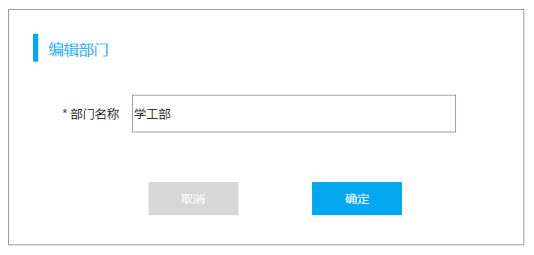
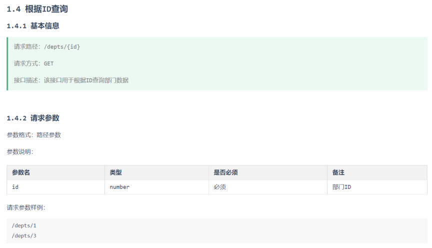
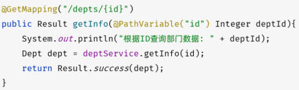
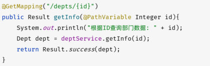
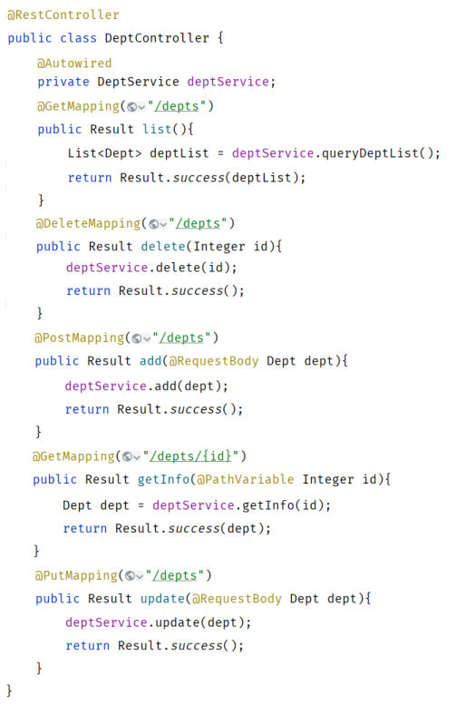
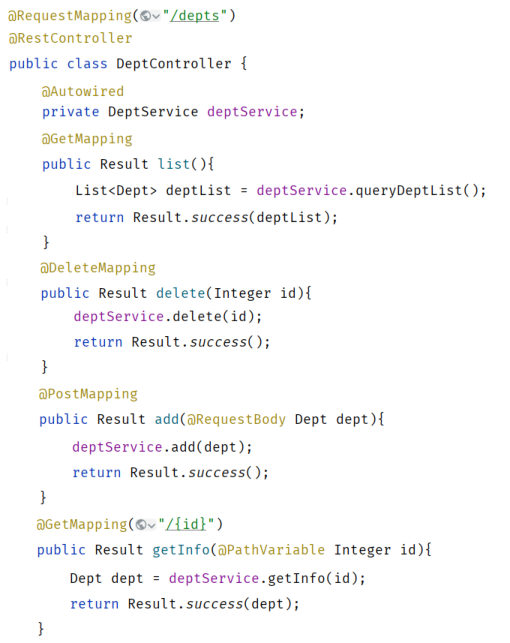

[61 篇](/posts/编程学习/javaweb学习笔记/61-部门管理-新增部门/)把"往 `dept` 表插一条"做完了，这一篇（PPT 第 54-68 页）收尾部门管理的最后一个功能：**修改**。它和前面三个功能不太一样——点一下"编辑"，前端要连着调**两个**接口：先把这条部门查回来（**查询回显**），用户改完再提交（**修改数据**）。

本篇的接口代码以课程工程 `tlias-web-management` 为准，请求与响应是**本机实测**（MySQL 9.0.1 的 `tlias` 库、`dept` 表，初始 6 条数据；实测时先新增出一条 id 为 7 的"测试部"，用它验证回显与修改）。

## 需求：改一个部门，为什么是两个接口（PPT 第 54-58 页）

PPT 第 54 页是本章的目录页（最后一格"**修改部门**"就是本篇），第 55 页是小节封面，第 56 页直接给出需求：

> 需求：**查询回显**、**修改数据**

这两件事对应列表页上那一个"编辑"按钮的完整交互：


*图：PPT 第 56 页配的"编辑部门"弹窗原型——标题是"编辑部门"，下面一个 `* 部门名称` 输入框（原型里已经预填好了"学工部"），底部是"取消 / 确定"两个按钮*

1. 用户在部门列表里点某一行的"**编辑**"；
2. 页面弹出"编辑部门"窗口，窗口里的"部门名称"要先**显示出这个部门当前的名字**——这一步就是**查询回显**（前端拿着这一行的 id 去后端要一次最新数据）；
3. 用户改完名字点"**确定**"——这一步就是**修改数据**（前端把 id + 新名字提交回后端）。

第 57 页是小节的子目录页（把"修改部门"再切成"查询回显 / 修改数据"两块），第 58 页进入第一块的需求分析。

接口文档（[57 篇](/posts/编程学习/javaweb学习笔记/57-tlias项目准备与开发规范/)里介绍过的 Apifox 文档）把这两个接口写得很清楚：


*图：PPT 第 58 页配的接口文档片段——"1.4 根据ID查询"：请求路径 `/depts/{id}`、请求方式 GET，参数格式是**路径参数**，参数 `id`（number）必须传递，示例 `/depts/1`、`/depts/3`*

| 接口 | 请求方式 + 路径 | 参数怎么传 | 返回什么 |
| --- | --- | --- | --- |
| 查询回显 | `GET /depts/{id}` | **路径参数**：id 直接拼在 URL 路径里 | `Result` 的 `data` 里装**一个** Dept 对象 |
| 修改数据 | `PUT /depts` | **JSON 请求体**：`{"id":1,"name":"教研部"}` | `Result`（`data` 为 null） |

> [!NOTE]
> 为什么"回显"要单独跑一趟服务器？因为列表页上那一行数据可能是几分钟前（甚至更早）查出来的，用户点"编辑"的这一刻，页面上的名字**未必是数据库里的当前值**。弹窗要显示"此刻真实的这条数据"，就得拿 id 再查一次——接口文档里专门给它留了一个"根据ID查询"接口，原因就在这里。

## 接口一：查询回显（PPT 第 59-62 页）

### 思路分析：三层各干什么（PPT 第 59 页）

照旧先画三层职责（PPT 第 59 页那张图的文字版）：

| 层 | 职责 | 这一次的具体做法 |
| --- | --- | --- |
| Controller | 接收请求（`/depts/1`，参数在**路径**里）、调用 Service、响应结果 | 用 `@GetMapping("/{id}")` 接住路径参数，把 id 交给 Service，把查到的 Dept 用 `Result.success(dept)` 包起来返回 |
| Service | 调用 Mapper 接口方法 | 直接转发 `deptMapper.getById(id)` |
| Mapper | 写 SQL 查数据 | `select * from dept where id = ?` |

（PPT 上 Mapper 的 SQL 写成 `select * from dept where id = ?`；课程工程里把列名一个个写了出来，见下面"三层代码"。）

### Controller 怎么接住"路径参数"（PPT 第 60 页）

前面几个接口，参数要么在**问号后面**（`/depts?id=8`，[60 篇](/posts/编程学习/javaweb学习笔记/60-部门管理-删除部门/)讲的简单参数），要么在**请求体**里（JSON，[61 篇](/posts/编程学习/javaweb学习笔记/61-部门管理-新增部门/)讲的 JSON 参数）。这一个接口的参数直接**长在 URL 路径里**：

> **路径参数**：通过请求 URL 直接传递参数，使用 `{…}` 来标识该路径参数，需要使用 `@PathVariable` 获取路径参数。

要接收的地址是 `GET /depts/1`，写法有两种，效果完全一样：

```java
// 写法一：@PathVariable 里写明"取的是哪个占位符"
@GetMapping("/depts/{id}")
public Result getInfo(@PathVariable("id") Integer deptId){
    System.out.println("根据ID查询部门数据: " + deptId);
    Dept dept = deptService.getInfo(deptId);
    return Result.success(dept);
}

// 写法二：占位符名与形参名都叫 id，省略 @PathVariable 的 value
@GetMapping("/depts/{id}")
public Result getInfo(@PathVariable Integer id){
    System.out.println("根据ID查询部门数据: " + id);
    Dept dept = deptService.getInfo(id);
    return Result.success(dept);
}
```

对应关系拆开看：URL 里的 **`{id}` 是占位符名**，**`@PathVariable` 是"取出路径参数"的注解**，它的 value（`"id"`）要**和占位符名对上**；如果方法形参也正好叫 `id`，value 就能省略（写法二，也是课程最终代码的写法）。

> [!WARNING]
> 省略 value 的前提是**形参名和占位符名一模一样**。要是写成 `getInfo(@PathVariable Integer deptId)`，Spring 会找不到要装配的路径参数（运行时报错/取不到值），这时必须补上 `@PathVariable("id")`，或者把形参改名成 `id`。

### 三层代码（PPT 第 61 页）

课程工程 `tlias-web-management` 里这一套的最终写法（四段代码分属四个文件）：

```java
// ===== Controller：com.itheima.controller.DeptController =====
@GetMapping("/{id}")
public Result getInfo(@PathVariable Integer id){
    System.out.println("根据ID查询部门 : " + id);
    Dept dept = deptService.getById(id);
    return Result.success(dept);
}
```

```java
// ===== Service：com.itheima.service.DeptService =====
/**
 * 根据ID查询部门
 */
Dept getById(Integer id);
```

```java
// ===== ServiceImpl：com.itheima.service.impl.DeptServiceImpl =====
@Override
public Dept getById(Integer id) {
    return deptMapper.getById(id);
}
```

```java
// ===== Mapper：com.itheima.mapper.DeptMapper =====
/**
 * 根据ID查询部门数据
 */
@Select("select id, name, create_time, update_time from dept where id = #{id}")
Dept getById(Integer id);
```

两处要说明的地方：

- **方法名**：PPT 第 61 页里 Controller 调的是 `deptService.getInfo(id)`、Mapper 叫 `getById`；课程最终代码把 Service 层也统一叫 `getById` 了。名字不影响功能，看准"哪一层调哪一层的哪个方法"就行。
- **方法上的路径**：课程代码在类上写了 `@RequestMapping("/depts")`，所以方法上只写 `/{id}`；PPT 第 61 页是在方法上写全路径 `@GetMapping("/depts/{id}")`。两种写法的最终地址**完全一样**，规则见下面「路径拼接」一节。
- 课程最终代码里那句 `System.out.println` 已经换成了 `log.info("根据ID查询部门: {}", id)`（类上是 Lombok 的 `@Slf4j`）——那是[下一篇 63 篇](/posts/编程学习/javaweb学习笔记/63-日志技术/)的主题，本篇先按 PPT 的写法讲清接口本身。

### 本机实测：查询回显

应用启动在 8080（启动日志 `Tomcat started on port 8080 (http)`），`dept` 表此时有 6 条课程自带数据 + 1 条刚才新增的"测试部"（id 为 7）：

> [!TIP]
> **本机实测**——`GET /depts/7` 的响应：
>
> ```text
> {"code":1,"msg":"success","data":{"id":7,"name":"测试部","createTime":"2026-09-29T19:11:59","updateTime":"2026-09-29T19:11:59"}}
> ```
>
> ① `data` 里装的是**一个 Dept 对象**（不是数组——查询列表那个接口装的才是数组，注意区别）；② 两个时间就是 [61 篇](/posts/编程学习/javaweb学习笔记/61-部门管理-新增部门/)新增时 Service 用 `LocalDateTime.now()` 补进去的那一刻；③ `msg` 是 `"success"`，这是课程 `Result.success()` 里的固定值。

### 问答页（PPT 第 62 页）

PPT 第 62 页问了两个问题：

| PPT 的问题 | 答案 |
| --- | --- |
| 如何接收路径参数？ | 用 **`@PathVariable`** 注解来声明"取的是路径参数"（配合 URL 里的 `{占位符}` 使用） |
| URL 里能不能携带**多个**路径参数，如 `/depts/1/0`？ | **可以**，接收方式就是"有几个占位符，就写几个 `@PathVariable`" |

多路径参数的写法（PPT 说"可以，接收方式如下"，把单个的写法复制几份即可）：

```java
@GetMapping("/depts/{id}/{page}")   // 访问 /depts/1/0
public Result getInfo(@PathVariable Integer id, @PathVariable Integer page){
    System.out.println("id: " + id + " , page: " + page);
    return Result.success();
}
```

PPT 第 62 页还把两种写法并排贴了出来，正好拿来对照：


*图：写法一——`@GetMapping("/depts/{id}")` 配 `@PathVariable("id") Integer deptId`：注解 value 与占位符名严格对应，形参可以另起名字（`deptId`）*


*图：写法二——形参直接叫 `id`，`@PathVariable` 的 value 省略不写；两段代码最后拿到的都是同一个 id，写法二更简洁*

## 接口二：修改数据（PPT 第 63-66 页）

PPT 第 63 页是子目录页（再点一次"查询回显 / 修改数据"），第 64 页给出这一块的需求，第 65 页做思路分析，第 66 页给代码。

### 思路分析（PPT 第 65 页）

> 参照接口文档梳理三层架构每一层的职责。

| 层 | 职责 | 这一次的具体做法 |
| --- | --- | --- |
| Controller | 接收请求参数（**JSON 格式**）、调用 Service、响应结果 | 请求体是 `{"id":1,"name":"教研部"}`，用一个实体对象接住它 |
| Service | **补全基础属性**、调用 Mapper 接口方法 | 补上 `updateTime`（**注意：不补 `createTime`**） |
| Mapper | 写 SQL 改数据 | `update dept set name = ? , update_time = ? where id = ?` |

"补全基础属性"这件事上一节（新增）也做过，但**补的东西不一样**，这是个容易记混的点：

| 操作 | Service 要补什么 | 为什么 |
| --- | --- | --- |
| 新增部门 | `createTime` + `updateTime`（都补） | 这条记录刚诞生，两个时间都是"现在" |
| 修改部门 | **只补 `updateTime`** | `createTime` 是"这条记录什么时候建的"，改一次名字不该动它；`update_time` 才是"最后操作时间"，列表页显示的就是它 |

> [!IMPORTANT]
> 列表页的"最后操作时间"那一列，查的就是 `update_time`（[58 篇](/posts/编程学习/javaweb学习笔记/58-部门管理-查询部门/)的 `select ... order by update_time desc`）。所以**改完必须刷新 `update_time`**，否则列表的排序和显示都会不对。

### 三层代码（PPT 第 66 页）

```java
// ===== Controller：com.itheima.controller.DeptController =====
@PutMapping
public Result update(@RequestBody Dept dept){
    System.out.println("修改部门: " + dept);
    deptService.update(dept);
    return Result.success();
}
```

```java
// ===== Service：com.itheima.service.DeptService =====
/**
 * 修改部门
 */
void update(Dept dept);
```

```java
// ===== ServiceImpl：com.itheima.service.impl.DeptServiceImpl =====
@Override
public void update(Dept dept) {
    // 1. 补全基础属性 - updateTime
    dept.setUpdateTime(LocalDateTime.now());

    // 2. 调用Mapper接口方法更新部门
    deptMapper.update(dept);
}
```

```java
// ===== Mapper：com.itheima.mapper.DeptMapper =====
/**
 * 更新部门
 */
@Update("update dept set name = #{name} , update_time = #{updateTime} where id = #{id}")
void update(Dept dept);
```

三个要点：

- **`@PutMapping`**：REST 风格里"修改"用 PUT（[57 篇](/posts/编程学习/javaweb学习笔记/57-tlias项目准备与开发规范/)的四种请求方式表：GET 查、POST 增、PUT 改、DELETE 删）。
- **`@RequestBody`**：请求体是 JSON，用一个**实体对象**接住（和 [61 篇](/posts/编程学习/javaweb学习笔记/61-部门管理-新增部门/)新增接口一模一样）；要求 JSON 的键名与对象的属性名一致——这里的 JSON 是 `{"id":1,"name":"教研部"}`，`id`/`name` 正好对上 `Dept` 的两个属性，于是 `dept.getId()`、`dept.getName()` 就有值了。
- **SQL 只改两列**：`set name = #{name}, update_time = #{updateTime}`，`where id = #{id}` 用对象里的 id 定位。`id` 来自请求体（前端知道用户点的是哪一行），`updateTime` 来自 Service。

### 本机实测：修改数据

> [!TIP]
> **本机实测**——`PUT /depts`，请求体 `{"id":7,"name":"改名部"}`：
>
> ```text
> {"code":1,"msg":"success","data":null}
> ```
>
> 再把这条查一次（`GET /depts/7`），`name` 已经变成"改名部"。返回的 `data` 是 `null`——修改接口用 `Result.success()` 不带数据，前端只要知道"成功了"就行。
>
> （按代码逻辑，这次改完 `update_time` 被 Service 刷成了当时的时间，`create_time` 一动不动——因为 Service 从头到尾只 `setUpdateTime`。）

## 路径拼接：`@RequestMapping` 该写在哪一层（PPT 第 67-68 页）

写到这里，`DeptController` 里每个方法的路径注解都带着一遍 `/depts`：


*图：PPT 第 67 页配的第一版 DeptController——五个方法各自把 `/depts` 写全：`@GetMapping("/depts")`、`@DeleteMapping("/depts")`、`@PostMapping("/depts")`、`@GetMapping("/depts/{id}")`、`@PutMapping("/depts")`*

PPT 第 67 页随即给出优化：这五个 `/depts` 是**公共前缀**，可以提到类上写一次——


*图：PPT 第 67 页配的第二版——类上写 `@RequestMapping("/depts")`，方法上就只剩**剩下的部分**了：`@GetMapping`、`@DeleteMapping`、`@PostMapping`、`@GetMapping("/{id}")`（这张截图里 `update` 方法没截全，它的写法是 `@PutMapping`）*

规则一句话：

> 一个完整的请求路径，应该是**类上的 `@RequestMapping` 的 value 属性 + 方法上的 `@RequestMapping` 的 value 属性**。

两个注解拼出来的地址，对照表如下（这就是课程工程 `DeptController` 的实际结构）：

| 类上 | 方法上 | 拼出来的完整路径 |
| --- | --- | --- |
| `@RequestMapping("/depts")` | `@GetMapping` | `GET /depts`（查询列表） |
| `@RequestMapping("/depts")` | `@DeleteMapping` | `DELETE /depts`（删除） |
| `@RequestMapping("/depts")` | `@PostMapping` | `POST /depts`（新增） |
| `@RequestMapping("/depts")` | `@GetMapping("/{id}")` | `GET /depts/{id}`（查询回显） |
| `@RequestMapping("/depts")` | `@PutMapping` | `PUT /depts`（修改） |

> [!TIP]
> 顺带把 `@GetMapping` 这一族的来历说清：它们都是 `@RequestMapping` 的"派生注解"，等价于在 `@RequestMapping` 上指定请求方式。课程代码里留着这么一行注释可以对照：
>
> ```java
> //@RequestMapping(value = "/depts", method = RequestMethod.GET) //method: 指定请求方式
> @GetMapping
> public Result list(){ ... }
> ```
>
> `@GetMapping("/depts")` 就是上面那行的简写；同理还有 `@PostMapping`（POST）、`@PutMapping`（PUT）、`@DeleteMapping`（DELETE）。

> [!WARNING]
> 类上已经写了 `/depts`，方法上就**不要**再写一遍 `/depts`。Spring 对规则的斜杠会做容错，但路径片段是**直接拼**的：类上 `/depts` + 方法上 `/depts/{id}` 拼出来是 `/depts/depts/{id}`，接口就访问不到了。写完随手用"类上 + 方法上"在心里拼一遍，是排查"404 找不到路径"最快的办法。

## 必答问答（PPT 第 68 页）

| PPT 的问题 | 答案 |
| --- | --- |
| `@RequestMapping` 注解可以加在哪儿？ | **类上（可选的）**和**方法上** |
| 一个完整的请求路径怎么算？ | **类上的 + 方法上的**；类上写了公共前缀，方法上就只写剩下的部分 |

## 小结

| 问题 | 答案 |
| --- | --- |
| 修改部门为什么是两个接口？ | "编辑"的交互分两步——弹窗要先**查询回显**（按 id 查最新数据），用户改完再**修改数据**（提交 id + 新名字） |
| 路径参数怎么传、怎么接？ | 参数直接拼在 URL 路径里，用 `{id}` 占位；用 `@PathVariable` 取出，**占位符名与形参名一致时可省略 value** |
| 能带多个路径参数吗？ | **可以**，`/depts/{id}/{page}` 这种，有几个占位符就写几个 `@PathVariable` |
| 回显接口长什么样？ | `GET /depts/{id}` → `Result` 里装**一个** Dept 对象（实测 `{"code":1,"msg":"success","data":{"id":7,...}}`） |
| 修改接口参数怎么接？ | `PUT /depts`，请求体 JSON `{"id":1,"name":"教研部"}`，**实体对象 + `@RequestBody`**，键名与属性名一致 |
| Service 层要补什么？ | **只补 `updateTime`**（`LocalDateTime.now()`）；`createTime` 是"创建时间"，修改时不碰 |
| 修改的 SQL？ | `update dept set name = #{name}, update_time = #{updateTime} where id = #{id}` |
| 路径拼接规则？ | 完整路径 = **类上的 `@RequestMapping` + 方法上的**；类上可选；类上写了前缀，方法上别再重复写 |
| 本机实测结果？ | `GET /depts/7` 拿到一个 Dept 对象；`PUT /depts` 传 `{"id":7,"name":"改名部"}` 返回 success，再查 name 已变 |
| 课程最终代码与 PPT 的差别？ | PPT 里用 `System.out.println` 打印、方法上写全路径；课程工程里改成了 `log.info("...{}", ...)`（`@Slf4j`，见 63 篇）+ 类上 `@RequestMapping("/depts")` |

## 相关

- [上一篇：部门管理-新增部门](/posts/编程学习/javaweb学习笔记/61-部门管理-新增部门/)
- [下一篇：日志技术](/posts/编程学习/javaweb学习笔记/63-日志技术/)

## 练习题

### 一、知识回顾（读完直接做下面的实践题）

1. **修改部门要做两个接口**：① **查询回显**——按 id 把这条部门查出来填进"编辑部门"弹窗；② **修改数据**——用户改完点"确定"，把 id + 新名字提交回去。回显的意义是"显示此刻数据库里的真实值"，而不是列表页上那份可能已经过期的数据
2. **回显接口的地址与方式**：`GET /depts/{id}`，接口文档里标明的参数格式是**路径参数**，`id` 必须传递（示例 `/depts/1`）
3. **路径参数是什么**：参数直接拼在 URL 路径里（不是 `?id=1` 那种问号参数），用 `{...}` 在路径中占位
4. **取路径参数用 `@PathVariable`**：它的 value 要**和占位符名对上**（`@PathVariable("id")`）；如果方法形参名与占位符名相同，value 可以**省略**（`@PathVariable Integer id`），课程最终代码用的是省略写法
5. **多个路径参数也可以**：`/depts/{id}/{page}` 这样的地址能带多个路径参数，写法就是"有几个占位符就写几个 `@PathVariable`"
6. **回显的响应结构**：`Result` 的 `data` 里装的是**一个 Dept 对象**（不是数组）；本机实测 `GET /depts/7` 得到 `{"code":1,"msg":"success","data":{"id":7,"name":"测试部","createTime":"2026-09-29T19:11:59","updateTime":"2026-09-29T19:11:59"}}`
7. **修改接口的地址与参数**：`PUT /depts`，参数在**请求体**里、是 JSON 格式（`{"id":1,"name":"教研部"}`），用一个**实体对象**接收并要求 JSON 键名与属性名一致，**必须加 `@RequestBody`**
8. **Service 层补什么**：修改只补 **`updateTime`**（`dept.setUpdateTime(LocalDateTime.now())`）；`createTime` 不补也不改——新增时才两个时间都补
9. **修改的 SQL**：`update dept set name = #{name}, update_time = #{updateTime} where id = #{id}`，只改 `name` 和 `update_time` 两列，用对象里的 id 定位
10. **`@RequestMapping` 的拼接规则**：注解可以加在**类上（可选）**和**方法上**，一个完整路径 = **类上的 value + 方法上的 value**；实测 `PUT /depts` 返回 `{"code":1,"msg":"success","data":null}`，再查 id 为 7 的那条，`name` 已经变成"改名部"

### 二、裸写题

- [ ] **2-1 开发"按 ID 查一个部门"的回显接口**
  需求：前端点"编辑"时要按 id 把这条部门的最新数据查回来，所以后端要提供一个接口——访问 `/depts/1` 就能拿到 id 为 1 的那个部门（用 `Result` 包起来，`data` 里是一个部门对象，不是数组）。请把 **Controller / Service / Mapper 三层**都写出来（Mapper 里写 SQL）。
  （练习文件 `test_62_修改部门接口.java` 的题目2-1 里给了写作区。）

  > [!TIP]- 提示（先自己想，实在想不出再点开）
  > **一级 · 思路**：这个接口的参数不是问号后面那种，而是**长在 URL 路径里**——先把路径里 id 的位置留成占位符，再想办法把那个位置的值取进方法形参
  > **二级 · 方法**：`@GetMapping("/{id}")`（或写全 `@GetMapping("/depts/{id}")`）+ 形参前面加 `@PathVariable`；Service 转发、Mapper 用 `@Select` 写 `select ... from dept where id = #{id}`
  > **三级 · 骨架**：`@GetMapping("____") public Result getInfo(@____("id") Integer id){ Dept dept = deptService.____(id); return Result.____(dept); }` → Service `Dept ____(Integer id);` → ServiceImpl `return deptMapper.____(id);` → Mapper `@Select("select id, name, create_time, update_time from dept where id = ____") Dept ____(Integer id);`

  > [!TIP]- 参考答案（做完再点开）
  > ```java
  > // ===== DeptController =====
  > @GetMapping("/{id}")                       // 类上已有 @RequestMapping("/depts")，所以这里是 /depts/{id}
  > public Result getInfo(@PathVariable Integer id){
  >     System.out.println("根据ID查询部门 : " + id);
  >     Dept dept = deptService.getById(id);
  >     return Result.success(dept);
  > }
  >
  > // ===== DeptService =====
  > Dept getById(Integer id);
  >
  > // ===== DeptServiceImpl =====
  > @Override
  > public Dept getById(Integer id) {
  >     return deptMapper.getById(id);
  > }
  >
  > // ===== DeptMapper =====
  > @Select("select id, name, create_time, update_time from dept where id = #{id}")
  > Dept getById(Integer id);
  > ```
  > 检查点：① URL 里的 `{id}` 是占位符名，`@PathVariable` 的 value 与它一致（形参也叫 `id` 时 value 可省）；② 返回的是**单个** Dept，所以 MySQL 层方法返回值写 `Dept` 而不是 `List<Dept>`；③ 本机实测访问 `GET /depts/7` 得到 `{"code":1,"msg":"success","data":{"id":7,"name":"测试部",...}}`。

- [ ] **2-2 写"修改部门"的 Service 与 Mapper**
  需求：修改接口的 Controller 已经写好（收下一个 JSON 请求体，里面是 `{"id":1,"name":"教研部"}` 这样的数据），现在要把 **Service 层和 Mapper 层**补齐。要求：数据库里这条记录的"最后操作时间"要变成**这次修改的时间**，而"创建时间"**保持原样不能动**；SQL 只更新需要变的列。
  （练习文件 `test_62_修改部门接口.java` 的题目2-2 里给了写作区。）

  > [!TIP]- 提示（先自己想，实在想不出再点开）
  > **一级 · 思路**：请求体只带回了 `id` 和 `name`，`update_time` 得由服务端在**业务层**现场补上；`create_time` 这一次完全不用管
  > **二级 · 方法**：ServiceImpl 里 `dept.setUpdateTime(LocalDateTime.now())`，然后调 Mapper；Mapper 用 `@Update("update dept set ____, ____ where id = ____")`，`#{}` 里写的是**实体类的属性名**
  > **三级 · 骨架**：`@Override public void update(Dept dept) { dept.set____(LocalDateTime.now()); deptMapper.update(dept); }` + `@Update("update dept set name = ____, update_time = ____ where id = ____") void update(Dept dept);`

  > [!TIP]- 参考答案（做完再点开）
  > ```java
  > // ===== DeptServiceImpl =====
  > @Override
  > public void update(Dept dept) {
  >     // 1. 补全基础属性 - updateTime
  >     dept.setUpdateTime(LocalDateTime.now());
  >
  >     // 2. 调用Mapper接口方法更新部门
  >     deptMapper.update(dept);
  > }
  >
  > // ===== DeptMapper =====
  > @Update("update dept set name = #{name} , update_time = #{updateTime} where id = #{id}")
  > void update(Dept dept);
  > ```
  > 说明：① **只补 `updateTime`**——`createTime` 表示"这条记录什么时候建的"，改名字不该动它，所以 SQL 的 `set` 里也没有它；② SQL 里三个 `#{}` 分别对应 `Dept` 的 `name`、`updateTime`、`id` 三个属性（`id` 从请求体来，用来定位那一行）；③ 本机实测：`PUT /depts` 传 `{"id":7,"name":"改名部"}` 返回 success，再查该条记录 name 已变。

- [ ] **2-3 把重复写的路径前缀提到类上，并回答拼接问题**
  需求：现在 Controller 里五个方法的路径注解都各自带着一遍 `/depts`（查询列表写 `/depts`、根据 ID 查询写 `/depts/{id}`、删除/新增/修改也在各自注解里写着 `/depts`），重复得厉害。请改成"**公共前缀在类上写一次**"的写法，并回答两个问题：① 改完之后每个方法最终暴露的地址分别是什么？② 如果改完之后方法上**又**写了一遍 `/depts`，拼出来的地址会变成什么样？
  （练习文件 `test_62_修改部门接口.java` 的题目2-3 里给了写作区。）

  > [!TIP]- 提示（先自己想，实在想不出再点开）
  > **一级 · 思路**：把五个方法里共同的 `/depts` 抽出来，放到类上写一次；方法上只留"这条接口独有的那部分"
  > **二级 · 方法**：类上写 `@RequestMapping("/depts")`；方法上没有独有路径的，注解后面**什么都不写**（如 `@GetMapping`、`@DeleteMapping`、`@PostMapping`、`@PutMapping`），有独有路径的只写那一段（`@GetMapping("/{id}")`）
  > **三级 · 骨架**：`@RequestMapping("____")` + `@RestController` + `public class DeptController { ... @GetMapping ____ public Result list(){...} ... @GetMapping("____") public Result getInfo(...) }`

  > [!TIP]- 参考答案（做完再点开）
  > ```java
  > @RequestMapping("/depts")
  > @RestController
  > public class DeptController {
  >
  >     @Autowired
  >     private DeptService deptService;
  >
  >     @GetMapping
  >     public Result list(){ ... }                 // GET  /depts
  >
  >     @DeleteMapping
  >     public Result delete(Integer id){ ... }      // DELETE /depts?id=8
  >
  >     @PostMapping
  >     public Result add(@RequestBody Dept dept){ ... }   // POST /depts
  >
  >     @GetMapping("/{id}")
  >     public Result getInfo(@PathVariable Integer id){ ... }  // GET /depts/{id}
  >
  >     @PutMapping
  >     public Result update(@RequestBody Dept dept){ ... }     // PUT /depts
  > }
  > ```
  > 回答：① 拼出来的地址依次是 `GET /depts`、`DELETE /depts`、`POST /depts`、`GET /depts/{id}`、`PUT /depts`——和改之前**完全一样**；② 如果方法上又写一遍 `/depts`，规则是"类上的 + 方法上的"直接拼，会得到 `/depts/depts`（`getInfo` 那条会变成 `/depts/depts/{id}`），接口就访问不到了——所以**类上写了公共前缀，方法上就不要再重复**。这正是 PPT 第 67-68 页那两句规则。

### 三、综合题

- [ ] **3-1 完成修改部门的两个接口（回显 + 保存），并跑通验证**
  这一题就是把本节的两个接口从头到尾做一遍，做完你就拥有一个**能用的"编辑部门"后端**。
  1. **回显接口**：在 `DeptController` 里加"根据 ID 查询部门"的方法——接住路径传进来的 id，交给 Service、Service 调 Mapper 查这一条数据，最后用 `Result.success(dept)` 返回一个部门对象；SQL 按主键查一条（列名照 `dept` 表写全）；
  2. **修改接口**：再加"修改部门"的方法——用一个 Dept 实体对象接住 JSON 请求体（`{"id":1,"name":"教研部"}`），Service 层**只补 `updateTime`**，Mapper 写"只改 name 和 update_time、按 id 定位"的 SQL；
  3. **路径整理**：按 PPT 第 67-68 页的规则，把 `/depts` 这个公共前缀提到类上，方法上只写剩下的部分；
  4. **启动应用**（入口类 `TliasWebManagementApplication`），先调 **回显** 接口：`GET /depts/1`，把响应的 JSON 抄到练习文件末尾，并回答"`data` 里装的是一个对象还是一个数组"；
  5. 再调 **修改** 接口：`PUT /depts`，请求体 `{"id":1,"name":"教研部（改）"}`，抄下响应；然后**再调一次回显接口**，确认名字真的变了、`update_time` 被刷新了；
  6. 回答 PPT 第 62、68 页的三个问题：路径参数怎么接收？URL 里能不能带多个路径参数？"路径"这个注解可以加在哪儿、一个完整路径怎么算？
  7. **收尾**：把刚才改掉的部门名字改回原样（再调一次修改接口），或者重新导入课程 `资料/05. 数据库表/dept.sql` 把表恢复成 6 条。
  （练习文件 `test_62_修改部门接口.java` 的"综合题"一段里按这 7 步给了写作区。）

  **涉及知识点**

  | 知识点 | 在这里的应用 |
  | --- | --- |
  | 路径参数 + `@PathVariable` | 第 1、4 步——回显接口按 id 查一条 |
  | JSON 参数 + `@RequestBody` | 第 2、5 步——修改接口用实体对象接请求体 |
  | Service 补全 `updateTime` | 第 2、5 步——改完"最后操作时间"要刷新，`createTime` 不动 |
  | `@RequestMapping` 拼接 | 第 3 步——公共前缀提到类上 |
  | 两个接口的响应结构 | 第 4、5 步——回显返回一个对象、修改返回 `data:null` |

  > [!TIP]- 提示（先自己想，实在想不出再点开）
  > **一级 · 思路**：回显 = "按 id 查一条"（参数在路径里），保存 = "按 id 改一条"（参数在请求体里）；两条链路都是 Controller → Service → Mapper 三跳
  > **二级 · 方法**：回显用 `@GetMapping("/{id}")` + `@PathVariable` + `@Select`；保存用 `@PutMapping` + `@RequestBody` + `@Update`；路径前缀用类上的 `@RequestMapping("/depts")`
  > **三级 · 骨架**：类上 `@RequestMapping("____")`；回显 `@GetMapping("____") public Result getInfo(@____ Integer id){ return Result.success(deptService.____(id)); }`；保存 `@PutMapping public Result update(@____ Dept dept){ deptService.____(dept); return Result.success(); }`；ServiceImpl 的 update 里先 `dept.set____(LocalDateTime.now())` 再调 Mapper

  > [!TIP]- 参考答案（做完再点开）
  > **3-1**
  > 1~3. 与课程工程 `tlias-web-management` 一致的四段代码：
  >    ```java
  >    // ===== DeptController =====
  >    @Slf4j                    // 日志那块是 63 篇的内容，这里可以先只写 @RequestMapping + @RestController
  >    @RequestMapping("/depts")
  >    @RestController
  >    public class DeptController {
  >        @Autowired
  >        private DeptService deptService;
  >
  >        @GetMapping("/{id}")
  >        public Result getInfo(@PathVariable Integer id){
  >            System.out.println("根据ID查询部门 : " + id);
  >            Dept dept = deptService.getById(id);
  >            return Result.success(dept);
  >        }
  >
  >        @PutMapping
  >        public Result update(@RequestBody Dept dept){
  >            System.out.println("修改部门: " + dept);
  >            deptService.update(dept);
  >            return Result.success();
  >        }
  >    }
  >
  >    // ===== DeptServiceImpl =====
  >    @Override
  >    public Dept getById(Integer id) {
  >        return deptMapper.getById(id);
  >    }
  >
  >    @Override
  >    public void update(Dept dept) {
  >        dept.setUpdateTime(LocalDateTime.now());   // 只补 updateTime
  >        deptMapper.update(dept);
  >    }
  >
  >    // ===== DeptMapper =====
  >    @Select("select id, name, create_time, update_time from dept where id = #{id}")
  >    Dept getById(Integer id);
  >
  >    @Update("update dept set name = #{name} , update_time = #{updateTime} where id = #{id}")
  >    void update(Dept dept);
  >    ```
  > 4~5. **本机实测**（应用启动在 8080）：
  >    ```text
  >    # 回显：GET /depts/7
  >    {"code":1,"msg":"success","data":{"id":7,"name":"测试部","createTime":"2026-09-29T19:11:59","updateTime":"2026-09-29T19:11:59"}}
  >
  >    # 修改：PUT /depts  body: {"id":7,"name":"改名部"}
  >    {"code":1,"msg":"success","data":null}
  >
  >    # 再查 GET /depts/7 → name 已变成"改名部"
  >    ```
  >    `data` 里装的是**一个对象**（`{...}`），不是数组（`[...]`）——数组那种是"查询列表"接口（`GET /depts`）的返回。修改接口返回的 `data` 是 `null`，因为 `Result.success()` 没带数据。
  > 6. PPT 第 62、68 页问答：① 路径参数用 `@PathVariable` 接收（URL 里用 `{...}` 占位、注解 value 与占位符名对应，形参名一致时可省略）；② **可以**带多个路径参数，如 `/depts/{id}/{page}`，有几个占位符就写几个 `@PathVariable`；③ `@RequestMapping` 可加在**类上（可选）**和**方法上**，完整路径 = 类上的 + 方法上的。
  > 7. 收尾照做：改回原名或重新导入 `dept.sql`，别把课程数据留在"改名部"上。
