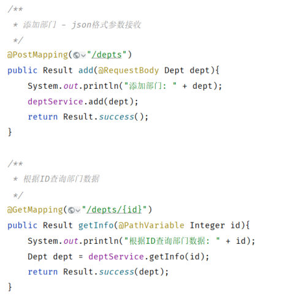
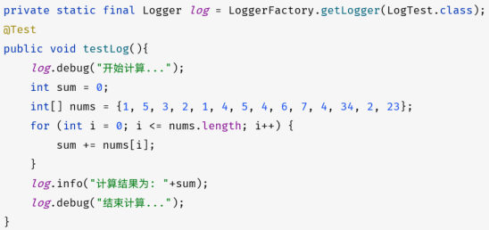

[57 篇](/posts/编程学习/javaweb学习笔记/57-tlias项目准备与开发规范/)到 [62 篇](/posts/编程学习/javaweb学习笔记/62-部门管理-修改部门/)把部门管理的四个功能（查询、删除、新增、修改）都做完了，可你会发现接口里到处是 `System.out.println(...)`——想看看请求到底进来了没有，就随手打一句到控制台。这一篇（PPT 第 69-81 页，**本章最后一篇**）就把这种"打印"升级成正经的**日志技术**：为什么要用日志、日志有哪些框架、Logback 怎么配、日志级别怎么控制，最后把 Tlias 案例里的打印全部换成日志（PPT 第 70 页是本章的目录页，最后一格"**日志技术**"就是本篇）。

## 为什么用日志（PPT 第 69-71 页）

PPT 第 69 页先把现在的做法摆出来：


*图：PPT 第 69 页配的代码——"新增部门"与"根据 ID 查询部门"两个方法都用 `System.out.println` 把信息打到控制台*

紧接着给出两句评语：**只能输出到控制台**、**不便于扩展、维护**。这两句话展开就是"为什么要有日志框架"：

| 现状（`System.out.println`） | 问题 |
| --- | --- |
| 输出只能去控制台 | 项目部署到服务器上跑起来之后，谁盯着控制台看？控制台一关、应用一重启，之前打印的东西就没了，想翻"昨天到底报了什么错"翻不到 |
| 想同时写进文件 | 得自己写一套文件 IO（`FileWriter`、什么时候换文件、留几天），等于自己造一个日志框架 |
| 想统一格式（时间、线程、类名） | 每一行打印都得自己拼字符串，改格式就要改遍所有代码 |
| 想按重要性过滤（只留错误） | 做不到——`println` 没有"级别"这个概念 |
| 想临时关掉这些输出 | 只能把代码注释掉、重新打包上线 |

所以程序里需要一个专门干这件事的东西——日志。PPT 第 71 页打了个很好懂的比方：

> 日志技术好比生活中的日记，可以记录你生活中的点点滴滴。**程序中的日志，是用来记录应用程序的运行信息、状态信息、错误信息等。**

（PPT 第 71 页还给这个比方配了一张日记本的照片和一张真实系统的界面截图，都只是装饰性的插图、不含配置信息，这里就不放了；记住"**记录下每天发生了什么，事后才好翻**"这个意思就够了。）

PPT 第 71 页同时点了日志的**四个用途**，一个都别漏：

| 用途（PPT 原文） | 这个用途在说"靠日志干什么" |
| --- | --- |
| **数据追踪** | 用户的操作、请求参数、数据流转都留下痕迹，出问题时能顺着日志回溯"这一步到底发生了什么" |
| **性能优化** | 在关键逻辑前后记下时间，从日志里算耗时，找出慢在哪一段 |
| **问题排查** | 异常信息与上下文都写进日志（错误对象也能一起记），线上出问题不用把程序停下来调试 |
| **系统监控** | 日志是"系统的脉搏"——统计错误量、访问量、关键业务量，做报警与看板 |

## 日志框架有哪些（PPT 第 72 页）

PPT 第 72 页一口气给了四个名字，它们不是"四选一"的关系，而是分两类的：

| 框架 | PPT 给的介绍 | 属于哪一类 |
| --- | --- | --- |
| **JUL**（`java.util.logging`） | JavaSE 平台提供的官方日志框架；配置相对简单，但**不够灵活，性能较差** | 日志实现 |
| **Log4j** | 一个流行的日志框架，提供了灵活的配置选项，支持多种输出目标 | 日志实现 |
| **Logback** | **基于 Log4j 升级而来**，提供了更多的功能和配置选项，**性能优于 Log4j** | 日志实现（**SpringBoot 默认用它**） |
| **Slf4j**（Simple Logging Facade for Java） | 简单日志**门面**，提供了一套日志操作的**标准接口及抽象类**，允许应用程序使用不同的底层日志框架 | **门面（接口）** |

"门面"和"实现"的分工，用一个比方就清楚了：

- **门面（Slf4j）**= 饭店的**菜单**：只规定"你能点哪些菜"（`Logger` 接口、`LoggerFactory` 这些标准接口），不负责做菜；
- **实现（Logback / Log4j / JUL）**= 后厨真正做菜的人：把日志写到控制台、写到文件，都由它干。

这样做的好处是**解耦**：业务代码只认菜单（`org.slf4j.Logger`），以后后厨想换人（Log4j 换 Logback）不用改业务代码。所以本课程代码里 import 的是 Slf4j 的接口、跑的却是 Logback：

```java
import org.slf4j.Logger;              // 门面：Slf4j 的标准接口
import org.slf4j.LoggerFactory;       // 门面：用来拿到 Logger 对象
```

> [!NOTE]
> SpringBoot 已经把 **Slf4j + Logback** 整合好了：依赖在起步依赖里传递进来、配置文件认 `logback.xml`。我们要做的只有两件事——**写配置**和**在代码里记日志**。

## Logback 快速入门（PPT 第 73-75 页）

PPT 第 73 页是小节目录（Logback 快速入门 / Logback 配置文件详解 / Logback 日志级别），第 74 页给了入门的两步：

> **准备工作**：引入 logback 的依赖（springboot 项目中该依赖**已传递**）、配置文件 `logback.xml`。
> **记录日志**：定义日志记录对象 Logger，记录日志。

### 第 1 步：依赖与配置文件

PPT 里给的坐标是：

```xml
<dependency>
    <groupId>ch.qos.logback</groupId>
    <artifactId>logback-classic</artifactId>
    <version>1.4.11</version>
</dependency>
```

但课程工程 `tlias-web-management` 的 `pom.xml` 里**根本没有这一段**——因为创建工程时勾了 Web/SpringBoot 起步依赖（`spring-boot-starter-web`），它下面带着 `spring-boot-starter-logging`，Logback 就被"传递"进来了。这就是 PPT 那句"**springboot 项目中该依赖已传递**"的意思：**不用自己加依赖，但要自己写 `logback.xml`**。

（配置文件放在 `src/main/resources/logback.xml`，Logback 认这个名字，具体内容下一节讲。）

### 第 2 步：定义 Logger、记录日志

课程工程里的测试类（`src/test/java/com/itheima/LogTest.java`）：

```java
public class LogTest {

    // 1. 定义日志记录对象（固定写法：LoggerFactory.getLogger(当前类.class)）
    private static final Logger log = LoggerFactory.getLogger(LogTest.class);

    @Test
    public void testLog(){
        log.debug("开始计算...");

        int sum = 0;
        int[] nums = {1, 5, 3, 2, 1, 4, 5, 4, 6, 7, 4, 34, 2, 23};
        for (int num : nums) {
            sum += num;
        }

        log.info("计算结果为: " + sum);
        log.debug("结束计算...");

        log.trace("trace .....");
        log.warn("warn ......");
        log.error("error .....");
    }
}
```


*图：PPT 第 74 页配的 LogTest——先是那行"固定的"Logger 定义（`LoggerFactory.getLogger(LogTest.class)`），随后在计算的前后用 `log.debug` / `log.info` 各记一笔*

那句"固定的"到底固定在哪：

- `private static final`：Logger 对象全局只要一个、线程安全，按规范定义成静态常量；
- `LoggerFactory.getLogger(...)`：参数通常传**当前类的 Class 对象**，日志里的"记录器名称"就会是**这个类的全限定名**（后面实测日志里的 `com.itheima.controller.DeptController` 就是这么来的，一看就知道是哪条记录打出来的）；
- 记录日志：调 `log` 上的方法，**方法名就是日志级别**（`trace` / `debug` / `info` / `warn` / `error`）。

> [!WARNING]
> PPT 第 74 页那段代码里的循环写的是 `for (int i = 0; i <= nums.length; i++)`，`i` 会取到 `nums.length`，最后一次循环**数组越界**（抛 `ArrayIndexOutOfBoundsException`）。课程代码工程里已经改成了增强 for（`for (int num : nums)`），照上面的代码写就好。

### 问答（PPT 第 75 页）

| PPT 的问题 | 答案 |
| --- | --- |
| Logback **记录日志的步骤**？ | ① 引入 logback 的依赖（SpringBoot 里已传递）、准备配置文件 `logback.xml`；② **定义日志记录对象 Logger**（`LoggerFactory.getLogger(当前类.class)`），调用 `debug` / `info` 等方法记录日志 |

## logback.xml 配置详解（PPT 第 76-77 页）

PPT 第 76 页又是那张三格的小节目录页（Logback 快速入门 / **Logback 配置文件详解** / Logback 日志级别）——这一小节讲中间那格。第 77 页把配置文件的作用说清了：

> 配置文件名：`logback.xml`。该配置文件是对 Logback 日志框架输出的日志进行**控制**的，可以配置输出的**格式、位置及日志开关**等。
> 常用的两种输出日志的位置：**控制台**、**系统文件**。

课程工程里的 `logback.xml`（完整内容，逐块都有注释）：

```xml
<?xml version="1.0" encoding="UTF-8"?>
<configuration>
    <!-- 控制台输出 -->
    <appender name="STDOUT" class="ch.qos.logback.core.ConsoleAppender">
        <encoder class="ch.qos.logback.classic.encoder.PatternLayoutEncoder">
            <!--格式化输出：%d 表示日期，%thread 表示线程名，%-5level表示级别从左显示5个字符宽度，%logger显示日志记录器的名称， %msg表示日志消息，%n表示换行符 -->
            <pattern>%d{yyyy-MM-dd HH:mm:ss.SSS} [%thread] %-5level %logger{50} - %msg%n</pattern>
        </encoder>
    </appender>

    <!-- 系统文件输出 -->
    <appender name="FILE" class="ch.qos.logback.core.rolling.RollingFileAppender">
        <rollingPolicy class="ch.qos.logback.core.rolling.SizeAndTimeBasedRollingPolicy">
            <!-- 日志文件输出的文件名, %i表示序号 -->
            <FileNamePattern>D:/tlias-%d{yyyy-MM-dd}-%i.log</FileNamePattern>
            <!-- 最多保留的历史日志文件数量 -->
            <MaxHistory>30</MaxHistory>
            <!-- 最大文件大小，超过这个大小会触发滚动到新文件，默认为 10MB -->
            <maxFileSize>10MB</maxFileSize>
        </rollingPolicy>

        <encoder class="ch.qos.logback.classic.encoder.PatternLayoutEncoder">
            <pattern>%d{yyyy-MM-dd HH:mm:ss.SSS} [%thread] %-5level %logger{50}-%msg%n</pattern>
        </encoder>
    </appender>

    <!-- 日志输出级别 -->
    <root level="INFO">
        <appender-ref ref="STDOUT" />
        <appender-ref ref="FILE" />
    </root>
</configuration>
```

### 两个 appender：日志往哪儿写

`appender` 就是"输出目的地"，课程配置里有两个（PPT 第 77 页明确说"常用的两种输出日志的位置：控制台、系统文件"）：

| appender | 名字 | class | 管什么 |
| --- | --- | --- | --- |
| 控制台输出 | `STDOUT` | `ch.qos.logback.core.ConsoleAppender` | 把日志打到控制台（开发时看的那一份） |
| 系统文件输出 | `FILE` | `ch.qos.logback.core.rolling.RollingFileAppender` | 把日志写进磁盘文件，并**滚动**（按时间/大小换新文件，旧的自动清理） |

文件那一个多了一层 `rollingPolicy`（滚动策略），课程用的是 `SizeAndTimeBasedRollingPolicy`（**按大小 + 时间**滚动），里面三行是配置的关键：

| 标签 | 课程里的值 | 含义 |
| --- | --- | --- |
| `<FileNamePattern>` | `D:/tlias-%d{yyyy-MM-dd}-%i.log` | 日志文件名的模板：**按日期**分文件，`%i` 是**序号**（同一天里文件写满 10MB 就换下一个，序号依次是 0、1、2……） |
| `<MaxHistory>` | `30` | **最多保留 30 个**历史文件，超出的旧文件自动删掉 |
| `<maxFileSize>` | `10MB` | **单个文件最大 10MB**，超过就滚动到新文件（默认值就是 10MB） |

### `pattern`：日志长什么样

`encoder` 里的 `<pattern>` 决定每一行日志的格式。课程用的这串：

```text
%d{yyyy-MM-dd HH:mm:ss.SSS} [%thread] %-5level %logger{50} - %msg%n
```

每个占位符的含义（课程 `logback.xml` 里的注释写的就是这几条）：

| 占位符 | 含义 |
| --- | --- |
| `%d{yyyy-MM-dd HH:mm:ss.SSS}` | **日期时间**，精确到毫秒（`d` = date） |
| `%thread` | **线程名**——Web 应用里就是处理这次请求的那个线程，如 `http-nio-8080-exec-8` |
| `%-5level` | **日志级别**，`-5` 表示"左对齐、占 5 个字符宽度"（`INFO ` 会多补一个空格、`DEBUG`/`ERROR` 刚好 5 个字符） |
| `%logger{50}` | **日志记录器的名称**，通常就是打日志那个**类的全限定名**；`{50}` 表示最长 50 个字符，超出部分按 `.` 切割 |
| `%msg` | **日志消息**——我们在代码里写的那句话 |
| `%n` | **换行符** |

（注意：两个 appender 的 pattern 基本一样，只有 FILE 那份把 `%logger{50}` 和 `%msg` 之间的空格省掉了。格式完全可以自己改——这正是"打印方式写在配置里、不用改代码"的好处。）

### 日志开关：`<root>`

```xml
<root level="INFO">
    <appender-ref ref="STDOUT" />
    <appender-ref ref="FILE" />
</root>
```

- `<root>` 是**根记录器**：所有日志都从它这里过一遍，它的 `level` 就是**总开关**；
- **开启日志（ALL）、关闭日志（OFF）**——PPT 第 77 页专门标了这两个值：`level="ALL"` 表示"所有级别都输出"、`level="OFF"` 表示"全部关掉"；
- 两个 `<appender-ref>` 把上面定义的两个 appender **挂到根记录器上**：挂几个就写几行——只挂 `STDOUT` 就只有控制台有日志（资料里那份入门用的 `logback.xml` 就是只挂了 STDOUT、`level="debug"` 的最简版），两个都挂就是"控制台 + 文件"各一份。

### 本机实测：日志真的进了 D 盘

> [!TIP]
> **本机实测**：课程这份 `logback.xml` 里文件 appender 的路径是**写死的** `D:/tlias-%d{yyyy-MM-dd}-%i.log`。本机启动工程、随便打了几条日志之后，D 盘根目录下**真的生成了 `D:/tlias-2026-09-29-0.log`**（4371 字节）——`%d{yyyy-MM-dd}` 被替换成了当天日期、`%i` 是当天的第 0 个文件，文件名模板里的占位符是**真的会被替换**的。

> [!WARNING]
> 因为课程把路径写死成 `D:/...`，照着抄的话日志会跑到**你自己电脑的 D 盘根目录**去（本机实测确实如此）。实际项目里应该改成自己的路径，比如：
>
> ```xml
> <FileNamePattern>./logs/tlias-%d{yyyy-MM-dd}-%i.log</FileNamePattern>
> ```
>
> `./logs/` 是相对**项目运行目录**的路径（Windows、Linux 都通用，不会因为别人电脑没有 D 盘而出问题）。另外这种"日志文件名里带日期"的写法还顺便解决了"日志按天分文件"的需求——查问题时直接打开对应日期的文件。

## 日志级别（PPT 第 78-79 页）

PPT 第 78 页还是那张三格小节目录页（这次进的是第三格"**Logback 日志级别**"）。第 79 页给了一张表，**级别由低到高**共五种：

| 日志级别 | 说明（PPT 原文） | 记录方式 |
| --- | --- | --- |
| `trace` | 追踪，记录程序运行轨迹【**使用很少**】 | `log.trace("...")` |
| `debug` | 调试，记录程序调试过程中的信息，实际应用中一般将其视为**最低级别**【使用较多】 | `log.debug("...")` |
| `info` | 记录一般信息，描述程序运行的关键事件，如：网络连接、io 操作【使用较多】 | `log.info("...")` |
| `warn` | 警告信息，记录潜在有害的情况【使用较多】 | `log.warn("...")` |
| `error` | 错误信息【使用较多】 | `log.error("...")` |

顺序记成一条线：**trace → debug → info → warn → error**（越来越严重）。

控制规则只有一句：**大于等于配置的日志级别的日志才会输出**。所以 `<root level="...">` 填不同的值，能看到的日志范围完全不同：

| `<root level>` | 会输出的 | 被过滤掉的 |
| --- | --- | --- |
| `trace` | trace / debug / info / warn / error 全部 | —— |
| `debug` | debug 及以上 | trace |
| `info`（课程工程用的） | info / warn / error | trace、debug |
| `warn` | warn / error | trace、debug、info |
| `error` | 只有 error | 其余四个 |
| `ALL` | 全部（开到底） | —— |
| `OFF` | 什么都不输出 | 全部 |

> [!TIP]
> **本机实测**：课程工程默认 `<root level="INFO">`，日志里能看到 INFO 级别的记录（见下面 @Slf4j 那节的实测输出）。把 `<root level="INFO">` 改成 `<root level="WARN">` 重启后，`INFO com.itheima.controller.DeptController` 这类日志的条数变成 **0**（整批被级别过滤掉）；改回 `INFO` 立刻恢复。也就是说，**调日志级别只是"改一行配置、重启"的事，一行 Java 代码都不用动**——这正是当初把打印换成日志的价值。

> [!NOTE]
> 别把两套日志搞混：前面几篇在 [51 篇](/posts/编程学习/javaweb学习笔记/51-mybatis入门与辅助配置/)配的 `mybatis.configuration.log-impl=org.apache.ibatis.logging.stdout.StdOutImpl` 也能打出日志（本机实测里的 `==>  Preparing: ...`、`==> Parameters: ...`、`<==    Updates: 0` 就是它打的），但那是 **MyBatis 用自己的方式直接打到控制台**的 SQL 日志，走的是 `System.out`，**不受 logback.xml 的级别控制**。课程工程里两套开关各管各的：**MyBatis 的 SQL 日志看 `log-impl`，我们自己写的日志看 `logback.xml` 的 `<root level>`**。

## 用 @Slf4j 优化 Tlias 案例（PPT 第 80 页）

PPT 第 80 页回到 Tlias 工程，把 Controller 里的打印换成日志。看一下 `DeptController` 里原来是这么写的：

```java
@RestController
public class DeptController {

    // 每个类都要自己写这一行（固定的）
    private static final Logger log = LoggerFactory.getLogger(DeptController.class);

    @Autowired
    private DeptService deptService;

    @DeleteMapping("/depts")
    public Result delete(Integer id){
        log.info("根据ID删除部门: {}", id);   // 原来是 System.out.println("根据ID删除部门: " + id);
        deptService.delete(id);
        return Result.success();
    }
}
```

PPT 接着给出优化：**用 Lombok 的 `@Slf4j` 干掉那行手写的 Logger**——类上加一个注解，编译期就自动生成 `private static final Logger log = LoggerFactory.getLogger(当前类.class);`，于是每个类都省掉一行（引入 Logger 与 LoggerFactory 也不需要了）：

```java
@Slf4j
@RequestMapping("/depts")
@RestController
public class DeptController {

    // 有了 @Slf4j，下面这行就不用自己写了（Lombok 在编译时自动生成）
    // private static final Logger log = LoggerFactory.getLogger(DeptController.class);

    @Autowired
    private DeptService deptService;

    /**
     * 根据ID删除部门
     */
    @DeleteMapping
    public Result delete(Integer id){
        //System.out.println("根据ID删除部门: " + id);
        log.info("根据ID删除部门: {}", id);
        deptService.deleteById(id);
        return Result.success();
    }
}
```

课程工程里，`DeptController` 的每个方法都做了这个替换（原来那些 `System.out.println` 都注释掉留在源码里，可以直接对照）。三种记录方式的对比：

| 写法 | 输出到哪 | 格式（时间/线程/类名） | 参数怎么写 | 想关掉/过滤 |
| --- | --- | --- | --- | --- |
| `System.out.println("根据ID删除部门: " + id)` | **只能控制台** | 没有，全靠自己拼 | 字符串拼接 | 只能改代码 |
| 手写 Logger + `log.info("根据ID删除部门: " + id)` | 控制台 + 文件 | 由 `logback.xml` 的 pattern 统一控制 | 字符串拼接 | 改配置 |
| `@Slf4j` + `log.info("根据ID删除部门: {}", id)` | 控制台 + 文件 | 同上 | **`{}` 占位符** | 改配置 |

### 为什么用 `{}` 占位符，不直接拼字符串

```java
log.info("根据ID删除部门: {}", id);
```

- **不用自己拼**：有几个参数就写几个 `{}`，后面的实参按顺序填进去；`log.info("新增部门:{}", dept)` 这种把整个实体对象传进去也行，日志框架内部会调它的 `toString()`（`Dept` 有 Lombok 的 `@Data`，打印出来是 `Dept(id=null, name=测试部, createTime=null, updateTime=null)` 这样的完整内容）；
- **只有真的要输出时才拼**：级别被过滤掉时，`{}` 根本不会被替换成字符串，省掉一次无用的字符串拼接（字符串拼接是 `println` 那种写法一直在做的事）；
- **不用先判空**：参数是 `null` 也不会出问题，日志里就原样写 `null`。

### 本机实测：@Slf4j 打出来的日志

> [!TIP]
> **本机实测**（课程工程的 `DeptController`，类上 `@Slf4j`、日志用的是 `log.info("...", ...)` 占位符写法；输出格式由 logback.xml 的 pattern 决定）：
>
> ```text
> 2026-09-29 19:11:58.632 [http-nio-8080-exec-8] INFO  com.itheima.controller.DeptController - 新增部门:Dept(id=null, name=测试部, createTime=null, updateTime=null)
> 2026-09-29 19:11:58.686 [http-nio-8080-exec-10] INFO  com.itheima.controller.DeptController - 根据ID查询部门: 7
> 2026-09-29 19:12:10.269 [http-nio-8080-exec-10] INFO  com.itheima.controller.DeptController - 根据ID删除部门: null
> ```
>
> 拿第一行对着 pattern 拆一遍，占位符的含义就全明白了：
>
> | 日志里这一段 | 对应 pattern 里的 |
> | --- | --- |
> | `2026-09-29 19:11:58.632` | `%d{yyyy-MM-dd HH:mm:ss.SSS}` |
> | `[http-nio-8080-exec-8]` | `[%thread]`（Tomcat 处理这次请求的线程名） |
> | `INFO ` （后面多一个空格） | `%-5level`（级别只占 5 个字符，`INFO` 只有 4 个，补了个空格） |
> | `com.itheima.controller.DeptController` | `%logger{50}`（记录器名称 = 类的全限定名） |
> | ` - ` 那两个连字符 | pattern 里手写的分隔符（FILE 那份配置里没有空格） |
> | `根据ID查询部门: 7` | `%msg`（`{}` 已经被实参 `7` 替换掉了） |
>
> 三个细节：① `{}` 被正确替换（`根据ID查询部门: {}` + `7` → `根据ID查询部门: 7`）；② 第三行传给 `{}` 的 id 是 `null`（那次调用没带 id），日志里就写着 `根据ID删除部门: null`，不会抛异常；③ 每次请求的线程名都不一样（`exec-8`、`exec-10`），排查问题时可用来区分不同的请求。

## 必答问答（PPT 第 81 页）

| PPT 的问题 | 答案 |
| --- | --- |
| Logback 日志级别有哪些，依次**从低到高**？ | `trace` → `debug` → `info` → `warn` → `error` |
| 常用的有哪些？具体的**使用场景**？ | **`debug`**：记录程序的调试信息；**`info`**：记录正常系统运行的日志、重要信息（如网络连接、io 操作）；**`error`**：记录错误异常信息。（`warn`：记录潜在有害的情况，也算常用；`trace` 使用很少） |

## 小结

| 问题 | 答案 |
| --- | --- |
| 为什么不用 `System.out.println`？ | **只能输出到控制台**、**不便于扩展、维护**（格式改不了、级别没有、文件写不了、想关只能改代码） |
| 程序日志是什么？ | 用来记录应用程序的**运行信息、状态信息、错误信息**（好比生活里的日记） |
| 日志的四个用途？ | **数据追踪、性能优化、问题排查、系统监控** |
| 四个框架分别是什么？ | **JUL**（官方但不够灵活、性能较差）、**Log4j**（流行、配置灵活、多种输出目标）、**Logback**（基于 Log4j 升级、性能更好、SpringBoot 默认）、**Slf4j**（日志**门面**，提供标准接口） |
| 门面与实现怎么分工？ | 代码只依赖 `org.slf4j.Logger` / `LoggerFactory`（门面），底层用 Logback 干活；换实现不用改业务代码 |
| Logback 入门两步？ | ① 依赖（SpringBoot 已**传递**，不用自己加）+ 配置文件 `logback.xml`；② 定义 Logger（`LoggerFactory.getLogger(当前类.class)`）并调 `debug`/`info` 等方法记录 |
| `logback.xml` 管什么？ | 日志的**格式、位置、开关**；两个 appender——`STDOUT`（控制台，`ConsoleAppender`）与 `FILE`（文件，`RollingFileAppender` + 滚动策略） |
| pattern 里的占位符？ | `%d{...}` 日期时间、`%thread` 线程名、`%-5level` 级别（左对齐占 5 字符）、`%logger{50}` 记录器名（类名）、`%msg` 消息、`%n` 换行 |
| 文件滚动怎么配？ | `SizeAndTimeBasedRollingPolicy`：`FileNamePattern`（按日期 + `%i` 序号，本机实测生成 `D:/tlias-2026-09-29-0.log`）、`MaxHistory` 30、`maxFileSize` 10MB |
| 日志级别与过滤规则？ | 由低到高 `trace`/`debug`/`info`/`warn`/`error`；**大于等于配置级别才输出**（本机实测把 `INFO` 改成 `WARN` 后 INFO 日志一条都没有）；`ALL` 全开、`OFF` 全关 |
| 案例里的优化写法？ | Lombok 的 **`@Slf4j`** 自动生成 Logger 字段，代码里用 **`log.info("根据ID删除部门: {}", id)`** 的占位符写法，替代 `System.out.println` 与字符串拼接 |
| 要提醒的坑？ | ① 课程 `logback.xml` 把日志文件写到 **`D:/tlias-...log`**（本机实测确实生成到了 D 盘），实际项目要改成自己的路径（如 `./logs/...`）；② MyBatis 的 SQL 日志由 `log-impl` 管，**不受 logback 级别控制** |

## 相关

- [上一篇：部门管理-修改部门](/posts/编程学习/javaweb学习笔记/62-部门管理-修改部门/)
- [下一篇：多表关系与表设计](/posts/编程学习/javaweb学习笔记/64-多表关系与表设计/)

## 练习题

### 一、知识回顾（读完直接做下面的实践题）

1. **为什么用日志**：`System.out.println` **只能输出到控制台**、**不便于扩展、维护**（改不了格式、没有级别、写不了文件、想关掉只能改代码）；程序中的日志用来记录应用程序的**运行信息、状态信息、错误信息**
2. **日志的四个用途**：**数据追踪**、**性能优化**、**问题排查**、**系统监控**
3. **四种框架的分工**：**JUL**（JavaSE 官方、配置简单但不够灵活、性能较差）、**Log4j**（流行、配置灵活、支持多种输出目标）、**Logback**（基于 Log4j 升级、功能与配置更多、性能优于 Log4j、**SpringBoot 默认**）、**Slf4j**（**简单日志门面**，提供一套日志操作的标准接口及抽象类，让程序能换底层实现）
4. **门面与实现**：代码里 import 的是 `org.slf4j.Logger` / `org.slf4j.LoggerFactory`（门面），真正写日志的是 Logback（实现）
5. **五种日志级别（由低到高）与常用场景**——这张表要能默写：

   | 级别 | 说明 | 记录方式 | 常用度 |
   | --- | --- | --- | --- |
   | `trace` | 追踪，记录程序运行轨迹 | `log.trace("...")` | 使用很少 |
   | `debug` | 调试，记录程序调试过程中的信息（实际应用里视为最低级别） | `log.debug("...")` | 较多 |
   | `info` | 记录一般信息，描述程序运行的关键事件（网络连接、io 操作） | `log.info("...")` | 较多 |
   | `warn` | 警告，记录潜在有害的情况 | `log.warn("...")` | 较多 |
   | `error` | 错误信息（错误异常） | `log.error("...")` | 较多 |

6. **级别过滤规则**：**大于等于配置的日志级别才会输出**；`<root level="...">` 里填 `ALL` 是**开启日志**（全部输出）、填 `OFF` 是**关闭日志**（全部不输出）；本机实测把 `INFO` 改成 `WARN` 后，`INFO com.itheima.controller.DeptController` 这类日志**一条都不输出**了，改回来就恢复
7. **Logback 记录日志的步骤**：① 引入 logback 依赖（**SpringBoot 项目中该依赖已传递**）+ 配置文件 `logback.xml`；② **定义日志记录对象 Logger**（`private static final Logger log = LoggerFactory.getLogger(当前类.class);`），再调 `debug`/`info`/... 记录日志
8. **`logback.xml` 里的两个 appender**：控制台 `STDOUT`（`ch.qos.logback.core.ConsoleAppender`）与系统文件 `FILE`（`ch.qos.logback.core.rolling.RollingFileAppender`）；文件那个配了滚动策略 `SizeAndTimeBasedRollingPolicy`——`<FileNamePattern>D:/tlias-%d{yyyy-MM-dd}-%i.log</FileNamePattern>`（`%i` 是序号）、`<MaxHistory>30</MaxHistory>`（最多保留 30 个历史文件）、`<maxFileSize>10MB</maxFileSize>`（单文件超 10MB 滚动）
9. **pattern 的占位符**：`%d{yyyy-MM-dd HH:mm:ss.SSS}` 日期时间、`%thread` 线程名、`%-5level` 级别（左对齐占 5 个字符宽度）、`%logger{50}` 记录器名称（通常就是类的全限定名、最长 50 字符超出按 `.` 切割）、`%msg` 日志消息、`%n` 换行符；两个 appender 通过 `<appender-ref ref="STDOUT" />` / `<appender-ref ref="FILE" />` 挂到 `<root>` 上
10. **案例里的日志写法**：类上加 Lombok 的 **`@Slf4j`**（自动生成 Logger 字段，省掉手写 `LoggerFactory.getLogger(...)`），代码里写 **`log.info("根据ID删除部门: {}", id)`**——用 `{}` **占位符**代替字符串拼接，实测输出会变成 `根据ID删除部门: 7`，参数为 null 时输出 `null` 且不报错；日志文件本机实测真的生成在 **`D:/tlias-2026-09-29-0.log`**（课程配置把路径写死成 `D:/`，实际项目要改成自己的路径）

### 二、裸写题

- [ ] **2-1 给工程配一份"控制台 + 文件"的 logback.xml**
  需求：在工程的 `src/main/resources` 下准备一份 `logback.xml`，要求：
  ① 日志能输出到**控制台**；② 同时能写进**文件**，文件名按"日期 + 序号"滚动（自己指定一个合理路径，不要用课程里写死的 `D:/tlias-...`），最多保留 30 个历史文件、单文件超过 10MB 就换新文件；③ 日志格式统一为"日期时间（精确到毫秒）+ 线程名 + 级别 + 记录器名（类名）+ 消息"；④ 总开关设在 `info`，两个输出位置都要生效。
  （练习文件 `test_63_logback配置.xml` 的题目2-1 里给了写作区。）

  > [!TIP]- 提示（先自己想，实在想不出再点开）
  > **一级 · 思路**：文件整体是 `<configuration>`；"输出到哪"由**两个 appender** 决定（控制台一个、文件一个），"长什么样"由 appender 里的 **encoder/pattern** 决定，"开不开、什么级别"由最后的 **`<root>`** 决定
  > **二级 · 方法**：控制台用 `ch.qos.logback.core.ConsoleAppender`；文件用 `ch.qos.logback.core.rolling.RollingFileAppender` 并在里面配 `ch.qos.logback.core.rolling.SizeAndTimeBasedRollingPolicy`；`<root level="info">` 里用 `<appender-ref>` 把两个 appender 都挂上
  > **三级 · 骨架**：`<configuration>` → `<appender name="STDOUT" class="...ConsoleAppender">` 里 `<encoder>` + `<pattern>____</pattern>` → `<appender name="FILE" class="...RollingFileAppender">` 里 `<rollingPolicy class="...SizeAndTimeBasedRollingPolicy">`（`<FileNamePattern>____-%d{yyyy-MM-dd}-%i.log</FileNamePattern>` / `<MaxHistory>____</MaxHistory>` / `<maxFileSize>____</maxFileSize>`）+ `<encoder>` + `<pattern>` → `<root level="____">` + 两行 `<appender-ref ref="____" />`

  > [!TIP]- 参考答案（做完再点开）
  > ```xml
  > <?xml version="1.0" encoding="UTF-8"?>
  > <configuration>
  >     <!-- 控制台输出 -->
  >     <appender name="STDOUT" class="ch.qos.logback.core.ConsoleAppender">
  >         <encoder class="ch.qos.logback.classic.encoder.PatternLayoutEncoder">
  >             <!-- %d 日期, %thread 线程名, %-5level 级别左对齐占5个字符, %logger{50} 记录器名称, %msg 日志消息, %n 换行 -->
  >             <pattern>%d{yyyy-MM-dd HH:mm:ss.SSS} [%thread] %-5level %logger{50} - %msg%n</pattern>
  >         </encoder>
  >     </appender>
  >
  >     <!-- 系统文件输出（按大小 + 时间滚动） -->
  >     <appender name="FILE" class="ch.qos.logback.core.rolling.RollingFileAppender">
  >         <rollingPolicy class="ch.qos.logback.core.rolling.SizeAndTimeBasedRollingPolicy">
  >             <FileNamePattern>./logs/tlias-%d{yyyy-MM-dd}-%i.log</FileNamePattern>
  >             <MaxHistory>30</MaxHistory>
  >             <maxFileSize>10MB</maxFileSize>
  >         </rollingPolicy>
  >         <encoder class="ch.qos.logback.classic.encoder.PatternLayoutEncoder">
  >             <pattern>%d{yyyy-MM-dd HH:mm:ss.SSS} [%thread] %-5level %logger{50} - %msg%n</pattern>
  >         </encoder>
  >     </appender>
  >
  >     <!-- 日志输出级别 -->
  >     <root level="info">
  >         <appender-ref ref="STDOUT" />
  >         <appender-ref ref="FILE" />
  >     </root>
  > </configuration>
  > ```
  > 检查点：① 两个 `appender` 的 `name` 与 `<appender-ref ref="...">` 对上（写错名字等于没挂上）；② 滚动策略三件事齐了——`FileNamePattern` 里带 `%d{yyyy-MM-dd}` 和 `%i`、`MaxHistory`、`maxFileSize`；③ 路径没照抄课程的 `D:/tlias-...`（本机实测照抄的话日志真的会写到 D 盘根目录）。课程工程里的原始版本只是把路径写成 `D:/tlias-%d{yyyy-MM-dd}-%i.log`、`level` 写成大写 `INFO`——大小写不敏感，两种都能用。

- [ ] **2-2 解释并改写 pattern**
  需求：下面这行是日志里真实出现的一条记录，请把它的**每一段**对应到 pattern 里。

  ```text
  2026-09-29 19:11:58.686 [http-nio-8080-exec-10] INFO  com.itheima.controller.DeptController - 根据ID查询部门: 7
  ```

  ① 写出能生成这种格式的 `<pattern>`（用上日期、线程名、级别、记录器名、消息、换行这几样）；
  ② 回答 `%-5level` 里 `-5` 是什么意思（为什么 `INFO` 后面会多一个空格、`DEBUG` 后面不会）；
  ③ 把 pattern 改成"**只要消息、不要时间线程类名**"的极简格式，写出来。
  （练习文件 `test_63_logback配置.xml` 的题目2-2 里给了写作区。）

  > [!TIP]- 提示（先自己想，实在想不出再点开）
  > **一级 · 思路**：从左到右把这一行切成几段（时间 / 中括号里的东西 / 级别 / 类名 / 连字符分隔 / 消息），每一段去找对应的占位符
  > **二级 · 方法**：日期用 `%d{...}`（花括号里是格式）、线程用 `%thread`、级别用 `%-5level`、记录器名用 `%logger{50}`、消息用 `%msg`、换行用 `%n`；中括号和连字符是**手写**在 pattern 里的普通字符
  > **三级 · 骨架**：`%d{____} [____] ____-5level %logger{____} - %msg%n`；极简版就是只留 `____` 加 `%n`

  > [!TIP]- 参考答案（做完再点开）
  > ① 课程工程用的那一串：
  > ```text
  > %d{yyyy-MM-dd HH:mm:ss.SSS} [%thread] %-5level %logger{50} - %msg%n
  > ```
  > 拆解：
  >
  > | 这一段 | 谁生成的 |
  > | --- | --- |
  > | `2026-09-29 19:11:58.686` | `%d{yyyy-MM-dd HH:mm:ss.SSS}` |
  > | `[http-nio-8080-exec-10]` | 中括号是手写的，里面的 `http-nio-8080-exec-10` 来自 `%thread` |
  > | `INFO ` | `%-5level` |
  > | `com.itheima.controller.DeptController` | `%logger{50}` |
  > | ` - ` | pattern 里手写的分隔符 |
  > | `根据ID查询部门: 7` | `%msg`（`{}` 已被实参替换） |
  > | 换行 | `%n` |
  >
  > ② `-` 表示**左对齐**，`5` 表示**最小宽度 5 个字符**：`INFO` 只有 4 个字符，左对齐占满 5 位就补了一个空格（于是 `INFO ` 与 `DEBUG`、`ERROR` 后面能对齐）；`DEBUG`（5 个字符）和 `ERROR` 正好占满、不再补空格。
  > ③ 极简版（只留消息）：
  > ```xml
  > <pattern>%msg%n</pattern>
  > ```
  > 提示：这种写法省掉了时间和类名，排查问题时就用不上了——格式是配置里的取舍，改 pattern 只改这一行、不用动 Java 代码。

- [ ] **2-3 用日志替换 Controller 里的打印**
  需求：下面这个删除部门的接口现在用 `System.out.println` 打印，请把它改成"用日志记录"：
  ① 用一个 Lombok 注解让类里自动拥有 Logger 对象（不用手写 `LoggerFactory.getLogger(...)` 那一行）；
  ② 打印语句改成日志，并**用占位符**代替字符串拼接；
  ③ 再写一行日志记录"新增部门"，把整个部门对象传给占位符（顺便看看对象打印出来长什么样）；
  ④ 回答：日志写法比 `System.out.println("根据ID删除部门: " + id)` 好在哪三点？

  ```java
  @RestController
  @RequestMapping("/depts")
  public class DeptController {
      @Autowired
      private DeptService deptService;

      @DeleteMapping
      public Result delete(Integer id){
          System.out.println("根据ID删除部门: " + id);   // ← 改成日志
          deptService.deleteById(id);
          return Result.success();
      }

      @PostMapping
      public Result add(@RequestBody Dept dept){
          // ← 在这里补一行日志
          deptService.add(dept);
          return Result.success();
      }
  }
  ```

  （练习文件 `test_63_日志记录.java` 的题目2-3 里给了写作区。）

  > [!TIP]- 提示（先自己想，实在想不出再点开）
  > **一级 · 思路**：类上贴一个 Lombok 注解就有 `log` 可用了；记录消息时不要把参数拼进字符串，而是**在消息里留一个空位、把参数放到后面**
  > **二级 · 方法**：类上 `@Slf4j` + 语句 `log.info("根据ID删除部门: {}", id)`；记对象就直接把对象当参数传（`log.info("新增部门:{}", dept)`）
  > **三级 · 骨架**：`@____` 加在类上；`log.____("根据ID删除部门: ____", ____);`；`log.info("新增部门:____", ____);`

  > [!TIP]- 参考答案（做完再点开）
  > ```java
  > @Slf4j
  > @RequestMapping("/depts")
  > @RestController
  > public class DeptController {
  >
  >     @Autowired
  >     private DeptService deptService;
  >
  >     @DeleteMapping
  >     public Result delete(Integer id){
  >         //System.out.println("根据ID删除部门: " + id);
  >         log.info("根据ID删除部门: {}", id);
  >         deptService.deleteById(id);
  >         return Result.success();
  >     }
  >
  >     @PostMapping
  >     public Result add(@RequestBody Dept dept){
  >         log.info("新增部门:{}", dept);
  >         deptService.add(dept);
  >         return Result.success();
  >     }
  > }
  > ```
  > ④ 好在这三点：**① 除了控制台还能写文件、格式统一**（由 `logback.xml` 的 pattern 管，本机实测输出 `2026-09-29 19:11:58.686 [http-nio-8080-exec-10] INFO  com.itheima.controller.DeptController - 根据ID查询部门: 7`）；**② 有级别可控**（改 `<root level>` 就能过滤，实测把 INFO 改成 WARN 后这类日志一条都不输出，而 `println` 做不到）；**③ 不用自己拼字符串**（`{}` 占位符按顺序替换，参数为 null 时它照样打印 `null` 不出错，还能直接传对象）。另外 `@Slf4j` 让每个类省掉手写 Logger 字段的那一行。

- [ ] **2-4 日志级别实验（改一行配置，观察结果）**
  需求：现在工程的 `logback.xml` 里是 `<root level="INFO">`、代码里有 `log.debug(...)`、`log.info(...)`、`log.warn(...)`、`log.error(...)` 各一条。请完成并记录：
  ① 直接启动，**哪几条**能打出来、哪几条看不见？为什么？
  ② 只改 `logback.xml`（不动 Java 代码），让 `debug` 也打印出来——改哪里、改成什么？
  ③ 把级别改成 `WARN`，这次哪些输出、哪些被过滤？本机实测的结果是什么？
  ④ 想让日志**完全不输出**，`level` 填什么？想让**所有级别都输出**，又填什么？
  （练习文件 `test_63_logback配置.xml` 的题目2-4 里给了写作区。）

  > [!TIP]- 提示（先自己想，实在想不出再点开）
  > **一级 · 思路**：记住那条规则——**只有大于等于配置级别的那条日志才会输出**；级别由低到高排一排就能看出谁能过闸
  > **二级 · 方法**：改 `<root level="...">`；想放开到 debug 就填 `debug`，想看警告及以上就填 `warn`；全关用 `OFF`、全开用 `ALL`
  > **三级 · 骨架**：`<root level="____">`；顺序线 `trace < ____ < info < ____ < error`

  > [!TIP]- 参考答案（做完再点开）
  > ① 只有 **info、warn、error** 三条能打出来，`debug`（和 trace）看不见——因为规则是"大于等于配置的日志级别才输出"，`INFO` 的门槛把更低的 `debug`/`trace` 挡住了。
  > ② 把 `<root level="INFO">` 改成 `<root level="debug">`（或 `DEBUG`），`debug` 那两条就出来了——**只改配置、不碰 Java 代码**。
  > ③ 改成 `<root level="WARN">` 后，只有 **warn、error** 输出，`info` 和 `debug` 都被过滤。**本机实测**：把 `INFO` 改成 `WARN` 重启后，`INFO com.itheima.controller.DeptController` 这类日志的条数变成 **0**；改回 `INFO` 立刻恢复。
  > ④ 完全不输出填 **`OFF`**（关闭日志）；所有级别都输出填 **`ALL`**（开启日志）。这两个值就是 PPT 第 77 页标出来的"开启日志（ALL）、关闭日志（OFF）"。
  > 补充一句容易踩的：`mybatis.configuration.log-impl` 打出来的 `==>  Preparing: ...` 是 MyBatis 自己经 `System.out` 打的，**不受 `<root level>` 影响**——调级别时不要拿它当"级别没生效"的证据。

### 三、综合题

- [ ] **3-1 给 Tlias 案例接上日志，并把级别开关做一遍**
  这一题把本节所有东西串起来：**配 logback.xml → 用 @Slf4j 改代码 → 跑起来观察控制台与文件 → 用级别过滤**。
  1. 在 `tlias-web-management` 的 `src/main/resources` 下放一份 `logback.xml`：控制台 + 文件两个 appender，文件路径用**自己的相对路径**（如 `./logs/tlias-%d{yyyy-MM-dd}-%i.log`，不要照抄课程的 `D:/tlias-...`），滚动策略配 `MaxHistory` 30、`maxFileSize` 10MB，`<root level="INFO">` 把两个 appender 都挂上；
  2. 把 `DeptController` 里**所有** `System.out.println` 换成日志：类上加 Lombok 注解生成 Logger，方法里用 `log.info("...: {}", 参数)` 的占位符写法（原来那些 `println` 注释掉留在源码里，方便对照）；
  3. 启动应用，依次调用几个接口（如查询全部、按 ID 查询、新增、修改、删除），把控制台里的日志**抄三条**到练习文件末尾；
  4. 找到日志文件（按你配的路径去看，注意 `%d` 与 `%i` 被替换成了什么），回答：一个日志文件里能不能看出"哪次请求、哪个类、什么时候、干了什么"？分别对应 pattern 里的哪个占位符？
  5. 把 `<root level>` 改成 `WARN` 重启，**再调一遍接口**：控制台还剩几条日志？为什么？改回 `INFO` 再启动一次确认恢复；
  6. 回答 PPT 第 75、77、81 页的四个问题：Logback 记录日志的步骤？配置文件里两种输出位置分别用什么 class？日志级别由低到高依次是什么、常用的有哪些及使用场景？
  7. 收尾：把实验时改过的数据恢复（重新导入课程 `资料/05. 数据库表/dept.sql` 即可把 `dept` 表恢复成 6 条）。
  （练习文件 `test_63_logback配置.xml` 与 `test_63_日志记录.java` 里按这 7 步给了写作区。）

  **涉及知识点**

  | 知识点 | 在这里的应用 |
  | --- | --- |
  | 两个 appender + 滚动策略 | 第 1、4 步——控制台一份、文件一份，按日期与大小滚动 |
  | pattern 占位符 | 第 4 步——从一行日志里读出时间/线程/级别/类名/消息 |
  | `@Slf4j` + `{}` 占位符 | 第 2、3 步——替换 `System.out.println` |
  | 日志级别过滤 | 第 5 步——`INFO` → `WARN` 后 INFO 日志全部消失（本机实测） |
  | 日志的价值 | 第 3~6 步——出了问题能顺着日志回溯"谁在什么时候做了什么" |

  > [!TIP]- 提示（先自己想，实在想不出再点开）
  > **一级 · 思路**：配置那一步只要"两个 appender + 一个根记录器"；代码那一步只是把打印语句换个方法名、把拼接换成占位符；级别实验只改一行配置
  > **二级 · 方法**：`ConsoleAppender` 与 `RollingFileAppender`（里面 `SizeAndTimeBasedRollingPolicy`）挂在 `<root>` 上；类上 `@Slf4j`、语句 `log.info("根据ID删除部门: {}", id)`；级别改 `<root level="warn">` 
  > **三级 · 骨架**：`<root level="____"> <appender-ref ref="____" /> <appender-ref ref="____" /> </root>`；`@____ public class DeptController { ... log.____("____: ____", id); }`

  > [!TIP]- 参考答案（做完再点开）
  > **3-1**
  > 1. 配置（与课程工程一致，只把文件路径改成自己的）：
  >    ```xml
  >    <?xml version="1.0" encoding="UTF-8"?>
  >    <configuration>
  >        <!-- 控制台输出 -->
  >        <appender name="STDOUT" class="ch.qos.logback.core.ConsoleAppender">
  >            <encoder class="ch.qos.logback.classic.encoder.PatternLayoutEncoder">
  >                <pattern>%d{yyyy-MM-dd HH:mm:ss.SSS} [%thread] %-5level %logger{50} - %msg%n</pattern>
  >            </encoder>
  >        </appender>
  >
  >        <!-- 系统文件输出 -->
  >        <appender name="FILE" class="ch.qos.logback.core.rolling.RollingFileAppender">
  >            <rollingPolicy class="ch.qos.logback.core.rolling.SizeAndTimeBasedRollingPolicy">
  >                <FileNamePattern>./logs/tlias-%d{yyyy-MM-dd}-%i.log</FileNamePattern>
  >                <MaxHistory>30</MaxHistory>
  >                <maxFileSize>10MB</maxFileSize>
  >            </rollingPolicy>
  >            <encoder class="ch.qos.logback.classic.encoder.PatternLayoutEncoder">
  >                <pattern>%d{yyyy-MM-dd HH:mm:ss.SSS} [%thread] %-5level %logger{50} - %msg%n</pattern>
  >            </encoder>
  >        </appender>
  >
  >        <!-- 日志输出级别 -->
  >        <root level="INFO">
  >            <appender-ref ref="STDOUT" />
  >            <appender-ref ref="FILE" />
  >        </root>
  >    </configuration>
  >    ```
  > 2. 代码（课程工程 `DeptController` 的做法：类上 `@Slf4j`，方法里 `log.info`，旧的 `println` 注释掉留着对照）：
  >    ```java
  >    @Slf4j
  >    @RequestMapping("/depts")
  >    @RestController
  >    public class DeptController {
  >
  >        //private static final Logger log = LoggerFactory.getLogger(DeptController.class); //固定写法，有 @Slf4j 就不用写了
  >
  >        @Autowired
  >        private DeptService deptService;
  >
  >        @GetMapping
  >        public Result list(){
  >            //System.out.println("查询全部部门数据");
  >            log.info("查询全部部门数据");
  >            List<Dept> deptList = deptService.findAll();
  >            return Result.success(deptList);
  >        }
  >
  >        @DeleteMapping
  >        public Result delete(Integer id){
  >            log.info("根据ID删除部门: {}", id);
  >            deptService.deleteById(id);
  >            return Result.success();
  >        }
  >
  >        @PostMapping
  >        public Result add(@RequestBody Dept dept){
  >            log.info("新增部门:{}", dept);
  >            deptService.add(dept);
  >            return Result.success();
  >        }
  >
  >        @GetMapping("/{id}")
  >        public Result getInfo(@PathVariable Integer id){
  >            log.info("根据ID查询部门: {}", id);
  >            Dept dept = deptService.getById(id);
  >            return Result.success(dept);
  >        }
  >
  >        @PutMapping
  >        public Result update(@RequestBody Dept dept){
  >            log.info("修改部门:{}", dept);
  >            deptService.update(dept);
  >            return Result.success();
  >        }
  >    }
  >    ```
  > 3~4. **本机实测**的三条日志（格式由 logback.xml 的 pattern 决定）：
  >    ```text
  >    2026-09-29 19:11:58.632 [http-nio-8080-exec-8] INFO  com.itheima.controller.DeptController - 新增部门:Dept(id=null, name=测试部, createTime=null, updateTime=null)
  >    2026-09-29 19:11:58.686 [http-nio-8080-exec-10] INFO  com.itheima.controller.DeptController - 根据ID查询部门: 7
  >    2026-09-29 19:12:10.269 [http-nio-8080-exec-10] INFO  com.itheima.controller.DeptController - 根据ID删除部门: null
  >    ```
  >    一行日志就回答了四个问题：**什么时候**（`%d{...}`）、**哪个请求线程**（`%thread`）、**哪个类**（`%logger{50}`，即类的全限定名）、**干了什么**（`%msg`，占位符已被实参替换——注意第三行 id 为 null 时写的就是 `null`）。日志文件那边，课程配置的实测结果是生成了 `D:/tlias-2026-09-29-0.log`（4371 字节）——`%d{yyyy-MM-dd}` 换成了日期、`%i` 是当天的第 0 个文件；用自己配的 `./logs/` 路径时，就去项目运行目录下的 `logs` 文件夹里找同名规则的文件。
  > 5. 改成 `<root level="WARN">` 之后，**INFO 级别的日志一条都不剩**（本机实测：`INFO com.itheima.controller.DeptController` 的条数 = 0），因为"大于等于配置级别才输出"，INFO 低于 WARN 被过滤；改回 `INFO` 后恢复。注意：此时 `mybatis.configuration.log-impl` 打的 `==>  Preparing: ...` 依然会出现——它不归 logback 管。
  > 6. PPT 问答：① 记录日志的步骤——引依赖（SpringBoot 已传递）+ `logback.xml`，定义 Logger（`@Slf4j` 或 `LoggerFactory.getLogger(当前类.class)`）后调用 `debug`/`info` 等方法；② 两种输出位置的 class——控制台 `ch.qos.logback.core.ConsoleAppender`、系统文件 `ch.qos.logback.core.rolling.RollingFileAppender`；③ 级别由低到高 `trace → debug → info → warn → error`，常用 debug（调试信息）、info（正常系统运行的重要信息）、warn（潜在有害的警告）、error（错误异常信息），trace 使用很少。
