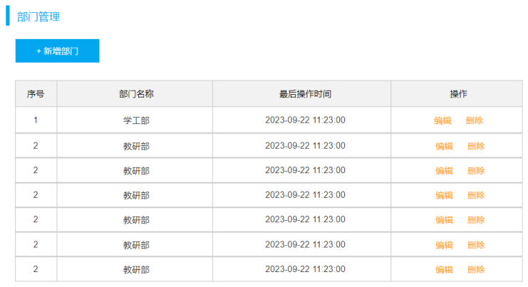
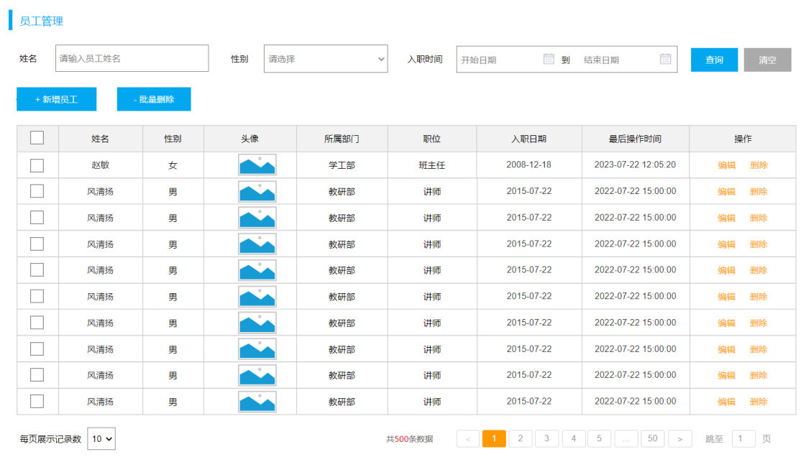
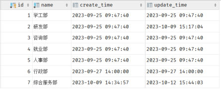
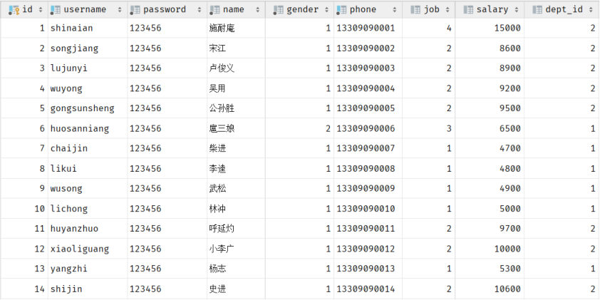
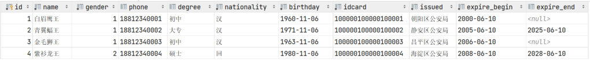
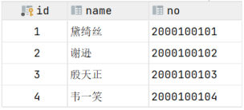
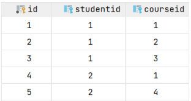

[63 篇](/posts/编程学习/javaweb学习笔记/63-日志技术/)给第 7 章（部门管理）收了尾。从这一篇开始进入第 8 章——**后端 Web 实战：员工管理**（课程 Day08），目标是把 Tlias 系统里最大的一个模块（员工的增删改查 + 分页 + 条件查询）做完。

PPT 第 2 页的目录把这一章分成四块，前两块是数据库的活、后一块是后端接口的活：

| 章节 | 内容 | 对应笔记 |
| --- | --- | --- |
| 一 | 需求 | 本章开篇（PPT 第 2 页） |
| 二 | **多表关系** | **本篇**（PPT 第 1-22 页） |
| 三 | **多表查询** | [65 篇](/posts/编程学习/javaweb学习笔记/65-多表查询/)（PPT 第 23-34 页） |
| 四 | 员工列表查询 | [66 篇](/posts/编程学习/javaweb学习笔记/66-员工列表查询与分页分析/)起（PPT 第 35 页以后） |

为什么要先补"表关系"这一课？因为第 7 章的 `dept` 表是**一张表管一件事**，而员工模块绕不开两张表：**员工属于某个部门**——"员工列表"页面上的"所属部门"那一列，数据根本不在 `emp` 表里。这一篇先把表与表的关系设计好（本篇），下一篇再讲怎么把两张表的数据一次查出来（[65 篇](/posts/编程学习/javaweb学习笔记/65-多表查询/)）。

本机实测环境：MySQL **9.0.1**（课程用 8.0.34），库 `tlias`（连接信息沿用课程原样——用户名 `root`、密码 `1234`，**自己动手时换成你自己 MySQL 的密码**）。实测时库里已有 `emp` 表 **30 条**员工数据、`dept` 表 **6 条**部门数据，以及本篇案例用的 `tb_user`/`tb_user_card`、`tb_student`/`tb_course`/`tb_student_course`；建表脚本就是课程的 `代码/01. 多表设计&多表查询/多表关系.sql`。

## 多表关系：三种关系（PPT 第 3-5 页）

PPT 第 3-4 页是这一节的过渡页，第 5 页给出"为什么要有表关系"的原文：

> 项目开发中，在进行数据库表结构设计时，会根据业务需求及业务模块之间的关系，分析并设计表结构。由于业务之间相互关联，所以各个表结构之间也存在着各种联系。
>
> 多表关系分为三种：**一对多（多对一）**、**一对一**、**多对多**。

"业务之间相互关联"这句话在页面上有直观的例子：一个商品列表页，页面上能看到的"商品名、分类、价格、评价"背后其实是好几张表在配合。


*图：PPT 第 5 页——一个电商列表页的背后往往是多张互相关联的表（商品、分类、价格、评价）。页面上看到的信息越丰富，数据库里表与表之间的联系就越绕不开*

三种关系各自解决什么问题、怎么落地，先给一张速查表（细节在下面三节）：

| 关系 | 典型场景 | 数据库里的落地方式 | PPT 页 |
| --- | --- | --- | --- |
| **一对多（多对一）** | 一个部门下有多个员工 | 在**多**的一方加一个字段，存**一**的一方的主键（`emp.dept_id` 存 `dept.id`） | 第 6-10 页 |
| **一对一** | 用户与身份证信息 | 在**任意一方**加外键，并且给外键加上**唯一约束 `UNIQUE`** | 第 15-17 页 |
| **多对多** | 学生与课程 | 建**第三张中间表**，中间表里至少两个外键，分别关联两方主键 | 第 18-20 页 |

## 一对多：部门与员工（PPT 第 6-10 页）

PPT 第 6 页是本节目录（一对多 / 一对一 / 多对多 / 案例），第 7 页给出场景：

> 场景：**部门与员工**的关系（一个部门下有多个员工）。

这个场景在 Tlias 系统里就是两个页面：一个是"部门管理"（列出所有部门），一个是"员工管理"（列出所有员工，其中一列写着"所属部门"）。


*图：PPT 第 7 页——"部门管理"页面：一行一个部门（学工部、教研部……）。这是关系里的"一"这一方*


*图：PPT 第 7 页——"员工管理"页面：每行一个员工，其中"所属部门"那一列写着学工部/教研部。这是关系里的"多"这一方，同属一个部门的员工会有很多行*

### 两张表的建表语句（PPT 第 8 页）

PPT 第 8 页把这两张表的建表语句直接摆出来（下面按课程脚本 `多表关系.sql` 的写法整理，加上了注释）：

```sql
-- 部门表（"一"的一方）
create table dept(
    id int unsigned primary key auto_increment comment 'ID, 主键',
    name varchar(10) not null unique comment '部门名称',
    create_time datetime default null comment '创建时间',
    update_time datetime default null comment '修改时间'
) comment '部门表';

-- 员工表（"多"的一方）
create table emp(
    id int unsigned primary key auto_increment comment 'ID,主键',
    username varchar(20) not null unique comment '用户名',
    password varchar(32) default '123456' comment '密码',
    name varchar(10) not null comment '姓名',
    gender tinyint unsigned not null comment '性别, 1:男, 2:女',
    phone char(11) not null unique comment '手机号',
    job tinyint unsigned comment '职位, 1 班主任, 2 讲师, 3 学工主管, 4 教研主管, 5 咨询师',
    salary int unsigned comment '薪资',
    image varchar(255) comment '头像',
    entry_date date comment '入职日期',
    dept_id int unsigned comment '关联的部门ID',      -- ← 就是这一个字段，把两张表连了起来
    create_time datetime comment '创建时间',
    update_time datetime comment '修改时间'
) comment '员工表';
```

两张表长什么样，PPT 第 9 页给了数据截图：


*图：PPT 第 9 页——`dept` 表的数据（id / name / create_time / update_time）。id 是主键，一行一个部门*


*图：PPT 第 9 页——`emp` 表的数据。注意最后一列 `dept_id`，它存的不是部门名字，而是 `dept` 表的主键值（1 就是学工部、2 就是教研部）——"一对多在多的一方加字段"这句话，落到表里就是这一列*

### 父表与子表（PPT 第 9-10 页）

PPT 第 9 页在两张表之间标了"一"和"多"，并给出了实现方式（这是这一节最核心的一句话）：

> **一对多的关系如何实现？——在数据库表中多的一方，添加字段，来关联一的一方的主键。**

顺着这句话，就有了"父表 / 子表"的叫法：

| 叫法 | 是哪张表 | 在这套表里 |
| --- | --- | --- |
| **一**的一方 / **父表** | 被关联的那张表（主键被别的表拿去做外键） | `dept` |
| **多**的一方 / **子表** | 加字段的那张表（字段指向父表主键） | `emp`（`dept_id`） |

PPT 第 10 页把这句话变成一个问答：

| 问题 | 答案 |
| --- | --- |
| 数据库中如何体现一对多的表关系？ | 需要在**多**的一方添加字段，关联**一**的一方的主键 |

本机实测（MySQL 9.0.1，库 `tlias`）里这 30 条员工数据在部门上的分布是这样的——它同时也是后面 [65 篇](/posts/编程学习/javaweb学习笔记/65-多表查询/)做多表查询时的"标准答案表"：

| `dept_id` | 部门 | 员工人数 |
| --- | --- | --- |
| 1 | 学工部 | **7** |
| 2 | 教研部 | **15** |
| 3 | 咨询部 | **7** |
| `NULL` | （没有部门） | **1** |
| 4 / 5 / 6 | 就业部 / 人事部 / 行政部 | **0**（dept 表里有这几个部门，但没有员工） |

> [!IMPORTANT]
> "多"的一方那个字段（`dept_id`）**可以为 `NULL`**：本机这 30 条数据里就有 1 名员工的 `dept_id` 是空的（还没有分配部门）。这一点在 [65 篇](/posts/编程学习/javaweb学习笔记/65-多表查询/)讲内连接与外连接时会变成一个"看得见的差别"——内连接会把这个员工漏掉，左外连接才留得住他。

## 多表问题分析：为什么要加外键约束（PPT 第 11 页）

两张表有了字段关联，问题就来了。PPT 第 11 页把现象、原因、解决方案列得很清楚：

> **现象**：部门数据可以直接删除，然而还有部分员工归属于该部门下，此时就出现了数据的不完整、不一致问题。
>
> **原因**：目前上述的两张表，在数据库层面，并未建立关联，所以是无法保证数据的一致性和完整性的。
>
> **解决方案**：**外键约束**。

课程脚本 `多表关系.sql` 的最后一行给 `emp` 补上了这个约束：

```sql
-- 添加外键约束 (emp的 dept_id ---> dept的主键id)
alter table emp add constraint fk_emp_dept_id foreign key (dept_id) references dept(id);
```

也就是说，本机 `tlias` 库里的 `emp` 表**是带着物理外键的**。带着它去试两种"捣乱操作"，数据库会直接拦下来（本机实测）：

> [!TIP]
> **实测（MySQL 9.0.1，库 `tlias`）**：
>
> ```sql
> -- ① 删除"有员工的部门"：教研部 id=2，下面挂着 15 名员工
> delete from dept where id = 2;
> ```
>
> ```text
> ERROR 1451 (23000): Cannot delete or update a parent row: a foreign key constraint fails
>   (`tlias`.`emp`, CONSTRAINT `fk_emp_dept_id` FOREIGN KEY (`dept_id`) REFERENCES `dept` (`id`))
> ```
>
> ```sql
> -- ② 插入一个"部门 id 不存在"的员工：dept 表里没有 999 这个部门
> insert into emp(username, password, name, gender, phone, dept_id, create_time, update_time)
> values ('test999', '123456', '测试员工', 1, '13300000999', 999, now(), now());
> ```
>
> ```text
> ERROR 1452 (23000): Cannot add or update a child row: a foreign key constraint fails
>   (`tlias`.`emp`, CONSTRAINT `fk_emp_dept_id` FOREIGN KEY (`dept_id`) REFERENCES `dept` (`id`))
> ```
>
> ```sql
> -- ③ 对照实验：先造一个"没有员工"的部门，再删掉它 → 成功
> insert into dept(id, name, create_time, update_time) values (99, '临时部', now(), now());
> delete from dept where id = 99;   -- 执行成功：没有员工引用它，外键不拦
> ```
>
> 两条报错各管一个方向，合起来才是"一致性"的完整含义：
>
> | 报错 | 触发动作 | 数据库在说什么 |
> | --- | --- | --- |
> | **1451** | 删父表（`dept`）的行 | 还有子表（`emp`）的行在引用它，**不能删**（父不动则子不孤） |
> | **1452** | 往子表（`emp`）插入一个父表里不存在的 id | 要引用的东西不存在，**不能插**（子不指向空气） |
>
> 而第 ③ 步证明了外键**只拦"会被破坏"的操作**：没有员工引用的部门照样能删。

## 外键约束的两种写法（PPT 第 12 页）

PPT 第 12 页给了两个时机、两段语法：

```sql
-- ① 创建表时，添加外键约束
create table 表名(
    字段名 数据类型,
    ...
    [constraint] [外键名称] foreign key (外键字段名) references 主表 (字段名)
);

-- ② 建完表后，添加外键约束
alter table 表名 add constraint 外键名称 foreign key (外键字段名) references 主表(字段名);
```

两点说明：

- **两种写法效果完全一样**，区别只是"什么时候加"。表已经在用了（比如已经有数据了）就只能用第 ② 种。课程脚本给 `emp` 加外键用的正是第 ② 种。
- 中括号里的 `constraint` 和 **外键名称是可选**的——不写数据库会自动起一个名字；但**建议起个有意义的名字**（课程用的是 `fk_emp_dept_id`，"fk" 是 foreign key 的缩写，"emp 的 dept_id" 一眼就能看出这个外键管的是哪个字段）。

> [!WARNING]
> 用第 ② 种写法给一张**已经有脏数据**的表加外键，会失败：比如 `emp` 里已经有一条 `dept_id = 999` 的记录，而 `dept` 表里没有 999，那么 `alter table` 加外键这条语句本身就会报错（因为约束要求现存数据也得满足规则）。所以要给老表加外键，得先把不合法的那几行数据改干净。

## 物理外键与逻辑外键（PPT 第 13-14 页）

PPT 第 13 页把"外键"这件事分成两类——**它俩不是两种语法，而是两种做法**：

| | 物理外键 | 逻辑外键 |
| --- | --- | --- |
| **概念** | 使用 `foreign key` 定义外键关联另外一张表（就是上面加的约束本身） | 在**业务层逻辑**中解决外键关联（数据库里不加任何约束，靠代码保证不写出脏数据） |
| **谁来保证一致性** | 数据库 | 应用程序（Service 层） |
| **缺点** | ① 影响增、删、改的效率（要检查外键关系）② 仅用于单节点数据库，不适用于分布式、集群场景 ③ 容易引发数据库的死锁问题，消耗性能 | 数据库不再兜底，写脏数据时没有任何报错 |

PPT 第 13 页明确写了态度：**"通过逻辑外键，就可以很方便的解决上述问题"**——也就是实际项目中推荐用逻辑外键。

> [!IMPORTANT]
> 这句话很容易被读成"外键没用"——不是。**物理外键的这套规则（父子两边都不许乱来）依然要遵守，只是把"检查"这件事从数据库挪到了代码里**：删部门前先看看下面还有没有员工、给员工填部门时先确认部门存在。数据库不拦，错误就得靠业务逻辑拦住。
>
> 这也是为什么后面 [66 篇](/posts/编程学习/javaweb学习笔记/66-员工列表查询与分页分析/)及以后的代码里，`emp` 与 `dept` 之间**看不到任何外键代码**——它们靠 `dept_id` 这个字段"逻辑上"关联，而不是"物理上"约束。

PPT 第 14 页的问答：

| 问题 | 答案 |
| --- | --- |
| 数据库中的外键约束的作用？ | 多表操作中保证数据的**一致性、完整性和正确性** |
| 物理外键与逻辑外键的选择？ | **逻辑外键（推荐）** |

## 一对一：用户与身份证信息（PPT 第 15-17 页）

PPT 第 15 页是本节的目录页（一对多 / 一对一 / 多对多 / 案例），第 16 页给出：

> **案例**：用户 与 身份证信息 的关系。
>
> **关系**：一对一关系，**多用于单表拆分**，将一张表的基础字段放在一张表中，其他字段放在另一张表中，以提升操作效率。
>
> **实现**：在**任意一方**加入外键，关联另外一方的主键，并且**设置外键为唯一的（UNIQUE）**。

"单表拆分"是什么意思？看 PPT 第 16 页这张截图——用户的信息（姓名、性别、手机号、学历）和身份证的信息（民族、生日、身份证号、签发机关、有效期）**全都堆在一张表里**：


*图：PPT 第 16 页——把用户信息和身份证信息塞进同一张表的样子。字段一多，这张"宽表"每次查询都要拖着一堆用不上的列；拆成两张一对一关联的表，查用户基本信息时就不用管身份证那些列*

拆完之后就是两张表：`tb_user`（用户基本信息）+ `tb_user_card`（身份信息），建表语句如下（课程脚本 `多表关系.sql`）：

```sql
-- 用户基本信息表
create table tb_user(
    id int unsigned primary key auto_increment comment 'ID',
    name varchar(10) not null comment '姓名',
    gender tinyint unsigned not null comment '性别, 1 男  2 女',
    phone char(11) comment '手机号',
    degree varchar(10) comment '学历'
) comment '用户信息表';

-- 用户身份信息表
create table tb_user_card(
    id int unsigned primary key auto_increment comment 'ID',
    nationality varchar(10) not null comment '民族',
    birthday date not null comment '生日',
    idcard char(18) not null comment '身份证号',
    issued varchar(20) not null comment '签发机关',
    expire_begin date not null comment '有效期限-开始',
    expire_end date comment '有效期限-结束',
    user_id int unsigned not null unique comment '用户ID',      -- ← 外键 + unique，这两条一起才叫"一对一"
    constraint fk_user_id foreign key (user_id) references tb_user(id)
) comment '用户信息表';
```

> [!IMPORTANT]
> **"外键 + 唯一约束"这两条缺一不可**：只加外键，那 `tb_user_card` 里可以出现两条 `user_id = 1` 的记录（一个用户有两张身份证）——那就退化成一对多了；加上 `unique` 之后，一个 `tb_user.id` 最多被一行 `tb_user_card` 引用，两边才真正一一对应。

PPT 第 17 页的问答把这层关系一句话点透：

| 问题 | 答案 |
| --- | --- |
| 数据库中如何体现一对一的表关系？ | 一对一其实是一种**特殊的一对多**——在任意一方添加外键，关联另外一方的主键（再给外键加唯一约束） |

## 多对多：学生与课程（PPT 第 18-20 页）

PPT 第 18 页是本节目录页，第 19 页给出：

> **案例**：学生 与 课程 的关系。
>
> **关系**：一个学生可以选修多门课程，一门课程也可以供多个学生选择。
>
> **实现**：建立**第三张中间表**，中间表**至少包含两个外键**，分别关联两方主键。

学生表和课程表本身没有任何"关联字段"（学生表里放不下多门课，课程表里也放不下多个学生），所以关联这件事被单独拎出来，交给第三张表：

```sql
-- 学生表
create table tb_student(
    id int auto_increment primary key comment '主键ID',
    name varchar(10) comment '姓名',
    no varchar(10) comment '学号'
) comment '学生表';

-- 课程表
create table tb_course(
   id int auto_increment primary key comment '主键ID',
   name varchar(10) comment '课程名称'
) comment '课程表';

-- 学生课程关系表（中间表）
create table tb_student_course(
   id int auto_increment comment '主键' primary key,
   student_id int not null comment '学生ID',
   course_id int not null comment '课程ID',
   constraint fk_courseid foreign key (course_id) references tb_course (id),
   constraint fk_studentid foreign key (student_id) references tb_student (id)
) comment '学生课程中间表';
```

中间表里一行的含义就是**"某个学生选了某门课"**：


*图：PPT 第 19 页——`tb_student` 学生表：id、姓名、学号。这张表里没有任何"课程"的影子*


*图：PPT 第 19 页——`tb_student_course` 中间表：`student_id` 与 `course_id` 两个外键分别指向学生表和课程表。想查"黛绮丝选了哪几门课"就按 `student_id` 筛，想查"哪几门课被选了"就按 `course_id` 分组统计——多对多的两个方向都从这张表出发*

PPT 第 20 页的问答：

| 问题 | 答案 |
| --- | --- |
| 数据库中如何体现多对多的表关系？ | 需要建立一张**中间表**，中间表中有**两个外键字段**，分别关联两方的主键 |

> [!TIP]
> 三种关系其实是"层层递进"的一句话：**一对多**是在多的一方加字段 → **一对一**是加字段之后再给它加上唯一约束 → **多对多**是一张表放不下，就把两个"一对多"（学生→中间表、课程→中间表）拼起来。记住这个递进顺序，就不用死背三种关系了。

## 案例：按页面原型设计员工模块的表结构（PPT 第 21-22 页）

PPT 第 21 页切到本节目录里最后一格"**案例**"，第 22 页给出任务：

> **需求**：请根据资料中提供的页面原型，设计 **员工模块** 涉及到的表结构。
>
> **步骤**：
> 1. 阅读页面原型及需求文档，分析各个模块涉及到的表结构，及表结构之间的关系。
> 2. 根据页面原型及需求文档，分析各个表结构中具体的字段及约束。

### 第一步：看页面原型，找出"有几件事"

员工模块的页面原型里其实藏了两件事：

- **"员工管理"列表**上的那些列（姓名、性别、头像、所属部门、职位、入职日期、最后操作时间）——这是员工本人的信息；
- **"新增员工"表单**里的"工作经历"区块——这是员工**工作过的地方**，一个员工可以填多段经历（开始时间、结束时间、公司名称、职位）。


*图：PPT 第 22 页——“新增员工”页面原型。上半部分（用户名、姓名、性别、手机号、职位、薪资、所属部门、入职日期、头像）是员工本人的字段，对应 `emp` 表；下半部分“工作经历”是一组可以添加多条的记录（开始时间、结束时间、公司、职位），对应 `emp_expr` 表*

一件事一张表，于是员工模块对应两张表（关系是"员工 → 工作经历"的一对多）：

```
dept(1) ──────> emp(n)          emp(1) ──────> emp_expr(n)
一个部门有多个员工               一个员工有多段工作经历
（emp 加 dept_id）              （emp_expr 加 emp_id）
```

### 第二步：逐个字段定下来，写成建表语句

**员工表 `emp`**（"多"的一方：`dept_id` 指向 `dept` 的主键）：

```sql
create table emp(
    id int unsigned primary key auto_increment comment 'ID,主键',
    username varchar(20) not null unique comment '用户名',
    password varchar(32) default '123456' comment '密码',
    name varchar(10) not null comment '姓名',
    gender tinyint unsigned not null comment '性别, 1:男, 2:女',
    phone char(11) not null unique comment '手机号',
    job tinyint unsigned comment '职位, 1 班主任, 2 讲师 , 3 学工主管, 4 教研主管, 5 咨询师',
    salary int unsigned comment '薪资',
    image varchar(255) comment '头像',
    entry_date date comment '入职日期',
    dept_id int unsigned comment '部门ID',          -- 关联部门（逻辑外键）
    create_time datetime comment '创建时间',
    update_time datetime comment '修改时间'
) comment '员工表';
```

**工作经历表 `emp_expr`**（"多"的一方：`emp_id` 指向 `emp` 的主键）：

```sql
create table emp_expr(
    id int unsigned primary key auto_increment comment 'ID, 主键',
    emp_id int unsigned comment '员工ID',           -- 关联员工（逻辑外键）
    begin date comment '开始时间',
    end  date comment '结束时间',
    company varchar(50) comment '公司名称',
    job varchar(50) comment '职位'
) comment '工作经历';
```

字段从哪来，一张表梳理清楚：

| 表 | 字段 | 类型 / 约束 | 依据（页面原型上的哪一处） |
| --- | --- | --- | --- |
| `emp` | `id` | `int unsigned`、主键、自增 | 每行员工需要一个唯一标识 |
| `emp` | `username` | `varchar(20)`、非空、唯一 | "用户名"输入框：必填、2-20 个字符、不能重复 |
| `emp` | `password` | `varchar(32)`、默认 `'123456'` | 新增员工时前端不填密码，给一个初始密码 |
| `emp` | `name` | `varchar(10)`、非空 | "姓名"输入框：必填、2-10 个字 |
| `emp` | `gender` | `tinyint unsigned`、非空 | "性别"下拉框：必填，只有男(1)/女(2) |
| `emp` | `phone` | `char(11)`、非空、唯一 | "手机号"输入框：必填、固定 11 位、不能重复 |
| `emp` | `job` | `tinyint unsigned` | "职位"下拉框：1 班主任、2 讲师…… 可以不填 |
| `emp` | `salary` | `int unsigned` | "薪资"输入框：一个整数 |
| `emp` | `image` | `varchar(255)` | "头像"上传：存的是图片的 URL |
| `emp` | `entry_date` | `date` | "入职日期"选择器：只要年月日 |
| `emp` | `dept_id` | `int unsigned` | "所属部门"下拉框——**存的是 dept 表的主键**，这就是一对多的那个字段 |
| `emp` | `create_time` / `update_time` | `datetime` | 页面上"最后操作时间"那一列的来源（三个基础字段里的两个） |
| `emp_expr` | `id` | `int unsigned`、主键、自增 | 一段经历的编号 |
| `emp_expr` | `emp_id` | `int unsigned` | 这段经历属于哪个员工——一对多的那个字段 |
| `emp_expr` | `begin` / `end` | `date` | 工作经历里的"开始时间 / 结束时间" |
| `emp_expr` | `company` | `varchar(50)` | 工作经历里的"公司" |
| `emp_expr` | `job` | `varchar(50)` | 工作经历里的"职位"（注意和 `emp.job` 不是一回事：一个是公司里的岗位名，一个是公司内的职位编号） |

本机实测（MySQL 9.0.1，库 `tlias`）这两张表的状态：

- `emp`：**30 条**员工数据（按 `dept_id` 分布见前面那张表）；
- `emp_expr`：**0 条**——工作经历是"新增员工"功能才会写入的，员工模块的新增功能这一章才刚开始做，所以这张表还是空的；
- `emp` 表带着课程脚本加的那个物理外键 `fk_emp_dept_id`（所以前面才能复现出 1451/1452 两条报错）；而 `emp_expr` 与 `emp` 之间**没有**加物理外键——按 PPT 第 13 页的建议，实际项目里这种关联交给业务层用**逻辑外键**去保证。

## 小结

| 问题 | 答案 |
| --- | --- |
| 为什么要设计表关系 | 业务之间相互关联，所以各表之间也存在联系；把关系设计清楚，才能保证数据的一致性、完整性 |
| 三种多表关系 | **一对多（多对一）**、**一对一**、**多对多** |
| 一对多怎么实现 | 在**多**的一方添加字段，关联**一**的一方的主键（`dept` 是父表，`emp` 是子表，靠 `emp.dept_id` 关联） |
| 不加外键会怎样 | 部门能被直接删掉、员工还挂在下面 → 数据不完整、不一致（PPT 第 11 页的"多表问题分析"） |
| 外键约束的两种写法 | 建表时 `[constraint] [外键名称] foreign key (外键字段名) references 主表 (字段名)`；建表后 `alter table 表名 add constraint 外键名称 foreign key (外键字段名) references 主表(字段名);`——课程脚本用的就是后者（`fk_emp_dept_id`） |
| 实测两条报错 | 删有员工的部门 → **`ERROR 1451 (23000)`**（Cannot delete or update a parent row）；插入不存在的部门 id → **`ERROR 1452 (23000)`**（Cannot add or update a child row）；删没有员工的部门 → 成功 |
| 外键约束的作用 | 多表操作中保证数据的**一致性、完整性和正确性** |
| 物理外键 vs 逻辑外键 | 物理外键 = 用 `foreign key` 让数据库管；三个缺点（影响增删改效率、只适用单节点、容易死锁消耗性能）→ **实际项目推荐逻辑外键**（在业务层解决关联） |
| 一对一怎么实现 | 一对一是一种特殊的一对多：在**任意一方**加外键关联另一方主键，并给外键加 **`UNIQUE`**；典型场景是**单表拆分**（用户信息 + 身份证信息） |
| 多对多怎么实现 | 建**第三张中间表**，中间表里至少**两个外键**分别关联两方主键（`tb_student_course` 的 `student_id` / `course_id`） |
| 员工模块的表 | `emp`（含 `dept_id` 指向 `dept`）+ `emp_expr`（含 `emp_id` 指向 `emp`）；本机实测 `emp` 30 条、`emp_expr` 0 条 |

## 相关

- [上一篇：日志技术](/posts/编程学习/javaweb学习笔记/63-日志技术/)
- [下一篇：多表查询](/posts/编程学习/javaweb学习笔记/65-多表查询/)

## 练习题

### 一、知识回顾（读完直接做下面的实践题）

1. **多表关系的三种类型**：**一对多（多对一）**、**一对一**、**多对多**；关系来源于业务之间的相互关联，表结构设计要跟着业务走
2. **一对多的落地方式**：在**多**的一方添加字段，关联**一**的一方的主键——`dept`（一 / 父表）→ `emp`（多 / 子表），靠 `emp.dept_id` 关联
3. **一对多的字段可以为空**：本机 30 条员工数据里就有 **1 条** `dept_id` 为 `NULL`（没有分配部门），另外 `dept` 表里的就业部、人事部、行政部下面**一个员工都没有**
4. **多表问题**（PPT 第 11 页）：两张表在数据库层面没建立关联 → 部门能被直接删掉而员工还挂在下面 → **数据不完整、不一致**；解决方案是**外键约束**
5. **加外键的两种语法**：建表时在字段列表末尾写 `[constraint] [外键名称] foreign key (外键字段名) references 主表 (字段名)`；建表后用 `alter table 表名 add constraint 外键名称 foreign key (外键字段名) references 主表(字段名);`（课程脚本给 `emp` 加的就是这一句，外键名 `fk_emp_dept_id`）
6. **两条实测报错原文**：删有员工的部门 → **`ERROR 1451 (23000): Cannot delete or update a parent row: a foreign key constraint fails`**；插入 `dept_id = 999` 的员工 → **`ERROR 1452 (23000): Cannot add or update a child row: a foreign key constraint fails`**；删"没有员工的部门"则**成功**
7. **外键约束的作用**：多表操作中保证数据的**一致性、完整性和正确性**；物理外键的**三个缺点**是影响增删改效率、仅适用于单节点（不适用分布式/集群）、容易引发死锁消耗性能 → **推荐逻辑外键**（在业务层用代码保证关联）
8. **一对一的落地方式**：在**任意一方**加外键关联另一方主键，并给这个外键加 **`UNIQUE`**（一对一本是一种特殊的一对多）；常见用途是**单表拆分**（`tb_user` + `tb_user_card`）
9. **多对多的落地方式**：建**第三张中间表**，中间表里至少**两个外键**分别关联两方主键（`tb_student_course` 的 `student_id` → `tb_student.id`、`course_id` → `tb_course.id`），中间表一行表示"某学生选了某门课"
10. **员工模块的两张表**：`emp`（员工，含 `dept_id`）与 `emp_expr`（工作经历，含 `emp_id`），关系是 `dept(1)→emp(n)` 和 `emp(1)→emp_expr(n)`；本机实测 `emp` **30 条**、`emp_expr` **0 条**

### 二、裸写题

- [ ] **2-1 给"班级—学生"设计一对多的两张表**
  需求里说：一个班级里有很多学生，每个学生只属于一个班级。请设计这两张表并让它们在数据库层面建立关联：
  1. 写出两张表的建表语句（班级表 `tb_class`：主键 `id`、班级名称 `name`、创建时间 `create_time`；学生表 `tb_student2`：主键 `id`、姓名 `name`、学号 `no`、创建时间 `create_time`）；
  2. 学生表里要有"属于哪个班级"的字段（起名 `class_id`），并用**建表后添加**的方式给它加上外键约束，外键名取 `fk_student_class`。

  > [!TIP]- 提示（先自己想，实在想不出再点开）
  > **一级 · 思路**：判断"哪张是多的一方"——一个班级对多个学生，所以**学生表是多的一方**，关联字段要加在学生表上，指向班级表的主键；外键约束用"建完表后添加"的写法
  > **二级 · 方法**：建表 `create table 表名(字段 类型 约束, ...)`；加外键 `alter table 表名 add constraint 外键名称 foreign key (外键字段名) references 主表(字段名);`
  > **三级 · 骨架**：`create table tb_class(id int unsigned primary key auto_increment, name varchar(20) not null unique, create_time datetime);` → `create table tb_student2(id int unsigned primary key auto_increment, name varchar(10) not null, no varchar(10) not null unique, class_id int unsigned, create_time datetime);` → `alter table tb_student2 ____ constraint fk_student_class ____ key (____) references ____ (____);`

  > [!TIP]- 参考答案（做完再点开）
  > ```sql
  > -- 班级表（"一"的一方 / 父表）
  > create table tb_class(
  >     id int unsigned primary key auto_increment comment '主键ID',
  >     name varchar(20) not null unique comment '班级名称',
  >     create_time datetime comment '创建时间'
  > ) comment '班级表';
  >
  > -- 学生表（"多"的一方 / 子表）：多的一方加字段
  > create table tb_student2(
  >     id int unsigned primary key auto_increment comment '主键ID',
  >     name varchar(10) not null comment '姓名',
  >     no varchar(10) not null unique comment '学号',
  >     class_id int unsigned comment '所属班级ID',
  >     create_time datetime comment '创建时间'
  > ) comment '学生表';
  >
  > -- 建完表后，添加外键约束
  > alter table tb_student2 add constraint fk_student_class foreign key (class_id) references tb_class(id);
  > ```
  > 检查点：`class_id` 加在**学生表**（多的一方）上；外键名写在 `constraint` 后面；`references` 后面跟的是**父表名 + 它的主键字段**。加完约束后可以复现一下规则——`delete from tb_class where id = 1;` 如果下面还有学生，就会报 **1451**。

- [ ] **2-2 给"用户—身份证"设计一对一两张表**
  需求：一个用户最多只有一份身份信息，一份身份信息也只属于一个用户。请在 `tb_user`（`id`、`name`、`phone`）之外设计一张 `tb_user_card`（`id`、`idcard` 身份证号、`user_id` 用户ID），并用**建表时指定**的方式让它和用户表建立一对一关系。

  > [!TIP]- 提示（先自己想，实在想不出再点开）
  > **一级 · 思路**：一对一的关键有两步——先选一方放外键（任意一方都行，这里放在身份证表上），**再给这个外键加上唯一约束**；少了唯一约束就退化成了"一个用户能有多张身份证"的一对多
  > **二级 · 方法**：唯一约束 `unique`；外键写在字段列表里 `constraint 外键名 foreign key (外键字段名) references 主表(字段名)`
  > **三级 · 骨架**：`create table tb_user_card(id int unsigned primary key auto_increment, idcard char(18) not null, user_id int unsigned not null ____, constraint fk_card_user ____ key (____) references ____(____));`

  > [!TIP]- 参考答案（做完再点开）
  > ```sql
  > create table tb_user(
  >     id int unsigned primary key auto_increment comment 'ID',
  >     name varchar(10) not null comment '姓名',
  >     phone char(11) comment '手机号'
  > ) comment '用户信息表';
  >
  > create table tb_user_card(
  >     id int unsigned primary key auto_increment comment 'ID',
  >     idcard char(18) not null comment '身份证号',
  >     user_id int unsigned not null unique comment '用户ID',   -- 外键 + 唯一约束
  >     constraint fk_card_user foreign key (user_id) references tb_user(id)
  > ) comment '用户身份信息表';
  > ```
  > 验证一下唯一约束真的生效：先插一条 `user_id = 1` 的身份信息，再插第二条 `user_id = 1` 的记录，数据库会报主键/唯一键冲突（`ERROR 1062 (23000): Duplicate entry '1' for key '...'`），插不进去——这就是"一对一"。课程脚本里的 `tb_user_card` 用的就是这套写法，只是外键名叫 `fk_user_id`。

- [ ] **2-3 给"学生—课程"设计多对多的三张表**
  需求：一个学生可以选多门课，一门课可以被多个学生选。请设计 `tb_student`（`id`、`name`、`no`）、`tb_course`（`id`、`name`）和它们之间的中间表 `tb_student_course`，把两张表关联起来。

  > [!TIP]- 提示（先自己想，实在想不出再点开）
  > **一级 · 思路**：两张主表里都放不下对方的信息，所以要请出**第三张中间表**；中间表不需要业务字段，只需要两个外键，分别指向两张主表的主键
  > **二级 · 方法**：中间表两个字段都加 `not null`，各写一条 `constraint 外键名 foreign key (字段) references 主表(id)`
  > **三级 · 骨架**：`create table tb_student_course(id int primary key auto_increment, student_id int not null, course_id int not null, constraint fk_studentid foreign key (student_id) references ____(____), constraint fk_courseid foreign key (____) references ____(____));`

  > [!TIP]- 参考答案（做完再点开）
  > ```sql
  > create table tb_student(
  >     id int auto_increment primary key comment '主键ID',
  >     name varchar(10) comment '姓名',
  >     no varchar(10) comment '学号'
  > ) comment '学生表';
  >
  > create table tb_course(
  >     id int auto_increment primary key comment '主键ID',
  >     name varchar(10) comment '课程名称'
  > ) comment '课程表';
  >
  > -- 中间表：只有两个外键，一行 = 一个学生选了一门课
  > create table tb_student_course(
  >     id int auto_increment comment '主键' primary key,
  >     student_id int not null comment '学生ID',
  >     course_id int not null comment '课程ID',
  >     constraint fk_studentid foreign key (student_id) references tb_student(id),
  >     constraint fk_courseid foreign key (course_id) references tb_course(id)
  > ) comment '学生课程中间表';
  > ```
  > 插几条选课数据试试：`insert into tb_student_course(student_id, course_id) values (1,1),(1,2),(1,3),(2,2),(2,3),(3,4);`——第 1 个学生选了 3 门、第 2 个选了 2 门、第 3 个选了 1 门。两个外键各有各的作用：`student_id` 保证"选课的学生存在"，`course_id` 保证"选的课存在"。

- [ ] **2-4 排错：这两条语句为什么跑不了**
  （1）本机的 `emp` 表带着外键约束 `fk_emp_dept_id`，执行 `delete from dept where id = 2;`（教研部下面有 15 名员工）报错，把报错原文抄下来，并解释这句话的意思。
  （2）接着执行 `insert into emp(username, password, name, gender, phone, dept_id, create_time, update_time) values ('test999','123456','测试员工',1,'13300000999',999,now(),now());` 又报错，这次是为什么？两条报错分别在"保护"什么？

  > [!TIP]- 提示（先自己想，实在想不出再点开）
  > **一级 · 思路**：两条报错一个发生在**删父表**、一个发生在**插子表**，都是外键约束在拦；报错信息里的英文关键词能帮你判断是哪一种——`parent row`（父表的行）和 `child row`（子表的行）
  > **二级 · 方法**：外键约束的规则是"子表引用的父表记录必须存在，父表被引用的记录不能删"；报错码 `1451` 对应"删/改父表"，`1452` 对应"子表引用了不存在的父记录"
  > **三级 · 骨架**：第 1 条抓住报错里的两处关键信息——出问题的是 tlias 库的 emp 表、约束名是 fk_emp_dept_id（谁在引用 dept）；第 2 条说清 dept 表里根本没有 id 为 999 的部门

  > [!TIP]- 参考答案（做完再点开）
  > **（1）** 报错原文（本机实测）：
  > ```text
  > ERROR 1451 (23000): Cannot delete or update a parent row: a foreign key constraint fails
  >   (`tlias`.`emp`, CONSTRAINT `fk_emp_dept_id` FOREIGN KEY (`dept_id`) REFERENCES `dept` (`id`))
  > ```
  > 意思是"不能删除或修改**父表**的行：外键约束失败了"，括号里点名了是 `tlias` 库的 `emp` 表、约束名 `fk_emp_dept_id`（`emp.dept_id` → `dept.id`）。因为教研部（id=2）下面还挂着 15 名员工，一旦把这个部门删掉，这 15 行 `emp.dept_id = 2` 就"指向空气"了——外键在数据库层面把这种会造成数据不一致的操作拦下来了。
  >
  > **（2）** 报错原文（本机实测）：
  > ```text
  > ERROR 1452 (23000): Cannot add or update a child row: a foreign key constraint fails
  >   (`tlias`.`emp`, CONSTRAINT `fk_emp_dept_id` FOREIGN KEY (`dept_id`) REFERENCES `dept` (`id`))
  > ```
  > 这次是"不能新增或修改**子表**的行"：要插入的这条员工记录 `dept_id = 999`，而 `dept` 表里根本没有 id 为 999 的部门，子表不能引用一个不存在的父记录。
  >
  > 两条报错合起来才是外键的完整规则：**子表不许指向不存在的父记录（1452），父表里被引用的记录不许删（1451）**。反过来验证一下就知道它只拦"会被破坏的操作"——如果某个部门下面一个员工都没有，`delete` 它是能成功的（本机实测：临时建的"临时部"删除成功）。

### 三、综合题

- [ ] **3-1 照着页面原型，把员工模块的表结构设计出来**
  这是 PPT 第 22 页的案例，完整走一遍。要求设计**员工模块**涉及的两张表，并说清它们之间的关系：
  1. **读原型**：打开员工模块的两个页面原型（"员工管理"列表、"新增员工"表单），把页面上出现的字段抄成清单，并判断哪些字段属于"员工本人"、哪些字段属于"工作经历"；
  2. **判关系**：写出员工模块涉及的表以及表与表的关系（提示：`dept` 已经在第 7 章建好了，这里只需要新设计两张）；
  3. **定字段**：给每张表逐个字段写出"类型 + 约束"，约束要能对上页面原型上的字段限制（用户名、手机号唯一且必填；姓名必填；性别必填；薪资、职位、入职日期、头像可空）；
  4. **写建表语句**：把两张表的 `create table` 写全（字段都要带 `comment`，两张表都要有 `id` / `create_time` / `update_time` 三个基础字段）；
  5. **连关系**：在"多"的一方补上关联字段；如果要在数据库层面建立约束，把对应的 `alter table ... add constraint ... foreign key ...` 也写出来（课程脚本给 `emp` 加的是 `fk_emp_dept_id`；`emp_expr` 与 `emp` 之间课程没有加物理外键）；
  6. **答一问**：PPT 第 13 页说实际项目推荐**逻辑外键**，那"物理外键的那两条规则"（不许指向不存在的记录、被引用的记录不许删）由谁来保证？举一个员工模块里的例子。

  **涉及知识点**

  | 知识点 | 在这里的应用 |
  | --- | --- |
  | 一对多的实现 | 第 3-5 步——`emp.dept_id`、`emp_expr.emp_id` 都加在"多"的一方 |
  | 页面原型到表结构 | 第 1-3 步——先看页面上有哪些字段，再判断类型与约束 |
  | 外键约束语法 | 第 5 步——`alter table ... add constraint ... foreign key ... references ...` |
  | 物理外键与逻辑外键 | 第 6 步——库里有外键时数据库兜底，靠逻辑外键时业务代码兜底 |

  > [!TIP]- 提示（先自己想，实在想不出再点开）
  > **一级 · 思路**：整题的骨架是"找字段 → 判关系 → 写语句 → 连关系"。第 1 步要抓住关键：新增员工表单下半部分的"工作经历"是一组**可以加多条**的记录，所以它必须单独成表
  > **二级 · 方法**：一对多 = 在多的一方加字段 +（可选）`foreign key ... references ...`；每个字段的约束从原型上的提示文字里读——"必填"= `not null`，"不能重复"= `unique`，"图片上传"= 用 `varchar` 存 URL
  > **三级 · 骨架**：第 3 步按 `emp`（id/username/password/name/gender/phone/job/salary/image/entry_date/dept_id/create_time/update_time）与 `emp_expr`（id/emp_id/begin/end/company/job）两张清单逐个定；第 5 步 `alter table emp add constraint ____ foreign key (dept_id) references dept(____);`

  > [!TIP]- 参考答案（做完再点开）
  > **1~2. 字段归属与表关系**
  > | 页面上看到的 | 属于哪张表 |
  > | --- | --- |
  > | 用户名、姓名、性别、手机号、职位、薪资、头像、入职日期 | `emp`（员工本人） |
  > | "所属部门"下拉框 | 选的是 `dept` 表里的部门 → `emp` 只存 `dept_id` |
  > | 工作经历（开始时间、结束时间、公司、职位）可以添加多条 | `emp_expr`（一个员工多段经历） |
  > | 列表页的"最后操作时间" | `emp.update_time` |
  >
  > 三张表的关系：`dept(1) → emp(n)`、`emp(1) → emp_expr(n)`——两条都是"一对多，在多的一方加字段"。
  >
  > **3~5. 建表语句**
  > ```sql
  > -- 员工表（dept 表第 7 章已经建好）
  > create table emp(
  >     id int unsigned primary key auto_increment comment 'ID,主键',
  >     username varchar(20) not null unique comment '用户名',
  >     password varchar(32) default '123456' comment '密码',
  >     name varchar(10) not null comment '姓名',
  >     gender tinyint unsigned not null comment '性别, 1:男, 2:女',
  >     phone char(11) not null unique comment '手机号',
  >     job tinyint unsigned comment '职位, 1 班主任, 2 讲师 , 3 学工主管, 4 教研主管, 5 咨询师',
  >     salary int unsigned comment '薪资',
  >     image varchar(255) comment '头像',
  >     entry_date date comment '入职日期',
  >     dept_id int unsigned comment '部门ID',
  >     create_time datetime comment '创建时间',
  >     update_time datetime comment '修改时间'
  > ) comment '员工表';
  >
  > -- 工作经历表
  > create table emp_expr(
  >     id int unsigned primary key auto_increment comment 'ID, 主键',
  >     emp_id int unsigned comment '员工ID',
  >     begin date comment '开始时间',
  >     end date comment '结束时间',
  >     company varchar(50) comment '公司名称',
  >     job varchar(50) comment '职位'
  > ) comment '工作经历';
  >
  > -- 在数据库层面建立约束（可选，课程脚本对 emp 做了这一步，外键名 fk_emp_dept_id）
  > alter table emp add constraint fk_emp_dept_id foreign key (dept_id) references dept(id);
  > ```
  > **6. 答一问**：物理外键撤掉之后，PPT 第 11 页那两条规则（"子表不许指向不存在的父记录""父表里被引用的记录不许删"）**依然要遵守**，只是执行的人从数据库换成了业务代码——比如"删除部门"接口在删之前要先查一下这个部门下面还有没有员工（[60 篇](/posts/编程学习/javaweb学习笔记/60-部门管理-删除部门/)那个接口之后就要补上这一步）；"新增/修改员工"接口要确认传上来的 `dept_id` 在 `dept` 表里真实存在。数据库不拦，脏数据就会悄悄写进去，等到页面上出现"所属部门"是空白的一行时才发现。
  > 本机实测的现状：`emp` 30 条、`emp_expr` **0 条**（工作经历要等"新增员工"功能做完才会有数据），`emp` 表带着 `fk_emp_dept_id` 这个物理外键——所以上面"删教研部报 1451"的实验才能做出来。
