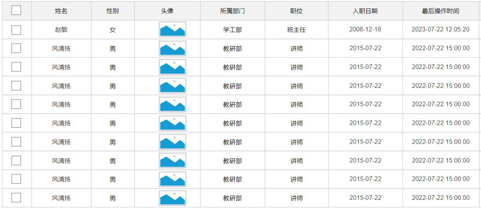

[64 篇](/posts/编程学习/javaweb学习笔记/64-多表关系与表设计/)把表与表的关系设计好了：`emp` 表里存的是 `dept_id`（部门的编号），而不是部门的名字。可需求偏偏要的是名字——员工管理列表上那一列"**所属部门**"，显示的是学工部、教研部这样的文字：


*图：PPT 第 38 页——“员工管理”列表里的“所属部门”列，数据根本不在 `emp` 表里（`emp` 只有 `dept_id`），它是 `dept` 表的数据。要把这两张表的信息拼在同一行上，就要用到本篇的多表查询*

这一篇对应 PPT 第 23-34 页：**多表查询的概念与笛卡尔积 → 分类 → 内连接 → 外连接 → 子查询 → 五个需求的案例**。

本机实测环境：MySQL **9.0.1**（课程用 8.0.34），库 `tlias`（连接信息沿用课程原样——用户名 `root`、密码 `1234`，**自己动手时换成你自己 MySQL 的密码**），`emp` 表 **30 条**员工、`dept` 表 **6 条**部门。数据分布：`dept_id` 为 1（学工部）**7 人**、2（教研部）**15 人**、3（咨询部）**7 人**、`NULL`（没有部门）**1 人**；`dept` 表里还有 4 就业部、5 人事部、6 行政部，它们下面**一个员工都没有**——下面几处"看得见的差别"全靠这两个事实。

## 多表查询与笛卡尔积（PPT 第 23-25 页）

PPT 第 23-24 页是过渡页，第 25 页给出定义：

> **多表查询**：指从多张表中查询数据。
>
> **笛卡尔积**：指在数学中，两个集合（A 集合 和 B 集合）的**所有组合情况**。（在多表查询时，需要消除无效的笛卡尔积）

"所有组合"这四个字很好理解：两张表一起写进 `from`，数据库会把**左表的每一行和右表的每一行配一次**。本机实测一下这个组合有多大：

> [!TIP]
> **实测（MySQL 9.0.1，库 `tlias`）**：
>
> ```sql
> -- 两张表直接摆在 from 后面，不加任何连接条件
> select count(*) from emp e, dept d;
> ```
>
> ```text
> +----------+
> | count(*) |
> +----------+
> |      180 |
> +----------+
> ```
>
> **30 个员工 × 6 个部门 = 180 行**：施耐庵和学工部配一次、施耐庵和教研部配一次……每名员工都被配上 6 个部门。这 180 行里绝大多数是**无效的**——施耐庵明明只在教研部，却和"就业部""人事部"也配上了行。
>
> ```sql
> -- 加上连接条件：只保留"员工的部门 = 部门的 id"这个组合
> select count(*) from emp e, dept d where e.dept_id = d.id;
> ```
>
> ```text
> +----------+
> | count(*) |
> +----------+
> |       29 |
> +----------+
> ```
>
> 180 行一下缩到 **29 行**（30 名员工里有 1 名没有部门，他没有可配的部门）。**加连接条件就是"消除无效笛卡尔积"的方式**——这句 `e.dept_id = d.id` 就是连接条件。

> [!WARNING]
> 忘了写连接条件是多表查询最常见的错误，而且它**不报错**——只是悄无声息地返回一堆重复、错乱的数据（比如统计员工数会数出 180 来）。所以写多表查询时养成习惯：**先写 `from 表1, 表2`，紧接着就把连接条件写上**。

## 多表查询的分类（PPT 第 26 页）

PPT 第 26 页把这堆写法分成两类（右边配了一张集合图，`A` 和 `B` 两个圆）：

| 大类 | 小类 | 取的是哪部分数据（PPT 原文） |
| --- | --- | --- |
| **连接查询** | **内连接** | 相当于查询 A、B **交集**部分数据 |
| | **外连接** | **左外连接**：查询**左表所有**数据（包括两张表交集部分数据） |
| | | **右外连接**：查询**右表所有**数据（包括两张表交集部分数据） |
| **子查询** | —— | 一条 SQL 里再套一条 SQL（见后面的小节） |

用"员工—部门"这套数据来翻译这个分类表：**交集**就是"有部门的那 29 名员工"；**左表所有**就是"30 名员工全都要，没有部门的也要"；**右表所有**就是"6 个部门全都要，没有员工的也要"。

## 内连接（PPT 第 27-28 页）

PPT 第 27 页是本节目录，第 28 页给出语法（两种写法）：

```sql
-- 1. 隐式内连接（常见）
select 字段列表 from 表1 , 表2 where 连接条件 ...;

-- 2. 显式内连接
select 字段列表 from 表1 [inner] join 表2 on 连接条件 ...;
```

两种写法的关系是"**同一件事的两种写法**"：隐式把连接条件混在 `where` 里，显式用 `join ... on ...` 单独写出来；`inner` 两个字可以省略（写成 `join ... on` 也是内连接）。PPT 第 28 页还给了简化书写的一招——**给表起别名**：

```sql
-- 给表起别名，来简化书写
select 字段列表 from 表1 [as] 别名1, 表2 [as] 别名2 where 条件 ...;
```

> [!IMPORTANT]
> **一旦为表指定了别名，就要通过别名来指定字段名，而不能再使用表名了。**（PPT 第 28 页原文）
>
> 比如 `select emp.id from emp e, dept d where e.dept_id = d.id;` 会直接报错——表 `emp` 已经被叫做 `e` 了，再写 `emp.id` 数据库就找不到这个表名了。

### 实测：查员工的 ID、姓名和所属部门名称

课程的第一个内连接练习是"查询所有员工的 ID、姓名，及所属的部门名称"，隐式和显式各写一遍：

> [!TIP]
> **实测（MySQL 9.0.1，库 `tlias`）**：
>
> ```sql
> -- 隐式内连接
> select emp.id, emp.name, dept.name from emp, dept where emp.dept_id = dept.id;
>
> -- 显式内连接（inner 可省）
> select emp.id, emp.name, dept.name from emp inner join dept on emp.dept_id = dept.id;
> select emp.id, emp.name, dept.name from emp join dept on emp.dept_id = dept.id;
> ```
>
> 三条 SQL **结果完全一样，都是 29 行**（比 30 名员工少 1 名——没有部门的那位配不上任何部门）。前 5 行：
>
> ```text
> +----+--------+--------+
> | id | name   | name   |
> |    |        | (部门) |
> +----+--------+--------+
> |  1 | 施耐庵 | 教研部 |
> |  2 | 宋江   | 教研部 |
> |  3 | 卢俊义 | 教研部 |
> |  4 | 吴用   | 教研部 |
> |  5 | 公孙胜 | 教研部 |
> ...
> ```
>
> 起别名之后写法短了一截（`e.id`、`d.name`），效果不变：
>
> ```sql
> select e.id, e.name, d.name from emp e join dept d on e.dept_id = d.id;
> ```

第二个练习再加两个筛选条件——"性别为男，且工资高于 8000"：

> [!TIP]
> **实测（MySQL 9.0.1，库 `tlias`）**：
>
> ```sql
> -- 隐式
> select e.id, e.name, d.name
> from emp e, dept d
> where e.dept_id = d.id and e.gender = 1 and e.salary > 8000;
>
> -- 显式
> select e.id, e.name, d.name
> from emp e join dept d on e.dept_id = d.id
> where e.gender = 1 and e.salary > 8000;
> ```
>
> 两种写法结果一致，一共 **11 行**：施耐庵 15000、宋江 8600、卢俊义 8900、吴用 9200、公孙胜 9500、呼延灼 9700、小李广 10000、史进 10600、鲁智深 9600、时迁 10200、阮小二 10800——注意这一批人**全部属于教研部**（学工部最高的 6500、咨询部最高的 5800，都够不到 8000 这条线）。
>
> 顺带看一眼被挡在门外的人：女性这三位里其实有两位（孙二娘 10900、顾大嫂 10500）本来能过薪资这一关，是 `gender = 1` 把她们筛掉的；另一位扈三娘（6500）连薪资条件都没过。**多个条件各筛各的，最后留下的才是全都满足的**。
>
> 这里可以顺手看出两种写法的分工：**连接条件**（`e.dept_id = d.id`）负责"把两张表接起来"，**筛选条件**（`gender`、`salary`）负责"筛掉不要的行"；隐式写法把两者混在同一个 `where` 里，显式写法则一眼能分清哪个是连接、哪个是筛选——这也是实际项目里更推荐显式写法的原因。

## 外连接（PPT 第 29-30 页）

PPT 第 29 页是本节目录，第 30 页给出语法：

```sql
-- 1. 左外连接（常见）
select 字段列表 from 表1 left [outer] join 表2 on 连接条件 ...;

-- 2. 右外连接
select 字段列表 from 表1 right [outer] join 表2 on 连接条件 ...;
```

内连接与外连接的区别只有一句话：**内连接只留"配得上的"，外连接还要留"配不上的"那一侧的全部行**。左外连接留左表全部，右外连接留右表全部；配不上的那些行，另一侧显示的是一串 `NULL`。

PPT 第 30 页还给了一句提示：

> 对于外连接，常用的是**左外连接**，因为右外连接的 SQL 也可以改造成为左外连接（**两张表调换个顺序**）。

### 实测：三种外连接的结果

> [!TIP]
> **实测（MySQL 9.0.1，库 `tlias`）**：
>
> **A. 查询员工表所有员工的姓名，和对应的部门名称（左外连接）**
>
> ```sql
> select e.name, d.name from emp e left outer join dept d on e.dept_id = d.id;
> ```
>
> **30 行**——比内连接（29 行）多出 1 行：那名没有部门的员工也在结果里，只是部门名称那一格是 `NULL`。`outer` 可以省略，写成 `left join` 一样。
>
> **B. 查询部门表所有部门的名称，和对应的员工名称（右外连接）**
>
> ```sql
> select d.name, e.name from emp e right outer join dept d on e.dept_id = d.id;
> ```
>
> 结果里除了 29 行正常匹配，**还多出 3 行**：`就业部 / NULL`、`人事部 / NULL`、`行政部 / NULL`——这三个部门下面一个员工都没有，右外连接照样把它们留下。一共 **32 行**。
>
> **C. 把上面那条右外连接改写成左外连接**（两张表调换个顺序，`right` 改成 `left`）：
>
> ```sql
> select e.name, d.name from dept d left join emp e on e.dept_id = d.id;
> ```
>
> 结果与 B **完全一样**——这就是 PPT 说的"右外连接可以改造成左外连接"。记住一招就够：**想留下哪张表的全部行，就把它放在 `left join` 的左边**。
>
> **D. 左外连接 + 筛选条件：查询工资高于 8000 的所有员工姓名与部门名称**
>
> ```sql
> select e.name, d.name from emp e left join dept d on e.dept_id = d.id where e.salary > 8000;
> ```
>
> **13 行**。这一条很值得对比：虽然写的是**左外**连接，但筛选条件 `e.salary > 8000` 作用在左表的字段上，被补出来的那些 `NULL` 行（没有部门的员工）根本过不了这一关——结果与"内连接 + 同样的条件"一模一样。**外连接能不能保住"多出来的行"，取决于 `where` 有没有把这些行过滤掉。**

## 子查询（PPT 第 31-32 页）

PPT 第 31 页是本节目录，第 32 页给出：

> **介绍**：SQL 语句中嵌套 select 语句，称为嵌套查询，又称子查询。
>
> **形式**：`select * from t1 where column1 = (select column1 from t2 …);`
>
> **说明**：子查询外部的语句可以是 insert / update / delete / select 的任何一个，最常见的是 select。

按"子查询返回的结果长什么样"，分四类：

| 类型 | 子查询返回的结果 | 典型场景 |
| --- | --- | --- |
| **标量子查询** | 单个值（一行一列） | "工资低于公司平均工资"——平均值就是一个数 |
| **列子查询** | 一列（多行一列） | "属于教研部和咨询部的员工"——部门 id 是一列 |
| **行子查询** | 一行（一行多列） | "和李忠薪资、职位都相同"——两个值在一行里 |
| **表子查询** | 多行多列（一张小表） | "每个部门薪资最高的员工"——按部门分组的最高薪资是一张表 |

PPT 第 32 页的最后一句是这一节的钥匙：

> **子查询的要点是，先对需求做拆分，明确具体的步骤，然后再逐步编写 SQL 语句。**

翻译成操作就是：**先用一条简单的 SQL 把"不确定的那个值"查出来，再把这条 SQL 塞进外层语句的括号里**。课程里每道子查询练习都是"a. 先查子查询 → b. 再写外层 → 合并"三步。

### 实测一：标量子查询（返回一个值）

> [!TIP]
> **实测（MySQL 9.0.1，库 `tlias`）**：
>
> ```sql
> -- A. 查询最早入职的员工信息
> select min(entry_date) from emp;                  -- 第一步：最早入职时间 = 2000-01-01
> select * from emp where entry_date = '2000-01-01';-- 第二步：拿着这个日期去查人
>
> -- 合并成一条（子查询套在括号里）
> select * from emp where entry_date = (select min(entry_date) from emp);
> ```
>
> 结果就是**施耐庵**（入职日期 2000-01-01）。
>
> ```sql
> -- B. 查询在"阮小五"入职之后入职的员工信息
> select entry_date from emp where name = '阮小五';  -- 第一步：阮小五的入职时间 = 2015-01-01
> select * from emp where entry_date > '2015-01-01'; -- 第二步
>
> -- 合并
> select * from emp where entry_date > (select entry_date from emp where name = '阮小五');
> ```
>
> 结果是 **5 人**：李应（2015-03-21）、阮小七（2016-01-01）、阮小二（2018-01-01）、李云（2020-03-01）、令狐冲（2023-10-19）。注意宋江和时迁的入职日期正好是 2015-01-01，用的是**大于**（`>`）不是"大于等于"，所以他俩不算在内（顺手也能看出：这道题只跟入职日期有关，连那位 `dept_id` 为 `NULL` 的李云也在结果里——子查询与连接条件无关）。

### 实测二：列子查询（返回一列）

> [!TIP]
> **实测（MySQL 9.0.1，库 `tlias`）**：
>
> ```sql
> -- A. 查询"教研部"和"咨询部"的所有员工信息
> select id from dept where name = '教研部' or name = '咨询部';  -- 第一步：部门 id 是 2 和 3
> select * from emp where dept_id in (2, 3);                      -- 第二步
>
> -- 合并：子查询返回一列（2 和 3），所以用 in 来接
> select * from emp where dept_id in (select id from dept where name = '教研部' or name = '咨询部');
> ```
>
> 一步就查出了 **22 人**（教研部 15 人 + 咨询部 7 人）。子查询还可以换个写法 `where name in ('教研部','咨询部')`，效果一样。**"一列"的结果要用 `in` 接**，不能用 `=`（`=` 后面只能跟一个值——拿一列去等于一个值是接不住的）。

### 实测三：行子查询（返回一行）

> [!TIP]
> **实测（MySQL 9.0.1，库 `tlias`）**：
>
> ```sql
> -- A. 查询与"李忠"的薪资及职位都相同的员工信息
> select salary, job from emp where name = '李忠';   -- 第一步：薪资 5000、职位 5
> select * from emp where salary = 5000 and job = 5;  -- 第二步
>
> -- 合并（两个标量子查询拼起来，各查各的）
> select * from emp where salary = (select salary from emp where name = '李忠')
>                     and job = (select job from emp where name = '李忠');
>
> -- 优化：把"一行"当成整体去比，一条子查询搞定
> select * from emp where (salary, job) = (select salary, job from emp where name = '李忠');
> ```
>
> 三种写法的结果一样，都是 **2 行**：**童威**（薪资 5000、职位 5）和**李忠**自己。第二种写法的 `(salary, job) = (子查询)` 就是"行子查询"的标准用法——括号里的两个字段和子查询返回的两个值一一对应。

### 实测四：表子查询（返回一张小表）

> [!TIP]
> **实测（MySQL 9.0.1，库 `tlias`）**：
>
> ```sql
> -- A. 获取每个部门中薪资最高的员工信息
> -- 第一步：先查出每个部门的最高薪资（结果是一张"多行多列"的小表）
> select dept_id, max(salary) from emp group by dept_id;
> ```
>
> ```text
> +---------+-------------+
> | dept_id | max(salary) |
> +---------+-------------+
> |       1 |        6500 |   ← 学工部
> |       2 |       15000 |   ← 教研部
> |       3 |        5800 |   ← 咨询部
> |    NULL |        NULL |   ← 没有部门的那位
> +---------+-------------+
> ```
>
> ```sql
> -- 第二步 + 合并：把这张小表当成一张"临时表"再和 emp 连接
> select * from emp e, (select dept_id, max(salary) max_sal from emp group by dept_id) a
> where e.dept_id = a.dept_id and e.salary = a.max_sal;
> ```
>
> 结果是 **3 人**：施耐庵（教研部 15000）、扈三娘（学工部 6500）、阮籍（咨询部 5800）。注意子查询那张小表里的 `dept_id` 为 `NULL` 的那行——因为连接条件是 `e.dept_id = a.dept_id`，`NULL` 配不上任何人，所以没有部门的那位不会出现在结果里。
>
> "表子查询"的关键在于：**子查询的结果可以直接当成一张表**放在 `from` 后面用（通常要给它起个别名，上面写的是 `a`），再和别的表连接。

## 案例：五个多表查询需求（PPT 第 33-34 页）

PPT 第 33 页是本节目录，第 34 页是这一节的综合练习，五道题把连接查询与子查询的用法都覆盖了一遍：

> 1. 查询 "教研部" 的 "男性" 员工，且在 "2011-05-01" 之后入职的员工信息。
> 2. 查询工资 低于公司平均工资的 且 性别为男 的员工信息。
> 3. 查询部门人数超过 10 人的部门名称。
> 4. 查询在 "2010-05-01" 后入职，且薪资高于 10000 的 "教研部" 员工信息，并根据薪资倒序排序。
> 5. 查询工资 低于本部门平均工资的员工信息。

### 需求 1：教研部 + 男性 + 2011-05-01 之后入职

多个条件同时成立，**连接条件 + 筛选条件都用 `and` 串在 `where` 里**：

```sql
select e.* from emp e, dept d
where e.dept_id = d.id          -- 连接条件
  and d.name = '教研部'          -- 部门条件（在 dept 表里）
  and e.gender = 1               -- 性别条件
  and e.entry_date > '2011-05-01';   -- 入职日期条件
```

> [!TIP]
> **实测（MySQL 9.0.1，库 `tlias`）**：结果 **5 人**——
>
> | 姓名 | 入职日期 |
> | --- | --- |
> | 公孙胜 | 2012-12-05 |
> | 宋江 | 2015-01-01 |
> | 时迁 | 2015-01-01 |
> | 阮小二 | 2018-01-01 |
> | 令狐冲 | 2023-10-19 |
>
> 教研部一共 15 人，其中女性 2 人（孙二娘、顾大嫂）先被 `gender = 1` 筛掉，其余 13 人里又只剩下 5 人入职日期在 2011-05-01 之后。

### 需求 2：工资低于公司平均工资的男性

"公司平均工资"是一个**事先不知道的值**——这正是子查询的用武之地，先拆两步：

```sql
-- 第一步：先算出公司平均工资
select avg(salary) from emp;
```

> [!TIP]
> **实测（MySQL 9.0.1，库 `tlias`）**：`avg(salary)` = **7606.8966**（保留两位就是 7606.90；注意分母是 **29** 不是 30——那位没有薪资的员工不参与聚合运算）。
>
> ```sql
> -- 第二步（分步写）：拿着 7606.8966 去比较
> select * from emp where salary < 7606.8966 and gender = 1;
>
> -- 合并成一条（标量子查询）
> select * from emp where salary < (select avg(salary) from emp) and gender = 1;
> ```
>
> 结果 **15 人**（按薪资从低到高）：柴进 4700、李逵 4800、童猛 4800、武松 4900、林冲 5000、童威 5000、李忠 5000、阮小五 5200、杨志 5300、燕顺 5400、阮小七 5500、李应 5800、阮籍 5800、李俊 6600、令狐冲 6800。
>
> 这个数可以用 `sum ÷ 29` 验算：公司薪资总额 220600 ÷ 29 = **7606.8966**（和上面查到的一模一样）；而低于它的 15 人里，薪资从 4700 一直到 6800，正好是"公司薪资水平的下半段"。
>
> 分步写法里那个常量 `7606.8966` 是**写死**的——这就是子查询的价值：数据一变，写死的数字立刻失效，而 `(select avg(salary) from emp)` 永远跟着数据走。

### 需求 3：部门人数超过 10 人的部门名称

"部门人数"需要**分组统计**，"人数超过 10"是对统计结果的过滤（`having`），最后只要部门名称：

```sql
select d.name, count(*) from emp e, dept d
where e.dept_id = d.id
group by d.name
having count(*) > 10;
```

> [!TIP]
> **实测（MySQL 9.0.1，库 `tlias`）**：结果只有一行 —— **教研部（15 人）**。
>
> 因为 `emp e, dept d where e.dept_id = d.id` 这个内连接已经排除了"没有员工的部门"，所以只会统计到有人的三个部门：学工部 7 人、教研部 15 人、咨询部 7 人——超过 10 的只有教研部。
>
> 这道题也可以写成子查询的形式（把"人数超过 10 的部门 id"做成子查询，外层再查部门名称）：
>
> ```sql
> select name from dept
> where id in (select dept_id from emp group by dept_id having count(*) > 10);
> ```
>
> 两种写法的结果一致。

### 需求 4：2010-05-01 后入职 + 薪资高于 10000 + 教研部 + 薪资倒序

条件比需求 1 更多，还多了一个排序：

```sql
select e.* from emp e, dept d
where e.dept_id = d.id
  and e.entry_date > '2010-05-01'
  and e.salary > 10000
  and d.name = '教研部'
order by e.salary desc;        -- 薪资倒序
```

> [!TIP]
> **实测（MySQL 9.0.1，库 `tlias`）**：结果 **3 人**——
>
> | 姓名 | 薪资 |
> | --- | --- |
> | 孙二娘 | 10900 |
> | 阮小二 | 10800 |
> | 时迁 | 10200 |
>
> 教研部里薪资超过 10000 的员工其实有 6 位，再叠加"2010-05-01 之后入职"就只剩上面这 3 位——被筛掉的三位正是入职最早的那几位：施耐庵（2000-01-01、15000）、史进（2002-08-01、10600）、顾大嫂（2008-01-01、10500）。**顺序别忘**：`order by` 永远写在最后，排在 `where` 之后。

### 需求 5：工资低于本部门平均工资

这道题的"平均工资"**不是全公司的平均值，而是每个部门各算一个**——所以不能简单套一个标量子查询，得先把"每个部门的平均薪资"做成一张小表（表子查询），再和员工表连接起来比：

```sql
-- 第一步：先算出每个部门的平均薪资（三行数据：学工部、教研部、咨询部各一行）
select dept_id, avg(salary) avg_sal from emp group by dept_id;

-- 第二步 + 合并：把这张小表当临时表和 emp 连接，逐行比较
select e.* from emp e, (select dept_id, avg(salary) avg_sal from emp group by dept_id) a
where e.dept_id = a.dept_id and e.salary < a.avg_sal;
```

> [!TIP]
> **实测（MySQL 9.0.1，库 `tlias`）**：结果 **16 人**，部门平均薪资与"低于平均"的人数分别是——
>
> | 部门 | 部门平均薪资 | 低于本部门平均的员工（人数） |
> | --- | --- | --- |
> | 学工部 | 5285.71 | 柴进 4700、李逵 4800、武松 4900、林冲 5000（**4 人**） |
> | 教研部 | 9793.33 | 宋江 8600、卢俊义 8900、吴用 9200、公孙胜 9500、鲁智深 9600、呼延灼 9700、李俊 6600、令狐冲 6800（**8 人**） |
> | 咨询部 | 5242.86 | 阮小五 5200、童威 5000、童猛 4800、李忠 5000（**4 人**） |
>
> 这张结果表很能说明"逐部门比较"的含义：同样是 5200 的薪资，在咨询部（平均 5242.86）算"低于平均"，在学工部（平均 5285.71）也偏低，而拿去和教研部的平均（9793.33）比就差得更远了——**"低于平均"这四个字要绑定到具体的部门上才有意义**。没有部门的那位（`dept_id` 为 `NULL`）不会出现在结果里——他连"本部门"都没有。

## 小结

| 问题 | 答案 |
| --- | --- |
| 什么是多表查询 | 从多张表中查询数据 |
| 什么是笛卡尔积 | 两个集合的**所有组合情况**；本机实测 `select count(*) from emp e, dept d` = **180**（30 × 6），必须**加连接条件消除无效笛卡尔积** |
| 多表查询的分类 | **连接查询**（内连接取交集；外连接分左外、右外，分别保留左/右表全部数据）+ **子查询** |
| 内连接的两种写法 | 隐式 `select ... from 表1, 表2 where 连接条件`；显式 `select ... from 表1 [inner] join 表2 on 连接条件`；**起了别名就不能再用表名** |
| 外连接的两种写法 | 左外 `表1 left [outer] join 表2 on ...`（常用）；右外 `表1 right [outer] join 表2 on ...`——右外可以调换两张表的顺序**改写成左外** |
| 内连接 / 左外连接的实测差别 | 查"员工 + 部门名"：内连接 **29 行**、左外连接 **30 行**（多出的那行就是没有部门的员工，部门名列是 `NULL`）；查"部门 + 员工名"的右外连接 **32 行**（多出就业部、人事部、行政部三行） |
| 什么是子查询 | 一条 SQL 里嵌套 select 语句；外层可以是 insert / update / delete / select（最常见 select）；写法 `select * from t1 where column1 = (select column1 from t2 …);` |
| 子查询的四种分类 | **标量子查询**（一个值）· **列子查询**（一列，用 `in` 接）· **行子查询**（一行，`(字段1, 字段2) = (子查询)`）· **表子查询**（多行多列，当临时表用） |
| 子查询的要点 | **先对需求做拆分**，明确步骤，再逐步编写 SQL——"先查子查询，再写外层，最后合并" |
| 五个需求的实测结果 | ①教研部男性且 2011-05-01 后入职 **5 人** ②低于平均工资的男性 **15 人**（平均 7606.8966）③人数超 10 的部门只有**教研部**（15 人）④2010-05-01 后入职且薪资 > 10000 的教研部员工 **3 人**（孙二娘 10900、阮小二 10800、时迁 10200）⑤低于本部门平均工资 **16 人** |

## 相关

- [上一篇：多表关系与表设计](/posts/编程学习/javaweb学习笔记/64-多表关系与表设计/)
- [下一篇：员工列表查询与分页分析](/posts/编程学习/javaweb学习笔记/66-员工列表查询与分页分析/)

## 练习题

### 一、知识回顾（读完直接做下面的实践题）

1. **多表查询**指从多张表中查询数据；**笛卡尔积**指两个集合的所有组合情况——本机实测 `select count(*) from emp e, dept d` = **180**（30 个员工 × 6 个部门），所以多表查询**必须加连接条件**消除无效的笛卡尔积
2. **多表查询的分类**：**连接查询**（内连接 / 外连接：左外、右外）+ **子查询**；内连接取 A、B 的**交集**，左外连接取**左表全部**（含交集），右外连接取**右表全部**
3. **内连接的两种写法**：隐式 `select 字段列表 from 表1, 表2 where 连接条件 ...;`、显式 `select 字段列表 from 表1 [inner] join 表2 on 连接条件 ...;`——两种结果一样；**一旦起了别名，就必须用别名，不能再写表名**
4. **外连接的两种写法**：`表1 left [outer] join 表2 on 连接条件`、`表1 right [outer] join 表2 on 连接条件`；**常用左外连接**，因为右外连接可以通过调换两张表的顺序改写成左外
5. **子查询**是"SQL 语句中嵌套 select 语句"，写法形如 `select * from t1 where column1 = (select column1 from t2 …);`，外层的语句可以是 insert / update / delete / select 中的任何一个
6. **子查询的四种分类**：标量子查询（返回**一个值**）、列子查询（返回**一列**，外层用 `in` 接）、行子查询（返回**一行**，用 `(字段1,字段2) = (子查询)` 接）、表子查询（返回**多行多列**，当成一张临时表放在 `from` 后面连接）
7. **子查询的要点**（PPT 第 32 页）：**先对需求做拆分，明确具体的步骤，然后再逐步编写 SQL 语句**——课程里每道题都是"a. 查子查询 → b. 写外层 → 合并成一条"
8. **本机实测的关键数字**（30 名员工、6 个部门）：内连接查"员工 + 部门名" **29 行**；左外连接 **30 行**（没有部门的员工部门名为 `NULL`）；右外连接查"部门 + 员工名" **32 行**（就业部、人事部、行政部三行为 `NULL`）；公司平均工资 **7606.8966**；学工部 / 教研部 / 咨询部的平均薪资 **5285.71 / 9793.33 / 5242.86**
9. **子查询四类的实测例子**：最早入职的员工是**施耐庵**（`entry_date = (select min(entry_date) from emp)`）；在阮小五入职之后入职的 **5 人**（李应、阮小七、阮小二、李云、令狐冲）；教研部 + 咨询部的员工 **22 人**（列子查询，用 `in` 接）；与李忠薪资职位都相同的是**童威和李忠**（行子查询，2 人）；每个部门薪资最高的员工是**施耐庵、扈三娘、阮籍**（表子查询，3 人）
10. **PPT 第 34 页五个需求的结果**：①5 人（公孙胜、宋江、时迁、阮小二、令狐冲）②15 人（低于 7606.8966 的男性）③只有教研部（15 人）④3 人（孙二娘 10900、阮小二 10800、时迁 10200）⑤16 人（学工部 4 + 教研部 8 + 咨询部 4）

### 二、裸写题

- [ ] **2-1 用内连接查出员工的姓名和所属部门名称**
  在 `tlias` 库上查询**性别为男、且工资高于 8000** 的员工，列出员工 ID、姓名、所属部门名称。
  （练习文件 `test_65_多表查询.sql` 里给了题目注释和写作区。）

  > [!TIP]- 提示（先自己想，实在想不出再点开）
  > **一级 · 思路**：涉及两张表（`emp` 拿姓名和工资、`dept` 拿部门名称），所以是"连接条件 + 筛选条件"的组合；连接条件是"员工的部门 = 部门的 id"，筛选条件是性别和工资
  > **二级 · 方法**：隐式内连接 `from emp e, dept d where e.dept_id = d.id and ...`；显式内连接 `from emp e join dept d on e.dept_id = d.id where ...`；多个条件用 `and` 串起来（隐性连接的连接条件也放在 `where` 里）
  > **三级 · 骨架**：`select e.id, e.name, ____.name from emp e, dept d where e.dept_id = d.id and e.gender = ____ and e.salary ____ 8000;`

  > [!TIP]- 参考答案（做完再点开）
  > ```sql
  > -- 隐式内连接
  > select e.id, e.name, d.name
  > from emp e, dept d
  > where e.dept_id = d.id and e.gender = 1 and e.salary > 8000;
  >
  > -- 显式内连接（结果一样）
  > select e.id, e.name, d.name
  > from emp e join dept d on e.dept_id = d.id
  > where e.gender = 1 and e.salary > 8000;
  > ```
  > 本机实测结果：**11 行**——施耐庵 15000、宋江 8600、卢俊义 8900、吴用 9200、公孙胜 9500、呼延灼 9700、小李广 10000、史进 10600、鲁智深 9600、时迁 10200、阮小二 10800，**全部属于教研部**（学工部、咨询部的薪资都够不到 8000 这条线）。
  > 别忘了 `gender` 的取值含义是 **1 男、2 女**（写反了会查出 0 行）；另外那位没有部门的员工 `dept_id` 是 `NULL`，即使工资条件满足也配不上任何部门，所以不会出现在内连接的结果里。

- [ ] **2-2 用外连接查出"每个部门有多少人"和"没有员工的部门"**
  1. 查出每个部门的名称和它下面的员工人数，**没有员工的部门也要列出来（显示 0 人）**；
  2. 查出**一个员工都没有**的部门名称。

  > [!TIP]- 提示（先自己想，实在想不出再点开）
  > **一级 · 思路**：第 1 问要保住"没有员工的部门"，所以要用外连接把**部门放在保留的那一侧**；第 2 问就是第 1 问里"人数为 0"的那几行
  > **二级 · 方法**：部门放左边用 `left join`；统计人数时**不能用 `count(*)`**——外连接补出来的那一行也有一个 `*`，会被算成 1 人，要用 `count(员工表的某个字段)`（`NULL` 不计入统计）；第 2 问可以再加条件 `where 员工表.id is null`
  > **三级 · 骨架**：第 1 问 `select d.name, count(e.id) from dept d ____ join emp e on d.id = e.dept_id ____ ____ d.name;`；第 2 问把上面结果用 `having count(____) = 0` 或 `where e.id is ____` 筛一下

  > [!TIP]- 参考答案（做完再点开）
  > ```sql
  > -- 1. 每个部门的员工人数（含 0 人）
  > select d.name, count(e.id) as 人数
  > from dept d left join emp e on d.id = e.dept_id
  > group by d.name;
  >
  > -- 2. 一个员工都没有的部门
  > select d.name
  > from dept d left join emp e on d.id = e.dept_id
  > where e.id is null;
  > -- 换个写法：先按部门分组统计人数，再筛出人数为 0 的组
  > select d.name, count(e.id) as cnt
  > from dept d left join emp e on d.id = e.dept_id
  > group by d.name having cnt = 0;
  > ```
  > 本机实测结果：
  > ```text
  > +--------+------+
  > | name   | 人数 |
  > +--------+------+
  > | 学工部 |    7 |
  > | 教研部 |   15 |
  > | 咨询部 |    7 |
  > | 就业部 |    0 |
  > | 人事部 |    0 |
  > | 行政部 |    0 |
  > +--------+------+
  > ```
  > 第 2 问查出的是**就业部、人事部、行政部**这 3 个部门。
  > 这里最容易踩的坑是 `count(*)`：外连接给"没有员工的部门"补出来的那一行也是实打实的一行，`count(*)` 会把它数成 **1**；改成 `count(e.id)`（或团队里任何一个员工表字段）之后，补出来的 `NULL` 被跳过，才正确显示 **0**。

- [ ] **2-3 用标量子查询查两类员工**
  1. 查出**最早入职**的员工信息；
  2. 查出**在"阮小五"入职之后**入职的员工信息。

  > [!TIP]- 提示（先自己想，实在想不出再点开）
  > **一级 · 思路**：两问的"比较标准"（最早入职日期、阮小五的入职日期）都不能先写死在 SQL 里，所以先单独把它查出来，再塞回外层语句
  > **二级 · 方法**：子查询写在括号里，位置就是外层条件的右边——`where 字段 = (子查询)`、`where 字段 > (子查询)`；求最早日期用 `min(entry_date)`，"之后入职"用 **`>`**（不是 `>=`）
  > **三级 · 骨架**：第 1 问 `select * from emp where entry_date = (select ____(entry_date) from ____);`；第 2 问 `select * from emp where entry_date ____ (select entry_date from emp where name = '____');`

  > [!TIP]- 参考答案（做完再点开）
  > ```sql
  > -- 1. 最早入职的员工
  > select min(entry_date) from emp;                       -- 先看看最早是哪天：2000-01-01
  > select * from emp where entry_date = (select min(entry_date) from emp);
  >
  > -- 2. 在"阮小五"入职之后入职的员工
  > select entry_date from emp where name = '阮小五';        -- 阮小五的入职日期：2015-01-01
  > select * from emp where entry_date > (select entry_date from emp where name = '阮小五');
  > ```
  > 本机实测结果：
  > 1. 最早入职的是**施耐庵**（入职日期 2000-01-01）；
  > 2. 在阮小五之后入职的一共 **5 人**：李应（2015-03-21）、阮小七（2016-01-01）、阮小二（2018-01-01）、李云（2020-03-01）、令狐冲（2023-10-19）。
  >
  > 第 2 问有个细节值得盯一下：宋江和时迁的入职日期**正好是 2015-01-01**（和阮小五同一天），条件写的是 `>` 严格大于，所以他俩不算"之后入职"；如果写成 `>=`，结果会从 5 人变成 **8 人**——多出来的是宋江、时迁，还有阮小五**自己**（他的入职日期正好等于自己那个日期）。

- [ ] **2-4 用表子查询找出每个部门薪资最高的员工**
  查出**每个部门里薪资最高的那名员工**的信息（部门名称 + 员工姓名 + 薪资）。

  > [!TIP]- 提示（先自己想，实在想不出再点开）
  > **一级 · 思路**：不能直接一条 `group by` 查出来——因为分组之后"谁拿了最高薪"这个人的其他字段是查不出来的。拆两步：先算出**每个部门的最高薪资**（一张按部门分组的小表），再拿这张小表去和员工表连接，把"薪资 = 本部门最高薪资"的人找出来
  > **二级 · 方法**：第 1 步 `select dept_id, max(salary) from emp group by dept_id;`；第 2 步把第 1 步的语句整段用括号括起来放到 `from` 后面当临时表（起个别名），连接条件是"部门相同 **且** 薪资等于该部门的最高薪资"
  > **三级 · 骨架**：`select ... from emp e, dept d, (select dept_id, max(salary) max_sal from emp ____ ____ dept_id) a where e.dept_id = d.id and e.dept_id = a.____ and e.salary = a.____;`

  > [!TIP]- 参考答案（做完再点开）
  > ```sql
  > -- 第一步：每个部门的最高薪资（一张小表）
  > select dept_id, max(salary) from emp group by dept_id;
  >
  > -- 第二步：把小表当临时表，和 emp、dept 连接起来
  > select d.name as 部门, e.name as 姓名, e.salary as 薪资
  > from emp e, dept d, (select dept_id, max(salary) max_sal from emp group by dept_id) a
  > where e.dept_id = d.id
  >   and e.dept_id = a.dept_id
  >   and e.salary = a.max_sal;
  > ```
  > 本机实测结果：
  > ```text
  > +--------+--------+-------+
  > | 部门   | 姓名   | 薪资  |
  > +--------+--------+-------+
  > | 教研部 | 施耐庵 | 15000 |
  > | 学工部 | 扈三娘 |  6500 |
  > | 咨询部 | 阮籍   |  5800 |
  > +--------+--------+-------+
  > ```
  > 3 行——部门数量是 6，但只有 3 个部门下面有员工；剩下三个部门（就业部、人事部、行政部）没有员工，自然没有"最高薪员工"。
  > 另外注意子查询那张小表里还有一行 `dept_id` 为 `NULL`（没有部门的那位，`max(salary)` 也是 `NULL`），连接条件 `e.dept_id = a.dept_id` 会把它排除掉——`NULL` 和谁都不相等。

### 三、综合题

- [ ] **3-1 把 PPT 第 34 页的五个需求在 `tlias` 库上做完**
  这是本节的综合案例，五道题要用到内连接、子查询、分组统计和排序。要求每题都写出完整 SQL，并**先回答"这题该用哪种写法"**（连接查询还是子查询？子查询是哪一类？）：
  1. 查询"教研部"的"男性"员工，且在"2011-05-01"之后入职的员工信息；
  2. 查询工资**低于公司平均工资**且性别为男的员工信息（先单独执行一次算平均工资的语句，把结果记下来）；
  3. 查询**部门人数超过 10 人**的部门名称；
  4. 查询在"2010-05-01"后入职、且薪资高于 10000 的"教研部"员工信息，并按薪资**倒序**排序；
  5. 查询工资**低于本部门平均工资**的员工信息（先单独查出每个部门的平均工资，把三个数字记下来）。

  **涉及知识点**

  | 知识点 | 在这里的应用 |
  | --- | --- |
  | 内连接 + 多条件筛选 | 第 1、4 题——连接条件与筛选条件都用 `and` 串起来 |
  | 标量子查询 | 第 2 题——公司平均工资是一个值，查出来再比 |
  | 分组 + `having` / 子查询 | 第 3 题——按部门分组统计人数，再筛出超过 10 人的 |
  | 排序 | 第 4 题——`order by ... desc` 写在最后 |
  | 表子查询 | 第 5 题——"每个部门的平均工资"是一张多行多列的小表，当临时表连接 |

  > [!TIP]- 提示（先自己想，实在想不出再点开）
  > **一级 · 思路**：第 1、4 题只需要"连接 + 筛选 + 排序"；第 2 题的关键是"平均值事先不知道"；第 3 题的关键是"人数是分组统计出来的"；第 5 题是第 2 题的升级版——平均值不是全局一个，而是**每个部门一个**
  > **二级 · 方法**：连接 `from emp e, dept d where e.dept_id = d.id`；子查询放在括号里（标量子查询用 `=`/`<` 接，表子查询放进 `from` 当临时表）；分组统计 `group by` + `having` 筛组；排序 `order by 字段 desc`
  > **三级 · 骨架**：第 3 题 `select d.name from emp e, dept d where e.dept_id = d.id group by d.____ having ____(*) > 10;`；第 5 题 `select e.* from emp e, (select dept_id, ____(salary) avg_sal from emp group by dept_id) a where e.dept_id = a.____ and e.salary < a.____;`

  > [!TIP]- 参考答案（做完再点开）
  > ```sql
  > -- 1. 教研部 + 男性 + 2011-05-01 之后入职（内连接 + 多个筛选条件）
  > select e.* from emp e, dept d
  > where e.dept_id = d.id and d.name = '教研部' and e.gender = 1 and e.entry_date > '2011-05-01';
  >
  > -- 2. 工资低于公司平均工资的男性（标量子查询）
  > select avg(salary) from emp;                       -- 先看一眼：7606.8966
  > select * from emp where salary < (select avg(salary) from emp) and gender = 1;
  >
  > -- 3. 部门人数超过 10 人的部门名称（内连接 + 分组 + having）
  > select d.name, count(*) from emp e, dept d
  > where e.dept_id = d.id group by d.name having count(*) > 10;
  > -- 子查询写法（结果一样）
  > select name from dept where id in (select dept_id from emp group by dept_id having count(*) > 10);
  >
  > -- 4. 2010-05-01 后入职 + 薪资高于 10000 的教研部员工，薪资倒序（内连接 + 排序）
  > select e.* from emp e, dept d
  > where e.dept_id = d.id and e.entry_date > '2010-05-01' and e.salary > 10000 and d.name = '教研部'
  > order by e.salary desc;
  >
  > -- 5. 工资低于本部门平均工资（表子查询）
  > select dept_id, avg(salary) avg_sal from emp group by dept_id;
  > select e.* from emp e, (select dept_id, avg(salary) avg_sal from emp group by dept_id) a
  > where e.dept_id = a.dept_id and e.salary < a.avg_sal;
  > ```
  > **本机实测结果（MySQL 9.0.1，库 `tlias`；30 名员工、6 个部门）**：
  > 1. **5 人**——公孙胜（2012-12-05）、宋江（2015-01-01）、时迁（2015-01-01）、阮小二（2018-01-01）、令狐冲（2023-10-19）；
  > 2. 公司平均工资 **7606.8966**（= 薪资总额 220600 ÷ 29，分母不含那位没有薪资的员工）；低于它的男性 **15 人**：柴进 4700、李逵 4800、童猛 4800、武松 4900、林冲 5000、童威 5000、李忠 5000、阮小五 5200、杨志 5300、燕顺 5400、阮小七 5500、李应 5800、阮籍 5800、李俊 6600、令狐冲 6800；
  > 3. 只有**教研部**（15 人）——学工部、咨询部各 7 人，都没过 10 人这条线；
  > 4. **3 人**——孙二娘 10900、阮小二 10800、时迁 10200（降序）；
  > 5. **16 人**——学工部 4 人（平均 5285.71）、教研部 8 人（平均 9793.33）、咨询部 4 人（平均 5242.86）。
  >
  > 复盘一下五道题各自的门道：第 1、4 题是"连接 + 筛选"，条件越多越要一行一个条件地摆清楚；第 2、3、5 题的共同点是"**有个数事先不知道**"——第 2 题不知道的就是一个平均值（标量子查询），第 3 题不知道的是分组后的统计结果（`having` 或子查询），第 5 题不知道的是"每一组的平均值"（表子查询）。**先把不知道的那部分单独查出来，再塞进外层 SQL**——这就是 PPT 说的"先拆分需求、明确步骤"。
