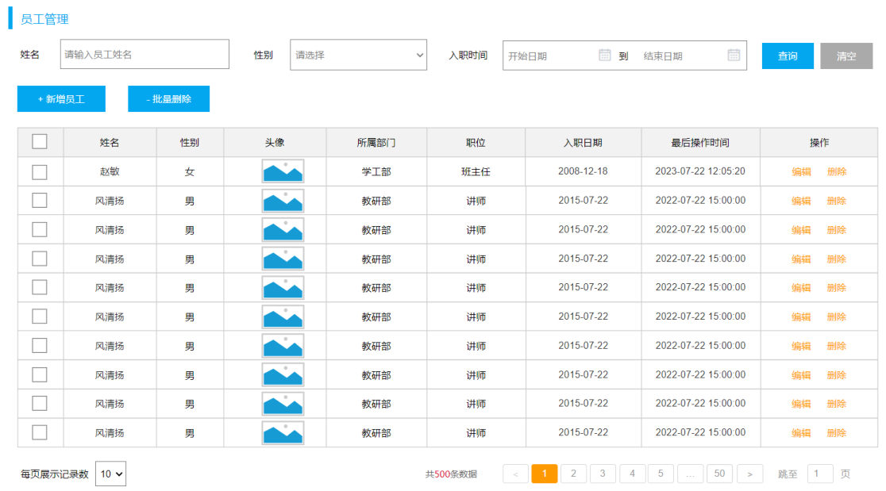
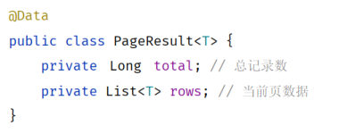

[65 篇](/posts/编程学习/javaweb学习笔记/65-多表查询/)把多表查询的 SQL 打完了（内连接、外连接、子查询）。从这一篇开始，SQL 不再是单独跑的脚本，而是要包进接口里给页面用——本章的第三部分「**员工列表查询**」（PPT 第 35-45 页）就是员工管理模块的第一个接口。

这一节的信息量比前面几篇都大：先要看懂页面要什么（需求），再把工程骨架搭好（准备工作），最后把「分页」这件事拆成前后端各自要传/要还的参数，以及 SQL 要怎么写（分页查询分析）。真正动手写代码是 [67 篇](/posts/编程学习/javaweb学习笔记/67-分页查询的两种实现方式/)的事，本篇负责把"要做什么、怎么做"想清楚。

## 员工列表查询这一节要做什么（PPT 第 35-37 页）

PPT 第 35 页是本章第三部分的目录页——本章三块内容依次是：多表关系（[64 篇](/posts/编程学习/javaweb学习笔记/64-多表关系与表设计/)）、多表查询（[65 篇](/posts/编程学习/javaweb学习笔记/65-多表查询/)）、**员工列表查询**。

进入这一部分后，第 36 页先给了一张"小节目录"，四个格子写清了本节要走的四步：

| 小节目录 | 讲什么 | 落在哪篇 |
| --- | --- | --- |
| 需求 | 页面上要显示什么、接口文档怎么规定 | 本篇 |
| 准备工作 | 表、实体类、三层基本结构 | 本篇 |
| 分页查询 | 原始方式 / PageHelper 分页插件两种实现 | [67 篇](/posts/编程学习/javaweb学习笔记/67-分页查询的两种实现方式/) |
| 条件分页查询 | 按姓名、性别、入职日期范围查 | [68 篇](/posts/编程学习/javaweb学习笔记/68-条件分页查询与动态sql/) |

第 37 页是小节封面（`03`），第 40 页又回到这张目录（此时"准备工作"已完成），第 41 页则是"分页查询"这一格的展开——里面写着 `原始方式` 和 `PageHelper 分页插件` 两个词，这正是 [67 篇](/posts/编程学习/javaweb学习笔记/67-分页查询的两种实现方式/)要讲的两种实现方式。

> [!NOTE]
> 这一节的顺序很值得留意：**先分析、再动手**。分页是前端和后端要"对暗号"的事（你传什么、我还什么），暗号对不上，代码写得再对也联调不通——所以 PPT 花了三页（第 42-44 页）只做分析、不写代码。

## 需求：查询所有员工信息，并查询出部门名称（PPT 第 38 页）

PPT 第 38 页把需求写得很短：

> 需求：查询所有员工信息，并查询出部门名称。（涉及到的表：emp、dept）

一句话里有两个关键点：

1. **"所有员工信息"**——页面上那张员工表格的每一列都要有数据；
2. **"并查询出部门名称"**——`emp` 表里只有 `dept_id`（部门 ID，一个数字），而页面上"所属部门"一列显示的是"学工部""教研部"这样的**名字**，名字存在 `dept` 表里。所以这不是单表查询，而是一条**多表查询**——[65 篇](/posts/编程学习/javaweb学习笔记/65-多表查询/)学的外连接（`left join`）在这里第一次派上真实用场。

### 页面上有哪些列（对着页面原型看）

PPT 第 38 页配的是员工管理页面的原型截图，把表格的列和数据库字段对起来看，需求就变成了"SQL 要查哪些字段"：

| 页面上的列 | 数据来自哪 |
| --- | --- |
| 姓名 | `emp.name` |
| 性别 | `emp.gender`（1 男 / 2 女，页面自己翻译成文字） |
| 头像 | `emp.image`（存的是图片地址） |
| 所属部门 | **`dept.name`**——所以要连表查，SQL 里给它起个别名 `deptName` 装进实体类 |
| 职位 | `emp.job`（1 班主任、2 讲师、3 学工主管、4 教研主管、5 咨询师） |
| 入职日期 | `emp.entry_date` |
| 最后操作时间 | `emp.update_time`——列表要按它**倒序**（最近改过的排最前） |
| 操作（编辑 / 删除） | 后面章节的接口（编辑要"查询回显 + 修改"，删除是删除接口） |
| 底部"每页展示记录数 / 共 N 条数据 / 页码" | **分页**，正是本篇第三节的内容 |

### 接口文档怎么规定（2.1 员工列表查询）

需求清楚了，接口长什么样要以**接口文档**为准。文档第 2.1 节（员工列表查询）的三段信息抄下来是：

**基本信息**：请求路径 `/emps`、请求方式 `GET`、接口描述"该接口用于员工列表数据的条件分页查询"。

**请求参数**（格式 queryString，也就是挂在 URL 问号后面的那种参数）：

| 参数名称 | 是否必须 | 示例 | 备注 |
| --- | --- | --- | --- |
| name | 否 | 张 | 姓名 |
| gender | 否 | 1 | 性别，1 男，2 女 |
| begin | 否 | 2010-01-01 | 范围匹配的开始时间（入职日期） |
| end | 否 | 2020-01-01 | 范围匹配的结束时间（入职日期） |
| page | 是 | 1 | 分页查询的页码，如果未指定，默认为 1 |
| pageSize | 是 | 10 | 分页查询的每页记录数，如果未指定，默认为 10 |

**响应数据**（`application/json`）：外面是 [57 篇](/posts/编程学习/javaweb学习笔记/57-tlias项目准备与开发规范/)定好的 `Result` 外壳（`code`/`msg`/`data`），`data` 里面只有**两个**字段——`total`（总记录数）和 `rows`（数据列表），`rows` 里的每个对象就是实体类 `Emp` 的那些属性（id、username、name、gender、image、job、salary、entryDate、deptId、**deptName**、createTime、updateTime）。

> [!IMPORTANT]
> 接口文档里的这个接口是**最终形态**：它既分页（page/pageSize）、又能按条件查（name/gender/begin/end）。本篇只做**无条件的分页列表查询**，`name`/`gender`/`begin`/`end` 这四个条件参数要到 [68 篇](/posts/编程学习/javaweb学习笔记/68-条件分页查询与动态sql/)才接进来——所以下面的分析先只管 page/pageSize 这两个参数。

## 准备工作（PPT 第 39 页）

PPT 第 39 页列了三件事，一件都不能少：

> 1. 准备数据库表 emp、emp_expr。
> 2. 准备实体类 Emp、EmpExpr。
> 3. 准备三层架构的基本代码结构：EmpController、EmpService/EmpServiceImpl、EmpMapper。

### 1. 数据库表：emp 与 emp_expr

课程资料 `05. 员工列表查询-表结构&实体类/emp & emp_expr.sql` 里给了这两张表的建表语句。**员工表 `emp`**：

| 字段 | 类型 | 说明 |
| --- | --- | --- |
| id | int unsigned | 主键、自增 |
| username | varchar(20) | 用户名，非空、唯一 |
| password | varchar(32) | 密码，默认 `123456` |
| name | varchar(10) | 姓名，非空 |
| gender | tinyint unsigned | 性别，1 男 / 2 女，非空 |
| phone | char(11) | 手机号，非空、唯一 |
| job | tinyint unsigned | 职位，1 班主任 / 2 讲师 / 3 学工主管 / 4 教研主管 / 5 咨询师 |
| salary | int unsigned | 薪资 |
| image | varchar(255) | 头像（图片地址） |
| entry_date | date | 入职日期 |
| dept_id | int unsigned | 部门 ID（关联 `dept.id`） |
| create_time | datetime | 创建时间 |
| update_time | datetime | 修改时间 |

**员工工作经历表 `emp_expr`**（新增员工时要一起存的工作经历）：

| 字段 | 类型 | 说明 |
| --- | --- | --- |
| id | int unsigned | 主键、自增 |
| emp_id | int unsigned | 员工 ID |
| begin | date | 开始时间 |
| end | date | 结束时间 |
| company | varchar(50) | 公司名称 |
| job | varchar(50) | 职位 |

> [!TIP]
> **本机实测**：`tlias` 库里导入课程脚本后，`emp` 表有 **30 条**员工数据、`dept` 表有 **6 条**部门数据（1 学工部 / 2 教研部 / 3 咨询部 / 4 就业部 / 5 人事部 / 6 行政部），`emp_expr` 暂时 0 条。这两个数字记一下——第三节算总页数、[67 篇](/posts/编程学习/javaweb学习笔记/67-分页查询的两种实现方式/)看分页日志时都要用。
>
> 建表脚本里最后一行还给 `emp` 表加了物理外键（`alter table emp add constraint fk_emp_dept_id foreign key (dept_id) references dept(id);`），这是 [64 篇](/posts/编程学习/javaweb学习笔记/64-多表关系与表设计/)讲的"建完表后添加外键"——本篇的查询不受它影响，但以后删部门、改部门 ID 时会遇到它。
>
> 数据库连接信息沿用 [57 篇](/posts/编程学习/javaweb学习笔记/57-tlias项目准备与开发规范/)工程里的 `application.yml`（`tlias` 库、用户名 `root`、`password: 1234`）——**`password` 换成你自己 MySQL 的密码**。

### 2. 实体类：Emp 与 EmpExpr

课程资料里两个实体类文件也在同一个文件夹。`Emp` 的属性与表字段一一对应，注意**最后多了一个 `deptName`**：

```java
@Data
public class Emp {
    private Integer id; //ID,主键
    private String username; //用户名
    private String password; //密码
    private String name; //姓名
    private Integer gender; //性别, 1:男, 2:女
    private String phone; //手机号
    private Integer job; //职位, 1:班主任,2:讲师,3:学工主管,4:教研主管,5:咨询师
    private Integer salary; //薪资
    private String image; //头像
    private LocalDate entryDate; //入职日期
    private Integer deptId; //关联的部门ID
    private LocalDateTime createTime; //创建时间
    private LocalDateTime updateTime; //修改时间

    //封装部门名称数
    private String deptName; //部门名称
}
```

`deptName` 在 `emp` 表里**没有**对应字段，它是为"并查询出部门名称"这个需求量身加的——SQL 查 `dept` 表的 `name` 时给它起别名 `deptName`，MyBatis 就能把这一列装进这个属性（[51 篇](/posts/编程学习/javaweb学习笔记/51-mybatis入门与辅助配置/)与 [58 篇](/posts/编程学习/javaweb学习笔记/58-部门管理-查询部门/)讲的"字段名与属性名一致就能自动封装"）。

```java
/**
 * 工作经历
 */
@Data
public class EmpExpr {
    private Integer id; //ID
    private Integer empId; //员工ID
    private LocalDate begin; //开始时间
    private LocalDate end; //结束时间
    private String company; //公司名称
    private String job; //职位
}
```

### 3. 三层基本代码结构

第三件事是把三个文件先建出来——此时它们还只是"空壳"（方法在 [67 篇](/posts/编程学习/javaweb学习笔记/67-分页查询的两种实现方式/)补），但**注解和注入关系必须先写对**，否则后面启动就是一片报错：

```java
// 控制层：com.itheima.controller.EmpController
@Slf4j
@RequestMapping("/emps")
@RestController
public class EmpController {

    @Autowired
    private EmpService empService;
}
```

```java
// 业务层接口：com.itheima.service.EmpService
public interface EmpService {
}
```

```java
// 业务层实现类：com.itheima.service.impl.EmpServiceImpl
@Service
public class EmpServiceImpl implements EmpService {

    @Autowired
    private EmpMapper empMapper;
}
```

```java
// 数据访问层：com.itheima.mapper.EmpMapper
@Mapper
public interface EmpMapper {
}
```

三点说明：

- `@RequestMapping("/emps")` 写在**类上**，后面所有员工相关的接口都挂在这个路径下（查询是 `GET /emps`，删除、修改等见后续章节）——和 [58 篇](/posts/编程学习/javaweb学习笔记/58-部门管理-查询部门/)的 `DeptController` 一个套路；
- `@RestController`（类上）、`@Service`（实现类上）、`@Mapper`（接口上）三个注解一个都不能少：少了 `@Service`，Controller 注入就会失败；少了 `@Mapper`，MyBatis 不会给接口生成实现类；
- `@Slf4j` 是 [63 篇](/posts/编程学习/javaweb学习笔记/63-日志技术/)的日志注解，本节的接口一跑起来就要用 `log.info` 打印参数。

## 分页查询-分析（PPT 第 42-44 页）

PPT 第 42-44 页连着三页只做分析（第 43、44 页内容几乎一样，第 44 页多贴了 `PageResult` 的代码），因为分页是**前端和后端配合**完成的：前端要告诉后端"我要第几页、每页几条"，后端要告诉前端"一共多少条、这一页的数据是什么"。

### 为什么要分页

先看页面上那张表长什么样——PPT 第 43 页配的就是员工管理页面，注意最下面那一行：


*图：PPT 第 43 页的员工管理页面——中间是员工表格，底部是分页条：左边"每页展示记录数 10"、中间"共 500 条数据"和页码 1~50、右边"跳至 N 页"*

分页条上的三个数字说明了分页的规则：**每页展示记录数 = 10**、**共 500 条数据**、**页码一共 50 页**。如果后端每次都把 500 条一次性查出来发给前端，会有两个问题：数据库要一次读出全部数据、网络要传一大堆用不上的行、页面也卡。所以后端每次只查**当前页的那几条**。

> [!TIP]
> **本机实测**：本机 `tlias` 库里的 `emp` 表有 30 条数据（不是页面原型里的 500 条），所以按每页 10 条算只有 **3 页**；把每页改成 5 条就是 **6 页**（30 ÷ 5 = 6）。数据量不同，但分页规则完全一样。

### 前端传递给后端的分页参数（PPT 第 43 页）

PPT 第 43 页写的是：

> 前端传递给后端的分页参数？
> - 页码：**page**
> - 每页展示记录数：**pageSize**

也就是两个参数，跟在 URL 后面（queryString）：

```text
/emps?page=1&pageSize=10
```

这和接口文档 2.1 的请求参数表对得上：`page` 不传默认第 1 页，`pageSize` 不传默认每页 10 条——**默认值写在后端**（[67 篇](/posts/编程学习/javaweb学习笔记/67-分页查询的两种实现方式/)用 `@RequestParam(defaultValue = "1")` 实现）。

### 后端给前端返回的数据（PPT 第 43-44 页）

> 后端给前端返回的数据？
> - 数据列表：**List rows**
> - 总记录数：**Long total**

为什么除了数据列表还要返回**总记录数**？因为分页条上"共 500 条数据"和"一共 50 页"这两个数字，前端自己算不出来——它只知道当前这一页的数据，必须由后端告诉它总数。

这两个值用一个专门的类装起来，PPT 第 44 页贴的就是它：


*图：PPT 第 44 页的 `PageResult<T>` 类——两个属性，`Long total`（总记录数）和 `List<T> rows`（当前页数据）*

```java
/**
 * 分页结果封装类
 */
@Data
@NoArgsConstructor
@AllArgsConstructor
public class PageResult<T> {
    private Long total; // 总记录数
    private List<T> rows; // 当前页的数据
}
```

类上用了 [58 篇](/posts/编程学习/javaweb学习笔记/58-部门管理-查询部门/)见过的三个 Lombok 注解：`@Data`（生成 getter/setter 等）、`@NoArgsConstructor`（无参构造）、`@AllArgsConstructor`（全参构造——所以业务层可以一行 `new PageResult<>(total, rows)` 把它建出来）。加 `<T>` 泛型是因为分页是通用需求：员工分页装 `Emp`，以后班级分页装 `Clazz`、学员分页装 `Student`。

接口返回时它会被塞进 `Result` 的 `data` 里，所以最终响应的形状是"`Result` 外壳 + `PageResult` 内核"：

```json
{"code":1,"msg":"success","data":{"total":30,"rows":[ 10 条员工数据 ]}}
```

> [!TIP]
> **本机实测**（`GET /emps?page=1&pageSize=10`）：响应的 `data` 里正好就是 `PageResult` 的两个字段——`total` 为 **30**（本机 emp 表 30 条），`rows` 是 **10 条**员工对象（每条里都带着 `deptName`，例如 `"deptName":"咨询部"`）。接口文档里 `data` 的字段表（`|- total`、`|- rows`）说的就是这个结构。

### 分页要用的两句 SQL（PPT 第 43-44 页）

PPT 第 43 页把两句 SQL 直接摆了出来：

```sql
-- 1. 查总记录数
select count(*) from emp e left join dept d on e.dept_id = d.id;

-- 2. 查当前页的数据列表
select e.*, d.name deptName from emp e left join dept d on e.dept_id = d.id
       order by e.update_time desc limit ?, ?;
```

三处细节：

- 两句都用了 `left join`（[65 篇](/posts/编程学习/javaweb学习笔记/65-多表查询/)的左外连接）：员工要带出部门名称，`emp` 在左、`dept` 在右；用左外连接的好处是**连"没有部门"的员工（`dept_id` 为 null）也能查出来**（本机实测 30 条里有 1 条属于这种情况）；
- 第二句里的 `d.name deptName` 是**起别名**，让查出来的列名和实体类属性 `deptName` 对上；
- `limit` 是 [48 篇](/posts/编程学习/javaweb学习笔记/48-dql排序与分页查询/)学的分页关键字，它的两个参数是"**起始索引**"和"**每页记录数**"。

**起始索引不是页码**——[48 篇](/posts/编程学习/javaweb学习笔记/48-dql排序与分页查询/)专门讲过换算公式：

> （页码 - 1）× 每页展示记录数

| 页码 page | 每页 pageSize | 起始索引 | SQL 里写成 |
| --- | --- | --- | --- |
| 1 | 10 | (1-1)×10 = **0** | `limit 0, 10` |
| 2 | 10 | (2-1)×10 = **10** | `limit 10, 10` |
| 3 | 10 | (3-1)×10 = **20** | `limit 20, 10` |
| 2 | 5 | (2-1)×5 = **5** | `limit 5, 5` |

所以后端拿到的是"第几页"，但发给数据库的必须是"从第几条开始取几条"——这一步换算，原始方式里是业务层自己算的（[67 篇](/posts/编程学习/javaweb学习笔记/67-分页查询的两种实现方式/)会看到 `Integer start = (page - 1) * pageSize;` 这行代码）。

### 总页数怎么算（PPT 第 43 页）

PPT 第 43 页用两个数字演示了总页数的算法：

> 500 条：500 / 10 = 50
> 501 条：501 / 10 = 50.1 --> 51

规则是**向上取整**：除得尽就是商，除不尽要再加一页（剩下的那 1 条也得有地方放）。所以：

- 500 ÷ 10 = 50 → **50 页**（正好排满）
- 501 ÷ 10 = 50.1 → **51 页**（最后 1 条单独占一页）

写成公式就是 `总页数 = (total + pageSize - 1) / pageSize`（整数除法，效果等同向上取整）——比如 (501 + 10 - 1) / 10 = 51。

> [!TIP]
> **本机实测**：`emp` 表 30 条数据，按 PPT 的规则算——每页 10 条是 `30 / 10 = 3` 页（正好排满），每页 5 条是 `30 / 5 = 6` 页；如果总数是 31 条、每页 10 条，那就是 3.1 → **4 页**。这也解释了为什么后端返回的 `total` 是前端算页码的前提：前端拿到 `total` 和 `pageSize` 才能画出页码条。

## 必答问答（PPT 第 45 页）

| PPT 的问题 | 答案 |
| --- | --- |
| 分页查询前端需要给后端传递的参数？ | **`page`**（当前页码）、**`pageSize`**（每页展示记录数）——跟在 URL 后面，如 `/emps?page=1&pageSize=10`；不传时用后端的默认值（1 和 10） |
| 分页查询后端需要给前端返回的结果？ | **`total`**（总记录数）、**`rows`**（结果列表）——两个值封装进 `PageResult<T>`，再套进 `Result` 的 `data` 里返回 |

## 小结

| 问题 | 答案 |
| --- | --- |
| 本节的需求是什么？ | 查询所有员工信息，并查询出部门名称（涉及 `emp`、`dept` 两张表，用左外连接） |
| 页面上的"所属部门"从哪来？ | `dept.name`——SQL 里起别名 `deptName`，装进实体类 `Emp` 的 `deptName` 属性 |
| 接口是什么？ | `GET /emps`，queryString 传参；最终形态是条件分页查询（`name`/`gender`/`begin`/`end`/`page`/`pageSize`），本篇先做无条件的 |
| 准备工作三件事？ | 表（`emp`、`emp_expr`）、实体类（`Emp`、`EmpExpr`）、三层基本结构（`EmpController`、`EmpService`/`EmpServiceImpl`、`EmpMapper`） |
| 前端传什么？ | `page`（页码，默认 1）、`pageSize`（每页记录数，默认 10） |
| 后端返回什么？ | `total`（总记录数）、`rows`（当前页数据）→ `PageResult<T>` → `Result.data` |
| 分页要用哪两句 SQL？ | `select count(*) …` 查总数；`select … order by e.update_time desc limit ?, ?` 查当前页数据 |
| `limit` 的两个参数是什么？ | 起始索引、每页记录数；起始索引 =（页码 - 1）× 每页记录数（[48 篇](/posts/编程学习/javaweb学习笔记/48-dql排序与分页查询/)的公式） |
| 总页数怎么算？ | 向上取整：500÷10 = 50 页；501÷10 = 50.1 → **51 页**；本机实测 30 条、每页 5 条 = 6 页 |
| 为什么列表要按 `update_time` 倒序？ | 页面上的"最后操作时间"列——最近操作过的员工排在最前面 |

## 相关

- [上一篇：多表查询](/posts/编程学习/javaweb学习笔记/65-多表查询/)
- [下一篇：分页查询的两种实现方式](/posts/编程学习/javaweb学习笔记/67-分页查询的两种实现方式/)

## 练习题

### 一、知识回顾（读完直接做下面的实践题）

1. **需求**：查询所有员工信息，并查询出部门名称——涉及 `emp`、`dept` 两张表，所以要写成一条多表查询（`left join`）
2. **页面列与字段**：姓名 `name`、性别 `gender`、头像 `image`、所属部门 `dept.name`（要连表）、职位 `job`、入职日期 `entry_date`、最后操作时间 `update_time`（列表按它**倒序**）
3. **接口**：`GET /emps`，queryString 传参；最终形态的参数是 `name`/`gender`/`begin`/`end`/`page`/`pageSize`（本篇只做无条件的 `page`/`pageSize`）
4. **前端传什么**：`page`（页码，默认 1）、`pageSize`（每页展示记录数，默认 10）；请求样例 `/emps?page=1&pageSize=10`
5. **后端返回什么**：`total`（总记录数）、`rows`（当前页数据列表）——封装成 `PageResult<T>`，套进 `Result` 的 `data` 返回
6. **两句 SQL**：`select count(*) from emp e left join dept d on e.dept_id = d.id` 查总数；`select e.*, d.name deptName from emp e left join dept d on e.dept_id = d.id order by e.update_time desc limit ?, ?` 查当前页数据
7. **limit 的两个参数**：起始索引、每页记录数；起始索引 =（页码 - 1）× 每页记录数（第 2 页、每页 10 条 → `limit 10, 10`）
8. **总页数**：向上取整——500÷10 = 50 页；501÷10 = 50.1 → **51 页**；本机实测 emp 30 条、每页 5 条 = **6 页**
9. **准备工作三件事**：表（`emp`、`emp_expr`）、实体类（`Emp`、`EmpExpr`）、三层基本结构（`EmpController`、`EmpService`/`EmpServiceImpl`、`EmpMapper`）
10. **本机实测的响应形状**：`{"code":1,"msg":"success","data":{"total":30,"rows":[10 条员工数据]}}`——`total` 是 30（emp 表 30 条），`rows` 里每条都带 `deptName`

### 二、裸写题

- [ ] **2-1 写出分页要用的两句 SQL**
  需求：员工列表要做分页，后端需要两条 SQL——一条算出"一共有多少条员工"（要连出部门名称的表），另一条取"第 N 页的那几条"（同样连出部门名称、按最后修改时间从晚到早排）。请把这两条 SQL 写出来，并说明第二条 SQL 最后那个分页关键字后面的两个参数分别是什么。
  （练习文件 `test_66_分页参数与SQL.sql` 的题目2-1、2-2 里给了写作区。）

  > [!TIP]- 提示（先自己想，实在想不出再点开）
  > **一级 · 思路**：一条"数数"、一条"取一段"；两条都要把 `emp` 和 `dept` 连起来（左外连接），第二条还要先排序再取
  > **二级 · 方法**：数数用聚合函数 `count(*)`；取一段用 `limit 起始索引, 每页记录数`（[48 篇](/posts/编程学习/javaweb学习笔记/48-dql排序与分页查询/)）；连表用 `left join … on …`；部门名称用 `d.name deptName` 起别名；排序用 `order by e.update_time desc`
  > **三级 · 骨架**：`select count(*) from emp e ____ join dept d on e.dept_id = d.id` ＋ `select e.*, d.name ____ from emp e left join dept d on e.dept_id = d.id order by ____ desc ____ ?, ?`

  > [!TIP]- 参考答案（做完再点开）
  > ```sql
  > -- 1. 查总记录数
  > select count(*) from emp e left join dept d on e.dept_id = d.id;
  >
  > -- 2. 查当前页的数据列表（limit 的两个参数：起始索引、每页记录数）
  > select e.*, d.name deptName from emp e left join dept d on e.dept_id = d.id
  >        order by e.update_time desc limit ?, ?;
  > ```
  > 说明：两条 SQL 的**表连接部分完全一样**（只是第二条多查了 `d.name deptName` 并排序、分页），所以将来加查询条件时，两边的条件也要保持一致——[67 篇](/posts/编程学习/javaweb学习笔记/67-分页查询的两种实现方式/)会看到 PageHelper 是怎么把"两条"合并成"一条"的。`limit` 的两个参数依次是**起始索引**和**每页记录数**，起始索引 =（页码 - 1）× 每页记录数：第 1 页、每页 10 条 → `limit 0, 10`；第 2 页 → `limit 10, 10`。用 `left join` 而不是 `inner join` 是因为本机 30 条数据里有 1 条员工没有部门（`dept_id` 为 null），左外连接才查得出来。

- [ ] **2-2 算起始索引和总页数**
  需求：后端收到的是"第几页、每页几条"，但发给数据库的必须是"从第几条开始取"。请算出下面几种情况 SQL 里该写的起始索引，并算出分页条上一共几页：
  ① 第 3 页、每页 10 条 → 起始索引是多少？
  ② 第 2 页、每页 5 条 → 起始索引是多少？
  ③ 一共 500 条、每页 10 条 → 几页？
  ④ 一共 501 条、每页 10 条 → 几页？
  ⑤ 本机 `tlias` 库 `emp` 表 30 条、每页 5 条 → 几页？
  （练习文件 `test_66_分页参数与SQL.sql` 的题目2-3 里给了写作区。）

  > [!TIP]- 提示（先自己想，实在想不出再点开）
  > **一级 · 思路**：起始索引问的是"前面已经翻过去多少条"；总页数问的是"每页装 N 条，一共要几个盒子才装得下"——装不满的最后一页也要占一个盒子
  > **二级 · 方法**：起始索引 =（页码 - 1）× 每页记录数；总页数 = `total` ÷ `pageSize` 后**向上取整**（除不尽要加一页）
  > **三级 · 骨架**：① (3 - 1) × 10 = ____；② (2 - 1) × 5 = ____；③ 500 ÷ 10 = ____ 页；④ 501 ÷ 10 = 50.1 → ____ 页；⑤ 30 ÷ 5 = ____ 页

  > [!TIP]- 参考答案（做完再点开）
  > ① 第 3 页、每页 10 条 → (3-1)×10 = **20** → `limit 20, 10`
  > ② 第 2 页、每页 5 条 → (2-1)×5 = **5** → `limit 5, 5`
  > ③ 500 ÷ 10 = 50 → **50 页**（正好排满）
  > ④ 501 ÷ 10 = 50.1 → **51 页**（最后 1 条单独占一页，所以向上取整）
  > ⑤ 30 ÷ 5 = **6 页**
  > 说明：**本机实测**的第 2 页、每页 5 条那次请求，服务端日志里就是 `LIMIT ?, ?` 参数为 `5, 5`——和 ② 的算法一致；这也正是原始方式里业务层那行 `Integer start = (page - 1) * pageSize;` 的来历（[67 篇](/posts/编程学习/javaweb学习笔记/67-分页查询的两种实现方式/)）。总页数由**前端**根据后端返回的 `total` 和 `pageSize` 算出来画分页条，所以后端必须把 `total` 一起返回。

- [ ] **2-3 写分页结果封装类**
  需求：分页查询的返回结果里要有两样东西——"一共有多少条记录"和"当前这一页的数据列表"。请写一个能装下这两样东西的类，要求：数据列表能装任意类型（员工、班级、学员都行）、能被 Lombok 生成 getter/setter、能一行 `new` 出来。
  （练习文件 `test_66_分页结果与三层结构.java` 的题目2-4 里给了写作区。）

  > [!TIP]- 提示（先自己想，实在想不出再点开）
  > **一级 · 思路**：两个属性 + 一个泛型参数；"能一行 new 出来"靠全参构造
  > **二级 · 方法**：类名 `PageResult<T>`；总数用 `Long`（叫 `total`）、列表用 `List<T>`（叫 `rows`）；类上标 `@Data`、`@NoArgsConstructor`、`@AllArgsConstructor`
  > **三级 · 骨架**：`@Data @NoArgsConstructor @AllArgsConstructor public class PageResult<____> { private ____ total; private ____ rows; }`

  > [!TIP]- 参考答案（做完再点开）
  > ```java
  > /**
  >  * 分页结果封装类
  >  */
  > @Data
  > @NoArgsConstructor
  > @AllArgsConstructor
  > public class PageResult<T> {
  >     private Long total; // 总记录数
  >     private List<T> rows; // 当前页的数据
  > }
  > ```
  > 说明：属性名必须叫 `total` 和 `rows`——接口文档里 `data` 的字段就是这两个名字，前端照着取值，名字改了前端就取不到。加泛型 `<T>` 是为了通用：员工分页是 `PageResult<Emp>`、班级分页是 `PageResult<Clazz>`。`@AllArgsConstructor` 让业务层能直接 `new PageResult<>(total, empList)`（[67 篇](/posts/编程学习/javaweb学习笔记/67-分页查询的两种实现方式/)的两种实现方式都这么写）。**本机实测**的响应里 `data` 正是 `{"total":30,"rows":[…]}` 这个形状。

- [ ] **2-4 把员工管理模块的三层基本结构搭起来**
  需求：为员工管理模块准备三层的"空壳"（先不写查询方法）：一个控制层类（以后所有员工接口都挂在 `/emps` 下）、一个业务层接口和它的实现类、一个数据访问层接口。要求 Spring 启动时能扫描到它们、控制层能注入业务层、业务层实现类能注入数据访问层。
  （练习文件 `test_66_分页结果与三层结构.java` 的题目2-5 里给了写作区。）

  > [!TIP]- 提示（先自己想，实在想不出再点开）
  > **一级 · 思路**：四个文件（控制类、业务接口、业务实现类、数据访问接口），靠三个注解交给 Spring，靠 `@Autowired` 串起来
  > **二级 · 方法**：控制类用 `@RestController` + `@RequestMapping("/emps")`（路径写在类上）+ `@Slf4j`；业务实现类用 `@Service`；数据访问接口用 `@Mapper`
  > **三级 · 骨架**：`@Slf4j @RequestMapping("/emps") @RestController public class EmpController { @Autowired private EmpService ____; }` ＋ `public interface EmpService {}` ＋ `@Service public class EmpServiceImpl implements EmpService { @Autowired private EmpMapper ____; }` ＋ `@Mapper public interface EmpMapper {}`

  > [!TIP]- 参考答案（做完再点开）
  > ```java
  > // 控制层
  > @Slf4j
  > @RequestMapping("/emps")
  > @RestController
  > public class EmpController {
  >
  >     @Autowired
  >     private EmpService empService;
  > }
  > ```
  > ```java
  > // 业务层接口
  > public interface EmpService {
  > }
  > ```
  > ```java
  > // 业务层实现类
  > @Service
  > public class EmpServiceImpl implements EmpService {
  >
  >     @Autowired
  >     private EmpMapper empMapper;
  > }
  > ```
  > ```java
  > // 数据访问层
  > @Mapper
  > public interface EmpMapper {
  > }
  > ```
  > 说明：`@RequestMapping("/emps")` 写在类上之后，类里的每个方法路径都是 `/emps` 开头的（[58 篇](/posts/编程学习/javaweb学习笔记/58-部门管理-查询部门/)讲过 `DeptController` 也是这么写的）；接口文档里员工相关的接口全是 `/emps` 打头，正好对上。这几个文件此时是空壳——**方法留到 [67 篇](/posts/编程学习/javaweb学习笔记/67-分页查询的两种实现方式/)再补**，先把注入关系理顺，后面加方法才不会东拼西凑。

### 三、综合题

- [ ] **3-1 从零准备员工列表查询的工程骨架，并回答分页的两个问题**
  这一题照着 PPT 第 38-44 页把"准备工作 + 分页分析"走一遍，全程对着接口文档和表结构做，不要抄现成代码。
  1. 准备数据库：在 `tlias` 库里建 `emp`、`emp_expr` 两张表（字段见练习文件素材），导入课程脚本里的 30 条员工数据、6 条部门数据；
  2. 写实体类：`Emp`（按 `emp` 表字段写，别忘了多一个 `deptName` 属性）和 `EmpExpr`（按 `emp_expr` 表写）；
  3. 搭三层骨架：控制层类（挂在 `/emps` 下）、业务层接口 + 实现类、数据访问层接口，四个文件互相注入；
  4. 写分页结果封装类：装"总记录数 + 当前页数据"，两个属性名要和接口文档 `data` 里的字段一致；
  5. 在 `emp` 表上验证两句 SQL：一条数总数、一条取第 2 页（每页 5 条）的数据，把结果条数记下来；
  6. 回答两个问题：
     - 前端要传什么参数？后端要返回什么？分别叫什么名字、什么含义？
     - 如果 `emp` 表里有 501 条数据、每页 10 条，分页条上一共几页？为什么不是 50 页？

  **涉及知识点**

  | 知识点 | 在这里的应用 |
  | --- | --- |
  | 多表查询（左外连接） | 第 1、5 步——员工要带出部门名称，两句 SQL 都要连 `dept` |
  | 实体类与数据封装 | 第 2 步——`deptName` 是查出来"多出来"的属性，靠别名 + 驼峰开关对上 |
  | 三层架构 | 第 3 步——控制/业务/数据访问各写各的，靠注入串起来 |
  | 接口文档 | 第 4、6 步——参数名、返回字段名照文档来 |
  | limit 分页与页码换算 | 第 5、6 步——起始索引 =（页码-1）×每页记录数；总页数向上取整 |

  > [!TIP]- 提示（先自己想，实在想不出再点开）
  > **一级 · 思路**：从页面倒推——页面要哪几列 → 表要哪几张 → 实体类要哪些属性 → SQL 写什么 → 接口传什么还什么；最后用 SQL 亲手验证一遍分页
  > **二级 · 方法**：建表用 `int unsigned primary key auto_increment` / `varchar(10) not null` / `date` / `datetime`；实体类用 `@Data` + `LocalDate`/`LocalDateTime`；三层用 `@RestController`+`@RequestMapping` / `@Service` / `@Mapper`；分页 SQL 用 `count(*)` 与 `limit 起始索引, 每页记录数`
  > **三级 · 骨架**：`Emp`（13 个表字段 + `deptName`）→ `EmpMapper`（空）→ `EmpServiceImpl`（空）→ `EmpController`（`@RequestMapping("/emps")`）；SQL：`select count(*) from emp e left join dept d on e.dept_id = d.id` 与 `select e.*, d.name deptName from emp e left join dept d on e.dept_id = d.id order by e.update_time desc limit 5, 5`

  > [!TIP]- 参考答案（做完再点开）
  > **1. 建表**（照课程资料 `emp & emp_expr.sql`，此处节选 `emp` 的关键字段）：
  >    ```sql
  >    create table emp(
  >        id int unsigned primary key auto_increment comment 'ID,主键',
  >        username varchar(20) not null unique comment '用户名',
  >        password varchar(32) default '123456' comment '密码',
  >        name varchar(10) not null comment '姓名',
  >        gender tinyint unsigned not null comment '性别, 1:男, 2:女',
  >        phone char(11) not null unique comment '手机号',
  >        job tinyint unsigned comment '职位, 1 班主任, 2 讲师 , 3 学工主管, 4 教研主管, 5 咨询师',
  >        salary int unsigned comment '薪资',
  >        image varchar(255) comment '头像',
  >        entry_date date comment '入职日期',
  >        dept_id int unsigned comment '部门ID',
  >        create_time datetime comment '创建时间',
  >        update_time datetime comment '修改时间'
  >    ) comment '员工表';
  >    ```
  >    （`emp_expr` 表照素材里的字段建；数据用课程脚本的 insert 语句导入。）
  > **2. 实体类**：`Emp` 的 13 个属性与表字段一一对应（`entryDate` 用 `LocalDate`，两个时间用 `LocalDateTime`），**再加一个 `private String deptName;`**；`EmpExpr` 六个属性。
  > **3. 三层骨架**：与 2-4 的参考答案完全一致（`EmpController` / `EmpService` / `EmpServiceImpl` / `EmpMapper`）。
  > **4. PageResult**：与 2-3 的参考答案一致（`Long total` + `List<T> rows`，三个 Lombok 注解）。
  > **5. 两句 SQL 的验证**（本机 `tlias` 库、30 条数据）：
  >    ```sql
  >    select count(*) from emp e left join dept d on e.dept_id = d.id;   -- 30
  >    select e.*, d.name deptName from emp e left join dept d on e.dept_id = d.id
  >           order by e.update_time desc limit 5, 5;                     -- 5 条（第 2 页）
  >    ```
  >    第一条返回 **30**；第二条返回 **5 条**——注意它和"无条件全查"的结果不同：排序不同（按 `update_time` 倒序）、条数不同（只取了 5 条）。
  > **6. 两个问题的答案**：
  >    - 前端传 `page`（当前页码，默认 1）和 `pageSize`（每页展示记录数，默认 10）；后端返回 `total`（总记录数）和 `rows`（当前页数据列表）——本机实测的响应就是 `{"code":1,"msg":"success","data":{"total":30,"rows":[…]}}`。
  >    - 501 条、每页 10 条 → **51 页**：501 ÷ 10 = 50.1，前 50 页装掉 500 条，剩下的 1 条还要占一页，所以总页数要**向上取整**。
