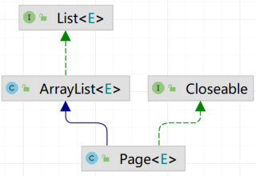
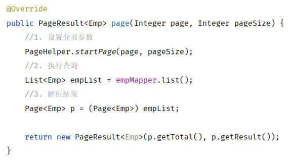
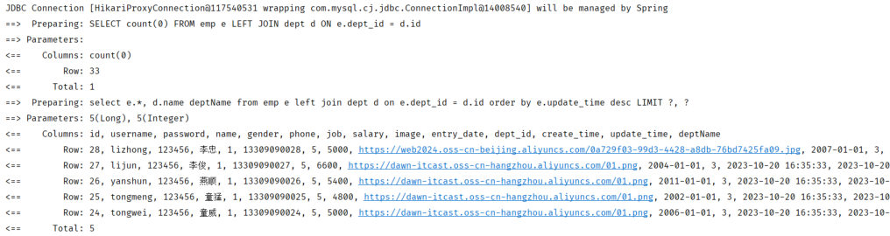

[66 篇](/posts/编程学习/javaweb学习笔记/66-员工列表查询与分页分析/)把分页"要传什么、要还什么、SQL 长什么样"分析清楚了，这一篇（PPT 第 46-53 页）动手写代码。PPT 把分页查询分成了两条路：

| 实现方式 | 一句话 | 对应 PPT 页 |
| --- | --- | --- |
| **原始方式** | 自己写 count 的 SQL、自己算起始索引、自己在 SQL 里写 limit | 46-48 |
| **PageHelper 分页插件** | 引一个插件，业务层加一行，count 和 limit 都由它自动生成 | 50-53 |

PPT 第 46 页是"原始方式"的小节封面，第 49 页是"分页查询"这一格的目录页（`原始方式` / `PageHelper 分页插件` 两个词）——顺序也说明了学习顺序：**先把原始方式写明白，才知道 PageHelper 到底替我们省了什么**。

## 原始方式：三层各自干什么（PPT 第 47 页）

PPT 第 47 页先不写代码，而是把分页查询拆到三层上，并且直接把请求样例写在旁边：`/emps?page=1&pageSize=10`。

| 层 | 职责（PPT 原文） |
| --- | --- |
| **Controller** | 接收参数（分页）；调用 Service 进行分页查询、获取 `PageResult`；响应结果 |
| **Service** | 调用 Mapper 接口查询**总记录数**；调用 Mapper 接口查询**结果列表**；封装 `PageResult` 对象并返回 |
| **Mapper** | 两条 SQL：① `select count(*) ...` ② `select ... limit ...` |

对照 [66 篇](/posts/编程学习/javaweb学习笔记/66-员工列表查询与分页分析/)的分析结果，这张表其实就是把"前端传 page/pageSize → 后端返回 total/rows"翻译成代码分工：

- **Controller** 负责和外界打交道（把 URL 上的 `page`、`pageSize` 收下来）；
- **Service** 负责业务逻辑（查两次、算起始索引、拼 `PageResult`）；
- **Mapper** 只负责两条 SQL。

注意 Service 那一行"调用 Mapper 接口查询总记录数"——**分页查询要调两次 Mapper**，这是原始方式最明显的特征。

## 原始方式：三层代码（PPT 第 48 页）

PPT 第 48 页把三层代码一起给了出来。一层一层看。

**Controller：接收分页参数**

```java
@GetMapping
public Result page(@RequestParam(defaultValue = "1") Integer page,
                   @RequestParam(defaultValue = "10") Integer pageSize) {
    log.info("分页请求参数： {}, {}", page, pageSize);
    PageResult<Emp> pageResult = empService.page(page, pageSize);
    return Result.success(pageResult);
}
```

PPT 在这一页的角落里专门提了一句：

> 通过 `@RequestParam` 注解的 **`defaultValue`** 属性可以设置参数的默认值。

这就是"不传 `page` 就是第 1 页、不传 `pageSize` 就是每页 10 条"的实现方式——接口文档里 `page`/`pageSize` 的默认值（1 和 10）就落在这两行上。另外 `log.info("分页请求参数： {}, {}", page, pageSize)` 是 [63 篇](/posts/编程学习/javaweb学习笔记/63-日志技术/)的日志写法：`{}` 是占位符，两个 `{}` 按顺序被 `page`、`pageSize` 替换——联调时第一眼就看这行日志，能立刻确认"参数到底传没传进来"。

**Service：查两次、算一次、封装一次**

```java
@Override
public PageResult<Emp> page(Integer page, Integer pageSize) {
    //1. 获取总记录数 total
    Long total = empMapper.count();

    //2. 获取分页查询结果列表 rows
    //2.1 计算起始索引
    Integer start = (page - 1) * pageSize;
    //2.2 执行查询
    List<Emp> empList = empMapper.list(start, pageSize);

    //3. 封装分页结果
    return new PageResult<>(total, empList);
}
```

三件事，正好对应 [66 篇](/posts/编程学习/javaweb学习笔记/66-员工列表查询与分页分析/)的两句 SQL 加一个换算公式：

1. 调 `count()` 拿总记录数（对应 `select count(*) …`）；
2. 用 `(page - 1) * pageSize` 把**页码**换算成 **起始索引**（[48 篇](/posts/编程学习/javaweb学习笔记/48-dql排序与分页查询/)的公式），再调 `list(start, pageSize)` 拿当前页数据（对应带 `limit` 的那句 SQL）；
3. `new PageResult<>(total, empList)` 把两个值装起来（[66 篇](/posts/编程学习/javaweb学习笔记/66-员工列表查询与分页分析/)写的 `@AllArgsConstructor` 就是为这一行准备的）。

**Mapper：两条 SQL**

```java
@Mapper
public interface EmpMapper {

    /**
     * 查询员工信息
     */
    @Select("select emp.*, dept.name as dept_name from emp left join dept on emp.dept_id = dept.id limit #{start},#{pageSize}")
    public List<Emp> list(Integer start, Integer pageSize);

    /**
     * 获取符合条件的总记录数
     */
    @Select("select count(*) from emp left join dept on emp.dept_id = dept.id")
    Long count();
}
```

两点：

- `list` 方法的 SQL 里**自己写了 `limit #{start},#{pageSize}`**，所以方法要传两个参数（起始索引、每页记录数）；
- `dept.name as dept_name` 用的是"下划线"别名——[58 篇](/posts/编程学习/javaweb学习笔记/58-部门管理-查询部门/)讲过，只要 yml 里开着驼峰开关（`map-underscore-to-camel-case: true`），`dept_name` 就能自动装进 `Emp` 的 `deptName` 属性。（课程最终版改成了直接起 `deptName` 别名，效果一样。）

> [!TIP]
> **本机实测**（原始分页版工程，请求第 2 页、每页 5 条）——服务端日志里就是两条 SQL，和 PPT 的职责表完全对上：
>
> ```text
> ==>  Preparing: select count(*) from emp left join dept on emp.dept_id = dept.id
> ==>  Preparing: select emp.*, dept.name as dept_name from emp left join dept on emp.dept_id = dept.id limit ?,?
> ==>  Parameters: 5(Integer), 5(Integer)
> ```
>
> 三点值得记：① 第一条 `select count(*)` 就是 `count()` 方法，**是自己写的**；② 第二条末尾的 `limit ?,?` 是**SQL 里手写的**；③ `Parameters: 5(Integer), 5(Integer)` 里的第一个 `5` 是**起始索引**，由 Service 那行 `(2 - 1) * 5 = 5` 算出来——日志里看到的这个 5，就是"页码换起始索引"这一步的物证。

### 原始方式的"三处手工"

把代码和 [66 篇](/posts/编程学习/javaweb学习笔记/66-员工列表查询与分页分析/)的分析对照，会发现分页这件事被拆成了三段，**每一段都要自己写**：

| 手工点 | 写在哪 | 具体是什么 |
| --- | --- | --- |
| ① 总数要自己查 | Mapper | 额外写一个 `count()` 方法 + `select count(*) …` 语句 |
| ② 起始索引要自己算 | Service | `Integer start = (page - 1) * pageSize;` |
| ③ 分页要自己拼 | Mapper | SQL 结尾手写 `limit #{start},#{pageSize}` |

写一次两次还行，但员工、班级、学员、日志……每个分页接口都要把这三件事重复一遍。这就是 PageHelper 要解决的问题。

## PageHelper 是什么（PPT 第 50 页）

PPT 第 50 页的定义：

> **PageHelper 是第三方提供的在 Mybatis 框架中用来实现分页的插件**，用来简化分页操作，提高开发效率。

"插件"这个词意味着：它**不用改 MyBatis 本身**，只要把它加进依赖，它就能"挂"在 MyBatis 执行 SQL 的流程里干活。PPT 把原始方式和 PageHelper 的代码并排放在一起，对比非常直观：

| 层 | 原始方式 | PageHelper |
| --- | --- | --- |
| **Mapper** | 两个方法：`count()` + `list(start, pageSize)`（SQL 里带 `limit`） | **一个方法**：`list()`（SQL 里**不带分页**，就是一条普通的条件查询） |
| **Service** | `count()` → 算 `start` → `list(start, pageSize)` → `new PageResult(total, empList)` | `PageHelper.startPage(page, pageSize)` → `list()` → 解析结果 |

也就是说，**分页的痕迹从 Mapper 里消失了**：数据访问层只写"查员工数据"这一件事，分页参数从业务层"临时加"进去。

## PageHelper 的三步用法（PPT 第 51 页）

PPT 第 51 页把用法拆成三步。

**① pom.xml 引依赖**

```xml
<!-- 分页插件PageHelper -->
<dependency>
    <groupId>com.github.pagehelper</groupId>
    <artifactId>pagehelper-spring-boot-starter</artifactId>
    <version>1.4.7</version>
</dependency>
```

三个坐标值要记准：`com.github.pagehelper` / `pagehelper-spring-boot-starter` / `1.4.7`（课程工程用的就是 1.4.7）。用 starter 而不是裸的 `pagehelper`，是因为它带了 Spring Boot 的自动配置——加完依赖直接就能用，不用再写配置类。

**② Mapper：写一个"不带分页"的查询方法**

```java
/**
 * 查询员工信息
 */
@Select("select emp.*, dept.name as dept_name from emp left join dept on emp.dept_id = dept.id")
public List<Emp> list();
```

对比原始方式的 `list(Integer start, Integer pageSize)`：**参数没了，SQL 末尾的 `limit` 也没了**，方法变成一条"查全部员工（带部门名称）"的普通查询。

**③ Service：设置分页参数、调用、解析结果**

```java
@Override
public PageResult<Emp> page(Integer page, Integer pageSize) {
    //1. 设置分页参数
    PageHelper.startPage(page, pageSize);

    //2. 执行查询
    List<Emp> empList = empMapper.list();

    //3. 解析查询结果，并封装
    Page<Emp> p = (Page<Emp>) empList;
    return new PageResult<>(p.getTotal(), p.getResult());
}
```

第 3 步的两行是初学者最容易懵的地方，PPT 第 51 页配的那张图正好解释了原因：


*图：PPT 第 51 页的类关系图——`Page<E>` 继承 `ArrayList<E>`、`ArrayList<E>` 实现 `List<E>`，所以 Mapper 返回的 `List<Emp>` 实际上就是一个 `Page<Emp>`，可以强转*

- **为什么能强转**：`PageHelper.startPage(...)` 之后的**第一条查询**，MyBatis 返回的 `List` 并不是普通的 `ArrayList`，而是 PageHelper 的 `Page` 对象（它继承 `ArrayList`，所以是 `List` 的"子类"）——向上转型没问题，转回来（强转）也没问题；
- **强转之后多了什么**：`Page` 上额外带了分页信息，代码里用到两个方法——`p.getTotal()` 拿**总记录数**（等价于原始方式里 `count()` 查出来的值），`p.getResult()` 拿**当前页的数据列表**（等价于原始方式里 `list(start, pageSize)` 的结果）。

所以 `new PageResult<>(p.getTotal(), p.getResult())` 这一行，干的就是原始方式里"总数 + 列表"两件事——只不过两个值都不用自己查了。

## PageHelper 的实现机制（PPT 第 52-53 页）

PPT 第 52 页把机制画成了一张流程：Mapper 里写的那条"不带分页"的 SQL，交给 PageHelper 之后变成了两句——`count(0)` 和带 `limit` 的查询，分别产出"总记录数"和"数据列表"，最后封装成 `Page<Emp>` 返回。


*图：PPT 第 52 页的 Service 代码——`PageHelper.startPage(page, pageSize)` 在调用 Mapper **之前**执行，查询回来的 `List` 被强转成 `Page<Emp>` 取出 `total` 与当前页数据*

也就是说，**原始方式里的"三处手工"，PageHelper 全接管了**：它自动生成一条 `select count(0) …` 查总数、自动给原 SQL 拼上 `limit` 取当前页。


*图：PPT 第 52 页贴出的真实日志——第一条 `SELECT count(0)` 拿到总数（`Total: 1`），第二条原 SQL 末尾被加上了 `LIMIT ?, ?`（参数 `5, 5`）拿到 5 行数据*

这张日志图不是示意图，**本机实测跑出来的一模一样**。下面把三次请求的日志并排放：

```text
# ① 带日期条件（/emps?begin=2007-09-01&end=2022-09-01&page=1&pageSize=5）
==>  Preparing: SELECT count(0) FROM emp e LEFT JOIN dept d ON e.dept_id = d.id WHERE e.entry_date BETWEEN ? AND ?
==>  Preparing: select e.*, d.name deptName from emp e left join dept d on e.dept_id = d.id
                 WHERE e.entry_date between ? and ? order by e.update_time desc LIMIT ?

# ② 带姓名 + 性别条件（/emps?name=李&gender=1&page=1&pageSize=5）
==>  Preparing: SELECT count(0) FROM emp e LEFT JOIN dept d ON e.dept_id = d.id WHERE e.name LIKE concat('%', ?, '%') AND e.gender = ?
==>  Preparing: select e.*, d.name deptName from emp e left join dept d on e.dept_id = d.id
                 WHERE e.name like concat('%', ?, '%') and e.gender = ? order by e.update_time desc LIMIT ?

# ③ 不带任何条件、翻到第 2 页（/emps?page=2&pageSize=5）
==>  Preparing: SELECT count(0) FROM emp e LEFT JOIN dept d ON e.dept_id = d.id
==>  Preparing: select e.*, d.name deptName from emp e left join dept d on e.dept_id = d.id
                 order by e.update_time desc LIMIT ?, ?
```

对着日志能读出四件事：

1. **每次请求都是"两条 SQL"**：一条 `SELECT count(0) …` 拿总数、一条原 SQL 加 `LIMIT` 拿当前页数据——Mapper 里明明只写了一条 SQL，PageHelper 把它变成了两条；
2. **`count(0)` 是它自动生成的**（原始方式里我们自己写的是 `count(*)`）——两者作用一样，都是数行数，看到 `count(0)` 不要以为写错了；
3. **`count(0)` 的条件和原 SQL 的条件一致**：第 ① 组的 `WHERE e.entry_date BETWEEN ? AND ?`、第 ② 组的 `WHERE e.name LIKE … AND e.gender = ?`——总数必须是"符合条件的总数"，不然页码会算错；
4. **翻页靠 `LIMIT` 的参数**：第 ③ 组（第 2 页、每页 5 条）的 `LIMIT ?, ?` 参数就是 `5, 5`——和原始方式里 Service 算出来的起始索引一模一样，只是这次不用自己算。

> [!TIP]
> **本机实测**的三次请求响应也对得上：无条件、每页 10 条时 `data` 是 `{"total":30,"rows":[10 条]}`；带日期条件时 `total` 变成 **20**、`rows` 5 条；第 2 页、每页 5 条时 `total` 还是 30、`rows` 从 `id=30` 那条开始（列表按 `update_time desc` 排，最新的排最前）。**`total` 永远是"符合条件的总数"，与当前是第几页无关**——这也是分页条能正确画出来的前提。

### 两条注意事项（PPT 第 53 页）

PPT 第 53 页在日志下面单独列了两条，都是会真出错的地方：

> [!WARNING]
> **① SQL 语句结尾不要加分号（`;`）**
>
> 分号是"这条 SQL 说完了"的意思，而 PageHelper 要在原 SQL **后面继续拼 `limit`**——结尾带着分号，拼出来就是 `… ; LIMIT ?` 这种语法不合法的 SQL，查询直接失败。原始方式里 `limit` 是自己写在末尾的，加不加分号"看起来没事"，所以从原始方式切到 PageHelper 时，很容易把分号一起带过来。
>
> **② PageHelper 只会对紧跟在其后的第一条 SQL 语句进行分页处理**
>
> `PageHelper.startPage(page, pageSize)` 并不是立刻去查数据库，它只是把"分页参数"**暂存**起来，等**紧接着执行的第一条查询**来认领——这条查询用掉参数后，暂存的分页信息就没了。所以：
>
> ```java
> PageHelper.startPage(page, pageSize);
> List<Emp> empList = empMapper.list();   // ✅ 分页参数被这条查询用掉了
> ```
>
> 中间如果插了别的查询（比如先查一次部门列表、或者先调了别的方法），分页参数就会被那条"插队"的 SQL 用掉，真正想分页的查询反而变成全量查询——而且不会报错，只是数据不对，特别难查。**规则很简单：`startPage` 后面第一行就调用要分页的那个 Mapper 方法。**

## 两种方式对比小结

| 对比项 | 原始方式 | PageHelper |
| --- | --- | --- |
| 额外依赖 | 无 | `pagehelper-spring-boot-starter`（1.4.7） |
| Mapper 方法 | `count()` + `list(start, pageSize)` 两个 | `list()` 一个，SQL 里不带分页 |
| 总数怎么来 | 自己写 `select count(*) …` | 插件自动生成 `select count(0) …` |
| 起始索引怎么来 | Service 里 `(page - 1) * pageSize` | 插件根据 `startPage(page, pageSize)` 自己算（日志里能看到 `LIMIT 5, 5`） |
| `limit` 写在哪 | Mapper 的 SQL 末尾手写 | 插件自动拼到原 SQL 后面 |
| Service 代码量 | 5 行左右（查两次 + 算 + 封装） | 3 行（`startPage` + 查 + 解析） |
| 最容易踩的坑 | 起始索引算错、两句 SQL 的条件不一致 | SQL 结尾加分号、`startPage` 后面不是目标查询 |

一句话总结：**原始方式让你明白分页的每一步在做什么，PageHelper 把这些步骤交给插件做**——实际项目里用 PageHelper，但要看得懂日志里那两句 SQL 是哪来的。

## 相关

- [上一篇：员工列表查询与分页分析](/posts/编程学习/javaweb学习笔记/66-员工列表查询与分页分析/)
- [下一篇：条件分页查询与动态SQL](/posts/编程学习/javaweb学习笔记/68-条件分页查询与动态sql/)

## 练习题

### 一、知识回顾（读完直接做下面的实践题）

1. **两种方式**：原始方式（自己写 count、自己算起始索引、自己写 limit）与 PageHelper 分页插件（第三方插件，自动完成上面三件事）
2. **原始方式三层职责**：Controller 接收分页参数并响应结果；Service 调 Mapper 查总数 + 查列表、算起始索引、封装 `PageResult`；Mapper 写 `select count(*) …` 和 `select … limit …` 两条 SQL
3. **原始方式的"三处手工"**：① 额外写 `count()` 方法 ② Service 里 `Integer start = (page - 1) * pageSize;` ③ SQL 末尾手写 `limit #{start},#{pageSize}`
4. **分页参数的默认值**：`@RequestParam(defaultValue = "1")` / `defaultValue = "10"`——不传就是第 1 页、每页 10 条
5. **PageHelper 是什么**：第三方提供的、在 MyBatis 框架中实现分页的插件，用来简化分页操作、提高开发效率
6. **三步用法**：① pom 引依赖 `com.github.pagehelper:pagehelper-spring-boot-starter:1.4.7` ② Mapper 写**不带分页**的查询方法 ③ Service 里 `PageHelper.startPage(page, pageSize)` 后调用 Mapper、再把结果解析成 `PageResult`
7. **实现机制**：自动补一条 `select count(0) …` 查总数 + 给原 SQL 加上 `limit` 查当前页数据，结果封装成 `Page` 返回
8. **怎么取结果**：`Page<Emp> p = (Page<Emp>) empList;`（`Page` 继承 `ArrayList`，所以能强转），`p.getTotal()` 是总记录数、`p.getResult()` 是当前页数据
9. **两条注意事项**：SQL 结尾**不要加分号**；`startPage` **只对紧跟其后的第一条 SQL** 生效
10. **本机实测对比**：原始方式的日志是 `select count(*) …` + 手写 `limit ?,?`（`Parameters: 5(Integer), 5(Integer)`）；PageHelper 生成的是 `SELECT count(0) …` + 自动拼的 `LIMIT ?, ?`（第 2 页、每页 5 条时参数为 `5, 5`）

### 二、裸写题

- [ ] **2-1 用原始方式实现员工分页查询**
  需求：不引任何插件，自己实现分页。控制层对外提供查询接口，接收页码和每页记录数（不传时默认第 1 页、每页 10 条）；业务层先拿到总记录数、再算出"本页从第几条开始取"、把两者封装成分页结果返回；数据访问层写两条 SQL（一条数总数、一条取当前页数据，都要带出部门名称并按最后修改时间倒序）。
  （练习文件 `test_67_分页查询实现.java` 的题目2-1 里给了写作区。）

  > [!TIP]- 提示（先自己想，实在想不出再点开）
  > **一级 · 思路**：按三层分工写——控制层只负责收参数和返回结果；业务层负责"查两次 + 算一次 + 封装一次"；数据访问层只有两条 SQL
  > **二级 · 方法**：控制层用 `@RequestParam(defaultValue = "1")` / `defaultValue = "10"`；业务层用 `(page - 1) * pageSize` 算起始索引、`new PageResult<>(total, empList)` 封装；数据访问层用 `@Select` 写 `select count(*) …` 与 `select … limit #{start},#{pageSize}`，方法返回 `List<Emp>`
  > **三级 · 骨架**：`public Result page(@RequestParam(defaultValue = "1") Integer page, @RequestParam(defaultValue = "10") Integer pageSize)` ＋ `Long total = empMapper.____(); Integer start = (____) * ____; List<Emp> empList = empMapper.list(____, ____); return new PageResult<>(____, ____);` ＋ `@Select("select count(*) from emp left join dept on emp.dept_id = dept.id")` / `@Select("select emp.*, dept.name as dept_name from emp left join dept on emp.dept_id = dept.id limit #{start},#{pageSize}")`

  > [!TIP]- 参考答案（做完再点开）
  > **控制层**：
  > ```java
  > @GetMapping
  > public Result page(@RequestParam(defaultValue = "1") Integer page,
  >                    @RequestParam(defaultValue = "10") Integer pageSize) {
  >     log.info("分页请求参数： {}, {}", page, pageSize);
  >     PageResult<Emp> pageResult = empService.page(page, pageSize);
  >     return Result.success(pageResult);
  > }
  > ```
  > **业务层**：
  > ```java
  > @Override
  > public PageResult<Emp> page(Integer page, Integer pageSize) {
  >     //1. 获取总记录数 total
  >     Long total = empMapper.count();
  >     //2. 获取分页查询结果列表 rows
  >     Integer start = (page - 1) * pageSize;
  >     List<Emp> empList = empMapper.list(start, pageSize);
  >     //3. 封装分页结果
  >     return new PageResult<>(total, empList);
  > }
  > ```
  > **数据访问层**：
  > ```java
  > @Select("select emp.*, dept.name as dept_name from emp left join dept on emp.dept_id = dept.id limit #{start},#{pageSize}")
  > public List<Emp> list(Integer start, Integer pageSize);
  >
  > @Select("select count(*) from emp left join dept on emp.dept_id = dept.id")
  > Long count();
  > ```
  > 说明：`defaultValue` 让接口不传参也能跑（默认第 1 页、每页 10 条）；`start` 一定要用 `(page - 1) * pageSize` 算，**页码不能直接当起始索引**（第 1 页的起始索引是 0，不是 1）。**本机实测**这次请求（第 2 页、每页 5 条）的日志是 `select count(*) …` 和 `… limit ?,?`，参数是 `5(Integer), 5(Integer)`——第一个 5 就是 `(2-1)*5` 算出来的。

- [ ] **2-2 用分页插件把上面的实现改一遍**
  需求：不改接口文档、不改返回结构，只把"自己写数总数的 SQL、自己算起始索引、自己写分页关键字"这三件事交给分页插件：工程里加上插件依赖；数据访问层只留一条**不带分页**的查询；业务层开启分页、执行查询、再从结果里取出总记录数和当前页数据封装返回。
  （练习文件 `test_67_分页查询实现.java` 的题目2-2 里给了写作区。）

  > [!TIP]- 提示（先自己想，实在想不出再点开）
  > **一级 · 思路**：删掉 `count()` 方法和 SQL 里的 `limit`，在业务层"查询之前"开启分页，查询结果要"转一下"才能拿到总数
  > **二级 · 方法**：依赖坐标 `com.github.pagehelper:pagehelper-spring-boot-starter:1.4.7`；业务层调 `PageHelper.startPage(page, pageSize)`；结果用 `Page<Emp> p = (Page<Emp>) empList;` 强转后取 `p.getTotal()` 和 `p.getResult()`
  > **三级 · 骨架**：`<!-- 分页插件PageHelper --> <dependency> <groupId>com.github.pagehelper</groupId> <artifactId>pagehelper-spring-boot-starter</artifactId> <version>1.4.7</version> </dependency>` ＋ `@Select("select emp.*, dept.name as dept_name from emp left join dept on emp.dept_id = dept.id") public List<Emp> ____();` ＋ `PageHelper.____(page, pageSize); List<Emp> empList = empMapper.____(); Page<Emp> p = (____) empList; return new PageResult<>(____, ____);`

  > [!TIP]- 参考答案（做完再点开）
  > **pom.xml**：
  > ```xml
  > <!-- 分页插件PageHelper -->
  > <dependency>
  >     <groupId>com.github.pagehelper</groupId>
  >     <artifactId>pagehelper-spring-boot-starter</artifactId>
  >     <version>1.4.7</version>
  > </dependency>
  > ```
  > **数据访问层**（只留一条不带分页的查询）：
  > ```java
  > @Select("select emp.*, dept.name as dept_name from emp left join dept on emp.dept_id = dept.id")
  > public List<Emp> list();
  > ```
  > **业务层**：
  > ```java
  > @Override
  > public PageResult<Emp> page(Integer page, Integer pageSize) {
  >     //1. 设置分页参数
  >     PageHelper.startPage(page, pageSize);
  >     //2. 执行查询
  >     List<Emp> empList = empMapper.list();
  >     //3. 解析查询结果，并封装
  >     Page<Emp> p = (Page<Emp>) empList;
  >     return new PageResult<>(p.getTotal(), p.getResult());
  > }
  > ```
  > 说明：控制层**一个字都不用改**（接口对外还是收 `page`/`pageSize`、还是返回 `PageResult`），这就是"插件式改造"的好处。两处细节：① `Page` 继承 `ArrayList`，所以 `List<Emp>` 能强转成 `Page<Emp>`，转完才有 `getTotal()`/`getResult()`；② **`startPage` 后面第一行就必须是 `empMapper.list()`**，中间不能插别的查询。**本机实测**：改造后服务端日志里出现了自动生成的 `SELECT count(0) …` 和自动拼上的 `LIMIT ?, ?`——Mapper 里的 SQL 一个字没改，分页却生效了。

- [ ] **2-3 说清两种方式差在哪、各有什么坑**
  需求：不看代码，用自己的话回答三个问题：① 从原始方式换成 PageHelper，哪三处从"手工"变成了"自动"？② 插件自动生成的总数 SQL 长什么样、和我们自己写的那条有什么区别？③ 用分页插件时最容易踩的两个坑是什么、为什么会踩？
  （练习文件 `test_67_分页查询实现.java` 的题目2-3 里给了答题区。）

  > [!TIP]- 提示（先自己想，实在想不出再点开）
  > **一级 · 思路**：三处手工对着 [66 篇](/posts/编程学习/javaweb学习笔记/66-员工列表查询与分页分析/)的两句 SQL + 换算公式数；两个坑一个是"SQL 结尾"，一个是"谁用掉了分页参数"
  > **二级 · 方法**：自动的三处 = 查总数（`count(0)`）、算起始索引（`LIMIT` 的参数）、拼 `limit`；坑一 = SQL 结尾的分号；坑二 = `startPage` 后面紧跟着的查询不是目标查询
  > **三级 · 骨架**：① `count()` 方法 → ____ 自动查；起始索引 → 插件自己算；SQL 末尾的 `limit` → 插件自动拼。② 我们写 `count(*)`，插件生成 ____。③ 分号会被拼进 `… ; LIMIT ?`；分页参数被 ____ 用掉。

  > [!TIP]- 参考答案（做完再点开）
  > ① **三处变化**：原本要**自己写 `count()` 方法和 `select count(*) …`**（现在插件自动补一条 `SELECT count(0) …`）；原本要**自己在 Service 里算 `(page - 1) * pageSize`**（现在插件根据 `startPage` 的参数自己算，日志里 `LIMIT` 的参数就是它）；原本要**在 SQL 末尾手写 `limit #{start},#{pageSize}`**（现在插件自动拼到原 SQL 后面）。Mapper 那边则从两个方法变成一个"不带分页"的方法。
  > ② **两条总数 SQL**：我们写的是 `select count(*) from emp left join dept on emp.dept_id = dept.id`；插件生成的是 `SELECT count(0) FROM emp e LEFT JOIN dept d ON e.dept_id = d.id`——**`count(*)` 和 `count(0)` 作用一样**（都是数符合条件的行数），条件部分也一致，所以总数不会错。
  > ③ **两个坑**：一是 **SQL 结尾加了分号**——PageHelper 要在原 SQL 后面拼 `limit`，拼成 `… ; LIMIT ?` 就语法错误了（原始方式里 `limit` 本来就在末尾，所以很容易忘了删分号）；二是 **`startPage` 后面紧跟的不是目标查询**——分页参数会被"插队"的那条 SQL 用掉，真正要分页的查询变成全量查询，而且不报错、只是数据不对。所以规矩是：**`startPage` 之后第一行就调用要分页的 Mapper 方法**，并且 SQL 结尾不要分号。

- [ ] **2-4 排错：分页没生效 / 报错了，先查哪里**
  需求：三个同学用分页插件之后都出了问题，请分别说出**原因**和**改法**：
  ① 小 A 的数据访问层 SQL 结尾习惯性多写了一个符号，一请求就报 SQL 语法错误；
  ② 小 B 在开启分页之后先调了一次"查部门列表"的方法，再去查员工——结果员工列表返回了全部 30 条，总数也是 30；
  ③ 小 C 的业务层把"当前页数据的条数"当成了总记录数返回（他直接取了查询结果列表的长度）——分页能翻，但页码条上的总数一直是 5（每页 5 条）。
  （练习文件 `test_67_分页查询实现.java` 的题目2-4 里给了答题区。）

  > [!TIP]- 提示（先自己想，实在想不出再点开）
  > **一级 · 思路**：三个问题分别对应 PPT 第 53 页的两条注意事项 + `Page` 对象的意义
  > **二级 · 方法**：① 分号与拼接；② `startPage` 只对**紧跟其后的第一条 SQL** 生效；③ `Page` 上带的 `getTotal()` 才是总记录数，`List.size()` 只是当前页条数
  > **三级 · 骨架**：① 删掉 SQL 结尾的 ____；② 把 `startPage` 移到 ____ 之前（或把要分页的查询紧跟在 `startPage` 后面）；③ 把 `empList.size()` 换成 `((Page<Emp>) empList).____()`

  > [!TIP]- 参考答案（做完再点开）
  > ① **原因**：PageHelper 要在原 SQL 后面**拼上 `limit`**，末尾的分号会让拼出来的 SQL 变成 `… ; LIMIT ?`，语法不合法。**改法**：把 SQL 结尾的分号删掉（原始方式里 `limit` 是自己写在末尾的，从原始方式切过来时最容易带这个分号）。
  > ② **原因**：`startPage` 只是把分页参数暂存起来，**只对紧跟其后的第一条 SQL 生效**——"查部门列表"那条 SQL 把参数用掉了，轮到查员工时已经没有分页参数，于是变成全量查询（`total` 自然也是全部 30 条）。**改法**：`PageHelper.startPage(page, pageSize);` 之后第一行就调用 `empMapper.list()`（要分页的那条查询），中间不要插别的查询。
  > ③ **原因**：`List.size()` 拿到的是**当前页的条数**（每页 5 条就是 5），不是总记录数；总记录数藏在 PageHelper 返回的 `Page` 对象里。**改法**：
  > ```java
  > Page<Emp> p = (Page<Emp>) empList;
  > return new PageResult<>(p.getTotal(), p.getResult());
  > ```
  > 这也解释了为什么必须先强转成 `Page<Emp>`：`getTotal()` 这个方法是 `Page` 上才有的（**本机实测**里 `total` 为 30，而不是每页的 5 条）。

### 三、综合题

- [ ] **3-1 把原始方式改成 PageHelper，并用两次的 SQL 日志验证**
  这一题把 [66 篇](/posts/编程学习/javaweb学习笔记/66-员工列表查询与分页分析/)的骨架和本节的两种实现连起来做一遍：先跑通原始方式、再改成 PageHelper，**用日志证明"三处手工"确实被接管了**。
  1. 准备工程：`tlias-web-management` 里已有 `emp`、`dept` 表（本机 emp 30 条、dept 6 条），`application.yml` 开着 MyBatis 的 SQL 日志（`log-impl: org.apache.ibatis.logging.stdout.StdOutImpl`）；
  2. 写原始方式：数据访问层两个方法（数总数、带分页关键字取当前页）、业务层算起始索引并封装分页结果、控制层接收 `page`/`pageSize`（默认 1 和 10）；
  3. 启动工程，请求 `GET /emps?page=2&pageSize=5`，把控制台里这两条日志抄下来，并回答：`Parameters` 里的两个 5 分别是什么？
  4. 改成插件方式：pom 加依赖 → 数据访问层只留不带分页的查询 → 业务层改成"开启分页 + 查询 + 解析结果"，控制层不动；
  5. 重新启动（依赖变了必须重启），再请求 `GET /emps?page=2&pageSize=5`，把这次的两条日志抄下来，并回答：这次的两条 SQL 分别是谁生成的？`LIMIT` 的参数是几？
  6. 再请求一次 `GET /emps?page=1&pageSize=10`，回答：`total` 是几？它和 `pageSize`、页码有关系吗？
  7. 最后回答：如果要在 Mapper 的 SQL 结尾写一个分号，会发生什么？为什么？

  **涉及知识点**

  | 知识点 | 在这里的应用 |
  | --- | --- |
  | 三层架构 | 第 2、4 步——两种方式都只改数据访问层和业务层，控制层不动 |
  | limit 与起始索引 | 第 2、3 步——原始方式自己算 `(page-1)*pageSize` |
  | MyBatis SQL 日志 | 第 3、5 步——用日志对比两种方式实际发出的 SQL |
  | PageHelper 三步用法 | 第 4、5 步——依赖、Mapper、Service 各改一处 |
  | PageHelper 的两条注意事项 | 第 5、7 步——`startPage` 的位置与 SQL 结尾的分号 |

  > [!TIP]- 提示（先自己想，实在想不出再点开）
  > **一级 · 思路**：先跑"自己算"的版本拿到基线日志，再换成插件版对照——重点看"总数 SQL 从哪来"和"`limit` 从哪来"
  > **二级 · 方法**：原始方式用 `count()` + `limit #{start},#{pageSize}`；插件方式用 `PageHelper.startPage(page, pageSize)` + 无分页查询 + `Page<Emp>` 强转；日志对比看 `count(*)` 对 `count(0)`、手写 `limit ?,?` 对自动 `LIMIT ?, ?`
  > **三级 · 骨架**：第 3 步日志应形如 `Preparing: select count(*) …` / `Preparing: select emp.* … limit ?,?` / `Parameters: 5(Integer), 5(Integer)`；第 5 步日志应形如 `Preparing: SELECT count(0) …` / `Preparing: select e.* … LIMIT ?, ?`

  > [!TIP]- 参考答案（做完再点开）
  > **3. 原始方式的日志**（**本机实测**）：
  >    ```text
  >    ==>  Preparing: select count(*) from emp left join dept on emp.dept_id = dept.id
  >    ==>  Preparing: select emp.*, dept.name as dept_name from emp left join dept on emp.dept_id = dept.id limit ?,?
  >    ==>  Parameters: 5(Integer), 5(Integer)
  >    ```
  >    `Parameters` 里的两个 5：第一个是**起始索引**（`(2 - 1) × 5 = 5`，由业务层算出来），第二个是**每页记录数**（`pageSize = 5`）。
  > **5. PageHelper 的日志**（**本机实测**）：
  >    ```text
  >    ==>  Preparing: SELECT count(0) FROM emp e LEFT JOIN dept d ON e.dept_id = d.id
  >    ==>  Preparing: select e.*, d.name deptName from emp e left join dept d on e.dept_id = d.id order by e.update_time desc LIMIT ?, ?
  >    ```
  >    两条都是**插件生成的**：`SELECT count(0) …` 是它自动补的总数查询（Mapper 里根本没有这个方法），`LIMIT ?, ?` 是它自动拼到原 SQL 末尾的；`LIMIT` 的参数是 `5, 5`（起始索引、每页记录数），和原始方式算出来的一样，只不过这次不用自己算。
  > **6. `total`**：`GET /emps?page=1&pageSize=10` 的 `data` 是 `{"total":30,"rows":[10 条]}`——`total` 是 **30**（emp 表的全部记录数），它**只和查询条件有关，和页码、每页条数无关**；第 2 页的 `total` 同样是 30。前端正是拿 `total` 和 `pageSize` 算出"共几页"（30 ÷ 10 = 3 页）来画分页条。
  > **7. 加分号**：SQL 结尾写分号，PageHelper 拼 `limit` 时会拼成 `… ; LIMIT ?`，SQL 语法不合法、请求报错。原因是分号表示"这条 SQL 已经结束了"，而插件的工作方式就是**在 SQL 后面继续加东西**——所以用 PageHelper 时 SQL 结尾一律不加分号（原始方式里 `limit` 是自己写在末尾的，切过来时最容易忘）。
