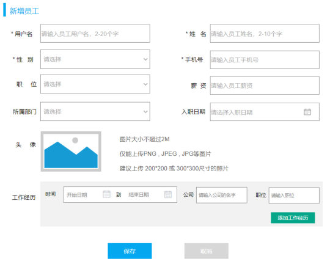
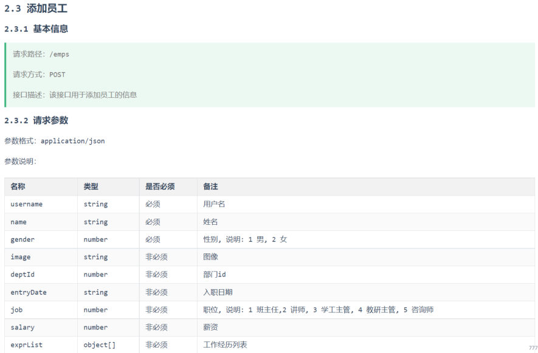
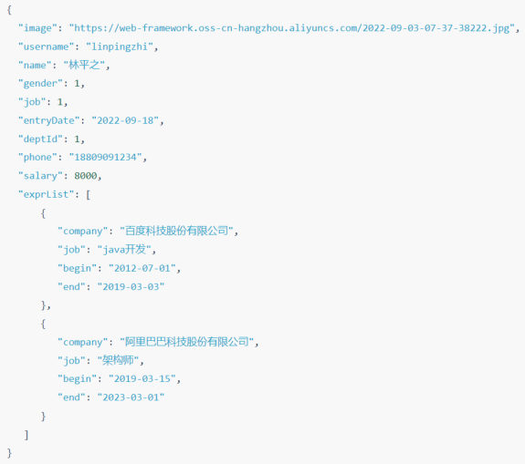

[68 篇](/posts/编程学习/javaweb学习笔记/68-条件分页查询与动态sql/)把员工列表的"条件 + 分页"做完了，页面上那排按钮还都只是摆设。这一篇（PPT 第 1～11 页）开始做第一个按钮——「**+ 新增员工**」：点开它填一张表单，一次请求要往**两张表**里写数据。

## 这一章的路线图（PPT 第 1～4 页）

PPT 第 1 页是整章的封面（Web后端开发 · Tlias系统 - 员工管理），第 2、3 页给出这一章要做的三件事：

> **需求** → **新增员工** → **事务管理** → **文件上传**

第 4 页是"01 新增员工"的小标题页，本篇就负责这一块（PPT 第 5～11 页）：把"新增"这条链路从页面表单一路做到数据库；紧接着[70 篇](/posts/编程学习/javaweb学习笔记/70-事务管理与spring事务/)（事务管理）和[71 篇](/posts/编程学习/javaweb学习笔记/71-事务进阶与操作日志/)（事务进阶与操作日志）会回来收拾本篇最后一个问题，72、73 篇再做文件上传。

## 需求：一次新增要写两张表（PPT 第 5 页）

PPT 第 5 页只有一句话，但点出了这件事的难处：要保存的是**两份数据**——

| 数据 | 表 |
| --- | --- |
| 员工基本信息（用户名、姓名、性别、手机号、职位、薪资、头像、入职日期、所属部门……） | `emp` |
| 员工工作经历信息（一段经历 = 起止时间 + 公司 + 职位） | `emp_expr` |

页面上长这样——上半张表单是基本信息，下半块是"工作经历"（可以点「+ 添加工作经历」加出很多行）：


*图：PPT 第 5 页配的页面原型——上方是员工基本信息（用户名、姓名、性别、手机号、职位、薪资、所属部门、入职日期、头像），下方是工作经历区域（开始日期 到 结束日期、公司、职位 +「添加工作经历」按钮），最底下「保存 / 取消」*

后端要提供什么接口，还是看接口文档（`02. 接口文档`）：


*图：PPT 第 5 页配的接口文档「2.3 添加员工 / 2.3.1 基本信息」——请求路径 `/emps`、请求方式 `POST`、接口描述"该接口用于添加员工的信息"；2.3.2 请求参数表里列出 `username`/`name`/`gender` 必须，`image`/`deptId`/`entryDate`/`job`/`salary`/`exprList` 非必须，其中 `exprList` 是 object[] 类型的"工作经历列表"*

请求体是 JSON（`application/json`），实际发出去的样子：


*图：PPT 第 6 页配的请求参数样例——最上面的 `image`、`username`、`name`、`gender`、`job`、`entryDate`、`deptId`、`phone`、`salary` 是员工基本信息，下面 `exprList` 数组里两条对象各带 `company`/`job`/`begin`/`end`，就是要一起存进 `emp_expr` 的两段工作经历*

对照实体类，两张表的字段是：

| 表 | 字段 |
| --- | --- |
| `emp`（员工基本信息） | `id`（主键、自增）、`username`、`password`、`name`、`gender`、`phone`、`job`、`salary`、`image`、`entry_date`、`dept_id`、`create_time`、`update_time` |
| `emp_expr`（工作经历） | `id`（主键、自增）、`emp_id`（属于哪个员工）、`begin`、`end`、`company`、`job` |

两张表靠 **`emp_expr.emp_id` = `emp.id`** 关联（[64 篇](/posts/编程学习/javaweb学习笔记/64-多表关系与表设计/)讲的一对多）。这也是这次新增最麻烦的地方：**工作经历必须知道新员工的 id 才能存**，而这个 id 是数据库自增出来的，插进去之前谁也不知道。

JSON 里的 `exprList` 进了 Java 就是 `Emp` 上那个字段（[66～68 篇](/posts/编程学习/javaweb学习笔记/66-员工列表查询与分页分析/)用过的 `Emp` 实体类里已经有它）：

```java
@Data
public class Emp {
    // ... 上面是 basic 字段（id/username/name/gender/phone/job/salary/image/entryDate/deptId/createTime/updateTime 等）
    private String deptName;              // 封装部门名称（查询时用）
    private List<EmpExpr> exprList;       // 封装工作经历信息 ← 新增接口靠它接住 JSON 里的 exprList
}

@Data
public class EmpExpr {
    private Integer id;      // ID
    private Integer empId;   // 员工ID ← 要填上新员工的 id
    private LocalDate begin; // 开始时间
    private LocalDate end;   // 结束时间
    private String company;  // 公司名称
    private String job;      // 职位
}
```

页面上那一块"工作经历"长得就像下面这样（每点一次「+ 添加工作经历」多一行，行尾还有「删除」）：


*图：PPT 第 8～9 页配的工作经历区域——每行是"时间（开始日期 到 结束日期）+ 公司 + 职位"，右侧「删除」；一次提交会有很多行，对应 Java 里就是 `List<EmpExpr>`*

## 思路：三层各干什么（PPT 第 6 页）

PPT 第 6 页把这件事拆到三层，和前面的功能是同一套分工，只是每层的活变多了：

| 层 | 职责 | 具体到新增员工 |
| --- | --- | --- |
| **Controller** | 接收请求参数（员工信息）、调用 Service 方法、响应结果 | 用 `@RequestBody` 把 JSON 装成 `Emp` 对象（里面已经含 `exprList`），调 `empService.save(emp)`，最后 `return Result.success()` |
| **Service** | 业务处理，调用 Mapper 接口方法 | ① 保存员工基本信息（顺手补全 `create_time`/`update_time`）；② **批量保存**员工的工作经历信息 |
| **Mapper** | 数据访问操作（增删改查） | 两条 SQL：`insert into emp(...) values (...)`；`insert into emp_expr(...) values(...),(...)` |

三层里唯一"新"的东西是第二条 SQL——工作经历有**多条**，所以它是一次插入多行的写法（PPT 第 8～9 页的 `<foreach>`）；其余都是 [61 篇](/posts/编程学习/javaweb学习笔记/61-部门管理-新增部门/)学过的"新增"套路，只是这次参数是个 JSON 对象。

## 保存员工基本信息（PPT 第 7 页）

PPT 第 7 页把三层的代码从上往下摆了一遍。

### Controller：接收 JSON 请求体

```java
@PostMapping
public Result save(@RequestBody Emp emp){
    log.info("请求参数emp: {}", emp);
    empService.save(emp);
    return Result.success();
}
```

两个要点：

- **`@PostMapping`**：新增用 `POST`，和接口文档对得上（类上已经有 `@RequestMapping("/emps")`，所以方法上不用再写路径，完整路径 = 类上 + 方法上的）；
- **`@RequestBody`**：请求体是 `application/json`，要让 SpringMVC 把 JSON 反序列化成 `Emp` 对象必须加它（[61 篇](/posts/编程学习/javaweb学习笔记/61-部门管理-新增部门/)讲新增部门时用的是简单参数，那种不用加）。`exprList` 因为 `Emp` 里有这个字段，也会一起被装进去。

### Service：先补全基础属性，再插库

```java
@Override
public void save(Emp emp) {
    //1. 补全基础属性
    emp.setCreateTime(LocalDateTime.now());
    emp.setUpdateTime(LocalDateTime.now());
    //2. 保存员工基本信息
    empMapper.insert(emp);
}
```

为什么要在这里补 `create_time`/`update_time`？因为前端表单里**没有**这两个字段（用户不填、也填不了），它们是"记录这件事发生了"的服务端数据，由业务层在保存前补上。`LocalDateTime.now()` 取当前时间——[66 篇](/posts/编程学习/javaweb学习笔记/66-员工列表查询与分页分析/)里"最后操作时间"那一列显示的就是 `update_time`。

> [!TIP]
> PPT 里的方法名是 `save`，课程代码工程里的 `EmpService`/`EmpServiceImpl` 也叫 `save`（`void save(Emp emp)`）——这一站的命名没有歧义，照抄即可。

### Mapper：一句 insert

```java
@Options(useGeneratedKeys = true, keyProperty = "id") //获取到生成的主键 -- 主键返回
@Insert("insert into emp(username, name, gender, phone, job, salary, image, entry_date, dept_id, create_time, update_time)" +
        " values (#{username}, #{name}, #{gender},#{phone},#{job},#{salary},#{image},#{entryDate},#{deptId},#{createTime},#{updateTime})")
void insert(Emp emp);
```

- **`@Insert`** 里是完整的插入 SQL，`#{}` 里写的是 **`Emp` 对象的属性名**（不是表字段名）：`#{entryDate}` 对应 `entry_date` 列、`#{deptId}` 对应 `dept_id` 列——驼峰转下划线这件事 [55 篇](/posts/编程学习/javaweb学习笔记/55-mybatis-xml映射配置/)讲过（`map-underscore-to-camel-case`）；
- **没有 `password`**：新增员工的表单里压根没有密码这一项，所以 insert 的字段里也没有它；
- **`id` 也没写**：它是数据库自增的主键，由 MySQL 自己生成。

## 主键返回：插完之后怎么拿到 id（PPT 第 10 页上半）

PPT 第 10 页的第一个问题就是冲着上面那个坑来的：

> **在插入数据之后，如何获取到主键值？**

答案是一行注解：

```java
@Options(useGeneratedKeys = true, keyProperty = "id")
```

| 属性 | 含义 |
| --- | --- |
| `useGeneratedKeys = true` | 使用数据库**自动生成的主键**（`emp.id` 是 `auto_increment`） |
| `keyProperty = "id"` | 把生成的主键值**回填到实体对象的哪个属性**上——这里就是 `Emp` 的 `id` 字段 |

为什么要它？因为 `emp_expr.emp_id` 必须等于新员工的 `id`：

1. `empMapper.insert(emp)` 执行完，MySQL 生成了一个 id（本机实测是 **38**）；
2. 有了主键返回，这个 38 会被 MyBatis **写回 `emp` 对象的 `id` 属性**——所以紧接着 `emp.getId()` 就拿到 38，而不是 `null`；
3. 遍历 `exprList`，给每条工作经历 `setEmpId(38)`，再批量插入。

没有 `@Options` 会怎样？插完 `emp.getId()` 还是 `null`，`emp_expr.emp_id` 就会是 null——工作经历和员工对不上号。PPT 把这一步叫"主键返回"，本机实测里它是整条链路能走通的关键（见下面的实测表）。

## 批量保存工作经历：动态 SQL `<foreach>`（PPT 第 8～9 页）

### 为什么不能一条一条插

PPT 第 8 页把三种情况摆在一起：

```text
insert into emp_expr(...) values (?,?,?,?,?)                      -- 一条经历，一条 SQL
insert into emp_expr(...) values (?,?,?,?,?),(?,?,?,?,?)           -- 两条经历，一条 SQL
insert into emp_expr(...) values (?,?,?,?,?),(?,?,?,?,?),(?,?,?,?,?)  -- 三条经历，一条 SQL
```

工作经历是 `List<EmpExpr>`，**有几条不确定**：用户可能一段都没填，也可能填五段。一条 SQL 插一条的做法要循环发 N 次请求，效率低；而且 SQL 长什么样也不固定。所以要用**动态 SQL** 里的 `<foreach>` 标签——让 MyBatis 根据集合的条数，把 `values` 后面那串括号**按需拼出来**。

### Mapper 接口 + XML 映射

接口方法只有一个形参：一个 `List<EmpExpr>`（[55 篇](/posts/编程学习/javaweb学习笔记/55-mybatis-xml映射配置/)的规则：SQL 复杂就写 XML；同包同名、`namespace` 是接口全限定名、`id` 是方法名）：

```java
@Mapper
public interface EmpExprMapper {
    /**
     * 批量保存员工的工作经历信息
     */
    void insertBatch(List<EmpExpr> exprList);
}
```

`src/main/resources/com/itheima/mapper/EmpExprMapper.xml`：

```xml
<?xml version="1.0" encoding="UTF-8" ?>
<!DOCTYPE mapper
        PUBLIC "-//mybatis.org//DTD Mapper 3.0//EN"
        "https://mybatis.org/dtd/mybatis-3-mapper.dtd">
<mapper namespace="com.itheima.mapper.EmpExprMapper">

    <!--批量保存员工工作经历信息
    foreach 标签:
        collection: 遍历的集合
        item: 遍历出来的元素
        separator: 每次循环之间的分隔符
    -->
    <insert id="insertBatch">
        insert into emp_expr(emp_id, begin, end, company, job) values
        <foreach collection="exprList" item="expr" separator=",">
            (#{expr.empId},#{expr.begin},#{expr.end},#{expr.company},#{expr.job})
        </foreach>
    </insert>

</mapper>
```

读这段 XML 的顺序是：`insert into emp_expr(emp_id, begin, end, company, job) values` 是**固定前缀**，`<foreach>` 里那段括号是**循环体**——集合里有几条 `empExpr`，它就重复贴几遍，中间用 `separator` 的逗号隔开。

### `<foreach>` 五个属性（PPT 第 9 页属性说明 + 第 10 页问答）

| 属性 | 含义 | 本案例里的值 |
| --- | --- | --- |
| `collection` | **集合名称**（要遍历的集合） | `exprList`（Mapper 方法的形参名） |
| `item` | 集合遍历出来的**元素/项**（循环变量名） | `expr`（下面就能用 `#{expr.xxx}` 取属性） |
| `separator` | 每一次遍历之间使用的**分隔符**（可选） | `,`（把多个括号拼成 `values (...),(...)`） |
| `open` | 遍历**开始前**拼接的片段（可选） | 本案例没写（括号在每个循环体里） |
| `close` | 遍历**结束后**拼接的片段（可选） | 本案例没写 |

> [!NOTE]
> `open`/`close` 在这儿用不上，因为括号属于"每一组 values"而不是"整段 SQL 的开头结尾"。有的写法会把 SQL 写成 `values <foreach open="(" close=")">…</foreach>`，那种是"整段只包一层括号"的情形——属性含义不变，位置不同而已。

### Service 里的组装过程（PPT 第 8 页 + 课程代码）

```java
@Override
public void save(Emp emp) {
    //1. 保存员工基本信息
    emp.setCreateTime(LocalDateTime.now());
    emp.setUpdateTime(LocalDateTime.now());
    empMapper.insert(emp);

    //2. 保存员工工作经历信息
    List<EmpExpr> exprList = emp.getExprList();
    if(!CollectionUtils.isEmpty(exprList)){
        //遍历集合, 为empId赋值
        exprList.forEach(empExpr -> {
            empExpr.setEmpId(emp.getId());      // ← 主键返回拿到的 id
        });
        empExprMapper.insertBatch(exprList);
    }
}
```

三个细节：

- **`CollectionUtils.isEmpty(exprList)`**（`org.springframework.util.CollectionUtils`）：用户可能一段工作经历都没填，那 `exprList` 就是 `null` 或者空集合——这时候**不能**去调 `insertBatch`（会拼出 `values` 后面什么都没有的非法 SQL），所以先判空；
- **`forEach` 里 `setEmpId(emp.getId())`**：把主键返回拿到的 id 一条条填进工作经历。PPT 上的写法是先 `Integer empId = emp.getId();` 存一个局部变量再在 `forEach` 里用，效果一样；
- **插完基本信息才插经历**：顺序不能反——经历要用员工 id，而 id 是第一步插完才有的。

## 必答问答（PPT 第 10 页）

| PPT 的问题 | 答案 |
| --- | --- |
| 在插入数据之后，如何获取到主键值？ | 在 Mapper 的插入方法上加 **`@Options(useGeneratedKeys = true, keyProperty = "id")`**——用数据库生成的主键，并回填到实体对象的 `id` 属性上 |
| `<foreach>` 动态 SQL 标签的作用？其中属性的含义？ | **作用：遍历集合/数组**（把集合里每一条按同一段模板拼进 SQL）；**属性**：`collection` 集合名称、`item` 集合遍历出来的元素/项、`separator` 每一次遍历使用的分隔符（可选）、`open` 遍历开始前拼接的片段（可选）、`close` 遍历结束后拼接的片段（可选） |

## 本机实测：一次新增员工的全链路

把工程跑起来，发一次真正的"新增员工"请求（请求体里带两段工作经历），看响应、看库、看日志：

> [!TIP]
> **本机实测**：
>
> ```text
> $ POST http://localhost:8080/emps
> body（UTF-8 文件，--data-binary 发出去）:
> {"username":"testuser01","name":"测试员一","gender":1,"phone":"13900001111","job":1,"salary":5000,
>  "image":"1.jpg","entryDate":"2024-01-01","deptId":1,
>  "exprList":[{"begin":"2019-01-01","end":"2020-01-01","company":"百度","job":"开发"},
>              {"begin":"2020-01-10","end":"2022-02-01","company":"阿里","job":"架构"}]}
>
> # 响应（统一响应结果）
> {"code":1,"msg":"success","data":null}
> ```
>
> 然后是查库结果：
>
> | 表 | 落库结果 |
> | --- | --- |
> | `emp` | **id = 38**（自增），`username` = testuser01，`dept_id` = 1，`create_time` 由 Service 补全 |
> | `emp_expr` | **2 条**，`emp_id` 都是 **38** ← **主键返回的实证**：插完 emp 后 `emp.getId()` 拿到了新 id，才能给工作经历的 `emp_id` 赋值 |
> | `emp_log` | 1 条：`新增员工:Emp(id=38, username=testuser01, ...)`（这是[71 篇](/posts/编程学习/javaweb学习笔记/71-事务进阶与操作日志/)要讲的操作日志） |
>
> 服务端日志里 `<foreach>` 拼出来的 SQL 长这样（两条经历 → `values` 后面两组括号）：
>
> ```text
> ==>  Preparing: insert into emp_expr (emp_id, begin, end, company, job) values (?,?,?,?,?) , (?,?,?,?,?)
> ```
>
> 两组括号中间是用 `separator` 拼出来的逗号——**这就是"一条 SQL 插两行"**，如果经历是三条，括号就会变成三组。
> （本机连的是 MySQL 的 `tlias` 库、用户名 `root`；`password` 换成你自己 MySQL 的密码。）

## 问题：基本信息成功、经历失败行不行（PPT 第 11 页）

PPT 最后留了一个问题，把这一篇的结论引到下一篇：

> **保存员工的基本信息成功了，而保存工作经历失败了，是否 OK？**

答案：**不可以**。PPT 的原话是——

> 因为这属于一个业务操作，如果保存员工信息成功了，保存工作经历信息失败了，就会造成数据库数据的**不完整、不一致**。

"新增一个员工"在业务上只有**一件事**：要么员工和他的工作经历都进去了，要么就都别进去。可现在代码里是两次独立的数据库操作，中间任何一处出错（网断了、SQL 报错、程序抛异常），就会出现：

```text
emp 表：有"测试员三"            ← 插入成功了
emp_expr 表：这个员工 0 条经历    ← 插入失败了
```

数据库里留下一个"工作经历对不上号"的残缺员工。要解决它，就需要**事务管理**——这正是[70 篇](/posts/编程学习/javaweb学习笔记/70-事务管理与spring事务/)的内容（PPT 第 11 页底下写的三个字就是"事务管理"）。

## 小结

| 问题 | 答案 |
| --- | --- |
| 新增员工要写哪几张表？ | `emp`（基本信息）+ `emp_expr`（工作经历，多条），靠 `emp_expr.emp_id` = `emp.id` 关联 |
| 接口是什么？ | `POST /emps`，请求体 `application/json`；必填 `username`/`name`/`gender`，`exprList` 是工作经历列表 |
| Controller 怎么写？ | `@PostMapping` + `public Result save(@RequestBody Emp emp)`，打日志、调 Service、`return Result.success()` |
| Service 要多做什么？ | ① 补全 `createTime`/`updateTime`；② 保存基本信息后用主键返回的 id 给经历赋 `empId`，再批量插入 |
| 基本信息怎么插？ | `@Insert` 一句 `insert into emp(...) values (...)`，`#{}` 里是 `Emp` 的属性名（不写 `password`、不写 `id`） |
| 插完怎么拿到 id？ | `@Options(useGeneratedKeys = true, keyProperty = "id")`——**主键返回**，把自增主键回填到 `emp.id`（本机实测回填的是 38） |
| 多条经历怎么插？ | `<foreach>` 动态 SQL：`collection` 集合名、`item` 元素名、`separator` 分隔符（`open`/`close` 可选），拼出一条 `insert ... values (...),(...)` |
| 本机实测的结果？ | 响应 `{"code":1,"msg":"success","data":null}`；`emp` id=38、`emp_expr` 2 条 `emp_id`=38；日志 SQL 里两组 `(?,?,?,?,?)` 用逗号相连 |
| PPT 最后的问题？ | "基本信息成功、经历失败"**不可以**——属于一个业务操作，会造成数据的**不完整、不一致**，要靠事务管理解决（下一篇） |

## 相关

- [上一篇：条件分页查询与动态SQL](/posts/编程学习/javaweb学习笔记/68-条件分页查询与动态sql/)
- [下一篇：事务管理与Spring事务](/posts/编程学习/javaweb学习笔记/70-事务管理与spring事务/)

## 练习题

### 一、知识回顾（读完直接做下面的实践题）

1. **需求**：一次"新增员工"要写两张表——`emp`（员工基本信息）和 `emp_expr`（工作经历，多条），两张表靠 `emp_expr.emp_id` = `emp.id` 关联
2. **接口**：请求路径 `/emps`、请求方式 `POST`、参数格式 `application/json`；必填 `username`/`name`/`gender`，非必须 `image`/`deptId`/`entryDate`/`job`/`salary`/`exprList`
3. **三层分工**：Controller 用 `@RequestBody` 把 JSON 装成 `Emp`、调 Service、响应 `Result`；Service 先保存基本信息（补 `createTime`/`updateTime`）再批量保存经历；Mapper 两句 insert
4. **为什么要补时间**：前端表单里没有 `create_time`/`update_time`，这两个"记录操作发生"的字段由 Service 在保存前用 `LocalDateTime.now()` 补全
5. **Controller 的两个注解**：`@PostMapping`（新增用 POST，类上已有 `/emps` 所以方法上不写路径）；`@RequestBody`（JSON 请求体转 Java 对象，`exprList` 也在其中）
6. **主键返回**：`@Options(useGeneratedKeys = true, keyProperty = "id")`——用数据库生成的自增主键，并回填到实体对象的 `id` 属性；没有它 `emp.getId()` 就是 `null`，工作经历没法关联员工
7. **批量插入**：多条经历用"一条 SQL 多个 values"（`insert into emp_expr(...) values (...),(...)`），靠动态 SQL `<foreach>` 按集合条数拼出来
8. **`<foreach>` 属性**：`collection` 集合名称、`item` 遍历出来的元素、`separator` 每次遍历之间的分隔符（可选）、`open` 遍历开始前拼接的片段（可选）、`close` 遍历结束后拼接的片段（可选）
9. **判空**：`CollectionUtils.isEmpty(exprList)`——用户可能一段经历都不填，`null`/空集合时不能调用批量插入（SQL 会变成 `values` 后面啥也没有）
10. **本机实测**：`POST /emps` → `{"code":1,"msg":"success","data":null}`；`emp` 生成 id=**38**、`emp_expr` **2 条**且 `emp_id` 都是 38；日志 SQL 为 `insert into emp_expr (emp_id, begin, end, company, job) values (?,?,?,?,?) , (?,?,?,?,?)`
11. **遗留问题（PPT 第 11 页）**：保存基本信息成功、保存经历失败**不可以**——属于一个业务操作，会造成**数据的不完整、不一致**，需要事务管理

### 二、裸写题

- [ ] **2-1 开发"新增员工"的接口（基本信息部分）**
  需求：前端把一张新增员工表单以 JSON 提交到 `/emps`（`POST`）。三层都要写：控制层接收这个 JSON 参数、打一行日志、调用业务层、返回统一响应结果；业务层保存前先把"创建时间"和"修改时间"补上当前时间，再交给数据访问层；数据访问层用一条 insert 把用户名、姓名、性别、手机号、职位、薪资、头像、入职日期、所属部门 id、创建时间、修改时间写进 `emp` 表（密码和主键不由这里写，主键是自增的）。
  （练习文件 `test_69_新增员工.java` 的题目2-1 里给了写作区。）

  > [!TIP]- 提示（先自己想，实在想不出再点开）
  > **一级 · 思路**：控制层要一个"把 JSON 变成实体对象"的注解；业务层先 `LocalDateTime.now()` 补两个时间字段再调数据访问层；数据访问层一句 insert，占位符里写实体类的属性名（不是表字段名）
  > **二级 · 方法**：Controller 用 `@PostMapping` + `@RequestBody Emp emp`，返回 `Result.success()`；Service 用 `emp.setCreateTime(...)`/`setUpdateTime(...)` 后调 `empMapper.insert(emp)`；Mapper 用 `@Insert("insert into emp(...) values (#{...})") void insert(Emp emp);`
  > **三级 · 骨架**：
  > - Controller：`@PostMapping public Result save(@____ Emp emp){ log.info(…); empService.____(emp); return Result.____(); }`
  > - Service：`emp.setCreateTime(LocalDateTime.____()); emp.setUpdateTime(…); empMapper.____(emp);`
  > - Mapper：`@Insert("insert into emp(username, name, …, dept_id, create_time, update_time) values (#{username}, #{name}, …)") void ____(Emp emp);`

  > [!TIP]- 参考答案（做完再点开）
  > 与课程 `代码/tlias-web-management` 一致（PPT 第 7 页同）：
  > ```java
  > // ===== Controller：接收 JSON 请求体 + 响应结果 =====
  > @PostMapping
  > public Result save(@RequestBody Emp emp){
  >     log.info("请求参数emp: {}", emp);
  >     empService.save(emp);
  >     return Result.success();
  > }
  > ```
  > ```java
  > // ===== Service：补全基础属性 + 调用 Mapper =====
  > @Override
  > public void save(Emp emp) {
  >     //1. 补全基础属性
  >     emp.setCreateTime(LocalDateTime.now());
  >     emp.setUpdateTime(LocalDateTime.now());
  >     //2. 保存员工基本信息
  >     empMapper.insert(emp);
  > }
  > ```
  > ```java
  > // ===== Mapper：一句 insert =====
  > @Options(useGeneratedKeys = true, keyProperty = "id") //获取到生成的主键 -- 主键返回
  > @Insert("insert into emp(username, name, gender, phone, job, salary, image, entry_date, dept_id, create_time, update_time)" +
  >         " values (#{username}, #{name}, #{gender},#{phone},#{job},#{salary},#{image},#{entryDate},#{deptId},#{createTime},#{updateTime})")
  > void insert(Emp emp);
  > ```
  > 自查：① `#{}` 里是 `Emp` 的**属性名**（`entryDate`/`deptId`），列名是 `entry_date`/`dept_id`，靠着驼峰映射对上；② 没有 `password`（表单里没有这一项）；③ `@Options` 那行下一题马上要用到——本机实测没有它就拿不到新员工的 id。

- [ ] **2-2 插完基本信息，把数据库生成的主键拿回来**
  需求：员工的主键是数据库自增出来的，Java 里插入前是 `null`。业务层在保存完基本信息之后，要立刻拿到这个新员工的 id，用它给每一条工作经历填上"属于哪个员工"，然后再去保存经历。请改成能让业务层拿到新 id 的写法，并说明"没有它会发生什么"。
  （练习文件 `test_69_新增员工.java` 的题目2-2 里给了写作区。）

  > [!TIP]- 提示（先自己想，实在想不出再点开）
  > **一级 · 思路**：这是"主键返回"——在插入方法上加一个注解，让 MyBatis 把数据库生成的主键回填到实体对象的 `id` 属性上；业务层插完直接 `getId()` 就行
  > **二级 · 方法**：`@Options(useGeneratedKeys = true, keyProperty = "id")` 加在 Mapper 的插入方法上（和 `@Insert` 一起）
  > **三级 · 骨架**：`@____(useGeneratedKeys = ____, keyProperty = "____")` ＋ `void insert(Emp emp);`；业务层里 `empMapper.insert(emp); Integer id = emp.____();`

  > [!TIP]- 参考答案（做完再点开）
  > ```java
  > @Options(useGeneratedKeys = true, keyProperty = "id") //获取到生成的主键 -- 主键返回
  > @Insert("insert into emp(...) values (...)")
  > void insert(Emp emp);
  > ```
  > 说明：
  > - `useGeneratedKeys = true` 表示用**数据库生成的主键**（`emp.id` 是 `auto_increment`）；
  > - `keyProperty = "id"` 表示把生成的值回填到 `Emp` 对象的 `id` 属性上，所以 `insert` 执行完 `emp.getId()` 就是新 id；
  > - **没有它**：`emp.getId()` 仍是 `null`，业务层给工作经历 `setEmpId(null)`，`emp_expr.emp_id` 存进去是 NULL——工作经历和员工**对不上号**，等于白存（外键关联断了）。
  > - 本机实测：这次插入生成的是 **id = 38**，两段工作经历的 `emp_id` 都是 **38**——正是主键返回生效的证明。

- [ ] **2-3 一条 SQL 批量保存多条工作经历**
  需求：用户一次可能填 0 段、1 段或多段工作经历，代码里拿到的是一个"工作经历对象的列表"。要求用**一条**插入语句把列表里的每一条都写进工作经历表（每条对应一组 `values`，用逗号相连），列是 `emp_id`、开始时间、结束时间、公司、职位。SQL 写在 XML 里。
  （练习文件 `test_69_批量插入XML.xml` 的题目2-3 里给了写作区。）

  > [!TIP]- 提示（先自己想，实在想不出再点开）
  > **一级 · 思路**：SQL 的固定部分是 `insert into emp_expr(列...) values`，后面"每组值的括号"有多少个取决于列表长度——用动态 SQL 的标签把集合"遍历+拼串"就能做到
  > **二级 · 方法**：`<foreach>` 标签，`collection` 写 Mapper 方法的形参名、`item` 起个循环变量名、`separator=","`；括号写在 `foreach` 内部，取值用 `#{item.属性名}`；XML 里用 `<insert id="方法名">`
  > **三级 · 骨架**：
  > ```xml
  > <insert id="____">
  >     insert into emp_expr(emp_id, begin, end, company, job) values
  >     <foreach collection="____" item="____" separator="____">
  >         (#{____.empId}, #{____.begin}, #{____.end}, #{____.company}, #{____.job})
  >     </foreach>
  > </insert>
  > ```

  > [!TIP]- 参考答案（做完再点开）
  > `EmpExprMapper.java`（一个形参：工作经历列表）：
  > ```java
  > @Mapper
  > public interface EmpExprMapper {
  >     void insertBatch(List<EmpExpr> exprList);   // 批量保存员工的工作经历信息
  > }
  > ```
  > `EmpExprMapper.xml`（课程代码 / PPT 第 9 页）：
  > ```xml
  > <mapper namespace="com.itheima.mapper.EmpExprMapper">
  >
  >     <insert id="insertBatch">
  >         insert into emp_expr(emp_id, begin, end, company, job) values
  >         <foreach collection="exprList" item="expr" separator=",">
  >             (#{expr.empId},#{expr.begin},#{expr.end},#{expr.company},#{expr.job})
  >         </foreach>
  >     </insert>
  >
  > </mapper>
  > ```
  > 自查：① `collection` 写的是 **Mapper 方法的形参名** `exprList`（Spring Boot 编译时带 `-parameters`，参数名才能被 MyBatis 认出来）；② `item` 是循环变量 `expr`，取值必须写成 `#{expr.属性}`；③ 括号放在 `foreach` **内部**、逗号由 `separator` 负责——千万不要自己在括号后面再写逗号，那样最后一条会多出一个逗号；④ `<insert>` 的 `id` 必须等于接口方法名 `insertBatch`，`namespace` 必须等于接口全限定名（[55 篇](/posts/编程学习/javaweb学习笔记/55-mybatis-xml映射配置/)）。
  > 本机实测：两段经历时服务端日志里的 SQL 是 `insert into emp_expr (emp_id, begin, end, company, job) values (?,?,?,?,?) , (?,?,?,?,?)`——一条 SQL、两组括号。而业务层在调用它之前，要用 `CollectionUtils.isEmpty(exprList)` 判空，一段经历都没有时**不要**调这个方法。

- [ ] **2-4 把"两次插入"的顺序和关联讲清楚**
  需求：有人把业务层写成"先批量保存工作经历，再保存员工基本信息"，也有人忘了给工作经历填员工 id。请说明：① 这两步的**正确顺序**以及为什么；② 每段工作经历上的"员工 id"是什么时候、从哪儿来的；③ 如果用户一段工作经历都没填，代码要怎么处理。
  （练习文件 `test_69_新增员工.java` 的题目2-4 里给了写作区。）

  > [!TIP]- 提示（先自己想，实在想不出再点开）
  > **一级 · 思路**：工作经历要用员工的 id，所以"员工先存、经历后存"；id 是数据库自增的，只能靠"主键返回"拿到；没有经历时别调批量插入
  > **二级 · 方法**：`empMapper.insert(emp)` → `emp.getId()` → `forEach` 里 `empExpr.setEmpId(id)` → `empExprMapper.insertBatch(exprList)`；判空用 `CollectionUtils.isEmpty(...)`
  > **三级 · 骨架**：① `empMapper.____(emp);` → `List<EmpExpr> exprList = emp.____(); if(!CollectionUtils.____(exprList)){ exprList.____(e -> e.setEmpId(emp.getId())); empExprMapper.____(exprList); }`；② 顺序理由：工作经历需要 `emp_id`，而 `emp_id` 来自刚刚插入的员工的主键；③ 判空后跳过批量插入

  > [!TIP]- 参考答案（做完再点开）
  > ① **顺序：先员工、后经历**。因为 `emp_expr.emp_id` 的值就是新员工的 `emp.id`，而它是第一步 insert 完成后（靠主键返回）才拿到的；反过来先插经历，`emp_id` 只能填 `null`。
  > ② 每段工作经历的 `empId` 由业务层在插入经历**之前**逐个赋值：`empMapper.insert(emp)` 之后 `emp.getId()` 拿到自增主键（本机实测 38），再 `exprList.forEach(empExpr -> empExpr.setEmpId(emp.getId()))`（PPT 上的写法是先存成局部变量 `Integer empId = emp.getId();` 再用）。
  > ③ 用户一段都没填时 `exprList` 是 `null` 或空集合，要用 `CollectionUtils.isEmpty(exprList)` 判空后**跳过** `insertBatch`——否则 `<foreach>` 会拼出 `insert into emp_expr(...) values` 后面空无一物的非法 SQL；但**基本信息照样要存**（这个人可以在没有简历经历的情况下入职）。

### 三、综合题

- [ ] **3-1 照着课程把"新增员工"从页面做到数据库**
  这一题把本节从头到尾走一遍，并且故意制造一次失败，为下一篇（事务管理）留证据。
  1. 三层补齐"新增员工"：控制层接收 JSON、业务层补时间 + 保存基本信息 + 给经历赋 `empId` + 批量保存、数据访问层写两句 SQL（一句注解版、一句 XML 版）；
  2. 启动工程，用 Apifox（或用 JSON 文件 + `curl --data-binary @body.json`，文件必须是 UTF-8）发一次 `POST /emps`，请求体带 **两段**工作经历，把返回的 JSON 抄下来；
  3. 去客户端查库：`select * from emp order by id desc limit 1;` 和 `select * from emp_expr where emp_id = <刚才那个 id>;`——记录新员工的 id 和经历的条数，**确认两段经历的 `emp_id` 都等于新员工的 id**；
  4. 把服务端日志里 `<foreach>` 拼出来的那条 SQL 抄下来（提示：看 `insert into emp_expr` 那两行，数一数 `values` 后面有几组括号）；
  5. 做对照实验：把业务层里"保存工作经历"那一步注释掉（或者改成故意抛异常），再发一次新增请求，然后查库——员工和经历各有几条？把结果记下来；
  6. 回答两个问题。

  （练习文件 `test_69_新增员工.java` 的"综合题"一段里按这 6 步给了写作区。）

  回答：① 如果保存基本信息成功、保存经历失败，数据库会变成什么样？为什么说"不可以"？② 要在代码里避免这种情况，下一步该引入什么机制？

  **涉及知识点**

  | 知识点 | 在这里的应用 |
  | --- | --- |
  | 需求与接口文档（PPT 5） | 第 2 步——`POST /emps`、`application/json`、`exprList` 是工作经历列表 |
  | 三层分工（PPT 6） | 第 1 步——Controller 接参、Service 双插入、Mapper 两句 SQL |
  | 保存基本信息（PPT 7） | 第 1、2 步——`@RequestBody` 接收、Service 补时间、`@Insert` 落库 |
  | 主键返回（PPT 10） | 第 3 步——`emp_expr.emp_id` 等于新员工 id 的关键 |
  | `<foreach>` 批量插入（PPT 8～10） | 第 1、4 步——一条 SQL 多组 values，日志里能直接看到 |
  | 数据不一致问题（PPT 11） | 第 5、6 步——故意失败后的对照结果，就是下一篇要解决的问题 |

  > [!TIP]- 提示（先自己想，实在想不出再点开）
  > **一级 · 思路**：先把"成功路径"跑通（能查到员工 + 两段经历），再用一次"人为失败"暴露问题；每一步都用数据库查询和日志做证据
  > **二级 · 方法**：`@PostMapping` + `@RequestBody`；`empMapper.insert(emp)` + `@Options` 拿主键；`empExprMapper.insertBatch(exprList)` + XML 里的 `<foreach>`；查库用 `select * from emp_expr where emp_id = ?`
  > **三级 · 骨架**：① 业务层 `empMapper.____(emp); List<EmpExpr> exprList = emp.getExprList(); if(!CollectionUtils.____(exprList)){ exprList.forEach(e -> e.setEmpId(emp.____())); empExprMapper.____(exprList); }`；② 请求 `POST http://localhost:8080/____`；③ 查库 SQL `select * from emp_expr where emp_id = ____`；④ 对照实验后：`emp` 有 ____ 条、`emp_expr` 有 ____ 条

  > [!TIP]- 参考答案（做完再点开）
  > **1. 三层代码**（与 2-1、2-2、2-3 的答案一致，合起来就是课程 `EmpController.save` / `EmpServiceImpl.save` / `EmpMapper.insert` / `EmpExprMapper.insertBatch`）：
  > ```java
  > @Override
  > public void save(Emp emp) {
  >     //1. 保存员工基本信息
  >     emp.setCreateTime(LocalDateTime.now());
  >     emp.setUpdateTime(LocalDateTime.now());
  >     empMapper.insert(emp);
  >
  >     //2. 保存员工工作经历信息
  >     List<EmpExpr> exprList = emp.getExprList();
  >     if(!CollectionUtils.isEmpty(exprList)){
  >         exprList.forEach(empExpr -> empExpr.setEmpId(emp.getId()));
  >         empExprMapper.insertBatch(exprList);
  >     }
  > }
  > ```
  > **2. 响应**（**本机实测**）：`{"code":1,"msg":"success","data":null}`。
  > **3. 查库**（**本机实测**）：`emp` 里新员工 **id = 38**；`emp_expr` **2 条**，`emp_id` 都是 **38**——主键返回生效的证据。
  > **4. `<foreach>` 拼出来的 SQL**（**本机实测**）：
  >    ```text
  >    ==>  Preparing: insert into emp_expr (emp_id, begin, end, company, job) values (?,?,?,?,?) , (?,?,?,?,?)
  >    ```
  >    两段经历 → **两组括号**，中间是 `separator` 拼出的逗号。
  > **5. 对照实验**（结果就是 PPT 第 11 页说的情况）：把"保存工作经历"那一步去掉/改坏之后，`emp` 表里**有**这条员工，`emp_expr` 表里**一条都没有**——员工有了、他的工作经历丢了。把这两条查询结果记下来，[70 篇](/posts/编程学习/javaweb学习笔记/70-事务管理与spring事务/)和[71 篇](/posts/编程学习/javaweb学习笔记/71-事务进阶与操作日志/)还会用它做对照。
  > **6. 两个回答**：
  >    ① 数据库会留下一个"只有基本信息、没有工作经历"的残缺员工——**数据的完整性（该有的没有）和一致性（两张表对不上）都被破坏**。PPT 说"不可以"的原因就是这个：新增员工在业务上是**一个操作**，员工和他的工作经历必须同生共死；
  >    ② 下一步引入**事务管理**：把这两次插入包进同一个事务里，出异常就整体回滚（[70 篇](/posts/编程学习/javaweb学习笔记/70-事务管理与spring事务/)）。
