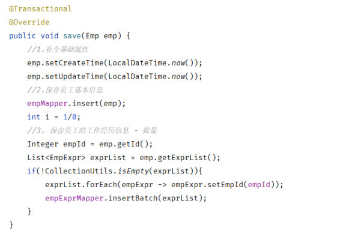

[69 篇](/posts/编程学习/javaweb学习笔记/69-新增员工/)的结尾留下了一个坑：新增员工要往 `emp` 和 `emp_expr` 两张表里写数据，如果**保存基本信息成功、保存工作经历失败**，数据库里就留下一个"缺胳膊少腿"的员工——数据的**不完整、不一致**。这一篇（PPT 第 12～22 页 + 第 27～28 页）就是来解决它的：**事务管理**。

## 这一节的位置（PPT 第 12～13 页）

PPT 第 12 页是章节页（新增员工 / **事务管理** / 文件上传），第 13 页把"02 事务管理"这一节分成了三块：

> **介绍&操作** → **Spring事务管理** → **四大特性**

本篇就按这三块走；[71 篇](/posts/编程学习/javaweb学习笔记/71-事务进阶与操作日志/)再往上走一层，讲事务的**进阶**用法（控制"什么样的异常才回滚"、事务的传播行为，以及"无论成功失败都要记录操作日志"的案例）。

## 什么是事务（PPT 第 14 页）

PPT 第 14 页给出的定义：

> **事务**是一组操作的集合，它是一个**不可分割的工作单位**。事务会把所有的操作作为一个整体一起向系统提交或撤销操作请求，即这些操作**要么同时成功，要么同时失败**。

拿"新增员工"举例，DAO 层实际要执行的是两句 SQL：

```sql
-- 1. 保存员工基本信息
insert into emp values (39, 'Tom', '123456', '汤姆', 1, '13300001111', 1, 4000, '1.jpg', '2023-11-01', 1, now(), now());
-- 2. 保存员工的工作经历信息
insert into emp_expr(emp_id, begin, end, company, job) values (39,'2019-01-01', '2020-01-01', '百度', '开发'),
                                                              (39,'2020-01-10', '2022-02-01', '阿里', '架构');
```

在业务上这两句是**一件事**（"新增一个员工"）的两个步骤，可数据库看到的却是两条**彼此无关**的语句。

> [!WARNING]
> PPT 在这一页底下特别加了一条**注意**：
>
> **默认 MySQL 的事务是自动提交的**，也就是说，当执行**一条 DML 语句**，MySQL 会立即**隐式的提交事务**。
>
> 后果就是上面那两句各自成为一个"独立的小事务"：第一句执行完就已经永久落库了；第二句再失败，也挽不回第一句——[69 篇](/posts/编程学习/javaweb学习笔记/69-新增员工/)最后那个"员工有了、经历没有"的场景就是这么来的。

## 用 SQL 控制事务：三步（PPT 第 15 页）

PPT 第 15 页给出手工控制事务的写法——**事务控制主要三步操作：开启事务、提交事务 / 回滚事务**：

```sql
-- 开启事务
start transaction;   -- 或者 begin;
-- 1. 保存员工基本信息
insert into emp values (39, 'Tom', '123456', '汤姆', 1, '13300001111', 1, 4000, '1.jpg', '2023-11-01', 1, now(), now());
-- 2. 保存员工的工作经历信息
insert into emp_expr(emp_id, begin, end, company, job) values (39,'2019-01-01', '2020-01-01', '百度', '开发'),
                                                              (39,'2020-01-10', '2022-02-01', '阿里', '架构');
-- 提交事务(全部成功) / 回滚事务(有一个失败)
commit;   -- 或者 rollback;
```

| 步骤 | 语句 | 什么时候用 |
| --- | --- | --- |
| 开启事务 | `start transaction;` 或 `begin;` | 在整组操作的最前面，告诉数据库"接下来这几条是一件事" |
| 提交事务 | `commit;` | 所有操作**都成功**了，把结果永久生效 |
| 回滚事务 | `rollback;` | **只要有一项失败**，把这一组操作全部撤销，回到开启事务前的状态 |

对比一下就清楚了：默认（自动提交）时每条 DML 自己提交自己；写 `start transaction;` 之后就变成"**由你说了算**"——中间的 DML 都只是"待定"，直到你 `commit` 或 `rollback`。

## 必答问答（PPT 第 16 页）

| PPT 的问题 | 答案 |
| --- | --- |
| 什么是事务？ | 事务是一组操作的集合，是一个不可分割的工作单位。这组操作**要么全部成功，要么全部失败** |
| 如何控制事务？ | **开启事务**：`start transaction` / `begin;`；**提交事务**：`commit;`（全部成功）；**回滚事务**：`rollback;`（只要有一项失败） |
| 事务在什么场景用？ | **银行转账**（A 扣钱、B 加钱必须同时成功）、**下单扣减库存**（生成订单和扣减库存必须同时成功） |

## 回到代码：新增员工的事务控制（PPT 第 17～19 页）

PPT 第 17～19 页把同一段业务层代码连放三遍，用动画演示思路怎么一步步变。

### 第 17 页：先看"出问题"的样子

```java
@Autowired
private EmpMapper empMapper;
@Autowired
private EmpExprMapper empExprMapper;

@Override
public void save(Emp emp) {
    //1.保存员工基本信息
    emp.setCreateTime(LocalDateTime.now());
    emp.setUpdateTime(LocalDateTime.now());
    empMapper.insert(emp);

    int i = 1/0;   // ← PPT 在这里人为制造一个异常（算数异常）

    //2. 保存员工的工作经历信息 - 批量
    Integer empId = emp.getId();
    List<EmpExpr> exprList = emp.getExprList();
    if(!CollectionUtils.isEmpty(exprList)){
        exprList.forEach(empExpr -> empExpr.setEmpId(empId));
        empExprMapper.insertBatch(exprList);
    }
}
```


*图：PPT 第 17～21 页那段 `save` 方法——第一句 `insert` 已经把员工写进库里了，紧接着的 `int i = 1/0;` 会抛算数异常，后面保存工作经历的两行根本执行不到*

PPT 在那张图下面写着结论，正是[69 篇](/posts/编程学习/javaweb学习笔记/69-新增员工/)结尾那个问题：

> 保存员工信息成功了，保存工作经历信息失败了，就会造成数据库数据的不完整、不一致。

### 第 18 页：把这两步包进"事务"

第 18 页在本页上叠了一层动画，图上出现三个词：

```text
事务  →  开启事务  →  提交 / 回滚事务
```

意思就是：**这两次插入要放进一个事务里**——"开启事务"包住整段逻辑，全成功就"提交"，中途出错就"回滚"，让两条 SQL 同生共死。

（这就是[69 篇](/posts/编程学习/javaweb学习笔记/69-新增员工/)里"无事务"对照实验的反面：本机实测把 `@Transactional` 去掉后，`emp` 里有员工、`emp_expr` 里 0 条——数据就是不一致的。）

### 第 19 页：不用自己写 SQL，交给 Spring

第 19 页又叠了一层动画，出现"**Spring事务管理**"——如果在 Java 代码里真的去写 `start transaction` / `commit` / `rollback`（比如用 JDBC 的 `Connection` 对象手动开关），业务代码会被事务样板代码淹没。Spring 提供了声明式的做法：**一句话注解**就够。

## Spring 事务管理：一句 `@Transactional`（PPT 第 21 页）

PPT 第 21 页给出的注解说明：

> **注解：`@Transactional`**
> **作用**：将当前方法交给 spring 进行事务管理——方法执行前，**开启事务**；成功执行完毕，**提交事务**；出现异常，**回滚事务**。
> **位置**：业务（service）层的**方法上、类上、接口上**。

```java
@Transactional
@Override
public void save(Emp emp) {
    //1.保存员工基本信息
    emp.setCreateTime(LocalDateTime.now());
    emp.setUpdateTime(LocalDateTime.now());
    empMapper.insert(emp);

    //2. 保存员工的工作经历信息
    //... 省略
}
```

三个位置的区别，以及 PPT 为什么标"**推荐**"：

| 加在哪 | 效果 | 说明 |
| --- | --- | --- |
| **方法上**（推荐） | 只给这一个方法加事务 | 一个 Service 方法就是一个业务操作，边界最清楚——**课程最终代码就是这么加的** |
| **类上** | 这个类里所有方法都加事务 | 整个 `EmpServiceImpl` 的方法都会进事务，包括只想读一读的查询 |
| **接口上** | 实现这个接口的类，所有方法都加 | 和类上类似，但影响面更"隐蔽" |

> [!IMPORTANT]
> `@Transactional` 为什么**推荐加在业务层方法上**？因为"事务边界"就是"业务操作的边界"：`Service` 的一个方法 = 一件完整的事（[37～39 篇](/posts/编程学习/javaweb学习笔记/37-三层架构/)的分工——Controller 只管接收和响应、Mapper 只管单条 SQL）。把事务加在 Mapper 上就变成了"每条 SQL 各自一个事务"，加在 Controller 上又太粗（一次请求里可能不止一件业务）——都达不到"两次插入同生共死"的目的。

### 开启事务日志，看见 Spring 到底做了什么

事务是"看不见的"，PPT 顺带给了一段 `application.yml` 配置——把 Spring 事务管理器的日志级别调成 `debug`：

```yaml
# 配置日志信息,查看spring事务管理的底层日志
logging:
  level:
    org.springframework.jdbc.support.JdbcTransactionManager: debug
```

这条配置本身就是[63 篇](/posts/编程学习/javaweb学习笔记/63-日志技术/)讲的"配置文件里调日志级别"：`JdbcTransactionManager` 是 Spring 管 JDBC 事务的组件，把它设成 `debug` 之后，一次请求里"**开事务 → 干活的 SQL → 提交 / 回滚**"的全过程都会打在控制台上（下面实测部分就能看到）。

## 必答问答（PPT 第 22 页）

| PPT 的问题 | 答案 |
| --- | --- |
| Spring 事务管理的注解 `@Transactional` 的作用是什么？ | 会在方法运行之前**开启事务**，运行完毕后根据运行的结果，来**提交或回滚**事务 |
| 它可以加在什么位置？ | **方法上、类上、接口上**（推荐加在业务层的方法上） |

## 本机实测：提交与回滚的日志

把 PPT 第 17 页那行 `int i = 1/0;` 用起来，做两次对照实验（工程里的 `save` 上加了 `@Transactional`，配置也开了事务日志）：

> [!TIP]
> **本机实测（一）：正常一次新增员工**
>
> ```text
> # 响应
> {"code":1,"msg":"success","data":null}
>
> # 服务端日志（摘录，连接对象用 … 省略）
> DEBUG o.s.jdbc.support.JdbcTransactionManager - Creating new transaction with name
>       [com.itheima.service.impl.EmpServiceImpl.save]: PROPAGATION_REQUIRED,ISOLATION_DEFAULT,-java.lang.Exception
> DEBUG o.s.jdbc.support.JdbcTransactionManager - Acquired Connection [HikariProxyConnection@…] for JDBC transaction
> DEBUG o.s.jdbc.support.JdbcTransactionManager - Switching JDBC Connection [HikariProxyConnection@…] to manual commit
> ==>  Preparing: insert into emp(username, name, gender, phone, ...) values (?, ?, ?, ?, ...)
> <==    Updates: 1
> ==>  Preparing: insert into emp_expr(emp_id, begin, end, company, job) values (?,?,?,?,?) , (?,?,?,?,?)
> <==    Updates: 2
> DEBUG o.s.jdbc.support.JdbcTransactionManager - Initiating transaction commit
> DEBUG o.s.jdbc.support.JdbcTransactionManager - Committing JDBC transaction on Connection [HikariProxyConnection@…]
> ```
>
> 三行日志把"事务"这件事讲得很直白：
>
> 1. **`Creating new transaction ... [EmpServiceImpl.save]`**——`@Transactional` 生效了，Spring 在**进入 `save` 方法之前**就为它创建了一个事务（名字就是"类名.方法名"）；
> 2. **`Switching ... to manual commit`**——把连接的"自动提交"关掉了（对应 PPT 第 14 页说的"MySQL 默认自动提交"）：后面的 SQL 不再各自提交，而是等这个事务统一提交；
> 3. **`Initiating transaction commit` / `Committing JDBC transaction`**——方法正常返回，事务**提交**；`emp` 和 `emp_expr` 的数据这才真正落地。
>
> 落库结果：`emp` 生成 id = 38（主键返回），`emp_expr` 2 条 `emp_id` = 38。
>
> （本机连的是 MySQL 的 `tlias` 库、用户名 `root`；`password` 换成你自己 MySQL 的密码。）
>
> 事务定义字符串末尾那段 `-java.lang.Exception` 是"**回滚规则**"——本机工程里写的是 `@Transactional(rollbackFor = {Exception.class})`，[71 篇](/posts/编程学习/javaweb学习笔记/71-事务进阶与操作日志/)会专门讲它为什么必须写。

> [!TIP]
> **本机实测（二）：`int i = 1/0;` 之后整体回滚**
>
> 在 `empMapper.insert(emp);` 后面插入 `int i = 1 / 0;`，重新构建启动后再发一次同样的请求：
>
> ```text
> # 响应
> HTTP 状态码 500        （服务端抛 ArithmeticException，接口没返回统一 Result）
>
> # 服务端日志（摘录）
> DEBUG o.s.jdbc.support.JdbcTransactionManager - Creating new transaction with name
>       [com.itheima.service.impl.EmpServiceImpl.save]: PROPAGATION_REQUIRED,ISOLATION_DEFAULT,-java.lang.Exception
> ==>  Preparing: insert into emp(username, name, gender, phone, ...) values (?, ?, ?, ?, ...)
> <==    Updates: 1                     ← 员工已经插进去了
> DEBUG o.s.jdbc.support.JdbcTransactionManager - Initiating transaction rollback
> DEBUG o.s.jdbc.support.JdbcTransactionManager - Rolling back JDBC transaction on Connection [HikariProxyConnection@…]
>
> # 查库
> emp 表里 testuser02 → 0 条           ← 回滚了
> emp_expr 表里对应记录 → 0 条          ← 回滚了
> ```
>
> 关键对照：日志里明明出现过 `<== Updates: 1`（`emp` 确实插进去过一次），但异常一抛，Spring 执行 **`Initiating transaction rollback`** → **`Rolling back JDBC transaction`**，把这位员工连同他的工作经历（根本没来得及插）一起撤掉——**要么同时成功，要么同时失败**，正是 PPT 第 14 页那句话。
>
> 另外注意：`emp_log` 表当时**仍然有 1 条记录**（`新增员工:Emp(id=39, username=testuser02, ...)`）——这不是 bug，而是[71 篇](/posts/编程学习/javaweb学习笔记/71-事务进阶与操作日志/)要讲的"日志必须独立事务"的效果。

## 事务的四大特性（PPT 第 27～28 页）

PPT 第 27 页又把"介绍&操作 / Spring事务管理 / 四大特性"的目录重复了一遍（表示换到第三块），第 28 页给出事务的四大特性，合称 **ACID**：

| 特性 | 英文 | 定义（PPT 原文） |
| --- | --- | --- |
| **原子性** | Atomicity | 事务是不可分割的最小单元，**要么全部成功，要么全部失败** |
| **一致性** | Consistency | 事务完成时，必须使**所有的数据都保持一致状态** |
| **隔离性** | Isolation | 数据库系统提供的隔离机制，保证事务在**不受外部并发操作影响**的独立环境下运行 |
| **持久性** | Durability | 事务一旦提交或回滚，它对数据库中的数据的改变就是**永久**的 |

拿"新增员工"把这四条对一遍：

- **原子性**：`emp` 的插入和 `emp_expr` 的插入绑在一起，`1/0` 一抛两个都没了（本机实测就是这个效果）；
- **一致性**：不允许出现"有员工、没经历"这种两张表对不上的状态——数据的完整性约束（这里体现为两张表的关联）得到保持；
- **隔离性**：如果同时有两个人都在新增员工（并发），两个事务各干各的，互相看不到对方"还没提交"的中间状态；
- **持久性**：`commit` 之后（或是回滚之后），数据库的状态就定下来了，不会因为后来程序退出、断电（正常情况下）而变回去。

## 小结

| 问题 | 答案 |
| --- | --- |
| 什么是事务？ | 一组操作的集合，一个不可分割的工作单位——**要么同时成功，要么同时失败** |
| 为什么需要它？ | 像"新增员工"这种一个业务写两张表的事，中间失败会留下**数据不完整、不一致** |
| MySQL 事务要注意什么？ | **默认自动提交**：执行一条 DML 就隐式提交一次，所以两句 SQL 是两个独立事务 |
| SQL 里怎么控制事务？ | 三步：`start transaction;`/`begin;` 开启 → `commit;` 提交（全部成功）/ `rollback;` 回滚（有一项失败） |
| Spring 里怎么控制事务？ | 在业务层方法上加 **`@Transactional`**：方法前开启事务、成功提交、出异常回滚 |
| `@Transactional` 加在哪？ | 方法上、类上、接口上——**推荐方法上**（一个 Service 方法 = 一个业务操作，边界最清楚） |
| 怎么看见事务在跑？ | `application.yml` 里把 `org.springframework.jdbc.support.JdbcTransactionManager` 的日志级别设成 `debug` |
| 本机实测的两次结果？ | 正常：`Creating new transaction…` → `Initiating transaction commit`，`emp` id=38 / `emp_expr` 2 条；`1/0`：HTTP **500** → `Initiating transaction rollback` / `Rolling back JDBC transaction`，`emp` 与 `emp_expr` 都是 **0 条** |
| 四大特性是哪些？ | **原子性**（不可分割、要么全成功要么全失败）、**一致性**（数据保持一致状态）、**隔离性**（不受外部并发影响）、**持久性**（提交/回滚后改变是永久的） |

## 相关

- [上一篇：新增员工](/posts/编程学习/javaweb学习笔记/69-新增员工/)
- [下一篇：事务进阶与操作日志](/posts/编程学习/javaweb学习笔记/71-事务进阶与操作日志/)

## 练习题

### 一、知识回顾（读完直接做下面的实践题）

1. **事务的概念**：一组操作的集合，是一个**不可分割的工作单位**——这些操作**要么同时成功，要么同时失败**
2. **为什么新增员工需要事务**：要向 `emp` 和 `emp_expr` 两张表写入，中间失败会留下"有员工、没经历"的数据，造成**数据的不完整/不一致**
3. **MySQL 的默认行为**：默认**自动提交**——执行一条 DML 语句，MySQL 就立即隐式提交事务；所以两条 insert 是两个独立事务，第一条成功就挽不回了
4. **SQL 控制事务三步**：`start transaction;`（或 `begin;`）开启事务 → `commit;` 提交（全部成功）→ `rollback;` 回滚（只要有一项失败）
5. **Spring 事务管理注解**：`@Transactional`——方法执行前开启事务，成功执行完提交事务，出现异常回滚事务
6. **`@Transactional` 的位置**：方法上、类上、接口上；**推荐加在业务（Service）层的方法上**（一个方法 = 一个业务操作，边界最清晰）
7. **开启事务日志的配置**：`logging.level.org.springframework.jdbc.support.JdbcTransactionManager: debug`——配好后能在控制台看到事务的创建、提交/回滚
8. **本机实测（正常）**：响应 `{"code":1,"msg":"success","data":null}`；日志里有 `Creating new transaction with name [com.itheima.service.impl.EmpServiceImpl.save]`、`Switching JDBC Connection … to manual commit`、`Initiating transaction commit`
9. **本机实测（回滚）**：在 `insert` 后加 `int i = 1/0;` → HTTP **500**，日志 `Initiating transaction rollback` + `Rolling back JDBC transaction`，再查库 `emp`、`emp_expr` 都是 **0 条**
10. **ACID 四大特性**：**原子性** Atomicity（不可分割的最小单元，要么全部成功要么全部失败）、**一致性** Consistency（事务完成时所有数据保持一致状态）、**隔离性** Isolation（不受外部并发操作影响的独立环境）、**持久性** Durability（提交或回滚后对数据的改变是永久的）

### 二、裸写题

- [ ] **2-1 用 SQL 手动控制一次"新增员工"的事务**
  需求：在客户端里模拟"新增员工"这件事——先插一条员工基本信息，再插这个员工的两条工作经历。要求这两步**作为一个整体**：两步都执行成功才让数据真正生效；请你故意让第二步失败（比如把表名写错、或者中途执行一条报错的语句），观察第一步的数据还在不在，再用合适的方式把这次操作撤销掉。
  （练习文件 `test_70_MySQL事务.sql` 的题目2-1 里给了写作区。）

  > [!TIP]- 提示（先自己想，实在想不出再点开）
  > **一级 · 思路**：在整组操作前面加"开启事务"，结尾根据成败挑"提交"或"回滚"；对照实验是"开事务"与"不开事务"各来一次
  > **二级 · 方法**：`start transaction;`（或 `begin;`）；成功用 `commit;`、失败用 `rollback;`；不顺手的表可以直接 `select * from emp where username = '...';` 验证
  > **三级 · 骨架**：
  > ```sql
  > -- 开启事务
  > ____;
  > insert into emp(username, name, ...) values ('事务练习', '事务练习', ...);
  > -- （故意报错的一句，比如表名写错）
  > -- 提交 / 回滚
  > ____;
  > ```

  > [!TIP]- 参考答案（做完再点开）
  > ```sql
  > -- ===== 实验一：不开事务（默认自动提交）=====
  > insert into emp(username, name, gender, phone, job, salary, image, entry_date, dept_id, create_time, update_time)
  > values ('tx-test1', '事务测试一', 1, '13100000001', 1, 5000, '1.jpg', '2024-01-01', 1, now(), now());
  > -- 假设紧接着的"插工作经历"失败（表名故意写错）
  > insert into emp_expr_wrong(emp_id, begin, end, company, job) values (...);   -- 报错：表不存在
  > -- 结果：第一条已经落库了（自动提交），数据不一致
  >
  > -- ===== 实验二：开启事务 =====
  > start transaction;                  -- 也可以写 begin;
  > insert into emp(username, name, gender, phone, job, salary, image, entry_date, dept_id, create_time, update_time)
  > values ('tx-test2', '事务测试二', 1, '13100000002', 1, 5000, '1.jpg', '2024-01-01', 1, now(), now());
  > insert into emp_expr(emp_id, begin, end, company, job)
  > values (last_insert_id(),'2019-01-01','2020-01-01','百度','开发');          -- 也可以先查出 id 再写死
  > commit;                             -- 两条都成功 → 提交；只要有一项失败就写 rollback;
  > ```
  > 自查：① 第一个实验里，报错之后 `select * from emp where username = 'tx-test1';` **能查到**——自动提交把第一条永久写进去了；② 第二个实验里，如果中途 `rollback;`，两条 SQL 的效果**全部消失**（哪怕第一条已经执行过，日志显示过 `1 row affected`）；③ 想清理实验数据用 `delete from emp where username in ('tx-test1','tx-test2');`（`emp_expr` 里对应的记录也一并删掉）。

- [ ] **2-2 让"保存员工"这件事由 Spring 统一管事务**
  需求：业务层的 `save` 方法里要执行"保存基本信息"和"批量保存工作经历"两次数据库操作。要求：不用在代码里手写任何开启/提交/回滚语句，只要在方法上加一个东西，就能让这两次操作成为一个事务——方法顺利执行完就提交，中途抛异常就整体回滚。另外，为了能看到事务到底有没有在工作，请打开相关的底层日志（日志级别配在配置文件里）。
  （练习文件 `test_70_事务管理.java` 的题目2-2 里给了写作区。）

  > [!TIP]- 提示（先自己想，实在想不出再点开）
  > **一级 · 思路**：Spring 提供了"声明式事务"——一个注解贴在业务层方法上；日志则是把 Spring 事务管理器的级别调成 debug
  > **二级 · 方法**：方法上加 `@Transactional`（来自 `org.springframework.transaction.annotation`）；yml 里写 `logging.level.org.springframework.jdbc.support.JdbcTransactionManager: debug`
  > **三级 · 骨架**：`@____ public void save(Emp emp) { … }`；yml 里 `logging:` → `level:` → `org.springframework.jdbc.support.____: debug`

  > [!TIP]- 参考答案（做完再点开）
  > ```java
  > @Transactional                       // 方法执行前开启事务，成功提交，异常回滚
  > @Override
  > public void save(Emp emp) {
  >     //1. 保存员工基本信息
  >     emp.setCreateTime(LocalDateTime.now());
  >     emp.setUpdateTime(LocalDateTime.now());
  >     empMapper.insert(emp);
  >
  >     //2. 保存员工的工作经历信息 - 批量
  >     List<EmpExpr> exprList = emp.getExprList();
  >     if(!CollectionUtils.isEmpty(exprList)){
  >         exprList.forEach(empExpr -> empExpr.setEmpId(emp.getId()));
  >         empExprMapper.insertBatch(exprList);
  >     }
  > }
  > ```
  > ```yaml
  > # 配置日志信息,查看spring事务管理的底层日志
  > logging:
  >   level:
  >     org.springframework.jdbc.support.JdbcTransactionManager: debug
  > ```
  > 自查：① 注解是 `org.springframework.transaction.annotation.Transactional`，别导错包；② 只加注解、不改代码——`start transaction`/`commit`/`rollback` 一句都不用写，Spring 用**代理**在方法前后替你做了；③ 配好日志后，一次成功请求里能依次看到 `Creating new transaction … [EmpServiceImpl.save]`、`Switching JDBC Connection … to manual commit`、`Initiating transaction commit`（本机实测）。

- [ ] **2-3 把"为什么要事务"和四大特性讲清楚**
  需求：有人问你——① 为什么"保存员工信息成功了、保存工作经历失败了"这件事不能忍？② MySQL 不是有事务吗，为什么代码里还会出现这种不一致？③ 事务的四大特性分别是什么、各自解决了什么问题？请写一段话（可以配例子）回答清楚，并用"新增员工"这个案例把四条特性各举一次。
  （练习文件 `test_70_事务管理.java` 的题目2-3 里给了写作区。）

  > [!TIP]- 提示（先自己想，实在想不出再点开）
  > **一级 · 思路**：从"业务上这是一件事、数据库眼里是两条语句"的落差说起；四大特性按 原子性 → 一致性 → 隔离性 → 持久性 的顺序各配一句案例
  > **二级 · 方法**：关键词——不可分割的工作单位、要么同时成功要么同时失败、数据的不完整/不一致、默认自动提交、`commit`/`rollback`；四大特性的英文名是 Atomicity / Consistency / Isolation / Durability
  > **三级 · 骨架**：① 因为"新增员工"是____，两次写入必须____；② MySQL 默认____，两条 DML 是____，所以需要显式地____；③ 原子性=____、一致性=____、隔离性=____、持久性=____

  > [!TIP]- 参考答案（做完再点开）
  > ① "新增员工"在**业务上是一个操作**：员工和他的工作经历必须一起存在。基本信息成功、经历失败，数据库就留下一个没有工作经历的残缺员工——**数据的完整性（该有的没有）和一致性（两张表对不上）都被破坏**，用户看到的结果和实际发生的事不一致，所以不能忍。
  > ② MySQL **默认是自动提交的**（执行一条 DML 就立即隐式提交），所以在没有显式开启事务时，两句 `insert` 是两个**互相独立**的小事务：第一句一提交就永久生效，第二句失败也撤不回第一句。要避免它，就得把这两句"包成一个事务"——SQL 层用 `start transaction` + `commit`/`rollback`，Spring 里用 `@Transactional`。
  > ③ 四大特性（ACID）：
  > - **原子性 Atomicity**——事务是不可分割的最小单元，要么全部成功、要么全部失败。案例：`1/0` 抛出后 `emp` 和 `emp_expr` 的插入**都**没了（本机实测 0 条）；
  > - **一致性 Consistency**——事务完成时所有数据保持一致状态。案例：不允许出现"员工在、经历不在"的中间状态，两张表的关联数据保持完整；
  > - **隔离性 Isolation**——保证事务在不受外部并发操作影响的独立环境里运行。案例：两个人同时新增员工，各自的事务互不干扰，谁也看不到对方未提交的中间结果；
  > - **持久性 Durability**——事务一旦提交或回滚，它对数据库数据的改变就是永久的。案例：`commit` 之后（或回滚之后）重启数据库，`emp` 里的 id=38 这条还在。

### 三、综合题

- [ ] **3-1 给"新增员工"加上事务管理，并用 `1/0` 做一次回滚实证**
  这一题把本节从头到脚走一遍，重点在"用日志和数据库把结论证明出来"。
  1. 业务层的保存方法加 `@Transactional`（保持两次插入不动的逻辑），配置文件里打开事务管理的 debug 日志；
  2. 启动工程，发一次正常的新增员工请求（带两段工作经历），把响应 JSON 抄下来；
  3. 从控制台日志里找出**三行关键日志**：创建事务（方法名）、把连接切成手动提交、事务提交——分别抄下来；
  4. 去客户端查库，确认 `emp` 有新记录、`emp_expr` 两条的 `emp_id` 都等于新员工 id；
  5. 做回滚实验：在"保存基本信息"之后插入一行人为制造异常（`int i = 1 / 0;`），重新构建启动，再发一次请求（换个用户名）；
  6. 记录这次的状态码、日志里的回滚两行，并查库确认 `emp` 和 `emp_expr` 这两条数据**都不在了**；
  7. 收尾回答下面的两个问题。

  （练习文件 `test_70_事务管理.java` 的"综合题"一段里按这 7 步给了写作区。）

  回答：① 为什么说这次回滚证明了"原子性"？② 如果把 `@Transactional` 去掉再做第 5 步，数据库里会留下什么？（先猜，再动手验证）

  **涉及知识点**

  | 知识点 | 在这里的应用 |
  | --- | --- |
  | 事务概念与自动提交（PPT 14） | 第 5、6 步——不开事务时两句 insert 各自提交 |
  | SQL 三步控制（PPT 15～16） | 第 5、6 步——`start transaction`/`commit`/`rollback` 与 Spring 的对应关系 |
  | `@Transactional`（PPT 21～22） | 第 1、3 步——加注解 + 从日志里看创建/提交事务 |
  | 事务日志配置（PPT 21） | 第 3、6 步——`JdbcTransactionManager` 的 debug 日志 |
  | ACID 四大特性（PPT 28） | 第 7 步——原子性/一致性/隔离性/持久性各对上一个现象 |
  | 数据不一致问题（PPT 17） | 第 5、6 步——`1/0` 是课堂上专门用来制造失败的开关 |

  > [!TIP]- 提示（先自己想，实在想不出再点开）
  > **一级 · 思路**：先看清楚"正常一次"的日志长什么样，再用 `1/0` 把"提交"换成"回滚"，两段日志一对比，结论就出来了
  > **二级 · 方法**：`@Transactional` 贴在 `save` 上；yml 里把 `org.springframework.jdbc.support.JdbcTransactionManager` 设为 debug；查库用 `select * from emp where username = '...'` 与 `select * from emp_expr where emp_id = ...`
  > **三级 · 骨架**：① `@____ @Override public void save(Emp emp){ … }`；② 请求 `POST http://localhost:8080/____`；③ 三行日志的关键词：`Creating new transaction` / `to manual commit` / `Initiating transaction ____`；⑤ 异常那行：`int i = ____;`；⑥ 回滚两行：`Initiating transaction ____` 与 `____ back JDBC transaction`

  > [!TIP]- 参考答案（做完再点开）
  > 1. 业务层加注解即可（见 2-2 的答案），yml 配置也见 2-2。
  > 2. **本机实测**响应：`{"code":1,"msg":"success","data":null}`。
  > 3. **本机实测**三行关键日志（摘录）：
  >    ```text
  >    DEBUG o.s.jdbc.support.JdbcTransactionManager - Creating new transaction with name
  >          [com.itheima.service.impl.EmpServiceImpl.save]: PROPAGATION_REQUIRED,ISOLATION_DEFAULT,-java.lang.Exception
  >    DEBUG o.s.jdbc.support.JdbcTransactionManager - Switching JDBC Connection [HikariProxyConnection@…] to manual commit
  >    DEBUG o.s.jdbc.support.JdbcTransactionManager - Initiating transaction commit
  >    ```
  >    含义：**进方法前建事务**（名字是"类名.方法名"）、**把自动提交换成手动提交**（事务开始接管）、**方法正常结束 → 提交**。
  > 4. **本机实测**查库：`emp` 新记录 id = **38**，`emp_expr` **2 条**，`emp_id` 都是 **38**（主键返回 + 批量插入都正常）。
  > 5. 异常用例：`empMapper.insert(emp);` 之后加 `int i = 1 / 0;`，重新构建启动，换一个 `username` 再发一次。
  > 6. **本机实测**：HTTP **500**；日志出现
  >    ```text
  >    DEBUG o.s.jdbc.support.JdbcTransactionManager - Initiating transaction rollback
  >    DEBUG o.s.jdbc.support.JdbcTransactionManager - Rolling back JDBC transaction on Connection [HikariProxyConnection@…]
  >    ```
  >    查库：`emp` 里那条（testuser02）**0 条**、`emp_expr` 里对应记录 **0 条**——注意日志中明明出现过 `<== Updates: 1`，最终却没留下数据，这正是"回滚"。
  > 7. 两个回答：
  >    ① **原子性**的定义是"事务是不可分割的最小单元，要么全部成功、要么全部失败"。这次两个插入没能一起成功（第二个根本没执行），于是已经执行过的那个也被撤销——**整体要么全有、要么全无**，从数据库里看就是"什么都没发生"，与原子性的定义完全对上。
  >    ② 去掉 `@Transactional` 后再做第 5 步，会看到**数据不一致**：`emp` 表里留下了新员工，`emp_expr` 表里一条都没有（本机实测过这个反面场景）——因为这时的两句 insert 是两个各自提交的独立事务，第一句早就生效了。
