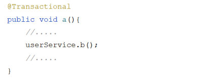
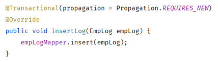
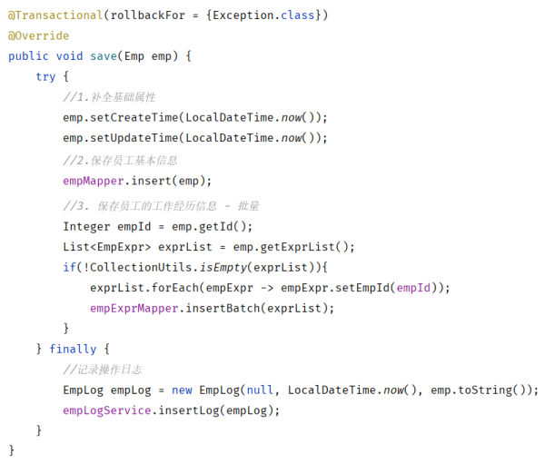

[70 篇](/posts/编程学习/javaweb学习笔记/70-事务管理与spring事务/)给 `save` 方法加上了 `@Transactional`，异常一抛，`emp` 和 `emp_expr` 就一起回滚了。但光有这一句注解还不够：**什么样的异常才会触发回滚**？**一个事务方法调用另一个事务方法时又该怎么算**？这一篇（PPT 第 23～26 页）把这两件事讲清楚，并落到一个真实需求上——"新增员工，无论成功还是失败，都要记录操作日志"。

## `rollbackFor`：默认只有运行时异常才回滚（PPT 第 23 页）

PPT 第 23 页一句话点出默认行为的漏洞：

> **`rollbackFor` 属性用于控制出现何种异常类型，回滚事务。（默认情况下，只有出现 `RuntimeException` 才会回滚）**

也就是说，只写 `@Transactional` 的时候，Spring 只在遇到"**运行时异常**"（`RuntimeException` 及其子类，比如 `ArithmeticException`、`NullPointerException`）时才回滚；碰上"**编译期异常**"（受检异常，比如 `IOException`、`SQLException`）——它**不回滚**！所以 PPT 给出的写法是：

```java
@Transactional(rollbackFor = {Exception.class})
@Override
public void save(Emp emp) {
    //1.保存员工基本信息
    emp.setCreateTime(LocalDateTime.now());
    emp.setUpdateTime(LocalDateTime.now());
    empMapper.insert(emp);

    //2. 保存员工的工作经历信息
    //... 省略
}
```

| 写法 | 回滚范围 |
| --- | --- |
| `@Transactional` | 只有 `RuntimeException`（运行时异常）及其子类才回滚 |
| `@Transactional(rollbackFor = {Exception.class})` | **任何 `Exception`** 都回滚（`Exception` 是所有异常的父类，运行时异常也包含在内） |

> [!IMPORTANT]
> 为什么课程/项目里几乎都写成 `rollbackFor = {Exception.class}`？因为业务代码里抛出的异常**不一定是运行时异常**：文件读写、数据库驱动、第三方接口都可能抛 `IOException`/`SQLException` 这类编译期异常。默认设置下它们一抛，**前面的插入不会回滚**——又回到了[69 篇](/posts/编程学习/javaweb学习笔记/69-新增员工/)那个"数据不一致"的坑。把回滚范围放宽到 `Exception`，才能保证"只要这个方法里有异常，就整体撤销"。

课程代码里有个细节印证了这一点：业务层的 `save` 声明了 `throws Exception`——

```java
// EmpService
void save(Emp emp) throws Exception;

// EmpServiceImpl
@Override
public void save(Emp emp) throws Exception { ... }

// EmpController
@PostMapping
public Result save(@RequestBody Emp emp) throws Exception {
    log.info("新增员工: {}", emp);
    empService.save(emp);
    return Result.success();
}
```

一路 `throws Exception`（`Exception` 是编译期异常/受检异常的顶层类型）就是为了能演示"编译期异常也会被回滚"这件事：如果 `save` 只声明运行时异常，编译都过不去。而回滚规则一旦配上 `rollbackFor = {Exception.class}`，无论抛的是运行时异常还是编译期异常，事务都回滚。

> [!TIP]
> **本机实测**：打开事务日志后，创建事务那一行日志里能看到这个规则：
>
> ```text
> Creating new transaction with name [com.itheima.service.impl.EmpServiceImpl.save]: PROPAGATION_REQUIRED,ISOLATION_DEFAULT,-java.lang.Exception
> ```
>
> 末尾那段 `-java.lang.Exception` 就是 `rollbackFor = {Exception.class}` 注册进去的**回滚规则**（不写 `rollbackFor` 时这一段不会出现）。这也是[70 篇](/posts/编程学习/javaweb学习笔记/70-事务管理与spring事务/)那段日志里唯一"多出来"的东西。

## 事务的传播行为 propagation（PPT 第 24 页）

第二个进阶点是"事务方法互相调用"时怎么办。PPT 第 24 页的定义：

> **事务传播行为**：指的就是当**一个事务方法被另一个事务方法调用**时，这个事务方法应该如何进行事务控制。

图上是这么一个模型——事务方法 `a()` 里调用了 `userService.b()`，那么 `b()` 自己是**加入** `a()` 的事务，还是**新建**一个事务？


*图：PPT 第 24 页配的示意代码——`@Transactional` 的 `a()` 方法在中间调用了 `userService.b()`；`b()` 运行时"事务怎么算"，由它的传播行为属性决定（图中两个词：加入 / 新建）*

```java
@Transactional
public void a() {
    //....
    userService.b();
    //....
}
```

Spring 一共提供了 7 种传播行为，PPT 列出了常用的 6 种：

| 属性值 | 含义 |
| --- | --- |
| **`REQUIRED`** | **【默认值】需要事务，有则加入，无则创建新事务** |
| **`REQUIRES_NEW`** | 需要新事务，**无论有无，总是创建新事务** |
| `SUPPORTS` | 支持事务，有则加入，无则在无事务状态中运行 |
| `NOT_SUPPORTED` | 不支持事务，在无事务状态下运行；如果当前存在已有事务，则**挂起**当前事务 |
| `MANDATORY` | 必须有事务，否则抛异常 |
| `NEVER` | 必须没事务，否则抛异常 |

两个最常用的记法：`REQUIRED`（默认）是"**有就加入、没有就新建**"，也就是"跟随调用者"；`REQUIRES_NEW` 是"**不管有没有，我自己开一个**"，也就是"和调用者各过各的"。

> [!NOTE]
> 另外还有一个 `NESTED`（嵌套事务，基于保存点），PPT 的表格里用省略号收尾没有列出——知道它存在即可，日常开发里最常打交道的还是 `REQUIRED` 和 `REQUIRES_NEW`。

## 必答问答（PPT 第 26 页）

| PPT 的问题 | 答案 |
| --- | --- |
| 事务的传播行为控制的是什么？ | **一个事务方法调用另外一个事务方法时，事务应该如何控制**（加入？新建？……） |
| 常见的传播行为及应用场景？ | **`REQUIRED`**：大部分场景（默认值，有则加入、无则新建）；**`REQUIRES_NEW`**：希望两个方法在**独立的事务**中运行、互不影响 |

## 案例：新增员工时记录操作日志（PPT 第 25 页）

PPT 第 25 页抛出需求：

> **需求：在新增员工信息时，无论是成功还是失败，都要记录操作日志。**
>
> 步骤：
> ① 准备日志表 `emp_log`、实体类 `EmpLog`、Mapper 接口 `EmpLogMapper`
> ② 在新增员工时记录日志

这个需求正好用得上 `REQUIRES_NEW`。"无论成败都要记录"意味着：**主事务（新增员工）回滚的时候，日志不能跟着回滚**——所以日志必须跑在**它自己的新事务**里。

### ① 建表、实体类、Mapper

日志表的建表脚本（课程资料 `03. 事务进阶素材/emp_log.sql`）：

```sql
-- 创建员工日志表
create table emp_log(
    id int unsigned primary key auto_increment comment 'ID, 主键',
    operate_time datetime comment '操作时间',
    info varchar(2000) comment '日志信息'
) comment '员工日志表';
```

实体类（三个字段 + Lombok 的全参/无参构造——下面 `new EmpLog(null, LocalDateTime.now(), ...)` 用的就是全参构造）：

```java
@Data
@NoArgsConstructor
@AllArgsConstructor
public class EmpLog {
    private Integer id; //ID
    private LocalDateTime operateTime; //操作时间
    private String info; //详细信息
}
```

Mapper 就一句 insert：

```java
@Mapper
public interface EmpLogMapper {

    @Insert("insert into emp_log (operate_time, info) values (#{operateTime}, #{info})")
    public void insert(EmpLog empLog);

}
```

日志的业务层单独一个 Service，**关键在那一行传播行为**：

```java
public interface EmpLogService {
    public void insertLog(EmpLog empLog);
}

@Service
public class EmpLogServiceImpl implements EmpLogService {

    @Autowired
    private EmpLogMapper empLogMapper;

    @Transactional(propagation = Propagation.REQUIRES_NEW) //需要在一个新的事务中运行
    @Override
    public void insertLog(EmpLog empLog) {
        empLogMapper.insert(empLog);
    }
}
```


*图：PPT 第 25 页配的 `insertLog` 方法——注解里写着 `propagation = Propagation.REQUIRES_NEW`，意思是"这个方法必须在自己的新事务里跑"；所以外层的新增员工事务即使回滚，这条日志也不会被撤销*

> [!IMPORTANT]
> `propagation = Propagation.REQUIRES_NEW` 就是本案例的核心：如果这里用**默认的 `REQUIRED`**，`insertLog` 会**加入**外层 `save` 的事务——外层一回滚，日志也被一起撤销，"无论成功失败都要记录"就成了空话。

### ② 在新增员工时记录日志

回到 `EmpServiceImpl.save`，把整段业务用 `try` 包起来，日志写在 `finally` 里：

```java
@Transactional(rollbackFor = {Exception.class}) //事务管理 - 默认出现运行时异常RuntimeException才会回滚
@Override
public void save(Emp emp) throws Exception {
    try {
        //1. 保存员工基本信息
        emp.setCreateTime(LocalDateTime.now());
        emp.setUpdateTime(LocalDateTime.now());
        empMapper.insert(emp);

        //2. 保存员工工作经历信息
        List<EmpExpr> exprList = emp.getExprList();
        if(!CollectionUtils.isEmpty(exprList)){
            //遍历集合, 为empId赋值
            exprList.forEach(empExpr -> {
                empExpr.setEmpId(emp.getId());
            });
            empExprMapper.insertBatch(exprList);
        }
    } finally {
        //记录操作日志
        EmpLog empLog = new EmpLog(null, LocalDateTime.now(), "新增员工:" + emp);
        empLogService.insertLog(empLog);
    }
}
```


*图：PPT 第 25 页配的完整 `save` 方法——`@Transactional(rollbackFor = {Exception.class})` 管住两次插入，`finally` 里调 `empLogService.insertLog(...)` 写日志；PPT 图上日志内容是 `emp.toString()`，课程代码工程里写的是 `"新增员工:" + emp`，两种写法效果一样*

三个要点：

- **为什么用 `finally`**：`try` 里的代码不管正常跑完还是中途抛异常，`finally` 块**一定会执行**——日志正好要"无论成功失败都记录"；`id` 传 `null` 是因为主键自增（[69 篇](/posts/编程学习/javaweb学习笔记/69-新增员工/)的主键返回管的是 `emp`，日志这条记录自己不需要 id）；
- **这里不能 `catch` 异常**：`try` 只配 `finally`、不配 `catch`，异常会照原样往外抛——外面（事务管理器）才能看到"出异常了"并回滚。如果顺手 `catch` 掉，异常被吞了，事务反而**不会**回滚；
- **日志方法必须独立事务**：`insertLog` 上的 `REQUIRES_NEW` 会让 Spring 在调用它时**挂起**外层事务、另开一个连接干这件事（下面实测的日志里能直接看到"挂起/恢复"）。

## 本机实测：主事务回滚了，日志还在

这一节的两个实验是本篇最有说服力的证据——它们同时证明了 `rollbackFor`、`REQUIRES_NEW` 和[70 篇](/posts/编程学习/javaweb学习笔记/70-事务管理与spring事务/)的回滚。

> [!TIP]
> **本机实测（一）：抛 `1/0` 之后——数据全回滚，日志留下**
>
> 配置就是上面那份代码（`save` 上有 `rollbackFor = {Exception.class}`，`insertLog` 上有 `REQUIRES_NEW`），在 `empMapper.insert(emp);` 后面插入 `int i = 1 / 0;`，构建启动后发一次新增员工请求（用户名 testuser02）：
>
> ```text
> # 响应
> HTTP 状态码 500
>
> # 服务端日志（摘录，顺序与原日志一致）
> Creating new transaction with name [com.itheima.service.impl.EmpServiceImpl.save]: PROPAGATION_REQUIRED,ISOLATION_DEFAULT,-java.lang.Exception
> ==>  Preparing: insert into emp(username, name, gender, phone, ...) values (?, ?, ?, ?, ...)
> <==    Updates: 1
> Suspending current transaction, creating new transaction with name [com.itheima.service.impl.EmpLogServiceImpl.insertLog]
> Creating a new SqlSession … ==>  Preparing: insert into emp_log (operate_time, info) values (?, ?)
> <==    Updates: 1
> Initiating transaction commit
> Committing JDBC transaction on Connection [HikariProxyConnection@…]          ← 日志事务先提交
> Resuming suspended transaction after completion of inner transaction          ← 外层事务被恢复
> Initiating transaction rollback
> Rolling back JDBC transaction on Connection [HikariProxyConnection@…]        ← 外层主事务回滚
>
> # 查库
> emp 表里 testuser02 → 0 条                        ← 回滚了
> emp_expr 表里对应记录 → 0 条                       ← 回滚了
> emp_log 表 → 有 1 条：新增员工:Emp(id=39, username=testuser02, ...)（时间 20:19:53）   ← 没有回滚！
> ```
>
> 逐句读这段日志：
>
> 1. **`Creating new transaction ... [EmpServiceImpl.save]`**：进入 `save` 方法时开了一个主事务（[70 篇](/posts/编程学习/javaweb学习笔记/70-事务管理与spring事务/)的内容）；
> 2. **`insert into emp ... <== Updates: 1`**：员工确实插进去了（但还没提交）；
> 3. **`Suspending current transaction, creating new transaction with name [EmpLogServiceImpl.insertLog]`**：`REQUIRES_NEW` 生效——Spring 把外层事务**挂起**，为日志方法**新建**了一个事务（日志里 `Suspending` 这个词就是证据）；
> 4. **`insert into emp_log ... <== Updates: 1` → `Initiating transaction commit`**：日志在自己的事务里**提交**了；
> 5. **`Resuming suspended transaction ...`**：日志事务结束，外层事务恢复；
> 6. **`1/0` 抛出异常 → `Initiating transaction rollback` / `Rolling back JDBC transaction`**：主事务回滚，员工和工作经历全部撤销。
>
> 两个结论：① `rollbackFor = {Exception.class}` + `@Transactional` 让"两次插入"**要么都成功、要么都失败**；② `REQUIRES_NEW` 让日志**独立于主事务**——所以出现了"**数据没了、日志留着**"这个看似矛盾、实则正是需求所要的结果："无论成功失败都要记录操作日志"。

> [!TIP]
> **本机实测（二）：去掉 `@Transactional` 的反面对照——数据不一致**
>
> 把 `save` 上的 `@Transactional(rollbackFor = {Exception.class})` **注释掉**，`1/0` 依旧保留，重新构建启动后发同样的请求（用户名 testuser03）：
>
> ```text
> # 响应
> HTTP 状态码 500
>
> # 查库
> emp 表：有 testuser03（id=40）      ← 插入成功了！
> emp_expr 表：0 条                    ← 工作经历没保存
>
> # 日志
> Creating new transaction with name [com.itheima.service.impl.EmpLogServiceImpl.insertLog]: PROPAGATION_REQUIRES_NEW,ISOLATION_DEFAULT
> ```
>
> 这就是[69 篇](/posts/编程学习/javaweb学习笔记/69-新增员工/)第 11 页说的"**数据的不完整、不一致**"：员工有了、他的工作经历丢了。
>
> 顺带一个有价值的细节：这次外层**没有**事务，`insertLog` 的日志变成 `PROPAGATION_REQUIRES_NEW,ISOLATION_DEFAULT`，而且**没有** `Suspending`/`Resuming` 那两行——因为没有外层事务可挂起，`REQUIRES_NEW` 就只是"开一个新事务"而已。（对比实验一里的 `Suspending current transaction, creating new transaction`，能看出"挂起"确实是 `REQUIRES_NEW` 在**已有事务**中运行时的独有动作。）
> （本机连的是 MySQL 的 `tlias` 库、用户名 `root`；`password` 换成你自己 MySQL 的密码。）

## 小结

| 问题 | 答案 |
| --- | --- |
| `rollbackFor` 管什么？ | 控制**出现何种异常类型才回滚**事务 |
| 默认只回滚什么异常？ | **只有 `RuntimeException`**（运行时异常）才回滚；编译期异常（如 `IOException`/`SQLException`）默认**不回滚** |
| 所以平时怎么写？ | `@Transactional(rollbackFor = {Exception.class})`——任何 `Exception` 都回滚（`Exception` 是运行时异常的父类，一并覆盖） |
| 怎么在日志里看到它？ | 事务定义字符串末尾的 `-java.lang.Exception`（不写 `rollbackFor` 时不会出现） |
| 事务传播行为是什么？ | **一个事务方法被另一个事务方法调用时，这个事务方法应该如何进行事务控制**（加入？新建？……） |
| 最常用的两个属性值？ | `REQUIRED`（**默认**，有则加入、无则新建——大部分场景）、`REQUIRES_NEW`（无论有无总是新建——**两个方法在独立事务中互不影响**） |
| 其余几个属性值？ | `SUPPORTS`（有则加入、无则无事务运行）、`NOT_SUPPORTED`（无事务运行，有则挂起）、`MANDATORY`（必须有事否则抛异常）、`NEVER`（必须没事否则抛异常） |
| 日志案例的需求？ | 新增员工时**无论成功还是失败都要记录操作日志**；步骤：① 准备 `emp_log` 表、`EmpLog` 实体类、`EmpLogMapper` ② 在新增员工时记录日志 |
| 为什么日志方法要 `REQUIRES_NEW`？ | 用默认的 `REQUIRED` 会加入外层事务，外层一回滚日志也没了——独立事务才能保证"主事务失败、日志仍在" |
| 为什么日志写在 `finally` 里？ | 不管 `try` 里成功还是抛异常，`finally` 一定执行；而且**不能 `catch`**，否则异常被吞掉、主事务反而不会回滚 |
| 本机实测两个结果？ | 有事务 + `1/0`：HTTP **500**，`emp`/`emp_expr` **0 条**、`emp_log` **1 条**（日志里有 `Suspending … insertLog` / `Resuming suspended transaction`）；去掉 `@Transactional`：`emp` 有 testuser03（id=40）、`emp_expr` **0 条**——数据不一致 |

## 相关

- [上一篇：事务管理与Spring事务](/posts/编程学习/javaweb学习笔记/70-事务管理与spring事务/)
- [下一篇：文件上传](/posts/编程学习/javaweb学习笔记/72-文件上传/)

## 练习题

### 一、知识回顾（读完直接做下面的实践题）

1. **`rollbackFor` 的作用**：控制**出现何种异常类型**时回滚事务
2. **默认行为（重点）**：`@Transactional` 默认**只有出现 `RuntimeException`（运行时异常）才回滚**；编译期异常（受检异常，如 `IOException`、`SQLException`）**不会**触发回滚
3. **推荐写法**：`@Transactional(rollbackFor = {Exception.class})`——`Exception` 是所有异常的父类，运行时/编译期异常都能回滚
4. **课程代码里的 `throws Exception`**：`EmpService.save`、`EmpServiceImpl.save`、`EmpController.save` 一路声明 `throws Exception`，就是为了能演示"编译期异常也回滚"
5. **日志里怎么认它**：事务定义字符串末尾的 `-java.lang.Exception`（例如 `PROPAGATION_REQUIRED,ISOLATION_DEFAULT,-java.lang.Exception`）
6. **事务传播行为的定义**：**一个事务方法被另一个事务方法调用时，这个事务方法应该如何进行事务控制**
7. **六个属性值**：`REQUIRED`（默认，有则加入、无则新建）、`REQUIRES_NEW`（无论有无总是新建）、`SUPPORTS`（有则加入、无则无事务运行）、`NOT_SUPPORTED`（无事务运行，有则挂起当前事务）、`MANDATORY`（必须有事务否则抛异常）、`NEVER`（必须没事务否则抛异常）
8. **场景选择**：`REQUIRED` 用于大部分场景；`REQUIRES_NEW` 用于"希望两个方法在独立事务中运行、互不影响"
9. **日志案例的准备工作**：创建 `emp_log` 表（`id` 主键自增、`operate_time`、`info`）+ `EmpLog` 实体类 + `EmpLogMapper`（一句 `@Insert`）+ 带 `REQUIRES_NEW` 的 `EmpLogService.insertLog`
10. **"无论成败都要记录"怎么实现**：`save` 用 `try { 两次插入 } finally { insertLog }`，日志方法用 `REQUIRES_NEW` 开独立事务；**不能 catch 异常**（吞掉异常主事务就不回滚了）
11. **本机实测（有事务）**：`1/0` → HTTP **500**，`emp`/`emp_expr` **0 条**，但 `emp_log` **有 1 条**；日志里能看到 `Suspending current transaction, creating new transaction … [insertLog]` 与 `Resuming suspended transaction`
12. **本机实测（去掉事务）**：`emp` 有 testuser03（id=40）、`emp_expr` **0 条**——就是 PPT 第 11 页说的数据不完整、不一致

### 二、裸写题

- [ ] **2-1 让业务方法里"任何异常"都能触发回滚**
  需求：现在的保存方法上贴了一个事务注解，但只有一类异常会回滚——文件读写、数据库驱动抛出的那类异常（编译器会强制要求处理的）如果发生，前面的插入**不会**被撤销。请把注解改成"只要这个方法里有异常就回滚"，并说明为什么这么改。
  （练习文件 `test_71_事务进阶与操作日志.java` 的题目2-1 里给了写作区。）

  > [!TIP]- 提示（先自己想，实在想不出再点开）
  > **一级 · 思路**：默认的回滚判断只看"运行时异常"；要让"编译期异常"也算数，得在注解上显式声明"哪种异常要回滚"，而且范围要覆盖所有异常
  > **二级 · 方法**：`@Transactional(rollbackFor = {Exception.class})`——`rollbackFor` 属性就是"出现何种异常类型回滚事务"；`Exception` 是所有异常的父类
  > **三级 · 骨架**：`@Transactional(____ = {Exception.class})`；说明写清楚：默认只回滚 `____`，编译期异常不回滚，所以要用父类 `Exception` 把范围放大

  > [!TIP]- 参考答案（做完再点开）
  > ```java
  > @Transactional(rollbackFor = {Exception.class}) //默认出现运行时异常RuntimeException才会回滚
  > @Override
  > public void save(Emp emp) throws Exception {
  >     //1. 保存员工基本信息
  >     emp.setCreateTime(LocalDateTime.now());
  >     emp.setUpdateTime(LocalDateTime.now());
  >     empMapper.insert(emp);
  >
  >     //2. 保存员工的工作经历信息
  >     List<EmpExpr> exprList = emp.getExprList();
  >     if(!CollectionUtils.isEmpty(exprList)){
  >         exprList.forEach(empExpr -> empExpr.setEmpId(emp.getId()));
  >         empExprMapper.insertBatch(exprList);
  >     }
  > }
  > ```
  > 说明：`@Transactional` 默认**只对 `RuntimeException` 回滚**（PPT 第 23 页），而 `save` 里可能出现的 `IOException`、`SQLException` 都是**编译期异常**，默认不回滚——那样 `emp` 插进去了、后续失败也不会撤销，又回到"数据不一致"。加上 `rollbackFor = {Exception.class}` 后，**任何 `Exception`** 都会回滚（`Exception` 是 `RuntimeException` 的父类，两者都覆盖）。本机实测的事务日志里能看到这条规则：`PROPAGATION_REQUIRED,ISOLATION_DEFAULT,-java.lang.Exception`。

- [ ] **2-2 新增员工时记录一条操作日志（无论成功失败）**
  需求：新增员工这件事要在数据库里留下痕迹——**无论这次新增是成功还是失败，都要记一条日志**（记录操作时间和详细信息）。请把该准备的东西准备齐：一张日志表（主键自增、操作时间、日志信息三个字段）、对应的实体类、写一条插入语句的数据访问接口，以及一个专门负责写日志的业务方法；最后修改"新增员工"的业务方法，让它在成功和失败两种情况下都会去写这条日志。
  （练习文件 `test_71_事务进阶与操作日志.java` 的题目2-2 里给了写作区。）

  > [!TIP]- 提示（先自己想，实在想不出再点开）
  > **一级 · 思路**：表（`emp_log`）→ 实体类（`EmpLog`）→ Mapper（`EmpLogMapper.insert`）→ 日志 Service（`EmpLogService.insertLog`）→ 在 `save` 里调它；"无论成败"意味着要放在 `try` 的 `finally` 里
  > **二级 · 方法**：建表 SQL 用 `create table emp_log(...)`；实体类用 `@Data` + `@NoArgsConstructor` + `@AllArgsConstructor`（`new EmpLog(null, LocalDateTime.now(), info)` 需要全参构造）；Mapper 用 `@Insert("insert into emp_log (operate_time, info) values (#{operateTime}, #{info})")`；`save` 里 `try { … } finally { empLogService.insertLog(...) }`
  > **三级 · 骨架**：
  > - 建表：`create table emp_log( id int unsigned primary key auto_increment, operate_time datetime, info varchar(2000) );`
  > - 实体类：`private Integer id; private LocalDateTime ____; private String ____;`
  > - Mapper：`@Insert("insert into emp_log (operate_time, info) values (#{____}, #{____})") void insert(EmpLog empLog);`
  > - `save`：`try { 两次插入 } finally { empLogService.____(new EmpLog(null, LocalDateTime.now(), "新增员工:" + emp)); }`

  > [!TIP]- 参考答案（做完再点开）
  > ```sql
  > -- 创建员工日志表
  > create table emp_log(
  >     id int unsigned primary key auto_increment comment 'ID, 主键',
  >     operate_time datetime comment '操作时间',
  >     info varchar(2000) comment '日志信息'
  > ) comment '员工日志表';
  > ```
  > ```java
  > @Data
  > @NoArgsConstructor
  > @AllArgsConstructor
  > public class EmpLog {
  >     private Integer id;            //ID
  >     private LocalDateTime operateTime; //操作时间
  >     private String info;           //详细信息
  > }
  >
  > @Mapper
  > public interface EmpLogMapper {
  >     @Insert("insert into emp_log (operate_time, info) values (#{operateTime}, #{info})")
  >     public void insert(EmpLog empLog);
  > }
  >
  > public interface EmpLogService {
  >     public void insertLog(EmpLog empLog);
  > }
  >
  > @Service
  > public class EmpLogServiceImpl implements EmpLogService {
  >     @Autowired
  >     private EmpLogMapper empLogMapper;
  >
  >     @Override
  >     public void insertLog(EmpLog empLog) {
  >         empLogMapper.insert(empLog);
  >     }
  > }
  >
  > // EmpServiceImpl.save：业务用 try 包住，日志写在 finally（无论成败都会执行）
  > @Override
  > public void save(Emp emp) throws Exception {
  >     try {
  >         //1. 保存员工基本信息
  >         emp.setCreateTime(LocalDateTime.now());
  >         emp.setUpdateTime(LocalDateTime.now());
  >         empMapper.insert(emp);
  >
  >         //2. 保存员工工作经历信息
  >         List<EmpExpr> exprList = emp.getExprList();
  >         if(!CollectionUtils.isEmpty(exprList)){
  >             exprList.forEach(empExpr -> empExpr.setEmpId(emp.getId()));
  >             empExprMapper.insertBatch(exprList);
  >         }
  >     } finally {
  >         //记录操作日志
  >         EmpLog empLog = new EmpLog(null, LocalDateTime.now(), "新增员工:" + emp);
  >         empLogService.insertLog(empLog);
  >     }
  > }
  > ```
  > 自查：① `id` 传 `null`——它是自增主键，不由这里给；② `try` 里**不要写 `catch`**：异常被吞掉的话外面就不知道出过错，主事务不会回滚（这一题只解决"日志要留下"，回滚交给 2-1 的注解）；③ `EmpLog` 需要全参构造，别忘了 Lombok 的 `@AllArgsConstructor`。

- [ ] **2-3 让日志在主事务回滚时仍然留下来**
  需求：现在日志能写了，但是有个致命问题——把 2-2 的代码和事务管理一起用的时候，一旦"新增员工"失败回滚，那条日志**也跟着消失了**，"无论成功失败都要记录"根本没做到。请让写日志的那一步不受主事务进退的影响，并说明现象：改造后，失败一次之后数据库里应该能查到什么。
  （练习文件 `test_71_事务进阶与操作日志.java` 的题目2-3 里给了写作区。）

  > [!TIP]- 提示（先自己想，实在想不出再点开）
  > **一级 · 思路**：日志方法默认会"加入"外层事务，所以外层一回滚它也回滚；要让它自己开一个事务，就得改它的**传播行为**
  > **二级 · 方法**：在 `EmpLogServiceImpl.insertLog` 上加 `@Transactional(propagation = Propagation.REQUIRES_NEW)`；日志里会出现 `Suspending current transaction, creating new transaction with name [...insertLog]` 和 `Resuming suspended transaction`
  > **三级 · 骨架**：`@Transactional(____ = Propagation.____)` \(+ `@Override`\) `public void insertLog(EmpLog empLog) { empLogMapper.insert(empLog); }`；现象：主事务回滚后 `emp`/`emp_expr` ____ 条、`emp_log` ____ 条

  > [!TIP]- 参考答案（做完再点开）
  > ```java
  > @Service
  > public class EmpLogServiceImpl implements EmpLogService {
  >
  >     @Autowired
  >     private EmpLogMapper empLogMapper;
  >
  >     @Transactional(propagation = Propagation.REQUIRES_NEW) //需要在一个新的事务中运行
  >     @Override
  >     public void insertLog(EmpLog empLog) {
  >         empLogMapper.insert(empLog);
  >     }
  > }
  > ```
  > 说明：默认传播行为是 `REQUIRED`（有事务就**加入**），所以 `insertLog` 会跟着 `save` 的事务一起回滚。改成 `REQUIRES_NEW` 之后，Spring 在调用它时**挂起**外层事务、**新建**一个事务去写日志并提交，主事务后面无论提交还是回滚都不影响它。
  > **本机实测**（`1/0` 场景）：HTTP **500**；`emp` 里 0 条、`emp_expr` 里 0 条，但 `emp_log` 里**有 1 条** `新增员工:Emp(id=39, username=testuser02, ...)`。日志里那两行 `Suspending current transaction, creating new transaction with name [com.itheima.service.impl.EmpLogServiceImpl.insertLog]` 和 `Resuming suspended transaction after completion of inner transaction` 就是证据。

### 三、综合题

- [ ] **3-1 把"新增员工"做成事务 + 日志的完整版本，并用两个对照实验回答三个问题**
  这一题把第 70、71 篇合起来跑一遍，重点是用**日志 + 数据库**把结论钉死。
  1. 准备：建 `emp_log` 表，写 `EmpLog`、`EmpLogMapper`、`EmpLogService`/`EmpLogServiceImpl`（日志方法用独立事务）；
  2. 业务层：`save` 加"任何异常都回滚"的注解，业务代码用 `try` 包住、日志写在 `finally`，配置文件打开事务管理的 debug 日志；
  3. 启动工程，先发一次**正常**请求，确认响应成功、`emp` 与 `emp_expr` 都有数据、`emp_log` 也多了一条；
  4. 对照实验一：在保存基本信息之后插入 `int i = 1 / 0;`，重新构建启动，换个用户名再发一次——记录状态码、查库三个表各有多少条，并把日志里"挂起"/"恢复"/"回滚"那几行抄下来；
  5. 对照实验二：把 `save` 上的事务注解注释掉（`1/0` 保留），再发一次——记录 `emp`、`emp_expr` 各有多少条，和你预想的对不对得上；
  6. 收尾回答三个问题。

  （练习文件 `test_71_事务进阶与操作日志.java` 的"综合题"一段里按这 6 步给了写作区。）

  回答：① 实验一里为什么"员工没了、日志却还在"？（分别说明是哪两个设置起的作用）② 实验二的结果说明了什么？③ 如果想要"实验一那种失败也回滚、日志也保留"的效果，三个注解（`rollbackFor`、传播行为、以及第 70 篇的 `@Transactional`）分别负责哪一件事？

  **涉及知识点**

  | 知识点 | 在这里的应用 |
  | --- | --- |
  | `@Transactional`（70 篇 / PPT 21） | 第 2 步——把两次插入包成一个事务 |
  | `rollbackFor`（PPT 23） | 第 2、4 步——让任何异常都回滚（日志里的 `-java.lang.Exception`） |
  | 传播行为表（PPT 24） | 第 1、4 步——`REQUIRED` 与 `REQUIRES_NEW` 的差别 |
  | 日志案例（PPT 25） | 第 1、2 步——`emp_log` 表 + `EmpLog` + `EmpLogMapper` + `try/finally` |
  | 必答问答（PPT 26） | 第 6 步——传播行为控制什么、两个常用值的场景 |
  | 数据不一致（PPT 11 / 70 篇实测） | 第 5 步——去掉事务后的 `emp` 有、`emp_expr` 没有 |

  > [!TIP]- 提示（先自己想，实在想不出再点开）
  > **一级 · 思路**：先做"成功路径"，再用 `1/0` 做"失败路径"，最后把事务注解去掉做"裸奔路径"——三条路径的查库结果放在一起看，注解各自的作用就一目了然
  > **二级 · 方法**：`@Transactional(rollbackFor = {Exception.class})` 管主事务；`@Transactional(propagation = Propagation.REQUIRES_NEW)` 管日志；查库用 `select * from emp where username = '...'`、`select * from emp_expr where emp_id = ...`、`select * from emp_log;`
  > **三级 · 骨架**：① 日志 Service：`@Transactional(propagation = ____.____)`；② `save`：`@Transactional(____ = {Exception.class})` + `try { … } ____ { empLogService.insertLog(…); }`；③ 查库三句：`select count(*) from emp where username = '____';`、`select count(*) from emp_expr where emp_id = ____;`、`select count(*) from emp_log;`

  > [!TIP]- 参考答案（做完再点开）
  > 1~2. 代码见 2-1、2-2、2-3 的参考答案；日志配置见[70 篇](/posts/编程学习/javaweb学习笔记/70-事务管理与spring事务/)（`org.springframework.jdbc.support.JdbcTransactionManager: debug`）。
  > 3. **本机实测**：响应 `{"code":1,"msg":"success","data":null}`；`emp` 生成 id=38、`emp_expr` 2 条（`emp_id`=38）、`emp_log` 1 条。
  > 4. **本机实测（实验一）**：HTTP **500**；`emp` **0 条**、`emp_expr` **0 条**、`emp_log` **1 条**（`新增员工:Emp(id=39, username=testuser02, ...)`）。日志关键行：
  >    ```text
  >    Suspending current transaction, creating new transaction with name [com.itheima.service.impl.EmpLogServiceImpl.insertLog]
  >    Initiating transaction commit
  >    Committing JDBC transaction on Connection [HikariProxyConnection@…]      ← 日志事务提交
  >    Resuming suspended transaction after completion of inner transaction
  >    Initiating transaction rollback
  >    Rolling back JDBC transaction on Connection [HikariProxyConnection@…]    ← 主事务回滚
  >    ```
  > 5. **本机实测（实验二）**：HTTP **500**；`emp` 里**有** testuser03（id=40）、`emp_expr` **0 条**——两次插入里第一次生效、第二次失败，数据不完整、不一致（和预想的一致：没有事务，就没有"同生共死"）。
  > 6. 三个回答：
  >    ① "员工没了"是 **`@Transactional` + `rollbackFor = {Exception.class}`** 的效果——主事务在异常后整体回滚；"日志还在"是 **`propagation = Propagation.REQUIRES_NEW`** 的效果——日志在自己的事务里提前提交了，主事务回滚波及不到它（日志里 `Suspending …` → `Committing JDBC transaction` → `Initiating transaction rollback` 的顺序就是全过程）。
  >    ② 说明**没有事务管理时两次插入是各自独立的**：第一条 `insert into emp` 自动提交后就已经永久生效，后面的异常只能让它后面的操作不执行，管不了已经提交的数据——这正是"必须加事务"的理由。
  >    ③ 分工：**`@Transactional`** 决定"这个方法要由 Spring 管事务"（进入方法前开启、结束提交/回滚）；**`rollbackFor`** 决定"哪些异常算失败、要触发回滚"（默认只认 `RuntimeException`，所以要放宽到 `Exception`）；**传播行为（`REQUIRES_NEW`）** 决定"这个方法被别的事务方法调用时，是加入对方的事务还是自己新开一个"——日志必须自己新开，才能做到"无论成功失败都记录"。
