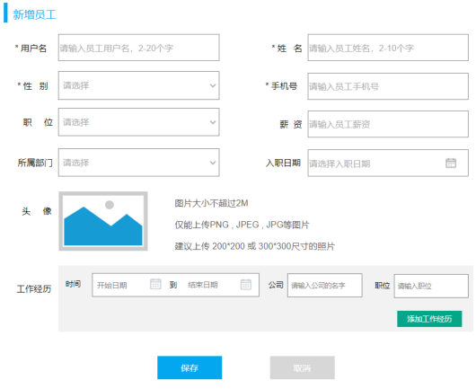

[71 篇](/posts/编程学习/javaweb学习笔记/71-事务进阶与操作日志/)把事务进阶讲完了（`rollbackFor`、`propagation`、操作日志），员工新增那条链路上的数据一致性算是解决了。这一篇（PPT 第 29-38 页）换一个问题：**员工新增表单里的"头像"怎么存？**用户在自己电脑（或手机）上选一张图片，点保存，图片得跑到服务器上去——这就是**文件上传**。

本篇只讲前两格：**什么是文件上传**、**服务端怎么接收**、**怎么存到服务器本地磁盘**、**本地存储有什么毛病**；PPT 第 31 页那三格小节目录里的第三格"**阿里云OSS**"是 [73 篇](/posts/编程学习/javaweb学习笔记/73-阿里云oss与参数配置化/) 的内容。

## 从 Tlias 的新增员工表单说起（PPT 第 29-31 页）

PPT 第 29 页是"文件上传"这一节的导航页（"新增员工 / 文件上传"两格，配的图就是**新增员工弹窗**），第 30 页是本章的三格目录（新增员工 / 事务管理 / 文件上传），第 31 页把本节拆成三格小节目录：**简介**、**本地存储**、**阿里云OSS**（第 34、38 页是同一个目录页，用来标记"现在讲到哪一格了"）。

导航页为什么配"新增员工"的图？因为文件上传在这个项目里就是从新增员工表单进去的——表单里有一格"**头像**"，员工表 `emp` 里也有对应的 `image` 字段：


*图：Tlias 新增员工弹窗的"头像"区——点加号就能选一张本地图片传上去，旁边还写着要求：图片大小不超过 2M、仅能上传 PNG / JPG / JPEG、建议 200\*200 或 300\*300 尺寸*

也就是说，"员工新增"这个功能除了把表单里的文字信息存进 `emp` 表，还得**把用户选的图片文件本身存到某个地方**，`image` 字段里放的是这个文件的位置（或者能访问到它的地址）。存到哪、怎么存，就是本节要回答的问题。

> [!NOTE]
> 本节内容在课程资料里的位置：页面原型 `资料/04. 文件上传/upload.html`（一个最小的上传页面），课程工程里也放了一份 `src/main/resources/static/upload.html`，两份内容一样。

## 什么是文件上传（PPT 第 32 页）

PPT 第 32 页给的定义是：

> **文件上传**：是指将**本地图片、视频、音频等文件**上传到**服务器**，供其他用户浏览或下载的过程。
> 文件上传在项目中应用非常广泛，我们经常发微博、发微信朋友圈都用到了文件上传功能。

这一页配了四张图，把"应用非常广泛"这句话铺开了——它们其实代表四种不同的"选文件"场景：


*图：发朋友圈/微博的界面——写完"这一刻的想法"再配几张图，这几张图就是先上传到服务器、别人才能看到*


*图：手机端选图界面（相册里勾选图片）——移动端的"选择本地文件"就是打开系统相册*


*图：Windows 的"打开"对话框——PC 端点"选择文件"后弹出的就是它，选中的是本地磁盘上的 jpg*

加上前面那张 Tlias 新增员工弹窗，四张图讲的其实是同一件事：**用户在自己设备上挑一个本地文件，交给远端的服务器**。把这件事拆成步骤看，前后端各管一段：

| 步骤 | 谁负责 | 干什么 |
| --- | --- | --- |
| ① 选文件 | 前端页面 | 弹出一个选择框（手机上就是相册、电脑上就是文件对话框），用户选中本地文件 |
| ② 提交文件 | 前端页面 | 表单把文件内容**连同其它表单项**一起发给服务器 |
| ③ 接收文件 | 服务端 | 用 `MultipartFile` 把上传上来的文件接住 |
| ④ 保存文件 | 服务端 | 存到本地磁盘（本节）或上传到云存储（下一篇） |
| ⑤ 访问文件 | 所有人 | 通过一个 URL 浏览或下载这个文件（发朋友圈时别人看到的图，就是这么来的） |

## 前端页面三要素（PPT 第 33 页）

PPT 第 33 页先给了一个能上传文件的完整页面（课程资料 `资料/04. 文件上传/upload.html`，工程 `static/upload.html` 与它一致）：

```html
<form action="/upload" method="post" enctype="multipart/form-data">
    姓名: <input type="text" name="name" > <br>
    年龄: <input type="text" name="age" > <br>
    图像: <input type="file" name="file" > <br>
    <input type="submit" value="上传文件" name="submit">
</form>
```

它比普通表单只多了"一丢丢"东西，但**这三样一个都不能少**（PPT 里叫"前端页面三要素"）：

| 要求 | 写法 | 为什么必须这样 |
| --- | --- | --- |
| **提交方式必须是 POST** | `<form action="/upload" method="post">` | 文件内容很大，没法像查询参数那样塞进 URL 里（URL 长度有限、还可能被日志和浏览器历史记录带走）；只有请求体（POST 才有）才装得下二进制内容 |
| **编码方式必须是 multipart/form-data** | `enctype="multipart/form-data"` | 表单默认的编码方式是 `application/x-www-form-urlencoded`，它把表单项拼成 `name=张三&age=20` 这种**纯文本**，二进制文件根本没法这么表示；`multipart/form-data` 会把表单**切成多段**（每一段是一个表单项），文件单独占一段、以二进制原样发送 |
| **必须有文件输入框** | `<input type="file" name="file">` | 页面上要有"选文件"的入口；它的 `name`（这里是 `file`）就是**服务端接收文件时的参数名**，必须对得上 |

> [!IMPORTANT]
> 三要素里最容易漏的是 `enctype`：表单照样能提交、请求也能到服务端，但服务端拿到的是空文件或直接报错——因为文件根本没被发出去。

> [!NOTE]
> 这个页面怎么访问？它放在工程的 `src/main/resources/static/` 目录下，SpringBoot 会把 `static` 里的文件当成静态资源直接提供，所以启动工程后打开 `http://localhost:8080/upload.html` 就能看到表单。`action="/upload"` 是提交的地址，要和 Controller 上 `@PostMapping("/upload")` 对得上。

### 服务端接收文件（PPT 第 33 页）

PPT 第 33 页给出的接收端代码：

```java
@Slf4j
@RestController
public class UploadController {

    @PostMapping("/upload")
    public Result handleFileUpload(String name, Integer age, MultipartFile file) {
        log.info("文件上传:{}", file);
        return Result.success();
    }
}
```

几个要点：

- **`MultipartFile`**：Spring 提供的接口，代表"这次请求里上传上来的那个文件"。方法参数里写一个这种类型的参数，Spring 就会自动把请求里的文件装进它；
- **参数名要跟表单对上**：表单里是 `<input type="file" name="file">`，方法参数就叫 `file`；名字不一致，Spring 找不到对应那一段，参数会是 `null`；
- **普通表单项照常接收**：`name`、`age` 这些文字项还是按名字接收，和文件一起发过来也互不影响（本机实测的那次请求就是 `name=张三`、`age=20`、`file=@small.png` 一起发的）；
- **这一步只是"接住"，还没存**：`log.info("文件上传:{}", file)` 打出来的是这个对象的 `toString`（里面能看到原始文件名、大小、是否为空这些信息），文件此刻还在**临时目录**里，请求结束就没了。

## 本地存储（PPT 第 34-35 页）

PPT 第 34 页又切回那张小节目录（这一格是"**本地存储**"），第 35 页给了把文件存到服务器磁盘的代码：

```java
@PostMapping("/upload")
public Result handleFileUpload(MultipartFile file) throws Exception {
    log.info("文件上传:{}", file);

    // 生成唯一文件名
    String uniqueFileName = generateUniqueFileName(file.getOriginalFilename());

    // 保存文件
    file.transferTo(new File("D:/images/" + uniqueFileName));

    return Result.success();
}

private String generateUniqueFileName(String originalFilename) {
    String randomStr = UUID.randomUUID().toString().replaceAll("-", "");
    String extension = originalFilename.substring(originalFilename.lastIndexOf("."));
    return randomStr + extension;
}
```

### 为什么要改名：同名覆盖

如果直接用用户上传时的原名保存，会出问题：张三传了一张 `1.jpg`，李四也传了一张 `1.jpg`，后传的会把先传的**覆盖掉**——服务器上只剩一张。所以要把文件名换成"**不会重复的随机串 + 原来的扩展名**"。逐句拆开：

| 步骤 | 代码 | 说明 |
| --- | --- | --- |
| 取原始文件名 | `file.getOriginalFilename()` | 用户在本地选的那个文件的名字，例如 `1.jpg`（注意：这个名字由客户端提供，只用来取扩展名，别直接拿来当保存路径） |
| 取扩展名 | `originalFilename.substring(originalFilename.lastIndexOf("."))` | `lastIndexOf(".")` 找出**最后一个点**的位置，`substring` 从那里截到末尾，得到 **`.jpg`**（**带上那个点**）。用"最后一个点"是为了对付 `22.2.2.2.png` 这种名字（扩展名是 `.png`，不是 `.2.png`） |
| 生成随机串 | `UUID.randomUUID().toString().replaceAll("-", "")` | `UUID.randomUUID()` 生成一个几乎不可能重复的 UUID（形如 `c09f752c-2a16-431b-86b2-2fe0c7de9167`），`replaceAll("-", "")` 把横线去掉，得到 **32 位**十六进制串 |
| 拼新文件名 | `randomStr + extension` | 32 位随机串 + 原扩展名，例如 `c09f752c2a16431b86b22fe0c7de9167.png` |
| 存盘 | `file.transferTo(new File("D:/images/" + uniqueFileName))` | **`transferTo`** 把上传上来的文件内容**写到磁盘上的目标文件**里；参数是一个 `File` 对象（目录 + 文件名） |

扩展名为什么必须留着：系统靠扩展名认文件类型，浏览器也靠它决定"这张图是显示还是下载"；把扩展名换成 `.png` 而文件其实是 jpg，虽然多半也能看，但不规范。

> [!NOTE]
> **PPT 与课程代码的一点差异**：PPT 第 35 页用的是 `UUID.randomUUID().toString().replaceAll("-", "")`（**去掉横线，32 位**）；课程工程 `UploadController` 里注释着的那份"本地存储版"写的是 `UUID.randomUUID().toString() + extension`（**带横线，36 位**）。两种都能用，本机实测用的是 PPT 这一版，所以落盘的文件名是 32 位无横线的（见下面的实测）。

> [!WARNING]
> 两个容易踩的坑：
> ① **`transferTo` 不会自动创建目录**——`D:/images/` 这个目录得先存在，否则保存时抛 `IOException`（本机实测时是先建好了 `D:/tlias-images/` 再传的）；
> ② **路径别照抄 `D:/images/`**——这是课程写死的示例路径，实际项目要换成自己的目录（Windows 上用正斜杠 `D:/xxx/` 完全没问题，Java 里 `/` 是通用分隔符，Linux 上同样写法也能用）。

## 问答与上传大小限制（PPT 第 36 页）

PPT 第 36 页是两个问题，答案要能背下来：

| PPT 的问题 | 答案 |
| --- | --- |
| 如何将上传的文件存储在**服务器本地**？ | ① `multipartFile.getOriginalFilename()`：获取原始文件名；② `multipartFile.transferTo(File dest)`：将文件转存到磁盘文件 |
| 上传文件**大小受限**怎么办？ | **默认上传文件的最大大小为 1MB**，超过大小需要在配置文件（`application.yml`）中配置 |

课程工程的 `application.yml` 里配的是（下面给的是这份配置文件的完整样子，上传限制就写在 `spring` 下面的 `servlet` → `multipart` 那一段）：

```yaml
spring:
  application:
    name: tlias-web-management
  #配置数据库的连接信息
  datasource:
    url: jdbc:mysql://localhost:3306/tlias
    driver-class-name: com.mysql.cj.jdbc.Driver
    username: root
    password: 1234
  servlet:
    multipart:
      #最大单个文件大小
      max-file-size: 10MB
      #最大请求大小(包括所有文件和表单数据)
      max-request-size: 100MB

#Mybatis的相关配置
mybatis:
  configuration:
    log-impl: org.apache.ibatis.logging.stdout.StdOutImpl
    #开启驼峰命名映射开关
    map-underscore-to-camel-case: true

#配置事务管理日志级别
logging:
  level:
    org.springframework.jdbc.support.JdbcTransactionManager: debug
```

> [!NOTE]
> 数据库连接信息沿用课程示例（`tlias` 库、`root`、`password: 1234`），动手时把 `password` 换成你自己 MySQL 的密码。这份文件后面（[73 篇](/posts/编程学习/javaweb学习笔记/73-阿里云oss与参数配置化/)）还会多出一段 `aliyun.oss`——参数配置化那节就讲它怎么来的。

两个配置项管的东西不一样，别混：

| 配置项 | 管什么 | 课程工程的值 |
| --- | --- | --- |
| `spring.servlet.multipart.max-file-size` | **单个文件**的大小上限 | `10MB` |
| `spring.servlet.multipart.max-request-size` | **整个请求**的大小上限（所有文件 + 表单数据加在一起） | `100MB` |

- 两个的**默认值都是 1MB**——所以"传一张稍微大点的图就报错"，多半就是没配这两项；
- 一次传多个文件时，`max-file-size` 管单个、`max-request-size` 管总量（比如一次传 10 个 9MB 的文件：单个都没超 10MB、总量 90MB 也没超 100MB，能过；但只要总量超过 100MB，就会被 `max-request-size` 拦下）；
- 限制是为了**保护服务器**：不然随便传个几个 G 的文件，磁盘和内存都受不了。

## 本机实测：文件真的落盘了，超限真的被拦了

> [!TIP]
> **本机实测**：把 `UploadController` 临时换成课程源码里**注释着的那份"本地存储版"**（保存目录改成 `D:/tlias-images/`），启动工程后发两次请求：
>
> **① 正常上传**（`curl -F "name=张三" -F "age=20" -F "file=@small.png" http://localhost:8080/upload`）：
>
> ```text
> 响应：{"code":1,"msg":"success","data":null}
> 落盘：D:/tlias-images/c09f752c2a16431b86b22fe0c7de9167.png   2056 字节
> ```
>
> 两点印证：**UUID 改名真的生效**——磁盘上的文件名是 32 位无横线的随机串 + 原扩展名 `.png`，和用户本地那个 `small.png` 已经完全没关系了（同名覆盖的问题就此解决）；**接口返回的 `data` 是 `null`**——本地存储版只把文件写进磁盘，**没有告诉前端文件放在哪、怎么访问**。
>
> **② 上传一个 11MB 的文件**（yml 里 `max-file-size: 10MB`）：
>
> ```text
> HTTP 状态码 413
> 服务端日志：org.springframework.web.multipart.MaxUploadSizeExceededException: Maximum upload size exceeded
> ```
>
> `413` 是 HTTP 状态码（请求体过大），异常是 Spring 抛的 `MaxUploadSizeExceededException`。注意它**在进 Controller 之前就被拦下来了**——`UploadController` 里那句 `log.info("文件上传:{}", file)` 根本没打出来。这条实测说明 `max-file-size` 是真管用的：配置一改，闸门就变了。

## 本地存储的三个问题（PPT 第 37 页）

文件存在服务器自己的磁盘上，看着挺省事，PPT 第 37 页把它的毛病列了三条：

| 问题 | 具体是什么 | 后果 |
| --- | --- | --- |
| **无法直接访问** | 文件躺在服务器磁盘目录里（如 `D:/tlias-images/`），浏览器**没法通过一个 URL 直接访问它**——要让前端显示，还得自己写静态资源映射或专门的下载接口 | 前端拿不到图片地址：本机实测的本地存储版，接口返回的 `data` 就是 `null` |
| **磁盘满了** | 服务器的磁盘空间有限，图片、视频越传越多 | 传到某个时刻就写不进去了，严重时连应用自己的日志、临时文件都受影响 |
| **磁盘坏了** | 单机磁盘故障、或者这台机器直接挂了 | 磁盘上的文件全部丢失，**没法恢复**（数据只存了一份，还是在同一块盘上） |

所以文件不能就这么"堆在自己家硬盘里"。PPT 第 37 页给了三个方向：

- **FastDFS**：分布式文件系统，自己搭一套、多台机器存同一批文件；
- **MinIO**：对象存储服务，可以自己部署，接口和云厂商的对象存储很像；
- **云**：直接用云服务商的云存储（**阿里云 OSS** 就是这一类）——不用自己维护机器、上传后直接给一个可访问的 URL、容量按需付费。

> [!TIP]
> 一句话记住这三条问题对应的解法：**"无法直接访问"**要的是"上传完能拿到 URL"，**"磁盘满了/坏了"**要的是"文件不放在自己这台机器上"。云存储三样一起解决——这也是 PPT 第 38 页把"**阿里云OSS**"单独列一格、留到下一篇讲的原因。

## 小结

| 问题 | 答案 |
| --- | --- |
| 什么是文件上传？ | 将**本地图片、视频、音频等文件上传到服务器**，供其他用户浏览或下载的过程（发微博、发朋友圈都在用） |
| 前端三要素？ | **POST 提交**（`method="post"`）+ **`enctype="multipart/form-data"`** + **文件输入框 `<input type="file" name="file">`**（name 就是服务端参数名） |
| 服务端怎么接收？ | Controller 方法里写一个 **`MultipartFile`** 参数（参数名与表单 name 一致）；普通表单项照常接收 |
| 怎么存到服务器本地？ | **`getOriginalFilename()`** 取原始文件名（用来取扩展名）→ **UUID** 生成不重复的新名字 → **`transferTo(new File(目录 + 新名字))`** 写盘 |
| 为什么要改名？ | 防止**同名覆盖**；扩展名要保留（系统/浏览器靠它认文件类型） |
| 大小限制怎么配？ | `spring.servlet.multipart.max-file-size`（单个文件）与 `max-request-size`（整个请求），**默认都是 1MB**；课程工程配的是 `10MB` / `100MB` |
| 超限会怎样（本机实测）？ | **HTTP 413** + `MaxUploadSizeExceededException: Maximum upload size exceeded`，在进 Controller 之前就被拦下 |
| 落盘实测结果？ | `D:/tlias-images/c09f752c2a16431b86b22fe0c7de9167.png`（2056 字节）——32 位无横线 UUID + 原扩展名 |
| 本地存储的三个问题？ | **无法直接访问**、**磁盘满了**、**磁盘坏了** |
| 出路是什么？ | **FastDFS**、**MinIO**、**云存储（阿里云 OSS 等）** |

## 相关

- [上一篇：事务进阶与操作日志](/posts/编程学习/javaweb学习笔记/71-事务进阶与操作日志/)
- [下一篇：阿里云OSS与参数配置化](/posts/编程学习/javaweb学习笔记/73-阿里云oss与参数配置化/)

## 练习题

### 一、知识回顾（读完直接做下面的实践题）

1. **什么是文件上传**：将**本地图片、视频、音频等文件上传到服务器**，供其他用户浏览或下载的过程；项目中应用非常广泛（发微博、发微信朋友圈都用到了）
2. **前端三要素**：① 提交方式必须是 **POST**（`method="post"`）；② 编码方式必须是 **`enctype="multipart/form-data"`**；③ 必须有**文件输入框** `<input type="file" name="file">`——其中 `name` 就是服务端接收文件时的参数名
3. **为什么默认编码不行**：表单默认 `application/x-www-form-urlencoded`，只能把表单项拼成纯文本，二进制文件没法这样传；`multipart/form-data` 会把表单切成多段，文件单独占一段按二进制发送
4. **服务端怎么接收**：Controller 方法里写一个 **`MultipartFile`** 类型的参数，参数名与表单里文件框的 `name` 一致；普通表单项（`name`、`age`）照常按名字接收；这一步只是"接住"，文件还在临时目录里
5. **本地存储两步**：`multipartFile.getOriginalFilename()` 获取原始文件名、`multipartFile.transferTo(File dest)` 将文件转存到磁盘文件（课程代码：`file.transferTo(new File("D:/images/" + uniqueFileName))`）
6. **为什么要改文件名**：直接用原名会**同名覆盖**（两个人传 `1.jpg`，后传的覆盖先传的）；做法是 **UUID 随机串 + 原扩展名**——PPT 版本是 `UUID.randomUUID().toString().replaceAll("-", "")`（32 位无横线），取扩展名用 `originalFilename.substring(originalFilename.lastIndexOf("."))`（从最后一个点截到末尾，带上点）
7. **上传大小限制**：默认单个文件最大 **1MB**；在 `application.yml` 里配 `spring.servlet.multipart.max-file-size`（单个文件）和 `max-request-size`（整个请求，含所有文件和表单数据）；课程工程配的是 `10MB` / `100MB`
8. **超限的表现（本机实测）**：传一个 11MB 的文件（配置是 10MB）→ **HTTP 413** + 服务端日志 `org.springframework.web.multipart.MaxUploadSizeExceededException: Maximum upload size exceeded`；请求在进 Controller 之前就被拦下，接口里的 `log.info` 不会打出来
9. **落盘实测（本机实测）**：`D:/tlias-images/c09f752c2a16431b86b22fe0c7de9167.png`，**2056 字节**——32 位无横线随机串 + 原扩展名 `.png`；响应是 `{"code":1,"msg":"success","data":null}`（本地存储版没返回访问地址）
10. **本地存储的三个问题与出路**：无法直接访问、磁盘满了、磁盘坏了；出路是 **FastDFS**（分布式文件系统）、**MinIO**（对象存储）、**云**（阿里云 OSS 等云存储服务，上传后能得到可直接访问的 URL，也不用自己维护磁盘）

### 二、裸写题

- [ ] **2-1 写一个"接收上传文件并存到本地磁盘"的接口**
  需求：在 `tlias-web-management` 工程里写一个上传接口，路径 `POST /upload`，要求：
  ① 能接收前端提交上来的**文件**（普通表单项不用管）；
  ② 保存到服务器磁盘前**先把文件名改成不会重复的**（保留原扩展名）；
  ③ 文件保存到 `D:/tlias-images/` 目录下（目录已存在），响应统一用 `Result.success()`；
  ④ 用日志把"文件上传"这件事记一笔。
  （练习文件 `test_72_文件上传.java` 的题目2-1 里给了写作区。）

  > [!TIP]- 提示（先自己想，实在想不出再点开）
  > **一级 · 思路**：分四步——接住文件（方法参数）→ 从原名里取出扩展名 → 用随机串拼一个新名字 → 把文件写到"目录 + 新名字"这个位置
  > **二级 · 方法**：文件参数用 `MultipartFile`；取原名 `file.getOriginalFilename()`；取扩展名 `substring(lastIndexOf("."))`；随机串用 `UUID.randomUUID().toString().replaceAll("-", "")`；写盘用 `file.transferTo(new File("D:/tlias-images/" + newFileName))`；接口上 `@PostMapping("/upload")`，类上 `@RestController` + `@Slf4j`
  > **三级 · 骨架**：`public Result upload(____ file) throws Exception { String originalFilename = file.____(); String extension = originalFilename.substring(originalFilename.____(".")); String newFileName = ____.randomUUID().toString().____("-", "") + extension; file.____(new File("____" + newFileName)); return Result.success(); }`

  > [!TIP]- 参考答案（做完再点开）
  > ```java
  > @Slf4j
  > @RestController
  > public class UploadController {
  >
  >     @PostMapping("/upload")
  >     public Result upload(MultipartFile file) throws Exception {
  >         log.info("文件上传:{}", file);
  >
  >         //1. 取原始文件名，并从最后一个点截出扩展名（带上点）
  >         String originalFilename = file.getOriginalFilename(); // 例如 1.jpg
  >         String extension = originalFilename.substring(originalFilename.lastIndexOf(".")); // .jpg
  >
  >         //2. 生成不重复的新文件名：32 位随机串 + 原扩展名
  >         String newFileName = UUID.randomUUID().toString().replaceAll("-", "") + extension;
  >
  >         //3. 保存文件到磁盘（D:/tlias-images/ 目录要已经存在）
  >         file.transferTo(new File("D:/tlias-images/" + newFileName));
  >
  >         return Result.success();
  >     }
  > }
  > ```
  > 检查点：① 参数类型是 `MultipartFile`、名字与表单里文件框的 `name` 一致；② 扩展名是从**最后一个点**截的（`22.2.2.2.png` 要得到 `.png`）；③ `transferTo` 的目标目录**必须先存在**（它不会自动建目录）；④ 方法要声明 `throws Exception`（`transferTo` 会抛 `IOException`）。对照课程 `UploadController` 里注释的那份"本地存储版"：它把随机串和扩展名拼在一个 `newFileName` 里、保存目录写的是 `D:/images/`，本机实测时改成了 `D:/tlias-images/`。

- [ ] **2-2 让一个普通表单变成能上传文件的表单**
  需求：下面这个表单现在只能提交文字，请改造成"能连文件一起提交"的表单：用户填姓名、年龄，再选一张图片，点"上传文件"提交到 `/upload`。
  ① 提交方式和编码方式要改对；② 加上文件输入框（服务端会按 `file` 这个参数名收文件）；③ 说明如果漏掉编码方式那一项，会发生什么。

  ```html
  <!-- 现在的样子（提交上去只有文字，文件根本发不出去） -->
  <form action="/upload" method="get">
      姓名: <input type="text" name="name"><br>
      年龄: <input type="text" name="age"><br>
      <input type="submit" value="上传文件">
  </form>
  ```

  （练习文件 `test_72_文件上传.java` 的题目2-2 里给了写作区。）

  > [!TIP]- 提示（先自己想，实在想不出再点开）
  > **一级 · 思路**：对照"三要素"一条条补——提交方式、编码方式、文件输入框，缺一条文件就到不了服务端
  > **二级 · 方法**：`method="post"`；`enctype="multipart/form-data"`；`<input type="file" name="file">`
  > **三级 · 骨架**：`<form action="/upload" method="____" enctype="____">` … `<input type="____" name="____">`

  > [!TIP]- 参考答案（做完再点开）
  > ```html
  > <form action="/upload" method="post" enctype="multipart/form-data">
  >     姓名: <input type="text" name="name"><br>
  >     年龄: <input type="text" name="age"><br>
  >     图像: <input type="file" name="file"><br>
  >     <input type="submit" value="上传文件">
  > </form>
  > ```
  > ③ 漏掉 `enctype="multipart/form-data"`：表单还是能提交，但浏览器会按默认的 `application/x-www-form-urlencoded` 把表单项拼成纯文本，**文件内容根本没被发出去**——服务端收到的 `file` 是 `null`（或直接报错）。另外 `method` 必须是 `post`：文件内容大，塞不进 URL，只有请求体能装下。

- [ ] **2-3 配上传大小限制，并说清超限时的现象**
  需求：现在工程用的是默认限制（单个文件 1MB），请改成"单个文件最大 10MB、整个请求最大 100MB"，并回答：
  ① 两个配置项分别管什么？
  ② 默认值是多少？
  ③ 传一个 11MB 的文件会发生什么（状态码、异常、请求有没有进到 Controller）？
  （练习文件 `test_72_上传配置.yml` 的题目2-3 里给了写作区。）

  > [!TIP]- 提示（先自己想，实在想不出再点开）
  > **一级 · 思路**：配置写在 `application.yml` 的 `spring` → `servlet` → `multipart` 下面，一个管"单个文件"、一个管"整个请求"
  > **二级 · 方法**：`spring.servlet.multipart.max-file-size`（单个文件）与 `spring.servlet.multipart.max-request-size`（整个请求，含所有文件和表单数据）
  > **三级 · 骨架**：`spring:` → `servlet:` → `multipart:` 下面两行 `max-file-size: ____` / `max-request-size: ____`

  > [!TIP]- 参考答案（做完再点开）
  > ```yaml
  > spring:
  >   servlet:
  >     multipart:
  >       #最大单个文件大小
  >       max-file-size: 10MB
  >       #最大请求大小(包括所有文件和表单数据)
  >       max-request-size: 100MB
  > ```
  > ① `max-file-size` 管**单个文件**的上限；`max-request-size` 管**整个请求**的上限（所有文件 + 表单数据加起来）。② 两个的**默认值都是 1MB**——PPT 第 36 页说的"默认上传文件的最大大小为 1MB"就是指它。③ **本机实测**：传 11MB 的文件得到 **HTTP 413**，服务端日志是 `org.springframework.web.multipart.MaxUploadSizeExceededException: Maximum upload size exceeded`；因为是在进 Controller 之前就拦下的，接口里那句 `log.info("文件上传:{}", file)` 不会打出来。

- [ ] **2-4 分析题：本地存储的三个问题**
  需求：接口已经能把文件存到服务器磁盘了，但课程说这不是最终方案。请回答：
  ① 本地存储有哪三个问题？分别会造成什么后果？
  ② 为什么"无法直接访问"会让前端很尴尬（结合本机实测里接口的响应看）？
  ③ 三个出路分别是什么，它们各自更适合什么情况？
  （练习文件 `test_72_文件上传.java` 的题目2-4 里给了写作区。）

  > [!TIP]- 提示（先自己想，实在想不出再点开）
  > **一级 · 思路**：从"文件放在哪"这个角度想——放在自己服务器的一块磁盘上，会同时带来"访问"和"容量/可靠性"两方面的问题
  > **二级 · 方法**：三个问题是"无法直接访问""磁盘满了""磁盘坏了"；出路是 FastDFS（分布式文件系统）、MinIO（对象存储）、云（阿里云 OSS 等）
  > **三级 · 骨架**：① 无法直接访问 → ② 磁盘满 → ③ 磁盘坏；出路：自己搭 ____ / ____，或者用 ____

  > [!TIP]- 参考答案（做完再点开）
  > ① 三个问题：**无法直接访问**（文件存在服务器磁盘目录里，浏览器没法通过一个 URL 直接访问它，要自己写静态资源映射或下载接口）；**磁盘满了**（磁盘空间有限，图片视频越传越多，早晚写不进去）；**磁盘坏了**（单机磁盘故障或机器挂掉，文件全丢且没法恢复）。
  > ② 因为前端上传完图片是要**立刻显示出来**的（比如新增员工表单里的头像预览），而本机实测里本地存储版接口返回的是 `{"code":1,"msg":"success","data":null}`——文件是存下来了，但**没有给前端一个能访问的地址**，前端无从显示。
  > ③ 出路：**FastDFS**（分布式文件系统，多台机器一起存，适合自己搭一套）；**MinIO**（对象存储服务，可以自己部署，接口风格接近云厂商的对象存储）；**云**（阿里云 OSS 这类云存储服务，不用自己维护机器，上传后直接返回可访问的 URL，容量按需付费——Tlias 用的就是这条）。

### 三、综合题

- [ ] **3-1 给 Tlias 接上"头像上传"并亲眼看到文件落盘**
  这一题把本节串起来：**写接口 → 改前端页面 → 配大小限制 → 实测落盘 → 观察超限**。
  1. 在 `tlias-web-management` 里新建（或复用）`UploadController`，写 `POST /upload` 接口：接收上传的文件，用 UUID 改名（保留扩展名）后保存到 `D:/tlias-images/`（先把目录建好），用日志记录"文件上传"；
  2. 在 `src/main/resources/static/` 下准备一个 `upload.html`（或直接拿课程资料 `资料/04. 文件上传/upload.html`），把三要素补齐，页面里能填姓名、年龄并选一张图片；
  3. 在 `application.yml` 里配好上传限制：单个文件 `10MB`、整个请求 `100MB`；
  4. 启动工程，打开 `http://localhost:8080/upload.html`，选一张小图片提交（或直接用 `curl -F "name=张三" -F "age=20" -F "file=@small.png" http://localhost:8080/upload`），然后去 `D:/tlias-images/` 看：**文件名长什么样**（和原来的名字还一样吗）、**大小对不对**；把响应和落盘文件名抄到练习文件里；
  5. 换一个 11MB 左右的文件再传一次：记下**状态码**与**服务端日志里的异常类名**，并回答"请求进到 Controller 了吗、为什么"；
  6. 回答 PPT 第 36 页的两个问题（本地存储的两个方法分别是什么？上传大小受限怎么办、默认多大？），以及"本地存储的三个问题分别是什么"；
  7. 收尾：把临时改出来的上传接口和测试文件清理掉（本机实测后也把 `D:/tlias-images/` 与测试文件删掉了，工程恢复原状）。
  （练习文件 `test_72_文件上传.java` 与 `test_72_上传配置.yml` 里按这 7 步给了写作区。）

  **涉及知识点**

  | 知识点 | 在这里的应用 |
  | --- | --- |
  | 前端三要素 | 第 2、4 步——表单三样齐全，文件才发得出去 |
  | `MultipartFile` 接收 | 第 1、4 步——接口把上传的文件接住 |
  | UUID 改名 + `transferTo` | 第 4 步——磁盘上出现一个 32 位随机串命名的文件（本机实测：`c09f752c2a16431b86b22fe0c7de9167.png`） |
  | 上传大小限制 | 第 3、5 步——`10MB` / `100MB`，超了报 413 |
  | 本地存储的问题 | 第 6 步——为什么接口返回的 `data` 是 `null`、为什么最终要换成云存储 |

  > [!TIP]- 提示（先自己想，实在想不出再点开）
  > **一级 · 思路**：第 1 步就是"接住 → 改名 → 写盘"三下；第 2 步只是把表单三要素补齐；第 3 步是两行 yml；第 5 步是"把闸门调小再撞一次"
  > **二级 · 方法**：`MultipartFile` + `getOriginalFilename()` + `UUID.randomUUID().toString().replaceAll("-","")` + `transferTo(new File(...))`；表单 `method="post"` + `enctype="multipart/form-data"` + `<input type="file" name="file">`；yml 里 `spring.servlet.multipart.max-file-size` / `max-request-size`
  > **三级 · 骨架**：`@PostMapping("/____") public Result upload(____ file) throws Exception { … file.____(new File("____" + newFileName)); return Result.success(); }`

  > [!TIP]- 参考答案（做完再点开）
  > **1. 接口**（与课程注释着的那份本地存储版一致，只把目录换成自己的）：
  > ```java
  > @Slf4j
  > @RestController
  > public class UploadController {
  >
  >     @PostMapping("/upload")
  >     public Result upload(MultipartFile file) throws Exception {
  >         log.info("文件上传:{}", file);
  >
  >         //1. 取原始文件名与扩展名
  >         String originalFilename = file.getOriginalFilename(); // 1.jpg  22.2.2.2.png
  >         String extension = originalFilename.substring(originalFilename.lastIndexOf("."));
  >
  >         //2. 生成不重复的新文件名
  >         String newFileName = UUID.randomUUID().toString().replaceAll("-", "") + extension;
  >
  >         //3. 保存文件
  >         file.transferTo(new File("D:/tlias-images/" + newFileName));
  >
  >         return Result.success();
  >     }
  > }
  > ```
  > **2. 页面**（`static/upload.html`，与课程资料 `资料/04. 文件上传/upload.html` 相同）：
  > ```html
  > <!DOCTYPE html>
  > <html lang="en">
  > <head>
  >     <meta charset="UTF-8">
  >     <title>上传文件</title>
  > </head>
  > <body>
  >     <form action="/upload" method="post" enctype="multipart/form-data">
  >         姓名: <input type="text" name="name"><br>
  >         年龄: <input type="text" name="age"><br>
  >         头像: <input type="file" name="file"><br>
  >         <input type="submit" value="提交">
  >     </form>
  > </body>
  > </html>
  > ```
  > **3. 配置**：
  > ```yaml
  > spring:
  >   servlet:
  >     multipart:
  >       max-file-size: 10MB      # 最大单个文件大小
  >       max-request-size: 100MB  # 最大请求总大小（包括所有文件和表单数据）
  > ```
  > **4. 本机实测**：
  > ```text
  > 请求：curl -F "name=张三" -F "age=20" -F "file=@small.png" http://localhost:8080/upload
  > 响应：{"code":1,"msg":"success","data":null}
  > 落盘：D:/tlias-images/c09f752c2a16431b86b22fe0c7de9167.png   2056 字节
  > ```
  > 文件名已经不是原来的 `small.png`，而是 **32 位无横线的随机串 + 原扩展名**（说明改名逻辑生效、同名覆盖不会发生）；响应里的 `data` 是 `null`，因为本地存储版还没给前端"访问地址"。
  > **5. 超限实测**：传 11MB 文件 → **HTTP 413** + 服务端日志 `org.springframework.web.multipart.MaxUploadSizeExceededException: Maximum upload size exceeded`。请求**没有进到 Controller**（`log.info` 没打出来）——Spring 在读请求体时就按 `max-file-size` 把它拦住了，这也说明"限制是在进入业务代码之前生效的"。
  > **6. PPT 问答**：① 本地存储的两个方法——`multipartFile.getOriginalFilename()`（获取原始文件名）、`multipartFile.transferTo(File dest)`（将文件转存到磁盘文件）；② 上传大小受限——默认最大 1MB，超过需要在 `application.yml` 里配 `spring.servlet.multipart.max-file-size`（单个文件）与 `max-request-size`（整个请求）；③ 本地存储三个问题——无法直接访问、磁盘满了、磁盘坏了，出路是 FastDFS / MinIO / 云存储。
  > **7. 收尾**：临时改的接口、测试文件、`D:/tlias-images/` 目录都清理掉，工程恢复成"用 OSS"的状态（下一篇就接着讲它）。
