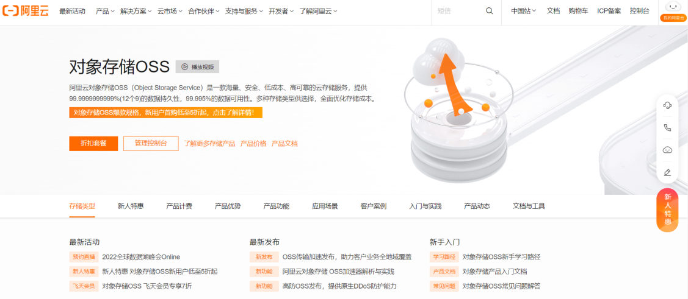
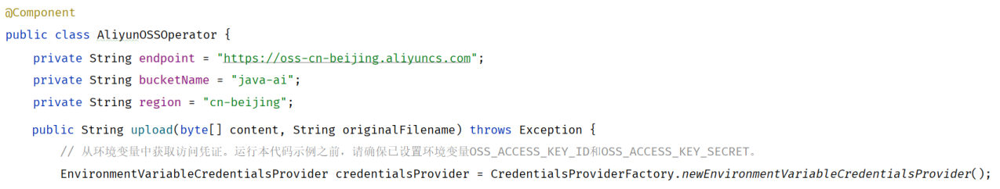
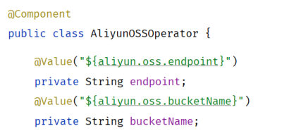
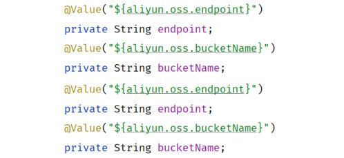
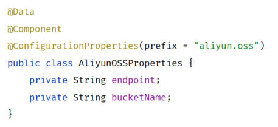
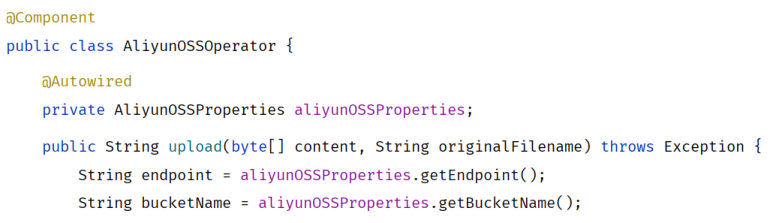

[72 篇](/posts/编程学习/javaweb学习笔记/72-文件上传/)把文件存到了服务器自己的磁盘上，结尾留下三个问题：**无法直接访问**、**磁盘满了**、**磁盘坏了**。这一篇（PPT 第 39-53 页，第 53 页是结束页）就用**云存储**把它们一起解决——课程选的是**阿里云 OSS**；顺手还会治另一个毛病：把 OSS 的地址、bucket 名、密钥这些参数**写死在 Java 代码里**，一旦要换就得改代码重新打包，于是引出**参数配置化**的两种做法。

## 阿里云是什么，OSS 是什么（PPT 第 39-41 页）

PPT 第 39 页先介绍**阿里云**：

> 阿里云是阿里巴巴集团旗下**全球领先的云计算公司**，也是**国内最大的云服务提供商**。

它把各种各样的能力做成"云服务"对外提供，PPT 第 39 页列了一长串：语音服务、短信服务、邮件服务、实人认证、视频点播、视频直播、文字识别、内容安全、**对象存储**、机器翻译、云数据库……（页面右侧还配了一张笔记本电脑的照片，那只是装饰图，跳过。）

这些服务有个共同点：**别人已经把机器、软件、运维都准备好了，你注册账号、付钱、照着文档调用就行**——这类服务通常统称**第三方服务**。本节的阿里云 OSS 就是其中之一。

### 对象存储 OSS

PPT 第 40 页给出定义：

> 阿里云**对象存储 OSS（Object Storage Service）**，是一款**海量、安全、低成本、高可靠**的云存储服务。使用 OSS，您可以通过网络随时存储和调用包括**文本、图片、音频和视频**等在内的各种文件。

PPT 第 40、41 页配的都是阿里云官网 OSS 产品页的截图，上面那两个数字最能说明"高可靠"是什么水平：


*图：阿里云官网的"对象存储 OSS"产品页——99.9999999999%（12 个 9）的数据持久性、99.995% 的数据可用性，页面右上角是"管理控制台"入口*

拿上一节那三个问题对照一下，OSS 是怎么解决的：

| 上一节的三个问题 | 用 OSS 之后 |
| --- | --- |
| **无法直接访问** | 文件上传成功后**能拿到一个可访问的 URL**，谁都能通过它浏览/下载（Tlias 的 `emp.image` 存的就是这个 URL） |
| **磁盘满了** | 文件根本不在自己服务器上，云存储容量按需购买 |
| **磁盘坏了** | 云端做多副本、多机房冗余（产品页上那句"12 个 9 的持久性"就是这个意思），不用自己担心一块盘坏掉 |

PPT 第 41 页画的是"上传"这个动作：本地文件 → 上传 → 存进 OSS。要理解这张图，得先记住 OSS 里的两个名词（PPT 第 43 页给的定义）：

| 名词 | 含义 |
| --- | --- |
| **Bucket（存储空间）** | 用户用于存储**对象（Object，就是文件）**的**容器**，所有的对象都必须隶属于某个存储空间 |
| **Object（对象）** | 就是文件本身（文本、图片、音频、视频……） |

一个账号下可以建多个 bucket（PPT 第 46 页的示意图里就画了三个 bucket），每个对象都放在某个 bucket 里；上传完拿到的访问地址长这样：

```text
https://<bucket名>.<endpoint去掉协议头>/<对象路径>
例如：https://java-ai.oss-cn-beijing.aliyuncs.com/2026/09/8f0a2c1e-....png
```

（这个拼法不是猜的——课程工具类 `AliyunOSSOperator` 最后一行就是照这个规则拼出来的，下面"案例集成"里会拆开看。）

## 第三方服务的通用思路（PPT 第 42 页）

PPT 第 42 页给了一张"通用思路"流程图，分两段：

| 阶段 | 要做的事（PPT 原文） |
| --- | --- |
| **准备工作** | 注册阿里云（**实名认证**）→ **充值** → **开通对象存储服务（OSS）** → **创建 bucket** → **获取 AccessKey（秘钥）** |
| **开发工作** | **参照官方 SDK 编写入门程序** → **集成使用** |

这一页还给 **SDK** 下了定义：

> **SDK**：Software Development Kit 的缩写，**软件开发工具包**，包括辅助软件开发的依赖（jar 包）、代码示例等，都可以叫做 SDK。

为什么叫"通用思路"？因为换成阿里云的短信服务、语音服务、视频点播，甚至换成别家的云服务，走的还是这套：**先开账号、拿到秘钥、开通服务，再照着官方 SDK 写个小程序跑通，最后集成到项目里**。区别只是中间那几格换成对应的服务名。

> [!IMPORTANT]
> 注意两个顺序上的讲究：
> ① **"参照官方 SDK"排在"集成使用"前面**——先在一个干净的小程序里把第三方服务跑通，再往项目里搬，出了问题容易定位；
> ② **密钥（AccessKey）不在代码里生成、也不写进代码**，是从阿里云控制台拿到的（下面会看到课程代码是把它放在**环境变量**里的）。

## 阿里云 OSS 的使用步骤（PPT 第 43 页）

PPT 第 43 页把上一页的流程落成一张"使用步骤"图，从左到右一共七格：

| 步骤 | 做什么 | 说明 |
| --- | --- | --- |
| ① 注册阿里云（实名认证） | 注册账号并完成实名认证 | 不实名认证用不了云服务 |
| ② 充值 | 给账号充点钱 | OSS 是付费服务（按量付费，费用不高，但账号里要有余额） |
| ③ 开通对象存储服务（OSS） | 在控制台开通 OSS | 开通后才会有 OSS 的管理界面 |
| ④ 创建 bucket | 建一个存储空间 | 就是前面说的"容器"；课程工程里用的 bucket 名是 **`java-ai`** |
| ⑤ 获取并配置 AccessKey（秘钥） | 拿到访问密钥并配置到运行环境里 | 程序靠它证明"我是这个账号"；课程代码从**环境变量** `OSS_ACCESS_KEY_ID` / `OSS_ACCESS_KEY_SECRET` 读 |
| ⑥ 参照官方 SDK 编写入门程序 | 照官方文档的示例代码写一个小程序跑通上传 | PPT 第 44 页专门强调这一步 |
| ⑦ 案例集成 OSS | 把跑通的做法搬进 Tlias | 见后面"案例集成"一节 |

从课程工程的配置里还能看出两个对应关系：

- **bucket 名**：`java-ai`（创建 bucket 时起的名字）；
- **地域（region）与 endpoint 是对应的**：`region: cn-beijing` ↔ `endpoint: https://oss-cn-beijing.aliyuncs.com`——bucket 建在哪个地域，endpoint 里就是哪个地域的域名（建 bucket 时选的地域要记下来，后面配错就是"找不到 bucket"）。

> [!WARNING]
> **AccessKey 等于账号的钥匙**，权限很大。别把它写进 Java 代码、别提交到 Git 仓库（写进代码的密钥会跟着代码到处跑，泄露了别人就能用你的账号）。课程的做法是**配到环境变量**里，代码里只写"从环境变量读"。

## 入门程序（PPT 第 44 页）

PPT 第 44 页还是那张七格步骤图，高亮在"**参照官方 SDK 编写入门程序**"这一格，并给了一句提醒：

> 在使用第三方提供的云服务或技术时，**一定要参照对应的官方文档进行开发和测试**。

入门程序要干的事很简单：**照官方 SDK 文档里的示例代码抄一遍，把参数换成自己的**，然后在 `main` 方法（或单元测试）里上传一个文件，确认能在 OSS 控制台看到它、能通过返回的地址访问。

课程资料 `资料/05. 阿里云OSS/AliyunOSSOperator.java` 里就是这一阶段的产物——**参数还写死在代码里**的版本：

```java
@Component
public class AliyunOSSOperator {

    private String endpoint = "https://oss-cn-beijing.aliyuncs.com";
    private String bucketName = "java-ai";
    private String region = "cn-beijing";

    public String upload(byte[] content, String originalFilename) throws Exception {
        // ...（下面"案例集成"里完整展开）
    }
}
```

> [!NOTE]
> 为什么先单独写"入门程序"、不直接改项目？因为第三方服务最容易出问题的地方是**参数和密钥**（endpoint 地域不对、bucket 名写错、密钥没配）。在一个只有几十行的程序里调通，比在项目里翻日志快得多。这也是 PPT 第 42 页把"参照官方 SDK 编写入门程序"和"集成使用"分成两格的原因。

## 案例集成 OSS（PPT 第 45-47 页）

PPT 第 45 页把七格图停在"案例集成 OSS"，第 46 页给了集成后的结构图，核心就三个动作：

> ① 接收上传的图片 → ② 将图片存储起来（OSS）→ ③ 返回图片访问的 URL

第 46 页的图里，前端（新增员工表单）把图片交给 **`UploadController`**，Controller 再交给 **OSS** 的一个 bucket；第 47 页把步骤写成两句：

> ① **引入阿里云 OSS 文件上传工具类**（由官方的示例代码改造而来）
> ② **上传文件接口开发**

### 为什么接口要"返回 URL"

看一下课程接口文档（`资料/02. 接口文档`）里这个接口的定义就明白了：

| 项 | 内容 |
| --- | --- |
| 请求 | `POST /upload` |
| 请求体 | `multipart/form-data`，只有一个参数 `file`（binary，要上传的文件） |
| 响应 | `Result`，其中 **`data` 是"文件访问路径"** |

也就是说：前端上传图片的目的不只是"把文件存起来"，还要**拿回一个地址**——新增员工表单里要把这个地址填进 `emp.image`，页面上要能立刻预览、以后列表里也要能显示。这正是上一篇本地存储版接口做不到的地方（它返回的 `data` 是 `null`）。

### 工具类 `AliyunOSSOperator`

课程工程 `src/main/java/com/itheima/utils/AliyunOSSOperator.java`（完整代码，逐段都有注释）：

```java
@Component
public class AliyunOSSOperator {

    @Value("${aliyun.oss.endpoint}")
    private String endpoint;
    @Value("${aliyun.oss.bucketName}")
    private String bucketName;
    @Value("${aliyun.oss.region}")
    private String region;

    public String upload(byte[] content, String originalFilename) throws Exception {
        // 从环境变量中获取访问凭证。运行本代码示例之前，请确保已设置环境变量OSS_ACCESS_KEY_ID和OSS_ACCESS_KEY_SECRET。
        EnvironmentVariableCredentialsProvider credentialsProvider = CredentialsProviderFactory.newEnvironmentVariableCredentialsProvider();

        // 填写Object完整路径，例如2024/06/1.png。Object完整路径中不能包含Bucket名称。
        //获取当前系统日期的字符串,格式为 yyyy/MM
        String dir = LocalDate.now().format(DateTimeFormatter.ofPattern("yyyy/MM"));
        //生成一个新的不重复的文件名
        String newFileName = UUID.randomUUID() + originalFilename.substring(originalFilename.lastIndexOf("."));
        String objectName = dir + "/" + newFileName;

        // 创建OSSClient实例。
        ClientBuilderConfiguration clientBuilderConfiguration = new ClientBuilderConfiguration();
        clientBuilderConfiguration.setSignatureVersion(SignVersion.V4);
        OSS ossClient = OSSClientBuilder.create()
                .endpoint(endpoint)
                .credentialsProvider(credentialsProvider)
                .clientConfiguration(clientBuilderConfiguration)
                .region(region)
                .build();

        try {
            ossClient.putObject(bucketName, objectName, new ByteArrayInputStream(content));
        } finally {
            ossClient.shutdown();
        }

        return endpoint.split("//")[0] + "//" + bucketName + "." + endpoint.split("//")[1] + "/" + objectName;
    }
}
```

这份代码看着长，拆成六块就清楚了：

| 代码块 | 干什么 | 关键点 |
| --- | --- | --- |
| `@Component` + 三个 `@Value` | 把工具类交给 Spring 管理，并从配置文件里读三项参数 | 这三个参数**原本是写死在代码里的**（见下一节），现在改成了配置注入 |
| `EnvironmentVariableCredentialsProvider` | 拿到"访问凭证"（AccessKey） | **从环境变量** `OSS_ACCESS_KEY_ID` / `OSS_ACCESS_KEY_SECRET` 里读，代码里不出现密钥明文 |
| `dir` + `newFileName` + `objectName` | 生成对象在 bucket 里的**完整路径** | `dir` 是当前日期 `yyyy/MM`（**按月份分目录**，方便管理）；文件名是 `UUID + 原扩展名`（和上一篇本地存储一样，防止同名覆盖）；`objectName = dir + "/" + newFileName`，例如 `2026/09/8f0a2c1e-....png`。注释里特意提醒：**Object 完整路径中不能包含 Bucket 名称** |
| `ClientBuilderConfiguration` + `SignVersion.V4` + `OSSClientBuilder.create()...` | 创建 OSS 客户端 | 要填 `endpoint`、凭证、签名版本（V4）、`region` 四样；这就是"照官方 SDK 抄"的那部分 |
| `ossClient.putObject(bucketName, objectName, new ByteArrayInputStream(content))` | **真正上传** | 参数依次是"哪个 bucket""存成什么路径""文件内容流"；`content` 是 `byte[]`，所以要用 `ByteArrayInputStream` 包一层 |
| `finally { ossClient.shutdown(); }` + `return ...` | 关闭客户端 + **拼出访问 URL** | 客户端用完必须关；URL 的拼法是 `endpoint 的协议头 + bucketName + "." + endpoint 的域名 + "/" + objectName`——把 `https://oss-cn-beijing.aliyuncs.com` 和 `java-ai` 代进去，就是 `https://java-ai.oss-cn-beijing.aliyuncs.com/2026/09/xxx.png` |

### 接口开发

PPT 第 47 页给出的 `UploadController`：

```java
@Autowired
private AliyunOSSOperator aliyunOSSOperator;

/**
 * 文件上传
 */
@PostMapping("/upload")
public Result upload(MultipartFile file) throws Exception {
    log.info("文件上传:{}", file);
    String url = aliyunOSSOperator.upload(file.getBytes(), file.getOriginalFilename());
    return Result.success(url);
}
```

课程工程里的完整版本（比 PPT 多一行"上传完打日志"）：

```java
@Slf4j
@RestController
public class UploadController {

    @Autowired
    private AliyunOSSOperator aliyunOSSOperator;

    @PostMapping("/upload")
    public Result upload(MultipartFile file) throws Exception {
        log.info("文件上传: {}", file.getOriginalFilename());

        //将文件交给OSS存储管理
        String url = aliyunOSSOperator.upload(file.getBytes(), file.getOriginalFilename());
        log.info("文件上传OSS, url: {}", url);

        return Result.success(url);
    }
}
```

对照上一篇的本地存储版，变化只有两处：

| | 本地存储版 | 集成 OSS 版 |
| --- | --- | --- |
| 文件怎么存 | 自己拼 UUID 文件名 + `transferTo` 写本地磁盘 | `file.getBytes()` 拿到字节数组，交给 `aliyunOSSOperator.upload(...)` |
| 返回什么 | `Result.success()`（`data` 是 `null`） | **`Result.success(url)`**（`data` 是图片访问地址） |

（课程工程的 `UploadController` 里，本地存储那段代码**注释保留着**——对照着看这两种写法非常直观。）

### 依赖（pom.xml）

工具类用到的 `com.aliyun.oss.*` 来自阿里云官方 SDK，`pom.xml` 里要加：

```xml
<!--阿里云OSS依赖-->
<dependency>
    <groupId>com.aliyun.oss</groupId>
    <artifactId>aliyun-sdk-oss</artifactId>
    <version>3.17.4</version>
</dependency>

<dependency>
    <groupId>javax.xml.bind</groupId>
    <artifactId>jaxb-api</artifactId>
    <version>2.3.1</version>
</dependency>
<dependency>
    <groupId>javax.activation</groupId>
    <artifactId>activation</artifactId>
    <version>1.1.1</version>
</dependency>
<!-- no more than 2.3.3-->
<dependency>
    <groupId>org.glassfish.jaxb</groupId>
    <artifactId>jaxb-runtime</artifactId>
    <version>2.3.3</version>
</dependency>
```

> [!NOTE]
> 后面三个（`jaxb-api`、`activation`、`jaxb-runtime`）是官方文档要求一起加的：JDK 9 以后 Java 不再自带 JAXB，而阿里云 SDK 内部要用到它，缺了运行时会报"找不到类"（`ClassNotFoundException` / `NoClassDefFoundError` 这一类）。本机实测这几个依赖齐全、工程能**编译通过**（见下面"实测与没实测"）。

## 问题：参数写在 Java 代码里（PPT 第 48 页）

集成完之后回头看工具类，那三个参数原本是这么写的：


*图：PPT 第 48 页摆出的"入门程序版"工具类——`endpoint`、`bucketName`、`region` 三个参数直接写在 Java 代码里*

PPT 第 48 页的问题是："**如果将这些参数信息，写在 java 代码中有什么问题？**"答案四个字：

> **不便维护与管理。**

展开说，"不便维护与管理"具体是这几件事：

| 问题 | 会怎样 |
| --- | --- |
| 换个 bucket / 换个地域 | 得改 Java 代码，**重新编译打包、重新上线** |
| 同一组参数多处使用 | 每个用到 OSS 的类里都要再抄一遍（PPT 第 50 页配的图就是"同样的 `@Value` 段落抄了两遍"） |
| 开发 / 测试 / 生产环境不同 | 环境不同参数就不同，写死在代码里没法切换，只能"一个环境一份代码" |
| 参数越来越多 | 代码里混着一堆"配置数据"，业务逻辑反而看不清 |

所以这些"需要灵活变化"的东西不该待在代码里，应该挪到**配置文件**里——这就是**参数配置化**。

## 参数配置化：两种方式（PPT 第 49-52 页）

PPT 第 49 页给的定义：

> **参数配置化**：指将一些需要灵活变化的参数，**配置在配置文件中**，然后通过 **`@Value` 注解**来注入外部配置的属性。

### 第 1 种：`@Value` 一个属性一个属性注入

先在 `application.yml` 里写上这三项（就是 [72 篇](/posts/编程学习/javaweb学习笔记/72-文件上传/)里那份配置文件的末尾再追加一段，课程工程的写法）：

```yaml
#阿里云OSS
aliyun:
  oss:
    endpoint: https://oss-cn-beijing.aliyuncs.com
    bucketName: java-ai
    region: cn-beijing
```

再在类里逐个注入：


*图：PPT 第 49 页的 `AliyunOSSOperator`——每个字段上面贴一行 `@Value("${aliyun.oss.xxx}")`，一个属性一个属性地注入*

```java
@Component
public class AliyunOSSOperator {

    @Value("${aliyun.oss.endpoint}")
    private String endpoint;
    @Value("${aliyun.oss.bucketName}")
    private String bucketName;
    @Value("${aliyun.oss.region}")
    private String region;
}
```

语法就一条：**`@Value("${配置项的完整路径}")`**，路径就是 yml 里的层级用 `.` 连起来（`aliyun` → `oss` → `endpoint`，所以是 `aliyun.oss.endpoint`）。字段名和配置项名**不需要一样**（这里恰好一样）。

### `@Value` 的问题分析（PPT 第 50 页）

PPT 第 50 页紧跟着就是批评：

> 使用 `@Value` 注解注入配置文件的配置项，**如果配置项多，注入繁琐，不便于维护管理和复用**。


*图：PPT 第 50 页配的图——同样的一段 `@Value` 注入在代码里出现了两遍，配置项一多，这种"一个字段一行注解"的写法既啰嗦、又到处重复*

"繁琐"在哪、"不便复用"在哪，说具体点：

- **繁琐**：有几个配置项就要写几行 `@Value`（10 个参数就是 10 行注解 + 10 个字段）；
- **不便维护管理**：改一个配置项的**名字**，所有写了 `@Value("${...}")` 的地方都要跟着改；
- **不便复用**：另一个类也想用这组参数？只能把这一整段再抄一遍（PPT 第 50 页那张图演的就是这个场景）。

### 第 2 种：`@ConfigurationProperties` 批量注入

PPT 第 51 页给出改进方案：**建一个"属性类"，把一组配置项一次性绑定到它身上**。


*图：PPT 第 51 页的 `AliyunOSSProperties`——类上贴 `@ConfigurationProperties(prefix = "aliyun.oss")`，下面三个字段就是那三项配置，不用再一个字段一行 `@Value`*

课程资料 `资料/05. 阿里云OSS/AliyunOSSProperties.java`：

```java
@Data
@Component
@ConfigurationProperties(prefix = "aliyun.oss")
public class AliyunOSSProperties {
    private String endpoint;
    private String bucketName;
    private String region;
}
```

三个注解各管一件事：

| 注解 | 作用 |
| --- | --- |
| `@Component` | 把这个类交给 Spring 管理（成为一个 bean，别人才注入得到它） |
| `@ConfigurationProperties(prefix = "aliyun.oss")` | 告诉 Spring："把配置文件中 **`aliyun.oss` 开头**的那些配置项，**批量**绑定到这个类的字段上" |
| `@Data`（Lombok） | 生成 getter / setter——**绑定靠的就是 setter**，没有它 Spring 写不进值 |

绑定的规则很简单：**配置项路径去掉 `prefix` 之后剩下的那一段，和字段名对上就绑定**。`aliyun.oss.endpoint` 去掉 `aliyun.oss` 剩下 `endpoint`，正好对上字段 `endpoint`；`bucketName`、`region` 同理。所以**字段名必须和配置项名一致**（这点和 `@Value` 不同）。

用的时候，谁需要这组参数就注入这个属性类：


*图：PPT 第 51 页——`AliyunOSSOperator` 里 `@Autowired` 注入 `AliyunOSSProperties`，用的时候通过 `aliyunOSSProperties.getEndpoint()`、`getBucketName()` 取值*

```java
@Component
public class AliyunOSSOperator {

    @Autowired
    private AliyunOSSProperties aliyunOSSProperties;

    public String upload(byte[] content, String originalFilename) throws Exception {
        String endpoint = aliyunOSSProperties.getEndpoint();
        String bucketName = aliyunOSSProperties.getBucketName();
        // ...（region 同理：aliyunOSSProperties.getRegion()）
    }
}
```

好处一眼可见：**再多的配置项，都只在属性类里出现一次**；别的类想用这组参数，注入 `AliyunOSSProperties` 就行，不用重复写注解、也不会出现"两段一样的 `@Value`"。

### 两种方式对比（PPT 第 52 页）

PPT 第 52 页的问答，就是这两种方式的总结：

| PPT 的问题 | 答案 |
| --- | --- |
| 注入外部配置文件中的配置项的**两种方式**？ | **`@Value`**：一个属性一个属性的注入；**`@ConfigurationProperties`**：批量将多个属性注入到 bean 对象中 |
| 两种方式各自的**使用场景**？ | 如果属性**较少**，建议 `@Value` 注入即可；如果属性**较多**、考虑**复用**，建议使用 `@ConfigurationProperties` |

再补一张对照表，做题时对着看：

| | `@Value("${...}")` | `@ConfigurationProperties(prefix = "...")` |
| --- | --- | --- |
| 写法 | 每个字段一行注解 | 类上一个注解 + 一组字段 |
| 注入数量 | 一个属性一个 | 一次一批 |
| 字段名要求 | 可以和配置项名不同（路径写在注解里） | **必须与配置项名一致**（靠名字对应） |
| 复用 | 换个类要重抄一遍注解 | 注入属性类即可，到处复用 |
| 适用场景 | **属性较少**时（如一个两个） | **属性较多、需要复用**时（如 OSS 这组） |

> [!NOTE]
> 两种方式**不是二选一**，项目里可以同时存在：零散的一两个参数用 `@Value` 更省事，成组的参数（像 `aliyun.oss` 这三项）用 `@ConfigurationProperties` 更清爽。

### 本机实测：两种方式都能注入

> [!TIP]
> **本机实测**（LAB §4）：在工程里加一个绑定组件（`@ConfigurationProperties(prefix = "aliyun.oss")`）后启动，控制台输出：
>
> ```text
> [实测]@ConfigurationProperties 批量注入 => endpoint=https://oss-cn-beijing.aliyuncs.com , bucketName=java-ai , region=cn-beijing
> ```
>
> 三项配置**全部按名字绑定成功**，值和 `application.yml` 里写的一模一样。同一台机器上，工程用 `@Value("${aliyun.oss.xxx}")` 逐个注入的写法也能正常启动——**说明两个 `@Value` 注入的配置项都取到了值**（`endpoint`、`bucketName`、`region` 少任何一个，创建 OSS 客户端时都会出问题）。也就是说：**"参数从配置文件读进来"这件事是被实测验证过的**。

## 实测与没实测：把边界说清楚（LAB §6）

写技术笔记最怕"看着像跑通了"。这一节把本篇的验证边界交代清楚：

| 内容 | 状态 |
| --- | --- |
| `@Value` / `@ConfigurationProperties` 两种参数配置化方式能注入 | **本机实测**（控制台打印出三项配置的值，见上） |
| 工程能**编译通过**（`aliyun-sdk-oss 3.17.4` + `jaxb-api` / `activation` / `jaxb-runtime` 依赖齐全） | **本机实测** |
| **OSS 上传本身** | **没有实测** |

为什么 OSS 上传没实测：跑通它需要**一套真实的阿里云凭证**——注册账号 + 实名认证 + 开通 OSS + 创建 bucket + 拿到 AccessKey（也就是 PPT 第 43 页的前五步），本机没有这套账号；而且课程代码是从**环境变量** `OSS_ACCESS_KEY_ID` / `OSS_ACCESS_KEY_SECRET` 取密钥的，本机也没有配这两个变量。

所以本篇里"OSS 上传"这部分内容是**按 PPT 步骤 + 课程代码讲清做法**（工具类怎么调 SDK、`objectName` 怎么拼、URL 怎么来、接口怎么返回），**不是**本机的运行结果。等你有了自己的阿里云账号、把前五步做完，照着本节的代码走一遍就能真正跑通。

> [!WARNING]
> 真要动手时，最容易卡住的三处：① **bucket 的地域和 endpoint 对不上**（`cn-beijing` ↔ `oss-cn-beijing.aliyuncs.com`）；② **环境变量没配或名字写错**（必须是 `OSS_ACCESS_KEY_ID` / `OSS_ACCESS_KEY_SECRET`）；③ **bucket 的读写权限**——如果设成"私有"，上传能成功但直接访问 URL 会被拒绝，前端显示不出图片。

## 小结

| 问题 | 答案 |
| --- | --- |
| 阿里云是什么？ | 阿里巴巴集团旗下全球领先的云计算公司，国内最大的云服务提供商；提供语音、短信、邮件、实人认证、视频点播、视频直播、文字识别、内容安全、**对象存储**、机器翻译、云数据库等云服务 |
| OSS 是什么？ | **对象存储 OSS（Object Storage Service）**，一款**海量、安全、低成本、高可靠**的云存储服务，可以通过网络随时存储和调用文本、图片、音频、视频等文件 |
| Bucket 与 Object？ | **Bucket**：存储空间，是存储对象（**Object，就是文件**）的容器，所有对象都必须隶属于某个存储空间 |
| SDK 是什么？ | Software Development Kit 的缩写，**软件开发工具包**，包括辅助软件开发的依赖（jar 包）、代码示例等 |
| 第三方服务的通用思路？ | **准备**：注册阿里云（实名认证）→ 充值 → 开通 OSS → 创建 bucket → 获取 AccessKey；**开发**：参照官方 SDK 编写入门程序 → 集成使用 |
| 集成后的三个动作？ | ① 接收上传的图片 ② 将图片存储起来（OSS）③ **返回图片访问的 URL** |
| 参数写死在代码里的问题？ | **不便维护与管理**（换 bucket/地域要改代码重打包；多处重复；多环境没法切换） |
| 参数配置化是什么？ | 把需要灵活变化的参数**配置在配置文件中**，再注入到程序里 |
| 两种注入方式与场景？ | **`@Value`**：一个属性一个属性注入，**属性少**时用；**`@ConfigurationProperties`**：批量把多个属性注入到 bean 对象中，**属性多、需要复用**时用 |
| 本篇的验证边界？ | `@Value` / `@ConfigurationProperties` 注入与工程编译**本机实测**；**OSS 上传没有实测**（本机没有阿里云账号与 AccessKey 环境变量） |

## 相关

- [上一篇：文件上传](/posts/编程学习/javaweb学习笔记/72-文件上传/)

## 练习题

### 一、知识回顾（读完直接做下面的实践题）

1. **阿里云与 OSS**：阿里云是阿里巴巴集团旗下全球领先的云计算公司、国内最大的云服务提供商；**对象存储 OSS（Object Storage Service）** 是一款**海量、安全、低成本、高可靠**的云存储服务，可以通过网络随时存储和调用文本、图片、音频、视频等文件
2. **Bucket 与 Object**：**Bucket**（存储空间）是存储**对象（Object，就是文件）**的容器，所有对象都必须隶属于某个存储空间；一个账号下可以建多个 bucket
3. **SDK**：Software Development Kit 的缩写，**软件开发工具包**，包括辅助软件开发的依赖（jar 包）、代码示例等
4. **第三方服务的通用思路**：**准备工作**——注册阿里云（实名认证）→ 充值 → 开通对象存储服务（OSS）→ 创建 bucket → 获取 AccessKey（秘钥）；**开发工作**——参照官方 SDK 编写入门程序 → 集成使用
5. **OSS 使用步骤**（PPT 第 43 页的七格）：① 注册阿里云（实名认证）② 充值 ③ 开通对象存储服务（OSS）④ 创建 bucket ⑤ 获取并配置 AccessKey（秘钥）⑥ 参照官方 SDK 编写入门程序 ⑦ 案例集成 OSS；其中第 ⑥ 步 PPT 特意强调"**一定要参照对应的官方文档进行开发和测试**"
6. **案例集成的三个动作**：① 接收上传的图片 ② 将图片存储起来（OSS）③ **返回图片访问的 URL**；做法是"引入由官方示例代码改造的工具类 + 开发上传接口"，接口 `POST /upload` 用 `multipart/form-data` 收 `file`，响应的 `data` 就是**文件访问路径**
7. **工具类的关键点**：密钥从**环境变量** `OSS_ACCESS_KEY_ID` / `OSS_ACCESS_KEY_SECRET` 读（不写死在代码里）；`objectName = 日期目录 yyyy/MM + UUID + 原扩展名`（Object 完整路径中不能包含 Bucket 名称）；`putObject(bucketName, objectName, new ByteArrayInputStream(content))` 上传；`finally` 里 `shutdown()` 关客户端；最后按 `协议头 + bucket名 + "." + endpoint域名 + "/" + objectName` 拼出访问 URL
8. **参数写死在代码里的问题**：**不便维护与管理**——换 bucket / 换地域要改代码重新打包上线；多处使用要到处抄；开发/测试/生产环境没法切换
9. **参数配置化的两种方式**：`@Value("${配置项路径}")` **一个属性一个属性注入**（属性少时用）；`@ConfigurationProperties(prefix = "...")` **批量把多个属性注入到 bean 对象中**（属性多、需要复用时用，类上要配 `@Component`，还要有 setter——课程用 Lombok 的 `@Data`，字段名必须与配置项名一致）
10. **本篇的实测边界**：`@Value` 与 `@ConfigurationProperties` 两种注入方式**本机实测**（控制台打印 `endpoint=https://oss-cn-beijing.aliyuncs.com , bucketName=java-ai , region=cn-beijing`）、工程**编译通过**实测；**OSS 上传没有实测**（本机没有阿里云账号与 AccessKey 环境变量），这部分按 PPT 步骤 + 课程代码讲

### 二、裸写题

- [ ] **2-1 把 OSS 的三个参数改成从配置文件读（逐个注入方式）**
  需求：下面这个工具类里的三项参数现在写死在代码里，请把它们挪到 `application.yml` 里，并让类从配置文件中读到值：
  ① 在 yml 里以 `aliyun.oss` 为前缀配置 `endpoint`、`bucketName`、`region` 三项（值用 `https://oss-cn-beijing.aliyuncs.com`、`java-ai`、`cn-beijing`）；
  ② 改造工具类，让三个字段的值来自配置文件（**一个属性一个属性**地注入，注入注解写在字段上）；
  ③ 说明：如果以后要换 bucket，改动落在哪里？

  ```java
  // 现在的样子：参数写死在代码里
  @Component
  public class AliyunOSSOperator {
      private String endpoint = "https://oss-cn-beijing.aliyuncs.com";
      private String bucketName = "java-ai";
      private String region = "cn-beijing";

      // ... upload 方法省略
  }
  ```

  （练习文件 `test_73_参数配置化.java` 与 `test_73_OSS配置.yml` 的题目2-1 里给了写作区。）

  > [!TIP]- 提示（先自己想，实在想不出再点开）
  > **一级 · 思路**：yml 里按"层级"写（`aliyun` 下面套 `oss`，再写三项）；Java 里每个字段上面贴一行"取配置"的注解，注解里写这个配置项的**完整路径**（层级用 `.` 连接）
  > **二级 · 方法**：yml 用 `aliyun: oss: endpoint/bucketName/region`；字段上用 `@Value("${aliyun.oss.xxx}")`
  > **三级 · 骨架**：`@Value("${aliyun.oss.____}")` + `private String ____;`

  > [!TIP]- 参考答案（做完再点开）
  > ① `application.yml`：
  > ```yaml
  > #阿里云OSS
  > aliyun:
  >   oss:
  >     endpoint: https://oss-cn-beijing.aliyuncs.com
  >     bucketName: java-ai
  >     region: cn-beijing
  > ```
  > ② 工具类（课程工程的写法）：
  > ```java
  > @Component
  > public class AliyunOSSOperator {
  >
  >     @Value("${aliyun.oss.endpoint}")
  >     private String endpoint;
  >     @Value("${aliyun.oss.bucketName}")
  >     private String bucketName;
  >     @Value("${aliyun.oss.region}")
  >     private String region;
  >
  >     // ... upload 方法不变
  > }
  > ```
  > ③ 换 bucket 只改 `application.yml` 里的 `bucketName` 一行——**不用动 Java 代码、不用重新编译**（重启应用即可）。这正是"参数配置化"要解决的问题（PPT 第 48 页说的"写在 java 代码中不便维护与管理"）。
  > 补充：`@Value` 里 `${}` 中的路径必须和 yml 的层级完全对上（`aliyun.oss.endpoint`），写错的话启动时会报"找不到占位符"。

- [ ] **2-2 改成批量绑定方式**
  需求：接着上一题，把"逐个注入"换成"**批量绑定**"：
  ① 新建一个属性类，把 `aliyun.oss` 开头的三项配置一次性绑定到它的三个字段上（要有 setter，用 Lombok 生成即可），并交给 Spring 管理；
  ② 在工具类里改成注入这个属性类，用它的 getter 取三项参数；
  ③ 回答：为什么说这种方式"便于复用"？字段名能不能随便起？

  （练习文件 `test_73_参数配置化.java` 与 `test_73_OSS配置.yml` 的题目2-2 里给了写作区。）

  > [!TIP]- 提示（先自己想，实在想不出再点开）
  > **一级 · 思路**：把"一组配置"看成"一个对象"——先定义这个对象（属性类），绑定靠类上的一个注解，绑定范围靠 `prefix` 指定；用的人注入这个对象就行
  > **二级 · 方法**：属性类上 `@Data` + `@Component` + `@ConfigurationProperties(prefix = "aliyun.oss")`，字段名与配置项名一致；工具类里 `@Autowired private AliyunOSSProperties aliyunOSSProperties;`，取值用 `getEndpoint()` / `getBucketName()` / `getRegion()`
  > **三级 · 骨架**：`@____ @Component @____(prefix = "____") public class AliyunOSSProperties { private String ____; … }`；工具类里 `@Autowired private ____ aliyunOSSProperties;`

  > [!TIP]- 参考答案（做完再点开）
  > ① 属性类（课程资料 `资料/05. 阿里云OSS/AliyunOSSProperties.java`）：
  > ```java
  > @Data
  > @Component
  > @ConfigurationProperties(prefix = "aliyun.oss")
  > public class AliyunOSSProperties {
  >     private String endpoint;
  >     private String bucketName;
  >     private String region;
  > }
  > ```
  > ② 工具类：
  > ```java
  > @Component
  > public class AliyunOSSOperator {
  >
  >     @Autowired
  >     private AliyunOSSProperties aliyunOSSProperties;
  >
  >     public String upload(byte[] content, String originalFilename) throws Exception {
  >         String endpoint = aliyunOSSProperties.getEndpoint();
  >         String bucketName = aliyunOSSProperties.getBucketName();
  >         String region = aliyunOSSProperties.getRegion();
  >         // ... 后面照旧
  >     }
  > }
  > ```
  > ③ **便于复用**：别的类也想要这组参数时，注入 `AliyunOSSProperties` 就行，**不用把 `@Value` 那几行再抄一遍**（PPT 第 50 页配的图就是"重复抄写"的反例）；配置项再多，也只在属性类里出现一次。**字段名不能随便起**：绑定是靠"去掉 `prefix` 后的配置项名 ↔ 字段名"对应的（`endpoint` 对 `endpoint`、`bucketName` 对 `bucketName`），名字对不上就绑不进去（值为 `null`）。另外别忘了 `@Data`——**绑定依赖 setter**，没有 setter Spring 写不进值。
  > 小结一句：**属性少用 `@Value`，属性多、要复用就用 `@ConfigurationProperties`**（PPT 第 52 页的结论）。

- [ ] **2-3 写一个"上传文件到 OSS 并返回访问地址"的接口**
  需求：工程里已经有工具类 `AliyunOSSOperator`（含 `upload(byte[] content, String originalFilename)` 方法，返回文件的访问 URL）。请写一个上传接口：
  ① 路径 `POST /upload`，接收前端提交的文件；
  ② 把文件交给工具类上传到 OSS（工具类要上传的是**字节数组**和**原始文件名**）；
  ③ 把上传得到的**访问地址**放进统一响应结果里返回给前端；
  ④ 用日志记录"上传的文件名"和"上传后的 URL"各一条。
  （练习文件 `test_73_参数配置化.java` 的题目2-3 里给了写作区。）

  > [!TIP]- 提示（先自己想，实在想不出再点开）
  > **一级 · 思路**：接口干三件事——接住文件、把文件转成工具类要的形式传进去、把返回的地址包进 `Result` 里给前端
  > **二级 · 方法**：文件参数 `MultipartFile`；转字节数组用 `file.getBytes()`；原文件名用 `file.getOriginalFilename()`；注入工具类用 `@Autowired`；返回 `Result.success(url)`
  > **三级 · 骨架**：`@PostMapping("/____") public Result upload(____ file) throws Exception { String url = aliyunOSSOperator.____(file.____(), file.____()); return Result.____(url); }`

  > [!TIP]- 参考答案（做完再点开）
  > ```java
  > @Slf4j
  > @RestController
  > public class UploadController {
  >
  >     @Autowired
  >     private AliyunOSSOperator aliyunOSSOperator;
  >
  >     /**
  >      * 文件上传
  >      */
  >     @PostMapping("/upload")
  >     public Result upload(MultipartFile file) throws Exception {
  >         log.info("文件上传: {}", file.getOriginalFilename());
  >
  >         //将文件交给OSS存储管理
  >         String url = aliyunOSSOperator.upload(file.getBytes(), file.getOriginalFilename());
  >         log.info("文件上传OSS, url: {}", url);
  >
  >         return Result.success(url);
  >     }
  > }
  > ```
  > 要点：① `file.getBytes()` 把上传文件转成 `byte[]`（工具类的方法要的就是字节数组）；② `file.getOriginalFilename()` 传进去是为了**取扩展名**（工具类用它拼 `UUID + 扩展名`）；③ 返回的是 `Result.success(url)`——按接口文档，响应的 `data` 就是"文件访问路径"，前端拿它去预览/存进 `emp.image`；④ 课程工程的 `UploadController` 里保留着上一篇"本地存储版"的注释代码，两版对照着看变化只有"怎么存"和"返回什么"两处。

- [ ] **2-4 分析题：两种参数配置化方式怎么选**
  需求：项目里现在有这些参数要配置——`aliyun.oss` 的三个（endpoint/bucketName/region）、数据库连接的四项（url/driver-class-name/username/password）、一个"当前环境名称"。请回答：
  ① 分别用哪种注入方式更合适？为什么？
  ② 两种方式各自"麻烦在哪、好在哪"（各写两条）？
  ③ 用批量绑定那种方式时，有三个容易踩的坑，分别是什么？
  （练习文件 `test_73_参数配置化.java` 的题目2-4 里给了写作区。）

  > [!TIP]- 提示（先自己想，实在想不出再点开）
  > **一级 · 思路**：判断标准只有两条——**参数个数**和**要不要被多个类复用**；再想想"改配置项名字时，哪种方式要动的地方多"
  > **二级 · 方法**：`@Value` 逐个注入 vs `@ConfigurationProperties` 批量绑定；批量绑定要注意：类上要 `@Component`、要有 setter（`@Data`）、字段名必须与配置项名一致
  > **三级 · 骨架**：少 → `____`；多/复用 → `@____(prefix = "____")`

  > [!TIP]- 参考答案（做完再点开）
  > ① **`aliyun.oss` 三项**：用 **`@ConfigurationProperties(prefix = "aliyun.oss")`**——三个参数成组出现，而且工具类和别的地方都可能用到（要复用）；**数据库四项**：SpringBoot 的 `datasource` 本来就是给自动配置用的，业务代码里很少自己注入，如果非要注入，四项也算"较多"，同样适合批量绑定；**"当前环境名称"这一个**：用 **`@Value`** 就够（属性少，为它单独建个类反而啰嗦）。
  > ② 对照：
  > - `@Value`：**麻烦**在配置项一多就要写一堆注解、改个配置项名字要改所有引用处；**好**在简单直接、一个字段一行注解，字段名还能和配置项名不一样（路径写在注解里）。
  > - `@ConfigurationProperties`：**麻烦**在要多写一个属性类（还得有 `@Component` 与 setter），字段名必须与配置项名严格对应；**好**在批量绑定、一处定义多处复用、不会出现"同一段注入抄两遍"。
  > ③ 三个坑：**① 忘了 `@Component`**（属性类没进 Spring 容器，注入不到、绑定也不生效）；**② 忘了 setter**（只写 `private` 字段没有 `@Data`/setter，Spring 写不进值，字段全是 `null`）；**③ 字段名与配置项名不一致**（比如配置项叫 `bucketName`、字段写成 `bucket`，绑定不上，值还是 `null`）。另外 `prefix` 写错（如写成 `aliyun`）也会导致"一项都绑不上"。
  > 结论一句话：**属性较少建议 `@Value`；属性较多、考虑复用建议 `@ConfigurationProperties`**（PPT 第 52 页）。

### 三、综合题

- [ ] **3-1 照着"第三方服务通用思路"把 OSS 集成进 Tlias**
  这一题把本节串起来：**准备账号与 bucket → 写入门程序 → 集成工具类与接口 → 参数配置化 → 启动验证注入**。做完后你会得到一条完整的上传链路（前端选图 → 接口 → OSS → 返回 URL）。
  1. **准备**（对应 PPT 第 43 页前五步）：注册阿里云并实名认证 → 充值 → 开通对象存储服务（OSS）→ 创建一个 bucket（记住**名字**和**地域**）→ 获取 AccessKey，并把它配到**环境变量** `OSS_ACCESS_KEY_ID` / `OSS_ACCESS_KEY_SECRET` 里（别写进代码）。**把每一步的产物记在练习文件里**（bucket 名、地域、endpoint 域名）；
  2. **入门程序**（对应第 ⑥ 步）：新建一个最简单的类（或单元测试），照着官方 SDK 的示例把 `endpoint` / `bucketName` / `region` 换成自己的，上传一个本地文件，确认能拿到访问地址。回答：为什么要先单独跑一遍入门程序，而不是直接改项目？
  3. **集成工具类**：在 `pom.xml` 里加上 `aliyun-sdk-oss` 与 JAXB 三件套依赖；把 `AliyunOSSOperator` 放进 `com.itheima.utils` 包，读懂它的六块逻辑（凭证、对象路径、客户端、上传、关闭、拼 URL），并在注释里用自己的话写一遍 `objectName` 和返回 URL 是怎么拼出来的；
  4. **参数配置化**：先在 yml 里配 `aliyun.oss` 三项，用 **`@Value`** 逐个注入跑一次；再改成 **`@ConfigurationProperties`** 批量绑定（新建属性类）跑一次。两次都启动工程，把控制台里打印出的三项配置值抄到练习文件里，并回答 PPT 第 52 页的两个问题（两种方式分别是什么？各自适用什么场景？）；
  5. **接口开发**：把 `UploadController` 的 `POST /upload` 改成"调用工具类上传并返回 URL"的版本（参考接口文档：请求 `multipart/form-data` 带 `file`，响应的 `data` 是文件访问路径）；
  6. **验证与回答**：有阿里云账号的同学，用课程资料 `资料/04. 文件上传/upload.html` 或 `curl -F "file=@图片路径"` 真传一张图，记录返回的 URL 并**用浏览器打开它**；没有账号的同学（比如本机这次整理笔记时就没有），写清"哪几步没做、为什么没做"，并把**已经验证过的部分**记下来（本机实测：两种注入方式都能取到配置值、工程编译通过）；
  7. 收尾：把 `application.yml` 里你写的配置与工具类整理干净（密钥仍然只留在环境变量里），删掉入门程序的临时类与测试文件。

  **涉及知识点**

  | 知识点 | 在这里的应用 |
  | --- | --- |
  | 第三方服务通用思路 | 第 1、2 步——准备账号与秘钥，先写入门程序跑通 |
  | Bucket / Object / endpoint / region | 第 1、3 步——bucket 名与地域要对应上 endpoint |
  | 工具类与接口集成 | 第 3、5 步——`AliyunOSSOperator` + `UploadController` 返回 URL |
  | 参数配置化两种方式 | 第 4 步——`@Value` 逐个注入与 `@ConfigurationProperties` 批量绑定各跑一遍（本机实测注入成功） |
  | 验证边界 | 第 6 步——实测的写实测、没条件的如实说明（OSS 上传本身本机没跑） |

  > [!TIP]- 提示（先自己想，实在想不出再点开）
  > **一级 · 思路**：这条链路的顺序不能颠倒——**先有 bucket 和密钥，才有入门程序；先跑通入门程序，才好往项目里搬**；参数配置化那一步只是把工具类里写死的三个字符串换成"从配置文件读"
  > **二级 · 方法**：准备阶段用阿里云控制台；入门程序与工具类都用官方 SDK（`OSSClientBuilder` / `putObject`）；配置注入用 `@Value("${aliyun.oss.xxx}")` 或 `@ConfigurationProperties(prefix = "aliyun.oss")` + `@Data` + `@Component`；接口用 `MultipartFile` + `file.getBytes()` + `Result.success(url)`
  > **三级 · 骨架**：`aliyun: oss: endpoint/bucketName/region`；`@____(prefix = "aliyun.oss") public class AliyunOSSProperties { private String ____; }`；`String url = aliyunOSSOperator.upload(file.____(), file.____());`

  > [!TIP]- 参考答案（做完再点开）
  > **1. 准备阶段的产物**（示例，填你自己的）：bucket 名 `java-ai`、地域 `cn-beijing`、endpoint `https://oss-cn-beijing.aliyuncs.com`、AccessKey 已配到环境变量 `OSS_ACCESS_KEY_ID` / `OSS_ACCESS_KEY_SECRET`。
  > **2. 为什么先写入门程序**：第三方服务最容易错的是**参数与密钥**，在几十行的小程序里调通比在项目里翻日志快；PPT 第 42 页把"参照官方 SDK 编写入门程序"和"集成使用"分成两格就是这个意思，第 44 页还特意强调"**一定要参照对应的官方文档进行开发和测试**"。
  > **3. 工具类的两个拼法**（用自己的话写）：
  > - `objectName`：`LocalDate.now().format(DateTimeFormatter.ofPattern("yyyy/MM"))` 得到日期目录（如 `2026/09`），加上 `UUID.randomUUID() + 原扩展名` 得到不重复的文件名，两者用 `/` 连起来；**Object 完整路径中不能包含 Bucket 名称**；
  > - 访问 URL：`endpoint.split("//")[0]` 是协议头（`https:`）、`endpoint.split("//")[1]` 是域名（`oss-cn-beijing.aliyuncs.com`），拼成 `协议头 + "//" + bucketName + "." + 域名 + "/" + objectName` → `https://java-ai.oss-cn-beijing.aliyuncs.com/2026/09/xxx.png`。
  > **4. 两种配置化方式**：
  > ```java
  > // 方式一：@Value 逐个注入
  > @Value("${aliyun.oss.endpoint}")
  > private String endpoint;
  > @Value("${aliyun.oss.bucketName}")
  > private String bucketName;
  > @Value("${aliyun.oss.region}")
  > private String region;
  >
  > // 方式二：@ConfigurationProperties 批量绑定（属性类）
  > @Data
  > @Component
  > @ConfigurationProperties(prefix = "aliyun.oss")
  > public class AliyunOSSProperties {
  >     private String endpoint;
  >     private String bucketName;
  >     private String region;
  > }
  > // 使用方：@Autowired private AliyunOSSProperties aliyunOSSProperties; 然后 getEndpoint() 等
  > ```
  > **本机实测**（LAB §4）：批量绑定组件启动后打印 `[实测]@ConfigurationProperties 批量注入 => endpoint=https://oss-cn-beijing.aliyuncs.com , bucketName=java-ai , region=cn-beijing`；`@Value` 注入的写法工程也能正常启动（两项都取到了值）。PPT 第 52 页的问答：两种方式——`@Value` 一个属性一个属性地注入、`@ConfigurationProperties` 批量将多个属性注入到 bean 对象中；适用场景——**属性较少**建议 `@Value`，**属性较多、考虑复用**建议 `@ConfigurationProperties`。
  > **5. 接口**：
  > ```java
  > @PostMapping("/upload")
  > public Result upload(MultipartFile file) throws Exception {
  >     log.info("文件上传: {}", file.getOriginalFilename());
  >     String url = aliyunOSSOperator.upload(file.getBytes(), file.getOriginalFilename());
  >     log.info("文件上传OSS, url: {}", url);
  >     return Result.success(url);
  > }
  > ```
  > **6. 验证**：有账号的同学这里应该能拿到形如 `https://<bucket>.<endpoint域名>/2026/09/<uuid>.png` 的地址并直接在浏览器打开。**本机整理笔记时没有阿里云账号与 AccessKey，所以"OSS 上传"没有实测**——本机实测过的只有：① `@Value` / `@ConfigurationProperties` 两种注入都能取到三项配置的值；② `aliyun-sdk-oss 3.17.4` + `jaxb-api` / `activation` / `jaxb-runtime` 依赖齐全、**工程能编译通过**。把这两条和你自己做到的步骤分开写，才算把"验证边界"交代清楚。
  > **7. 收尾**：`application.yml` 里只留 `aliyun.oss` 三项配置，工具类与接口保持课程代码的写法，临时类删掉——密钥始终只存在环境变量里。
