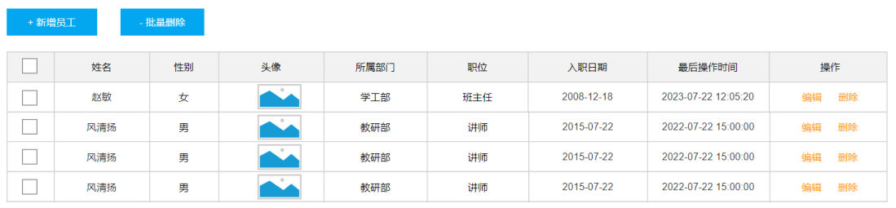

[73 篇](/posts/编程学习/javaweb学习笔记/73-阿里云oss与参数配置化/)把文件上传与参数配置化收了尾，员工管理页面上还剩一排按钮没做活。从这一篇开始是**第 10 章**（PPT 第 1～35 页）：**删除员工 → 修改员工 → 异常处理 → 员工信息统计**，把员工管理这块彻底做完。

本篇负责第一件事（PPT 第 1～8 页）——**删除员工**：页面上那个单行的「删除」和顶部的「批量删除」共用哪一个接口、三层各自的活、以及一条删除语句怎么同时带走两张表里的数据。

## 这一章要做的四件事（PPT 第 1～4 页）

PPT 第 1 页还是老规矩的封面（Web后端开发 · Tlias系统 - 员工管理），第 2、3 页给出这一章的任务清单：

> **删除员工** → **修改员工** → **异常处理** → **员工信息统计**

第 3 页把同样四个标题又列了一遍——这是章节导航页，后面每进入一个模块都会再出现一次；第 4 页是「**删除员工 01**」，也就是第一个模块的小标题页（后面依次是「修改员工 02」「异常处理 03」「员工信息统计」）。

四个模块和后面四篇笔记一一对应：

| PPT 模块 | 页范围 | 落点 |
| --- | --- | --- |
| 删除员工 | 第 1～8 页 | 本篇（[74 篇](/posts/编程学习/javaweb学习笔记/74-删除员工/)） |
| 修改员工 | 第 9～19 页 | [75 篇](/posts/编程学习/javaweb学习笔记/75-修改员工/) |
| 异常处理 | 第 20～25 页 | [76 篇](/posts/编程学习/javaweb学习笔记/76-全局异常处理/) |
| 员工信息统计 | 第 26～35 页 | [77 篇](/posts/编程学习/javaweb学习笔记/77-员工信息统计/) |

这四个功能全部落在同一个页面上——[66～68 篇](/posts/编程学习/javaweb学习笔记/66-员工列表查询与分页分析/)做出来的员工管理页：上半是条件查询表单，中间那排按钮里有「+ 新增员工」和「- 批量删除」，表格最右边每一行都有「编辑」和「删除」（这些按钮之前都还点不动）：


*图：PPT 第 5、6 页配的员工管理页面截图——列表每行最前面是勾选框，表格上方是「+ 新增员工」「- 批量删除」两个按钮，最右侧「操作」列里每行都有「编辑」「删除」。这一章的删除、修改两个功能就是要把这两处的按钮点活：勾选多行点「批量删除」是批量删，点单行的「删除」是删一个*

## 需求分析：一个接口管两种删除（PPT 第 5 页）

PPT 第 5 页把"删除员工"拆成了两条需求：

- 根据 ID **删除单个**员工信息；
- 根据 ID **批量删除**员工信息。

看着是两件事，PPT 紧跟着给了一句结论——这也是这一节最该记住的一句话：

> 其实，**删除单条数据也是一种特殊的批量删除**，所以，删除员工的功能，我们只需要**开发一个接口**就可以了。

"删一个"无非是"删一批"里只有这一个 id：批量删除接口收一组 id，传 `ids=1` 是删一个，传 `ids=1,2,3` 是删三个。所以后端不用写两个方法，前端两处按钮调的是同一个接口。

点单行的「删除」时，页面上会先弹一个确认框：


*图：PPT 第 5 页配的页面交互——点「删除」后弹出的确认框「您确定要删除该员工吗？」，点「确定」才真正发请求。删除是危险操作，前端一定会先拦一道；后端只需要认准传过来的 id*

接口文档（`资料\02. 接口文档` 的 2.2）写得很清楚：

| 项 | 内容 |
| --- | --- |
| 请求路径 | `/emps` |
| 请求方式 | `DELETE` |
| 接口描述 | 该接口用于**批量**删除员工的数据信息 |
| 参数格式 | 查询参数 |
| 参数说明 | `ids`：数组 array，示例 `1,2,3`，**必须**，员工的 id 数组 |
| 请求参数样例 | `/emps?ids=1,2,3` |

注意两点：**单个和批量走的是同一个接口**（文档标题里只有"批量删除"，界面上的单行删除也调它）；请求方式是 `DELETE`，参数不放在请求体里，而是拼在 URL 的查询参数上（`?ids=1,2,3`）。

## 三层思路：Controller / Service / Mapper（PPT 第 6 页）

PPT 第 6 页把这件事拆到三层，和前面的功能是同一套分工：

| 层 | 职责 | 具体到删除员工 |
| --- | --- | --- |
| **Controller** | 接收请求参数（ID 值）、调用 Service 方法、响应结果 | 用数组或集合接住 `?ids=1,2,3`，调 `empService.delete(ids)`，最后 `return Result.success()` |
| **Service** | 业务处理，调用 Mapper 接口方法 | ① **批量删除员工基本信息**；② **批量删除员工的工作经历信息** |
| **Mapper** | 数据访问操作（增删改查） | 两条 SQL：`delete from emp where id in (?,?,?)`；`delete from emp_expr where emp_id in (?,?,?)` |

这里最值得停一下的是：**为什么删一个员工要动两张表？**

`emp` 和 `emp_expr` 是一对多关系（[64 篇](/posts/编程学习/javaweb学习笔记/64-多表关系与表设计/)），工作经历表里每一行的 `emp_id` 都指向 `emp` 的某一行（[69 篇](/posts/编程学习/javaweb学习笔记/69-新增员工/)新增员工时，给经历填的就是这个 `emp_id`）。如果只删 `emp` 里的员工、把 `emp_expr` 里那些经历留着，数据库里就会留下一批**指向不存在员工**的工作经历——孤儿数据，谁也不认，白白占地方，还会让日后的统计、关联查询出错。

所以"删除一个员工"在业务上是**一件事**：员工和它的工作经历要**一起消失**。这在代码里就是 Service 方法里的两次删除，并且它们必须**要么都成功、要么都不做**——也就是要加事务（[70 篇](/posts/编程学习/javaweb学习笔记/70-事务管理与spring事务/)的 `@Transactional`，下面还会看到）。

PPT 第 6 页底下的 SQL 是简写（`delete emp where id in (?,?,?)`，省掉了 `from`），真实写法就是上面表里的两条。

## Controller：接收一批 id 的两种方式（PPT 第 7 页）

请求是 `DELETE /emps?ids=1,2,3`，SpringMVC 要把逗号分隔的一串数字变成一个 Java 的"一批 id"。PPT 第 7 页给了两种写法。

**方式一：用数组接收**

```java
@DeleteMapping
public Result delete(Integer[] ids){
    log.info("根据id批量删除员工:{} ", Arrays.toString(ids));
    return Result.success();
}
```

（PPT 第 7 页那段里日志直接打的是 `ids`，课程代码里改成了 `Arrays.toString(ids)`——数组不转字符串的话，日志里只会打出一串地址。）

**方式二：用集合接收**

```java
@DeleteMapping
public Result delete(@RequestParam List<Integer> ids){
    log.info("根据id批量删除员工:{} ", ids);
    return Result.success();
}
```

对照表格：

| | 方式一 | 方式二 |
| --- | --- | --- |
| 形参 | `Integer[] ids`（数组） | `@RequestParam List<Integer> ids`（集合） |
| 要不要加注解 | **不用**——SpringMVC 默认就能把 `ids=1,2,3` 这样逗号分隔的参数绑到数组上 | **必须加 `@RequestParam`**——要明确告诉 SpringMVC"`ids` 是一个请求参数"，它才会把这一串绑成 `List` |
| 打日志 | 数组直接 `{}` 打印出来是地址，要 `Arrays.toString(ids)` | `ids` 可以直接打印出 `[1, 2, 3]` |
| 课程代码 | 写了但**注释掉了**（留作对照） | **实际采用的写法** |

课程工程 `EmpController` 里两种写法都留着，方式一是注释状态、方式二是生效的那段：

```java
/**
 * 删除员工 - 数组
 */
/* @DeleteMapping
public Result delete(Integer[] ids){
    log.info("删除员工: {}", Arrays.toString(ids));
    return Result.success();
}*/

/**
 * 删除员工 - List
 */
@DeleteMapping
public Result delete(@RequestParam List<Integer> ids){
    log.info("删除员工: {}", ids);
    empService.delete(ids);
    return Result.success();
}
```

选方式二的顺带好处是：**后面 Service 和 Mapper 全程用 `List<Integer>` 更顺手**（集合的判空、遍历、当参数传给 `foreach` 都很自然），不用在层与层之间来回转数组。

几个套路细节（[61 篇](/posts/编程学习/javaweb学习笔记/61-部门管理-新增部门/)之后就一直是这一套）：

- 类上已经有 `@RequestMapping("/emps")`，所以方法上的 `@DeleteMapping` **不用再写路径**，合起来就是 `DELETE /emps`；
- `@DeleteMapping` 对应 `DELETE` 请求，和接口文档对得上；
- Controller 只负责"接参 → 打日志 → 调 Service → 返回 `Result.success()`"，业务逻辑一行都不写。

## Service：两次删除 + 事务（PPT 第 8 页）

PPT 第 8 页的 Service 代码：

```java
@Transactional(rollbackFor = {Exception.class})
public void deleteByIds(List<Integer> ids) {
    //1. 根据ID删除员工基本信息
    empMapper.deleteByIds(ids);
    //2. 根据ID删除员工的工作经历信息
    empExprMapper.deleteByEmpIds(ids);
}
```

三个要点：

- **两次删除、两张表**：先删 `emp`（员工），再删 `emp_expr`（工作经历）。顺序上先删谁都可以（没有外键约束挡着），但**两条都要执行**；
- **`@Transactional(rollbackFor = {Exception.class})`**：把这两次删除圈进**同一个事务**——万一第二条 SQL 出错，第一条也要跟着回滚，不能出现"员工没了、他的工作经历还挂在那儿"的半拉子结果（事务本身是 [70 篇](/posts/编程学习/javaweb学习笔记/70-事务管理与spring事务/)的内容，这里直接拿来用）；
- **同一个 `ids` 传给两个 Mapper 方法**：删基本信息是按 `emp.id` 删，删工作经历是按 `emp_expr.emp_id` 删——同一批 id 值，落在两张不同的列上。

> [!NOTE]
> 课程代码里方法名是 `delete`（`EmpService.delete(List<Integer> ids)` / `EmpServiceImpl.delete`），PPT 上写的是 `deleteByIds`；两个名字指的是同一件事，本篇练习以课程代码的 `delete` 为准，Mapper 层的方法名则是 `deleteByIds`（删 emp）和 `deleteByEmpIds`（删 emp_expr）——注意这一对很容易看串。

## Mapper：`<foreach>` 拼出 `in` 子句（PPT 第 8 页）

到了 Mapper 层，问题变成：**id 有几个不确定**（勾 1 行还是勾 5 行），SQL 里 `in (...)` 括号内的个数也不确定。这又是动态 SQL 的活——[69 篇](/posts/编程学习/javaweb学习笔记/69-新增员工/)用 `<foreach>` 拼过 `values` 后面的多组括号，这里要用它拼 `in` 后面的括号。

### 接口方法

`EmpMapper.java`：

```java
/**
 * 根据ID批量删除员工的基本信息
 */
void deleteByIds(List<Integer> ids);
```

`EmpExprMapper.java`：

```java
/**
 * 根据员工ID批量删除员工工作经历
 */
void deleteByEmpIds(List<Integer> empIds);
```

两个方法都是"一批 id 进去、没有返回值"（SQL 复杂，注解写不下，所以实现都写在 XML 里——[55 篇](/posts/编程学习/javaweb学习笔记/55-mybatis-xml映射配置/)的三条规则：同包同名、`namespace` 是接口全限定名、语句 `id` 是方法名）。

### EmpMapper.xml

```xml
<!--批量删除员工基本信息 (1,2,3)-->
<delete id="deleteByIds">
    delete from emp where id in
    <foreach collection="ids" item="id" separator="," open="(" close=")">
        #{id}
    </foreach>
</delete>
```

### EmpExprMapper.xml

```xml
<!--根据员工ID批量删除员工工作经历-->
<delete id="deleteByEmpIds">
    delete from emp_expr where emp_id in
    <foreach collection="empIds" item="empId" separator="," open="(" close=")">
        #{empId}
    </foreach>
</delete>
```

### `<foreach>` 的三个属性，这次真的都用上了

[69 篇](/posts/编程学习/javaweb学习笔记/69-新增员工/)插入时括号写在循环体里面，`open`/`close` 用不上；这次的 `in (...)` 不一样——**括号属于整段 SQL，只出现一次**，正好交给 `open` 和 `close`：

| 属性 | 这次的取值 | 作用 |
| --- | --- | --- |
| `collection` | `ids`（EmpMapper）/ `empIds`（EmpExprMapper） | 要遍历的集合——**写 Mapper 方法的形参名** |
| `item` | `id`（EmpMapper）/ `empId`（EmpExprMapper） | 每次遍历取出的那个元素，循环体里用 `#{item名}` 取值 |
| `separator` | `,` | 元素与元素之间的分隔符 |
| `open` | `(` | 遍历**开始前**拼上去（`in` 后面那个左括号） |
| `close` | `)` | 遍历**结束后**拼上去（右括号） |

拼出来的效果：

```text
ids = [1, 2, 3]   →   delete from emp where id in ( ? , ? , ? )
ids = [41]        →   delete from emp where id in ( ? )
```

`#{id}` 里的名字要跟 `item` 对上（不是跟方法形参名对上）——这是初学最容易写错的一处。另外 `in` 后面**只留一个空格**、括号交给 `open`，别自己再手写一对括号，否则会拼成 `in ((?, ?, ?))`。

## 本机实测：删一次，两张表一起清

把工程跑起来，先发一次**单个 id** 的删除请求（本机实测里删的是之前实验造出来的 id=41，它身上挂着 3 条工作经历）：

> [!TIP]
> **本机实测**：
>
> ```text
> $ DELETE http://localhost:8080/emps?ids=41
> # 响应
> {"code":1,"msg":"success","data":null}
>
> # 服务端日志里连着两条 SQL
> ==>  Preparing: delete from emp where id in ( ? )
> ==> Parameters: 41(Integer)
> ==>  Preparing: delete from emp_expr where emp_id in ( ? )
> ==> Parameters: 41(Integer)
>
> # 删完查库
> emp       里 id = 41         → 0 条
> emp_expr  里 emp_id = 41     → 0 条      ← 3 条工作经历跟着员工一起没了
> ```
>
> 一次请求、两条 SQL、两张表都清干净——Service 里那两步的顺序在日志里看得清清楚楚。id 只有一个时，`in` 后面也只有一组括号。
> （本机连的是 MySQL 的 `tlias` 库、用户名 `root`；`password` 换成你自己 MySQL 的密码。）

再发一次**多个 id** 的请求，看 `<foreach>` 是怎么把括号和逗号拼出来的（这次传的三个 id 在库里并不存在，专门用来看 SQL 的形状）：

> [!TIP]
> **本机实测**：
>
> ```text
> $ DELETE http://localhost:8080/emps?ids=999,998,997
>
> # 服务端日志
> ==>  Preparing: delete from emp where id in ( ? , ? , ? )
> ==> Parameters: 999(Integer), 998(Integer), 997(Integer)
> ==>  Preparing: delete from emp_expr where emp_id in ( ? , ? , ? )
> ```
>
> 三个 id、三组占位符、中间两个逗号：
>
> - `(` 和 `)` 是 `<foreach>` 的 `open`/`close`；
> - 逗号是 `separator`；
> - `?` 的个数就等于集合里元素的个数。
>
> 这也顺手说明了一件事：删除**不存在的 id 不会报错**（影响行数为 0 而已），SQL 照样按你传的那批 id 发出去——所以前端传什么，后端就删什么，**危险操作要在接口和前端两头都把关**。

## 小结

| 问题 | 答案 |
| --- | --- |
| 要开发几个接口？ | **一个**——单条删除也是一种特殊的批量删除，`ids=1` 就是删一个、`ids=1,2,3` 就是删三个 |
| 接口是什么？ | `DELETE /emps?ids=1,2,3`，参数格式是**查询参数**，`ids` 是数组 |
| Controller 怎么接参？ | 方式一 `Integer[] ids`（不用注解）；方式二 `@RequestParam List<Integer> ids`（必须加注解），课程代码用方式二 |
| 为什么删两张表？ | `emp_expr.emp_id` 指向 `emp.id`，只删 `emp` 会留下指不到人的孤儿经历 |
| Service 做什么？ | ① `empMapper.deleteByIds(ids)`；② `empExprMapper.deleteByEmpIds(ids)`，并加 `@Transactional(rollbackFor = {Exception.class})` 保证两次删除同生共死 |
| Mapper 怎么写？ | 接口方法 `void deleteByIds(List<Integer> ids)` / `void deleteByEmpIds(List<Integer> empIds)`，XML 里用 `<delete>` + `<foreach>` |
| `<foreach>` 这儿的属性？ | `collection` 集合名（形参名）、`item` 元素名、`separator=","`、`open="("`、`close=")"`——括号和逗号都是它拼的 |
| 本机实测的结果？ | `ids=41`：两条 `in ( ? )` 的 SQL，`emp` 与 `emp_expr` 里这个员工的数据都变 0 条；`ids=999,998,997`：`delete from emp where id in ( ? , ? , ? )` |

## 相关

- [上一篇：阿里云OSS与参数配置化](/posts/编程学习/javaweb学习笔记/73-阿里云oss与参数配置化/)
- [下一篇：修改员工](/posts/编程学习/javaweb学习笔记/75-修改员工/)

## 练习题

### 一、知识回顾（读完直接做下面的实践题）

1. **需求（PPT 第 5 页）**：要"根据 ID 删除单个员工"和"根据 ID 批量删除员工"，但**只开发一个接口**——删除单条数据也是一种特殊的批量删除（`ids=1` 而已）
2. **接口**：请求路径 `/emps`、请求方式 `DELETE`、参数格式**查询参数**；`ids` 是数组（示例 `1,2,3`）、必须；请求样例 `/emps?ids=1,2,3`
3. **Controller 接收一批 id 的两种方式**：`Integer[] ids`（数组，不用加注解）与 `@RequestParam List<Integer> ids`（集合，必须加 `@RequestParam`）；课程代码采用**集合**那种
4. **为什么要 `@RequestParam`**：SpringMVC 默认能把逗号分隔的请求参数绑到**数组**上；要绑成 `List` 就得用 `@RequestParam` 声明"这是一个请求参数"
5. **为什么两次删除**：`emp_expr.emp_id` 关联 `emp.id`，只删 `emp` 会在 `emp_expr` 里留下一批**指向不存在员工的孤儿经历**（数据不完整、不一致）
6. **Service 的代码骨架**：`empMapper.deleteByIds(ids);` 然后 `empExprMapper.deleteByEmpIds(ids);`，方法上加 `@Transactional(rollbackFor = {Exception.class})`
7. **事务的作用**：把两次删除圈进同一个事务，任一步出错整体回滚，避免"员工删了、经历还在"的半拉子结果（[70 篇](/posts/编程学习/javaweb学习笔记/70-事务管理与spring事务/)的内容）
8. **Mapper 接口方法**：`void deleteByIds(List<Integer> ids);`（删 `emp`）和 `void deleteByEmpIds(List<Integer> empIds);`（删 `emp_expr`）——名字很像，别写串
9. **`<foreach>` 的属性（删除场景）**：`collection` 写 Mapper 方法的**形参名**（`ids` / `empIds`）、`item` 是循环变量（`id` / `empId`，循环体里写 `#{id}` / `#{empId}`）、`separator=","`、`open="("`、`close=")"`
10. **本机实测**：`DELETE /emps?ids=41` → `{"code":1,"msg":"success","data":null}`，日志两条 SQL 都是 `in ( ? )`（`emp` 与 `emp_expr` 各一条），删后两张表里这个员工的数据都是 0 条；`ids=999,998,997` → `delete from emp where id in ( ? , ? , ? )`

### 二、裸写题

- [ ] **2-1 写一个"删一个 / 删一批"共用的删除接口（控制层）**
  需求：前端顶部「批量删除」会把勾选中的若干个员工 id 拼成 `1,2,3` 这样的串，以查询参数 `ids` 发过来；表格里每行的「删除」只传一个 id，走的是同一个地址。控制层要做四件事：接住这串 id、打一行日志、调用业务层的删除方法、返回统一响应结果。请给出这段代码，并说明接参为什么可以不写注解、也可以写成另一种形式。
  （练习文件 `test_74_批量删除.java` 的题目2-1 里给了写作区。）

  > [!TIP]- 提示（先自己想，实在想不出再点开）
  > **一级 · 思路**：请求是 `DELETE /emps?ids=1,2,3`——一个能接一批整数的形参 + 一个对应 `DELETE` 方式的注解；接一批 id 有两种写法（数组或集合），集合那种要额外声明参数来自请求
  > **二级 · 方法**：`@DeleteMapping`（类上已有 `/emps`，方法上不写路径）；形参用 `@RequestParam List<Integer> ids`（或 `Integer[] ids`）；日志用 `log.info(...)`，数组要 `Arrays.toString(ids)`；结尾 `return Result.success();`
  > **三级 · 骨架**：
  > ```java
  > @DeleteMapping
  > public Result delete(@____ List<Integer> ids){
  >     log.info("根据id批量删除员工: {}", ____);
  >     empService.____(ids);
  >     return Result.____();
  > }
  > ```

  > [!TIP]- 参考答案（做完再点开）
  > ```java
  > // ===== 方式二：集合接收（课程代码采用） =====
  > @DeleteMapping
  > public Result delete(@RequestParam List<Integer> ids){
  >     log.info("删除员工: {}", ids);
  >     empService.delete(ids);
  >     return Result.success();
  > }
  >
  > // ===== 方式一：数组接收（PPT 第 7 页，课程里注释保留作对照） =====
  > @DeleteMapping
  > public Result delete(Integer[] ids){
  >     log.info("删除员工: {}", Arrays.toString(ids));
  >     return Result.success();
  > }
  > ```
  > 说明：
  > - `@DeleteMapping` 对应 `DELETE` 请求；类上 `@RequestMapping("/emps")` 已经把路径写好了，方法上不写；
  > - 数组那种之所以**不用**注解，是因为 SpringMVC 默认就能把 `ids=1,2,3` 绑成数组；换成 `List` 就必须用 `@RequestParam` 声明它来自请求参数（否则会被当成对象参数去解析，收不到值）；
  > - 数组直接 `{}` 打日志会打成对象地址，所以课程代码里用了 `Arrays.toString(ids)`；集合可以直接打印出 `[1, 2, 3]`。

- [ ] **2-2 一个员工被删掉时，他的工作经历也要一起删（业务层）**
  需求：删除接口只收到一批员工 id，但数据库里这些人的信息分散在两张表中（员工基本信息表 + 工作经历表，工作经历用"员工 id"关联到员工）。要求一次请求把两张表里这些人的数据都删掉，并保证两处删除**要么都成功、要么都不做**。写出业务层的方法，并说明为什么不能只删基本信息表。
  （练习文件 `test_74_批量删除.java` 的题目2-2 里给了写作区。）

  > [!TIP]- 提示（先自己想，实在想不出再点开）
  > **一级 · 思路**：业务层按顺序调两个数据访问方法——先删员工、再按同样那批 id 删他的工作经历；"要么都成功要么都不做"靠自己写代码做不到，要一个事务注解把整个方法圈起来
  > **二级 · 方法**：方法上 `@Transactional(rollbackFor = {Exception.class})`；两句 `empMapper.deleteByIds(ids);` 和 `empExprMapper.deleteByEmpIds(ids);`（[70 篇](/posts/编程学习/javaweb学习笔记/70-事务管理与spring事务/)）
  > **三级 · 骨架**：
  > ```java
  > @____(rollbackFor = {Exception.class})
  > @Override
  > public void delete(List<Integer> ids) {
  >     //1. 批量删除员工基本信息
  >     empMapper.____(ids);
  >     //2. 批量删除员工的工作经历信息
  >     empExprMapper.____(ids);
  > }
  > ```

  > [!TIP]- 参考答案（做完再点开）
  > ```java
  > // ===== Service 接口：void delete(List<Integer> ids); =====
  >
  > // ===== Service 实现 =====
  > @Transactional(rollbackFor = {Exception.class})
  > @Override
  > public void delete(List<Integer> ids) {
  >     //1. 批量删除员工基本信息
  >     empMapper.deleteByIds(ids);
  >     //2. 批量删除员工的工作经历信息
  >     empExprMapper.deleteByEmpIds(ids);
  > }
  > ```
  > 说明：
  > - 两次删除用的是**同一批 id**：删 `emp` 时条件是 `where id in (...)`，删 `emp_expr` 时条件是 `where emp_id in (...)`；
  > - **不能只删基本信息表**：`emp_expr` 里的每一行都靠 `emp_id` 指向某个员工，员工没了这些经历就成了**孤儿数据**——查不到主人、还占着表，后续统计与关联查询都会算错；
  > - 加 `@Transactional(rollbackFor = {Exception.class})` 之后，"员工没了、经历还在"这种半拉子结果不会出现（第二次删除失败，第一次的删除也会回滚）。

- [ ] **2-3 讲清楚：为什么只要一个接口、为什么必须删两张表**
  需求：有同学说"删一个和删一批是两回事，后端应该写两个接口"，也有同学说"先删员工就行，工作经历表反正没人看"。请回答：① 为什么只开发一个接口就够了？② 只删 `emp` 会留下什么后果？③ 这两次删除之间应该加什么机制，为什么？
  （练习文件 `test_74_批量删除.java` 的题目2-3 里给了写作区。）

  > [!TIP]- 提示（先自己想，实在想不出再点开）
  > **一级 · 思路**：从"删一个"和"删一批"的参数形状去看（都是"一批 id"，只是个数不同）；从两张表的关系去看（工作经历靠 `emp_id` 指向员工）
  > **二级 · 方法**：接口是 `DELETE /emps?ids=1,2,3`；两张表的关系是 [64 篇](/posts/编程学习/javaweb学习笔记/64-多表关系与表设计/)的一对多；两次数据库操作要用事务（`@Transactional`）
  > **三级 · 骨架**：① 接口参数是 ____（一批 id），单个删除只是这批里只有 ____ 个元素；② 只删 `emp` 会在 `emp_expr` 里留下 ____ 数据（`emp_id` 指向一个已经不存在的员工）；③ 加 ____ 保证两次删除同生共死

  > [!TIP]- 参考答案（做完再点开）
  > ① **接口收的参数本来就是"一批 id"**（`ids=1,2,3`）。删一个无非是这批里只有 1 个元素——`ids=41`。写两个接口会出现两条一模一样的链路（同样的接收、同样的两次删除、同样的响应），属于重复代码，而且前端两处按钮还得记两个地址。PPT 第 5 页的原话就是"删除单条数据也是一种特殊的批量删除，所以只需要开发一个接口"。
  > ② 会在 `emp_expr` 表里留下一批 **`emp_id` 指向已删除员工的孤儿经历**：这些经历再也关联不到任何人，占着磁盘、混在查询结果里，如果按部门/职位做统计还可能算重。数据的**完整性**（该一起走的数据没走）和**一致性**（两张表对不上）都被破坏。
  > ③ 要加**事务**：`@Transactional(rollbackFor = {Exception.class})`。因为"删除一个员工"在业务上是**一件事**，两次删除必须整体成功或整体回滚——否则可能出现删了员工、删经历时抛异常（比如数据库连接断了），结果只删了一半（[70 篇](/posts/编程学习/javaweb学习笔记/70-事务管理与spring事务/)）。

- [ ] **2-4 数据访问层：按一批 id 删除两条语句（写进 XML）**
  需求：删除接口要发两条 SQL，分别按"一批员工 id"删员工基本信息表、按"同一批 id"删工作经历表的 `emp_id` 列。id 的个数不固定，可能是 1 个也可能是 5 个，要求**每条只用一条 SQL** 完成，写进 XML 映射文件；写完后回答：这段 SQL 里固定不动的是哪些部分、随 id 个数变化的是哪部分、括号和逗号是谁拼出来的。
  （练习文件 `test_74_批量删除XML.xml` 的题目2-4 里给了写作区。）

  > [!TIP]- 提示（先自己想，实在想不出再点开）
  > **一级 · 思路**：不定长的部分只能靠动态 SQL 标签"遍历 + 拼串"；`in (...)` 的括号属于整段 SQL、只出现一次，所以要用到 `open`/`close`
  > **二级 · 方法**：`<delete id="方法名">` 里写 `delete from 表 where 列 in`，后面跟 `<foreach collection="形参名" item="元素名" separator="," open="(" close=")">#{元素名}</foreach>`
  > **三级 · 骨架**：
  > ```xml
  > <!-- 删 emp -->
  > <delete id="____">
  >     delete from emp where id in
  >     <foreach collection="____" item="____" separator="____" open="____" close="____">
  >         #{____}
  >     </foreach>
  > </delete>
  >
  > <!-- 删 emp_expr：条件是 emp_id -->
  > <delete id="deleteByEmpIds">
  >     delete from emp_expr where ____ in
  >     <foreach collection="empIds" item="____" separator="," open="(" close=")">
  >         #{____}
  >     </foreach>
  > </delete>
  > ```

  > [!TIP]- 参考答案（做完再点开）
  > `EmpMapper.java` / `EmpExprMapper.java`：
  > ```java
  > void deleteByIds(List<Integer> ids);      // 根据ID批量删除员工的基本信息
  > void deleteByEmpIds(List<Integer> empIds); // 根据员工ID批量删除员工工作经历
  > ```
  > `EmpMapper.xml`：
  > ```xml
  > <delete id="deleteByIds">
  >     delete from emp where id in
  >     <foreach collection="ids" item="id" separator="," open="(" close=")">
  >         #{id}
  >     </foreach>
  > </delete>
  > ```
  > `EmpExprMapper.xml`：
  > ```xml
  > <delete id="deleteByEmpIds">
  >     delete from emp_expr where emp_id in
  >     <foreach collection="empIds" item="empId" separator="," open="(" close=")">
  >         #{empId}
  >     </foreach>
  > </delete>
  > ```
  > 回答：
  > - **固定不动**：`delete from emp where id in`（以及 `delete from emp_expr where emp_id in`）这一整段前缀，和末尾的 `)`；
  > - **随 id 个数变化**：`?` 的个数，以及它们之间的逗号；
  > - **括号和逗号都是 `<foreach>` 拼的**：`open="("` / `close=")"` 负责括号，`separator=","` 负责逗号；
  > - 本机实测拼出来的样子：`ids=41` → `delete from emp where id in ( ? )`；`ids=999,998,997` → `delete from emp where id in ( ? , ? , ? )`。`collection` 写的是**方法形参名**，`item` 是循环变量名，循环体里 `#{}` 要写 `item` 的名字。

### 三、综合题

- [ ] **3-1 照着课程把"批量删除"从接口做到数据库**
  这一题把本节从头到尾走一遍，每一步都用日志和数据库查询留证据。
  1. 三层补齐"删除员工"：控制层接住一批 id、业务层按同一批 id 删两张表（两次删除要同生共死）、数据访问层写两条按 `in` 批量删除的语句（写在 `test_74_批量删除XML.xml` 里）；
  2. 先造一个"值得删"的员工：用上一篇的新增接口新增一名员工，并带上 **2 段**工作经历，记下它的 id；
  3. 启动工程，发一次**只删这一个 id** 的请求（`DELETE /emps?ids=<刚才那个 id>`），把响应 JSON 和你手头两条查询的结果抄下来：`select count(*) from emp where id = <id>;`、`select count(*) from emp_expr where emp_id = <id>;`；
  4. 观察服务端日志：这次请求发出去了几条 SQL？`in` 后面的括号里各有几组占位符？
  5. 再发一次**多个 id** 的请求（可以故意混入几个不存在的 id，比如 `ids=999,998,997` 加上一个真 id），把日志里那条 SQL 抄下来，数一数 `?` 的个数和逗号的个数；
  6. 做对照实验：把业务层里"删除工作经历"那一步注释掉，再用一个新员工走一次删除，然后查两张表——`emp` 里还有这个人吗？`emp_expr` 里他的经历还在吗？
  7. 回答下面两个问题。

  （练习文件 `test_74_批量删除.java` 的"综合题"一段里按这 7 步给了写作区。）

  回答：① 第 5 步里混入不存在的 id，接口会报错吗？这说明什么？② 第 6 步的对照实验留下了什么数据？为什么这种数据不能忍受？

  **涉及知识点**

  | 知识点 | 在这里的应用 |
  | --- | --- |
  | 需求与接口文档（PPT 5） | 第 2、3 步——`DELETE /emps?ids=1,2,3`，单个与批量共用同一个接口 |
  | 三层分工（PPT 6） | 第 1 步——Controller 接参、Service 两次删除、Mapper 两条 SQL |
  | Controller 两种接收方式（PPT 7） | 第 1、3 步——`@RequestParam List<Integer> ids`（或 `Integer[] ids`） |
  | Service 的两张表 + 事务（PPT 8） | 第 1、6 步——`@Transactional` 保证两次删除一起成功/一起回滚 |
  | `<foreach>` 拼 `in` 子句（PPT 8） | 第 1、4、5 步——`open`/`close` 拼括号、`separator` 拼逗号 |
  | 数据一致性 | 第 6、7 步——孤儿经历就是"只删一半"的后果 |

  > [!TIP]- 提示（先自己想，实在想不出再点开）
  > **一级 · 思路**：先把"删一个"跑通（两张表条数都变 0），再看日志确认 SQL 的形状；最后用"少删一张表"的对照实验暴露数据不一致
  > **二级 · 方法**：`@DeleteMapping` + `@RequestParam List<Integer> ids`；`@Transactional(rollbackFor = {Exception.class})` + 两次 Mapper 调用；XML 里 `<delete>` + `<foreach ... open="(" close=")" separator=",">`；查库用 `select count(*) from emp_expr where emp_id = ?`
  > **三级 · 骨架**：① 业务层 `empMapper.____(ids); empExprMapper.____(ids);`；② 请求 `DELETE http://localhost:8080/____?ids=____`；③ 查库 `select count(*) from emp_expr where emp_id = ____;`；④ 对照实验后：`emp` 里该员工 ____ 条、`emp_expr` 里 ____ 条

  > [!TIP]- 参考答案（做完再点开）
  > **1. 三层代码**（与 2-1、2-2、2-4 的答案一致，合起来就是课程 `EmpController.delete` / `EmpServiceImpl.delete` / `EmpMapper.deleteByIds` / `EmpExprMapper.deleteByEmpIds`）：
  > ```java
  > @DeleteMapping
  > public Result delete(@RequestParam List<Integer> ids){
  >     log.info("删除员工: {}", ids);
  >     empService.delete(ids);
  >     return Result.success();
  > }
  >
  > @Transactional(rollbackFor = {Exception.class})
  > @Override
  > public void delete(List<Integer> ids) {
  >     empMapper.deleteByIds(ids);       //1. 批量删除员工基本信息
  >     empExprMapper.deleteByEmpIds(ids); //2. 批量删除员工的工作经历信息
  > }
  > ```
  > **2～3. 响应与查库**（**本机实测**）：`DELETE /emps?ids=41` 返回 `{"code":1,"msg":"success","data":null}`；删的是刚才造出来、挂着 **3 条**经历的员工，删完 `emp` 里 0 条、`emp_expr` 里 `emp_id=41` 也是 **0 条**——一次请求两张表一起清。
  > **4. 日志里的 SQL**（**本机实测**）：
  >    ```text
  >    ==>  Preparing: delete from emp where id in ( ? )
  >    ==> Parameters: 41(Integer)
  >    ==>  Preparing: delete from emp_expr where emp_id in ( ? )
  >    ==> Parameters: 41(Integer)
  >    ```
  >    两次 SQL、各一组占位符——和 Service 里两步一一对应。
  > **5. 多个 id 的 SQL**（**本机实测**）：
  >    ```text
  >    ==>  Preparing: delete from emp where id in ( ? , ? , ? )
  >    ==> Parameters: 999(Integer), 998(Integer), 997(Integer)
  >    ```
  >    三个 `?`、两个逗号，括号是 `open`/`close`、逗号是 `separator`。
  > **6. 对照实验**：注释掉删经历那一步之后，`emp` 里这个员工**没了**，`emp_expr` 里他的工作经历**还在**——留下一堆"指不到人"的孤儿数据。
  > **7. 两个回答**：
  >    ① **不报错**。删除不存在的 id 只是影响行数为 0，SQL 照样按你传的这批 id 发出去、`Result.success()` 照样返回。这说明 `<foreach>` 只是**照着参数拼 SQL**，不替你校验数据是否存在——真正要不要删、能删什么，得在业务层和接口层把关；
  >    ② 留下的是 `emp_expr` 里的**孤儿经历**（`emp_id` 指向一个已经不存在的员工）。它破坏数据的完整性与一致性：这些经历谁也查不到主人，还占着表；将来做统计、按部门/职位聚合时会被算进去，结果就不对了。所以"删员工"必须是**一个事务里的两件事**。
