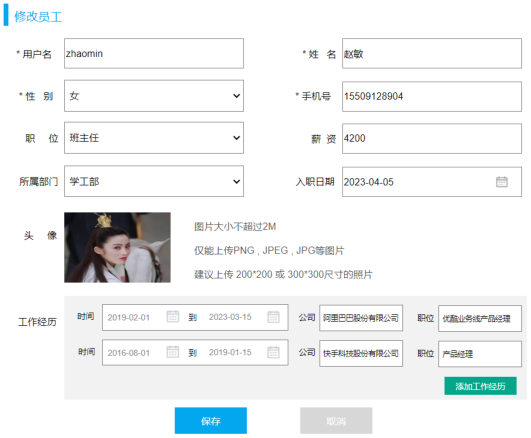
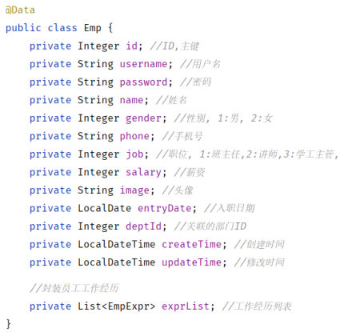

[74 篇](/posts/编程学习/javaweb学习笔记/74-删除员工/)把列表页上单行的「删除」和顶部的「批量删除」做通了，紧挨着它的那个「编辑」按钮还点不动。这一篇（PPT 第 9～19 页）就做**修改员工**：点「编辑」时要把这个人（连他的工作经历一起）带回页面，用户改完再整体提交。

这是员工管理里最绕的一个功能——一次请求只带一个员工 id，但页面要拿到**两张表**的数据；保存时也只提交一个对象，后端却要动**两张表**。前半篇讲"查出来装进对象"，后半篇讲"存回去时为什么要把老数据删掉重插"。

## 修改员工 = 查询回显 + 修改数据（PPT 第 9～12、16 页）

PPT 第 9 页是章节导航页（删除员工 / 修改员工 / 异常处理 / 员工信息统计 四个标题又列了一遍），第 10 页是「**修改员工 02**」小标题页，第 11 页给出本节的需求，就两件事：

> **查询回显** → **修改数据**

第 12 页和第 16 页是同一张导航页（"修改员工 / 查询回显 / 修改数据 / 02"）——它在"查询回显"和"修改数据"两段之间又出现了一次，等于把这一节切成了上下两半。

把两件事放回页面就是一条完整的交互链：

1. 在员工列表里点某一行的「**编辑**」；
2. 页面打开修改员工表单，**表单里已经填好了这个员工的数据**（包括下面那几行工作经历）——这就是**查询回显**：前端拿着这一行的 id 去后端要"这个员工的完整信息"；
3. 用户改完基本信息、增删几行工作经历，点「保存」；
4. 表单里的整份数据（基本信息 + 工作经历列表）一次性提交给后端——这就是**修改数据**。

> [!IMPORTANT]
> 回显和修改是两个接口，分别对应两次请求：**点"编辑"时**发一次查询（拿到要显示的数据），**点"保存"时**发一次修改（把改完的数据存回去）。顺序不能反，前端也不可能在用户没点保存时就让后端改数据。

回到员工管理页——「编辑」就在每行「操作」列的「删除」左边：


*图：PPT 第 11 页配的员工管理页面截图——顶部是条件查询表单（姓名 / 性别 / 入职时间 + 查询、清空），中间是「+ 新增员工」「- 批量删除」，表格「操作」列里每行都有「编辑」和「删除」。点「编辑」走的就是本节这条"查询回显 → 修改数据"的链路*

## 需求分析：两张表的数据都要带出来（PPT 第 11、13 页）

点「编辑」后打开的表单长这样——上半是员工基本信息，下半是工作经历：


*图：PPT 第 11、13 页配的修改员工表单——上方是基本信息（用户名、姓名、性别、手机号、职位、薪资、所属部门、入职日期、头像），下方是"工作经历"两行（时间 从 到、公司、职位，右侧还有「添加工作经历」），最底下「保存 / 取消」。和新增员工的表单是同一张，区别是每个输入框里都已经有了原来填过的值——这些值就是"查询回显"要提供的*

PPT 第 13 页把这件事拆到三层，并且点名了数据来源：

| | 内容 |
| --- | --- |
| 要回显的数据 | 员工**基本信息**（表：`emp`）+ 员工**工作经历信息**（表：`emp_expr`） |
| **Controller** | 接收请求参数（ID 值）、调用 Service 方法、响应结果 |
| **Service** | 调用 Mapper **查询员工详细信息**（基本信息、工作经历信息） |
| **Mapper** | 一条多表查询：`select ... from emp e left join emp_expr ee on e.id = ee.emp_id where e.id = ?` |

注意这里和以前那些"根据 ID 查一条"不一样：**一次要查两张表**。`emp` 和 `emp_expr` 是一对多（[64 篇](/posts/编程学习/javaweb学习笔记/64-多表关系与表设计/)），一个员工可能挂着 0 条、1 条或多条工作经历，所以这次查询返回的不是"一行一个员工"，而是"**员工 × 经历**"的多行：

```text
e.id=41 的员工 + 他的经历1   →  第 1 行
e.id=41 的员工 + 他的经历2   →  第 2 行
e.id=41 的员工 + 他的经历3   →  第 3 行
```

而接口要返回的是"**一个**员工对象，里面装着一个**经历列表**"（`Emp.exprList`）。把这个"多行扁宽的结果"折成"一个对象 + 一个集合"，就是本节第一件技术活。

接口文档（2.4 根据ID查询）里也写明了响应的形状：

| 项 | 内容 |
| --- | --- |
| 请求路径 | `/emps/{id}` |
| 请求方式 | `GET` |
| 接口描述 | 该接口用于根据主键 ID 查询员工的信息 |
| 参数格式 | **路径参数** |
| 参数说明 | `id`：number，必须，员工 ID（样例 `/emps/1`） |
| 响应 `data` | `id`、`username`、`name`、`password`、`entryDate`、`gender`、`image`、`job`、`salary`、`deptId`、`createTime`、`updateTime`……以及 **`exprList`（object[] 工作经历列表，里面每项有 `id`/`company`/`job`/`begin`/`end`/`empId`）** |

## 查询回显：Controller 与 Service（PPT 第 14 页）

Controller 要多加一个带路径变量的查询方法：

```java
@GetMapping("/{id}")
public Result getInfo(@PathVariable Integer id){
    log.info("根据id查询员工信息, id: {}", id);
    Emp emp = empService.getInfo(id);
    return Result.success(emp);
}
```

- **`@GetMapping("/{id}")`**：类上已经有 `@RequestMapping("/emps")`，所以完整路径是 `GET /emps/{id}`，和接口文档对得上；
- **`@PathVariable`**：这是**路径变量**——id 是嵌在 URL 路径里的（`/emps/41`），不是 `?id=41` 那种查询参数，所以绑定要用 `@PathVariable` 而不是 `@RequestParam`（[62 篇](/posts/编程学习/javaweb学习笔记/62-部门管理-修改部门/)查单个部门时用过同样的写法）；
- 返回值是**一个 `Emp` 对象**（不是列表）——里面要装着 `exprList`。

Service 层这次什么事都不做，直接转交给 Mapper：

```java
@Override
public Emp getInfo(Integer id) {
    return empMapper.getById(id);
}
```

> [!NOTE]
> 这一节没有"要先删谁再插谁"的顺序问题，也不需要事务——**查数据是只读的**，Service 就是个传话筒（PPT 第 13 页上写的"调用 mapper 查询员工详细信息"）。真正的业务逻辑在下一篇的"修改数据"里。

## 回显的查询：多表查询 + 列别名（PPT 第 14 页）

`EmpMapper.java` 里加一个方法：

```java
/**
 * 根据ID查询员工信息以及工作经历信息
 */
Emp getById(Integer id);
```

`EmpMapper.xml` 里的查询：

```xml
<!--根据ID查询员工基本信息及员工的工作经历信息-->
<select id="getById" resultMap="empResultMap">
    select
        e.* ,
        ee.id ee_id,
        ee.emp_id ee_empid,
        ee.begin ee_begin,
        ee.end ee_end,
        ee.company ee_company,
        ee.job ee_job
    from emp e left join emp_expr ee on e.id = ee.emp_id
    where e.id = #{id}
</select>
```

一行一行看：

- **`from emp e left join emp_expr ee on e.id = ee.emp_id`**：给两张表起别名 `e` 和 `ee`（[65 篇](/posts/编程学习/javaweb学习笔记/65-多表查询/)的写法）。用 **left join**（左外连接）而不用 inner join 的原因很实在：**员工可能一条工作经历都没有**，这时 `emp_expr` 里没有匹配的行，左外连接仍然会把 `emp` 那一行查出来（右边的列全是 NULL）；换成内连接，这种"没填经历"的员工在编辑时就**查不到了**，页面直接报错；
- **`e.*`**：把 `emp` 的所有列都查出来（`id`、`username`、`name`、`gender`、`phone`、`job`、`salary`、`image`、`entry_date`、`dept_id`、`create_time`、`update_time` 这些基本信息都靠它）；
- **`ee.id ee_id`、`ee.emp_id ee_empid`、`ee.begin ee_begin`、`ee.end ee_end`、`ee.company ee_company`、`ee.job ee_job`**：`select 列 别名` 的写法，把 `emp_expr` 的六列**全部起了 `ee_` 前缀的别名**；
- **`where e.id = #{id}`**：只查这一个员工。

为什么非要起别名？因为**两张表有重名的列**：`emp` 有 `id`，`emp_expr` 也有 `id`；`e.*` 已经把 `emp` 的 `id` 查出来了，如果 `emp_expr` 的 id 还叫 `id`，结果集里就有两个同名列，MyBatis 根本分不清哪个该映射到员工、哪个该映射到经历。加上 `ee_` 前缀之后，六列各有一个**独一无二的名字**，映射时就能一一对应：

| 查询结果里的列名 | 映射到哪儿 |
| --- | --- |
| `id`、`username`、`name`……（来自 `e.*`） | `Emp` 对象自己的属性 |
| `ee_id` | `exprList` 里每个 `EmpExpr` 的 `id` |
| `ee_empid` | `exprList` 里每个 `EmpExpr` 的 `empId` |
| `ee_begin` / `ee_end` | `EmpExpr` 的 `begin` / `end` |
| `ee_company` / `ee_job` | `EmpExpr` 的 `company` / `job` |

`Emp` 实体类里那个接收工作经历的字段（PPT 第 14 页配的图就是它）：


*图：PPT 第 14 页配的 `Emp` 实体类——上面十三个属性对应 `emp` 表（`id`/`username`/`password`/`name`/`gender`/`phone`/`job`/`salary`/`image`/`entryDate`/`deptId`/`createTime`/`updateTime`），最底下一行 `private List<EmpExpr> exprList;`（注释写着"封装员工工作经历"）就是回显时用来装工作经历的集合属性*

## `<resultMap>` + `<collection>`：逐行讲（PPT 第 14 页）

`getById` 用的是 `resultMap="empResultMap"`，而不是平时那个 `resultType`。这个自定义结果集是本篇最关键的一段 XML：

```xml
<!--自定义结果集ResultMap-->
<resultMap id="empResultMap" type="com.itheima.pojo.Emp">
    <id column="id" property="id" />
    <result column="username" property="username" />
    <result column="password" property="password" />
    <result column="name" property="name" />
    <result column="gender" property="gender" />
    <result column="phone" property="phone" />
    <result column="job" property="job" />
    <result column="salary" property="salary" />
    <result column="image" property="image" />
    <result column="entry_date" property="entryDate" />
    <result column="dept_id" property="deptId" />
    <result column="create_time" property="createTime" />
    <result column="update_time" property="updateTime" />

    <!--封装工作经历信息-->
    <collection property="exprList" ofType="com.itheima.pojo.EmpExpr">
        <id column="ee_id" property="id"/>
        <result column="ee_empid" property="empId"/>
        <result column="ee_begin" property="begin"/>
        <result column="ee_end" property="end"/>
        <result column="ee_company" property="company"/>
        <result column="ee_job" property="job"/>
    </collection>
</resultMap>
```

逐块读：

| 部分 | 含义 |
| --- | --- |
| `<resultMap id="empResultMap" type="com.itheima.pojo.Emp">` | 定义**一个自定义结果集**，名字叫 `empResultMap`，最终要封装成 `Emp` 类型的对象；`<select>` 上用 `resultMap="empResultMap"` 引用它 |
| `<id column="id" property="id"/>` | 把查询结果里名为 `id` 的列映射到 `Emp` 的 `id` 属性。**`<id>` 专门用来标主键**——它告诉 MyBatis"这一列是这行数据的身份标识"，MyBatis 才能判断多行结果里哪些行属于**同一个**员工，从而把它们合并成一个对象、把多出来的经历塞进集合（没有这段，多行就会变成多个 Emp） |
| 一串 `<result column="..." property="..."/>` | 普通列的映射，一列一条。`column` 是**查询结果里的列名**，`property` 是**实体类的属性名**。注意 `column` 用的是数据库的列名 `entry_date`、`dept_id`、`create_time`、`update_time`，`property` 用的是驼峰属性名 `entryDate`、`deptId`、`createTime`、`updateTime`——这里**要自己写清楚**，因为用了 resultMap 就不再走"驼峰自动映射"那套（[55 篇](/posts/编程学习/javaweb学习笔记/55-mybatis-xml映射配置/)的 `map-underscore-to-camel-case`） |
| `<collection property="exprList" ofType="com.itheima.pojo.EmpExpr">` | 开始映射**集合属性**：`property="exprList"` 是 `Emp` 上那个 `List` 字段的名字，`ofType` 是**集合里元素的类型**（`EmpExpr`）。从这一行到 `</collection>` 中间的每一条，映射的都是"集合里一个元素"的属性 |
| `<collection>` 里的 `<id column="ee_id" .../>` 和五条 `<result .../>` | 把带 `ee_` 前缀的六列分别映射到 `EmpExpr` 的属性上——**这就是列别名的作用所在**：另一边（`e.*`）已经把 `id` 等列名占了，`ee_` 前缀让两套列名互不打架，映射时又靠这里的 `column` 名字精确对上 |

一次性理解"多行怎么变成一个对象"：

```text
结果集 3 行（同一个员工 + 3 条经历）
  ↓ <id column="id"> 认出"这 3 行是同一个员工"
  ↓ 前 13 条映射：Emp 的基本信息（3 行都相同，只取一份）
  ↓ <collection>：逐行把 ee_* 六列组装成一个 EmpExpr，收集进 List
Emp{ id=41, name=张伟, ..., exprList=[EmpExpr, EmpExpr, EmpExpr] }
```

## 问答：什么时候用 resultType、什么时候用 resultMap（PPT 第 15 页）

PPT 第 15 页专门停下来问了这个问题：

| PPT 的问题 | 答案 |
| --- | --- |
| MyBatis 中封装查询结果，什么时候用 `resultType`，什么时候用 `resultMap`？ | 如果查询返回的**字段名与实体的属性名可以直接对应上**，用 `resultType`；如果查询返回的**字段名与实体属性名对应不上**，或者**实体属性比较复杂**（比如里面还是个集合、要装关联表的数据），就通过 `resultMap` 手动封装 |

对着本节的例子看：

- [68 篇](/posts/编程学习/javaweb学习笔记/68-条件分页查询与动态sql/)的员工列表查询用的是 `resultType="com.itheima.pojo.Emp"`——每行一个员工、列名和属性名能对上（靠驼峰映射），不需要额外说明；
- 本节的 `getById` 只能用 `resultMap`——一次查出来的是**员工 × 经历**的多行，要折成一个 `Emp` 里带着 `List<EmpExpr>`；而且两张表有同名列、还要把 `ee_` 别名对到集合元素的属性上，这些"对应关系"必须手写出来。

## 本机实测：回显回来的是一个对象 + 一个列表

先造一条带工作经历的数据（用[上一篇](/posts/编程学习/javaweb学习笔记/69-新增员工/)的接口新增员工 zhangwei，拿到 id=41，手下带 2 条经历），然后查回显：

> [!TIP]
> **本机实测**：
>
> ```text
> $ GET http://localhost:8080/emps/41
> {"code":1,"msg":"success","data":{
>   "id":41,"username":"zhangwei","name":"张伟", ... "deptId":2,
>   "exprList":[
>     {"id":3,"empId":41,"begin":"2019-06-01","end":"2021-06-01","company":"腾讯","job":"后端开发"},
>     {"id":4,"empId":41,"begin":"2021-07-01","end":"2023-04-01","company":"字节跳动","job":"高级开发"}
>   ]}}
> ```
>
> 要点：`data` 是**一个**员工对象（不是数组），里面带着 `exprList` 这个**列表**，列表里每个元素都有自己的 `id`/`empId`/`begin`/`end`/`company`/`job`。
> `exprList` 能装进去，靠的就是上面那套自定义结果集 `<resultMap>` + `<collection>`：查询结果里那两行"员工 × 经历"被合并成一个员工，两行里的 `ee_company`、`ee_job` 这些列分别被映射成两个 `EmpExpr` 塞进集合。用 `resultType` 做不到这件事——列名对不上（`ee_company` 不是 `Emp` 的属性），而且 `Emp` 里那个属性本身就是个集合，得有人告诉 MyBatis"集合里装什么类型、每一列往哪个属性里放"。

## 修改数据：PUT 请求 + 业务层的三件事（PPT 第 16～18 页）

第 16 页的导航页之后，进入后半段"修改数据"。PPT 第 17 页把三层和 SQL 摆了出来：

| 层 | 职责 | 具体到修改员工 |
| --- | --- | --- |
| **Controller** | 接收请求参数、调用 Service 方法、响应结果 | 用 `@RequestBody` 把 JSON 装成 `Emp` 对象（里面含 `exprList`），调 `empService.update(emp)` |
| **Service** | 业务处理 | ① 根据 ID 修改员工的**基本信息**；② 根据 ID 修改**工作经历信息** |
| **Mapper** | 数据访问操作 | 三条 SQL：`update emp set ....`；`delete emp_expr where ...`；`insert into emp_expr ...`（PPT 上标注：**先删除再添加**） |

接口文档（2.5 修改员工）：

| 项 | 内容 |
| --- | --- |
| 请求路径 | `/emps` |
| 请求方式 | `PUT` |
| 接口描述 | 该接口用于修改员工的数据信息 |
| 参数格式 | `application/json` |
| 参数说明 | `id` 必须；`username`、`name`、`gender` 必须；`image`、`deptId`、`entryDate`、`job`、`salary`、`exprList`（工作经历列表）非必须 |

### Controller：一个 PUT 方法

```java
@PutMapping
public Result update(@RequestBody Emp emp){
    log.info("修改员工: {}", emp);
    empService.update(emp);
    return Result.success();
}
```

`@PutMapping` 对应 `PUT`（改数据用 PUT、新增用 POST，[61 篇](/posts/编程学习/javaweb学习笔记/61-部门管理-新增部门/)的约定）；请求体是整份表单的 JSON，所以要用 `@RequestBody`。改的是"哪一个员工"由 JSON 里的 `id` 决定（不是路径参数）——所以**接口文档里 `id` 是必须的**。

### Service：三件事，一件都不能漏

```java
@Transactional(rollbackFor = Exception.class)
@Override
public void update(Emp emp) {
    //1. 根据ID修改员工的基本信息
    emp.setUpdateTime(LocalDateTime.now());
    empMapper.updateById(emp);

    //2. 根据ID修改员工的工作经历信息
    //2.1 先根据员工ID删除原有的工作经历
    empExprMapper.deleteByEmpIds(Arrays.asList(emp.getId()));

    //2.2 再添加这个员工新的工作经历
    List<EmpExpr> exprList = emp.getExprList();
    if(!CollectionUtils.isEmpty(exprList)){
        exprList.forEach(empExpr -> empExpr.setEmpId(emp.getId()));
        empExprMapper.insertBatch(exprList);
    }
}
```

逐条说：

1. **改基本信息**：先 `emp.setUpdateTime(LocalDateTime.now())` 补上"最后修改时间"（前端表单里没有这一项，[69 篇](/posts/编程学习/javaweb学习笔记/69-新增员工/)补的是创建/修改时间，这里只需要改修改时间），然后 `empMapper.updateById(emp)`；
2. **删掉这个员工原有的全部工作经历**：`empExprMapper.deleteByEmpIds(...)` 就是[上一篇](/posts/编程学习/javaweb学习笔记/74-删除员工/)写的那个"按一批员工 id 删经历"的方法，这里**复用**它——只不过这次要删的只有当前这一个员工，所以用 `Arrays.asList(emp.getId())` 把**一个 id 包成 List**（方法要的是 `List<Integer>`，可以理解为"只有一个人的批量删除"）；
3. **插入表单里新的工作经历**：和新增员工时一样，先 `forEach` 给每条经历填上 `empId`，再 `insertBatch` 批量插入；`CollectionUtils.isEmpty(exprList)` 判空——用户可能把工作经历**全部删光**，这时 `exprList` 是 null 或空集合，**跳过插入**（但第 2.1 步的删除照样执行，效果就是"这个员工现在没有任何经历"）。

**`@Transactional(rollbackFor = Exception.class)`**：这三件事合起来才叫"修改一个员工"。如果"删了老经历"之后、"插入新经历"失败了，不加事务就会留下一个**工作经历凭空消失**的员工；加了事务，整个方法一起回滚，数据还是修改前的样子（[70 篇](/posts/编程学习/javaweb学习笔记/70-事务管理与spring事务/)）。

## 为什么是"先删后插"（PPT 第 17 页）

"改工作经历"完全可以写 update 语句，课程却选了**先删掉全部老经历、再把表单里的新经历全插一遍**——PPT 第 17 页特意在 SQL 后面标了"（先删除再添加）"。原因是**前端提交的是一份"整体替换"的列表**：

- 用户在修改表单里能干三件事：改某一行经历的内容、删掉一整行、点「添加工作经历」加一行；
- 他点保存时，前端提交的是**保存那一刻表单里剩下的所有经历**，它**不会**告诉后端"第 1 行改了、第 2 行删了、第 3 行是新加的"；
- 后端拿到的是一个 `List<EmpExpr>`，里面的经历谁是"老的"、谁是"新的"根本分不出来（`EmpExpr` 虽然有 `id`，但用户加的新行没有 id，用户删掉的行也不会出现在列表里）。

所以最省事、最不容易错的策略就是：

```text
把这个人名下的老经历 → 全部删掉   （delete emp_expr where emp_id in ( ? )）
把请求里的新列表     → 全部插进去 （insert into emp_expr(...) values (...),(...)）
```

结果一定等于"表单里现在长什么样，库里就是什么样"。反过来想两个错误做法就明白了：

- **只插不删**：老经历还在库里，新列表又插了一遍——经历**越改越多**，出现重复的旧数据；
- **只删不插**：经历被清空，用户改了个公司名结果工作经历全没了。

顺带对比一下两半数据的处理方式：员工**基本信息**是"一行对一行"，一个员工在 `emp` 里就一行，所以用 `update` 精准修改；**工作经历**是"一组对一组"，数量还会变，所以用"清空重填"的思路。

## 本机实测：改一次员工，三条 SQL 按顺序发出去

请求：把 id=41 改成「张伟改 / 职位 4（教研主管）/ 薪资 15000 / 部门 3」，工作经历换成 **3 条**（腾讯、阿里云、美团）。

> [!TIP]
> **本机实测**：
>
> ```text
> $ PUT http://localhost:8080/emps
> body: {"id":41,"username":"zhangwei","name":"张伟改","gender":1,"job":4,"salary":15000,
>        "deptId":3, ... , "exprList":[ 3 条经历 ]}
>
> # 改完查库
> emp        表：id=41 → 张伟改 | job=4 | salary=15000 | dept_id=3      ← 基本信息被更新
> emp_expr   表：3 条（腾讯/后端开发、阿里云/技术专家、美团/架构师）
>                 新经历的 id 变成 5、6、7                              ← 老的 id 3、4 没了
> ```
>
> 服务端日志里三条 SQL，顺序就是业务逻辑的顺序：
>
> ```text
> ==>  Preparing: UPDATE emp SET username = ?, name = ?, gender = ?, phone = ?, job = ?, salary = ?,
>                  image = ?, entry_date = ?, dept_id = ?, update_time = ? WHERE id = ?
> ==>  Preparing: delete from emp_expr where emp_id in ( ? )                    ← 先把老经历删掉
> ==>  Preparing: insert into emp_expr(emp_id, begin, end, company, job)
>                  values (?,?,?,?,?) , (?,?,?,?,?) , (?,?,?,?,?)               ← 再把新经历一次插进去
> ```
>
> **UPDATE → delete → insert** 三条连在一起，正是 Service 里那三件事的"现场记录"。
> （本机连的是 MySQL 的 `tlias` 库、用户名 `root`；`password` 换成你自己 MySQL 的密码。）

### 经历 id 从 3、4 变成 5、6、7，是 bug 吗

不是。`emp_expr.id` 是**自增主键**，它只会往前发号，**删掉的行号不会回收**：

```text
改之前：id = 3（腾讯）、id = 4（字节跳动）      ← 原来的两条
改的时候：delete 把它们删掉 → 自增计数器不会退回去
          insert 三条新经历 → 拿到 5、6、7
改之后：id = 5、6、7                          ← 三条全新记录，和 3、4 没有任何关系
```

这个细节正是"先删后插"的**证据**：库里那三条不是被"改"出来的，而是**新插进来的记录**（老的两条真的被删了）。所以：

- 前端回显时带下来的经历 `id`，后端保存时**并不依赖**它——反正要全删重插（那些 id 只用于前端列表渲染，[修改接口的文档]里 `exprList[].id` 也是非必须的）；
- "经历 id 变了"不是数据错乱，是这种实现方式的正常现象；反过来说，如果哪天需要**跟踪**某条经历的历史（比如按经历 id 记流水），就不能用"先删后插"了，要改成按 id 逐条 update——这属于超出课程范围的取舍。

## 让 update 语句灵活起来：`<set>` 标签（PPT 第 18、19 页）

上面 Service 里调的是 `empMapper.updateById(emp)`，这个 SQL 在 PPT 里先给了一版**把字段全写死**的：

```xml
<!--根据ID更新员工基本信息-->
<update id="updateById">
    UPDATE emp
    SET
        username = #{username},
        password = #{password},
        name = #{name},
        gender = #{gender},
        phone = #{phone},
        job = #{job},
        salary = #{salary},
        image = #{image},
        entry_date = #{entryDate},
        dept_id = #{deptId},
        update_time = #{updateTime}
    WHERE id = #{id}
</update>
```

它能跑，但 PPT 第 19 页给了两个评价：**不灵活**、**扩展性差**。问题在于：

- **没传值的字段会被写成 null**：这份表单没有密码这一项，`emp.password` 就是 null，可 SQL 里照样有 `password = #{password}`——一次"改姓名"会把数据库里的密码**覆盖成 NULL**（同理凡是本次没提交的字段都会被清掉）；
- **SQL 写死**：以后 `emp` 表加一个字段、或者某个功能只想改两列，都得回来重写这段语句。

解决思路和[68 篇](/posts/编程学习/javaweb学习笔记/68-条件分页查询与动态sql/)的动态 SQL 一样——**谁能拼、谁不能拼，交给 `<if>` 判断**；再加一个新标签 `<set>` 收拾格式：

```xml
<!--set标签: 会自动生成set关键字; 会自动的删除掉更新字段后多余,-->
<update id="updateById">
    UPDATE emp
    <set>
        <if test="username != null and username != ''">username = #{username},</if>
        <if test="password != null and password != ''">password = #{password},</if>
        <if test="name != null and name != ''">name = #{name},</if>
        <if test="gender != null">gender = #{gender},</if>
        <if test="phone != null and phone != ''">phone = #{phone},</if>
        <if test="job != null">job = #{job},</if>
        <if test="salary != null">salary = #{salary},</if>
        <if test="image != null and image != ''">image = #{image},</if>
        <if test="entryDate != null">entry_date = #{entryDate},</if>
        <if test="deptId != null">dept_id = #{deptId},</if>
        <if test="updateTime != null">update_time = #{updateTime},</if>
    </set>
    WHERE id = #{id}
</update>
```

`<set>` 帮我们做两件事（PPT 第 19 页的标题就是这个）：

| 它做的事 | 说明 |
| --- | --- |
| **自动生成 `set` 关键字** | 我们不用在外面写 `SET`，`<set>` 标签自己会拼一个 |
| **自动删除更新字段后面多余的逗号** | 每个 `<if>` 里的字段后面都带着逗号（因为不知道哪个是最后一个），标签会把**最末尾那个多出来的逗号**擦掉 |

配合 `<if>` 的效果就是**只有传了值的字段才会出现在 SQL 里**：

- 字符串类型的字段要判两样：`!= null` **且** `!= ''`（空串也没意义）；
- 数字、日期、时间类型的字段只判 `!= null` 就够了；
- PPT 第 19 页页脚还列了 `id,username,updateTime` 三个字段——就是演示"这次只传了这三个字段"的情形：`id` 用于 `WHERE` 定位、`username` 是要改的值、`updateTime` 是服务端补的最后修改时间；其余字段都是 null，**一个字都不进 SQL**。

> [!NOTE]
> PPT 的 `<set>` 版本最后一行 `update_time = #{updateTime}` 末尾没有逗号，课程代码里则写成了 `update_time = #{updateTime},`——两种都对：反正 `<set>` 会把末尾多余的逗号删掉，所以后一种更省心（每个字段无脑带逗号，不用特意记住"最后一个别写"）。

写完之后 `EmpMapper.java` 里的方法声明就是一句：

```java
/**
 * 根据ID更新员工基本信息
 */
void updateById(Emp emp);
```

> [!TIP]
> `where id = #{id}` 里的 `id` 是**必须**传的（不传就变成 `UPDATE emp SET ...` 不带条件，整张表一起改，那就出大事了）——这也解释了为什么接口文档把 `id` 标成"必须"。

## 小结

| 问题 | 答案 |
| --- | --- |
| 修改员工分几件事？ | 两件：**查询回显**（点"编辑"把数据带回页面）+ **修改数据**（点"保存"整份提交） |
| 回显接口是什么？ | `GET /emps/{id}`（路径参数），响应 `data` 是一个 `Emp` 对象，里面带着 `exprList` |
| 回显怎么查？ | `select e.*, ee.id ee_id, ... from emp e left join emp_expr ee on e.id = ee.emp_id where e.id = #{id}`——用左外连接，没填经历的员工也能查出来 |
| 为什么要给列起别名？ | 两张表都有 `id` 等同名列，`e.*` 已经占了那些名字；`ee_` 前缀让六列各有唯一名字，才能分别映射进集合元素 |
| `<resultMap>` 与 `<collection>` 各干什么？ | `<resultMap>` 定义自定义结果集（`type` 是最终类型，`<id>` 标主键用于合并多行，`<result>` 映射普通列）；`<collection>` 映射集合属性（`property` 是字段名、`ofType` 是元素类型） |
| 什么时候用 resultMap？ | 字段名与属性名对不上、或实体属性比较复杂（像这次要装一个集合）时用它；能直接对上就用 `resultType`（PPT 第 15 页） |
| 修改接口是什么？ | `PUT /emps`，`application/json`，JSON 里的 `id` 必须 |
| Service 做三件事？ | ① 补 `updateTime` 并 `updateById`；② `deleteByEmpIds` 删老经历；③ 给新经历填 `empId` 后 `insertBatch`，判空；整体加 `@Transactional` |
| 为什么先删后插？ | 前端提交的是**整体替换**的经历列表，后端分不出哪条改了/新增；全删重插最不容易错（只插不删会重复、只删不插会清空） |
| 本机实测的关键现象？ | 回显返回 2 条经历；改成 3 条后日志三条 SQL 顺序为 **UPDATE → delete → insert**；新经历 id 从 3、4 变成 **5、6、7**（自增不回收，正是"先删后插"的证据） |
| `<set>` 有什么用？ | 自动生成 `set` 关键字、自动删掉字段后多余的逗号；配合 `<if>` 实现**只更新传了值的字段**，替代"写死所有字段"那种不灵活、扩展性差的写法 |

## 相关

- [上一篇：删除员工](/posts/编程学习/javaweb学习笔记/74-删除员工/)
- [下一篇：全局异常处理](/posts/编程学习/javaweb学习笔记/76-全局异常处理/)

## 练习题

### 一、知识回顾（读完直接做下面的实践题）

1. **两件事**：修改员工 = **查询回显**（点「编辑」时前端拿 id 来要这个员工的完整信息）+ **修改数据**（用户改完点「保存」整份提交），对应两次请求、两个接口
2. **两个接口**：回显是 `GET /emps/{id}`（**路径参数**，`id` 必须，响应 `data` 是一个员工对象、里面有 `exprList`）；修改是 `PUT /emps`（`application/json`，`id`/`username`/`name`/`gender` 必须，改的是哪个员工由 JSON 里的 `id` 决定）
3. **回显的 SQL**：`select e.*, ee.id ee_id, ee.emp_id ee_empid, ee.begin ee_begin, ee.end ee_end, ee.company ee_company, ee.job ee_job from emp e left join emp_expr ee on e.id = ee.emp_id where e.id = #{id}`；用 **left join** 是因为员工可能一条工作经历都没有，内连接会**查不到**这种员工
4. **为什么要起 `ee_` 别名**：两张表有重名列（都有 `id`），`e.*` 已经把 `emp` 的列名占了；起别名后六列名字唯一，才能一一映射到集合元素的属性上
5. **`<resultMap>` + `<collection>` 怎么写**：结果集用 `<id column property>` 标主键（MyBatis 靠它把多行合并成同一个对象）、用 `<result column property>` 映射普通列（`column` 是结果集列名、`property` 是实体属性名，`entry_date` → `entryDate` 这类要自己写清）；集合部分 `<collection property="exprList" ofType="com.itheima.pojo.EmpExpr">`——`property` 是 `Emp` 里的集合字段名，`ofType` 是集合元素的类型
6. **resultType 还是 resultMap（PPT 第 15 页）**：字段名与属性名能直接对上 → `resultType`；对不上、或实体属性比较复杂（要装集合）→ `resultMap` 手动封装
7. **Service 的三件事**：① 补 `updateTime` 后 `updateById(emp)`；② `deleteByEmpIds(Arrays.asList(emp.getId()))` 删掉老经历（复用批量删除方法，一个 id 包成 List）；③ `exprList` 非空时给每条填 `empId` 再 `insertBatch`；整个方法 `@Transactional(rollbackFor = Exception.class)`
8. **先删后插的理由**：前端提交的是保存那一刻表单里的**全部**经历，后端分不清哪条改了/哪条新增/哪条被删；全删再全插的结果一定等于表单现状（只插不删会越改越多、只删不插会清空）
9. **本机实测**：回显 `GET /emps/41` 返回 `exprList` **2 条**；改成 3 条经历后日志三条 SQL 顺序是 **UPDATE → delete → insert**，新经历的 id 从 **3、4** 变成 **5、6、7**（自增主键不回收——老记录真的被删了，新记录是新插的）
10. **`<set>` + `<if>`（PPT 第 19 页）**：`<set>` 自动生成 `set` 关键字、自动删掉更新字段后多余的逗号；`<if>` 判断字段有值才拼进 SQL，实现动态更新——替代"写死所有字段"那种**不灵活、扩展性差**的写法（全写死会把没提交的字段改成 NULL）

### 二、裸写题

- [ ] **2-1 点「编辑」时，把员工和他的工作经历一起带出来（三层）**
  需求：前端在列表里点了某一行「编辑」，只知道这个员工的 id（比如 41），要打开一张表单、把这位员工的基本信息**和**他手下的所有工作经历都填进去。后端要提供一个查询接口：接住这个 id、把它交给业务层和数据访问层，返回统一响应结果，`data` 里是这位员工（工作经历要能一起装进去）。三层都要写。
  （练习文件 `test_75_查询回显与修改.java` 的题目2-1 里给了写作区。）

  > [!TIP]- 提示（先自己想，实在想不出再点开）
  > **一级 · 思路**：这个 id 是嵌在 URL 路径里的（`/emps/41`），不是查询参数；数据是**两张表**的（基本信息 + 工作经历列表），要用多表查询把它们一起查出来，再折成"一个对象 + 一个集合"
  > **二级 · 方法**：Controller 用 `@GetMapping("/{id}")` + `@PathVariable Integer id`；Service 直接 `return empMapper.getById(id);`；Mapper 用 `left join` 查两张表，配合 `<resultMap>` + `<collection>` 封装（结果映射写在 `test_75_结果映射与动态更新.xml` 里）
  > **三级 · 骨架**：
  > ```java
  > // Controller
  > @GetMapping("____")
  > public Result getInfo(@____ Integer id){
  >     log.info("根据id查询员工信息, id: {}", id);
  >     Emp emp = empService.____(id);
  >     return Result.____(emp);
  > }
  > // Service
  > public Emp getInfo(Integer id) { return empMapper.____(id); }
  > // Mapper 接口
  > Emp ____(Integer id);
  > ```

  > [!TIP]- 参考答案（做完再点开）
  > ```java
  > // ===== Controller =====
  > @GetMapping("/{id}")
  > public Result getInfo(@PathVariable Integer id){
  >     log.info("根据ID查询员工信息: {}", id);
  >     Emp emp = empService.getInfo(id);
  >     return Result.success(emp);
  > }
  >
  > // ===== Service（只读查询，不用事务，直接转交给 Mapper） =====
  > @Override
  > public Emp getInfo(Integer id) {
  >     return empMapper.getById(id);
  > }
  >
  > // ===== Mapper 接口 =====
  > /**
  >  * 根据ID查询员工信息以及工作经历信息
  >  */
  > Emp getById(Integer id);
  > ```
  > 自查：① 路径变量要用 `@PathVariable`（`/emps/41` 里那个 41 是路径的一部分，不是 `?id=41`）；② 返回值是**一个 `Emp`**，工作经历装在它的 `exprList` 里；③ 完整 SQL 与结果映射见 2-3（`left join` + 自定义结果集）——本机实测 `GET /emps/41` 返回的 `data` 里 `exprList` 有 **2 条**经历。

- [ ] **2-2 保存修改：一次提交要动两张表（三层 + 讲清工作经历那一步）**
  需求：用户在修改表单里改完基本信息、又增删了几行工作经历，点「保存」把整份数据（含工作经历列表）以 JSON 提交到 `/emps`（`PUT`）。后端要：改这个员工的基本信息（顺手记下最后修改时间）；把这个员工原有的工作经历换成表单里的那份。两步都必须实现，并且要么一起成功、要么一起不做。写出三层代码，并说明工作经历那一步要怎么操作才能做到"**表单里剩几条，库里就有几条**"——如果只新增不删除会怎样？如果只删除不新增会怎样？用户把经历全删光时又该怎么处理？
  （练习文件 `test_75_查询回显与修改.java` 的题目2-2 里给了写作区。）

  > [!TIP]- 提示（先自己想，实在想不出再点开）
  > **一级 · 思路**：基本信息是"一行对一行"，改它用更新语句；工作经历是"一组对一组"、条数还会变，安全做法是**先把这个人的老经历全删掉，再把新列表整个插进去**（复用 74 篇那两个"按一批 id 操作"的方法）；两次数据库操作要包在事务里
  > **二级 · 方法**：Controller 用 `@PutMapping` + `@RequestBody Emp emp`；Service 加 `@Transactional(rollbackFor = Exception.class)`，里面 `emp.setUpdateTime(LocalDateTime.now())` → `empMapper.updateById(emp)` → `empExprMapper.deleteByEmpIds(Arrays.asList(emp.getId()))` → 判空后 `forEach` 填 `empId` → `empExprMapper.insertBatch(exprList)`；单条更新语句先写 `void updateById(Emp emp);` 声明（动态更新的 XML 见 2-4）
  > **三级 · 骨架**：
  > ```java
  > // Controller
  > @____
  > public Result update(@____ Emp emp){
  >     log.info("修改员工: {}", emp);
  >     empService.____(emp);
  >     return Result.____();
  > }
  > // Service
  > @____(rollbackFor = Exception.class)
  > public void update(Emp emp) {
  >     emp.setUpdateTime(LocalDateTime.____());
  >     empMapper.____(emp);                                   //1. 改基本信息
  >     empExprMapper.____(Arrays.asList(emp.getId()));          //2.1 删掉老经历
  >     List<EmpExpr> exprList = emp.getExprList();             //2.2 插入新经历
  >     if(!CollectionUtils.____(exprList)){
  >         exprList.forEach(e -> e.setEmpId(emp.____()));
  >         empExprMapper.____(exprList);
  >     }
  > }
  > ```

  > [!TIP]- 参考答案（做完再点开）
  > ```java
  > // ===== Controller =====
  > @PutMapping
  > public Result update(@RequestBody Emp emp){
  >     log.info("修改员工: {}", emp);
  >     empService.update(emp);
  >     return Result.success();
  > }
  >
  > // ===== Service 实现 =====
  > @Transactional(rollbackFor = Exception.class)
  > @Override
  > public void update(Emp emp) {
  >     //1. 根据ID修改员工的基本信息
  >     emp.setUpdateTime(LocalDateTime.now());
  >     empMapper.updateById(emp);
  >
  >     //2. 根据ID修改员工的工作经历信息
  >     //2.1 先根据员工ID删除原有的工作经历
  >     empExprMapper.deleteByEmpIds(Arrays.asList(emp.getId()));
  >
  >     //2.2 再添加这个员工新的工作经历
  >     List<EmpExpr> exprList = emp.getExprList();
  >     if(!CollectionUtils.isEmpty(exprList)){
  >         exprList.forEach(empExpr -> empExpr.setEmpId(emp.getId()));
  >         empExprMapper.insertBatch(exprList);
  >     }
  > }
  >
  > // ===== Mapper 接口 =====
  > void updateById(Emp emp);   // XML 版 SQL 见 2-4
  > ```
  > **为什么"先删后插"**：
  > - 前端提交的是保存那一刻表单里的**全部经历**，里面分不出"哪条改了、哪条是新的、哪条被删了"（用户新加的行没有 id，用户删掉的行根本不在列表里）；
  > - 所以后端把这个人名下的老经历**全删**、再把列表里的**全插**，结果一定等于"表单现在长什么样，库里就长什么样"；
  > - 只插不删 → 老经历还在，经历会**越改越多**（出现重复）；只删不插 → 用户改了个公司名，工作经历**被清空**；
  > - 记得两个细节：`Arrays.asList(emp.getId())` 是把**一个 id 包成 List**（复用批量删除的方法），`CollectionUtils.isEmpty(...)` 判空是因为用户可能把经历**全部删光**（那就只删不插）。
  > - 本机实测：日志里的三条 SQL 顺序就是 **UPDATE → delete → insert**；新经历 id 从 3、4 变成 **5、6、7**。

- [ ] **2-3 回显的查询 + 结果映射（写进 XML）**
  需求：要按 id 查出**一位员工的全部信息**，同时把他的**所有工作经历**作为一个列表装进这个员工对象里（他可能一条经历都没有）。这句查询和这句查询的"结果怎么封装"都写在 XML 映射文件里，写完回答：为什么给工作经历那几列都起了 `ee_` 前缀的别名？"装集合"那部分写的两个属性分别是什么意思（一个是装到哪个字段、一个是集合里装什么类型）？两张表连接时为什么用左外连接而不是内连接？
  （练习文件 `test_75_结果映射与动态更新.xml` 的题目2-3 里给了写作区。）

  > [!TIP]- 提示（先自己想，实在想不出再点开）
  > **一级 · 思路**：两张表要一起查——用左外连接（保证"没有经历"的员工也查得出来）；查出来是多行，要折成"一个对象 + 一个集合"，所以不能用那个"直接对上就用"的简单写法，要**自定义结果集**
  > **二级 · 方法**：`<resultMap id="empResultMap" type="com.itheima.pojo.Emp">` 里先写员工自己的列（`<id>` 标主键）、再写 `<collection property="exprList" ofType="com.itheima.pojo.EmpExpr">`；查询用 `<select id="getById" resultMap="empResultMap">`，`select e.*, ee.id ee_id, ee.emp_id ee_empid, ...`
  > **三级 · 骨架**：
  > ```xml
  > <resultMap id="empResultMap" type="com.itheima.pojo.Emp">
  >     <id column="id" property="____"/>
  >     <result column="username" property="____"/>
  >     ... （其余基本列）
  >     <collection property="____" ofType="com.itheima.pojo.EmpExpr">
  >         <id column="____" property="id"/>
  >         <result column="ee_company" property="____"/>
  >         ...
  >     </collection>
  > </resultMap>
  >
  > <select id="____" resultMap="____">
  >     select e.*, ee.id ____, ... from emp e ____ emp_expr ee on e.id = ee.____
  >     where e.id = #{id}
  > </select>
  > ```

  > [!TIP]- 参考答案（做完再点开）
  > ```xml
  > <!--自定义结果集ResultMap-->
  > <resultMap id="empResultMap" type="com.itheima.pojo.Emp">
  >     <id column="id" property="id" />
  >     <result column="username" property="username" />
  >     <result column="password" property="password" />
  >     <result column="name" property="name" />
  >     <result column="gender" property="gender" />
  >     <result column="phone" property="phone" />
  >     <result column="job" property="job" />
  >     <result column="salary" property="salary" />
  >     <result column="image" property="image" />
  >     <result column="entry_date" property="entryDate" />
  >     <result column="dept_id" property="deptId" />
  >     <result column="create_time" property="createTime" />
  >     <result column="update_time" property="updateTime" />
  >
  >     <!--封装工作经历信息-->
  >     <collection property="exprList" ofType="com.itheima.pojo.EmpExpr">
  >         <id column="ee_id" property="id"/>
  >         <result column="ee_empid" property="empId"/>
  >         <result column="ee_begin" property="begin"/>
  >         <result column="ee_end" property="end"/>
  >         <result column="ee_company" property="company"/>
  >         <result column="ee_job" property="job"/>
  >     </collection>
  > </resultMap>
  >
  > <!--根据ID查询员工基本信息及员工的工作经历信息-->
  > <select id="getById" resultMap="empResultMap">
  >     select
  >         e.* ,
  >         ee.id ee_id,
  >         ee.emp_id ee_empid,
  >         ee.begin ee_begin,
  >         ee.end ee_end,
  >         ee.company ee_company,
  >         ee.job ee_job
  >     from emp e left join emp_expr ee on e.id = ee.emp_id
  >     where e.id = #{id}
  > </select>
  > ```
  > 回答：
  > - **为什么起 `ee_` 别名**：`emp` 和 `emp_expr` 有重名列（都有 `id`），而 `e.*` 已经把 `emp` 的那些列名占了；如果 `emp_expr` 的列还叫 `id`、`company` 这些名字，结果集里出现同名同姓的列，映射时分不清谁是谁。`ee_` 前缀让六列**名字唯一**，才能分别对到 `EmpExpr` 的属性上；
  > - **`<collection>` 的两个属性**：`property="exprList"` 指 `Emp` 里那个集合字段的名字（装到哪儿去），`ofType="com.itheima.pojo.EmpExpr"` 指**集合里元素的类型**（里面装什么）；
  > - 顺带两点：`<id column="id" property="id"/>` 里的 `<id>` 是"主键"的意思——MyBatis 靠它把多行结果里属于**同一个员工**的行合并成一个对象；用 left join 是为了让**没有工作经历**的员工也能被查出来。

- [ ] **2-4 让更新语句只更新真正传了值的字段（写进 XML）**
  需求：现在这句员工更新语句把十一个字段全写死了，一次"只改姓名"的请求会把密码、头像这些**没提交的字段覆盖成 NULL**，以后表里加字段还得回来改它。请把它改成"**传了值的字段才更新**"的写法，写完说明新标签帮我们做了哪两件事、字符串字段为什么要多判一个空串。
  （练习文件 `test_75_结果映射与动态更新.xml` 的题目2-4 里给了写作区。）

  > [!TIP]- 提示（先自己想，实在想不出再点开）
  > **一级 · 思路**：这就是动态 SQL 的套路——每个字段用条件判断"有值才拼进去"；麻烦的是字段之间的逗号（不知道哪个是最后一个），所以要用一个专门管 `set` 的标签替我们收拾格式
  > **二级 · 方法**：把 `SET` 换成一个特殊标签，里面每个字段一行 `<if test="字段 != null">列名 = #{属性名},</if>`；字符串字段的 `test` 再加 `and 字段 != ''`（[68 篇](/posts/编程学习/javaweb学习笔记/68-条件分页查询与动态sql/)的写法）
  > **三级 · 骨架**：
  > ```xml
  > <update id="updateById">
  >     UPDATE emp
  >     <____>
  >         <if test="username != null and username != ''">username = #{username},</if>
  >         <if test="gender != null">gender = #{gender},</if>
  >         ...（其余字段）
  >         <if test="updateTime != null">update_time = #{updateTime},</if>
  >     </____>
  >     WHERE id = #{id}
  > </update>
  > ```

  > [!TIP]- 参考答案（做完再点开）
  > ```xml
  > <!--set标签: 会自动生成set关键字; 会自动的删除掉更新字段后多余,-->
  > <update id="updateById">
  >     UPDATE emp
  >     <set>
  >         <if test="username != null and username != ''">username = #{username},</if>
  >         <if test="password != null and password != ''">password = #{password},</if>
  >         <if test="name != null and name != ''">name = #{name},</if>
  >         <if test="gender != null">gender = #{gender},</if>
  >         <if test="phone != null and phone != ''">phone = #{phone},</if>
  >         <if test="job != null">job = #{job},</if>
  >         <if test="salary != null">salary = #{salary},</if>
  >         <if test="image != null and image != ''">image = #{image},</if>
  >         <if test="entryDate != null">entry_date = #{entryDate},</if>
  >         <if test="deptId != null">dept_id = #{deptId},</if>
  >         <if test="updateTime != null">update_time = #{updateTime},</if>
  >     </set>
  >     WHERE id = #{id}
  > </update>
  > ```
  > 说明：
  > - 那个标签（`<set>`）帮我们做两件事：**自动生成 `set` 关键字**、**自动删掉更新字段后面多余的逗号**——所以每个 `<if>` 里的字段都可以无脑带上逗号，不用记得"最后一个别写"；
  > - **字符串字段要多判空串**（`and username != ''`）：`null` 和空字符串都表示"这次没有值"，只判 `null` 的话，前端传了个空串也会把数据库里的值改成空；
  > - 数字/日期/时间字段只判 `!= null` 就够了（它们没有"空串"这种状态）；
  > - 对比原来"写死所有字段"那版：那版**不灵活、扩展性差**——本次没提交的字段（比如表单里压根没有的 `password`）会被 `#{password}` 写成 NULL，表里加字段还得回来改语句；
  > - **`WHERE id = #{id}` 千万不能丢**：丢了就变成不带条件的全表更新。

### 三、综合题

- [ ] **3-1 照着课程把"编辑 → 回显 → 改 → 保存"整条链路走一遍**
  这一题把本节从头到尾走一遍，每一步都留证据（响应 JSON、数据库查询、服务端日志）。
  1. 三层补齐两个接口：查询回显（`GET`，带路径变量，多表查询 + 自定义结果集）和修改数据（`PUT`，接收 JSON，改基本信息 + 换工作经历），更新语句用"只更新传了值的字段"那版；
  2. 先造一条带 **2 段**工作经历的数据：用[新增接口](/posts/编程学习/javaweb学习笔记/69-新增员工/)新增一名员工（例如 username 用 zhangwei），记下后端生成的 id；
  3. 发一次查询回显请求 `GET /emps/<id>`，把返回的 JSON 抄下来——确认 `data` 是**一个对象**、里面 `exprList` 是**2 条**，记下这两条经历的 `id`；
  4. 发一次修改请求 `PUT /emps`：把姓名改掉、职位/薪资/部门改掉，工作经历换成 **3 条**（注意 JSON 里必须带 `id`）；
  5. 把服务端日志里这次请求发出的 SQL **按顺序**抄下来（应该有三条），并去库里查：`select * from emp where id = <id>;` 和 `select * from emp_expr where emp_id = <id>;`——基本信息改对了吗？经历有几条？
  6. 再发一次 `GET /emps/<id>`，把新经历的 `id` 和第 3 步记下的老 `id` 比一比，然后解释：为什么 id 会变？
  7. 回答下面两个问题。

  （练习文件 `test_75_查询回显与修改.java` 的"综合题"一段里按这 7 步给了写作区。）

  回答：① 第 5 步的三条 SQL 为什么是这个顺序？如果改成"先插新经历、再删老经历"会发生什么？② 用户在工作经历里点了几次「添加工作经历」、又删掉了一行，后端怎么知道该存哪几条？

  **涉及知识点**

  | 知识点 | 在这里的应用 |
  | --- | --- |
  | 两件事：回显 + 修改（PPT 11、12、16） | 第 3、4 步——两次请求，先查后改 |
  | 多表查询（PPT 13） | 第 1、3 步——`left join` 把基本信息和经历一起查出来 |
  | `<resultMap>` + `<collection>`（PPT 14） | 第 1、3 步——`exprList` 能装进对象的唯一原因 |
  | resultType / resultMap 的选择（PPT 15） | 第 1、3 步——重名列 + 集合属性只能靠自定义结果集 |
  | PUT + Service 三件事（PPT 17、18） | 第 1、4、5 步——更新基本信息、删老经历、插新经历 |
  | `<set>` + `<if>`（PPT 19） | 第 1、4 步——只更新传了值的字段（第 4 步里没传的字段不会被清空） |
  | 先删后插 | 第 5、6、7 步——SQL 顺序与经历 id 变化的解释 |

  > [!TIP]- 提示（先自己想，实在想不出再点开）
  > **一级 · 思路**：先把"回显"链路走通（一次请求拿到对象 + 经历列表），再把"修改"链路走通（三条 SQL 落库），最后用新旧经历的 id 对比证明"先删后插"
  > **二级 · 方法**：`@GetMapping("/{id}")` + `@PathVariable`；`@PutMapping` + `@RequestBody`；`@Transactional(rollbackFor = Exception.class)`；`resultMap` + `collection`；`<set>` + `<if>`；查库用 `select * from emp_expr where emp_id = ?`
  > **三级 · 骨架**：① 回显 `GET http://localhost:8080/emps/____`；② 修改 `PUT http://localhost:8080/emps`（body 里带 `id` + 3 条 `exprList`）；③ 日志三条 SQL 顺序：____ → ____ → ____；④ 新经历 id = ____（老的是 ____）

  > [!TIP]- 参考答案（做完再点开）
  > **1. 三层代码**（与 2-1、2-2、2-3、2-4 的答案一致，合起来就是课程 `EmpController.getInfo`/`update`、`EmpServiceImpl.getInfo`/`update`、`EmpMapper.getById`/`updateById`、`EmpExprMapper.deleteByEmpIds`/`insertBatch`）：
  > ```java
  > // 回显
  > @GetMapping("/{id}")
  > public Result getInfo(@PathVariable Integer id){
  >     log.info("根据ID查询员工信息: {}", id);
  >     return Result.success(empService.getInfo(id));
  > }
  > // 修改
  > @PutMapping
  > public Result update(@RequestBody Emp emp){
  >     log.info("修改员工: {}", emp);
  >     empService.update(emp);
  >     return Result.success();
  > }
  > @Transactional(rollbackFor = Exception.class)
  > public void update(Emp emp) {
  >     emp.setUpdateTime(LocalDateTime.now());
  >     empMapper.updateById(emp);
  >     empExprMapper.deleteByEmpIds(Arrays.asList(emp.getId()));
  >     List<EmpExpr> exprList = emp.getExprList();
  >     if(!CollectionUtils.isEmpty(exprList)){
  >         exprList.forEach(e -> e.setEmpId(emp.getId()));
  >         empExprMapper.insertBatch(exprList);
  >     }
  > }
  > ```
  > **2～3. 回显结果**（**本机实测**）：`GET /emps/41` 返回 `{"code":1,"msg":"success","data":{ "id":41, "username":"zhangwei", ..., "exprList":[ {"id":3,...,"company":"腾讯","job":"后端开发"}, {"id":4,...,"company":"字节跳动","job":"高级开发"} ]}}`——**一个对象 + 两条经历**，老经历的 id 是 **3、4**。
  > **4～5. 修改后的数据库与日志**（**本机实测**）：
  >    ```text
  >    emp       ：id=41 → 张伟改 | job=4 | salary=15000 | dept_id=3
  >    emp_expr  ：3 条（腾讯/后端开发、阿里云/技术专家、美团/架构师）
  >
  >    ==>  Preparing: UPDATE emp SET username = ?, ..., update_time = ? WHERE id = ?
  >    ==>  Preparing: delete from emp_expr where emp_id in ( ? )
  >    ==>  Preparing: insert into emp_expr(emp_id, begin, end, company, job) values (?,?,?,?,?) , (?,?,?,?,?) , (?,?,?,?,?)
  >    ```
  >    三条 SQL 的顺序就是 Service 里那三件事：**改基本信息 → 删老经历 → 插新经历**。
  > **6. 经历 id 的变化**（**本机实测**）：新经历 id 是 **5、6、7**，老的两条 3、4 已经不存在了。id 会变是因为 `emp_expr.id` 是**自增主键**——老记录被 delete 删掉后，自增计数不会退回去，新插进去的三条只能往后拿号。这恰好证明库里那三条不是"改"出来的，而是**新插的记录**（先删后插的必然结果）。
  > **7. 两个回答**：
  >    ① **先改员工、再删老经历、最后插新经历**：改员工和它没有依赖（用的是同一个 id）；关键是经历的两步——必须先删后插，否则如果"先插新的"，库里一度会同时存在老经历和新经历（那一刻数据是脏的），万一后面的删除没执行成功，就会留下"新旧混杂、经历翻倍"的结果；而且课程里"删"这一步无论如何都要做（不做就会重复），先删后插的顺序让中间态更干净，也让事务回滚时的语义不含糊；
  >    ② 后端的依据是**前端提交的那份列表本身**：用户在表单里加行、删行、改行，提交时这份列表就是"当前表单里的全部经历"，后端既不追问"哪条改了"，也不看 `exprList[].id`——直接**把库里这个员工的经历全删掉**，再把这份列表**全部插入**。所以"表单里剩几条，库里就有几条"，用户增删了多少行都自然对上（`exprList[].id` 在前端只是渲染用的，接口文档里标的是"非必须"，本机实测里它也确实换了一批新号）。
