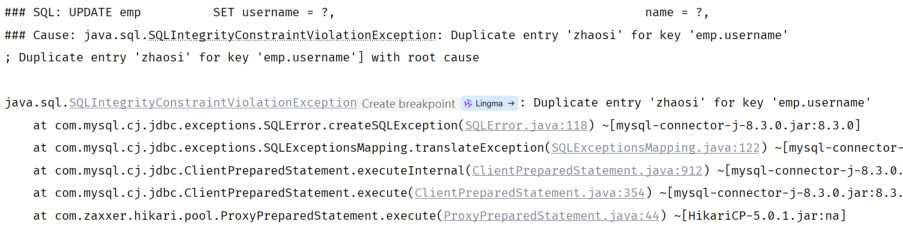
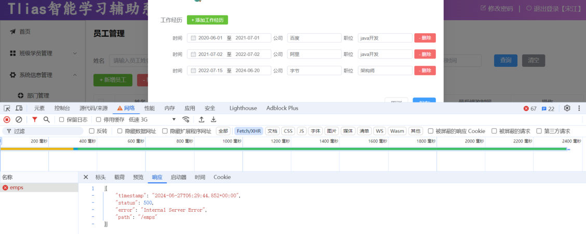
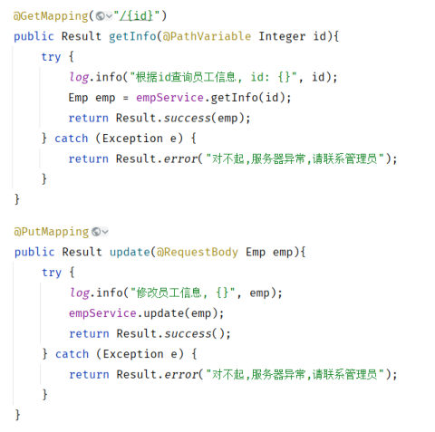

[75 篇](/posts/编程学习/javaweb学习笔记/75-修改员工/)把"修改员工"做完了（查询回显的 `<resultMap>` + `<collection>`、修改数据的"先删后插"）。到这里，员工管理的增删改查四个功能齐了，可它们都还缺一道"兜底"——[70 篇](/posts/编程学习/javaweb学习笔记/70-事务管理与spring事务/)和 [71 篇](/posts/编程学习/javaweb学习笔记/71-事务进阶与操作日志/)演示过：异常一抛，事务回滚、操作日志照记，可**异常本身最后还是抛出了 Controller**，谁都没接住它。这一篇（PPT 第 20～25 页）就来接住它：先看清"异常现场"和不做处理的后果，再定义一个**全局异常处理器**，把项目里所有的异常统一成 `Result` 格式（[77 篇](/posts/编程学习/javaweb学习笔记/77-员工信息统计/)接着做员工管理的最后一个功能——员工信息统计）。

## 异常躲不掉，默认返回还不符合规范（PPT 第 20 页）

PPT 第 20 页只有两句话，但把这件事的必要性说透了：

> 项目开发及运行过程中，**不可避免**的会出现各种异常。
> **功能测试** → **出现异常时，默认返回的结果不符合规范**。

第一句说的是事实：代码写得再小心，异常也总会来——网络断了、磁盘满了、参数传错了、用户名撞车了……第二句是 PPT 在"功能测试"时抓到的现场：


*图：PPT 第 20 页配的异常现场——报错信息里出现了 `SQLIntegrityConstraintViolationException: Duplicate entry 'zhaosi' for key 'emp.username'`：往 `emp` 表里插/改了一个已经存在的 `username`（`username` 建表时就是唯一约束），数据库直接拒绝（本机实测撞的是 `zhangwei`，报错形状一模一样）*

异常一抛，前端收到的是什么？PPT 第 20 页的下一张截图就是答案：


*图：PPT 第 20 页配的截图——浏览器开发者工具的 Network 面板里，`/emps` 请求的"响应"是 SpringBoot 的默认错误结构；页面下半部分的表单正是"修改员工"里可以添加多行工作经历的那一块*

这段默认结构长这样（本机实测，`GET /emps/abc` 的响应体）：

```json
{"timestamp":"...","status":500,"error":"Internal Server Error","path":"/emps/abc"}
```

字段是 `timestamp`、`status`、`error`、`path`；而项目里所有接口约定好的响应是 `Result`：

| 结构 | 字段 | 前端怎么处理 |
| --- | --- | --- |
| SpringBoot **默认**错误结构 | `timestamp` / `status` / `error` / `path` | 没约定过：每个接口都要**特判**、页面还可能把 `Internal Server Error` 这串英文直接显示出来 |
| 项目的 `Result` 规范 | `code`（1 成功 / 0 失败）/ `msg` / `data` | 一套规则吃到底：`code` 判断成败、`msg` 直接显示提示（[35 篇](/posts/编程学习/javaweb学习笔记/35-springboot设置响应数据/)定的规矩） |

> [!NOTE]
> 这段默认结构是 SpringBoot **自己的错误处理机制**生成并返回的（Servlet 容器发现异常没人接，就转发到 `/error`，由 SpringBoot 内置的错误控制器拼出这段 JSON）。它本身没毛病，但**格式和项目不统一**——前端为了显示一句像样的提示，得先判断"这次拿到的是哪种结构"，接口一多就乱了。

## 现在异常是怎么处理的（PPT 第 21-23 页）

PPT 第 21 页又是那张章节目录页（删除员工 / 修改员工 / **异常处理** / 员工信息统计），本篇进的就是第三格；第 22 页是"**03 异常处理**"的小标题页，从第 23 页开始讲正题。

第 23 页先提了一个问题，然后自己把现状摆了出来：

> **现在项目中各层出现的异常，是如何处理的？**


*图：PPT 第 23 页配的代码——`EmpController` 的 `getInfo`、`update` 等方法各写了一圈 `try { ... } catch (Exception e) { return Result.error("对不起,服务器异常,请联系管理员"); }`，两个方法一对比就能看出模板代码在成段重复*

现状一共两条路，PPT 的评价很直接：

| 现在的做法 | 结果 |
| --- | --- |
| **各层都不处理**（Mapper、Service、Controller 谁也不 catch） | 异常一路往外抛，交给 SpringBoot 默认处理 → 返回的是上面那段**不符合规范**的默认结构 |
| **在 Controller 里一个一个方法 try-catch** | 每个方法都包一圈、catch 块里返回同一句硬编码的提示——PPT 的评价是"**代码臃肿，不推荐**" |

"代码臃肿"只是表面，真写起来还有三个更麻烦的地方：

| 问题 | 具体表现 |
| --- | --- |
| **模板代码成倍重复** | 每加一个接口就要再抄一圈 try-catch，几十个接口就是几十圈 |
| **拦不住的异常照样漏** | 参数绑定阶段抛的异常（比如本机实测的 `GET /emps/abc`——`Integer id` 收到 `abc`）**根本没进 Controller 方法**，方法体里的 try-catch 拦不到；[72 篇](/posts/编程学习/javaweb学习笔记/72-文件上传/)那个 413（`MaxUploadSizeExceededException`）也是同理，请求在进 Controller 之前就被拦下了 |
| **容易把异常吞掉** | catch 住之后如果不往外抛，上层（比如事务管理器）就看不到"出过异常"了——[71 篇](/posts/编程学习/javaweb学习笔记/71-事务进阶与操作日志/)专门强调过这种事：异常被吞，事务反而**不会**回滚 |

所以需要一个"**专门收异常的地方**"：异常不管从哪一层冒出来，都统一交给它来处理。

## 全局异常处理器（PPT 第 24 页）

PPT 第 24 页画出了改造后的样子：正常的请求照常返回"**正常结果**"，一旦有 `Exception` 冒出来，就交给项目里新增的一个角色——**全局异常处理器**，由它统一产出"**异常结果**"。

课程工程里这个类叫 `GlobalExceptionHandler`，放在 `com.itheima.exception` 包下，代码只有两个方法：

```java
package com.itheima.exception;

import com.itheima.pojo.Result;
import lombok.extern.slf4j.Slf4j;
import org.springframework.dao.DuplicateKeyException;
import org.springframework.web.bind.annotation.ExceptionHandler;
import org.springframework.web.bind.annotation.RestControllerAdvice;

/**
 * 全局异常处理器
 */
@Slf4j                       // Lombok：生成 log 对象，用来记录异常日志
@RestControllerAdvice        // 关键注解：声明这是一个"全局异常处理器"（= @ControllerAdvice + @ResponseBody）
public class GlobalExceptionHandler {

    /**
     * 处理所有异常（通用兜底）
     */
    @ExceptionHandler                                      // 关键注解：标记这是"处理异常"的方法
    public Result handleException(Exception e){            // 方法参数的类型 = 这个方法能处理的异常类型
        log.error("程序出错啦~", e);                        // ① 记录错误日志（异常对象一起传，堆栈才能进日志）
        return Result.error("出错啦, 请联系管理员~");       // ② 返回项目统一的错误结果
    }

    /**
     * 专门处理"唯一约束冲突"（比如用户名重复）
     */
    @ExceptionHandler
    public Result handleDuplicateKeyException(DuplicateKeyException e){
        log.error("程序出错啦~", e);
        String message = e.getMessage();                   // 拿到异常信息
        int i = message.indexOf("Duplicate entry");        // 定位到 "Duplicate entry" 的位置
        String errMsg = message.substring(i);              // 截掉前面那一堆类名、SQL 之类的内容
        String[] arr = errMsg.split(" ");                  // 按空格切开
        return Result.error(arr[2] + " 已存在");            // 第 3 段就是那个重复的值
    }
}
```

就这几十行，把上一节那三个麻烦一起解决了：

- **不再重复**：所有 Controller 的异常都归这两个方法管，接口里一个 try-catch 都不用写；
- **不再漏**：连"没进 Controller"的异常（参数绑定失败、上传超限）也会被它接住——本机实测的 `GET /emps/abc` 走的就是通用方法；
- **格式统一**：返回的是 `Result.error(...)`，前端按 `code`/`msg` 一套规则处理（本机实测的响应体见下一节）。

两个方法各管什么，看一眼就很清楚：

| 方法 | 参数类型 | 管谁 | 返回 |
| --- | --- | --- | --- |
| `handleException` | `Exception` | **所有异常**（兜底），比如参数类型转换失败 | `Result.error("出错啦, 请联系管理员~")` |
| `handleDuplicateKeyException` | `DuplicateKeyException` | **唯一约束冲突**（翻译好的数据库异常），比如 `username` 重复 | `Result.error("'xxx' 已存在")` |

> [!NOTE]
> **PPT 第 24 页与课程工程的一处措辞差异**：PPT 第 24 页那段示意代码里写的是 `log.error("全局异常处理器, 拦截到异常", e)` 和 `Result.error("对不起,服务器异常,请稍后重试")`；课程工程里用的是 `log.error("程序出错啦~", e)` 和 `Result.error("出错啦, 请联系管理员~")`。**结构完全一样**，只是提示语不同——本机实测的响应（和日志）跟的是课程工程这一版。

### 日志为什么不只记一句话，还要把异常对象传进去

```java
log.error("程序出错啦~", e);
```

这行是[63 篇](/posts/编程学习/javaweb学习笔记/63-日志技术/)讲的**占位符之外的另一种重载**：`log.error(String msg, Throwable t)` 会把**异常对象**一起交给日志框架，日志里除了那句 `程序出错啦~`，还会把异常的**类名、消息和整条堆栈**都写下来。用 `logback.xml` 的 pattern 去认这条记录：记录器名（`%logger`）就是 `com.itheima.exception.GlobalExceptionHandler`——一看就知道是全局异常处理器打的。要是只写 `log.error("程序出错啦~")`（不传 `e`），事后就只能看到一句"出错了"，**到底错在哪、哪一行抛的**全都查不到。

> [!TIP]
> **本机实测**：加了处理器之后，两次异常都在服务端日志里留下了 `程序出错啦~` 的 **ERROR** 记录（一次是重复用户名、一次是参数类型不对），堆栈跟着一起写进了日志——排查问题时，日志里的堆栈和浏览器里那段"体面的"提示是**两份东西**：给用户看的是 `msg`，给自己看的是日志。

## 问答：怎么定义一个全局异常处理器（PPT 第 25 页）

PPT 第 25 页把定义方式压成了三行：

| PPT 给出的答案 | 意思 |
| --- | --- |
| **`@RestControllerAdvice`** | 类上的注解：声明这个类专门给项目里的 Controller"**做增强**"，异常就会被它接住；它**自带 `@ResponseBody`**，所以方法返回的对象会直接转成 JSON 写进响应体 |
| **`@RestControllerAdvice` = `@ControllerAdvice` + `@ResponseBody`** | 等价关系：`@ControllerAdvice` 只负责"通知/增强"这件事**（不带**响应体能力，方法返回的是视图名）；项目里接口要的是一段 JSON，所以用组合版 `@RestControllerAdvice` 一步到位 |
| **`@ExceptionHandler`** | 方法上的注解：标记"这个方法用来处理异常"；**不写值时按方法参数的类型匹配**，也可以写成 `@ExceptionHandler(DuplicateKeyException.class)` 指定类型 |

匹配规则再补一条：一个处理器里可以写多个 `@ExceptionHandler` 方法，异常发生时 Spring 会挑**类型最接近**的那个——撞上 `DuplicateKeyException` 时，`handleDuplicateKeyException`（参数就是它本身）比 `handleException`（参数是它的父类 `Exception`）更具体，所以走前者；其它异常没有更具体的方法接，才落到通用方法上。

## 专门给"用户名重复"做一条友好提示

上一节提到的两张表，其中 `DuplicateKeyException` 是 Spring 对"唯一约束冲突"的**翻译**：

| 阶段 | 看到的东西 |
| --- | --- |
| 数据库（MySQL） | `java.sql.SQLIntegrityConstraintViolationException: Duplicate entry 'zhangwei' for key 'emp.username'` |
| Spring 的持久层（JDBC 异常翻译） | 转成 `org.springframework.dao.DuplicateKeyException`，消息里保留着原文 |

数据库的原文是给开发人员看的（上面那张异常堆栈的截图就是它）——直接丢给用户显然不合适。课程工程的处理办法是**从异常信息里把重复的值抠出来**：

```java
String message = e.getMessage();
// 1) 先找到 "Duplicate entry" 的位置（它前面还压着 SQL、Cause 之类一大段内容）
int i = message.indexOf("Duplicate entry");
// 2) 从这个位置往后截，拿到 "Duplicate entry 'zhangwei' for key 'emp.username'...
String errMsg = message.substring(i);
// 3) 按空格切成数组
String[] arr = errMsg.split(" ");
//    arr[0] = "Duplicate"   arr[1] = "entry"   arr[2] = "'zhangwei'"   ...
// 4) 第 3 段就是那个重复的值，拼成友好提示
return Result.error(arr[2] + " 已存在");     // → "'zhangwei' 已存在"
```

> [!WARNING]
> 这种"按空格切字符串"的写法**依赖异常信息的格式**——`arr[2]` 是数着下标取的，换数据库、换驱动版本，消息格式一变就可能取错（取不到还会数组越界）。它是课程为了演示"从异常里挖信息"的写法；实际项目里更稳的做法是判断异常类型后**返回固定文案**（如"用户名已存在，请换一个"），或者用 `arr[arr.length - 1]` 这类不写死下标的方式。

## 本机实测：加处理器前后，两种异常的真实响应（LAB §4）

> [!TIP]
> **本机实测**（`tlias` 库，本机 MySQL 上的 30 条员工数据；连接信息就是课程工程 `application.yml` 里那一套——`localhost:3306`、库名 `tlias`、用户名 `root`，课程示例密码是 `1234`，**动手时把 `password` 换成你自己 MySQL 的密码**）：两种异常各发一次请求，响应如下。

| 场景 | 请求 | 实测响应（**加处理器之后**） | 走的处理器 |
| --- | --- | --- | --- |
| 重复用户名（唯一约束被撞） | `POST /emps`，`username` 用了库里已存在的 `zhangwei` | `{"code":0,"msg":"'zhangwei' 已存在","data":null}` | `handleDuplicateKeyException` |
| 其它异常（参数类型不对） | `GET /emps/abc`（`id` 位置传了非数字） | `{"code":0,"msg":"出错啦, 请联系管理员~","data":null}` | 通用 `handleException` |

两条响应都是标准的 `Result`：`code` 是 `0`（失败）、`msg` 是一句能直接显示给用户的提示、`data` 是 `null`。对照**加处理器之前**的同一种异常：

| 时间点 | `GET /emps/abc` 拿到的东西 |
| --- | --- |
| 没有处理器 | SpringBoot 默认结构 `{"timestamp":...,"status":500,"error":"Internal Server Error","path":"/emps/abc"}`——字段和 `Result` 对不上 |
| 加了处理器 | `{"code":0,"msg":"出错啦, 请联系管理员~","data":null}`——**项目里所有异常，返回格式都统一了**，前端处理方式一致 |

## 小结

| 问题 | 答案 |
| --- | --- |
| 为什么要有全局异常处理器？ | 项目里**异常不可避免**；不处理时返回的是 SpringBoot 默认错误结构（`timestamp/status/error/path`），**不符合项目的 `Result` 规范**；在各 Controller 里逐个 try-catch 又**代码臃肿、不推荐**（还会漏掉参数绑定等进不了方法的异常、容易吞掉异常） |
| 怎么定义？ | 类上 **`@RestControllerAdvice`**（= `@ControllerAdvice` + `@ResponseBody`），方法上 **`@ExceptionHandler`**（按方法参数类型匹配异常） |
| 处理器里做几件事？ | ① **记日志**：`log.error("程序出错啦~", e)`（异常对象一起传，堆栈进日志）；② **返回统一结果**：`Result.error("...")` |
| 多个处理方法怎么分工？ | 每个方法负责一类异常，Spring 挑**类型最接近**的；所有异常的最后一道兜底是参数为 `Exception` 的那个方法 |
| 重复用户名怎么变成友好提示？ | 拿 `DuplicateKeyException.getMessage()`，用 `indexOf("Duplicate entry")` + `substring` 截出关键段，`split(" ")` 切分后取第 3 段拼成 `"'zhangwei' 已存在"` |
| 实测结果？ | 重复用户名 → `{"code":0,"msg":"'zhangwei' 已存在","data":null}`；`GET /emps/abc` → `{"code":0,"msg":"出错啦, 请联系管理员~","data":null}`；两者都在日志里留下 `程序出错啦~` 的 ERROR 记录 |

## 相关

- [上一篇：修改员工](/posts/编程学习/javaweb学习笔记/75-修改员工/)
- [下一篇：员工信息统计](/posts/编程学习/javaweb学习笔记/77-员工信息统计/)

## 练习题

### 一、知识回顾（读完直接做下面的实践题）

1. **为什么异常躲不掉**：项目开发及运行过程中**不可避免**会出现各种异常；PPT 是在"功能测试"阶段撞上的——那次是往 `emp` 表插入一个已经存在的 `username`（建表时 `username` 就是唯一约束），数据库直接报 `Duplicate entry 'zhaosi' for key 'emp.username'`
2. **默认返回为什么不行**：异常没人接时，SpringBoot 返回自己的错误结构（本机实测 `{"timestamp":"...","status":500,"error":"Internal Server Error","path":"/emps/abc"}`），字段 `timestamp/status/error/path` 与项目统一的 `Result`（`code/msg/data`）**对不上**，前端没法用一套规则处理
3. **现状的两条路**（PPT 第 23 页）：① **各层都不处理**，异常一路抛出去交给 SpringBoot 默认处理；② **在 Controller 里逐个方法写 try-catch**，PPT 的评价是"**代码臃肿，不推荐**"
4. **try-catch 的另外两个毛病**：参数绑定阶段的异常（如 `GET /emps/abc`）**根本没进 Controller 方法**，写在方法体里的 catch 拦不到；catch 住不往外抛还会**把异常吞掉**（[71 篇](/posts/编程学习/javaweb学习笔记/71-事务进阶与操作日志/)的教训：异常被吞，事务不会回滚）
5. **全局异常处理器是什么**：项目里**所有异常**统一交给它处理——正常请求返回正常结果，异常由它产出统一格式的"异常结果"
6. **怎么定义一个全局异常处理器**（PPT 第 25 页）：类上加 **`@RestControllerAdvice`**，方法上加 **`@ExceptionHandler`**；**`@RestControllerAdvice` = `@ControllerAdvice` + `@ResponseBody`**（后者负责把返回对象转成 JSON）
7. **处理方法的匹配规则**：`@ExceptionHandler` 不写值时**按方法参数的类型**匹配异常；一个处理器里可以写多个处理方法，Spring 挑**类型最接近**的那个（`DuplicateKeyException` 优先交给参数就是它的方法，而不是参数为 `Exception` 的兜底方法）
8. **处理器里做两件事**：**记日志**（`log.error("程序出错啦~", e)`——异常对象一起传，堆栈才会进日志）+ **返回统一的错误结果**（`Result.error("...")`）
9. **重复用户名的友好提示怎么来**：`DuplicateKeyException` 的 `getMessage()` 里带着 `Duplicate entry 'xxx' for key ...`；先 `indexOf("Duplicate entry")` 定位、`substring(i)` 截掉前面的内容、再 `split(" ")` 按空格切分，**取第 3 段**（`arr[2]`）就是要显示的那个值，拼成 `arr[2] + " 已存在"`
10. **本机实测对照（LAB §4）**：重复用户名 → `{"code":0,"msg":"'zhangwei' 已存在","data":null}`（走 `handleDuplicateKeyException`）；`GET /emps/abc` → `{"code":0,"msg":"出错啦, 请联系管理员~","data":null}`（走通用 `handleException`）；加处理器之前，`/emps/abc` 拿到的是 `{"timestamp":...,"status":500,"error":"Internal Server Error","path":"/emps/abc"}`；服务端日志里留下 `程序出错啦~` 的 ERROR 记录

### 二、裸写题

- [ ] **2-1 让项目里所有异常都返回统一的结果格式**
  需求：现在项目里任何一层抛出的异常都没人接，前端收到的是 SpringBoot 默认的错误结构，与项目约定好的 `Result`（`code`/`msg`/`data`）完全对不上。请新增一个类，让**项目里所有异常**都被它接住，并且：
  ① 在服务端把错误记录进日志，**异常堆栈也要留下**（事后要能查是哪一行抛的）；
  ② 返回项目统一的错误结果——失败标志 + 一句给用户看的提示（"出错啦, 请联系管理员~"这类）。
  写完后说明：这个类靠哪两个注解发挥作用、每个注解各管什么。
  （练习文件 `test_76_全局异常处理.java` 的题目2-1 里给了写作区。）

  > [!TIP]- 提示（先自己想，实在想不出再点开）
  > **一级 · 思路**：这个"收异常的地方"是一个普通类，靠**类上的一个注解**声明"我是全局异常处理器"、靠**方法上的一个注解**声明"我来处理异常"；方法要能接住所有异常，参数就得是"异常家族里最大的那个类型"
  > **二级 · 方法**：类上 `@RestControllerAdvice`（顺带 `@Slf4j` 拿到 `log`），方法上 `@ExceptionHandler`，参数类型写 `Exception`；记日志用 `log.error("...", e)`（把异常对象一起传），返回值 `Result.error("...")`
  > **三级 · 骨架**：`@____ @____ public class GlobalExceptionHandler { @____ public Result handleException(____ e){ log.____("____", e); return Result.____("____"); } }`

  > [!TIP]- 参考答案（做完再点开）
  > ```java
  > package com.itheima.exception;
  >
  > import com.itheima.pojo.Result;
  > import lombok.extern.slf4j.Slf4j;
  > import org.springframework.web.bind.annotation.ExceptionHandler;
  > import org.springframework.web.bind.annotation.RestControllerAdvice;
  >
  > @Slf4j
  > @RestControllerAdvice                 // 全局异常处理器：接住整个项目里抛出的异常
  > public class GlobalExceptionHandler {
  >
  >     @ExceptionHandler
  >     public Result handleException(Exception e){        // 参数类型 = 能处理的异常类型（Exception 兜住全部）
  >         log.error("程序出错啦~", e);                    // 异常对象一起传，堆栈才会进日志
  >         return Result.error("出错啦, 请联系管理员~");   // 统一成 Result 格式
  >     }
  > }
  > ```
  > 两个注解的分工：**`@RestControllerAdvice`** 加在类上，等价于 `@ControllerAdvice` + `@ResponseBody`——前者声明"这个类给所有 Controller 做异常增强"，后者负责把方法返回的 `Result` 对象**转成 JSON 响应体**；**`@ExceptionHandler`** 加在方法上，标记"这个方法处理异常"，**不写值时按方法参数类型匹配**（这里写 `Exception` 就兜住所有异常）。检查点：① 类在包扫描范围内（课程工程放在 `com.itheima.exception`，与启动类同包之下）；② 返回值是 `Result`（不能是 String 之类，前端要的是统一结构）；③ 日志的第一个参数是消息、第二个是异常对象——只写消息就丢了堆栈。

- [ ] **2-2 用户名重复时给出"XXX 已存在"的友好提示**
  需求：`emp` 表的 `username` 是唯一约束，新增/修改员工时如果用户名已被占用，数据库会抛异常。现在通用处理返回的是笼统的"出错啦, 请联系管理员~"，产品希望针对这一种情况给出**带上了重复值的提示**——前端收到的 `msg` 要是 `'zhangwei' 已存在` 这种样子。请在全局异常处理器里**再写一个处理方法**专门对付它（想想：异常消息里哪里能找到那个重复的值？怎么把它从一大段信息里挖出来？）。
  （练习文件 `test_76_全局异常处理.java` 的题目2-2 里给了写作区。）

  > [!TIP]- 提示（先自己想，实在想不出再点开）
  > **一级 · 思路**：先想清楚"哪一种异常代表唯一约束冲突"——Spring 会把数据库的"约束冲突"翻译成一个专门的异常类型，让新方法的参数类型**正好是它**（这样它比通用方法更具体，会优先被选上）；再去异常的 `getMessage()` 里找重复的值
  > **二级 · 方法**：Spring 的 `org.springframework.dao.DuplicateKeyException`；消息里有一段 `Duplicate entry 'xxx' for key ...`，可以用 `indexOf("Duplicate entry")` 找到起点、`substring(i)` 截出来、`split(" ")` 按空格切开，取下标 `2` 的那一段（形如 `'xxx'`）；拼上 `" 已存在"` 返回
  > **三级 · 骨架**：`@ExceptionHandler public Result handleDuplicateKeyException(____ e){ log.____(...); String message = e.____(); int i = message.____("Duplicate entry"); String errMsg = message.____(i); String[] arr = errMsg.____(" "); return Result.error(arr[____] + " ____"); }`

  > [!TIP]- 参考答案（做完再点开）
  > ```java
  > @ExceptionHandler
  > public Result handleDuplicateKeyException(DuplicateKeyException e){
  >     log.error("程序出错啦~", e);
  >     String message = e.getMessage();                  // 原始消息：... Duplicate entry 'zhangwei' for key 'emp.username' ...
  >     int i = message.indexOf("Duplicate entry");       // 找到关键字的位置（前面还压着别的内容）
  >     String errMsg = message.substring(i);             // 从这里截到末尾
  >     String[] arr = errMsg.split(" ");                 // 按空格切：["Duplicate","entry","'zhangwei'","for",...]
  >     return Result.error(arr[2] + " 已存在");           // 第 3 段就是重复的值
  > }
  > ```
  > 效果：`POST /emps` 用一个已存在的 `username` 时，前端收到 `{"code":0,"msg":"'zhangwei' 已存在","data":null}`（本机实测）。
  > 补充两点：① **为什么它能赢过通用方法**——重复用户名抛出的异常类型就是 `DuplicateKeyException`，它的处理方法参数正好是同一类型，比参数为父类 `Exception` 的通用方法更具体，Spring 优先选它；② 按住下标取 `arr[2]` 依赖异常信息的格式（换数据库/驱动可能变），实际项目更稳妥的是返回固定文案，或先判长度再取。

- [ ] **2-3 把 Controller 里的一圈 try-catch 收拾掉**
  需求：下面这个 Controller 里每个方法都自己包了一圈 try-catch，catch 块里还各写了一份相同的提示语。请回答并改造：
  ① 这种写法至少说出三个坏处；
  ② 改造后 Controller 的方法体里应该**剩下什么**、**不再出现什么**；
  ③ "记日志"与"返回统一错误结果"这两件事应该挪到哪里去做？写出挪过去之后的那个类（类名、类上注解、方法、方法上注解、返回值）。

  ```java
  @RestController
  @RequestMapping("/emps")
  public class EmpController {

      @Autowired
      private EmpService empService;

      @GetMapping("/{id}")
      public Result getInfo(@PathVariable Integer id){
          try {
              log.info("根据ID查询员工信息: {}", id);
              Emp emp = empService.getInfo(id);
              return Result.success(emp);
          } catch (Exception e) {
              return Result.error("对不起,服务器异常,请联系管理员");
          }
      }

      @PutMapping
      public Result update(@RequestBody Emp emp){
          try {
              log.info("修改员工: {}", emp);
              empService.update(emp);
              return Result.success();
          } catch (Exception e) {
              return Result.error("对不起,服务器异常,请联系管理员");
          }
      }
  }
  ```

  > [!TIP]- 提示（先自己想，实在想不出再点开）
  > **一级 · 思路**：先数一数"同一个模板"出现了几次，再想哪些异常根本轮不到方法体里的 catch；③ 问其实就是本篇的主角——把这两件事交给"全局"的那个类
  > **二级 · 方法**：坏处从"重复/拦不到/吞异常"三个角度写；改造后方法体里只剩**调用 Service 与返回成功结果**；日志与错误结果交给 `@RestControllerAdvice` + `@ExceptionHandler` 的那个类
  > **三级 · 骨架**：`① 模板重复（每个方法一圈）；② 参数绑定等异常进不了方法、catch 不到；③ catch 住不抛出会吞掉异常。` 方法体：`log.____(...); empService.____(...); return Result.____(...);`（不再有 `try/catch`）；类：`@____ public class GlobalExceptionHandler { @____ public Result ____(Exception e){ ... } }`

  > [!TIP]- 参考答案（做完再点开）
  > ① 三个坏处：
  > - **模板代码重复**：每加一个接口就多抄一圈，几十个接口就是几十圈，改提示语要改遍所有地方（PPT 第 23 页的评价是"代码臃肿，不推荐"）；
  > - **有的异常根本拦不到**：参数绑定阶段就抛的异常（`GET /emps/abc` 的类型转换失败、[72 篇](/posts/编程学习/javaweb学习笔记/72-文件上传/)的 413 上传超限）在**进 Controller 方法之前**就抛了，方法体里的 try-catch 一点用没有；
  > - **容易吞掉异常**：catch 住之后不往外抛，上层（事务管理器等）就不知道出过错——[71 篇](/posts/编程学习/javaweb学习笔记/71-事务进阶与操作日志/)说过：异常被吞，事务反而不会回滚。
  >
  > ② 改造后 Controller 的方法体里只剩三件事：**打一行正常的业务日志 → 调 Service → 返回 `Result.success(...)`**；不再出现 `try`、`catch`、`Result.error(...)`。
  >
  > ③ 记日志与返回错误结果挪到**全局异常处理器**里（与 2-1 的答案同一个类，两个方法分工）：
  > ```java
  > package com.itheima.exception;
  >
  > import com.itheima.pojo.Result;
  > import lombok.extern.slf4j.Slf4j;
  > import org.springframework.dao.DuplicateKeyException;
  > import org.springframework.web.bind.annotation.ExceptionHandler;
  > import org.springframework.web.bind.annotation.RestControllerAdvice;
  >
  > @Slf4j
  > @RestControllerAdvice
  > public class GlobalExceptionHandler {
  >
  >     @ExceptionHandler
  >     public Result handleException(Exception e){          // 兜底：其它异常
  >         log.error("程序出错啦~", e);
  >         return Result.error("出错啦, 请联系管理员~");
  >     }
  >
  >     @ExceptionHandler
  >     public Result handleDuplicateKeyException(DuplicateKeyException e){   // 更具体：唯一约束冲突
  >         log.error("程序出错啦~", e);
  >         String message = e.getMessage();
  >         int i = message.indexOf("Duplicate entry");
  >         String errMsg = message.substring(i);
  >         String[] arr = errMsg.split(" ");
  >         return Result.error(arr[2] + " 已存在");
  >     }
  > }
  > ```
  > ```java
  > @Slf4j
  > @RequestMapping("/emps")
  > @RestController
  > public class EmpController {
  >
  >     @Autowired
  >     private EmpService empService;
  >
  >     @GetMapping("/{id}")
  >     public Result getInfo(@PathVariable Integer id){
  >         log.info("根据ID查询员工信息: {}", id);
  >         Emp emp = empService.getInfo(id);
  >         return Result.success(emp);           // 异常交给全局异常处理器，这里不再有 try-catch
  >     }
  >
  >     @PutMapping
  >     public Result update(@RequestBody Emp emp){
  >         log.info("修改员工: {}", emp);
  >         empService.update(emp);
  >         return Result.success();
  >     }
  > }
  > ```

### 三、综合题

- [ ] **3-1 给 Tlias 工程接上全局异常处理器，并亲手制造两种异常**
  这一题把本篇串起来：**写处理器 → 制造普通异常 → 制造唯一约束冲突 → 对比处理前后的响应**。
  1. 在 `com.itheima.exception` 包下新建 `GlobalExceptionHandler`：类上一个注解声明它是全局异常处理器、一个 Lombok 注解拿到 `log`；写一个通用的处理方法（参数 `Exception`），记错误日志并返回"出错啦, 请联系管理员~"；
  2. 在同一个类里**再加一个方法**专门处理"用户名重复"（参数类型用 Spring 翻译好的那个约束冲突异常）：从异常信息里把重复的值挖出来，返回 `'xxx' 已存在`；
  3. 启动应用，发一次"重复用户名"的请求（新增员工，`username` 用 `emp` 表里已有的值），把**完整响应**抄到练习文件末尾，并记下这次走的是哪个处理方法；
  4. 再发一次 `GET /emps/abc`（id 位置故意传非数字），抄下响应，记下走的是哪个处理方法；
  5. 去服务端日志（控制台或 `logback.xml` 配的日志文件）里找这两次异常留下的 ERROR 记录：提示语是什么？**异常的堆栈**有没有一起记下来？（这就是为什么 `log.error("...", e)` 要把异常对象传进去）
  6. 把两个 `@ExceptionHandler` 方法**临时注释掉**重新构建启动，再发一次第 4 步的请求：响应变成了什么结构？它和 `Result` 的字段对得上吗？（对照完记得恢复注解）
  7. 回答 PPT 第 25 页的问题：**如何定义一个全局异常处理器？**（说出两个注解，并写出 `@RestControllerAdvice` 的等价关系）
  8. 收尾：把实验时新增/改动的数据恢复（删掉测试新增的员工即可，`emp` 仍应是 30 条）。
  （练习文件 `test_76_全局异常处理.java` 里按这 8 步给了写作区。）

  **涉及知识点**

  | 知识点 | 在这里的应用 |
  | --- | --- |
  | `@RestControllerAdvice` + `@ExceptionHandler` | 第 1、2 步——全局异常处理器的两个注解；`= @ControllerAdvice + @ResponseBody` |
  | `log.error("...", e)` | 第 1、5 步——异常对象一起传，堆栈进日志 |
  | `Result.error(...)` | 第 1、3、4 步——异常也统一成项目的 `Result` 格式 |
  | `DuplicateKeyException` 的信息提取 | 第 2、3 步——`indexOf` + `substring` + `split(" ")` 取出重复的值 |
  | 默认错误结构的问题 | 第 6 步——没有处理器时返回 `timestamp/status/error/path`，与 `Result` 对不上 |

  > [!TIP]- 提示（先自己想，实在想不出再点开）
  > **一级 · 思路**：第 1、2 步就是给本篇那个类抄出来（一个通用方法 + 一个专门方法）；第 3、4 步是"一个能撞出唯一约束的请求 + 一个参数类型不对的请求"；第 6 步靠"注释掉注解"来复现不加处理器的样子
  > **二级 · 方法**：类上 `@Slf4j` + `@RestControllerAdvice`；方法上 `@ExceptionHandler`；专用方法的参数用 `org.springframework.dao.DuplicateKeyException`；发请求用 Apifox/Postman 或 `curl`（`POST /emps` 带 JSON、`GET /emps/abc`）
  > **三级 · 骨架**：`@____ @____ public class GlobalExceptionHandler { @____ public Result handleException(____ e){...} @____ public Result handleDuplicateKeyException(____ e){ ... return Result.error(____ + " 已存在"); } }`；请求：`POST ____`（重复 username）、`GET /emps/____`（非数字 id）

  > [!TIP]- 参考答案（做完再点开）
  > 1~2. 处理器（与课程工程一致）：
  >    ```java
  >    package com.itheima.exception;
  >
  >    import com.itheima.pojo.Result;
  >    import lombok.extern.slf4j.Slf4j;
  >    import org.springframework.dao.DuplicateKeyException;
  >    import org.springframework.web.bind.annotation.ExceptionHandler;
  >    import org.springframework.web.bind.annotation.RestControllerAdvice;
  >
  >    @Slf4j
  >    @RestControllerAdvice
  >    public class GlobalExceptionHandler {
  >
  >        @ExceptionHandler
  >        public Result handleException(Exception e){
  >            log.error("程序出错啦~", e);
  >            return Result.error("出错啦, 请联系管理员~");
  >        }
  >
  >        @ExceptionHandler
  >        public Result handleDuplicateKeyException(DuplicateKeyException e){
  >            log.error("程序出错啦~", e);
  >            String message = e.getMessage();
  >            int i = message.indexOf("Duplicate entry");
  >            String errMsg = message.substring(i);
  >            String[] arr = errMsg.split(" ");
  >            return Result.error(arr[2] + " 已存在");
  >        }
  >    }
  >    ```
  > 3~5. **本机实测**：
  >    | 步骤 | 请求 | 响应 | 处理器 |
  >    | --- | --- | --- | --- |
  >    | 第 3 步 | `POST /emps`（`username` 重复） | `{"code":0,"msg":"'zhangwei' 已存在","data":null}` | `handleDuplicateKeyException` |
  >    | 第 4 步 | `GET /emps/abc` | `{"code":0,"msg":"出错啦, 请联系管理员~","data":null}` | `handleException` |
  >
  >    日志里两次都能看到 `程序出错啦~` 这条 ERROR 记录，后面跟着**完整堆栈**（`DuplicateKeyException` / 类型转换异常都写进去了）——这正是 `log.error("程序出错啦~", e)` 把异常对象当参数传的效果；记录器名是 `com.itheima.exception.GlobalExceptionHandler`，一眼能认出是谁打的。
  > 6. 注释掉两个 `@ExceptionHandler` 方法后，`GET /emps/abc` 的响应退回 SpringBoot 默认结构：`{"timestamp":"...","status":500,"error":"Internal Server Error","path":"/emps/abc"}`——`timestamp`/`status`/`error`/`path` 与 `Result` 的 `code`/`msg`/`data` 完全对不上，前端没法按老规矩处理（对比完恢复注解）。
  > 7. PPT 第 25 页的答案：**类上加 `@RestControllerAdvice`、方法上加 `@ExceptionHandler`**；`@RestControllerAdvice` = `@ControllerAdvice` + `@ResponseBody`（前者声明"给 Controller 做增强"，后者负责把返回值转成 JSON 写进响应体）。
