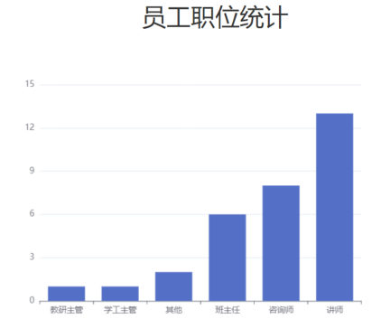
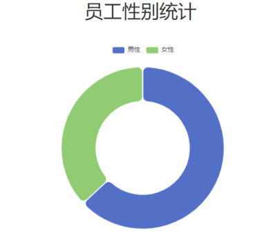

[76 篇](/posts/编程学习/javaweb学习笔记/76-全局异常处理/)给项目接上了全局异常处理器，异常不会再以"不符合规范"的样子甩给前端了。这一篇（PPT 第 26～35 页）做员工管理的**最后一站**——**员工信息统计**：首页上那两张图表（"员工职位统计"柱状图、"员工性别统计"环形图）需要后端提供两个统计接口。CRUD 之外第一次做"只读的统计"，它俩的响应结构和写法都挺特别：一个要**两个一一对应的数组**，一个是**每项 `{name, value}` 的列表**。

## 章节目录：员工信息统计（PPT 第 26-27 页）

PPT 第 26 页又是那张章节目录页（删除员工 / 修改员工 / 异常处理 / **员工信息统计**）——本篇进最后一格；第 27 页是这块的小标题页，下面挂着两个子任务：

| 子任务 | 统计什么 | 喂给哪张图 |
| --- | --- | --- |
| **职位统计** | 每个职位各有多少人 | 首页的"员工职位统计"**柱状图**（x 轴是职位、y 轴是人数） |
| **性别统计** | 男、女员工各有多少人 | 首页的"员工性别统计"**环形图** |

对应接口文档（`02. 接口文档` 第 5 节"数据统计"）里的两条：

| 接口 | 请求方式 | 接口描述 |
| --- | --- | --- |
| `/report/empJobData` | GET | 统计各个职位的员工人数 |
| `/report/empGenderData` | GET | 统计员工性别信息 |

两条都是 **GET**（只是把统计结果读出来）、都不带请求参数，路径统一挂在 **`/report`** 下。

## 职位统计：前端要的数据结构（PPT 第 28 页）

PPT 第 28 页先给响应数据定了形：

```json
{
  "code": 1,
  "msg": "success",
  "data": {
    "jobList": ["教研主管","学工主管","其他","班主任","咨询师","讲师"],
    "dataList": [1,1,2,6,8,13]
  }
}
```

`data` 是一个对象，里面是**两个数组**：`jobList` 装职位名称、`dataList` 装人数。为什么不是一个"对象数组"（像性别统计那样）？因为前端图表的 x 轴、y 轴本来就是**两组数据**——`jobList` 当 x 轴的分类、`dataList` 当 y 轴的数值，所以直接给它两个数组最省事。


*图：PPT 第 28 页配的"员工职位统计"柱状图——横轴是从"教研主管"到"讲师"的职位名（`jobList`），纵轴是每个职位的人数（`dataList`）；两组数据的**下标一一对应**：`jobList[0]` 的"教研主管"对应 `dataList[0]` 的人数，以此类推*

装这两个数组的是一个专门的封装类 `JobOption`（PPT 第 28 页同时给了它）：

```java
@Data                 // Lombok：生成 getter/setter/toString
@NoArgsConstructor    // 无参构造
@AllArgsConstructor   // 全参构造（Service 里 new JobOption(jobList, dataList) 就靠它）
public class JobOption {

    private List jobList;   // 职位列表（PPT 注释：职位列表）
    private List dataList;  // 数据列表（PPT 注释：人数列表）

}
```

接口文档里对这一层响应的约束（和上面的 JSON 对得上）：

| 参数名 | 类型 | 是否必须 | 备注 |
| --- | --- | --- | --- |
| `data.jobList` | string[] | 必须 | 职位列表 |
| `data.dataList` | number[] | 必须 | 人数列表 |

## 职位统计：三层怎么分工（PPT 第 29-30 页）

PPT 第 29 页把这条链路的职责画了出来：

| 层 | 干什么 |
| --- | --- |
| **Controller** | 接收请求 → 调 Service → 响应结果 |
| **Service** | 调 Mapper 获取**统计数据** → **解析数据、封装统计结果（`JobOption`）** |
| **Mapper** | 执行 SQL（`select ...`），把统计结果查出来 |

三层各自的代码（课程工程）：

```java
@Slf4j
@RequestMapping("/report")     // 两条统计接口都挂在这个前缀下
@RestController
public class ReportController {

    @Autowired
    private ReportService reportService;

    /**
     * 统计员工职位人数
     */
    @GetMapping("/empJobData")
    public Result getEmpJobData(){
        log.info("统计员工职位人数");
        JobOption jobOption = reportService.getEmpJobData();
        return Result.success(jobOption);      // 统一由 Result 包一层
    }
}
```

```java
public interface ReportService {

    /**
     * 统计员工职位人数
     */
    JobOption getEmpJobData();
}
```

```java
@Service
public class ReportServiceImpl implements ReportService {

    @Autowired
    private EmpMapper empMapper;

    @Override
    public JobOption getEmpJobData() {
        // 1. 调用mapper接口, 获取统计数据（一行一个 Map：pos=教研主管, num=1）
        List<Map<String, Object>> list = empMapper.countEmpJobData();

        // 2. 组装结果, 并返回
        List<Object> jobList  = list.stream().map(dataMap -> dataMap.get("pos")).toList();
        List<Object> dataList = list.stream().map(dataMap -> dataMap.get("num")).toList();

        return new JobOption(jobList, dataList);
    }
}
```

Service 这两行是这一步的关键：Mapper 查回来的是"**一行一个 Map**"的列表（`[{pos=教研主管, num=1}, ...]`），而前端要的是两个并列的数组，所以要"拆"一遍——

- `list.stream()`：把 List 变成一条"流"（可以逐个处理）；
- `.map(dataMap -> dataMap.get("pos"))`：对每个元素做同一件事——取出它里面 `pos` 这个键的值（`dataMap` 是每个 Map 的形参，`->` 后面的就是"拿它干什么"）；
- `.toList()`：把处理完的结果重新收成一个新的 List。

于是 `jobList` 拿到一列职位名、`dataList` 拿到一列人数，从**同一个列表**里拆出来，**下标天然对齐**（同一行拆出来的两个值位置相同），最后用 Lombok 的 `@AllArgsConstructor` 生成的构造器装进 `JobOption`。

数据访问层（PPT 第 30 页给的 SQL，课程工程写在 `EmpMapper` 里）：

```java
/**
 * 统计员工职位人数
 */
@MapKey("pos")
List<Map<String, Object>> countEmpJobData();
```

```xml
<!--统计员工职位人数-->
<select id="countEmpJobData" resultType="java.util.Map">
    select
        (case when job = 1 then '班主任'
              when job = 2 then '讲师'
              when job = 3 then '学工主管'
              when job = 4 then '教研主管'
              when job = 5 then '咨询师'
              else '其他' end) pos,
        count(*) num
    from emp group by job order by num
</select>
```

> [!NOTE]
> **PPT 与课程工程的一点差异（Mapper 放在哪）**：PPT 第 30 页把这个 SQL 画在 `ReportMapper` 名下；课程工程里**没有** `ReportMapper`，两个统计方法都放在了 `EmpMapper`（接口 + `EmpMapper.xml`），`ReportServiceImpl` 注入的也是 `EmpMapper`——统计的还是员工表，放在哪里都能跑，跟着课程工程的写法走即可（PPT 第 34 页的性别统计也是画在 `EmpMapper` 上的，两处并不矛盾）。
>
> 另外，`resultType="java.util.Map"` 决定的是"**一行结果装进一个 Map**"：SQL 里起的列名（`pos`、`num`）就是 Map 的键，行里的值就是 Map 的值。这两个方法上带的 `@MapKey(...)` 是"方法**返回类型是 Map** 时指定用哪一列当键"用的；这里返回的是 `List<Map>`（一份统计没有对应的实体类，用 Map 装最省事），真正决定结果形状的是返回类型——**一行一个 Map，多行装进 List**，照这样理解就行。

SQL 逐句拆开看：

| SQL 片段 | 作用 |
| --- | --- |
| `case when job = 1 then '班主任' ... else '其他' end` | 把 `job` 的**数字**翻译成**中文职位**；不在 1~5 里的（含 `null`）都落进 `else` 的"其他" |
| `... end) pos` | 给这一列起别名 `pos`（`as` 可以省），Map 里就靠这个键拿值 |
| `count(*) num` | 聚合函数：数出**每组有多少行**（这个职位有多少人），别名 `num` |
| `from emp group by job` | 按 `job` 分组——每个不同的职位值一行 |
| `order by num` | 结果按人数**升序**排（本机实测的响应就是这个顺序） |

## 流程控制函数之一：case（PPT 第 31 页）

上面 SQL 里的 `case when ... end` 就是 PPT 第 31 页要讲的 **case 流程控制函数**，它有两种语法：

| 语法 | 写法 | 适用场景 |
| --- | --- | --- |
| **语法一**（条件判断） | `case when cond1 then res1 [when cond2 then res2] else res end` | 每个分支写一个**条件**，满足哪个就走哪个（可以是不等式、区间、多个条件） |
| **语法二**（等值匹配） | `case expr when val1 then res1 [when val2 then res2] else res end` | 拿一个**表达式**去和若干**值**逐个比较，等于哪个就走哪个 |

课程职位统计用的是**语法一**（`case when job = 1 then ...`）。因为 `job` 和 1~5 比的是"等于"，其实也可以写成语法二，`group by job order by num` 那部分完全不用动：

```sql
-- 与课程写法等价的语法二（等值匹配）
select
    (case job when 1 then '班主任'
              when 2 then '讲师'
              when 3 then '学工主管'
              when 4 then '教研主管'
              when 5 then '咨询师'
              else '其他' end) pos,
    count(*) num
from emp group by job order by num
```

两种写法没有对错，**等值匹配用语法二、要写条件用语法一**。`else` 分支别省：像 `job` 是 `null` 或落在 1~5 之外时，没有 `else` 这一列就会变成 `null`（本机实测的 30 条里就有 1 条 `job` 为 `null`，正是被 `else '其他'` 接住的）。

> [!TIP]
> **为什么把"翻译"放在 SQL 里做**：数字 → 中文这种映射，写在 SQL 里**一次就作用于所有分组**，Java 拿到的直接就是能显示的中文；如果只在 Java 里翻译，就得把整个 `emp` 表查回来自己分组统计（多查一堆数据、还得自己写分组逻辑）。数据库擅长"分组 + 计数"，这就是在数据库里做统计的意义。

## 性别统计：响应与三层（PPT 第 33-34 页）

PPT 第 32 页又翻了一次小节目录页（职位统计 / **性别统计**），第 33 页给出这条接口的响应数据：

```json
{
  "code": 1,
  "msg": "success",
  "data": [
    {"name": "男性员工","value": 5},
    {"name": "女性员工","value": 6}
  ]
}
```

和职位统计不一样：这次 `data` 直接就是**一个数组**，每项是一个"名字 + 人数"的对象（`name` 是性别、`value` 是人数）——环形图的图例要"名字"、扇区大小要"人数"，一项一对刚好够用。PPT 第 33 页把这个结构写成 `List<Map>`：**一行一个 Map，每个 Map 里两个键 `name` / `value`**（接口文档里同样标注 `|- name string 性别`、`|- value number 人数`）。


*图：PPT 第 33 页配的"员工性别统计"环形图——图例与两个扇区分别对应响应数组里的两项：`{"name":"男性员工", "value":...}` 与 `{"name":"女性员工", "value":...}`*

三层代码（课程工程）：

```java
/**
 * 统计员工性别人数
 */
@GetMapping("/empGenderData")
public Result getEmpGenderData(){
    log.info("统计员工性别人数");
    List<Map<String, Object>> genderList = reportService.getEmpGenderData();
    return Result.success(genderList);
}
```

```java
@Override
public List<Map<String, Object>> getEmpGenderData() {
    return empMapper.countEmpGenderData();     // 查出来就是前端要的形状，Service 不用再拆
}
```

```java
/**
 * 统计员工性别人数
 */
@MapKey("name")
List<Map<String, Object>> countEmpGenderData();
```

```xml
<!--统计员工性别人数-->
<select id="countEmpGenderData" resultType="java.util.Map">
    select
        if(gender = 1, '男性员工', '女性员工') name,
        count(*) value
    from emp group by gender
</select>
```

这条链路比职位统计更短：SQL 查出来的"一行一个 Map"（键就是 `name`、`value`）**已经就是前端要的形状**，所以 Service 里直接 `return`，不需要像职位统计那样再用 stream 拆成两个数组。

> [!NOTE]
> **PPT 与课程工程的一处措辞差异（译名不同）**：PPT 第 34 页的 SQL 写的是 `if(gender = 1, '男', '女') as name`，而 PPT 第 33 页的响应样例、接口文档、课程工程的 SQL（以及本机实测的响应）用的都是 `'男性员工'` / `'女性员工'`。叫"男/女"还是"男性员工/女性员工"**都能跑**，前端只是把这串文字当图例显示——约好一套、前后端一致就行；下面统一按课程工程和实测的"男性员工/女性员工"来。

## 流程控制函数之二：if 与 ifnull（PPT 第 35 页）

PPT 第 35 页把另外两个流程控制函数一起收了：

| 函数 | 含义（PPT 原文） | 例子 |
| --- | --- | --- |
| `if(expr, val1, val2)` | 如果表达式 `expr` 成立，取 `val1`，否则取 `val2` | `if(gender = 1, '男性员工', '女性员工')`：性别是 1 取"男性员工"，否则取"女性员工" |
| `ifnull(expr, val1)` | 如果 `expr` **不为 null**，取**自身**；否则取 `val1` | `ifnull(salary, 0)`：有薪资就显示薪资，为 `null` 就显示 0 |

合起来看就清楚了：

- **`if` 是"二选一"**：只有两条路，相当于 `case` 只能写两个分支时的简写；性别统计里的 `if(gender = 1, '男性员工', '女性员工')` 正好是"男 or 女"两种，所以用 `if` 比 `case` 更省字；
- **`ifnull` 管的是 `null`**：它不是"判断真假"，而是"**空值兜底**"——`if(salary is null, 0, salary)` 和 `ifnull(salary, 0)` 效果一样，但后者是专门为这种情况准备的，写起来更短。
- **别把两者搞混**：`if(gender = 1, '男', '女')` 里 `gender = 1` 是判断条件；`ifnull(salary, 0)` 里 `salary` 本身就是要判空的值。**`if` 看真假、`ifnull` 看是否为 null。**

## 本机实测：30 条数据下的两条响应（LAB §5）

> [!TIP]
> **本机实测**（`tlias` 库，本机 MySQL，`emp` 表 30 条数据；连接信息就是课程工程 `application.yml` 里那一套——`localhost:3306`、库名 `tlias`、用户名 `root`，课程示例密码是 `1234`，**动手时把 `password` 换成你自己 MySQL 的密码**）：

```text
# 职位统计  GET /report/empJobData
{"code":1,"msg":"success","data":{
  "jobList":["教研主管","学工主管","其他","班主任","咨询师","讲师"],
  "dataList":[1,1,1,6,7,14]}}          ← 1+1+1+6+7+14 = 30

# 性别统计  GET /report/empGenderData
{"code":1,"msg":"success","data":[
  {"name":"男性员工","value":27},{"name":"女性员工","value":3}]}    ← 27+3 = 30
```

这两段响应把前面的知识点全验证了一遍：

- **两个数组一一对应**：`jobList` 与 `dataList` 下标对齐——`jobList[5]` 是"讲师"、`dataList[5]` 就是 14 人；
- **顺序是 `order by num` 排的**：人数从少到多（1、1、1、6、7、14），不是按职位编号排的；
- **`else '其他'` 真的接到了数据**：本机实测的"其他"有 1 条——对应建表数据里那条没有填 `job` 的员工（`null` 走的是 `else` 分支）；
- **两组人数都等于总条数**：按职位统计 30 人、按性别统计 27 + 3 = 30 人，与 `emp` 表的 30 条完全吻合——这本身就是一句很好的自检：统计漏了人，总数就对不上；
- **性别统计是"一行一个对象"**：每项 `{"name":"男性员工","value":27}`，正是 `if(...)` 起了别名 `name`、`count(*)` 起了别名 `value` 的结果。

## 小结

| 问题 | 答案 |
| --- | --- |
| 两个统计接口？ | `GET /report/empJobData`（各职位人数）、`GET /report/empGenderData`（男女人数），都无参数 |
| 职位统计的响应结构？ | `data` 是 `JobOption`：`jobList`（职位名数组）+ `dataList`（人数数组），**下标一一对应** |
| 性别统计的响应结构？ | `data` 是 `List<Map>`，每项 `{name, value}`（名字 + 人数） |
| Mapper 返回什么？ | `resultType="java.util.Map"` → **一行一个 Map**（键是 SQL 里起的列名）；统计没有对应实体类，用 Map 装最省事 |
| Service 干了什么？ | 职位统计：把"一行一个 Map"的列表用 stream 按 `pos`、`num` 拆成两个 List，装进 `JobOption`；性别统计：SQL 结果已是要的形状，直接返回 |
| `case` 两种语法？ | 语法一 `case when cond1 then res1 [when cond2 then res2] else res end`（条件）；语法二 `case expr when val1 then res1 [when val2 then res2] else res end`（等值匹配） |
| `if` / `ifnull` 呢？ | `if(expr, val1, val2)`：`expr` 成立取 `val1`、否则取 `val2`；`ifnull(expr, val1)`：`expr` 不为 null 取自身、否则取 `val1` |
| SQL 里的翻译为什么放数据库做？ | `case` / `if` 直接作用在分组统计上，一次翻好所有组；放 Java 里就得把整表查回来自己分组 |
| 实测结果？ | 职位：`jobList` 6 项 / `dataList` `[1,1,1,6,7,14]`；性别：`[{"name":"男性员工","value":27},{"name":"女性员工","value":3}]`；两组总数都是 30 |

## 相关

- [上一篇：全局异常处理](/posts/编程学习/javaweb学习笔记/76-全局异常处理/)

## 练习题

### 一、知识回顾（读完直接做下面的实践题）

1. **两个统计接口**：`GET /report/empJobData`（统计各个职位的员工人数，喂柱状图）、`GET /report/empGenderData`（统计员工性别信息，喂环形图）；**都是 GET、都没有请求参数**，统一挂在 `/report` 下
2. **职位统计的响应结构**：`data` 是 `JobOption` 对象，里面**两个数组**——`jobList`（职位名）与 `dataList`（人数）；两个数组**下标一一对应**（`jobList[5]`"讲师" ↔ `dataList[5]` 14）
3. **性别统计的响应结构**：`data` 是 `List<Map>`，**每项 `{name, value}`**（`name` 是性别文字、`value` 是人数）——环形图的图例与扇区各取一个
4. **Mapper 怎么装统计结果**：`resultType="java.util.Map"` → **一行结果一个 Map**，键就是 SQL 里起的列名（职位统计是 `pos`/`num`，性别统计是 `name`/`value`）；统计结果没有对应的实体类，所以用 Map 装
5. **职位统计的 SQL 思路**：`case when job = 1 then '班主任' ... else '其他' end` 把数字翻成中文（起别名 `pos`）→ `count(*)` 数人数（起别名 `num`）→ `group by job` 按职位分组 → `order by num` 按人数升序
6. **Service 里的组装**：职位统计把"一行一个 Map"的列表用 stream 拆开——`list.stream().map(dataMap -> dataMap.get("pos")).toList()` 得到 `jobList`，同法取 `"num"` 得到 `dataList`，最后 `new JobOption(jobList, dataList)`（靠 Lombok 的 `@AllArgsConstructor`）；性别统计的结果本身就是前端要的形状，**直接返回**
7. **`case` 的两种语法**：语法一 `case when cond1 then res1 [when cond2 then res2] else res end`（写条件，课程职位统计用的就是它）；语法二 `case expr when val1 then res1 [when val2 then res2] else res end`（等值匹配，`job` 与 1~5 比大小相等的场景也能写）；`else` 别省——`job` 为 `null` 或超出 1~5 时全靠它兜底
8. **`if` 与 `ifnull`**：`if(expr, val1, val2)`——`expr` 成立取 `val1`、否则取 `val2`（性别统计里 `if(gender = 1, '男性员工', '女性员工')` 就是它）；`ifnull(expr, val1)`——`expr` **不为 null 取自身**、否则取 `val1`（如 `ifnull(salary, 0)`）。**`if` 判真假、`ifnull` 判空**
9. **本机实测（LAB §5）**：职位统计 → `jobList` 是 `["教研主管","学工主管","其他","班主任","咨询师","讲师"]`、`dataList` 是 `[1,1,1,6,7,14]`（升序排列，合计 30）；性别统计 → `[{"name":"男性员工","value":27},{"name":"女性员工","value":3}]`（合计 30）；"其他"那 1 条对应建表数据里 `job` 为 `null` 的员工
10. **自检小技巧**：各组人数相加应当等于表里的总条数（本机实测两组都是 30）——对不上就说明分组或翻译的 `else` 出了问题

### 二、裸写题

- [ ] **2-1 统计各职位的人数，返回给前端做图表**
  需求：首页要画一张"员工职位统计"柱状图——**x 轴是一列职位名称、y 轴是每个职位的人数**，前端希望数据是"两个一一对应的数组"（职位数组 + 人数数组）。职位要显示成中文：数据库里 `job` 的 `1` 是班主任、`2` 是讲师、`3` 是学工主管、`4` 是教研主管、`5` 是咨询师，**不在这些值里的统一归入"其他"**；数组按人数从少到多排列。请完成：
  ① 数据访问层的 **SQL**（一条查询直接给出"职位名 + 人数"两列）；
  ② 把响应 `data` 装起来的**封装类**（两个属性 + 让 Service 能 `new` 出来的 Lombok 注解）；
  ③ **业务层**怎么把查询结果拆成那两个数组（写出关键两行）；
  ④ 接口的**请求方式与路径**。
  （练习文件 `test_77_员工信息统计.java` 的题目2-1、`test_77_统计SQL.sql` 的题目2-1 里给了写作区。）

  > [!TIP]- 提示（先自己想，实在想不出再点开）
  > **一级 · 思路**：翻译与计数都在 SQL 里做——"多分支翻译"一列、"数行数"一列，再按职位分组；Java 侧只需要把每一行的两个值分别抽出来
  > **二级 · 方法**：SQL 用 `case when ... then ... else ... end` 起别名 `pos`、`count(*)` 起别名 `num`、`group by job order by num`；SQL 结果的每一行是一个 Map（`resultType="java.util.Map"`）；Java 侧用 `list.stream().map(m -> m.get("pos")).toList()` 与同法取 `"num"`；封装类用 `@Data` + `@NoArgsConstructor` + `@AllArgsConstructor`
  > **三级 · 骨架**：`select (case when job = 1 then '____' ... else '____' end) ____, count(*) ____ from emp group by ____ order by ____`；`class JobOption { private List ____; private List ____; }`；`List<Object> jobList = list.stream().map(m -> m.get("____")).toList();`；接口 `GET /report/____`

  > [!TIP]- 参考答案（做完再点开）
  > ① SQL（与课程工程一致）：
  > ```xml
  > <select id="countEmpJobData" resultType="java.util.Map">
  >     select
  >         (case when job = 1 then '班主任'
  >               when job = 2 then '讲师'
  >               when job = 3 then '学工主管'
  >               when job = 4 then '教研主管'
  >               when job = 5 then '咨询师'
  >               else '其他' end) pos,
  >         count(*) num
  >     from emp group by job order by num
  > </select>
  > ```
  > （用 `case job when 1 then '班主任' ...` 这种等值匹配的语法二写法也对，结果一样。）
  >
  > ② 封装类：
  > ```java
  > @Data
  > @NoArgsConstructor
  > @AllArgsConstructor
  > public class JobOption {
  >     private List jobList;   // 职位列表
  >     private List dataList;  // 人数列表
  > }
  > ```
  >
  > ③ 业务层拆两个数组：
  > ```java
  > List<Map<String, Object>> list = empMapper.countEmpJobData();
  > List<Object> jobList  = list.stream().map(dataMap -> dataMap.get("pos")).toList();
  > List<Object> dataList = list.stream().map(dataMap -> dataMap.get("num")).toList();
  > return new JobOption(jobList, dataList);
  > ```
  > ④ `GET /report/empJobData`，Controller 方法返回 `Result.success(jobOption)`。
  > 检查点：① `else '其他'` 不能省（本机实测那 30 条里就有一条 `job` 为 `null`，全靠它接住）；② 两个数组是从**同一个列表**里拆出来的，下标天然对齐；③ `JobOption` 的全参构造别忘了（否则 `new JobOption(jobList, dataList)` 编译不过）。

- [ ] **2-2 统计男、女员工各有多少人**
  需求：环形图需要的数据是**一个列表**，每一项形如 `{"name":"男性员工","value":27}`——"名字 + 人数"一对。请写出一条查询：`gender` 为 `1` 显示"男性员工"，否则显示"女性员工"（起别名叫 `name`），并数出每组人数（起别名叫 `value`），按性别分组。写完回答：这条 SQL 回来的每一行装进 Java 里是什么类型？业务层还需要再加工吗？
  （练习文件 `test_77_员工信息统计.java` 的题目2-2、`test_77_统计SQL.sql` 的题目2-2 里给了写作区。）

  > [!TIP]- 提示（先自己想，实在想不出再点开）
  > **一级 · 思路**：和上一题同款，只是"翻译"部分从多分支变成了**二选一**（性别只有两种）；两个别名要正好起成前端要的 `name` 和 `value`
  > **二级 · 方法**：用 `if(expr, val1, val2)` 做二选一：`if(gender = 1, '男性员工', '女性员工')`；计数还是 `count(*)`；分组 `group by gender`
  > **三级 · 骨架**：`select if(gender = 1, '____', '____') ____, count(*) ____ from emp group by ____`

  > [!TIP]- 参考答案（做完再点开）
  > ```xml
  > <!--统计员工性别人数-->
  > <select id="countEmpGenderData" resultType="java.util.Map">
  >     select
  >         if(gender = 1, '男性员工', '女性员工') name,
  >         count(*) value
  >     from emp group by gender
  > </select>
  > ```
  > 每行进 Java 还是一个 `Map`（键 `name`/`value`），多行装成 `List<Map>`——**这正是前端要的形状**（本机实测 `[{"name":"男性员工","value":27},{"name":"女性员工","value":3}]`），所以业务层**不用再加工**，直接返回即可。
  > 说明：PPT 第 34 页的 SQL 用的是 `if(gender = 1, '男', '女')`——改成"男/女"一样能跑，前端只是把这两串文字当图例显示，前后端约好一致就行。

- [ ] **2-3 读懂三个流程控制函数**
  需求：下面的片段都来自统计场景，请分别回答它们的结果，并按要求改写：
  ① 某员工 `salary` 是 `null`，`ifnull(salary, 0)` 和 `if(salary is null, 0, salary)` 分别返回什么？这两个函数在"判断什么"上有什么区别？
  ② `if(gender = 1, '男性员工', '女性员工')` 里三个参数各是什么含义？如果 `gender` 的值是 `2`，返回什么？
  ③ 把下面这段"条件写法"改写成"等值匹配写法"，结果保持一样：

  ```sql
  case when job = 1 then '班主任'
       when job = 2 then '讲师'
       when job = 3 then '学工主管'
       when job = 4 then '教研主管'
       when job = 5 then '咨询师'
       else '其他' end
  ```
  （练习文件 `test_77_统计SQL.sql` 的题目2-3 里给了写作区。）

  > [!TIP]- 提示（先自己想，实在想不出再点开）
  > **一级 · 思路**：`ifnull` 是"空值兜底"（不为 null 就原样用、为 null 才换），`if` 是"条件二选一"；第 ③ 问的改写就是把"条件里反复出现的那个值"提到 `case` 后面
  > **二级 · 方法**：`ifnull(salary, 0)` ↔ `if(salary is null, 0, salary)` 效果相同；等值匹配写法是 `case expr when val1 then res1 [when val2 then res2] else res end`
  > **三级 · 骨架**：`case ____ when 1 then '____' when 2 then '____' ... else '____' end`

  > [!TIP]- 参考答案（做完再点开）
  > ① 都返回 **`0`**（两种写法效果一样）；区别在**判断的东西**：`ifnull(expr, val1)` 判断"`expr` 是不是 `null`"——不为 `null` 取**自身**、为 `null` 取 `val1`；`if(expr, val1, val2)` 判断"`expr` 成不成立"（真假）——这里 `salary is null` 是个真/假的表达式。所以 `ifnull` 是**专门判空**的函数，`if` 是**通用二选一**。
  > ② `if(expr, val1, val2)`：`expr` 是条件 `gender = 1`（是不是 1 号男性）、`val1` 是成立时取的 `'男性员工'`、`val2` 是否则取的 `'女性员工'`；`gender` 是 `2` 时条件不成立，返回 **`'女性员工'`**。
  > ③ 等值匹配写法（把 `job` 提到 `case` 后面，之后每个 `when` 只写值）：
  > ```sql
  > case job when 1 then '班主任'
  >          when 2 then '讲师'
  >          when 3 then '学工主管'
  >          when 4 then '教研主管'
  >          when 5 then '咨询师'
  >          else '其他' end
  > ```
  > 两种写法查出来的结果完全一样；**等值匹配用语法二、要写区间/不等式这类条件就得用语法一**（比如 `case when salary >= 10000 then '高薪' ... end`）。

### 三、综合题

- [ ] **3-1 从头做完两个统计接口，并核对统计结果**
  这一题把本篇串起来：**Controller → Service → Mapper → SQL → 启动验证**。
  1. 新建 `ReportController`：类上标好 `@RestController`、`@Slf4j`，请求前缀用 `@RequestMapping("/report")`，注入 `ReportService`；写两个 GET 方法，分别返回 `Result.success(...)`；
  2. 新建 `ReportService` 接口与 `ReportServiceImpl` 实现（`@Service`）：职位统计返回 `JobOption`，性别统计返回 `List<Map<String, Object>>`；实现里注入 `EmpMapper`；
  3. 数据访问层写两个统计方法：职位统计的 SQL 要**在 select 里把 `job` 的数字翻译成中文职位**（1~5 之外归"其他"）、数出人数、按职位分组、按人数升序；性别统计的 SQL 用**二选一**把 `gender` 翻译成中文并起别名 `name`，人数别名 `value`；
  4. 新手易错的一点：职位统计的 SQL 返回**两列**（别名 `pos`/`num`），业务层要把它们拆成两个数组装进封装类；性别统计的结果**本身就是**前端要的形状，直接返回；
  5. 启动应用，分别发 `GET http://localhost:8080/report/empJobData` 与 `GET http://localhost:8080/report/empGenderData`，把两段响应抄到练习文件末尾；
  6. 核对三件事：① 职位统计 `dataList` 各项相加、性别统计各项 `value` 相加，是否都等于 `select count(*) from emp` 的结果？② `jobList` 与 `dataList` 的下标是不是一一对应、`dataList` 是不是**升序**？③ "其他"里是哪条数据（提示：看看 `job` 是不是 `null`）；
  7. 回答 PPT 第 31、35 页的两个问题：`case` 的两种语法分别怎么写（各举一例）？`if` 与 `ifnull` 的含义分别是什么？
  8. 收尾：如果实验过程中新增/改动了员工数据，把它恢复（`emp` 仍应是 30 条）。
  （练习文件 `test_77_员工信息统计.java` 与 `test_77_统计SQL.sql` 里按这 8 步给了写作区。）

  **涉及知识点**

  | 知识点 | 在这里的应用 |
  | --- | --- |
  | `case` / `if` 流程控制函数 | 第 3 步——数字 → 中文的翻译全在 SQL 里完成 |
  | `count(*)` + `group by` | 第 3、6 步——按职位/性别分组数人数，总数要能对上 30 |
  | `resultType="java.util.Map"` | 第 3、4 步——一行结果一个 Map，键是 SQL 里的列别名 |
  | stream 拆两个 List + `JobOption` | 第 4 步——职位统计把 `pos`/`num` 拆成两个数组 |
  | `Result.success(...)` | 第 1、5 步——两个接口的响应都统一在 `Result` 里 |

  > [!TIP]- 提示（先自己想，实在想不出再点开）
  > **一级 · 思路**：三层各就各位——Controller 只负责收请求/调 Service/包 `Result`；Service 负责"拿统计结果 + （职位统计才需要）拆两个数组"；Mapper 只负责 SQL
  > **二级 · 方法**：`@RequestMapping("/report")` + `@GetMapping("/empJobData")` / `@GetMapping("/empGenderData")`；`case when`、`if(...)`、`count(*)`、`group by`；`new JobOption(jobList, dataList)`；发请求用 Apifox/Postman 或浏览器直接打开这两个地址
  > **三级 · 骨架**：`@GetMapping("/____") public Result ____(){ ... return Result.success(____); }`；`select (case when ____ ... else '____' end) ____, count(*) ____ from emp group by ____ order by ____`；`select if(gender = 1, '____', '____') ____, count(*) ____ from emp group by ____`

  > [!TIP]- 参考答案（做完再点开）
  > 1~2. Controller 与 Service（课程工程）：
  >    ```java
  >    @Slf4j
  >    @RequestMapping("/report")
  >    @RestController
  >    public class ReportController {
  >
  >        @Autowired
  >        private ReportService reportService;
  >
  >        @GetMapping("/empJobData")
  >        public Result getEmpJobData(){
  >            log.info("统计员工职位人数");
  >            JobOption jobOption = reportService.getEmpJobData();
  >            return Result.success(jobOption);
  >        }
  >
  >        @GetMapping("/empGenderData")
  >        public Result getEmpGenderData(){
  >            log.info("统计员工性别人数");
  >            List<Map<String, Object>> genderList = reportService.getEmpGenderData();
  >            return Result.success(genderList);
  >        }
  >    }
  >    ```
  >    ```java
  >    @Service
  >    public class ReportServiceImpl implements ReportService {
  >
  >        @Autowired
  >        private EmpMapper empMapper;
  >
  >        @Override
  >        public JobOption getEmpJobData() {
  >            List<Map<String, Object>> list = empMapper.countEmpJobData();
  >            List<Object> jobList  = list.stream().map(dataMap -> dataMap.get("pos")).toList();
  >            List<Object> dataList = list.stream().map(dataMap -> dataMap.get("num")).toList();
  >            return new JobOption(jobList, dataList);
  >        }
  >
  >        @Override
  >        public List<Map<String, Object>> getEmpGenderData() {
  >            return empMapper.countEmpGenderData();
  >        }
  >    }
  >    ```
  > 3~6. SQL 与 **本机实测**：
  >    ```xml
  >    <!--统计员工职位人数-->
  >    <select id="countEmpJobData" resultType="java.util.Map">
  >        select
  >            (case when job = 1 then '班主任'
  >                  when job = 2 then '讲师'
  >                  when job = 3 then '学工主管'
  >                  when job = 4 then '教研主管'
  >                  when job = 5 then '咨询师'
  >                  else '其他' end) pos,
  >            count(*) num
  >        from emp group by job order by num
  >    </select>
  >
  >    <!--统计员工性别人数-->
  >    <select id="countEmpGenderData" resultType="java.util.Map">
  >        select
  >            if(gender = 1, '男性员工', '女性员工') name,
  >            count(*) value
  >        from emp group by gender
  >    </select>
  >    ```
  >    两条接口的响应：
  >    ```text
  >    GET /report/empJobData
  >    {"code":1,"msg":"success","data":{
  >      "jobList":["教研主管","学工主管","其他","班主任","咨询师","讲师"],
  >      "dataList":[1,1,1,6,7,14]}}
  >
  >    GET /report/empGenderData
  >    {"code":1,"msg":"success","data":[
  >      {"name":"男性员工","value":27},{"name":"女性员工","value":3}]}
  >    ```
  >    核对结果：① 职位统计 1+1+1+6+7+14 = **30**，性别统计 27+3 = **30**，都等于 `emp` 表的 30 条；② `jobList` 与 `dataList` 下标一一对应（如 `jobList[5]`"讲师" ↔ `dataList[5]` 14），顺序是 `order by num` 的**升序**（人数少的在前）；③ "其他"那 1 条对应建表数据里 `job` 为 `null` 的员工——`else '其他'` 把这个 `null` 分组也接住了（`case` 的条件对 `null` 一律不成立，所以落进 `else`）。
  > 7. PPT 第 31 页：`case` **语法一** `case when cond1 then res1 [when cond2 then res2] else res end`（写条件，如 `case when job = 1 then '班主任' ... end`）；**语法二** `case expr when val1 then res1 [when val2 then res2] else res end`（等值匹配，如 `case job when 1 then '班主任' ... end`）。PPT 第 35 页：`if(expr, val1, val2)`——`expr` 成立取 `val1`、否则取 `val2`；`ifnull(expr, val1)`——`expr` 不为 `null` 取自身、否则取 `val1`。
