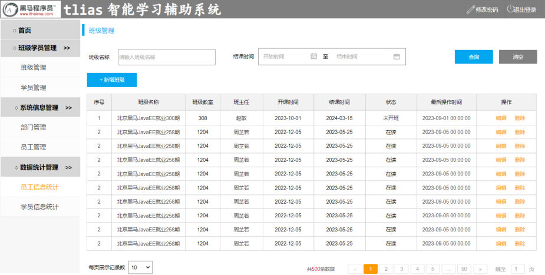
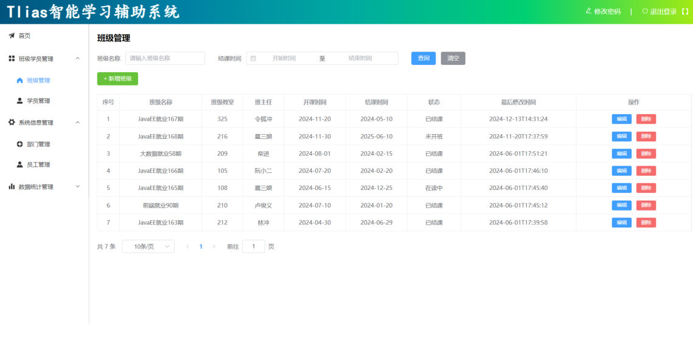

[77 篇](/posts/编程学习/javaweb学习笔记/77-员工信息统计/)把员工信息统计做完，第 10 章（员工管理）就全部收尾了。从这一篇开始是**第 11 章：后端 Web 实战（项目实战）**——前面十章的招式全在这儿合并成一次完整开发：[57 篇](/posts/编程学习/javaweb学习笔记/57-tlias项目准备与开发规范/)搭好的工程、[68 篇](/posts/编程学习/javaweb学习笔记/68-条件分页查询与动态sql/)的动态 SQL、[69 篇](/posts/编程学习/javaweb学习笔记/69-新增员工/)的新增、[74 篇](/posts/编程学习/javaweb学习笔记/74-删除员工/)和 [75 篇](/posts/编程学习/javaweb学习笔记/75-修改员工/)的增删改、[76 篇](/posts/编程学习/javaweb学习笔记/76-全局异常处理/)的全局异常处理器。

第 11 章要做三块新业务：**班级管理 → 学员管理 → 数据统计**。本篇负责第一块——**班级管理**（六个接口），另外两块分别落在 [79 篇](/posts/编程学习/javaweb学习笔记/79-项目实战-学员管理/)和 [80 篇](/posts/编程学习/javaweb学习笔记/80-项目实战-数据统计/)。

## 这一章是实战章（PPT 第 1、5、6 页）

第 11 章的 PPT 一共只有 7 页，其中**没有一页在讲技术**：

| PPT 页 | 内容 |
| --- | --- |
| 第 1 页 | 封面（Web后端开发 · **项目实战**） |
| 第 2 页 | 需求——三张页面截图（班级管理 / 学员管理 / 数据统计） |
| 第 3 页 | 需求——把三块需求写成文字清单 |
| 第 4 页 | 最终效果——三块功能做完之后的页面截图 |
| 第 5 页 | **暂停视频，完成所有实战需求**；全部完成后，再继续往下学习~ |
| 第 6 页 | 实战说明（小组实战的规则与要求） |
| 第 7 页 | 空白页 |

所以这一章是**自己动手的一章**：课件的分工是"给需求 + 给最终效果"，代码要你自己照着接口文档写。第 5 页那句"暂停视频，完成所有实战需求"就是这一章的进度条——没有新知识点要背，只有活儿要干。

第 6 页的实战说明提了几条要求，动手前值得读一遍：

- 以**小组为单位**进行实战，**每一个人都需要完成**实战需求；
- 出现问题，**务必自己先思考**，然后组内讨论交流解决；
- 每个组**选一名组员上来演示**所完成的系统功能；
- 演示时介绍自己在实现这个功能过程中的**实现思路和方案**；
- 讲一讲自己遇到的**典型的 Bug**、产生 Bug 的**原因**、以及**解决方案**。

最后两条正是这一章真正的收获：代码跑通只是及格，能把自己的思路和踩过的坑讲清楚，才算把前十个模块学透了。

> [!NOTE]
> 因为这一章的 PPT 没有技术讲解，本篇的写法是"**需求 + 接口约定 + 实现思路 + 参考实现的关键代码 + 本机实测**"，供你对照自己写的代码。所有的技术点（三层分工、动态 SQL、统一响应、异常处理）都在前面的笔记里讲过，本篇只点出**班级管理**这块特有的地方。

## 本章总需求清单（PPT 第 2、3 页）

第 2 页放了三张页面截图，第 3 页把截图对应的需求写成文字，一句话一块：

| 模块 | 需求 | 落在哪一篇 |
| --- | --- | --- |
| **班级管理** | 班级列表查询、删除班级、添加班级、修改班级 | **本篇（78）** |
| **学员管理** | 学员列表查询、删除学员、添加学员、修改学员、**违纪处理** | [79 篇](/posts/编程学习/javaweb学习笔记/79-项目实战-学员管理/) |
| **数据统计** | 班级人数统计、学员学历统计 | [80 篇](/posts/编程学习/javaweb学习笔记/80-项目实战-数据统计/) |

第 3 页还有一句加重的话，是这一章唯一的"规矩"：

> 注意：所有的功能全部严格，根据接口文档进行开发，并进行前后端联调。

**"严格按接口文档开发"**——接口文档（`资料\02. 接口文档`，`api接口文档.md` / Apifox）已经定好了每个接口的请求路径、请求方式、请求参数、响应数据。前端就是按这份文档调的，后端要是自己改了路径名、改了字段名，联调就当场崩。所以实战时先把对应那一节文档读一遍，再动手写代码。

第 2 页里班级管理那张截图是这样的：


*图：PPT 第 2 页配的班级管理页面（需求原型）——左上角是查询区（班级名称输入框、结课时间范围、查询 / 清空），下面是「+ 新增班级」按钮，主体表格有九列（序号、班级名称、班级教室、班主任、开课时间、结课时间、状态、最后操作时间、操作），每行最右侧有「编辑」「删除」两个按钮，底部是分页条。这个页面上的每一个按钮、每一列，都要靠后面那六个接口来喂数据*

## 本篇要做的六个接口（接口文档第 3 节）

接口文档的"3. 班级管理"一节把班级管理拆成六条接口，一条一个功能：

| 功能 | 文档小节 | 请求方式 | 请求路径 | 参数格式 |
| --- | --- | --- | --- | --- |
| 班级列表查询（条件分页） | 3.1 | `GET` | `/clazzs` | queryString（查询参数） |
| 删除班级 | 3.2 | `DELETE` | `/clazzs/{id}` | 路径参数 |
| 添加班级 | 3.3 | `POST` | `/clazzs` | application/json（请求体） |
| 根据 ID 查询（回显） | 3.4 | `GET` | `/clazzs/{id}` | 路径参数 |
| 修改班级 | 3.5 | `PUT` | `/clazzs` | application/json（请求体） |
| 查询所有班级 | 3.6 | `GET` | `/clazzs/list` | 无 |

六条接口全部挂在 **`/clazzs`** 下（类名写 `Clazz` 而不是 `Class`，因为 `Class` 是 Java 的关键字；路径末尾那个 `s` 是复数写法，和 `/emps`、`/depts` 一个道理）。**同一个路径 `/clazzs` 出现了三次**（GET 分页、POST、PUT），**同一个 `/clazzs/{id}` 出现了两次**（GET 详情、DELETE）——区分靠的是**请求方式**，这一点和员工管理的 `/emps` 完全一样（[58 篇](/posts/编程学习/javaweb学习笔记/58-部门管理-查询部门/)起就是这个套路）。

第 4 页给的最终效果截图里，就是这个页面做完之后的样子：


*图：PPT 第 4 页配的最终效果——查询区、新增按钮、表格九列、分页条都活了起来：表格里「班级名称」来自 `clazz` 表、「班主任」是关联员工表查出来的姓名、「状态」是按开课/结课时间和当前时间比出来的，最右侧的「编辑」「删除」分别对应详情 + 修改、删除两条接口*

## 六个接口的三层分工（一张总览）

六个接口各走一遍"Controller → Service → Mapper"，先把这张地图记住，后面逐个看：

| 接口 | Controller | Service | Mapper |
| --- | --- | --- | --- |
| 条件分页查询 | `page(name, begin, end, page, pageSize)` | **PageHelper 分页** + 组装 `PageResult` | `list(name, begin, end)`（XML 动态 SQL） |
| 新增班级 | `save(@RequestBody Clazz)` | 补 `createTime` / `updateTime` | `insert(clazz)`（注解 SQL） |
| 查询详情 | `getInfo(@PathVariable id)` | 直接转调 | `getInfo(id)`（注解 SQL） |
| 修改班级 | `update(@RequestBody Clazz)` | 补 `updateTime` | `update(clazz)`（XML 动态 SQL） |
| 删除班级 | `delete(@PathVariable id)` | **先查学员数，有就不让删** | `countByClazzId(id)` + `deleteById(id)` |
| 查询全部 | `findAll()` | 直接转调 | `findAll()`（注解 SQL） |

只有两处 SQL 复杂到注解写不下、需要写进 XML（`ClazzMapper.xml`）：**条件分页查询**和**修改**——都是动态 SQL。其余四条都是固定的单条 SQL，直接写在 `@Select` / `@Insert` / `@Delete` 注解里。

## 表结构与实体类

本章新增两张表（建表脚本 = 课程 `资料\03. 表结构\表结构.sql`），班级管理用到的是 `clazz` 表：

```sql
create table clazz(
    id   int unsigned primary key auto_increment comment 'ID,主键',
    name  varchar(30) not null unique  comment '班级名称',
    room  varchar(20) comment '班级教室',
    begin_date date not null comment '开课时间',
    end_date date not null comment '结课时间',
    master_id int unsigned null comment '班主任ID, 关联员工表ID',
    subject tinyint unsigned not null comment '学科, 1:java, 2:前端, 3:大数据, 4:Python, 5:Go, 6: 嵌入式',
    create_time datetime  comment '创建时间',
    update_time datetime  comment '修改时间'
) comment '班级表';
```

几个要留意的约束：

- `name` **非空且唯一**——新增一个重名的班级，数据库会直接抛 `DuplicateKeyException`，[76 篇](/posts/编程学习/javaweb学习笔记/76-全局异常处理/)那个"用户名重复"的友好提示就是处理这一类异常的；
- `subject` **非空**（1 java / 2 前端 / 3 大数据 / 4 Python / 5 Go / 6 嵌入式），前端新增表单里的"学科"下拉框传的就是这个数字；
- `master_id` **可以为 null**，它关联的是 `emp.id`（班主任是员工）——班级和员工之间是"多个班级可以同一个班主任"，所以要查班主任**姓名**就得联表；
- `begin_date` / `end_date` 都非空，页面上"状态"这一列就是拿这两个日期和当前时间比出来的；
- 创建时间 / 修改时间由后端自己填，不由前端传（[69 篇](/posts/编程学习/javaweb学习笔记/69-新增员工/)起一直是这个规矩）。

实体类 `com.itheima.pojo.Clazz` 和表字段一一对应，外加两个**表里没有的字段**：

```java
@Data
@NoArgsConstructor
@AllArgsConstructor
public class Clazz {
    private Integer id; //ID
    private String name; //班级名称
    private String room; //班级教室
    private LocalDate beginDate; //开课时间
    private LocalDate endDate; //结课时间
    private Integer masterId; //班主任
    private Integer subject; //学科
    private LocalDateTime createTime; //创建时间
    private LocalDateTime updateTime; //修改时间

    private String masterName; //班主任姓名
    private String status; //班级状态 - 未开班 , 在读 , 已结课
}
```

`masterName`（班主任姓名）和 `status`（班级状态）在 `clazz` 表里**都没有对应的列**——它们是列表查询时**算出来的**：前者靠联表 `emp` 拿姓名，后者靠 `case when` 比日期。数据库里存不住、前端又必须要显示的东西，就让 SQL 现算（[77 篇](/posts/编程学习/javaweb学习笔记/77-员工信息统计/)的"其他职位"也是这个思路）。

本篇所有示例连的都是本机的 MySQL `tlias` 库（用户名 `root`，课程示例密码是 `1234`——动手时把 `password` 换成你自己 MySQL 的密码）。

## 本机实测：本章的班级与学员数据

为了后面核对结果，先把本机 `tlias` 库里的数据摸清楚（**本机实测**）：

| 班级 id | 班级名称 | 班级下的学员数 |
| --- | --- | --- |
| 1 | JavaEE就业163期 | **6 人** |
| 4 | 前端就业90期 | **3 人** |
| 5 | JavaEE就业165期 | 0 人 |
| 6 | JavaEE就业166期 | 0 人 |
| 7 | 大数据就业58期 | 0 人 |
| 8 | JavaEE就业167期 | **2 人** |

班级一共 **6 个**，学员一共 **18 名**（按 `student.clazz_id` 分布是 `1 → 6`、`4 → 3`、`8 → 2`，另有 `clazz_id = 2` 的 **7 人**——注意这 7 个学员的班级在 `clazz` 表里**并不存在**，课程原始数据本身就是如此）。

这几个数字直接决定了下面两个现象：**删 id=1、4、8 会被拦下**（它们下面有学员），**删 id=5、6、7 能删成功**；而"班级人数统计"只统计出 6 个班级、那 7 个学员不计入（[80 篇](/posts/编程学习/javaweb学习笔记/80-项目实战-数据统计/)会细说）。

## 控制层：一个 Controller 六个方法

课程参考实现 `com.itheima.controller.ClazzController`——六个接口对应六个方法，一个不多一个不少：

```java
@RestController
@RequestMapping("/clazzs")
public class ClazzController {
    @Autowired
    private ClazzService clazzService;

    /**
     * 新增班级
     */
    @PostMapping
    public Result save(@RequestBody Clazz clazz){
        clazzService.save(clazz);
        return Result.success();
    }

    /**
     * 条件分页查询班级
     */
    @GetMapping
    public Result page(String name ,
                       @DateTimeFormat(pattern = "yyyy-MM-dd") LocalDate begin ,
                       @DateTimeFormat(pattern = "yyyy-MM-dd") LocalDate end,
                       @RequestParam(defaultValue = "1") Integer page ,
                       @RequestParam(defaultValue = "10")Integer pageSize){
        PageResult pageResult = clazzService.page(name , begin , end , page , pageSize);
        return Result.success(pageResult);
    }

    /**
     * 根据ID查询班级详情
     */
    @GetMapping("/{id}")
    public Result getInfo(@PathVariable Integer id){
        Clazz clazz = clazzService.getInfo(id);
        return Result.success(clazz);
    }

    /**
     * 更新班级信息
     */
    @PutMapping
    public Result update(@RequestBody Clazz clazz){
        clazzService.update(clazz);
        return Result.success();
    }

    /**
     * 根据ID删除班级
     */
    @DeleteMapping("/{id}")
    public Result delete(@PathVariable Integer id){
        clazzService.deleteById(id);
        return Result.success();
    }

    /**
     * 查询全部班级
     */
    @GetMapping("/list")
    public Result findAll(){
        List<Clazz> clazzList = clazzService.findAll();
        return Result.success(clazzList);
    }
}
```

照着自己写的时候，对一下这几处：

| 方法 | 方法上的注解 | 为什么 |
| --- | --- | --- |
| `save` | `@PostMapping` | 文档 3.3 是 `POST`；新增数据放请求体，所以形参加 `@RequestBody` |
| `page` | `@GetMapping` | 文档 3.1 是 `GET`；条件参数走查询参数，**形参名与文档里的参数名同名**就能自动绑定 |
| `getInfo` | `@GetMapping("/{id}")` | 文档 3.4 是路径参数，`{id}` 占位 + `@PathVariable` 取值 |
| `update` | `@PutMapping` | 文档 3.5 是 `PUT`；整个班级对象放请求体 |
| `delete` | `@DeleteMapping("/{id}")` | 文档 3.2 是路径参数 |
| `findAll` | `@GetMapping("/list")` | 文档 3.6，注意**多一段 `/list`** |

> [!NOTE]
> `getInfo` 是 `@GetMapping("/{id}")`，`findAll` 是 `@GetMapping("/list")`——两个模式都能匹配 `GET /clazzs/list`。SpringMVC 的路径匹配里**字面量路径比带变量的路径更具体**，所以 `/clazzs/list` 会稳稳地命中 `findAll` 而不会去试 `getInfo(id)`（真要去试也转不成 `Integer`）。写的时候不用刻意调整两个方法的先后顺序。

## 条件分页查询：`GET /clazzs`（文档 3.1）

这是六个接口里最长的一条，页面上"查询"按钮背后的那套全在这儿。

**接口约定**（文档 3.1.2）：

| 参数名称 | 是否必须 | 示例 | 备注 |
| --- | --- | --- | --- |
| name | 否 | 黄埔一期 | 班级名称（模糊匹配） |
| begin | 否 | 2023-01-01 | 范围匹配的**开始时间（结课时间）** |
| end | 否 | 2023-05-01 | 范围匹配的**结束时间（结课时间）** |
| page | 是 | 1 | 页码，未指定默认 1 |
| pageSize | 是 | 10 | 每页记录数，未指定默认 10 |

请求样例：`/clazzs?name=java&begin=2023-01-01&end=2023-06-30&page=1&pageSize=5`；响应是 `data` 里带 `total`（总记录数）和 `rows`（当前页数据列表）的分页对象——结构和方法和员工列表完全一样（[67 篇](/posts/编程学习/javaweb学习笔记/67-分页查询的两种实现方式/)）。

**Controller** 那两处细节：

- `page` / `pageSize` 用 `@RequestParam(defaultValue = "1")` 和 `defaultValue = "10"` 兜底——前端不传也能跑（文档里"如果未指定，默认为……"就是靠这个落实的）；
- 两个日期形参前面加了 `@DateTimeFormat(pattern = "yyyy-MM-dd")`——请求里是 `2023-01-01` 这样的字符串，SpringMVC 默认**不认识**它该怎么变成 `LocalDate`，得靠这个注解告诉它格式。前端的日期选择器传的就是 `yyyy-MM-dd`。

**Service** 用 PageHelper 一条龙（[67 篇](/posts/编程学习/javaweb学习笔记/67-分页查询的两种实现方式/)讲过原理）：

```java
@Override
public PageResult page(String name, LocalDate begin, LocalDate end, Integer page, Integer pageSize) {
    PageHelper.startPage(page, pageSize);

    List<Clazz> dataList = clazzMapper.list(name,begin,end);
    Page<Clazz> p = (Page<Clazz>) dataList;

    return new PageResult(p.getTotal(), p.getResult());
}
```

`PageHelper.startPage` 只对**紧跟着的那一次查询**生效，所以三行必须贴在一起写；查出来的 `List` 其实是个 `Page` 对象，强转之后就能拿到 `getTotal()`（总记录数）和 `getResult()`（当前页数据），最后装进 `PageResult`（`total` + `rows`）返回给前端。

**Mapper** 是一条动态 SQL（写在 `ClazzMapper.xml` 里）：

```xml
<select id="list" resultType="com.itheima.pojo.Clazz">
    select
        c.*,
        e.name masterName,
        (case when begin_date &gt; now() then '未开班' when now() &gt; end_date then '已结课' else  '在读中' end ) status
    from clazz c left join emp e on c.master_id = e.id
    <where>
        <if test="name != null and name != ''">
            c.name like concat('%',#{name},'%')
        </if>
        <if test="begin != null and end != null">
            and c.end_date between #{begin} and #{end}
        </if>
    </where>
    order by c.update_time desc
</select>
```

一行行拆开看：

- **多出来的两个字段**：`e.name masterName` 是联表取别名（`clazz c left join emp e on c.master_id = e.id`，`left join` 保证班主任为 null 的班级也查得出来，[65 篇](/posts/编程学习/javaweb学习笔记/65-多表查询/)）；`status` 是一个 `case when` 表达式：`begin_date > now()` 还没开班叫"未开班"，`now() > end_date` 已经过了结课时间叫"已结课"，否则就是"在读中"。`now()` 是 MySQL 的当前时间函数（[77 篇](/posts/编程学习/javaweb学习笔记/77-员工信息统计/)的 `case when` 是等值翻译，这里是**比较大小**）；
- **条件部分**：只有"班级名称模糊查询"和"结课时间范围"两个条件，都套在 `<if>` 里、外面包一层 `<where>`——`<where>` 会自动去掉条件开头多余的 `and`（[68 篇](/posts/编程学习/javaweb学习笔记/68-条件分页查询与动态sql/)）。所以只传 `name` 时不会拼出 `where and ...` 这种语法错误；
- **模糊匹配**用的是 `like concat('%',#{name},'%')`——`concat` 把两个 `%` 和参数拼起来，**这一点在 XML 里很重要**：写成 `'%#{name}%'` 是不生效的（`#{}` 在引号里不会被当成参数解析）；
- **`begin` / `end` 过滤的是 `end_date`（结课时间）**，不是开课时间。文档参数表里那两行备注写得很明确——页面上这两个输入框上面的标签也是"结课时间"。这一处最容易写错；
- `order by c.update_time desc`：按修改时间倒序，**最近改过的排前面**（和员工列表一致）；
- `resultType` 还是 `com.itheima.pojo.Clazz`——`masterName`、`status` 这两个别名正好对上实体类里的两个额外属性，自动就装进去了。

> [!NOTE]
> 关于 `status` 的三种取值，接口文档、实体类注释和课程实现的措辞略有出入：接口文档的响应示例里写的是"**已开班**"，`Clazz` 类的注释写的是"未开班、在读、已结课"，而这段 SQL 实际算出来的是"**在读中**"。以**课程实现**为准（`status` 就是这一串中文，前端拿到直接显示）；写的时候照着上面这段 SQL 写，别自己改成"已开班"——不然页面上显示出来的状态文案就和课程不一致了。

**本机实测**：

> [!TIP]
> **本机实测**：发一次不带任何条件的首页查询
>
> ```text
> $ GET http://localhost:8080/clazzs?page=1&pageSize=3
> {"code":1,"msg":"success","data":{"total":6,"rows":[
>   {"id":8,"name":"JavaEE就业167期","room":"325","beginDate":"2023-11-20","endDate":"2024-05-10","masterId":36,"subject":1,...},
>   {"id":7,"name":"大数据就业58期",...},
>   {"id":6,"name":"JavaEE就业166期",...}]}}
> ```
>
> `total` 是 6（库里的班级总数），`rows` 只有 3 条（`pageSize=3`），排序是 `update_time` 倒序——id=8 那个是最后被改过的，所以排最前面。
> （本机连的是 `tlias` 库、`root` 用户；`password` 换成你自己 MySQL 的密码。）

## 新增班级：`POST /clazzs`（文档 3.3）

**接口约定**：请求体是 JSON，字段有 `name`（必须）、`room`（必须）、`beginDate`（必须）、`endDate`（必须）、`masterId`（非必须）、`subject`（必须）；响应是统一响应结果。

请求样例：

```json
{
  "name": "JavaEE就业166期",
  "room": "101",
  "beginDate": "2023-06-01",
  "endDate": "2024-01-25",
  "masterId": 7,
  "subject": 1
}
```

**Controller** 用 `@RequestBody Clazz clazz` 接住整个 JSON 对象——这里的字段名（`beginDate`、`masterId`……）和实体类属性同名，Jackson 自动完成映射。

**Service** 只做一件额外的事：把两个时间戳补上（前端不传）：

```java
@Override
public void save(Clazz clazz) {
    clazz.setCreateTime(LocalDateTime.now());
    clazz.setUpdateTime(LocalDateTime.now());
    clazzMapper.insert(clazz);
}
```

**Mapper** 是注解 SQL，注意它是**按顺序写全字段**的：

```java
@Insert("insert into clazz VALUES (null,#{name},#{room},#{beginDate},#{endDate},#{masterId}, #{subject},#{createTime},#{updateTime})")
void insert(Clazz clazz);
```

第一个 `null` 是给自增主键 `id` 占位的（数据库会自动补上），后面八个值按建表顺序排：`name`、`room`、`begin_date`、`end_date`、`master_id`、`subject`、`create_time`、`update_time`。**顺序必须和表结构一致**，不然值会串列。另外 `name` 有唯一约束，新增重名班级时数据库会抛异常，由全局异常处理器兜住。

**本机实测**：

> [!TIP]
> **本机实测**：新增一个测试班级
>
> ```text
> $ POST http://localhost:8080/clazzs
>   body: {"name":"测试班级A","room":"999","beginDate":"2024-01-01","endDate":"2024-06-30","masterId":1,"subject":1}
> # 响应
> {"code":1,"msg":"success","data":null}
> ```
>
> 新增接口不返回数据，只看 `code` 是不是 1；插入成功后的 `id` 由数据库自增分配（这个测试班级拿到了 id=9，下面的删除实验就用它）。

## 查询班级详情：`GET /clazzs/{id}`（文档 3.4）

**接口约定**：路径参数 `id`（班级 ID），示例 `/clazzs/8`；响应的 `data` 是**一个班级对象**，字段就是表里的九列（`id`、`name`、`room`、`beginDate`、`endDate`、`masterId`、`subject`、`createTime`、`updateTime`）——注意**没有** `masterName` 和 `status`，那两个只在列表查询里算。

Controller 用 `@PathVariable` 把路径里的 `{id}` 取出来：

```java
/**
 * 根据ID查询班级详情
 */
@GetMapping("/{id}")
public Result getInfo(@PathVariable Integer id){
    Clazz clazz = clazzService.getInfo(id);
    return Result.success(clazz);
}
```

Mapper 是一条最简单的查询：

```java
/**
 * 根据ID查询班级详情
 */
@Select("select * from clazz where  id = #{id}")
Clazz getInfo(Integer id);
```

**这条接口是给"修改"打前站的**：点表格里的「编辑」，前端先调它把这一行班级的完整数据拿回去填进表单（回显），用户改完再调修改接口提交——和 [75 篇](/posts/编程学习/javaweb学习笔记/75-修改员工/)员工修改的"查询回显 + 修改数据"两步是一模一样的流程，只不过班级没有一对多的子数据，所以回显一条 SQL 就够了。

## 修改班级：`PUT /clazzs`（文档 3.5）—— 动态更新 `<set>`

**接口约定**：请求体是 JSON，字段 = **详情接口返回的那一组 + `id`**（`id` 必须，修改全靠它定位是哪一行）；响应是统一响应结果。

请求样例：

```json
{
  "id": 8,
  "name": "JavaEE就业166期",
  "room": "101",
  "beginDate": "2023-06-01",
  "endDate": "2024-01-25",
  "masterId": 7,
  "subject": 1
}
```

**Controller** 和新增长得几乎一样（都是 `@RequestBody Clazz`），区别只有注解——一个是 `@PostMapping`、一个是 `@PutMapping`：

```java
@PutMapping
public Result update(@RequestBody Clazz clazz){
    clazzService.update(clazz);
    return Result.success();
}
```

**Service** 补上修改时间：

```java
@Override
public void update(Clazz clazz) {
    clazz.setUpdateTime(LocalDateTime.now());
    clazzMapper.update(clazz);
}
```

**Mapper** 又是动态 SQL（`ClazzMapper.xml`）：

```xml
<!--动态更新班级信息-->
<update id="update">
    update clazz
    <set>
        <if test="name != null and name != ''">
            name = #{name},
        </if>
        <if test="room != null and room != ''">
            room = #{room},
        </if>
        <if test="beginDate != null">
            begin_date = #{beginDate},
        </if>
        <if test="endDate != null">
            end_date = #{endDate},
        </if>
        <if test="masterId != null">
            master_id = #{masterId},
        </if>
        <if test="subject != null">
            subject = #{subject},
        </if>
        <if test="updateTime != null">
            update_time = #{updateTime}
        </if>
    </set>
    where id = #{id}
</update>
```

- 每个字段都套一个 `<if>`：**传了值才更新这一列**，没传的列保持原样——这就是"动态更新"（[75 篇](/posts/编程学习/javaweb学习笔记/75-修改员工/)的 `<set>` 一节讲过它的来由：固定写死所有列不灵活、扩展性差）；
- `<set>` 标签的作用是**自动去掉最后一个多余的逗号**。所以上面每个 `#{}` 后面都放心地带着逗号——**只有最后一行 `update_time = #{updateTime}` 没写逗号**（它是唯一一个业务层每次都会填上、所以永远不会被跳过的字段，排在最后最稳妥；就算它前面所有条件都没成立，`<set>` 也能把尾部多余的逗号收拾干净）；
- 字符串字段的 `<if>` 都写成 `!= null and != ''`（空串也不认），日期和数字字段只判 `!= null`——差别在于"没填"长什么样：`room` 这种输入框，用户清空后传过来是**空串**；`masterId`、`subject` 这种下拉框，没选就是 **null**。而 `0` 是实实在在的值，不能把 0 当成"没填"，否则前端想把它改成 0 就改不动了（`subject` 的合法值本来就是 1~6，0 不是有效的学科）；
- `where id = #{id}` 在 `<set>` 外面——修改的定位条件，和动态部分无关。

**本机实测**：`GET /clazzs/1` 能把该班级的字段回显出来，`PUT /clazzs` 提交修改后返回统一成功响应 `{"code":1,"msg":"success","data":null}`。**两个接口用的是同一个 `Clazz` 实体接收数据**：详情返回的对象直接填进前端表单，改完再整个提交回来。

这里顺带解答一个常见疑问：表单上没出现的字段（比如 `createTime`）提交回来时是 `null`，会不会把库里的值清掉？——不会。更新走的是上面那段 `<if>` 动态 SQL，值为 `null` 的列直接被跳过、保持原值；业务层每次都会把 `updateTime` 刷成当前时间，所以"最后操作时间"这一列反而总是变的。

## 删除班级：`DELETE /clazzs/{id}`（文档 3.2）—— 先查学员数

这一条是班级管理里**唯一带业务规则**的接口，也是六个接口里最该记住的一个。

**接口约定**：路径参数 `id`（班级 ID），示例 `/clazzs/5`；响应是统一响应结果。

Controller 照旧：

```java
/**
 * 根据ID删除班级
 */
@DeleteMapping("/{id}")
public Result delete(@PathVariable Integer id){
    clazzService.deleteById(id);
    return Result.success();
}
```

**关键在 Service**——它不是上来就删，而是**先查这个班级下有没有学员**：

```java
@Override
public void deleteById(Integer id) {
    //1. 查询班级下是否有学员
    Integer count = studentMapper.countByClazzId(id);
    if(count > 0){
        throw new BusinessException("班级下有学员, 不能直接删除~");
    }
    //2. 如果没有, 再删除班级信息
    clazzMapper.deleteById(id);
}
```

两层的 SQL 分别是最简单的一查一删：

```java
// StudentMapper：数一数这个班级下有几个人
@Select("select count(*) from student where clazz_id = #{id}")
Integer countByClazzId(Integer id);

// ClazzMapper：确认没人了，再删班级
@Delete("delete from clazz where id = #{id}")
void deleteById(Integer id);
```

### 为什么要先查学员数

`student` 表里有 `clazz_id` 一列（"班级ID, 关联班级表ID"），每个学员都挂在一个班级下。如果直接把班级删了，这些学员的 `clazz_id` 就会指向一个**不存在的班级**——学员列表里"班级"那一列会空掉、按班级筛选会查出"幽灵班级"、班级人数统计也会对不上。

这和 [74 篇](/posts/编程学习/javaweb学习笔记/74-删除员工/)"删员工要连着他的工作经历一起删"是同一类问题（都是关联数据不能悬空），但**处理方式不同**：

| | 删员工（74 篇） | 删班级（本篇） |
| --- | --- | --- |
| 关联关系 | `emp_expr.emp_id` → `emp.id` | `student.clazz_id` → `clazz.id` |
| 关联数据是什么 | 工作经历（**附属**于员工） | 学员（**独立的业务主体**） |
| 怎么处理 | **级联删除**：一个事务里把两张表都删掉 | **拦住不删**：班级下有学员就不允许删 |
| 代码体现 | `@Transactional` + 两次删除 | 先 `countByClazzId` 判断，>0 就抛异常 |

学员是独立招进来的业务主体，不能因为班主任想删班级就把人一起删了——所以这里的选择是"**先问一句，有人就不让删**"。

### 异常怎么变成 `{"code":0,"msg":"班级下有学员, 不能直接删除~"}`

Service 里抛的 `BusinessException` 不是 JDK 自带的异常，是项目里自定义的一个类（放在 `com.itheima.exception` 包下）：

```java
public class BusinessException extends RuntimeException{
    public BusinessException(String message) {
        super(message);
    }
}
```

它**继承 `RuntimeException`**（运行时异常，方法签名上不用声明 `throws`），构造时把消息存起来。真正的关键在于全局异常处理器里专门给它加了一条处理：

```java
/**
 * 声明异常处理的方法 - BusinessException
 */
@ExceptionHandler
public Result handleBuinessException(BusinessException businessException) {
    log.error("服务器异常", businessException);
    return Result.error(businessException.getMessage());
}
```

（这段和 [76 篇](/posts/编程学习/javaweb学习笔记/76-全局异常处理/)的 `GlobalExceptionHandler` 是同一个类，`handleBuinessException` 是本章新加的方法。方法名里的 `Buiness` 是课程代码的拼写，照着写就行。）

串起来看整条链路：**Service 抛出 `BusinessException("班级下有学员, 不能直接删除~")` → SpringMVC 把异常交给 `GlobalExceptionHandler` → 匹配到 `handleBuinessException` → 返回 `Result.error(消息)`**。所以前端收到的是**统一响应格式** `{"code":0,"msg":"班级下有学员, 不能直接删除~","data":null}`，而不是 500 错误页或者一堆堆栈。

这条链路解决了实战里一个很实际的问题：**"不能删"是一个正常业务结果，不是程序出错**。用 `Exception` 抛出去的好处是——Service 里不用逐层往 Controller 返回"成功没成功的标记"（那样每个中间层都得跟着改签名），业务要中断就抛，翻译成响应格式的活交给全局那一处。前端只要看 `code` 是 0 就把 `msg` 弹出来给用户看，那句话就是写给用户看的。

> [!IMPORTANT]
> 自定义异常一定要**被全局异常处理器里更具体的方法接住**。`handleBuinessException` 的形参是 `BusinessException`，比那个兜底的 `handleException(Exception e)` 更具体，SpringMVC 会优先选它——所以 `msg` 里原样保留了你写的业务提示。要是没这条方法，`BusinessException` 就会落到兜底那条上，前端只能看到"出错啦, 请联系管理员~"，用户根本不知道自己做错了什么。

**本机实测**——删一个**有学员**的班级和删一个**没学员**的班级，结果完全不同：

> [!TIP]
> **本机实测**：
>
> ```text
> # ① 删「有学员的班级」id=1（它下面挂着 6 名学员）
> $ DELETE http://localhost:8080/clazzs/1
> {"code":0,"msg":"班级下有学员, 不能直接删除~","data":null}     ← 业务校验拦下（BusinessException）
>
> # ② 删「没有学员的班级」——刚新增的测试班级 id=9
> $ DELETE http://localhost:8080/clazzs/9
> {"code":1,"msg":"success","data":null}
> ```
>
> 说明两件事：
> - 班级 1 是真的有人（6 名学员），SQL 走的是 `select count(*) from student where clazz_id = 1` 查出 6，`throw` 之后**删除语句根本没发出去**——`clazz` 表里原来的班级一个没少；
> - 删班级**不做级联**：这条接口从头到尾只动 `clazz` 一张表，`student` 表一条不删——学员是独立主体，要删得去 [79 篇](/posts/编程学习/javaweb学习笔记/79-项目实战-学员管理/)的学员管理里删。
> （实验做完之后这个测试班级已经删掉了，库里仍然是 6 个班级、18 名学员。）

## 查询全部班级：`GET /clazzs/list`（文档 3.6）

**接口约定**：不带任何请求参数；响应的 `data` 直接就是**一个班级数组**（不是分页对象），每一项的字段和表结构一致。

Controller 加一段 `/list` 路径：

```java
/**
 * 查询全部班级
 */
@GetMapping("/list")
public Result findAll(){
    List<Clazz> clazzList = clazzService.findAll();
    return Result.success(clazzList);
}
```

Mapper 一条注解 SQL 解决：

```java
/**
 * 查询全部班级
 */
@Select("select * from clazz")
List<Clazz> findAll();
```

它不分页、不联表、不算状态，就是把 `clazz` 表整个捞出来。**这条接口不是给班级管理页面用的**，而是给别处当"数据字典"——比如学员管理页面上的"所属班级"下拉框（[79 篇](/posts/编程学习/javaweb学习笔记/79-项目实战-学员管理/)）和新增学员时选班级，都需要一份完整的班级清单。这类"给下拉框喂数据"的接口在项目里很常见，特点是**必须返回全部、不能分页**（分页了就只能选到第一页的班级）。

**本机实测**：

> [!TIP]
> **本机实测**：
>
> ```text
> $ GET http://localhost:8080/clazzs/list
> {"code":1,"msg":"success","data":[{"id":1,"name":"JavaEE就业163期",...}, ...]}
> ```
>
> `data` 是一个数组、一共 6 项（库里 6 个班级），和分页接口的 `{total, rows}` 结构**完全不同**——前端取数据的代码也不一样，看文档的时候要分清。

## 小结

| 问题 | 答案 |
| --- | --- |
| 这一章是什么性质？ | 实战章——PPT 只有需求、最终效果和实战说明，要求**严格按接口文档开发**并做前后端联调；三块需求是班级管理、学员管理、数据统计，本篇做班级管理 |
| 班级管理有哪六个接口？ | `GET /clazzs`（条件分页）、`DELETE /clazzs/{id}`、`POST /clazzs`、`GET /clazzs/{id}`、`PUT /clazzs`、`GET /clazzs/list` |
| 条件分页传什么、回什么？ | 传 `name`（模糊）、`begin` / `end`（**结课时间**范围）、`page`（默认 1）、`pageSize`（默认 10）；回 `{total, rows}`，`rows` 里每项比表结构多 `masterName` 和 `status` |
| `masterName` 与 `status` 哪来的？ | 表里没有这两列——SQL 里 `left join emp` 取班主任姓名，用 `case when` 把 `begin_date` / `end_date` 与 `now()` 比出"未开班 / 在读中 / 已结课" |
| 日期参数怎么接？ | 形参 `@DateTimeFormat(pattern = "yyyy-MM-dd") LocalDate begin`，不然 SpringMVC 不认识 `2023-01-01` 这种字符串 |
| 两处动态 SQL 分别是什么？ | 查询用 `<where>` + `<if>`（模糊匹配写 `like concat('%',#{name},'%')`）；更新用 `<set>` + `<if>` |
| 更新为什么用 `<set>`？ | 只更新传了值的字段，并自动去掉最后一个多余的逗号（所以最后一行 `update_time` 后面不写逗号） |
| 删除班级多做哪一步？ | 先 `studentMapper.countByClazzId(id)` 查班级下的学员数，`> 0` 就 `throw new BusinessException("班级下有学员, 不能直接删除~")` |
| 异常怎么变成 `code:0`？ | `BusinessException extends RuntimeException`，`GlobalExceptionHandler` 里 `handleBuinessException` 用 `Result.error(消息)` 转成统一响应 |
| `/clazzs/list` 干嘛用？ | 给"所属班级"下拉框这类地方提供**全部**班级（不分页），响应 `data` 是数组而不是分页对象 |
| 分页是谁做的？ | `PageHelper.startPage(page, pageSize)` 紧跟着 `clazzMapper.list(...)`，把返回的 `List` 强转成 `Page` 拿 `getTotal()` / `getResult()`，装进 `PageResult` |
| 本机实测的关键结果？ | `GET /clazzs?page=1&pageSize=3` → `total:6`、3 条数据；删 id=1（6 名学员）→ `{"code":0,"msg":"班级下有学员, 不能直接删除~"}`；删没学员的班级 → `{"code":1,"msg":"success"}` |

## 相关

- [上一篇：员工信息统计](/posts/编程学习/javaweb学习笔记/77-员工信息统计/)
- [下一篇：项目实战-学员管理](/posts/编程学习/javaweb学习笔记/79-项目实战-学员管理/)

## 练习题

### 一、知识回顾（读完直接做下面的实践题）

1. **第 11 章的性质**：实战章——PPT 只有 7 页（封面、需求两页、最终效果、暂停实战、实战说明、空白页），没有技术讲解；三块需求是**班级管理 / 学员管理 / 数据统计**，本篇做班级管理（另外两块在 79、80 篇）
2. **本章唯一的规矩（PPT 第 3 页原话）**："所有的功能全部严格，根据**接口文档**进行开发，并进行**前后端联调**"——路径、请求方式、参数名、响应字段都以接口文档为准，不能自己改
3. **班级管理的六个接口**：`GET /clazzs`（条件分页）、`DELETE /clazzs/{id}`（删除）、`POST /clazzs`（新增）、`GET /clazzs/{id}`（详情回显）、`PUT /clazzs`（修改）、`GET /clazzs/list`（全部班级）；全部挂 `/clazzs`，靠**请求方式**区分同路径的三个
4. **`clazz` 表的关键约束**：`name` 非空且**唯一**、`subject` 非空（1 java / 2 前端 / 3 大数据 / 4 Python / 5 Go / 6 嵌入式）、`master_id` 可为 null（关联 `emp.id`）、`begin_date` / `end_date` 非空
5. **实体类里多出来的两个字段**：`masterName`（班主任姓名）和 `status`（班级状态）——表里没有这两列，是列表查询时 `left join emp` 取别名、`case when` 比 `now()` 与开课/结课时间**算出来**的
6. **条件分页的参数与响应**：传 `name`（模糊）、`begin` / `end`（**结课时间**范围）、`page`（默认 1）、`pageSize`（默认 10）；回 `data: {total, rows}`
7. **日期参数的写法**：`@DateTimeFormat(pattern = "yyyy-MM-dd") LocalDate begin`——不加这个注解，SpringMVC 没法把 `2023-01-01` 这样的请求参数转成 `LocalDate`
8. **两处动态 SQL**：查询用 `<where>`（自动去掉多余的 `and`）+ `<if>`，模糊匹配写 `like concat('%',#{name},'%')`（不能写成 `'%#{name}%'`），时间条件用 `c.end_date between #{begin} and #{end}`；更新用 `<set>`（自动去掉最后一个逗号）+ `<if>`，逐字段动态更新
9. **分页怎么写**：Service 里 `PageHelper.startPage(page, pageSize);` 紧跟着 `clazzMapper.list(...)`，把返回的 `List` 强转成 `Page`，用 `getTotal()` / `getResult()` 组装 `new PageResult(total, rows)`
10. **删除班级的业务校验**：Service 里先 `studentMapper.countByClazzId(id)`，`count > 0` 就 `throw new BusinessException("班级下有学员, 不能直接删除~")`；`BusinessException extends RuntimeException`，由 `GlobalExceptionHandler` 的 `handleBuinessException` 用 `Result.error(消息)` 转成统一响应——**本机实测**删 id=1（6 名学员）返回 `{"code":0,"msg":"班级下有学员, 不能直接删除~","data":null}`，删没有学员的班级返回 `{"code":1,"msg":"success","data":null}`

### 二、裸写题

- [ ] **2-1 新增班级（三层都要写）**
  需求：班级管理页面上点「+ 新增班级」，弹窗里填班级名称、班级教室、开课时间、结课时间、班主任、学科，点确定后把这些数据以 JSON 请求体发到 `/clazzs`，用 `POST` 方式提交。要求三层都实现：控制层接住这个班级对象、调用业务层；业务层把创建时间和修改时间补成当前时间，再交给数据访问层；数据访问层往 `clazz` 表插一条记录（主键自增，两个时间列由业务层给）。
  （练习文件 `test_78_班级管理.java` 的题目2-1 里给了写作区。）

  > [!TIP]- 提示（先自己想，实在想不出再点开）
  > **一级 · 思路**：请求体里是一个完整的班级对象（含提交上来的字段）——控制层用一个能装下它的形参接住，并声明数据来自请求体；业务层补两个时间戳（用"当前时间"）；数据访问层按 `clazz` 表的列顺序把九个值写进去，主键位置给空
  > **二级 · 方法**：`@PostMapping`（类上已有 `/clazzs`）；形参 `@RequestBody Clazz clazz`；`LocalDateTime.now()` 赋给 `createTime` / `updateTime`；SQL 用 `@Insert`，写法是 `insert into clazz VALUES (null,#{...},...)`
  > **三级 · 骨架**：
  > ```java
  > @PostMapping
  > public Result save(@____ Clazz clazz){
  >     clazzService.____(clazz);
  >     return Result.____();
  > }
  >
  > @Override
  > public void save(Clazz clazz) {
  >     clazz.setCreateTime(LocalDateTime.____());
  >     clazz.setUpdateTime(____.now());
  >     clazzMapper.____(clazz);
  > }
  >
  > @Insert("insert into clazz VALUES (____,#{name},#{room},#{beginDate},#{endDate},#{masterId}, #{subject},#{createTime},#{updateTime})")
  > void ____(Clazz clazz);
  > ```

  > [!TIP]- 参考答案（做完再点开）
  > ```java
  > // ===== Controller（com.itheima.controller.ClazzController）=====
  > @PostMapping
  > public Result save(@RequestBody Clazz clazz){
  >     clazzService.save(clazz);
  >     return Result.success();
  > }
  >
  > // ===== Service 接口 + 实现（注意方法名 save，实现里只多补两个时间）=====
  > void save(Clazz clazz);
  >
  > @Override
  > public void save(Clazz clazz) {
  >     clazz.setCreateTime(LocalDateTime.now());
  >     clazz.setUpdateTime(LocalDateTime.now());
  >     clazzMapper.insert(clazz);
  > }
  >
  > // ===== Mapper（com.itheima.mapper.ClazzMapper）=====
  > @Insert("insert into clazz VALUES (null,#{name},#{room},#{beginDate},#{endDate},#{masterId}, #{subject},#{createTime},#{updateTime})")
  > void insert(Clazz clazz);
  > ```
  > 说明：
  > - `@RequestBody` 让 SpringMVC 把 JSON 请求体反序列化成 `Clazz` 对象，字段名（`beginDate`、`masterId`……）和实体属性同名就自动对应；
  > - 第一个 `null` 是自增主键 `id` 的占位，数据库会自动分配；后面八个值的顺序必须和 `clazz` 建表顺序一致（`name`、`room`、`begin_date`、`end_date`、`master_id`、`subject`、`create_time`、`update_time`）；
  > - `create_time` / `update_time` **不由前端传**，业务层填 `LocalDateTime.now()`（前端传了也没用，插进去的是这两个值）；
  > - 新增接口不返回数据，`Result.success()` 就行。本机实测这次调用的响应是 `{"code":1,"msg":"success","data":null}`。

- [ ] **2-2 班级列表的条件分页查询（三层的重头戏）**
  需求：班级管理页面顶部的查询区有"班级名称"和"结课时间（开始 至 结束）"两个条件，底部有页码和每页条数。要求实现 `GET /clazzs` 这条接口：按班级名称做**模糊**匹配、按**结课时间**做范围过滤，两个条件都可以不传；分页返回总记录数和当前页数据。另外，表格里还要显示"班主任姓名"和"班级状态"（未开班 / 在读中 / 已结课）两列，`clazz` 表里都没有，需要查询时算出来（班主任姓名要联员工表，状态拿开课、结课时间和当前时间比）。
  （练习文件 `test_78_班级管理.java` 的题目2-2 里给了写作区；对应的 XML 写在 `test_78_班级条件查询与更新.xml` 的题目2-2 里。）

  > [!TIP]- 提示（先自己想，实在想不出再点开）
  > **一级 · 思路**：控制层接收五个参数（两个条件 + 页码 + 每页条数），日期字符串要告诉框架按什么格式解析；业务层先用分页插件开启分页、再查询、最后组装分页结果；数据访问层是一条带条件的多表查询——条件是"可选"的，所以要用动态 SQL 标签把没传的条件整段去掉
  > **二级 · 方法**：`@GetMapping`；`@DateTimeFormat(pattern = "yyyy-MM-dd") LocalDate begin`；`@RequestParam(defaultValue = "1") Integer page`；`PageHelper.startPage(page, pageSize)` + `(Page<Clazz>) dataList` + `new PageResult(total, rows)`；XML 里 `select c.*, e.name masterName, (case when ... end) status from clazz c left join emp e on c.master_id = e.id` 外面套 `<where>`，里面两个 `<if>`，模糊匹配用 `like concat('%',#{name},'%')`，时间条件用 `c.end_date between #{begin} and #{end}`
  > **三级 · 骨架**：
  > ```java
  > @GetMapping
  > public Result page(String name,
  >                    @____________(pattern = "yyyy-MM-dd") LocalDate begin,
  >                    @DateTimeFormat(pattern = "____") LocalDate end,
  >                    @RequestParam(__________ = "1") Integer page,
  >                    @RequestParam(defaultValue = "10") Integer pageSize){
  >     PageResult pageResult = clazzService.____(name, begin, end, page, pageSize);
  >     return Result.success(__________);
  > }
  >
  > @Override
  > public PageResult page(String name, LocalDate begin, LocalDate end, Integer page, Integer pageSize) {
  >     PageHelper.________(page, pageSize);
  >     List<Clazz> dataList = clazzMapper.____(name, begin, end);
  >     Page<Clazz> p = (____<Clazz>) dataList;
  >     return new PageResult(p.________(), p.________());
  > }
  > ```
  > ```xml
  > <select id="____" resultType="com.itheima.pojo.Clazz">
  >     select c.*, e.name ____,
  >         (case when begin_date &gt; now() then '未开班' when now() &gt; end_date then '已结课' else '在读中' end ) ____
  >     from clazz c ____ join emp e on c.master_id = e.id
  >     <____>
  >         <if test="name != null and name != ''">
  >             c.name like ____('%',#{name},'%')
  >         </if>
  >         <if test="begin != null and end != null">
  >             and c.____ between #{begin} and #{end}
  >         </if>
  >     </____>
  >     order by c.update_time desc
  > </select>
  > ```

  > [!TIP]- 参考答案（做完再点开）
  > ```java
  > // ===== Controller =====
  > @GetMapping
  > public Result page(String name ,
  >                    @DateTimeFormat(pattern = "yyyy-MM-dd") LocalDate begin ,
  >                    @DateTimeFormat(pattern = "yyyy-MM-dd") LocalDate end,
  >                    @RequestParam(defaultValue = "1") Integer page ,
  >                    @RequestParam(defaultValue = "10")Integer pageSize){
  >     PageResult pageResult = clazzService.page(name , begin , end , page , pageSize);
  >     return Result.success(pageResult);
  > }
  >
  > // ===== Service 实现 =====
  > @Override
  > public PageResult page(String name, LocalDate begin, LocalDate end, Integer page, Integer pageSize) {
  >     PageHelper.startPage(page, pageSize);
  >
  >     List<Clazz> dataList = clazzMapper.list(name,begin,end);
  >     Page<Clazz> p = (Page<Clazz>) dataList;
  >
  >     return new PageResult(p.getTotal(), p.getResult());
  > }
  >
  > // ===== Mapper 接口 =====
  > List<Clazz> list(String name, LocalDate begin, LocalDate end);
  > ```
  > ```xml
  > <select id="list" resultType="com.itheima.pojo.Clazz">
  >     select
  >         c.*,
  >         e.name masterName,
  >         (case when begin_date &gt; now() then '未开班' when now() &gt; end_date then '已结课' else  '在读中' end ) status
  >     from clazz c left join emp e on c.master_id = e.id
  >     <where>
  >         <if test="name != null and name != ''">
  >             c.name like concat('%',#{name},'%')
  >         </if>
  >         <if test="begin != null and end != null">
  >             and c.end_date between #{begin} and #{end}
  >         </if>
  >     </where>
  >     order by c.update_time desc
  > </select>
  > ```
  > 说明：
  > - **`<where>` 会去掉条件开头多余的 `and`**：只传 `name` 时不会拼出 `where and ...`；两个条件都没传时连 `where` 关键字都不出现（[68 篇](/posts/编程学习/javaweb学习笔记/68-条件分页查询与动态sql/)）；
  > - **模糊匹配必须用 `concat`**：写成 `'%#{name}%'` 是不生效的，因为 `#{}` 落在引号里就不会被当成参数解析了；
  > - **过滤的是 `end_date`（结课时间）**，别看页面上两个输入框挨着"班级名称"就顺手写成 `begin_date`——接口文档的参数备注写的是"范围匹配的开始/结束时间（结课时间）"；
  > - **`masterName` / `status` 靠别名对上实体类的属性**：`resultType` 仍是 `Clazz`，SQL 里 `e.name masterName` 和 `case when ... end status` 的别名正好给了那两个"表里没有的字段"；`left join` 保证班主任为 null 的班级也查得出来；
  > - `status` 用的是 `case when` **比较大小**（`now()` 与日期比），不是等值匹配——`begin_date` 还没到就是"未开班"，`end_date` 已经过了就是"已结课"，中间是"在读中"（接口文档的响应示例里写的是"已开班"，课程实现返回的是"在读中"，以课程为准）；
  > - **PageHelper 只对紧跟的那次查询生效**，`startPage` 和 `clazzMapper.list(...)` 中间不要插别的查询；`(Page<Clazz>) dataList` 强转后才有 `getTotal()`（总记录数），`getResult()` 才是当前页数据；
  > - **本机实测**：`GET /clazzs?page=1&pageSize=3` → `{"code":1,"msg":"success","data":{"total":6,"rows":[3 条]}}`。

- [ ] **2-3 点「编辑」先回显，改完提交只改传了值的字段**
  需求：表格每一行最右侧有「编辑」「删除」两个按钮。点「编辑」时，前端要把这个班级**当前完整的字段**填进弹窗表单（含学科、班主任这些不在表格里显示的内容），用户改完（可能只改班级教室，也可能全都改）提交保存。要求：给出回显用的那条查询接口（三层），以及修改接口的三层实现；修改时只更新**用户确实传了值的字段**，不想让"没传的字段被清空"。
  （练习文件 `test_78_班级管理.java` 的题目2-3 里给了写作区；对应的 XML 写在 `test_78_班级条件查询与更新.xml` 的题目2-3 里。）

  > [!TIP]- 提示（先自己想，实在想不出再点开）
  > **一级 · 思路**：回显是"按 id 查一条"，路径里带 id、方法上用能接收路径变量的注解把 id 取出来；修改是一个整体对象提交回来，靠对象里的 id 定位；要让更新"传什么改什么"，SQL 不能把所有列写死，得用一个能逐字段判断、并自动处理标点的小标签
  > **二级 · 方法**：`@GetMapping("/{id}")` + `@PathVariable Integer id` + `@Select("select * from clazz where id = #{id}")`；`@PutMapping` + `@RequestBody Clazz`；业务层 `clazz.setUpdateTime(LocalDateTime.now())`；XML 里 `update clazz` 后面跟 `<set>`，里面每个字段一个 `<if test="xxx != null">列名 = #{xxx},</if>`（字符串字段再判空串），最后的 `where id = #{id}` 写在 `<set>` 外面
  > **三级 · 骨架**：
  > ```java
  > @GetMapping("/____")
  > public Result getInfo(@________ Integer id){
  >     Clazz clazz = clazzService.____(id);
  >     return Result.success(____);
  > }
  >
  > @PutMapping
  > public Result update(@________ Clazz clazz){
  >     clazzService.____(clazz);
  >     return Result.success();
  > }
  >
  > @Override
  > public void update(Clazz clazz) {
  >     clazz.setUpdateTime(LocalDateTime.____());
  >     clazzMapper.____(clazz);
  > }
  > ```
  > ```xml
  > <update id="____">
  >     update clazz
  >     <____>
  >         <if test="name != null and name != ''">
  >             name = #{name}____
  >         </if>
  >         <if test="room != null and room != ''">
  >             room = #{room},
  >         </if>
  >         <if test="updateTime != null">
  >             update_time = #{updateTime}
  >         </if>
  >     </____>
  >     where id = #{id}
  > </update>
  > ```

  > [!TIP]- 参考答案（做完再点开）
  > ```java
  > // ===== Controller：详情回显 + 修改 =====
  > @GetMapping("/{id}")
  > public Result getInfo(@PathVariable Integer id){
  >     Clazz clazz = clazzService.getInfo(id);
  >     return Result.success(clazz);
  > }
  >
  > @PutMapping
  > public Result update(@RequestBody Clazz clazz){
  >     clazzService.update(clazz);
  >     return Result.success();
  > }
  >
  > // ===== Service 实现 =====
  > @Override
  > public Clazz getInfo(Integer id) {
  >     return clazzMapper.getInfo(id);
  > }
  >
  > @Override
  > public void update(Clazz clazz) {
  >     clazz.setUpdateTime(LocalDateTime.now());
  >     clazzMapper.update(clazz);
  > }
  >
  > // ===== Mapper 接口 =====
  > @Select("select * from clazz where  id = #{id}")
  > Clazz getInfo(Integer id);
  >
  > void update(Clazz clazz);   // 动态 SQL 写在 XML 里
  > ```
  > ```xml
  > <update id="update">
  >     update clazz
  >     <set>
  >         <if test="name != null and name != ''">
  >             name = #{name},
  >         </if>
  >         <if test="room != null and room != ''">
  >             room = #{room},
  >         </if>
  >         <if test="beginDate != null">
  >             begin_date = #{beginDate},
  >         </if>
  >         <if test="endDate != null">
  >             end_date = #{endDate},
  >         </if>
  >         <if test="masterId != null">
  >             master_id = #{masterId},
  >         </if>
  >         <if test="subject != null">
  >             subject = #{subject},
  >         </if>
  >         <if test="updateTime != null">
  >             update_time = #{updateTime}
  >         </if>
  >     </set>
  >     where id = #{id}
  > </update>
  > ```
  > 说明：
  > - **回显和修改是两个接口**：回显是 `GET /clazzs/{id}`（路径参数，一个 id 换一个完整对象），修改是 `PUT /clazzs`（整个对象放请求体）。前端"先查后改"的流程和 [75 篇](/posts/编程学习/javaweb学习笔记/75-修改员工/)员工修改一样；
  > - **两个接口共用同一个 `Clazz` 实体**：详情返回的对象直接填进表单，用户改完原样提交回来——连 `id`、`createTime` 都带着，所以修改接口拿到的是"完整对象"，能用 `where id = #{id}` 定位；
  > - **`<set>` 的作用是去掉最后一个多余的逗号**：每个 `#{}` 后面都放心写逗号，只有最后一行 `update_time = #{updateTime}` 没写——它是唯一永远不会被跳过的字段（业务层一定会填），放最后最稳妥；
  > - **`<if>` 的判空要分开写**：字符串字段用 `!= null and != ''`（传空串视为没填），日期、数字字段只用 `!= null`（`masterId = 0` 也算传了值）；
  > - 系统自己维护的 `createTime` **不在更新列表里**——创建时间一经写入就不再改（只有 `update_time` 每次更新都刷新）。

- [ ] **2-4 删除班级：有学员就不让删（业务校验 + 统一响应）**
  需求：表格每行有「删除」按钮，点它调删除接口。但业务上有个规则——**班级下面还有学员时不允许删除**，要给用户一句看得懂的话；班级下面是空的则正常删除。要求写出删除接口的三层实现（注意班级 id 是拼在路径里的），并说明那句提示是怎么变成前端收到的 JSON 的（前端最终收到的是 `{"code":0,"msg":"班级下有学员, 不能直接删除~","data":null}`）。
  （练习文件 `test_78_班级管理.java` 的题目2-4 里给了写作区。）

  > [!TIP]- 提示（先自己想，实在想不出再点开）
  > **一级 · 思路**：控制层从路径里取 id；业务层先"数一数这个班级有几个学员"（查学员表），有就中断并抛一个自定义异常、没有才执行删除；抛出去的异常要被全局异常处理器里一条**形参是这个自定义异常类型**的方法接住，转成统一响应
  > **二级 · 方法**：`@DeleteMapping("/{id}")` + `@PathVariable Integer id`；`studentMapper.countByClazzId(id)`（SQL 是 `select count(*) from student where clazz_id = #{id}`）；`throw new BusinessException("班级下有学员, 不能直接删除~")`；自定义异常类 `extends RuntimeException`；处理器里 `@ExceptionHandler` + `Result.error(businessException.getMessage())`
  > **三级 · 骨架**：
  > ```java
  > @DeleteMapping("/____")
  > public Result delete(@________ Integer id){
  >     clazzService.____(id);
  >     return Result.success();
  > }
  >
  > @Override
  > public void deleteById(Integer id) {
  >     //1. 查询班级下是否有学员
  >     Integer count = studentMapper.________(id);
  >     if(count > 0){
  >         throw new __________("班级下有学员, 不能直接删除~");
  >     }
  >     //2. 如果没有, 再删除班级信息
  >     clazzMapper.________(id);
  > }
  >
  > public class BusinessException extends ________ {
  >     public BusinessException(String message) { super(message); }
  > }
  >
  > @ExceptionHandler
  > public Result handleBuinessException(__________ e) {
  >     log.error("服务器异常", e);
  >     return Result.____(e.getMessage());
  > }
  > ```

  > [!TIP]- 参考答案（做完再点开）
  > ```java
  > // ===== Controller =====
  > @DeleteMapping("/{id}")
  > public Result delete(@PathVariable Integer id){
  >     clazzService.deleteById(id);
  >     return Result.success();
  > }
  >
  > // ===== Service 实现（业务校验就在这两步里）=====
  > @Override
  > public void deleteById(Integer id) {
  >     //1. 查询班级下是否有学员
  >     Integer count = studentMapper.countByClazzId(id);
  >     if(count > 0){
  >         throw new BusinessException("班级下有学员, 不能直接删除~");
  >     }
  >     //2. 如果没有, 再删除班级信息
  >     clazzMapper.deleteById(id);
  > }
  >
  > // ===== Mapper 接口 =====
  > // StudentMapper
  > @Select("select count(*) from student where clazz_id = #{id}")
  > Integer countByClazzId(Integer id);
  >
  > // ClazzMapper
  > @Delete("delete from clazz where id = #{id}")
  > void deleteById(Integer id);
  >
  > // ===== 自定义异常 =====
  > public class BusinessException extends RuntimeException{
  >     public BusinessException(String message) {
  >         super(message);
  >     }
  > }
  >
  > // ===== 全局异常处理器里新增的一条 =====
  > @ExceptionHandler
  > public Result handleBuinessException(BusinessException businessException) {
  >     log.error("服务器异常", businessException);
  >     return Result.error(businessException.getMessage());
  > }
  > ```
  > 说明：
  > - **id 走的是路径参数**：`@DeleteMapping("/{id}")` 里的 `{id}` 是占位符，`@PathVariable` 把它取出来赋给形参——和员工批量删除的 `?ids=1,2,3`（查询参数）不是一回事（[74 篇](/posts/编程学习/javaweb学习笔记/74-删除员工/)）；
  > - **"先查后删"的顺序不能颠倒**：`countByClazzId` 查出 6 就 `throw`，**删除语句压根不会发出去**，班级还在库里——所以这个校验是"拦住"，不是"删了再恢复"；
  > - **为什么不做级联删除**：学员是独立的业务主体（[74 篇](/posts/编程学习/javaweb学习笔记/74-删除员工/)里工作经历是员工的附属物，所以能一起删）；删班级只能删 `clazz` 一张表，学员要删去学员管理；
  > - **异常变成 JSON 的链路**：`throw new BusinessException("班级下有学员, 不能直接删除~")` → SpringMVC 找 `@RestControllerAdvice` 里的 `@ExceptionHandler` → 形参是 `BusinessException` 的 `handleBuinessException` 比兜底的 `handleException(Exception e)` 更具体、优先匹配 → `Result.error(消息)` 变成 `{"code":0,"msg":"班级下有学员, 不能直接删除~","data":null}`（[76 篇](/posts/编程学习/javaweb学习笔记/76-全局异常处理/)）；
  > - **自定义异常继承 `RuntimeException`** 才能在 Service 里随便抛（不用在方法签名上声明 `throws`）；如果忘了给处理器加 `handleBuinessException`，它就落到兜底那条上，前端只会看到"出错啦, 请联系管理员~"；
  > - **本机实测**：删 id=1（下面 6 名学员）→ `{"code":0,"msg":"班级下有学员, 不能直接删除~","data":null}`；删一个没有学员的班级 → `{"code":1,"msg":"success","data":null}`。

### 三、综合题

- [ ] **3-1 照着接口文档把班级管理六个接口全做出来并自测**
  这一题把本篇从头到尾走一遍，每一步都用**响应 JSON** 和**数据库查询**留下证据。
  1. 确认库表：`clazz` 表 6 条数据、`student` 表 18 条（建表脚本在课程 `资料\03. 表结构\表结构.sql`）；先把"哪个班级下面有几个学员"查出来记在纸上（`select clazz_id, count(*) from student group by clazz_id;`）；
  2. 照着接口文档"3. 班级管理"把六个接口的三层补齐：实体 `Clazz`、`ClazzMapper`（XML 里写条件分页查询和动态更新）、`ClazzService` / `ClazzServiceImpl`（分页、补时间、**删除前查学员数**）、`ClazzController`（六个方法）；
  3. 启动工程，先测**条件分页查询**：`GET /clazzs?page=1&pageSize=3`，把响应的 `total` 和 `rows` 的条数抄下来；再单独传 `name`（用班级名里的一两个关键字试**模糊匹配**）、单独传 `begin` / `end`（结课时间范围），各抄一次 `total`；
  4. 测**全部班级**：`GET /clazzs/list`，抄下 `data` 数组的条数——和上一步的 `total` 是同一个数吗？两条接口响应的结构一样吗？
  5. 测**新增**：`POST /clazzs` 新增一个班级（名称里带"测试"好认），响应是什么？再用全部班级接口确认它在清单里、用数据库查出它分到的 `id`；
  6. 测**详情 + 修改**：`GET /clazzs/{刚才的id}` 抄下响应里的字段（有没有 `masterName` / `status`？）；再 `PUT /clazzs` 把它改掉（比如只改 `room`），重新查详情确认改成功、`update_time` 变没变；
  7. 测**删除**：先删一个有学员的班级（比如 id=1），把响应整个抄下来；再删第 5 步新增的那个测试班级，抄下响应；最后查一次库：`select count(*) from clazz;`——班级数变了吗？
  8. 对照服务端日志，回答下面两个问题。
  （练习文件 `test_78_班级管理.java` 的"综合题"一段里按这 8 步给了写作区。）

  回答：① 第 7 步里删"有学员的班级"时前端拿到的是 `{"code":0,...}` 而不是 500 报错页，这是谁的功劳？中间经过了哪几个环节？② 第 3 步里的 `begin` / `end` 过滤的是哪个日期字段？为什么不能想当然地换成开课时间？

  **涉及知识点**

  | 知识点 | 在这里的应用 |
  | --- | --- |
  | 实战章的要求（PPT 3） | 第 2 步——六个接口的路径、请求方式、参数名全部照接口文档写 |
  | `clazz` 表与实体 | 第 1、5、6 步——`name` 唯一、`subject` 非空、`master_id` 关联 `emp.id`；实体多出 `masterName` / `status` |
  | 条件分页 + 动态 SQL（`<where>`/`<if>`） | 第 3 步——模糊匹配 `concat`、结课时间范围、`<where>` 去掉多余的 `and` |
  | PageHelper 分页 | 第 3 步——`startPage` 紧跟查询，`Page` 强转拿 `total` |
  | 详情回显 + 动态更新（`<set>`） | 第 6 步——`@PathVariable` 取 id，`<set>` 自动去逗号、传什么改什么 |
  | 删除的业务校验 + 统一响应 | 第 7、8 步——先查学员数，`throw new BusinessException(...)`，全局异常处理器转成 `{"code":0,"msg":...}` |
  | 全局异常处理器 | 第 8 步①——`@RestControllerAdvice` + `@ExceptionHandler` 比兜底方法更具体 |

  > [!TIP]- 提示（先自己想，实在想不出再点开）
  > **一级 · 思路**：先把"能查"跑通（分页、条件、全部列表都比对条数），再做增改删；删除那一步必须试两个班级——一个有人、一个没人，才能看出校验到底有没有生效
  > **二级 · 方法**：`GET /clazzs?page=1&pageSize=3`；`GET /clazzs/list`；`POST /clazzs`（JSON 请求体）；`GET /clazzs/{id}` / `PUT /clazzs`；`DELETE /clazzs/{id}`；查库用 `select count(*) from clazz;` 和 `select clazz_id, count(*) from student group by clazz_id;`；校验代码是 `studentMapper.countByClazzId(id)` + `throw new BusinessException(...)` + `@ExceptionHandler` 里的 `Result.error(...)`
  > **三级 · 骨架**：① 分页响应里 `total` = ____、`rows` 有 ____ 条；② `GET /clazzs/list` 的 `data` 是____（数组还是分页对象）、共 ____ 项；③ 新增返回 ____，它分到的 id 是 ____；④ 详情响应里 `masterName` / `status` ____（有/没有）；⑤ 删 id=1 返回 `{"code":____,"msg":"____"}`，再 `select count(*) from clazz;` 仍然是 ____；⑥ 删测试班级返回 `{"code":____,"msg":"____"}`

  > [!TIP]- 参考答案（做完再点开）
  > **1. 库里的数据**（**本机实测**）：`clazz` 6 条、`student` 18 条；按班级分布是 `1 → 6 人`、`4 → 3 人`、`8 → 2 人`，另有 `clazz_id = 2` 的 7 人（这个班级在 `clazz` 表里并不存在，课程原始数据如此），所以后面删 id=1 会被拦下、删 id=5/6/7 能删掉。
  > **2. 六个接口的三层**（与 2-1 ~ 2-4 的答案合起来就是课程工程）：
  > ```java
  > // Controller 六件套（路径 + 请求方式照接口文档）
  > @PostMapping                     Result save(@RequestBody Clazz clazz)
  > @GetMapping                      Result page(String name, ...LocalDate begin, ...LocalDate end,
  >                                              @RequestParam(defaultValue="1") Integer page,
  >                                              @RequestParam(defaultValue="10") Integer pageSize)
  > @GetMapping("/{id}")             Result getInfo(@PathVariable Integer id)
  > @PutMapping                      Result update(@RequestBody Clazz clazz)
  > @DeleteMapping("/{id}")          Result delete(@PathVariable Integer id)
  > @GetMapping("/list")             Result findAll()
  >
  > // Service 里三处"额外的活"
  > save   → clazz.setCreateTime(LocalDateTime.now()); clazz.setUpdateTime(LocalDateTime.now());
  > page   → PageHelper.startPage(page, pageSize); (Page<Clazz>) dataList → new PageResult(total, rows)
  > update → clazz.setUpdateTime(LocalDateTime.now());
  > deleteById → 先 studentMapper.countByClazzId(id)，>0 就 throw new BusinessException("班级下有学员, 不能直接删除~")
  > ```
  > **3. 分页与条件**（**本机实测**）：
  > ```text
  > GET /clazzs?page=1&pageSize=3
  > {"code":1,"msg":"success","data":{"total":6,"rows":[
  >   {"id":8,"name":"JavaEE就业167期","room":"325","beginDate":"2023-11-20","endDate":"2024-05-10","masterId":36,"subject":1,...},
  >   {"id":7,"name":"大数据就业58期",...},{"id":6,"name":"JavaEE就业166期",...}]}}
  > ```
  > `total` = **6**、`rows` = **3** 条（`pageSize=3`），按 `update_time` 倒序（id=8 最后被改过，排第一）。条件参数就两个：`name` 走 `like concat('%',#{name},'%')` 模糊匹配、`begin` / `end` 是**结课时间**的范围。
  > **4. 全部班级**（**本机实测**）：
  > ```text
  > GET /clazzs/list
  > {"code":1,"msg":"success","data":[{"id":1,"name":"JavaEE就业163期",...}, ...]}
  > ```
  > `data` 是**数组**（不是 `{total, rows}`），一共 **6** 项——和不带条件的 `total: 6` 是同一个数，但结构完全不同，前端取数据的方式也不一样。
  > **5. 新增**（**本机实测**）：`POST /clazzs`，body 是 `{"name":"测试班级A","room":"999","beginDate":"2024-01-01","endDate":"2024-06-30","masterId":1,"subject":1}`，响应 `{"code":1,"msg":"success","data":null}`；它由数据库自增分到了 **id=9**，在全部班级列表里能查到。
  > **6. 详情与修改**（**本机实测**）：`GET /clazzs/1` 返回该班级的完整字段（`id`、`name`、`room`、`beginDate`、`endDate`、`masterId`、`subject`、`createTime`、`updateTime`）——**没有** `masterName` / `status`，那两个只在列表查询里算；`PUT /clazzs` 提交修改后返回 `{"code":1,"msg":"success","data":null}`，两个接口用的是**同一个 `Clazz` 实体**（详情回显的对象改完再整个提交回来）。动态更新只改了传值的列，业务层顺手把 `update_time` 刷成当前时间。
  > **7. 删除的两种结果**（**本机实测**）：
  > ```text
  > $ DELETE http://localhost:8080/clazzs/1        # 下面挂着 6 名学员
  > {"code":0,"msg":"班级下有学员, 不能直接删除~","data":null}
  >
  > $ DELETE http://localhost:8080/clazzs/9        # 刚新增的测试班级，没学员
  > {"code":1,"msg":"success","data":null}
  > ```
  > 删 id=1 时删除语句根本没发出去，`clazz` 表里的班级**一个没少**；删掉刚新增的测试班级 id=9 之后，班级数从 7 回到 **6**（实验做完全部清理，库里仍是 6 个班级、18 名学员）。
  > **8. 两个回答**：
  > ① **是 `BusinessException` + 全局异常处理器的功劳**。链路是：Service 里 `count > 0` → `throw new BusinessException("班级下有学员, 不能直接删除~")` → SpringMVC 捕获异常，交给 `@RestControllerAdvice`（`GlobalExceptionHandler`）→ 因为 `handleBuinessException(BusinessException)` 的形参比兜底的 `handleException(Exception)` **更具体**，优先匹配到它 → `Result.error(businessException.getMessage())` → 前端收到统一格式的 `{"code":0,"msg":"班级下有学员, 不能直接删除~","data":null}`。"不能删"是**正常业务结果**，不是程序崩了，所以不该返回 500；把它做成"异常 + 统一响应"的好处是 Service 不用逐层返回成功标记，前端只认 `code`、直接把 `msg` 弹给用户看。
  > ② 过滤的是 **`end_date`（结课时间）**。接口文档 3.1 的参数表写明"范围匹配的开始/结束时间（**结课时间**）"，页面上那两个输入框的标签也是"结课时间"，SQL 里对应 `c.end_date between #{begin} and #{end}`。不能换成开课时间的原因有两层：一是**接口文档就是约定**（前端按这个语义传参、页面标签也这么写，后端换了字段，前端拿到过滤结果会莫名其妙）；二是**语义不同**——"结课时间在前端选的区间内"和"开课时间在这个区间内"筛出来的是两批不同的班级（跨学期的班级差别很大）。
