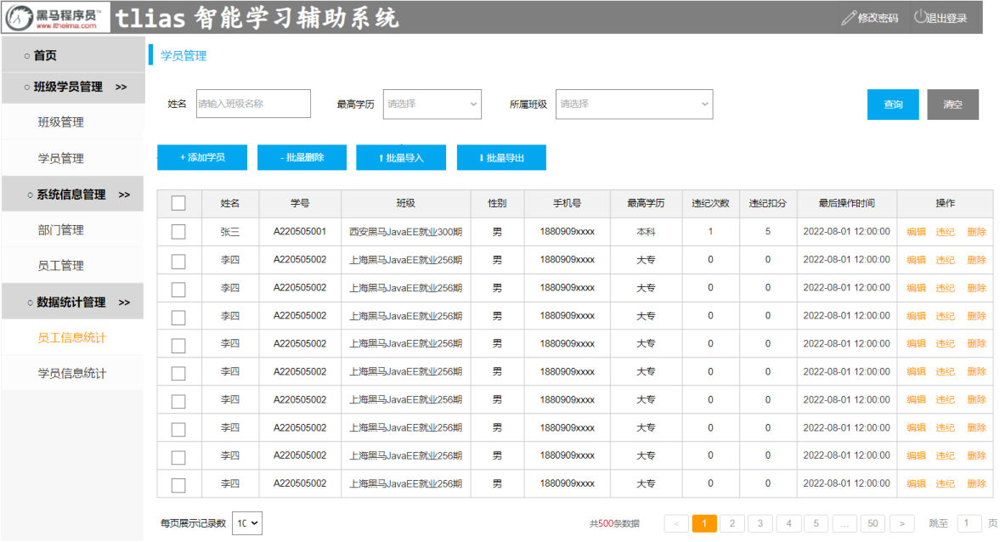
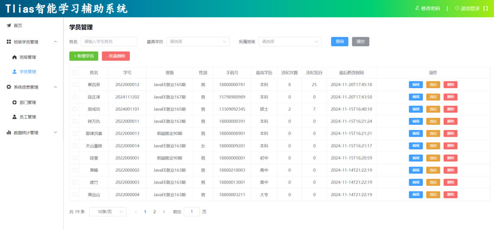

[77 篇](/posts/编程学习/javaweb学习笔记/77-员工信息统计/)给首页那两张图表喂上了数据，员工这一摊算是收尾了。可 Tlias 的侧边栏里还挂着两块没有后端的功能——**班级学员管理**和**数据统计**：这两块的表（`clazz`、`student`）在 [64 篇](/posts/编程学习/javaweb学习笔记/64-多表关系与表设计/)就建好、数据也灌好了，但接口一个都还没写。**第 11 章（项目实战）**要做的事，就是把它们从接口文档一路做到能和前端联调。

这一章的 PPT 只有 7 页（封面、需求、最终效果、"暂停视频完成实战"、"实战说明"），**没有一句技术讲解**——它是"实战章"：需求给你、接口文档给你，前面 10 章学的三层架构、MyBatis、动态 SQL、分页、异常处理，自己挑着用。所以这三篇笔记不写"PPT 上讲了……"，写法是**需求 + 接口约定 + 实现思路 + 课程参考实现的关键代码 + 本机实测**，给你对照自己写的那份代码：

| 模块（PPT 第 2、3 页的需求清单） | 落点 |
| --- | --- |
| 班级管理：班级列表查询、删除班级、添加班级、修改班级 | [78 篇](/posts/编程学习/javaweb学习笔记/78-项目实战-班级管理/) |
| 学员管理：学员列表查询、删除学员、添加学员、修改学员、违纪处理 | **本篇（79）** |
| 数据统计：班级人数统计、学员学历统计 | [80 篇](/posts/编程学习/javaweb学习笔记/80-项目实战-数据统计/) |

PPT 第 3 页在清单底下补了一句，这是整章的规矩：

> 注意：所有的功能全部严格，根据接口文档进行开发，并进行前后端联调。

"严格"两个字落在三处：**请求路径**、**请求方式**、**参数格式**（查询参数 / 路径参数 / JSON 请求体）——都要和 `资料\02. 接口文档\` 一字不差。前端不归你写，但后端吐出来的 JSON 结构必须正好是前端要的样子，否则联调时就是来回改。

第 5、6 页是实战的安排：**暂停视频，把全部实战需求做完再往下学**；以小组为单位完成，卡住了先自己想、再组内讨论，最后每组选一个人上来演示，演示时要讲清楚自己的实现思路，以及过程中遇到的典型 Bug、产生的原因和解决方案。一个人从零做完也没问题，下面照旧把每个功能拆开讲。

## 需求：学员管理要做的五件事（PPT 第 2、3 页）

PPT 第 2 页放了班级管理、学员管理、数据统计三张需求图，学员管理这张长这样（图中是原型里的假数据）：


*图：PPT 第 2 页的学员管理页面需求图——顶部三个查询条件（姓名、最高学历、所属班级），表格上方一排按钮，列里除了姓名、学号、班级、性别、手机号、最高学历，还有**违纪次数**和**违纪扣分**两列，每行操作列是「编辑 违纪 删除」。这张原型上一共有四个按钮，「批量导入」「批量导出」不在本章的需求清单里（最终效果那页它们也消失了），本章只做清单上的五个功能*

需求图对应的五个功能，在 `资料\02. 接口文档\离线\api接口文档.md` 第 4 节"学员管理"里是六个接口（新增、修改各一个，查询分成"列表"和"详情"两个）：

| 功能 | 请求路径 | 请求方式 | 参数格式 | 参数说明 |
| --- | --- | --- | --- | --- |
| 学员列表查询 | `/students` | GET | queryString | `name`（姓名，模糊）、`degree`（学历）、`clazzId`（班级）都可选；`page` 默认 1、`pageSize` 默认 10 |
| 添加学员 | `/students` | POST | application/json | 请求体里是学员 JSON：`name`/`no`/`gender`/`phone`/`degree`/`clazzId` 必须，`idCard`/`isCollege`/`address`/`graduationDate` 非必须 |
| 根据 ID 查询 | `/students/{id}` | GET | 路径参数 | `id`（学员 ID） |
| 修改学员 | `/students` | PUT | application/json | 请求体里是学员 JSON，**带 `id`**；`violationCount`/`violationScore` 也在提交的字段里 |
| 删除学员 | `/students/{ids}` | DELETE | 路径参数 | `ids`（学员的 ID 数组），样例 `/students/1,2,3` |
| 违纪处理 | `/students/violation/{id}/{score}` | PUT | 路径参数 | `id`（学员 ID）、`score`（扣除分数） |

接口文档里有两处**特别容易踩**，先圈出来：

- **删除学员是"路径参数"**：`DELETE /students/1,2,3`。而 [74 篇](/posts/编程学习/javaweb学习笔记/74-删除员工/)的员工删除是 `DELETE /emps?ids=1,2,3`（**查询参数**）——名字像、地址格式不一样，照抄员工那套会直接 404。**以接口文档为准**，这也是"严格按接口文档开发"最真实的例子。
- **违纪处理是 PUT，路径里塞了两个参数**：`/students/violation/{id}/{score}`，既不是查询参数、也不是请求体。

## 最终效果长什么样（PPT 第 4 页）

PPT 第 4 页放的是三个页面做完之后的截图（班级管理、学员管理、数据统计各一张），学员管理这张是：


*图：PPT 第 4 页的学员管理最终效果截图——顶部三个查询条件，表格上方只剩「+ 新增学员」「- 批量删除」两个按钮，「违纪次数」「违纪扣分」两列里是真实数据，每行操作列是「编辑 违纪 删除」，底部是分页条。本章后端要把这上面的每个按钮都点得动，本篇负责的就是这张图里学员部分的六个接口*

## 学员表 `student` 与实体类

学员管理只在 `student` 一张表上做增删改查。这张表的建表脚本在 `资料\03. 表结构\表结构.sql` 里，建在 `tlias` 库上（课程示例连的是 `root` / `1234`，**`password` 换成你自己 MySQL 的密码**）：

| 列 | 类型 / 约束 | 说明 |
| --- | --- | --- |
| `id` | int unsigned，主键、自增 | 学员 ID |
| `name` | varchar(10)，非空 | 姓名 |
| `no` | char(10)，非空，**唯一** | 学号 |
| `gender` | tinyint unsigned，非空 | 性别，1 男 2 女 |
| `phone` | varchar(11)，非空，**唯一** | 手机号 |
| `id_card` | char(18)，非空，**唯一** | 身份证号 |
| `is_college` | tinyint unsigned，非空 | 是否来自院校，1 是 0 否 |
| `address` | varchar(100) | 联系地址 |
| `degree` | tinyint unsigned | 最高学历，1 初中、2 高中、3 大专、4 本科、5 硕士、6 博士 |
| `graduation_date` | date | 毕业时间 |
| `clazz_id` | int unsigned，非空 | 班级 ID，关联班级表 `clazz.id` |
| `violation_count` | tinyint unsigned，非空、默认 0 | 违纪次数 |
| `violation_score` | tinyint unsigned，非空、默认 0 | 违纪扣分 |
| `create_time` / `update_time` | datetime | 创建时间 / 修改时间 |

表里专门为违纪功能准备的两条字段——`violation_count`（违纪次数）和 `violation_score`（违纪扣分）——是**违纪处理**功能的数据基础：每次违纪处理，次数加一、扣分往上累加。它们都有**默认值 0**，所以新增学员时不用管，`insert` 语句里也不写这两列。

另外请注意三个**唯一约束**：`no`（学号）、`phone`（手机号）、`id_card`（身份证号）。新增或修改学员时只要和库里已有的学员撞上，SQL 就会被数据库拦下（`Duplicate entry '...' for key 'student.no'`）；在我们的工程里，这个错误会被 [76 篇](/posts/编程学习/javaweb学习笔记/76-全局异常处理/)的全局异常处理器接住，前端拿到的是 `{"code":0,"msg":"'xxx' 已存在","data":null}` 这样的友好提示，而不是 500。自己增删改测试数据时，这三个字段最容易撞。

实体类 `Student` 是课程直接给的（`资料\04. 基础代码\Student.java`），字段与表列一一对应：

```java
@Data
@NoArgsConstructor
@AllArgsConstructor
public class Student {
    private Integer id; //ID
    private String name; //姓名
    private String no; //学号
    private Integer gender; //性别 , 1: 男 , 2 : 女
    private String phone; //手机号
    private String idCard; //身份证号
    private Integer isCollege; //是否来自于院校, 1: 是, 0: 否
    private String address; //联系地址
    private Integer degree; //最高学历, 1: 初中, 2: 高中 , 3: 大专 , 4: 本科 , 5: 硕士 , 6: 博士
    private LocalDate graduationDate; //毕业时间
    private Integer clazzId; //班级ID
    private Short violationCount; //违纪次数
    private Short violationScore; //违纪扣分
    private LocalDateTime createTime; //创建时间
    private LocalDateTime updateTime; //修改时间

    private String clazzName;//班级名称
}
```

两个细节：

- 列名是下划线（`id_card`）、属性名是小驼峰（`idCard`），靠 yml 里的驼峰开关 `map-underscore-to-camel-case: true` 对上（[58 篇](/posts/编程学习/javaweb学习笔记/58-部门管理-查询部门/)）。
- 最后那个 `clazzName` **不是表里的列**——它是列表查询时关联班级表查出来的班级名称，专门给前端表格里"班级"那一列显示用。

课程数据里学员表一共 **18 条**（本机实测），按班级分布是这样的（做筛选类题目对答案时用得上）：

| `clazz_id` | 人数 | 对应班级 |
| --- | --- | --- |
| 1 | 6 | JavaEE就业163期 |
| 2 | 7 | ⚠️ 班级表里**没有** id=2 这个班级（课程数据本身如此） |
| 4 | 3 | 前端就业90期 |
| 8 | 2 | JavaEE就业167期 |

学历分布是初中 1、高中 4、大专 3、本科 8、硕士 2，合计 18。`clazz_id=2` 那 7 个人在做"班级人数统计"时不会出现在结果里（[80 篇](/posts/编程学习/javaweb学习笔记/80-项目实战-数据统计/)会讲原因），但学员列表按 `clazzId=2` 筛选是能筛出来的——因为列表查的是 `student` 表。

## 六个接口在三层里各是谁的活

学员管理这一套和前面员工、部门那几套是同一个骨架：**Controller 只管接参和响应、Service 管业务和补时间字段、Mapper 管 SQL**。先把六个接口的分工摊开看一眼，后面再逐个说：

| 功能 | Controller | Service | Mapper |
| --- | --- | --- | --- |
| 新增 | `@PostMapping save(@RequestBody Student)` | 补 `createTime`/`updateTime` 再调 `insert` | 注解 `@Insert` 写 insert |
| 列表查询 | `@GetMapping page(name, degree, clazzId, page, pageSize)` | `PageHelper.startPage` + 强转 `Page` 取 total | XML：关联班级 + 动态条件 + 排序 |
| 详情 | `@GetMapping("/{id}")` | 直接返回 Mapper 结果 | 注解 `@Select` 单表查 |
| 修改 | `@PutMapping update(@RequestBody Student)` | 补 `updateTime` 再调 `update` | XML：`<set>` + `<if>` 按需更新 |
| 删除 | `@DeleteMapping("/{ids}")` | 透传 | XML：`delete ... in` + `<foreach>` |
| 违纪处理 | `@PutMapping("/violation/{id}/{score}")` | 透传 | 注解 `@Update`：次数 +1、分数累加 |

课程工程里的 `StudentController` 一次把这六个接口都写出来了，下面是它的"目录"（每个方法的实现后面分节讲）：

```java
@Slf4j
@RestController
@RequestMapping("/students")   // 类上统一 /students，方法上只写剩下的部分
public class StudentController {

    @Autowired
    private StudentService studentService;

    @PostMapping             // 新增：POST /students（请求体是 JSON）
    public Result save(@RequestBody Student student){ ... }

    @GetMapping              // 列表：GET /students?name=&degree=&clazzId=&page=&pageSize=
    public Result page(String name, Integer degree, Integer clazzId,
                       @RequestParam(defaultValue = "1") Integer page,
                       @RequestParam(defaultValue = "10") Integer pageSize){ ... }

    @GetMapping("/{id}")     // 详情：GET /students/8
    public Result getInfo(@PathVariable Integer id){ ... }

    @PutMapping              // 修改：PUT /students（请求体是 JSON，带 id）
    public Result update(@RequestBody Student student){ ... }

    @DeleteMapping("/{ids}") // 删除：DELETE /students/1,2,3
    public Result delete(@PathVariable List<Integer> ids){ ... }

    @PutMapping("/violation/{id}/{score}")   // 违纪处理：PUT /students/violation/1/5
    public Result violationHandle(@PathVariable Integer id, @PathVariable Integer score){ ... }
}
```

（省略号处的方法体下面逐条展开。）每个方法都只有"接参 → 调 Service → `Result.success(...)`"三句话，业务逻辑一行都不写——这是 [58 篇](/posts/编程学习/javaweb学习笔记/58-部门管理-查询部门/)以来一直没变的分工。

## 新增学员：`POST /students`

**需求与接口约定**：页面上点「+ 新增学员」弹出表单，填完提交；前端把学员信息以 JSON 放进请求体 POST 到 `/students`。请求体样例（接口文档 4.3）：

```json
{
  "name": "阿大",
  "no": "2024010801",
  "gender": 1,
  "phone": "15909091235",
  "idCard": "159090912351590909",
  "isCollege": 1,
  "address": "昌平回龙观",
  "degree": 4,
  "graduationDate": "2024-01-01",
  "clazzId": 9
}
```

JSON 里的字段名（`clazzId`、`graduationDate`、`isCollege`、`idCard`）要和 `Student` 的属性名对应，SpringMVC 才能把请求体反序列化成对象；`"2024-01-01"` 这样的字符串会自动转成 `LocalDate`。

**实现**：控制层用 `@RequestBody` 接整个对象，业务层补上两个时间字段，数据访问层把记录写进表。

```java
// Controller
@PostMapping
public Result save(@RequestBody Student student){
    studentService.save(student);
    return Result.success();
}
```

```java
// ServiceImpl
@Override
public void save(Student student) {
    // 创建时间、修改时间由后端统一填（前端不传）
    student.setCreateTime(LocalDateTime.now());
    student.setUpdateTime(LocalDateTime.now());
    studentMapper.insert(student);
}
```

```java
// StudentMapper（字段多、一行写得太长，课程用注解把 insert 写在这里）
@Insert("insert into student(name, no, gender, phone,id_card, is_college, address, degree, graduation_date,clazz_id, create_time, update_time) VALUES " +
        "(#{name},#{no},#{gender},#{phone},#{idCard},#{isCollege},#{address},#{degree},#{graduationDate},#{clazzId},#{createTime},#{updateTime})")
void insert(Student student);
```

三个要点：

- `insert` 的列里**没有** `violation_count`、`violation_score`——让数据库用默认值 0（新学员当然没违过纪）；
- `create_time`、`update_time` 也不在前端提交的字段里，由 Service 用 `LocalDateTime.now()` 补上（[69 篇](/posts/编程学习/javaweb学习笔记/69-新增员工/)新增员工是同一套做法）；
- 唯一约束字段（`no` / `phone` / `id_card`）重复时会走全局异常处理器返回 `{"code":0,"msg":"'xxx' 已存在","data":null}`，所以调试时换个学号/手机号再试。

## 学员列表：条件分页查询 `GET /students`

**需求与接口约定**：页面顶部三个条件——姓名（**模糊查询**）、最高学历（精确）、所属班级（精确），三个都可以不填；结果**按最后操作时间倒序**、分页展示（接口文档 4.1 的样例是 `/students?name=张三&degree=1&clazzId=2&page=1&pageSize=5`）。列表里"班级"那一列显示的是班级名称，而 `student` 表里只有 `clazz_id`。

**三层实现**：

```java
// Controller
@GetMapping
public Result page(String name,
                   Integer degree,
                   Integer clazzId,
                   @RequestParam(defaultValue = "1") Integer page,
                   @RequestParam(defaultValue = "10") Integer pageSize){
    PageResult pageResult = studentService.page(name, degree, clazzId, page, pageSize);
    return Result.success(pageResult);
}
```

```java
// ServiceImpl：分页交给 PageHelper（[67 篇](/posts/编程学习/javaweb学习笔记/67-分页查询的两种实现方式/)）
@Override
public PageResult page(String name, Integer degree, Integer clazzId, Integer page, Integer pageSize) {
    PageHelper.startPage(page, pageSize);          // 1. 设置分页参数

    List<Student> studentList = studentMapper.list(name, degree, clazzId);  // 2. 紧跟着的这条查询会被分页
    Page<Student> p = (Page<Student>) studentList; // 3. 强转成 Page 才能拿 total

    return new PageResult(p.getTotal(), p.getResult());
}
```

```xml
<!-- StudentMapper.xml：关联班级 + 动态条件 + 排序 -->
<select id="list" resultType="com.itheima.pojo.Student">
    select s.*, c.name clazzName from student s left join clazz c on s.clazz_id = c.id
    <where>
        <if test="name != null and name != ''">
            s.name like concat('%',#{name},'%')
        </if>
        <if test="degree != null">
            and s.degree = #{degree}
        </if>
        <if test="clazzId != null">
            and s.clazz_id = #{clazzId}
        </if>
    </where>
    order by s.update_time desc
</select>
```

```java
// StudentMapper 接口里对应的方法声明（实现在 XML 里）
List<Student> list(String name, Integer degree, Integer clazzId);
```

几个值得停一下的地方：

- **为什么要 `left join clazz`**：前端表格里的"班级"列要显示"西安黑马JavaEE就业300期"这样的名字，而 `student` 表里只有 `clazz_id`。所以查询时把班级表连进来，`c.name` 起个别名 **`clazzName`**，正好落到 `Student` 对象里那个专门留出来的 `clazzName` 属性上。用 `left join`（左连接）——学员班级字段是必填的，正常都能连上，但用左连接的话即使某个 `clazz_id` 在班级表里不存在，学员本身也不会从列表里消失（课程数据里 `clazz_id=2` 就是这种情况）。
- **`<where>` 帮了什么忙**：三个条件可以自由组合（可能一个都不传、也可能只传中间那个），动态 SQL 要保证"多一个 `and` 不行、少一个 `and` 也不行"。`<where>` 标签会在有条件时自动补上 `where` 关键字，并**自动去掉紧跟在 `where` 后头多余的 `and`**（[68 篇](/posts/编程学习/javaweb学习笔记/68-条件分页查询与动态sql/)）。
- **模糊与精确**：`name` 用 `s.name like concat('%',#{name},'%')`——`concat` 是 MySQL 的字符串拼接函数，拼出 `'%张%'` 这样两头带通配符的串；`degree`、`clazzId` 是 `and ... = #{...}` 精确匹配。
- **排序**：`order by s.update_time desc` 对应需求里的"根据最后操作时间倒序排序"——**刚被编辑/违纪处理过的学员会排在前面**，这也是 [75 篇](/posts/编程学习/javaweb学习笔记/75-修改员工/)反复改 `update_time` 的意义。
- `<if>` 里的 `test` 写的是**方法形参名**（`name` / `degree` / `clazzId`），不是列名。

## 学员详情：`GET /students/{id}`

**需求与接口约定**：点行尾的「编辑」，弹窗要先把这名学员的现有信息查出来回显，接口是 `GET /students/8`（路径参数）。

```java
// Controller
@GetMapping("/{id}")
public Result getInfo(@PathVariable Integer id){
    Student student = studentService.getInfo(id);
    return Result.success(student);
}
```

```java
// ServiceImpl：直接返回
@Override
public Student getInfo(Integer id) {
    return studentMapper.getById(id);
}
```

```java
// StudentMapper：条件简单，注解就够
@Select("select * from student where id = #{id}")
Student getById(Integer id);
```

`@PathVariable` 把 URL 路径里那一段（`/students/` 后面那截）绑到方法形参上——变量名和方法上的 `{id}` 同名就自动对上（[58 篇](/posts/编程学习/javaweb学习笔记/58-部门管理-查询部门/)里查部门详情也是它）。

这里的响应和列表查询有个区别：接口文档 4.4 的详情响应里**没有 `clazzName`**（只有 `clazzId`）——编辑弹窗里"所属班级"是用下拉框选的，前端拿 `clazzId` 就知道选哪一项，不需要班级名字。所以详情用单表 `select *` 就够了，不用关联。

## 修改学员：`PUT /students`

**需求与接口约定**：编辑弹窗改完点保存，前端把学员信息（**带 `id`**）以 JSON 放进请求体 PUT 到 `/students`；只有提交上来的字段才需要更新，最后修改时间由后端补。

```java
// Controller
@PutMapping
public Result update(@RequestBody Student student){
    studentService.update(student);
    return Result.success();
}
```

```java
// ServiceImpl
@Override
public void update(Student student) {
    student.setUpdateTime(LocalDateTime.now());   // 最后修改时间由后端补
    studentMapper.update(student);
}
```

```xml
<!-- StudentMapper.xml：<set> + <if> 做到"传了才更新" -->
<update id="update">
    update student
    <set>
        <if test="name != null and name != ''">
            name = #{name},
        </if>
        <if test="no != null and no != ''">
            no = #{no},
        </if>
        <if test="gender != null">
            gender = #{gender},
        </if>
        <if test="phone != null and phone != ''">
            phone = #{phone},
        </if>
        <if test="idCard != null and idCard != ''">
            id_card = #{idCard},
        </if>
        <if test="isCollege != null and isCollege != ''">
            is_college = #{isCollege},
        </if>
        <if test="address != null and address != ''">
            address = #{address},
        </if>
        <if test="graduationDate != null">
            graduation_date = #{graduationDate},
        </if>
        <if test="degree != null">
            degree = #{degree},
        </if>
        <if test="violationCount != null">
            violation_count = #{violationCount},
        </if>
        <if test="violationScore != null">
            violation_score = #{violationScore},
        </if>
        <if test="clazzId != null">
            clazz_id = #{clazzId},
        </if>
        <if test="updateTime != null">
            update_time = #{updateTime}
        </if>
    </set>
    where id = #{id}
</update>
```

这就是 [75 篇](/posts/编程学习/javaweb学习笔记/75-修改员工/)讲过的**动态更新**：前端提交了哪些字段就更哪些，没提交的（`null`）保持库里原值。三个细节：

- **`<set>` 标签的两件事**：有字段时会自动补 `set` 关键字，并**自动去掉最后多余的那个逗号**——所以每个 `<if>` 里面都能放心地以逗号结尾（包括最后一项）。上面 `update_time` 那行没写逗号，是因为它固定排在最后；其实写不写都行，`<set>` 会处理。
- **字符串字段要多判一个空串**：`name`、`no`、`phone`、`idCard`、`address`、`isCollege` 这些"字符串型"字段写成 `test="xxx != null and xxx != ''"`，避免前端传个 `""` 把库里的值覆盖成空串；`gender`、`degree`、`clazzId`、日期这些**不是字符串**的字段只判 `!= null` 就够了（`isCollege` 在课程代码里连 `!= ''` 一起判了，它其实是数字，按类型判断就行）。
- **`update_time` 的 `<if>` 是"保险丝"**：Service 每次修改都会 `setUpdateTime`，所以这个 `<if>` 必定命中、`<set>` 里至少有一项。反过来说，如果某次调用所有字段都是 `null`，`<set>` 里就什么都不剩，SQL 会拼成 `update student where id = ?`——直接语法错误。所以"Service 一定要补时间字段"不只是为了记录，也是在兜这个底。

`where id = #{id}` 里的 `id` 就是编辑弹窗带回来的 id——**没有它这条 SQL 会把全表更新**，这是所有 UPDATE 语句的第一大忌。

## 批量删除学员：`DELETE /students/{ids}`

**需求与接口约定**：表格加勾选框，勾几行点「批量删除」，前端把选中的 id 拼成 `1,2,3` 发到 `/students/1,2,3`；单行的「删除」只传一个 id，走同一个接口（和 [74 篇](/posts/编程学习/javaweb学习笔记/74-删除员工/)"单条删除也是一种特殊的批量删除"是同一个道理）。注意接口文档 4.2 写的参数格式是**路径参数**：

```java
// Controller：接到路径里的一段，绑成一批 id
@DeleteMapping("/{ids}")
public Result delete(@PathVariable List<Integer> ids){
    studentService.delete(ids);
    return Result.success();
}
```

```java
// ServiceImpl：只有一张表要删，不用事务，直接透传
@Override
public void delete(List<Integer> ids) {
    studentMapper.delete(ids);
}
```

```xml
<!-- StudentMapper.xml：和 74 篇的 foreach 一模一样 -->
<delete id="delete">
    delete from student where id in
    <foreach collection="ids" item="id" separator="," open="(" close=")">
        #{id}
    </foreach>
</delete>
```

把 [74 篇](/posts/编程学习/javaweb学习笔记/74-删除员工/)的员工删除和这里并排看，差别只有"参数从哪儿来"：

| | 删除员工（74 篇） | 删除学员（本篇） |
| --- | --- | --- |
| 接口 | `DELETE /emps?ids=1,2,3` | `DELETE /students/1,2,3` |
| 参数格式 | **查询参数**（问号后面） | **路径参数**（路径里的一段） |
| 控制层注解 | `@RequestParam List<Integer> ids` | `@PathVariable List<Integer> ids` |
| XML | `<foreach>` 拼 `in` 的括号 | **完全一样** |

`@PathVariable` 接 `List<Integer>` 时，Spring 会按**逗号**把路径里那段 `1,2,3` 切成三个元素——这是框架自带的规则，不用自己 `split`。

另一个和员工删除的差别：员工删的时候要**删两张表**（员工 + 工作经历）、必须加事务；学员这边没有从表（违纪次数、扣分就是 `student` 里两列），所以**一条 SQL 就完事**，不需要 `@Transactional`。别把两件事混在一起背。

## 违纪处理：`PUT /students/violation/{id}/{score}`

这是学员管理里最"新"的一个接口，也是页面原型里明确写了两条规则的功能：

> 1). 每一次违纪处理 , 就需要将违纪次数往上累加一次 。
> 2). 每一次违纪处理 , 需要将违纪分数累加。

**页面上的流程**：表格每行的操作列里有一个「违纪」按钮，点它弹出标题为"学员违纪处理"的小弹窗，里面只有一个"违纪扣分"输入框和「确定」「取消」——老师填这次要扣几分，点确定就发请求。

**接口约定**（接口文档 4.6）：`PUT /students/violation/{id}/{score}`，参数格式是**路径参数**，两个参数分别是 `id`（学员 ID）和 `score`（扣除分数），比如 `/students/violation/1/5` 表示"给 1 号学员记一次违纪、扣 5 分"。

**三层实现**：这个接口的业务规则全部落在 SQL 里，所以 Service 只做透传。

```java
// Controller：两个路径参数
@PutMapping("/violation/{id}/{score}")
public Result violationHandle(@PathVariable Integer id , @PathVariable Integer score){
    studentService.violationHandle(id, score);
    return Result.success();
}
```

```java
// ServiceImpl：没有额外业务，直接调 Mapper
@Override
public void violationHandle(Integer id, Integer score) {
    studentMapper.updateViolation(id, score);
}
```

```java
// StudentMapper：一条 SQL 完成"次数 +1、分数累加"
@Update("update student set violation_count = violation_count + 1 , violation_score = violation_score + #{score} , update_time = now() where id = #{id}")
void updateViolation(Integer id, Integer score);
```

逐块拆开看这条 SQL：

| 片段 | 作用 |
| --- | --- |
| `violation_count = violation_count + 1` | 次数在**原来的值上加 1**——不是前端传进来的 |
| `violation_score = violation_score + #{score}` | 扣分在原来的值上**累加**这次传进来的分数 |
| `update_time = now()` | 顺手把最后操作时间刷新（列表按它倒序） |
| `where id = #{id}` | 只改这一个学员 |

三个要点：

- **次数不由前端传**：前端只负责"这次扣几分"，"已经违纪几次"是库里的状态，后端在 SQL 里加 1 就完了。前端**不能**传次数——它不掌握这个值，传了反而可能覆盖成错的。
- **两个路径参数怎么绑上**：路径模板 `{id}`、`{score}` 与方法形参 `id`、`score` **同名**，`@PathVariable` 就各就各位（想改名也行，写 `@PathVariable("score") Integer s` 这种形式即可）。同一个方法上的多个 `@PathVariable` 会按路径里的顺序对应。
- **为什么不用"先查出来、Java 里 +1、再 update 写回"**：那样是三步（查 → 算 → 写），两次操作之间有间隙——两个老师同时给同一个学员记违纪，可能都读到 3 次、各自写回 4 次，一次违纪就丢了（典型的"读-改-写"丢更新）。写成 `violation_count = violation_count + 1` 是让数据库**在一条语句里原子地**基于当前值自增，不会互相覆盖，也少一次查询。

课程自带的 18 条数据里就有"累加过"的例子：崔百泉 `violation_count=6`、`violation_score=17`，郑成功 `2`/`7`——都是这么一次次加出来的。

## 本机实测

把工程跑起来，按接口文档发请求，看真实响应和库里的变化。以下都是**本机实测**结果，连的是 MySQL 的 `tlias` 库、用户名 `root`（`password` 换成你自己 MySQL 的密码）。

**① 列表的条件分页查询**：

> [!TIP]
> **本机实测**：
>
> ```text
> $ GET http://localhost:8080/students?page=1&pageSize=3
> {"code":1,"msg":"success","data":{"total":18,"rows":[
>   {"id":12,"name":"崔百泉","no":"2022000012","clazzId":8,"violationCount":6,"violationScore":17,...},
>   {"id":18,"name":"郑成功","no":"2023001101","clazzId":8,"violationCount":2,"violationScore":7,...},
>   {"id":11,"name":"钟万仇","no":"2022000011","clazzId":1,...}]}}
> ```
>
> `total` 是 **18**——库里就 18 名学员。三行依次是崔百泉、郑成功、钟万仇，这个顺序不是按 id 排的，而是按 `update_time desc`：崔百泉、郑成功都是被改过数据的（就是上面那两个有违纪记录的），所以排在前面。

**② 再叠一个条件：按班级筛选**：

> [!TIP]
> **本机实测**：
>
> ```text
> $ GET http://localhost:8080/students?clazzId=1&page=1&pageSize=10
> total: 6  → 钟万仇 / 天山童姥 / 萧峰 / 虚竹 / 萧远山 / 阿朱
> ```
>
> `total` 变成 6，正好是 `clazz_id=1`（JavaEE就业163期）名下的人数——动态 SQL 只把 `and s.clazz_id = #{clazzId}` 拼了进去，另外两个条件没传就没拼。

**③ 违纪处理**（本机实测跑的就是下面这一发请求，跑完已把数据还原）：

> [!TIP]
> **本机实测**：
>
> ```text
> $ PUT http://localhost:8080/students/violation/1/5     ← 1 号学员（段誉）记一次违纪、扣 5 分
> {"code":1,"msg":"success","data":null}
>
> # 查库
> select violation_count, violation_score from student where id = 1;
>   记录前: 0 / 0
>   记录后: 1 / 5      ← 次数 0→1（SQL 里 +1）、分数 0→5（累加这次扣的 5 分）
> ```
>
> 一次请求、一条 SQL，两个字段都按"累加"的语义变了。按这条 SQL 的语义，接着再调一次 `PUT /students/violation/1/3` 就会得到 `2 / 8`——次数再 +1、分数再 +3（练习里会自己动手验证这一步）。

## 小结

| 问题 | 答案 |
| --- | --- |
| 学员管理要做几个功能？ | 五个：列表查询、删除、添加、修改、违纪处理（对应接口文档第 4 节的六个接口） |
| 本章的规矩是什么？ | **严格按接口文档开发**：路径、请求方式、参数格式（查询参数 / 路径参数 / JSON）都要对上，然后做前后端联调 |
| 列表查询怎么写？ | `GET /students`；三个条件用 `<where>` + `<if>` 动态拼；`left join clazz` 查出 `clazzName`；`order by s.update_time desc`；分页用 PageHelper |
| 详情和修改的区别？ | 详情 `GET /students/{id}` 单表 `select *`（响应没有 `clazzName`）；修改 `PUT /students` 用 `<set>` + `<if>` 按需更新，Service 补 `updateTime` |
| 删除学员的参数格式？ | **路径参数** `DELETE /students/1,2,3`，`@PathVariable List<Integer> ids`；XML 的 `<foreach>` 和员工删除一模一样（别和 `/emps?ids=` 混） |
| 违纪处理的接口？ | `PUT /students/violation/{id}/{score}`，两个路径参数；`id` 学员 ID、`score` 扣除分数 |
| 违纪的 SQL 怎么算？ | `violation_count = violation_count + 1`、`violation_score = violation_score + #{score}`、`update_time = now()`，`where id = #{id}` |
| 为什么在 SQL 里累加？ | 一条 SQL 原子完成，避免"先查后改"的丢更新，也少一次查询；次数不需要前端传 |
| 学员表要小心的约束？ | `no`（学号）、`phone`（手机号）、`id_card`（身份证号）三个**唯一**；撞了会被全局异常处理器转成 `{"code":0,"msg":"'xxx' 已存在"}` |
| 本机实测结果？ | 列表 `total=18`（按 `update_time` 倒序）；`clazzId=1` → `total=6`；`PUT /students/violation/1/5` → 段誉 `violation_count` 0→1、`violation_score` 0→5 |

## 相关

- [上一篇：项目实战-班级管理](/posts/编程学习/javaweb学习笔记/78-项目实战-班级管理/)
- [下一篇：项目实战-数据统计](/posts/编程学习/javaweb学习笔记/80-项目实战-数据统计/)

## 练习题

### 一、知识回顾（读完直接做下面的实践题）

1. **本章是实战章**：PPT 只有 7 页（封面、需求、最终效果、暂停视频完成实战、实战说明），没有技术讲解；要求是**严格按接口文档开发 + 前后端联调**，路径、请求方式、参数格式三样都要和 `资料\02. 接口文档` 对上。
2. **学员管理要做的五件事**：学员列表查询、删除学员、添加学员、修改学员、**违纪处理**；接口文档第 4 节把它们拆成六个接口（查询分成"列表"和"详情"）。
3. **学员表的三个唯一约束字段**：`no`（学号）、`phone`（手机号）、`id_card`（身份证号）——新增/修改时重复会撞数据库，再由全局异常处理器转成 `{"code":0,"msg":"'xxx' 已存在"}`。
4. **列表查询接口**：`GET /students?name=&degree=&clazzId=&page=&pageSize=`；`name` 模糊（`like concat('%',#{name},'%')`）、`degree` 与 `clazzId` 精确；三个条件都可选；排序按 `update_time desc`。
5. **列表为什么要关联班级表**：`student` 里只有 `clazz_id`，页面要显示班级**名称**，所以 `select s.*, c.name clazzName from student s left join clazz c on s.clazz_id = c.id`，别名 `clazzName` 正好落到 `Student` 那个非表字段的属性上。
6. **`<where>` 的作用**：有条件时自动补 `where`，并去掉紧跟其后多余的 `and`——三个条件任意组合都不会拼错 SQL。
7. **详情与修改**：详情 `GET /students/{id}`（`@PathVariable`，单表查，响应里没有 `clazzName`）；修改 `PUT /students`（JSON 里带 `id`）用 `<set>` + `<if>` 做到"传了才更新"，`<set>` 还会自动去掉最后一个多余的逗号。
8. **删除学员的参数格式是路径参数**：`DELETE /students/1,2,3`，控制层 `@DeleteMapping("/{ids}")` + `@PathVariable List<Integer> ids`；它和员工删除的 `DELETE /emps?ids=1,2,3`（查询参数）**不一样**。
9. **违纪处理接口**：`PUT /students/violation/{id}/{score}`，两个路径参数（`id` 学员 ID、`score` 扣除分数）；SQL 里 `violation_count = violation_count + 1`、`violation_score = violation_score + #{score}`、`update_time = now()`。
10. **本机实测**：列表 `total=18`（按 `update_time` 倒序，崔百泉、郑成功排在前面）；`clazzId=1` 筛出 6 人；`PUT /students/violation/1/5` 之后段誉的 `violation_count` 0→1、`violation_score` 0→5。

### 二、裸写题

- [ ] **2-1 新增学员：把请求体里的 JSON 落成一条记录**
  需求：页面上点「+ 新增学员」弹窗，填完提交；前端把学员信息（姓名、学号、性别、手机号、身份证号、是否来自院校、联系地址、学历、毕业时间、班级 ID）以 JSON 放进请求体，POST 到 `/students`。要求三层都写出来：控制层把请求体接成学员对象、业务层补上创建时间与修改时间、数据访问层把记录写进 `student` 表。写完回答：① 这条 `insert` 语句为什么不写 `violation_count`、`violation_score` 两列？② 如果学号和库里已有学员重复，接口会返回什么？
  （练习文件 `test_79_学员管理.java` 的题目2-1 里给了写作区。）

  > [!TIP]- 提示（先自己想，实在想不出再点开）
  > **一级 · 思路**：请求体是一整段 JSON → 要有一个能把它整体转成对象的形参；两个时间字段前端不传 → 由业务层用当前时间补上；SQL 只需要写"要落库的那些列"
  > **二级 · 方法**：控制层 `@PostMapping` + `@RequestBody Student student`；业务层 `student.setCreateTime(LocalDateTime.now())`、`student.setUpdateTime(...)`；数据访问层注解 `@Insert("insert into student(...) values (...)")`（[69 篇](/posts/编程学习/javaweb学习笔记/69-新增员工/)）
  > **三级 · 骨架**：
  > ```java
  > // Controller
  > @____
  > public Result save(@____ Student student){
  >     studentService.____(student);
  >     return Result.success();
  > }
  >
  > // ServiceImpl
  > public void save(Student student) {
  >     student.setCreateTime(____);
  >     student.setUpdateTime(____);
  >     studentMapper.____(student);
  > }
  > ```

  > [!TIP]- 参考答案（做完再点开）
  > ```java
  > // Controller
  > @PostMapping
  > public Result save(@RequestBody Student student){
  >     studentService.save(student);
  >     return Result.success();
  > }
  > ```
  > ```java
  > // ServiceImpl
  > @Override
  > public void save(Student student) {
  >     student.setCreateTime(LocalDateTime.now());
  >     student.setUpdateTime(LocalDateTime.now());
  >     studentMapper.insert(student);
  > }
  > ```
  > ```java
  > // StudentMapper（课程写法：注解）
  > @Insert("insert into student(name, no, gender, phone,id_card, is_college, address, degree, graduation_date,clazz_id, create_time, update_time) VALUES " +
  >         "(#{name},#{no},#{gender},#{phone},#{idCard},#{isCollege},#{address},#{degree},#{graduationDate},#{clazzId},#{createTime},#{updateTime})")
  > void insert(Student student);
  > ```
  > 回答：
  > ① 这两列在表定义里有**默认值 0**（`violation_count tinyint unsigned default 0 not null`），新学员没违过纪，插进去就是 0；而且前端表单里也没有"违纪次数/扣分"可填。违纪次数与扣分只由**违纪处理**接口去改，不经过新增与编辑。
  > ② 学号/手机号/身份证号都带**唯一约束**，重复时数据库抛 `Duplicate entry ... for key 'student.no'`，Spring 把它翻译成 `DuplicateKeyException`，被 [76 篇](/posts/编程学习/javaweb学习笔记/76-全局异常处理/)的 `handleDuplicateKeyException` 接住，接口返回 `{"code":0,"msg":"'<重复的值>' 已存在","data":null}`——不会 500，也不会真的插进去。调试时换个学号/手机号/身份证号即可。

- [ ] **2-2 学员列表的条件分页查询：三个可选条件 + 班级名称**
  需求：页面顶部三个条件——姓名（模糊）、最高学历（精确下拉）、所属班级（精确下拉），三个都可以留空；列表里"班级"那一列要显示**班级名称**（不是 ID）；结果按最后操作时间倒序、分页显示。要求写全三层，并说明列表 SQL 里为什么要关联班级表。
  （练习文件 `test_79_学员管理.java` 的题目2-2 里给了写作区。）

  > [!TIP]- 提示（先自己想，实在想不出再点开）
  > **一级 · 思路**：条件可有可无 → 动态 SQL；要显示班级名字 → 关联 `clazz` 表并起个别名装进实体；分页 → PageHelper 拦下紧跟着的那条查询
  > **二级 · 方法**：控制层 `@GetMapping` 接 `name/degree/clazzId` + `@RequestParam(defaultValue = "1") Integer page`/`pageSize`（[68 篇](/posts/编程学习/javaweb学习笔记/68-条件分页查询与动态sql/)）；业务层 `PageHelper.startPage(page, pageSize)` 后紧跟 `studentMapper.list(...)`，把结果强转 `Page<Student>` 取 `getTotal()`（[67 篇](/posts/编程学习/javaweb学习笔记/67-分页查询的两种实现方式/)）；数据访问层 XML 里 `select s.*, c.name clazzName from student s left join clazz c on s.clazz_id = c.id` + `<where><if>` + `order by s.update_time desc`
  > **三级 · 骨架**：
  > ```xml
  > <select id="list" resultType="com.itheima.pojo.Student">
  >     select s.*, ____ clazzName from student s ____ clazz c on s.clazz_id = c.id
  >     <____>
  >         <if test="name != null and name != ''">
  >             s.name like ____('%',#{name},'%')
  >         </if>
  >         <if test="degree != null">
  >             ____ s.degree = #{degree}
  >         </if>
  >         <if test="clazzId != null">
  >             and s.____ = #{clazzId}
  >         </if>
  >     </where>
  >     order by s.update_time ____
  > </select>
  > ```

  > [!TIP]- 参考答案（做完再点开）
  > ```java
  > // Controller
  > @GetMapping
  > public Result page(String name,
  >                    Integer degree,
  >                    Integer clazzId,
  >                    @RequestParam(defaultValue = "1") Integer page,
  >                    @RequestParam(defaultValue = "10") Integer pageSize){
  >     PageResult pageResult = studentService.page(name, degree, clazzId, page, pageSize);
  >     return Result.success(pageResult);
  > }
  > ```
  > ```java
  > // ServiceImpl
  > @Override
  > public PageResult page(String name, Integer degree, Integer clazzId, Integer page, Integer pageSize) {
  >     PageHelper.startPage(page, pageSize);
  >     List<Student> studentList = studentMapper.list(name, degree, clazzId);
  >     Page<Student> p = (Page<Student>) studentList;
  >     return new PageResult(p.getTotal(), p.getResult());
  > }
  > ```
  > ```xml
  > <!-- StudentMapper.xml -->
  > <select id="list" resultType="com.itheima.pojo.Student">
  >     select s.*, c.name clazzName from student s left join clazz c on s.clazz_id = c.id
  >     <where>
  >         <if test="name != null and name != ''">
  >             s.name like concat('%',#{name},'%')
  >         </if>
  >         <if test="degree != null">
  >             and s.degree = #{degree}
  >         </if>
  >         <if test="clazzId != null">
  >             and s.clazz_id = #{clazzId}
  >         </if>
  >     </where>
  >     order by s.update_time desc
  > </select>
  > ```
  > 为什么要关联班级表：`student` 表里只有 `clazz_id`，页面要显示的是班级**名称**，所以把 `clazz` 连进来取 `c.name`，并起别名 `clazzName`——它正好对应 `Student` 实体里那个不属于表字段的 `clazzName` 属性，`resultType` 一自动映射就装上了。本机实测：不加条件 `total=18`；加 `clazzId=1` 后 `total=6`（钟万仇、天山童姥、萧峰、虚竹、萧远山、阿朱）。

- [ ] **2-3 学员的「编辑」流程：详情回显 + 按需修改**
  需求：点行尾的「编辑」，弹窗要先把这名学员的信息查出来回显（按 ID 查详情）；改完点保存，前端把学员 JSON（**带 id**）以 PUT 发到 `/students`，只有提交上来的字段才更新，最后修改时间由后端补。要求写出这两个接口的三层实现，并说明 `<set>` 这个标签帮了什么忙。
  （练习文件 `test_79_学员管理.java` 的题目2-3 里给了写作区。）

  > [!TIP]- 提示（先自己想，实在想不出再点开）
  > **一级 · 思路**：详情是"按 id 查一个"→ 路径参数 + 单表查询；修改是"按 id 改若干列"→ 请求体 + `<set>` 动态更新；`updateTime` 由 Service 补，这样 `<set>` 里必定有一项
  > **二级 · 方法**：`@GetMapping("/{id}")` + `@PathVariable` / `@PutMapping` + `@RequestBody`；Mapper 的查询 `@Select("select * from student where id = #{id}")`；XML 里 `<update id="update">` 的 `<set><if test="列 != null and 列 != ''">列 = #{列},</if></set>`，最后 `where id = #{id}`
  > **三级 · 骨架**：
  > ```java
  > // Controller
  > @GetMapping("/{id}")
  > public Result getInfo(@____ Integer id){
  >     return Result.success(studentService.____(id));
  > }
  >
  > @PutMapping
  > public Result update(@____ Student student){
  >     studentService.update(student);
  >     return Result.success();
  > }
  >
  > // ServiceImpl.update：补 updateTime
  > student.setUpdateTime(____);
  > ```

  > [!TIP]- 参考答案（做完再点开）
  > ```java
  > // Controller
  > @GetMapping("/{id}")
  > public Result getInfo(@PathVariable Integer id){
  >     Student student = studentService.getInfo(id);
  >     return Result.success(student);
  > }
  >
  > @PutMapping
  > public Result update(@RequestBody Student student){
  >     studentService.update(student);
  >     return Result.success();
  > }
  > ```
  > ```java
  > // ServiceImpl
  > @Override
  > public Student getInfo(Integer id) {
  >     return studentMapper.getById(id);
  > }
  >
  > @Override
  > public void update(Student student) {
  >     student.setUpdateTime(LocalDateTime.now());
  >     studentMapper.update(student);
  > }
  > ```
  > ```java
  > // StudentMapper：详情条件简单，用注解
  > @Select("select * from student where id = #{id}")
  > Student getById(Integer id);
  > ```
  > ```xml
  > <!-- StudentMapper.xml：按需更新（只列前面几列，其余同理） -->
  > <update id="update">
  >     update student
  >     <set>
  >         <if test="name != null and name != ''">
  >             name = #{name},
  >         </if>
  >         <if test="gender != null">
  >             gender = #{gender},
  >         </if>
  >         <if test="clazzId != null">
  >             clazz_id = #{clazzId},
  >         </if>
  >         <if test="updateTime != null">
  >             update_time = #{updateTime}
  >         </if>
  >     </set>
  >     where id = #{id}
  > </update>
  > ```
  > `<set>` 帮了两件事：**有字段时自动补 `set` 关键字**、**自动去掉最后一个多余的逗号**（所以每个 `<if>` 里的 `xxx = #{xxx},` 都能放心带逗号）。另外：字符串字段判 `!= null and != ''`（防止把库里的值覆盖成空串），数字/日期字段只判 `!= null`；Service 每次都补 `updateTime`，所以 `<set>` 里至少有一项，不会拼出 `update student where id = ?` 这种语法错误的 SQL。详情响应里没有 `clazzName`，因为编辑弹窗用 `clazzId` 选班级，单表 `select *` 就够。

- [ ] **2-4 批量删除学员（注意路径参数）**
  需求：表格勾选若干行点「批量删除」，前端把选中的学员 id 拼成 `1,2,3` 放进**路径**里发到 `/students/1,2,3`；单行的「删除」只传一个 id，走同一个接口。要求写全三层，并回答：它和 [74 篇](/posts/编程学习/javaweb学习笔记/74-删除员工/)的员工删除接口在"参数格式"上差在哪？控制层注解因此有什么不同？
  （练习文件 `test_79_学员管理.java` 的题目2-4 里给了写作区。）

  > [!TIP]- 提示（先自己想，实在想不出再点开）
  > **一级 · 思路**：参数在 URL **路径**里而不是问号后面 → 接参用另一种注解；SQL 是"按一批 id 删除" → `in` + `<foreach>`（和员工删除那段完全一样）
  > **二级 · 方法**：`@DeleteMapping("/{ids}")` + `@PathVariable List<Integer> ids`（对比员工的 `@RequestParam List<Integer> ids`）；XML 里 `<delete id="delete">delete from student where id in <foreach collection="ids" item="id" separator="," open="(" close=")">#{id}</foreach></delete>`（[74 篇](/posts/编程学习/javaweb学习笔记/74-删除员工/)）
  > **三级 · 骨架**：
  > ```java
  > @____("/{ids}")
  > public Result delete(@____ List<Integer> ids){
  >     studentService.delete(ids);
  >     return Result.success();
  > }
  > ```
  > ```xml
  > <delete id="delete">
  >     delete from student where id in
  >     <foreach collection="____" item="____" separator="," open="(" close=")">
  >         #{____}
  >     </foreach>
  > </delete>
  > ```

  > [!TIP]- 参考答案（做完再点开）
  > ```java
  > // Controller
  > @DeleteMapping("/{ids}")
  > public Result delete(@PathVariable List<Integer> ids){
  >     studentService.delete(ids);
  >     return Result.success();
  > }
  >
  > // ServiceImpl：学员只有一张表要删，不需要事务
  > @Override
  > public void delete(List<Integer> ids) {
  >     studentMapper.delete(ids);
  > }
  > ```
  > ```xml
  > <!-- StudentMapper.xml -->
  > <delete id="delete">
  >     delete from student where id in
  >     <foreach collection="ids" item="id" separator="," open="(" close=")">
  >         #{id}
  >     </foreach>
  > </delete>
  > ```
  > 回答：员工删除是 `DELETE /emps?ids=1,2,3`——参数是**查询参数**（问号后面），控制层用 `@RequestParam List<Integer> ids`（甚至不写注解的 `Integer[] ids` 也行）；学员删除是 `DELETE /students/1,2,3`——参数是**路径参数**（路径里的一段），必须用 `@PathVariable List<Integer> ids`。Spring 会把路径里逗号分隔的 `1,2,3` 自动切成三个元素绑进 `List`。XML 里 `<foreach>` 的写法两边完全一样。**照接口文档写**，别把员工那套地址抄过来（会 404）。

### 三、综合题

- [ ] **3-1 照着课程把"违纪处理"从接口做到数据库，并验证数据是"累加"的**
  这一题只做一个功能，但要走完"看接口文档 → 写三层 → 发请求 → 查库 → 回头看 SQL → 解释设计"的整条路，每步都留证据。
  1. 按接口文档 4.6 写出违纪处理的三层实现（控制层接两个路径参数、业务层透传、数据访问层写那条 `update`），写在 `test_79_违纪处理.java` 里；
  2. 找一个没被处理过的学员，记下他的 `id` 和当前的 `violation_count` / `violation_score`（比如 `select id, name, violation_count, violation_score from student where violation_count = 0;`）；
  3. 启动工程，发一次请求：`PUT http://localhost:8080/students/violation/<id>/5`，把响应的 JSON 抄下来；
  4. 再查一次库，把 `violation_count` 与 `violation_score` 的新值抄下来——数一数次数涨了几、分数涨了几；
  5. 用**同一个 id** 再发一次 `PUT /students/violation/<id>/3`（这次扣 3 分），再查库，把两个字段的新值抄下来；
  6. 从 `StudentMapper` 里把这条 SQL 原文抄出来，圈出"哪一部分是次数 +1""哪一部分是分数累加""哪一部分保证只改这一个学员"；
  7. 回答下面的问题。

  （练习文件 `test_79_违纪处理.java` 的题目3-1 里按这 7 步给了写作区。）

  回答：① 如果把违纪处理改成"先 `getById` 查出来、在 Java 里把次数 +1、分数加上去，再调 `update` 写回"，会有什么风险？② 这个接口为什么把"扣多少分"设计成一个路径参数、让前端传，而"违纪次数"却要后端自己加？

  **涉及知识点**

  | 知识点 | 在这里的应用 |
  | --- | --- |
  | 接口文档 4.6 违纪处理 | 第 1、3 步——`PUT /students/violation/{id}/{score}`，两个路径参数 |
  | `@PathVariable` | 第 1、3 步——两个同名形参自动接住路径里的 id 与 score |
  | 一条 SQL 完成累加 | 第 4、5、6 步——`violation_count = violation_count + 1`、`violation_score = violation_score + #{score}` |
  | `where id = #{id}` | 第 6、7 步——算错条件就会改到所有人 |
  | 读-改-写的并发问题 | 第 7 步——先查后改会丢更新 |
  | 本机实测 | 第 3～5 步——段誉 0/0 → 1/5 |

  > [!TIP]- 提示（先自己想，实在想不出再点开）
  > **一级 · 思路**：路径里两段 `{id}`、`{score}` 各需要一个 `@PathVariable` 形参；业务规则写在 SQL 里——"次数在原值上加 1""分数在原值上加这次扣的分"
  > **二级 · 方法**：`@PutMapping("/violation/{id}/{score}")` + `@PathVariable Integer id, @PathVariable Integer score`；Mapper 用 `@Update`，SQL 是 `update student set violation_count = violation_count + 1, violation_score = violation_score + #{score}, update_time = now() where id = #{id}`
  > **三级 · 骨架**：
  > ```java
  > @PutMapping("/violation/{____}/{____}")
  > public Result violationHandle(@PathVariable Integer id , @PathVariable Integer score){
  >     studentService.____(id, score);
  >     return Result.success();
  > }
  > ```
  > ```java
  > @Update("update student set violation_count = violation_count + ____ , violation_score = violation_score + ____ , update_time = now() where id = ____")
  > void updateViolation(Integer id, Integer score);
  > ```

  > [!TIP]- 参考答案（做完再点开）
  > **1. 三层代码**（课程 `StudentController.violationHandle` / `StudentServiceImpl.violationHandle` / `StudentMapper.updateViolation`）：
  > ```java
  > @PutMapping("/violation/{id}/{score}")
  > public Result violationHandle(@PathVariable Integer id , @PathVariable Integer score){
  >     studentService.violationHandle(id, score);
  >     return Result.success();
  > }
  > ```
  > ```java
  > @Override
  > public void violationHandle(Integer id, Integer score) {
  >     studentMapper.updateViolation(id, score);
  > }
  > ```
  > ```java
  > @Update("update student set violation_count = violation_count + 1 , violation_score = violation_score + #{score} , update_time = now() where id = #{id}")
  > void updateViolation(Integer id, Integer score);
  > ```
  > **2. 找一个没被处理过的学员**：本机实测挑的是 **id=1 段誉**（`violation_count=0`、`violation_score=0`）。
  > **3. 请求与响应**（**本机实测**）：
  > ```text
  > $ PUT http://localhost:8080/students/violation/1/5
  > {"code":1,"msg":"success","data":null}
  > ```
  > **4. 第一次查库**：`violation_count` 0 → **1**（涨了 1），`violation_score` 0 → **5**（涨了这次扣的 5 分）。
  > **5. 再扣 3 分**：本机实测只跑了第 3 步那一发（跑完已把数据还原成 0/0）；你自己按第 5 步再发一次 `PUT /students/violation/1/3` 之后查库，`violation_count` 会是 **2**、`violation_score` 会是 **8**——**次数再 +1、分数再 +3**，是在上一次的结果上继续加，不是重置。
  > **6. SQL 三个部位**：
  > - 次数 +1 → `violation_count = violation_count + 1`；
  > - 分数累加 → `violation_score = violation_score + #{score}`（`#{score}` 就是路径里传进来的那个分数）；
  > - 只改一个人 → `where id = #{id}`（少了它会把全表所有人都记一次违纪）。
  > 另外 `update_time = now()` 顺手刷新最后操作时间，列表按 `update_time desc` 排序，刚被处理过的学员会冒到最前面。
  > **7. 两个回答**：
  > ① **会丢更新**。"查 → 在 Java 里算 → 写回"是三步，中间有时间间隙：两个老师同时给同一个学员记违纪，可能都先读到 `violation_count=3`，各自在内存里算成 4，再分别写回 4——数据库里最终只涨了 1 次，另一次被覆盖了（典型的读-改-写并发问题）。写成 `violation_count = violation_count + 1` 是把"读当前值、加 1、写回"合成**一条 SQL 原子执行**，两个请求先后到达都会正确累加，而且少了一次查询。
  > ② **"扣多少分"是这次操作的输入**，只有前端（老师点的那个弹窗）知道，所以做成参数传进来；**"已经违纪几次"是库里的状态**，前端手里的值可能已经过期，让它传反而有覆盖成旧值的风险，所以由后端在 SQL 里"在现有值上加 1"。一句话：**输入参数传进来，状态字段库内自增**。
