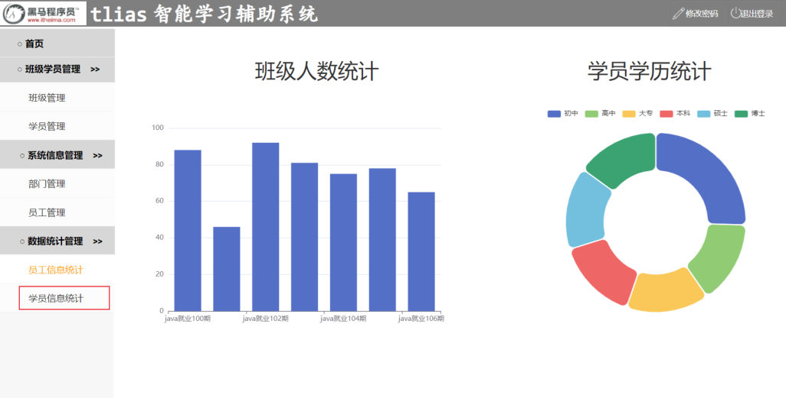
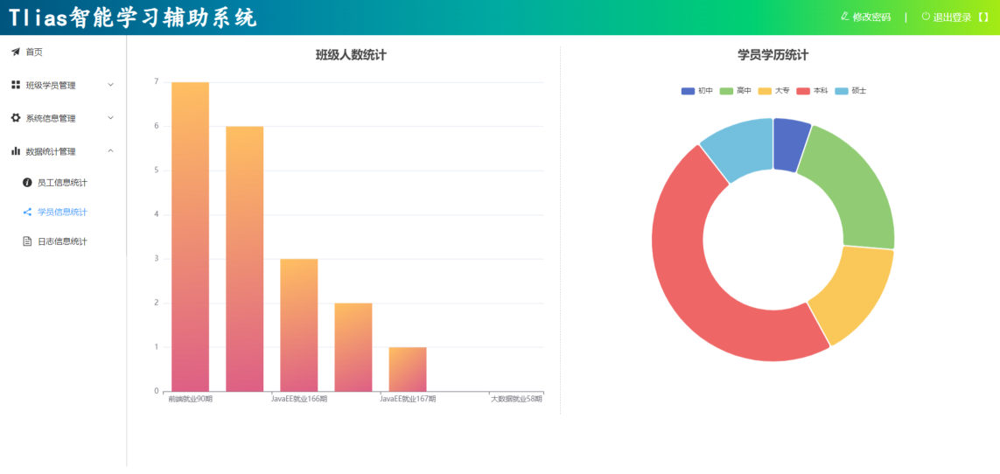

第 10 章的 [77 篇](/posts/编程学习/javaweb学习笔记/77-员工信息统计/)用两个统计接口给首页的图表喂过数据。这一章（第 11 章）是**项目实战章**：不再讲新知识点，而是把"班级管理 + 学员管理 + 数据统计"三大块**严格按接口文档**从头做一遍，并和前端页面**联调**。本章的三篇笔记按这三块分工——78 篇做班级管理、79 篇做学员管理，本篇（80）收尾，做其中的**数据统计**：班级人数统计（柱状图）与学员学历统计（环形图）。

## 本章在做什么（PPT 第 1-6 页）

第 11 章的 PPT 一共 7 页（最后一页空白）、**没有技术讲解**，前 6 页全是"作战命令"：第 1 页标题（Web后端开发·项目实战），第 2-3 页列需求，第 4 页给最终效果，第 5 页"暂停视频，完成所有实战需求"，第 6 页讲实战说明（以小组为单位、完成后上台演示自己的实现思路和踩过的 Bug）。

PPT 第 3 页把需求列成三块：

> 班级管理：班级列表查询、删除班级、添加班级、修改班级。
> 学员管理：学员列表查询、删除学员、添加学员、修改学员、违纪处理。
> **数据统计：班级人数统计、学员学历统计。**
> 注意：所有的功能全部严格，根据接口文档进行开发，并进行前后端联调。

"数据统计"这一块就是本篇的内容。它和前面两块不同：班级管理、学员管理都是对一张表的**增删改查**，数据统计则是**只读的统计查询**——把库里散落的行"数"成前端图表要的形状。第 10 章的员工统计已经练过一遍同样的套路，这次换个表再走一遍，差别主要在 SQL 上：

| 编号 | 功能块 | 关键点 |
| --- | --- | --- |
| 78 | 班级管理 | 六个 CRUD 接口 + 删除班级前的业务校验 |
| 79 | 学员管理 | 条件分页、批量删除、违纪处理 |
| **80（本篇）** | **数据统计** | **两个统计接口：班级人数（`clazzList` + `dataList`）、学员学历（`{name, value}` 列表）** |

两条统计接口都在接口文档的"报表统计"分组里，路径、请求方式、响应字段都定死了——实战的要求就是**照着文档写**，写完和前端页面联调（打开统计页面，看两张图画出来的数字对不对）。先认识一下它们：

| 接口 | 请求方式 | 接口描述 | 响应 `data` 的形状 |
| --- | --- | --- | --- |
| `/report/studentCountData` | GET | 班级人数统计（喂柱状图） | 对象：`clazzList`（班级列表）+ `dataList`（人数列表），**下标一一对应** |
| `/report/studentDegreeData` | GET | 学员学历统计（喂环形图） | 列表：每项 `{name, value}`（学历名 + 人数） |

两条都是 **GET**（只是把统计结果读出来）、都**不带请求参数**，统一挂在 `/report` 前缀下——和第 10 章员工统计的 `ReportController` 是同一个类，本篇往它里面接着加方法就行。


*图：PPT 第 2 页配的"员工信息统计"页面原型——左边是"班级人数统计"柱状图（横轴是班级名称、纵轴是人数），右边是"学员学历统计"环形图（图例按学历铺开）。这两张图就是本篇两个接口的"甲方"：柱状图要的是一列班级名 + 一列人数，环形图要的是"学历名 + 人数"成对的数据*

## 班级人数统计：前端要的数据结构

柱状图有**两根轴**：x 轴是一个个班级（分类），y 轴是每个班的人数（数值）。所以后端最省事的给法是**两个数组**，和 77 篇职位统计的"两个数组"思路一模一样：

```json
{
  "code": 1,
  "msg": "success",
  "data": {
    "clazzList": ["JavaEE就业163期","前端就业90期","JavaEE就业167期","JavaEE就业165期","JavaEE就业166期","大数据就业58期"],
    "dataList": [6, 3, 2, 0, 0, 0]
  }
}
```

（上面的值来自**本机实测**，数据是本机的 6 个班级 / 18 名学员，下一节细讲。）

**下标一一对应**是这份数据的灵魂：`clazzList[0]` 是"JavaEE就业163期"，`dataList[0]` 就是它的 6 人；`clazzList[2]` 是"JavaEE就业167期"，`dataList[2]` 就是 2 人……以此类推。前端画图时 `clazzList` 当 x 轴、`dataList` 当柱子高度，位置天然对齐。

接口文档给这层响应定的字段（和上面的 JSON 对得上）：

| 参数名 | 类型 | 是否必须 | 备注 |
| --- | --- | --- | --- |
| `data.clazzList` | string[] | 必须 | 班级列表 |
| `data.dataList` | integer[] | 必须 | 班级人数列表 |

装这两个数组的封装类叫 `ClazzCountOption`（课程工程）：

```java
/**
 * 班级人数统计
 */
@Data
@NoArgsConstructor
@AllArgsConstructor
public class ClazzCountOption {
    private List clazzList; //职位列表
    private List dataList; //人数列表
}
```

> [!NOTE]
> **课程代码里的一处小笔误**：`clazzList` 那行的注释写的还是"职位列表"——这是从第 10 章的 `JobOption` 复制过来忘了改，实际装的是**班级名称**。字段名和注解都是对的，不影响运行；自己写的时候把这个注释改成"班级列表"更清楚。
>
> 另外注意 `@AllArgsConstructor`（全参构造）必须在：Service 里那句 `new ClazzCountOption(clazzList, dataList)` 就靠它，类上少一个注解这一步直接编译不过。

## 班级人数统计：三层怎么分工

和员工统计那边完全同构——Controller 收请求、Service 拆数组、Mapper 执行 SQL：

| 层 | 干什么 |
| --- | --- |
| **Controller** | 接收请求 → 调 Service → 用 `Result` 包住响应 |
| **Service** | 调 Mapper 拿统计结果（`List<Map>`）→ 拆成 `clazzList`、`dataList` 两个 List → 装进 `ClazzCountOption` |
| **Mapper** | 执行统计 SQL，一行结果装进一个 Map |

Controller（加在 `ReportController` 里）：

```java
    /**
     * 班级人数统计
     */
    @GetMapping("/studentCountData")
    public Result getStudentCountData(){
        log.info("班级人数统计");
        ClazzCountOption clazzCountOption = reportService.getStudentCountData();
        return Result.success(clazzCountOption);
    }
```

Service 接口声明与实现：

```java
    /**
     * 统计班级人数
     */
    ClazzCountOption getStudentCountData();
```

```java
    @Override
    public ClazzCountOption getStudentCountData() {
        List<Map<String, Object>> countList = studentMapper.getStudentCount();
        if(!CollectionUtils.isEmpty(countList)){
            // 把每一行的 cname 抽成一列
            List<Object> clazzList = countList.stream().map(map -> {
                return map.get("cname");
            }).toList();

            // 把每一行的 scount 抽成一列
            List<Object> dataList = countList.stream().map(map -> {
                return map.get("scount");
            }).toList();

            return new ClazzCountOption(clazzList, dataList);
        }
        return null;
    }
```

这段和第 10 章职位统计的做法一致：Mapper 查回来的是"**一行一个 Map**"（比如 `{cname=JavaEE就业163期, scount=6}`），而前端要的是两列并排的数组，所以用 stream 分别把 `cname`、`scount` 抽出来——两列是从**同一批行**里拆的，下标必然对齐。`CollectionUtils.isEmpty(...)` 是 Spring 提供的判空工具（空列表就返回 `null`，省得 `new` 一个空壳对象）。

数据访问层的两个方法都写在 `StudentMapper` 里，班级人数这条用的是 `@Select` 注解 SQL：

```java
    /**
     * 统计班级人数
     */
    @Select("select c.name cname , count(s.id) scount from clazz c  left join student s on s.clazz_id = c.id group by c.name order by count(s.id) desc ")
    List<Map<String,Object>> getStudentCount();
```

```sql
select c.name cname, count(s.id) scount
from clazz c left join student s on s.clazz_id = c.id
group by c.name
order by count(s.id) desc
```

逐句拆开看：

| SQL 片段 | 作用 |
| --- | --- |
| `select c.name cname` | 取班级名称，起别名 `cname`（Map 的键就是它） |
| `count(s.id) scount` | 数这个班有多少学员，别名 `scount` |
| `from clazz c` | **以班级表为主**——一行数据从"一个班级"出发（`c` 是 `clazz` 的别名） |
| `left join student s on s.clazz_id = c.id` | 左外连接学员表：**每个班级都保留一行**，能对上的学员接在后面；没学员的班级，学员一侧全是 `null` 也照样保留 |
| `group by c.name` | 按班级分组，一个班一行（班级名称在建表时有 `unique` 约束，一个名字只对应一个班；按 `c.id` 分组也一样） |
| `order by count(s.id) desc` | 按人数**从多到少**排——本机实测的顺序 6、3、2、0、0、0 就是它排出来的 |

> [!IMPORTANT]
> **"以班级表为主"是这条 SQL 的灵魂**，三件事都靠它：
>
> 1. **0 人的班级会照样出现**。本机三个 0 人的班级（JavaEE就业165期 / 166期 / 大数据就业58期）在结果里有自己的一行、人数是 0——因为它们的班级行被 `left join` 保住了。如果写成"以学员表为主"（`student left join clazz`），这三个班会**整个消失**；要是写成普通的内连接（`join`），甚至连班级都凑不满 6 个。
> 2. **班级表里不存在的学员不计入任何一组**。本机 `student` 表 18 人里有 **7 人的 `clazz_id = 2`**，而 `clazz` 表里**根本没有 id=2 的班级**（课程数据本身如此）——这 7 个人找不到能接上的班级行，被连接条件挡在结果之外。所以**不能用"18 名学员"去对班级人数之和**：本机 6+3+2+0+0+0 = **11**，11 + 7 = 18 才对得上。
> 3. **人数要用 `count(s.id)`，不能图省事写 `count(*)`**。0 人的班级在左连接后也会留下一行（学员列全是 `null`），`count(*)` 数的是"结果集的行数"，会把这一行算成 1 人——于是"0 人的班级"在图上会显示成 1 人；`count(s.id)` 只数**非 null 的学员 id**，正确得到 0。
>
> 顺带一句：排序值相同时（那三个 0 人的班级）SQL 并不保证它们的先后顺序，别在自己的代码里去依赖"165 一定排在 166 前面"。

## 班级人数统计：本机实测

> [!TIP]
> **本机实测**（`tlias` 库，本机 MySQL 9.0.1；连接信息就是课程工程 `application.yml` 里那一套——`localhost:3306`、库名 `tlias`、用户名 `root`，课程示例密码是 `1234`，**动手时把 `password` 换成你自己 MySQL 的密码**）：

```text
# 班级人数统计  GET /report/studentCountData
{"code":1,"msg":"success","data":{
  "clazzList":["JavaEE就业163期","前端就业90期","JavaEE就业167期","JavaEE就业165期","JavaEE就业166期","大数据就业58期"],
  "dataList":[6,3,2,0,0,0]}}
```

拿本机数据对一遍（`clazz` 表 6 个班、`student` 表 18 人）：

| 下标 | `clazzList` | `dataList` | 本机情况 |
| --- | --- | --- | --- |
| 0 | JavaEE就业163期 | 6 | id=1，下面 6 名学员（clazz_id=1） |
| 1 | 前端就业90期 | 3 | id=4，下面 3 名学员（clazz_id=4） |
| 2 | JavaEE就业167期 | 2 | id=8，下面 2 名学员（clazz_id=8） |
| 3 | JavaEE就业165期 | 0 | id=5，没有学员——**0 人也出现在结果里** |
| 4 | JavaEE就业166期 | 0 | id=6，没有学员 |
| 5 | 大数据就业58期 | 0 | id=7，没有学员 |

- 前三个班按人数从多到少排在最前（`order by count(s.id) desc` 的效果）；167 期（2 人）排在 165、166 期（0 人）前面，正是 2 > 0 的结果，跟班级 id 的大小无关；
- 6 个班级**一个不少**：这说明主表是班级表（0 人的班级也在）；
- 18 − 11 = 7，正好是 `clazz_id=2` 那 7 名学员——他们没进结果，就是上面"以班级表为主"第 2 条说的情况。

## 学员学历统计：响应与三层

环形图不画坐标轴，它画的是"一圈扇区"：每块扇区要有**名字**（显示在图例上）和**数值**（决定扇区大小）。所以这次的 `data` 是一个**对象数组**，每项一对 `name` / `value`——和 77 篇性别统计的 `[{name, value}]` 是同一种形状（前端画环形图的配置可以照着搬）：

```json
{
  "code": 1,
  "msg": "success",
  "data": [
    {"name": "初中", "value": 1},
    {"name": "高中", "value": 4},
    {"name": "大专", "value": 3},
    {"name": "本科", "value": 8},
    {"name": "硕士", "value": 2}
  ]
}
```

（同样来自**本机实测**，合计 1+4+3+8+2 = 18，正好是学员总数。）

接口文档的字段约定：

| 参数名 | 类型 | 备注 |
| --- | --- | --- |
| `data[].name` | string | 学历名称 |
| `data[].value` | integer | 人数 |

三层代码一起看（课程工程）：

```java
    /**
     * 统计学员的学历信息
     */
    @GetMapping("/studentDegreeData")
    public Result getStudentDegreeData(){
        log.info("统计学员的学历信息");
        List<Map> dataList = reportService.getStudentDegreeData();
        return Result.success(dataList);
    }
```

```java
    @Override
    public List<Map> getStudentDegreeData() {
        return studentMapper.countStudentDegreeData();   // 查出来就是前端要的形状，直接返回
    }
```

```java
    /**
     * 统计学员学历
     */
    @MapKey("name")
    List<Map> countStudentDegreeData();
```

```xml
<!--学员学历统计-->
<select id="countStudentDegreeData" resultType="java.util.Map">
    select
        (case degree
            when 1 then '初中'
            when 2 then '高中'
            when 3 then '大专'
            when 4 then '本科'
            when 5 then '硕士'
            when 6 then '博士'
            else '其他' end)  name,
        count(*) value
    from student group by degree
    order by degree
</select>
```

和班级人数统计对比着看，这条链路**短了一截**：SQL 查出来的"一行一个 Map"（键就是 `name`、`value`）**已经就是前端要的形状**，所以 Service 里直接 `return`，不需要再 stream 拆一遍。为什么这次不用拆？因为环形图的每项本来就自带名字和数值，一条 SQL 行对应图上一块扇区，中间不用变形。

SQL 逐句拆：

| SQL 片段 | 作用 |
| --- | --- |
| `(case degree when 1 then '初中' ... else '其他' end) name` | 把 `degree` 的数字**翻成中文学历**（`student.degree`：1 初中、2 高中、3 大专、4 本科、5 硕士、6 博士），不在 1~6 里的（含 `null`）统一落进"其他"；这一列别名就叫 `name` |
| `count(*) value` | 每个学历有多少人，别名 `value`——两个别名正是前端要的键名 |
| `from student group by degree` | 按学历分组，一个学历一行；**这里不用连表**，统计的是学员自己的属性 |
| `order by degree` | 按**学历编号**排（1 → 6），所以结果是"初中、高中、大专、本科、硕士"的自然顺序——注意这次是**按学历排**，不是像班级人数那样按人数排 |

两个细节：

- 这里的 `case` 用的是**等值匹配**语法（`case degree when 1 then ...`，把要比较的 `degree` 提到 `case` 后面）——因为每个分支比的都是"等于某个编号"；`else '其他'` 留着兜底，万一 `degree` 是 `null` 或超出 1~6，不至于翻译成 `null`；
- 映射里写了"**博士**"，但本机数据里没有博士学员（学历最高到硕士），所以实测响应里也没有"博士"这一项——数据统计只画"查得到的数据"，库里没有的档位不会凭空出现（PPT 第 2 页那张设计稿的图例把"博士"也画上了，真机上它得等真有博士学员才会亮）。

> [!NOTE]
> **`@MapKey("name")` 是干什么的**：`countStudentDegreeData` 的返回类型是 `List<Map>`（一份统计没有对应的实体类，用 Map 装最省事），一行结果一个 Map，键就是 SQL 里的列别名。方法上的 `@MapKey("name")` 是"返回类型为 Map"时指定用哪一列当键用的注解；真正决定结果形状的是返回类型——**一行一个 Map、多行装进 List**，照 77 篇的结论理解即可。

## 学员学历统计：本机实测

> [!TIP]
> **本机实测**（同一套连接信息：`tlias` 库、`root`，课程示例密码 `1234`，动手时换成你自己的）：

```text
# 学员学历统计  GET /report/studentDegreeData
{"code":1,"msg":"success","data":[
  {"name":"初中","value":1},{"name":"高中","value":4},{"name":"大专","value":3},
  {"name":"本科","value":8},{"name":"硕士","value":2}]}
```

对照本机学员数据：初中 1、高中 4、大专 3、本科 8、硕士 2，**合计 18 = `student` 表 18 条**。这里有个很好的自检习惯：**把各组的数字加起来和总条数对一对**——

- 学历统计：18 = 18，**一个学员都没漏**。因为每个学员都有 `degree`（含 `null` 也会归到"其他"组），按学历分组是"全员覆盖"的；
- 班级人数统计：11 ≠ 18，**差的那 7 人**正是 `clazz_id=2`（班级表里不存在的班级）的学员。这不是 Bug，是"以班级表为主"的必然结果——统计口径本来就不一样。

## 和 ECharts 对接（PPT 第 4 页的最终效果）

两个接口的响应是给前端 ECharts 画图用的：柱状图吃"两个数组"、环形图吃"对象数组"。前端大致这样用（伪代码，能看出两个 `data` 各自怎么落到图上就行）：

```js
// ① 班级人数统计：clazzList 当横轴分类，dataList 当柱子高度
option = {
  xAxis: { type: 'category', data: res.data.clazzList },
  yAxis: { type: 'value' },
  series: [{ type: 'bar', data: res.data.dataList }]
};

// ② 学员学历统计：每一项自带 name（图例）和 value（扇区大小），整个数组直接交给系列
option = {
  series: [{ type: 'pie', radius: ['45%', '70%'], data: res.data }]
};
```

这就是"为什么两个接口的 `data` 形状不同"的答案：**图需要什么形状，后端就返回什么形状**。柱状图的分类轴和数值轴是两组并列的数据 → 两个数组；环形图的每一块是"名字 + 值"的配对 → 对象数组。前端拿到 `res.data` 基本不用加工，直接塞进配置。


*图：PPT 第 4 页的最终效果——左边"班级人数统计"柱状图（横轴班级名称、纵轴人数、按人数从多到少排列，0 人的班级在横轴上也有位置、只是柱子高度为 0），右边"学员学历统计"环形图（图例依次是初中、高中、大专、本科、硕士，扇区大小对应各学历人数）。联调时打开这个页面，把图上数字和接口响应逐个对一遍即可*

**前后端联调**是实战章的重头戏：后端两个接口做完，前端页面调通、两张图的数字和数据库对得上，这一块才算"完"。具体做法：先单独发接口（Apifox/浏览器）确认 JSON 没问题，再打开统计页面看渲染；如果图是空的，多半是字段名对不上（比如把 `clazzList` 写成了 `classList`）或接口路径/前缀写错。

## 小结

| 问题 | 答案 |
| --- | --- |
| 数据统计这块的两个接口？ | `GET /report/studentCountData`（班级人数，喂柱状图）、`GET /report/studentDegreeData`（学员学历，喂环形图）；都是 GET、无参数、挂在 `/report` 下 |
| 班级人数统计的响应结构？ | `data` 是 `ClazzCountOption`：`clazzList`（班级名数组）+ `dataList`（人数数组），**下标一一对应** |
| 学历统计的响应结构？ | `data` 是列表，每项 `{name, value}`（学历名 + 人数）——环形图一项一块扇区 |
| 班级人数统计的 SQL 要点？ | `from clazz c left join student s on s.clazz_id = c.id`（以班级表为主）→ `count(s.id) scount`（0 人班级得 0）→ `group by c.name` → `order by count(s.id) desc` |
| 为什么有的学员不计入？ | 本机 7 人的 `clazz_id=2` 在 `clazz` 表中不存在（课程数据如此），以班级表为主的连接里没有他们；班级人数之和 11，和学员总数 18 差这 7 人 |
| 0 人的班级为什么会出现？ | 主表是班级表、左连接保留每个班级行；人数用 `count(s.id)` 而不是 `count(*)`（后者会把 0 人班算成 1） |
| 学历统计的 SQL 要点？ | `case degree when 1 then '初中' ... else '其他' end` 起别名 `name`、`count(*) value`、`group by degree`、`order by degree`（按学历编号排，不是按人数） |
| Service 各干了什么？ | 班级人数：把"一行一个 Map"用 stream 拆成两个 List、`new ClazzCountOption(...)`；学历统计：SQL 结果已是目标形状，**直接返回** |
| 两个 `data` 形状为什么不同？ | 柱状图要"分类 + 数值"两组数据 → 两个数组；环形图要"名字 + 值"配对 → 对象数组；前端 ECharts 拿到即用 |
| 本机实测结果？ | 班级人数：`clazzList` 6 个班 / `dataList` `[6,3,2,0,0,0]`（合计 11）；学历：`[初中1,高中4,大专3,本科8,硕士2]`（合计 18） |

## 相关

- [上一篇：项目实战-学员管理](/posts/编程学习/javaweb学习笔记/79-项目实战-学员管理/)
- [下一篇：登录功能](/posts/编程学习/javaweb学习笔记/81-登录功能/)

## 练习题

### 一、知识回顾（读完直接做下面的实践题）

1. **两个统计接口**：`GET /report/studentCountData`（班级人数统计，喂柱状图）、`GET /report/studentDegreeData`（学员学历统计，喂环形图）；都是 **GET、无请求参数**，挂在 `/report` 前缀下（和第 10 章员工统计共用一个 `ReportController`）
2. **班级人数统计的响应结构**：`data` 是封装类 `ClazzCountOption`，里面**两个数组**——`clazzList`（班级名称）与 `dataList`（人数）；两个数组**下标一一对应**（`clazzList[0]`"JavaEE就业163期" ↔ `dataList[0]` 6）
3. **学历统计的响应结构**：`data` 是列表，**每项 `{name, value}`**（`name` 是学历文字、`value` 是人数）；环形图的图例取 `name`、扇区大小取 `value`
4. **班级人数 SQL 的写法**：`from clazz c left join student s on s.clazz_id = c.id`（**以班级表为主**）→ `count(s.id) scount` → `group by c.name` → `order by count(s.id) desc`；结果一行一个 Map（键 `cname`、`scount`）
5. **"以班级表为主"的后果**：0 人的班级**也会出现**（班级行被左连接保住，人数为 0）；班级表里查不到的班级下的学员**不计入任何一组**（本机 `clazz_id=2` 的 7 人就属于这种情况）
6. **人数为什么用 `count(s.id)`**：左连接下 0 人班级也有一行（学员列全 `null`），`count(*)` 会把这一行数成 1 人；`count(s.id)` 只数非 `null` 的学员 id，才能得到 0
7. **Service 的组装**：班级人数统计把"一行一个 Map"的列表用 stream 分别抽出 `cname`、`scount` 两列，装进 `new ClazzCountOption(clazzList, dataList)`（靠 Lombok 的 `@AllArgsConstructor`），空结果用 `CollectionUtils.isEmpty(...)` 判一下
8. **学历 SQL 的写法**：`case degree when 1 then '初中' when 2 then '高中' … else '其他' end` 起别名 `name`、`count(*) value`、`group by degree`、`order by degree`——**按学历编号排序**（初中→硕士），不是按人数；这条 SQL 不连表
9. **两段自检数字（本机实测）**：班级人数 `[6,3,2,0,0,0]`（合计 11，差的 7 人 = `clazz_id=2` 的学员）；学历 `[初中1,高中4,大专3,本科8,硕士2]`（合计 18 = 学员总数）
10. **ECharts 对接**：柱状图 `xAxis.data = clazzList`、`series[0].data = dataList`；环形图 `series[0].data = data`（对象数组直接交给系列）——后端的 `data` 形状就是按图的需要定的

### 二、裸写题

- [ ] **2-1 写出"班级人数统计"的 SQL**
  需求：统计每个班级各有多少学员，结果一行给出"班级名称 + 该班人数"两列（别名分别叫 `cname`、`scount`，Java 那边靠这两个名字取值）。有两条硬要求：
  ① **班上一个学员也没有的班级也要出现在结果里**（人数显示 0）；
  ② **班级表里不存在的班级，它下面的学员不计入**（本机 `student` 表里有 7 名学员的 `clazz_id = 2`，而 `clazz` 表里没有 id=2 的班级）。
  结果按人数**从多到少**排列。写完回答：这 7 名学员会不会出现在结果里？六个班的人数相加应该是多少？
  （SQL 写在练习文件 `test_80_统计SQL.sql` 的题目2-1。）

  > [!TIP]- 提示（先自己想，实在想不出再点开）
  > **一级 · 思路**：结果要"一个班一行、人数一列"——先想清楚哪张表当主表（能保证"一个班一行"的只有班级表），再把学员接上去数人数；"没学员的班也要在"要求"接不上也保留班级行"
  > **二级 · 方法**：`from clazz c left join student s on s.clazz_id = c.id`；数人数用 `count(s.id)`（**别用 `count(*)`**）；分组 `group by c.name`；排序 `order by count(s.id) desc`
  > **三级 · 骨架**：`select c.name ____, count(____) ____ from clazz c left join student s on ____ group by ____ order by ____ desc`

  > [!TIP]- 参考答案（做完再点开）
  > ```sql
  > select c.name cname, count(s.id) scount
  > from clazz c left join student s on s.clazz_id = c.id
  > group by c.name
  > order by count(s.id) desc
  > ```
  > （课程工程把它写成一行 `@Select` 注解，两种写法等价。）回答：**不会出现**——以班级表为主、左连接学员表，接不上的学员行不会进入结果；六个班相加是 6+3+2+0+0+0 = **11**，11 + 7 = 18 才对得上学员总数。
  > 检查点：① 主表必须是 `clazz`（写成 `student left join clazz` 的话三个 0 人班级会消失）；② 人数列必须是 `count(s.id)`（写 `count(*)` 的话 0 人班变 1 人）；③ 两个别名 `cname`/`scount` 要和 Java 里取值的键一致。

- [ ] **2-2 班级人数统计的三层实现（Java 部分）**
  需求（SQL 见题目2-1）：接口 `GET /report/studentCountData`，响应 `data` 是 `{clazzList, dataList}` 两个一一对应的数组。请完成：
  ① 写封装类 `ClazzCountOption`（两个 `List` 属性 + 让 Service 能 `new` 出来的 Lombok 注解）；
  ② 写 Service 实现（Mapper 已经给你 `List<Map<String, Object>>`，每行是 `{cname=..., scount=...}`，把它拆成两个 List 再装进封装类）；
  ③ 写 Controller 方法（请求方式、路径、返回值都用 `Result` 包起来）。
  （练习文件 `test_80_数据统计.java` 的题目2-2 里给了写作区。）

  > [!TIP]- 提示（先自己想，实在想不出再点开）
  > **一级 · 思路**：和第 10 章员工职位统计是同一套路——Mappper 给"一行一个 Map"的列表，Service 负责"拆列"，Controller 只负责收请求/调 Service/包 `Result`
  > **二级 · 方法**：类上 `@Data` + `@NoArgsConstructor` + `@AllArgsConstructor`；`countList.stream().map(map -> map.get("cname")).toList()` 与同法取 `"scount"`；`new ClazzCountOption(clazzList, dataList)`；`@GetMapping("/studentCountData")`
  > **三级 · 骨架**：`class ClazzCountOption { private List ____; private List ____; }`；`List<Object> clazzList = countList.stream().map(m -> m.get("____")).toList();`；`return new ClazzCountOption(____, ____);`；`@GetMapping("/____") public Result ____(){ ... return Result.success(____); }`

  > [!TIP]- 参考答案（做完再点开）
  > ① 封装类（与课程工程一致）：
  > ```java
  > @Data
  > @NoArgsConstructor
  > @AllArgsConstructor
  > public class ClazzCountOption {
  >     private List clazzList; //班级列表
  >     private List dataList;  //人数列表
  > }
  > ```
  > ② Service 实现：
  > ```java
  > @Override
  > public ClazzCountOption getStudentCountData() {
  >     List<Map<String, Object>> countList = studentMapper.getStudentCount();
  >     if (!CollectionUtils.isEmpty(countList)) {
  >         List<Object> clazzList = countList.stream().map(map -> {
  >             return map.get("cname");
  >         }).toList();
  >         List<Object> dataList = countList.stream().map(map -> {
  >             return map.get("scount");
  >         }).toList();
  >         return new ClazzCountOption(clazzList, dataList);
  >     }
  >     return null;
  > }
  > ```
  > ③ Controller：
  > ```java
  > @GetMapping("/studentCountData")
  > public Result getStudentCountData(){
  >     log.info("班级人数统计");
  >     ClazzCountOption clazzCountOption = reportService.getStudentCountData();
  >     return Result.success(clazzCountOption);
  > }
  > ```
  > 检查点：① `@AllArgsConstructor` 少了 `new ClazzCountOption(clazzList, dataList)` 编译不过；② 两个 List 是从**同一个** `countList` 里拆的，下标天然对齐；③ Mapper 方法返回 `List<Map<String, Object>>`（一行一个 Map）。

- [ ] **2-3 学员学历统计（SQL + 三层）**
  需求：环形图要的数据是**一个列表**，每项形如 `{"name":"初中","value":1}`。数据库里 `student.degree` 是数字：1 初中、2 高中、3 大专、4 本科、5 硕士、6 博士，不在 1~6 里的（含没填的）统一归"其他"。请完成：
  ① 一条 SQL：把学历数字翻成中文（别名叫 `name`）、数出每个学历的人数（别名叫 `value`）、按学历分组，结果**按学历从低到高**排（初中在最前）；
  ② 数据访问层的方法签名（返回类型是什么？）；
  ③ Service 方法——这条 SQL 查出来的结果，是不是已经就是前端要的形状了？还需要再加工吗？
  ④ Controller 方法（请求方式、路径）。
  （SQL 写在练习文件 `test_80_统计SQL.sql` 的题目2-3，Java 部分写在 `test_80_数据统计.java` 的题目2-3。）

  > [!TIP]- 提示（先自己想，实在想不出再点开）
  > **一级 · 思路**：翻译 + 计数都在 SQL 里做——多分支翻译一列、数人数一列，再按学历分组；排序按学历编号，才能得到"初中→硕士"的顺序；Java 侧拿到的已经是目标形状
  > **二级 · 方法**：`(case degree when 1 then '初中' ... else '其他' end) name`（等值匹配写法）；`count(*) value`；`from student group by degree`；`order by degree`；Java 侧返回类型 `List<Map>`，Service 直接 `return studentMapper.countStudentDegreeData();`
  > **三级 · 骨架**：`select (case degree when 1 then '____' ... else '____' end) ____, count(*) ____ from student group by ____ order by ____`；`@MapKey("____") List<Map> countStudentDegreeData();`；`@GetMapping("/____") public Result ____(){ ... }`

  > [!TIP]- 参考答案（做完再点开）
  > ① SQL（课程工程的 `StudentMapper.xml`）：
  > ```xml
  > <select id="countStudentDegreeData" resultType="java.util.Map">
  >     select
  >         (case degree
  >             when 1 then '初中'
  >             when 2 then '高中'
  >             when 3 then '大专'
  >             when 4 then '本科'
  >             when 5 then '硕士'
  >             when 6 then '博士'
  >             else '其他' end)  name,
  >         count(*) value
  >     from student group by degree
  >     order by degree
  > </select>
  > ```
  > ② `@MapKey("name")` + `List<Map> countStudentDegreeData();`——返回类型是 `List<Map>`（一行一个 Map，键 `name`/`value`）。
  > ③ Service：
  > ```java
  > @Override
  > public List<Map> getStudentDegreeData() {
  >     return studentMapper.countStudentDegreeData();   // 查出来就是前端要的形状，直接返回
  > }
  > ```
  > ④ Controller：
  > ```java
  > @GetMapping("/studentDegreeData")
  > public Result getStudentDegreeData(){
  >     log.info("统计学员的学历信息");
  >     List<Map> dataList = reportService.getStudentDegreeData();
  >     return Result.success(dataList);
  > }
  > ```
  > 回答要点：**不需要再加工**。SQL 查出来每行就是 `{name=初中, value=1}` 这样的 Map，一行对应环形图的一块扇区，Service 直接返回即可（对比题目2-2：那边前端要的是两组并列数组，所以必须拆）。本机实测的响应是 `[{"name":"初中","value":1},{"name":"高中","value":4},{"name":"大专","value":3},{"name":"本科","value":8},{"name":"硕士","value":2}]`，合计 18。

- [ ] **2-4 读懂两段响应，把数据交给 ECharts，并核对数字**
  下面两段是同一台机器上的真实响应（学员 18 名、班级 6 个）：
  ```text
  ① {"code":1,"msg":"success","data":{
       "clazzList":["JavaEE就业163期","前端就业90期","JavaEE就业167期","JavaEE就业165期","JavaEE就业166期","大数据就业58期"],
       "dataList":[6,3,2,0,0,0]}}
  ② {"code":1,"msg":"success","data":[
       {"name":"初中","value":1},{"name":"高中","value":4},{"name":"大专","value":3},
       {"name":"本科","value":8},{"name":"硕士","value":2}]}
  ```
  请回答并写出配置片段：
  ① 两段响应分别来自哪个接口？哪个喂柱状图、哪个喂环形图？
  ② 分别写出把 `data` 交给 ECharts 的配置片段（柱状图用哪两个字段、环形图怎么用）；
  ③ 核对数字：①里各项相加是 11，而学员一共 18 名，差的 7 人是怎么回事？②里各项相加是 18，为什么这里一个不差？
  ④ ①里哪几个班级的人数是 0？它们为什么没被统计掉？
  （练习文件 `test_80_数据统计.java` 的题目2-4 里给了写作区。）

  > [!TIP]- 提示（先自己想，实在想不出再点开）
  > **一级 · 思路**：看 `data` 的形状认接口——对象里两个数组的必是班级人数（柱状图），对象数组的必是学历统计（环形图）；对数字要想到"统计口径"：一份是按班级表数人（会漏），一份是按学员自己的学历数（不漏）
  > **二级 · 方法**：柱状图 `xAxis: { data: res.data.clazzList }` + `series: [{ type: 'bar', data: res.data.dataList }]`；环形图 `series: [{ type: 'pie', data: res.data }]`；7 人 = `clazz_id=2`（班级表里没有这个班）；0 人班级 = JavaEE就业165期、JavaEE就业166期、大数据就业58期
  > **三级 · 骨架**：`此接口是 GET /report/____`；`xAxis: { data: res.data.____ }, series: [{ type: '____', data: res.data.____ }]`；`series: [{ type: '____', data: ____ }]`

  > [!TIP]- 参考答案（做完再点开）
  > ① 第一段来自 `GET /report/studentCountData`（班级人数统计，喂柱状图）；第二段来自 `GET /report/studentDegreeData`（学员学历统计，喂环形图）。两条都是 GET、无参数。
  > ② 配置片段：
  > ```js
  > // 柱状图
  > xAxis: { type: 'category', data: res.data.clazzList },
  > series: [{ type: 'bar', data: res.data.dataList }]
  >
  > // 环形图（整个 data 数组就是系列数据，每项自带 name/value）
  > series: [{ type: 'pie', data: res.data }]
  > ```
  > ③ 11 与 18 差的 7 名学员，`clazz_id = 2`——而 `clazz` 表里没有 id=2 的班级。班级人数统计是"以班级表为主"数的：一行数据从班级出发，接不上班级的学员没有落脚点，自然不进结果（这是统计口径，不是漏查）。学历统计数是**学员自己**的属性（按 `degree` 分组），每个学员都落进某一行，所以 1+4+3+8+2 = 18，与学员总数一致。
  > ④ 人数是 0 的是 JavaEE就业165期、JavaEE就业166期、大数据就业58期（对应 `clazz` 表 id=5、6、7，名下没有学员）。它们没被统计掉，是因为主表是班级表、左连接会保住每个班级行；人数列用 `count(s.id)` 只数非 `null` 的学员 id，所以显示 0（如果写 `count(*)` 就会变成 1）。

### 三、综合题

- [ ] **3-1 从头做完两个统计接口，并核对统计结果**
  这一题把本篇串起来：建封装类 → Controller → Service → Mapper（SQL）→ 启动验证 → 核对数字 → 前后端联调。
  1. 新建 `ClazzCountOption`：两个 `List` 属性（`clazzList`、`dataList`），类上标好 Lombok 三件套；
  2. 在 `ReportController` 里写两个 GET 方法：`/studentCountData` 返回 `Result.success(clazzCountOption)`，`/studentDegreeData` 返回 `Result.success(dataList)`（类上 `@RestController` + `@Slf4j` + `@RequestMapping("/report")`，注入 `ReportService`）；
  3. 写 `ReportService` 接口与 `ReportServiceImpl` 实现（`@Service`，注入 `StudentMapper`）：班级人数统计把"一行一个 Map"拆成两个 List 装进封装类；学历统计直接返回；
  4. 数据访问层写两个统计方法（SQL 见练习文件 `test_80_统计SQL.sql` 的综合题）：班级人数那条要**以班级表为主**、保证 0 人的班级也出现；学历那条要把 `degree` 翻成中文、别名 `name`/`value`；
  5. 启动应用，分别发 `GET http://localhost:8080/report/studentCountData` 与 `GET http://localhost:8080/report/studentDegreeData`，把两段响应抄到练习文件末尾；
  6. 核对三件事：① 班级人数各项相加是多少？和学员总数 18 差在哪里（提示：看 `clazz_id=2`）？② 学历各项相加是多少，和 18 对上了吗？③ 哪些班级的人数是 0，它们为什么没有消失？
  7. 前后端联调：打开统计页面，把柱状图的横轴班级、柱子高度和环形图的扇区、图例，与接口响应逐个对照；如果图出不来，先查字段名（`clazzList`/`dataList`/`name`/`value`）和接口路径有没有写错；
  8. 收尾：如果实验里动过班级或学员数据，把它恢复成 6 个班级 / 18 名学员。
  （练习文件 `test_80_数据统计.java` 与 `test_80_统计SQL.sql` 里按这几步给了写作区。）

  **涉及知识点**

  | 知识点 | 在这里的应用 |
  | --- | --- |
  | `left join` + 主表选择 | 第 4、6 步——"以班级表为主"决定 0 人班级是否出现、哪些学员不计入 |
  | `count(s.id)` 与 `count(*)` 的区别 | 第 4、6 步——0 人班级必须得到 0 而不是 1 |
  | `group by` + `order by` | 第 4 步——按班级/学历分组，班级按人数降序、学历按编号排序 |
  | `case ... when ... end` | 第 4 步——学历数字翻中文，`else '其他'` 兜底 |
  | stream 拆两个 List + 封装类 | 第 1、3 步——班级人数统计的两个数组 |
  | `Result.success(...)` 与 GET 无参接口 | 第 2、5 步——两个接口的响应都统一在 `Result` 里 |

  > [!TIP]- 提示（先自己想，实在想不出再点开）
  > **一级 · 思路**：三层各就各位——Controller 只收请求/调 Service/包 `Result`；Service 负责"拿统计结果 +（只有班级人数统计才需要）拆两个数组"；Mapper 只管 SQL。两条 SQL 的骨架分别是"以班级表为主左连学员表分组计数"和"`case` 翻学历 + 计数 + 按学历分组"
  > **二级 · 方法**：`@GetMapping("/studentCountData")` / `@GetMapping("/studentDegreeData")`；`from clazz c left join student s on s.clazz_id = c.id group by c.name order by count(s.id) desc`；`(case degree when 1 then '初中' ... else '其他' end) name, count(*) value from student group by degree order by degree`；`new ClazzCountOption(clazzList, dataList)`；发请求用 Apifox/Postman 或浏览器直接打开这两个地址
  > **三级 · 骨架**：`@GetMapping("/____") public Result ____(){ ... return Result.success(____); }`；`select c.name ____, count(____) ____ from clazz c left join student s on ____ group by ____ order by ____ desc`；`select (case degree when 1 then '____' ... else '____' end) ____, count(*) ____ from student group by ____ order by ____`

  > [!TIP]- 参考答案（做完再点开）
  > 1~3. 封装类、Controller、Service（课程工程）：
  >    ```java
  >    @Data
  >    @NoArgsConstructor
  >    @AllArgsConstructor
  >    public class ClazzCountOption {
  >        private List clazzList; //班级列表
  >        private List dataList;  //人数列表
  >    }
  >    ```
  >    ```java
  >    @Slf4j
  >    @RequestMapping("/report")
  >    @RestController
  >    public class ReportController {
  >
  >        @Autowired
  >        private ReportService reportService;
  >
  >        @GetMapping("/studentCountData")
  >        public Result getStudentCountData(){
  >            log.info("班级人数统计");
  >            ClazzCountOption clazzCountOption = reportService.getStudentCountData();
  >            return Result.success(clazzCountOption);
  >        }
  >
  >        @GetMapping("/studentDegreeData")
  >        public Result getStudentDegreeData(){
  >            log.info("统计学员的学历信息");
  >            List<Map> dataList = reportService.getStudentDegreeData();
  >            return Result.success(dataList);
  >        }
  >    }
  >    ```
  >    ```java
  >    @Service
  >    public class ReportServiceImpl implements ReportService {
  >
  >        @Autowired
  >        private StudentMapper studentMapper;
  >
  >        @Override
  >        public ClazzCountOption getStudentCountData() {
  >            List<Map<String, Object>> countList = studentMapper.getStudentCount();
  >            if (!CollectionUtils.isEmpty(countList)) {
  >                List<Object> clazzList = countList.stream().map(map -> {
  >                    return map.get("cname");
  >                }).toList();
  >                List<Object> dataList = countList.stream().map(map -> {
  >                    return map.get("scount");
  >                }).toList();
  >                return new ClazzCountOption(clazzList, dataList);
  >            }
  >            return null;
  >        }
  >
  >        @Override
  >        public List<Map> getStudentDegreeData() {
  >            return studentMapper.countStudentDegreeData();
  >        }
  >    }
  >    ```
  > 4. 两条 SQL 与 **本机实测**响应：
  >    ```sql
  >    -- 班级人数统计（课程工程写成 @Select 注解）
  >    select c.name cname, count(s.id) scount
  >    from clazz c left join student s on s.clazz_id = c.id
  >    group by c.name
  >    order by count(s.id) desc
  >
  >    -- 学员学历统计（课程工程写在 StudentMapper.xml）
  >    select
  >        (case degree
  >            when 1 then '初中'
  >            when 2 then '高中'
  >            when 3 then '大专'
  >            when 4 then '本科'
  >            when 5 then '硕士'
  >            when 6 then '博士'
  >            else '其他' end)  name,
  >        count(*) value
  >    from student group by degree
  >    order by degree
  >    ```
  >    ```text
  >    GET /report/studentCountData
  >    {"code":1,"msg":"success","data":{
  >      "clazzList":["JavaEE就业163期","前端就业90期","JavaEE就业167期","JavaEE就业165期","JavaEE就业166期","大数据就业58期"],
  >      "dataList":[6,3,2,0,0,0]}}
  >
  >    GET /report/studentDegreeData
  >    {"code":1,"msg":"success","data":[
  >      {"name":"初中","value":1},{"name":"高中","value":4},{"name":"大专","value":3},
  >      {"name":"本科","value":8},{"name":"硕士","value":2}]}
  >    ```
  > 6. 核对：① 班级人数 6+3+2+0+0+0 = **11**，与学员总数 18 相差 **7**——这 7 人的 `clazz_id=2`，而 `clazz` 表里没有 id=2 的班级，以班级表为主的统计里没有他们；② 学历 1+4+3+8+2 = **18**，与学员总数完全一致（按学员自己的 `degree` 分组，全员覆盖）；③ 人数为 0 的是 JavaEE就业165期、JavaEE就业166期、大数据就业58期——主表是班级表、左连接保留每个班级行，人数列用 `count(s.id)` 只数非 `null` 的学员 id，所以是 0 而不是消失、也不是 1。
  > 7. 联调：接口响应与页面一致即通过；柱状图横轴顺序、环形图各扇区数值都应与实测响应相同（班级按人数从多到少，学历按初中→硕士）。
