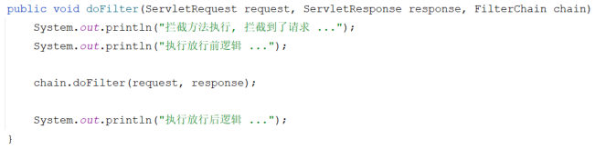

[82 篇](/posts/编程学习/javaweb学习笔记/82-会话技术与jwt令牌/)结尾，登录成功之后服务器用 `JwtUtils.generateToken` 生成了一个 JWT 令牌，前端拿到令牌后，之后每一次请求都会在请求头里带上它。新的问题马上来了：**这个令牌由谁来检查？** 如果让每个 Controller 方法自己写一遍"取令牌 → 校验令牌 → 不合格返回 401"，几十个接口就要抄几十遍。这一篇（PPT 第 29～42 页）讲登录校验里"**统一拦截**"的第一套方案——**过滤器 Filter**：一处配置，整条请求链都归它管。

## 从"生成令牌"到"校验令牌"（PPT 第 29～31 页）

PPT 第 29 页接着上一节的"令牌技术"图往下画了一步：第 28 页解决的是令牌的**生成**（登录成功后生成并返回），第 29 页解决的是令牌的**校验**——校验工作交给"统一拦截"，而统一拦截在 Java Web 里有两套实现：**Filter**（本篇）和 **Interceptor**（[84 篇](/posts/编程学习/javaweb学习笔记/84-拦截器interceptor/)）。

```text
浏览器 ──请求──▶ 统一拦截 ──▶ Login / Emp / Dept / Report ──▶ 响应
                     ▲
              校验 JWT 令牌（Filter 或 Interceptor）
```

第 30 页和第 31 页都是目录页：第 30 页把"登录校验"这一节的分支列全（会话技术 / JWT 令牌 / **过滤器 Filter** / **拦截器 Interceptor**），第 31 页又把 Filter 这一节细分成三块——

> **快速入门** → **令牌校验 Filter** → **详解（执行流程、拦截路径、过滤器链）**

本篇就按这三块走。

## 什么是过滤器（PPT 第 32 页）

PPT 给出的三句话：

1. **概念**：Filter 过滤器，是 **JavaWeb 三大组件**（Servlet、Filter、Listener）之一；
2. **作用**：过滤器可以把**对资源的请求拦截下来**，从而实现一些特殊的功能；
3. **场景**：过滤器一般完成一些**通用的操作**，比如：**登录校验**、**统一编码处理**、**敏感字符处理**等。

第 32 页那张图上画的是请求和响应都要从 Filter 里穿过：

```text
浏览器 ──请求──▶ Filter ──请求──▶ Login / Emp / Dept / Report
       ◀──响应──       ◀──响应──
```

关键在于"**通用**"两个字：登录校验这件事，凡是后台接口都要做，而且做的事一模一样——所以它不该散落在各个 Controller 里，而应该在**请求进入业务代码之前**被一个统一的东西处理掉。Filter 就是这个"关卡"。

> [!IMPORTANT]
> Filter 是 **Servlet 规范**里的东西（`jakarta.servlet` 包，[84 篇](/posts/编程学习/javaweb学习笔记/84-拦截器interceptor/)要讲的 Interceptor 则是 Spring MVC 自己提供的），所以它拦的是"请求"、位置在 **DispatcherServlet 之前**——请求还没进 Spring MVC，就已经被 Filter 经手了。

## Filter 快速入门（PPT 第 33～34 页）

PPT 第 33 页把入门拆成两半：**① 定义 Filter** + **② 引导类**。

### ① 定义 Filter：实现 Filter 接口

```java
@WebFilter(urlPatterns = "/*") // 拦截所有请求
@Slf4j
public class DemoFilter implements Filter {
    //初始化方法，web 服务器启动、创建 Filter 实例时调用，只调用一次
    @Override
    public void init(FilterConfig filterConfig) throws ServletException {
        log.info("init 初始化方法 ....");
    }

    //拦截到请求时调用，可以调用多次
    @Override
    public void doFilter(ServletRequest servletRequest, ServletResponse servletResponse, FilterChain filterChain) throws IOException, ServletException {
        log.info("拦截到了请求.... 放行前 .... ");
        //放行
        filterChain.doFilter(servletRequest, servletResponse);
        log.info("拦截到了请求.... 放行后 .... ");
    }

    //销毁方法，web 服务器关闭时调用，只调用一次
    @Override
    public void destroy() {
        log.info("destroy 销毁方法 ....");
    }
}
```

> [!NOTE]
> 课程工程里的 `DemoFilter` 把 `@WebFilter(urlPatterns = "/*")` 这一行**注释掉**了（它是教学用的空壳，默认启用的登录校验过滤器是 `TokenFilter`）；PPT 讲这一页时这一行是打开的。动手时把注释放开，就能在控制台看到 `init` / 放行前 / 放行后 / `destroy` 的输出。

### ② 引导类：开启 Servlet 组件扫描

```java
@ServletComponentScan // 开启 Servlet 组件（Servlet、Filter、Listener）的支持
@SpringBootApplication
public class TliasManagementApplication {
    public static void main(String[] args) {
        SpringApplication.run(TliasManagementApplication.class, args);
    }
}
```

`@WebFilter` 是 Servlet 规范里的注解，**Spring Boot 默认不认识它**——引导类上加了 `@ServletComponentScan`，Spring Boot 才会去扫描项目里的 `@WebFilter`（顺便也扫描 `@WebServlet`、`@WebListener`）并把过滤器注册进 web 容器。少了这个注解，过滤器就是一个普通的类，**永远不会被调用**。

### 三个方法分别在什么时候执行

| 方法 | 调用时机 | 调用次数 |
| --- | --- | --- |
| `init(FilterConfig)` | **web 服务器启动**、创建 Filter 实例时调用 | 只调用**一次** |
| `doFilter(request, response, chain)` | **拦截到请求时**调用（每个请求一次） | 可以调用**多次** |
| `destroy()` | **web 服务器关闭**时调用 | 只调用**一次** |

> [!IMPORTANT]
> **放行 = `chain.doFilter(request, response)`**。这一句是 Filter 最核心的一行代码：调用了它，请求才会继续往下走到目标资源；**如果过滤器中不执行放行操作，过滤器拦截到请求之后，就不会访问对应的资源**——请求就"断"在过滤器这里了（接口拿不到任何数据，浏览器看到的就是一个空响应；我们的登录校验正是靠这一点把没带令牌的请求挡住的）。
>
> 这也解释了 `doFilter` 里为什么会有"放行前"和"放行后"两段代码：放行前是先头部队（校验、记日志、改编码），放行后是收尾队（PPT 第 38～39 页会专门问这个问题）。

### 必答问答（PPT 第 34 页）

| PPT 的问题 | 答案 |
| --- | --- |
| Filter 的开发步骤？ | **定义**：定义一个类，实现 `Filter` 接口（重写 `init`、`doFilter`、`destroy`）；**配置**：类上加 `@WebFilter(urlPatterns = "/*")` 配置拦截路径，引导类上加 `@ServletComponentScan` 开启 Servlet 组件支持 |
| 有什么注意事项？ | **如果过滤器中不执行放行操作，过滤器拦截到请求之后，就不会访问对应的资源**——放行就是调用 `chain.doFilter(request, response)` |

## 登录校验 Filter（PPT 第 35～37 页）

第 35 页的目录页把 Filter 这一节的分段画出来（快速入门 / **令牌校验 Filter** / **详解**），第 36～37 页就是中间那块。

### 先想两个问题（PPT 第 36 页）

PPT 在画流程图之前先抛出两个问题，答案也写在同一页上：

| 问题 | 答案 |
| --- | --- |
| 所有的请求拦截到了之后，都需要校验令牌吗？ | **不需要**，有一个例外——**登录请求**（用户还没登录，当然没有令牌，但登录这件事本身必须能访问；不放开它就成了"要先登录才能登录"的死循环） |
| 拦截到请求后，什么情况下才可以放行、执行业务操作？ | **有令牌，且令牌校验通过（合法）**；否则都返回"未登录"的错误结果 |

### 令牌校验的六步流程（PPT 第 37 页）

第 37 页把上面两个问题的答案展开成了六步，左边是画出来的流程图，右边是文字步骤：

1. 获取请求 url；
2. 判断请求 url 中是否包含 `login`，如果包含，说明是登录操作，**放行**；
3. 获取请求头中的令牌（token）；
4. 判断令牌是否存在，如果**不存在**，**响应 401**；
5. 解析 token，如果**解析失败**，**响应 401**；
6. **放行**。

```text
请求 ──▶ 获取请求路径 ──▶ 路径里包含 login ？ ──是──▶ 放行
                          │否
                          ▼
                    获取请求头 token ──▶ 有 token ？ ──否──▶ 响应 401
                          │是
                          ▼
                    解析 token ──▶ 解析成功？ ──否──▶ 响应 401
                          │是
                          ▼
                        放行
```

流程图底下还给了两条对照用的真实路径：`http://localhost:8080/login`（走"包含 login → 放行"这条最左边的捷径）和 `http://localhost:8080/emps`（走完全部六步才放行）。

### 写成代码：TokenFilter

课程工程里的实现（`com.itheima.filter.TokenFilter`），每一步都和上面的六步一一对应：

```java
@Slf4j
@WebFilter(urlPatterns = "/*") // 拦截所有请求
public class TokenFilter implements Filter {
    @Override
    public void doFilter(ServletRequest servletRequest, ServletResponse servletResponse, FilterChain filterChain) throws IOException, ServletException {
        HttpServletRequest request = (HttpServletRequest) servletRequest;
        HttpServletResponse response = (HttpServletResponse) servletResponse;

        //1. 获取到请求路径
        String requestURI = request.getRequestURI(); // 例如 /login、/emps

        //2. 判断是否是登录请求，如果路径中包含 /login，说明是登录操作，放行
        if (requestURI.contains("/login")) {
            log.info("登录请求, 放行");
            filterChain.doFilter(request, response);
            return;
        }

        //3. 获取请求头中的 token
        String token = request.getHeader("token");

        //4. 判断 token 是否存在，如果不存在，说明用户没有登录，返回错误信息（响应 401 状态码）
        if (token == null || token.isEmpty()) {
            log.info("令牌为空, 响应401");
            response.setStatus(HttpServletResponse.SC_UNAUTHORIZED); // 401
            return;
        }

        //5. 如果 token 存在，校验令牌，如果校验失败 -> 返回错误信息（响应 401 状态码）
        try {
            JwtUtils.parseToken(token);
        } catch (Exception e) {
            log.info("令牌非法, 响应401");
            response.setStatus(HttpServletResponse.SC_UNAUTHORIZED); // 401
            return;
        }

        //6. 校验通过，放行
        log.info("令牌合法, 放行");
        filterChain.doFilter(request, response);
    }
}
```

几处细节值得单独记一下：

- **`request.getHeader("token")`**：令牌是前端放在**请求头**里带过来的，键名就是课程约定的 `token`（[82 篇](/posts/编程学习/javaweb学习笔记/82-会话技术与jwt令牌/)里登录成功后前端保存令牌、之后每次请求带上它）。
- **`HttpServletResponse.SC_UNAUTHORIZED`**：常量值就是 **401**，语义是"未认证"——没登录、令牌无效都归它。三个"拦下来"的分支都只写 `setStatus(401)` 然后 `return`——`return` 之后**没有调用 `chain.doFilter`**，就是"不放行"，接口不会被执行。
- **`JwtUtils.parseToken(token)` 放在 `try/catch` 里**：解析失败（签名对不上、令牌被篡改、令牌过期）会抛异常，[82 篇](/posts/编程学习/javaweb学习笔记/82-会话技术与jwt令牌/)讲过具体是 `SignatureException` / `ExpiredJwtException`——这里不关心是哪种，只要抛了异常就统一回 401。
- **第 2 步的路径判断**用的是 `contains("/login")` 而不是 `equals`：只要路径里包含 `login` 就放行，写法更宽松。另一种更"Spring"的思路是**不写这个 if**，改在注册的时候把 `/login` 排除掉——那正是 [84 篇](/posts/编程学习/javaweb学习笔记/84-拦截器interceptor/)拦截器方案的做法。

## 本机实测：四种请求的结果

工程里 `TokenFilter` 的 `@WebFilter(urlPatterns = "/*")` 处于启用状态（课程默认的 Filter 方案），分别发四种请求：

> [!TIP]
> **本机实测：Filter 方案下的四种请求**
>
> ```text
> 不带 token 访问 /emps       → HTTP 401    （被 Filter 拦下）
> 带合法 token 访问 /emps     → HTTP 200
> 篡改 token（末尾加字符）    → HTTP 401    （解析失败）
> POST /login                → 正常放行（路径里包含 "/login"）
> ```
>
> 服务端日志（`TokenFilter` 里的 `log.info`）能看到四种分支的输出：
>
> ```text
> 登录请求, 放行
> 令牌为空, 响应401
> 令牌非法, 响应401
> 令牌合法, 放行
> ```
>
> 逐条对号：
>
> - **不带 token → 401**：`request.getHeader("token")` 返回 `null`，在第 4 步被挡下（日志 `令牌为空, 响应401`）；
> - **带合法 token → 200**：第 5 步解析成功、第 6 步放行（日志 `令牌合法, 放行`），请求正常走进 Controller；
> - **篡改 token → 401**：令牌只要被动过一个字符，签名就对不上，`JwtUtils.parseToken` 抛异常 → 第 5 步拦下（日志 `令牌非法, 响应401`）——这就是 [82 篇](/posts/编程学习/javaweb学习笔记/82-会话技术与jwt令牌/)讲的"签名防篡改"在接口层面的效果；
> - **`POST /login` → 放行**：路径里包含 `/login`，第 2 步直接放行（日志 `登录请求, 放行`），所以登录接口永远访问得到，用户不会"登不进去"。
>
> （本机连的是 MySQL 的 `tlias` 库、用户名 `root`；`password` 换成你自己 MySQL 的密码。）

> [!IMPORTANT]
> **本机实测的另一个观察：连演示接口也被一起拦了**
>
> [82 篇](/posts/编程学习/javaweb学习笔记/82-会话技术与jwt令牌/)里用来看 Cookie / Session 的四个演示接口 `/c1`、`/c2`、`/s1`、`/s2`，跟登录校验毫无关系，却同样被 `TokenFilter` 拦了下来——因为它的 `urlPatterns = "/*"`，范围内**所有**请求都得先过令牌这一关，不带令牌访问这些演示接口一样是 401。
>
> 这就是过滤器"一网打尽"的拦截范围：**配了什么范围，范围内的一切接口/资源都跑不掉**（哪怕它根本不需要校验）。这句话在 [84 篇](/posts/编程学习/javaweb学习笔记/84-拦截器interceptor/)讲 Filter 与 Interceptor 的区别时还会再用一次。

## Filter 执行流程（PPT 第 38～39 页）

第 38 页的目录页把"详解"拆成三块：**执行流程、拦截路径、过滤器链**。

第 39 页先问两个问题，再给答案：

| 问题 | 答案 |
| --- | --- |
| 放行后访问对应资源，**资源访问完成后，还会回到 Filter 中吗**？ | **会** |
| 如果回到 Filter 中，是**重新执行**还是**执行放行后的逻辑**呢？ | **执行放行后逻辑**（不是从头再来一遍） |

页面上把这一趟画成四步：**① 放行前 → ② 放行 → ③ 资源 → ④ 放行后**。PPT 用的演示代码长这样（也就是下面这张图）：

```java
@Override
public void doFilter(ServletRequest request, ServletResponse response, FilterChain chain) throws Exception {
    System.out.println("拦截方法执行，拦截到了请求 ...");
    System.out.println("执行放行前逻辑 ...");     // ① 放行前

    chain.doFilter(request, response);          // ② 放行：去访问目标资源

    System.out.println("执行放行后逻辑 ...");     // ③ 资源执行完 → ④ 回到这里执行放行后逻辑
}
```


*图：PPT 第 39 页"Filter 执行流程"的演示代码——`chain.doFilter(...)` 之前是放行前逻辑，之后那行是放行后逻辑，一行代码就把"放行还会回来"讲清楚了*

把请求想成"进一扇门、办完事再出来"：请求从门外进来时，先执行 `chain.doFilter(...)` **之前**的放行前逻辑；`chain.doFilter(...)` 这句就是"开门放行"，请求走到资源（Controller）里干活；资源干完、响应往回走时，**又回到同一个 `doFilter` 方法里 `chain.doFilter(...)` 的下一行**继续执行放行后逻辑。同一个 `doFilter` 方法在一次请求里被"经过"了两次——去一次、回一次，但**代码只执行了一遍**，回程执行的是放行后那半段。

> [!TIP]
> "放行后还会回来"这个特性非常实用：放行前记下开始时间、放行后算差值，就能统一统计每个接口的耗时；也可以在放行后统一给响应加个响应头。课程后面（登录校验）只用了放行"去"的那一趟，但知道"回程"存在，写代码时就不会被日志打印的先后顺序搞糊涂。

## Filter 的拦截路径（PPT 第 40 页）

第 40 页的表格——Filter 可以根据需求配置不同的拦截资源路径，值配在 `@WebFilter(urlPatterns = ...)` 里：

| 拦截路径 | urlPatterns 值 | 含义 |
| --- | --- | --- |
| 拦截具体路径 | `/login` | 只有访问 `/login` 路径时，才会被拦截 |
| 目录拦截 | `/emps/*` | 访问 `/emps` 下的所有资源，都会被拦截 |
| 拦截所有 | `/*` | 访问所有资源，都会被拦截 |

对照着理解课程的选择：

- 登录校验的 `TokenFilter` 配的是 **`/*`**——它要保护的是"整个后台系统"，而不是某一个模块（[81 篇](/posts/编程学习/javaweb学习笔记/81-登录功能/)联调时发现的问题正是"未登录也能访问部门、员工、报表"），所以必须一网打尽，只在代码里单独给登录请求开个口子；
- 用 `/emps/*` 就只能管住员工这一摊，`/depts`、报表接口全都"裸奔"；
- 用 `/login` 更是只管登录接口本身，等于没做校验。

## 过滤器链（PPT 第 41 页）

**介绍**：一个 web 应用中，可以配置多个过滤器，这多个过滤器就形成了一个**过滤器链**。

**顺序**：**注解配置的 Filter，优先级是按照过滤器类名（字符串）的自然排序。**

第 41 页画的是两个过滤器的链，请求和响应要穿过两层：

```text
请求 ──▶ Filter1 放行前 ──▶ Filter2 放行前 ──▶ 资源执行
                                                   │
响应 ◀── Filter1 放行后 ◀── Filter2 放行后 ◀────────┘
```

去程是 `Filter1 → Filter2 → ... → 资源`（谁排在前面谁先执行放行前逻辑），回程是反过来 `资源 → ... → Filter2 → Filter1`（越靠近资源的放行后逻辑越先执行）——和前面"执行流程"里讲的"放行还会回来"是同一个道理，只是套了两层。PPT 上给这七个步骤标了 ①～⑦。

课程工程里正好有三个 `Filter` 类可以拿来说明排序：`DemoFilter`、`TokenFilter`、`XyzFilter`（`DemoFilter` 与 `XyzFilter` 是演示用的空壳，工程里默认只打开了 `TokenFilter` 的 `@WebFilter`）。按**类名字符串的自然排序**是 `DemoFilter`（D）→ `TokenFilter`（T）→ `XyzFilter`（X）；如果三个都启用，请求就会先过 `DemoFilter`、再过 `TokenFilter`、最后过 `XyzFilter`，响应的回程顺序则正好相反。

> [!WARNING]
> 注意"注解配置"这个前提：用 `@WebFilter` 注册的过滤器**没有 `order` 这种属性**可以调优先级，只能靠类名排序（想精确控制顺序就得改用 `FilterRegistrationBean` 的方式注册，本课不涉及）。所以给过滤器起名时不要随便改——名字变了，它在链里的位置就可能变了。

## 必答问答（PPT 第 42 页）

| PPT 的问题 | 答案 |
| --- | --- |
| 过滤器的执行流程？ | **放行前 → 放行 → 资源 → 放行后**（资源执行完还会回到 Filter 执行放行后的逻辑） |
| 配置的过滤器的拦截路径 `/*` 与 `/emps/*` 分别代表什么意思？ | `/*`：表示**拦截所有**；`/emps/*`：表示**目录拦截**，拦截 `/emps` 下的**所有资源** |
| 什么是过滤器链？ | 项目中的**多个过滤器**就形成了一个过滤器链（注解配置的按**类名自然排序**决定先后） |

## 小结

| 问题 | 答案 |
| --- | --- |
| Filter 是什么？ | JavaWeb 三大组件（Servlet、Filter、Listener）之一，把对资源的请求拦截下来做通用操作（登录校验、统一编码、敏感字符处理） |
| 怎么定义、怎么让它生效？ | 类实现 `Filter` 接口（`init` / `doFilter` / `destroy`）；类上加 `@WebFilter(urlPatterns = "/*")`；引导类加 `@ServletComponentScan` |
| 三个方法的时机？ | `init`：服务器启动创建实例时（一次）；`doFilter`：每次拦截到请求时；`destroy`：服务器关闭时（一次） |
| 怎么放行？不放行会怎样？ | 放行 = **`chain.doFilter(request, response)`**；不调用放行，请求就不会访问目标资源（接口没响应） |
| 令牌校验的六步？ | 取路径 → 含 `login` 放行 → 取请求头 token → 没有 token 回 **401** → 解析失败回 401 → 通过后放行 |
| 执行流程？ | **放行前 → 放行 → 资源 → 放行后**（资源执行完会回到 Filter，执行的是放行后的逻辑，不是重新执行） |
| 拦截路径怎么写？ | `/login`（只拦这个路径）、`/emps/*`（目录拦截）、`/*`（拦截所有） |
| 过滤器链的顺序？ | 多个过滤器形成链；**注解配置的按过滤器类名的自然排序**（`DemoFilter → TokenFilter → XyzFilter`） |
| 本机实测的结果？ | 无 token → **401**；带合法 token → **200**；篡改 token → **401**；`POST /login` → 放行；连 `/c1`、`/c2` 这类演示接口也被 `/*` 拦住了 |

## 相关

- [上一篇：会话技术与JWT令牌](/posts/编程学习/javaweb学习笔记/82-会话技术与jwt令牌/)
- [下一篇：拦截器Interceptor](/posts/编程学习/javaweb学习笔记/84-拦截器interceptor/)

## 练习题

### 一、知识回顾（读完直接做下面的实践题）

1. **过滤器的定位**：Filter 是 **JavaWeb 三大组件**（Servlet、Filter、Listener）之一；作用是把对资源的请求**拦截**下来，实现一些特殊的功能
2. **过滤器的典型场景**：一般做**通用操作**——**登录校验**、**统一编码处理**、**敏感字符处理**等
3. **三个方法的调用时机**：`init`——web 服务器启动、创建 Filter 实例时调用，**只调用一次**；`doFilter`——**拦截到请求时**调用，**可以调用多次**；`destroy`——web 服务器关闭时调用，**只调用一次**
4. **快速入门两步**：**定义**——写一个类实现 `Filter` 接口（重写三个方法）；**配置**——类上加 `@WebFilter(urlPatterns = "/*")`，引导类上加 `@ServletComponentScan` 开启 Servlet 组件支持（少了它过滤器不会被扫描到）
5. **放行的写法**：`chain.doFilter(request, response)`；**如果过滤器中不执行放行操作，拦截到请求之后就不会访问对应的资源**
6. **执行流程**：**放行前 → 放行 → 资源 → 放行后**；资源执行完**会回到 Filter**，执行的是**放行后的逻辑**（不是重新执行一遍）
7. **令牌校验的六步**：① 取请求路径 → ② 路径里包含 `login` 就放行 → ③ 取请求头里的 token → ④ 没有 token **响应 401** → ⑤ `JwtUtils.parseToken` 解析失败 **响应 401** → ⑥ 校验通过放行
8. **拦截路径的三种写法**：`/login`（拦截具体路径）、`/emps/*`（目录拦截，`/emps` 下的所有资源）、`/*`（拦截所有）
9. **过滤器链**：一个应用里配置多个过滤器就形成过滤器链；**注解配置的 Filter 优先级按过滤器类名（字符串）的自然排序**（工程里 `DemoFilter` → `TokenFilter` → `XyzFilter`）
10. **本机实测**：不带 token 访问 `/emps` → **HTTP 401**；带合法 token → **200**；篡改 token → **401**；`POST /login` → 放行；另外 `/c1`、`/c2` 这类演示接口也被 `/*` 的过滤器拦住（"一网打尽"）

### 二、裸写题

- [ ] **2-1 写一个入门过滤器，看三个方法分别在什么时候被调用**
  需求：给工程加一个"什么都不做、只是记事"的过滤器：服务器启动时输出一行 `init 初始化方法 ....`；每当有请求进来，在**真正访问资源之前**输出一行、在**资源处理完之后**再输出一行；服务器关闭时输出一行 `destroy 销毁方法 ....`。要求它**拦截所有请求**，并且**不能挡住任何请求**（接口该照常返回数据）。
  （练习文件 `test_83_Filter快速入门.java` 的题目2-1 里给了写作区。）

  > [!TIP]- 提示（先自己想，实在想不出再点开）
  > **一级 · 思路**：一个类分三段——启动时一次、每次请求两次（去一趟、回一趟）、关闭时一次；"不能挡请求"意味着必须做"放行"这个动作
  > **二级 · 方法**：类实现 `Filter` 接口（要写 `init` / `doFilter` / `destroy`）；类上加 `@WebFilter(urlPatterns = "/*")`；引导类上加 `@ServletComponentScan`；放行是 `chain.doFilter(request, response)`
  > **三级 · 骨架**：
  > ```java
  > @____(urlPatterns = "/*")
  > public class DemoFilter implements ____ {
  >     public void init(____ filterConfig) throws ServletException { …… }
  >     public void doFilter(____ req, ____ resp, ____ chain) throws Exception {
  >         // 放行前逻辑
  >         ____.____(req, resp);     // 放行
  >         // 放行后逻辑
  >     }
  >     public void destroy() { …… }
  > }
  > ```

  > [!TIP]- 参考答案（做完再点开）
  > ```java
  > @WebFilter(urlPatterns = "/*") // 拦截所有请求
  > @Slf4j
  > public class DemoFilter implements Filter {
  >     //初始化方法，web 服务器启动、创建 Filter 实例时调用，只调用一次
  >     @Override
  >     public void init(FilterConfig filterConfig) throws ServletException {
  >         log.info("init 初始化方法 ....");
  >     }
  >
  >     //拦截到请求时调用，可以调用多次
  >     @Override
  >     public void doFilter(ServletRequest servletRequest, ServletResponse servletResponse, FilterChain filterChain) throws IOException, ServletException {
  >         log.info("拦截到了请求.... 放行前 .... ");
  >         //放行
  >         filterChain.doFilter(servletRequest, servletResponse);
  >         log.info("拦截到了请求.... 放行后 .... ");
  >     }
  >
  >     //销毁方法，web 服务器关闭时调用，只调用一次
  >     @Override
  >     public void destroy() {
  >         log.info("destroy 销毁方法 ....");
  >     }
  > }
  > ```
  > 引导类上别忘了：
  > ```java
  > @ServletComponentScan // 开启 Servlet 组件支持
  > @SpringBootApplication
  > public class TliasManagementApplication { …… }
  > ```
  > 自查：① 应用**启动时**打印一次 `init`（在这之前不会有别的输出）；② 每发一次请求，`放行前` 先打、`放行后` 后打，中间隔着 Controller 自己的日志——这个先后顺序正好证明了"资源执行完还会回到 Filter"；③ 关闭应用时打印一次 `destroy`；④ 接口的响应数据一切正常（说明放行成功了）。

- [ ] **2-2 写一个过滤器，把没带令牌的请求挡在外面**
  需求：后台接口（员工 `/emps`、部门 `/depts`、报表……）只有登录过的用户才能访问：请求头里带了合法令牌的，放过去执行；**没带令牌**、或者**令牌被改过（解析不通过）**的，直接返回 **401**，不要让后面的接口执行。另外，登录请求本身（路径里包含 `/login`）必须能正常访问。这个过滤器要管住**所有请求**。
  （练习文件 `test_83_登录校验Filter.java` 的题目2-2 里给了写作区。）

  > [!TIP]- 提示（先自己想，实在想不出再点开）
  > **一级 · 思路**：按"先认出登录请求直接放行 → 再从请求头取令牌 → 没令牌/令牌不合法就 401 → 合法才放行"这个顺序写六段逻辑
  > **二级 · 方法**：`request.getRequestURI()` 取请求路径（判断里用 `contains("/login")`）；`request.getHeader("token")` 取请求头里的令牌；401 用 `HttpServletResponse.SC_UNAUTHORIZED`；解析用工程里已有的 `JwtUtils.parseToken(token)`（解析失败会抛异常，要 `try/catch` 包住）；"拦下来"就是只 `return`、**不调用放行**；"放行"是 `chain.doFilter(request, response)`
  > **三级 · 骨架**：
  > ```java
  > //1. 获取请求路径 → String requestURI = request.____();
  > //2. 路径中包含 "login" → 放行 + return
  > //3. 获取请求头 token → String token = request.____("____");
  > //4. token 为空 → response.setStatus(____); return;
  > //5. try { ____.____(token); } catch (Exception e) { 401; return; }
  > //6. 放行
  > ```

  > [!TIP]- 参考答案（做完再点开）
  > ```java
  > @Slf4j
  > @WebFilter(urlPatterns = "/*") // 拦截所有请求
  > public class TokenFilter implements Filter {
  >     @Override
  >     public void doFilter(ServletRequest servletRequest, ServletResponse servletResponse, FilterChain filterChain) throws IOException, ServletException {
  >         HttpServletRequest request = (HttpServletRequest) servletRequest;
  >         HttpServletResponse response = (HttpServletResponse) servletResponse;
  >
  >         //1. 获取到请求路径
  >         String requestURI = request.getRequestURI(); // 例如 /login、/emps
  >
  >         //2. 判断是否是登录请求，如果路径中包含 /login，说明是登录操作，放行
  >         if (requestURI.contains("/login")) {
  >             log.info("登录请求, 放行");
  >             filterChain.doFilter(request, response);
  >             return;
  >         }
  >
  >         //3. 获取请求头中的 token
  >         String token = request.getHeader("token");
  >
  >         //4. 判断 token 是否存在，如果不存在，说明用户没有登录，返回 401
  >         if (token == null || token.isEmpty()) {
  >             log.info("令牌为空, 响应401");
  >             response.setStatus(HttpServletResponse.SC_UNAUTHORIZED); // 401
  >             return;
  >         }
  >
  >         //5. 如果 token 存在，校验令牌，如果校验失败 -> 返回 401
  >         try {
  >             JwtUtils.parseToken(token);
  >         } catch (Exception e) {
  >             log.info("令牌非法, 响应401");
  >             response.setStatus(HttpServletResponse.SC_UNAUTHORIZED); // 401
  >             return;
  >         }
  >
  >         //6. 校验通过，放行
  >         log.info("令牌合法, 放行");
  >         filterChain.doFilter(request, response);
  >     }
  > }
  > ```
  > 自查：① 两个"拦下"分支里都**没有** `chain.doFilter`——所以接口不会被调用；② 401 用常量 `SC_UNAUTHORIZED` 写，别记错成 `SC_FORBIDDEN`（那是 403，语义不同）；③ 本机实测的四种结果：无 token → **401**、带合法 token → **200**、篡改 token → **401**、`POST /login` → 放行；④ 注意 `@WebFilter` 配的是 `/*`，所以连 `/c1`、`/c2` 这种跟登录无关的演示接口也会被拦住——这正是"一网打尽"。

- [ ] **2-3 只拦一个目录，并说出"为什么登录校验的过滤器必须拦所有"**
  需求：先把上面这个过滤器改成"**只拦 `/emps` 目录下的所有资源**"（其他路径一律不管）；改完回答两个问题：① `/emps/*` 与 `/*` 分别是什么意思？② 如果登录校验的过滤器真的写成 `/emps/*`，系统会出什么问题？
  （练习文件 `test_83_登录校验Filter.java` 的题目2-3 里给了写作区。）

  > [!TIP]- 提示（先自己想，实在想不出再点开）
  > **一级 · 思路**：过滤器本身一个字都不用改，改的只是类上那个注解里的"拦截路径"值；第 ② 问从"拦截路径表的含义 + 系统里都有哪些接口"两头推
  > **二级 · 方法**：`@WebFilter(urlPatterns = "/emps/*")`；`/emps/*` 是**目录拦截**、`/*` 是**拦截所有**
  > **三级 · 骨架**：`@WebFilter(urlPatterns = "____")`；① `/emps/*` = 访问 `/emps` 下的____都会被拦截，`/*` = ____；② 因为 `/depts`、报表这些接口不在 `/emps` 下，____

  > [!TIP]- 参考答案（做完再点开）
  > 改动只有一行：
  > ```java
  > @WebFilter(urlPatterns = "/emps/*") // 只拦截 /emps 目录下的资源
  > ```
  > ① **`/emps/*`**：目录拦截——访问 `/emps` 下的**所有资源**都会被拦截（`/emps`、`/emps/1`、`/emps/list` 之类）；**`/*`**：拦截**所有**——访问所有资源都会被拦截（整个系统的任意请求）。
  > ② 如果登录校验的过滤器写成 `/emps/*`，**只有员工相关的接口被保护**，部门管理 `/depts`、报表等接口就"裸奔"了——未登录也能直接访问，[81 篇](/posts/编程学习/javaweb学习笔记/81-登录功能/)联调时发现的那个问题（未登录也能访问部门、员工、报表）只解决了一小半。登录校验要保护的是**整个后台系统**，所以课程用的是 `/*`。（顺便一提：写成 `/emps/*` 时登录接口确实也能访问——但那是"因为它不在 `/emps` 下而侥幸穿过"，不是有意放行，一旦把范围改大就会把登录接口一起挡住。）

- [ ] **2-4 说出过滤器链的执行顺序**
  需求：工程里有三个过滤器类，类名分别是 `DemoFilter`、`TokenFilter`、`XyzFilter`，它们都用注解配置成拦截所有请求，也没有做任何额外的排序设置。请回答：① 一个请求会按什么顺序经过它们？② "放行后"的输出顺序和"放行前"相比是正序还是反序？为什么？③ 如果希望 `XyzFilter` 最先执行，应该怎么改？
  （练习文件 `test_83_Filter快速入门.java` 的题目2-4 里给了写作区。）

  > [!TIP]- 提示（先自己想，实在想不出再点开）
  > **一级 · 思路**：注解配置的过滤器有一套固定的排序依据，这个依据跟"类名"本身有关，而不是代码里写的顺序；把过滤器链想成一叠"套娃"，请求是钻进去再钻出来
  > **二级 · 方法**：**注解配置的 Filter 优先级按照过滤器类名（字符串）的自然排序**；想让某个过滤器排前面，最直接的办法就是让它的类名排前面（改类名）
  > **三级 · 骨架**：① `____Filter` → `____Filter` → `____Filter`；② 放行后是____序，因为放行是"先进后出"；③ 把类名改成排序靠前的名字，比如把 `XyzFilter` 改成 `____Filter`

  > [!TIP]- 参考答案（做完再点开）
  > ① 按类名的**自然排序**：`DemoFilter`（D）→ `TokenFilter`（T）→ `XyzFilter`（X）。所以请求依次经过三者的**放行前逻辑**。（工程里默认只打开了 `TokenFilter` 的 `@WebFilter`，另外两个是演示空壳；把它们的注释放开，就能在控制台亲眼看到这个顺序。）
  > ② **反序**：放行后的输出顺序是 `XyzFilter` → `TokenFilter` → `DemoFilter`。因为每一层过滤器都是"放行 → 里面所有东西（包括更内层的过滤器和资源）干完 → 才继续执行放行后逻辑"，越靠近资源的过滤器越早走完放行前、也就越早开始放行后；整体是先进后出（套娃式）。
  > ③ 让 `XyzFilter` 的名字排到最前面即可，比如改名成 `AXyzFilter`（`A` < `D` < `T`）。这也说明了为什么不要随手动工程里过滤器的类名——名字动了，链里的位置就变了。

### 三、综合题

- [ ] **3-1 照着课程给 Tlias 加上登录校验过滤器，并把四种请求实测一遍**
  这一题把本节从头到尾走一遍，重点在"用状态码和日志把六步流程验证出来"。
  1. 新建过滤器类，按六步写好登录校验逻辑，"拦下"的分支只响应 401、不放行；
  2. 类上配置成拦截**所有**请求；引导类上确认已开启 Servlet 组件扫描；
  3. 启动工程，**不带** token 访问员工列表接口（`/emps`），记录 HTTP 状态码；
  4. 用登录接口拿到令牌（`POST /login`，请求体是 `{"username":"...","password":"..."}`），把响应里的 token 抄下来；
  5. 在请求头里带上这个令牌，再访问一次 `/emps`，记录状态码；
  6. 把令牌末尾随便改一个字符（篡改）后再访问一次，记录状态码；
  7. 访问登录接口本身，确认它没有被拦（能正常返回登录结果）；
  8. 去服务端日志里找出四种分支各自的输出（登录请求放行 / 令牌为空 / 令牌非法 / 令牌合法）；
  9. 收尾回答下面的两个问题。

  （练习文件 `test_83_登录校验Filter.java` 的"综合题"一段里按这 9 步给了写作区。）

  回答：① 第 6 步为什么会失败？（想一想解析令牌时到底在校验什么）② 如果把第 5 步的令牌换成一个"12 小时以前生成的"，结果会怎样、为什么？

  **涉及知识点**

  | 知识点 | 在这里的应用 |
  | --- | --- |
  | 过滤器概念与场景（PPT 32） | 第 1 步——为什么这件事要交给过滤器而不是写在 Controller 里 |
  | 三个方法与 `@WebFilter`、`@ServletComponentScan`（PPT 33～34） | 第 1、2 步——定义 + 让过滤器被扫描到 |
  | 放行的含义（PPT 33～34、39） | 第 1、3、5、6 步——`chain.doFilter` 调没调用，直接决定接口能不能执行 |
  | 令牌校验六步流程（PPT 36～37） | 第 1、4、5、6、7 步——登录放行、无令牌 401、解析失败 401 |
  | 拦截路径（PPT 40） | 第 2、7 步——`/*` 一网打尽，登录请求靠代码里的判断放行 |

  > [!TIP]- 提示（先自己想，实在想不出再点开）
  > **一级 · 思路**：先让"没令牌的 401、有令牌的 200"两条对照跑通，再动令牌做破坏性测试；日志里的四种分支就是流程六步的"打卡记录"
  > **二级 · 方法**：请求头键名 `token`；401 用 `HttpServletResponse.SC_UNAUTHORIZED`；解析用 `JwtUtils.parseToken(token)`（`try/catch` 捕获异常）；登录用 `POST /login` + JSON 请求体
  > **三级 · 骨架**：① 六步里的关键词——`getRequestURI()`、`contains("____")`、`getHeader("____")`、`setStatus(____)`、`____.parseToken(token)`、`chain.____(request, response)`；④ `POST http://localhost:8080/____`；⑤ 请求头 `____: <token>`；⑧ 四种日志：`登录请求, 放行` / `令牌为空, 响应401` / `令牌非法, 响应401` / `令牌合法, 放行`

  > [!TIP]- 参考答案（做完再点开）
  > 1. 过滤器代码见题目 2-2 的答案（六步流程），配置见题目 2-1 的答案（`@WebFilter(urlPatterns = "/*")` + 引导类 `@ServletComponentScan`）。
  > 2. 拦截所有请求：`@WebFilter(urlPatterns = "/*")`。
  > 3～7. **本机实测**的四种结果：
  >    ```text
  >    不带 token 访问 /emps       → HTTP 401
  >    带合法 token 访问 /emps     → HTTP 200
  >    篡改 token（末尾加字符）    → HTTP 401
  >    POST /login                → 正常放行（路径里包含 "/login"）
  >    ```
  > 8. **本机实测**的四条日志分支：`登录请求, 放行`、`令牌为空, 响应401`、`令牌非法, 响应401`、`令牌合法, 放行`——正好对应六步流程里的四个出口。
  > 9. 两个回答：
  >    ① 因为 JWT 的**签名**是服务端用秘钥对"头.载荷"算出来的，改掉令牌里任何一个字符，重新算出来的签名就和令牌里带的那个对不上；`JwtUtils.parseToken` 在校验签名时会直接抛异常，过滤器把它统一转成 401（[82 篇](/posts/编程学习/javaweb学习笔记/82-会话技术与jwt令牌/)讲过的 `SignatureException`）。这也正是"签名防篡改"的设计目的：客户端保存的令牌即使被改，也伪造不出合法的。
  >    ② 会**同样被拦下、返回 401**：课程里令牌的有效期是 **12 小时**，12 小时以前生成的令牌已经过期，解析时会抛 `ExpiredJwtException`（[82 篇](/posts/编程学习/javaweb学习笔记/82-会话技术与jwt令牌/)本机实测过这个报错），过滤器照样 catch 到异常 → 401。用户侧的表现就是"登录状态失效了、需要重新登录"。
