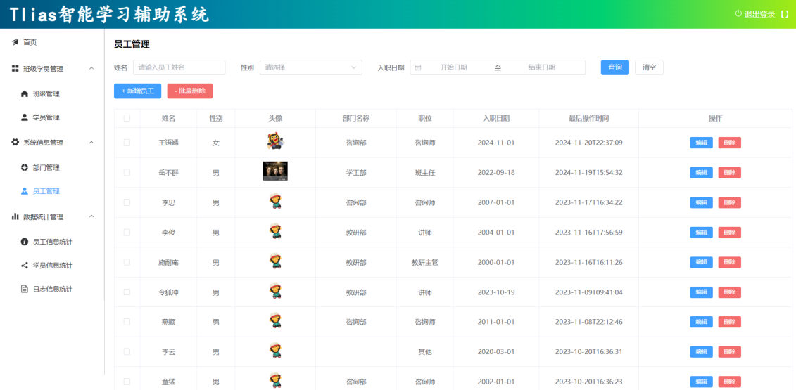

[83 篇](/posts/编程学习/javaweb学习笔记/83-过滤器filter/)用过滤器 Filter 把没带令牌的请求挡在了门外。这一篇（PPT 第 43～53 页）讲"统一拦截"的**第二套方案**——Spring 自己提供的**拦截器 Interceptor**：校验逻辑几乎一模一样，但换了一套写法（实现的是 Spring 的接口、靠配置类注册），而且能更精细地决定"拦哪些、不拦哪些"。最后把 Filter 与 Interceptor 摆在一起对比，并用一次本机实测修正 PPT 里那句容易读歪的话。

## 这一节的位置（PPT 第 43～44 页）

第 43 页是"登录校验"这一节的目录（会话技术 / JWT 令牌 / 过滤器 Filter / **拦截器 Interceptor**），第 44 页把拦截器这一节又拆成三块：

> **快速入门** → **令牌校验 Interceptor** → **详解**

结构和 [83 篇](/posts/编程学习/javaweb学习笔记/83-过滤器filter/)完全对称——因为两套方案要解决的问题是**同一个**（在请求到达业务代码之前统一校验令牌），所以本篇会把笔墨更多放在"写法上的差别"和"两者到底差在哪"。

## 什么是拦截器（PPT 第 45 页）

PPT 给出的定义：

> **概念**：是一种**动态拦截方法调用**的机制，类似于过滤器。**Spring 框架中提供的**，主要用来动态拦截**控制器方法**的执行。
>
> **作用**：拦截请求，在指定的方法调用前后，根据业务需要执行预先设定的代码。

和过滤器放在一起看，差别一眼就出来了：Filter 拦的是**请求**（Servlet 层面的东西，请求还没进 Spring MVC 就被它经手），Interceptor 拦的是**控制器方法**（Spring MVC 内部的东西，请求已经到了 Spring MVC、正要调用某个 Controller 方法时被它经手）。

```text
浏览器 ──请求──▶ Interceptor ──▶ Controller（Login / Emp / Dept / Report）
       ◀──响应──              ◀──
```

PPT 第 45 页图上画的正是"请求和响应都从 Interceptor 穿过、后面才是各个 Controller"。

## 拦截器快速入门（PPT 第 46～47 页）

PPT 第 46 页把入门拆成两半：**① 定义拦截器** + **② 注册拦截器**。

### ① 定义拦截器：实现 HandlerInterceptor 接口

```java
@Slf4j
@Component // 交给 Spring 管理——注册时才能把它注入到配置类里
public class DemoInterceptor implements HandlerInterceptor {
    //在目标资源方法运行之前运行 —— 返回值：true 放行，false 不放行
    @Override
    public boolean preHandle(HttpServletRequest request, HttpServletResponse response, Object handler) throws Exception {
        log.info("preHandle ....");
        return true;
    }

    //在目标资源方法运行之后运行
    @Override
    public void postHandle(HttpServletRequest request, HttpServletResponse response, Object handler, ModelAndView modelAndView) throws Exception {
        log.info("postHandle ....");
    }

    //视图渲染完毕后运行（最后执行）
    @Override
    public void afterCompletion(HttpServletRequest request, HttpServletResponse response, Object handler, Exception ex) throws Exception {
        log.info("afterCompletion ....");
    }
}
```

> [!NOTE]
> PPT 第 46 页上那段代码里，`postHandle` 里打印的字符串写成了 `"preHandle..."`——是页面上的一处笔误；课程工程 `DemoInterceptor.java` 里已经改成了正确的 `"postHandle ...."`，照抄时以工程代码为准。

### ② 注册拦截器：配置类实现 WebMvcConfigurer

```java
@Configuration
public class WebConfig implements WebMvcConfigurer {

    @Autowired
    private DemoInterceptor demoInterceptor; // 注入要注册的拦截器

    @Override
    public void addInterceptors(InterceptorRegistry registry) {
        registry.addInterceptor(demoInterceptor) // 注册拦截器
                .addPathPatterns("/**");         // 拦截所有请求
    }
}
```

> [!IMPORTANT]
> 拦截器和过滤器最大的写法差别就在"配置"这一步：
>
> - 过滤器靠一个**注解**（`@WebFilter`）+ 引导类开关（`@ServletComponentScan`）生效；
> - 拦截器靠一个**配置类**（`@Configuration` + 实现 `WebMvcConfigurer`），在 `addInterceptors` 方法里 `registry.addInterceptor(...)` 手写注册——所以它能配上 `addPathPatterns`（**要拦截哪些资源**）和 `excludePathPatterns`（**不需要拦截哪些资源**）两个方法，控制粒度更细。
>
> 课程工程里 `WebConfig` 的注册代码是**注释状态**（默认启用的是 [83 篇](/posts/编程学习/javaweb学习笔记/83-过滤器filter/)的 Filter 方案，注释里就是拦截器方案的注册代码），要做拦截器实验时把 `@WebFilter` 注释掉、把这段注册代码放开即可。

### 三个方法分别在什么时候执行

| 方法 | 执行时机 | 说明 |
| --- | --- | --- |
| `preHandle` | 目标资源方法**执行前** | 返回 **`true` 放行、`false` 不放行**——返回 `false` 时，Controller 方法不会执行，`postHandle` / `afterCompletion` 也不会执行 |
| `postHandle` | 目标资源方法**执行后** | 此时 Controller 已经跑完，但"视图"还没渲染 |
| `afterCompletion` | **视图渲染完毕后**执行，**最后执行** | 一次请求的收尾（清理资源、记录耗时等） |

> [!TIP]
> 这门课的项目是**前后端分离**的（Controller 返回 JSON、没有页面视图），所以 `postHandle` 执行完、"视图渲染"这一步没有实际内容，`afterCompletion` 紧接着就会执行。三者的顺序仍然是 `preHandle →（Controller 方法）→ postHandle → afterCompletion`。

### 必答问答（PPT 第 47 页）

| PPT 的问题 | 答案 |
| --- | --- |
| 拦截器 Interceptor 的使用步骤？ | **定义**：实现 `HandlerInterceptor` 接口，重写三个方法（`preHandle`、`postHandle`、`afterCompletion`）；**配置**：定义一个配置类实现 `WebMvcConfigurer` 接口，在 `addInterceptors` 里注册拦截器（`/**`） |

## 登录校验拦截器（PPT 第 48～49 页）

第 48 页的目录页把这一节的分段标出来（快速入门 / **令牌校验 Interceptor** / **详解**）；第 49 页给出的六步流程和第 37 页 Filter 的一模一样：

1. 获取请求 url；
2. 判断请求 url 中是否包含 `login`，如果包含，说明是登录操作，**放行**；
3. 获取请求头中的令牌（token）；
4. 判断令牌是否存在，如果**不存在**，**响应 401**；
5. 解析 token，如果**解析失败**，**响应 401**；
6. **放行**。

```text
请求 ──▶ 获取请求路径 ──▶ 路径里包含 login ？ ──是──▶ 放行
                          │否
                          ▼
                    获取请求头 token ──▶ 有 token ？ ──否──▶ 响应 401
                          │是
                          ▼
                    解析 token ──▶ 解析成功？ ──否──▶ 响应 401
                          │是
                          ▼
                        放行
```

流程一样，代码也几乎一样，写在 `preHandle` 里（课程工程 `com.itheima.interceptor.TokenInterceptor`）：

```java
@Slf4j
@Component
public class TokenInterceptor implements HandlerInterceptor {
    @Override
    public boolean preHandle(HttpServletRequest request, HttpServletResponse response, Object handler) throws Exception {
//        //1. 获取到请求路径
//        String requestURI = request.getRequestURI();
//
//        //2. 判断是否是登录请求——这一步改用注册时的 excludePathPatterns("/login") 实现
//        if (requestURI.contains("/login")) {
//            log.info("登录请求, 放行");
//            return true;
//        }

        //3. 获取请求头中的 token
        String token = request.getHeader("token");

        //4. 判断 token 是否存在，如果不存在，说明用户没有登录，返回 401
        if (token == null || token.isEmpty()) {
            log.info("令牌为空, 响应401");
            response.setStatus(HttpServletResponse.SC_UNAUTHORIZED); // 401
            return false; // 返回 false：不放行
        }

        //5. 如果 token 存在，校验令牌，如果校验失败 -> 返回 401
        try {
            JwtUtils.parseToken(token);
        } catch (Exception e) {
            log.info("令牌非法, 响应401");
            response.setStatus(HttpServletResponse.SC_UNAUTHORIZED); // 401
            return false; // 返回 false：不放行
        }

        //6. 校验通过，放行
        log.info("令牌合法, 放行");
        return true; // 返回 true：放行
    }
}
```

配套的注册代码（写在 `WebConfig` 里，课程工程中注释着）：

```java
@Autowired
private TokenInterceptor tokenInterceptor;

@Override
public void addInterceptors(InterceptorRegistry registry) {
    registry.addInterceptor(tokenInterceptor)
            .addPathPatterns("/**")          // 拦截所有请求
            .excludePathPatterns("/login");  // 不拦截登录请求
}
```

和 Filter 版对照，两个关键差别：

> [!IMPORTANT]
> **差别一：放行/拦截的表达方式不同。** 过滤器用"调不调用 `chain.doFilter(...)`"来表达（不调用就断在过滤器里）；拦截器统一用 `preHandle` 的**返回值**表达——`return true` 放行、`return false` 拦截（返回 `false` 时 Controller 方法根本不会被调用）。
>
> **差别二："登录请求例外"的实现方式不同。** Filter 版是在代码里判断 `requestURI.contains("/login")`；Interceptor 版把这行判断删掉（工程代码里注释着），改用注册时的 `excludePathPatterns("/login")`——把"例外名单"从代码搬到了配置里，要排除多条路径时只需要追加参数，不用写一串 `if`。

第 50 页的目录页把拦截器这一节的"**详解**"拆成两块：**拦截路径**（第 51 页）和**执行流程**（第 52 页）——本篇先用一次本机实测把校验效果钉死，再分别讲这两块。

## 本机实测：拦截器方案

把 `TokenFilter` 的 `@WebFilter` 注释掉、在 `WebConfig` 里注册 `TokenInterceptor`（`addPathPatterns("/**")` + `excludePathPatterns("/login")`），再发一遍 [83 篇](/posts/编程学习/javaweb学习笔记/83-过滤器filter/)里那几种请求：

> [!TIP]
> **本机实测：拦截器方案下的三种请求**
>
> ```text
> 不带 token 访问 /emps     → HTTP 401
> 带合法 token 访问 /emps   → HTTP 200
> POST /login               → 放行（excludePathPatterns 生效，能正常登录）
> ```
>
> 结果和 Filter 方案**完全一致**：没令牌 401、令牌合法 200；唯一的差别是 `/login` 这次不是靠代码里的路径判断放行的，而是它在注册时就被**排除**掉了。也就是说，两种方案都能把"登录校验"这件事办成，业务代码一个字都不用改——只是一个发生在 Spring MVC 之外、一个发生在 Spring MVC 之内。
>
> （本机连的是 MySQL 的 `tlias` 库、用户名 `root`；`password` 换成你自己 MySQL 的密码。）

## 拦截器的拦截路径（PPT 第 51 页）

PPT 第 51 页说，拦截器可以根据需求配置"**需要拦截哪些资源**"和"**不需要拦截哪些资源**"，路径的写法有四种：

| 拦截路径 | 含义 | 举例 |
| --- | --- | --- |
| `/*` | **一级**路径 | 能匹配 `/depts`、`/emps`、`/login`，**不能**匹配 `/depts/1` |
| `/**` | **任意级**路径 | 能匹配 `/depts`、`/depts/1`、`/depts/1/2` |
| `/depts/*` | `/depts` 下的**一级**路径 | 能匹配 `/depts/1`，**不能**匹配 `/depts/1/2`，也**不能**匹配 `/depts` |
| `/depts/**` | `/depts` 下的**任意级**路径 | 能匹配 `/depts`、`/depts/1`、`/depts/1/2`，不能匹配 `/emps/1` |

几个容易看错的点：

- **`*` 与 `**` 的区别就是"吃一段"还是"吃任意段"**：`/*` 只吃一级，`/**` 吃到底；所以 `/depts/*` 匹配 `/depts/1` 却匹配不了 `/depts/1/2`——多出来的层级它管不到。
- **`/depts/*` 连 `/depts` 本身都不匹配**（PPT 表格里专门写了这一点）：`*` 必须对应"一段路径"，而 `/depts` 后面已经没有段了。
- 课程注册用的是 **`/**`**（拦截所有请求），因为登录校验要保护的是系统里**所有**接口，只在 `excludePathPatterns` 里把 `/login` 单独排除。


*图：Tlias 系统的员工管理页面（右上角有"退出登录"）——后台这些模块（部门管理、员工管理……）的接口路径就是上表里的 `/depts`、`/emps`，登录校验要保护的就是它们*

## 执行流程，以及和过滤器的区别（PPT 第 52 页）

PPT 第 52 页把 Filter、Interceptor、Controller 三者在一次请求里的位置画在了一起：

```text
浏览器 ──请求──▶ Filter 放行前逻辑 ──▶ doFilter() 放行
        ──▶ 拦截器 preHandle ──▶ Controller 方法执行 ──▶ postHandle
        ──▶（视图渲染）afterCompletion
        ──▶ 回到 Filter 放行后逻辑 ──响应──▶ 浏览器
```

也就是说，**过滤器在最外层，拦截器在 Spring MVC 里面**：请求先过 Filter 的放行前逻辑、被 `doFilter()` 放行后才进入 Spring MVC；到了 Spring MVC，先执行拦截器 `preHandle`，通过后调用 Controller 方法，返回时走 `postHandle`、`afterCompletion`，最后再回到 Filter 执行放行后逻辑、把响应还给浏览器。

> [!TIP]
> 从这张图还能推断出一件事：**两套方案同时开启时，Filter 的判断在前**——如果 Filter 直接回了 401、根本没调用 `chain.doFilter`，请求压根进不了 Spring MVC，拦截器连"看到请求"的机会都没有（这也是 [83 篇](/posts/编程学习/javaweb学习笔记/83-过滤器filter/)里说的"断在过滤器里"的效果）。

PPT 同页给出的**两点区别**：

| 区别 | PPT 的说法 |
| --- | --- |
| **接口规范不同** | 过滤器需要实现 `Filter` 接口（Servlet 规范，`jakarta.servlet` 包），而拦截器需要实现 `HandlerInterceptor` 接口（Spring MVC，`org.springframework.web.servlet` 包） |
| **拦截范围不同** | 过滤器 Filter 会拦截**所有的资源**，而 Interceptor 只会拦截 **Spring 环境中的资源** |

第二条是本篇最需要"较真"的一句，因为照字面很容易读成"静态页面不会被拦截器拦"——本机实测的结果并不是这样：

> [!WARNING]
> **本机实测：静态资源也被拦截器拦到了**
>
> 在工程的 `src/main/resources/static/` 下放了一个 `test-page.html`，用上面那套拦截器（`/**` + 排除 `/login`）实测：
>
> ```text
> 不带 token 访问 /test-page.html  → HTTP 401     ← 静态页也被拦住了
> ```
>
> 原因：**Spring Boot 的静态资源不是"绕开 Spring MVC"直接由容器吐出去的**——它交给 Spring MVC 的 `ResourceHttpRequestHandler` 处理，所以照样要走 HandlerMapping（找不到 @RequestMapping 就落到这个资源处理器上）→ 一样经过拦截器。
>
> 所以 PPT 那句"只拦截 Spring 环境中的资源"的现实含义应该这样理解：**请求只要进了 DispatcherServlet，就会被拦截器拦到**（静态资源、接口都在内）；**真正拦不到的是"根本不进 DispatcherServlet 的请求"**——比如另一个 Servlet 自己映射的路径、由 web 容器直接处理的资源。
>
> 实际写代码时别指望"把页面/接口换个位置就能躲开拦截器"：只要它还是 Spring Boot 里被 Spring MVC 接管的资源，拦截器就拦得到；反过来，也正因为静态资源会被拦，拦截路径里的排除名单（`excludePathPatterns`）才需要认真写——比如把登录相关的接口、不需要登录的页面路径排除掉，否则用户可能连页面都打不开。

## 必答问答（PPT 第 53 页）

| PPT 的问题 | 答案 |
| --- | --- |
| 拦截器中的拦截路径 `/*` 与 `/**` 的区别是什么？ | `/*`：只能拦截**一级路径**，如 `/depts`、`/emps`；`/**`：拦截**任意级路径**，如 `/depts`、`/depts/1` |
| 过滤器与拦截器的区别？ | **接口规范不同**：过滤器实现 `Filter`（Servlet 规范），拦截器实现 `HandlerInterceptor`（Spring MVC）；**拦截范围不同**：过滤器拦所有资源，拦截器拦 Spring 环境中的资源——本机实测：只要请求进了 DispatcherServlet（包括静态资源）就会被拦，拦不到的是不进 DispatcherServlet 的请求 |

## 小结

| 问题 | 答案 |
| --- | --- |
| 拦截器是什么？ | Spring 提供的**动态拦截方法调用**的机制，类似过滤器；主要用来动态拦截**控制器方法的执行**（在方法调用前后执行预设代码） |
| 怎么定义拦截器？ | 实现 `HandlerInterceptor` 接口，重写 `preHandle` / `postHandle` / `afterCompletion`；加 `@Component` 交给 Spring 管理 |
| 怎么注册？ | 写一个配置类实现 `WebMvcConfigurer`，在 `addInterceptors(InterceptorRegistry registry)` 里 `registry.addInterceptor(...).addPathPatterns("/**")` |
| 三个方法的时机？ | `preHandle`：目标资源方法**执行前**（返回 `true` 放行、`false` 不放行）；`postHandle`：方法**执行后**；`afterCompletion`：**视图渲染完毕后**执行，**最后执行** |
| 放行怎么表达？ | 统一用 `preHandle` 的**返回值**——`return true` 放行、`return false` 拦截（返回 false 时 Controller 与后两个方法都不执行） |
| "登录请求例外"怎么写？ | 注册时 `addPathPatterns("/**")` + `excludePathPatterns("/login")`，不用在代码里判断路径 |
| 拦截路径怎么配？ | `/*` 一级路径；`/**` 任意级路径；`/depts/*` `/depts` 下的一级路径（不含 `/depts` 本身）；`/depts/**` `/depts` 下的任意级路径 |
| 与 Filter 的两点区别？ | **接口规范不同**（`Filter` vs `HandlerInterceptor`）；**拦截范围不同**（过滤器拦所有资源；拦截器拦 Spring 环境中的资源——实测：进 DispatcherServlet 的静态资源也会被拦） |
| 本机实测的结果？ | 无 token → **401**；带合法 token → **200**；`POST /login` → 放行（`excludePathPatterns` 生效）；`/test-page.html` 不带 token → **401**（静态资源也被拦） |

## 相关

- [上一篇：过滤器Filter](/posts/编程学习/javaweb学习笔记/83-过滤器filter/)
- [下一篇：AOP基础](/posts/编程学习/javaweb学习笔记/85-aop基础/)

## 练习题

### 一、知识回顾（读完直接做下面的实践题）

1. **拦截器的定位**：一种**动态拦截方法调用**的机制，类似于过滤器；**Spring 框架中提供的**，主要用来动态拦截**控制器方法**的执行
2. **拦截器的作用**：拦截请求，在指定的方法调用前后，根据业务需要执行预先设定的代码
3. **快速入门两步**：**定义**——实现 `HandlerInterceptor` 接口并重写三个方法；**注册**——写一个配置类实现 `WebMvcConfigurer`，在 `addInterceptors` 里注册
4. **三个方法的执行时机**：`preHandle`——目标资源方法**执行前**（返回 `true` 放行、`false` 不放行）；`postHandle`——目标资源方法**执行后**；`afterCompletion`——**视图渲染完毕后**执行，**最后执行**
5. **"放行/拦截"的表达**：拦截器统一用 `preHandle` 的**返回值**——`return true` 放行、`return false` 不放行（返回 `false` 时 Controller 方法和后面两个方法都不会执行）
6. **注册时的两个方法**：`addPathPatterns(...)` 配"**要拦截哪些资源**"、`excludePathPatterns(...)` 配"**不需要拦截哪些资源**"（课程的登录校验就是 `/**` + 排除 `/login`）
7. **拦截路径的四种写法**：`/*` 一级路径（`/depts`、`/emps`、`/login`，不含 `/depts/1`）；`/**` 任意级路径；`/depts/*` `/depts` 下的一级路径（`/depts/1`，不含 `/depts/1/2`，也不含 `/depts` 本身）；`/depts/**` `/depts` 下的任意级路径
8. **Filter 与 Interceptor 的两点区别**：**接口规范不同**（`Filter` vs `HandlerInterceptor`）；**拦截范围不同**（过滤器拦所有资源，拦截器拦 Spring 环境中的资源）
9. **拦截范围的实测修正**：拦截器方案下不带 token 访问 `resources/static/test-page.html` 同样返回 **HTTP 401**——静态资源由 Spring MVC 的 `ResourceHttpRequestHandler` 处理，照样过拦截器；真正拦不到的是**不进 DispatcherServlet 的请求**
10. **本机实测**：注册 `TokenInterceptor`（`/**` + 排除 `/login`）后——无 token 访问 `/emps` → **401**；带合法 token → **200**；`POST /login` → 放行（`excludePathPatterns` 生效）

### 二、裸写题

- [ ] **2-1 写一个入门拦截器，观察三个方法谁先谁后**
  需求：给工程加一个"记事"拦截器：Controller 方法执行**前**输出一行、Controller 方法执行**后**输出一行、整个请求彻底结束（最后收尾）时再输出一行。要求它**不拦任何请求**（接口都正常返回数据）；写完再把它注册成"拦截所有请求"。
  （练习文件 `test_84_注册拦截器.java` 的题目2-1 里给了写作区。）

  > [!TIP]- 提示（先自己想，实在想不出再点开）
  > **一级 · 思路**：分两段写——一段是拦截器本身（三个方法，一个管"放不放行"、两个管"前后记一笔"），一段是配置类把它注册进去
  > **二级 · 方法**：拦截器实现 `HandlerInterceptor`、加 `@Component`；配置类加 `@Configuration` 并实现 `WebMvcConfigurer`，在 `addInterceptors(InterceptorRegistry registry)` 里 `registry.addInterceptor(...).addPathPatterns("/**")`
  > **三级 · 骨架**：
  > ```java
  > @Component
  > public class DemoInterceptor implements ____ {
  >     public boolean ____(HttpServletRequest req, HttpServletResponse resp, Object handler) { return ____; }
  >     public void ____(HttpServletRequest req, HttpServletResponse resp, Object handler, ModelAndView mv) { …… }
  >     public void ____(HttpServletRequest req, HttpServletResponse resp, Object handler, Exception ex) { …… }
  > }
  >
  > @Configuration
  > public class WebConfig implements ____ {
  >     @Autowired private DemoInterceptor demoInterceptor;
  >     @Override public void ____(____ registry) {
  >         registry.____(demoInterceptor).____("/**");
  >     }
  > }
  > ```

  > [!TIP]- 参考答案（做完再点开）
  > ```java
  > @Slf4j
  > @Component
  > public class DemoInterceptor implements HandlerInterceptor {
  >     //在目标资源方法运行之前运行 —— 返回值：true 放行，false 不放行
  >     @Override
  >     public boolean preHandle(HttpServletRequest request, HttpServletResponse response, Object handler) throws Exception {
  >         log.info("preHandle ....");
  >         return true;
  >     }
  >
  >     //在目标资源方法运行之后运行
  >     @Override
  >     public void postHandle(HttpServletRequest request, HttpServletResponse response, Object handler, ModelAndView modelAndView) throws Exception {
  >         log.info("postHandle ....");
  >     }
  >
  >     //视图渲染完毕后运行（最后执行）
  >     @Override
  >     public void afterCompletion(HttpServletRequest request, HttpServletResponse response, Object handler, Exception ex) throws Exception {
  >         log.info("afterCompletion ....");
  >     }
  > }
  > ```
  > ```java
  > @Configuration
  > public class WebConfig implements WebMvcConfigurer {
  >     @Autowired
  >     private DemoInterceptor demoInterceptor;
  >
  >     @Override
  >     public void addInterceptors(InterceptorRegistry registry) {
  >         registry.addInterceptor(demoInterceptor).addPathPatterns("/**");
  >     }
  > }
  > ```
  > 自查：① 一次请求的日志顺序是 `preHandle` →（Controller 自己的日志）→ `postHandle` → `afterCompletion`，说明三个方法正好夹在 Controller 前后和请求收尾；② 把 `preHandle` 的 `return true` 改成 `return false`，接口就再也拿不到数据了，而且 `postHandle` / `afterCompletion` 都不会打印——这就是"不放行"；③ 拦截器类忘了加 `@Component` 时，配置类里的 `@Autowired` 会注入失败（启动直接报错），因为注册的对象得先由 Spring 管理。

- [ ] **2-2 把"没带令牌就拦下"的校验逻辑改成拦截器实现**
  需求：原来写在过滤器里的那套校验（没令牌、或令牌不合法 → 401；登录请求放行）改成用拦截器实现。要求：校验逻辑写在拦截器里；登录请求的"例外"通过**注册时排除**来实现（不要又在代码里判断路径里有没有 `login`）；拦截范围仍然是所有请求。
  （练习文件 `test_84_登录校验拦截器.java` 的题目2-2 里给了写作区。）

  > [!TIP]- 提示（先自己想，实在想不出再点开）
  > **一级 · 思路**：校验的六步和过滤器版本一样，变的只有两处——"不放行"不再用"不调用放行"，而是"返回一个布尔值"；登录例外不在代码里判路径，而是写进注册时的排除名单
  > **二级 · 方法**：`preHandle` 返回 `boolean`（`return true` 放行、`return false` 不放行）；类上加 `@Component`（配置类里要注入它）；401 用 `HttpServletResponse.SC_UNAUTHORIZED`；解析令牌用 `JwtUtils.parseToken(token)` 并用 `try/catch` 包住；注册时 `addPathPatterns("/**")` + `excludePathPatterns("/login")`
  > **三级 · 骨架**：
  > ```java
  > @Component
  > public class TokenInterceptor implements ____ {
  >     public boolean ____(HttpServletRequest request, HttpServletResponse response, Object handler) {
  >         String token = request.____("token");
  >         if (token == null || token.isEmpty()) { response.setStatus(____); return ____; }
  >         try { ____.____(token); } catch (Exception e) { response.setStatus(____); return ____; }
  >         return ____;
  >     }
  > }
  > // 注册：registry.addInterceptor(tokenInterceptor).addPathPatterns("____").excludePathPatterns("____");
  > ```

  > [!TIP]- 参考答案（做完再点开）
  > ```java
  > @Slf4j
  > @Component
  > public class TokenInterceptor implements HandlerInterceptor {
  >     @Override
  >     public boolean preHandle(HttpServletRequest request, HttpServletResponse response, Object handler) throws Exception {
  >         //1. 获取请求头中的 token
  >         String token = request.getHeader("token");
  >
  >         //2. 判断 token 是否存在，如果不存在，说明用户没有登录，返回 401
  >         if (token == null || token.isEmpty()) {
  >             log.info("令牌为空, 响应401");
  >             response.setStatus(HttpServletResponse.SC_UNAUTHORIZED); // 401
  >             return false; // 不放行
  >         }
  >
  >         //3. 如果 token 存在，校验令牌，如果校验失败 -> 返回 401
  >         try {
  >             JwtUtils.parseToken(token);
  >         } catch (Exception e) {
  >             log.info("令牌非法, 响应401");
  >             response.setStatus(HttpServletResponse.SC_UNAUTHORIZED); // 401
  >             return false; // 不放行
  >         }
  >
  >         //4. 校验通过，放行
  >         log.info("令牌合法, 放行");
  >         return true; // 放行
  >     }
  > }
  > ```
  > 注册（配置类里）：
  > ```java
  > @Configuration
  > public class WebConfig implements WebMvcConfigurer {
  >     @Autowired
  >     private TokenInterceptor tokenInterceptor;
  >
  >     @Override
  >     public void addInterceptors(InterceptorRegistry registry) {
  >         registry.addInterceptor(tokenInterceptor)
  >                 .addPathPatterns("/**")          // 拦截所有请求
  >                 .excludePathPatterns("/login");  // 不拦截登录请求
  >     }
  > }
  > ```
  > 自查：① 两个"拦下"分支都是 `return false`，通过时才是 `return true`；② 注册里必须有 `excludePathPatterns("/login")`，否则登录请求会被这个拦截器挡在门外、用户永远登不上（本机实测里 `/login` 能正常返回登录结果，就是这一行在起作用）；③ 本机实测的三种结果：无 token → **401**、带合法 token → **200**、`POST /login` → 放行；④ 和过滤器版本对照一下：拦截器版本的代码里已经**没有**判断请求路径那两步了。

- [ ] **2-3 判断四种路径写法各能匹配什么**
  需求：从 `/depts`、`/depts/1`、`/depts/1/2`、`/emps/1` 这几个路径里，分别挑出下面四种拦截路径**能匹配**和**不能匹配**的：① `/*` ② `/**` ③ `/depts/*` ④ `/depts/**`。写完再回答两个小问题：Ⅰ 想拦截 `/depts` 下面的**一级**路径怎么写？Ⅱ 想拦截 `/depts` 本身**和它下面的任意级**怎么写？
  （练习文件 `test_84_注册拦截器.java` 的题目2-3 里给了写作区。）

  > [!TIP]- 提示（先自己想，实在想不出再点开）
  > **一级 · 思路**：`*` 与 `**` 的区别就是"吃一段"还是"吃任意段"；前面带上具体目录，就表示"只在这个目录下"
  > **二级 · 方法**：`/*` 一级路径；`/**` 任意级路径；`/depts/*` 是 `/depts` 下的一级路径（`/depts` 本身不算）；`/depts/**` 是 `/depts` 下的任意级路径（包含 `/depts` 本身）
  > **三级 · 骨架**：① `/*` → 能匹配____，不能匹配____；② `/**` → ____；③ `/depts/*` → ____；④ `/depts/**` → ____；Ⅰ 用 `____`；Ⅱ 用 `____`

  > [!TIP]- 参考答案（做完再点开）
  > ① **`/*`**（一级路径）：能匹配 `/depts`；**不能**匹配 `/depts/1`、`/depts/1/2`、`/emps/1`。
  > ② **`/**`**（任意级路径）：`/depts`、`/depts/1`、`/depts/1/2`、`/emps/1` **都能匹配**（任意层级、任意路径）。
  > ③ **`/depts/*`**（`/depts` 下的一级路径）：能匹配 `/depts/1`；**不能**匹配 `/depts/1/2`（层级太深），也**不能**匹配 `/depts`（后面没跟段，`*` 顶不上）；`/emps/1` 更不在它的管辖范围内。
  > ④ **`/depts/**`**（`/depts` 下的任意级路径）：能匹配 `/depts`、`/depts/1`、`/depts/1/2`；不能匹配 `/emps/1`（不在 `/depts` 下）。
  > Ⅰ 拦截 `/depts` 下的一级路径：`/depts/*`。
  > Ⅱ 拦截 `/depts` 本身和它下面的任意级：`/depts/**`。
  > 顺带回答课程的两个选择：登录校验注册的是 `/**`——因为它要保护系统里所有接口（全都在 `/depts`、`/emps` 这些不同前缀下），只把 `/login` 放进排除名单。

- [ ] **2-4 说清"过滤器与拦截器的区别"，并解释一个实测现象**
  需求：有人按 PPT 的说法跟你说——"拦截器只拦 Spring 环境中的资源，所以 `resources/static/test-page.html` 这种静态页面不会被拦截器拦，只有过滤器才会拦它"。请回答：① 过滤器与拦截器的**两点区别**分别是什么？② 上面这句话对不对？为什么？③ 那"拦截器拦不到"的到底该是什么样的请求？
  （练习文件 `test_84_注册拦截器.java` 的题目2-4 里给了写作区。）

  > [!TIP]- 提示（先自己想，实在想不出再点开）
  > **一级 · 思路**：区别从"实现哪个接口"和"拦的范围"两头说；第 ② 问先回忆一件事——Spring Boot 里的静态资源到底是谁在处理？
  > **二级 · 方法**：接口规范——`Filter`（Servlet 规范）与 `HandlerInterceptor`（Spring MVC）；范围——过滤器靠 `@WebFilter` 的路径配到 `/*` 就拦所有；Spring Boot 的静态资源由 Spring MVC 的 `ResourceHttpRequestHandler` 处理，所以要过 HandlerMapping → 拦截器；真正躲过拦截器的是"根本没进 DispatcherServlet"的请求（例如另一个 Servlet 自己映射的路径、容器直接处理的资源）
  > **三级 · 骨架**：① 接口规范不同：____；拦截范围不同：____；② 这句话____（对/不对），本机实测不带 token 访问 `test-page.html` 返回的是____，因为____；③ 拦不到的是____

  > [!TIP]- 参考答案（做完再点开）
  > ① **接口规范不同**：过滤器实现 `Filter` 接口（Servlet 规范，`jakarta.servlet` 包）；拦截器实现 `HandlerInterceptor` 接口（Spring MVC，`org.springframework.web.servlet` 包）。**拦截范围不同**：过滤器会拦截**所有资源**；拦截器只拦截 **Spring 环境中的资源**。
  > ② 这句话**不能按字面理解**（不能推出"静态页面不会被拦"）。本机实测：拦截器方案下**不带 token 访问 `/test-page.html` 返回 HTTP 401**——静态页照样被拦住了。原因：Spring Boot 的静态资源是交给 **Spring MVC 的 `ResourceHttpRequestHandler`** 处理的，请求要经过 HandlerMapping（没有匹配的 `@RequestMapping` 就落到这个资源处理器）→ 一样会经过拦截器。
  > ③ 所以"只拦截 Spring 环境中的资源"的现实含义是"**请求只要进了 DispatcherServlet 就会被拦到**"；**真正拦不到的是不进 DispatcherServlet 的请求**——比如另一个 Servlet 自己映射的路径、由 web 容器直接处理的资源。实际开发中别指望靠"换路径"躲开拦截器，反而要注意把不需要登录的接口、静态资源这类路径写进排除名单（`excludePathPatterns`）。

### 三、综合题

- [ ] **3-1 把登录校验从过滤器方案切换成拦截器方案，并补一次静态资源实测**
  这一题的重点有两个：一是亲身体会"两套方案做同一件事"，二是把"拦截范围"这句话用实测钉死。
  1. 让原来的过滤器**失效**（把过滤器类上那个让它生效的注解注释掉），确认工程里没有过滤器在拦请求；
  2. 在配置类里注入拦截器并注册：拦截**所有**请求、排除登录请求；
  3. 启动工程，发三种请求并记录状态码：不带 token 访问 `/emps`、带合法 token 访问 `/emps`、`POST /login`；
  4. 在 `src/main/resources/static/` 下放一个 `test-page.html`（随便写几行字），**不带 token** 访问它，记录状态码；
  5. 把第 4 步的状态码和 PPT 第 52 页"拦截器只会拦截 Spring 环境中的资源"这句话摆在一起，解释为什么会是这个结果；
  6. 收尾回答两个问题。

  （练习文件 `test_84_登录校验拦截器.java` 的"综合题"一段里按这 6 步给了写作区。）

  回答：① 同一个"登录校验"，Filter 方案和 Interceptor 方案各方便在哪？（各说一条）② 如果有一个请求既没进 DispatcherServlet、也不在过滤器的拦截路径里，它会被两套方案拦住吗？

  **涉及知识点**

  | 知识点 | 在这里的应用 |
  | --- | --- |
  | 拦截器概念与作用（PPT 45） | 第 1、2 步——用拦截器替换过滤器来做同一件事 |
  | `HandlerInterceptor` 三方法（PPT 46～47） | 第 2 步——校验写在 `preHandle`，用返回值表达放行 |
  | `WebMvcConfigurer` 注册（PPT 46～47） | 第 2、3 步——`addPathPatterns` / `excludePathPatterns` |
  | 拦截器的六步流程（PPT 49） | 第 2、3 步——无 token 401、令牌非法 401、通过放行 |
  | 拦截路径（PPT 51） | 第 2、3 步——`/**` 拦所有 + 排除 `/login` |
  | 执行流程与两点区别（PPT 52） | 第 4、5 步——静态资源的实测与解释 |

  > [!TIP]- 提示（先自己想，实在想不出再点开）
  > **一级 · 思路**：先把过滤器"关掉"避免两套方案同时生效（否则 401 可能来自过滤器，实验就说不清了），再用拦截器把同样的三种请求跑一遍，最后加一个静态页做"拦截范围"的对照
  > **二级 · 方法**：过滤器失效靠注释 `@WebFilter`；拦截器注册在 `WebMvcConfigurer` 的 `addInterceptors` 里；静态页放在 `src/main/resources/static/` 下、访问路径是 `/test-page.html`；状态码用 401 / 200 记
  > **三级 · 骨架**：① 注释掉 `@____(urlPatterns = "/*")`；② `registry.addInterceptor(tokenInterceptor).addPathPatterns("____").excludePathPatterns("____")`；③ `POST http://localhost:8080/____`，其余两个带/不带请求头 `____: <token>`；④ 访问 `http://localhost:8080/____.html`

  > [!TIP]- 参考答案（做完再点开）
  > 1～2. 过滤器失效：把 `TokenFilter` 上的 `@WebFilter(urlPatterns = "/*")` 注释掉；注册拦截器：配置类里 `registry.addInterceptor(tokenInterceptor).addPathPatterns("/**").excludePathPatterns("/login")`（拦截器代码见题目 2-2 的答案）。
  > 3. **本机实测**：
  >    ```text
  >    不带 token 访问 /emps     → HTTP 401
  >    带合法 token 访问 /emps   → HTTP 200
  >    POST /login               → 放行（excludePathPatterns 生效，能正常登录）
  >    ```
  >    和 [83 篇](/posts/编程学习/javaweb学习笔记/83-过滤器filter/)的 Filter 方案结果完全一致——说明两套方案在"登录校验"这件事上是等价可替换的。
  > 4～5. **本机实测**：不带 token 访问 `/test-page.html` → **HTTP 401**，静态页也被拦住了。PPT 说"拦截器只拦截 Spring 环境中的资源"，而 Spring Boot 的静态资源由 **Spring MVC 的 `ResourceHttpRequestHandler`** 处理（请求会经过 HandlerMapping），所以它**在** Spring 的环境中、照样被拦。这句话不能被读成"静态资源不受拦截器管辖"；正确的理解是"请求只要进了 DispatcherServlet 就会被拦，真正拦不到的是不进 DispatcherServlet 的请求"。
  > 6. 两个回答：
  >    ① **Filter 方案**方便在"一网打尽"：一个 `@WebFilter(urlPatterns = "/*")` 就能管住所有请求（连演示接口 `/c1`、`/c2` 都跑不掉），静态资源、非 Spring 的 Servlet 路径都在它的射程内；**Interceptor 方案**方便在"精确控制 + 更贴 Spring"：`addPathPatterns` / `excludePathPatterns` 能在配置里写清楚"拦哪些、不拦哪些"（不用在代码里判断路径），而且三个方法能在 Controller 前后、请求收尾各插一段代码（`preHandle` 的参数里还带着 `handler`，能知道这次要执行的是哪个方法）。
  >    ② 不会。两套方案的判断依据都是"请求有没有经过自己"：过滤器只拦它配的路径范围内的请求，DispatcherServlet 之外的请求根本不进 Spring MVC，拦截器就更看不到了——这正是二者"拦截范围"差别里"拦不到"那一半的真实含义。
