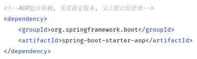
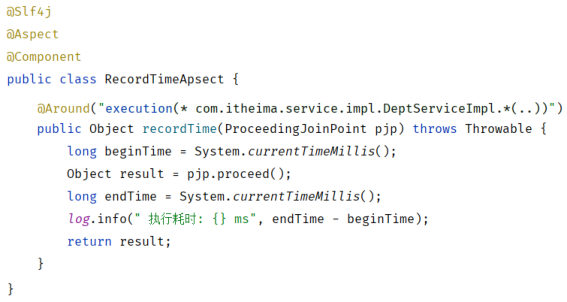
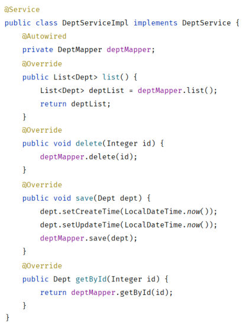
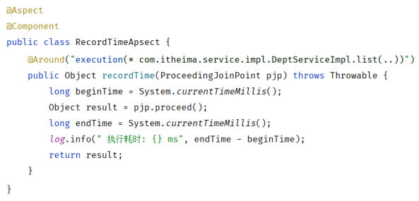

[84 篇](/posts/编程学习/javaweb学习笔记/84-拦截器interceptor/)收尾时，Filter 和 Interceptor 已经能把"登录校验"这套**重复逻辑**从每个业务方法里抽出来了——但那两套方案管的是"请求进来之前"。这一篇（PPT 第 1～12 页）换一个维度：**让一段公共逻辑在"指定的方法"执行前后自动跑起来**，而业务方法自己一行代码都不改。这就是 **AOP**。

## 这一节的位置（PPT 第 1～5 页）

第 1 页是这一章的封面（**Web后端开发 / AOP**）；第 2、3 两页先交代"什么是 AOP"（同一个知识点连讲两遍，第 2 页给代码、第 3 页给结论）；第 4 页给出这一章的三大块：

> **AOP基础** → **AOP进阶** → **AOP案例**

第 5 页把第一块"01 AOP基础"再拆成两小节：

> **AOP快速入门** → **AOP核心概念**

本篇就按"什么是 AOP → 快速入门 → 核心概念 → 执行流程"走；[86 篇](/posts/编程学习/javaweb学习笔记/86-aop进阶/)讲进阶（五种通知、通知顺序、切入点表达式、连接点），[87 篇](/posts/编程学习/javaweb学习笔记/87-aop案例-记录操作日志/)把 AOP 用到真实案例上（给增删改接口记录操作日志，顺带解决"怎么知道是谁在操作"）。

## 什么是 AOP（PPT 第 2～3 页）

PPT 给的定义只有一句话：

> **AOP**：**Aspect Oriented Programming**（面向切面编程、面向方面编程），可简单理解为就是**面向特定方法编程**。

紧跟着的是一个非常具体的**场景**：

> 案例中部分业务方法运行较慢，定位执行耗时较长的方法，此时需要**统计每一个业务方法的执行耗时**。

### 先看"原始方式"是怎么写的

要在每个业务方法里知道"这个方法跑了多久"，最直白的做法就是在**每个方法**里都插进同一段计时代码（PPT 第 2、6 页的 `DeptServiceImpl`）：

```java
public List<Dept> list(){
    long beginTime = System.currentTimeMillis();          // 获取方法运行的开始时间
    List<Dept> deptList = deptMapper.list();
    long endTime = System.currentTimeMillis();            // 获取方法运行结束时间，计算执行耗时
    log.info("执行耗时: {} ms", endTime - beginTime);
    return deptList;
}

public void delete(Integer id)  {
    long beginTime = System.currentTimeMillis();
    deptMapper.delete(id);
    long endTime = System.currentTimeMillis();
    log.info("执行耗时: {} ms", endTime - beginTime);
}

public Dept getById(Integer id){
    long beginTime = System.currentTimeMillis();
    Dept dept = deptMapper.getById(id);
    long endTime = System.currentTimeMillis();
    log.info("执行耗时: {} ms", endTime - beginTime);
    return dept;
}
```

这段代码能跑，但问题一眼就能看出来：**同一段计时逻辑被复制了 N 遍**。PPT 把它拆成三步（第 6 页），三步在**每个方法里都要重来一遍**：

1. 获取方法运行的开始时间
2. 运行原始方法
3. 获取方法运行结束时间，计算执行耗时

一点坏处都不用夸张：如果哪天要改成"超过 1 秒就报警"，得把这段逻辑一个方法一个方法地改一遍——这就是"重复代码"的代价。

### 再看"AOP 方式"：一个切面搞定

PPT 第 2 页紧接着给出 AOP 的写法：**一个类**，把那段重复逻辑收进去，再用一个表达式说明"管哪些方法"：

```java
@Slf4j
@Aspect          // 标识当前是一个 AOP 类（切面类）
@Component       // 交给 Spring 管理
public class RecordTimeAspect {

    @Around("execution(* com.itheima.service.*.*(..))")     // 切入点表达式：管哪些方法
    public Object recordTime(ProceedingJoinPoint pjp) {
        long beginTime = System.currentTimeMillis();                 // 1. 记录开始时间
        Object result = pjp.proceed();                               // 2. 执行原始方法
        long endTime = System.currentTimeMillis();                   // 3. 记录结束时间，算耗时
        log.info("执行耗时: {}ms", endTime - beginTime);
        return result;
    }
}
```

这段代码的形状和"原始方式"**一模一样**（还是那三步），区别只在于它**只写了一份**、而且写在业务类外面。（PPT 第 2 页这段是示意写法，正式写法里方法签名还要带上 `throws Throwable`——见下面快速入门的完整代码。）对比一下：`DeptServiceImpl` 里那些 `beginTime` / `endTime` / `log.info` **全部删掉**，一行都不用留（这就是下面快速入门里要做的事）。`list()`、`delete()`、`getById()` 甚至以后新加的方法，只要被那个表达式匹配上，就自动被统计——**一份代码，管一片方法**。

PPT 第 2 页把这个好处总结成**四大优势**：

| 优势 | 意思 |
| --- | --- |
| **减少重复代码** | 公共逻辑只写一份（原来每个方法里都要写四行） |
| **代码无侵入** | 业务类里不掺公共逻辑（`DeptServiceImpl` 保持干净），改需求不用动业务代码 |
| **提高开发效率** | 公共逻辑写一遍，所有匹配的方法一起获得这个能力 |
| **维护方便** | 要改就改切面那一处，所有方法的计时代码一起变 |

### 最后一句"提示"很关键（PPT 第 3 页）

PPT 第 3 页在"优势"下面补了一条提示：

> **AOP 是一种思想**，而在 Spring 框架中对这种思想进行的实现，那我们要学习的就是 **Spring AOP**。

也就是说：AOP 不是某个类、某个注解，它是"把公共逻辑横向切进指定方法"这套想法；**Spring 把它实现成了注解 + 动态代理**，所以后面敲的 `@Aspect`、`@Around`、`execution(...)` 都是 **Spring AOP（底层是 AspectJ 的表达式与注解）** 这套具体的东西。笔记里再说"AOP"，指的都是 Spring AOP。

> [!TIP]
> 这个"面向特定方法编程"的位置感很重要：以前写代码是**纵向**的（Controller → Service → Mapper，一层一层往下走），AOP 是**横向**切进来（在某一批方法的前 / 后插一段逻辑）。所以它叫"切面（Aspect）"而不是"切层"。

## AOP 快速入门（PPT 第 6～8 页）

PPT 第 6 页把需求钉死：

> **需求：统计所有业务层方法的执行耗时。**

第 7 页给出**两步走**，第 8 页用问答页把这两步再总结一遍。

### 第 ① 步：在 `pom.xml` 中引入 AOP 的依赖

```xml
<!-- AOP起步依赖，无需指定版本，父工程已经管理 -->
<dependency>
    <groupId>org.springframework.boot</groupId>
    <artifactId>spring-boot-starter-aop</artifactId>
</dependency>
```


*图：PPT 第 8 页贴的 pom.xml 片段——`spring-boot-starter-aop` 是 Spring Boot 官方的起步依赖，版本交给父工程管，不用自己写*

这和 [56 篇](/posts/编程学习/javaweb学习笔记/56-springboot配置文件/)以来一直用的 `spring-boot-starter-web`、`mybatis-spring-boot-starter` 是一个道理：**starter = 一组依赖 + 自动配置**。加了它，Spring 才会去认 `@Aspect` 这类注解、才会替你生成代理对象。

### 第 ② 步：编写 AOP 程序

PPT 第 7 页的切面类（也是课程代码 `aop/RecordTimeAspect.java` 的原样，只是课程里 `@Aspect` 默认被注释掉、练习时要打开）：

```java
import lombok.extern.slf4j.Slf4j;
import org.aspectj.lang.ProceedingJoinPoint;
import org.aspectj.lang.annotation.Around;
import org.aspectj.lang.annotation.Aspect;
import org.springframework.stereotype.Component;

@Slf4j
@Aspect                       // 标识当前是一个 AOP 类
@Component                    // 交给 Spring 管理
public class RecordTimeAspect {

    @Around("execution(* com.itheima.service.impl.*.*(..))")
    public Object recordTime(ProceedingJoinPoint pjp) throws Throwable {
        //1. 记录方法运行的开始时间
        long begin = System.currentTimeMillis();

        //2. 执行原始的方法
        Object result = pjp.proceed();

        //3. 记录方法运行的结束时间, 记录耗时
        long end = System.currentTimeMillis();
        log.info("方法 {} 执行耗时: {}ms", pjp.getSignature(), end - begin);
        return result;
    }
}
```


*图：课程代码里的 `RecordTimeAspect`——类上 `@Aspect` + `@Component` 表明"这是一个交给 Spring 管理的切面"，方法上的 `@Around("execution(...)")` 说明"管哪些方法"，方法体里就是原来那段三步计时代码*

一段一段拆开看，每一处都有它非写不可的理由：

| 位置 | 写法 | 作用 |
| --- | --- | --- |
| 类上 | `@Aspect` | 告诉 Spring"这个类是切面类"（**少了它，整段通知就是普通方法，永远不会被执行**——课程代码里它默认是注释状态） |
| 类上 | `@Component` | 交给 Spring 容器管理（切面类本身也是一个 Bean） |
| 方法上 | `@Around("execution(...)")` | 声明这是一个**环绕通知**，括号里是**切入点表达式**，决定"管哪些方法" |
| 方法参数 | `ProceedingJoinPoint pjp` | 连接点对象——用它的 `proceed()` **手动执行原始方法** |
| 方法里 | `Object result = pjp.proceed();` | 执行原始方法并拿到它的返回值 |
| 返回值 | `public Object ... { ... return result; }` | 把原始方法的返回值**原样返回给调用方**（PPT 第 15 页的"注意 2"就是这条：环绕通知的返回值必须指定为 `Object`） |
| 异常 | `throws Throwable` | `proceed()` 声明抛的是 `Throwable`，方法签名要跟着写 |
| 日志 | `pjp.getSignature()` | 连接点里能取到"当前被通知的是哪个方法"（[86 篇](/posts/编程学习/javaweb学习笔记/86-aop进阶/)的连接点一节展开） |

跑起来的效果：访问 `GET /depts`，控制台会多出一行 `方法 void com.itheima.service.impl.DeptServiceImpl.list() 执行耗时: xx ms` 这样的日志（方法名由 `pjp.getSignature()` 打印，耗时随着每一次调用变化）——**`DeptServiceImpl` 里一个字都没改**。

> [!IMPORTANT]
> 快速入门的两步可以背成一句话：**"加依赖 + 写切面"**。依赖解决"Spring 会不会认这些注解"，切面类解决"公共逻辑写在哪、管哪些方法"。

### 必答问答（PPT 第 8 页）

| PPT 的问题 | 答案 |
| --- | --- |
| SpringAOP 程序的**开发步骤**？ | ① **引入 AOP 的依赖**（`spring-boot-starter-aop`）；② **编写 AOP 的程序**（把公共的逻辑代码写进切面类） |
| SpringAOP 的**应用场景**？ | **记录系统的操作日志**、**事务管理**、**权限控制**、……（凡是一批方法都要做的公共动作，都可以用 AOP） |

关于"事务管理"这条，其实[70 篇](/posts/编程学习/javaweb学习笔记/70-事务管理与spring事务/)早就见过了：`@Transactional` 之所以能"进方法前开启事务、成功提交、异常回滚"，就是 Spring 用 AOP 给你套了一层代理——这一篇讲的正是它背后的机制。而[87 篇](/posts/编程学习/javaweb学习笔记/87-aop案例-记录操作日志/)要做的"操作日志"，就是列表里的第一条。

### 顺手把工程准备一下

课程给的实验工程是 `springboot-aop-quickstart`（Spring Boot 3.2.10 + MyBatis + MySQL + Java 17，包名 `com.itheima`），它的数据源配置是这样：

```yaml
# 数据源配置
spring:
  datasource:
    driver-class-name: com.mysql.cj.jdbc.Driver
    url: jdbc:mysql://localhost:3306/tlias
    username: root
    password: 1234
# mybatis配置
mybatis:
  configuration:
    log-impl: org.apache.ibatis.logging.stdout.StdOutImpl
    map-underscore-to-camel-case: true
```

（课程示例连的是本机 MySQL 的 `tlias` 库、用户名 `root`、`password: 1234`——动手时把 `password` 换成你自己 MySQL 的密码。）

工程里已经有 `controller/DeptController`、`service/DeptService`、`service/impl/DeptServiceImpl`、`mapper/DeptMapper`、`pojo/Dept`、`pojo/Result`，和 [58～62 篇](/posts/编程学习/javaweb学习笔记/58-部门管理-查询部门/)那套部门管理的代码是一致的，可以直接拿来练手。

## AOP 核心概念（PPT 第 9～10 页）

第 9 页又是一个分隔页（"01 AOP基础 / AOP快速入门 / AOP核心概念"），第 10 页给出**五个核心概念**——这一页是本篇最该背下来的一页：

| 概念 | 英文 | PPT 定义 |
| --- | --- | --- |
| **连接点** | JoinPoint | **可以被 AOP 控制的方法**（暗含方法执行时的相关信息） |
| **通知** | Advice | 指那些**重复的逻辑**，也就是**共性功能**（最终体现为一个方法） |
| **切入点** | PointCut | **匹配连接点的条件**，通知仅会在切入点方法执行时被应用 |
| **切面** | Aspect | 描述**通知与切入点的对应关系**（通知 + 切入点） |
| **目标对象** | Target | **通知所应用的对象** |

把 `RecordTimeAspect` 和 `DeptServiceImpl` 摆在一起，五个概念立刻就落地了：

- **连接点（JoinPoint）**：`DeptServiceImpl` 里的 `list()`、`delete()`、`save()`、`getById()`、`update()`……**每一个可以被 AOP 控制的方法都是一个连接点**。注意它是"方法"层面的概念——只要这个方法能被代理、能被通知，它就是连接点。
- **通知（Advice）**：`recordTime` 方法里那段"取开始时间 → `proceed()` → 取结束时间 → 打日志"——**共性功能本身**，代码里就是切面类里的一个方法。
- **切入点（PointCut）**：`execution(* com.itheima.service.impl.*.*(..))` 这个**表达式**——它是"筛选条件"，用来决定**哪些连接点**要应用通知。
- **切面（Aspect）**：`RecordTimeAspect` 这个**类**——它把"通知（怎么做）"和"切入点（对谁做）"**绑在一起**。PPT 的图中把这一层画成"切面类"里装着"通知"和"切入点表达式"。
- **目标对象（Target）**：`DeptServiceImpl` 的**那个对象**——通知最终应用的"受害者"，也就是原始业务对象。


*图：课程代码里的 `DeptServiceImpl`——它就是"目标对象"：类里 `list` / `delete` / `save` / `getById` 每个方法都是连接点，类里的代码干干净净、一行计时代码都没有*


*图：PPT 第 12 页把切入点表达式从 `*.*(..)` 换成了 `list(..)`——可见"切入点是一张筛选单"：表达式写成什么样，就只有被它匹配上的连接点才被加上通知*

再强调一遍那组关系（这是最关键的一层）：

> **连接点 = 所有"可以被控制的方法"（全集）**，**切入点 = 筛选条件**，只有被切入点**匹配到**的连接点，通知才会执行。

所以 AOP 的定位可以写成一句话：**在"切入点匹配到的连接点"上，自动加上"通知"里那段公共逻辑**——这句话里的名词就是上面五个概念。

## AOP 执行流程：Controller 里注入的其实是代理（PPT 第 11 页）

第 11 页把四个类摆在一起，回答"到底是谁在执行那段额外逻辑"：

```java
// ① 切面类：装着公共逻辑
@Aspect
public class RecordTimeAspect {
    @Around("execution(* com.itheima.service.impl.*.*(..))")
    public Object recordTime(ProceedingJoinPoint joinPoint) throws Throwable {
        long begin = System.currentTimeMillis();
        Object result = joinPoint.proceed();   // 调用原始操作
        long end = System.currentTimeMillis();
        log.info("执行耗时: {} ms", (end - begin));
        return result;
    }
}

// ② 目标对象：真正的业务实现（不含计时代码）
public class DeptServiceImpl implements DeptService {
    @Autowired
    private DeptMapper deptMapper;

    @Override
    public List<Dept> list() {
        List<Dept> deptList = deptMapper.list();
        return deptList;
    }
}

// ③ 代理对象：Spring 自动生成的"替身"（伪代码，帮助我们理解）
public class DeptServiceProxy implements DeptService {
    @Override
    public List<Dept> list() {
        long begin = System.currentTimeMillis();
        List<Dept> deptList = 目标对象.list();   // 伪代码
        long end = System.currentTimeMillis();
        log.info("执行耗时: {} ms", (end - begin));
        return deptList;
    }
}

// ④ 调用方：Controller 注入的是 DeptService
public class DeptController {
    @Autowired
    private DeptService deptService;

    @GetMapping
    public Result list(){
        List<Dept> deptList = deptService.list();
        return Result.success(deptList);
    }
}
```

第 11 页的动画把这三者用箭头连成一条链，标题就三个字：**动态代理**。它要说的事情是：

1. Spring 启动时扫描到 `DeptServiceImpl` 被切面匹配，于是**在运行时为它生成了一个代理对象**（上图第 ③ 个类就是那个代理的"人话版"）；
2. 代理对象和目标对象**实现同一个接口**（`DeptService`），所以它"看起来"就是 `DeptService`；
3. **通知里的逻辑写在代理对象的方法里**——代理的 `list()` 就是"计时 → 调目标对象的 `list()` → 计时 → 打日志 → 返回"；
4. Controller 里 `@Autowired private DeptService deptService;` 注入进来的**其实是那个代理对象**，不是 `DeptServiceImpl` 本身（Spring 容器里放的就是代理）；
5. 所以调用链是：`Controller.list()` →（代理对象 `list()`：先跑公共逻辑，中间 `proceed()`）→ `DeptServiceImpl.list()` 真正的业务代码。

> [!IMPORTANT]
> 这条执行流程解释了三个"为什么"：
>
> - **为什么业务代码不用改**（代码无侵入）——公共逻辑加在**代理**里，目标对象只是被"包"了一层；
> - **为什么 `@Around` 里必须自己调 `proceed()`**——代理的职责是"替我调原始方法"，你不调，原始方法就不会执行；
> - **为什么注入的类型总是接口**（或父类）——Spring 需要生成**同类型**的代理对象塞进容器，声明成接口类型，代理和目标对象都能装进来。

### 本机实测：`@Around` 的前后两半，一眼就能看见

把实验工程的 `MyAspect1`（一个切面类里写了五种通知）打开（把 `@Aspect` 的注释去掉）后调用 `GET /depts`，控制台里按时间顺序打出来的是（**本机实测**）：

```text
around ... before ....      ← @Around 在 pjp.proceed() 之前的代码
before ....                 ← @Before
[目标方法真正执行]
afterReturning ....
after ....
around ... after ....       ← @Around 在 pjp.proceed() 之后的代码
```

`@Around` 那一前一后两行日志是**同一次调用**打印的，它们把目标方法**夹在中间**——这正是上面代理对象伪代码里"计时 → 目标方法 → 计时"的形状。至于中间那几行 `before` / `afterReturning` / `after` 是谁、什么时候执行，是 [86 篇](/posts/编程学习/javaweb学习笔记/86-aop进阶/)"五种通知类型"的内容——这里只要看清"**环绕通知把目标方法包在中间**"就够了。

## AOP 核心概念速答（PPT 第 12 页）

第 12 页是回顾页，把五个概念的名字又列了一遍。合起来答一遍：

| PPT 列出的概念 | 一句话定义 | 在 `RecordTimeAspect` 案例里对应 |
| --- | --- | --- |
| 连接点（JoinPoint） | 可以被 AOP 控制的方法 | `DeptServiceImpl` 的 `list()` / `delete()` / `save()` / `getById()` / `update()` |
| 切入点（PointCut） | 匹配连接点的条件 | `execution(* com.itheima.service.impl.*.*(..))` |
| 通知（Advice） | 重复的逻辑、共性功能（一个方法） | `recordTime()` 方法体里的计时代码 |
| 切面（Aspect） | 通知与切入点的对应关系（通知 + 切入点） | `RecordTimeAspect` 整个类 |
| 目标对象（Target） | 通知所应用的对象 | Spring 容器里那个 `DeptServiceImpl` 对象 |

## 实验工程怎么用：各切面类的"开关"

这一章的实验工程 `springboot-aop-quickstart`（**本机实测**用的就是它）里准备了 7 个切面类，**默认大多把 `@Aspect` 注释着**，按 PPT 的进度一个一个打开做实验：

| 切面类 | 用来演示什么 | 默认状态 |
| --- | --- | --- |
| `MyAspect1` | **五种通知类型**（@Around / @Before / @After / @AfterReturning / @AfterThrowing） | `@Aspect` 注释状态，用到时打开 |
| `MyAspect2` / `MyAspect3` / `MyAspect4` | **通知顺序**——`@Order(8)` / `@Order(5)` / `@Order(3)` | 注释状态 |
| `MyAspect5` | **切入点表达式的各种写法**（一整屏注释掉的 `@Before`，纯演示） | 全注释（它自己打开也没关系） |
| `MyAspect6` | **连接点信息**（目标对象、目标类、方法名、参数） | **默认就开着** |
| `RecordTimeAspect` | 统计业务方法耗时（`@Around` 的典型用法） | 注释状态 |
| `DeptServiceImpl` 里那行 `int i = 1/0;` | 人为制造异常，复现"异常时的通知行为" | 注释状态，用到时打开 |

实验方法就是"**改注释 → 重启 / 重新构建 → 发请求 → 看控制台**"：一次只打开一个切面类，日志里就只有它的痕迹，结论才干净。（本机做完实验后已把各切面类的 `@Aspect` 恢复成注释状态、`DeptServiceImpl` 里的 `1/0` 也恢复成注释。）

## 小结

| 问题 | 答案 |
| --- | --- |
| AOP 是什么？ | Aspect Oriented Programming（面向切面编程/面向方面编程），可简单理解为**面向特定方法编程** |
| 它解决什么问题？ | 一批方法里重复的公共逻辑（如统计每个业务方法的执行耗时）不用再手写 N 遍 |
| 四大优势？ | **减少重复代码、代码无侵入、提高开发效率、维护方便** |
| 快速入门两步？ | ① `pom.xml` 引入 `spring-boot-starter-aop`；② 写切面类（`@Aspect` + `@Component` + `@Around("execution(...)")`） |
| `@Around` 方法必须做什么？ | 自己调 `pjp.proceed()` 执行原始方法；返回值类型是 `Object`，把原始方法的返回值 `return` 出去 |
| 五个核心概念？ | **连接点**（可以被控制的方法）、**切入点**（匹配连接点的条件）、**通知**（重复的逻辑/共性功能）、**切面**（通知+切入点的对应关系）、**目标对象**（通知所应用的对象） |
| 执行流程？ | Spring 为目标对象**生成动态代理对象**，通知逻辑写在代理里；Controller 注入的 `DeptService` **其实是代理对象**，调用时先跑代理、再由 `proceed()` 调到真正的业务方法 |
| 应用场景？ | 记录系统操作日志、事务管理、权限控制…… |
| 本机实测看到什么？ | 打开 `MyAspect1` 后调用 `GET /depts`：`around ... before` 最先、`before` 第二、目标方法、`afterReturning`、`after`，最后才是 `around ... after`——**环绕通知把目标方法夹在中间** |

## 相关

- [上一篇：拦截器Interceptor](/posts/编程学习/javaweb学习笔记/84-拦截器interceptor/)
- [下一篇：AOP进阶](/posts/编程学习/javaweb学习笔记/86-aop进阶/)

## 练习题

### 一、知识回顾（读完直接做下面的实践题）

1. **AOP 的全称与理解**：**Aspect Oriented Programming**（面向切面编程、面向方面编程），可简单理解为**面向特定方法编程**
2. **AOP 与 Spring 的关系**：AOP 是一种**思想**，Spring 框架对这种思想进行了实现——我们要学的是 **Spring AOP**
3. **AOP 的典型场景**：统计每个业务方法的**执行耗时**（本节的案例）；此外还有**记录系统的操作日志、事务管理、权限控制**
4. **"原始方式"的问题**：三段计时代码（取开始时间 / 调原始方法 / 取结束时间）要在**每个业务方法里重复写**；要改一次得改 N 个方法
5. **四大优势**：**减少重复代码**、**代码无侵入**、**提高开发效率**、**维护方便**
6. **快速入门两步**：① `pom.xml` 里引入 **`spring-boot-starter-aop`** 依赖（版本由父工程管理）；② 编写 AOP 程序（切面类）
7. **切面类的骨架**：类上 `@Aspect`（标识切面类，**少了它不会生效**）+ `@Component`（交给 Spring 管理）；方法上 `@Around("execution(...)")`
8. **`@Around` 方法的两条硬性要求**：必须自己调 `pjp.proceed()` 让原始方法执行；返回值必须声明为 **`Object`** 并 `return` 原始方法的返回值（方法签名还要 `throws Throwable`）
9. **五个核心概念**：**连接点 JoinPoint**（可以被 AOP 控制的方法）、**切入点 PointCut**（匹配连接点的条件）、**通知 Advice**（重复的逻辑/共性功能，是一个方法）、**切面 Aspect**（通知与切入点的对应关系=通知+切入点）、**目标对象 Target**（通知所应用的对象）
10. **执行流程与"注入的是谁"**：Spring 为目标对象**生成动态代理对象**，通知逻辑写在代理对象里；Controller 里注入的 `DeptService` **其实是代理对象**——调用链是"Controller → 代理（公共逻辑 + `proceed()`）→ 真正的业务方法"

### 二、裸写题

- [ ] **2-1 把每个业务方法里手写的计时代码换成切面**
  现状：`DeptServiceImpl` 的每个方法里都手写了四行重复代码——取开始时间、调原始方法、取结束时间、打日志（`list`、`delete`、`getById` 一个不落）。要求：把这些计时逻辑挪到**一个独立的类**里，让 `service.impl` 包下**所有**业务方法都被统计到耗时；业务类里那四行代码要**全部删掉**。另外说清楚：要让这个新类能生效，工程还需要补什么（写出来）。
  （练习文件 `test_85_AOP快速入门.java` 的题目 2-1 里给了写作区。）

  > [!TIP]- 提示（先自己想，实在想不出再点开）
  > **一级 · 思路**：分两步——① 工程得先有"AOP 的能力"，也就是引入对应的起步依赖；② 写一个类，把那段公共逻辑收进去，再用一个表达式声明"管哪些方法"；计时逻辑里"调原始方法"和"拿返回值"由参数和方法返回值来完成
  > **二级 · 方法**：依赖用 `spring-boot-starter-aop`；类上 `@Aspect` + `@Component`（可配 `@Slf4j` 打日志）；通知方法上 `@Around("execution(* com.itheima.service.impl.*.*(..))")`；方法参数是 `ProceedingJoinPoint pjp`，用 `pjp.proceed()` 执行原始方法并接住结果，返回值类型必须是 `Object`，最后 `return` 出去；签名要 `throws Throwable`
  > **三级 · 骨架**：
  > ```java
  > @____
  > @____
  > public class RecordTimeAspect {
  >     @____("execution(* com.itheima.service.impl.*.*(..))")
  >     public Object recordTime(____ pjp) throws Throwable {
  >         long begin = System.currentTimeMillis();
  >         Object result = ____;              // 执行原始方法
  >         long end = System.currentTimeMillis();
  >         log.info("方法 {} 执行耗时 {}ms", pjp.getSignature(), end - begin);
  >         return ____;                       // 把原始方法的返回值交回去
  >     }
  > }
  > ```

  > [!TIP]- 参考答案（做完再点开）
  > ```xml
  > <!-- pom.xml -->
  > <dependency>
  >     <groupId>org.springframework.boot</groupId>
  >     <artifactId>spring-boot-starter-aop</artifactId>
  > </dependency>
  > ```
  > ```java
  > @Slf4j
  > @Aspect                       // 标识当前是一个 AOP 类
  > @Component                    // 交给 Spring 管理
  > public class RecordTimeAspect {
  >
  >     @Around("execution(* com.itheima.service.impl.*.*(..))")
  >     public Object recordTime(ProceedingJoinPoint pjp) throws Throwable {
  >         //1. 记录方法运行的开始时间
  >         long begin = System.currentTimeMillis();
  >
  >         //2. 执行原始的方法
  >         Object result = pjp.proceed();
  >
  >         //3. 记录方法运行的结束时间, 记录耗时
  >         long end = System.currentTimeMillis();
  >         log.info("方法 {} 执行耗时: {}ms", pjp.getSignature(), end - begin);
  >         return result;
  >     }
  > }
  > ```
  > 业务层改造后（那四行全没了，和课程代码一致）：
  > ```java
  > @Slf4j
  > @Service
  > public class DeptServiceImpl implements DeptService {
  >     @Autowired
  >     private DeptMapper deptMapper;
  >
  >     @Override
  >     public List<Dept> list() {
  >         List<Dept> deptList = deptMapper.list();
  >         return deptList;
  >     }
  >
  >     @Override
  >     public void delete(Integer id) {
  >         deptMapper.delete(id);
  >     }
  > }
  > ```
  > 自查：① 切面类要放在 Spring 能扫描到的包下（和启动类同级或更下层），**`@Aspect` 千万别忘**——课程代码里它默认就是被注释掉的；② `@Around` 方法如果忘了 `return result`，接口返回的数据会变成 `null`；③ 启动后调一次 `GET /depts`，控制台应能看到 `方法 ...list() 执行耗时: xx ms`。

- [ ] **2-2 把五个核心概念对上号**
  切面类已经把 `DeptServiceImpl` 所有方法的耗时统计接管了。请指出下面这些东西分别对应 AOP 的哪个概念，并各用一句自己的话说清它的定义：
  ① Spring 容器里那个 `DeptServiceImpl` **对象**；
  ② `DeptServiceImpl.list()` 这个**方法**；
  ③ `execution(* com.itheima.service.impl.*.*(..))` 这个**表达式**；
  ④ `recordTime` 方法里"取时间、`proceed()`、算差值、打日志"这段**逻辑**；
  ⑤ 把 ③ 和 ④ 装在一起的那个**类**。
  最后再用一句话说清 ③ 和 ② 的关系（谁是全集、谁负责筛）。
  （练习文件 `test_85_AOP快速入门.java` 的题目 2-2 里给了写作区。）

  > [!TIP]- 提示（先自己想，实在想不出再点开）
  > **一级 · 思路**：口诀是"**目标对象**是我要通知谁、**连接点**是能被控制的那个方法、**切入点**是一张筛选单、**通知**是那段公共逻辑、**切面**是单子和逻辑的绑定"
  > **二级 · 方法**：五个词——目标对象 Target / 连接点 JoinPoint / 切入点 PointCut / 通知 Advice / 切面 Aspect
  > **三级 · 骨架**：① 目标是 ____ 对象 → ____；② 方法是 ____ → ____；③ 表达式是 ____ → ____；④ 那段逻辑是 ____ → ____；⑤ 那个类是 ____ → ____；关系：____ 是所有"可以被控制的方法"（全集），____ 是用来筛选的条件，只有匹配上的连接点才会执行通知

  > [!TIP]- 参考答案（做完再点开）
  > | | 对应概念 | 定义 |
  > | --- | --- | --- |
  > | ① `DeptServiceImpl` 对象 | **目标对象（Target）** | 通知所应用的对象 |
  > | ② `DeptServiceImpl.list()` 方法 | **连接点（JoinPoint）** | 可以被 AOP 控制的方法（暗含方法执行时的相关信息） |
  > | ③ `execution(...)` 表达式 | **切入点（PointCut）** | 匹配连接点的条件，通知仅会在切入点方法执行时被应用 |
  > | ④ 计时代码那段逻辑 | **通知（Advice）** | 那些重复的逻辑，也就是共性功能（最终体现为一个方法） |
  > | ⑤ `RecordTimeAspect` 类 | **切面（Aspect）** | 描述通知与切入点的对应关系（通知 + 切入点） |
  >
  > ③ 与 ② 的关系：**所有"可以被 AOP 控制的方法"都是连接点（全集）**，而**切入点是一个筛选条件**——它匹配到哪些连接点，那些方法才会被加上通知。所以切入点变了，受害的方法就变了（把 `*.*(..)` 改成 `list(..)`，就只有 `list` 被统计）。

- [ ] **2-3 手写一个代理类，把 AOP 的执行流程讲清楚**
  要求：不用任何 AOP 注解，手动写一个"替身"类来说明 Spring 干的事——这个类与 `DeptServiceImpl` 实现**同一个接口**，内部持有一个真正的 `DeptServiceImpl` 对象；调用它的 `list()` 时，先在控制台打一行 `开始`，再去调真正的 `list()`，拿到结果后打一行 `结束`，最后把结果返回。
  写完再回答：Controller 里 `@Autowired private DeptService deptService;` 注入进来的到底是**原始对象**还是**代理对象**？为什么声明成接口类型就能装得下它？
  （练习文件 `test_85_AOP快速入门.java` 的题目 2-3 里给了写作区。）

  > [!TIP]- 提示（先自己想，实在想不出再点开）
  > **一级 · 思路**：代理类和目标对象**实现同一个接口**（所以"看起来一样"），代理内部留一份目标对象的引用，方法里"加点料"之后再手动调目标对象的方法
  > **二级 · 方法**：`implements DeptService`；成员变量 `private DeptService target = new DeptServiceImpl();`（或直接写 `DeptServiceImpl`）；方法上 `@Override`；最后 `return target.list();`
  > **三级 · 骨架**：
  > ```java
  > public class DeptServiceProxy implements ____ {
  >     private ____ target = new ____();
  >
  >     @Override
  >     public List<Dept> list() {
  >         System.out.println("开始");
  >         List<Dept> result = ____;        // 调真正的业务方法
  >         System.out.println("结束");
  >         return ____;
  >     }
  > }
  > ```

  > [!TIP]- 参考答案（做完再点开）
  > ```java
  > // 手写的"代理对象"：和 DeptServiceImpl 实现同一个接口，看起来一模一样
  > public class DeptServiceProxy implements DeptService {
  >
  >     // 内部持有真正的目标对象
  >     private DeptService target = new DeptServiceImpl();
  >
  >     @Override
  >     public List<Dept> list() {
  >         System.out.println("开始");                 // 目标方法之前的公共逻辑
  >         List<Dept> result = target.list();          // 调用真正的业务方法
  >         System.out.println("结束");                 // 目标方法之后的公共逻辑
  >         return result;                              // 把结果原样交回调用方
  >     }
  >
  >     // 其它方法同理：delete/save/getById/update 都要"包一层"
  >     @Override
  >     public void delete(Integer id) {
  >         System.out.println("开始");
  >         target.delete(id);
  >         System.out.println("结束");
  >     }
  > }
  > ```
  > 回答：注入进来的是**代理对象**。Spring 启动时发现 `DeptServiceImpl` 被切面匹配，就用**动态代理**在运行时生成了一个"实现同一个接口"的代理对象（并把它放进容器）；Controller 声明的是**接口** `DeptService`，代理对象和目标对象都实现了这个接口，所以注入不会出问题——而真正跑起来时执行的是代理，代理里才有通知逻辑。这也正是"**代码无侵入**"的原因：业务类没被改一个字，只是被包了一层。

- [ ] **2-4 环绕通知忘了返回原始方法的结果，会怎样？**
  小王写的切面里，环绕通知只写了一半：取了开始时间、调了 `pjp.proceed()`，但**没有接住返回值、也没有 return**。他还说"反正原始方法已经执行过了，数据库也改了，能有什么影响"。请判断：① 前端收到的数据会变成什么？② 数据库里的改动会怎么样？③ 分别说明原因。
  （练习文件 `test_85_AOP快速入门.java` 的题目 2-4 里给了写作区。）

  > [!TIP]- 提示（先自己想，实在想不出再点开）
  > **一级 · 思路**：想一想"调用方拿到的到底是哪个方法的返回值"——Controller 调的是代理对象，代理返回什么，调用方就得到什么；再想一想 `proceed()` 有没有"回滚"的功能
  > **二级 · 方法**：环绕通知方法如果中途没有 `return`（或返回 `null`），代理就只能把 `null` 交回去；`proceed()` 只负责**执行**原始方法，执行过的数据库操作不会因为它没被返回而撤销
  > **三级 · 骨架**：① 前端拿到的是 ____（值为 ____）；② 数据库改动 ____（插入/删除/修改____）；③ 因为代理对象的返回值 = ____ 的返回值，而 ____ 只负责执行、不负责回滚

  > [!TIP]- 参考答案（做完再点开）
  > ① 前端收到的数据变成 **`null`**：Controller 调的 `deptService.list()` 落到**代理对象**身上，代理把这个环绕通知方法的返回值原样交回；方法里没有 `return`（或 `return null`），调用方就只能拿到 `null`（`Result.success(null)` 里的 `data` 是空的）。
  > ② 数据库的改动**照常生效、不会回滚**：`pjp.proceed()` 已经把 `deptMapper` 的 SQL 执行完了，"数据的修改"这件事已经发生；环绕通知只是没有把方法的返回值往外传，它并**不具备**[70 篇](/posts/编程学习/javaweb学习笔记/70-事务管理与spring事务/)那种事务回滚的能力。
  > ③ 原因就是 PPT 第 15 页那条注意：**`@Around` 环绕通知方法的返回值必须指定为 `Object`，用来接收原始方法的返回值**——所以标准写法是 `Object result = pjp.proceed(); … return result;`。这也说明"方法被执行了"和"结果被返回了"是两件事，写切面时不能只做前者。

### 三、综合题

- [ ] **3-1 照着课程把 AOP 快速入门完整做一遍**
  这一题的重点不只是"能跑"，而是**用日志和代码把五个概念、执行流程都指认出来**。
  1. 准备工程：把课程的 `springboot-aop-quickstart` 拿过来（或照着搭一个），在 `pom.xml` 里加上 AOP 的起步依赖（不用写版本）；
  2. 在 `application.yml` 里配好数据源（`tlias` 库、`root`、`password` 换成你自己 MySQL 的密码）和 MyBatis 的日志配置；
  3. 写切面类 `RecordTimeAspect`：切住 `com.itheima.service.impl` 包下的**所有**方法，记录开始时间、执行原始方法、记录结束时间并打印耗时，把原始方法的返回值返回出去（`@Aspect`、`@Component` 都要打开）；
  4. 启动工程，依次调用三个接口：查询全部部门（`GET /depts`）、新增部门（`POST /depts`）、删除部门（`DELETE /depts?id=1`）；
  5. 把控制台里打印出来的耗时日志抄下来（每次一条，含方法名和耗时）；
  6. 把切面类上的 `@Aspect` 注释掉，重新构建启动，再调一次 `GET /depts`——记录日志有没有出现，并解释原因；
  7. 收尾回答两个问题。

  （练习文件 `test_85_AOP快速入门.java` 的"综合题"一段里按这 7 步给了写作区。）

  回答：① 五个核心概念分别对应工程里的哪一部分？（对着你写好的代码指一遍）② 如果只统计 `list` 方法，切入点表达式该怎么改？先猜，再动手验证。

  **涉及知识点**

  | 知识点 | 在这里的应用 |
  | --- | --- |
  | 什么是 AOP 与四大优势（PPT 2～3） | 第 3、6 步——"公共逻辑一份、业务类一行不改"的对照 |
  | 快速入门两步（PPT 7～8） | 第 1、3 步——依赖 + 切面类 |
  | `@Around` 的两条要求（PPT 15） | 第 3 步——必须 `proceed()`、必须 `return result` |
  | 五个核心概念（PPT 10、12） | 第 7 步问题 ① |
  | 执行流程/动态代理（PPT 11） | 第 5、6 步——日志证明代理在目标方法前后插了代码 |
  | 切入点表达式（PPT 22） | 第 7 步问题 ② |

  > [!TIP]- 提示（先自己想，实在想不出再点开）
  > **一级 · 思路**：先把最小可跑的工程立起来（依赖 + 数据源 + 部门管理那几个类），再让切面"显形"——用 `@Aspect` 的开关做一次对照实验，最后把代码和概念一一点名
  > **二级 · 方法**：依赖是 `spring-boot-starter-aop`；切面类用 `@Aspect` + `@Component` + `@Around("execution(* com.itheima.service.impl.*.*(..))")`；耗时日志用 `log.info("方法 {} 执行耗时: {}ms", pjp.getSignature(), end - begin)`；接口地址 `GET http://localhost:8080/depts`；只切 `list` 就把表达式写成 `execution(* com.itheima.service.impl.DeptServiceImpl.list(..))`
  > **三级 · 骨架**：① `<artifactId>spring-boot-____-aop</artifactId>`；② yml 的 `spring.datasource.password: ____`；③ `@____ @____ public class RecordTimeAspect { @____("execution(* com.itheima.service.impl.*.*(..))") … }`；⑤ 日志关键字：`方法 ` + `执行耗时:`；⑥ 把上面那行 `@Aspect` 前面加 `//`；⑦ ② `execution(* com.itheima.service.impl.DeptServiceImpl.____(..))`

  > [!TIP]- 参考答案（做完再点开）
  > 1～3. 依赖、`application.yml`、切面类见题目 2-1 的答案（切面类就是课程代码 `aop/RecordTimeAspect.java` 打开 `@Aspect` 的样子）。
  > 4～5. 三个接口都调得通；每调一次，控制台就会多出一条耗时日志，形状由切面里的 `log.info("方法 {} 执行耗时: {}ms", pjp.getSignature(), end - begin)` 决定：
  >    ```text
  >    方法 void com.itheima.service.impl.DeptServiceImpl.list() 执行耗时: xx ms
  >    方法 void com.itheima.service.impl.DeptServiceImpl.delete(Integer) 执行耗时: xx ms
  >    方法 void com.itheima.service.impl.DeptServiceImpl.save(Dept) 执行耗时: xx ms
  >    ```
  >    （方法名、参数、耗时逐次不同；`pjp.getSignature()` 打出来的就是"当前被通知的是哪个连接点"。）注意这三个方法的**业务代码里一行计时语句都没有**——日志却照样出现，说明逻辑是从代理那一层插进去的；三个方法能被**同一个切面**统计到，也正说明表达式匹配的是"一个包"，而不是某一个方法。
  > 6. 把 `@Aspect` 注释掉重新构建启动后，再调 `GET /depts` 接口**照常返回数据，但控制台里不会再有耗时日志**。原因：`@Aspect` 是"这个类是切面类"的标识，没有它，Spring 就把它当普通 Bean 处理，不会为 `DeptServiceImpl` 生成带通知逻辑的代理——课程代码正是靠"注释/打开 `@Aspect`"来当实验开关（**本机实测**就是逐个打开这些切面类做实验的）。
  > 7. 两个回答：
  >    ① **连接点**：`DeptServiceImpl` 里的 `list()` / `delete()` / `save()` / `getById()` / `update()` 每一个都是连接点；**切入点**：`execution(* com.itheima.service.impl.*.*(..))` 这个表达式；**通知**：`recordTime()` 方法里那段计时代码；**切面**：`RecordTimeAspect` 类（通知 + 切入点）；**目标对象**：`DeptServiceImpl` 那个对象——它被包在 Spring 生成的**代理对象**里，Controller 注入的 `DeptService` 实际拿到的是代理。
  >    ② 把表达式改成 `execution(* com.itheima.service.impl.DeptServiceImpl.list(..))`（对应 PPT 第 12 页那张图），只有 `list` 会被统计——调 `delete` 时控制台不再有耗时日志，这说明**切入点是"筛选条件"**、连接点是"全集"。
