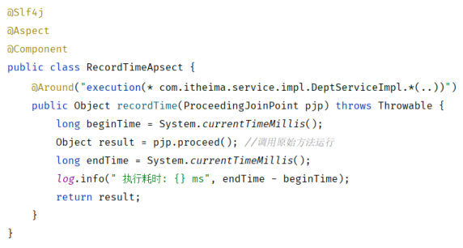
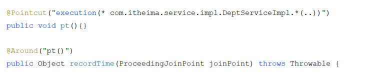
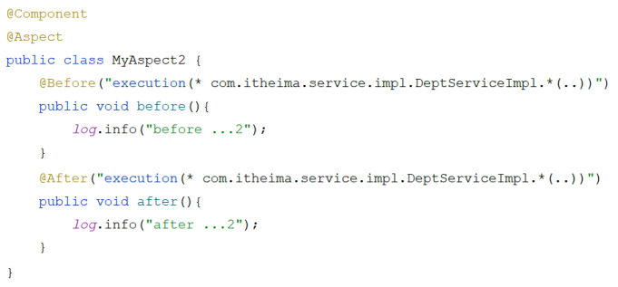
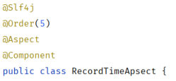
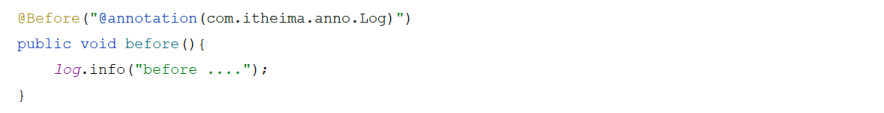
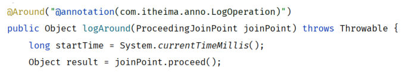
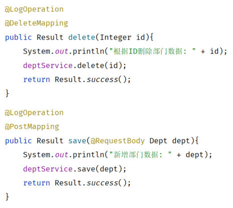

[85 篇](/posts/编程学习/javaweb学习笔记/85-aop基础/)已经把 AOP 跑通了：一个切面类 + 一个 `@Around` 就能接管一批方法的耗时统计。但它只用了**一种通知**、表达式也只写了一种形式。这一篇（PPT 第 13～27 页）把 AOP 的四个细节一次讲透：**通知类型**（一共有五种，分别什么时候执行）、**通知顺序**（多个切面都匹配上时谁先谁后）、**切入点表达式**（`execution` 该怎么写、以及更省事的 `@annotation`）、**连接点**（怎么在通知里拿到"我正在通知谁"）。

## 这一节的位置（PPT 第 13～14 页）

第 13 页先回顾这一章的三大块（AOP基础 / **AOP进阶** / AOP案例），第 14 页把"02 AOP进阶"拆成四小节：

> **通知类型** → **通知顺序** → **切入点表达式** → **连接点**

四小节的顺序就是本篇的顺序。其中"通知类型"和"通知顺序"在 PPT 里各夹了一页回顾（第 17、23、25 页是通过问答形式做的小结），笔记里也照样接在对应小节后面。

## 通知类型（PPT 第 15 页）

PPT 第 15 页开门见山：

> 根据通知方法**执行时机**的不同，将通知类型分为以下常见的**五类**：

| 通知类型 | 注解 | 执行时机（PPT 原文） |
| --- | --- | --- |
| **环绕通知** | `@Around` | 此注解标注的通知方法在**目标方法前、后都被执行** |
| **前置通知** | `@Before` | 此注解标注的通知方法在**目标方法前被执行** |
| **后置通知** | `@After` | 此注解标注的通知方法在**目标方法后被执行，无论是否有异常都会执行** |
| **返回后通知** | `@AfterReturning` | 此注解标注的通知方法在**目标方法后被执行，有异常不会执行** |
| **异常后通知** | `@AfterThrowing` | 此注解标注的通知方法**发生异常后执行** |

注意后三个长得很像，差别全在"什么条件下才会执行"：

- `@After` → **无论成功还是异常**，目标方法执行完它都跑（相当于 finally）；
- `@AfterReturning` → 只有**正常返回**才跑（有异常就不跑）；
- `@AfterThrowing` → 只有**抛了异常**才跑。

也就是说：一次正常调用能看到 `@After` 和 `@AfterReturning`（没有 `@AfterThrowing`）；一次异常调用能看到 `@After` 和 `@AfterThrowing`（没有 `@AfterReturning`）。这一点下面有**本机实测**对照。

两条"注意"是考试和面试的重点，PPT 专门框了出来：

> **注意 1**：`@Around` 环绕通知**需要自己调用 `ProceedingJoinPoint.proceed()` 来让原始方法执行**，其他通知不需要考虑目标方法执行。
>
> **注意 2**：`@Around` 环绕通知方法的**返回值，必须指定为 `Object`**，来接收原始方法的返回值。

为什么只有环绕通知要 `proceed()`？因为只有它"前后都执行"——它得自己决定原始方法什么时候跑（[85 篇](/posts/编程学习/javaweb学习笔记/85-aop基础/)的代理伪代码就是这个形状）；其它四种通知只是"插入一句话"，原始方法由框架照常执行，不用你操心。

课程代码里把这五种通知写在**同一个切面类**里（`aop/MyAspect1.java`，`@Aspect` 默认注释着，做实验时打开）：

```java
@Slf4j
//@Aspect
@Component
public class MyAspect1 {

    // 把公共的切入点表达式抽出来，五个通知都引用它
    @Pointcut("execution(* com.itheima.service.impl.*.*(..))")
    private void pt(){}

    //前置通知 - 目标方法运行之前运行
    @Before("pt()")
    public void before(){
        log.info("before ....");
    }

    //环绕通知 - 目标方法运行之前、后运行
    @Around("pt()")
    public Object around(ProceedingJoinPoint pjp) throws Throwable {
        log.info("around ... before ....");

        Object result = pjp.proceed();      // 自己调用，原始方法才会执行

        log.info("around ... after ....");
        return result;                       // 返回值必须能装下原始方法的返回值
    }

    //后置通知 - 目标方法运行之后运行, 无论是否出现异常都会执行
    @After("pt()")
    public void after(){
        log.info("after ....");
    }

    //返回后通知 - 目标方法运行之后运行, 如果出现异常不会运行
    @AfterReturning("pt()")
    public void afterReturning(){
        log.info("afterReturning ....");
    }

    //异常后通知 - 目标方法运行之后运行, 只有出现异常才会运行
    @AfterThrowing("pt()")
    public void afterThrowing(){
        log.info("afterThrowing ....");
    }
}
```


*图：PPT 第 15 页贴的切面——`@Around` 方法里 `Object result = pjp.proceed();` 这一行就是"注意 1"，最后的 `return result;` 就是"注意 2"*

> [!IMPORTANT]
> 一个方法上同时有多个通知时，它们是按**通知类型**的顺序"包"起来的——最外层是 `@Around`，往里依次是 `@Before` → 目标方法 → `@AfterReturning` / `@After` / `@AfterThrowing`，最后再回到 `@Around` 的后半段。把这句结构记住，下面两组实测日志就不用死记了。

### 必答问答（PPT 第 17 页 上半页）

| PPT 的问题 | 答案 |
| --- | --- |
| **常见的通知类型有哪些？分别在什么时候执行** | **`@Before` 前置通知**（目标方法**前**）、**`@After` 后置通知**（目标方法后，**无论是否有异常都会执行**）、**`@Around` 环绕通知**（目标方法**前后都执行**，**重点**）、**`@AfterReturning` 返回后通知**（目标方法后执行，**有异常不会执行**）、**`@AfterThrowing` 异常后通知**（目标方法**发生异常后**执行） |

### 本机实测：五种通知的真实顺序（正常调用）

把 `MyAspect1` 的 `@Aspect` 打开，调用 `GET /depts`（正常返回 200），控制台里按时间顺序打出来的是（**本机实测**）：

```text
around ... before ....      ← @Around 在 pjp.proceed() 之前的代码
before ....                 ← @Before
[目标方法真正执行]
afterReturning ....         ← @AfterReturning（正常返回才执行）
after ....                  ← @After（无论是否异常都执行）
around ... after ....       ← @Around 在 pjp.proceed() 之后的代码
```

按上面那条"结构"逐层对一遍：

1. **`@Around` 的"前一半"最先**——它是最外层，进来先执行；
2. **`@Before` 第二**——它在环绕通知的内部执行，但**仍在目标方法之前**；
3. **目标方法**执行（这里就是 `DeptServiceImpl.list()`，日志里看不到它自己打的日志，只是"中间那一刻"）；
4. 目标方法正常结束 → **`@AfterReturning` 先**（"正常返回"这个条件是刚满足的）；
5. **`@After` 后**（它是"无论如何"的那一个，排在返回后通知之后）；
6. 最后回到 **`@Around` 的"后一半"**——最外层最后收尾；
7. 全程**没有 `afterThrowing`**（没有异常，它不会执行）。

### 本机实测：目标方法抛异常时，谁执行、谁不执行

在 `DeptServiceImpl.list()` 里把那行注释掉的 `int i = 1/0;` 打开（人为制造算数异常），再调一次 `GET /depts`——接口返回 **HTTP 500**，异常是 `java.lang.ArithmeticException: / by zero`，日志顺序变成（**本机实测**）：

```text
around ... before ....
before ....
afterThrowing ....      ← 出现！@AfterThrowing 只在异常时执行
after ....              ← 仍然执行（无论是否异常）
```

这组对照把五种通知"什么时候执行"钉死了：

| 通知 | 正常调用 | 抛异常 | 说明 |
| --- | --- | --- | --- |
| `@Around` 前一半 | 执行 | 执行 | 只要进到通知就开始跑 |
| `@Before` | 执行 | 执行 | 目标方法之前的都照跑 |
| `@AfterReturning` | **执行** | **不执行** | 有异常就没有"正常返回" |
| `@AfterThrowing` | 不执行 | **执行** | 只有异常才触发 |
| `@After` | 执行 | **执行** | 无论成败都执行 |
| `@Around` 后一半 | **执行** | **不执行** | 见下 |

三个值得单独记住的现象：

1. **`afterReturning` 消失了**——PPT 那句"有异常不会执行"就是这么来的；
2. **`after` 还在**——"无论是否有异常都会执行"；
3. **`@Around` 的"后一半"没执行**——异常是在 `pjp.proceed()` 那一刻从目标方法里抛出来的，它一路向外抛，`around` 方法里 `proceed()` 之后的代码（`log.info("around ... after ....")`）**被跳过**；异常继续往上抛，最终变成了 HTTP 500。

> [!WARNING]
> 第 3 条很容易踩坑：如果你在环绕通知里写了"收尾代码"（比如关资源、清理数据），它**不一定能被执行到**。真要保证"无论如何都执行"，得用 `try-finally` 包住 `pjp.proceed()`。

## `@Pointcut`：把公共切入点抽出来（PPT 第 16 页）

PPT 第 16 页只有一句话加一张图：

> `@Pointcut` 该注解的作用是将**公共的切点表达式抽取出来**，需要用到时**引用**该切点表达式即可。

（PPT 的标题把这个注解写成 `@PointCut`，代码里真正的写法是 `@Pointcut`——大小写别敲错。）

在 `MyAspect1` 里就是最上面那两行——先定义一个"空方法"挂上 `@Pointcut`，五个通知都改写成 `"pt()"`：

```java
// 抽取公共的切入点表达式：方法体是空的，方法名就是"引用名"
@Pointcut("execution(* com.itheima.service.impl.DeptServiceImpl.*(..))")
public void pt(){}
```

```java
@Around("pt()")            // 引用上面那个切入点
public Object recordTime(ProceedingJoinPoint joinPoint) throws Throwable {
```


*图：PPT 第 16 页的写法——上面用 `@Pointcut` 定义 `pt()`，下面的环绕通知直接写 `@Around("pt()")` 引用它；以后表达式要改，只改一处*

可见性（方法上的修饰符）决定了它能被谁引用，PPT 列了两条：

| 修饰符 | 能被谁引用 |
| --- | --- |
| `private` | **仅能在当前切面类中**引用该表达式 |
| `public` | 在**其他外部的切面类**中也可以引用该表达式（引用时要写全名，如 `类名.方法名()`） |

> [!TIP]
> 为什么抽出来值得？上一节的 `MyAspect1` 里五个通知本来要写五遍同一个表达式——一旦要改（比如只统计 `list`），五处都得改；抽成 `pt()` 以后只改一处。这就是 PPT 说的"提高复用性"。

### 必答问答（PPT 第 17 页 下半页）

| PPT 的问题 | 答案 |
| --- | --- |
| `@Pointcut` 注解的**作用**是什么？ | **抽取公共的切点表达式，提高复用性** |

## 通知顺序（PPT 第 18～19 页）

第 18 页又是一个分隔页（通知类型 / **通知顺序** / 切入点表达式 / 连接点），第 19 页给出问题与规则：

> 当**有多个切面**的切入点都匹配到了目标方法，目标方法运行时，**多个通知方法都会被执行**。

那谁先谁后？PPT 给了两套规则。

### 规则一：什么都不写时——按切面类名的字母顺序

> 不同切面类中，**默认按照切面类的类名字母排序**：
>
> - 目标方法**前**的通知方法：**字母排名靠前的先执行**
> - 目标方法**后**的通知方法：**字母排名靠前的后执行**

（"后执行"那句读起来别扭，但它和下面 `@Order` 的规则是同一个道理：**进的时候正着走、出的时候倒着走**——像穿过一个洋葱，先进去的后出来。）

### 规则二：用 `@Order(数字)` 明确指定

> 用 **`@Order(数字)`** 加在**切面类**上来控制顺序：
>
> - 目标方法**前**的通知方法：**数字小的先执行**
> - 目标方法**后**的通知方法：**数字小的后执行**

课程代码里准备了三个切面（`MyAspect2` / `MyAspect3` / `MyAspect4`），除了 `@Order` 的数字不同，内容几乎一样——都是 `@Before` + `@After` 各打一行日志：

```java
@Slf4j
@Order(8)          // 切面类上加 @Order 控制顺序
@Component
//@Aspect
public class MyAspect2 {
    //前置通知
    @Before("execution(* com.itheima.service.impl.*.*(..))")
    public void before(){
        log.info("MyAspect2 -> before ...");
    }

    //后置通知
    @After("execution(* com.itheima.service.impl.*.*(..))")
    public void after(){
        log.info("MyAspect2 -> after ...");
    }
}
```

三个类分别标的是 `@Order(8)`（`MyAspect2`）、`@Order(5)`（`MyAspect3`）、`@Order(3)`（`MyAspect4`）。


*图：PPT 第 19 页贴的切面类——内容极简：一个 `@Before` 打一行、一个 `@After` 打一行；三个切面类只差类名和日志里的编号*


*图：`@Order(5)` 写在切面类上（和 `@Aspect`、`@Component` 并列）——数字越小，目标方法前越早执行*

### 本机实测：`@Order(3) / (5) / (8)` 的真实顺序

把 `MyAspect2`(@Order(8))、`MyAspect3`(@Order(5))、`MyAspect4`(@Order(3)) 三个切面**同时打开**，调用 `GET /depts`，控制台顺序是（**本机实测**）：

```text
MyAspect4 -> before ...     ← @Order(3)
MyAspect3 -> before ...     ← @Order(5)
MyAspect2 -> before ...     ← @Order(8)
[目标方法]
MyAspect2 -> after ...      ← @Order(8)
MyAspect3 -> after ...      ← @Order(5)
MyAspect4 -> after ...      ← @Order(3)
```

结论和 PPT 的规则一字不差：

- **目标方法之前**：`3 → 5 → 8`（**数字小的先执行**）；
- **目标方法之后**：`8 → 5 → 3`（**数字小的后执行**，也就是"倒着回来"）。

不写 `@Order` 时则按**切面类名的字母顺序**排（`MyAspect2` < `MyAspect3` < `MyAspect4`，正好也是 2 → 3 → 4 的顺序，所以想让实验"看出差别"就得给它们标上不相邻的数字），前同样正着走、后同样倒着走。

## 切入点表达式（PPT 第 20～22 页）

第 20 页又是分隔页（通知类型 / 通知顺序 / **切入点表达式** / 连接点），第 21 页给出定义：

> **介绍**：描述切入点方法的一种表达式。
> **作用**：用来决定项目中的**哪些方法**需要加入通知。
> **常见形式**：
>
> - `execution(……)`：根据**方法的签名**来匹配
> - `@annotation(……)`：根据**注解**匹配

一句话概括两者的分工：**`execution` 靠"方法长什么样"（返回值、包、类、方法名、参数）来挑**；**`@annotation` 靠"方法上贴了什么注解"来挑**。


*图：PPT 第 21 页顺便给了一眼 `@annotation` 的样子——`@Before("@annotation(com.itheima.anno.Log)")`，括号里写的是注解的全类名（图里用的是案例工程 tlias 的 `Log` 注解；实验工程 `springboot-aop-quickstart` 里叫 `LogOperation`）*

### `execution` 的完整语法（PPT 第 22 页）

```text
execution(访问修饰符?  返回值  包名.类名.?方法名(方法参数) throws 异常?)
```

其中**带 `?` 的表示可以省略的部分**，PPT 逐条说明了怎么省：

| 可省略项 | 说明 |
| --- | --- |
| **访问修饰符** | 可省略（比如 `public`、`protected`） |
| **包名.类名** | 可省略 |
| **`throws` 异常** | 可省略（注意是**方法上声明抛出的异常**，不是**实际抛出**的异常） |

> [!WARNING]
> "包名.类名可省略"虽然语法允许，但课程代码的注释里写得很直接：`//@Before("execution(void delete(java.lang.Integer))") //包名.类名 强烈不建议省略`——省掉之后，全工程所有叫 `delete` 的方法（不分包、不分类）都会被你切中，属于自找麻烦。

### 两个通配符（PPT 第 22 页）

| 通配符 | 含义（PPT 原文） |
| --- | --- |
| `*` | **单个独立的任意符号**，可以通配**任意返回值、包名、类名、方法名、任意类型的一个参数**，也可以通配**包、类、方法名的一部分** |
| `..` | **多个连续的任意符号**，可以通配**任意层级的包**，或**任意类型、任意个数的参数** |

PPT 给的两个例子正好各用一个：

```text
execution(* com.*.service.*.update*(*))
execution(* com.itheima..DeptService.*(..))
```

- 第一条：`*` 依次通配了"返回值""`com` 下的一段包""`service` 下的类名"，方法名写成 `update*` 表示"`update` 开头的方法"，参数 `(*)` 表示"任意类型的**一个**参数"——最终匹配"某层包里的 `service` 下某个类的 `updateXxx(一个参数)` 方法"；
- 第二条：`..` 通配了"`com.itheima` 下面**任意层级**的包"，`DeptService` 这个类名写死（注意它是**接口**名），`.*(..)` 表示"这个接口里的任意方法、任意参数"——`DeptService` 的实现类在 `service.impl` 包下，也能被这条表达式切中。

课程代码 `MyAspect5` 把**同一批** `delete` 方法用各种写法逐个演示了一遍（全是注释状态，打开注释就能试），可以当成一份"表达式写法对照表"：

| 写法（`@Before(...)` 括号里的内容） | 匹配范围 / 考点 |
| --- | --- |
| `execution(public void com.itheima.service.impl.DeptServiceImpl.delete(java.lang.Integer))` | 全都写：访问修饰符 + 返回值 + 全类名 + 方法名 + 参数类型（参数类型要写**全限定名**） |
| `execution(void com.itheima.service.impl.DeptServiceImpl.delete(java.lang.Integer))` | **省略访问修饰符** |
| `execution(void delete(java.lang.Integer))` | **省略包名.类名**——代码注释里明确写着"**强烈不建议**" |
| `execution(* com.itheima.service.impl.DeptServiceImpl.delete(java.lang.Integer))` | 返回值用 `*`（返回 `void` 也能匹配） |
| `execution(* com.*.service.impl.DeptServiceImpl.delete(java.lang.Integer))` | 包名的一部分用 `*`（这里是 `com.itheima` 的 `itheima`） |
| `execution(* com.itheima.service.impl.*.delete(java.lang.Integer))` | 类名用 `*`（`impl` 包下任意类的 `delete`） |
| `execution(* com.itheima.service.impl.*.*(java.lang.Integer))` | 类名、方法名都用 `*` |
| `execution(* com.itheima.service.impl.*.*(*))` | 参数用 `*`——表示**一个任意类型**的参数 |
| `execution(* com.itheima.service.impl.*.del*(*))` | 方法名的一部分用 `*`（`del` 开头） |
| `execution(* com.itheima.service.impl.*.*e(*))` | 方法名的一部分用 `*`（以 `e` 结尾） |
| `execution(* com..service.impl.DeptServiceImpl.*(..))` | 包用 `..`——**任意层级**的包 |
| `execution(* com.itheima.service.*.*(..))` | 这里的 `*` 通配 `service` 下**一层**子包（也就是 `impl`） |
| `execution(* com.itheima.service.impl.DeptServiceImpl.list(..)) \|\| execution(* com.itheima.service.impl.DeptServiceImpl.delete(..))` | 用 `\|\|` **组合**两个表达式：`list` 与 `delete` 都匹配 |

### 组合：`&&`、`||`、`!`（PPT 第 22 页"注意 1"）

> 根据业务需要，可以使用 **且（`&&`）**、**或（`||`）**、**非（`!`）** 来组合比较复杂的切入点表达式。

三种组合的含义直白：`&&` 两边都满足才匹配（范围变**小**）、`||` 满足一个即可（范围变**大**）、`!` 取反（排除）。

### 必答问答（PPT 第 23 页）

| PPT 的问题 | 答案 |
| --- | --- |
| `execution` 切入点表达式的**完整语法**？ | `execution(访问修饰符? 返回值 包名.类名.?方法名(方法参数) throws 异常?)`，其中访问修饰符、包名.类名、`throws` 异常可以省略 |
| **通配符**有哪些？ | **`*`**：单个独立的任意符号（通配任意返回值、包名、类名、方法名、任意类型的一个参数，也可以通配包、类、方法名的一部分）；**`..`**：多个连续的任意符号（通配任意层级的包，或任意类型、任意个数的参数） |

同页还有**三条书写建议**（PPT 第 23 页）：

1. 所有**业务方法名在命名时尽量规范**，方便切入点表达式快速匹配。如：`findXxx`、`updateXxx`；
2. 描述切入点方法通常**基于接口描述**，而不是直接描述实现类（`DeptService` 而不是 `DeptServiceImpl`），**增强拓展性**；
3. 在满足业务需要的前提下，**尽量缩小切入点的匹配范围**。如：包名**尽量不使用 `..`**，使用 `*` 匹配单个包。

这三条其实是一套配套思路：**名字规范** → 表达式能写得又短又准；**面向接口** → 换实现类（比如以后 `DeptServiceImpl` 拆成两个类）表达式不用改；**缩小范围** → 少误伤无关方法，性能也更好。

## 切入点表达式 `@annotation`（PPT 第 24～25 页）

第 24 页给出定义：

> `@annotation` 切入点表达式，用于**匹配标识有特定注解的方法**。

用法是"两步走"：**先有自定义注解，再在表达式里写上注解的全类名**。

### 第一步：写一个自定义注解

```java
package com.itheima.anno;

import java.lang.annotation.ElementType;
import java.lang.annotation.Retention;
import java.lang.annotation.RetentionPolicy;
import java.lang.annotation.Target;

@Target(ElementType.METHOD)          // 只能加在方法上
@Retention(RetentionPolicy.RUNTIME)  // 运行时仍保留（AOP 运行时才读得到）
public @interface LogOperation {
}
```

（`@Target` 和 `@Retention` 都是"元注解"：前者限定这个注解能贴在哪，后者决定它保留到什么时候。`RUNTIME` 是必须的——AOP 是在**运行时**读注解来决定切谁。）

### 第二步：在切面里按注解匹配

```java
@Around("@annotation(com.itheima.anno.LogOperation)")     // 括号里是注解的全类名
public Object logAround(ProceedingJoinPoint joinPoint) throws Throwable {
    long startTime = System.currentTimeMillis();
    Object result = joinPoint.proceed();
    // ... 省略
}
```


*图：PPT 第 24 页的写法——`@Around("@annotation(com.itheima.anno.LogOperation)")`，注解的全类名写在括号里；这样切面就只认"贴了这个注解的方法"*

### 第三步：把注解贴在需要被切的方法上

```java
@LogOperation                 // 贴了注解的方法才会被切中
@DeleteMapping
public Result delete(Integer id){
    System.out.println("根据ID删除部门数据: " + id);
    deptService.delete(id);
    return Result.success();
}

@LogOperation
@PostMapping
public Result save(@RequestBody Dept dept){
    System.out.println("新增部门数据: " + dept);
    deptService.save(dept);
    return Result.success();
}
```


*图：PPT 第 24 页把 `@LogOperation` 贴到了控制器方法上（`delete`、`save`）——从此这些方法会被那个 `@annotation` 切面切中，而没贴注解的方法不受影响*

这种写法最大的好处是**指哪打哪**：不用去数"哪些方法名符合规律"，而是在方法上贴一个注解，语义一目了然；以后新增接口想记录日志，贴一个注解就行——[87 篇](/posts/编程学习/javaweb学习笔记/87-aop案例-记录操作日志/)的案例选的就是这条路。

### 必答问答（PPT 第 25 页）

| PPT 的问题 | 答案 |
| --- | --- |
| `@annotation` 切入点表达式的**写法**？ | **`@annotation(注解全类名)`** |
| `execution` 切入点表达式与 `@annotation` 切入点表达式的**应用场景**？ | **如果 `execution` 表达式方便描述指定的方法，就使用 `execution` 表达式；否则，就使用 `@annotation` 表达式** |

怎么判断"方不方便"？看方法名有没有规律：像[85 篇](/posts/编程学习/javaweb学习笔记/85-aop基础/)那种"整个 service 包都要统计耗时"，`execution(* com.itheima.service.impl.*.*(..))` 一行就够；反过来，要切的方法**零散分布**在不同包的控制器里、名字还没规律，`execution` 就得靠 `||` 拼一长串——这时 `@annotation` 更合适。

## 连接点（PPT 第 26～27 页）

第 26 页是分隔页（通知类型 / 通知顺序 / 切入点表达式 / **连接点**），第 27 页给出定义：

> 在 Spring 中用 **`JoinPoint`** 抽象了连接点，用它可以获得**方法执行时的相关信息**，如**目标类名、方法名、方法参数**等。

两条使用规则：

> 对于 `@Around` 通知，获取连接点信息只能使用 **`ProceedingJoinPoint`**；
> 对于其它四种通知，获取连接点信息只能使用 **`JoinPoint`**，它是 `ProceedingJoinPoint` 的**父类型**。

（父类型的含义：`ProceedingJoinPoint` 能当 `JoinPoint` 用，反过来不行——因为只有子类型多了 `proceed()` 这个方法。所以 `@Around` 里能拿信息、也能执行原始方法；其它通知里只能拿信息。）

PPT 给了两份代码对照：

```java
// @Around 环绕通知：用 ProceedingJoinPoint
@Around("execution(* com.itheima.service.DeptService.*(..))")
public Object around(ProceedingJoinPoint joinPoint) throws Throwable {
    String className = joinPoint.getTarget().getClass().getName();  // 获取目标类名
    Signature signature = joinPoint.getSignature();                 // 获取目标方法签名
    String methodName = joinPoint.getSignature().getName();         // 获取目标方法名
    Object[] args = joinPoint.getArgs();                            // 获取目标方法运行参数

    Object res = joinPoint.proceed();                               // 执行原始方法,获取返回值（环绕通知）
    return res;
}

// 其它通知：用 JoinPoint
@Before("execution(* com.itheima.service.DeptService.*(..))")
public void before(JoinPoint joinPoint) {
    String className = joinPoint.getTarget().getClass().getName();  // 获取目标类名
    Signature signature = joinPoint.getSignature();                 // 获取目标方法签名
    String methodName = joinPoint.getSignature().getName();         // 获取目标方法名
    Object[] args = joinPoint.getArgs();                            // 获取目标方法运行参数
}
```

四个常用方法一起记：

| 方法 | 拿到什么 |
| --- | --- |
| `joinPoint.getTarget()` | **目标对象**本身（打印出来是 `类名@哈希值`） |
| `joinPoint.getTarget().getClass().getName()` | **目标类全名**（形如 `com.itheima.service.impl.DeptServiceImpl`） |
| `joinPoint.getSignature()` | **方法签名**对象（`getSignature().getName()` 才是方法名） |
| `joinPoint.getArgs()` | **方法运行参数**（一个 `Object[]` 数组） |
| `joinPoint.proceed()` | 仅 `ProceedingJoinPoint` 有——执行原始方法并拿到返回值 |

### 本机实测：连接点到底能取到什么

课程代码里的 `MyAspect6` **默认就是打开的**（`@Aspect` 没被注释），调用 `GET /depts` 后控制台输出（**本机实测**）：

```text
获取目标对象: com.itheima.service.impl.DeptServiceImpl@34a8c1a4
获取目标类: com.itheima.service.impl.DeptServiceImpl
获取目标方法: list
获取目标方法参数: []
```

逐行对上：`joinPoint.getTarget()` → 目标对象（`类名@哈希值`）；`joinPoint.getTarget().getClass().getName()` → 目标类全名；`joinPoint.getSignature().getName()` → 方法名 `list`；`joinPoint.getArgs()` → 参数数组（`list()` 没有参数，打印出来是 `[]`）。如果换成 `delete(Integer id)`，最后一行就会打印出参数值——PPT 第 27 页列的四个方法在这里全部验证过。

> [!TIP]
> 连接点信息是[87 篇](/posts/编程学习/javaweb学习笔记/87-aop案例-记录操作日志/)的"地基"：操作日志要记的"执行方法的全类名、方法名、运行参数、返回值"，前三个从连接点里取，返回值则是 `proceed()` 的返回值。

## 小结

| 问题 | 答案 |
| --- | --- |
| 常见通知类型有哪五种？ | `@Around` 环绕（前后都执行）、`@Before` 前置（前）、`@After` 后置（后，无论是否有异常都执行）、`@AfterReturning` 返回后（后，有异常不执行）、`@AfterThrowing` 异常后（发生异常后执行） |
| `@Around` 有哪两条注意？ | ① 必须自己调 `ProceedingJoinPoint.proceed()` 让原始方法执行；② 返回值必须指定为 `Object`，用来接收原始方法的返回值 |
| 本机实测的正常顺序？ | `around ... before` → `before` → 目标方法 → `afterReturning` → `after` → `around ... after` |
| 本机实测的异常顺序？ | 打开 `int i = 1/0;` 后：`around ... before` → `before` → `afterThrowing` → `after`；`afterReturning` 和 `@Around` 的后半段都不执行（接口 500） |
| `@Pointcut` 干什么用？ | 把**公共的切点表达式**抽出来复用；`private` 只能本切面类引用，`public` 外部切面类也能引用 |
| 多个切面的通知顺序？ | 默认按**切面类名字母排序**（前：字母靠前的先执行；后：字母靠前的后执行）；用 `@Order(数字)` 指定（前：**数字小的先执行**；后：**数字小的后执行**） |
| 本机实测的 `@Order` 结果？ | 前 `MyAspect4(3) → MyAspect3(5) → MyAspect2(8)`；后 `8 → 5 → 3` |
| 切入点表达式两种形式？ | `execution(……)` 按**方法签名**匹配；`@annotation(……)` 按**注解**匹配 |
| `execution` 的完整语法？ | `execution(访问修饰符? 返回值 包名.类名.?方法名(方法参数) throws 异常?)`——访问修饰符、包名.类名、`throws` 异常可省略；通配符 `*`（单个任意）与 `..`（连续任意）；可用 `&&`、`\|\|`、`!` 组合 |
| 切入点表达式的三条书写建议？ | 方法命名规范（`findXxx`/`updateXxx`）、**基于接口描述**（不用实现类）、**尽量缩小匹配范围**（少用 `..`，用 `*` 匹配单个包） |
| `@annotation` 的写法与应用场景？ | 写法 `@annotation(注解全类名)`；`execution` 方便描述就用 `execution`，否则用 `@annotation` |
| 连接点能取到什么？ | 目标对象 `getTarget()`、目标类全名 `getTarget().getClass().getName()`、方法名 `getSignature().getName()`、参数 `getArgs()`；`@Around` 用 `ProceedingJoinPoint`（多一个 `proceed()`），其它通知用 `JoinPoint`（前者的父类型） |

## 相关

- [上一篇：AOP基础](/posts/编程学习/javaweb学习笔记/85-aop基础/)
- [下一篇：AOP案例-记录操作日志](/posts/编程学习/javaweb学习笔记/87-aop案例-记录操作日志/)

## 练习题

### 一、知识回顾（读完直接做下面的实践题）

1. **五种通知类型及执行时机**：`@Around` 环绕（目标方法**前后都执行**）、`@Before` 前置（目标方法**前**）、`@After` 后置（目标方法后，**无论是否异常都会执行**）、`@AfterReturning` 返回后（目标方法后，**有异常不会执行**）、`@AfterThrowing` 异常后（**发生异常后**执行）
2. **`@Around` 的两条注意**：① 环绕通知**需要自己调用 `ProceedingJoinPoint.proceed()`** 来让原始方法执行，其他通知不需要考虑目标方法执行；② 环绕通知方法的**返回值必须指定为 `Object`**，用来接收原始方法的返回值
3. **`@Pointcut` 的作用**：把**公共的切点表达式抽取出来**，用时引用即可（提高复用性）；`private` 仅能在当前切面类中引用，`public` 在其他外部切面类中也能引用
4. **同一方法上多个通知的"包裹"顺序 + 本机实测（正常调用）**：`@Around` 前一半 → `@Before` → 目标方法 → `@AfterReturning` → `@After` → `@Around` 后一半；实测日志为 `around ... before ....` / `before ....` /（目标方法）/ `afterReturning ....` / `after ....` / `around ... after ....`
5. **本机实测（异常场景）**：在 `DeptServiceImpl.list()` 打开 `int i = 1/0;` 后接口返回 **HTTP 500**（`java.lang.ArithmeticException: / by zero`），日志变成 `around ... before` → `before` → **`afterThrowing`** → `after`；**`afterReturning` 不执行**，`@Around` 的后半段也不执行
6. **通知顺序的两套规则 + 本机实测**：默认按**切面类名字母排序**（目标方法**前**：字母靠前的先执行；目标方法**后**：字母靠前的**后**执行）；用 `@Order(数字)` 时（前：**数字小的先执行**；后：**数字小的后执行**）。实测 `MyAspect4(@Order(3))` → `MyAspect3(@Order(5))` → `MyAspect2(@Order(8))` 是目标方法**前**的顺序，目标方法**后**倒过来 `8 → 5 → 3`
7. **切入点表达式的两种常见形式 + `execution` 语法与通配符**：`execution(……)` 根据**方法的签名**匹配、`@annotation(……)` 根据**注解**匹配，组合可用 **`&&`（且）/ `||`（或）/ `!`（非）**；`execution(访问修饰符? 返回值 包名.类名.?方法名(方法参数) throws 异常?)`——**访问修饰符、包名.类名、`throws` 异常**可省略；`*` = **单个独立的任意符号**（任意返回值/包名/类名/方法名、任意类型的一个参数，也可通配名字的一部分），`..` = **多个连续的任意符号**（任意层级的包、任意类型任意个数的参数）
8. **三条书写建议**：业务方法名**命名尽量规范**（如 `findXxx`、`updateXxx`）；通常**基于接口描述**（不用实现类，增强拓展性）；**尽量缩小匹配范围**（包名尽量不用 `..`，用 `*` 匹配单个包）
9. **`@annotation` 的写法与应用场景**：写法是 **`@annotation(注解全类名)`**；`execution` 表达式方便描述指定方法就用 `execution`，否则用 `@annotation`
10. **连接点能取到什么**：`getTarget()`（目标对象）、`getTarget().getClass().getName()`（目标类全名）、`getSignature().getName()`（目标方法名）、`getArgs()`（运行参数）；`@Around` **只能用 `ProceedingJoinPoint`**（多一个 `proceed()`），其它四种通知**只能用 `JoinPoint`**（`ProceedingJoinPoint` 的父类型）。本机实测输出：`获取目标对象: com.itheima.service.impl.DeptServiceImpl@34a8c1a4`、`获取目标类: com.itheima.service.impl.DeptServiceImpl`、`获取目标方法: list`、`获取目标方法参数: []`

### 二、裸写题

- [ ] **2-1 一个切面里把五种通知都写出来**
  需求：有一个切面类，要切住 `com.itheima.service.impl` 包下的所有方法，并在五个时机各打印一行日志：① 目标方法执行前；② 目标方法执行前后都打印（前后两行）；③ 目标方法执行后，不管成功失败都打印；④ 目标方法正常返回后打印；⑤ 目标方法抛异常后打印。要求：这五段逻辑写在**同一个切面类**里，切入点表达式只写**一处**、五个通知都引用它（别把表达式复制五遍）。写完再回答：五种通知里哪一种必须自己"让原始方法执行"？它的返回值有什么硬性要求？
  （练习文件 `test_86_通知类型与顺序.java` 的题目 2-1 里给了写作区。）

  > [!TIP]- 提示（先自己想，实在想不出再点开）
  > **一级 · 思路**：先把切入点用"抽出一个空方法 + 一个注解"的方式定义成公用的一份，再让五个通知方法各自引用它；注意"前后都打印"的那个要自己调原始方法、还要把结果交回去
  > **二级 · 方法**：`@Pointcut("execution(* com.itheima.service.impl.*.*(..))")` 定义 `pt()`；五个注解 `@Before("pt()")` / `@Around("pt()")` / `@After("pt()")` / `@AfterReturning("pt()")` / `@AfterThrowing("pt()")`；环绕通知的参数是 `ProceedingJoinPoint`、方法里 `pjp.proceed()`、返回 `Object`
  > **三级 · 骨架**：
  > ```java
  > @Slf4j
  > @____
  > @____
  > public class MyAspect1 {
  >
  >     @____("execution(* com.itheima.service.impl.*.*(..))")
  >     private void pt(){}
  >
  >     @____("pt()")
  >     public void before(){ log.info("before ...."); }
  >
  >     @____("pt()")
  >     public Object around(____ pjp) throws Throwable {
  >         log.info("around ... before ....");
  >         Object result = ____;
  >         log.info("around ... after ....");
  >         return ____;
  >     }
  >
  >     @____("pt()")
  >     public void after(){ log.info("after ...."); }
  >
  >     @____("pt()")
  >     public void afterReturning(){ log.info("afterReturning ...."); }
  >
  >     @____("pt()")
  >     public void afterThrowing(){ log.info("afterThrowing ...."); }
  > }
  > ```

  > [!TIP]- 参考答案（做完再点开）
  > ```java
  > @Slf4j
  > @Aspect
  > @Component
  > public class MyAspect1 {
  >
  >     @Pointcut("execution(* com.itheima.service.impl.*.*(..))")
  >     private void pt(){}
  >
  >     //前置通知 - 目标方法运行之前运行
  >     @Before("pt()")
  >     public void before(){
  >         log.info("before ....");
  >     }
  >
  >     //环绕通知 - 目标方法运行之前、后运行
  >     @Around("pt()")
  >     public Object around(ProceedingJoinPoint pjp) throws Throwable {
  >         log.info("around ... before ....");
  >         Object result = pjp.proceed();
  >         log.info("around ... after ....");
  >         return result;
  >     }
  >
  >     //后置通知 - 目标方法运行之后运行, 无论是否出现异常都会执行
  >     @After("pt()")
  >     public void after(){
  >         log.info("after ....");
  >     }
  >
  >     //返回后通知 - 目标方法运行之后运行, 如果出现异常不会运行
  >     @AfterReturning("pt()")
  >     public void afterReturning(){
  >         log.info("afterReturning ....");
  >     }
  >
  >     //异常后通知 - 目标方法运行之后运行, 只有出现异常才会运行
  >     @AfterThrowing("pt()")
  >     public void afterThrowing(){
  >         log.info("afterThrowing ....");
  >     }
  > }
  > ```
  > 回答：必须自己"让原始方法执行"的是 **`@Around` 环绕通知**——它要在 `pjp.proceed()` 那一行手动触发目标方法；返回值**必须声明为 `Object`**（用来接收原始方法的返回值，再由它交回给调用方）。其它四种通知只管"插一句话"，目标方法由框架照常执行。

- [ ] **2-2 用注解明确两个切面的先后顺序**
  需求：工程里有两个切面类 `AspectA` 和 `AspectB`，切入点都把同一批业务方法切中了，两个类里各有一个前置通知和一个后置通知。现在的要求是：**目标方法执行之前，`AspectA` 的通知先执行、`AspectB` 的后执行；目标方法执行之后，`AspectB` 的通知先执行、`AspectA` 的后执行**——而且这个顺序不能靠类名字母"碰运气"，必须显式指定。写出这两个切面类（关键注解 + 方法），并说明如果不显式指定，框架会按什么规则排。
  （练习文件 `test_86_通知类型与顺序.java` 的题目 2-2 里给了写作区。）

  > [!TIP]- 提示（先自己想，实在想不出再点开）
  > **一级 · 思路**：给"谁先谁后"这件事加一个带数字的注解，数字小的一方先冲进目标方法、也最后离开；两个类都要加
  > **二级 · 方法**：切面类上加 `@Order(数字)`（和 `@Aspect`、`@Component` 并列）；前：数字小的先执行；后：数字小的后执行——所以让 `AspectA` 的数字比 `AspectB` 小
  > **三级 · 骨架**：
  > ```java
  > @Slf4j
  > @____(____)        // AspectA：数字更小
  > @Aspect
  > @Component
  > public class AspectA {
  >     @Before("execution(* com.itheima.service.impl.*.*(..))")
  >     public void before(){ log.info("A -> before ..."); }
  >
  >     @After("execution(* com.itheima.service.impl.*.*(..))")
  >     public void after(){ log.info("A -> after ..."); }
  > }
  > ```
  > （`AspectB` 照抄，注解里的数字改成更大的那个）

  > [!TIP]- 参考答案（做完再点开）
  > ```java
  > @Slf4j
  > @Order(1)                      // 数字更小 → 目标方法前先执行、目标方法后后执行
  > @Aspect
  > @Component
  > public class AspectA {
  >     @Before("execution(* com.itheima.service.impl.*.*(..))")
  >     public void before(){ log.info("AspectA -> before ..."); }
  >
  >     @After("execution(* com.itheima.service.impl.*.*(..))")
  >     public void after(){ log.info("AspectA -> after ..."); }
  > }
  > ```
  > ```java
  > @Slf4j
  > @Order(2)                      // 数字更大 → 前：晚于 AspectA；后：早于 AspectA
  > @Aspect
  > @Component
  > public class AspectB {
  >     @Before("execution(* com.itheima.service.impl.*.*(..))")
  >     public void before(){ log.info("AspectB -> before ..."); }
  >
  >     @After("execution(* com.itheima.service.impl.*.*(..))")
  >     public void after(){ log.info("AspectB -> after ..."); }
  > }
  > ```
  > 实际打印顺序（对应本机实测那组 `@Order` 日志的形状）：
  > ```text
  > AspectA -> before ...
  > AspectB -> before ...
  > [目标方法]
  > AspectB -> after ...
  > AspectA -> after ...
  > ```
  > 不显式指定 `@Order` 时，框架按**切面类的类名字母排序**：目标方法前字母排名靠前的先执行，目标方法后字母排名靠前的**后**执行。（所以如果类名恰好是 `AspectA`、`AspectB`，字母序和 `@Order(1)`/`@Order(2)` 的效果一样——想把实验做出区别，得给数字换个不相邻的排法。）

- [ ] **2-3 用注解"点单"，而不是靠方法名去猜**
  需求：现在的 `execution` 表达式要靠"方法名有规律"才能写出来。要求换一套思路：自定义一个只能加在方法上的注解（运行时保留），然后在切面里按"**方法上有没有贴这个注解**"来匹配，并把注解贴到两个控制器方法上（新增部门、删除部门）。写出三部分：自定义注解、切面里的表达式、控制器方法上的用法。
  （练习文件 `test_86_切入点表达式.txt` 的题目 2-3 里给了写作区。）

  > [!TIP]- 提示（先自己想，实在想不出再点开）
  > **一级 · 思路**：思路是"注解当标记、表达式认标记"。注解本身要能活到运行时；表达式括号里写的是**注解的全类名**（不是简单名字）
  > **二级 · 方法**：自定义注解用 `@Target(ElementType.METHOD)` + `@Retention(RetentionPolicy.RUNTIME)`；表达式写 `@annotation(com.itheima.anno.LogOperation)`（放进 `@Before` / `@Around` 的括号里）；用的时候直接在控制器方法上加 `@LogOperation`
  > **三级 · 骨架**：
  > ```java
  > @____(ElementType.METHOD)
  > @____(RetentionPolicy.RUNTIME)
  > public @interface LogOperation {
  > }
  > ```
  > ```java
  > @____("@____(com.itheima.anno.LogOperation)")
  > public void before(){ log.info("before ..."); }
  > ```
  > ```java
  > @____
  > @PostMapping
  > public Result save(@RequestBody Dept dept){ ... }
  > ```

  > [!TIP]- 参考答案（做完再点开）
  > ```java
  > // 1. 自定义注解（课程代码 anno/LogOperation.java）
  > package com.itheima.anno;
  >
  > import java.lang.annotation.ElementType;
  > import java.lang.annotation.Retention;
  > import java.lang.annotation.RetentionPolicy;
  > import java.lang.annotation.Target;
  >
  > @Target(ElementType.METHOD)            // 只能加在方法上
  > @Retention(RetentionPolicy.RUNTIME)    // 运行时保留，AOP 才读得到
  > public @interface LogOperation {
  > }
  > ```
  > ```java
  > // 2. 切面里按注解匹配
  > @Before("@annotation(com.itheima.anno.LogOperation)")
  > public void before(){
  >     log.info("MyAspect5 -> before ...");
  > }
  > ```
  > ```java
  > // 3. 控制器方法上贴注解
  > @LogOperation
  > @PostMapping
  > public Result save(@RequestBody Dept dept){
  >     deptService.save(dept);
  >     return Result.success();
  > }
  >
  > @LogOperation
  > @DeleteMapping
  > public Result delete(Integer id){
  >     deptService.delete(id);
  >     return Result.success();
  > }
  > ```
  > 自查：① 表达式括号里必须是**全类名**（`com.itheima.anno.LogOperation`）——只写 `LogOperation` 找不到；② 注解的 `@Retention` 必须是 `RUNTIME`，否则运行时读不到、切面永远不生效；③ 贴上注解的 `save`/`delete` 被切中，而没贴注解的 `list` 不受影响（这就是 `@annotation` 比 `execution` "指哪打哪"的地方）。

- [ ] **2-4 在通知里拿到"我正在通知谁"**
  需求：写一个前置通知，切住 `com.itheima.service` 包下所有方法，打印出四样东西：目标对象、目标类的全名、目标方法名、方法的参数。再写一个环绕通知，把原始方法的**返回值**也拿到手里（打印一行或直接返回）。
  写完回答：这两个通知的参数类型能不能互换？为什么？
  （练习文件 `test_86_通知类型与顺序.java` 的题目 2-4 里给了写作区。）

  > [!TIP]- 提示（先自己想，实在想不出再点开）
  > **一级 · 思路**：连接点对象就是"当前被通知的那个方法"的载体，四种"拿信息"的方法它都有；只有环绕通知多一个"执行原始方法"的能力
  > **二级 · 方法**：前置通知参数用 `JoinPoint`，取 `getTarget()`、`getTarget().getClass().getName()`、`getSignature().getName()`、`getArgs()`（参数是数组，可 `Arrays.toString`）；环绕通知参数用 `ProceedingJoinPoint`，用 `proceed()` 拿返回值
  > **三级 · 骨架**：
  > ```java
  > @Before("execution(* com.itheima.service.*.*(..))")
  > public void before(____ joinPoint){
  >     log.info("获取目标对象: {}", ____);
  >     log.info("获取目标类: {}", joinPoint.getTarget().getClass().____());
  >     log.info("获取目标方法: {}", joinPoint.____.getName());
  >     log.info("获取目标方法参数: {}", Arrays.toString(____.getArgs()));
  > }
  >
  > @Around("execution(* com.itheima.service.*.*(..))")
  > public Object around(____ pjp) throws Throwable {
  >     Object result = ____;
  >     log.info("返回值: {}", result);
  >     return ____;
  > }
  > ```

  > [!TIP]- 参考答案（做完再点开）
  > ```java
  > @Before("execution(* com.itheima.service.*.*(..))")
  > public void before(JoinPoint joinPoint){
  >     log.info("before ....");
  >     //1. 获取目标对象
  >     Object target = joinPoint.getTarget();
  >     log.info("获取目标对象: {}", target);
  >     //2. 获取目标类
  >     String className = joinPoint.getTarget().getClass().getName();
  >     log.info("获取目标类: {}", className);
  >     //3. 获取目标方法
  >     String methodName = joinPoint.getSignature().getName();
  >     log.info("获取目标方法: {}", methodName);
  >     //4. 获取目标方法参数
  >     Object[] args = joinPoint.getArgs();
  >     log.info("获取目标方法参数: {}", Arrays.toString(args));
  > }
  >
  > @Around("execution(* com.itheima.service.*.*(..))")
  > public Object around(ProceedingJoinPoint pjp) throws Throwable {
  >     Object result = pjp.proceed();      // 原始方法的返回值就在手里
  >     log.info("原始方法的返回值: {}", result);
  >     return result;
  > }
  > ```
  > **本机实测**（`MyAspect6` 对 `GET /depts` 的输出）：
  > ```text
  > 获取目标对象: com.itheima.service.impl.DeptServiceImpl@34a8c1a4
  > 获取目标类: com.itheima.service.impl.DeptServiceImpl
  > 获取目标方法: list
  > 获取目标方法参数: []
  > ```
  > 回答：**不能互换**。`JoinPoint` 是父类型，只负责"拿信息"；`ProceedingJoinPoint` 是它的子类型，多了一个 `proceed()`。所以环绕通知**必须**用 `ProceedingJoinPoint`（要执行原始方法），其它通知用 `JoinPoint` 就够（用 `ProceedingJoinPoint` 也能通过编译，但没必要；反过来在环绕通知里写 `JoinPoint` 就调不到 `proceed()`、原始方法不会执行）。

### 三、综合题

- [ ] **3-1 照着课程把 AOP 进阶的四块内容各跑一遍**
  这一题用实验工程 `springboot-aop-quickstart`，把"打开一个切面类 → 调 `GET /depts` → 看控制台"这个循环重复几遍，每遍只验证一件事。
  1. **五种通知**：打开 `MyAspect1` 的 `@Aspect`，调一次 `GET /depts`，把六行日志按顺序抄下来（含"目标方法执行"那一句的位置说明）；
  2. **异常对照**：把 `DeptServiceImpl.list()` 里那行 `int i = 1/0;` 的注释去掉，重新构建启动，再调一次 `GET /depts`，记录 HTTP 状态码、异常类型和这次的日志顺序——指出哪一行消失了、哪一行是新出现的，`@Around` 的后半段有没有执行；
  3. **通知顺序**：把 `int i = 1/0;` 注释回去，关掉 `MyAspect1`，同时打开 `MyAspect2`(@Order(8))、`MyAspect3`(@Order(5))、`MyAspect4`(@Order(3))，调一次 `GET /depts`，把六行日志抄下来，并指出"目标方法之前"和"目标方法之后"各自的执行顺序；
  4. **切入点表达式**：关掉上面三个切面，打开 `MyAspect5`（它用的是"按注解匹配"的写法），给控制器方法贴上/去掉注解各调一次，确认"只有贴了注解的方法"才打印；
  5. **连接点**：打开 `MyAspect6`（默认就开着），调一次 `GET /depts`，抄下四行连接点信息；
  6. 收尾回答两个问题。

  （练习文件 `test_86_通知类型与顺序.java` 的"综合题"一段里按这 6 步给了写作区。）

  回答：① 第 2 步里为什么 `@After` 还能执行、而 `@AfterReturning` 不能？② 第 4 步的注解匹配和 `execution` 相比，各自的"好用场景"是什么？

  **涉及知识点**

  | 知识点 | 在这里的应用 |
  | --- | --- |
  | 五种通知与执行时机（PPT 15） | 第 1、2 步——同一批通知在正常/异常两种情况下谁跑谁不跑 |
  | `@Around` 的两条注意（PPT 15） | 第 1、2 步——`proceed()` 与返回值；异常时后半段被跳过 |
  | 通知顺序（PPT 19） | 第 3 步——`@Order(3/5/8)` 的实测顺序 |
  | 切入点表达式与 `@annotation`（PPT 21～25） | 第 4 步——按注解匹配的写法 |
  | 连接点（PPT 27） | 第 5 步——目标对象/目标类/方法名/参数 |
  | 实验工程的切面开关（本机实测） | 全部步骤——一次只开一个切面，日志才干净 |

  > [!TIP]- 提示（先自己想，实在想不出再点开）
  > **一级 · 思路**：每一步只打开一个切面类、只改一处注释，然后"重启 → 调接口 → 看日志"，最后把日志和 PPT 的规则逐条对上
  > **二级 · 方法**：切面开关 = 注释/取消注释类上的 `@Aspect`；异常开关 = `DeptServiceImpl` 里的 `int i = 1/0;`；接口 `GET http://localhost:8080/depts`；确认"是否执行"就看日志里那几行关键字（`before` / `after` / `afterReturning` / `afterThrowing` / `around ... after`）
  > **三级 · 骨架**：① 日志六行的关键字按顺序是 `around ... ____` → `____` →（目标方法）→ `____ ....` → `____ ....` → `around ... ____ ....`；② 状态码 ____、异常 `java.lang.____`；③ 前：____ → ____ → ____；后：____ → ____ → ____；⑤ 四行分别是"获取目标对象/目标类/目标方法/目标方法参数"

  > [!TIP]- 参考答案（做完再点开）
  > 1. **本机实测**（正常 `GET /depts`，`MyAspect1`）：
  >    ```text
  >    around ... before ....      ← @Around 在 pjp.proceed() 之前的代码
  >    before ....                 ← @Before
  >    [目标方法真正执行]
  >    afterReturning ....         ← @AfterReturning（正常返回才执行）
  >    after ....                  ← @After（无论是否异常都执行）
  >    around ... after ....       ← @Around 在 pjp.proceed() 之后的代码
  >    ```
  > 2. **本机实测**（打开 `int i = 1/0;`）：`GET /depts` 返回 **HTTP 500**，异常是 `java.lang.ArithmeticException: / by zero`，日志变成
  >    ```text
  >    around ... before ....
  >    before ....
  >    afterThrowing ....          ← 新出现的（只有异常才执行）
  >    after ....                  ← 还在（无论是否异常都执行）
  >    ```
  >    **消失**的是 `afterReturning ....`（PPT：有异常不会执行）；**新出现**的是 `afterThrowing ....`；`@Around` 的后半段（`around ... after ....`）**没有执行**——异常从 `pjp.proceed()` 里抛出后，`around` 方法里 `proceed()` 之后的代码被跳过，异常一路向外抛成了 500。
  > 3. **本机实测**（打开 `MyAspect2`/`MyAspect3`/`MyAspect4`）：
  >    ```text
  >    MyAspect4 -> before ...     ← @Order(3)
  >    MyAspect3 -> before ...     ← @Order(5)
  >    MyAspect2 -> before ...     ← @Order(8)
  >    [目标方法]
  >    MyAspect2 -> after ...      ← @Order(8)
  >    MyAspect3 -> after ...      ← @Order(5)
  >    MyAspect4 -> after ...      ← @Order(3)
  >    ```
  >    目标方法**之前**：数字小的先执行（`3 → 5 → 8`）；目标方法**之后**：数字小的后执行（`8 → 5 → 3`）。
  > 4. `MyAspect5` 打开后用的表达式是 `@annotation(com.itheima.anno.LogOperation)`，所以只有**方法上贴了 `@LogOperation`** 的调用才会打印 `MyAspect5 -> before ...`（课程代码里 `DeptServiceImpl.list()` 和 `delete()` 上正好贴着这个注解）；把方法上的注解去掉再调，日志就不出现了——这说明 `@annotation` 是"按注解匹配"，跟方法属于哪个包、哪个类、叫什么名字都无关。
  > 5. **本机实测**（`MyAspect6`）：
  >    ```text
  >    获取目标对象: com.itheima.service.impl.DeptServiceImpl@34a8c1a4
  >    获取目标类: com.itheima.service.impl.DeptServiceImpl
  >    获取目标方法: list
  >    获取目标方法参数: []
  >    ```
  >    对应 `getTarget()`、`getTarget().getClass().getName()`、`getSignature().getName()`、`getArgs()`。
  > 6. 两个回答：
  >    ① 因为两者的触发条件不同：`@After` 是"**目标方法执行后，无论是否有异常都会执行**"（相当于 finally），所以异常时照样跑；`@AfterReturning` 是"**有异常不会执行**"——这次目标方法根本没正常返回，它的条件不成立。同理 `@AfterThrowing` 只在抛异常时才出现。
  >    ② `execution` 好在**批量**：方法名有规律、或者"整个包都要切"时一行表达式搞定（如 `execution(* com.itheima.service.impl.*.*(..))`）；`@annotation` 好在**精确**：要切的方法零散分布、名字没规律时，用 `execution` 得靠 `||` 拼一长串还容易漏，改成"在方法上贴一个注解"就一目了然（[87 篇](/posts/编程学习/javaweb学习笔记/87-aop案例-记录操作日志/)的操作日志案例正是这么选的）。
