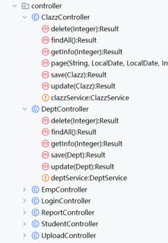
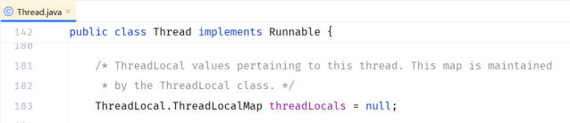

[86 篇](/posts/编程学习/javaweb学习笔记/86-aop进阶/)把 AOP 的四样"武器"备齐了：**通知类型**（`@Around` 前后都管）、**切入点表达式**（`execution` 与 `@annotation`）、**通知顺序**（`@Order`）、**连接点**（`JoinPoint` / `ProceedingJoinPoint` 能拿到类名、方法名、参数、返回值）。这一篇（PPT 第 28～34 页）就用它们做一件真实项目里天天要干的事——**记录操作日志**：谁、在什么时间、调了哪个类的哪个方法、传了什么参数、返回了什么、花了多久，全部落进数据库的 `operate_log` 表。这个案例还有一条暗线：**日志要记下"是谁操作的"，可这个"谁"是 [83 篇](/posts/编程学习/javaweb学习笔记/83-过滤器filter/)那个令牌校验过滤器解析出来的**——两段代码跑在不同位置、不在同一次方法调用里，中间靠 **ThreadLocal** 传值。

## 案例需求（PPT 第 28～30 页）

PPT 第 28 页是章节导航页（AOP基础 / AOP进阶 / **AOP案例**），第 29 页是"**03 AOP案例**"的小标题页，第 30 页才是正题。需求只有两句话：

> 将案例中**增、删、改**相关接口的操作日志记录到数据库表中
>
> 日志信息包含：**操作人、操作时间、执行方法的全类名、执行方法名、方法运行时参数、返回值、方法执行时长**

七项日志信息，正好对上七列数据：

| 日志信息 | 从哪来（本篇后面逐一兑现） |
| --- | --- |
| 操作人 | 当前登录员工的 id——**ThreadLocal** 里取（难点就在这一项） |
| 操作时间 | `LocalDateTime.now()`，写日志的那一刻 |
| 执行方法的全类名 | 连接点信息：`joinPoint.getTarget().getClass().getName()` |
| 执行方法名 | 连接点信息：`joinPoint.getSignature().getName()` |
| 方法运行时参数 | 连接点信息：`Arrays.toString(joinPoint.getArgs())` |
| 返回值 | 环绕通知里 `proceed()` 的返回值 |
| 方法执行时长 | 目标方法前后各取一次 `System.currentTimeMillis()`，相减 |

> [!IMPORTANT]
> 别和 [71 篇](/posts/编程学习/javaweb学习笔记/71-事务进阶与操作日志/)的案例弄混：那一篇记的是 `emp_log`（在 Service 里**手写**一句 `insertLog`，记录"新增员工"这一件事的成败，用来演示 `REQUIRES_NEW`）；这一篇记的是 `operate_log`（**所有**增删改接口的通用操作流水，靠 AOP 一处编织完成，业务代码一行不动）。表不同、颗粒度不同、实现手段也不同。

### 前置准备：表、实体类、Mapper（课程资料 `03. Aop案例/日志表.sql`）

日志表的建表脚本：

```sql
-- 操作日志表
create table operate_log(
    id int unsigned primary key auto_increment comment 'ID',
    operate_emp_id int unsigned comment '操作人ID',
    operate_time datetime comment '操作时间',
    class_name varchar(100) comment '操作的类名',
    method_name varchar(100) comment '操作的方法名',
    method_params varchar(2000) comment '方法参数',
    return_value varchar(2000) comment '返回值',
    cost_time bigint unsigned comment '方法执行耗时, 单位:ms'
) comment '操作日志表';
```

实体类 `com.itheima.pojo.OperateLog`（Lombok 的 `@Data`，字段名和列名一一对应）：

```java
package com.itheima.pojo;

import lombok.Data;
import java.time.LocalDateTime;

@Data
public class OperateLog {
    private Integer id;                // ID
    private Integer operateEmpId;      // 操作人ID
    private LocalDateTime operateTime; // 操作时间
    private String className;          // 操作类名
    private String methodName;         // 操作方法名
    private String methodParams;       // 操作方法参数
    private String returnValue;        // 操作方法返回值
    private Long costTime;             // 操作耗时
}
```

Mapper 接口 `com.itheima.mapper.OperateLogMapper`——只提供一个插入方法，注解写 SQL（[54 篇](/posts/编程学习/javaweb学习笔记/54-mybatis增删改查/)起讲过这种写法）：

```java
package com.itheima.mapper;

import com.itheima.pojo.OperateLog;
import org.apache.ibatis.annotations.Insert;
import org.apache.ibatis.annotations.Mapper;

@Mapper
public interface OperateLogMapper {

    // 插入日志数据
    @Insert("insert into operate_log (operate_emp_id, operate_time, class_name, method_name, method_params, return_value, cost_time) " +
            "values (#{operateEmpId}, #{operateTime}, #{className}, #{methodName}, #{methodParams}, #{returnValue}, #{costTime});")
    public void insert(OperateLog log);
}
```

> [!NOTE]
> **数据库连接沿用课程工程 `application.yml` 那一套**：主机 `localhost`、端口 `3306`、库名 `tlias`、用户名 `root`，课程示例密码是 `1234`——**动手时把 `password` 换成你自己 MySQL 的密码**。（[71 篇](/posts/编程学习/javaweb学习笔记/71-事务进阶与操作日志/)的 `emp_log` 和这张 `operate_log` 都建在 `tlias` 库里。）

## 两个关键选择（PPT 第 30 页）

第 30 页在需求下面直接抛了两个问题，答案也给了：

> **采用哪种通知类型？** → **`@Around` 环绕通知**
> **切入点表达式该怎么写？** → 两种答案都列了出来

### ① 通知类型只能是环绕通知

五种通知里为什么偏偏选 `@Around`？对照需求就能推出来：

| 通知类型 | 拿得到返回值吗 | 拿得到耗时吗 | 能不能写日志 |
| --- | --- | --- | --- |
| `@Before` | 不能（目标方法还没跑） | 不能 | 信息不全 |
| `@AfterReturning` / `@After` / `@AfterThrowing` | 只有 `@AfterReturning` 能拿到返回值 | 不能（前后没有成对的时间点） | 信息不全 |
| **`@Around`** | **能**（`proceed()` 的返回值） | **能**（`proceed()` 前后各取一次时间戳） | **七项全齐** |

返回值和耗时这两项都要求"**目标方法前后都有我的代码**"，而这正是环绕通知的定义（[86 篇](/posts/编程学习/javaweb学习笔记/86-aop进阶/)重点讲过）。两条老规矩在这里同样是硬性的：

- **必须自己调 `joinPoint.proceed()`**，否则目标方法根本不执行；
- **返回值必须是 `Object`**（`public Object logOperation(...)`），并且要把 `proceed()` 的结果**原样 `return` 出去**——Controller 还等着这个 `Result` 转成 JSON，丢了它前端就收不到正常响应。

PPT 上写着 `@Around("execution(...)")` 和 `@Around("@annotation(...)")` 两个版本，下面两张图先交代"业务接口长什么样"，再解释为什么课程最终选了注解版本。

### ② 切入点表达式：从"名字猜"到"打标记"

先看工程里要记日志的接口都在哪：


*图：PPT 第 30 页配的工程结构截图——`com.itheima.controller` 包下的 `ClazzController`、`DeptController`、`EmpController`……每个 Controller 里都有 `save` / `update` / `delete` 这一组增删改方法（还有 `findAll`、`getInfo`、`page` 这类查询方法，它们**不记**）。日志表要记的是"所有 Controller 的增删改"，写法上只有两条路：靠方法名匹配，或者靠方法上的标记*

**写法一：`execution` 拼三个 `||`**（PPT 第 30 页给出的第一种写法）：

```java
@Around("execution(* com.itheima.controller.*.save(..)) ||" +
        "execution(* com.itheima.controller.*.delete(..)) ||" +
        "execution(* com.itheima.controller.*.update(..))")
```

拆开看：`*` 通配返回值，`com.itheima.controller.*` 匹配 controller 包下的每个类，`save(..)` 匹配方法名与任意个数/类型的参数（[86 篇](/posts/编程学习/javaweb学习笔记/86-aop进阶/)讲过的 `*` 与 `..`）。PPT 还补了一句理由：

> 由于增、删、改方法名我们定义的比较规范，分别为 **save、delete、update**

**写法二：`@annotation` 匹配"贴了标记的方法"**：

```java
@Around("@annotation(com.itheima.anno.Log)")
```

要贴的"标记"是一个**自定义注解** `com.itheima.anno.Log`，只有三个要素：

```java
package com.itheima.anno;

import java.lang.annotation.ElementType;
import java.lang.annotation.Retention;
import java.lang.annotation.RetentionPolicy;
import java.lang.annotation.Target;

@Target(ElementType.METHOD)          // 只能加在方法上
@Retention(RetentionPolicy.RUNTIME)  // 运行期保留——AOP 是在运行时读它的，不能丢
public @interface Log {
}
```

然后在需要记日志的方法上写一个 `@Log` 就行（课程工程 `DeptController` 里 `delete`、`add`、`update` 三个方法各贴了一个，查询方法一个都没贴）：

```java
@Log   // 标记：这个方法要记操作日志
@PostMapping
public Result add(@RequestBody Dept dept){
    log.info("新增部门:{}", dept);
    deptService.add(dept);
    return Result.success();
}
```

两种写法各自的脾气，摆在 PPT 的案例里一比就清楚了：

| | `execution` 拼三个 `||` | `@annotation(自定义注解)` |
| --- | --- | --- |
| 靠什么匹配 | **方法名**（save / delete / update） | **方法上有没有这个注解** |
| 新增方法"名字不叫 save"时 | **漏掉**——比如课程工程 `DeptController` 新增部门的方法叫 `add`，`execution(* ...*.save(..))` 匹配不到它 | 照样记——名字随便叫，贴了 `@Log` 就生效 |
| 想改控制范围时 | 改切点表达式（动的是"匹配规则"，容易误伤/漏网） | 在方法上加/去掉 `@Log`（动的是"业务代码里的一个标记"，一目了然） |
| 适合 | 整个团队的方法命名**严格统一**（findXxx / saveXxx / updateXxx，[86 篇](/posts/编程学习/javaweb学习笔记/86-aop进阶/)的书写建议） | 想**精确点名**哪些方法要增强时 |

课程最终采用**写法二**，`@Around` 的完整写法就是这一行：

```java
@Around("@annotation(com.itheima.anno.Log)")
```

界定一下两种表达式在项目里的分工（[86 篇](/posts/编程学习/javaweb学习笔记/86-aop进阶/)已总结：谁描述起来方便就用谁）：这里要记的是"散落在各个 Controller 里、命名不完全一致的增删改方法"，`execution` 描述起来又长又容易漏，给方法贴个 `@Log` 反而最省事。

> [!TIP]
> 第 30 页还顺手给了案例的 AI 提示词（课程资料 `prompt.txt`）——把需求、目标包名、表结构、实体类、Mapper 方法一起交给 AI，让它生成切面代码。原样摘一段：
> ```text
> 假如你是一名java开发工程师, 请帮我基于Spring AOP实现记录系统所有增、删、改功能接口的操作日志。具体信息如下：
> 1. 日志信息包含：操作人、操作时间、目标类的全类名、目标方法的方法名、方法运行时参数、返回值、方法执行时长
> 2. 功能接口所在包为 com.itheima.controller
> 3. 日志表为 operate_log 表，对应的实体类为 OperateLog。（后附表结构与实体类）
> 4. 并且已经提供了OperateLogMapper接口来操作 operate_log, 并在其中已经定义好了 insert 方法用来保存日志数据.
> ```
> 提示词给得越"死"（表结构、包名、已有的类和方法都写清楚），AI 生成的代码越贴项目——但要像审查自己写的一样逐行读过去，尤其是"当前登录员工"这一段：AI 并不知道你的项目是怎么登录的（PPT 第 31 页接着就把这个问题摆了出来）。

## 怎么拿到"当前登录员工"（PPT 第 31 页）

日志七项里有六项都能从连接点或计时里得到，**唯独"操作人"不行**：切面代码里既没有 `HttpServletRequest`（不是 Controller 方法，拿不到请求对象），也没有任何"当前用户"这种参数。PPT 第 31 页把这件事拆成了三个问题：

| PPT 的提问 | PPT 的答案 |
| --- | --- |
| 员工登录成功后，哪里存储的有当前登录员工的信息？ | **给客户端浏览器下发的 jwt 令牌中** |
| 如何从 jwt 令牌中获取到当前登录的员工信息？ | **获取请求头中传递的 jwt 令牌，并解析** |
| `TokenFilter` 中已经解析了令牌的信息，如何将其传递给 AOP 程序、Controller、Service 呢？ | **ThreadLocal** |

把这三句展开成事实链（都是前面几篇写过的东西）：

1. **登录时**，`EmpServiceImpl.login` 校验完用户名密码，把员工信息塞进令牌：`claims.put("id", e.getId())`、`claims.put("username", ...)`，生成 JWT 返回给前端（[81 篇](/posts/编程学习/javaweb学习笔记/81-登录功能/)、[82 篇](/posts/编程学习/javaweb学习笔记/82-会话技术与jwt令牌/)）——**所以"是谁"这件事，令牌里有**；
2. **此后每个请求**，前端把令牌放在请求头 `token` 里带上；[83 篇](/posts/编程学习/javaweb学习笔记/83-过滤器filter/)写的 `TokenFilter` 会在放行之前把令牌解析开——它早就把 `id` 从令牌里取出来了，只是**取完就丢了**（原代码只做校验，不保存结果）：

   ```java
   Claims claims = JwtUtils.parseToken(token);
   Integer empId = Integer.valueOf(claims.get("id").toString());  // 这里已经拿到员工 id 了
   ```
3. **问题是这三段代码不在同一次方法调用里**：`TokenFilter` 在请求链的最外圈，AOP 切面在 Controller 方法外面，中间隔着好几层。让 Controller/Service 的方法签名里多加一个 `Integer empId` 参数？——那等于为了让切面记日志去改所有业务方法的签名，**又违反"代码无侵入"了**（PPT 第 3 页的四大优势之一）。

   那怎么办？想想 AOP 切面跟 `TokenFilter` 之间有什么共同点——**它们跑在同一条线程上**：一次 HTTP 请求，从头到尾（Filter → Controller → Service → AOP）都是同一个线程在处理。如果有一个"**只属于当前线程的储物柜**"，`TokenFilter` 存进去、切面取出来，既不碰业务方法签名、也不用把请求对象一层层往下传。

**ThreadLocal 就是那个储物柜。** PPT 第 31 页还贴心地给了对应的 AI 提示词，措辞就是开发时该问清楚的问题：

> 我在令牌校验过滤器 TokenFilter 中获取了 jwt 令牌，并对其进行解析获取到了当前登录员工的 ID，如何将这个 ID 传递给 AOP 程序、Controller、Service 中呢？

## ThreadLocal：给每个线程一间自己的储物柜（PPT 第 32 页）

PPT 第 32 页先纠正一个望文生义的误会：

> **ThreadLocal 并不是一个 Thread，而是 Thread 的局部变量。**
> ThreadLocal 为**每个线程提供一份单独的存储空间**，具有**线程隔离**的效果，不同的线程之间不会相互干扰。

名字里的 `Local` 修饰的不是"线程"，而是"变量"——它是"**线程本地的变量**"。原理上，每个 `Thread` 对象内部都挂着一个自己的 Map（`ThreadLocalMap`），`ThreadLocal` 对象本身只是一个"钥匙"：


*图：PPT 第 32 页配的 JDK 源码截图（`Thread.java`）——`Thread` 类里有一个 `ThreadLocal.ThreadLocalMap threadLocals = null;` 字段：**每个线程各有一个这样的 Map**，`ThreadLocal` 的 set/get 就是往"当前线程的那个 Map"里放/取。所以同一个 `ThreadLocal` 对象在线程 A、线程 B 里各自保存一份值，互不可见——这就是线程隔离*

PPT 用四根线程的示意图画过这件事：`Thread-1`~`Thread-4` 各自带一份"线程本地变量"（`ThreadLocalMap`），同一个 `ThreadLocal` 在四份 Map 里对应的值可以完全不同。

`ThreadLocal` 的常用方法就三个：

| 方法 | 作用 |
| --- | --- |
| `public void set(T value)` | 设置当前线程的线程局部变量的值 |
| `public T get()` | 返回当前线程所对应的线程局部变量的值 |
| `public void remove()` | 移除当前线程的线程局部变量 |

**线程隔离**能不能亲眼看见？课程工程里有个现成的测试类 `ThreadLocalTest`，主线程和子线程各 set 一次，看谁读到自己写的值：

```java
package com.itheima;

public class ThreadLocalTest {

    private static ThreadLocal<String> local = new ThreadLocal<>();

    public static void main(String[] args) {
        local.set("Main Message");                       // 主线程存自己的那份

        // 创建线程
        new Thread(new Runnable() {
            @Override
            public void run() {
                local.set("Sub Message");                // 子线程存它自己的那份
                System.out.println(Thread.currentThread().getName() + " : " + local.get());
            }
        }).start();

        System.out.println(Thread.currentThread().getName() + " : " + local.get());

        local.remove();                                  // 主线程把自己那份清掉
        System.out.println(Thread.currentThread().getName() + " : " + local.get());
    }
}
```

主线程打印的是 `Main Message`（**不是**子线程刚存进去的 `Sub Message`）、子线程打印 `Sub Message`，`remove()` 之后主线程再取是 `null`——三行输出互相不串门，这就是"线程隔离"。**注意方法三在真实项目里的分量**：`remove()` 不只是"用完清掉"，它是这个机制能不能安全用在 Web 应用里的关键（下一节解释）。

## 三步接入（PPT 第 33 页）

PPT 第 33 页把"获取当前登录员工"落成三个具体步骤：

> ① **定义 ThreadLocal 操作的工具类**，用于操作当前登录员工 ID。
> ② 在 `TokenFilter` 中，解析完当前登录员工 ID，**将其存入 ThreadLocal**（用完之后需将其删除）。
> ③ 在 AOP 程序中，**从 ThreadLocal 中获取当前登录员工的 ID**。

### ① 工具类 `com.itheima.utils.CurrentHolder`

不把 `ThreadLocal` 直接撒在各处，而是包一层静态工具类（课程资料 `04. ThreadLocal/CurrentHolder.java` 就是这个）：

```java
package com.itheima.utils;

public class CurrentHolder {

    private static final ThreadLocal<Integer> CURRENT_LOCAL = new ThreadLocal<>();

    public static void setCurrentId(Integer employeeId) {   // 存：Filter 里调用
        CURRENT_LOCAL.set(employeeId);
    }

    public static Integer getCurrentId() {                  // 取：AOP 里调用
        return CURRENT_LOCAL.get();
    }

    public static void remove() {                           // 清：请求处理完后调用
        CURRENT_LOCAL.remove();
    }
}
```

三个静态方法就是对 `set` / `get` / `remove` 的包装，好处是**全项目只此一份 `ThreadLocal` 对象**——存的人和取的人用的是同一把"钥匙"，而且业务代码里出现的是"当前员工 id"这种有业务含义的名字，不用到处 `new ThreadLocal`。

### ② `TokenFilter` 里存，并在请求结束时清掉

[83 篇](/posts/编程学习/javaweb学习笔记/83-过滤器filter/)那份 `TokenFilter` 只做了"校验"，现在给它加两处——**解析出员工 id 之后存进去**，**放行返回之后清掉**（下面只摘改动相关的两段）：

```java
        //5. 如果token存在, 校验令牌, 如果校验失败 -> 返回错误信息(响应401状态码)
        try {
            Claims claims = JwtUtils.parseToken(token);
            Integer empId = Integer.valueOf(claims.get("id").toString());
            CurrentHolder.setCurrentId(empId);                     // ← 新增：存入 ThreadLocal
            log.info("当前登录员工ID: {}, 将其存入ThreadLocal", empId);
        } catch (Exception e) {
            log.info("令牌非法, 响应401");
            response.setStatus(HttpServletResponse.SC_UNAUTHORIZED);
            return;
        }

        //6. 校验通过, 放行
        log.info("令牌合法, 放行");
        filterChain.doFilter(request, response);                   // 里面才是 Controller/Service/AOP

        //7. 删除ThreadLocal中的数据
        CurrentHolder.remove();                                    // ← 新增：用完清掉
```

这两行的**位置**是精心挑的，看请求的时间轴就懂：

```text
TokenFilter.doFilter
 ├─ 解析令牌 → setCurrentId(1)          ← 请求进入时存
 ├─ filterChain.doFilter(...)  ────────▶ Controller → Service →（AOP 切面在此取用）→ 返回
 └─ remove()                            ← 响应返回后清
```

- `set` 必须在 `filterChain.doFilter` **之前**——放行之前存好，后面的 Controller、Service、AOP 才取得到；
- `remove` 在 `doFilter` **之后**——等"放行出去的整条链路"（含切面写日志）全部跑完，才轮到它执行，所以日志那里一定取得着值；
- 为什么非要 remove？**因为 Tomcat 用线程池处理请求，线程是复用的**：一个请求处理完，那条线程会被还回去接待下一个请求。如果不清，下一个请求万一是没登录、没走 set 的路径（或者属于另一个员工），就可能读到**上一个请求遗留的 id**——日志就记到别人头上了。`ThreadLocalMap` 里长期挂着没清的值，也是内存泄漏的隐患。

> [!WARNING]
> 工程里其实有**两套**登录校验代码：`TokenFilter`（Filter 方案，当前启用）和 `TokenInterceptor`（拦截器方案，`WebConfig` 里注册代码是注释状态，[84 篇](/posts/编程学习/javaweb学习笔记/84-拦截器interceptor/)讲过）。案例的 set/remove 写在 `TokenFilter` 里，因为**真正在发挥作用的是它**；如果改用拦截器方案，对应的位置就是 `preHandle` 里 set、`afterCompletion` 里 remove——"在哪里解析令牌，就在哪里 set/remove"。

### ③ 切面里取

到这一步，切面拿"操作人"就只是一行调用了：

```java
private Integer getCurrentUserId() {
    return CurrentHolder.getCurrentId();
}
```

`CurrentHolder.getCurrentId()` 取的是**当前线程**那份值——刚刚由 `TokenFilter` 存进来的、这次请求的员工 id。

## 完整的切面代码（逐段讲）

前面几节的拼图（自定义注解 + ThreadLocal 三步）到这里全齐了，合起来就是 `com.itheima.aop.OperationLogAspect`：

```java
package com.itheima.aop;

import com.itheima.mapper.OperateLogMapper;
import com.itheima.pojo.OperateLog;
import com.itheima.utils.CurrentHolder;
import lombok.extern.slf4j.Slf4j;
import org.aspectj.lang.ProceedingJoinPoint;
import org.aspectj.lang.annotation.Around;
import org.aspectj.lang.annotation.Aspect;
import org.aspectj.lang.reflect.MethodSignature;
import org.springframework.beans.factory.annotation.Autowired;
import org.springframework.stereotype.Component;

import java.lang.reflect.Method;
import java.time.LocalDateTime;
import java.util.Arrays;

@Slf4j
@Aspect                   // 声明这是一个切面类：通知 + 切入点
@Component                // 交给 Spring 管理（不写它，切面不会被扫描到）
public class OperationLogAspect {

    @Autowired
    private OperateLogMapper operateLogMapper;   // 日志写库用的 Mapper

    @Around("@annotation(com.itheima.anno.Log)")  // 切入点：贴了 @Log 的方法才增强
    public Object logOperation(ProceedingJoinPoint joinPoint) throws Throwable {
        long startTime = System.currentTimeMillis();   // ① 目标方法前：计时开始
        // 执行目标方法
        Object result = joinPoint.proceed();          // ② 放行原始方法，并接住返回值
        // 计算耗时
        long endTime = System.currentTimeMillis();    // ③ 目标方法后：计时结束
        long costTime = endTime - startTime;

        // 构建日志实体
        OperateLog olog = new OperateLog();
        olog.setOperateEmpId(getCurrentUserId());     // ④ 操作人：ThreadLocal 里取（TokenFilter 存进来的）
        olog.setOperateTime(LocalDateTime.now());     //    操作时间：此刻
        olog.setClassName(joinPoint.getTarget().getClass().getName());  //    全类名：连接点
        olog.setMethodName(joinPoint.getSignature().getName());         //    方法名：连接点
        olog.setMethodParams(Arrays.toString(joinPoint.getArgs()));     //    参数：连接点
        olog.setReturnValue(result != null ? result.toString() : "void");//    返回值：proceed() 的返回
        olog.setCostTime(costTime);                   //    耗时：两次时间戳相减

        // 保存日志
        log.info("记录操作日志: {}", olog);
        operateLogMapper.insert(olog);                // ⑤ 落库

        return result;                                // ⑥ 原始方法的返回值原样还回去
    }

    private Integer getCurrentUserId() {
        return CurrentHolder.getCurrentId();
    }
}
```

七个字段各自的来源，一张表收尾（这也是检查"有没有漏项"的清单）：

| `OperateLog` 字段 | 数据库列 | 来源 |
| --- | --- | --- |
| `operateEmpId` | `operate_emp_id` | **ThreadLocal**：`CurrentHolder.getCurrentId()`（`TokenFilter` 在放行前存好的） |
| `operateTime` | `operate_time` | `LocalDateTime.now()` |
| `className` | `class_name` | 连接点：`joinPoint.getTarget().getClass().getName()` |
| `methodName` | `method_name` | 连接点：`joinPoint.getSignature().getName()` |
| `methodParams` | `method_params` | 连接点：`Arrays.toString(joinPoint.getArgs())` |
| `returnValue` | `return_value` | 环绕通知：`proceed()` 的返回值 `result.toString()`（`void` 方法兜底成字符串 `"void"`） |
| `costTime` | `cost_time` | 计时：`endTime - startTime`（毫秒） |

几处值得单独记住的细节：

- **`@Around` 用 `ProceedingJoinPoint`**（[86 篇](/posts/编程学习/javaweb学习笔记/86-aop进阶/)讲过：只有环绕通知需要这个能调 `proceed()` 的子类型）；
- **方法签名上的 `throws Throwable`** 不能省：`proceed()` 会抛 `Throwable`，异常得继续往上抛给全局异常处理器（[76 篇](/posts/编程学习/javaweb学习笔记/76-全局异常处理/)），不能被切面吞掉；
- **`result != null ? result.toString() : "void"`**：`returnValue` 列是字符串，而 `Result` 对象直接 `.toString()` 就够用（Lombok 的 `@Data` 会生成可读的 `toString`，本机实测写进库的就是 `Result(code=1, msg=success, ...)` 这种形状）；返回值可能为 `null`，所以先判一下；
- **`Arrays.toString(joinPoint.getArgs())`**：`getArgs()` 返回的是 `Object[]`，直接拼字符串只会打印数组地址，用 `Arrays.toString` 才有可读内容（本机实测库里的 `[Dept(id=null, name=AOP测试部, ...)]` 就是这个方法打出来的）；
- **异常时这条日志不会写**：`proceed()` 抛异常后，`logOperation` 里剩下的代码（构建实体、`insert`）全部跳过——这是 [86 篇](/posts/编程学习/javaweb学习笔记/86-aop进阶/)实测过的环绕通知行为（异常时 `@Around` 后半段不执行）。课程案例的目标是"记录成功的操作流水"，所以放在 `proceed()` 之后；如果业务要求"失败也要记"，就得把写日志放进 `finally` 里（课程 PPT 没展开这一点，按需处理）。

> [!NOTE]
> 课程工程 `OperationLogAspect.java` 里还 import 了 `org.aspectj.lang.reflect.MethodSignature` 和 `java.lang.reflect.Method` 两个类，但代码里并没有用到——它们是"想拿更多方法信息"时的进阶入口（`joinPoint.getSignature()` 的实际类型就是 `MethodSignature`，可以取参数名、方法上其它注解等）。照抄时可以删掉这两行 import，代码更干净。

## 本机实测：三条日志，操作人都是 1

把工程跑起来，带着登录令牌依次调三个接口（新增 / 修改 / 删除部门），`operate_log` 表里实际写入了三条记录：

| id | operate_emp_id | operate_time | method_name | 方法参数（截断） | 返回值（截断） | cost_time |
| --- | --- | --- | --- | --- | --- | --- |
| 1 | **1** | 2026-09-29 23:28:44 | add | `[Dept(id=null, name=AOP测试部, ...)]` | `Result(code=1, msg=success, ...)` | 15 |
| 2 | **1** | 2026-09-29 23:28:45 | update | `[Dept(id=100, name=AOP改名部, ...)]` | `Result(code=1, msg=success, ...)` | 9 |
| 3 | **1** | 2026-09-29 23:28:45 | delete | `[100]` | `Result(code=1, msg=success, ...)` | 9 |

> [!TIP]
> **本机实测**（`tlias` 库，连接信息同上：本地 `localhost:3306`、库 `tlias`、用户 `root`，密码用你自己 MySQL 的）：这张表就是上面两份代码跑出来的证据，三点都能对上：
> 1. **`operate_emp_id` 三条全是 `1`**——这就是 **ThreadLocal 链路的硬证据**：登录时 `TokenFilter` 解析 JWT 拿到员工 id（登录员工 shinaian 的 id 是 1）→ `CurrentHolder.setCurrentId(1)` 存进 ThreadLocal → 同一个请求线程里，切面 `getCurrentUserId()` 取到 `1` → 写进日志表。切面自己并不知道"谁在操作"，全靠这条链传过来；
> 2. **`method_name` 是 `add` / `update` / `delete`、参数和返回值都齐全**——这三样正是连接点提供的：类名（目标类全类名，`com.itheima.controller.DeptController` 这种形状）、`getSignature().getName()`、`getArgs()`、`proceed()` 的返回值；注意第 1 条记的是 **`add`**（`DeptController` 新增方法的名字）——**如果切入点写的是 `execution(... *.save(..))`，这一条根本不会出现**，正好印证了前面"注解写法更稳"的结论；
> 3. **`cost_time` 是 15 / 9 / 9 毫秒**——`proceed()` 前后两次时间戳之差，小数值说明切面开销本身很轻。
>
> 实测之后测试数据已清理（`operate_log` 清空、`dept` 表恢复 6 条），工程里应用也已停止。

## 问答：ThreadLocal 是什么、用在哪（PPT 第 34 页）

PPT 第 34 页用两个问题和答案给这一节收尾：

| 问题 | 答案 |
| --- | --- |
| 什么是 ThreadLocal？ | ThreadLocal 其实是**线程的局部变量**，为每个线程提供**单独一份存储空间**，具有**线程隔离**的效果，不同的线程之间**不会相互干扰** |
| ThreadLocal 的应用场景？ | **在同一个线程 / 同一个请求中，进行数据共享** |

第二句就是本案例的正确答案：`TokenFilter` 和切面不是调用关系，但**同属一条请求线程**——ThreadLocal 成了它们之间那个"不用改方法签名、也不用传参"的数据通道。想象一下换别的办法有多别扭：往 `HttpServletRequest` 里塞属性要先把请求对象一路带到切面；给 Service 方法加参数又要动所有业务代码——都不如"线程级别的共享变量"轻。

## 小结

| 问题 | 答案 |
| --- | --- |
| 案例需求？ | 把**增、删、改**接口的操作日志写进 `operate_log` 表：操作人、操作时间、全类名、方法名、参数、返回值、耗时 |
| 通知类型选谁？ | **`@Around`**——返回值和耗时都要求"目标方法前后都有代码"；注意自己调 `proceed()`、方法返回 `Object` 并原样 `return` |
| 切入点表达式选谁？ | 两种：`execution(...*.save(..)) \|\| ...` 三连（靠方法名）与 `@annotation(com.itheima.anno.Log)`（靠自定义注解）。课程选**注解**——命名不完全统一时不会漏（`DeptController.add` 就是例子） |
| 自定义注解怎么写？ | `@Target(ElementType.METHOD)` + `@Retention(RetentionPolicy.RUNTIME)` 的 `public @interface Log {}`，贴在要记日志的方法上 |
| "操作人"从哪来？ | 登录时员工 id 已写进 JWT（`claims.put("id", ...)`）→ `TokenFilter` 解析令牌时拿到 id → **ThreadLocal** 传递 → 切面 `CurrentHolder.getCurrentId()` 取用 |
| 为什么要 ThreadLocal？ | Filter 与切面不在同一次方法调用里，但**跑在同一条请求线程上**；ThreadLocal 提供线程级的共享空间，不用改业务方法签名、不用传请求对象 |
| ThreadLocal 是什么？ | 不是线程，而是**线程的局部变量**：每个线程一份存储空间，**线程隔离**、互不干扰；方法有 `set` / `get` / `remove` |
| 三个操作步骤？ | ① 定义工具类 `CurrentHolder`；② `TokenFilter` 里解析完 id 后 `set`、放行返回后 `remove`；③ 切面里 `get` |
| 为什么必须 remove？ | Tomcat 线程池**复用线程**：不清掉，下一个请求可能读到上一个请求残留的 id（日志记错人），还会留下内存泄漏隐患 |
| 实测结果？ | 三个接口（add/update/delete）各写一条，共 3 条；`operate_emp_id` **全是 1**（登录员工 shinaian），`method_name`、参数、返回值、耗时齐全 |

## 相关

- [上一篇：AOP进阶](/posts/编程学习/javaweb学习笔记/86-aop进阶/)

## 练习题

### 一、知识回顾（读完直接做下面的实践题）

1. **案例需求**：把案例中**增、删、改**相关接口的操作日志记录到数据库表中；日志信息包含**七项**——操作人、操作时间、执行方法的全类名、执行方法名、方法运行时参数、返回值、方法执行时长
2. **表与实体**：日志表是 `operate_log`，列有 `id`、`operate_emp_id`（操作人ID）、`operate_time`、`class_name`、`method_name`、`method_params`、`return_value`、`cost_time`（bigint，单位 ms）；对应的实体类 `OperateLog` 字段名与列名一一对应（驼峰 ↔ 下划线）；`OperateLogMapper` 里只有一个 `@Insert` 的 `insert(OperateLog log)` 方法
3. **通知类型为什么只能是 `@Around`**：返回值和耗时都要求"目标方法**前后**都有通知代码"——`proceed()` 之前取开始时间、之后取结束时间并拿到返回值；`@Before` 拿不到返回值，其它三种也没有成对的时间点。两条硬性要求：必须自己调 `proceed()`、方法必须返回 `Object` 并把结果原样 `return` 给 Controller
4. **切入点表达式的两种写法**：① `execution(* com.itheima.controller.*.save(..)) || execution(... .delete(..)) || execution(... .update(..))`——**按方法名**匹配，PPT 的理由是"增删改方法名定义得比较规范（save/delete/update）"；② `@annotation(com.itheima.anno.Log)`——**按注解**匹配贴了 `@Log` 的方法。课程最终用注解写法
5. **自定义注解 `@Log` 的三要素**：`public @interface Log {}`，头上必须有 `@Target(ElementType.METHOD)`（只能加在方法上）和 `@Retention(RetentionPolicy.RUNTIME)`（运行期保留，AOP 才能在运行时读到它）
6. **"操作人"从哪来（PPT 第 31 页的三个问题与答案）**：① 当前登录员工信息存在**下发给浏览器的 jwt 令牌**里；② 从**请求头**取令牌并**解析**（`TokenFilter` 已经在做，`claims.get("id")` 就是员工 id）；③ 要传给 AOP/Controller/Service 就用 **ThreadLocal**
7. **ThreadLocal 是什么**：**不是 Thread，而是 Thread 的局部变量**——为每个线程提供一份**单独的存储空间**，具有**线程隔离**效果，不同线程之间不会相互干扰；常用方法三个：`set(T value)` 存、`get()` 取、`remove()` 移除；应用场景是"**在同一个线程 / 同一个请求中共享数据**"
8. **三步操作步骤**：① 定义 ThreadLocal 工具类 `CurrentHolder`（`setCurrentId` / `getCurrentId` / `remove`）；② 在 `TokenFilter` 解析出员工 id 后 `CurrentHolder.setCurrentId(empId)`，**并在 `filterChain.doFilter(...)` 返回之后 `CurrentHolder.remove()`**；③ AOP 切面里 `CurrentHolder.getCurrentId()` 取用
9. **为什么必须 remove**：Tomcat 用线程池、线程会复用——不清理，下一个请求可能读到上一个请求留下的员工 id（日志记错人），`ThreadLocalMap` 里长期挂着无用的值还有内存泄漏隐患。所以放行返回之后要立刻清理
10. **本机实测**：带令牌依次调新增/修改/删除部门三个接口，`operate_log` 写入 **3 条**，`operate_emp_id` **全是 1**（登录员工 shinaian 的 id）——这就是 ThreadLocal 链路的硬证据；`method_name` 分别是 `add` / `update` / `delete`，参数、返回值、`cost_time`（15/9/9 ms）都齐全（实测后数据已清理）

### 二、裸写题

- [ ] **2-1 把增删改接口的操作日志写进数据库**
  需求：项目里各 Controller 都有增删改接口，现在要**自动**把每次增删改的操作流水记进 `operate_log` 表，业务代码里一行日志代码都不想加。日志要包含七项：**操作人、操作时间、执行方法的全类名、执行方法名、方法运行时参数、返回值、方法执行时长**。
  请写出这个"记日志的切面"，并回答两个问题：① 五种通知类型里为什么只能用这一种？② 为什么方法**必须把原始方法的返回值 return 出去**？
  （素材与写作区见 `test_87_操作日志案例.java` 的题目2-1。）
  （"操作人"这一项暂时写 `CurrentHolder.getCurrentId()` 即可，2-2 再亲手实现它。）

  > [!TIP]- 提示（先自己想，实在想不出再点开）
  > **一级 · 思路**：要"自动"就得用 AOP——写一个切面类，在**目标方法前后都留一段自己的代码**（前取开始时间、后取结束时间并接住返回值）；不要动业务代码意味着"记哪些方法"要另想办法标注（2-3 专门练这个，这里可以先用 `execution` 写法顶上）
  > **二级 · 方法**：类上 `@Aspect` + `@Component`（`@Slf4j` 顺手拿到 log）；方法上 `@Around("execution(* com.itheima.controller.*.save(..)) || ...")`，参数用 `ProceedingJoinPoint`；方法里：记时间 → `joinPoint.proceed()` → 记时间 → `new OperateLog()` 七个字段逐个 set → `operateLogMapper.insert(olog)` → `return result`；字段来源：`getTarget().getClass().getName()`、`getSignature().getName()`、`Arrays.toString(getArgs())`、`result.toString()`、`TokenFilter` 存进 ThreadLocal 的 id
  > **三级 · 骨架**：`@____ @____ public class OperationLogAspect { @Autowired private OperateLogMapper ____; @____("____") public ____ logOperation(____ joinPoint) throws Throwable { long startTime = ____; Object result = ____.____(); long costTime = System.currentTimeMillis() - startTime; OperateLog olog = new OperateLog(); olog.setOperateEmpId(____); olog.setOperateTime(____.____()); olog.setClassName(____); olog.setMethodName(____); olog.setMethodParams(____); olog.setReturnValue(____); olog.setCostTime(____); ____.insert(____); return ____; } }`

  > [!TIP]- 参考答案（做完再点开）
  > ```java
  > package com.itheima.aop;
  >
  > import com.itheima.mapper.OperateLogMapper;
  > import com.itheima.pojo.OperateLog;
  > import com.itheima.utils.CurrentHolder;
  > import lombok.extern.slf4j.Slf4j;
  > import org.aspectj.lang.ProceedingJoinPoint;
  > import org.aspectj.lang.annotation.Around;
  > import org.aspectj.lang.annotation.Aspect;
  > import org.springframework.beans.factory.annotation.Autowired;
  > import org.springframework.stereotype.Component;
  >
  > import java.time.LocalDateTime;
  > import java.util.Arrays;
  >
  > @Slf4j
  > @Aspect
  > @Component
  > public class OperationLogAspect {
  >
  >     @Autowired
  >     private OperateLogMapper operateLogMapper;
  >
  >     @Around("execution(* com.itheima.controller.*.save(..)) ||" +
  >             "execution(* com.itheima.controller.*.delete(..)) ||" +
  >             "execution(* com.itheima.controller.*.update(..))")
  >     public Object logOperation(ProceedingJoinPoint joinPoint) throws Throwable {
  >         long startTime = System.currentTimeMillis();                 // 目标方法前
  >         Object result = joinPoint.proceed();                        // 执行原始方法，接住返回值
  >         long costTime = System.currentTimeMillis() - startTime;     // 目标方法后
  >
  >         OperateLog olog = new OperateLog();
  >         olog.setOperateEmpId(CurrentHolder.getCurrentId());         // 操作人（本机实测写进库的是 1）
  >         olog.setOperateTime(LocalDateTime.now());
  >         olog.setClassName(joinPoint.getTarget().getClass().getName());
  >         olog.setMethodName(joinPoint.getSignature().getName());
  >         olog.setMethodParams(Arrays.toString(joinPoint.getArgs()));
  >         olog.setReturnValue(result != null ? result.toString() : "void");
  >         olog.setCostTime(costTime);
  >
  >         log.info("记录操作日志: {}", olog);
  >         operateLogMapper.insert(olog);
  >
  >         return result;                                              // 原样还给 Controller
  >     }
  > }
  > ```
  > ① **只能用 `@Around`**：要算耗时就得"目标方法前后都插一脚"，要记返回值就得接住 `proceed()` 的结果——`@Before` 时目标方法还没跑（没有返回值、没有结束时间），`@AfterReturning` 只有后半段（没有开始时间），都不满足；只有环绕通知前后两段都在自己手里（`proceed()` 之前记开始时间、之后记结束时间并拿到返回值）。
  > ② **必须 `return result`**：这个切面把 Controller 的方法"包"起来了，Controller 拿到的返回值其实是**切面方法的返回值**（[85 篇](/posts/编程学习/javaweb学习笔记/85-aop基础/)讲的动态代理执行流程：调用方以为在调 Controller，实际先进代理/切面）——不 return，Controller 收到 `null`，前端拿不到 `Result`，接口看起来就"坏了"。
  > 补充：`operateLogMapper.insert(olog)` 放在 `proceed()` **之后**，所以目标方法抛异常时这条日志不会写（异常直接把后面的代码跳过了）；要"失败也记"就得挪进 `finally`。

- [ ] **2-2 把"当前登录员工是谁"从令牌校验那道关传到切面里**
  需求：令牌校验那道关（`TokenFilter`）早就把员工 id 从令牌里解析出来了，可是它解析完就丢；切面里又拿不到请求对象，没法自己再解析一遍。请**不改任何业务方法的签名**，把这个 id 从过滤器传到切面里：
  ① 写一个"当前登录员工"的工具类（存、取、清三个方法）；
  ② 在 `TokenFilter` 里补上存取代码（存的位置、清的位置都要想清楚）；
  ③ 说明为什么"清"这一步非做不可。
  （素材与写作区见 `test_87_ThreadLocal工具类.java`。）

  > [!TIP]- 提示（先自己想，实在想不出再点开）
  > **一级 · 思路**：用"只属于当前线程的储物柜"——过滤器、Controller、Service、切面都跑在**同一条请求线程**上，找个线程级别的共享变量就能绕开"改方法签名/传请求对象"；工具类就是把存取这套动作包成有业务含义的静态方法
  > **二级 · 方法**：`ThreadLocal<Integer>` 的 `set(T)` / `get()` / `remove()`；工具类三个静态方法 `setCurrentId(Integer)` / `getCurrentId()` / `remove()`；`TokenFilter` 里在 `JwtUtils.parseToken(token)` 拿到 `claims.get("id")` 之后 `set`，在 `filterChain.doFilter(request, response)` **返回之后** `remove`
  > **三级 · 骨架**：`public class CurrentHolder { private static final ____<Integer> CURRENT_LOCAL = new ____<>(); public static void setCurrentId(Integer employeeId) { CURRENT_LOCAL.____(employeeId); } public static Integer getCurrentId() { return CURRENT_LOCAL.____(); } public static void remove() { CURRENT_LOCAL.____(); } }`；Filter 里：`Integer empId = Integer.valueOf(claims.get("id").toString()); ____.____(empId); ... filterChain.doFilter(request, response); ____.____();`

  > [!TIP]- 参考答案（做完再点开）
  > ① 工具类（与课程资料 `04. ThreadLocal/CurrentHolder.java` 一致）：
  > ```java
  > package com.itheima.utils;
  >
  > public class CurrentHolder {
  >
  >     private static final ThreadLocal<Integer> CURRENT_LOCAL = new ThreadLocal<>();
  >
  >     public static void setCurrentId(Integer employeeId) { CURRENT_LOCAL.set(employeeId); }
  >     public static Integer getCurrentId() { return CURRENT_LOCAL.get(); }
  >     public static void remove() { CURRENT_LOCAL.remove(); }
  > }
  > ```
  > ② `TokenFilter` 的两处改动：
  > ```java
  >         try {
  >             Claims claims = JwtUtils.parseToken(token);
  >             Integer empId = Integer.valueOf(claims.get("id").toString());
  >             CurrentHolder.setCurrentId(empId);                     // 请求进入时存
  >             log.info("当前登录员工ID: {}, 将其存入ThreadLocal", empId);
  >         } catch (Exception e) {
  >             log.info("令牌非法, 响应401");
  >             response.setStatus(HttpServletResponse.SC_UNAUTHORIZED);
  >             return;
  >         }
  >
  >         //6. 校验通过, 放行
  >         filterChain.doFilter(request, response);
  >
  >         //7. 删除ThreadLocal中的数据
  >         CurrentHolder.remove();                                    // 请求处理完清掉
  > ```
  > 位置的道理：`set` 必须在放行**之前**（后面的链路上有人要取），`remove` 必须在放行**之后**（切面写日志发生在放行内部，清早了就取不到了）；`remove` 写在 `doFilter` 之后，等于"这次请求从头到尾处理完"才清。
  > ③ **为什么必须清**：Tomcat 用**线程池**，一条线程处理完一个请求会被还回去接待下一个请求。如果不清，下一个请求（比如没登录、根本没走 set 的那条路径）复用这条线程时，`get()` 会读到**上一个请求残留的 id**——日志就记到别的员工头上了；此外 `ThreadLocalMap` 里长期挂着不再使用的值，也是内存泄漏的隐患。

- [ ] **2-3 让"给哪些接口记日志"由方法上的标记决定**
  需求：现在的做法是拿方法名去猜（`save` / `delete` / `update`），可项目里总有不按这三个名字命名的方法——课程工程 `DeptController` 新增部门的方法就叫 `add`。请改成"**给方法贴一个标记，贴了才记日志**"：
  ① 写出这个标记（注解）；
  ② 写出切面里对应的切入点表达式；
  ③ 回答：这种写法比按方法名匹配强在哪？（至少两点）
  ④ 把 `DeptController` 的增删改三个方法改成这个写法的样子（只写方法与注解）。

  > [!TIP]- 提示（先自己想，实在想不出再点开）
  > **一级 · 思路**："标记"就是自定义注解——自己定义一个什么都不写的方法级注解，贴在方法头上；切面的切入点表达式改成"**匹配贴了某注解的方法**"
  > **二级 · 方法**：注解定义处 `@Target(ElementType.METHOD)` + `@Retention(RetentionPolicy.RUNTIME)`，`public @interface Log {}`；切点表达式用 `@annotation(注解全类名)`，如 `@Around("@annotation(com.itheima.anno.Log)")`
  > **三级 · 骨架**：`@____(ElementType.METHOD) @____(RetentionPolicy.____) public @interface Log {}`；`@____("@annotation(com.itheima.anno.____)")`；方法：`@____ @DeleteMapping public Result delete(Integer id){ ... }`

  > [!TIP]- 参考答案（做完再点开）
  > ① 自定义注解（`com.itheima.anno.Log`）：
  > ```java
  > package com.itheima.anno;
  >
  > import java.lang.annotation.ElementType;
  > import java.lang.annotation.Retention;
  > import java.lang.annotation.RetentionPolicy;
  > import java.lang.annotation.Target;
  >
  > @Target(ElementType.METHOD)          // 只能加在方法上
  > @Retention(RetentionPolicy.RUNTIME)  // 运行期保留：AOP 在运行时读它
  > public @interface Log {
  > }
  > ```
  > ② 切入点表达式：
  > ```java
  > @Around("@annotation(com.itheima.anno.Log)")
  > ```
  > ③ 比按方法名匹配强的两点：
  > - **不会漏**——方法名不再受 `save/delete/update` 约束，哪怕叫 `add`、`modify`、`removeAllDisabled`，只要贴了 `@Log` 就记（课程工程 `DeptController.add` 正是被 `execution(...*.save(..))` 漏掉的那个）；
  > - **控制范围直观、改动集中**——想让某个方法记日志就在它头上加一个 `@Log`，不想记就去掉；不用去动切点表达式（改表达式是在动"全局匹配规则"，改注解是在动"这一个方法"，风险小得多）。
  > ④ `DeptController` 里三个方法的样子（与课程工程一致）：
  > ```java
  > @Log
  > @DeleteMapping
  > public Result delete(Integer id){
  >     deptService.deleteById(id);
  >     return Result.success();
  > }
  >
  > @Log
  > @PostMapping
  > public Result add(@RequestBody Dept dept){
  >     deptService.add(dept);
  >     return Result.success();
  > }
  >
  > @Log
  > @PutMapping
  > public Result update(@RequestBody Dept dept){
  >     deptService.update(dept);
  >     return Result.success();
  > }
  > ```
  > （查询方法 `list`、`getInfo` 不贴 `@Log`——它们不写日志。）

- [ ] **2-4 排查：日志表里 `operate_emp_id` 全是 NULL**
  需求：切面代码（七个字段逐个 set、`insert` 落库）都没问题，日志表也**确实写进去了**，但 `operate_emp_id` 这一列**全是 NULL**——"谁操作的"没记上。请按"数据从哪来"的顺序倒着排查，回答：
  ① 这一列的值应该由哪一行代码提供？（写出调用链：谁存、谁取、靠什么传递）
  ② 依次列出**至少三个**可能导致它是 NULL 的原因，以及每个原因的验证办法；
  ③ 其中有一个原因和"代码写得对不对"无关，而是和**时机**有关——是哪个？怎么改？

  > [!TIP]- 提示（先自己想，实在想不出再点开）
  > **一级 · 思路**：从"值的来源"倒推——切面 `get()` 的那份值是谁 `set` 的？set 的代码进没进？set 之前那一步（解析令牌拿 id）成没成功？存进去之后有没有**太早被清掉**？把这条链从头到尾走一遍，每一环都能出问题
  > **二级 · 方法**：链路是"`TokenFilter` 里 `CurrentHolder.setCurrentId(empId)`（值来自 `claims.get("id")`）→ ThreadLocal → 切面 `getCurrentId()`"；三个常见原因：① 切面里"操作人"那一项压根没从 ThreadLocal 取（写死或漏 set）；② `TokenFilter` 里解析出 id 后**没有 set**（或 set 写在了 `return`/异常分支后面，没执行到）；③ `remove()` **写早**了——比如写在 `filterChain.doFilter` **之前**，值在进 Controller 之前就被清掉；验证办法：在 `set`、`get` 两处各加一行 `log.info` 看日志顺序，或逐个注释/打开对应代码做对照
  > **三级 · 骨架**：① 链路：`____.____(empId)` → ThreadLocal → `____.____()`；② 原因清单：`切面没取 / Filter 没存 / remove 太早 / 令牌里没有 id（用户没登录或 claims 键名不对）`；③ 时机问题：`____()` 的位置，必须放在 `filterChain.doFilter(...)` 的 ____ 面

  > [!TIP]- 参考答案（做完再点开）
  > ① 调用链：`TokenFilter` 解析令牌 `Integer empId = Integer.valueOf(claims.get("id").toString());` → `CurrentHolder.setCurrentId(empId)` **存**进 ThreadLocal → 切面里 `CurrentHolder.getCurrentId()` **取** → `olog.setOperateEmpId(...)` → `insert` 落库。靠的是"整条请求链路跑在同一条线程上"这个前提。
  > ② 可能的原因与验证：
  > | 原因 | 怎么验证 |
  > | --- | --- |
  > | 切面里没从 ThreadLocal 取（漏了这一行 / 取了别的值） | 看切面代码里 `olog.setOperateEmpId(...)` 的参数是不是 `CurrentHolder.getCurrentId()` |
  > | `TokenFilter` 里解析出 id 后没有 `set`（或 `set` 没被执行到） | 在 `set` 那行后面加一句 `log.info("存入: {}", empId)`，看服务端日志有没有打、打的值对不对 |
  > | `remove()` 放得太早——写在 `filterChain.doFilter(...)` **之前** | 看 `remove()` 的位置：它在放行前执行的话，值在进 Controller / 切面之前就被清掉了，`get()` 只能拿到 `null` |
  > | 令牌里本来就没有 `id`（用户没登录、id 键名写错、令牌非法走了 401 分支） | 看 `claims.get("id")` 拿到的值；对照登录时 `claims.put("id", e.getId())` 的键名 |
  > ③ 与"时机"有关的是 **`remove()` 的位置**：它必须写在 `filterChain.doFilter(request, response)` **之后**（放行的整条链路——含 AOP 写日志——全部跑完才清）；写在 `doFilter` 之前，切面取到的就是 `null`。同理，`set` 必须在 `doFilter` **之前**，顺序不能颠倒。

### 三、综合题

- [ ] **3-1 照课程案例走一遍：给 Tlias 工程接上操作日志**
  这一题把本篇串起来：**建表 → 注解 → ThreadLocal 三步 → 切面 → 实测**。
  1. 在 `tlias` 库里执行课程资料的建表脚本（`03. Aop案例/日志表.sql`），建出 `operate_log` 表；确认实体类 `OperateLog`、Mapper `OperateLogMapper`（含 `insert` 方法）都在工程里；
  2. 新建自定义注解 `com.itheima.anno.Log`（想清楚两个元注解各写什么值、为什么 `Retention` 必须是 `RUNTIME`）；
  3. 写 ThreadLocal 工具类 `com.itheima.utils.CurrentHolder`（存 / 取 / 清三个静态方法）；
  4. 改 `TokenFilter`：解析令牌拿到员工 id 后存进 ThreadLocal；请求处理完（放行返回后）清掉。想清楚这两行为什么必须一前一后夹住 `filterChain.doFilter(...)`；
  5. 写切面 `com.itheima.aop.OperationLogAspect`：类上两个注解、方法上一个环绕通知 + 一个注解式切入点；方法里计时 → 执行原始方法 → 构建七项日志 → 落库 → **原样返回结果**；
  6. 给 `DeptController` 的**增、删、改**三个方法贴上 `@Log`（查询方法不贴），启动应用；
  7. 先登录拿到令牌，再带着令牌依次调 **新增 / 修改 / 删除部门** 三个接口（这三步在实测里就是 `add` / `update` / `delete` 三条记录）；
  8. 查 `operate_log` 表：一共几条？`operate_emp_id` 都是几？`method_name` 分别是什么？**答案写进练习文件的记录区**，并解释 `operate_emp_id` 为什么是这个值（把 TokenFilter → ThreadLocal → 切面的链路写清楚）；
  9. 把切面里"操作人"那一行**临时改成** `null`（或把 `CurrentHolder.getCurrentId()` 换成 `null`），重新构建启动、再调一次删除接口，看表里新记录的 `operate_emp_id` 是什么——这反过来说明那一行代码在干嘛（对照完记得改回来）；
  10. 收尾：清空实验数据（删掉测试新增的部门日志行，`dept` 表恢复原样），停掉应用。
  （练习文件 `test_87_操作日志案例.java` 里按这 10 步给了写作区。）

  **涉及知识点**

  | 知识点 | 在这里的应用 |
  | --- | --- |
  | `@Around` 环绕通知 | 第 5 步——耗时与返回值都要求"前后都有代码"；自己调 `proceed()` 并 `return` 结果 |
  | `@annotation` 切入点 + 自定义注解 | 第 2、5、6 步——`@annotation(com.itheima.anno.Log)`；`@Target(METHOD)` + `@Retention(RUNTIME)` |
  | 连接点 `ProceedingJoinPoint` | 第 5 步——全类名、方法名、参数、返回值都从它身上取 |
  | ThreadLocal | 第 3、4、5 步——`CurrentHolder` 工具类；Filter 里 set/remove、切面里 get |
  | `TokenFilter` 与 JWT | 第 4、7 步——`claims.get("id")` 是"操作人"的源头（令牌在登录时下发） |
  | `OperateLogMapper.insert` | 第 1、5、8 步——七项日志落进 `operate_log` 表 |
  | 线程池与 remove 的必要性 | 第 4、9 步——不复用线程时不清会串数据 |

  > [!TIP]- 提示（先自己想，实在想不出再点开）
  > **一级 · 思路**：第 2～5 步就是本篇的四块代码逐块敲出来（注解、工具类、Filter 两行改动、切面）；第 7 步别忘了**先登录拿令牌、再带着令牌请求**（不带令牌会吃 401，`TokenFilter` 连解析都进不去）
  > **二级 · 方法**：注解用 `@Target(ElementType.METHOD)` + `@Retention(RetentionPolicy.RUNTIME)`；工具类里 `ThreadLocal<Integer>` 的 `set/get/remove`；Filter 里在 `claims.get("id")` 之后 `set`、在 `filterChain.doFilter(...)` 之后 `remove`；切面里 `@Around("@annotation(com.itheima.anno.Log)")`；请求用 Apifox/Postman 或 `curl`（请求头带 `token`）
  > **三级 · 骨架**：`@____ @____ public class CurrentHolder { private static final ____<Integer> CURRENT_LOCAL = new ____<>(); ... }`；切面：`@____("@annotation(com.itheima.anno.____)") public Object logOperation(ProceedingJoinPoint ____) throws Throwable { ... }`；请求：登录 `POST /login` 拿 `token` → 新增/修改/删除部门 `POST /depts`、`PUT /depts`、`DELETE /depts?id=____`

  > [!TIP]- 参考答案（做完再点开）
  > 1. 建表（课程资料 `03. Aop案例/日志表.sql`）：
  >    ```sql
  >    create table operate_log(
  >        id int unsigned primary key auto_increment comment 'ID',
  >        operate_emp_id int unsigned comment '操作人ID',
  >        operate_time datetime comment '操作时间',
  >        class_name varchar(100) comment '操作的类名',
  >        method_name varchar(100) comment '操作的方法名',
  >        method_params varchar(2000) comment '方法参数',
  >        return_value varchar(2000) comment '返回值',
  >        cost_time bigint unsigned comment '方法执行耗时, 单位:ms'
  >    ) comment '操作日志表';
  >    ```
  > 2. 注解：
  >    ```java
  >    @Target(ElementType.METHOD)          // 只贴方法
  >    @Retention(RetentionPolicy.RUNTIME)  // 运行期保留，AOP 才读得到（写 SOURCE/CLASS 都会被丢掉）
  >    public @interface Log { }
  >    ```
  > 3. 工具类：
  >    ```java
  >    public class CurrentHolder {
  >        private static final ThreadLocal<Integer> CURRENT_LOCAL = new ThreadLocal<>();
  >        public static void setCurrentId(Integer employeeId) { CURRENT_LOCAL.set(employeeId); }
  >        public static Integer getCurrentId() { return CURRENT_LOCAL.get(); }
  >        public static void remove() { CURRENT_LOCAL.remove(); }
  >    }
  >    ```
  > 4. `TokenFilter` 的两行（位置是重点）：
  >    ```java
  >    Claims claims = JwtUtils.parseToken(token);
  >    Integer empId = Integer.valueOf(claims.get("id").toString());
  >    CurrentHolder.setCurrentId(empId);        // 放行之前存
  >    ...
  >    filterChain.doFilter(request, response);  // 放行的整条链路（含 AOP）在这里面跑完
  >    CurrentHolder.remove();                   // 之后才清
  >    ```
  > 5~6. 切面与 Controller 见本篇正文（`OperationLogAspect` + `DeptController` 三个方法上的 `@Log`）。
  > 7~8. **本机实测**：依次调新增、修改、删除部门接口后，`operate_log` 里共 **3 条**：
  >
  >    | id | operate_emp_id | operate_time | method_name | 方法参数（截断） | 返回值（截断） | cost_time |
  >    | --- | --- | --- | --- | --- | --- | --- |
  >    | 1 | **1** | 2026-09-29 23:28:44 | add | `[Dept(id=null, name=AOP测试部, ...)]` | `Result(code=1, msg=success, ...)` | 15 |
  >    | 2 | **1** | 2026-09-29 23:28:45 | update | `[Dept(id=100, name=AOP改名部, ...)]` | `Result(code=1, msg=success, ...)` | 9 |
  >    | 3 | **1** | 2026-09-29 23:28:45 | delete | `[100]` | `Result(code=1, msg=success, ...)` | 9 |
  >
  >    `operate_emp_id` 全是 **1** 的原因：登录员工 shinaian 的 id 是 1，登录时它被写进 JWT（`claims.put("id", e.getId())`）；每个请求带着这个令牌 → `TokenFilter` 解析出 id 并 `CurrentHolder.setCurrentId(1)` → 同一个请求线程里切面 `getCurrentId()` 取到的就是 1 → 写进日志表。**切面自己不知道"谁在操作"，值完全靠这条链路传过来**（这就是 ThreadLocal 的用处）。
  > 9. 把"操作人"那行换成 `null` 之后再调一次删除接口，这条新记录的 `operate_emp_id` 会是 **NULL**（这一列没有非空约束，`insert` 写进去的就是 `null`）——说明这一列的值**只可能**来自 `CurrentHolder.getCurrentId()` 这一行（ThreadLocal 里由 `TokenFilter` 存进来的值），也能反过来体会：一旦 `set`/`get`/`remove` 三个时机里任何一个错了，这一列就会是 NULL。
  > 10. 收尾：把实验写入的日志行删掉（`operate_log` 清空）、`dept` 表恢复原样，停掉应用。
