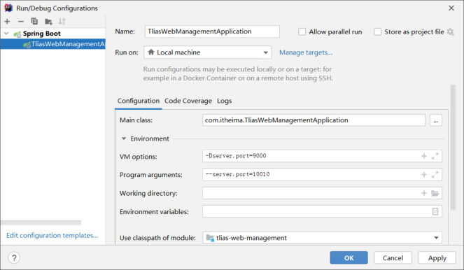

[87 篇](/posts/编程学习/javaweb学习笔记/87-aop案例-记录操作日志/)给 AOP 那章收了尾：切面记日志、ThreadLocal 传操作人，一条链路完整跑通。从这一篇开始进入新的章节——**第 14 章：后端 Web 进阶**。这一章不再写新的业务接口，而是回头把一直在用的 SpringBoot 本身**拆开看**：配置从哪儿来、Bean 由谁管、自动配置是怎么发生的、公共组件怎么打包成 starter 给别人用。

## 这一章的地图（PPT 第 1～2 页）

PPT 第 1 页是封面"**Web 后端开发 / SpringBoot 原理篇**"，第 2 页是这一篇的目录，把内容分成三块：

> **配置优先级** / **Bean 管理** / **SpringBoot 原理**

三块的分工是这样的：

| 块 | 内容 | 落在哪篇 |
| --- | --- | --- |
| 01 配置优先级 | 同一个配置能写在哪些地方、谁覆盖谁 | 本篇（PPT 第 3～7 页） |
| 02 Bean 管理 | Bean 的作用域、第三方 Bean 怎么交给容器 | 本篇（PPT 第 8～13 页） |
| 03 SpringBoot 原理 | 起步依赖、自动配置的实现方案与源码跟踪 | [89 篇](/posts/编程学习/javaweb学习笔记/89-springboot自动配置原理/)（PPT 第 14～33 页） |
| 03 自定义 starter | 把公共组件封装成 starter | 90 篇（PPT 第 34～36 页） |

第 14 章除了这套 SpringBoot 原理的 PPT，后面还有 Maven 高级（分模块、继承与聚合、私服）和一份后端 Web 开发总结，分别在 91～94 篇。

## 三种格式的配置文件（PPT 第 3～4 页）

PPT 第 3 页翻到"**01 配置优先级**"的小节页，第 4 页开门见山：**SpringBoot 中支持三种格式的配置文件**。

这三种格式本身在 [56 篇](/posts/编程学习/javaweb学习笔记/56-springboot配置文件/)已经见过（那篇讲了 yml 的四条语法和对象/数组写法），这一节的重点换成了**它们凑在一起时谁说了算**。三种格式的写法与最小例子：

| 格式 | 文件名 | 写法 | 例子 |
| --- | --- | --- | --- |
| ① properties | `application.properties` | `键=值`，一行一项 | `server.port=8081` |
| ② yml | `application.yml` | 缩进层级 + `键: 值` | `server:` 换行缩进 `port: 8082` |
| ③ yaml | `application.yaml` | 与 yml 完全同一种语法 | `server:` 换行缩进 `port: 8083` |

```properties
# application.properties
server.port=8081
```

```yaml
# application.yml
server:
  port: 8082
```

```yaml
# application.yaml
server:
  port: 8083
```

三个文件里写的是**同一项配置**（`server.port`），但值各不相同——这是课程故意这么放的，为的是待会儿能一眼看出"到底哪一个生效"。

> [!IMPORTANT]
> PPT 第 4 页的**注意**：
>
> 虽然 SpringBoot 支持多种格式配置文件，但是在项目开发时，**推荐统一使用一种格式的配置**（**yml 是主流**）。
>
> 原因也好理解：三种格式能表达的东西重合度很高，混着用之后"这个配置到底在哪个文件里"就要翻三遍；而且按下面要讲的优先级，高优先级的文件会把低优先级的**整份忽略**掉，稍不留神就会出现"我改了配置怎么没生效"。

课程项目（[57 篇](/posts/编程学习/javaweb学习笔记/57-tlias项目准备与开发规范/)搭的 Tlias 工程）用的就是一份 `application.yml`，里面装着数据库连接、MyBatis 配置、阿里云 OSS 参数（[73 篇](/posts/编程学习/javaweb学习笔记/73-阿里云oss与参数配置化/)）：

```yaml
# application.yml（节选）
spring:
  #数据库连接信息
  datasource:
    driver-class-name: com.mysql.cj.jdbc.Driver
    url: jdbc:mysql://localhost:3306/tlias
    username: root
    password: 1234          # 课程示例是 1234，换成你自己 MySQL 的密码
#Mybatis配置
mybatis:
  configuration:
    log-impl: org.apache.ibatis.logging.stdout.StdOutImpl
    map-underscore-to-camel-case: true
#阿里云OSS
aliyun:
  oss:
    endpoint: https://oss-cn-beijing.aliyuncs.com
    bucketName: java-ai
    region: cn-beijing
```

> [!TIP]
> 数据库连接信息沿用课程原样（`tlias` 库、`root`、`password: 1234`），动手时把 `password` 换成你自己 MySQL 的密码——[70 篇](/posts/编程学习/javaweb学习笔记/70-事务管理与spring事务/)开始就一直这么写，本机实测用的也是自己的密码。

## Java 系统属性与命令行参数（PPT 第 5～6 页）

配置文件不是唯一的配置来源。PPT 第 5 页说：**SpringBoot 除了支持配置文件属性配置，还支持 Java 系统属性和命令行参数的方式进行属性配置**。

| 方式 | 写法 | 在 IDEA 里填在哪 |
| --- | --- | --- |
| Java 系统属性 | `-Dserver.port=9000` | Run/Debug Configurations 的 **VM options** |
| 命令行参数 | `--server.port=10010` | Run/Debug Configurations 的 **Program arguments** |


*图：IDEA 的 Run/Debug Configurations 窗口——VM options 里写着 `-Dserver.port=9000`，Program arguments 里写着 `--server.port=10010`，两个输入框正好对应两种外置配置方式*

两种写法的形状不一样，记的时候别混：**Java 系统属性是 `-D` 开头、等号连接**（`-Dserver.port=9000`），**命令行参数是 `--` 开头**（`--server.port=10010`）。前者是 JVM 层面的属性，后者是给应用传的参数（就是我们一直在 `main` 方法里看到的那个 `String[] args`——[57 篇](/posts/编程学习/javaweb学习笔记/57-tlias项目准备与开发规范/)里 `SpringApplication.run(..., args)` 的那个 `args`）。

## 打包与运行（PPT 第 6 页）

PPT 第 6 页把两种方式的**完整命令**放在一起，这条命令只有在"把工程打成 jar 包"之后才能跑：

```text
java -Dserver.port=9000 -jar tlias-web-management-0.0.1-SNAPSHOT.jar --server.port=10010
```

它对应的两步操作是：

1. 执行 Maven 打包指令 **`package`**（IDEA 右侧 Maven 面板 Lifecycle 里的 `package`，或命令行 `mvn package`）——产物在工程的 `target/` 目录下，形如 `tlias-web-management-0.0.1-SNAPSHOT.jar`；
2. 执行 `java` 指令，运行 jar 包：`java -jar xxx.jar`（要改端口就在这条命令上动手，两种外置配置都能往上加）。

> [!IMPORTANT]
> PPT 第 6 页的**注意**：
>
> SpringBoot 项目进行打包时，需要引入插件 **`spring-boot-maven-plugin`**（**基于官网骨架创建项目，会自动添加该插件**）。
>
> 关键是这个插件让 `package` 打出来的 jar 变成"**可执行 jar**"——`java -jar` 能直接跑起来，靠的就是插件把应用代码和依赖重新组织进了 jar 包（能直接跑的入口、依赖都在里面）。用 IDEA 的 Spring Initializr / start.spring.io 建工程时它已经写在 `pom.xml` 的 `<build><plugins>` 里了，所以平时不用管：
>
> ```xml
> <build>
>     <plugins>
>         <plugin>
>             <groupId>org.springframework.boot</groupId>
>             <artifactId>spring-boot-maven-plugin</artifactId>
>         </plugin>
>     </plugins>
> </build>
> ```
>
> 顺手对一下前面几篇：`mvn package` 属于 Maven 的生命周期指令，[26 篇](/posts/编程学习/javaweb学习笔记/26-maven依赖管理与生命周期/)讲过 `clean` / `compile` / `test` / `package` / `install` 这条线；`install`（把 jar 装进本地仓库）要到 [90 篇](/posts/编程学习/javaweb学习笔记/90-自定义starter/)打包 starter 时再用。

## 配置优先级：低 → 高（PPT 第 7 页）

PPT 第 7 页给出这一节的结论——**SpringBoot 配置优先级（低 → 高）**：

| 顺序 | 配置来源 | 说明 |
| --- | --- | --- |
| 1（最低） | `application.yaml` | **忽略**——三个配置文件同时存在时这一份根本不生效 |
| 2 | `application.yml` | |
| 3 | `application.properties` | 三个文件里它优先级最高，**压过** yml / yaml |
| 4 | **Java 系统属性**（`-Dxxx=xxx`） | 压过全部配置文件 |
| 5（最高） | **命令行参数**（`--xxx=xxx`） | 谁都比不过它 |

一句话记法：**配置文件（yaml < yml < properties）< Java 系统属性 < 命令行参数**。

那"优先级高"具体表现成什么？不是"两个值合并"，而是**同一个键只留优先级最高的那个值**——所以三个配置文件同时存在时，你在 `application.yml` 里把端口改成别的也没用，生效的永远是 `application.properties` 里那一行（这正是 PPT 第 4 页说的"推荐统一用一种格式"的另一个理由）。

## 本机实测：三次启动，三个端口

光看排序容易记住但记不牢，把课程那套实验在本机跑了一遍（实验工程 `springboot-web-config`，`src/main/resources` 下同时放三个配置文件，端口分别是 8081 / 8082 / 8083）：

| 实验 | 启动方式 | 实际生效端口（日志 `Tomcat started on port xxx`） |
| --- | --- | --- |
| ① 三个配置文件同时存在 | `java -jar app.jar` | **8081**（`application.properties` 里的值） |
| ② 加 Java 系统属性 | `java -Dserver.port=9000 -jar app.jar` | **9000** |
| ③ 再加命令行参数 | `java -Dserver.port=9000 -jar app.jar --server.port=10010` | **10010** |

实验一的日志（摘录）：

```text
o.s.b.w.embedded.tomcat.TomcatWebServer  : Tomcat initialized with port 8081 (http)
o.s.b.w.embedded.tomcat.TomcatWebServer  : Tomcat started on port 8081 (http) with context path ''
```

实验三的日志（摘录）：

```text
o.s.b.w.embedded.tomcat.TomcatWebServer  : Tomcat initialized with port 10010 (http)
o.s.b.w.embedded.tomcat.TomcatWebServer  : Tomcat started on port 10010 (http) with context path ''
```

三条结论：

1. **优先级链条实测坐实**：`application.yaml < application.yml < application.properties < Java 系统属性（-Dxxx） < 命令行参数（--xxx）`；
2. 实验一里 **8082 和 8083 那两个端口根本没起**——`application.yml` 和 `application.yaml` 里的值被 `application.properties` 压住了，这才是"yaml（忽略）"那四个字的实际效果；
3. 边界情况也顺手验了：**不加任何 `-D` / `--` 参数时，启动用的就是配置文件里的值**——说明"打包成 jar 之后启动参数能覆盖配置"这件事是真的（PPT 第 5～7 页），不是什么只写在文档里的规则。

> [!TIP]
> 这个实验很好复现，也不需要改代码：往 `src/main/resources` 里多扔两份配置文件（不同端口）、`package` 打包，然后按上表三种命令各启动一次，看控制台那句 `Tomcat started on port`。练习文件 `test_88_配置文件优先级.yml` 与 `test_88_配置优先级与Bean管理.java` 里按这个顺序留了写作区。

## Bean 管理之一：Bean 的作用域（PPT 第 8～10 页）

第 8 页又把三块目录重复了一遍（表示换到第二块），第 9 页翻到"**02 Bean 管理**"的小节页，下面分两个话题：**Bean 的作用域** 和 **第三方 Bean**。

### 五种作用域（PPT 第 10 页）

PPT 第 10 页的原文：**Spring 支持五种作用域，后三种在 web 环境才生效**。

| 作用域 | 说明 |
| --- | --- |
| **singleton** | 容器内**同名称**的 bean 只有一个实例（单例）（**默认**） |
| **prototype** | 每次使用该 bean 时会创建新的实例（非单例 / 多例） |
| request | 每个请求范围内会创建新的实例（web 环境中，了解） |
| session | 每个会话范围内会创建新的实例（web 环境中，了解） |
| application | 每个应用范围内会创建新的实例（web 环境中，了解） |

改作用域的方式是加一个 `@Scope` 注解，PPT 第 10 页拿控制器举例：

```java
@Scope("prototype")
@RequestMapping("/depts")
@RestController
public class DeptController {
}
```

这样 `DeptController` 就从"容器里只有一个"变成"每次使用都新建一个实例"。注意 PPT 的措辞是"**容器内同名称的 bean 只有一个实例**"——singleton 说的是同一个 bean 定义只产生一个对象（[85 篇](/posts/编程学习/javaweb学习笔记/85-aop基础/)讲的动态代理就是套在这么一个单例上的），不是"整个容器只有一个 bean"。

> [!IMPORTANT]
> PPT 第 10 页的两条**注意**：
>
> **注意 1**：默认 singleton 的 bean，**在容器启动时被创建**，可以使用 **`@Lazy`** 注解来延迟初始化（**延迟到第一次使用时**）。
>
> **注意 2**：实际开发当中，**绝大部分的 Bean 是单例的**，也就是说绝大部分 Bean **不需要配置 scope 属性**。
>
> 两条放一起看就明白了：既然默认就是单例、启动时就创建好，那平时根本不用写 `@Scope`；只有像 web 环境里"每个请求一份数据"或"每次用都要新对象"这种特殊需求才去动它。`@Lazy` 则是另一种小需求——这个 bean 创建起来比较贵（要连外部服务、要读大文件），那就别在启动时占用启动时间，改到第一次用到再建。

## Bean 管理之二：第三方 Bean（PPT 第 11～12 页）

第 11 页列出大家最熟的四个注解——`@Component`、`@Controller`、`@Service`、`@Repository`（[37 篇](/posts/编程学习/javaweb学习笔记/37-三层架构/)开始一直在用），第 12 页把它们的**边界**说清楚：

> 如果要管理的 bean 对象**来自于第三方**（不是自定义的），是**无法用 `@Component` 及衍生注解声明 bean 的**，就需要用到 **`@Bean`** 注解。

为什么加不了？因为 `@Component` 得**写在源码的类上**、还要**被组件扫描扫到**——第三方 jar 包里的类，源码不在你手里，注解加不上去（这一点在 [89 篇](/posts/编程学习/javaweb学习笔记/89-springboot自动配置原理/)还会从"扫描包"的角度再讲一遍）。`@Bean` 换了个位置：**注解写在方法上**，把**方法的返回值**交给 IOC 容器管理。

### 写在哪里：启动类（不推荐）vs 配置类（推荐）

PPT 第 12 页给了两段代码做对比。第一段写在启动类里：

```java
@SpringBootApplication
public class SpringbootWebConfigApplication {
    @Bean //将方法返回值交给IOC容器管理,成为IOC容器的bean对象
    public AliyunOSSOperator aliyunOSSOperator(AliyunOSSProperties ossProperties) {
        return new AliyunOSSOperator(ossProperties);
    }
}
```

第二段写在专门的配置类里——PPT 标注"**推荐**"：

```java
@Configuration
public class OSSConfig {
    @Bean
    public AliyunOSSOperator aliyunOSSOperator(AliyunOSSProperties ossProperties) {
        return new AliyunOSSOperator(ossProperties);
    }
}
```

PPT 给推荐版本的理由：**若要管理的第三方 bean 对象，建议对这些 bean 进行集中分类配置**，可以通过 `@Configuration` 注解声明一个配置类。

两种写法**技术上都能用**（启动类头上的 `@SpringBootApplication` 里本来就包含 `@SpringBootConfiguration`，它本身也是一个配置类），区别在组织方式：

| 写法 | 位置 | 评价 |
| --- | --- | --- |
| 启动类 | `@Bean` 方法直接写在引导类里 | 不推荐——启动类只有一件事（启动应用），把"造对象"的活儿塞进去会越堆越乱 |
| 配置类 | 新建 `OSSConfig` 之类的类，类上 `@Configuration` | **推荐**——一个第三方组件一个配置类，集中分类；`OSSConfig` 管 OSS、以后 `RedisConfig` 管 Redis |

> [!TIP]
> 这里的 `AliyunOSSOperator` 和 `AliyunOSSProperties` 就是 [73 篇](/posts/编程学习/javaweb学习笔记/73-阿里云oss与参数配置化/)里接进 Tlias 的那对工具类——PPT 拿它们做演示，是**假设这个类我们不能改**（真实场景里它可能是 jar 包中的第三方类）：原来的写法是类上标 `@Component` + `@ConfigurationProperties(prefix = "aliyun.oss")` 直接交给容器，现在换一条路，用 `@Bean` 在配置类里"手工造"出来。

### `@Bean` 的两个细节（PPT 第 12 页）

> **注意 1**：通过 `@Bean` 注解的 **`name` 或 `value` 属性**可以声明 bean 的名称，如果不指定，默认 bean 的名称就是**方法名**。
>
> **注意 2**：如果第三方 bean 需要依赖其它 bean 对象，**直接在 bean 定义方法中设置形参**即可，容器会根据**类型自动装配**。

第一条：上面那段代码里没人指定名字，那么这个 bean 在容器里的名字就是 **`aliyunOSSOperator`**（方法名）；要改名就写 `@Bean("ossOperator")`（`value` 与 `name` 是同一件事）。

第二条：**形参不用自己传**——`aliyunOSSOperator(AliyunOSSProperties ossProperties)` 这个方法不是我们调用的，是容器在创建 bean 时调用的，它会按**参数类型**去容器里找一个 `AliyunOSSProperties` 塞进来，这就是 [39 篇](/posts/编程学习/javaweb学习笔记/39-ioc与di详解/)讲的**依赖注入**在 `@Bean` 方法上的形态：不用 `@Autowired`，参数里写上类型就行。

## 必答问答（PPT 第 13 页）

| PPT 的问题 | 答案 |
| --- | --- |
| 什么时候使用 `@Component` 声明 bean，什么时候使用 `@Bean` 注解？ | 一般如果是**项目中自定义的类**，使用 `@Component` 及其衍生注解；如果是**引入第三方依赖中的类**，使用 `@Bean` 注解 |

一句话区分：**类能加注解就加注解（`@Component` 及衍生），加不了就用方法造（`@Bean`）**。

## 小结

| 问题 | 答案 |
| --- | --- |
| 支持几种配置文件格式？ | 三种：`application.properties`、`application.yml`、`application.yaml`；**推荐统一用一种（yml 是主流）** |
| 还有哪些配置来源？ | **Java 系统属性** `-Dxxx=xxx`（IDEA 的 VM options）、**命令行参数** `--xxx=xxx`（IDEA 的 Program arguments） |
| 优先级（低 → 高）？ | `application.yaml`（忽略）< `application.yml` < `application.properties` < Java 系统属性 < 命令行参数 |
| 本机实测的结论？ | 三次启动分别生效 **8081 / 9000 / 10010**；三个配置文件同时存在时只有 `properties` 生效（8082、8083 都没起） |
| 怎么把工程跑起来？ | `mvn package`（或 IDEA 的 package）打出可执行 jar → `java -jar xxx.jar`；打包依赖 **`spring-boot-maven-plugin`**（官网骨架自动添加） |
| Bean 有哪五种作用域？ | `singleton`（默认，同名称 bean 只有一个实例）、`prototype`（每次使用都新建）、`request` / `session` / `application`（web 环境才生效，了解） |
| 单例什么时候创建？怎么延迟？ | 默认在**容器启动时**创建；用 **`@Lazy`** 延迟到第一次使用时 |
| 第三方类怎么做成 bean？ | 类上加不了 `@Component`，改用方法上的 **`@Bean`**（返回值交给容器），推荐集中写在 **`@Configuration`** 配置类里 |
| `@Bean` 的两个细节？ | 名字默认是**方法名**（可用 `name` / `value` 改）；需要的其它 bean **写在方法形参上，容器按类型自动装配** |
| 什么用 `@Component`、什么用 `@Bean`？ | 自定义类 → `@Component` 及衍生注解；第三方依赖中的类 → `@Bean` |

## 相关

- [上一篇：AOP案例-记录操作日志](/posts/编程学习/javaweb学习笔记/87-aop案例-记录操作日志/)
- [下一篇：SpringBoot自动配置原理](/posts/编程学习/javaweb学习笔记/89-springboot自动配置原理/)

## 练习题

### 一、知识回顾（读完直接做下面的实践题）

1. **三种配置文件格式**：`application.properties`（`server.port=8081`，键=值）、`application.yml`（`server:` 换行缩进 `port: 8082`）、`application.yaml`（与 yml 同语法）。SpringBoot 支持多种，但**推荐统一使用一种格式**（**yml 是主流**）
2. **两种外置配置方式**：**Java 系统属性** `-Dserver.port=9000`（IDEA 填在 VM options，位于 `-jar` 之前）、**命令行参数** `--server.port=10010`（IDEA 填在 Program arguments，位于 `-jar` 之后）
3. **完整优先级（低 → 高）**：`application.yaml`（忽略）< `application.yml` < `application.properties` < Java 系统属性（`-Dxxx=xxx`）< 命令行参数（`--xxx=xxx`）
4. **三个配置文件同时存在会怎样**：只有 `application.properties` 生效，另外两份被**整份压住**（不是合并），所以往 yml 里改端口不会有效果
5. **本机实测三行**：三个配置文件同时存在 `java -jar` → **8081**；加 `-Dserver.port=9000` → **9000**；再加 `--server.port=10010` → **10010**（日志句子是 `Tomcat started on port xxx (http)`）
6. **打包与运行两步**：① 执行 Maven 的 `package` 指令，打出 `xxx-0.0.1-SNAPSHOT.jar`；② 执行 `java -jar xxx.jar`。打包需要插件 **`spring-boot-maven-plugin`**（基于官网骨架创建项目会自动添加）
7. **五种 Bean 作用域**：`singleton`（**默认**，容器内同名称的 bean 只有一个实例）、`prototype`（每次使用创建新实例）、`request`（每个请求一份）、`session`（每个会话一份）、`application`（每个应用一份）——**后三种在 web 环境才生效，了解**；用 `@Scope("prototype")` 这种方式指定
8. **单例的创建时机与延迟**：默认 singleton 的 bean 在**容器启动时**被创建，可用 **`@Lazy`** 延迟初始化（延迟到第一次使用时）；实际开发中绝大部分 Bean 是单例，**不需要**配置 scope 属性
9. **第三方 Bean 的规矩**：来自第三方的类**无法用 `@Component` 及衍生注解**声明（注解加不到别人的源码上），要用 **`@Bean`**——注解写在方法上，**方法返回值**交给 IOC 容器；推荐把这类 bean **集中分类配置**在 **`@Configuration`** 配置类里（写在启动类里不推荐）
10. **`@Bean` 的两个细节 + 选择原则**：bean 名称**默认是方法名**（可用 `name` / `value` 属性改）；第三方 bean 需要别的 bean 时**直接在方法形参上写类型**，容器**按类型自动装配**；选择原则是**自定义类用 `@Component` 及衍生注解，第三方依赖中的类用 `@Bean`**

### 二、裸写题

- [ ] **2-1 三份配置文件同时放在一起，判断谁会生效**
  需求：工程 `src/main/resources` 下同时放了三份配置文件，都用同一种"服务端口"配置、值分别是 8081（properties）、8082（yml）、8083（yaml）。
  ① 写出这三份文件的内容（三种格式各一份）；
  ② 不改代码、不打包，先判断：`java -jar` 启动后实际生效的是哪个端口，为什么？另外两个值去哪了？
  ③ 现在想让自己最习惯用的那种格式里的值生效，最简单的做法是什么？
  （写作区见练习文件 `test_88_配置文件优先级.yml`。）

  > [!TIP]- 提示（先自己想，实在想不出再点开）
  > **一级 · 思路**：三份文件里写的是**同一个键**，SpringBoot 不会把它们"合起来"，只会取优先级最高的那一份；想换谁生效，先看它在链条里的位置，再决定是"删掉别人"还是"用更高优先级的东西压住它"
  > **二级 · 方法**：`server.port`；properties 是 `server.port=8081`，另外两种是 `server:` + 缩进 `port: 8082`；优先级链条：`application.yaml < application.yml < application.properties < Java 系统属性 < 命令行参数`
  > **三级 · 骨架**：`# application.properties` → `server.port=____`；`# application.yml` → `server:` 换行两空格 `____: ____`；③ 的回答从"删掉 `application.properties` 和 `application.yaml`"或"用 `-D` / `--` 参数压住"两条路里选一条写清

  > [!TIP]- 参考答案（做完再点开）
  > ```properties
  > # application.properties
  > server.port=8081
  > ```
  > ```yaml
  > # application.yml
  > server:
  >   port: 8082
  > ```
  > ```yaml
  > # application.yaml
  > server:
  >   port: 8083
  > ```
  > ② 生效的是 **8081**（`application.properties`）。因为优先级是 `application.yaml < application.yml < application.properties`，同一个键只留优先级最高的那份值，另外两份**整份被忽略**（不是合并、也不是部分生效）——本机实测就是这个结果：日志里只有 `Tomcat started on port 8081 (http)`，8082 / 8083 两个端口都没起。
  > ③ 最简单是**只留一份**：删掉 `application.properties` 和 `application.yaml`，只保留 `application.yml`（这也是 PPT 第 4 页"推荐统一使用一种格式"的落地做法）。如果不想删，就得用更高优先级的方式压住它，比如 `java -Dserver.port=8082 -jar xxx.jar` 或 `java -jar xxx.jar --server.port=8082`。
  > 自查：把值改成自己的三个端口重跑一遍，看控制台那句 `Tomcat started on port xxx` 是不是永远等于 properties 里的值。

- [ ] **2-2 不改代码、不重新打包，让已经打好的 jar 换端口跑起来**
  需求：工程已经打好了 `tlias-web-management-0.0.1-SNAPSHOT.jar`，里面配置文件写的端口不合适。要求**不动代码、不重新 `package`**，用两种启动方式把端口改成别的值：
  ① 用"JVM 层面"的属性方式启动，端口用 9000；
  ② 用"传给应用参数"的方式启动，端口用 10010；
  ③ 两种写在同一条命令里时，谁说了算？为什么？
  （写作区见练习文件 `test_88_配置文件优先级.yml`。）

  > [!TIP]- 提示（先自己想，实在想不出再点开）
  > **一级 · 思路**：配置的来源不止配置文件一个——启动 jar 时还能从命令上带参数进去，这两种外置方式的优先级都比配置文件高，所以不用改文件也能改端口
  > **二级 · 方法**：Java 系统属性 `-Dserver.port=9000` 写在 `java` 与 `-jar` 之间（IDEA 里对应 VM options）；命令行参数 `--server.port=10010` 写在 `-jar xxx.jar` 之后（IDEA 里对应 Program arguments）
  > **三级 · 骨架**：① `java ____ -jar tlias-web-management-0.0.1-SNAPSHOT.jar`；② `java -jar tlias-web-management-0.0.1-SNAPSHOT.jar ____`；③ 优先级链条里命令行参数在 Java 系统属性之____

  > [!TIP]- 参考答案（做完再点开）
  > ```bash
  > # ① Java 系统属性（-D 开头，放在 -jar 之前）
  > java -Dserver.port=9000 -jar tlias-web-management-0.0.1-SNAPSHOT.jar
  >
  > # ② 命令行参数（-- 开头，放在 jar 之后）
  > java -jar tlias-web-management-0.0.1-SNAPSHOT.jar --server.port=10010
  >
  > # ③ 两种一起写（课程 PPT 第 6 页那条完整命令）
  > java -Dserver.port=9000 -jar tlias-web-management-0.0.1-SNAPSHOT.jar --server.port=10010
  > ```
  > ③ 生效的是 **10010**——命令行参数。优先级链条（低 → 高）是：`application.yaml`（忽略）< `application.yml` < `application.properties` < **Java 系统属性** < **命令行参数**，所以两条一起写时命令行参数压过 Java 系统属性。
  > 本机实测就是这么一路压上来的：8081（配置文件）→ 9000（`-D`）→ 10010（`--`）；对照时只要看日志里那句 `Tomcat started on port xxx (http)`。
  > 自查：不加任何参数启动一次，端口回到配置文件里的值——说明这两种方式只是"覆盖"，不是"取代"。

- [ ] **2-3 把一个"加不了注解"的工具类交给容器管理**
  需求：工程里有一对工具类——`AliyunOSSOperator`（构造方法接收一个 `AliyunOSSProperties`，用来上传文件）和 `AliyunOSSProperties`（三个字段：`endpoint` / `bucketName` / `region`）。现在 `AliyunOSSOperator` 的源码按"不能改"处理（就当它来自第三方 jar 包），可我们要在 Controller 里直接注入它。
  要求：
  ① 写一个配置类，把 `AliyunOSSOperator` 作为 bean 交给 IOC 容器（构造时需要把参数对象传进去）；
  ② 说明这个 bean 在容器里默认叫什么名字，怎么改成别的名字；
  ③ 说明配置类里那个方法的形参（参数对象）是谁传进来的，要不要自己 `new`；
  ④ 回答：这样的 bean 为什么不推荐写在启动类里？
  （写作区见练习文件 `test_88_配置优先级与Bean管理.java` 的题目2-3。）

  > [!TIP]- 提示（先自己想，实在想不出再点开）
  > **一级 · 思路**：类上加不了注解 → 换到**方法**上加注解，让方法的返回值成为 bean；造对象要用的参数不用自己找，写在方法参数列表里，容器会按类型给你；这种"造 bean 的方法"建议集中放在一个专门的类里，而不是塞进启动类
  > **二级 · 方法**：类上 `@Configuration`；方法上 `@Bean`（返回值类型是 `AliyunOSSOperator`）；改名字用 `@Bean("别名")`（`name` / `value` 属性）；形参写 `AliyunOSSProperties`，容器**按类型自动装配**；`AliyunOSSProperties` 这个参数对象自己已经由容器管理（类上有 `@Component` + `@ConfigurationProperties(prefix = "aliyun.oss")`，能从 yml 读到值）
  > **三级 · 骨架**：
  > ```java
  > @____
  > public class OSSConfig {
  >     @____
  >     public AliyunOSSOperator ____(AliyunOSSProperties ossProperties) {
  >         return ____ ____(ossProperties);
  >     }
  > }
  > ```

  > [!TIP]- 参考答案（做完再点开）
  > ```java
  > package com.itheima.config;
  >
  > import com.itheima.utils.AliyunOSSOperator;
  > import com.itheima.utils.AliyunOSSProperties;
  > import org.springframework.context.annotation.Bean;
  > import org.springframework.context.annotation.Configuration;
  >
  > @Configuration                      // 声明这是一个配置类（配置类本身就是容器里的 bean）
  > public class OSSConfig {
  >
  >     @Bean                           // 方法返回值交给 IOC 容器管理，成为容器里的 bean 对象
  >     public AliyunOSSOperator aliyunOSSOperator(AliyunOSSProperties ossProperties) {
  >         return new AliyunOSSOperator(ossProperties);
  >     }
  > }
  > ```
  > ② 默认名字就是**方法名** `aliyunOSSOperator`；要改名写 `@Bean("ossOperator")`（`value` 与 `name` 等价），容器里就按新名字注册。
  > ③ 形参 `AliyunOSSProperties` **由容器传进来**：这个方法不是我们调的，是容器创建 bean 时调的，它按**参数类型**在容器里找到 `AliyunOSSProperties` 这个 bean 塞进来——所以**不用也不能自己 `new`**（自己 new 出来的对象拿不到 yml 里配的 `aliyun.oss` 三个值）。
  > ④ 不推荐写在启动类里的原因：启动类只负责"启动应用"这一件事，第三方组件的造对象代码往里堆会越来越乱、也不好分类；配一个 `OSSConfig` 就是"OSS 相关的 bean 都归它管"，以后加 `RedisConfig`、`MqConfig` 也是同样的规矩（PPT 第 12 页把配置类标成"**推荐**"）。
  > 自查：注入的时候写 `@Autowired private AliyunOSSOperator aliyunOSSOperator;`（或按名字取 `ossOperator`），启动不报 `NoSuchBeanDefinitionException` 就说明注册成功；把配置类上的 `@Configuration` 去掉再启动，报错正好说明"是它在干活"。

- [ ] **2-4 控制一个 bean 的作用域与创建时机**
  需求：工程里有一个控制器 `DeptController`，默认情况下整个应用只有一个实例、而且启动时就创建好了。现在有两件小事要你改：
  ① 让它变成"每次获取都是一个新的实例"（只为观察现象，真实开发里不需要这么做）；
  ② 工程里还有一个"造起来很贵"的 bean（启动时要连一次外部服务、耗时明显），希望它**不要在启动时创建**，而是**第一次被使用时才创建**。
  要求：写出这两处各加什么、加在哪里，并说明②改完之后应用启动时间会变短还是变长、为什么。
  （写作区见练习文件 `test_88_配置优先级与Bean管理.java` 的题目2-4。）

  > [!TIP]- 提示（先自己想，实在想不出再点开）
  > **一级 · 思路**：默认作用域是"单例"，要变多例得显式声明作用域；默认单例是"启动时就建好"，要推迟到第一次用就得让它"懒"一点
  > **二级 · 方法**：`@Scope("prototype")`（加在类上，也可以加在 `@Bean` 方法上）；`@Lazy`（可以加在类上、`@Bean` 方法上或注入点上）；五种作用域的名称是 `singleton` / `prototype` / `request` / `session` / `application`
  > **三级 · 骨架**：① `@____("____")` + `@RestController public class DeptController { }`；② `@____` 加在家那个 bean 的定义处

  > [!TIP]- 参考答案（做完再点开）
  > ① 控制器上显式声明作用域：
  > ```java
  > @Scope("prototype")                 // 每次使用该 bean 时都会创建新的实例（默认是 singleton）
  > @RestController
  > public class DeptController {
  > }
  > ```
  > ② 让那个"重"bean 延迟初始化：
  > ```java
  > @Lazy                               // 延迟初始化：容器启动时不创建，第一次使用时才创建
  > @Component
  > public class ExpensiveService {
  > }
  > ```
  > 如果是用 `@Bean` 声明的第三方 bean，`@Lazy` 就加在 `@Bean` 方法上。
  > ②的效果：应用**启动时间变短**——默认 singleton 的 bean 是在**容器启动时**就创建的（PPT 第 10 页注意 1），`@Lazy` 把它推迟到**第一次使用时**，启动阶段就少了这段耗时；代价是第一次用到这个 bean 时会有一次额外的等待。
  > 自查：给类里加一句构造方法打印（比如 `System.out.println("DeptController 被创建")`），分别用默认 / `prototype` 启动并调两次接口，看打印几次——默认只打印一次，`prototype` 每次获取都打印。

### 三、综合题

- [ ] **3-1 把"配置优先级"完整实验做一遍：三次启动、三个端口**
  这一题就是把课程 PPT 第 5～7 页与本章本机实测跑过的那条链路自己复现一遍，重点是"用日志把结论证明出来"。
  1. 在一个能跑起来的 SpringBoot 工程（比如 `springboot-web-config`）的 `src/main/resources` 下，**同时**放三份配置文件：`application.properties`（端口 8081）、`application.yml`（端口 8082）、`application.yaml`（端口 8083）；
  2. 用 Maven 打包（`package`），确认 `target/` 下生成了可执行的 jar；顺便打开 `pom.xml` 确认 `spring-boot-maven-plugin` 在不在；
  3. **第一次启动**：`java -jar xxx.jar`，从控制台找出 `Tomcat started on port ____` 那一句，记下端口；
  4. **第二次启动**：加上 Java 系统属性 `-Dserver.port=9000` 再启动，记下端口；
  5. **第三次启动**：在第四步基础上再加命令行参数 `--server.port=10010`，记下端口；
  6. 把三份配置文件里的端口都改成你自己选的值（三个值互不相同），重复第 3～5 步，验证结论是否一致；
  7. 回答两个问题：① 完整优先级链条（低 → 高）写出来；② 为什么 8082 / 8083 那两个端口"根本没起"——用"覆盖 / 合并"这两个词说清楚；
  8. 收尾：删掉多余的两份配置文件（只留 `application.yml`）、停掉应用。

  （练习文件 `test_88_配置优先级与Bean管理.java` 的"综合题"一段里按这 8 步给了写作区。）

  **涉及知识点**

  | 知识点 | 在这里的应用 |
  | --- | --- |
  | 三种配置文件格式（PPT 4） | 第 1 步——三份文件、三种写法、三个端口 |
  | 打包与运行、`spring-boot-maven-plugin`（PPT 6） | 第 2 步——没有这个插件，`java -jar` 跑不起来 |
  | Java 系统属性与命令行参数（PPT 5～6） | 第 4、5 步——`-Dserver.port=9000` 与 `--server.port=10010` |
  | 配置优先级（PPT 7） | 第 3～7 步——三次启动三个端口，链条一步步被压上来 |
  | 本机实测（第 14 章 ） | 第 3～5 步的对照答案（8081 / 9000 / 10010） |

  > [!TIP]- 提示（先自己想，实在想不出再点开）
  > **一级 · 思路**：一次只改一个变量——先"只有配置文件"跑一次当基准，再依次往上加压：先加 JVM 属性，再加应用参数；每一步都只看同一句话（`Tomcat started on port xxx`）
  > **二级 · 方法**：`mvn package`（或 IDEA Maven 面板 Lifecycle → package）；启动命令 `java ____ -jar xxx.jar ____`；配置文件名字三个：`application.properties` / `application.yml` / `application.yaml`，键都是 `server.port`
  > **三级 · 骨架**：① properties → `server.port=____`；yml → `server:` 换行 `port: ____`；yaml → 同 yml；③ `java -jar xxx.jar`；④ `java ____ -jar xxx.jar`；⑤ `java -Dserver.port=____ -jar xxx.jar ____`；⑦ 链条：`application.yaml`（忽略）< `application.yml` < `application.properties` < ____ < ____

  > [!TIP]- 参考答案（做完再点开）
  > 1. 三份文件见 2-1 的答案（8081 / 8082 / 8083）。
  > 2. `package` 的产物在 `target/` 下，形如 `springboot-web-config-0.0.1-SNAPSHOT.jar`；官方骨架生成的 `pom.xml` 里 `<build><plugins>` 已经有 `spring-boot-maven-plugin`。
  > 3. **本机实测**：`Tomcat initialized with port 8081 (http)` → `Tomcat started on port 8081 (http) with context path ''`。
  > 4. **本机实测**（`java -Dserver.port=9000 -jar app.jar`）：端口 **9000**。
  > 5. **本机实测**（`java -Dserver.port=9000 -jar app.jar --server.port=10010`）：端口 **10010**。
  > 6. 换成自己的三个值后，结论一致：**谁在链条上更高谁生效**。
  > 7. 两个回答：
  >    ① 完整链条（低 → 高）：`application.yaml`（忽略）< `application.yml` < `application.properties` < **Java 系统属性（-Dxxx=xxx）** < **命令行参数（--xxx=xxx）**。
  >    ② 因为这不是"**合并**"而是"**覆盖**"：三份文件里写的是同一个键 `server.port`，SpringBoot 按优先级挑出最高的那一份（`application.properties`）作为这个键的值，另外两份**整份被忽略**——所以 8082 / 8083 这两个值连"参与比较"的机会都没有，端口自然也不会起。
  > 8. 收尾后只留一份 `application.yml`——这正是 PPT 第 4 页"推荐统一使用一种格式的配置"的效果：以后要改配置，只有一个地方可改，不会出现"改了没生效"的困惑。
