[88 篇](/posts/编程学习/javaweb学习笔记/88-springboot配置优先级与bean管理/)解决了两个"配置层面"的问题：配置写在哪里、谁说了算（优先级），以及 bean 由谁声明（`@Component` 还是 `@Bean`）。这一篇（PPT 第 14～33 页）换一个问法，去回答一个更根本的问题——**我们从第 30 篇起就一直在用的 SpringBoot，凭什么"引一个依赖、写一个 main 方法"就能跑起来？**

## SpringBoot 原理这一节的位置（PPT 第 14～15 页）

第 14 页把三块目录（配置优先级 / Bean 管理 / **SpringBoot 原理**）重复了一遍，第 15 页翻到"**03 SpringBoot 原理**"的小节页。这一页上没有代码，只有 PPT 给这一节加的三个标签：

> **熟练使用** ｜ **面试高频** ｜ **汲取思想**

三个标签把这节的性质说清楚了：这些内容不影响你把接口写出来（**熟练使用**），但它是面试问得最多的一块（**面试高频**），而且里面藏着框架设计的通用套路（**汲取思想**——后面 [90 篇](/posts/编程学习/javaweb学习笔记/90-自定义starter/)就照这套思路自己造一个 starter）。

这一节在 PPT 里分四块：**起步依赖**、**自动配置**（下面又分实现方案与源码跟踪）、**自定义 starter**。本篇负责前两块（PPT 第 16～33 页），自定义 starter 放在 [90 篇](/posts/编程学习/javaweb学习笔记/90-自定义starter/)。

## SpringBoot 核心：起步依赖 + 自动配置（PPT 第 16～17 页）

第 16 页用一组对比开场：一边是 Spring 时代"**繁琐（依赖、配置）**"，另一边是 SpringBoot 的"**简单、快捷**"。页面上挂着三张图，其中两张是官方对该项目的自我描述：

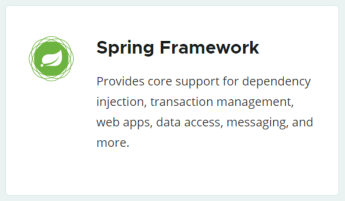
*图：Spring 官网对 Spring Framework 的说明——它提供依赖注入、事务管理、Web 应用、数据访问等**核心支持**，但这些能力要怎么搭起来、配置怎么写，全得自己安排*

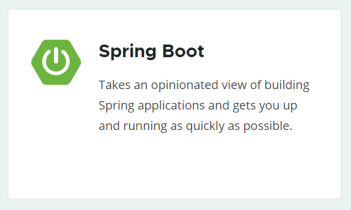
*图：Spring 官网对 Spring Boot 的说明原文是"Takes an opinionated view of building Spring applications and gets you up and running as quickly as possible"——它对如何搭建 Spring 应用**拿了一套自己的主张**（opinionated view），目标就是让项目**尽快跑起来***

"拿了一套自己的主张"具体落在两件事上。第 17 页把 SpringBoot 的核心概括成两个词：

> **起步依赖** ｜ **自动配置**

| 核心能力 | 解决的问题 | 表现成什么 |
| --- | --- | --- |
| **起步依赖** | 依赖**繁琐** | pom 里写**一行** `spring-boot-starter-web`，Web 开发要用的坐标全进来了 |
| **自动配置** | 配置**繁琐** | 不再手写 `Gson` 之类的 bean 定义，容器里**自动**就有了这些对象 |

拿 [73 篇](/posts/编程学习/javaweb学习笔记/73-阿里云oss与参数配置化/)的 OSS 做对照就很直观：那会儿我们引了 `aliyun-sdk-oss`，还得**自己**补 `jaxb-api`、`activation`、`jaxb-runtime` 三个坐标（少一个就报错），再**自己**把工具类写成 `@Component`、把参数类写成 `@ConfigurationProperties`——这就是"繁琐"；而引入 `spring-boot-starter-web` 时，从来没有人告诉你还要配 Tomcat、要引 SpringMVC、要引 Jackson。

## 起步依赖-原理：依赖传递（PPT 第 18～20 页）

第 18 页翻到"**起步依赖 / 自动配置**"的小节页，第 19 页列出我们早就见过的一串 starter：`spring-boot-starter-web`、`spring-boot-starter-aop`、`spring-boot-starter-test`、`mybatis-spring-boot-starter`、`pagehelper-spring-boot-starter`、`spring-boot-starter-…`。

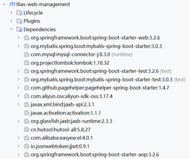
*图：Tlias 工程 IDEA 的 Dependencies 列表——`spring-boot-starter-web`、`mybatis-spring-boot-starter`、`pagehelper-spring-boot-starter`、`spring-boot-starter-aop`、`spring-boot-starter-test` 等等，一眼能看到"每个功能点一个 starter"的命名习惯*

可是工程里真正手写的依赖只有寥寥几行。第 20 页给出答案——**依赖传递**：

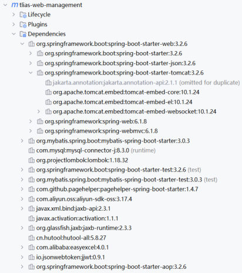
*图：把 `spring-boot-starter-web` 展开——它引了 `spring-boot-starter` 、`spring-boot-starter-json`、`spring-boot-starter-tomcat`，再往下一层才是 `spring-web`、`spring-webmvc`、`spring-beans`、`spring-core`、`jackson-*`、`tomcat-embed-*`……我们一行都没写，全是被"传"进来的*

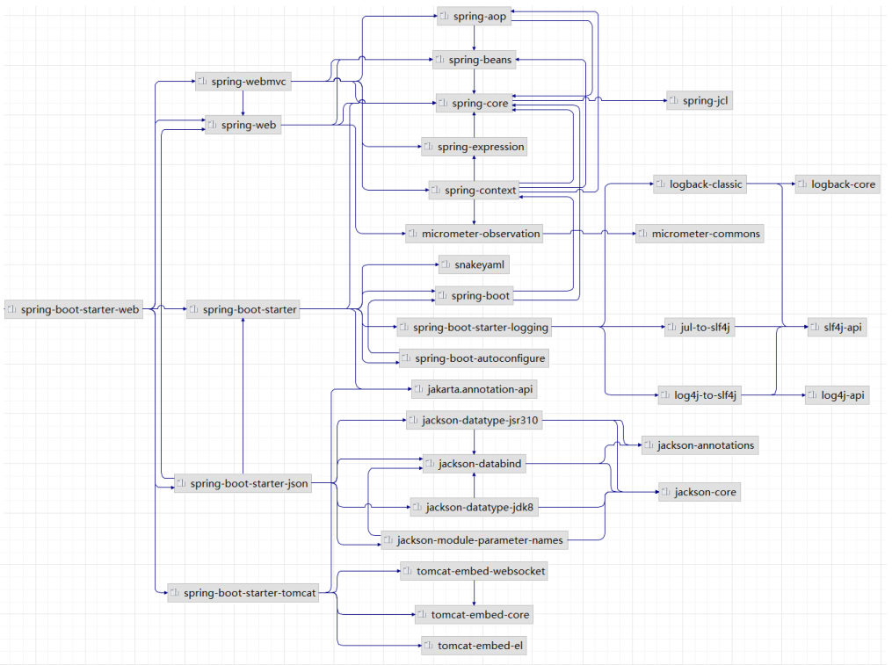
*图：同一件事的另一种画法——从 `spring-boot-starter-web` 出发的依赖传递图（往右是它的传递依赖，往左是依赖它的那一层），箭头方向就是 Maven 的传递方向*

这就是起步依赖的原理：[26 篇](/posts/编程学习/javaweb学习笔记/26-maven依赖管理与生命周期/)讲的**依赖传递**——`spring-boot-starter-web` 自己不带多少代码，它的价值全在 `pom.xml` 里写着一串**它需要的坐标**；我们引它，它再引它需要的，一路传下去，Web 开发要用的一大堆 jar 就都到位了。所以：

- **起步依赖 = 把"做一个功能所需的一堆坐标"打包成一个 starter**，你只需要记住这一个名字；
- 这一串坐标的**版本**不用写（`spring-boot-starter-web` 依赖的 `spring-web` 等都没有 `<version>`），因为父工程 `spring-boot-starter-parent` 已经统一管好了版本——这部分内容（继承、版本锁定）在 [92 篇](/posts/编程学习/javaweb学习笔记/92-maven继承与聚合/)展开。

## 什么是自动配置（PPT 第 21～22 页）

第 21 页又回到"起步依赖 / 自动配置"的小节页，第 22 页给出定义：

> SpringBoot 的**自动配置**就是当 Spring 项目启动后，**一些配置类、bean 对象就自动存入到了 IOC 容器中**，不需要我们手动去声明，从而简化了开发，省去了繁琐的配置操作。

光看定义不好体会，PPT 用了一段测试代码当证据：

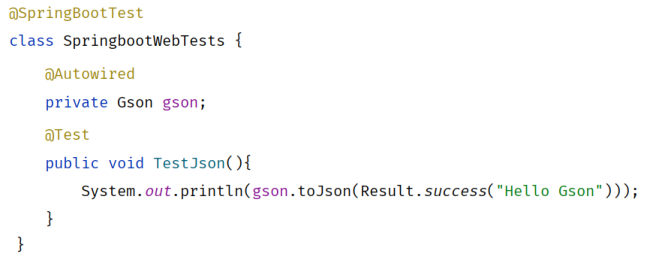
*图：这段测试代码里 `Gson` 可以直接 `@Autowired` 注入，还能调 `gson.toJson(...)`——它的来源就是 PPT 同页那段 `com.google` 的 `<dependency>` 片段；而工程里从没有人写过 Gson 的 bean 定义*

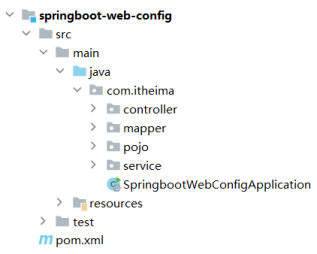
*图：对照着看这个工程的结构——`com.itheima` 下只有 controller / mapper / pojo / service 四个包和一个引导类，`resources` 里连 Gson 的影子都没有；"容器里为什么会有 Gson"这个问题，只能由 SpringBoot 自己回答*

顺着这个问题往下挖：容器里那些**没经过我们手**就存在的 bean（Tomcat 相关的、SpringMVC 相关的、Jackson 的、Gson 的……）都是**自动配置**的产物，它们由一批形如 `XxxAutoConfiguration` 的类负责声明。那么下一个问题自然就是：**这些类是怎么被 SpringBoot 找到并加载的？** PPT 第 23 页翻到"**实现方案 / 源码跟踪 / 自定义 starter**"的小节页，答案分两步给：先用一个第三方工具包演示"都有哪些实现方案"，再顺着源码看"SpringBoot 自己用的是哪一套"。

## 自动配置实现方案：先看一个真实的难题（PPT 第 24～27 页）

### 场景：第三方工具包里的 `@Component`（PPT 第 24～25 页）

课程准备了一个第三方工具包 `itheima-utils`，里面有个类：

```java
@Component
public class TokenParser {
    public void parse(){
        System.out.println("TokenParser ... parse ...");
    }
}
```

头上明明标着 `@Component`（[38 篇](/posts/编程学习/javaweb学习笔记/38-分层解耦与ioc-di入门/)讲过它的作用：交给 IOC 容器管理），可把它作为依赖引进"我们的项目"之后，注入 `TokenParser` 却失败——**bean 根本不在容器里**。

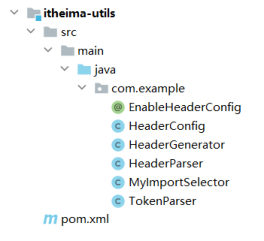
*图：第三方工具包的类都在 `com.example` 包下（`EnableHeaderConfig`、`HeaderConfig`、`HeaderGenerator`、`HeaderParser`、`MyImportSelector`、`TokenParser`），而我们的引导类在 `com.itheima` 包下——两个包名八竿子打不着，这就是问题所在*

原因在第 27 页的问答里点破，其本质是**组件扫描的范围**：基于 `@Component` 及其衍生注解声明的 bean，要想生效**必须被组件扫描注解扫描到**；而 `@SpringBootApplication` 里的 `@ComponentScan`（下一节源码跟踪细看）**默认只扫引导类所在包及其子包**——引导类在 `com.itheima`，工具包在 `com.example`，扫不到，`@Component` 就白标了。

### 方案一：`@ComponentScan` 扫描指定包（PPT 第 25 页）

最直接的做法是把工具包的包名加进扫描范围：

```java
@ComponentScan({"com.example","com.itheima"})
@SpringBootApplication
public class SpringbootWebConfigApplication {
    //...
}
```

PPT 里把这行注释里的省略号写得很诚实：`,"com.alibaba","com.google",...` —— 每引入一个第三方包，就得往这个数组里补一个包名。PPT 对这种方案的评价是四个字：

> **性能低**、**使用繁琐**

- **性能低**：扫描范围越大，启动时要检查的类越多（每个类都要判断"是不是 `@Component` / 是不是要被注册"）；
- **使用繁琐**：包名要一个个手写，而且你未必知道第三方包里那些要注册的类**到底在哪个包**（一个 jar 里可能好几个顶层包）。

### 方案二：`@Import` 导入（PPT 第 26 页）

换个思路：既然要的是"**把某些类放进 IOC 容器**"，那就别靠"扫描碰运气"，而是**明确地导入**。PPT 给的说法是：

> `@Import` 导入。`@Import` 导入的类会被 Spring 加载到 IOC 容器中。

```java
@Import({TokenParser.class, HeaderConfig.class})
@SpringBootApplication
public class SpringbootWebConfig2Application {
    //...
}
```

PPT 把导入形式归纳为**四种**，第三方工具包里正好每种都有一个现成的例子（对照上面那张结构图看）：

| 导入形式 | 工具包里的例子 | 说明 |
| --- | --- | --- |
| ① 导入**普通类** | `TokenParser` | 直接把类全类名写进去，这个类就成为容器里的 bean |
| ② 导入**配置类** | `HeaderConfig` | 类上 `@Configuration`，里面用 `@Bean` 声明了一批 bean；导入它等于把这批 bean 一起带进来 |
| ③ 导入 **`ImportSelector` 接口实现类** | `MyImportSelector` | 由实现类的 `selectImports()` 返回"要导入哪些类"的**全类名数组**，把"导谁"变成了可编程的事 |
| ④ **`@EnableXxx` 注解**（封装 `@Import`） | `EnableHeaderConfig` | 自定义一个注解，注解头上写着 `@Import(...)`；使用方只要在配置类上贴一个 `@EnableHeaderConfig` 就行——SpringBoot 里成吨的 `@EnableXxx` 都是这个套路 |

四段代码（都来自课程的工具包源码）：

```java
// ① 普通类：头上标了 @Component，但因为在 com.example 包里，光靠扫描扫不到
@Component
public class TokenParser {
    public void parse(){
        System.out.println("TokenParser ... parse ...");
    }
}
```

```java
// ② 配置类：类上 @Configuration，方法上 @Bean，导入它就把这两个 bean 一起带进容器
@Configuration
public class HeaderConfig {
    @Bean
    public HeaderParser headerParser(){
        return new HeaderParser();
    }
    @Bean
    public HeaderGenerator headerGenerator(){
        return new HeaderGenerator();
    }
}
```

```java
// ③ ImportSelector 实现类：selectImports 返回要导入的类的全类名数组
public class MyImportSelector implements ImportSelector {
    public String[] selectImports(AnnotationMetadata importingClassMetadata) {
        return new String[]{"com.example.HeaderConfig"};
    }
}
```

```java
// ④ @EnableXxx 注解：把 @Import 封装进一个自定义注解里，用起来最省事
@Retention(RetentionPolicy.RUNTIME)
@Target(ElementType.TYPE)
@Import(MyImportSelector.class)
public @interface EnableHeaderConfig {
}
```

对方案二的评价，PPT 用了两个词：**方便**、**优雅**——不用猜包名、不用维护一长串扫描路径，第三方想让你用哪些类，自己用 `@Import` / `@EnableXxx` 说清楚就好。

### 必答问答（PPT 第 27 页）

| PPT 的问题 | 答案 |
| --- | --- |
| 为什么第三方依赖中使用 `@Component` 及其衍生注解声明 bean 不生效？ | 基于 `@Component` 及其衍生注解声明的 bean 要想生效，**需要被组件扫描注解扫描到**；而默认扫描范围是引导类所在包及其子包，第三方类的包通常不在里面 |
| 有哪些方案可以使其生效呢？ | ① 通过 **`@ComponentScan`** 注解扫描指定的包；② 通过 **`@Import`** 注解将其导入到 IOC 容器中（**四种常见方式**：普通类、配置类、`ImportSelector` 实现类、`@EnableXxx`） |

## 自动配置-源码跟踪（PPT 第 28～30 页）

第 28 页翻到"**实现方案 / 源码跟踪 / 自定义 starter**"的小节页。方案已经知道了，接下来看 SpringBoot 自己选的是哪一套——它可不是靠 `@ComponentScan` 把全世界的包都扫一遍。

### `@SpringBootApplication` 的三个组成部分（PPT 第 29 页）

起点是我们天天见的引导类：

```java
@SpringBootApplication
public class SpringbootWebConfigApplication {
    public static void main(String[] args) {
        SpringApplication.run(SpringbootWebConfigApplication.class, args);
    }
}
```

PPT 说它是"**该注解标识在 SpringBoot 工程引导类上，是 SpringBoot 中最最最重要的注解**"，并且"由三个部分组成"：

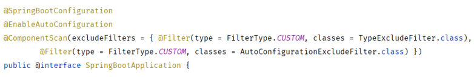
*图：点开 `@SpringBootApplication` 看到它自己的源码——头三行正是 `@SpringBootConfiguration`、`@EnableAutoConfiguration`、带两个排除过滤器的 `@ComponentScan`；下面那行 `public @interface SpringBootApplication` 说明它本质是一个注解*

| 组成部分 | 作用（PPT 原文） |
| --- | --- |
| `@SpringBootConfiguration` | 该注解与 `@Configuration` 注解作用相同，用来声明当前也是一个**配置类** |
| `@ComponentScan` | **组件扫描**，默认扫描**当前引导类所在包及其子包** |
| `@EnableAutoConfiguration` | SpringBoot 实现**自动化配置的核心注解** |

前两个正好解释了前面所有"为什么"：引导类自己是个配置类（所以 [88 篇](/posts/编程学习/javaweb学习笔记/88-springboot配置优先级与bean管理/)里把 `@Bean` 写在引导类上也能生效），默认扫描范围是"引导类所在包及其子包"（所以第三方包里的 `@Component` 扫描不到）。真正实现自动配置的是第三个。

（图里还能看到引导类上的 `@ComponentScan` 带了两个 `excludeFilters`——`TypeExcludeFilter` 与 `AutoConfigurationExcludeFilter`。它们是"防止重复注册"用的过滤器，PPT 没展开，这里知道有这么回事就行。）

### 从 `@EnableAutoConfiguration` 一路读到 imports 文件（PPT 第 30 页）

点开 `@EnableAutoConfiguration`，关键就一行：它头上写着 **`@Import(AutoConfigurationImportSelector.class)`**——用的是上一节方案二里的**第三种导入形式**。也就是说，SpringBoot 的自动配置**是靠 `@Import` 导入一个 `ImportSelector` 实现类来完成的**。

那个实现类 `AutoConfigurationImportSelector` 的核心方法 `selectImports(...)` 返回 `String[]`，方法体做的事可以概括成三步（方法与报错信息都来自 Spring Boot 3.x 源码，PPT 第 30 页把这几处圈出来过）：

```java
// AutoConfigurationImportSelector 里的关键代码（摘录，方法名与 PPT 截图一致）
public String[] selectImports(AnnotationMetadata annotationMetadata) {
    if (!isEnabled(annotationMetadata)) {
        return NO_IMPORTS;
    }
    // ② 准备"待导入"的自动配置类名单
    AutoConfigurationEntry autoConfigurationEntry = getAutoConfigurationEntry(annotationMetadata);
    // ③ 返回全类名数组
    return StringUtils.toStringArray(autoConfigurationEntry.getConfigurations());
}

protected List<String> getCandidateConfigurations(AnnotationMetadata metadata, AnnotationAttributes attributes) {
    // ① 从约定的文件里读取自动配置类的全类名
    List<String> configurations = ImportCandidates.load(AutoConfiguration.class, getBeanClassLoader()).getCandidates();
    Assert.notEmpty(configurations, "No auto configuration classes found in "
            + "META-INF/spring/org.springframework.boot.autoconfigure.AutoConfiguration.imports. ...");
    return configurations;
}
```

第 ① 步里那个**约定的文件**就是这条链路上最关键的落点：

```text
META-INF/spring/org.springframework.boot.autoconfigure.AutoConfiguration.imports
```

它躺在 `spring-boot-autoconfigure` 这个 jar 包里：

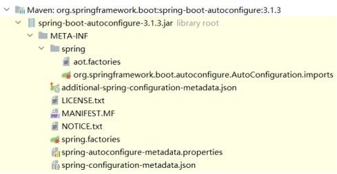
*图：`spring-boot-autoconfigure-3.1.3.jar` 的 `META-INF` 目录——`spring` 子目录下就是 `org.springframework.boot.autoconfigure.AutoConfiguration.imports`；注意它上面还躺着一个 `spring.factories`，那是老版本读的文件（版本差异见下）*

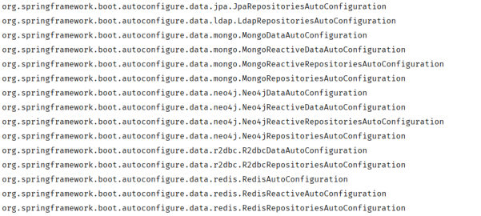
*图：打开这个 `.imports` 文件，一行一个自动配置类的**全类名**——`data.jpa.JpaRepositoriesAutoConfiguration`、`data.ldap.LdapRepositoriesAutoConfiguration`、`data.mongo.*`、`data.neo4j.*`、`data.r2dbc.*`、`data.redis.*`……名单长得能翻好几屏*

> [!IMPORTANT]
> **版本差异（PPT 第 30 页的"注意"）**：
>
> 在**低版本（2.7.0 以前）**的 SpringBoot 中，自动配置类（`XxxAutoConfiguration`）是定义在 **`spring.factories`** 文件中的；**2.7 之后**改成了上面这个 `META-INF/spring/org.springframework.boot.autoconfigure.AutoConfiguration.imports` 文件。
>
> **本机装的是 Spring Boot 3.2.x**，走的正是 **`.imports`** 这一套（本机实测的启动日志开头就能看到 `:: Spring Boot ::  (v3.2.10)`）。所以看源码、看 jar 包目录时如果发现"`.imports` 里什么都有、`spring.factories` 里也还有一个"，不用慌：**`spring.factories` 是历史写法**，新版本读的是 `.imports`。往后再遇到网上讲"自动配置类写在 spring.factories 里"的文章，先看它讲的是哪个版本。
>
> 顺带记住这个文件名——[90 篇](/posts/编程学习/javaweb学习笔记/90-自定义starter/)自己造 starter 时，要亲手往这个文件里写一行自己的自动配置类全类名。

### "全部注册到 IOC 容器？"——不（PPT 第 30、32 页）

名单读到手了，是不是就照单全收、一个个注册成 bean？PPT 第 30 页在 `selectImports` 旁边打了个大大的问号：

> 全部注册为 IOC 容器的 bean **???**

第 32 页给出答案：

> **NO!** …… SpringBoot 会根据 **`@Conditional`** 注解**条件装配**。

理由不难想：那份 imports 名单里躺着上百个自动配置类，覆盖 JPA、MongoDB、Redis、Neo4j、LDAP……**我们的工程里根本没有这些东西的依赖**。要是全注册，要么启动就报错，要么容器里塞满一堆用不上的 bean。所以真正的流程是——**先按条件判断，满足了才注册**。判断用的就是下一节的 `@Conditional`。

## `@Conditional`：条件装配（PPT 第 31 页）

PPT 第 31 页给的说明：

> **作用**：按照一定的条件进行判断，**在满足给定条件后才会注册对应的 bean 对象到 Spring IOC 容器中**。
> **位置**：**方法**、**类**。

`@Conditional` 本身是一个**父注解**，"派生出大量的子注解"，PPT 重点讲了三个：

| 衍生注解 | 判断什么 | 常见位置 |
| --- | --- | --- |
| **`@ConditionalOnClass`** | 判断环境中**是否有对应的字节码文件**，才注册 bean 到 IOC 容器 | 类上（"有这个库我才做自动配置"） |
| **`@ConditionalOnMissingBean`** | 判断环境中**没有对应的 bean**（按**类型**或**名称**判断），才注册 bean 到 IOC 容器 | 方法上（"用户没自己定义我才补一个"） |
| **`@ConditionalOnProperty`** | 判断**配置文件中有对应属性和值**，才注册 bean 到 IOC 容器 | 类 / 方法上（"配了这个开关我才生效"） |

拿前面那个 Gson 的例子把三条对一遍：

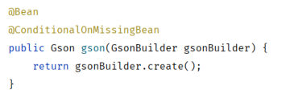
*图：自动配置类里那个造 Gson 的 `@Bean` 方法——方法上叠着 `@ConditionalOnMissingBean`：容器里还没有 Gson 这个 bean 时才执行这个方法*

合起来看就是自动配置类 `GsonAutoConfiguration` 的完整逻辑：**类上**用"有 Gson 的字节码吗"决定这个自动配置类要不要处理（工程里没引 Gson 依赖，它就整体不生效）；**方法上**用"容器里已经有 Gson 的 bean 了吗"决定这个 `@Bean` 方法要不要执行（用户自己定义过就尊重用户的）。顺着这个思路，前面那个"什么是自动配置"的谜就解开了：**我们引了 Gson 依赖 → 类条件满足 → 方法条件满足 → Gson 被自动注册 → 所以可以直接 `@Autowired`**。

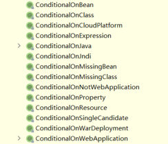
*图：IDEA 里敲 `@Conditional` 时自动补全出来的一长串衍生注解——`@ConditionalOnBean`、`@ConditionalOnClass`、`@ConditionalOnCloudPlatform`、`@ConditionalOnExpression`、`@ConditionalOnJava`、`@ConditionalOnMissingBean`、`@ConditionalOnMissingClass`、`@ConditionalOnNotWebApplication`、`@ConditionalOnProperty`、`@ConditionalOnResource`、`@ConditionalOnSingleCandidate`、`@ConditionalOnWarDeployment`、`@ConditionalOnWebApplication`……PPT 讲的三个只是其中最常用的*

### 本机实测：`@ConditionalOnMissingBean` 到底管什么

"没有对应的 bean 才注册"这句话，最好的验证办法就是**自己先造一个同类型的 bean**，看自动配置的那个方法还执不执行。本机的实验工程正好有一个现成的自动配置类（[90 篇](/posts/编程学习/javaweb学习笔记/90-自定义starter/)要写的那个阿里云 OSS starter，它的 `@Bean` 上就带着 `@ConditionalOnMissingBean`），于是往工程里加了一个配置类：

```java
@Configuration
public class MyConfig {
    @Bean
    public AliyunOSSOperator aliyunOSSOperator() {
        System.out.println("[实验] 自定义的 AliyunOSSOperator bean 被创建");
        return new AliyunOSSOperator(null);
    }
}
```

重启之后的**本机实测**结果：

```text
INFO  ... : Starting SpringbootAutoconfigurationTestApplication v0.0.1-SNAPSHOT ...
INFO  ... : Tomcat initialized with port 8080 (http)
[实验] 自定义的 AliyunOSSOperator bean 被创建
INFO  ... : Tomcat started on port 8080 (http) with context path ''
INFO  ... : Started SpringbootAutoconfigurationTestApplication in 2.084 seconds (process running for 2.539)
```

三条结论：

1. 控制台**出现了** `[实验] 自定义的 AliyunOSSOperator bean 被创建`——用户自己定义的那个 bean 正常创建了；
2. 应用**正常启动**，`/check` 接口依然能注入 `AliyunOSSOperator`，**没有**出现 `NoUniqueBeanDefinitionException`（"同类型 bean 有两个，我该注入哪个"的错误）；
3. 由此反推：自动配置类里那个带 `@ConditionalOnMissingBean` 的 `@Bean` 方法**没有执行**——容器里已经有 `AliyunOSSOperator` 了（用户自己定义的），自动配置就**让位**了。否则容器里会有两个同类型 bean，注入必然报错。

这正是"自动配置只在缺少时才补上"的硬证据：**自动配置是"兜底"，不是"抢活"**——用户定义了就用用户的（这也是为什么你在项目里可以放心地覆盖掉某个自动配置的默认 bean）。

### 必答问答（PPT 第 33 页）

| PPT 的问题 | 答案 |
| --- | --- |
| `@Conditional` 及其衍生注解的作用是什么？ | **满足给定条件后**，注册对应的 bean 对象到 Spring IOC 容器中 |
| `@Conditional` 及其衍生注解可以作用在什么地方？ | **方法上**——针对当前这个方法声明的 bean；**类上**——针对这个类中所有方法声明的 bean |
| 自己定义自动配置类的核心是什么？如何完成自动配置？ | ① 定义**自动配置类**；② 将自动配置类配置在 **`META-INF/spring/org.springframework.boot.autoconfigure.AutoConfiguration.imports`** 文件中 |

## 把整条链路串起来（PPT 第 32 页）

第 32 页把源码跟踪用过的几张图又叠放了一遍，配上一句"SpringBoot 会根据 `@Conditional` 注解条件装配"。按启动顺序把这条链路写全：

```text
① 启动类上的 @SpringBootApplication
        ├─ @SpringBootConfiguration  → 引导类本身也是配置类
        ├─ @ComponentScan            → 扫描引导类所在包及其子包（第三方包扫不到 → 需要 @Import）
        └─ @EnableAutoConfiguration  → 自动配置的入口
                └─ @Import(AutoConfigurationImportSelector.class)
                        └─ AutoConfigurationImportSelector.selectImports(...)
                                ├─ 读 META-INF/spring/org.springframework.boot.autoconfigure.AutoConfiguration.imports
                                │     （2.7 之前读的是 spring.factories）
                                │     → 拿到上百个 XxxAutoConfiguration 的全类名
                                └─ 逐个按 @Conditional 条件判断
                                      （@ConditionalOnClass / @ConditionalOnMissingBean / @ConditionalOnProperty …）
                                      → 满足条件的才注册成 bean，进入 IOC 容器
```

一句话总结：**起步依赖把"依赖"从一堆变成一个；自动配置把"bean 的声明"从手写变成"读名单 + 按条件注册"**——而这份名单，就是 [90 篇](/posts/编程学习/javaweb学习笔记/90-自定义starter/)要我们亲手填一次的那个 `.imports` 文件。

## 小结

| 问题 | 答案 |
| --- | --- |
| SpringBoot 的两个核心？ | **起步依赖**（依赖不繁琐）+ **自动配置**（配置不繁琐） |
| 起步依赖的原理？ | **依赖传递**——starter 里写着一串它需要的坐标，引一个 starter 就把它需要的 jar 全带进来；版本由父工程统一管理 |
| 自动配置是什么？ | 项目启动后，**一些配置类、bean 对象自动存入 IOC 容器**，不需要手动声明 |
| 第三方包里的 `@Component` 为什么不生效？ | 它**没被组件扫描扫到**——`@ComponentScan` 默认只扫引导类所在包及其子包 |
| 让它生效的两套方案？ | ① `@ComponentScan` 扫描**指定包**（性能低、使用繁琐）；② **`@Import`** 导入（方便、优雅） |
| `@Import` 的四种导入形式？ | 普通类 / 配置类 / `ImportSelector` 接口实现类 / `@EnableXxx` 注解（封装 `@Import`） |
| `@SpringBootApplication` = ？ | `@SpringBootConfiguration`（配置类）+ `@ComponentScan`（组件扫描）+ `@EnableAutoConfiguration`（自动配置核心） |
| 自动配置类的名单在哪个文件？ | `META-INF/spring/org.springframework.boot.autoconfigure.AutoConfiguration.imports`（**2.7.0 之前是 `spring.factories`**）；由 `AutoConfigurationImportSelector` 的 `selectImports` 读取 |
| 名单里的类会全部注册成 bean 吗？ | **不会**——SpringBoot 按 `@Conditional` **条件装配**，满足条件的才注册 |
| `@Conditional` 三个常用衍生注解？ | `@ConditionalOnClass`（有对应字节码才注册）、`@ConditionalOnMissingBean`（没对应 bean 才注册）、`@ConditionalOnProperty`（配置文件里有对应属性和值才注册）；位置是**方法、类** |
| 本机实测结论？ | ① 本机是 Spring Boot **3.2.x**，走 `.imports` 这套（`spring.factories` 是历史写法）；② 自己定义同类型 bean 后，自动配置类里带 `@ConditionalOnMissingBean` 的 `@Bean` **没有执行**、应用正常启动、`/check` 照样能注入 |

## 相关

- [上一篇：SpringBoot配置优先级与Bean管理](/posts/编程学习/javaweb学习笔记/88-springboot配置优先级与bean管理/)
- [下一篇：自定义starter](/posts/编程学习/javaweb学习笔记/90-自定义starter/)

## 练习题

### 一、知识回顾（读完直接做下面的实践题）

1. **SpringBoot 的两个核心**：**起步依赖**（解决依赖繁琐）+ **自动配置**（解决配置繁琐）；PPT 给这一节贴的三个标签是"熟练使用 / 面试高频 / 汲取思想"
2. **起步依赖的原理**：**依赖传递**——`spring-boot-starter-web` 自己的价值不在代码，而在 `pom.xml` 里写了一串它需要的坐标（`spring-boot-starter`、`spring-boot-starter-json`、`spring-boot-starter-tomcat`→`spring-web`/`spring-webmvc`/`jackson`…），引一个就全带进来；版本由 `spring-boot-starter-parent` 统一管理
3. **自动配置的定义**：当 Spring 项目启动后，**一些配置类、bean 对象自动存入 IOC 容器**，不需要我们手动声明，从而简化开发、省去繁琐的配置操作（例子：没写过 Gson 的 bean 定义，却可以 `@Autowired private Gson gson;`）
4. **第三方 `@Component` 不生效的原因**：`@Component` 及衍生注解声明的 bean 要生效，**必须被组件扫描注解扫描到**；`@ComponentScan` 默认只扫**引导类所在包及其子包**，第三方类的包（如 `com.example`）不在范围内
5. **两套实现方案与 `@Import` 的四种导入形式**：方案一是 **`@ComponentScan`** 扫描指定包（`@ComponentScan({"com.example","com.itheima"})`）——**性能低、使用繁琐**（每引一个包都要加）；方案二是 **`@Import`** 导入——**方便、优雅**，四种形式是导入**普通类**（`TokenParser`）、导入**配置类**（`HeaderConfig`，类上 `@Configuration` + 方法上 `@Bean`）、导入 **`ImportSelector` 实现类**（`MyImportSelector`，`selectImports()` 返回全类名数组）、**`@EnableXxx` 注解**（`EnableHeaderConfig`，注解头上 `@Import(...)`，用起来最省事）
6. **`@SpringBootApplication` 的三个组成部分**：`@SpringBootConfiguration`（与 `@Configuration` 作用相同，声明当前是配置类）、`@ComponentScan`（组件扫描，默认扫引导类所在包及其子包）、`@EnableAutoConfiguration`（自动配置的**核心**注解）
7. **自动配置的源码链条**：`@EnableAutoConfiguration` 里 `@Import(AutoConfigurationImportSelector.class)` → `AutoConfigurationImportSelector.selectImports(...)` → 读 `META-INF/spring/org.springframework.boot.autoconfigure.AutoConfiguration.imports` 拿到一批 `XxxAutoConfiguration` 全类名 → 按 `@Conditional` 条件装配后才注册 bean
8. **版本差异**：**2.7.0 之前**自动配置类定义在 **`spring.factories`** 文件里；**2.7 之后**改用 `META-INF/spring/org.springframework.boot.autoconfigure.AutoConfiguration.imports`（**本机 Spring Boot 3.2.x 走的就是 imports 这套**，`spring.factories` 是历史写法）
9. **`@Conditional`**：作用是**按照一定的条件进行判断，满足给定条件后才注册对应的 bean 到 IOC 容器**；位置是**方法、类**；三个常用衍生注解——`@ConditionalOnClass`（有对应字节码才注册）、`@ConditionalOnMissingBean`（按类型或名称判断，没有对应 bean 才注册）、`@ConditionalOnProperty`（配置文件中有对应属性和值才注册）
10. **本机实测**：自己定义一个同类型的 `AliyunOSSOperator` bean 后重启——控制台打印了 `[实验] 自定义的 AliyunOSSOperator bean 被创建`，应用正常启动、`/check` 依然能注入，**没有** `NoUniqueBeanDefinitionException`；反推自动配置类里带 `@ConditionalOnMissingBean` 的那个 `@Bean` 方法**没有执行**（自动配置是兜底，用户定义了就让位）

### 二、裸写题

- [ ] **2-1 让第三方工具包里的类真正进容器（两种方案）**
  需求：工程引了一个第三方工具包，里面有个工具类头上标着"交给容器管理"的注解，可它在 `com.example` 包下，而我们的引导类在 `com.itheima` 包下——注入它时报"找不到这个 bean"。
  要求：
  ① 用第一种方案（扩大扫描范围）解决，写出要加在哪、加什么，并说明它的**两个缺点**；
  ② 用第二种方案（导入）解决，写出两种写法：直接把工具类和它的配置类导入；以及用一个自定义注解把导入包起来（用起来最省事的那种形式）；
  ③ 说明这个工具包里那个"返回要导入的类全类名数组"的类叫什么角色、它的方法返回什么类型；
  ④ 回答：为什么第三方包里标了"交给容器管理"注解的类会失效？
  （写作区见练习文件 `test_89_自动配置原理.txt` 的题目2-1。）

  > [!TIP]- 提示（先自己想，实在想不出再点开）
  > **一级 · 思路**：先想"类是怎么进容器的"——要么被**扫描**到，要么被**明确导入**；扫描的默认范围是引导类所在包及其子包，所以打破僵局只有"把范围撑大"或"点名导入"两条路
  > **二级 · 方法**：方案一 `@ComponentScan({"包名1","包名2"})`（加在引导类上，注意它会**覆盖**默认扫描范围，所以要带上自己项目的包名）；方案二 `@Import({A.class, B.class})`，四种形式是**普通类 / 配置类 / `ImportSelector` 实现类 / `@EnableXxx` 注解**；自定义注解的写法照 `@Retention(RUNTIME)` + `@Target(TYPE)` + `@Import(...)` 三件事
  > **三级 · 骨架**：① `@____({"com.example","com.itheima"})` + `@SpringBootApplication`；② `@____({TokenParser.class, HeaderConfig.class})`；自定义注解 `public @interface EnableHeaderConfig { }` 头上写 `@____(MyImportSelector.class)`；③ `public class MyImportSelector implements ____ { public String[] ____(AnnotationMetadata m) { return new String[]{"____"}; } }`

  > [!TIP]- 参考答案（做完再点开）
  > ① 扩大扫描范围（方案一）：
  > ```java
  > @ComponentScan({"com.example","com.itheima"})   // 第三方包 + 自己项目的包都要写上
  > @SpringBootApplication
  > public class SpringbootWebConfigApplication {
  >     //...
  > }
  > ```
  > 两个缺点：**性能低**（扫描范围越大，启动时要检查的类越多）、**使用繁琐**（每引入一个第三方包都得往数组里补一个包名，而且未必知道要注册的类在哪个包）。
  > ② 点名导入（方案二）：
  > ```java
  > // 写法一：直接把类和配置类导入
  > @Import({TokenParser.class, HeaderConfig.class})
  > @SpringBootApplication
  > public class SpringbootWebConfig2Application {
  >     //...
  > }
  >
  > // 写法二：自定义注解把导入包起来（使用方只贴一个注解）
  > @Retention(RetentionPolicy.RUNTIME)
  > @Target(ElementType.TYPE)
  > @Import(MyImportSelector.class)
  > public @interface EnableHeaderConfig {
  > }
  >
  > // 使用：
  > @EnableHeaderConfig
  > @SpringBootApplication
  > public class SpringbootWebConfig2Application { }
  > ```
  > ③ 那个类实现的是 **`ImportSelector`** 接口，方法名是 `selectImports`，返回 **`String[]`**（要导入的类的**全类名数组**）：
  > ```java
  > public class MyImportSelector implements ImportSelector {
  >     public String[] selectImports(AnnotationMetadata importingClassMetadata) {
  >         return new String[]{"com.example.HeaderConfig"};
  >     }
  > }
  > ```
  > ④ 因为"交给容器管理"这个注解（`@Component` 及其衍生注解）**只在被组件扫描扫到时才生效**；默认扫描范围是引导类所在包及其子包，`com.example` 不在其中，所以那个类虽然标了注解，容器里却没有它。
  > 自查：三种写法随便留一种、启动一次，注入不再报错就说明生效了；把导入全删掉，报错的是 `NoSuchBeanDefinitionException` 之类的"找不到 bean"。

- [ ] **2-2 手写一个自动配置类，并让它被 SpringBoot 认出来**
  需求：你做了一个公共组件，想让别的工程"引了依赖就能直接用"。要求：
  ① 写一个自动配置类（放在你自己的包下），让它做三件事——把配置参数对象启用起来（能读取指定前缀的配置项）、声明组件的工具类 bean、并且**尊重使用方**（使用方自己定义了就不要再补）；
  ② 写清楚这个自动配置类应该登记在哪个文件的**完整路径**（放到你工程的 `resources` 下的哪个目录、文件叫什么名字）；
  ③ 那个文件里写什么内容？
  ④ 回答：如果自动配置类里不写"尊重使用方"那个注解会怎样？
  （写作区见练习文件 `test_89_自动配置原理.txt` 的题目2-2。）

  > [!TIP]- 提示（先自己想，实在想不出再点开）
  > **一级 · 思路**：自动配置类本身就是"配置类"，所以它有 `@Configuration` 和 `@Bean`；参数对象一般是"绑定某个前缀的配置项"的类，需要用专门的注解把**参数类**启用成 bean（而不是给它加 `@Component`）；"尊重使用方"就是条件装配里的那一个；②③ 是本节最需要背下来的那条路径与文件
  > **二级 · 方法**：类上 `@Configuration` + `@EnableConfigurationProperties(XxxProperties.class)`；方法上 `@Bean` + `@ConditionalOnMissingBean`；文件路径 `META-INF/spring/org.springframework.boot.autoconfigure.AutoConfiguration.imports`（注意是 `META-INF/spring/`，不是 `META-INF/`）；文件内容 = 一行**自动配置类的全类名**；老版本（2.7 之前）这个名单写在 `META-INF/spring.factories` 里
  > **三级 · 骨架**：
  > ```java
  > @____(OssProperties.class)
  > @____
  > public class OssAutoConfiguration {
  >     @____
  >     @____
  >     public OssOperator ossOperator(OssProperties props) {
  >         return new OssOperator(props);
  >     }
  > }
  > ```
  > ② 的路径：`src/main/resources/____/____/org.springframework.boot.autoconfigure.____.imports`

  > [!TIP]- 参考答案（做完再点开）
  > ① 自动配置类：
  > ```java
  > package com.example.oss;
  >
  > import org.springframework.boot.autoconfigure.condition.ConditionalOnMissingBean;
  > import org.springframework.boot.context.properties.EnableConfigurationProperties;
  > import org.springframework.context.annotation.Bean;
  > import org.springframework.context.annotation.Configuration;
  >
  > @EnableConfigurationProperties(OssProperties.class)   // 让参数类成为 bean，并绑定配置文件里的值
  > @Configuration                                          // 自动配置类本身也是配置类
  > public class OssAutoConfiguration {
  >
  >     @Bean
  >     @ConditionalOnMissingBean                           // 使用方自己定义了就不要再补
  >     public OssOperator ossOperator(OssProperties props) {
  >         return new OssOperator(props);
  >     }
  > }
  > ```
  > ② 文件放在 `src/main/resources/META-INF/spring/` 目录下，文件名固定为 **`org.springframework.boot.autoconfigure.AutoConfiguration.imports`**，完整路径就是：
  > ```text
  > src/main/resources/META-INF/spring/org.springframework.boot.autoconfigure.AutoConfiguration.imports
  > ```
  > ③ 内容只有一行——自动配置类的**全类名**：
  > ```text
  > com.example.oss.OssAutoConfiguration
  > ```
  > ④ 不写 `@ConditionalOnMissingBean` 的话，使用方只要自己定义过一个同类型的 bean，容器里就会**出现两个同类型 bean**：注入时报 `NoUniqueBeanDefinitionException`（"同类型 bean 有多个，我该注入哪个"）——自动配置从"兜底"变成了"抢活"。本机实测的反面就是这个：加上它之后，自定义 bean 创建了、自动配置的那个方法没执行、应用正常启动。
  > 自查：写好后把工程打成 jar / 装进本地仓库，在另一个工程里引进来启动——不用写任何 `@Configuration` 就能注入 `OssOperator`，就说明这条链路通了（[90 篇](/posts/编程学习/javaweb学习笔记/90-自定义starter/)会完整做一遍）。
  > 老版本对照：2.7.0 之前这份名单写在 `META-INF/spring.factories` 里（按 `org.springframework.boot.autoconfigure.EnableAutoConfiguration=` 的键写），现在读的是 `.imports`。

- [ ] **2-3 把自动配置这条链路讲给别人听**
  需求：面试官问："SpringBoot 的自动配置是怎么实现的？"请按**启动顺序**把链路讲一遍，讲到"为什么名单里的类不会全部注册"为止。
  要求（写在回答里）：
  ① 引导类上那个注解由哪三部分组成，各自干什么；
  ② 自动配置是从哪一行 `@Import` 开始的，被导入的是个什么角色；
  ③ 名单文件的确切路径与文件名，以及老版本的替代方案；
  ④ 名单到手之后为什么不能"照单全收"，靠什么决定注册与否；
  ⑤ 用一句话说明自动配置和"用户自己定义的 bean"是什么关系。
  （写作区见练习文件 `test_89_自动配置原理.txt` 的题目2-3。）

  > [!TIP]- 提示（先自己想，实在想不出再点开）
  > **一级 · 思路**：按"入口注解 → 导入选择器 → 读名单文件 → 条件筛选 → 注册"五步走，每步只讲一个关键词；⑤ 的答案藏在 `@ConditionalOnMissingBean` 的名字里
  > **二级 · 方法**：关键词——`@SpringBootConfiguration` / `@ComponentScan` / `@EnableAutoConfiguration`；`AutoConfigurationImportSelector`（`ImportSelector` 实现类）；`META-INF/spring/org.springframework.boot.autoconfigure.AutoConfiguration.imports`（老版本 `spring.factories`）；`@Conditional` 家族（`@ConditionalOnClass` / `@ConditionalOnMissingBean` / `@ConditionalOnProperty`）
  > **三级 · 骨架**：① `@SpringBootApplication` = `@____`（配置类）+ `@____`（组件扫描，默认扫引导类所在包及子包）+ `@____`（自动配置核心）；② `@EnableAutoConfiguration` 里 `@Import(____.class)`；③ 路径 `META-INF/spring/org.springframework.boot.autoconfigure.____.imports`；④ 靠 `@____` 条件装配；⑤ 自动配置是"____"，用户自己定义了就让位

  > [!TIP]- 参考答案（做完再点开）
  > ① `@SpringBootApplication` 由三部分组成：`@SpringBootConfiguration`（与 `@Configuration` 作用相同，声明引导类本身也是配置类）、`@ComponentScan`（组件扫描，**默认扫描引导类所在包及其子包**）、`@EnableAutoConfiguration`（**自动配置的核心注解**）。
  > ② 从 `@EnableAutoConfiguration` 开始：它里面写着 `@Import(AutoConfigurationImportSelector.class)`——被导入的是一个 **`ImportSelector` 的实现类**，也就是 `@Import` 四种形式里的第三种；真正干活的是它的 `selectImports(...)` 方法（返回 `String[]`）。
  > ③ 名单文件的确切路径与文件名：
  > ```text
  > META-INF/spring/org.springframework.boot.autoconfigure.AutoConfiguration.imports
  > ```
  > 它在 `spring-boot-autoconfigure` 这个 jar 包里，一行一个 `XxxAutoConfiguration` 全类名。**2.7.0 之前**这些自动配置类定义在 **`spring.factories`** 里，属于历史写法（本机 Spring Boot 3.2.x 走的是 `.imports`）。
  > ④ 不能照单全收：名单里躺着上百个自动配置类（JPA、MongoDB、Redis、Neo4j、LDAP……），**工程里根本没引这些依赖**，全注册要么启动报错要么塞一堆没用的 bean。真正决定注册与否的是 **`@Conditional` 及其衍生注解**（条件装配）：`@ConditionalOnClass`（环境里有对应字节码才注册，常加在类上）、`@ConditionalOnMissingBean`（没有对应 bean 才注册，常加在方法上）、`@ConditionalOnProperty`（配置文件里有对应属性和值才注册）。满足条件的才注册进 IOC 容器。
  > ⑤ 自动配置是"**兜底**"，不是"抢活"：容器里已经有同类型的 bean（用户自己用 `@Component` / `@Bean` 声明的）时，带 `@ConditionalOnMissingBean` 的自动配置方法就不执行——用户说了算。本机实测过这一幕：自定义的 `AliyunOSSOperator` 被创建、自动配置的那个 `@Bean` 没执行、应用正常启动且能正常注入。

### 三、综合题

- [ ] **3-1 走一遍自动配置的完整链路，并亲手验证"条件装配"**
  这一题把 PPT 第 29～31 页的源码跟踪与本章的实测串成一条线来做。
  1. 打开一个 SpringBoot 工程，点进引导类上的 `@SpringBootApplication`，把它头上的**三个组成部分**抄下来（对着 IDEA 里的源码看，不要背）；
  2. 点进 `@EnableAutoConfiguration`，找到里面那行 `@Import(...)`，写下被导入的类名；再点进这个类，找到 `selectImports(...)` 方法，看它最终是从哪个方法、哪个文件里拿到自动配置类名单的；
  3. 在本机 Maven 仓库里找到 `spring-boot-autoconfigure` 的 jar（或直接在 IDEA 的 External Libraries 里展开它），打开 `META-INF/spring/` 目录，记下你看到的两个文件的名字；把 `.imports` 文件打开，抄下任意三行（只看，不要改依赖包里的文件）；
  4. 从这三行里挑一个自动配置类，点进去看它类上和 `@Bean` 方法上有没有 `@Conditional` 系列的注解，各是什么、判断条件是什么；
  5. 动手做条件装配实验：在你的工程里自己定义一个与某个自动配置类**同类型**的 bean（写在 `@Configuration` 配置类里），启动应用；
  6. 记录：控制台有没有出现你自己那句打印？应用启动了吗？接口还能正常注入这个 bean 吗？有没有出现"同类型 bean 有两个"的报错？
  7. 收尾：把你加的那个配置类删掉（或注释掉），说明第 6 步的现象证明了什么；
  8. 回答两个问题：① 本机 Spring Boot 是哪个版本、读的是 `.imports` 还是 `spring.factories`？② 如果工程里根本没有引某个库的依赖，名单里的那个自动配置类还会生效吗？靠哪个注解挡住的？

  （练习文件 `test_89_自动配置原理.txt` 的"综合题"一段里按这 8 步给了写作区。）

  **涉及知识点**

  | 知识点 | 在这里的应用 |
  | --- | --- |
  | `@SpringBootApplication` 三部分（PPT 29） | 第 1 步——从引导类的注解源码里读出来 |
  | `AutoConfigurationImportSelector` 与 imports 文件（PPT 30） | 第 2、3 步——点名导入 → 选择器 → 名单文件 |
  | 版本差异（PPT 30 注意 + LAB §5） | 第 3、8 步——本机 3.2.x 读 `.imports`，`spring.factories` 是历史写法 |
  | `@Conditional` 三兄弟（PPT 31） | 第 4、8 步——类上用 Class 判断、方法上用 MissingBean 判断 |
  | 本机实测（LAB §3） | 第 5～7 步——自定义 bean 创建了、自动配置的没执行、应用正常启动 |

  > [!TIP]- 提示（先自己想，实在想不出再点开）
  > **一级 · 思路**：先"读"再"跑"——前四步都只是读源码和 jar 里的文件（不许背），第 5 步才动手；动手时只加一个自己造的同类 bean，观察"自动配置让不让位"
  > **二级 · 方法**：三部分注解 `@SpringBootConfiguration` / `@ComponentScan` / `@EnableAutoConfiguration`；被导入的类是 `AutoConfigurationImportSelector`；读名单的方法是 `getCandidateConfigurations(...)`，用的是 `ImportCandidates.load(...)`；jar 里两个文件是 `spring.factories` 与 `org.springframework.boot.autoconfigure.AutoConfiguration.imports`；同类型 bean 用 `@Bean` 在 `@Configuration` 类里声明；注入报错关键词 `NoUniqueBeanDefinitionException`
  > **三级 · 骨架**：① `@SpringBootApplication` = `@____` + `@____` + `@____`；② `@Import(____.class)`；③ 文件路径 `META-INF/spring/org.springframework.boot.autoconfigure.____.imports`；⑤ `@____ public class MyConfig { @____ public 同类型 xxx() { System.out.println("我定义的被创建了"); return ...; } }`；⑧ ①本机是 ____ 版本 → 读 ____

  > [!TIP]- 参考答案（做完再点开）
  > 1. 三部分：`@SpringBootConfiguration`（声明引导类也是配置类）、`@ComponentScan`（组件扫描，默认扫引导类所在包及其子包）、`@EnableAutoConfiguration`（自动配置核心）。源码里还能看到 `@ComponentScan` 带了两个排除过滤器（`TypeExcludeFilter`、`AutoConfigurationExcludeFilter`），课上不展开。
  > 2. `@Import(AutoConfigurationImportSelector.class)`；`selectImports(...)` 里先判断是否启用，再调 `getAutoConfigurationEntry(...)`，真正的名单来自 `getCandidateConfigurations(...)`——它用 `ImportCandidates.load(AutoConfiguration.class, getBeanClassLoader()).getCandidates()` 从约定文件里读，并有 `Assert.notEmpty(...)` 兜底（报错信息里直接写着那个文件路径）。
  > 3. `META-INF/spring/` 下能看到 **`org.springframework.boot.autoconfigure.AutoConfiguration.imports`** 和 **`spring.factories`**（后者是历史遗留）；`.imports` 文件一行一个全类名，例如 `org.springframework.boot.autoconfigure.data.jpa.JpaRepositoriesAutoConfiguration`、`...data.redis.RedisAutoConfiguration`、`...data.mongodb.MongoDataAutoConfiguration` 等等（抄自己看到的即可）。
  > 4. 例如 `GsonAutoConfiguration`：**类上**是 `@ConditionalOnClass(Gson.class)`（环境里有 Gson 的字节码才处理这个自动配置类），**`@Bean` 方法上**是 `@ConditionalOnMissingBean`（容器里没有 Gson 才补一个）。这正好解释"为什么引了依赖就能直接注入 Gson"。
  > 5. 实验代码（本机实测用的就是这个形状）：
  > ```java
  > @Configuration
  > public class MyConfig {
  >     @Bean
  >     public AliyunOSSOperator aliyunOSSOperator() {
  >         System.out.println("[实验] 自定义的 AliyunOSSOperator bean 被创建");
  >         return new AliyunOSSOperator(null);
  >     }
  > }
  > ```
  > 6. **本机实测**：控制台出现了 `[实验] 自定义的 AliyunOSSOperator bean 被创建`；应用正常启动（`Tomcat started on port 8080`、`Started SpringbootAutoconfigurationTestApplication in 2.084 seconds`）；`/check` 依然能注入；**没有** `NoUniqueBeanDefinitionException`。
  > 7. 删掉/注释掉自己那个配置类后，注入的 bean 换成自动配置提供的那个（本机 `/check` 返回 `AliyunOSSOperator 已自动装配: true , 实例: com.aliyun.oss.AliyunOSSOperator@38ec98ee`）——第 6 步的现象说明**自动配置类里带 `@ConditionalOnMissingBean` 的 `@Bean` 方法没有执行**，让位给了用户自己定义的 bean。
  > 8. 两个回答：
  >    ① 本机是 **Spring Boot 3.2.x**（启动日志里是 `:: Spring Boot ::  (v3.2.10)`），读的是 **`.imports`**；**2.7.0 之前**才是 `spring.factories`，那是历史写法。
  >    ② 不会生效。挡它的是 **`@ConditionalOnClass`** 这类条件注解——工程里没引那个库，字节码文件不存在，条件不满足，那个自动配置类整体就不处理；即使类条件满足，方法上还有 `@ConditionalOnMissingBean` / `@ConditionalOnProperty` 把关。所以名单里有几百个自动配置类，真正注册进容器的只有当前工程用得上的那一小批。
