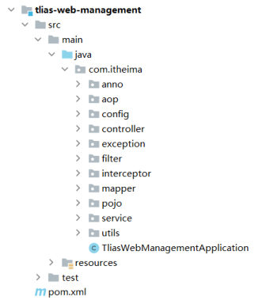
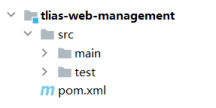

[90 篇](/posts/编程学习/javaweb学习笔记/90-自定义starter/)把"公共组件怎么封装成起步依赖"这条线走完了，接下来进入本章的第二个 PPT —— **Maven 高级**（`14. 后端Web进阶(Maven高级).pptx`，36 页）。这个 PPT 在**第 2 页**就把内容交代清楚了，一共三块：

| 小节 | 一句话说明它解决什么问题 | 对应 PPT | 落在哪一篇 |
| --- | --- | --- | --- |
| **分模块设计与开发** | 一个工程越写越大 → 拆成若干个子模块 | 1-9 | 就是这一篇 |
| **继承与聚合** | 拆完之后：依赖配置到处重复、构建要一个个点 → 父工程统一管 + 一条命令构建全部 | 10-22 | [92 篇](/posts/编程学习/javaweb学习笔记/92-maven继承与聚合/) |
| **私服** | 团队内部自己写的模块，怎么共享给别人用 | 23-35 | [93 篇](/posts/编程学习/javaweb学习笔记/93-maven私服/) |

这一篇覆盖 PPT 第 1-9 页：**为什么分模块 → 三条拆分策略 → 照着课程把 tlias 拆出两个模块 → 拆完之后的构建实测**。至于"拆完之后每个模块的 pom 里那些重复依赖怎么办""怎么一条命令把全部模块构建出来"，是下一篇的事。

## 一、为什么要分模块（PPT 第 4-5 页）

PPT 第 4 页先描述了一个所有项目都会遇到的局面：一个**商城项目**里有商品模块、搜索模块、购物车模块、订单模块……，如果**全都在一个工程里**，就会出现两个问题 —— PPT 上写的是：

> **不便维护 · 难以复用**

这六个字要展开成具体场景才有感觉：

| 问题 | 具体表现 |
| --- | --- |
| **不便维护** | 所有功能的代码堆在一个工程里：改订单模块的一行代码、编译一次要连带整个工程（企业里的单体工程动辄上千个类）；一个人的改动会影响所有人的构建；多人协作时的冲突也集中在这一个工程里 |
| **难以复用** | 别的项目要用这里面的工具类（比如 Tlias 里的 `AliyunOSSOperator`、`JwtUtils`），只能把**文件复制**一份过去；复制出去之后，原项目修了 bug，**复制出去的那一份不会跟着更新** |

本机的实验工程正好可以作为"拆分之前"的样子 —— 这是一份完整的 Tlias 工程，所有代码都在一个模块 `tlias-web-management` 里（本机数了一下：主程序 `src/main/java` 下 **38 个 java 文件**，测试程序下还有 6 个）：


*图：PPT 第 7 页——拆分之前的 tlias 工程：实体类（`pojo`）、工具类（`utils`）和 `controller`、`service`、`mapper`、`anno`、`aop`、`config`、`exception`、`filter`、`interceptor` 全部平级挂在同一个模块的 `com.itheima` 包下，应用启动类就在最外层*

于是 PPT 第 5 页给出解法：**把大项目拆分成若干个子模块，再多加一个"通用组件"模块装公共代码**；这一页的定义后面总结页还会再问一遍，先记住它：

> [!IMPORTANT]
> **分模块设计**：将一个大项目拆分成若干个子模块，方便项目的**管理维护、扩展**，也方便**模块间的相互引用，资源共享**。（PPT 第 5 页）

注意最后半句"模块间的相互引用，资源共享"—— 这才是分模块真正的价值点：**公共代码只留一份，谁要用谁依赖它**，不再是复制粘贴。

## 二、三条拆分策略（PPT 第 6 页）

一个工程该按什么标准拆？PPT 第 6 页给了三条策略，每条都配了一组模块名示例（示例用的是商城 `mall-` 前缀）：

### 策略一：按功能模块拆分

比如：**公共组件、商品模块、搜索模块、购物车模块、订单模块**等。拆出来就是：

```text
mall-common     公共组件（工具类、常量、统一返回结果等）
mall-goods      商品模块
mall-search     搜索模块
mall-cart       购物车模块
mall-order      订单模块
```

**一个业务功能一个模块**，最适合"业务边界清晰、各模块相对独立"的项目。

### 策略二：按层拆分

比如：**公共组件、实体类、控制层、业务层、数据访问层**。拆出来就是：

```text
mall-common      公共组件
mall-pojo        实体类
mall-controller  控制层
mall-service     业务层
mall-mapper      数据访问层
```

**一个技术分层一个模块**，也就是把[三层架构](/posts/编程学习/javaweb学习笔记/37-三层架构/)（Controller / Service / Dao）在**工程结构**上也切开。

### 策略三：按功能模块 + 层拆分

先按功能切，再在每个功能里按层切：

```text
mall-common            公共组件
mall-goods-controller  商品的控制器
mall-goods-service     商品的业务层
mall-order-controller  订单的控制器
mall-order-service     订单的业务层
```

粒度最细，模块数量也最多。

> [!TIP]
> 课程里的 Tlias 走的是"**按模块 + 按层**"的混合路子，看模块名就能看出来：`tlias-pojo`（实体类，属于"按层"）、`tlias-utils`（工具类，属于"公共组件"）、`tlias-web-management`（按功能拆出来的一个业务模块）。课程后面还会继续拆出 `tlias-web-system`、`tlias-web-report` 这样的**按功能**模块 —— 在 PPT 第 15 页的工程结构截图里已经能看到这五个子模块和父工程并列在一起了（那张图在 [92 篇](/posts/编程学习/javaweb学习笔记/92-maven继承与聚合/)里）。

三条策略没有"谁对谁错"，只有**适不适合当前项目**：业务模块之间耦合松就按功能拆；想强制分层规范就按层拆；规模再大就两个一起用。

## 三、实战：把 tlias 拆出 tlias-pojo 和 tlias-utils（PPT 第 7-8 页）

PPT 第 8 页把实战任务说得很短，就两句话：

> **创建 maven 模块 tlias-pojo，存放实体类。**
> **创建 maven 模块 tlias-utils，存放相关工具类。**

落实到操作上，就是下面这几步（课程代码 `03. maven分模块之后代码\` 就是做完之后的样子）：

**第 1 步：新建一个空的 Maven 模块。** 在 IDEA 里 `File → New → Module`（或右键工程 → `New → Module`），选 Maven、起名 `tlias-pojo`。刚建好时它里面只有一个 `pom.xml`，结构还是标准的 Maven 三件套：


*图：PPT 第 7 页——一个 Maven 模块的内部结构：一个 `pom.xml` + `src/main`、`src/test` 两个源码目录；"分模块"只是把代码分散到多个这样的小工程里，每个模块本身仍然是标准的 Maven 结构*

**第 2 步：把实体类搬进 tlias-pojo。** 本机实验工程里，搬过去的是 **13 个实体类**：`Emp`、`Dept`、`Student`、`Clazz`、`ClazzCountOption`、`EmpExpr`、`EmpLog`、`EmpQueryParam`、`JobOption`、`LoginInfo`、`OperateLog`、`PageResult`、`Result`。（`JobOption`、`EmpQueryParam` 这种"查询参数、下拉选项"类也跟着实体走。）

**第 3 步：同样再建一个 tlias-utils，把工具类搬进去。** 本机实验工程里搬过去的是 **4 个工具类**：`AliyunOSSOperator`、`AliyunOSSProperties`、`CurrentHolder`、`JwtUtils`。

**第 4 步：让原来的模块依赖这两个新模块。** 实体类、工具类搬走之后，`tlias-web-management` 自己就"不认识"它们了 —— 解决办法是在它的 `pom.xml` 里把这两个模块当成依赖引进来（下面这段就是课程代码 `tlias-web-management/pom.xml` 里的原文）：

```xml
<!--Tlias-Pojo实体类-->
<dependency>
    <groupId>com.itheima</groupId>
    <artifactId>tlias-pojo</artifactId>
    <version>1.0-SNAPSHOT</version>
</dependency>

<dependency>
    <groupId>com.itheima</groupId>
    <artifactId>tlias-utils</artifactId>
    <version>1.0-SNAPSHOT</version>
</dependency>
```

> [!TIP]
> 搬家之后 `tlias-web-management` 里的 `import com.itheima.pojo.Emp;`、`import com.itheima.utils.JwtUtils;` **不用改**：包名（`com.itheima.pojo` / `com.itheima.utils`）和模块名是两回事，两个新模块里的包名原样保留，所以编译时只要 classpath 上有这两个模块就行 —— 上面那两个 `<dependency>` 干的就是这件事。

**第 5 步：检查包的"搬家痕迹"。** 拆完之后，`tlias-web-management` 的 `com.itheima` 包下只剩**业务相关**的包（`anno`、`aop`、`config`、`controller`、`exception`、`filter`、`interceptor`、`mapper`、`service`、`service.impl`），`pojo` 和 `utils` 两个包彻底从它里面消失 —— 这就是"拆干净了"的标志。

> [!WARNING]
> 模块之间的依赖是**单向**的：`tlias-web-management → tlias-pojo / tlias-utils` 可以，反过来让 `tlias-pojo` 依赖 `tlias-web-management` 就会出现**循环依赖**，Maven 直接报错。设计模块时"谁依赖谁"要先想清楚，这也是下面那条注意事项的由来。

## 四、注意：先设计再编码（PPT 第 8 页）

PPT 第 8 页专门用一块"注意"强调这件事：

> **注意：分模块开发需要先针对模块功能进行设计，再进行编码。不会先将工程开发完毕，然后进行拆分。**

翻成大白话：分模块是**设计动作**，不是**重构动作**。应该是"想清楚这个系统要拆成哪几个模块、每个模块负责什么、谁依赖谁"，然后**照着设计去建模块、写代码**；而不是先把代码全写在一个工程里，等项目跑起来了再回头把包一个个挪出去。

PPT 第 7-8 页的配图其实就是在演示这个顺序：先看到"拆分之前的样子"（一堆平级包），再看到"新建两个模块"（`tlias-pojo`、`tlias-utils`）——**模块是先建出来的空壳（只有一个 pom），代码是往里放的**。

[92 篇](/posts/编程学习/javaweb学习笔记/92-maven继承与聚合/)要讲的父工程 `tlias-parent`，也是这套设计的一部分：它从头就没有业务代码，只负责管理。

## 五、本机实测：拆完之后，一条命令构建四个模块

拆成多模块之后，最直观的变化是"构建"。本机实验工程 `tlias-modules` 就是按课程步骤拆好的四个模块（`tlias-parent` + `tlias-pojo` + `tlias-utils` + `tlias-web-management`），在**父工程（聚合工程）**上执行一条命令：

```bash
mvn clean install -DskipTests
```

> [!TIP]
> 本机实测（Maven 3.9.14 / JDK 17）—— 一条命令，四个模块全构建，输出里的模块顺序和结果如下：
>
> ```text
> [INFO] Building tlias-parent 1.0-SNAPSHOT            [1/4]
> [INFO] Building tlias-pojo 1.0-SNAPSHOT              [2/4]  → 打出 tlias-pojo-1.0-SNAPSHOT.jar
> [INFO] Building tlias-utils 1.0-SNAPSHOT             [3/4]  → 打出 tlias-utils-1.0-SNAPSHOT.jar
> [INFO] Building tlias-web-management 0.0.1-SNAPSHOT  [4/4]  → 打出可执行 jar
> ```
>
> 两条结论：
> ① **顺序不是手写的**，是 Maven 按模块之间的依赖关系自动排出来的（父工程 → 被依赖的 pojo、utils → 最后才是依赖它们的 web-management）；
> ② 被复用的两个模块各自打出了 jar 并**装进了本地仓库** —— `tlias-web-management` 就是以"依赖"的方式用上它们的，这正是"模块间的相互引用"落地的方式。

"一条命令构建全部模块"本身属于**聚合**，是这个顺序自动排列背后的机制，完整输出（含每个模块耗时和 `Reactor Summary`）放在 [92 篇](/posts/编程学习/javaweb学习笔记/92-maven继承与聚合/)里。

## 必答问答（PPT 第 9 页）

PPT 第 9 页是这一节的总结页，三个问题都是"要背下来"的：

| PPT 的问题 | 答案 |
| --- | --- |
| **什么是分模块设计?** | **将项目按照功能模块/层拆分成若干个子模块** |
| **为什么要分模块设计?** | **方便项目的管理维护、扩展，也方便模块间的相互引用，资源共享** |
| **注意事项** | **分模块设计需要先针对模块功能进行设计，再进行编码。不会先将工程开发完毕，然后进行拆分** |

## 小结

| 问题 | 答案 |
| --- | --- |
| 一个工程不拆会出现什么问题？ | **不便维护**（改一处要动整个工程、协作冲突集中）、**难以复用**（公共代码只能复制，改一处别处不跟着变） |
| 分模块设计是什么？ | 把一个**大项目拆分成若干个子模块**，方便管理维护、扩展，也方便模块间相互引用、资源共享 |
| 有哪三条拆分策略？ | ① **按功能模块**拆（`mall-common`、`mall-goods`、`mall-search`、`mall-cart`、`mall-order`）；② **按层**拆（`mall-common`、`mall-pojo`、`mall-controller`、`mall-service`、`mall-mapper`）；③ **按功能模块 + 层**拆（`mall-common`、`mall-goods-controller`、`mall-goods-service`、`mall-order-controller`、`mall-order-service`） |
| 课程里的 tlias 拆了哪两个模块？各放什么？ | **`tlias-pojo` 放实体类**（本机实验工程里 13 个）；**`tlias-utils` 放相关工具类**（4 个：`AliyunOSSOperator`、`AliyunOSSProperties`、`CurrentHolder`、`JwtUtils`） |
| 搬完代码之后，原模块为什么还能用这些类？ | 因为原模块的 `pom.xml` 里加了这两个模块的**依赖**（`com.itheima:tlias-pojo` / `com.itheima:tlias-utils`），包名没变，所以 `import` 也不用改 |
| 分模块的注意事项是？ | **先针对模块功能进行设计，再进行编码**；不是先把工程开发完工再拆分 |
| 拆完之后怎么验证？ | 本机实测：在父工程上执行 `mvn clean install -DskipTests`，四个模块按 `parent → pojo → utils → web-management` 的顺序全部 `SUCCESS` |

## 相关

- [上一篇：自定义starter](/posts/编程学习/javaweb学习笔记/90-自定义starter/)
- [下一篇：Maven继承与聚合](/posts/编程学习/javaweb学习笔记/92-maven继承与聚合/)
- [Maven依赖范围与常见问题（Maven 基础的最后一篇）](/posts/编程学习/javaweb学习笔记/29-maven依赖范围与常见问题/)

## 练习题

### 一、知识回顾（读完直接做下面的实践题）

1. **一个工程不分模块会遇到的两个问题**：**不便维护**（所有功能堆在一个工程里，改一处牵连全工程、多人协作冲突集中）、**难以复用**（公共代码只能复制一份出去，原项目改了复制的那份不跟着变）
2. **分模块设计的定义**：将一个大项目**拆分成若干个子模块**，方便项目的**管理维护、扩展**，也方便**模块间的相互引用，资源共享**
3. **三条拆分策略**：① **按功能模块拆分**（公共组件、商品模块、搜索模块、购物车模块、订单模块）；② **按层拆分**（公共组件、实体类、控制层、业务层、数据访问层）；③ **按功能模块 + 层拆分**
4. **策略一的典型模块名**：`mall-common`、`mall-goods`、`mall-search`、`mall-cart`、`mall-order`
5. **策略二的典型模块名**：`mall-common`、`mall-pojo`、`mall-controller`、`mall-service`、`mall-mapper`
6. **策略三的典型模块名**：`mall-common`、`mall-goods-controller`、`mall-goods-service`、`mall-order-controller`、`mall-order-service`
7. **课程实战拆出的两个模块**：`tlias-pojo`（存放**实体类**）、`tlias-utils`（存放**相关工具类**）
8. **拆完之后怎么让原模块继续用这些类**：在原模块的 `pom.xml` 里加这两个模块的**依赖**；包名不变，所以 `import` 语句不用改
9. **注意事项**：分模块开发需要**先针对模块功能进行设计，再进行编码**；不会先将工程开发完毕，然后进行拆分
10. **拆完的验证方式（本机实测）**：在父工程上跑一次 `mvn clean install -DskipTests`，模块按 `tlias-parent → tlias-pojo → tlias-utils → tlias-web-management` 的顺序全部构建成功，两个被复用的模块各自打出 jar 并进本地仓库

### 二、裸写题

- [ ] **2-1 给一个商城项目设计拆分方案**
  一个商城项目，代码里有：商品列表查询、搜索、购物车、下单这几块**业务功能**，另有一些工具类、常量、统一返回结果对象是**各功能都要用的**。请：
  1. 写出三条拆分策略的**名字**，并给每条策略举出一组模块名（用 `mall-` 前缀）；
  2. 结合这个项目说一句：这个项目更适合哪条策略，为什么。
  （练习文件 `test_91_分模块设计.txt` 里已经给了写作区。）

  > [!TIP]- 提示（先自己想，实在想不出再点开）
  > **一级 · 思路**：先问"拆的切分线画在哪里"——画在业务功能上、画在技术分层上，还是两刀都画
  > **二级 · 方法**：三条策略分别是按功能模块拆、按层拆、按功能模块 + 层拆；模块名一般用 `项目前缀-功能名` / `项目前缀-层名`
  > **三级 · 骨架**：策略一 → `mall-____`（公共组件）+ 各业务模块；策略二 → `mall-____`（实体类/控制层/业务层/数据访问层各一个）；策略三 → `mall-商品-____` / `mall-订单-____`

  > [!TIP]- 参考答案（做完再点开）
  > 1. 三条策略与模块名：
  >    - **策略一：按功能模块拆分** —— `mall-common`（公共组件）、`mall-goods`（商品）、`mall-search`（搜索）、`mall-cart`（购物车）、`mall-order`（订单）；
  >    - **策略二：按层拆分** —— `mall-common`（公共组件）、`mall-pojo`（实体类）、`mall-controller`（控制层）、`mall-service`（业务层）、`mall-mapper`（数据访问层）；
  >    - **策略三：按功能模块 + 层拆分** —— `mall-common`、`mall-goods-controller`、`mall-goods-service`、`mall-order-controller`、`mall-order-service`。
  > 2. 这个项目的业务功能边界清晰（商品/搜索/购物车/订单各自独立、都有各自的数据和接口），**按功能模块拆（策略一）**最贴合；如果团队还想在工程结构上强制"Controller / Service / Mapper 不许互相串"，就在每个功能模块里再按层切一刀，也就是策略三。三条策略没有对错，只有粒度适不适合。

- [ ] **2-2 给 tlias 写一份拆分设计**
  课程里的 tlias 工程现在所有代码都堆在一个模块里：`com.itheima` 下面有 `pojo`（实体类）、`utils`（工具类）、`controller`、`service`、`mapper`、`anno`、`aop`、`config`、`exception`、`filter`、`interceptor`。请写出一份拆分设计：
  1. 要新建哪几个模块？模块名分别是什么？
  2. 每个模块里放什么（把上面这些包分到对应模块里）；
  3. 说明这些模块之间"谁依赖谁"（画一个箭头关系即可），并说明箭头**不能反过来**的原因。
  （练习文件 `test_91_分模块设计.txt` 里已经给了写作区，拆分前的包结构就在题面里。）

  > [!TIP]- 提示（先自己想，实在想不出再点开）
  > **一级 · 思路**：这次的切分线画在"是不是每个业务都要用"上——实体类和工具类是全项目共用的，业务代码才是某个模块专用的
  > **二级 · 方法**：两个新模块分别叫 `tlias-pojo`（放实体类）、`tlias-utils`（放工具类）；原来的模块保留业务代码，通过在 pom 里加依赖的方式用上它们
  > **三级 · 骨架**：`tlias-web-management → tlias-pojo`、`tlias-web-management → tlias-utils`；模块之间不能互相指回去

  > [!TIP]- 参考答案（做完再点开）
  > 1. 新建 **两个模块**：`tlias-pojo`、`tlias-utils`（原来的 `tlias-web-management` 保留，它变成"使用者"）。
  > 2. 分工：
  >    - `tlias-pojo`：`pojo` 包（`Emp`、`Dept`、`Student`、`Clazz`、`Result`、`PageResult`、`EmpQueryParam`…… 本机实验工程里共 13 个类）；
  >    - `tlias-utils`：`utils` 包（`AliyunOSSOperator`、`AliyunOSSProperties`、`CurrentHolder`、`JwtUtils`）；
  >    - `tlias-web-management`：剩下的 `controller`、`service`、`mapper`、`anno`、`aop`、`config`、`exception`、`filter`、`interceptor`（业务代码都留在这里）。
  > 3. 依赖方向：`tlias-web-management → tlias-pojo`、`tlias-web-management → tlias-utils`（两个新模块之间没有依赖）。箭头**不能反过来**：`tlias-pojo` 如果依赖 `tlias-web-management`，而后者又依赖前者，就形成**循环依赖**，Maven 无法确定构建顺序、直接报错；而且实体类/工具类本来是**全项目通用**的，让它们依赖某个具体业务模块，将来别的模块想复用时就被绑死了。

- [ ] **2-3 说出"为什么不能先把工程写完再拆"**
  有人提议："先按老办法把所有代码写在一个工程里，能跑通了，再花半天把包挪到不同模块里去。"请从**设计**和**代价**两个角度说明 PPT 为什么明确反对这种做法（PPT 第 8 页的"注意"）。

  > [!TIP]- 提示（先自己想，实在想不出再点开）
  > **一级 · 思路**：模块划分属于"设计"，设计要在编码之前定；而且事后拆分要动的东西远比"挪包"多
  > **二级 · 方法**：从"模块边界/依赖方向要先想清楚"和"事后再拆要改依赖、改配置、重新验证"两方面各说一条
  > **三级 · 骨架**：① 设计角度：拆分线 = 模块职责与依赖方向，写完再定就要回头大改；② 代价角度：挪完包还要补依赖、通编译、重测全流程

  > [!TIP]- 参考答案（做完再点开）
  > PPT 第 8 页的原话是"**分模块开发需要先针对模块功能进行设计，再进行编码。不会先将工程开发完毕，然后进行拆分。**"理由是：
  > ① **设计角度**：拆模块的本质是决定"系统分成哪几块、每块负责什么、谁依赖谁"。这些是**架构决策**，编码前定下来，写代码时就知道每个类该放哪个模块、该 import 谁；写完之后再定，就会出现"这个类算 pojo 还是算业务"的扯皮，模块边界也容易切歪。
  > ② **代价角度**：事后拆分不是"挪包"那么简单 —— 实体类、工具类搬出去之后要**补依赖**（每个使用者模块都得加依赖坐标）、要保证**编译通过**、原来的三层调用关系与配置（扫描路径、mapper 映射文件位置等）都可能要跟着改，最后**整个项目要重新测一遍**。本机实验工程里，光是把实体类和工具类搬出去，`tlias-web-management` 就多了两条依赖、少了两个包。
  > 所以正确顺序是：**先做模块设计（画模块和依赖关系）→ 再建空模块 → 再往里写代码**。

### 三、综合题

- [ ] **3-1 照着课程把 tlias 拆成多模块**
  拿你之前跟着课程写的 Tlias 工程（单模块），完成一次真正的分模块改造，并在练习文件里记录过程：
  1. **设计**：写出你要拆的模块与它们的职责，以及模块之间的依赖方向（先写设计，再动手）；
  2. **建模块**：新建 `tlias-pojo`、`tlias-utils` 两个空的 Maven 模块（先在 IDEA 里建出来，观察它们的结构：`pom.xml` + `src/main` + `src/test`）；
  3. **搬代码**：把实体类搬进 `tlias-pojo`、工具类搬进 `tlias-utils`（记录各自搬了多少个类）；
  4. **补依赖**：在被依赖方（两个新模块）和依赖方（原来的业务模块）的 `pom.xml` 里把依赖关系补上，写出你加的那两条依赖坐标；
  5. **验证**：说出你要执行的那条"清理并构建、跳过测试"的命令，并**预测**四个模块的构建顺序；
  6. 在文件末尾回答：为什么这条命令能一次性构建四个模块？（一句话，想到什么写什么，下一篇会对答案。）
  （练习文件 `test_91_分模块设计.txt` 里按这 6 步给了写作区。）

  > [!TIP]- 提示（先自己想，实在想不出再点开）
  > **一级 · 思路**：整题的顺序就是 PPT 强调的顺序 —— **先设计（模块 + 依赖方向）→ 再建模块 → 再搬代码 → 最后补依赖并构建**
  > **二级 · 方法**：建模块用 IDEA 的 "New Module → Maven"；补依赖就是在 pom 里写一组 `<dependency>`（自己项目的模块也照样是依赖）；构建用 `mvn clean install -DskipTests`（`install` 会把模块装进本地仓库，后面别的模块才能引用到）；顺序要按"被依赖的先构建"来预测
  > **三级 · 骨架**：依赖坐标 `<groupId>com.itheima</groupId> <artifactId>tlias-____</artifactId> <version>1.0-SNAPSHOT</version>`；命令 `mvn ____ install -DskipTests`

  > [!TIP]- 参考答案（做完再点开）
  > 1. **设计**：`tlias-pojo`（实体类，全项目共用）→ 被 `tlias-web-management` 依赖；`tlias-utils`（工具类，全项目共用）→ 被 `tlias-web-management` 依赖；`tlias-web-management`（业务代码）依赖上面两个。依赖方向是**单向**的，两个公共模块不依赖任何业务模块。
  > 2. **建模块**：`File → New → Module`，选 Maven，模块名 `tlias-pojo`；同样再建 `tlias-utils`。建好后结构是"一个 `pom.xml` + `src/main`、`src/test`"，此时还没有任何业务代码。
  > 3. **搬代码**：实体类 → `tlias-pojo/src/main/java/com/itheima/pojo/`（本机实验工程里 13 个）；工具类 → `tlias-utils/src/main/java/com/itheima/utils/`（4 个：`AliyunOSSOperator`、`AliyunOSSProperties`、`CurrentHolder`、`JwtUtils`）。包名原样保留，所以 `tlias-web-management` 里的 `import` 不用改。
  > 4. **补依赖**（课程代码 `tlias-web-management/pom.xml` 原文）：
  >    ```xml
  >    <!--Tlias-Pojo实体类-->
  >    <dependency>
  >        <groupId>com.itheima</groupId>
  >        <artifactId>tlias-pojo</artifactId>
  >        <version>1.0-SNAPSHOT</version>
  >    </dependency>
  >
  >    <dependency>
  >        <groupId>com.itheima</groupId>
  >        <artifactId>tlias-utils</artifactId>
  >        <version>1.0-SNAPSHOT</version>
  >    </dependency>
  >    ```
  >    另外，实体类要写 `@Data`、工具类要用到 OSS/JWT 等库，所以这两个模块自己的 `pom.xml` 里也要把 lombok、OSS、JJWT 这些依赖写上 —— 每个模块都重复写一遍太麻烦，这正是[下一篇](/posts/编程学习/javaweb学习笔记/92-maven继承与聚合/)要解决的问题。
  > 5. **验证**：命令是 `mvn clean install -DskipTests`（在父工程/聚合工程上执行）。预测顺序：`tlias-parent → tlias-pojo → tlias-utils → tlias-web-management`。
  > 6. 因为它是一个**聚合**工程：父工程的 `<modules>` 把几个模块都列了进来，`mvn` 在它上面执行时会依次构建这些模块，**构建顺序由 Maven 按模块间的依赖关系自动决定**，不用手动一个个构建。本机实测（Maven 3.9.14 / JDK 17）的输出就是 `Building tlias-parent [1/4] → tlias-pojo [2/4] → tlias-utils [3/4] → tlias-web-management [4/4]`，最后 `BUILD SUCCESS`。
