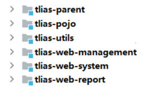
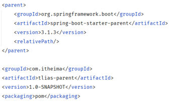
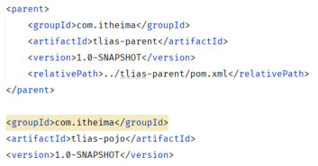

[91 篇](/posts/编程学习/javaweb学习笔记/91-maven分模块设计与开发/)把 tlias 拆成了 `tlias-pojo`、`tlias-utils`、`tlias-web-management` 三个模块，但拆完之后立刻冒出两个新问题：

- **三个模块的 pom 里写着同样的依赖**：实体类要用 lombok、工具类要用 OSS/JJWT、业务模块要用 lombok + SpringBoot —— 复制三份，将来升版本要改三处；
- **构建要一个个点**：改了 pojo，就得记得先构建 pojo、再构建 utils、最后构建 web-management，漏一个就是"依赖找不到"。

这一篇（PPT 第 10-22 页）就是来收这两笔账的：**继承**解决依赖配置重复，**聚合**解决"一次构建全部模块"。PPT 第 11 页把这一节拆成四个小标题，本篇按这个顺序走：

| 小节 | 讲什么 | 对应 PPT |
| --- | --- | --- |
| **继承 → 继承关系** | 父工程 / 子工程怎么建、配置怎么写 | 12-15 |
| **继承 → 版本锁定** | `<dependencyManagement>` 与 `<properties>` | 17-19 |
| **聚合** | `<modules>` 与"一次构建全部模块" | 21-22 |

## 一、继承要解决的问题（PPT 第 12 页）

PPT 第 12 页把三个子工程的 pom 并排放在一起，每个里面都有这么一段（三个模块里一模一样）：

```xml
<dependency>
    <groupId>org.projectlombok</groupId>
    <artifactId>lombok</artifactId>
    <version>1.18.34</version>
</dependency>
...
```

页面上给这一页的批注只有两个字：**繁琐**。繁琐在哪：

| 麻烦 | 说明 |
| --- | --- |
| **重复写** | 同一段依赖在三个模块里各写一遍，将来再加一个模块还要再抄一遍 |
| **版本会不一致** | 三个地方各写各的版本号，某天只想改一个，很容易漏 —— 最后出现"pojo 用 1.18.30、utils 用 1.18.34"这种局面，排查起来很痛苦 |
| **共有依赖清单看不见** | 想知道"这个项目统一用哪些版本"，得把每个模块的 pom 都翻一遍 |

"共有依赖"的这种重复，正适合用**继承**来消掉。

## 二、继承是什么（PPT 第 13 页）

PPT 第 13 页的三句话是这一节的骨架，先原样记住：

> **概念**：继承描述的是两个工程间的关系，与 java 中的继承相似，子工程可以继承父工程中的配置信息，常见于依赖关系的继承。
> **作用**：简化依赖配置、统一管理依赖。
> **实现**：`<parent> … </parent>`。

把它画成图，就是"上面一个父工程，下面挂三个子工程"，父工程再往上还接着 SpringBoot 官方的父工程：

```text
spring-boot-starter-parent（SpringBoot 官方的父工程，管 SpringBoot 全家桶的版本）
        ↑ 继承
    tlias-parent（我们建的父工程：统一管理依赖、统一版本）
        ↑ 继承                   ↑ 继承                    ↑ 继承
   tlias-pojo              tlias-utils            tlias-web-management
```

课件里的工程结构截图就是这个样子的（父工程和各子模块并列在一个 IDEA 工程里）：


*图：PPT 第 15 页——IDEA 里的 tlias 多模块结构：`tlias-parent` 与各子模块并列；图中除了本篇用到的 `tlias-pojo`、`tlias-utils`、`tlias-web-management`，还有课程后面继续拆出来的 `tlias-web-system`、`tlias-web-report`，它们同样是"认"`tlias-parent` 当父工程*

链子中间那层 `tlias-parent` 很关键：它**自己也是别人的子工程**（继承 `spring-boot-starter-parent`），同时又是三个业务模块的父工程 —— 这就是 Maven 的"继承链"。

## 三、继承关系实现三步（PPT 第 14-15 页）

### 3.1 ① 创建父工程 tlias-parent，打包方式设为 pom

父工程和普通模块长得一样（新建 Maven 模块），区别只有一个：**打包方式**。PPT 第 14 页给了 Maven 三种打包方式的对照表：

| 打包方式 | 含义 | 用在哪 |
| --- | --- | --- |
| **jar**（默认） | **普通模块打包**，springboot 项目基本都是 jar 包（内嵌 tomcat 运行） | 业务模块、工具模块，如 `tlias-pojo`、`tlias-utils` |
| **war** | **普通 web 程序打包**，需要部署在外部的 tomcat 服务器中运行 | 传统 Web 项目 |
| **pom** | **父工程或聚合工程**，该模块不写代码，仅进行依赖管理 | `tlias-parent` 这种"只管配置"的工程 |

父工程的 pom（课程代码 `tlias-parent/pom.xml` 原文）：

```xml
<parent>
    <groupId>org.springframework.boot</groupId>
    <artifactId>spring-boot-starter-parent</artifactId>
    <version>3.2.10</version>
    <!--父工程的pom.xml的相对路径-->
    <relativePath/> <!-- lookup parent from repository -->
</parent>

<groupId>com.itheima</groupId>
<artifactId>tlias-parent</artifactId>
<version>1.0-SNAPSHOT</version>
<packaging>pom</packaging>
```

三个要点：

1. **`<packaging>pom</packaging>`** —— 这句话说明"我是一个父工程，不产出 jar"，去掉它默认就是 jar 打包；
2. **父工程自己也要继承 `spring-boot-starter-parent`** —— SpringBoot 那一堆依赖的版本、编译插件配置都在它里面，继承过来就相当于"白拿一份官方版本清单"；
3. **`<relativePath/>` 写空** —— 意思是"别去上级目录找，直接去仓库里拿"，因为 `spring-boot-starter-parent` 是下载到本地仓库的第三方构件，不是我们工程目录里的模块。


*图：PPT 第 15 页——父工程 pom 的写法：上半段是 `<parent>`（继承 `spring-boot-starter-parent`、`<relativePath/>` 写空），下半段是父工程自己的坐标与 `<packaging>pom</packaging>`*

> [!WARNING]
> PPT 第 15 页这张图里 `spring-boot-starter-parent` 的版本写的是 **3.1.3**，而课程代码 `tlias-parent/pom.xml` 里是 **3.2.10** —— 同一份讲义里前后不一致。**以课程代码的 3.2.10 为准**（本机实验工程里也是 3.2.10），不要照着 PPT 的图手抄版本号。

### 3.2 ② 在子工程中配置继承关系

每个子工程的 pom 里写一段 `<parent>` 指向父工程（课程代码 `tlias-pojo/pom.xml` 原文）：

```xml
<!--父工程-->
<parent>
    <groupId>com.itheima</groupId>
    <artifactId>tlias-parent</artifactId>
    <version>1.0-SNAPSHOT</version>
    <relativePath>../tlias-parent/pom.xml</relativePath>
</parent>

<artifactId>tlias-pojo</artifactId>
<version>1.0-SNAPSHOT</version>
```

注意这段配置里**没有 `groupId`** —— 因为子工程配置了继承关系之后，**坐标中的 groupId 是可以省略的**，会自动继承父工程的（`com.itheima`）。PPT 第 15 页的那张截图专门把子工程 pom 里被"继承"影响的位置高亮了出来：


*图：PPT 第 15 页——子工程 pom：`<parent>` 里的三项坐标 + `<relativePath>` 指到父工程的 pom.xml；下半段子工程自己的坐标里，`groupId` 是可以省掉的（图中做了强调）*

### 3.3 ③ 在父工程中配置各个工程共有的依赖

子工程"认了父"之后，父工程里写的**依赖**会被子工程直接继承。课程代码里父工程放的是 lombok 和 spring-boot-starter：

```xml
<!--直接引入依赖-->
<dependencies>
    <dependency>
        <groupId>org.projectlombok</groupId>
        <artifactId>lombok</artifactId>
        <version>${lombok.version}</version>
        <optional>true</optional>
    </dependency>

    <dependency>
        <groupId>org.springframework.boot</groupId>
        <artifactId>spring-boot-starter</artifactId>
        <version>${spring.boot.starter.version}</version>
    </dependency>
</dependencies>
```

写完之后，三个子工程里原来那几段重复的 lombok 依赖就**可以删掉了** —— 它们已经"继承"到了。

### 3.4 三个容易踩的细节（PPT 第 15 页）

| 细节 | 说明 |
| --- | --- |
| **groupId 可省略** | 子工程配置了继承关系之后，坐标中的 `groupId` 会自动继承父工程的，可以不写 |
| **relativePath** | 指定**父工程的 pom 文件的相对位置**；如果不指定，将从**本地仓库/远程仓库**查找 —— 所以父工程还没 `install` 到本地仓库时，子工程找不到父工程就会报错（这也是"父工程先构建一次"的原因） |
| **子工程版本优先** | 若父子工程都配置了**同一个依赖的不同版本**，**以子工程的为准**（父工程只管"默认值"，子工程想覆盖就自己写一行 `<version>`） |

### 必答问答（PPT 第 15 页）

| PPT 的问题 | 答案 |
| --- | --- |
| **Maven 的继承关系实现步骤?** | ① **创建父工程，设置打包方式为 `pom`，并继承 `spring-boot-starter-parent`**；② **在子工程中配置继承关系**；③ **在父工程中配置各个工程的共有依赖** |

## 四、版本锁定：`<dependencyManagement>`（PPT 第 17 页）

继承只解决了"**所有**模块都要用的依赖"。可事实是：OSS 的 SDK 只有 `tlias-utils` 用、JJWT 也只有它用 —— 这类"**只有部分模块用**"的依赖，如果直接写进父工程的 `<dependencies>`，就会**强行塞给所有子工程**（pojo 里根本用不到 OSS，却凭空多出一堆 jar）。

PPT 第 17 页给的解法是**版本锁定**：

> 在 maven 中，可以在父工程的 pom 文件中通过 **`<dependencyManagement>`** 来统一管理依赖版本。

父工程里写成"版本清单"：

```xml
<dependencyManagement>
    <dependencies>
        <!--JWT令牌-->
        <dependency>
            <groupId>io.jsonwebtoken</groupId>
            <artifactId>jjwt</artifactId>
            <version>0.9.1</version>
        </dependency>
    </dependencies>
</dependencyManagement>
```

子工程要用的时候，**只写 groupId 和 artifactId、不写版本**：

```xml
<dependencies>
    <dependency>
        <groupId>io.jsonwebtoken</groupId>
        <artifactId>jjwt</artifactId>
    </dependency>
</dependencies>
```

版本从哪来？就从父工程那份清单里"对号入座"。这样版本仍然只有**一处**（父工程），但依赖不会强塞给不用的模块。

> [!IMPORTANT]
> 版本锁定是两件事配合：**父工程给"版本清单"（`<dependencyManagement>`）+ 子工程自己写依赖（不写版本）**。子工程如果既没写 `<version>`、父工程的清单里也没有它，Maven 会直接报错，提示依赖的 `version` 缺失。

> [!TIP]
> PPT 第 17 页的示意图右上角还标了一个 **0.9.2** 的版本号，讲的就是"版本被别人改掉/写岔了"这种情况 —— 对应的是第 15 页那条规则：**父子工程都配了同一个依赖的不同版本时，以子工程的为准**。所以在用了 `<dependencyManagement>` 统一版本之后，子工程里就不要再手写版本号，免得又出现"清单里是 0.9.1、实际用的是别的版本"。

## 五、`<dependencyManagement>` 与 `<dependencies>` 的区别（PPT 第 19 页）

这是这一节最容易被问到的对比题，PPT 第 19 页的答案原文是：

> **`<dependencies>` 是直接依赖，在父工程配置了依赖，子工程会直接继承下来。**
> **`<dependencyManagement>` 是统一管理依赖版本，不会直接依赖，还需要在子工程中引入所需依赖（无需指定版本）。**

展开成一张对照表：

| 对比项 | `<dependencies>` | `<dependencyManagement>` |
| --- | --- | --- |
| **它是什么** | **直接依赖**（真的引入 jar） | **统一管理依赖版本**（一份"版本清单"，本身不引入 jar） |
| **写在父工程时，子工程的表现** | 子工程**直接继承下来**，什么都不用写就能用 | 子工程**不会**自动引入这个依赖 |
| **子工程还要不要写依赖** | 不用写 | **要写**（写在子工程的 `<dependencies>` 里，**只写 groupId + artifactId**） |
| **子工程要不要写版本** | 不用（跟着父工程） | **不写**（版本从父工程的清单里拿；写了就是"以子工程为准"） |
| **适合放什么** | 所有模块都要用的依赖（lombok、`spring-boot-starter`） | 只有**部分**模块用的依赖（OSS SDK、jaxb、jjwt） |
| **一句话记法** | "**送上门**"：父工程写一次，子工程人人有份 | "**给清单**"：父工程只管版本，用不用子工程自己说 |

课程代码里两者是**同时出现**的：lombok 和 `spring-boot-starter` 走"直接引入"，OSS/jaxb/jjwt 走"版本清单"，正好和上面表格的判断标准对得上。

## 六、自定义属性与引用属性（PPT 第 18 页）

版本集中在父工程之后，还有个小问题：版本号还是散落在 `<dependency>` 和 `<dependencyManagement>` 的各个 `<version>` 里。PPT 第 18 页用**自定义属性**把版本号也提出来（写进 `<properties>`），再用 `${}` 引用：

```xml
<properties>
    <lombok.version>1.18.30</lombok.version>
    <jjwt.version>0.9.1</jjwt.version>
</properties>
```

引用时写 `${属性名}`：

```xml
<dependencies>
    <dependency>
        <groupId>org.projectlombok</groupId>
        <artifactId>lombok</artifactId>
        <version>${lombok.version}</version>
    </dependency>
</dependencies>
```

```xml
<dependencyManagement>
    <dependencies>
        <!--JWT令牌-->
        <dependency>
            <groupId>io.jsonwebtoken</groupId>
            <artifactId>jjwt</artifactId>
            <version>${jjwt.version}</version>
        </dependency>
    </dependencies>
</dependencyManagement>
```

好处很直白：**版本号只有一处**，升级时改 `<properties>` 里那一行就行；而且打开父工程 pom，一眼就能看到"这个项目都用了哪些版本"。属性名（`lombok.version`、`jjwt.version`）是自己起的，课程惯例是 `<artifactId>.version`。

> [!TIP]
> PPT 第 18 页这个例子里的 lombok 版本写的是 **1.18.30**，而课程代码 `tlias-parent/pom.xml` 里是 **1.18.34**（PPT 第 12 页那三个重复的 lombok 依赖也是 1.18.34）—— 还是那句话，**版本以课程代码为准**，PPT 这页只是演示"属性怎么声明、怎么引用"。

课程代码里父工程一共声明了 7 个自定义属性：

```xml
<properties>
    <maven.compiler.source>17</maven.compiler.source>
    <maven.compiler.target>17</maven.compiler.target>
    <project.build.sourceEncoding>UTF-8</project.build.sourceEncoding>

    <!--自定义属性-->
    <lombok.version>1.18.34</lombok.version>
    <spring.boot.starter.version>3.2.10</spring.boot.starter.version>
    <aliyun.sdk.version>3.17.4</aliyun.sdk.version>
    <jaxb.api.version>2.3.1</jaxb.api.version>
    <activation.version>1.1.1</activation.version>
    <jaxb.runtime>2.3.3</jaxb.runtime>
    <jjwt.version>0.9.1</jjwt.version>
</properties>
```

其中上面三个（`maven.compiler.*`、编码）是前面章节就一直在用的"内置属性"，下面七个才是这一节讲的**自定义属性**。

## 七、聚合（PPT 第 21 页）

继承解决的是"配置重复"，**聚合**解决的是"构建麻烦"。

> **聚合**：将多个模块组织成一个整体，同时进行项目的构建。
> **聚合工程**：一个不具有业务功能的"空"工程（有且仅有一个 pom 文件）。
> **作用**：快速构建项目（无需根据依赖关系手动构建，直接在聚合工程上构建即可）。

实现方式是父工程里写 `<modules>`，把要一起构建的模块列出来：

```xml
<!--聚合-->
<modules>
    <module>../tlias-pojo</module>
    <module>../tlias-utils</module>
    <module>../tlias-web-management</module>
</modules>
```

`<module>` 里写的是**模块的相对路径**（`../tlias-pojo` 表示"上一级目录里的 tlias-pojo 模块"），Maven 顺着这个路径找到那个模块的 pom，就把它纳入本次构建。

> [!IMPORTANT]
> **注意**：聚合工程中所包含的模块，在构建时，会**自动根据模块间的依赖关系设置构建顺序**，与聚合工程中模块的配置书写位置**无关**。（PPT 第 21 页）
>
> 也就是说：`<modules>` 里写的顺序不重要，Maven 会自己算出"谁先谁后"——先构建被依赖的模块（pojo、utils），最后构建依赖别人的模块（web-management）。想改变构建顺序，只能改变**依赖关系**，改书写顺序没用。

有意思的是，课程里的 `tlias-parent` **同时干了两件事**：它既是三个模块的父工程（管依赖、管版本），又是它们的聚合工程（一条命令构建全部）——这正是 PPT 第 22 页说的"常将两种关系制作到同一个 pom 文件中"。

## 八、本机实测：一条命令构建四个模块

本机实验工程 `tlias-modules` 就是上面这套配置的真实版本（`tlias-parent` 里同时有 `<modules>` 聚合、`<properties>` 自定义属性、`<dependencyManagement>` 版本锁定），在父工程上执行一次：

```bash
mvn clean install -DskipTests
```

> [!TIP]
> 本机实测（Maven 3.9.14 / JDK 17）—— 完整输出（含模块耗时）：
>
> ```text
> [INFO] Building tlias-parent 1.0-SNAPSHOT            [1/4]
> [INFO] Building tlias-pojo 1.0-SNAPSHOT              [2/4]  → 打出 tlias-pojo-1.0-SNAPSHOT.jar
> [INFO] Building tlias-utils 1.0-SNAPSHOT             [3/4]  → 打出 tlias-utils-1.0-SNAPSHOT.jar
> [INFO] Building tlias-web-management 0.0.1-SNAPSHOT  [4/4]  → 打出可执行 jar
> [INFO] Reactor Summary:
> [INFO] tlias-parent .......................... SUCCESS [ 0.249 s]
> [INFO] tlias-pojo ............................ SUCCESS [ 3.361 s]
> [INFO] tlias-utils ........................... SUCCESS [ 2.097 s]
> [INFO] tlias-web-management ................. SUCCESS [ 5.956 s]
> [INFO] BUILD SUCCESS     Total time: 11.982 s
> ```
>
> 输出里那段 `Reactor Summary`（构建反应堆汇总）就是**聚合**的直接证据：一次执行，四个模块按 `parent → pojo → utils → web-management` 的顺序全部 `SUCCESS`（`[1/4]`~`[4/4]` 是 Maven 给本次构建里的每个模块编的序号），整个构建总耗时 **11.982 s**。
>
> 两条实测结论：
> ① **聚合**——**一条命令、四个模块全构建**，顺序是 Maven 按模块间依赖关系**自动排**的（`tlias-web-management` 依赖 pojo 和 utils，所以它排最后），不用手动一个个构建；
> ② **分模块后的相互引用落地了**——`tlias-pojo`、`tlias-utils` 各自打出 jar 并**装进本地仓库**，`tlias-web-management` 就是以依赖的方式引用它们（`install` 之后，别的工程也能从本地仓库拿到这两个模块）。

## 九、继承与聚合的联系与区别（PPT 第 22 页）

PPT 第 22 页用一问一答把两者放在一起对比：

> **联系**：继承与聚合都属于设计型模块，打包方式都为 pom，常将两种关系制作到同一个 pom 文件中。
> **区别**：继承用于简化依赖配置、统一管理依赖版本，是在**子工程**中配置继承关系；聚合用于快速构建项目，是在**父工程（聚合工程）**中配置聚合的模块。

把这段展开讲透 —— **为什么说它们"像"**：

| 相同点 | 说明 |
| --- | --- |
| 都属于**设计型模块** | 都不是业务模块：**不写业务代码**，存在的意义是"管配置、管构建" |
| **打包方式都是 pom** | 都要写 `<packaging>pom</packaging>`，都不产出可运行的 jar |
| **常写在同一份 pom 里** | 课程里 `tlias-parent` 就是"父工程 + 聚合工程"二合一：`<parent>` 让它继承别人、`<modules>` 让它聚合子模块 |

**为什么说它们"不一样"**（这是最容易混的地方，按"方向 + 配在哪 + 干什么"三条来分）：

| 对比项 | **继承** | **聚合** |
| --- | --- | --- |
| **关系方向** | **子 → 父**：子工程主动"认父"，从父工程那里**拿配置** | **父 → 子**：聚合工程主动把子模块"**收进来**"一起构建 |
| **配在哪** | **子工程**的 `<parent>` | **父工程**的 `<modules>` |
| **解决什么问题** | **简化依赖配置、统一管理依赖版本** | **快速构建项目**（一次构建全部模块） |
| **不配会怎样** | 各模块的依赖各写一遍，版本容易写岔 | 构建要按依赖顺序一个个手动来，容易漏、容易错 |
| **和对方的关系** | 严格说两件事是独立的：**子工程不参与聚合也能继承** | **聚合不要求模块之间有继承关系**，只是课程里把它们写在了一起 |

一句话总结：**继承管"配置"（写代码时少写、版本统一），聚合管"构建"（打包时一条命令全搞定）**；两者常常落在同一个 pom 上，但一个关系的配置在子工程，另一个在父工程 —— 考试/面试问"区别"，先答这一句，再补"都属于设计型模块、打包都是 pom、常写在同一个 pom 里"。

## 小结

| 问题 | 答案 |
| --- | --- |
| 继承是什么？ | 两个工程间的关系，**与 Java 中的继承相似**，子工程可以继承父工程中的配置信息，常见于**依赖关系的继承**；实现靠 **`<parent>`** |
| 继承的作用？ | **简化依赖配置、统一管理依赖** |
| 继承关系实现步骤？ | ① 创建父工程，**打包方式设为 `pom`**，并继承 `spring-boot-starter-parent`；② 在子工程中配置继承关系；③ 在父工程中配置各个工程共有的依赖 |
| 打包方式有哪三种？ | **jar**（普通模块，SpringBoot 项目基本都是 jar，内嵌 tomcat 运行）、**war**（普通 web 程序，要部署到外部 tomcat）、**pom**（父工程或聚合工程，不写代码，仅做依赖管理） |
| 子工程写 `<parent>` 的三个细节？ | **groupId 可省略**（自动继承父工程）；**`relativePath`** 指定父工程 pom 的相对位置（不指定就从本地仓库/远程仓库找）；**父子都配了同一依赖的不同版本时以子工程为准** |
| 版本锁定怎么做？ | 父工程用 **`<dependencyManagement>`** 写"版本清单"（**不直接引入**），子工程在自己的 `<dependencies>` 里写依赖、**不写 `<version>`** |
| `<dependencies>` 与 `<dependencyManagement>` 的区别？ | 前者是**直接依赖**、父工程配了子工程直接继承；后者只**统一管理版本**、不会直接依赖，还要在子工程中引入所需依赖（无需指定版本） |
| 自定义属性怎么写？ | 在 `<properties>` 里声明（如 `<lombok.version>1.18.30</lombok.version>`），用 **`${lombok.version}`** 引用 |
| 聚合是什么？怎么实现？ | **将多个模块组织成一个整体，同时进行项目的构建**；聚合工程是"不具有业务功能的空工程（有且仅有一个 pom 文件）"；用 **`<modules>`** 列出子模块，作用是**快速构建项目** |
| 聚合的构建顺序谁定？ | **Maven 自动按模块间的依赖关系排**，与 `<modules>` 里书写的顺序**无关**（本机实测：parent → pojo → utils → web-management） |
| 继承与聚合的联系？ | 都属**设计型模块**、**打包方式都是 pom**、**常写在同一个 pom 文件里** |
| 继承与聚合的区别？ | **继承用于简化依赖配置、统一管理依赖版本，配置在子工程**；**聚合用于快速构建项目，配置在父工程（聚合工程）** |

## 相关

- [上一篇：Maven分模块设计与开发](/posts/编程学习/javaweb学习笔记/91-maven分模块设计与开发/)
- [下一篇：Maven私服](/posts/编程学习/javaweb学习笔记/93-maven私服/)
- [Maven依赖管理与生命周期（依赖、传递与 install 的位置）](/posts/编程学习/javaweb学习笔记/26-maven依赖管理与生命周期/)

## 练习题

### 一、知识回顾（读完直接做下面的实践题）

1. **继承的概念**：描述两个工程间的关系，与 Java 中的继承相似，**子工程可以继承父工程中的配置信息**，常见于**依赖关系的继承**；实现靠 **`<parent> … </parent>`**
2. **继承的作用**：**简化依赖配置、统一管理依赖**
3. **继承关系实现三步**：① **创建父工程，设置打包方式为 `pom`，并继承 `spring-boot-starter-parent`**；② **在子工程中配置继承关系**；③ **在父工程中配置各个工程共有的依赖**
4. **三种打包方式**：**jar**（普通模块，SpringBoot 项目基本都是 jar，内嵌 tomcat 运行）、**war**（普通 web 程序，部署在外部的 tomcat 中运行）、**pom**（父工程或聚合工程，不写代码，仅进行依赖管理）
5. **子工程 `<parent>` 的三个细节**：**groupId 可省略**（自动继承父工程的）；**`relativePath`** 指定父工程 pom 的相对位置（不指定就从本地仓库/远程仓库查找）；**父子工程都配了同一个依赖的不同版本时，以子工程的为准**
6. **版本锁定**：在父工程中用 **`<dependencyManagement>`** 统一管理依赖版本；它**不会直接依赖**，子工程还要自己引入依赖，只是**不用写版本**
7. **`<dependencies>` 与 `<dependencyManagement>` 的区别**：`<dependencies>` 是**直接依赖**，父工程配了子工程直接继承下来；`<dependencyManagement>` 是**统一管理依赖版本**，不会直接依赖，需要子工程引入所需依赖（无需指定版本）
8. **自定义属性/引用属性**：在 **`<properties>`** 里声明（如 `<lombok.version>1.18.30</lombok.version>`、`<jjwt.version>0.9.1</jjwt.version>`），用 **`${lombok.version}`** 引用
9. **聚合**：将多个模块组织成一个整体，同时进行项目的构建；**聚合工程**是一个不具有业务功能的"空"工程（有且仅有一个 pom 文件）；作用是**快速构建项目**；实现靠 **`<modules>`**
10. **聚合的构建顺序**：会**自动根据模块间的依赖关系**设置构建顺序，**与聚合工程中模块的配置书写位置无关**（本机实测顺序：`tlias-parent → tlias-pojo → tlias-utils → tlias-web-management`，总耗时 11.982 s）
11. **继承与聚合的联系**：都属于**设计型模块**，**打包方式都为 pom**，**常将两种关系制作到同一个 pom 文件中**
12. **继承与聚合的区别**：继承用于**简化依赖配置、统一管理依赖版本**，是在**子工程**中配置继承关系；聚合用于**快速构建项目**，是在**父工程（聚合工程）**中配置聚合的模块

### 二、裸写题

- [ ] **2-1 做一个"只管配置"的父工程**
  现在三个子模块里都重复写着同一份 lombok 依赖，你想把它收上去。请写出这个**父工程**的 pom 片段：
  1. 让这个工程"只做依赖管理、不产出 jar"；
  2. 让它继承 SpringBoot 官方的父工程（坐标 `org.springframework.boot:spring-boot-starter-parent:3.2.10`，注意它不在你工程目录里，要去仓库里拿）；
  3. 写出它自己的坐标（`com.itheima:tlias-parent:1.0-SNAPSHOT`）。
  （练习文件 `test_92_继承与聚合.xml` 里已经给了写作区。）

  > [!TIP]- 提示（先自己想，实在想不出再点开）
  > **一级 · 思路**：父工程的第一个标志就是"打包方式"——不写代码的工程该打成什么；第二个标志是"它自己也是别人的子工程"
  > **二级 · 方法**：用 `<packaging>` 声明打包方式（值取三种类型里"不写代码"的那一个）；用 `<parent>` 继承 `spring-boot-starter-parent`，并且把 `<relativePath>` 写空（表示去仓库找，不是在上级目录找）
  > **三级 · 骨架**：`<packaging>____</packaging>`；`<parent> … <relativePath/> </parent>`

  > [!TIP]- 参考答案（做完再点开）
  > ```xml
  > <parent>
  >     <groupId>org.springframework.boot</groupId>
  >     <artifactId>spring-boot-starter-parent</artifactId>
  >     <version>3.2.10</version>
  >     <!--父工程的pom.xml的相对路径-->
  >     <relativePath/> <!-- lookup parent from repository -->
  > </parent>
  >
  > <groupId>com.itheima</groupId>
  > <artifactId>tlias-parent</artifactId>
  > <version>1.0-SNAPSHOT</version>
  > <packaging>pom</packaging>
  > ```
  > 说明：`<packaging>pom</packaging>` 说明"父工程/聚合工程，不写代码、仅做依赖管理"；`<relativePath/>` 写空是因为 `spring-boot-starter-parent` 是从仓库下载的第三方构件，上级目录里并没有它。这份片段就是课程代码 `tlias-parent/pom.xml` 的开头部分（PPT 第 15 页那张图上的版本号写的是 3.1.3，**以课程代码的 3.2.10 为准**）。

- [ ] **2-2 让子工程"认父"**
  已经有一个父工程 `com.itheima:tlias-parent:1.0-SNAPSHOT`，它就放在**上一级目录**的 `tlias-parent` 文件夹里。请给子工程 `tlias-pojo` 写出 pom 片段：
  1. 配置继承关系，并显式指出父工程 pom 的位置；
  2. 写完以后回答：这个子工程的 `groupId` 还需要写吗？为什么？
  （练习文件 `test_92_继承与聚合.xml` 里已经给了写作区。）

  > [!TIP]- 提示（先自己想，实在想不出再点开）
  > **一级 · 思路**：子工程"认父"是写在子工程 pom 里的；"父工程的位置"有专门的标签来指
  > **二级 · 方法**：`<parent>` 里写三个坐标，再加 `<relativePath>` 指向父工程的 pom.xml；坐标三项里 groupId 可以省，因为会自动继承父工程的
  > **三级 · 骨架**：`<parent> … <relativePath>../____/pom.xml</relativePath> </parent>`，然后子工程自己只写 `<artifactId>` 和 `<version>`

  > [!TIP]- 参考答案（做完再点开）
  > ```xml
  > <!--父工程-->
  > <parent>
  >     <groupId>com.itheima</groupId>
  >     <artifactId>tlias-parent</artifactId>
  >     <version>1.0-SNAPSHOT</version>
  >     <relativePath>../tlias-parent/pom.xml</relativePath>
  > </parent>
  >
  > <artifactId>tlias-pojo</artifactId>
  > <version>1.0-SNAPSHOT</version>
  > ```
  > 2. **不需要再写 `groupId`**：子工程配置了继承关系之后，坐标中的 groupId 会自动继承父工程的（这里就是 `com.itheima`）。另外 `<relativePath>` 的作用是"指定父工程 pom 文件的相对位置"，不写的话 Maven 会去本地仓库/远程仓库找父工程 —— 父工程还没 `install` 过就会报错。

- [ ] **2-3 让三个子模块共用同一份依赖版本管理**
  场景：OSS 的 SDK（`com.aliyun.oss:aliyun-sdk-oss:3.17.4`）和 JJWT（`io.jsonwebtoken:jjwt:0.9.1`）**只有工具类模块用得到**，实体类模块、业务模块都不需要；但版本必须三处一致、只在一处改。请：
  1. 写出父工程里的配置，让这两个依赖的**版本被统一管理**（注意：不要把它们强塞给所有子工程）；
  2. 写出工具类模块（`tlias-utils`）里的配置，让它用上这两个依赖但**不写版本号**；
  3. 把两个版本号提到**自定义属性**里，并在 1、2 两步用 `${}` 引用。
  （练习文件 `test_92_继承与聚合.xml` 里已经给了写作区。）

  > [!TIP]- 提示（先自己想，实在想不出再点开）
  > **一级 · 思路**：父工程要写的是"**版本清单**"而不是"依赖"——这两者在 Maven 里是两个不同的标签；子工程再自己写依赖、只写前两项坐标
  > **二级 · 方法**：父工程用 `<dependencyManagement>` 包一层 `<dependencies>`（注意是"管理"不是"引入"）；版本号抽到 `<properties>` 里用 `<名字.version>` 风格命名，然后用 `${名字.version}` 引用
  > **三级 · 骨架**：`<properties><aliyun.sdk.version>____</aliyun.sdk.version></properties>`；父工程 `<dependencyManagement><dependencies><dependency>…<version>${____}</version></dependency></dependencies></dependencyManagement>`；子工程 `<dependencies><dependency>…（不写 version）</dependency></dependencies>`

  > [!TIP]- 参考答案（做完再点开）
  > 1. 父工程（`tlias-parent/pom.xml`，节选，和课程代码一致）：
  >    ```xml
  >    <properties>
  >        <!--自定义属性-->
  >        <aliyun.sdk.version>3.17.4</aliyun.sdk.version>
  >        <jjwt.version>0.9.1</jjwt.version>
  >    </properties>
  >
  >    <!--统一管理依赖的版本-->
  >    <dependencyManagement>
  >        <dependencies>
  >            <dependency>
  >                <groupId>com.aliyun.oss</groupId>
  >                <artifactId>aliyun-sdk-oss</artifactId>
  >                <version>${aliyun.sdk.version}</version>
  >            </dependency>
  >
  >            <!--JWT-->
  >            <dependency>
  >                <groupId>io.jsonwebtoken</groupId>
  >                <artifactId>jjwt</artifactId>
  >                <version>${jjwt.version}</version>
  >            </dependency>
  >        </dependencies>
  >    </dependencyManagement>
  >    ```
  > 2. 子工程（`tlias-utils/pom.xml`，节选）——**只写 groupId + artifactId，不写 version**：
  >    ```xml
  >    <dependencies>
  >        <!--阿里云OSS依赖-->
  >        <dependency>
  >            <groupId>com.aliyun.oss</groupId>
  >            <artifactId>aliyun-sdk-oss</artifactId>
  >        </dependency>
  >
  >        <!--JWT-->
  >        <dependency>
  >            <groupId>io.jsonwebtoken</groupId>
  >            <artifactId>jjwt</artifactId>
  >        </dependency>
  >    </dependencies>
  >    ```
  >    为什么不能用 `<dependencies>` 直接放父工程？那样会把 OSS、JJWT 强行塞给 `tlias-pojo`、`tlias-web-management`，它们根本用不到；`<dependencyManagement>` 只给"版本清单"，用不用由子工程自己决定 —— 这就是 PPT 第 19 页那两句的区别。

- [ ] **2-4 一条命令构建全部模块**
  三个子模块和一个父工程（分别在 `../tlias-pojo`、`../tlias-utils`、`../tlias-web-management`）现在要"一起构建"。请：
  1. 写出父工程里让它们成为一个整体的配置（列出三个模块）；
  2. 预测构建顺序（写出四个模块的先后）；
  3. 回答：如果我把这三个模块的**书写顺序**倒过来写，构建顺序会变吗？为什么？
  （练习文件 `test_92_继承与聚合.xml` 里已经给了写作区。）

  > [!TIP]- 提示（先自己想，实在想不出再点开）
  > **一级 · 思路**：把多个模块"组织成一个整体、同时构建"这件事叫聚合，配置写在**父工程**里；至于谁先谁后，先看模块之间"谁依赖谁"
  > **二级 · 方法**：父工程用 `<modules>` 列子模块，每项写模块的相对路径；构建顺序由**依赖关系**决定，不由书写位置决定
  > **三级 · 骨架**：`<modules><module>../____</module>…</modules>`；顺序：被依赖的在前

  > [!TIP]- 参考答案（做完再点开）
  > 1. 父工程（聚合工程）里：
  >    ```xml
  >    <!--聚合-->
  >    <modules>
  >        <module>../tlias-pojo</module>
  >        <module>../tlias-utils</module>
  >        <module>../tlias-web-management</module>
  >    </modules>
  >    ```
  > 2. 构建顺序：**`tlias-parent`（父工程自己）→ `tlias-pojo` → `tlias-utils` → `tlias-web-management`**。本机实测（Maven 3.9.14 / JDK 17）在父工程上执行一次 `mvn clean install -DskipTests`，输出正是 `[1/4] tlias-parent → [2/4] tlias-pojo → [3/4] tlias-utils → [4/4] tlias-web-management`，四个模块全部 `SUCCESS`，`Total time: 11.982 s`。
  > 3. **不会变**。PPT 第 21 页的"注意"说得明白：聚合工程中所包含的模块在构建时，会**自动根据模块间的依赖关系**设置构建顺序，**与聚合工程中模块的配置书写位置无关**。因为 `tlias-web-management` 依赖 pojo 和 utils，所以它必须排在最后 —— 想改顺序只能改依赖关系。

- [ ] **2-5 说清"直接引入"和"版本管理"的区别**
  用一句话各自概括下面两种写法的**效果**，并说明它们分别适合放什么依赖：
  1. 父工程里写了一段依赖（子工程什么都不写就能用上）；
  2. 父工程里只写了依赖的版本清单（子工程还是要自己写依赖）。
  再回答：为什么课程把 lombok 放在第 1 种写法里、把 OSS/JJWT 放在第 2 种写法里？

  > [!TIP]- 提示（先自己想，实在想不出再点开）
  > **一级 · 思路**：一句话概括时抓住"送上门 / 给清单"这个区别：前者子工程自动拿，后者子工程自己点名
  > **二级 · 方法**：判断标准是"**所有**模块都要用"还是"**部分**模块才用"
  > **三级 · 骨架**：第 1 种 = `<dependencies>`（直接依赖、子工程直接继承）；第 2 种 = `<dependencyManagement>`（统一管理版本、子工程引入时不写版本）

  > [!TIP]- 参考答案（做完再点开）
  > 1. 这是 **`<dependencies>`**（直接依赖）：父工程配好之后，**子工程会直接继承下来**，什么额外配置都不用写。
  > 2. 这是 **`<dependencyManagement>`**（统一管理依赖版本）：它**不会直接依赖**，只是"版本清单"；子工程还要在自己的 `<dependencies>` 里引入所需依赖，只是**无需指定版本**（版本从清单里拿）。
  > 3. **判断标准是"是不是每个模块都要用"**：lombok 是 pojo、utils、web-management 三个模块都需要的（都用 `@Data`、`@Slf4j`），所以放 `<dependencies>` 一次配好、人人有份，省事；OSS SDK 和 JJWT 只有 `tlias-utils` 用得到，放 `<dependencies>` 会把它们强行塞给所有模块（下载更多 jar、传递依赖也更多），所以放 `<dependencyManagement>` 只给版本清单，用不用由子工程自己说。

### 三、综合题

- [ ] **3-1 给一套多模块工程写全"继承 + 版本锁定 + 聚合"**
  场景：`tlias` 拆成了 `tlias-pojo`、`tlias-utils`、`tlias-web-management` 三个子模块，要新建一个父工程 `tlias-parent` 把它们管起来。按下面 6 步做：
  1. 写出**父工程**的 pom：它继承 SpringBoot 官方父工程（`org.springframework.boot:spring-boot-starter-parent:3.2.10`），打包方式表明它不写代码；
  2. 在父工程里配好**共有依赖**（lombok `1.18.34`、`spring-boot-starter` `3.2.10`），版本用自定义属性引用；
  3. 在父工程里为**只有工具模块会用**的依赖配好**版本清单**：`com.aliyun.oss:aliyun-sdk-oss:3.17.4`、`javax.xml.bind:jaxb-api:2.3.1`、`javax.activation:activation:1.1.1`、`org.glassfish.jaxb:jaxb-runtime:2.3.3`、`io.jsonwebtoken:jjwt:0.9.1`；
  4. 写出**子工程**（`tlias-pojo`）的 pom：配置继承关系（父工程在上一级目录），并回答"groupId 为什么可以不写"；
  5. 在父工程里配好**聚合**（三个子模块），并**预测**这四个模块的构建顺序；
  6. 回答两个对比问题：① `<dependencies>` 与 `<dependencyManagement>` 的区别；② 继承与聚合的联系与区别。
  （练习文件 `test_92_继承与聚合.xml` 里按这 6 步给了写作区。）

  **涉及知识点**

  | 知识点 | 在这里的应用 |
  | --- | --- |
  | 父工程与 `pom` 打包 | `<packaging>pom</packaging>`、继承 `spring-boot-starter-parent` |
  | 子工程继承 | 子工程 `<parent>` + `<relativePath>` + groupId 可省略 |
  | 共有依赖 | 父工程 `<dependencies>`（lombok、spring-boot-starter） |
  | 版本锁定 | 父工程 `<dependencyManagement>` + 子工程不写版本 |
  | 自定义属性 | `<properties>` 里的 `${xxx.version}` |
  | 聚合 | 父工程 `<modules>`、构建顺序由依赖关系决定 |

  > [!TIP]- 提示（先自己想，实在想不出再点开）
  > **一级 · 思路**：父工程的三块内容是"往上继承（`<parent>`）、往下管理（`<dependencies>` + `<dependencyManagement>`）、往下聚合（`<modules>`）"，各写各的、别混在一起
  > **二级 · 方法**：版本全部走 `<properties>`；"所有模块都用"的依赖放 `<dependencies>`，"只有部分模块用"的放 `<dependencyManagement>`；构建顺序按"被依赖的先构建"
  > **三级 · 骨架**：`<packaging>____</packaging>` / `<properties>…</properties>` / `<dependencies>…</dependencies>` / `<dependencyManagement><dependencies>…</dependencies></dependencyManagement>` / `<modules>…</modules>`

  > [!TIP]- 参考答案（做完再点开）
  > 1~3. 父工程 `tlias-parent/pom.xml`（与课程代码一致，省略 XML 声明与命名空间）：
  >    ```xml
  >    <parent>
  >        <groupId>org.springframework.boot</groupId>
  >        <artifactId>spring-boot-starter-parent</artifactId>
  >        <version>3.2.10</version>
  >        <relativePath/> <!-- 去仓库里拿 SpringBoot 官方父工程 -->
  >    </parent>
  >
  >    <groupId>com.itheima</groupId>
  >    <artifactId>tlias-parent</artifactId>
  >    <version>1.0-SNAPSHOT</version>
  >    <packaging>pom</packaging>   <!-- 父工程/聚合工程：不写代码，仅做依赖管理 -->
  >
  >    <properties>
  >        <maven.compiler.source>17</maven.compiler.source>
  >        <maven.compiler.target>17</maven.compiler.target>
  >        <project.build.sourceEncoding>UTF-8</project.build.sourceEncoding>
  >
  >        <!--自定义属性-->
  >        <lombok.version>1.18.34</lombok.version>
  >        <spring.boot.starter.version>3.2.10</spring.boot.starter.version>
  >        <aliyun.sdk.version>3.17.4</aliyun.sdk.version>
  >        <jaxb.api.version>2.3.1</jaxb.api.version>
  >        <activation.version>1.1.1</activation.version>
  >        <jaxb.runtime>2.3.3</jaxb.runtime>
  >        <jjwt.version>0.9.1</jjwt.version>
  >    </properties>
  >
  >    <!--直接引入依赖：所有子工程都继承（人人有份）-->
  >    <dependencies>
  >        <dependency>
  >            <groupId>org.projectlombok</groupId>
  >            <artifactId>lombok</artifactId>
  >            <version>${lombok.version}</version>
  >            <optional>true</optional>
  >        </dependency>
  >
  >        <dependency>
  >            <groupId>org.springframework.boot</groupId>
  >            <artifactId>spring-boot-starter</artifactId>
  >            <version>${spring.boot.starter.version}</version>
  >        </dependency>
  >    </dependencies>
  >
  >    <!--统一管理依赖的版本：只给清单，用不用子工程自己说-->
  >    <dependencyManagement>
  >        <dependencies>
  >            <dependency>
  >                <groupId>com.aliyun.oss</groupId>
  >                <artifactId>aliyun-sdk-oss</artifactId>
  >                <version>${aliyun.sdk.version}</version>
  >            </dependency>
  >
  >            <dependency>
  >                <groupId>javax.xml.bind</groupId>
  >                <artifactId>jaxb-api</artifactId>
  >                <version>${jaxb.api.version}</version>
  >            </dependency>
  >            <dependency>
  >                <groupId>javax.activation</groupId>
  >                <artifactId>activation</artifactId>
  >                <version>${activation.version}</version>
  >            </dependency>
  >            <!-- no more than 2.3.3-->
  >            <dependency>
  >                <groupId>org.glassfish.jaxb</groupId>
  >                <artifactId>jaxb-runtime</artifactId>
  >                <version>${jaxb.runtime}</version>
  >            </dependency>
  >
  >            <!--JWT-->
  >            <dependency>
  >                <groupId>io.jsonwebtoken</groupId>
  >                <artifactId>jjwt</artifactId>
  >                <version>${jjwt.version}</version>
  >            </dependency>
  >        </dependencies>
  >    </dependencyManagement>
  >    ```
  > 4. 子工程 `tlias-pojo/pom.xml`：
  >    ```xml
  >    <!--父工程-->
  >    <parent>
  >        <groupId>com.itheima</groupId>
  >        <artifactId>tlias-parent</artifactId>
  >        <version>1.0-SNAPSHOT</version>
  >        <relativePath>../tlias-parent/pom.xml</relativePath>
  >    </parent>
  >
  >    <artifactId>tlias-pojo</artifactId>
  >    <version>1.0-SNAPSHOT</version>
  >    ```
  >    `groupId` 可以不写：**子工程配置了继承关系之后，坐标中的 groupId 会自动继承父工程的**（`com.itheima`）；同样地，lombok、`spring-boot-starter` 也不用再写，它们从父工程的 `<dependencies>` 里继承下来了。
  > 5. 聚合（写在父工程里）：
  >    ```xml
  >    <!--聚合-->
  >    <modules>
  >        <module>../tlias-pojo</module>
  >        <module>../tlias-utils</module>
  >        <module>../tlias-web-management</module>
  >    </modules>
  >    ```
  >    预测顺序：`tlias-parent → tlias-pojo → tlias-utils → tlias-web-management`（本机实测在父工程上执行 `mvn clean install -DskipTests`，输出为 `[1/4]`~`[4/4]` 四个模块全 `SUCCESS`，`Total time: 11.982 s`；顺序不是书写顺序，而是**模块间依赖关系**决定的）。
  > 6. 两个对比：
  >    ① **`<dependencies>` 是直接依赖**，父工程配了依赖，子工程会**直接继承下来**；**`<dependencyManagement>` 是统一管理依赖版本**，**不会直接依赖**，还需要在子工程中引入所需依赖（**无需指定版本**）。
  >    ② **联系**：继承与聚合**都属于设计型模块**、**打包方式都为 pom**、**常将两种关系制作到同一个 pom 文件中**（`tlias-parent` 就是这样）。**区别**：**继承用于简化依赖配置、统一管理依赖版本，是在子工程中配置继承关系**；**聚合用于快速构建项目，是在父工程（聚合工程）中配置聚合的模块**。
