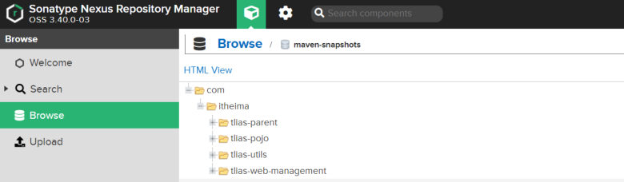

[92 篇](/posts/编程学习/javaweb学习笔记/92-maven继承与聚合/)把多模块工程的"配置"和"构建"都收进了父工程：依赖走继承、版本走 `<dependencyManagement>`、构建走聚合。但还剩最后一个问题没答 —— **这些自己写出来的模块，怎么给别人用？**

`tlias-pojo`、`tlias-utils` 是团队自己的代码，中央仓库上当然没有；B 同事的电脑上也没有你本地的仓库。这一篇（PPT 第 23-35 页）讲的就是课件里的第三块内容：**私服**。

> [!IMPORTANT]
> **本篇的私服配置没有实测。** 私服需要一台 Nexus 服务器（课程里是 `192.168.150.101:8081`，对应资料 `资料/04. maven私服/nexus.zip`），本机没有搭建、也没打算搭，所以下面的三步配置、仓库类型、上传下载流程全部**按课件与讲义原文整理**（代码与课程代码 `tlias-parent/pom.xml` 里的配置一致，配置项的写法没有改动）。文中的"本机实测"只会用在确实跑过的那部分（构建顺序、本地仓库的位置）。
> 课件截图里 Nexus 的版本是 **OSS 3.40.0-03**；课程资料打包的 `nexus.zip` 里是 **3.75.1-01** —— 版本不影响操作，要记的是**地址和仓库名**。

## 一、没有私服的时候，团队怎么共享模块（PPT 第 25-26 页）

PPT 第 25 页画了一个很典型的局面：**A 开发好了 `tlias-utils`，B 需要用它**，两个人都连着"中央仓库"，但中央仓库上根本没有你们公司的模块 —— 所以 B 拿不到（页面上用一个 **X** 标掉了这条路）。

没有私服时，现实中只能这么办：

| 土办法 | 问题 |
| --- | --- |
| 把模块打包成 jar，用聊天工具/共享盘发给 B | 版本一多就乱：B 手里可能同时有 `1.0`、`1.0-SNAPSHOT`、别人改过的"最终版" |
| 让 B 手动把 jar 装进自己的本地仓库 | 操作繁琐，还得记住坐标和命令；A 修了 bug 还得再发一次 |
| 干脆把源码复制给对方 | 对方改了不会回流，两边越来越不一致 |

PPT 第 26 页给出解法：**A 把模块上传到私服，B 直接从私服下载** —— 中间这一台服务器就是全团队共享的"仓库"。

## 二、私服是什么（PPT 第 27 页）

> **私服是一种特殊的远程仓库，它是架设在局域网内的仓库服务，用来代理位于外部的中央仓库，用于解决团队内部的资源共享与资源同步问题。**

这句话里有三个关键信息：

- **特殊的远程仓库**：对外它"表现得像"一个远程仓库，Maven 找依赖时把它当成仓库来问；
- **架设在局域网内**：通常在公司内网，只有团队成员能访问；
- **代理中央仓库**：中央仓库上有的东西（比如 logback），私服会帮你从中央仓库拉下来并缓存，下次谁要就直接给 —— 相当于给团队加了一层"本地缓存"。

### 依赖查找顺序（PPT 第 27 页）

> **本地仓库 → 私服 → 中央仓库**

| 顺序 | 去哪找 | 什么时候会走到这一步 |
| --- | --- | --- |
| ① | **本地仓库** | 永远先看本机 —— 有就直接用，不上网 |
| ② | **私服** | 本地没有时问私服：**团队自己的模块在这里**（如 `tlias-utils`），中央仓库的依赖私服也能代拉 |
| ③ | **中央仓库** | 私服里也没有、且私服不去代理时，才直接找中央仓库（实际项目里多半被私服全接走了） |

这个顺序解释了私服的两个作用：**资源共享**（自己人写的模块放上去，全团队都能依赖）+ **资源同步**（有人下过的依赖，别人不用再去外网下一遍）。

> [!NOTE]
> PPT 第 27 页的"注意"也交代了心态：**私服在企业项目开发中，一个项目/公司，只需要一台即可（无需我们自己搭建，会使用即可）。** —— 换句话说，这一节要掌握的是"**怎么配**"，搭服务器本身是运维的事。

### 必答问答（PPT 第 28 页）

| PPT 的问题 | 答案 |
| --- | --- |
| **Maven 私服的作用是什么?** | 解决**团队内部的资源共享与资源同步问题** |
| **有了私服之后依赖查找的顺序是什么样的?** | **本地仓库 → 私服 → 中央仓库** |

## 三、上传与下载：要准备的三类信息（PPT 第 30 页）

PPT 第 30 页把私服的内部结构和要配置的东西画在一起了。私服里面按用途分了仓库：

```text
私服（Nexus）
├── 仓库(release)    ← 存放 RELEASE 发行版本
├── 仓库(snapshot)   ← 存放 SNAPSHOT 快照版本
└── 仓库(central)    ← 代理外部中央仓库
```

要配的**三类信息**（PPT 第 30 页列出来的三行）：

| 要配置的信息 | 配在哪个文件 | 用在哪一步 |
| --- | --- | --- |
| **连接私服的地址（url 地址）** | `settings.xml`（mirrors + profiles） | **下载**依赖时去哪儿找 |
| **访问私服的用户名/密码** | `settings.xml`（servers） | 上传/下载的身份认证 |
| **上传资源的位置（url 地址）** | 工程的 `pom.xml`（distributionManagement） | **上传**（发布）资源时传到哪个仓库 |

顺带一句：配置里出现的 `maven-public` 是私服里的"**仓库组**"地址 —— Nexus 会把 release、snapshot、central 几个仓库合成一个入口，下载时只要问这一个地址，不用挨个仓库去试。

> [!TIP]
> 课件里的私服地址是 `http://192.168.150.101:8081`（课程虚拟机）；课程代码 `tlias-parent/pom.xml` 里写的是 `http://localhost:8081`（老师本机的 Nexus）。**地址会随环境变，`id` 和"谁配谁"的对应关系不能变** —— 下一节的配置里会反复看到同一批 `id`。

## 四、三步配置（PPT 第 31-33 页）

> [!IMPORTANT]
> 这三步是**固定套路**（PPT 第 35 页的原话是"固定的，参照讲义操作即可"），照抄的时候只要保证**地址、账号、id 三样东西前后对得上**就行。下面所有配置片段与 PPT 第 31-33 页逐字一致。

### ① 设置私服的访问用户名/密码（`settings.xml` 的 servers）

PPT 第 31 页："设置私服的访问用户名/密码（settings.xml 中的 servers 中配置）"：

```xml
<server>
    <id>maven-releases</id>
    <username>admin</username>
    <password>admin</password>
</server>
<server>
    <id>maven-snapshots</id>
    <username>admin</username>
    <password>admin</password>
</server>
```

- 两个 `<server>` 分别对应私服里**发行版仓库**和**快照仓库**的账号（课件里用的账号密码就是 `admin`/`admin`）；
- **`<id>` 不是随便起的**：后面第二步 `distributionManagement` 里会写同样的 `<id>`，Maven 靠它把"上传地址"和"这组账号密码"配成一对；
- `settings.xml` 的位置就是 [24 篇](/posts/编程学习/javaweb学习笔记/24-maven的安装与配置/)里配本地仓库、配阿里云镜像的那个文件（在 Maven 的 `conf` 目录下或用户目录的 `.m2` 下）。

### ② 配置上传（发布）地址（工程 pom 的 distributionManagement）

PPT 第 32 页："IDEA 的 maven 工程的 pom 文件中配置上传（发布）地址"：

```xml
<distributionManagement>
    <repository>
        <id>maven-releases</id>
        <url>http://192.168.150.101:8081/repository/maven-releases/</url>
    </repository>
    <snapshotRepository>
        <id>maven-snapshots</id>
        <url>http://192.168.150.101:8081/repository/maven-snapshots/</url>
    </snapshotRepository>
</distributionManagement>
```

| 子标签 | 对应什么 | 什么时候用得上 |
| --- | --- | --- |
| **`<repository>`** | **RELEASE 版本**的上传地址 | 模块版本是"发行版"（坐标里**不带** `-SNAPSHOT`）时，传到 `maven-releases` 仓库 |
| **`<snapshotRepository>`** | **SNAPSHOT 版本**的上传地址 | 模块版本是"快照版"（坐标里**带** `-SNAPSHOT`）时，传到 `maven-snapshots` 仓库 |

两个 `<id>` 必须和第一步 `settings.xml` 里 `<server>` 的 `<id>` **一一对应** —— 否则 Maven 不知道这次上传该用哪组账号密码，私服会拒绝这次发布（认证失败）。

这段配置**一般写在父工程里**：课程代码里它就在 `tlias-parent/pom.xml`。子工程继承父工程之后，各自发布时也会沿用这份"上传地址说明"，版本是快照就进快照仓库、是发行版就进发行版仓库。

### ③ 设置私服依赖下载的仓库组地址（`settings.xml` 的 mirrors、profiles）

PPT 第 33 页："设置私服依赖下载的仓库组地址（settings.xml 中的 mirrors、profiles 中配置）"。这一段又分两块：

**mirrors（镜像）——把"要下载"的请求都指到私服：**

```xml
<mirror>
    <id>maven-public</id>
    <mirrorOf>*</mirrorOf>
    <url>http://192.168.150.101:8081/repository/maven-public/</url>
</mirror>
```

**profiles（仓库配置）——显式打开 release / snapshot 两种下载：**

```xml
<profile>
    <id>allow-snapshots</id>
    <activation>
        <activeByDefault>true</activeByDefault>
    </activation>
    <repositories>
        <repository>
            <id>maven-public</id>
            <url>http://192.168.150.101:8081/repository/maven-public/</url>
            <releases>
                <enabled>true</enabled>
            </releases>
            <snapshots>
                <enabled>true</enabled>
            </snapshots>
        </repository>
    </repositories>
</profile>
```

这两块各管一件事：

| 配置块 | 作用 | 关键点 |
| --- | --- | --- |
| **`<mirror>`** | 告诉 Maven："要下载依赖时，**别去别处，统一去私服这个地址**" | `<mirrorOf>*</mirrorOf>` 表示**所有**仓库请求都走这个镜像；`maven-public` 是仓库组地址（一个入口覆盖 release + snapshot + central） |
| **`<profile>`** | 声明"私服这个仓库，**发行版和快照版都能下**" | `<releases>`、`<snapshots>` 都设成 `enabled=true`；`<activeByDefault>true</activeByDefault>` 表示**默认激活**，不用每次手动指定 |

> [!TIP]
> 只看下载的话，**mirrors 一条就够**；课件里再加上 profiles，是为了把"这个仓库既能下发行版、也能下快照版"写明确 —— 快照版本默认不是"随便下"的，团队内部的开发版本要想让别人直接拉到，就得显式打开 `<snapshots><enabled>true</enabled></snapshots>`。

### 三处配置一览（照抄清单）

| # | 要配什么 | 文件 | 标签 | 关键点 |
| --- | --- | --- | --- | --- |
| ① | 访问私服的**用户名/密码** | `settings.xml` | `<servers>` → `<server>` | 两条：`id` 为 `maven-releases`、`maven-snapshots` |
| ② | 上传资源的**位置**（发布地址） | 工程 `pom.xml` | `<distributionManagement>` | `<repository>`（release）/ `<snapshotRepository>`（snapshot），`id` 与 ① 对应 |
| ③ | 连接私服的**地址**（下载） | `settings.xml` | `<mirrors>` + `<profiles>` | 镜像 `mirrorOf=*` 指向 `maven-public`；profile 里 release/snapshot 都 `enabled` |

## 五、RELEASE 与 SNAPSHOT（PPT 第 30 页）

版本号后面带不带 `-SNAPSHOT`，决定了这个模块**传到哪个仓库**、也决定了别人拿到的是"固定版"还是"开发中的版"：

> **RELEASE（发行版本）**：功能趋于稳定、当前更新停止，可以用于发行的版本，存储在私服中的 **RELEASE 仓库**中。
> **SNAPSHOT（快照版本）**：功能不稳定、尚处于开发中的版本，即快照版本，存储在私服的 **SNAPSHOT 仓库**中。

| 对比项 | **RELEASE（发行版本）** | **SNAPSHOT（快照版本）** |
| --- | --- | --- |
| **含义** | 功能**趋于稳定、当前更新停止**，可以用于**发行**的版本 | 功能**不稳定、尚处于开发中**的版本 |
| **版本号长什么样** | `1.0`、`1.0.1`（**不带** `-SNAPSHOT`） | `1.0-SNAPSHOT`（**带** `-SNAPSHOT` 后缀） |
| **传到私服的哪个仓库** | **`maven-releases`**（RELEASE 仓库） | **`maven-snapshots`**（SNAPSHOT 仓库） |
| **对应 `distributionManagement` 的哪个标签** | `<repository>` | `<snapshotRepository>` |
| **什么时候用** | 模块稳定了、要正式发布给团队用了 | 模块还在开发、要随时给同事用最新的 |

拿本机实验工程对照一下就很好理解：`tlias-pojo`、`tlias-utils` 的版本都是 **`1.0-SNAPSHOT`**（还在开发中，属于快照版本），所以它们发布时会走 `maven-snapshots` 那条线；哪天版本改成 `1.0`（去掉 `-SNAPSHOT`），才会走 `maven-releases`。**改版本号 = 改仓库去处**，这也是为什么两个地址都要配好。

## 六、install 与 deploy 的区别（PPT 第 30 页）

PPT 第 30 页在"本地仓库"和"私服"之间画了两条命令，正是这两个阶段的区别（命令都来自 [26 篇](/posts/编程学习/javaweb学习笔记/26-maven依赖管理与生命周期/)讲的生命周期）：

| 命令 | 产物去哪儿 | 谁能用上 | 需要私服吗 |
| --- | --- | --- | --- |
| **`mvn install`** | **本地仓库**（本机 Maven 的本地仓库目录，本机是 `A:\develop\maven\apache-maven-3.9.14\mvn_repo\`） | **只有自己这台机器**（本机实验工程的 `tlias-pojo`、`tlias-utils` 就是这么被 `tlias-web-management` 引用上的） | 不需要 |
| **`mvn deploy`** | **私服**（按版本进 `maven-releases` 或 `maven-snapshots`） | **整个团队**（同事配好下载地址后就能直接依赖） | 需要（并要配好第三节的①②③） |

一句话记法：**install 是"装进自己的仓库"，deploy 是"发到团队的仓库"**。`deploy` 比 `install` 多做一步"上传"—— 所以 `deploy` 需要 `distributionManagement` 和账号密码，`install` 两者都不需要。

## 七、怎么确认上传成功（PPT 第 34 页）

发布成功之后，用浏览器打开私服的管理界面就能看到传上去的模块（PPT 第 34 页的截图）：


*图：PPT 第 34 页——Nexus 管理界面里 `Browse → maven-snapshots` 下按坐标层级列出的内容：`com → itheima → tlias-parent`、`tlias-pojo`、`tlias-utils`、`tlias-web-management`；因为是 `1.0-SNAPSHOT` 版本，所以它们都进了**快照仓库**，这正是"上传地址与版本类型对上了"的最直观证据*

看截图能对上前面两件事：① 仓库是 **maven-snapshots**（快照仓库）—— 因为模块版本都是 `-SNAPSHOT`；② 目录层级就是**坐标的层级**（`com` → `itheima` → 模块名），和本地仓库的目录规律一模一样，[29 篇](/posts/编程学习/javaweb学习笔记/29-maven依赖范围与常见问题/)里找 `xxx.lastUpdated` 用的也是这套规律。

## 必答问答（PPT 第 35 页）

| PPT 的问题 | 答案 |
| --- | --- |
| **私服上传资源及下载资源的步骤？** | **固定的，参照讲义操作即可。** —— 落到操作上就是三步配置：① `settings.xml` 的 `<servers>` 配用户名/密码；② 工程 pom 的 `<distributionManagement>` 配上传地址（release / snapshot 两个仓库）；③ `settings.xml` 的 `<mirrors>` + `<profiles>` 配私服仓库组地址。**上传**用 `mvn deploy`，**下载**由依赖触发（查找顺序：本地仓库 → 私服 → 中央仓库） |

这一步之所以说"固定"，是因为**配置写完就不用再管了**：以后新模块加入工程，只要继承了父工程（拿到发布地址）、版本号写对（决定进哪个仓库），执行 `deploy` 就能自动传上去，别人依赖它也能自动从私服拉下来。

## 小结

| 问题 | 答案 |
| --- | --- |
| 私服是什么？ | 一种**特殊的远程仓库**，**架设在局域网内**的仓库服务，用来**代理位于外部的中央仓库**，用于解决**团队内部的资源共享与资源同步**问题 |
| 有了私服之后的依赖查找顺序？ | **本地仓库 → 私服 → 中央仓库** |
| 私服要自己搭吗？ | **一个项目/公司只需要一台即可**，**无需我们自己搭建，会使用即可** |
| 私服里有哪些仓库？ | **仓库(release)** 放发行版本、**仓库(snapshot)** 放快照版本、**仓库(central)** 代理中央仓库（配置里统一走仓库组 `maven-public`） |
| 要配哪三类信息？ | ① **连接私服的地址（url）**；② **访问私服的用户名/密码**；③ **上传资源的位置（url）** |
| 三步配置分别是？ | ① `settings.xml` 的 `<servers>` 配**用户名/密码**；② 工程 pom 的 `<distributionManagement>` 配**上传地址**（`<repository>` = release、`<snapshotRepository>` = snapshot）；③ `settings.xml` 的 `<mirrors>` + `<profiles>` 配**私服仓库组地址**（下载） |
| RELEASE 与 SNAPSHOT 的区别？ | **RELEASE 发行版本**：功能**趋于稳定、当前更新停止**，可以用于发行的版本，存到 **RELEASE 仓库**；**SNAPSHOT 快照版本**：功能**不稳定、尚处于开发中**的版本，存到 **SNAPSHOT 仓库**（版本号带 `-SNAPSHOT`） |
| install 与 deploy 的区别？ | **`install`**：把模块装进**本地仓库**（只有自己用得上，不需要私服）；**`deploy`**：把模块**发布到私服**（整个团队都能依赖，需要配好服务器地址、账号与上传地址） |
| 怎么验证上传成功了？ | 到 Nexus 的 `Browse` 里看对应仓库（PPT 第 34 页截图：`maven-snapshots → com → itheima → tlias-*`），按坐标层级就能找到自己传上去的模块 |

## 相关

- [上一篇：Maven继承与聚合](/posts/编程学习/javaweb学习笔记/92-maven继承与聚合/)
- [下一篇：后端Web开发总结](/posts/编程学习/javaweb学习笔记/94-后端web开发总结/)
- [Maven的安装与配置（本地仓库与阿里云镜像，settings.xml 长什么样）](/posts/编程学习/javaweb学习笔记/24-maven的安装与配置/)

## 练习题

### 一、知识回顾（读完直接做下面的实践题）

1. **私服的定义**：一种**特殊的远程仓库**，它是**架设在局域网内的仓库服务**，用来**代理位于外部的中央仓库**，用于解决**团队内部的资源共享与资源同步问题**
2. **依赖查找顺序**：**本地仓库 → 私服 → 中央仓库**
3. **私服的注意点**：在企业项目开发中，**一个项目/公司只需要一台即可**（无需我们自己搭建，**会使用即可**）
4. **私服里的三个仓库**：**仓库(release)** 存发行版本、**仓库(snapshot)** 存快照版本、**仓库(central)** 代理中央仓库；配置里统一走**仓库组**（课程里是 `maven-public`）
5. **要准备的三类信息**：① **连接私服的地址（url 地址）**；② **访问私服的用户名/密码**；③ **上传资源的位置（url 地址）**
6. **三步配置（顺序也要记住）**：① **`settings.xml` 的 `<servers>`** 配私服的访问**用户名/密码**（id 分别为 `maven-releases`、`maven-snapshots`）；② **工程 pom 的 `<distributionManagement>`** 配**上传（发布）地址**——`<repository>` 是 RELEASE 版本地址、`<snapshotRepository>` 是 SNAPSHOT 版本地址；③ **`settings.xml` 的 `<mirrors>` + `<profiles>`** 配**私服依赖下载的仓库组地址**（镜像 `<mirrorOf>*</mirrorOf>` + profile 里 release/snapshot 都 `enabled=true`、`activeByDefault=true`）
7. **RELEASE（发行版本）**：功能**趋于稳定、当前更新停止**、可以用于**发行**的版本，存储在私服中的 **RELEASE 仓库**；版本号**不带** `-SNAPSHOT`
8. **SNAPSHOT（快照版本）**：功能**不稳定、尚处于开发中**的版本，存储在私服的 **SNAPSHOT 仓库**；版本号**带** `-SNAPSHOT` 后缀（如本机实验工程的 `tlias-pojo:1.0-SNAPSHOT`）
9. **install 与 deploy 的区别**：**`install`** 把模块安装到**本地仓库**（只有自己这台机器能用，不需要私服）；**`deploy`** 把模块**发布（上传）到私服**（整个团队都能依赖，需要配好用户名密码和上传地址）
10. **验证上传成功**：登录 Nexus 管理界面 `Browse` 对应仓库（如 `maven-snapshots`），按**坐标层级**（`com → itheima → 模块名`）就能看到自己传上去的模块
11. **PPT 第 35 页的必答问**：私服上传资源及下载资源的步骤？——**固定的，参照讲义操作即可**（= 上面那三步配置 + `deploy` 上传 + 依赖下载）

### 二、裸写题

- [ ] **2-1 让 Maven 能以团队账号登录私服**
  私服（Nexus）上有两个仓库：一个收**发行版本**、一个收**快照版本**，两个仓库的账号都是 `admin` / `admin`。请写出"让 Maven 知道这两组账号"的配置片段：
  1. 写清这段配置**写在哪个文件**里；
  2. 两条配置的标识（id）分别叫什么、和后面哪一步的哪段配置要对应；
  3. 说明"id 对不上"会有什么后果。
  （练习文件 `test_93_私服配置.xml` 里已经给了写作区。）

  > [!TIP]- 提示（先自己想，实在想不出再点开）
  > **一级 · 思路**：账号密码属于"机器相关"的东西（每个人的私服地址可能不同），所以它不写在工程里，而写在 Maven 自己的全局配置里
  > **二级 · 方法**：在 `settings.xml` 里用 `<servers>` 包两个 `<server>`，每个里面有 `<id>`、`<username>`、`<password>`；`id` 要和发布地址那段配置（`<distributionManagement>`）里的 `id` 一一对应
  > **三级 · 骨架**：`<server><id>maven-____</id><username>____</username><password>____</password></server>` ×2

  > [!TIP]- 参考答案（做完再点开）
  > 1. 写在 **`settings.xml`** 里（就是配本地仓库、阿里云镜像的那个文件）：
  >    ```xml
  >    <server>
  >        <id>maven-releases</id>
  >        <username>admin</username>
  >        <password>admin</password>
  >    </server>
  >    <server>
  >        <id>maven-snapshots</id>
  >        <username>admin</username>
  >        <password>admin</password>
  >    </server>
  >    ```
  > 2. 两条的 `id` 分别是 **`maven-releases`**（发行版本仓库）和 **`maven-snapshots`**（快照版本仓库）；它们要和工程 pom 里 `<distributionManagement>` 的 `<repository>` / `<snapshotRepository>` 的 `<id>` **一一对应**。
  > 3. **id 对不上，Maven 就不知道这次上传该用哪组账号密码**，发布时私服会拒绝这次认证（表现为上传失败/未授权）。这也是为什么课件里三个地方的 id 都用同一批名字 —— 靠 id 把"账号"和"地址"配对。
  > （说明：本机没有 Nexus，这段配置按 PPT 第 31 页整理，没有实测。）

- [ ] **2-2 告诉 Maven "我发布的东西该传到哪"**
  现在要把团队自己写的 `tlias-utils` 发布到私服（地址 `http://192.168.150.101:8081`），私服里有两个仓库：`maven-releases`、`maven-snapshots`。请写出这段**写在工程 pom 里**的配置：
  1. 让"发行版本"和"快照版本"分别有各自的上传地址；
  2. 说明这段配置一般放在**父工程**还是子工程，为什么；
  3. 说明模块的版本号怎么写，才会进"发行版本仓库"。
  （练习文件 `test_93_私服配置.xml` 里已经给了写作区。）

  > [!TIP]- 提示（先自己想，实在想不出再点开）
  > **一级 · 思路**：上传地址是"工程相关"的（这个工程发到哪个私服），所以写在工程的 pom 里；两种版本对应两个地址，就是两个标签
  > **二级 · 方法**：用 `<distributionManagement>`，里面 `<repository>` 收发行版本、`<snapshotRepository>` 收快照版本，两个 `id` 和 `settings.xml` 的 `<server>` 对应；放到父工程里，子工程继承后都能用
  > **三级 · 骨架**：`<distributionManagement><repository><id>maven-____</id><url>____</url></repository><snapshotRepository>…</snapshotRepository></distributionManagement>`

  > [!TIP]- 参考答案（做完再点开）
  > 1.
  >    ```xml
  >    <distributionManagement>
  >        <repository>
  >            <id>maven-releases</id>
  >            <url>http://192.168.150.101:8081/repository/maven-releases/</url>
  >        </repository>
  >        <snapshotRepository>
  >            <id>maven-snapshots</id>
  >            <url>http://192.168.150.101:8081/repository/maven-snapshots/</url>
  >        </snapshotRepository>
  >    </distributionManagement>
  >    ```
  > 2. 一般放在**父工程**里（课程代码就在 `tlias-parent/pom.xml`）：这样所有子工程都**继承**到同一份"上传地址说明"，发布时按各自的版本号自动进对应的仓库，不用每个模块都配一遍。
  > 3. 版本号**不带 `-SNAPSHOT`** 时（如 `1.0`）属于 **RELEASE 发行版本**，会进 `<repository>` 指的 `maven-releases` 仓库；带 `-SNAPSHOT`（如 `1.0-SNAPSHOT`）属于 **SNAPSHOT 快照版本**，会进 `<snapshotRepository>` 指的 `maven-snapshots` 仓库。
  > （说明：本机没有 Nexus，这段配置按 PPT 第 32 页整理，没有实测。）

- [ ] **2-3 让同事能自动从私服下到团队的模块**
  同事 B 的工程要依赖 `tlias-utils`。除了在自己的工程 pom 里写依赖坐标，还要让 B 的 Maven"去哪找这个依赖"。请写出这段**写在 `settings.xml` 里**的配置：
  1. 让所有依赖下载请求都走私服的仓库组地址（`http://192.168.150.101:8081/repository/maven-public/`）；
  2. 补一个默认激活的配置，把"发行版本"和"快照版本"的下载都显式打开；
  3. 回答：有了私服之后，Maven 找依赖的顺序是什么？
  （练习文件 `test_93_私服配置.xml` 里已经给了写作区。）

  > [!TIP]- 提示（先自己想，实在想不出再点开）
  > **一级 · 思路**：下载地址也写在 `settings.xml`（每人环境不同），分两块：一块"把请求引到私服"（镜像），一块"声明这个仓库能下哪两种版本"
  > **二级 · 方法**：`<mirrors>` 里一条 `<mirror>`，`<mirrorOf>` 匹配所有仓库；`<profiles>` 里一个 `<profile>`，`<repositories>` 里写仓库地址，`<releases>`/`<snapshots>` 都 `enabled=true`，`<activeByDefault>true</activeByDefault>` 让它默认生效
  > **三级 · 骨架**：`<mirror><id>maven-public</id><mirrorOf>____</mirrorOf><url>____</url></mirror>`；`<profile><id>allow-snapshots</id><activation><activeByDefault>true</activeByDefault></activation><repositories>…</repositories></profile>`

  > [!TIP]- 参考答案（做完再点开）
  > 1~2.
  >    ```xml
  >    <mirror>
  >        <id>maven-public</id>
  >        <mirrorOf>*</mirrorOf>
  >        <url>http://192.168.150.101:8081/repository/maven-public/</url>
  >    </mirror>
  >    ```
  >    ```xml
  >    <profile>
  >        <id>allow-snapshots</id>
  >        <activation>
  >            <activeByDefault>true</activeByDefault>
  >        </activation>
  >        <repositories>
  >            <repository>
  >                <id>maven-public</id>
  >                <url>http://192.168.150.101:8081/repository/maven-public/</url>
  >                <releases>
  >                    <enabled>true</enabled>
  >                </releases>
  >                <snapshots>
  >                    <enabled>true</enabled>
  >                </snapshots>
  >            </repository>
  >        </repositories>
  >    </profile>
  >    ```
  >    两块的分工：`<mirrorOf>*</mirrorOf>` 把**所有**仓库请求都引到私服的仓库组地址；`<profile>` 则显式声明"这个地址既能下发行版、也能下快照版"，并且默认激活（不用手动选）。同事 B 的模块版本是 `1.0-SNAPSHOT`（快照版本），少了 `<snapshots><enabled>true</enabled></snapshots>` 这一项是拉不到的。
  > 3. 查找顺序：**本地仓库 → 私服 → 中央仓库**。B 的本地仓库没有 `tlias-utils`，于是问私服；私服里正是 A 发布上去的那份，直接下载成功。
  > （说明：本机没有 Nexus，这段配置按 PPT 第 33 页整理，没有实测。）

- [ ] **2-4 该用哪条命令、该用哪个版本**
  判断下面几种场景，分别回答"用 `install` 还是 `deploy`"和"版本号带不带 `-SNAPSHOT`"，并各说一句理由：
  1. 你在自己电脑上改了 `tlias-pojo`，只想让本机的 `tlias-web-management` 能引用到今天改的这份；
  2. `tlias-utils` 还在开发中，但同事要每天拉到你现在这份来联调；
  3. `tlias-utils` 测完了，团队要把它当正式版本固定下来给别人依赖。

  > [!TIP]- 提示（先自己想，实在想不出再点开）
  > **一级 · 思路**：先问"要给谁用"——自己 / 团队临时联调 / 团队正式使用；"给团队"就得传到私服（`deploy`），"版本稳不稳定"决定带不带 `-SNAPSHOT`
  > **二级 · 方法**：本地自己用 → `install`；团队用 → `deploy`；开发中 → `-SNAPSHOT`（进快照仓库）；稳定发行 → 去掉 `-SNAPSHOT`（进发行仓库）
  > **三级 · 骨架**：第 1 种 = `____` + 版本（随意，本地自己用）；第 2 种 = `____` + `____-SNAPSHOT`；第 3 种 = `____` + `____`（去掉后缀）

  > [!TIP]- 参考答案（做完再点开）
  > 1. **`mvn install`**，版本带不带 `-SNAPSHOT` 都行（自己本机用，坐标能对上即可）。理由：`install` 把模块装进**本地仓库**，本机的 `tlias-web-management` 就能依赖到，完全不需要私服。
  > 2. **`mvn deploy`**，版本用 **`-SNAPSHOT`**（如 `1.0-SNAPSHOT`）。理由：要给同事用就得发布到私服（`deploy`）；还在开发中属于**快照版本**，进 `maven-snapshots` 仓库 —— 本机实验工程里的 `tlias-pojo`、`tlias-utils` 版本正是 `1.0-SNAPSHOT`。
  > 3. **`mvn deploy`**，版本**去掉 `-SNAPSHOT`**（如 `1.0`）。理由：测完、功能趋于稳定、更新停止，属于 **RELEASE 发行版本**，进 `maven-releases` 仓库；这样别人拿到的就是固定版本，不会被你后续的改动"带着走"。

### 三、综合题

- [ ] **3-1 把一台私服的配置从头到尾写一遍，并说清流程**
  场景：团队新搭了一台私服（Nexus），地址 `http://192.168.150.101:8081`，账号 `admin`/`admin`，仓库有 `maven-releases`、`maven-snapshots`、`maven-public`（仓库组）。你们的多模块工程 `tlias` 要把 `tlias-utils` 共享给别的团队。请按 6 步完成：
  1. **写登录配置**：让 Maven 能登录私服（要配几组、id 叫什么、写在哪个文件）；
  2. **写发布配置**：让工程知道发布到哪（两种版本的地址分开写，写在哪个文件、一般放哪个工程）；
  3. **写下载配置**：让所有人的依赖请求都走私服（写在哪个文件、两个配置块各管什么）；
  4. **写命令**：把模块发布到私服执行什么命令？只想自己本机用执行什么命令？
  5. **写版本策略**：`tlias-utils` 现在还在开发，版本号写成什么？等功能稳定、要正式发行时改成什么？分别会进哪个仓库？
  6. **说顺序与排错**：① 有一台配好私服的机器，要找 `tlias-utils` 这个依赖，查找顺序是什么？② 同事发布时报"未授权/401"，第一个该检查什么？
  （练习文件 `test_93_私服配置.xml` 里按这 6 步给了写作区。）

  **涉及知识点**

  | 知识点 | 在这里的应用 |
  | --- | --- |
  | 私服的作用 | 团队内部的**资源共享与资源同步** |
  | 依赖查找顺序 | **本地仓库 → 私服 → 中央仓库** |
  | `settings.xml` 的 `<servers>` | 私服的**用户名/密码**（两组 id） |
  | 工程 pom 的 `<distributionManagement>` | **上传地址**：`<repository>` / `<snapshotRepository>` |
  | `settings.xml` 的 `<mirrors>` + `<profiles>` | 私服**下载地址**与 release/snapshot 开关 |
  | RELEASE / SNAPSHOT | 版本号后缀决定进哪个仓库 |
  | install / deploy | 本地仓库 vs 私服 |

  > [!TIP]- 提示（先自己想，实在想不出再点开）
  > **一级 · 思路**：三步配置按"**账号（settings）→ 上传地址（pom）→ 下载地址（settings）**"的顺序写，每一步都回答"写给谁看、靠什么和下一步对上"
  > **二级 · 方法**：账号和下载地址写在 `settings.xml`（环境相关），上传地址写在工程 pom（工程相关，放父工程）；两个 id 名（release/snapshot）贯穿三处；发布用 `deploy`、本机用 `install`；开发中带 `-SNAPSHOT`、稳定了去掉
  > **三级 · 骨架**：`<servers>` → `<distributionManagement>` → `<mirrors>` + `<profiles>`；版本 `1.0-____` ↔ `1.0`；命令 `mvn ____` ↔ `mvn ____`

  > [!TIP]- 参考答案（做完再点开）
  > 1. **登录配置**（`settings.xml`，两组，id 必须叫 `maven-releases`、`maven-snapshots`）：
  >    ```xml
  >    <server>
  >        <id>maven-releases</id>
  >        <username>admin</username>
  >        <password>admin</password>
  >    </server>
  >    <server>
  >        <id>maven-snapshots</id>
  >        <username>admin</username>
  >        <password>admin</password>
  >    </server>
  >    ```
  > 2. **发布配置**（工程 pom —— 一般写在**父工程**，如 `tlias-parent/pom.xml`）：
  >    ```xml
  >    <distributionManagement>
  >        <repository>
  >            <id>maven-releases</id>
  >            <url>http://192.168.150.101:8081/repository/maven-releases/</url>
  >        </repository>
  >        <snapshotRepository>
  >            <id>maven-snapshots</id>
  >            <url>http://192.168.150.101:8081/repository/maven-snapshots/</url>
  >        </snapshotRepository>
  >    </distributionManagement>
  >    ```
  > 3. **下载配置**（`settings.xml`）：
  >    ```xml
  >    <mirror>
  >        <id>maven-public</id>
  >        <mirrorOf>*</mirrorOf>
  >        <url>http://192.168.150.101:8081/repository/maven-public/</url>
  >    </mirror>
  >    ```
  >    ```xml
  >    <profile>
  >        <id>allow-snapshots</id>
  >        <activation>
  >            <activeByDefault>true</activeByDefault>
  >        </activation>
  >        <repositories>
  >            <repository>
  >                <id>maven-public</id>
  >                <url>http://192.168.150.101:8081/repository/maven-public/</url>
  >                <releases>
  >                    <enabled>true</enabled>
  >                </releases>
  >                <snapshots>
  >                    <enabled>true</enabled>
  >                </snapshots>
  >            </repository>
  >        </repositories>
  >    </profile>
  >    ```
  >    `<mirror>` 管"**去哪找**"（`<mirrorOf>*</mirrorOf>` = 所有请求都走私服）；`<profile>` 管"**能下什么**"（release、snapshot 都 `enabled=true`，且 `activeByDefault=true` 默认生效）。
  > 4. **命令**：发布到私服用 **`mvn deploy`**；只想本机用（装进本地仓库）用 **`mvn install`**。前者比后者多做"上传"这一步，所以需要 1、2 两步的配置。
  > 5. **版本策略**：还在开发时写 **`1.0-SNAPSHOT`**（快照版本，进 **`maven-snapshots`** 仓库）；稳定、正式发行时改成 **`1.0`**（RELEASE 发行版本，进 **`maven-releases`** 仓库）。
  > 6. ① **查找顺序：本地仓库 → 私服 → 中央仓库**；② 报"未授权"先检查 **`settings.xml` 里 `<server>` 的 `<id>` 和工程 pom 里 `<distributionManagement>` 的 `<id>` 是否一一对应**（上传靠 id 把地址和账号配对），其次确认账号密码写对、以及自己是否有该仓库的上传权限。
  > （说明：本机没有 Nexus，以上配置均按 PPT 第 31-33 页与课程代码整理，**没有实测**；本机实测过的只有本地仓库的构建与 `install`（见 [92 篇](/posts/编程学习/javaweb学习笔记/92-maven继承与聚合/)）。）
