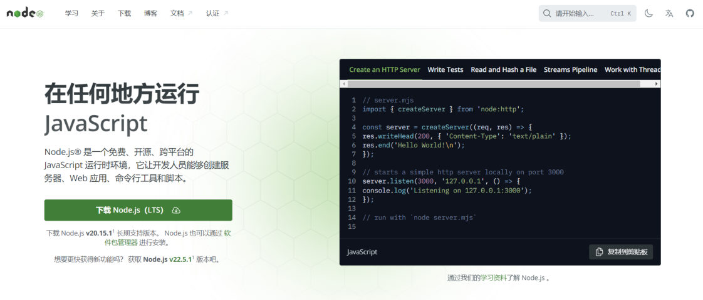
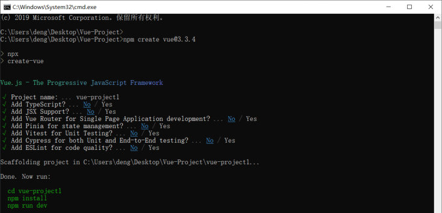
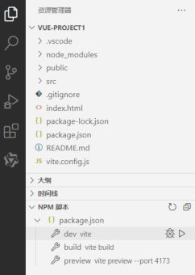
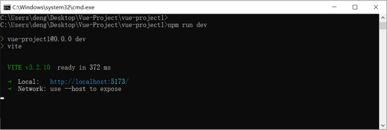

[94 篇](/posts/编程学习/javaweb学习笔记/94-后端web开发总结/)给后端课程收尾，从这里开始进入整个 JavaWeb 课程的**最后一块实战：Web 前端实战**——用 Vue 的工程化方案开发企业级前端项目，再配上组件库 ElementPlus。

这一章一共三篇，分工是这样的（对应 PPT 每节的目录页）：

| 篇 | 讲什么 | PPT 页 |
| --- | --- | --- |
| **95（本篇）** | 前端工程化是什么、环境准备、把 Vue 工程建出来并跑起来 | 第 1~20 页 |
| [96 篇](/posts/编程学习/javaweb学习笔记/96-vue项目开发流程与组合式api/) | Vue 项目的开发流程（入口文件 → 根组件 → 页面）、两种 API 风格、员工列表案例 | 第 21~30 页 |
| [97 篇](/posts/编程学习/javaweb学习笔记/97-elementplus组件库/) | ElementPlus 组件库：三步入门 + 表格/分页/对话框/表单四个组件 | 第 31~50 页 |

## 课程全景：这一章在哪儿（PPT 第 1~3 页）

PPT 第 1~2 页是整门课的全景图（标题写着「Web 开发(AI)」），把学过的内容分成五个阶段：

| 阶段 | 学什么 | 对应笔记 |
| --- | --- | --- |
| Web 前端基础 | HTML、CSS、JavaScript、Vue3、Ajax/Axios | 03~22 篇 |
| Web 后端基础 | Web 基础知识、Maven、MySQL、JDBC、Mybatis | 23~56 篇 |
| Web 后端实战 | Tlias 案例 | 57~84 篇 |
| 后端进阶（PPT 图里并入后端实战） | AOP、SpringBoot 原理、Maven 高级 | 85~93 篇 |
| **Web 前端实战** | **Vue 工程化、ElementPlus** | **95~97 篇（就是这一章）** |
| Web 项目部署 | Linux、Docker | 后续章节 |

PPT 第 3 页把这一章的范围收成两个方框：**Vue 工程化** 和 **ElementPlus**——也就是"用什么工具把项目组织起来"和"用什么组件把页面拼出来"。

> [!NOTE]
> 为什么前端还要专门学一遍"工程化"？因为 [19](/posts/编程学习/javaweb学习笔记/19-vue3快速入门/)~[22 篇](/posts/编程学习/javaweb学习笔记/22-实战-vueaxios员工列表/)里我们写的 Vue 页面是**一个 html 文件里引一个 js 文件**的散装写法（PPT 第 5 页把这种用法叫"**局部模块改造**"）。企业里的前端项目不是这样：它自己就是一个独立的工程，有目录规范、有依赖管理、有构建打包流程——这就是"**整站开发**"。

## 什么是 Vue（PPT 第 4 页）

PPT 第 4 页又把最开始的定义摆了一遍：

> **Vue 是一款用于构建用户界面的渐进式的 JavaScript 框架。**（官网：https://cn.vuejs.org/）

[19 篇](/posts/编程学习/javaweb学习笔记/19-vue3快速入门/)已经把这个定义逐词拆过（构建用户界面 / 渐进式 / JavaScript 框架），这里只重复它的核心思想——**基于数据渲染出用户看到的界面**。PPT 用的还是那份员工数据：

```json
[
  {"id": 1, "name": "谢逊", "image": "1.jpg", "gender": 1, "job": 1},
  {"id": 2, "name": "韦一笑", "image": "2.jpg", "gender": 1, "job": 1}
]
```


*图：PPT 第 4 页用来解释 Vue 的那张表——"序号 / 姓名 / 头像 / 性别 / 职位"这些内容不是手写的 HTML，而是上面那份数据**渲染**出来的结果*

## Vue 是一个框架，也是一个生态（PPT 第 5 页）

PPT 第 5 页是这一篇最重要的一张"地图"：**Vue 核心包**只负责最基础的两件事，其它能力由配套的库补齐——所以官方说"Vue 是一个框架，也是一个生态"。

| 能力 | 由谁提供 | 说明 |
| --- | --- | --- |
| **声明式渲染** | Vue 核心包 | 在 HTML 里"声明"数据和界面的关系（[19 篇](/posts/编程学习/javaweb学习笔记/19-vue3快速入门/)学的插值表达式、[20 篇](/posts/编程学习/javaweb学习笔记/20-vue3常用指令/)学的指令） |
| **组件系统** | Vue 核心包 | 把页面拆成一个个可复用的部件（这一章要正式接触） |
| 客户端路由 | **VueRouter** | 单页应用里"点链接换页面" |
| 状态管理 | **Pinia**（Vuex） | 多个组件共用一份数据 |
| 构建工具 | **Vite**（Webpack） | 编译、打包、热更新 |

PPT 把 Vue 的用法分成两档，这也是"渐进式"最直白的体现：

| 用法 | 用到的部分 | 场景 |
| --- | --- | --- |
| **Vue 核心包开发** | 只引入一个 js 文件 | **局部模块改造**：给老页面的一小块加上 Vue（19~22 篇就是这种） |
| **Vue 工程化开发** | 核心包 + VueRouter / Pinia / Vite 等一整套 | **整站开发**：整个前端项目都用 Vue 写（这一章开始） |

> [!IMPORTANT]
> 从 CDN 引一个 js 文件，到用脚手架建一个工程，用的**还是同一个 Vue**——变的是"怎么组织代码"。前面学过的插值表达式、指令、Axios 请求，在这个工程里一行都不会白学，只是写法要换一套（[96 篇](/posts/编程学习/javaweb学习笔记/96-vue项目开发流程与组合式api/)讲）。

## 小白眼中的前端开发：三个痛点（PPT 第 6~8 页）

PPT 第 6~7 页是这一节的封面（**01 Vue工程化**），第 8 页标题叫「**小白眼中的前端开发**」，下面写着三个词——这就是"没有工程化"时的真实样子：

| 症状 | 长什么样 |
| --- | --- |
| **不规范** | 目录随便建、文件随便命名（`1.html`、`new.html`、`new2.html`……），别人接手完全不知道从哪看起 |
| **难维护** | 改一处要翻好几个文件，改完还不敢确定有没有漏（样式、结构、脚本混在一个 html 里） |
| **难复用** | 每个页面各写一份导航栏、各写一份表格样式，想统一改一次得改十几处 |

## 工程化的四个关键词（PPT 第 9 页）

针对上面三个痛点，PPT 第 9 页给了四个关键词，每个词后面都跟着一句解释：

| 关键词 | PPT 的解释 |
| --- | --- |
| **模块化** | 项目划分若干模块，单独开发、维护，提高效率 |
| **组件化** | 将页面的各个组成部分封装为一个一个的组件，提高复用 |
| **规范化** | 提供标准统一的目录结构、编码规范、开发流程 |
| **自动化** | 项目的构建、开发、测试、打包、部署 |

对照着看就明白了：**模块化/规范化** 治"不规范"，**组件化** 治"难复用"，**自动化** 和规范化的目录结构一起治"难维护"。这四个词不是口号，Vue 工程的每一层结构里都能对上——比如 `src/components` 就是"组件化"的落地位置（这一篇下面会讲）。

## 前端工程化的定义与收益（PPT 第 10 页）

> 定义（PPT 原文）：**在企业级的前端项目开发中，把前端开发所需的工具、技术、流程、经验等进行规范化、标准化。**

做这件事的收益，PPT 写了三条：

| 收益 | 具体是什么 |
| --- | --- |
| **统一规范** | 团队里所有人用同一套目录结构、同一套写法，代码风格一致 |
| **提高复用** | 组件、工具函数、样式都能拿来就用，不用重复造 |
| **便于维护** | 出问题知道去哪找，加功能知道往哪写 |

> [!IMPORTANT]
> 记住这句话里最关键的词是"**规范化和标准化**"——工程化的产物不只是"多了几个工具"，更是**一套约定**。所以后面学 `create-vue` 生成的目录、`npm` 管依赖、`vite` 跑服务时，重点不是记住命令，而是理解**每个位置为什么这么放**。

## 这一节的五小块（PPT 第 11 页目录页）

PPT 第 11 页（和第 15、21、25、28 页是同一张）是这一节的目录页，五个小块分别是：**环境准备 / Vue项目简介 / Vue项目开发流程 / API风格 / 案例**。它们对应到笔记里是：

| 小块 | 落在哪 |
| --- | --- |
| 环境准备 | 本篇（create-vue、NodeJS、npm） |
| Vue项目简介、创建、安装依赖、项目结构、启动 | 本篇 |
| Vue项目开发流程、API风格、案例 | [96 篇](/posts/编程学习/javaweb学习笔记/96-vue项目开发流程与组合式api/) |

## 环境准备（PPT 第 12~14 页）

### 脚手架 create-vue

PPT 第 12 页：

> **介绍：create-vue 是 Vue 官方提供的最新的脚手架工具，用于快速生成一个工程化的 Vue 项目。**

它一口气提供了这些功能：

| 功能 | 意思 |
| --- | --- |
| 统一的目录结构 | 按规范把源码、组件、静态资源分好目录（就是第 18 页那张图） |
| 本地调试 | 本地起一个开发服务器，改完立刻能看 |
| 热部署 | 改了代码保存，浏览器里的页面自动更新，不用手动刷新 |
| 单元测试 | 可以对组件写测试（本课程不深入） |
| 集成打包上线 | 一条命令把源码打包成能部署的静态文件 |

**依赖环境：NodeJS**——脚手架本身是 NodeJS 写的，所以电脑上必须先装好 NodeJS。

### 安装 NodeJS（PPT 第 13 页）

去官网 https://nodejs.org/ 下载 **LTS（长期支持版）** 的安装包，一路下一步即可。


*图：PPT 第 13 页的 nodejs.org 中文首页——绿色按钮就是下载 LTS 版；页面右边那段 `createServer` 示例代码说明了一件事：**NodeJS 让 JavaScript 能脱离浏览器运行**（所以它能当"前端构建工具的运行环境"）*

课程的资料包里也自带了安装包（`资料\01. NodeJS\` 目录）。

> [!TIP]
> 本机实测用的是 **Node v24.11.0**（比课程录制时的版本新不少），课程工程照样跑得起来——Node 的版本升级对这类构建工具是向下兼容的。装完在命令行敲 `node -v` 和 `npm -v` 能打印出版本号，就说明装好了。

### npm 是什么（PPT 第 14 页）

> **npm：Node Package Manager，是 NodeJS 的软件包管理器。**

它干的事一句话说完：**从远程仓库把别人写好的包下载到你的项目里**。命令格式就是 `npm install 包名`——后面建工程、装 ElementPlus、装 axios 用的都是它。

PPT 第 14 页配的是一张"本地 npm 从远程仓库拉包"的示意图（一个电脑图标 → 远程仓库），意思就是这个下载过程。

> [!NOTE]
> 为什么前端也要"包管理器"？因为工程化项目不会把第三方库的源码拷进项目，只在配置文件里写一行"我要哪个版本的哪个包"，需要时再下载（下面"安装依赖"一节会说清这件事）。

## 创建 Vue 项目（PPT 第 15~16 页）

PPT 第 16 页给了一条命令：

```bash
npm create vue@3.3.4
```

执行后会进入**交互式问答**，PPT 把每一项的默认值都列出来了：

| 问答项 | 含义 | 默认值 |
| --- | --- | --- |
| **Project name** | 项目名称 | `vue-project`（可输入想要的项目名称；PPT 里输入的是 `vue-project1`） |
| Add TypeScript? | 是否加入 TypeScript 组件 | No |
| Add JSX Support? | 是否加入 JSX 支持 | No |
| Add Vue Router ... | 是否为单页应用程序开发添加 Vue Router 路由管理组件 | No |
| Add Pinia ... | 是否添加 Pinia 组件来进行状态管理 | No |
| Add Vitest ... | 是否添加 Vitest 来进行单元测试 | No |
| Add an End-to-End ... | 是否添加端到端测试 | No |
| Add ESLint for code quality? | 是否添加 ESLint 来进行代码质量检查 | No |

**本课程这几项全部选默认的 No**（第 5 页讲的 VueRouter、Pinia 属于"生态"，用到再装）。


*图：PPT 第 16 页的命令行截图——`npm create vue@3.3.4` 会先提示要安装并执行 `create-vue`（Vue 官方的项目脚手架工具），然后逐个问你上面那八个问题；最后打印出 `Done. Now run:` 和三条后续命令（`cd vue-project1` / `npm install` / `npm run dev`），正好就是后面的三步*

命令里的 `@3.3.4` 是**版本号**：`npm create 包名@版本` 的意思是"下载并执行这个包的脚手架"，锁版本是为了保证和课程演示的效果一致。

## 安装项目依赖（PPT 第 17 页）

进到项目目录里，执行：

```bash
cd vue-project1      # 进入刚创建的项目目录
npm install          # 安装当前项目需要的所有依赖
```

> 注意（PPT 原文）：**创建项目以及安装依赖的过程，都是需要联网的。**

为什么必须联网？因为脚手架只生成了项目的"骨架"，真正用到的第三方包（Vue、Vite、插件……）都记在 `package.json` 里，`npm install` 做的事就是**照着这份清单去远程仓库把包下载到 `node_modules` 目录**。PPT 里的示例输出是 `added 31 packages in 6s`（下载了 31 个包）。

> [!TIP]
> 本机实测：跑 `npm install` 时加了国内镜像参数 `--registry=https://registry.npmmirror.com`（从国内的镜像站下载，速度明显更快）。**依赖装完就不用再联网了**——开发服务器、打包都是本地在跑；只有以后再装新包时才需要网络。国内网络环境差的时候这条参数很实用。

## 项目结构（PPT 第 18 页）

用 VS Code 打开这个项目（[04 篇](/posts/编程学习/javaweb学习笔记/04-前端开发工具-vscode/)装过），左边就是这张图的样子：


*图：PPT 第 18 页的项目结构——`.vscode`、`node_modules`、`public`、`src` 四个文件夹加 6 个文件，最下面是 NPM 脚本面板（`dev` / `build` / `preview` 三条命令，`npm run dev` 就是点这里对应的那条）。这就是"规范化"落地后的样子：**每个位置放什么，是约定好的***

PPT 逐条给了职责说明，加上工程里实际能看到的文件，一起整理成表：

| 名称 | 干什么的 |
| --- | --- |
| `.vscode` | 编辑器推荐配置（本机实测：里面是 `extensions.json`，推荐安装 **Vue.volar** 插件） |
| `node_modules` | **下载的第三方包存放目录**（`npm install` 的产物，体积很大，不要手改、不要提交到 Git） |
| `public` | **静态资源目录**，存放图片、字体等（原样拷贝到打包结果里） |
| `src` | **源代码存放目录**（写代码的文件夹） |
| `src/components` | **组件目录**，存放通用组件（脚手架生成的 HelloWorld、TheWelcome 等示例组件就在这里） |
| `src/views` | 页面组件目录（本机实测：案例的 `EmpList.vue`、组件演示的 `ElementDemo.vue` 放在这里） |
| `src/App.vue` | **根组件**——页面上显示什么，由它决定 |
| `src/main.js` | **入口文件**——整个项目从它开始执行 |
| `src/assets` | 组件里用到的样式、图片（`base.css` / `main.css`） |
| `index.html` | 项目里**唯一的 HTML 页面**，里面只有一个空的 `<div id="app">`（[96 篇](/posts/编程学习/javaweb学习笔记/96-vue项目开发流程与组合式api/)细讲） |
| `.gitignore` | Git 忽略清单（`node_modules`、`dist` 这类不该提交的东西） |
| `package.json` | **项目配置文件**，包括项目名、版本号、依赖包、版本等 |
| `package-lock.json` | 依赖的精确版本记录（保证换台电脑装出来的包版本一致） |
| `README.md` | 项目说明（脚手架给的启动命令就写在这里） |
| `vite.config.js` | **Vue 项目的配置信息，如端口号等**（本机实测：端口就是在这里改） |

### 入口文件 main.js 里写了什么

本机实测（对照 PPT 第 18 页的"入口文件"）：工程里的 `src/main.js` 实际内容是这样的——

```js
import { createApp } from 'vue'

//引入ElmentPlus
import ElementPlus from 'element-plus'
import 'element-plus/dist/index.css'
import zhCn from 'element-plus/es/locale/lang/zh-cn'

import App from './App.vue'

createApp(App).use(ElementPlus, {locale: zhCn}).mount('#app')
```

对照 [19 篇](/posts/编程学习/javaweb学习笔记/19-vue3快速入门/)的写法看，结构是熟悉的：`createApp(App).mount('#app')` 就是"创建应用实例并挂载到 `#app`"。多出来的是三行 ElementPlus 相关代码（引入组件库、引入它的样式、引入中文语言包）——那正是 [97 篇](/posts/编程学习/javaweb学习笔记/97-elementplus组件库/)要讲的两件事（PPT 第 35、42 页）；`import App from './App.vue'` 这行导入根组件，则是 [96 篇](/posts/编程学习/javaweb学习笔记/96-vue项目开发流程与组合式api/)的主线。

> [!WARNING]
> `node_modules` 是"下载来的东西"，**不要在里面改代码、也不要提交到 Git**（脚手架给的 `.gitignore` 已经帮你忽略了）。项目要换电脑时，拷贝源码后在那边重新 `npm install` 就行。

## 启动项目（PPT 第 19 页）

```bash
npm run dev        # 启动开发服务器
```

启动后命令行会打印访问地址，浏览器打开 **http://localhost:5173** 就能看到页面：


*图：PPT 第 19 页的命令行截图——`npm run dev` 之后 Vite 报告 `ready in 372 ms`，并给出地址 `Local: http://localhost:5173/`。**端口 5173 是 Vite 的默认端口**，也就是访问项目要用的地址*

本机实测（同一套命令）：

```text
> vue-project2@0.0.0 dev
> vite

  VITE v3.2.11  ready in 2679 ms

  ➜  Local:   http://localhost:5173/
  ➜  Network: use --host to expose
```

几点实测说明：

- **首次启动 `ready in 2679 ms`**（第一次要把依赖预先处理一遍，所以比 PPT 里的 372 ms 慢）；之后重启开发服务器只要 **282~320 ms**（同一个工程连跑几次的记录），越用越快。
- 浏览器打开 `http://localhost:5173` 看到的是脚手架自带的欢迎页（[96 篇](/posts/编程学习/javaweb学习笔记/96-vue项目开发流程与组合式api/)会讲这个页面的来历）。
- **开发服务器是常驻的**：命令行窗口不能关，改代码保存后浏览器会自动更新（热部署）；写完想停掉，在命令行按 `Ctrl + C`。
- **端口可以在 `vite.config.js` 里改**（PPT 第 18 页说的"配置信息，如端口号等"）；本机实测：改动这个文件时命令行会打印 `vite.config.js changed, restarting server...`，Vite 自己重启一次，不需要手动重启。
- 本机实测：改 `src/App.vue` 保存后，命令行打印 `[vite] hmr update /src/App.vue`，这就是"热部署"在干活。

## 再往前一步：打包构建（`npm run build`）

PPT 第 20 页的小结只给了三条命令（创建 / 安装依赖 / 启动），不过脚手架其实还给了另外两条脚本——从第 18 页那张图的 **NPM 脚本**面板里就能看到：`build`（打包）和 `preview`（本地预览打包结果）。

```bash
npm run build      # 把源码编译、压缩成可以直接部署的静态文件（输出到 dist 目录）
```

本机实测的构建输出（同一个工程）：

| 文件 | 体积 | gzip 后 |
| --- | --- | --- |
| `dist/index.html` | 0.42 KiB | — |
| `dist/assets/index.xxxx.css` | 316.98 KiB | 42.98 KiB |
| `dist/assets/index.xxxx.js` | 877.21 KiB | 290.77 KiB |

同时命令行给了一条警告：`chunks are larger than 500 KiB`。这个"大块头"主要是**全量引入 ElementPlus** 造成的，课程案例不处理它——为什么会这样、方向上有哪种优化，[97 篇](/posts/编程学习/javaweb学习笔记/97-elementplus组件库/)结尾会提一句。

> [!TIP]
> 打包结果是一堆**纯静态文件**（html + css + js），放到任何静态服务器上就能访问——这就是第 2 页全景图里"Web 项目部署"那一阶段要干的事（后面学 Linux / Docker 时再看）。

## 三条命令小结（PPT 第 20 页）

| 干什么 | 命令 | 什么时候用 |
| --- | --- | --- |
| **创建** | `npm create vue@版本号` | 建一个新工程时（只跑一次） |
| **安装依赖** | `npm install` | 刚创建完、或者拿到别人的工程时（只跑一次） |
| **启动** | `npm run dev` | 每次开始写代码时 |

顺序不能乱：**先创建 → 再进目录装依赖 → 最后启动**。第 16 页的截图里，脚手架跑完最后打印的那三条命令，就是这个顺序。

## 常见问题

- **跳过 `npm install` 直接 `npm run dev`**：会提示找不到 `vite`——因为 `dev` 脚本执行的就是 `vite` 这个包，而它还没被下载下来。补跑一次 `npm install` 即可。
- **必须联网**：创建工程和装依赖都在下载东西，断网会失败；国内网络慢就加 `--registry=https://registry.npmmirror.com`。
- **端口被占用**：如果 5173 上有别的程序，Vite 会自动换到下一个可用端口——**以命令行打印的 `Local:` 地址为准**，别死记 5173。
- **配置文件写错会直接起不来**：本机实测时把 `vite.config.js` 里一个正则写错，命令行立刻给出 `[ERROR] Syntax error` 并标出**文件名 + 行号 + 列号**（`vite.config.js:20:43`），照提示改就行。
- **命令行偶尔出现 `DeprecationWarning: ... util._extend ...`**：本机实测在较新的 Node 上启动时会出现这类"过时 API"告警，只是提醒，**不影响启动和页面**。
- **东西该放哪**：写页面代码 → `src/views`；写通用组件 → `src/components`；图片字体 → `public`；改端口之类的配置 → `vite.config.js`；看装了哪些包 → `package.json`；下载来的包 → `node_modules`（不要动）。

## 小结

| 问题 | 答案 |
| --- | --- |
| 这一章在课程的什么位置？ | Web 前端实战（PPT 第 2 页全景图的第四阶段），内容是 **Vue 工程化 + ElementPlus** |
| 什么是前端工程化？ | 在企业级前端项目开发中，把前端开发所需的**工具、技术、流程、经验**等进行**规范化、标准化**；收益是**统一规范、提高复用、便于维护** |
| 工程化的四个关键词？ | **模块化**（划分模块单独开发维护）、**组件化**（页面部件封装为组件）、**规范化**（统一目录结构/编码规范/开发流程）、**自动化**（构建、开发、测试、打包、部署） |
| 建工程用什么？ | Vue 官方脚手架 **create-vue**：`npm create vue@3.3.4`，提供统一目录结构、本地调试、热部署、单元测试、集成打包上线；依赖 **NodeJS** |
| npm 是什么？ | **Node Package Manager**，NodeJS 的包管理器；`npm install` 按 `package.json` 的清单从远程仓库把依赖下载到 `node_modules`（**要联网**） |
| 关键目录职责？ | `src` 写代码、`src/components` 通用组件、`src/App.vue` **根组件**、`src/main.js` **入口文件**、`public` 静态资源、`node_modules` 下载的包、`package.json` 项目配置、`vite.config.js` 配置（端口等） |
| 怎么启动？ | `npm run dev`，浏览器访问 **http://localhost:5173**（Vite 默认端口，可在 `vite.config.js` 改）；改代码保存后浏览器自动更新（热部署） |
| 三条命令是什么？ | 创建 `npm create vue@版本号`、安装依赖 `npm install`、启动 `npm run dev` |
| 额外还有哪两条脚本？ | `npm run build` 打包（输出 `dist`）、`npm run preview` 本地预览打包结果 |

## 相关

- [上一篇：后端Web开发总结](/posts/编程学习/javaweb学习笔记/94-后端web开发总结/)
- [下一篇：Vue项目开发流程与组合式API](/posts/编程学习/javaweb学习笔记/96-vue项目开发流程与组合式api/)
- [Vue3快速入门（同一个 Vue 的散装写法）](/posts/编程学习/javaweb学习笔记/19-vue3快速入门/)
- [实战-Vue+Axios员工列表（这一章案例的散装版）](/posts/编程学习/javaweb学习笔记/22-实战-vueaxios员工列表/)
- [前端开发工具-VSCode（打开工程、装 Volar 插件）](/posts/编程学习/javaweb学习笔记/04-前端开发工具-vscode/)

## 练习题

### 一、知识回顾（读完直接做下面的实践题）

1. 这一章是课程的 **Web 前端实战** 阶段，两块内容是 **Vue 工程化** 和 **ElementPlus**；95 篇讲工程化与建项目，96 篇讲开发流程与组合式 API，97 篇讲组件库
2. **前端工程化**的定义：在企业级的前端项目开发中，把前端开发所需的**工具、技术、流程、经验**等进行**规范化、标准化**；三个收益：**统一规范、提高复用、便于维护**
3. 小白式开发的三个痛点：**不规范、难维护、难复用**；对应的四个关键词：**模块化**（项目划分若干模块，单独开发、维护）、**组件化**（页面各组成部分封装为组件）、**规范化**（标准统一的目录结构、编码规范、开发流程）、**自动化**（构建、开发、测试、打包、部署）
4. **Vue 的使用方式有两档**：只用 Vue 核心包做**局部模块改造**（引一个 js 文件，19~22 篇的写法）；用核心包 + VueRouter/Pinia/Vite 等做**整站开发**（工程化，这一章开始）
5. **create-vue** 是 Vue 官方提供的脚手架工具，用于快速生成工程化的 Vue 项目，提供**统一目录结构、本地调试、热部署、单元测试、集成打包上线**五项功能；它**依赖 NodeJS**、**依赖 npm**
6. **npm** = **Node Package Manager**，NodeJS 的软件包管理器；`npm install` 的作用是照着 `package.json` 里的依赖清单，把第三方包从**远程仓库**下载到 `node_modules`
7. **创建项目的命令是 `npm create vue@3.3.4`**，其中 `3.3.4` 是脚手架版本号；交互问答里 **Project name 默认 `vue-project`**，其余（TypeScript / JSX / Vue Router / Pinia / Vitest / 端到端测试 / ESLint）**默认都是 No**，本课程全部保持默认
8. **安装依赖 `npm install`、创建项目都必须要联网**；进项目目录要先 `cd`；本机实测（Node v24.11.0）加 `--registry=https://registry.npmmirror.com` 用国内镜像会快很多
9. **目录职责**：`src` 源码目录、`src/components` 通用组件、`src/views` 页面组件、`src/App.vue` 根组件、`src/main.js` 入口文件、`public` 静态资源、`node_modules` 下载的第三方包、`package.json` 项目配置（项目名/版本/依赖）、`vite.config.js` 项目配置信息（如端口号）、`index.html` 唯一的 HTML 页面
10. **启动是 `npm run dev`**，访问 **http://localhost:5173**（Vite 默认端口，可在 `vite.config.js` 改）；本机实测首次 `ready in 2679 ms`、之后重启只要 282~320 ms；改代码保存后命令行打印 `hmr update`，页面自动更新（热部署）；停止服务按 `Ctrl + C`。另两条脚本：`npm run build` 打包到 `dist`、`npm run preview` 预览打包结果

### 二、裸写题

- [ ] **2-1 把课程的前三步命令按顺序写出来**
  要求：在一个空目录里，从零开始把课程这个 Vue 工程做出来并启动起来。写出**三条命令**（含创建时要回答的项目名），并说明每条命令执行完**下一步该做什么**。

  > [!TIP]- 提示（先自己想，实在想不出再点开）
  > **一级 · 思路**：三步是"建骨架 → 下依赖 → 跑起来"，中间别忘了**进入项目目录**这一步
  > **二级 · 方法**：创建用 `npm create vue@版本号`，按问答输入项目名；安装依赖用 `npm install`（要先 `cd` 进项目目录）；启动用 `npm run dev`
  > **三级 · 骨架**：`npm create vue@____` → `cd ____` → `npm ____` → `npm run ____`

  > [!TIP]- 参考答案（做完再点开）
  > ```bash
  > # ① 创建工程（脚手架会问 8 个问题，项目名这里填 vue-project1，其余全部回车用默认 No）
  > npm create vue@3.3.4
  >
  > # ② 进入项目目录，安装依赖（这一步要联网）
  > cd vue-project1
  > npm install
  >
  > # ③ 启动开发服务器
  > npm run dev
  > ```
  > 检查点：命令行最后打印 `Local: http://localhost:5173/`，浏览器打开这个地址能看到页面；第 16 页的截图里脚手架跑完最后打印的也是这三条（`cd` / `npm install` / `npm run dev`）。
  > 补充：装依赖慢可以写成 `npm install --registry=https://registry.npmmirror.com`（本机实测用国内镜像）。

- [ ] **2-2 给下面这些需求各找一个"落脚的目录或文件"**
  需求清单：
  1. 写一个"员工列表"的页面代码
  2. 写一个会被好几个页面复用的"页头"组件
  3. 放几张页面要用的图片和字体
  4. 把开发服务器的端口从 5173 改成 8080
  5. 看一下这个项目装了哪些依赖、版本是多少
  6. 找到整个项目的"起点"文件（浏览器最先执行的那份）
  7. 找到"页面上显示什么"由谁决定（根组件）
  （每一项写出**目录名或文件名**即可，不用写代码。）

  > [!TIP]- 提示（先自己想，实在想不出再点开）
  > **一级 · 思路**：回到 PPT 第 18 页那张结构图，每个文件旁边都有一句职责说明；搞不清时按"这是配置、这是源码、这是资源、这是下载来的"四类去分
  > **二级 · 方法**：页面放 `src/views`；通用组件放 `src/components`；静态资源放 `public`（或 `src/assets`）；配置在 `vite.config.js`；依赖清单在 `package.json`；入口是 `src/main.js`；根组件是 `src/App.vue`
  > **三级 · 骨架**：1→`src/____`、2→`src/____`、3→`____`、4→`____.config.js`、5→`____.json`、6→`src/____.js`、7→`src/____.vue`

  > [!TIP]- 参考答案（做完再点开）
  > | 需求 | 落脚的目录/文件 |
  > | --- | --- |
  > | 1. 页面代码 | `src/views/`（本机实测：案例的 `EmpList.vue` 就在这里） |
  > | 2. 复用组件 | `src/components/`（"组件目录，存放通用组件"） |
  > | 3. 图片、字体 | `public/`（静态资源目录；组件私用的样式图片也可以放 `src/assets/`） |
  > | 4. 改端口 | `vite.config.js`（"Vue 项目的配置信息，如端口号等"） |
  > | 5. 依赖清单 | `package.json`（项目配置文件，包括项目名、版本号、依赖包、版本） |
  > | 6. 起点文件 | `src/main.js`（入口文件） |
  > | 7. 根组件 | `src/App.vue`（根组件） |
  > 检查点：还有三个容易被问到的——`node_modules` 是"下载的第三方包"（**不要改**）、`index.html` 是项目**唯一的 HTML 页面**、`.gitignore` 决定哪些东西不进 Git。

- [ ] **2-3 用工程化的四个关键词给三个痛点"开药方"**
  某公司的老前端项目是这样：一个页面一个 html，文件名叫 `new.html`、`new2.html`；导航栏在每个页面各复制了一份，改一次要改十几个文件；文件夹里 html、css、js、图片全堆在一起，新人不知道从哪看起。
  要求：
  1. 指出这堆现象分别对应哪两个"痛点"
  2. 每个问题给出至少一个**工程化关键词**作为对策，并说明具体做什么

  > [!TIP]- 提示（先自己想，实在想不出再点开）
  > **一级 · 思路**：先分清哪些是"结构乱"、哪些是"重复劳动"，再对上四个关键词里各自管什么
  > **二级 · 方法**：文件命名、目录堆一起 = **规范化**；导航栏复制多份 = **组件化**；整个项目还可以按功能切成**模块化**；构建、打包、部署交给**自动化**
  > **三级 · 骨架**：`痛点①（不规范/难维护）→ 规范化：提供标准统一的____结构、编码规范、____流程`；`痛点②（难复用）→ ____化：把导航栏封装成一个____`；`另外还有模块化/____化`

  > [!TIP]- 参考答案（做完再点开）
  > **现象与痛点**：
  > - 文件随手叫 `new.html`、`new2.html`，html/css/js/图片全堆一起 → **不规范**（也导致**难维护**：新人不知道从哪看起）。
  > - 导航栏每页各复制一份，改一次要改十几处 → **难复用**（改漏一处就是 bug）。
  >
  > **对策**：
  > - 针对"不规范/难维护" → **规范化**：提供**标准统一的目录结构、编码规范、开发流程**（在 Vue 工程里就是 `src/views` 放页面、`src/components` 放通用组件、`src/assets` 放资源，文件名按用途命名）。
  > - 针对"难复用" → **组件化**：**将页面的各个组成部分封装为一个一个的组件**，导航栏只写一份，其它页面直接引用；改一处全部生效。
  > - 再往上 → **模块化**：把项目划分若干模块（比如"员工管理""部门管理"），单独开发、维护，提高效率。
  > - 最后 → **自动化**：项目的**构建、开发、测试、打包、部署**交给工具链（`npm run dev` 起服务、`npm run build` 打包）。
  > 检查点：这四个关键词就是 PPT 第 9 页的原文解释，能对上"痛点 → 关键词 → 具体做法"三层就说明理解到位了。

- [ ] **2-4 排查：工程启动不起来 / 页面打不开**
  按下面的现象写出**原因**和**怎么办**：
  1. 敲 `npm run dev` 后命令行报错，提示找不到 `vite` 命令
  2. 命令行正常打印了 `Local: http://localhost:5173/`，但浏览器打不开这个地址（或者地址栏输入后没反应）
  3. 改完代码保存，浏览器页面没有变化
  4. 想在 8080 端口访问这个项目

  > [!TIP]- 提示（先自己想，实在想不出再点开）
  > **一级 · 思路**：前两条分别是"依赖没装"和"服务没起来在跑"；第三条想想开发服务器的工作方式（热部署）；第四条是配置的事
  > **二级 · 方法**：① `npm install`；② 开发服务器是常驻的——命令行窗口不能关，看它打印的 `Local:` 地址（端口可能不是 5173）；③ 检查保存成功没有、命令行有没有 `hmr update`，必要时手动刷新；④ 改 `vite.config.js`
  > **三级 · 骨架**：`① 先 npm ____；② 保持 ____ 命令行不关、以打印的地址为准；③ 看命令行的 ____；④ 在 ____.config.js 里改端口`

  > [!TIP]- 参考答案（做完再点开）
  > 1. **依赖没装**：`dev` 脚本执行的就是 `vite`，而 `vite` 还在依赖清单里、没被下载。解决办法是在项目目录里先跑一次 `npm install`（要联网）。
  > 2. **开发服务器没在跑 / 地址不对**：`npm run dev` 是常驻进程，跑了之后命令行窗口不能关（关了服务就停）；访问的地址要以它打印的 `Local:` 那行为准——端口被占用时 Vite 会自动换一个端口，不一定还是 5173。
  > 3. **热部署没生效 / 需要手动刷新**：先确认文件真的保存了，再看命令行有没有打印 `[vite] hmr update ...`（本机实测改 `src/App.vue` 就会出现这行）；浏览器本身卡住时手动刷新一下。如果是改了 `vite.config.js`，命令行会先打印 `vite.config.js changed, restarting server...` 再重启，等它重启完再看。
  > 4. **改端口**在 `vite.config.js`（PPT 第 18 页："Vue 项目的配置信息，如端口号等"），改完 Vite 会自动重启开发服务器。
  > 检查点：这四条的共同点是——**先看命令行的输出**。构建工具的报错信息很具体（本机实测把配置文件写错时，命令行直接给出了 `vite.config.js:20:43` 这样的文件名、行号、列号）。

### 三、综合题

- [ ] **3-1 从零把一个 Vue 工程建起来并摸清它**
  照着课程把整套流程走一遍，边做边把"项目地图"记下来：
  1. 在一个空目录里创建工程，项目名自取（课程用的是 `vue-project1`），交互问答**全部用默认值**
  2. 进入项目目录，安装依赖（网络慢就用国内镜像参数）
  3. 启动开发服务器，浏览器打开它打印的地址，确认能看到页面
  4. 用 VS Code 打开工程，对照 PPT 第 18 页的表，**逐个说一遍**每个目录/文件是干什么的（至少说出：`src`、`src/components`、`App.vue`、`main.js`、`public`、`node_modules`、`package.json`、`vite.config.js`）
  5. 打开 `src/App.vue`，随便改一句页面上的文字，保存后观察命令行和浏览器
  6. 停止开发服务器，然后执行打包命令，看看 `dist` 目录里生成了哪些文件

  > [!TIP]- 提示（先自己想，实在想不出再点开）
  > **一级 · 思路**：这一题就是把"创建 → 装依赖 → 启动 → 认目录 → 改代码 → 打包"整条链路走一遍，重点不是敲命令，而是**每一步之后知道自己在哪一层**
  > **二级 · 方法**：建工程 `npm create vue@3.3.4`；装依赖 `npm install`（可加 `--registry=` 参数）；启动 `npm run dev`；改完看命令行有没有 `hmr update`；停服务 `Ctrl + C`；打包 `npm run build`，结果在 `dist`
  > **三级 · 骨架**：`npm create vue@____` → `cd ____ && npm ____` → `npm run ____`（浏览器看 `Local:` 地址）→ 改 `src/____.vue` 保存观察 → `Ctrl + ____` → `npm run ____` → 查看 `____` 目录

  > [!TIP]- 参考答案（做完再点开）
  > ```bash
  > # ① 创建（问答里项目名输入 vue-project1，其余回车用默认 No）
  > npm create vue@3.3.4
  >
  > # ② 进目录 + 装依赖
  > cd vue-project1
  > npm install
  >
  > # ③ 启动（本机实测：首次 ready in 2679 ms，之后重启只要 282~320 ms）
  > npm run dev
  > #   ➜  Local:   http://localhost:5173/
  >
  > # ④ 改代码：打开 src/App.vue，把模板里的文字改掉并保存
  > #   命令行会打印 [vite] hmr update /src/App.vue，浏览器里对应文字跟着变
  >
  > # ⑤ 停止服务器：在命令行窗口按 Ctrl + C
  >
  > # ⑥ 打包
  > npm run build
  > ```
  > **目录对照（第 4 步要能说出来）**：`src` 写代码的目录；`src/components` 通用组件；`src/views` 页面组件；`src/App.vue` 根组件；`src/main.js` 入口文件；`public` 静态资源；`node_modules` 下载的第三方包（不要动）；`package.json` 项目配置与依赖清单；`vite.config.js` 配置信息（端口等）。
  > **打包结果**（本机实测）：`dist/index.html` 0.42 KiB、`dist/assets/index.xxxx.css` 316.98 KiB（gzip 42.98 KiB）、`dist/assets/index.xxxx.js` 877.21 KiB（gzip 290.77 KiB），并提示 `chunks are larger than 500 KiB`——这一条和 ElementPlus 的全量引入有关，[97 篇](/posts/编程学习/javaweb学习笔记/97-elementplus组件库/)会说到。
  > 检查点：第 5 步看到的自动更新就是"热部署"，它来自 create-vue 提供的能力（PPT 第 12 页）。
