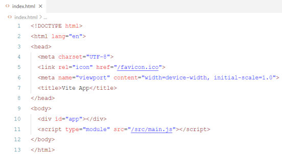
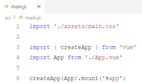
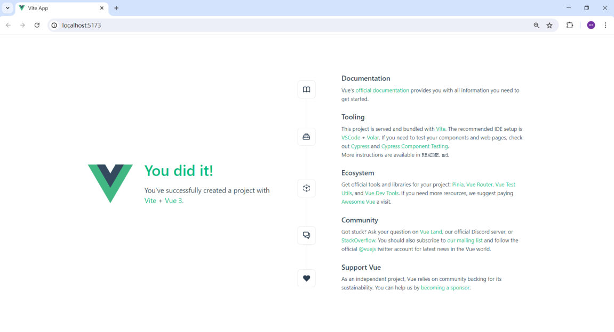
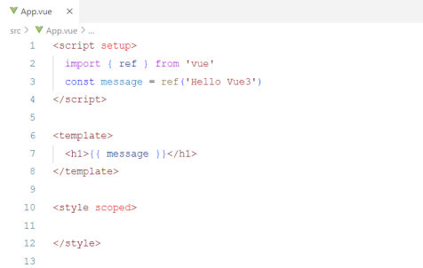
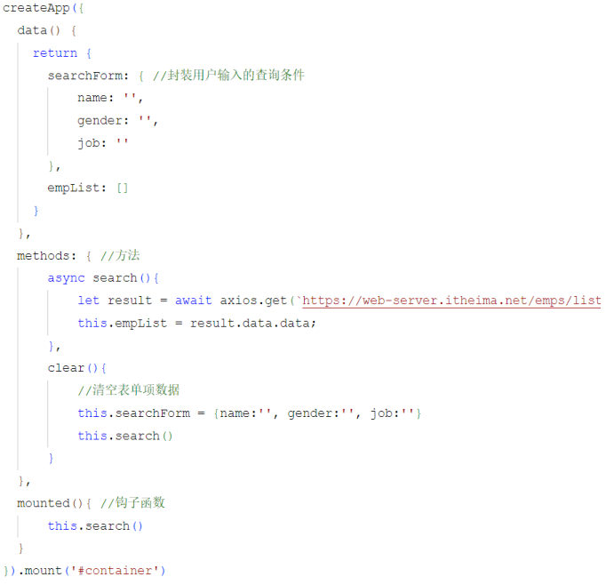
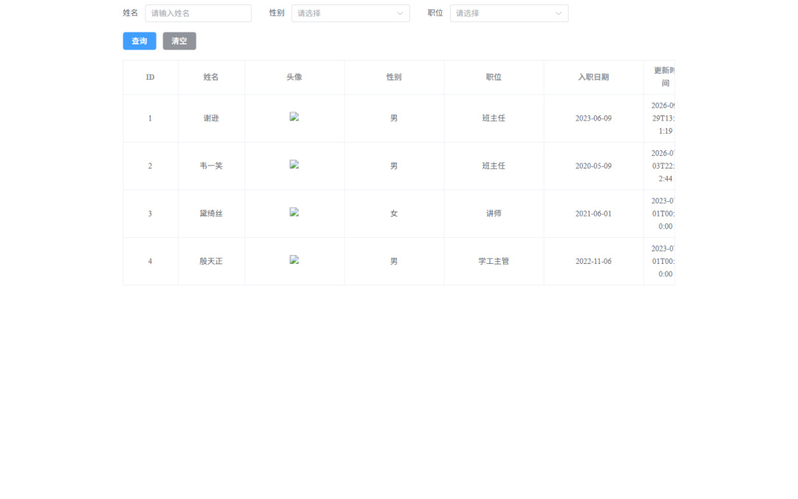

[95 篇](/posts/编程学习/javaweb学习笔记/95-前端工程化与vue项目/)把工程建起来、跑到 `http://localhost:5173` 上了，但当时页面上显示的是**脚手架自带的欢迎页**——那份页面是谁写的？我们自己的代码又要写在哪、怎么被加载出来？这一篇回答的就是这件事。

PPT 第 21~30 页分三块（第 21 页是目录页：环境准备 / Vue项目简介 / **Vue项目开发流程** / **API风格** / **案例**）：

| PPT 页 | 内容 | 本篇对应小节 |
| --- | --- | --- |
| 22~24 | Vue 项目开发流程、单文件组件 | 开发流程、`*.vue` 是什么 |
| 25~27 | API 风格：选项式与组合式 | 两种 API 风格 |
| 28~30 | 案例：用户列表数据渲染 | 员工列表案例 |

## Vue 项目的开发流程（PPT 第 22~23 页）

PPT 第 22~23 页只讲了三个词：**入口文件 → 根组件 → 默认首页**。把它们串起来看，就是浏览器打开工程后的完整加载链：

```text
浏览器访问 http://localhost:5173
        │
        ▼
index.html            ← 项目里唯一的 HTML 页面（body 里只有一个空的 <div id="app">）
        │  <script type="module" src="/src/main.js">
        ▼
main.js               ← 入口文件：创建 Vue 应用、导入根组件、挂载到 #app
        │  import App from './App.vue'
        ▼
App.vue               ← 根组件：页面上显示什么由它决定
        │  import EmpList from './views/EmpList.vue'
        ▼
views/EmpList.vue     ← 页面组件（案例里真正的员工列表页）
```

三个词对照成这样理解：

| 名词 | 是哪个文件 | 职责 |
| --- | --- | --- |
| **入口文件** | `src/main.js` | 页面加载的**起点**：引入 Vue、引入根组件、`createApp(App).mount('#app')` |
| **根组件** | `src/App.vue` | 页面上显示什么由它决定；要展示某个页面，就在这里引入它 |
| **默认首页** | 脚手架带的欢迎页 | 刚建好工程时看到的那一页（根组件里写的示例内容） |

先看入口页面 `index.html`——它是整个项目里**唯一的 HTML 文件**，内容少得出奇：


*图：PPT 第 23 页的 `index.html`——`<body>` 里只有一个空的 `<div id="app"></div>`，加一行 `<script type="module" src="/src/main.js"></script>`。**页面骨架是空的**，真正的内容全靠脚本挂进去*

再看入口文件 `main.js`：


*图：PPT 第 23 页的 `src/main.js`——引入全局样式、引入 Vue 的 `createApp`、引入根组件 `App.vue`，最后 `createApp(App).mount('#app')`。这行 `mount` 挂的就是 `index.html` 里的那个空 div*

> [!NOTE]
> 95 篇看过工程里 `main.js` 的**真实内容**，比这张图多了三行 ElementPlus 相关代码（引入组件库、引入样式、引入中文语言包），那是 PPT 第 35、42 页的内容，[97 篇](/posts/编程学习/javaweb学习笔记/97-elementplus组件库/)细讲。**去掉那三行，剩下的就是这张图的样子**——这就是开发流程的主干。

根组件 `App.vue` 换成自己的内容之前，工程显示的是脚手架自带的欢迎页：


*图：PPT 第 22 页 / 第 19 页的那个页面——浏览器地址栏是 `localhost:5173`，页面上写着 "You did it!"，左侧是 Vue 的 V 标、右侧是若干条链接。它就是"默认首页"，也是我们**马上要替换掉的东西***

课程案例的做法很直接：把 `App.vue` 的模板换成自己的页面组件。本机实测的工程里，`src/App.vue` 的真实内容就这么几行：

```vue
<script setup>
import EmpList from './views/EmpList.vue'
</script>

<template>
  <EmpList></EmpList>
</template>

<style scoped>

</style>
```

**根组件里只干了一件事**：把 `views/EmpList.vue`（页面组件）引进来、放到模板里。这样打开 `http://localhost:5173` 看到的就是员工列表页，而不是欢迎页了。

> [!TIP]
> 本机实测：改 `src/App.vue` 保存后，开发服务器的命令行会打印 `[vite] hmr update /src/App.vue`，浏览器里的页面自动更新——这就是 95 篇说的**热部署**（PPT 第 12 页列的 create-vue 功能之一）。所以"换首页"不需要重启服务，改完存盘刷新即可。

> [!IMPORTANT]
> `index.html` 只有一个、`#app` 也只有一个——**整站所有页面都渲染在这一个 HTML 里**（这就是"单页应用"的雏形）。想在这一个页面里"切换"出不同的页面，就要靠 PPT 第 5 页提到的 **VueRouter**（本课程不深入）；现在只要理解"**页面组件挂在根组件里**"这一层就够用了。

## `*.vue` 是什么：单文件组件（PPT 第 24 页）

PPT 第 24 页：

> **`*.vue` 是 Vue 项目中的组件文件，在 Vue 项目中也称为单文件组件（SFC，Single-File Components）。Vue 的单文件组件会将一个组件的逻辑 (JS)，模板 (HTML) 和样式 (CSS) 封装在同一个文件里（`*.vue`）。**

一个 `*.vue` 文件就是三块：

| 块 | 写什么 | PPT 的说法 |
| --- | --- | --- |
| `<template>` | 页面结构（HTML） | **模板部分，由它生成 HTML** |
| `<script setup>` | JS 逻辑（数据、函数、钩子） | **控制模板的数据及行为** |
| `<style scoped>` | CSS 样式 | **当前组件的 CSS 样式** |


*图：PPT 第 24 页的 `App.vue`——上面是 `<script setup>`（`ref('Hello Vue3')` 准备数据），中间是 `<template>`（`<h1>{{ message }}</h1>` 使用数据），下面是 `<style scoped>`（本组件样式）。一个文件里把"逻辑 / 结构 / 样式"三件事装齐，这就是"单文件组件"这个名字的由来*

几点说明：

- `scoped` 的意思是"**这段样式只作用于当前组件**"（不会污染别的组件）——它正好落实了 95 篇工程化里"组件化"的要求：组件连样式一起封装。
- 一个组件写在一个 `.vue` 文件里、文件名用大驼峰（`EmpList.vue`、`App.vue`），这也是"规范化"的一部分。
- 前面 19~22 篇的写法是把模板写在页面的 HTML 里、逻辑写在 `<script type="module">` 里；工程化之后**一个组件的三部分终于住在同一个文件里**了。

## 两种 API 风格：选项式与组合式（PPT 第 25~27 页）

PPT 第 26 页开门见山：

> **Vue 的组件有两种不同的风格：选项式 API 和 组合式 API。**

先看**选项式 API**（PPT 第 26 页左边的代码）——我们的 19~22 篇用的就是它：

```js
createApp({
  data() {           //声明响应式对象
    return {
      count: 0
    }
  },
  methods: {         //声明方法，可以通过组件实例访问
    increment: function() {
      this.count++ ;
    }
  },
  mounted() {        //声明钩子函数
    console.log('Vue mounted ...');
  }
}).mount('#container')
```


*图：PPT 第 26 页的选项式 API 代码——`data()`、`methods`、`mounted()` 这些"**选项**"写在同一个对象里；样式上就是把 [22 篇](/posts/编程学习/javaweb学习笔记/22-实战-vueaxios员工列表/)的代码原样搬进工程的样子（`this.searchForm`、`this.empList` 都在 `data()` 里）*

PPT 对选项式 API 的解释是：

> **选项式 API：可以用包含多个选项的对象来描述组件的逻辑，如：data，methods，mounted 等。选项定义的属性都会暴露在函数内部的 this 上，它会指向当前的组件实例。**

再看**组合式 API**（PPT 第 26 页右边的代码，第 27 页又单独讲了一遍）：

```js
// <script setup> 里的写法
import { ref, onMounted } from 'vue';

const count = ref(0);      //声明响应式变量

function increment(){      //声明函数
  count.value++;
}

onMounted(()=>{            //声明钩子函数
  console.log('Vue Mounted ...');
})
```

```html
<!-- 对应的模板部分 -->
<template>
  <button @click="increment">count:{{ count }}</button>
</template>
```

PPT 对组合式 API 的解释是：

> **组合式 API：是 Vue3 提供的一种基于函数的组件编写方式，通过使用函数来组织和复用组件的逻辑。它提供了一种更灵活、更可组合的方式来编写组件。**

两种风格对照着记：

| | 选项式 API | **组合式 API** |
| --- | --- | --- |
| 写法 | 一个**选项对象**：`data` / `methods` / `mounted`…… | 直接在 `<script setup>` 里**写变量和函数** |
| 数据 | `data()` 里 return 出来的属性 | `ref()` 声明的**响应式变量** |
| 方法 | 写在 `methods` 里 | 写成**普通函数** |
| 钩子 | 写成 `mounted() {}` 选项 | 用 `onMounted(fn)` **注册回调** |
| 取数据 | `this.count` | `count.value` |
| `this` | **指向组件实例**（`this` 上能看到 data / methods） | **没有 this**（是 `undefined`） |
| 风格 | 按"选项类型"分类组织代码 | 按"**函数**"组织，逻辑更灵活、更可组合 |

> [!IMPORTANT]
> **工程化项目里课程统一用组合式 API**——本机实测的工程里，`App.vue`、`EmpList.vue` 全都是 `<script setup>` 的组合式写法。所以前面学的选项式不能直接抄，得换个写法；但里面的概念（响应式数据、方法、钩子函数）是一个都不变的。

### 组合式 API 的三个关键点（PPT 第 27 页）

PPT 第 27 页专门列了三个必须记住的点：

| 关键点 | PPT 的说明 |
| --- | --- |
| **`ref()`** | 接收一个内部值，返回一个**响应式的 ref 对象**，此对象只有一个指向内部值的属性 **`value`** |
| **`onMounted()`** | 在组合式 API 中的**钩子方法**，注册一个回调函数，**在组件挂载完成后执行** |
| **`setup`** | 是一个**标识**，告诉 Vue 需要进行一些处理，让我们可以更简洁地使用组合式 API（写在 `<script setup>` 上） |

以及一条容易被绊倒的注意（PPT 第 27 页的"注意"，也是第 30 页的必答题）：

> **在 Vue 中的组合式 API 使用时，是没有 this 对象的，this 对象是 undefined。**

也就是说：**选项式里的 `this.count++`，在组合式里要写成 `count.value++`**——`ref()` 包出来的东西不是"裸值"，而是"装着值的盒子"，读写都要经过 `.value`。

（模板里是例外：`{{ count }}` 直接写变量名就行，Vue 会自动帮我们取 `.value`。所以 PPT 第 26 页的按钮里写的是 `count:{{ count }}`。）

## 案例：用户列表数据渲染（PPT 第 28~30 页）

PPT 第 28~29 页给的需求很短：

> **在 Vue 项目中基于组合式 API 完成用户列表数据渲染。要求在页面加载完毕之后，发送异步请求，加载数据，渲染表格。**

拆成三件事：**① 页面加载完毕 → ② 发异步请求拿数据 → ③ 渲染表格**。这个案例和 [22 篇](/posts/编程学习/javaweb学习笔记/22-实战-vueaxios员工列表/)是同一个需求，区别只有两个：**写法换成了组合式 API**、**页面组件放进了工程里**。

### 第一步：装 axios（PPT 第 29 页）

PPT 第 29 页专门提示：

```bash
npm install axios     # 项目中用到 axios，就需要安装 axios 的依赖
```

> [!NOTE]
> 本机实测：课程工程 `vue-project2` 的 `package.json` 里已经写着 `"axios": "^1.7.9"`，所以解压后跑一次 `npm install` 就把它一起装好了。**要"新装一个包"时，命令都是 `npm install 包名`**——95 篇讲过，包会被下载到 `node_modules`，并把版本记进 `package.json`。

### 第二步：写页面组件

工程里新建页面组件 `src/views/EmpList.vue`，然后在根组件 `App.vue` 里引入它（上面那段 `App.vue` 代码）。这就是课程的完整案例代码（**逐行看注释**）：

```vue
<script setup>
import { ref, onMounted } from 'vue';
import axios from 'axios';

//表单（用来装用户输入的查询条件）
const emp = ref({name: '',gender: '',job: ''})

//钩子函数
onMounted(() => {
  search();
})

//查询
const search = async () => {
  const result = await axios.get(`https://web-server.itheima.net/emps/list?name=${emp.value.name}&gender=${emp.value.gender}&job=${emp.value.job}`);
  empList.value = result.data.data;
}

//清空
const clear = () => {
  emp.value = {name: '',gender: '',job: ''};
  search();
}

const empList = ref([]);
</script>

<template>
  <div id="container">
    <!-- 搜索表单 -->
    <el-form :inline="true" :model="emp" class="demo-form-inline">
      <el-form-item label="姓名">
        <el-input v-model="emp.name" placeholder="请输入姓名" />
      </el-form-item>

      <el-form-item label="性别">
        <el-select v-model="emp.gender" placeholder="请选择">
          <el-option label="男" value="1" />
          <el-option label="女" value="2" />
        </el-select>
      </el-form-item>

      <el-form-item label="职位">
        <el-select v-model="emp.job" placeholder="请选择">
          <el-option label="班主任" value="1" />
          <el-option label="讲师" value="2" />
          <el-option label="学工主管" value="3" />
          <el-option label="教研主管" value="4" />
          <el-option label="咨询师" value="5" />
        </el-select>
      </el-form-item>

      <el-form-item>
        <el-button type="primary" @click="search">查询</el-button>
        <el-button type="info" @click="clear">清空</el-button>
      </el-form-item>
    </el-form>

    <!-- 表格 -->
    <el-table :data="empList" border style="width: 100%">
      <el-table-column prop="id" label="ID" width="100" align="center"/>
      <el-table-column prop="name" label="姓名" width="120"  align="center"/>
      <el-table-column label="头像" width="180"  align="center">
        <template #default="scope">
          
        </template>
      </el-table-column>
      <el-table-column label="性别" width="180"  align="center">
        <template #default="scope">
          {{ scope.row.gender == 1 ? '男' : '女'}}
        </template>
      </el-table-column>
      <el-table-column label="职位" width="180"  align="center">
        <template #default="scope">
          <span v-if="scope.row.job == 1">班主任</span>
          <span v-else-if="scope.row.job == 2">讲师</span>
          <span v-else-if="scope.row.job == 3">学工主管</span>
          <span v-else-if="scope.row.job == 4">教研主管</span>
          <span v-else-if="scope.row.job == 5">咨询师</span>
          <span v-else>其他</span>
        </template>
      </el-table-column>
      <el-table-column prop="entrydate" label="入职日期" width="180"  align="center"/>
      <el-table-column prop="updatetime" label="更新时间"  align="center"/>
    </el-table>
  </div>
</template>

<style scoped>
#container {
  width: 70%;
  margin-left: 15%;
  margin-right: 15%;
}
</style>
```

模板里的 `<el-form>`、`<el-table>` 这类以 `el-` 开头的标签是 **ElementPlus 组件**——那是 PPT 第 31~50 页的内容，[97 篇](/posts/编程学习/javaweb学习笔记/97-elementplus组件库/)会一个个讲清楚。**这一篇只盯住"数据是怎么来的"**：`<script setup>` 里那 20 行。

| 代码 | 作用 |
| --- | --- |
| `const emp = ref({name: '',gender: '',job: ''})` | 用 `ref()` 声明**响应式变量**：一个装着查询条件的对象（对应 22 篇 `data()` 里的 `searchForm`） |
| `const empList = ref([])` | 用 `ref()` 声明**响应式变量**：一个空数组，准备装接口返回的员工数据 |
| `onMounted(() => { search(); })` | **钩子函数**：组件挂载完成后执行——"页面加载完毕"就是它 |
| `const search = async () => { ... }` | 查询函数：用 **axios** 发异步请求，把结果塞进 `empList` |
| `` `...?name=${emp.value.name}&gender=${emp.value.gender}&job=${emp.value.job}` `` | [15 篇](/posts/编程学习/javaweb学习笔记/15-js函数与自定义对象/)的**模板字符串**拼地址；条件是**从 `.value` 里取**的（组合式没有 `this`） |
| `empList.value = result.data.data` | **更新响应式数据**：`result.data` 是响应体，**再一层 `.data`** 才是员工数组（[21 篇](/posts/编程学习/javaweb学习笔记/21-axios异步请求/)讲过接口的返回结构 `{code, msg, data}`） |
| `const clear = () => { ... }` | 清空按钮：把条件恢复成空对象，**再查一次**（等于把全部数据取回来） |

> [!TIP]
> **"先用了、后定义"为什么能跑通？** 上面代码里 `onMounted` 写在 `search` 前面、`search` 里又用了写在最后的 `empList`，看着像顺序错乱。原因是：`onMounted(...)` 只是**注册回调**，函数体要等组件挂载后才执行；等到那时候，`search` 和 `empList` 早就都初始化好了。（对比一下：如果直接在 `onMounted` 外面就调用 `search()`，就会报"未定义"。）

> [!IMPORTANT]
> 组合式 API 里**改数据就是改 `.value`**，改完之后页面**自己**重新渲染——不需要像 [18 篇](/posts/编程学习/javaweb学习笔记/18-实战-js版员工列表/)那样手动 `render()`、手动重绑事件。第 30 页的第二个必答题问的就是这个：**如何更新响应式数据内容？答：`xxx.value`**。

### 第三步：看运行结果（本机实测）

本机实测的页面（`npm run dev` 之后用普通 Chrome 打开 `http://localhost:5173`）：


*图：本机实测的案例页面——上面是搜索表单（姓名输入框 + 性别/职位下拉 + 查询/清空按钮），下面是表格；表格里是**接口返回的真实数据**，不是写死的死数据*

表格渲染出的 **4 行真实数据**（接口 `https://web-server.itheima.net/emps/list` 返回的）：

| ID | 姓名 | 性别 | 职位 | 入职日期 | 更新时间 |
| --- | --- | --- | --- | --- | --- |
| 1 | 谢逊 | 男 | 班主任 | 2023-06-09 | 2026-09-29T13:31:19 |
| 2 | 韦一笑 | 男 | 班主任 | 2020-05-09 | 2026-03-05T22:42:44 |
| 3 | 黛绮丝 | 女 | 讲师 | 2021-06-01 | 2023-01-01T00:00:00 |
| 4 | 殷天正 | 男 | 学工主管 | 2022-11-06 | 2023-01-01T00:00:00 |

本机实测还有两个**真实观察**（不影响案例理解，但值得知道）：

- **头像列是裂图**：课程数据里头像用的是阿里云 OSS 的图片链接（`web-framework.oss-cn-hangzhou.aliyuncs.com/...`），**本机实测这些链接已经加载不出来**了。代码本身没问题（`` 就是 20 篇 `v-bind` 的用法），换成本地图片或能访问的链接就正常。
- **"更新时间"没有格式化**：这一列直接显示后端返回的完整时间串（`2026-09-29T13:31:19`），课程原样没有做格式化——真实项目里这一步通常由前端格式化，或者后端直接返回好看的格式。

### 本机实测踩坑：接口对"无头浏览器"返回 405

> [!WARNING]
> **实际排查记录（值得记住的现象）**：本机实测时用无头浏览器（Playwright 的 HeadlessChromium）跑这个页面，表格一直是"暂无数据"。抓网络请求发现 axios 请求 `https://web-server.itheima.net/emps/list` 返回的是 **405 + 一段 HTML**（响应头里写着 `server: Tengine`，说明这个响应是黑马的服务器直接给的，**不是本地代码的问题**）。
>
> 逐个排查请求头后定位到原因——**服务器按 User-Agent 拦截无头浏览器**：
>
> ```text
> curl 不带 UA（或带普通 Chrome 的 UA）   → 200（正常返回数据）
> curl 带 HeadlessChrome 的 UA            → 405
> ```
>
> 换成普通 Chrome 的 UA 之后立刻正常（就是上面那 4 行数据）。
>
> **结论**：**课程代码本身没有问题**——
> 1. 用**普通浏览器**（Chrome / Edge 打开 `http://localhost:5173`）能正常拿到数据，这也是课程演示的方式；
> 2. 只有用**无头浏览器 / 爬虫工具**访问时才会被黑马的服务器拦掉（405）；
> 3. 这条接口**支持跨域**（在页面里直接请求也返回 200），所以**这个案例不需要配代理**——[21 篇](/posts/编程学习/javaweb学习笔记/21-axios异步请求/)讲过的"跨域"问题在这里不存在。

> [!NOTE]
> 顺带记住一个排查习惯：**页面没数据时先看请求**。405 是"请求方式/被拦"，404 是"地址错"，`Network Error` 是"连不上"，`blocked by CORS policy` 是"跨域没被允许"（[21](/posts/编程学习/javaweb学习笔记/21-axios异步请求/)~[22 篇](/posts/编程学习/javaweb学习笔记/22-实战-vueaxios员工列表/)都遇到过）。这次的现象（405）虽然根因在服务器，但**用普通浏览器就能验证"代码是对的"**。

## 第 30 页的必答问答

PPT 第 30 页是这一节的问答页，两道题都必须能立刻答出来：

| 问题 | 答案 |
| --- | --- |
| 在组合式 API 中有没有 `this`？ | **没有 this**（它是 `undefined`）——所以别写 `this.empList`，要写 `empList.value` |
| 在组合式 API 中如何更新响应式数据内容？ | 用 **`xxx.value`**——比如 `empList.value = result.data.data`、`count.value++`；模板里则直接写变量名 |

## 小结

| 问题 | 答案 |
| --- | --- |
| Vue 项目的开发流程是什么？ | **入口文件（main.js）→ 根组件（App.vue）→ 默认首页**；`index.html` 是唯一的 HTML 页面，里面只有 `<div id="app">`，脚本把根组件挂上去 |
| 怎么把工程首页换成自己的页面？ | 在 `src/views` 写页面组件，然后在 `App.vue` 里 `import` 并放进 `<template>`（本机实测：改 `App.vue` 保存后命令行打印 `hmr update`，页面自动更新） |
| 什么是单文件组件 SFC？ | `*.vue` 文件，把**逻辑（JS）、模板（HTML）、样式（CSS）**封装在一个文件里；三块是 `<template>` / `<script setup>` / `<style scoped>` |
| 两种 API 风格的区别？ | **选项式**：用 `data` / `methods` / `mounted` 等选项对象描述逻辑，属性都暴露在 `this` 上（19~22 篇的写法）；**组合式**：在 `<script setup>` 里用**函数**组织逻辑（工程里的写法） |
| 组合式 API 的三个关键点？ | `ref()` 返回**响应式 ref 对象**（读写走 `.value`）、`onMounted()` 注册**挂载完成后执行**的回调、`setup` 是**标识**（写在 `<script setup>` 上） |
| 组合式 API 里怎么改数据？ | `xxx.value = ...`（**没有 this**）；改完页面自动重新渲染 |
| 案例做的是什么事？ | 页面加载完毕（`onMounted`）→ 用 axios 发异步请求（`/emps/list`，条件拼在地址后面）→ 把 `result.data.data` 交给 `empList` → 表格自动渲染出 4 行数据 |
| 接口报 405 是什么原因？ | 本机实测：黑马接口**按 User-Agent 拦截无头浏览器**（HeadlessChrome → 405，普通 Chrome → 200）；用普通浏览器打开 5173 一切正常，而且该接口**支持跨域**，案例**不需要配代理** |

## 相关

- [上一篇：前端工程化与Vue项目](/posts/编程学习/javaweb学习笔记/95-前端工程化与vue项目/)
- [下一篇：ElementPlus组件库](/posts/编程学习/javaweb学习笔记/97-elementplus组件库/)
- [Axios异步请求（案例里那个请求的写法）](/posts/编程学习/javaweb学习笔记/21-axios异步请求/)
- [实战-Vue+Axios员工列表（同一个案例的选项式版本）](/posts/编程学习/javaweb学习笔记/22-实战-vueaxios员工列表/)
- [Vue3常用指令（模板里用到的 `v-if`、`v-bind`、`v-model`）](/posts/编程学习/javaweb学习笔记/20-vue3常用指令/)

## 练习题

### 一、知识回顾（读完直接做下面的实践题）

1. **Vue 项目的开发流程**：入口文件（`src/main.js`）→ 根组件（`src/App.vue`）→ 默认首页；`index.html` 是项目里**唯一的 HTML 页面**，body 里只有 `<div id="app">`，由 `<script type="module" src="/src/main.js">` 加载脚本
2. **入口文件 `main.js` 干三件事**：引入 Vue 的 `createApp`、引入根组件 `App`、`createApp(App).mount('#app')` 把它挂到 `#app` 上
3. **根组件 `App.vue` 决定页面上显示什么**：要展示某个页面组件（比如 `src/views/EmpList.vue`），就在它的 `<script setup>` 里 `import` 进来、写进 `<template>`
4. **单文件组件（SFC）** 就是 `*.vue` 文件，把一个组件的**逻辑（JS）、模板（HTML）、样式（CSS）** 封装在同一个文件里；三块分别是 `<template>`、`<script setup>`、`<style scoped>`（`scoped` = 样式只作用于当前组件）
5. **两种 API 风格**：**选项式 API** 用 `data` / `methods` / `mounted` 等选项对象描述组件逻辑，选项里的属性都暴露在 **`this`** 上（指向组件实例）；**组合式 API** 是 Vue3 提供的**基于函数**的组件编写方式，更灵活、更可组合
6. **组合式 API 三个关键点**：`ref()` 接收一个内部值、返回**响应式的 ref 对象**（只有一个指向内部值的属性 `value`）；`onMounted()` 是组合式 API 的**钩子方法**，注册的回调在**组件挂载完成后执行**；`setup` 是一个**标识**（写在 `<script setup>` 上）
7. **组合式 API 里没有 `this`（是 `undefined`）**；更新响应式数据用 **`xxx.value`**（如 `empList.value = result.data.data`、`count.value++`）；模板里直接写变量名即可
8. **案例三步**：页面加载完毕（`onMounted` 里调用查询函数）→ axios 发异步请求（地址 `https://web-server.itheima.net/emps/list`，条件用模板字符串拼成查询参数）→ 把 `result.data.data` 赋给 `empList`，表格自动渲染
9. **接口返回值是两层**：`result.data` 是响应体，**再一层 `.data`** 才是员工数组（后端返回结构 `{code, msg, data}`）
10. **本机实测的两个坑**：① 黑马接口**按 User-Agent 拦截无头浏览器**（带 HeadlessChrome 的 UA 返回 **405**，普通 Chrome 的 UA 返回 200），所以**用普通浏览器打开 5173 正常**，代码没问题；该接口**支持跨域**，案例**不需要配代理**；② 案例数据里的头像 OSS 链接本机实测已失效（裂图）、更新时间未格式化，都不影响案例理解

### 二、裸写题

- [ ] **2-1 做一个"计数器"组件**
  要求：页面上有一个按钮和一行文字，文字显示当前数字（初始为 0）；点一次按钮数字加 1。用工程里的组件写法（一个 `.vue` 文件三块齐全）。

  > [!TIP]- 提示（先自己想，实在想不出再点开）
  > **一级 · 思路**：数字必须是"**响应式**的"，否则改了页面不动；点击事件绑到按钮上，处理函数里改这个数字
  > **二级 · 方法**：用 `ref(0)` 声明响应式变量；用 `<script setup>` 里的普通函数改 `变量.value`；模板里用 `@click="函数名"` 绑事件、`{{ }}` 显示
  > **三级 · 骨架**：`import { ____ } from 'vue'` / `const count = ____(0)` / `function increment(){ count.____++ }` / `<button @click="____">count:{{ ____ }}</button>`

  > [!TIP]- 参考答案（做完再点开）
  > ```vue
  > <script setup>
  > import { ref } from 'vue';
  >
  > const count = ref(0);        //响应式变量：初始值 0
  >
  > function increment(){       //声明函数
  >   count.value++;             //组合式 API 没有 this，改数据要走 .value
  > }
  > </script>
  >
  > <template>
  >   <button @click="increment">count:{{ count }}</button>
  >   <!-- 模板里直接写变量名，Vue 会自动取 .value -->
  > </template>
  >
  > <style scoped>
  > </style>
  > ```
  > 对照 PPT 第 26~27 页的组合式 API 示例。检查点：① 点一下数字 +1；② 把 `count.value++` 改成 `count++`，页面就不动了（这就是"没有 `.value` 就没有生效"的典型症状）。

- [ ] **2-2 把选项式 API 的代码改写成组合式 API**
  下面是一段选项式 API 的代码，要求改写成组合式 API 的写法（`<script setup>`），**行为保持一致**：

  ```js
  createApp({
    data() {
      return {
        empList: [],
        keyword: ''
      }
    },
    methods: {
      loadData() {
        this.keyword = '已加载';
      }
    },
    mounted() {
      this.loadData();
    }
  }).mount('#app')
  ```

  > [!TIP]- 提示（先自己想，实在想不出再点开）
  > **一级 · 思路**：选项式的"选项"在组合式里各有去处——`data` 里的属性变成 `ref()` 变量，`methods` 里的方法变成普通函数，`mounted` 变成 `onMounted(回调)`
  > **二级 · 方法**：`ref([])` / `ref('')`；函数里改值用 `.value`；`onMounted(() => { ... })` 里调用那个函数；别再用 `this`
  > **三级 · 骨架**：`import { ref, ____ } from 'vue'` / `const empList = ref([____])` / `const keyword = ref('')` / `function loadData(){ keyword.____ = '已加载' }` / `____(() => { loadData() })`

  > [!TIP]- 参考答案（做完再点开）
  > ```vue
  > <script setup>
  > import { ref, onMounted } from 'vue';
  >
  > // data 里的属性 → ref() 声明的响应式变量
  > const empList = ref([]);
  > const keyword = ref('');
  >
  > // methods 里的方法 → 普通函数
  > function loadData() {
  >   keyword.value = '已加载';   //this.keyword → keyword.value
  > }
  >
  > // mounted 选项 → onMounted 注册回调
  > onMounted(() => {
  >   loadData();
  > });
  > </script>
  >
  > <template>
  >   <p>{{ keyword }}</p>
  > </template>
  >
  > <style scoped>
  > </style>
  > ```
  > 对照表：`data()` 里的属性 → `ref()`；`this.xxx` → `xxx.value`；`methods` 里的方法 → `<script setup>` 里的普通函数；`mounted(){}` → `onMounted(() => {})`；**全程没有 this**。

- [ ] **2-3 页面一打开就自动去接口取数据**
  要求：写一个组件，页面加载完毕后自动向 `https://web-server.itheima.net/emps/list` 发一次请求（不带任何查询条件），把返回的员工数组存进一个响应式变量，并**先用一个列表把员工姓名显示出来**。

  > [!TIP]- 提示（先自己想，实在想不出再点开）
  > **一级 · 思路**：三件事——准备一个空数组、页面加载完发请求、拿到数据塞进数组；要发请求就得先装 axios
  > **二级 · 方法**：`npm install axios`；`import axios from 'axios'`；`ref([])` 装数据；`onMounted` 里调用一个 `async` 函数；`await axios.get(地址)`，数据在 `result.data.data`；页面上用 `v-for` 渲染姓名
  > **三级 · 骨架**：`const empList = ref([____])` / `const loadData = async () => { const result = await ____.get('地址'); empList.value = result.data.____ }` / `onMounted(() => { ____() })` / `<li v-for="e in ____" :key="e.id">{{ e.____ }}</li>`

  > [!TIP]- 参考答案（做完再点开）
  > ```vue
  > <script setup>
  > import { ref, onMounted } from 'vue';
  > import axios from 'axios';
  >
  > //装接口返回的员工数据（先给空数组）
  > const empList = ref([]);
  >
  > //查询：发异步请求，把数据塞进 empList
  > const loadData = async () => {
  >   const result = await axios.get('https://web-server.itheima.net/emps/list');
  >   empList.value = result.data.data;   //两层：响应体 .data 里的 data 才是数组
  > }
  >
  > //钩子函数：组件挂载完成后执行 → 页面加载完毕自动查一次
  > onMounted(() => {
  >   loadData();
  > })
  > </script>
  >
  > <template>
  >   <ul>
  >     <li v-for="e in empList" :key="e.id">{{ e.name }}</li>
  >   </ul>
  > </template>
  >
  > <style scoped>
  > </style>
  > ```
  > 检查点：① 页面上出现 4 个姓名（谢逊、韦一笑、黛绮丝、殷天正）；② 一定要用**普通浏览器**打开页面——本机实测带 `HeadlessChrome` 的 User-Agent 会被黑马接口拦成 **405**（普通浏览器正常，且接口支持跨域、不需要配代理）。

- [ ] **2-4 排查：点了按钮数字不变 / 数据改了页面不动**
  下面这段代码"点了按钮页面没反应"，指出**问题在哪**并改好（一共 3 处问题）：

  ```vue
  <script setup>
  import { onMounted } from 'vue';

  let count = 0;

  function increment(){
    count.value++;
  }

  onMounted(){
    console.log('Vue Mounted ...');
  }
  </script>

  <template>
    <button @click="increment">count:{{ count }}</button>
  </template>
  ```

  > [!TIP]- 提示（先自己想，实在想不出再点开）
  > **一级 · 思路**：问题都在"组合式 API 的写法规则"上：普通变量不是响应式的、`.value` 只能用在 ref 对象上、钩子要用函数注册的方式
  > **二级 · 方法**：① 从 vue 里把 `ref` 一起引入；② 用 `ref(0)` 声明变量；③ `onMounted` 要**接收一个回调函数**（`onMounted(() => { ... })`），不是写成选项式那样的方法
  > **三级 · 骨架**：`import { ref, ____ } from 'vue'` / `let count = ____(0)` / `onMounted(____ => { console.log(...) })`

  > [!TIP]- 参考答案（做完再点开）
  > ```vue
  > <script setup>
  > import { ref, onMounted } from 'vue';   //① 补上 ref 的引入
  >
  > const count = ref(0);                   //② 用 ref() 声明响应式变量（原来只是普通变量）
  >
  > function increment(){
  >   count.value++;                        //这行写法是对的：ref 对象要改 .value
  > }
  >
  > onMounted(() => {                       //③ 钩子要注册回调函数
  >   console.log('Vue Mounted ...');
  > })
  > </script>
  >
  > <template>
  >   <button @click="increment">count:{{ count }}</button>
  > </template>
  > ```
  > 症状对照：
  > - 用 `let count = 0`（普通变量）时，改了它 Vue **不知道**，页面不会重新渲染——想要"数据驱动视图"，变量必须用 `ref()`（或其它响应式 API）声明。
  > - `count.value++` 写在普通变量上时，`count.value` 是 `undefined`，`undefined++` 得到 `NaN`。
  > - `onMounted(){...}` 这种写法在组合式 API 里是错的：它期望接收**一个回调函数**，要写成 `onMounted(() => {...})`。

### 三、综合题

- [ ] **3-1 照课程案例做一遍：员工列表数据渲染（组合式 API）**
  需求（和 PPT 第 29 页一样）：**页面加载完毕后发送异步请求，加载数据，渲染表格**。分步做：
  1. 在 95 篇建好的工程里，装上发请求要用的依赖
  2. 在 `src/views` 下新建页面组件 `EmpList.vue`，把 `<script setup>` / `<template>` / `<style scoped>` 三块先搭起来
  3. 声明两个响应式变量：一个装查询条件（姓名、性别、职位，初值都是空字符串）、一个装员工数组（初值是空数组）
  4. 写一个查询函数：把三个查询条件拼进接口地址，发请求，把返回的数组交给第 3 步那个变量
  5. 注册钩子：组件挂载完成后调用查询函数（这样"页面打开就有数据"）
  6. 在模板里把数组渲染成表格（一行一条记录）；先在根组件 `App.vue` 里引入这个页面组件，页面才会显示它
  7. 打开浏览器（**用普通 Chrome/Edge**）验证：表格里有 4 行数据；再点"查询"按钮确认能按条件查
  （这一题不要求写 ElementPlus 的表格组件——用你最熟的方式把数据展示出来即可，[97 篇](/posts/编程学习/javaweb学习笔记/97-elementplus组件库/)会用组件库重做一遍这张表。）

  > [!TIP]- 提示（先自己想，实在想不出再点开）
  > **一级 · 思路**：整题就是"**数据 → 请求 → 渲染**"三步，唯一的新东西是"用钩子让它在页面打开时自动执行"
  > **二级 · 方法**：`npm install axios`；`ref()` 两个变量；`async` 函数里 `await axios.get(地址)`，数据取 `result.data.data`；`onMounted` 里调用它；条件用模板字符串拼成 `?name=xxx&gender=xxx&job=xxx`；`App.vue` 里 `import` 页面组件并放进模板
  > **三级 · 骨架**：`const emp = ref({name:'', gender:'', job:''})` / `const empList = ref([])` / `const search = async () => { ... }` / `onMounted(() => { ____() })` / `<table>…<tr v-for="e in ____" :key="e.id">…</tr></table>` / `App.vue`：`import EmpList from './views/____.vue'`

  > [!TIP]- 参考答案（做完再点开）
  > ```vue
  > <!-- src/views/EmpList.vue（数据部分照课程工程写，模板这里用普通 HTML 表格示意） -->
  > <script setup>
  > import { ref, onMounted } from 'vue';
  > import axios from 'axios';
  >
  > //① 查询条件（响应式对象）
  > const emp = ref({name: '', gender: '', job: ''});
  >
  > //② 员工数组（先给空数组）
  > const empList = ref([]);
  >
  > //③ 查询：拼条件 → 发请求 → 把数组交给 empList
  > const search = async () => {
  >   const result = await axios.get(`https://web-server.itheima.net/emps/list?name=${emp.value.name}&gender=${emp.value.gender}&job=${emp.value.job}`);
  >   empList.value = result.data.data;
  > }
  >
  > //④ 钩子：页面加载完毕后自动查一次
  > onMounted(() => {
  >   search();
  > })
  > </script>
  >
  > <template>
  >   <div id="container">
  >     <!-- 查询条件：姓名 / 性别 / 职位 -->
  >     <input v-model="emp.name" placeholder="请输入姓名">
  >     <select v-model="emp.gender">
  >       <option value="">请选择</option>
  >       <option value="1">男</option>
  >       <option value="2">女</option>
  >     </select>
  >     <select v-model="emp.job">
  >       <option value="">请选择</option>
  >       <option value="1">班主任</option>
  >       <option value="2">讲师</option>
  >       <option value="3">学工主管</option>
  >       <option value="4">教研主管</option>
  >       <option value="5">咨询师</option>
  >     </select>
  >     <button @click="search">查询</button>
  >
  >     <!-- 表格：渲染 empList -->
  >     <table border="1" cellspacing="0" width="100%">
  >       <tr>
  >         <th>ID</th><th>姓名</th><th>性别</th><th>职位</th><th>入职日期</th><th>更新时间</th>
  >       </tr>
  >       <tr v-for="e in empList" :key="e.id" align="center">
  >         <td>{{ e.id }}</td>
  >         <td>{{ e.name }}</td>
  >         <td>{{ e.gender == 1 ? '男' : '女' }}</td>
  >         <td>{{ e.job }}</td>
  >         <td>{{ e.entrydate }}</td>
  >         <td>{{ e.updatetime }}</td>
  >       </tr>
  >     </table>
  >   </div>
  > </template>
  >
  > <style scoped>
  > #container {
  >   width: 70%;
  >   margin: 0 auto;
  > }
  > </style>
  > ```
  > ```vue
  > <!-- src/App.vue：让根组件显示这个页面 -->
  > <script setup>
  > import EmpList from './views/EmpList.vue'
  > </script>
  >
  > <template>
  >   <EmpList></EmpList>
  > </template>
  >
  > <style scoped>
  > </style>
  > ```
  > 检查点：
  > 1. 命令行有没有报错、浏览器控制台有没有红字（本机实测 405 那种"服务器拦 UA"的问题只在无头浏览器上出现，用普通浏览器不会遇到）；
  > 2. 页面上出现 **4 行数据**（谢逊 / 韦一笑 / 黛绮丝 / 殷天正）；
  > 3. 性别一列显示的是"男 / 女"而不是 `1 / 2`（说明渲染时真的在做判断）；
  > 4. 把接口地址故意写错，刷新页面——表格变空、控制台报错，**这正好验证了"数据是请求来的"**，改回来即可。
  > 做完这一题，[97 篇](/posts/编程学习/javaweb学习笔记/97-elementplus组件库/)会把这张"手搓的表格"换成组件库的 `el-table`，对比着看就知道组件库省了多少事。
