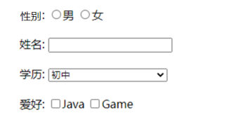
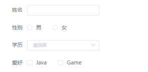
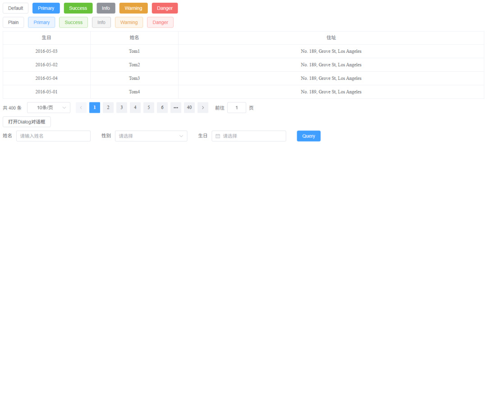
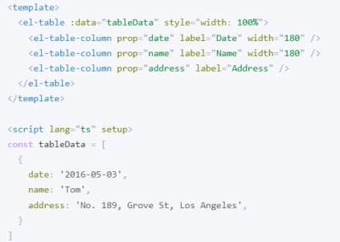
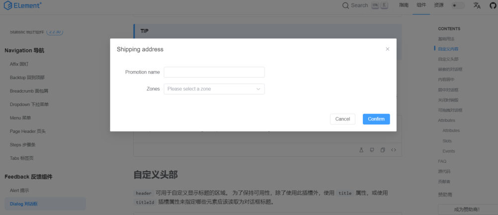
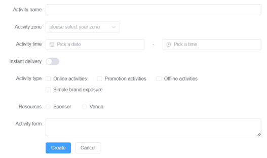
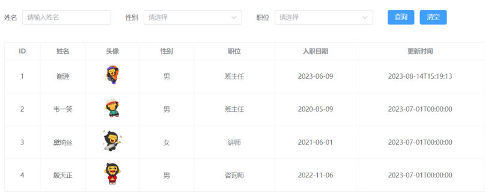

[96 篇](/posts/编程学习/javaweb学习笔记/96-vue项目开发流程与组合式api/)的案例页面里有一堆 `el-` 开头的标签（`<el-form>`、`<el-table>`、`<el-button>`……），当时只讲了 `<script setup>` 里的数据部分，故意把它们跳过了——因为那是 PPT 第 31 页以后的独立一节：

| PPT 页 | 内容 | 本篇对应小节 |
| --- | --- | --- |
| 31~36 | 什么是 ElementPlus、快速入门三步 | 什么是组件库、三步入门、中文配置 |
| 37~48 | 四个常见组件：表格、分页条、对话框、表单 | 常见组件 |
| 49~50 | 案例：制作页面并异步加载数据 | 案例 |

第 31~32 页是这一节的封面（**02 Element Plus**），从第 34 页开始的目录页反复出现同一张卡片列表（**快速入门 / 常见组件（表格组件、分页条组件、对话框组件、表单组件）/ 案例**）——每讲完一个组件就翻一次，卡片一张张点亮。

## 什么是 ElementPlus（PPT 第 33 页）

> 定义（PPT 原文）：**Element：是饿了么团队研发的，基于 Vue3，面向设计师和开发者的组件库。**

还有一句把"组件"这个词解释清楚了：

> **组件：组成网页的部件，例如 超链接、按钮、图片、表格、表单、分页条等等。**

官网：https://element-plus.org/zh-CN/#/zh-CN （所有组件的用法、代码、属性都能在这里查到，而且是中文的）

PPT 第 33 页用两张图对比了"自己写控件"和"用组件库"的样子——同样一个表单（性别单选、姓名输入框、学历下拉、爱好多选框）：


*图：PPT 第 33 页的原生写法——用 `input`、`select` 这些浏览器自带控件拼出来的表单，样式是浏览器默认的（方框、灰边、对齐难看），要好看就得自己写一大堆 CSS*


*图：同一组表单项换成 ElementPlus 的组件——边框、圆角、间距、占位文字、下拉箭头都是配好的，还自动带交互状态（悬停、聚焦）。**这就是组件库的价值：把"好看的控件 + 交互细节"做成现成的部件，拿来就用***

> [!IMPORTANT]
> 组件库正好落实 [95 篇](/posts/编程学习/javaweb学习笔记/95-前端工程化与vue项目/)讲的工程化关键词"**组件化**"（页面部件封装成组件、提高复用）。回想 [12 篇](/posts/编程学习/javaweb学习笔记/12-实战-tlias员工管理页面/)手写 Tlias 页面时，一个表格要写 `<table>` + `<tr>` + `<td>` 加一堆 CSS 对齐——用组件库就是**一行 `<el-table>`** 的事。

## 快速入门三步（PPT 第 34~36 页）

PPT 第 35 页的"准备工作"是四步：

1. **创建 Vue 项目**（[95 篇](/posts/编程学习/javaweb学习笔记/95-前端工程化与vue项目/)已经建好了）
2. **参照官方文档，安装 Element Plus 组件库**（在当前工程的目录下）
3. **在 `main.js` 中引入 Element Plus 组件库**（参照官方文档）
4. **制作组件**：访问 Element 官方文档，**复制组件代码，调整**

第 2 步的命令：

```bash
npm install element-plus@2.4.4 --save
```

- `element-plus@2.4.4` 指定版本（和课程保持一致）；
- `--save` 的意思是"把它记进 `package.json` 的依赖里"（现在这已经是 npm 的默认行为，写不写都一样）；
- 其实还是 [95 篇](/posts/编程学习/javaweb学习笔记/95-前端工程化与vue项目/)那条 `npm install 包名`，装完要**联网**、包会进 `node_modules`。

第 3 步，`main.js` 里引入（PPT 第 35 页给的代码）：

```js
//引入ElementPlus
import ElementPlus from 'element-plus'
import 'element-plus/dist/index.css'
createApp(App).use(ElementPlus).mount('#app')
```

三行的分工：

| 代码 | 作用 |
| --- | --- |
| `import ElementPlus from 'element-plus'` | 引入组件库本体 |
| `import 'element-plus/dist/index.css'` | 引入**组件库的样式文件**（少了这行，组件会"裸奔"，只剩默认标签的丑样子） |
| `.use(ElementPlus)` | 把组件库**注册到应用上**——注册完之后，任何组件的模板里都能直接用 `el-` 开头的标签，不用一个个 import |

> [!NOTE]
> `.use(ElementPlus)` 这种叫**全局注册（全量引入）**：整个组件库的组件都注册进来。好处是省事，代价是**打包体积大**——本机实测这个工程 `npm run build` 出来的 js 是 **877.21 KiB（gzip 290.77 KiB）**，命令行还给了 `chunks are larger than 500 KiB` 的警告，主要就是它。ElementPlus 官方文档里还有一种"**按需引入**"的方案（只引入用到的组件，体积能小很多），课程没讲，知道有这么个方向就行。

### 必答问答（PPT 第 36 页）

PPT 第 36 页把"ElementPlus 的使用步骤"总结成三句，必须能脱口而出：

| 问题 | 答案 |
| --- | --- |
| ElementPlus 的使用步骤是什么？ | **安装 → 引入 → 组件** |
| 怎么安装？ | `npm install element-plus@2.4.4 --save`（在**当前工程的目录下**执行） |
| 怎么引入？ | 在 `main.js` 中引入（参照官方文档）：引入组件库 + 引入样式 + `.use(ElementPlus)` |
| 组件怎么用？ | 访问官方文档，**复制组件代码，调整成我们需要的样子** |

> [!TIP]
> 第 4 步"复制代码再调整"是这一节最实用的工作方式：**不用背组件怎么写**——去官网找到想要的组件，把示例代码拷进模板，再把里面的数据/属性换成自己的（官方文档的示例很多是 TypeScript 版本，拷进来把 `lang="ts"` 去掉、`const tableData = [...]` 这种写法照抄即可）。这也解释了为什么前面要学"数据驱动"：**组件只管显示，数据由我们给**。

## 让组件显示中文（PPT 第 42 页）

PPT 第 42 页在讲分页条的时候顺带说了一个**全局配置**：

> **默认 Element Plus 的组件是英文的，如果希望使用中文语言，可以做如下配置：**

```js
//引入中文语言
import zhCn from 'element-plus/es/locale/lang/zh-cn'
createApp(App).use(ElementPlus, { locale: zhCn }).mount('#app')
```

就是在 `main.js` 里多引一个中文语言包，并在 `.use()` 的第二个参数里传 `{ locale: zhCn }`。配置后，分页条上的 "Total"、"Go to"、日期选择器的月份名这类内置文字都会变成中文。

本机实测：课程工程的 `src/main.js` 就是上面两件事合起来的最终版本——

```js
import { createApp } from 'vue'

//引入ElmentPlus
import ElementPlus from 'element-plus'
import 'element-plus/dist/index.css'
import zhCn from 'element-plus/es/locale/lang/zh-cn'

import App from './App.vue'

createApp(App).use(ElementPlus, {locale: zhCn}).mount('#app')
```

（[95 篇](/posts/编程学习/javaweb学习笔记/95-前端工程化与vue项目/)看这个文件时多出来的就是这四行，现在它们全都对上了。另外提一句：课程工程里那行注释写的是 `//引入ElmentPlus`，**少了一个 e**——这是原代码的笔误，不影响运行，抄的时候不用跟着错。）

## 常见组件（PPT 第 37~48 页）

PPT 第 38 页的目录页列了四个组件：**表格组件、分页条组件、对话框组件、表单组件**。

本机实测：课程工程里有一个专门的演示页面 `src/views/ElementDemo.vue`，把四个组件全放在一页里（这就是 PPT 第 39~48 页练手用的现成 demo）：


*图：本机实测把 `App.vue` 指向 `ElementDemo.vue` 后的页面——从上到下依次是**按钮**（两行，Default / Primary / Success / Info / Warning / Danger 六种样式各一套实心、一套 plain 描边，共 12 个）、**表格**、**分页条**、**打开对话框的按钮**、**表单**。一页就能把常用的几类组件都看一遍*

### 表格组件（PPT 第 39~40 页）

> 用途（PPT 原文）：**用于展示多条结构类似的数据，可对数据进行排序、筛选、对比或其他自定义操作。**

PPT 第 40 页用一张官方文档的截图点出了关键：


*图：PPT 第 40 页的表格代码——上半部分是 `<template>`：`<el-table :data="tableData">` 里放三个 `<el-table-column prop="..." label="..."/>`；下半部分是 `<script setup>`：`tableData` 是一份数组，每个对象里就是每列要显示的属性。**表格的写法就是"给一份数组 + 声明每列显示哪个字段"***

必答问答（PPT 第 40 页）：

| 问题 | 答案 |
| --- | --- |
| 表格组件使用的关键点是什么？ | 清楚**表格中绑定的数据 `data`**（`<el-table :data="...">`），以及**每一列要展示的属性信息**（`<el-table-column prop="..." label="...">`） |
| 项目开发中的数据从哪来？ | **应该是 Ajax 异步请求服务端，服务器端返回**（[96 篇](/posts/编程学习/javaweb学习笔记/96-vue项目开发流程与组合式api/)那套：`onMounted` + axios） |

表格常用写法整理成表：

| 位置 | 写法 | 说明 |
| --- | --- | --- |
| 表格 | `<el-table :data="数组" border>` | **`data` 绑的就是"要展示的那份数组"**；`border` 加边框 |
| 普通列 | `<el-table-column prop="字段名" label="列标题" width="120" align="center"/>` | `prop` 指定**这个对象里的哪个属性**；`label` 是表头文字 |
| 自定义列 | `<el-table-column label="头像">` 里加 `<template #default="scope"> ... </template>` | 列里要放图片、要做判断时用；**行数据在 `scope.row` 里**（`scope.row.image`、`scope.row.name`） |

本机实测（PPT 第 29~30 页那个案例的表格部分）：96 篇案例里的 `<el-table :data="empList" border>` 就是用它渲染的——`empList` 里是接口返回的**4 行真实数据**，`ID / 姓名 / 入职日期 / 更新时间`四列直接用 `prop` 取字段，而`头像`（``）、`性别`（三元判断 `scope.row.gender == 1 ? '男' : '女'`）、`职位`（`v-if` 判断）三列因为要"加工"，都用了自定义列的写法。

### 分页条组件（PPT 第 41~42 页）

> 用途（PPT 原文）：**当数据量过多时，使用分页操作分解数据。**

PPT 第 42 页给的额外信息就是上面那节"中文语言配置"（组件默认英文 → 引 `zh-cn`）。

课程工程里 `ElementDemo.vue` 的分页条（本机实测的页面截图中间那一行就是它）：

```html
<el-pagination
  v-model:current-page="currentPage4"
  v-model:page-size="pageSize4"
  :page-sizes="[10, 20, 30, 40, 50, 75, 100]"
  :background="background"
  layout="total, sizes, prev, pager, next, jumper"
  :total="total"
  @size-change="handleSizeChange"
  @current-change="handleCurrentChange"
/>
```

```js
const currentPage4 = ref(1);   //当前页码
const pageSize4 = ref(10);     //每页展示记录数
const total = ref(400);        //总记录数
const background = ref(true);  //是否有背景色

const handleSizeChange = (val) => {
  console.log(`每页展示: ${val} 条`)
}
const handleCurrentChange = (val) => {
  console.log(`当前页码是: ${val}`)
}
```

属性逐条对照：

| 属性 / 事件 | 作用 |
| --- | --- |
| `v-model:current-page="currentPage4"` | **当前页码**（双向绑定，翻页时自动更新这个变量） |
| `v-model:page-size="pageSize4"` | **每页展示记录数** |
| `:page-sizes="[10, 20, 30, ...]"` | "每页多少条"下拉里的可选值 |
| `:total="total"` | **总记录数**（真实项目里是接口返回的总条数） |
| `layout="total, sizes, prev, pager, next, jumper"` | 分页条**显示哪些部件**：共 N 条、每页条数下拉、上一页、页码、下一页、跳页输入框 |
| `:background="background"` | 页码是否带背景色 |
| `@size-change` / `@current-change` | **每页条数变了 / 页码变了**时触发（真实项目里就在这里重新发请求拿这一页的数据） |

本机实测：演示页上的分页条显示 **"共 400 条、10条/页"**，页码 1~6、省略号、40——因为代码里 `total = 400`、`pageSize = 10`（正好 40 页）；点页码时控制台会打印 `当前页码是: X`。

### 对话框组件（PPT 第 43~45 页）

> 用途（PPT 原文）：**在保留当前页面状态的情况下，告知用户并承载相关操作。**


*图：PPT 第 44 页的对话框——弹窗浮在页面上层（背景被压暗），里面可以放输入框、下拉框，底部是 Cancel / Confirm 按钮。**页面本身没有跳走**（这就是"保留当前页面状态"），用户处理完关掉弹窗就回到原来的位置*

必答问答（PPT 第 45 页）：

| 问题 | 答案 |
| --- | --- |
| Dialog 对话框组件使用的关键点是什么？ | **通过 `model-value` / `v-model` 给定的 boolean 值，来控制 Dialog 的显示与隐藏** |

课程工程里的用法（`ElementDemo.vue`）：

```html
<!-- 打开按钮：点一下把那个 boolean 改成 true -->
<el-button plain @click="dialogTableVisible = true">打开Dialog对话框</el-button>

<!-- 对话框：v-model 绑着一个 boolean 变量 -->
<el-dialog v-model="dialogTableVisible" title="收货地址" width="800">
  <el-table :data="tableData">
    <el-table-column property="date" label="日期" width="150" />
    <el-table-column property="name" label="姓名" width="200" />
    <el-table-column property="address" label="地址" />
  </el-table>
</el-dialog>
```

```js
const dialogTableVisible = ref(false);   //false=藏起来，true=显示出来
```

三句话记住它：

1. **先有一个 boolean 变量**（`ref(false)`），它决定对话框"藏/显"；
2. **`v-model` 绑上它**——对话框右上角那个"×"关闭时，Vue 会**自动把变量改回 false**（这又是 `v-model` 双向绑定，[20 篇](/posts/编程学习/javaweb学习笔记/20-vue3常用指令/)学的）；
3. **打开靠点按钮**：把变量改成 `true`。

本机实测：演示页上那个"打开Dialog对话框"按钮点一下，就会弹出一个 800 宽的对话框（里面装着一张表格），点关闭或遮罩就收起来。

### 表单组件（PPT 第 46~48 页）

> 用途（PPT 原文）：**表单包含 输入框, 单选框, 下拉选择, 多选框 等用户输入的组件。使用表单，可以收集、验证和提交数据。**


*图：PPT 第 47 页的表单——一行一个 `el-form-item`，标签在左、控件在右，里面有输入框、下拉框、日期选择、开关、多选框、文本域，最下面是提交/取消按钮。**表单的本事是三件：把用户输入收集起来、做校验、提交出去***

必答问答（PPT 第 48 页）：

| 问题 | 答案 |
| --- | --- |
| 表单组件使用的关键点是什么？ | **表单项数据采集用 `v-model` 数据绑定**；**表单数据提交用事件绑定** |

课程工程里的用法（`ElementDemo.vue`）：

```html
<el-form :inline="true" :model="user" class="demo-form-inline">
  <el-form-item label="姓名">
    <el-input v-model="user.name" placeholder="请输入姓名" />
  </el-form-item>

  <el-form-item label="性别">
    <el-select v-model="user.gender" placeholder="请选择">
      <el-option label="男" value="1" />
      <el-option label="女" value="2" />
    </el-select>
  </el-form-item>

  <el-form-item label="生日">
    <el-date-picker
      v-model="user.birthday"
      type="date"
      placeholder="请选择"
      value-format="YYYY-MM-DD"
    />
  </el-form-item>

  <el-form-item>
    <el-button type="primary" @click="onSubmit">Query</el-button>
  </el-form-item>
</el-form>
```

```js
//表单：一个对象装所有表单项的值
const user = ref({
  name: '',
  gender: '',
  birthday: ''
})

//提交：事件绑定的函数，在这里拿到用户填的数据
const onSubmit = () => {
  console.log(user.value);
}
```

结构说明：`<el-form>` 是表单容器，`<el-form-item>` 是**一行表单项**（`label` 是左边的标签文字）；采集数据全靠 **`v-model`**——输入框绑 `user.name`、下拉框绑 `user.gender`、日期选择器绑 `user.birthday`，用户在页面上填什么，`user` 这个对象里就有什么（96 篇案例里的查询条件 `emp` 用的是同一套写法）。提交就是把 `@click="onSubmit"` 绑到按钮上，在函数里用 `user.value` 拿到数据（真实项目里通常接着 `axios.post(...)` 发给后端）。

本机实测：演示页最下面的表单就是这三项（姓名 / 性别 / 生日）+ 一个 Query 按钮；点 Query，控制台打印出 `{name: ..., gender: ..., birthday: ...}` 这**一份被采集好的数据**——这就是"收集"两个字的意思。

## 案例：制作页面并异步获取数据（PPT 第 49~50 页）

PPT 第 50 页给的任务是两句话：

> **制作如下页面，并异步获取数据完成页面展示**——**页面布局**、**动态加载数据并渲染展示**。


*图：PPT 第 50 页的案例页面——**页面布局**：上半部分是搜索表单（姓名输入框 + 性别下拉 + 职位下拉 + 查询/清空按钮），下半部分是员工表格（ID / 姓名 / 头像 / 性别 / 职位 / 入职日期 / 更新时间）；**动态加载数据**：表格里的 4 行数据是页面打开后从接口取回来的*

拆成两张"表"来看，这个页面就是用组件搭起来的：

| 区域 | 用到的组件 | 关键点 |
| --- | --- | --- |
| 搜索表单 | `el-form` + `el-form-item` + `el-input` + `el-select` + `el-option` + `el-button` | `:model="emp"` 挂上查询条件对象，每个控件 `v-model` 绑到具体字段（如 `emp.name`） |
| 员工表格 | `el-table` + `el-table-column` | `:data="empList"` 挂上数据数组；普通列用 `prop` 取字段，头像/性别/职位三列用 `<template #default="scope">` 加工 |
| 按钮交互 | `el-button` | 查询按钮 `@click="search"`、清空按钮 `@click="clear"` |

**数据部分不用重写**——就是 [96 篇](/posts/编程学习/javaweb学习笔记/96-vue项目开发流程与组合式api/)做好的那套：`ref` 准备变量、`onMounted` 里发起请求、`axios.get` 拼查询条件、`empList.value = result.data.data`。**这一节新加的东西全在"布局"上**：同样的数据，用组件库摆出来比手写 `<table>` 省事得多，样式还更好看。

本机实测（95 篇那个工程跑起来的样子，普通 Chrome 打开 `http://localhost:5173`）：

- 搜索表单渲染正常：姓名输入框 + 性别（男/女）+ 职位（班主任/讲师/学工主管/教研主管/咨询师）下拉 + 查询/清空按钮；
- 表格渲染出**接口返回的 4 行真实数据**（谢逊 / 韦一笑 / 黛绮丝 / 殷天正）；
- 两个真实观察（和 96 篇一样）：**头像那列是裂图**（课程数据里的 OSS 链接已经访问不了），**"更新时间"是后端原样返回的完整时间串**（没有格式化）；
- 演示页统计（`ElementDemo.vue`）：**按钮 12 个**（六种样式各两套）、**表格 1 个**（4 行静态数据）、**分页条 1 个**、**输入框 5 个**（表单里 3 个 + 分页条里"每页条数"下拉和"跳页"输入框）、**对话框 1 个**（点按钮才出现）。

> [!WARNING]
> 本机实测还踩到一个坑：这个案例的接口 `https://web-server.itheima.net/emps/list` 会**按 User-Agent 拦截无头浏览器**——用 Playwright 那种无头 Chromium 访问会拿到 **405**，表格一片空白；换普通 Chrome / Edge 打开就一切正常。**代码没问题**（接口本身也支持跨域，不需要配代理），详细排查过程在 [96 篇](/posts/编程学习/javaweb学习笔记/96-vue项目开发流程与组合式api/)。

> [!TIP]
> 打包体积的那条实测也放这儿收个尾：本机实测 `npm run build` 打出的 js 是 **877.21 KiB（gzip 290.77 KiB）**，警告"chunks are larger than 500 KiB"，原因就是**全量引入 ElementPlus**（`.use(ElementPlus)` 把整个组件库都注册进来了）。真实项目里普遍用"**按需引入**"（只打包用到的组件）来瘦身——课程没讲，知道方向即可。

## 小结

| 问题 | 答案 |
| --- | --- |
| ElementPlus 是什么？ | **饿了么团队**研发的、**基于 Vue3**、面向设计师和开发者的**组件库**；组件 = 组成网页的部件（按钮、表格、表单、分页条……）；官网 https://element-plus.org/zh-CN/ |
| 使用三步？ | **安装**（`npm install element-plus@2.4.4 --save`，在工程目录下）→ **引入**（`main.js` 里引入组件库 + 引入样式 + `.use(ElementPlus)`）→ **组件**（去官方文档复制代码，调整成自己要的样子） |
| 组件为什么这么写？ | 组件只管"显示"，**数据由我们给**——所以官方文档的示例代码拿来后，要把数据换成自己的（表格 `:data`、表单 `v-model`） |
| 怎么让组件说中文？ | `main.js` 里引入 `element-plus/es/locale/lang/zh-cn`，然后 `.use(ElementPlus, { locale: zhCn })`（PPT 第 42 页） |
| 表格组件关键点？ | 搞清 `<el-table :data="...">` 绑的是**哪份数据**、每一列 `<el-table-column prop label>` 显示**哪个属性**；真实数据来自 **Ajax 异步请求**；要加工（图片、判断）就用 `<template #default="scope">`，行数据在 `scope.row` 里 |
| 分页条组件关键点？ | 用途是"数据量过多时分页展示"；关键属性 `v-model:current-page`（当前页码）、`v-model:page-size`（每页条数）、`:total`（总条数）、`layout`（显示哪些部件）；页码/条数变化时用 `@current-change`、`@size-change` 处理 |
| 对话框组件关键点？ | **靠一个 boolean 变量控制显示与隐藏**：`<el-dialog v-model="变量">`，按钮里把它改成 `true` 就打开；用途是"保留当前页面状态的情况下告知用户并承载相关操作" |
| 表单组件关键点？ | **数据采集用 `v-model` 绑定**（每一项绑到对象的一个字段上）、**数据提交用事件绑定**（按钮 `@click` 里拿到整个对象，`console.log(user.value)` 或 `axios.post` 发出去）；表单可以收集、验证、提交数据 |
| 案例做了两件事？ | **页面布局**（搜索表单 + 表格，全用组件拼）和**动态加载数据并渲染**（`onMounted` + axios 取数，塞给 `empList`） |
| 打包体积为什么大？ | 全量引入 ElementPlus（`.use(ElementPlus)`）；本机实测 js 877.21 KiB（gzip 290.77 KiB），官方还提供"按需引入"的优化方向 |

## 相关

- [上一篇：Vue项目开发流程与组合式API](/posts/编程学习/javaweb学习笔记/96-vue项目开发流程与组合式api/)
- [下一篇：前后端分离与整体布局](/posts/编程学习/javaweb学习笔记/98-前后端分离与整体布局/)

## 练习题

### 一、知识回顾（读完直接做下面的实践题）

1. **ElementPlus** 是**饿了么团队**研发的、**基于 Vue3**、面向**设计师和开发者**的**组件库**；**组件 = 组成网页的部件**（超链接、按钮、图片、表格、表单、分页条等）；官网 https://element-plus.org/zh-CN/
2. **快速入门三步：安装 → 引入 → 组件**——安装 `npm install element-plus@2.4.4 --save`（在工程目录下执行）；引入在 `main.js`（引入组件库 + 引入 `element-plus/dist/index.css` 样式 + `.use(ElementPlus)`）；组件就是**去官方文档复制代码再调整**
3. **中文语言配置**：`import zhCn from 'element-plus/es/locale/lang/zh-cn'`，然后 `.use(ElementPlus, { locale: zhCn })`——不配置的话组件里的内置文字是英文的
4. **表格组件**：`<el-table :data="数组">` 绑定要展示的数据，`<el-table-column prop="字段名" label="列标题">` 声明每一列显示哪个属性；需要加工（图片、判断）时用 `<template #default="scope">`，**行数据在 `scope.row` 里**
5. **表格里的数据在项目里应该是 Ajax 异步请求服务端返回的**（96 篇：`onMounted` + axios + `empList.value = result.data.data`），不是写死的死数据
6. **分页条组件**：数据量过多时用它分解数据；关键绑定是 `v-model:current-page`（当前页码）、`v-model:page-size`（每页条数）、`:total`（总记录数）、`layout`（显示哪些部件：total/sizes/prev/pager/next/jumper）；`@current-change`、`@size-change` 分别在页码、每页条数变化时触发
7. **对话框组件**：**通过 `model-value` / `v-model` 给定的 boolean 值控制显示与隐藏**（`false` 藏、`true` 显）；用途是"在保留当前页面状态的情况下，告知用户并承载相关操作"
8. **表单组件**：用 `el-form` + `el-form-item`（`label` 是标签）+ 各种输入控件搭起来；**表单项数据采集用 `v-model` 数据绑定**、**表单数据提交用事件绑定**（按钮 `@click`）；表单能收集、验证、提交数据
9. **案例两件事**：**页面布局**（上半部分搜索表单 + 下半部分表格，全用组件拼）+ **动态加载数据并渲染展示**（打开页面自动请求接口，再渲染到表格）
10. **本机实测**：演示页上有按钮 12 个（六种样式各两套）、表格 1 个 4 行、分页条 1 个（共 400 条 / 10条每页）、输入框 5 个、对话框 1 个；案例接口**按 User-Agent 拦截无头浏览器**（无头 405、普通浏览器正常，接口支持跨域、不需要配代理）；全量引入导致打包 js 877.21 KiB（gzip 290.77 KiB），官方另有"按需引入"的方向

### 二、裸写题

- [ ] **2-1 用按钮组件做出两个按钮**
  要求：页面上有两个按钮——一个是**主色调的实心按钮**，文字"查询"；一个是**次要样式的按钮**，文字"清空"。两个按钮都要能在点击时在控制台打印出一句话，证明点击事件真的绑上了。

  > [!TIP]- 提示（先自己想，实在想不出再点开）
  > **一级 · 思路**：按钮用组件库的按钮组件；颜色/样式靠"类型"属性区分；点击事件还是 Vue 的 `@click`，处理函数写在 `<script setup>` 里
  > **二级 · 方法**：`<el-button>`；主色调用 `type="primary"`、次要样式用 `type="info"`；点击处理函数写成普通函数即可（组合式 API 里没有 `this`）
  > **三级 · 骨架**：`<el-button type="____" @click="____">查询</el-button>` / `<el-button type="____" @click="____">清空</el-button>` / `function search(){ console.log('____') }`

  > [!TIP]- 参考答案（做完再点开）
  > ```vue
  > <!-- 参照 ElementDemo.vue 顶部那两行按钮的写法 -->
  > <script setup>
  > function search(){
  >   console.log('点击了查询');
  > }
  > function clear(){
  >   console.log('点击了清空');
  > }
  > </script>
  >
  > <template>
  >   <el-button type="primary" @click="search">查询</el-button>
  >   <el-button type="info" @click="clear">清空</el-button>
  > </template>
  >
  > <style scoped>
  > </style>
  > ```
  > 检查点：① 两个按钮长得不一样（一个蓝底白字、一个灰底）；② 点一下控制台出现对应的那句话。工程里 `EmpList.vue` 的查询/清空按钮就是 `type="primary"` 和 `type="info"` 这一对。

- [ ] **2-2 用表格组件把一份数组渲染成表格**
  素材（把它当作接口返回的数据）：

  ```js
  const tableData = [
    {date: '2016-05-03', name: 'Tom1', address: 'No. 189, Grove St, Los Angeles'},
    {date: '2016-05-02', name: 'Tom2', address: 'No. 189, Grove St, Los Angeles'},
    {date: '2016-05-04', name: 'Tom3', address: 'No. 189, Grove St, Los Angeles'},
    {date: '2016-05-01', name: 'Tom4', address: 'No. 189, Grove St, Los Angeles'},
  ]
  ```

  要求：页面上有一张带边框的表格，表头分别是"生日 / 姓名 / 住址"，三列分别显示上面每行对象的三个属性（生日列宽 260、姓名列宽 260、住址列自适应，内容居中对齐）。

  > [!TIP]- 提示（先自己想，实在想不出再点开）
  > **一级 · 思路**：表格组件要两样东西——"数据"（一份数组）和"每一列显示哪个字段"（一列一行声明）
  > **二级 · 方法**：`<el-table :data="tableData" border>`；每列用 `<el-table-column prop="..." label="..." width="..." align="center"/>`；**`prop` 写的是对象里的属性名**，`label` 才是表头文字
  > **三级 · 骨架**：`<el-table :____="tableData" border>` / `<el-table-column ____="date" label="生日" width="260" align="center"/>` / 后两列同理（`prop="name"`、`prop="address"`）

  > [!TIP]- 参考答案（做完再点开）
  > ```vue
  > <!-- 这就是 ElementDemo.vue 里表格部分的写法 -->
  > <script setup>
  > const tableData = [
  >   {date: '2016-05-03', name: 'Tom1', address: 'No. 189, Grove St, Los Angeles'},
  >   {date: '2016-05-02', name: 'Tom2', address: 'No. 189, Grove St, Los Angeles'},
  >   {date: '2016-05-04', name: 'Tom3', address: 'No. 189, Grove St, Los Angeles'},
  >   {date: '2016-05-01', name: 'Tom4', address: 'No. 189, Grove St, Los Angeles'},
  > ]
  > </script>
  >
  > <template>
  >   <el-table :data="tableData" border style="width: 100%">
  >     <el-table-column prop="date" label="生日" width="260" align="center"/>
  >     <el-table-column prop="name" label="姓名" width="260" align="center"/>
  >     <el-table-column prop="address" label="住址" align="center"/>
  >   </el-table>
  > </template>
  >
  > <style scoped>
  > </style>
  > ```
  > 检查点：① 表头是中文的"生日 / 姓名 / 住址"（`label` 生效）；② 每行数据取的是对的字段（`prop` 生效）；③ 把 `:data` 的冒号去掉试试——冒号没了就变成"把 `tableData` 这五个字母当字符串传进去"，表格自然渲染不出数据（`:data` 是 [20 篇](/posts/编程学习/javaweb学习笔记/20-vue3常用指令/)讲的 `v-bind`，表示"里面是一个表达式/变量"）。

- [ ] **2-3 做一个"点按钮弹出对话框"的效果**
  要求：页面上有一个"打开Dialog对话框"按钮；点它弹出一个标题为"收货地址"的对话框（宽度 800），**里面放一段文字**（内容随意）；点对话框右上角的关闭图标能关掉，页面上其它内容始终不变。

  > [!TIP]- 提示（先自己想，实在想不出再点开）
  > **一级 · 思路**：对话框是"显示/隐藏"由数据控制的东西——先准备一个表示"藏还是显"的变量，再让按钮去改它
  > **二级 · 方法**：`<el-dialog v-model="dialogVisible" title="收货地址" width="800">`；变量用 `ref(false)`；按钮 `@click="dialogVisible = true"`
  > **三级 · 骨架**：`const dialogVisible = ref(____)` / `<el-button @click="dialogVisible = ____">打开Dialog对话框</el-button>` / `<el-dialog ____="dialogVisible" title="收货地址" width="800"> 内容 </el-dialog>`

  > [!TIP]- 参考答案（做完再点开）
  > ```vue
  > <script setup>
  > import { ref } from 'vue';
  >
  > //false = 藏起来，true = 显示出来
  > const dialogVisible = ref(false);
  > </script>
  >
  > <template>
  >   <el-button plain @click="dialogVisible = true">打开Dialog对话框</el-button>
  >
  >   <el-dialog v-model="dialogVisible" title="收货地址" width="800">
  >     <p>这里是对话框里的内容，可以放表格、表单等任何东西。</p>
  >   </el-dialog>
  > </template>
  >
  > <style scoped>
  > </style>
  > ```
  > 检查点：① 一进页面看不到对话框（`false`）；② 点按钮弹出来（`true`）；③ 点右上角 × 关掉，**再点按钮还能弹出来**——说明 `v-model` 把关闭动作也同步回了变量（`v-model` 是双向绑定）。
  > 课程工程里对话框里装的是一张表格（`<el-dialog v-model="dialogTableVisible" ...>` + `<el-table :data="tableData">`），原理一模一样。

- [ ] **2-4 用表单项采集数据并打印出来**
  要求：页面上有一个表单，包含"姓名"（输入框）和"性别"（下拉框，男/女）两项，加一个"提交"按钮；用户在页面上填完，点提交时**把采集到的数据打印到控制台**（形如 `{name: ..., gender: ...}`）。

  > [!TIP]- 提示（先自己想，实在想不出再点开）
  > **一级 · 思路**：组合式 API 里要"一个新的对象装表单数据"（用响应式的），每个控件都绑到它的某个字段上；提交就是把按钮的点击事件绑到一个函数，函数里把整个对象打印出来
  > **二级 · 方法**：`const user = ref({name: '', gender: ''})`；`<el-form :model="user">` 里每一行用 `<el-form-item label="...">`；输入框 `<el-input v-model="user.name">`、下拉 `<el-select v-model="user.gender">` 里放 `<el-option label="男" value="1"/>`；按钮 `@click="onSubmit"`，函数里 `console.log(user.value)`
  > **三级 · 骨架**：`const user = ref({name: ____, gender: ____})` / `<el-input v-model="user.____">` / `<el-select v-model="user.____">` / `const onSubmit = () => { console.log(user.____) }`

  > [!TIP]- 参考答案（做完再点开）
  > ```vue
  > <!-- 参照 ElementDemo.vue 底部的表单写法 -->
  > <script setup>
  > import { ref } from 'vue';
  >
  > //一个对象装所有表单项的值
  > const user = ref({
  >   name: '',
  >   gender: ''
  > })
  >
  > //提交：事件绑定的处理函数，在这里拿到用户填的数据
  > const onSubmit = () => {
  >   console.log(user.value);
  > }
  > </script>
  >
  > <template>
  >   <el-form :inline="true" :model="user" class="demo-form-inline">
  >     <el-form-item label="姓名">
  >       <el-input v-model="user.name" placeholder="请输入姓名" />
  >     </el-form-item>
  >
  >     <el-form-item label="性别">
  >       <el-select v-model="user.gender" placeholder="请选择">
  >         <el-option label="男" value="1" />
  >         <el-option label="女" value="2" />
  >       </el-select>
  >     </el-form-item>
  >
  >     <el-form-item>
  >       <el-button type="primary" @click="onSubmit">提交</el-button>
  >     </el-form-item>
  >   </el-form>
  > </template>
  >
  > <style scoped>
  > </style>
  > ```
  > 检查点：① 输入框里打字、下拉选一项，然后点提交——控制台打印出的对象里就是**你刚填的内容**（比如 `{name: '张三', gender: '1'}`）；② 什么都不填直接提交，打印的是两个空字符串（说明 `v-model` 一直在同步，不是"点了才去读"）。
  > 三点连起来看：**`v-model` 负责采集（问题 2-4）、`:data` 负责展示（问题 2-2）、`v-model` 的 boolean 负责显隐（问题 2-3）**——课程案例页面就是这么拼出来的。

### 三、综合题

- [ ] **3-1 用组件库重做一遍员工列表页面**
  需求（和 PPT 第 50 页一样）：**制作页面，并异步获取数据完成页面展示**。分步做：
  1. 在工程里装上组件库，并在入口文件里引入（组件库本体 + 样式）；顺手把语言配成中文
  2. 新建页面组件，在根组件里引入它，让浏览器打开就能看到这个页面
  3. **布局上半部分**：用表单容器 + 表单项搭出搜索区——姓名（输入框）、性别（下拉：男/女）、职位（下拉：班主任/讲师/学工主管/教研主管/咨询师），再加"查询""清空"两个按钮；每个控件都绑定到同一个"查询条件对象"的对应字段上
  4. **布局下半部分**：用表格组件搭出员工表格——ID、姓名、头像、性别、职位、入职日期、更新时间七列；其中头像列放图片、性别列按 1/2 显示"男/女"、职位列按编码显示名称（这几列要自己做加工）
  5. **接数据**：准备一个空数组，页面加载完自动向 `https://web-server.itheima.net/emps/list` 发请求（把第 3 步的三个条件拼到地址上），把返回的数组交给表格的 `:data`
  6. **接交互**：查询按钮触发一次重新请求；清空按钮先把条件恢复成空、再请求一次
  7. 打开浏览器（**用普通 Chrome/Edge**）验证：表格里有 4 行数据；在姓名框里输入一个字点查询，表格只剩匹配的行；点清空又恢复 4 行

  > [!TIP]- 提示（先自己想，实在想不出再点开）
  > **一级 · 思路**：这一题 = 96 篇的数据逻辑 + 这一篇的组件布局。先把"数据"和"布局"两条线分开做，再接起来
  > **二级 · 方法**：安装 `npm install element-plus@2.4.4 --save`；`main.js` 里 `import ElementPlus` + `import 'element-plus/dist/index.css'` + `.use(ElementPlus, { locale: zhCn })`；条件对象 `ref({name:'', gender:'', job:''})`；`el-form :model` + `el-input v-model` / `el-select v-model` + `el-option`；表格 `el-table :data="empList"` + 七列 `el-table-column`（加工列用 `<template #default="scope">`，行数据在 `scope.row`）；`onMounted` + `axios.get` + `empList.value = result.data.data`
  > **三级 · 骨架**：`<el-form :inline="true" :____="emp">` / `<el-input v-model="emp.____">` / `<el-select v-model="emp.____">` / `<el-table :data="____" border>` / `<el-table-column prop="____" label="姓名">` / `<template #default="scope">{{ scope.row.____ == 1 ? '男' : '女' }}</template>`

  > [!TIP]- 参考答案（做完再点开）
  > ```js
  > // main.js —— 引入组件库 + 样式 + 中文语言
  > import { createApp } from 'vue'
  >
  > import ElementPlus from 'element-plus'
  > import 'element-plus/dist/index.css'
  > import zhCn from 'element-plus/es/locale/lang/zh-cn'
  >
  > import App from './App.vue'
  >
  > createApp(App).use(ElementPlus, {locale: zhCn}).mount('#app')
  > ```
  >
  > ```vue
  > <!-- src/views/EmpList.vue（数据部分照 96 篇，模板换成组件库的写法） -->
  > <script setup>
  > import { ref, onMounted } from 'vue';
  > import axios from 'axios';
  >
  > //表单（查询条件）
  > const emp = ref({name: '', gender: '', job: ''})
  >
  > //员工列表（先给空数组）
  > const empList = ref([]);
  >
  > //查询：把条件拼进地址，发请求，把数组交给 empList
  > const search = async () => {
  >   const result = await axios.get(`https://web-server.itheima.net/emps/list?name=${emp.value.name}&gender=${emp.value.gender}&job=${emp.value.job}`);
  >   empList.value = result.data.data;
  > }
  >
  > //清空：条件恢复成空，再查一次
  > const clear = () => {
  >   emp.value = {name: '', gender: '', job: ''};
  >   search();
  > }
  >
  > //页面加载完毕后自动查一次
  > onMounted(() => {
  >   search();
  > })
  > </script>
  >
  > <template>
  >   <div id="container">
  >     <!-- 搜索表单 -->
  >     <el-form :inline="true" :model="emp" class="demo-form-inline">
  >       <el-form-item label="姓名">
  >         <el-input v-model="emp.name" placeholder="请输入姓名" />
  >       </el-form-item>
  >
  >       <el-form-item label="性别">
  >         <el-select v-model="emp.gender" placeholder="请选择">
  >           <el-option label="男" value="1" />
  >           <el-option label="女" value="2" />
  >         </el-select>
  >       </el-form-item>
  >
  >       <el-form-item label="职位">
  >         <el-select v-model="emp.job" placeholder="请选择">
  >           <el-option label="班主任" value="1" />
  >           <el-option label="讲师" value="2" />
  >           <el-option label="学工主管" value="3" />
  >           <el-option label="教研主管" value="4" />
  >           <el-option label="咨询师" value="5" />
  >         </el-select>
  >       </el-form-item>
  >
  >       <el-form-item>
  >         <el-button type="primary" @click="search">查询</el-button>
  >         <el-button type="info" @click="clear">清空</el-button>
  >       </el-form-item>
  >     </el-form>
  >
  >     <!-- 表格 -->
  >     <el-table :data="empList" border style="width: 100%">
  >       <el-table-column prop="id" label="ID" width="100" align="center"/>
  >       <el-table-column prop="name" label="姓名" width="120" align="center"/>
  >       <el-table-column label="头像" width="180" align="center">
  >         <template #default="scope">
  >           
  >         </template>
  >       </el-table-column>
  >       <el-table-column label="性别" width="180" align="center">
  >         <template #default="scope">
  >           {{ scope.row.gender == 1 ? '男' : '女'}}
  >         </template>
  >       </el-table-column>
  >       <el-table-column label="职位" width="180" align="center">
  >         <template #default="scope">
  >           <span v-if="scope.row.job == 1">班主任</span>
  >           <span v-else-if="scope.row.job == 2">讲师</span>
  >           <span v-else-if="scope.row.job == 3">学工主管</span>
  >           <span v-else-if="scope.row.job == 4">教研主管</span>
  >           <span v-else-if="scope.row.job == 5">咨询师</span>
  >           <span v-else>其他</span>
  >         </template>
  >       </el-table-column>
  >       <el-table-column prop="entrydate" label="入职日期" width="180" align="center"/>
  >       <el-table-column prop="updatetime" label="更新时间" align="center"/>
  >     </el-table>
  >   </div>
  > </template>
  >
  > <style scoped>
  > #container {
  >   width: 70%;
  >   margin-left: 15%;
  >   margin-right: 15%;
  > }
  > </style>
  > ```
  >
  > ```vue
  > <!-- src/App.vue：根组件里显示这个页面 -->
  > <script setup>
  > import EmpList from './views/EmpList.vue'
  > </script>
  >
  > <template>
  >   <EmpList></EmpList>
  > </template>
  >
  > <style scoped>
  > </style>
  > ```
  > 检查点：
  > 1. 页面上表格有 **4 行数据**（谢逊 / 韦一笑 / 黛绮丝 / 殷天正），性别列显示"男 / 女"、职位列显示中文（说明自定义列加工成功）；
  > 2. 输入姓名点"查询"，表格只剩匹配的行；点"清空"恢复 4 行（条件被清空后重新查了一次）；
  > 3. 一定要用**普通浏览器**验证：本机实测带 `HeadlessChrome` 的 User-Agent 会被接口拦成 405（普通浏览器一切正常，接口支持跨域、不用配代理）；
  > 4. 头像列可能是裂图（本机实测课程数据里的 OSS 链接已失效），这不影响案例——关注数据链路是否打通即可；
  > 5. 想进一步练手：把分页条组件接到表格下面（用 96 篇的接口数据先做静态的 `:total`），或者给表格加一个"新增员工"按钮 + 对话框（组合问题 2-3、2-4 的做法）。
