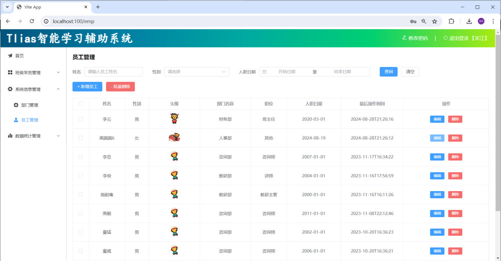
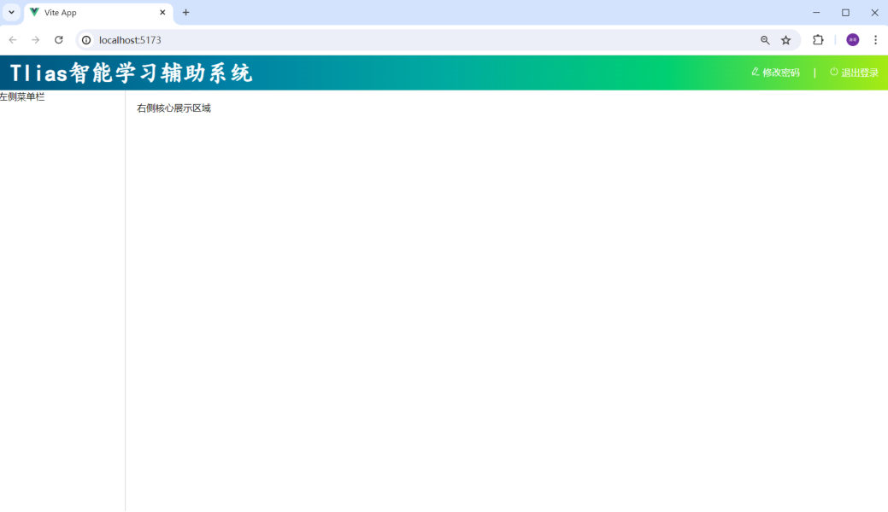
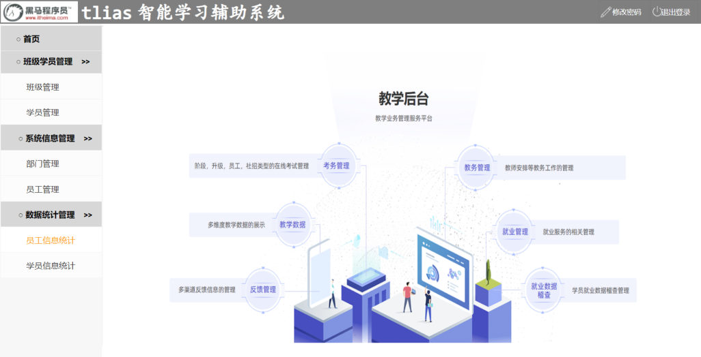
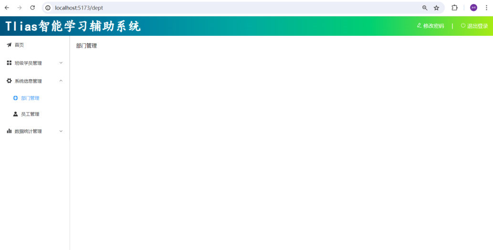
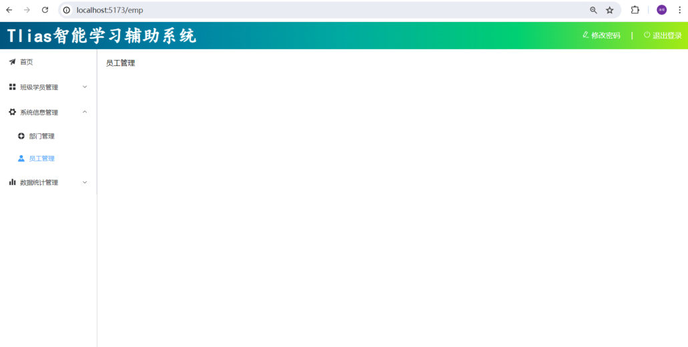
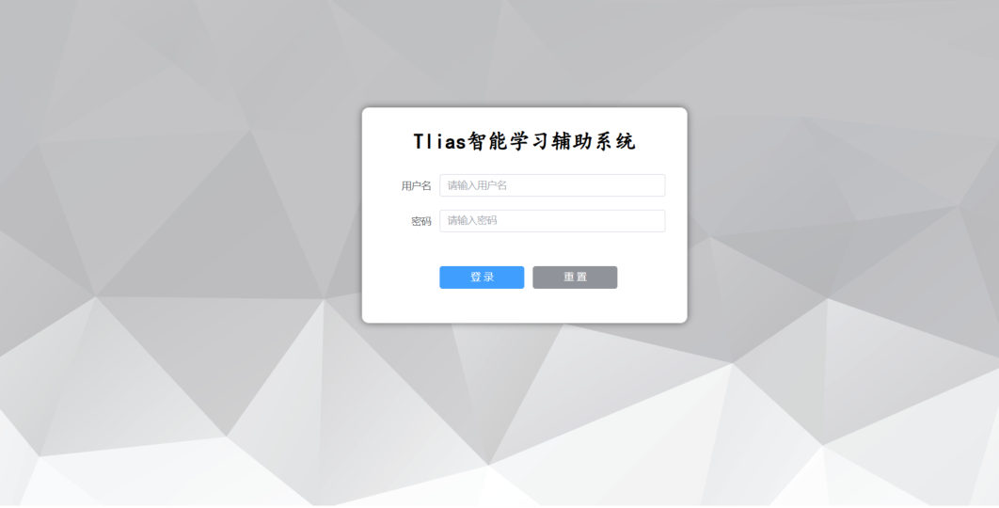
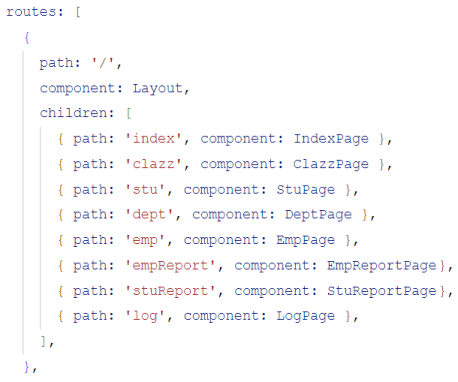
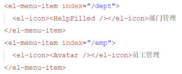

[97 篇](/posts/编程学习/javaweb学习笔记/97-elementplus组件库/)把 ElementPlus 的常用组件过了一遍，练手时都是**一个页面**；从这一篇开始，PPT 进入第 16 章——**用 Vue3 + ElementPlus 把 Tlias 这个项目的前端真正做出来**。第一个要解决的问题不是"某个组件怎么写"，而是"**一个多页面的后台系统，骨架是怎么搭起来的**"。

本章 PPT 一共 39 页（另外三节还有后续章节），我们按目录分成三篇笔记：

| PPT 页 | 内容 | 本篇对应小节 |
| --- | --- | --- |
| 1~9 | 案例全景、开发模式（前后端分离） | Tlias 前端实战要做什么、前后端分离开发 |
| 10~14 | 整体布局：准备工作、页面布局（左侧菜单） | 准备工作、页面布局 |
| 15~22 | 整体布局：动态菜单（Vue Router、嵌套路由） | 动态菜单、案例路由实现 |
| 23~31 | 部门管理：列表查询 | [99 篇](/posts/编程学习/javaweb学习笔记/99-部门管理-列表查询/) |
| 32~38 | 部门管理：新增、修改、删除 | 100 篇（后续） |

PPT 第 1~2 页是这一章的封面（**Web开发(AI)** → **Web前端实战(案例) · Tlias智能学习辅助系统**），从第 3 页起正式进入案例。PPT 第 5、6、10、11、15 页反复出现的那几张目录卡片（**开发模式 / 整体布局 / 部门管理 / 员工管理 / 登录退出**）就是本章的路线图：每讲完一块，卡片就点亮一张（第 6 页"开发模式 01"、第 11 页"整体布局 02"这类带序号的页就是分节页）。本篇负责前两张——**开发模式**和**整体布局**。

## 这章的 Tlias 前端实战要做什么（PPT 第 1~5 页）

PPT 第 4 页把整个案例拆成了七块：

| 模块 | 说明 |
| --- | --- |
| **开发模式** | 前后端分离（复习 + 本章怎么落地） |
| **整体布局** | 顶栏 + 左侧菜单 + 右侧主区域这套"壳" |
| **部门管理** | 列表查询、新增、修改、删除（本章的重头戏） |
| **员工管理** | 同样的套路，再做一遍 |
| **登录/退出** | 登录页 + 退出登录 |
| **班级管理** | （自己实现） |
| **学员管理** | （自己实现） |

前五块 PPT 会带着做一遍，最后两块标着"自己实现"——学完本章就是**照着前面做过的套路把它补全**，这是本章留的作业。

PPT 第 3~4 页贴的系统界面就是"做出来之后长什么样"：


*图：PPT 第 3~4 页的 Tlias 智能学习辅助系统界面——顶部一条渐变色的标题栏（左侧"Tlias智能学习辅助系统"，右侧"修改密码 / 退出登录"），左侧是能折叠的菜单（首页 / 班级学员管理 / 系统信息管理 / 数据统计管理，每个一级菜单下面还有二级菜单），右侧是主区域（这里显示的是**员工管理**页：搜索表单 + 新增/批量删除按钮 + 表格 + 每行"编辑 / 删除"）。**本篇要做的正是前两层（顶栏 + 菜单），99 篇做第三层的部门管理页***

注意它的布局特点：**顶栏横贯整页，下面左窄右宽**——这不是靠"手写 CSS 定位"拼出来的，而是 ElementPlus 的布局容器给的（PPT 第 13 页讲）。这个界面在 [12 篇](/posts/编程学习/javaweb学习笔记/12-实战-tlias员工管理页面/)见过一次，当时是用 HTML + CSS 手写的；现在换成"组件 + 路由"的工程做法，同一个界面就"活"起来了（能点菜单切页面）。

## 前后端分离开发（PPT 第 6~9 页）

### 前后端分离是什么

PPT 第 7 页的标题就是答案，配了一张三方协作的图：

> **当前最为主流的开发模式：前后端分离**

图里有三方角色和两组箭头：


*图：PPT 第 7 页里表示"前端开发"的那张图——一个装着 HTML / JS / CSS 的文件夹。前端这一侧拿到的是**原型 + 需求**，产出是页面（浏览器里跑的东西）*


*图：PPT 第 7 页里表示"后端开发"的那张图——一个装着 Java 的文件夹。后端这一侧拿到的是**接口文档**，产出是服务端程序（对外提供接口）*

两张图中间夹着**接口文档**，并且两侧各写着"阅读-开发"：

```text
         原型 + 需求                      接口文档
              │                              │
              ▼                              ▼
        ┌───────────┐     请求       ┌───────────┐
        │  前端开发  │ ───────────▶  │  后端开发  │
        │（页面/交互）│  ◀───────────  │（接口/数据）│
        └───────────┘     响应       └───────────┘
              ▲                              ▲
              └──────── 接口文档 ────────────┘
                    （两边都"阅读-开发"）
```

两边的**共同依据就是接口文档**：前端照着接口文档发请求、按文档里规定的结构解析响应；后端照着接口文档定义路径、参数、返回格式。**接口文档一改，两边都要跟着改**——所以它才是"合同"。

> [!NOTE]
> 这个模式在 [12 篇](/posts/编程学习/javaweb学习笔记/12-实战-tlias员工管理页面/)（做前端页面）和 [59 篇](/posts/编程学习/javaweb学习笔记/59-部门管理-前后端联调与反向代理/)（后端联调）已经见过：PPT 里前端和后端是**两拨人、两个工程**，靠 `资料\02. 接口文档`（Apifox 导出的在线/离线文档）约定好 `GET /depts` 这类接口。本章我们扮演**前端开发**，后端直接用前面章节写好的 `tlias-web-management` 工程。

### 开发的流程（PPT 第 8 页）

PPT 第 8 页在上一张图的基础上，把时间线补了上去，就是**前后端分离下的开发流程**：

```text
需求分析 ──▶ 接口定义 ──▶ 前后端并行开发 ──▶ 测试 ──▶ 前后端联调测试
```

| 阶段 | 谁在做 | 产出 |
| --- | --- | --- |
| **需求分析** | 产品/开发一起 | 原型 + 需求说明 |
| **接口定义** | 前后端一起定 | **接口文档**（路径、参数、响应结构） |
| **前后端并行开发** | 前端、后端**同时**做 | 前端照着文档写页面、后端照着文档写接口（前端这时用 Mock 假数据就能开工，[99 篇](/posts/编程学习/javaweb学习笔记/99-部门管理-列表查询/)细讲） |
| **测试** | 各自测 | 前端测交互、后端测接口 |
| **前后端联调测试** | 前后端一起 | 把真前端接到真后端上跑通（[59 篇](/posts/编程学习/javaweb学习笔记/59-部门管理-前后端联调与反向代理/)干过这件事） |

这条链子里最关键的是中间那步"**接口定义**"——它一定下来，前后端就可以**同时**开工，不用互相等：后端的接口还没写完，前端也能照文档先把页面和数据流做出来（[99 篇](/posts/编程学习/javaweb学习笔记/99-部门管理-列表查询/)会讲这时候怎么用假数据顶一阵）。

### 第 9 页的必答问答

PPT 第 9 页是这一节的问答页，两道题必须能立刻答出来：

| 问题 | 答案 |
| --- | --- |
| 什么是前后端分离开发模式？ | **前后端开发人员独立开发，独立部署** |
| 需求的开发流程？ | **需求分析 → 接口定义 → 前后端并行开发 → 测试 → 前后端联调测试** |

"独立开发、独立部署"这八个字里其实藏着两个"独立"：**开发时**两边各写各的工程（前端跑自己的 dev server、后端跑自己的服务），**部署时**也是两套——后端把 jar 包扔到服务器上，前端把打好的静态文件托管出去（第 19 章项目部署会见到）。所以本章的前端工程从头到尾**不需要把后端代码放进自己的目录**，只需要一个"地址"就能拿到数据。

## 准备工作：把基础工程跑起来（PPT 第 10~12 页）

PPT 第 12 页只有两句话，这一节的准备工作就这两步：

> 1. **导入资料中准备的基础工程到 VsCode**
> 2. **启动前端项目，访问该项目**

基础工程就是 `资料\03. 基础工程\vue-tlias-management.zip`，解压后用 VSCode 打开（[04 篇](/posts/编程学习/javaweb学习笔记/04-前端开发工具-vscode/)装过的 VSCode + Volar 插件这时候就派上用场了）。里面依赖已经写好，解压后装依赖、起服务：

```bash
npm install   # 装依赖（本机实测用了国内镜像 npm install --registry=https://registry.npmmirror.com 快一些）
npm run dev   # 启动开发服务器
```

本机实测启动后命令行输出：

```text
  VITE v3.2.10  ready in 469 ms

  ➜  Local:   http://localhost:5173/
```

浏览器打开 `http://localhost:5173`，页面上**只有顶栏是齐的**：


*图：本机实测基础工程刚跑起来的样子（也是 PPT 第 12、14 页那张图）——顶栏"Tlias智能学习辅助系统 + 修改密码 / 退出登录"已经做好，下面的**左侧是光秃秃的"左侧菜单栏"四个字、右侧是"右侧核心展示区域"四个字**。这两块占位文字就是接下来要动手改的地方*

底下这两句占位文字在工程里的位置一找就着：`src/views/layout/index.vue` 的模板里，`el-aside` 里写着"左侧菜单栏"、`el-main` 里写着"右侧核心展示区域"（下面会看到原样代码）。

> [!TIP]
> 本机实测的一个真实小坑（**排查"我看到的页面怎么不对"时先看这里**）：Vite 默认端口是 **5173**，但如果 5173 已经被别的工程占着，它会**自动换一个端口**（本机第一次启动时命令行出现过 `Port 5173 is in use, trying another one...`，然后跑到了 5174）。所以打开页面前先看命令行打印的 `Local:` 地址是哪个端口，别守着 5173 刷半天旧的页面。

工程里已经有的东西（包在基础工程里就装好了，`package.json` 里能看到）：`vue`、`vue-router`、`element-plus`、`@element-plus/icons-vue`、`axios`。其中 `vue-router` 就是这一篇后半段的主角。

## 页面布局：用 Container 布局容器搭骨架（PPT 第 13~14 页）

### 五个容器组件（PPT 第 13 页）

PPT 第 13 页给出的就是 ElementPlus 的**布局容器**，五个组件分工明确：

| 组件 | PPT 原文 | 作用 |
| --- | --- | --- |
| `<el-container>` | **外层容器** | 包住整页（或包住左 + 右那一行） |
| `<el-header>` | **顶栏容器** | 顶部一条（Tlias 那条渐变标题栏） |
| `<el-aside>` | **侧边栏容器** | 左侧竖条（放菜单） |
| `<el-main>` | **主要区域容器** | 右侧主内容（页面切换就换这里） |
| `<el-footer>` | **底栏容器** | 底部一条（Tlias 案例没用） |

PPT 第 13 页把五个标签画在了"一个页面"上，同时配了实际页面的样子：


*图：PPT 第 13~14 页对着的原型页面（从资料`01. 页面原型`里截的）——顶栏（黑马 tlias 标题 + 修改密码/退出登录）、左侧菜单（首页 / 班级学员管理 / 系统信息管理 / 数据统计管理，每组能展开）、右侧主区域（教学后台首页图）。**"整体布局"指的就是这副骨架；左侧菜单栏那个位置原来是几个字，现在要换成真正的菜单***

> [!NOTE]
> `el-container` 有个贴心规则：**里面直接放的是 `el-header` / `el-footer` 时，它自动竖着排；放的是 `el-aside` / `el-main` 时，自动横着排**。案例里正是用这条规则——外层 `el-container` 套一个 `el-header`（竖排：上顶栏、下主体），主体再套一层 `el-container`（横排：左菜单、右主区域）。

### 案例里的真实结构（layout/index.vue）

`src/views/layout/index.vue` 就是这套骨架的落点（课程工程的真实代码，加中文注释）：

```vue
<template>
  <div class="common-layout">
    <el-container>                          <!-- 外层容器：包住整页 -->
      <!-- 顶栏区域 -->
      <el-header class="header">
        <span class="title">Tlias智能学习辅助系统</span>
        <span class="right_tool">
          <a href="">
            <el-icon><EditPen /></el-icon> 修改密码 &nbsp;&nbsp;&nbsp; |  &nbsp;&nbsp;&nbsp;
          </a>
          <a href="">
            <el-icon><SwitchButton /></el-icon> 退出登录
          </a>
        </span>
      </el-header>

      <el-container>                        <!-- 内层容器：横向排"侧边栏 + 主区域" -->
        <!-- 左侧菜单 -->
        <el-aside width="200px" class="aside">
          <!-- 左侧菜单栏（下一节往里放 el-menu） -->
        </el-aside>

        <el-main>
          <!-- 右侧核心展示区域（下一节往里放 router-view） -->
        </el-main>
      </el-container>

    </el-container>
  </div>
</template>
```

配的样式（同样是课程代码，都在 `<style scoped>` 里）：

```css
.header {
  background-image: linear-gradient(to right, #00547d, #007fa4, #00aaa0, #00d072, #a8eb12);
}

.title {
  color: white;
  font-size: 40px;
  font-family: 楷体;
  line-height: 60px;
  font-weight: bolder;
}

.right_tool {
  float: right;       /* 右侧那一组工具链接靠右 */
  line-height: 60px;
}

a {
  color: white;
  text-decoration: none;   /* 去掉下划线 */
}

.aside {
  width: 220px;
  border-right: 1px solid #ccc;   /* 菜单和主区域之间那条竖线 */
  height: 730px;
}
```

顶栏那条渐变就是 `linear-gradient`（[06 篇](/posts/编程学习/javaweb学习笔记/06-css引入方式与颜色/)讲的背景色 + 渐变）；`<el-icon><EditPen /></el-icon>` 用的是 ElementPlus 的图标组件——图标能在模板里直接写（`<EditPen />`），是因为 `main.js` 里把整套图标**全局注册**了：

```js
import * as ElementPlusIconsVue from '@element-plus/icons-vue'

// 把图标库里的每个图标都注册成全局组件，模板里就能直接写 <EditPen />
for (const [key, component] of Object.entries(ElementPlusIconsVue)) {
  app.component(key, component)
}
```

（[97 篇](/posts/编程学习/javaweb学习笔记/97-elementplus组件库/)讲的 ElementPlus 快速入门只管了组件库本体，这段图标注册是**基础工程里额外加的**，看到 `<Promotion />`、`<Avatar />` 这类标签不认识的图标名，回来查这里即可。）

### 左侧菜单栏（PPT 第 14 页）

PPT 第 14 页叫"页面布局-左侧菜单"，就是把上面 `el-aside` 里的占位文字换成一个菜单组件；PPT 第 22 页又把它和路由连了起来。菜单的完整代码（`资料\04. 基础代码\01. 左侧菜单栏.vue`，直接放进 `el-aside` 里）：

```vue
<!-- 左侧菜单栏 -->
<el-menu router>                     <!-- router：点菜单项 = 跳到它 index 写的路径 -->
  <!-- 首页菜单 -->
  <el-menu-item index="/index">
    <el-icon><Promotion /></el-icon> 首页
  </el-menu-item>

  <!-- 班级管理菜单（二级菜单组） -->
  <el-sub-menu index="/manage">
    <template #title>                <!-- 一级标题插槽 -->
      <el-icon><Menu /></el-icon> 班级学员管理
    </template>
    <el-menu-item index="/clazz">
      <el-icon><HomeFilled /></el-icon>班级管理
    </el-menu-item>
    <el-menu-item index="/stu">
      <el-icon><UserFilled /></el-icon>学员管理
    </el-menu-item>
  </el-sub-menu>

  <!-- 系统信息管理 -->
  <el-sub-menu index="/system">
    <template #title>
      <el-icon><Tools /></el-icon>系统信息管理
    </template>
    <el-menu-item index="/dept">
      <el-icon><HelpFilled /></el-icon>部门管理
    </el-menu-item>
    <el-menu-item index="/emp">
      <el-icon><Avatar /></el-icon>员工管理
    </el-menu-item>
  </el-sub-menu>

  <!-- 数据统计管理 -->
  <el-sub-menu index="/report">
    <template #title>
      <el-icon><Histogram /></el-icon>数据统计管理
    </template>
    <el-menu-item index="/empReport">
      <el-icon><InfoFilled /></el-icon>员工信息统计
    </el-menu-item>
    <el-menu-item index="/stuReport">
      <el-icon><Share /></el-icon>学员信息统计
    </el-menu-item>
    <el-menu-item index="/log">
      <el-icon><Document /></el-icon>日志信息统计
    </el-menu-item>
  </el-sub-menu>
</el-menu>
```

三个要点：

- `<el-menu-item>` 是**一个菜单项**，`index` 属性写的是**路径**（`/dept`、`/emp`）；
- `<el-sub-menu>` 是**带子项的分组**（左侧带折叠箭头），它的名字写在 `<template #title>` 里；
- `<el-menu>` 上的 **`router` 属性**是关键：加上它之后，点菜单项就会**跳转到 `index` 对应的路径**（内部相当于 `router.push`），不用自己写点击事件。

本机实测这一条菜单的最终样子：一级菜单共四项（**首页 / 班级学员管理 / 系统信息管理 / 数据统计管理**），后三项展开后分别是 班级管理·学员管理、**部门管理·员工管理**、员工信息统计·学员信息统计·日志信息统计——和上面代码一一对应。

## 动态菜单：Vue Router（PPT 第 15~19 页）

### Vue 中的路由是什么（PPT 第 16~17 页）

PPT 第 17 页给了两句话：

> **Vue Router：Vue 的官方路由。为 Vue 提供富有表现力、可配置的、方便的路由。（https://router.vuejs.org/zh）**
>
> **Vue 中的路由：路径 与 组件 的对应关系。**

"路由"这个词在 Vue 里的含义就这么朴素：**什么路径，显示什么组件**。PPT 第 16~17 页配了三张浏览器截图，正好是"三个路径 → 三个组件"的现场：


*图：PPT 第 17 页的截图之一——地址栏是 `localhost:5173/dept`，左侧菜单里"部门管理"高亮，右侧主区域是部门管理页。路径 `/dept` 与"部门管理组件"是对应关系*


*图：同一张 PPT 的下一张截图——地址栏换成 `localhost:5173/emp`，菜单高亮换到"员工管理"，主区域换成员工管理页（这一章它还是空的，显示"员工管理"三个字）。**地址变了，显示的内容就跟着变，这就是路由**；而且顶栏和左侧菜单**没有重新加载**——因为它们不属于会变的那部分*

注意截图的另一个细节：**只有右侧主区域在变**。这解释了为什么"布局壳"要单独拎出来（`layout/index.vue`）——它是所有页面的"公共外壳"，变的只是壳里那一块。

### Vue Router 的三个核心组成部分（PPT 第 18 页）

PPT 第 18 页的原图是一张示意图，用 `/stu`、`/emp`、`/dept` 三个例子说明三者怎么配合：

```text
                 ┌──────────────── Router 实例（createRouter）────────────────┐
                 │  routes:                                                     │
                 │    /stu   →  /views/stu/index.vue                            │
                 │    /emp   →  /views/emp/index.vue                            │
                 │    /dept  →  /views/dept/index.vue                           │
                 └──────────────────────────────────────────────────────────────┘
                                          ▲ 更新
      路由请求                            │
   <router-link to='/emp'>员工管理</router-link> ──▶ <router-view></router-view>
    （路由链接组件，浏览器会解析成 <a>）                 （动态视图组件，按路径渲染对应组件）
```

| 组成部分 | PPT 原文 | 性质 |
| --- | --- | --- |
| **Router 实例** | 路由实例，基于 `createRouter` 函数创建，**维护了应用的路由信息** | 一张"路径 → 组件"的对照表（`routes`） |
| **`<router-link>`** | 路由链接组件，浏览器会解析成 **`<a>`** | 页面上的"链接"，点了就发路由请求 |
| **`<router-view>`** | 动态视图组件，用来**渲染展示与路由路径对应的组件** | 占位符：路由说该显示谁，它就在这儿把谁渲染出来 |

> [!NOTE]
> PPT 第 18 页还贴了一张命令行截图（`npm create vue@3.3.4` 建工程时的问答），其中 "Add Vue Router for Single Page Application development?" 这一问选的是 **No**——意思是**脚手架不会白送路由**。本章用的基础工程里已经装好了 `vue-router`（`package.json` 里是 `^4.1.5`），所以不用再装；自己从零建工程时，要么在这儿选 Yes，要么事后 `npm install vue-router@4`。


*图：PPT 第 18 页配的那张命令行截图——`npm create vue@3.3.4` 的交互式问答列表（TypeScript、JSX、Router、Pinia……全选了 No）。它说明的一件事：**路由是工程的"加选项"，不选就没有 `src/router/index.js`***

本机实测：课程的案例工程里，链接组件 `<router-link>` 其实**没有出现**——左侧菜单用的是更省事的 `el-menu router`（PPT 第 22 页那个方案），点菜单项直接跳路径，效果等价。三种东西里，`<router-view>` 和 Router 实例是**必须**的。

### 第 19 页的必答问答

| 问题 | 答案 |
| --- | --- |
| Vue 的路由指的是什么？ | **Vue Router 是 Vue 官方的路由，描述的是路径与组件的对应关系** |
| Vue Router 中的三个核心组成部分？ | **Router 实例**（维护了应用的路由信息 `routes`）；**`<router-link>`**（路由链接组件）；**`<router-view>`**（动态视图组件） |

## 案例路由实现：嵌套路由（PPT 第 20~22 页）

PPT 第 20~22 页把上面那套东西装进案例工程，一共四处改动：**根组件、布局壳、路由表、左侧菜单**。

### 第一步：根组件 App.vue 换成 `<router-view>`

基础工程里的 `src/App.vue` 长这样（"改之前"的样子）：

```vue
<script setup>
//引入views/layout/index.vue命名为Layout
import Layout from "@/views/layout/index.vue";
</script>

<template>
  <Layout></Layout>        <!-- 直接写死：整站永远显示这一个布局组件 -->
</template>
```

问题很明显：**整站被写死成了一个组件**，不管什么地址都显示"布局壳 + 占位文字"，页面切换无从谈起。PPT 第 21 页给出的第一个改动就是把它换成动态视图组件：

```vue
<!-- src/App.vue（改完之后） -->
<script setup>

</script>

<template>
  <router-view></router-view>       <!-- 这里显示谁，由当前路径决定 -->
</template>

<style scoped>

</style>
```

### 第二步：layout/index.vue 的 `el-main` 里再放一个 `<router-view>`（嵌套路由）

布局壳（`views/layout/index.vue`）本身就是"某个路径对应的组件"了，所以**它的 `el-main` 里还能再放一个 `<router-view>`**——用来渲染"壳里面那一块"该显示的页面：

```vue
<el-aside width="200px" class="aside">
  <!-- 左侧菜单栏（el-menu） -->
</el-aside>

<el-main>
  <router-view></router-view>      <!-- 子页面在这里渲染 -->
</el-main>
```

这就叫**嵌套路由**（PPT 第 21 页的关键词）：两层 `router-view` 套着用——

```text
App.vue 的 <router-view>            ← 第一层：路径 '/' → 渲染 LayoutView（布局壳）
        └─ LayoutView 的 <router-view>   ← 第二层：子路径 '/dept' → 渲染 dept/index.vue
                                            （顶栏、左侧菜单是外层，不受影响）
```

PPT 第 21 页给它配的画面是"壳 + 叶子页面"的组合，其中 `views/dept/index.vue`（子页面）现在**只是一个占位**：


*图：PPT 第 21 页里的一个子页面组件（`views/dept/index.vue`）——整页只有一个词"部门管理"。路由先把它接进 `el-main` 里，**内容留到 99 篇再填**；能显示这个词，就说明嵌套路由通了*

PPT 第 21 页还贴了另一个页面——**登录页**，它是"不套壳"的例子：


*图：PPT 第 21 页的登录页截图（`views/login/index.vue`，灰色几何背景 + 居中白卡片 + 用户名/密码/登录/重置）。它**没有顶栏也没有左侧菜单**——因为它在路由表里是**独立的一级路由** `/login`，不挂在布局壳下面。有登录页这个反例，嵌套路由的意思就清楚了：**"套壳"还是"不套壳"，由它在 routes 里挂在哪儿决定***

### 第三步：写路由表（PPT 第 22 页）

路由实例在 `src/router/index.js`（课程工程的真实代码）：

```js
import { createRouter, createWebHistory } from 'vue-router'

import IndexView from '@/views/index/index.vue'
import ClazzView from '@/views/clazz/index.vue'
import DeptView from '@/views/dept/index.vue'
import EmpView from '@/views/emp/index.vue'
import LogView from '@/views/log/index.vue'
import StuView from '@/views/stu/index.vue'
import EmpReportView from '@/views/report/emp/index.vue'
import StuReportView from '@/views/report/stu/index.vue'
import LayoutView from '@/views/layout/index.vue'
import LoginView from '@/views/login/index.vue'

const router = createRouter({
  history: createWebHistory(import.meta.env.BASE_URL),
  routes: [
    {
      path: '/',                  // 一级路径：整个布局壳
      name: '',
      component: LayoutView,
      redirect: '/index',         // 打开 '/' 时重定向到 '/index'（首页）
      children: [                 // 子路由：它们渲染在 LayoutView 的 <router-view> 里
        { path: 'index', name: 'index', component: IndexView },
        { path: 'clazz', name: 'clazz', component: ClazzView },
        { path: 'stu', name: 'stu', component: StuView },
        { path: 'dept', name: 'dept', component: DeptView },
        { path: 'emp', name: 'emp', component: EmpView },
        { path: 'log', name: 'log', component: LogView },
        { path: 'empReport', name: 'empReport', component: EmpReportView },
        { path: 'stuReport', name: 'stuReport', component: StuReportView },
      ]
    },
    { path: '/login', name: 'login', component: LoginView }   // 独立路由：不套布局壳
  ]
})

export default router
```


*图：PPT 第 22 页展示的 `routes` 写法——`path: '/'` 的组件是 `Layout`（布局壳），它下面用 `children` 挂了一串子路由（index / clazz / stu / dept / emp / empReport / stuReport / log）。**父子关系就是"壳"与"壳里那块"的关系**，这也是本机实测工程 `src/router/index.js` 的实际内容*

几个必须点明的细节：

| 写法 | 含义 |
| --- | --- |
| `createRouter({ ... })` | 创建 **Router 实例**（PPT 第 18 页说的那个"维护路由信息"的家伙） |
| `routes` | 路由表：路径 → 组件的对照关系 |
| `import ... from '@/views/...'` | 把每个页面组件**先 import 进来**再写进路由表（`@` = `src` 的别名，`vite.config.js` 里配的） |
| `children` | **子路由**：它们的路径会拼在父路径后面（`'dept'` + `'/'` = `/dept`），并且渲染在**父组件的 `<router-view>`** 里 |
| `redirect: '/index'` | **重定向**：访问 `/` 时自动跳到 `/index`（所以打开首页看到的是 IndexView，不是空白） |
| `{ path: '/login', ... }` | 独立路由（不在 `children` 里）：**不套布局壳**，整页显示登录页 |

> [!IMPORTANT]
> 路由表写完还差一步——**把 Router 实例"装"到应用上**。这一步在 `main.js` 里（基础工程已配好）：`app.use(router)`。有了它，`<router-view>` 才有"路由信息"可渲染。

### 第四步：左侧菜单与路径对上（PPT 第 22 页）

路由表里的路径，就是菜单项 `index` 属性的值：


*图：PPT 第 22 页贴的菜单代码片段——`<el-menu-item index="/dept">…部门管理</el-menu-item>` 和 `<el-menu-item index="/emp">…员工管理</el-menu-item>`。`index` 里写的 `/dept`、`/emp` **和路由表里的子路径同名**，点菜单项就等于跳转到那个路径（再靠 `<el-menu router>` 的属性自动完成跳转）*

到这里，"动态菜单"这个名字就能解释了：**菜单不是写死的八行字，而是"路径的入口"**——每一项指向一个路由，路由指向一个组件；菜单点谁，`el-main` 里的 `<router-view>` 就换成谁。要加一个新页面，就是"加一个组件 + 在 `routes` 里加一条 + 在菜单里加一项"，三处对应。

### 本机实测：路由到底通没通

本机实测（前端 dev server 跑在 5173，后端课程工程跑在 8081，`/api` 由 Vite 代理转发——这三个端口 [99 篇](/posts/编程学习/javaweb学习笔记/99-部门管理-列表查询/)会讲，这里是它的前置环境）：

- 打开 `http://localhost:5173/` → 左侧一级菜单四项：**首页 / 班级学员管理 / 系统信息管理 / 数据统计管理**；首页内容显示出来了，说明 `/` 的 `redirect: '/index'` 生效了；
- **直接访问 `http://localhost:5173/dept` 也能独立打开部门管理页**（菜单高亮自动落到"部门管理"）——说明"路径与组件的对应关系"真的在工作，不是只有点菜单才能进去；
- 工程的 `src/router/index.js` 里，`/` 指向带 `<router-view>` 的 `LayoutView`，`children` 里挂着 index/clazz/stu/dept/emp/log/empReport/stuReport **八个子路由**——这就是 PPT 第 21 页说的嵌套路由结构，实测工程里就是这个写法。

> [!TIP]
> 判断"嵌套路由有没有配错"有个笨办法但很快：把 `layout/index.vue` 的 `el-main` 里那行 `<router-view>` **临时删掉**，再点菜单——地址栏会照常变，但主区域**永远是空的**。地址变、主区域不变，说明路由通了而"渲染出口"没了；反过来，如果地址栏都不变，那要查的是菜单项的 `index` 或 `el-menu` 的 `router` 属性。

## 小结

| 问题 | 答案 |
| --- | --- |
| 本章的 Tlias 前端实战包括哪些模块？ | 开发模式、整体布局、部门管理、员工管理、登录/退出（**班级管理、学员管理标着"自己实现"**） |
| 什么是前后端分离开发？ | 前后端开发人员**独立开发、独立部署**；两边靠**接口文档**协作（原型+需求 → 前端，接口文档 → 后端），之间是"请求 / 响应" |
| 前后端分离的开发流程？ | **需求分析 → 接口定义 → 前后端并行开发 → 测试 → 前后端联调测试**；接口定义完就可以并行开工 |
| 准备工作两步？ | **导入资料里的基础工程到 VSCode**、**启动前端项目并访问**（本机实测 `npm install` + `npm run dev` → `http://localhost:5173`） |
| Container 布局容器有哪五个？ | `el-container` **外层容器**、`el-header` **顶栏容器**、`el-aside` **侧边栏容器**、`el-main` **主要区域容器**、`el-footer` **底栏容器**；案例结构是"外层 container 套 header + 内层 container（aside + main）" |
| 左侧菜单用什么搭？ | `el-menu`（加 `router` 属性就支持点菜单跳转）+ `el-menu-item`（一个菜单项，`index` 写路径）+ `el-sub-menu`（可折叠的分组，标题放 `<template #title>`） |
| Vue 的路由是什么？ | **路径与组件的对应关系**；Vue Router 是 Vue 官方路由 |
| Vue Router 三个核心组成部分？ | **Router 实例**（`createRouter` 创建，维护 `routes`）、**`<router-link>`**（路由链接组件，会解析成 `<a>`）、**`<router-view>`**（动态视图组件，按路径渲染对应组件） |
| 什么是嵌套路由？案例里在哪两层？ | 两级 `<router-view>` 套着用：`App.vue` 里的渲染**布局壳**（`/` → `LayoutView`），`layout/index.vue` 的 `el-main` 里那个渲染**子页面**（`children` 里的 `/dept`、`/emp`…）；顶栏和菜单是外层，主区域随路径变 |
| 本机实测验证了什么？ | 一级菜单四项；`/` 自动重定向到 `/index`；**直接访问 `/dept` 能独立打开**；`routes` 里 `/` + `children`（8 个子路由）+ 独立的 `/login` 就是嵌套路由结构 |

## 相关

- [上一篇：ElementPlus组件库](/posts/编程学习/javaweb学习笔记/97-elementplus组件库/)
- [下一篇：部门管理-列表查询](/posts/编程学习/javaweb学习笔记/99-部门管理-列表查询/)
- [实战-Tlias员工管理页面（同一个界面的 HTML+CSS 手写版）](/posts/编程学习/javaweb学习笔记/12-实战-tlias员工管理页面/)
- [部门管理-前后端联调与反向代理（后端那一侧的同一个项目）](/posts/编程学习/javaweb学习笔记/59-部门管理-前后端联调与反向代理/)
- [前端工程化与Vue项目（工程里那些目录与文件是怎么来的）](/posts/编程学习/javaweb学习笔记/95-前端工程化与vue项目/)

## 练习题

### 一、知识回顾（读完直接做下面的实践题）

1. **本章（第 16 章）案例包含七块**：开发模式、整体布局、部门管理、员工管理、登录/退出（这五块 PPT 带做）+ 班级管理、学员管理（标着"**自己实现**"）
2. **前后端分离开发模式**：前后端开发人员**独立开发、独立部署**；两边唯一的"合同"是**接口文档**（前端照它发请求、后端照它写接口），之间靠"请求 / 响应"沟通
3. **开发流程五步**：**需求分析 → 接口定义 → 前后端并行开发 → 测试 → 前后端联调测试**；接口一定下来，两边就能同时开工（前端这时可以先用 Mock 假数据）
4. **准备工作两步**：导入资料里的**基础工程**到 VSCode、**启动前端项目并访问**；本机实测命令是 `npm install` + `npm run dev`，跑在 `http://localhost:5173`（Vite 3.2.10）
5. **Container 布局容器**五个组件：`el-container` **外层容器**、`el-header` **顶栏容器**、`el-aside` **侧边栏容器**、`el-main` **主要区域容器**、`el-footer` **底栏容器**（案例没用 footer）
6. **案例的整体结构**是"外层 `el-container` 里放 `el-header`，再套一层 `el-container` 放 `el-aside` + `el-main`"：顶栏横贯整页，下面左菜单右主区域
7. **左侧菜单**用 `el-menu`（带 **`router`** 属性 → 点菜单项跳转到 `index` 里写的路径）+ `el-menu-item`（`index` 属性写路径）+ `el-sub-menu`（可折叠分组，标题写在 `<template #title>` 里）；菜单图标（`<Promotion />` 等）是 `main.js` 里**全局注册**的 ElementPlus 图标库
8. **Vue 的路由**指的是**路径与组件的对应关系**；Vue Router 是 Vue 的**官方路由**；三个核心组成部分是 **Router 实例**（`createRouter` 创建、维护 `routes`）、**`<router-link>`**（路由链接组件，解析成 `<a>`）、**`<router-view>`**（动态视图组件，按路径渲染组件）
9. **嵌套路由**：`App.vue` 的 `<router-view>` 渲染**布局壳**（`/` → `LayoutView`），`layout/index.vue` 的 `el-main` 里的 `<router-view>` 渲染**子页面**（`children` 里的 `/dept`、`/emp` 等）；`redirect: '/index'` 让访问 `/` 时跳到首页；`/login` 不在 `children` 里，所以**不套布局壳、整页显示**
10. **本机实测**：左侧一级菜单四项（首页 / 班级学员管理 / 系统信息管理 / 数据统计管理）；**直接访问 `http://localhost:5173/dept` 能独立打开部门管理页**；工程 `src/router/index.js` 里 `/` + `children`（index、clazz、stu、dept、emp、log、empReport、stuReport 八个子路由）+ 独立 `/login`，就是这个嵌套结构；Vite 的 5173 被占用时会**自动换端口**，排查"页面不是我改的那个"先看命令行打印的 `Local:` 地址

### 二、裸写题

- [ ] **2-1 用布局容器搭一个"顶栏 + 左菜单 + 右主区域"的三段骨架**
  要求：页面顶部是一条顶栏（左边写"Tlias智能学习辅助系统"，右边写"修改密码 | 退出登录"，整条用渐变色做背景）；下面分成左右两块——左边一条固定宽度的侧边栏（先只放一句"左侧菜单栏"占位），右边是主区域（先只放一句"右侧核心展示区域"占位）。主区域要能自动占满剩下的一整行宽度。

  > [!TIP]- 提示（先自己想，实在想不出再点开）
  > **一级 · 思路**：别自己算宽度——用布局容器：**外层容器负责"上下"、内层容器负责"左右"**。顶栏容器直接扔进外层容器里，侧边栏和主区域容器扔进内层容器里
  > **二级 · 方法**：`<el-container>` 会根据里面装的是"顶栏/底栏"还是"侧边栏/主区域"**自动决定竖排还是横排**；`<el-aside>` 用 `width="200px"` 指定宽度；样式写在 `<style scoped>` 里
  > **三级 · 骨架**：`<el-container>` → `<el-header class="header">…</el-header>` → 再一层 `<el-container>` → `<el-aside width="200px" class="aside">____</el-aside>` + `<el-main>____</el-main>`；顶栏渐变用 `background-image: linear-gradient(to right, #00547d, …)`
  >

  > [!TIP]- 参考答案（做完再点开）
  > ```vue
  > <script setup>
  >
  > </script>
  >
  > <template>
  >   <div class="common-layout">
  >     <el-container>                       <!-- 外层：上下排 -->
  >       <el-header class="header">         <!-- 顶栏 -->
  >         <span class="title">Tlias智能学习辅助系统</span>
  >         <span class="right_tool">修改密码 &nbsp;|&nbsp; 退出登录</span>
  >       </el-header>
  >
  >       <el-container>                     <!-- 内层：左右排 -->
  >         <el-aside width="200px" class="aside">   <!-- 侧边栏：固定宽 -->
  >           左侧菜单栏
  >         </el-aside>
  >         <el-main>                        <!-- 主区域：占满剩余宽度 -->
  >           右侧核心展示区域
  >         </el-main>
  >       </el-container>
  >     </el-container>
  >   </div>
  > </template>
  >
  > <style scoped>
  > .header {
  >   background-image: linear-gradient(to right, #00547d, #007fa4, #00aaa0, #00d072, #a8eb12);
  > }
  > .title { color: white; font-size: 40px; font-family: 楷体; font-weight: bolder; }
  > .right_tool { float: right; line-height: 60px; color: white; }
  > .aside { width: 220px; border-right: 1px solid #ccc; height: 730px; }
  > </style>
  > ```
  > 对照 PPT 第 13~14 页和课程工程 `src/views/layout/index.vue`。检查点：① 顶栏横贯整页（不是只占左边一块）；② 主区域自动占满右侧宽度；③ 把 `<el-aside>` 挪到内层 `el-container` 外面，布局立刻乱掉——验证"内层容器管左右"这件事。

- [ ] **2-2 写一份带二级分组的左侧菜单**
  要求：菜单分三组——第一组是单独的"首页"（路径 `/index`）；第二组叫"班级学员管理"（下面两项：班级管理 `/clazz`、学员管理 `/stu`）；第三组叫"系统信息管理"（下面两项：部门管理 `/dept`、员工管理 `/emp`）；点任意一项能跳到对应路径。

  > [!TIP]- 提示（先自己想，实在想不出再点开）
  > **一级 · 思路**：单个项用"菜单项"组件，分组用"子菜单"组件；"点了能跳转"这件事不用自己写事件，菜单组件有个属性打开它就行
  > **二级 · 方法**：`<el-menu router>`；`<el-menu-item index="/路径">`；分组用 `<el-sub-menu index="/随便一个分组标识">`，分组标题放 `<template #title>` 里；图标可加可不加（`<el-icon><Promotion /></el-icon>`）
  > **三级 · 骨架**：`<el-menu ____>` / `<el-menu-item ____="/index">首页</el-menu-item>` / `<el-sub-menu index="/manage"><template #____>班级学员管理</template><el-menu-item index="/clazz">____</el-menu-item>…</el-sub-menu>`

  > [!TIP]- 参考答案（做完再点开）
  > ```vue
  > <template>
  >   <el-menu router>
  >     <!-- 第一组：单个项 -->
  >     <el-menu-item index="/index">
  >       <el-icon><Promotion /></el-icon> 首页
  >     </el-menu-item>
  >
  >     <!-- 第二组：可折叠分组 -->
  >     <el-sub-menu index="/manage">
  >       <template #title>
  >         <el-icon><Menu /></el-icon> 班级学员管理
  >       </template>
  >       <el-menu-item index="/clazz">
  >         <el-icon><HomeFilled /></el-icon>班级管理
  >       </el-menu-item>
  >       <el-menu-item index="/stu">
  >         <el-icon><UserFilled /></el-icon>学员管理
  >       </el-menu-item>
  >     </el-sub-menu>
  >
  >     <!-- 第三组 -->
  >     <el-sub-menu index="/system">
  >       <template #title>
  >         <el-icon><Tools /></el-icon>系统信息管理
  >       </template>
  >       <el-menu-item index="/dept">
  >         <el-icon><HelpFilled /></el-icon>部门管理
  >       </el-menu-item>
  >       <el-menu-item index="/emp">
  >         <el-icon><Avatar /></el-icon>员工管理
  >       </el-menu-item>
  >     </el-sub-menu>
  >   </el-menu>
  > </template>
  > ```
  > 对照 PPT 第 14、22 页。检查点：① 三组显示正确、分组能折叠；② 地址栏随点击变成 `/dept`、`/emp`（说明 `router` 属性生效）；③ 把 `router` 属性删掉，点击地址栏就不再变了——这正是"菜单跳转"的原理。

- [ ] **2-3 写一份嵌套路由表**
  要求：有个布局壳组件（`views/layout/index.vue`）和四个页面组件（`views/index/index.vue`、`views/dept/index.vue`、`views/emp/index.vue`、`views/login/index.vue`）；要求——打开 `/` 时进入布局壳并**自动跳到 `/index`**；布局壳里能切换 `/index`、`/dept`、`/emp` 三个页面；登录页 `/login` **不套布局壳、整页显示**。

  > [!TIP]- 提示（先自己想，实在想不出再点开）
  > **一级 · 思路**：把"套壳的页面"写成布局壳的**子路由**（它们渲染在壳内部的出口里），把"不套壳的"写成**和壳平级**的一级路由
  > **二级 · 方法**：`createRouter` + `createWebHistory`；壳路由用 `component` + **`children`** + **`redirect`** 三件套；子路由的 `path` **不带斜杠**（拼接用）；页面组件先 `import` 再写进 `routes`
  > **三级 · 骨架**：`import { ____, createWebHistory } from 'vue-router'` / `const router = ____({ history: createWebHistory(), routes: [ { path: '/', component: ____, redirect: '/index', ____: [ {path:'index', component: ____} … ] }, {path:'/login', component: ____} ] })` / `export default ____`

  > [!TIP]- 参考答案（做完再点开）
  > ```js
  > // src/router/index.js
  > import { createRouter, createWebHistory } from 'vue-router'
  >
  > import LayoutView from '@/views/layout/index.vue'   // 布局壳
  > import IndexView from '@/views/index/index.vue'
  > import DeptView from '@/views/dept/index.vue'
  > import EmpView from '@/views/emp/index.vue'
  > import LoginView from '@/views/login/index.vue'
  >
  > const router = createRouter({
  >   history: createWebHistory(import.meta.env.BASE_URL),
  >   routes: [
  >     {
  >       path: '/',                 // 布局壳（一级路由）
  >       component: LayoutView,
  >       redirect: '/index',        // 打开 '/' 自动跳首页
  >       children: [                // 子路由：渲染在 LayoutView 的 <router-view> 里
  >         { path: 'index', name: 'index', component: IndexView },
  >         { path: 'dept', name: 'dept', component: DeptView },
  >         { path: 'emp', name: 'emp', component: EmpView },
  >       ]
  >     },
  >     { path: '/login', name: 'login', component: LoginView }   // 独立路由：不套壳
  >   ]
  > })
  >
  > export default router
  > ```
  > 配套的两处"出口"：`App.vue` 的模板写 `<router-view></router-view>`；`layout/index.vue` 的 `<el-main>` 里再写一个 `<router-view></router-view>`。检查点：① 打开 `/` 地址栏变成 `/index`；② 直接访问 `/dept`、`/emp` 都能进（顶栏还在）；③ 访问 `/login` 时**没有**顶栏和菜单。

- [ ] **2-4 排查：菜单点了没反应 / 主区域永远是空的**
  下面这几种"症状"分别说明哪里有问题？各改一句话就好。
  ① 点左侧菜单，**地址栏完全没变**；
  ② 地址栏变成 `/dept` 了，但右侧主区域**一直是"右侧核心展示区域"这句占位文字**；
  ③ 访问 `/dept` 整页变成**一片白**，顶栏和菜单都不见了。

  > [!TIP]- 提示（先自己想，实在想不出再点开）
  > **一级 · 思路**：三句话对三个原因——"跳不跳"看菜单组件有没有开跳转开关；"变了不变"看壳里有没有渲染出口；"整页白"看这个路径挂在哪一级（挂错了就不套壳、也就没有顶栏），以及组件有没有 import 错
  > **二级 · 方法**：① 给 `<el-menu>` 加 `router` 属性（或检查 `el-menu-item` 的 `index` 写没写路径）；② 在 `layout/index.vue` 的 `<el-main>` 里放 `<router-view></router-view>`（把占位文字顶掉）；③ 检查 `routes` 里 `/dept` 是不是写成了**一级路由**（应当写在壳的 `children` 里），顺带确认组件 import 路径没写错
  > **三级 · 骨架**：① `<el-menu ____>`；② `<el-main>____</el-main>`；③ `children: [ { path: '____', component: ____ } ]`

  > [!TIP]- 参考答案（做完再点开）
  > | 症状 | 原因 | 改法 |
  > | --- | --- | --- |
  > | ① 地址栏不变 | `<el-menu>` 少了 **`router`** 属性（菜单项只是"显示项"，不会自己跳转） | 写成 `<el-menu router>` |
  > | ② 地址变了、主区域还是占位文字 | 布局壳的 `<el-main>` 里**没有 `<router-view>`**（子路由没有"渲染出口"） | 把占位文字换成 `<router-view></router-view>` |
  > | ③ 整页白（顶栏菜单都没了） | `/dept` 被写成了**一级路由**（和 `/login` 平级），于是整页只渲染部门管理组件，**不套布局壳**；另外要确认组件 import 的路径拼写正确 | 把这条路由挪进壳路由的 `children` 里（`path: 'dept'`，不带斜杠） |
  >
  > 一句话总结：**"能不能跳"看菜单的 `router`，"跳到哪儿显示"看 `<router-view>`，"要不要顶栏菜单"看路由挂在 `children` 里还是平级**。

### 三、综合题

- [ ] **3-1 照着课程案例做一遍"整体布局 + 动态菜单"**
  分步做（顺序和 PPT 第 12~22 页一致）：
  1. 解压资料里的基础工程，用 VSCode 打开，装依赖、起服务，浏览器打开命令行提示的地址——先看清"改之前"的样子（顶栏 + 两句占位文字）
  2. 打开 `src/views/layout/index.vue`，确认它的骨架是"外层容器装顶栏，内层容器装侧边栏和主区域"（这一段基础工程已经写好了，读懂它）
  3. 在侧边栏容器里放进带二级分组的菜单：首页 / 班级学员管理（班级管理、学员管理）/ 系统信息管理（部门管理、员工管理）/ 数据统计管理（员工信息统计、学员信息统计、日志信息统计），并让它支持"点菜单跳路径"
  4. 在 `src/views` 下准备好每个菜单对应的页面组件（先用只写一句文字的占位组件就行，比如"部门管理"）
  5. 把根组件 `App.vue` 里"写死的布局组件"换成动态视图组件
  6. 在布局壳的主区域里放上第二个动态视图组件（这样它才能渲染子页面）
  7. 写路由表：`/` 指向布局壳并重定向到 `/index`；八个页面写成它的子路由；登录页写成独立路由
  8. 浏览器验证：打开根地址自动进首页；点菜单能在各页面之间切换；**手动输入 `/dept` 也能直接进**；访问 `/login` 没有顶栏和菜单

  > [!TIP]- 提示（先自己想，实在想不出再点开）
  > **一级 · 思路**：整题只有两条线——**"壳"决定不变的部分，"路由"决定变的部分**。壳的出口是主区域里那个 `<router-view>`；路由表决定"哪个路径由谁渲染"
  > **二级 · 方法**：布局容器 `el-container` / `el-header` / `el-aside` / `el-main`；菜单 `el-menu router` + `el-menu-item index` + `el-sub-menu`；出口 `<router-view>`（两处：根组件、布局壳）；路由表 `createRouter` + `createWebHistory` + `routes` + `children` + `redirect`
  > **三级 · 骨架**：`App.vue` 的模板只留 `<router-view></router-view>`；布局壳主区域放 `<router-view></router-view>`；路由表 `{ path:'/', component: LayoutView, redirect:'/index', children:[ {path:'index',…}, {path:'dept',…} … ] }` + `{ path:'/login', … }`

  > [!TIP]- 参考答案（做完再点开）
  > ① `src/App.vue`：
  >
  > ```vue
  > <script setup>
  >
  > </script>
  >
  > <template>
  >   <router-view></router-view>
  > </template>
  >
  > <style scoped>
  > </style>
  > ```
  >
  > ② `src/views/layout/index.vue` 的关键两行（其余照基础工程原样保留）：
  >
  > ```vue
  > <el-aside width="200px" class="aside">
  >   <el-menu router>            <!-- 第 3 步的菜单整段放这儿 -->
  >     <!-- …八个菜单项… -->
  >   </el-menu>
  > </el-aside>
  >
  > <el-main>
  >   <router-view></router-view>  <!-- 子页面的渲染出口 -->
  > </el-main>
  > ```
  >
  > ③ `src/router/index.js`：
  >
  > ```js
  > import { createRouter, createWebHistory } from 'vue-router'
  >
  > import IndexView from '@/views/index/index.vue'
  > import ClazzView from '@/views/clazz/index.vue'
  > import StuView from '@/views/stu/index.vue'
  > import DeptView from '@/views/dept/index.vue'
  > import EmpView from '@/views/emp/index.vue'
  > import LogView from '@/views/log/index.vue'
  > import EmpReportView from '@/views/report/emp/index.vue'
  > import StuReportView from '@/views/report/stu/index.vue'
  > import LayoutView from '@/views/layout/index.vue'
  > import LoginView from '@/views/login/index.vue'
  >
  > const router = createRouter({
  >   history: createWebHistory(import.meta.env.BASE_URL),
  >   routes: [
  >     {
  >       path: '/',
  >       component: LayoutView,
  >       redirect: '/index',
  >       children: [
  >         { path: 'index', name: 'index', component: IndexView },
  >         { path: 'clazz', name: 'clazz', component: ClazzView },
  >         { path: 'stu', name: 'stu', component: StuView },
  >         { path: 'dept', name: 'dept', component: DeptView },
  >         { path: 'emp', name: 'emp', component: EmpView },
  >         { path: 'log', name: 'log', component: LogView },
  >         { path: 'empReport', name: 'empReport', component: EmpReportView },
  >         { path: 'stuReport', name: 'stuReport', component: StuReportView },
  >       ]
  >     },
  >     { path: '/login', name: 'login', component: LoginView }
  >   ]
  > })
  >
  > export default router
  > ```
  >
  > ④ 占位页面组件（每个目录下都这么写，改文字即可）：
  >
  > ```vue
  > <script setup>
  >
  > </script>
  >
  > <template>
  >   部门管理
  > </template>
  >
  > <style scoped>
  > </style>
  > ```
  >
  > 检查点：
  > 1. 打开根地址，地址栏自动变 `/index`，主区域显示首页（课程工程里是一张 `index.png` 图）；
  > 2. 点"系统信息管理 → 部门管理"，地址栏变 `/dept`、主区域显示"部门管理"——**顶栏和菜单不闪不重载**（这就是嵌套路由的效果）；
  > 3. 手动输入 `http://localhost:5173/emp` 也能直接进去；
  > 4. 访问 `/login`：整页只有登录卡片，没有顶栏和菜单；
  > 5. 把某个菜单项的 `index` 值临时改成一个**路由表里不存在的路径**（比如 `/deptt`）再点它——地址栏会照常变、主区域却空白。这正好说明分工：**菜单只管"路径"，路由表才管"路径对应谁"**（试完记得改回来）。
  > 做完这一题，[99 篇](/posts/编程学习/javaweb学习笔记/99-部门管理-列表查询/)就往 `/dept` 这个占位页面里填真正的内容（表格 + 数据）。
