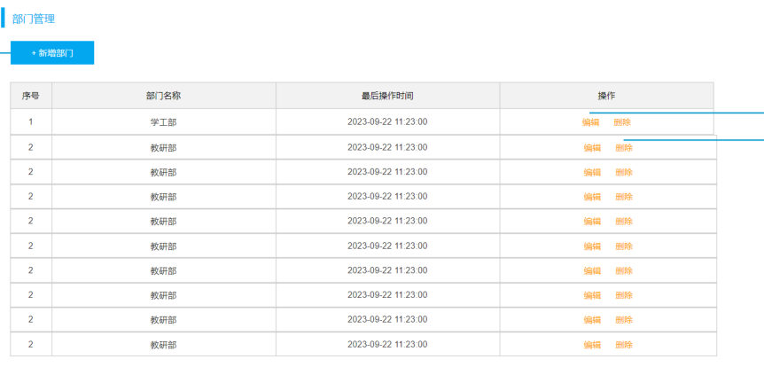
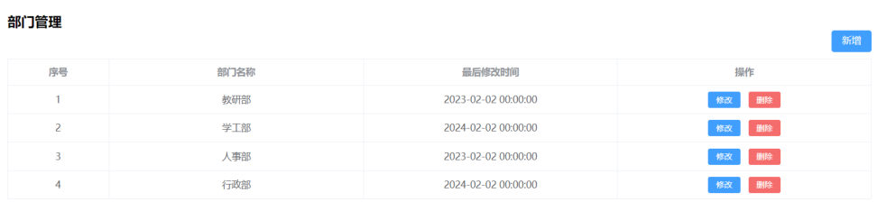
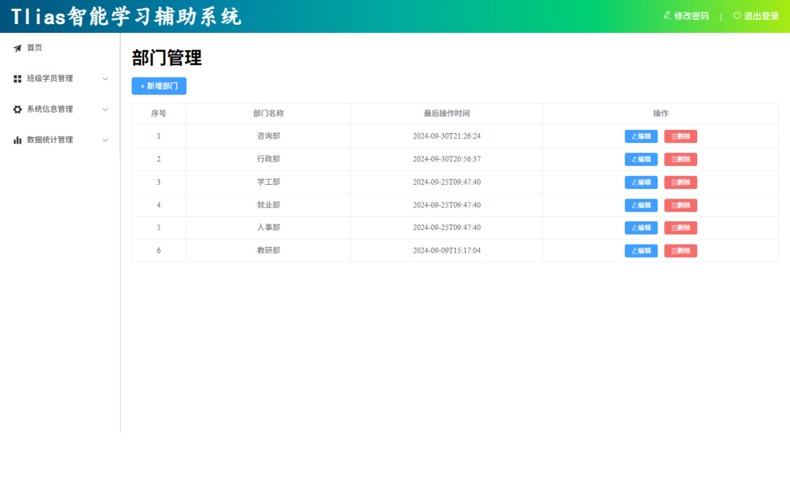

[98 篇](/posts/编程学习/javaweb学习笔记/98-前后端分离与整体布局/)把外壳搭完了：点左侧菜单的"部门管理"，地址栏变成 `/dept`，右侧主区域也能切到 `views/dept/index.vue`——只是那个页面**只有一个孤零零的"部门管理"四个字**。这一篇（PPT 第 23~31 页）开始往里面填真东西：**把部门列表查出来、显示在表格里**。

| PPT 页 | 内容 | 本篇对应小节 |
| --- | --- | --- |
| 23~24 | 部门管理：目录页（列表查询 / 新增 / 修改 / 删除） | 部门管理的功能清单 |
| 25 | 列表查询-页面布局（Button + Table） | 先照原型把布局搭出来 |
| 26~27 | 列表查询-加载数据（onMounted + axios） | 打开页面就自动加载数据 |
| 28 | 直接在组件里发请求有什么问题 | 两个毛病 |
| 29~31 | 列表查询-程序优化（request.js / api / 代理） | 程序优化三件套 |

## 部门管理的功能清单（PPT 第 23~24 页）

PPT 第 23 页是"部门管理"这一块的分节页（目录卡片上"部门管理"那张被点亮了），第 24 页把这一块拆成四个功能（**列表查询 / 新增部门 / 修改部门 / 删除部门**，都挂在"03 部门管理"这个序号下）：

```text
部门管理 ──┬── 列表查询    ← 本篇（先有表，才谈得上增删改）
           ├── 新增部门    ← 100 篇
           ├── 修改部门    ← 100 篇
           └── 删除部门    ← 100 篇
```

顺序不能乱：**列表查询是地基**。后面三个功能做完，都要回头调一次"查全部部门"把表格刷新一遍（新增完刷新、改完刷新、删完刷新）——所以列表查询这条链路必须先通。

> [!NOTE]
> 这四个功能对应的后端接口，早在第 7~13 章就写好了（`GET /depts`、`POST /depts`、`PUT /depts`、`DELETE /depts?id=`、`GET /depts/{id}`，见 [58 篇](/posts/编程学习/javaweb学习笔记/58-部门管理-查询部门/)）。本章我们只做前端：**后端一行不动，前端把页面做出来。**

## 列表查询-页面布局：先照原型把"壳"搭出来（PPT 第 25 页）

PPT 第 25 页的第一句话是这一节的起手式：

> **根据页面原型、需求说明、接口文档，先完成页面的基本布局。**

然后在页面布局这一页明说了用哪两个组件：

> **Button按钮组件 / Table表格组件**

页面的"样子"由**页面原型**说了算（`资料\01. 页面原型\`），字段名和数据由**接口文档**说了算（`资料\02. 接口文档\`）：


*图：PPT 第 25 页贴的页面原型（还带着设计工具的选择框）——标题"部门管理"，标题下一个"+ 新增部门"按钮，再下面是四列表格：**序号 / 部门名称 / 最后操作时间 / 操作**（操作列是两个文字链接"编辑 / 删除"）。表里的数据是原型里的占位数据（连着好几行都是"教研部"），这一节只要照着它把**布局**做出来*

列表查询要用的接口（来自接口文档，`资料\02. 接口文档`）：

| 项目 | 内容 |
| --- | --- |
| 请求 | **GET `/depts`** |
| 说明 | 查询所有部门 |
| 响应 | `{ "code": 1, "msg": "success", "data": [ { "id": 1, "name": "教研部", "createTime": "...", "updateTime": "..." } ] }` |

也就是那个熟悉的 `Result` 结构（[21 篇](/posts/编程学习/javaweb学习笔记/21-axios异步请求/)讲过）：`code` 是 1 表示成功，**部门数组装在 `data` 里**，每个部门有 `id`、`name`、`createTime`、`updateTime` 四个字段。

按原型搭出来的模板（课程工程 `src/views/dept/index.vue` 的模板部分，加中文注释）：

```vue
<template>
  <h1>部门管理</h1>
  <div class="container">
    <!-- 按钮组件：新增部门 -->
    <el-button type="primary" @click="addDept"> + 新增部门</el-button>
  </div>

  <!-- 表格组件：:data 绑定的就是这张表要显示的数据 -->
  <div class="container">
    <el-table :data="deptList" border style="width: 100%">
      <!-- 序号列：type="index" 让表格自己从 1 开始编号，不用后端给 -->
      <el-table-column type="index" label="序号" width="100" align="center"/>
      <!-- 部门名称列：prop 写的是"数据对象里的字段名" -->
      <el-table-column prop="name" label="部门名称" width="300" align="center"/>
      <!-- 最后操作时间列 -->
      <el-table-column prop="updateTime" label="最后操作时间" width="350" align="center"/>
      <!-- 操作列：没有现成字段可用，用自定义列插槽自己写 -->
      <el-table-column label="操作" align="center">
        <template #default="scope">
          <el-button type="primary" size="small" @click="edit(scope.row.id)">
            <el-icon><EditPen /></el-icon> 编辑
          </el-button>
          <el-button type="danger" size="small" @click="delById(scope.row.id)">
            <el-icon><Delete /></el-icon> 删除
          </el-button>
        </template>
      </el-table-column>
    </el-table>
  </div>
</template>

<style scoped>
.container {
  margin: 15px 0px;    /* 按钮那一行、表格上下留点空隙 */
}
</style>
```

几个和 97 篇对得上的点：

| 写法 | 意思 |
| --- | --- |
| `<el-button type="primary">` | 按钮组件，`type` 决定颜色（`primary` 蓝、`danger` 红），[97 篇](/posts/编程学习/javaweb学习笔记/97-elementplus组件库/)见过这两种 |
| `<el-table :data="deptList" border>` | 表格组件，**`:data` 绑定的数组就是表格的数据源**；`border` 给表格加边框 |
| `<el-table-column prop="name" label="部门名称">` | 一列：`label` 是表头文字，`prop` 是"取数据对象里的哪个字段" |
| `type="index"` | 这一列不取字段，而是**自动生成序号**（1、2、3……） |
| `<template #default="scope">` | **自定义列**：不显示某个字段，而是自己写内容；`scope.row` 就是当前这一行的数据对象（所以 `scope.row.id` 能拿到部门 id） |

> [!TIP]
> 这一步的做法和 [97 篇](/posts/编程学习/javaweb学习笔记/97-elementplus组件库/)讲的一模一样——**去 ElementPlus 官方文档把表格、按钮的示例代码复制过来，把数据换成自己的**。原型里的橙色文字链接"编辑 / 删除"，在组件库里有现成的按钮组件，就直接换成 `<el-button>`（蓝色"编辑"、红色"删除"）。
>
> 操作列里那两个按钮的**点击事件（`addDept`、`edit`、`delById`）在这一篇里暂时没有实现**——它们分别是 100 篇的新增、修改、删除；现在先把按钮摆上去，让布局完整。

## 列表查询-加载数据：打开页面就自动有数据（PPT 第 26~27 页）

PPT 第 26 页的需求一句话说完：

> **根据需求，需要在打开页面之后，需要自动加载全部部门数据，展示在表格中。**

做出来之后的效果是"表格里自动出现几行部门"：


*图：PPT 第 26 页给的目标效果——表格里 4 行部门数据（教研部 / 学工部 / 人事部 / 行政部），右上角还有"新增"按钮、每行有"修改 / 删除"按钮。**这些数据不是写在页面里的，是打开页面后自动从接口加载来的**（这张截图来自原型/需求说明，最终做出来的页面表和按钮的文字略有不同，见本篇末尾的本机实测）*

PPT 第 27 页点明要用两样东西：

> **钩子函数 onMounted / Axios 发送异步请求**

拆开说就是：**"页面加载完毕"这件事用 `onMounted` 捕获**（[96 篇](/posts/编程学习/javaweb学习笔记/96-vue项目开发流程与组合式api/)讲过它是组件挂载完成后执行的回调），**"拿数据"这件事用 axios**（[21 篇](/posts/编程学习/javaweb学习笔记/21-axios异步请求/)）。课程工程里的真实代码：

```js
import { ref, onMounted } from 'vue';
import { queryAllApi } from '@/api/dept';     // 这个 api 文件是"程序优化"里封装的，先看效果

// 表格的数据源：一个装着部门数组的响应式变量
const deptList = ref([])

// 查询：调 api 拿数据，塞进 deptList
const search = async () => {
  const result = await queryAllApi();
  if (result.code) {          // code 为 1 表示成功
    deptList.value = result.data;   // 把部门数组交给表格
  }
}

// 钩子函数：组件挂载完成后执行 → 页面一打开就自动查一次
onMounted(() => {
  search();
})
```

配合前面模板里的 `:data="deptList"`，整条"数据链路"就通了：**页面挂载 → `onMounted` 触发 `search()` → 请求接口 → 拿到数组 → 赋给 `deptList` → 表格自动渲染**。

> [!IMPORTANT]
> 注意 `result.data` 这一层的写法。在 [21 篇](/posts/编程学习/javaweb学习笔记/21-axios异步请求/)里，解析响应要写 **`result.data.data`**（`result.data` 是响应体，再一层 `.data` 才是业务数据）；而这里写的是 **`result.data`**——少了一层。原因是本项目用了**响应拦截器**（下一节的 request.js），它已经把"响应体"那一层剥掉了，所以 `result` 直接就是后端的 `Result` 对象（`result.code`、`result.msg`、`result.data`）。**这两个写法别混着抄**，混了就一定是"表格空白"。

### 前后端并行开发时，前端怎么测接口（PPT 第 26 页）

PPT 第 26 页在这一节夹了一个很实际的问题：

> **前后端分离开发模式中，前后端是并行开发的，前端如何进行接口请求测试？**

给的两个答案：

| 办法 | 说明 |
| --- | --- |
| **Mock.js 来生成测试的假数据** | 前端自己造"假数据"（一个专门造假数据的工具库），不用等后端 |
| **基于 Apifox 提供的 Mock 服务进行测试** | 接口文档工具 Apifox 会**按接口定义自动生成一个可访问的 Mock 地址**，前端直接请求它就拿到符合结构的假数据 |

为什么需要这个？因为[前后端并行开发](/posts/编程学习/javaweb学习笔记/98-前后端分离与整体布局/)的特点就是**前端开工时后端接口往往还没写完**：前端的页面、数据流不能卡在这里等。所以先用 Mock 地址顶上——**只要假数据的结构和接口文档一致，将来把地址一换就能无缝切到真接口**。

PPT 第 28 页（下一节）贴的那行代码就是 Apifox Mock 的典型样子：

```js
const result = await axios.get('https://apifoxmock.com/m1/3128855-default/depts');
```

`apifoxmock.com` 这个域名一看就知道：它是 Apifox 按项目（`3128855`）生成的一条 Mock 地址，路径 `/depts` 和真接口一致。

> [!TIP]
> 本机实测走的是**真链路**，没用 Mock：前端 5173 → Vite 代理 `/api` → 课程后端（本机跑在 **8081**）→ MySQL 的 `tlias.dept` 表。但要知道"切地址"这一步有多轻——**只改 `request.js` 里 `baseURL` 这一个地方**（Mock 阶段写 Mock 地址，联调阶段写成 `/api` 走代理），组件里的业务代码一个字都不用动。这正是下面这一节"程序优化"要干的事。

## 直接在组件里发请求的两个毛病（PPT 第 28 页）

PPT 第 28 页先给了一段"最朴素的写法"（就写在 `dept/index.vue` 里）：

```js
const search = async () => {
  const result = await axios.get('https://apifoxmock.com/m1/3128855-default/depts');
  if (result.data.code) {
    deptList.value = result.data.data;
  }
};
```

能跑，但 PPT 指出两个问题：

| 问题 | 具体表现 |
| --- | --- |
| **请求路径难以维护** | 地址**直接写在组件里**（`https://apifoxmock.com/...`）。将来换成真接口要改、地址变了要改、同一个接口被多个组件用到就要**改好几处**；而且这么长一串 URL 散落在各个 `.vue` 文件里，看代码时也不知道项目到底有哪些接口 |
| **数据解析繁琐** | 每次都要按 axios 的响应结构**逐层往里剥**（`result.data.code` 判断、`result.data.data` 取数），页面上只要有十个请求，就要重复十遍这套解析；哪天后端换了包装结构，十处都得改 |

一句话总结：**"从哪个地址取数"和"取回来的东西怎么剥"这两件杂事，被塞进了每一个业务函数里**。所以要把它们抽出去——这就是所谓的**程序优化**。

## 列表查询-程序优化三件套（PPT 第 29~31 页）

PPT 第 29 页的原话：

> **为解决上述问题，我们在前端项目开发时，通常会定义一个请求处理的工具类 – request.js。**
>
> **与服务端进行异步交互的逻辑，通常会封装到一个单独的 api 中，如：dept.js。**

再加上第 30 页的代理配置，就是"**程序优化三件套**"：

```text
① utils/request.js    统一"怎么发请求"   （axios 实例：baseURL、timeout + 响应拦截器）
② api/dept.js         统一"有哪些接口"   （按业务模块封装，一个函数一个接口）
③ vite.config.js      统一"请求发给谁"   （代理规则：/api → 后端 8080）
```

### ① `utils/request.js`：axios 实例 + 响应拦截器

把"发请求这件事"封成一个工具类（课程代码）：

```js
import axios from 'axios'

//创建axios实例对象
const request = axios.create({
  baseURL: '/api',        // 所有请求的公共前缀（PPT 里这里是 Mock 地址）
  timeout: 600000         // 超时时间（毫秒）
})

//axios的响应 response 拦截器
request.interceptors.response.use(
  (response) => { //成功回调
    return response.data          // 剥掉"响应体"那一层：业务代码直接拿到 Result 对象
  },
  (error) => { //失败回调
    return Promise.reject(error)  // 出错了继续往外抛，交给调用方处理
  }
)

export default request
```

两个东西各解决一个问题：

| 代码 | 解决的问题 |
| --- | --- |
| `axios.create({ baseURL: '/api', timeout: 600000 })` | **创建 axios 实例**：以后用它发请求，路径里只写 `/depts` 这种"接口名"，公共前缀由 `baseURL` 统一拼。**换环境（Mock ↔ 真后端）只改这一行** |
| `request.interceptors.response.use(成功回调, 失败回调)` | **响应拦截器**：在"响应回到组件之前"先加工一遍。成功回调里 `return response.data`，于是组件里**不用再写 `result.data.data`**，直接 `result.code` / `result.data` |

> [!NOTE]
> PPT 第 29~30 页里，`baseURL` 写的还是 `https://apifoxmock.com...`（那时配的是 Mock 地址）；本机实测的课程工程里已经改成 **`/api`**（配代理走真后端了）。**这两种写法是同一条思路的两个阶段**——先用 Mock 地址让前端能独立开发，再用 `/api` 交给代理转发。`timeout: 600000` 是 600 秒（10 分钟），长得离谱但对后台系统来说只是"别随便断开"，照抄即可。

### ② `api/dept.js`：按模块封装接口

再把"部门这个模块有哪些接口"集中到一个文件里（课程代码，一篇笔记里能一次看全整个部门的接口）：

```js
import request from "@/utils/request";

//查询全部部门数据
export const queryAllApi = () =>  request.get('/depts');

//新增
export const addApi = (dept) =>  request.post('/depts', dept);

//根据ID查询
export const queryByIdApi = (id) =>  request.get(`/depts/${id}`);

//修改
export const updateApi = (dept) =>  request.put('/depts', dept);

//删除
export const deleteByIdApi = (id) =>  request.delete(`/depts?id=${id}`);
```

这一层的价值在于**"接口清单"有了一个固定的家**：

- 一个函数就是"一个接口"，函数名说明它是干什么的（`queryAllApi` 查全部、`addApi` 新增）；
- 组件里不再出现任何 URL——只 `import { queryAllApi } from '@/api/dept'` 然后调用（PPT 第 29 页末尾那段 `dept/index.vue` 就是这么写的）；
- 接口要改（路径变了、参数变了），**只改这个文件**，用到它的组件不用动。

### ③ `vite.config.js`：配置代理

前两件解决的是"代码里怎么写"，这一件解决"请求到底发给谁"。PPT 第 30 页的配置（`vite.config.js`）：

```js
export default defineConfig({
  plugins: [vue()],
  resolve: {
    alias: {
      '@': fileURLToPath(new URL('./src', import.meta.url))   // @ = src（路由表、api 里的 '@/...' 靠它）
    }
  },
  server: {
    proxy: {
      '/api': {                                        // 只代理以 /api 开头的请求
        target: 'http://localhost:8080',               // 目标：后端服务
        secure: false,
        changeOrigin: true,                            // 转发时把请求头的 host 改成目标主机的
        rewrite: (path) => path.replace(/^\/api/, '')  // 转发前把 '/api' 前缀去掉
      }
    }
  }
})
```

为什么要有代理？因为 **`baseURL` 写的是 `/api`，这是一个"相对路径"**——请求发出去时是打给**前端自己的服务器**（5173）的：`http://localhost:5173/api/depts`。Vite 的开发服务器接住它，按规则"转发"给后端，并把前缀 `/api` 抹掉。好处有两个：

- **统一前缀**：所有接口都带 `/api`，一眼能看出"这是给后端的请求"；
- **避开跨域**：浏览器只跟"自己这个域"（5173）打交道，跨域问题在开发阶段就不存在了（这跟 [59 篇](/posts/编程学习/javaweb学习笔记/59-部门管理-前后端联调与反向代理/)在 nginx 上做**反向代理**是同一个道理，一个开发期、一个部署期）。

### 完整链路（PPT 第 30 页那张图）

PPT 第 30 页把上面三个文件串成了一条链，每个环节的"URL 变成了什么"都标了出来：

```text
dept/index.vue      queryAllApi()                        ← 组件只管调函数
     │
     ▼
api/dept.js         request.get('/depts')                ← 接口名（不带前缀）
     │
     ▼
utils/request.js    实例拼上 baseURL：'/api' + '/depts' = '/api/depts'
     │
     ▼
浏览器（5173）      http://localhost:5173/api/depts      ← 请求打给前端自己的服务器
     │
     ▼
vite.config.js      代理命中 '/api'、rewrite 去掉前缀 → '/depts'
     │
     ▼
后端 8080           http://localhost:8080/depts          ← Tomcat 上的真接口
```

PPT 第 31 页把三件套的职责总结成三行，这三行值得背下来：

| 文件 | 职责（PPT 原文） |
| --- | --- |
| **`request.js`** | **封装 axios 异步请求的基本信息（拦截器）** |
| **`api/xxx.js`** | **封装模块异步交互的代码** |
| **`vite.config.js`** | **配置代理规则** |

> [!WARNING]
> **代理的 `target` 必须和后端真正跑的端口对上**（本机实测第一条坑）。课程里后端是 **8080**，而**本机 8080 被另一个项目占着**，所以本机实验时把课程后端换到 **8081** 启动，同时把代理 `target` 改成 `http://localhost:8081`。要是两边对不上，前端并不会报错——它会老老实实把请求发给 8080 上"别的那个服务"，然后拿着别人返回的东西回来（本机实测就是这样：代理指向 8080 时收到的是另一个项目返回的 401 JSON，页面上表现为表格"暂无数据"）。所以**"页面没数据"的第一件事，就是去看后端到底跑在哪个端口**。

## 本机实测：表格里的数据真从数据库来

环境：前端 dev server（**5173**）+ Vite 代理 `/api` + 课程后端 `tlias-web-management`（本机跑在 **8081**，用的是没有登录校验的那个版本）+ MySQL 的 `tlias` 库。


*图：本机实测打开 `http://localhost:5173/dept` 的页面——标题"部门管理"、左上角"+ 新增部门"按钮，表格四列表头是**序号 / 部门名称 / 最后操作时间 / 操作**（操作列每行是"编辑 / 删除"两个按钮）。表格里是 **6 行数据**，按最后操作时间倒序排列*

表格里的真实数据（本机实测，按 `updateTime` 倒序）：

| 序号 | 部门名称 | 最后操作时间 |
| --- | --- | --- |
| 1 | 咨询部 | 2024-09-30T21:26:24 |
| 2 | 行政部 | 2024-09-30T20:56:37 |
| 3 | 学工部 | 2024-09-25T09:47:40 |
| 4 | 就业部 | 2024-09-25T09:47:40 |
| 5 | 人事部 | 2024-09-25T09:47:40 |
| 6 | 教研部 | 2024-09-09T15:17:04 |

这说明的东西很关键：**数据是真的从后端来的**——组件调 `queryAllApi()` → `/api/depts` → 代理去掉 `/api` → `http://localhost:8081/depts` → 后端查 MySQL 的 `tlias.dept` 表 → 结果原路返回。**前端页面 + 后端接口 + 数据库这条链路通了**，和 [59 篇](/posts/编程学习/javaweb学习笔记/59-部门管理-前后端联调与反向代理/)在后端那边联调时看到的是同一份数据。

两个"看得到但不用慌"的细节：

- **时间列显示成 `2024-09-30T21:26:24` 这种带 `T` 的格式**：这是后端返回的 `LocalDateTime` 序列化后的样子，**课程没有做格式化**（真实项目里一般让前端格式化，或者后端直接返回好看的格式，[58 篇](/posts/编程学习/javaweb学习笔记/58-部门管理-查询部门/)讲过前端工程里的日期格式问题）。
- **新增的"测试部门"怎么没了**：本机实验时新增过一条"测试部门A"，验证完就用界面上的删除按钮删掉了——所以数据库里 `dept` 表最终仍是 6 条。这也预告了 100 篇要做的增删改：**它们做完之后，都要调用一次本篇的 `search()` 把这张表刷新一遍**。

## 小结

| 问题 | 答案 |
| --- | --- |
| 部门管理有几个功能？ | **列表查询、新增部门、修改部门、删除部门**（本篇做第一个，其余三个是 100 篇） |
| 做页面的起手式？ | 根据**页面原型、需求说明、接口文档**，先完成页面的**基本布局**；列表查询用 **Button 按钮组件 + Table 表格组件** |
| 表格四列怎么来？ | `type="index"`（**序号**，表格自动生成）、`prop="name"`（**部门名称**）、`prop="updateTime"`（**最后操作时间**）、操作列用 `<template #default="scope">` **自定义列**放"编辑 / 删除"按钮 |
| 怎么做到"打开页面自动加载数据"？ | **`onMounted` 钩子**（页面挂载完成后执行）+ **axios 异步请求**；把返回的数组赋给 `ref([])` 声明的变量，表格的 `:data` 绑它 |
| 前后端并行开发时前端怎么测接口？ | **Mock.js 生成假数据**，或**基于 Apifox 的 Mock 服务**（接口文档工具按接口定义生成的可访问地址）；结构一致，将来换个 `baseURL` 就能切回真接口 |
| 直接在组件里写 axios 有什么问题？ | **请求路径难以维护**（地址散落在组件里、改一处漏一处）、**数据解析繁琐**（每处都要 `result.data.code` / `result.data.data` 逐层剥） |
| `request.js` 干什么？ | `axios.create({ baseURL, timeout })` 创建 **axios 实例**（公共前缀只写一次）+ `request.interceptors.response.use(...)` 加 **响应拦截器**（成功回调 `return response.data`，业务代码拿到的是 `Result` 对象） |
| `api/dept.js` 干什么？ | **按模块封装接口**：一个函数一个接口（`queryAllApi = () => request.get('/depts')`），组件里不再出现 URL |
| `vite.config.js` 干什么？ | **配置代理规则**：`server.proxy['/api']` → `target: 'http://localhost:8080'` + `changeOrigin: true` + `rewrite` 去掉 `/api` 前缀 |
| 一次请求的完整链路？ | 组件 `queryAllApi()` → `request.get('/depts')` → 实例拼上 `baseURL` 得 `/api/depts` → 打到前端自己的 5173 → 代理命中 `/api` 并抹掉前缀 → `http://localhost:8080/depts` |
| 本机实测验证了什么？ | 页面渲染出表头 + **6 行真实数据** + "+ 新增部门"按钮；数据经代理打到 8081 的课程后端、读的是 MySQL `tlias.dept` 表；**代理 `target` 必须和后端端口对上**（本机 8080 被别的项目占着，所以后端换 8081、代理也改 8081） |

## 相关

- [上一篇：前后端分离与整体布局](/posts/编程学习/javaweb学习笔记/98-前后端分离与整体布局/)
- [下一篇：部门管理-新增、修改、删除](/posts/编程学习/javaweb学习笔记/100-部门管理-新增修改删除/)
- [部门管理-查询部门（同一个接口的后端实现）](/posts/编程学习/javaweb学习笔记/58-部门管理-查询部门/)
- [部门管理-前后端联调与反向代理（部署期的"代理"长什么样）](/posts/编程学习/javaweb学习笔记/59-部门管理-前后端联调与反向代理/)
- [Axios异步请求（`result.data.data` 那层结构的来历）](/posts/编程学习/javaweb学习笔记/21-axios异步请求/)

## 练习题

### 一、知识回顾（读完直接做下面的实践题）

1. **部门管理四个功能**：**列表查询 / 新增部门 / 修改部门 / 删除部门**；本篇做的是**列表查询**——它是地基，另外三个功能做完都要调它刷新表格
2. **做页面的起手式**（PPT 第 25 页）：根据**页面原型、需求说明、接口文档**，**先完成页面的基本布局**，再谈数据
3. **列表查询页面用两个组件**：**Button 按钮组件**（`<el-button>`，`type="primary"` 蓝、`type="danger"` 红）+ **Table 表格组件**（`<el-table :data="deptList">` + `<el-table-column>`）
4. **表格四列与接口字段**：序号（`type="index"`，**表格自动编号**）、部门名称（`prop="name"`）、最后操作时间（`prop="updateTime"`）、操作（用 `<template #default="scope">` **自定义列**，`scope.row` 是当前行数据）；数据来自 **`GET /depts`**，响应是 `{code, msg, data}`，部门对象有 `id`、`name`、`createTime`、`updateTime`
5. **"打开页面自动加载数据"靠两样**：**钩子函数 `onMounted`**（组件挂载完成后执行）+ **Axios 发送异步请求**；拿到的数组赋给 `ref([])` 声明的变量，表格的 `:data` 绑它
6. **前后端并行开发时怎么测接口**：**Mock.js 生成测试的假数据** / **基于 Apifox 提供的 Mock 服务进行测试**（PPT 第 28 页那行 `https://apifoxmock.com/m1/3128855-default/depts` 就是 Apifox Mock 地址）
7. **直接在组件里写 axios 的两个问题**：**请求路径难以维护**（地址散落在组件里）、**数据解析繁琐**（每处都要 `result.data.code` / `result.data.data` 逐层剥）
8. **程序优化三件套**：① **`utils/request.js`** 封装 **axios 实例**（`baseURL`、`timeout`）+ **响应拦截器**（成功回调 `return response.data`）；② **`api/dept.js`** **按模块封装接口**（`queryAllApi = () => request.get('/depts')`）；③ **`vite.config.js`** **配置代理规则**（`server.proxy['/api']` → `target`、`changeOrigin`、`rewrite` 去掉 `/api`）
9. **完整链路**：组件 `queryAllApi()` → `request.get('/depts')` → 实例拼上 `baseURL` 得 **`/api/depts`** → 打到前端自己的 5173 → 代理命中 `/api`、`rewrite` 抹掉前缀 → **`http://localhost:8080/depts`**（后端）
10. **本机实测**：页面有表头（序号 / 部门名称 / 最后操作时间 / 操作）+ **6 行真实数据** + "+ 新增部门"按钮；环境是**前端 5173 + 课程后端 8081 + 代理 `/api`**；**代理 `target` 必须和后端端口对上**，否则前端会拿到"别的服务"返回的东西、表格表现为"暂无数据"；时间列带 `T`（`2024-09-30T21:26:24`）是**课程没做格式化**

### 二、裸写题

- [ ] **2-1 把"部门管理"页面的布局搭出来（先不要数据）**
  要求：照着页面原型做——最上面一行是大标题"部门管理"；标题下面左边一个"+ 新增部门"的蓝色按钮；再下面是表格，四列依次是 **序号、部门名称、最后操作时间、操作**；"操作"那一列每行放两个按钮：蓝色的"编辑"和红色的"删除"；给表格加上边框、让每一列的文字居中。数据部分先留一个空数组，让表格表头能显示出来就行。

  > [!TIP]- 提示（先自己想，实在想不出再点开）
  > **一级 · 思路**：三件事——标题、按钮、表格；关键是"序号列不用给数据""操作列没有现成字段可用"这两处要特殊处理
  > **二级 · 方法**：`<el-button type="primary">`；`<el-table :data="deptList" border>` + `<el-table-column>`（`label` 表头、`prop` 字段、`align="center"` 居中）；序号列用 **`type="index"`**；操作列用 **`<template #default="scope">`** 自定义，里面放两个 `<el-button>`（`type="primary"` / `type="danger"`，`size="small"`）
  > **三级 · 骨架**：`<h1>部门管理</h1>` / `<el-button ____="primary"> + 新增部门</el-button>` / `<el-table :____="deptList" ____>` / `<el-table-column ____="index" label="序号"/>` / `<el-table-column ____="name" label="部门名称"/>` / `<el-table-column label="操作"><template #____="scope"><el-button …>{{ scope.____.id }}</el-button></template></el-table-column>`

  > [!TIP]- 参考答案（做完再点开）
  > ```vue
  > <script setup>
  > import { ref } from 'vue';
  >
  > const deptList = ref([]);     // 先空着，2-2 再填数据
  > </script>
  >
  > <template>
  >   <h1>部门管理</h1>
  >   <div class="container">
  >     <el-button type="primary"> + 新增部门</el-button>
  >   </div>
  >
  >   <div class="container">
  >     <el-table :data="deptList" border style="width: 100%">
  >       <el-table-column type="index" label="序号" width="100" align="center"/>
  >       <el-table-column prop="name" label="部门名称" width="300" align="center"/>
  >       <el-table-column prop="updateTime" label="最后操作时间" width="350" align="center"/>
  >       <el-table-column label="操作" align="center">
  >         <template #default="scope">
  >           <el-button type="primary" size="small"><el-icon><EditPen /></el-icon> 编辑</el-button>
  >           <el-button type="danger" size="small"><el-icon><Delete /></el-icon> 删除</el-button>
  >         </template>
  >       </el-table-column>
  >     </el-table>
  >   </div>
  > </template>
  >
  > <style scoped>
  > .container {
  >   margin: 15px 0px;
  > }
  > </style>
  > ```
  > 对照 PPT 第 25 页和课程工程 `src/views/dept/index.vue` 的模板。检查点：① 表头四列都在、文字居中；② 序号列显示 1、2、3（不是 `undefined`）；③ 表格下面显示"暂无数据"——**这是正常的**，因为 `deptList` 还是空数组，数据要等 2-2。

- [ ] **2-2 打开页面就自动把部门数据查出来**
  要求：页面一打开就自动向 `GET /depts` 发一次请求，把返回的部门数组交给表格显示（表格用 2-1 那张）。接口信息：地址 `/depts`，响应结构 `{ "code": 1, "msg": "success", "data": [ { "id": 1, "name": "教研部", "createTime": "...", "updateTime": "..." } ] }`，`code` 为 1 表示成功。

  > [!TIP]- 提示（先自己想，实在想不出再点开）
  > **一级 · 思路**：两件事——"什么时候查"（页面加载完）和"怎么查"（发请求、判断成功、把数据交给表格的变量）
  > **二级 · 方法**：`ref([])` 声明数据源变量；`async` 函数里 `await` 请求；**"页面加载完"用钩子函数注册回调**；请求用封装好的 `request`（或本项目的 `queryAllApi`），从 `result.code` 判断成功、`result.data` 取数组
  > **三级 · 骨架**：`import { ref, ____ } from 'vue'` / `import { queryAllApi } from '@/api/dept'` / `const deptList = ref([])` / `const search = async () => { const result = await ____(); if(result.____) { deptList.____ = result.____ } }` / `____(() => { search() })`

  > [!TIP]- 参考答案（做完再点开）
  > ```vue
  > <script setup>
  > import { ref, onMounted } from 'vue';
  > import { queryAllApi } from '@/api/dept';
  >
  > // 表格数据源
  > const deptList = ref([])
  >
  > // 查询：调接口，成功后把数组交给 deptList
  > const search = async () => {
  >   const result = await queryAllApi();     // 用了"程序优化"之后的写法
  >   if (result.code) {                      // 1 表示成功
  >     deptList.value = result.data;         // 注意：拦截器已经剥过一层，这里不再写 result.data.data
  >   }
  > }
  >
  > // 钩子函数：组件挂载完成后执行 → 页面一打开就自动查一次
  > onMounted(() => {
  >   search();
  > })
  > </script>
  >
  > <template>
  >   <h1>部门管理</h1>
  >   <div class="container">
  >     <el-button type="primary"> + 新增部门</el-button>
  >   </div>
  >
  >   <div class="container">
  >     <el-table :data="deptList" border style="width: 100%">
  >       <el-table-column type="index" label="序号" width="100" align="center"/>
  >       <el-table-column prop="name" label="部门名称" width="300" align="center"/>
  >       <el-table-column prop="updateTime" label="最后操作时间" width="350" align="center"/>
  >       <el-table-column label="操作" align="center">
  >         <template #default="scope">
  >           <el-button type="primary" size="small"><el-icon><EditPen /></el-icon> 编辑</el-button>
  >           <el-button type="danger" size="small"><el-icon><Delete /></el-icon> 删除</el-button>
  >         </template>
  >       </el-table-column>
  >     </el-table>
  >   </div>
  > </template>
  >
  > <style scoped>
  > .container {
  >   margin: 15px 0px;
  > }
  > </style>
  > ```
  > 检查点：① 刷新页面，表格里自动出现部门数据、序号自动从 1 开始；② 把 `queryAllApi()` 换成最朴素的 `axios.get(...)`，数据能显示但代码立刻变啰嗦（这就是 2-3 要解决的）；③ 如果写了 `result.data.data`，表格一定空白——**这一层是拦截器帮我们剥掉的**。

- [ ] **2-3 把"写死在组件里的请求"改成程序优化三件套**
  素材：现在组件里有这么一段——请求地址直接写死在业务函数里，取数还要一层层剥。

  ```js
  import axios from 'axios';

  const search = async () => {
    const result = await axios.get('http://localhost:8080/depts');   // 地址写死在组件里
    if (result.data.code) {
      deptList.value = result.data.data;                              // 解析繁琐
    }
  };
  ```

  要求：① 建一个"请求处理工具类"，把 axios 实例（统一前缀、超时）和响应处理（统一剥一层、统一抛错）封装进去；② 建一个"部门模块的 api 文件"，把"查全部部门"封成一个函数；③ 在 Vite 配置里加代理规则，让前端请求统一带某个前缀、再转发到后端；④ 改完后的组件里**不出现任何 URL**，只有一行"调用 api 函数"。

  > [!TIP]- 提示（先自己想，实在想不出再点开）
  > **一级 · 思路**：三个层次各管一件事——工具类管"怎么发"、api 文件管"有哪些接口"、构建配置管"发给谁"
  > **二级 · 方法**：`axios.create({ baseURL, timeout })`；`request.interceptors.response.use(成功回调, 失败回调)`，成功回调里 `return response.data`；api 文件里 `export const 函数名 = () => request.get('/depts')`；`vite.config.js` 里 `server.proxy`，键是统一前缀 `/api`，值是 `{ target, changeOrigin, rewrite }`，`rewrite` 用 `path.replace(/^\/api/, '')` 抹掉前缀
  > **三级 · 骨架**：`utils/request.js`：`const request = axios.____({ baseURL: '/api', ____: 600000 })` + `request.interceptors.response.use((response) => response.____, (error) => Promise.____(error))`；`api/dept.js`：`export const queryAllApi = () => ____.get('/depts')`；`vite.config.js`：`server: { ____: { '/api': { ____: 'http://localhost:8080', ____: true, rewrite: (path) => path.replace(/^\/api/, '') } } }`；组件里 `const result = await ____()`

  > [!TIP]- 参考答案（做完再点开）
  > ```js
  > // src/utils/request.js —— ① 请求处理工具类
  > import axios from 'axios'
  >
  > //创建axios实例对象
  > const request = axios.create({
  >   baseURL: '/api',       // 所有接口的公共前缀（配了代理之后交给 Vite 转发）
  >   timeout: 600000
  > })
  >
  > //axios的响应 response 拦截器
  > request.interceptors.response.use(
  >   (response) => { //成功回调
  >     return response.data          // 剥掉"响应体"这层，业务代码直接拿 Result
  >   },
  >   (error) => { //失败回调
  >     return Promise.reject(error)
  >   }
  > )
  >
  > export default request
  > ```
  >
  > ```js
  > // src/api/dept.js —— ② 按模块封装接口
  > import request from "@/utils/request";
  >
  > //查询全部部门数据
  > export const queryAllApi = () =>  request.get('/depts');
  > ```
  >
  > ```js
  > // vite.config.js —— ③ 代理规则（只贴新增的 server 段）
  > server: {
  >   proxy: {
  >     '/api': {
  >       target: 'http://localhost:8080',               // 后端服务地址（端口要对上！）
  >       secure: false,
  >       changeOrigin: true,
  >       rewrite: (path) => path.replace(/^\/api/, '')  // 转发前去掉 /api
  >     }
  >   }
  > }
  > ```
  >
  > ```js
  > // src/views/dept/index.vue —— ④ 组件里只剩"调用"
  > import { ref, onMounted } from 'vue';
  > import { queryAllApi } from '@/api/dept';
  >
  > const deptList = ref([])
  >
  > const search = async () => {
  >   const result = await queryAllApi();
  >   if (result.code) {
  >     deptList.value = result.data;
  >   }
  > }
  >
  > onMounted(() => {
  >   search();
  > })
  > ```
  > 检查点：① 改完刷新页面，数据照旧能显示（说明三层都接上了）；② 在浏览器 F12 的 Network 里看请求地址——应该是 **`/api/depts`**（不是 `localhost:8080/depts`）；③ 把 `target` 改成别的端口，页面立刻"暂无数据"——**说明请求真的被转发到了 `target` 指的地址**。

- [ ] **2-4 说清楚"链路"和"排查顺序"**
  ① 按三件套的写法，`search()` 里的 `result` 到底是什么？为什么可以直接写 `result.data`，而不是 21 篇里的 `result.data.data`？
  ② 页面上表格一直显示"暂无数据"，请按"一次请求走过的顺序"列出**至少三个**要检查的点（提示：从后端往前端倒着查更快）。

  > [!TIP]- 提示（先自己想，实在想不出再点开）
  > **一级 · 思路**：① 关键在那段"响应回来之前先加工一次"的代码；② 顺着链路倒着走——数据源头（后端）→ 转发规则（代理）→ 地址拼接（实例前缀）→ 业务代码（取值和判断）
  > **二级 · 方法**：① 响应拦截器的成功回调 `return response.data`，于是组件拿到的是后端的 `Result` 对象本身（`code`、`msg`、`data` 都在它上面）；② 依次查——后端有没有起、端口是不是代理 `target` 写的那个；代理规则的前缀和 `rewrite` 对不对；请求地址是不是 `/api/depts`；`if` 判断和赋值是不是写成了 `result.data.data`
  > **三级 · 骨架**：① `request.interceptors.response.____(成功回调里 return ____.data)`；② 排查清单：后端端口 ↔ `____`、`baseURL` 前缀 ↔ 代理键、`result.____` 的层级、控制台 Network 里的真实请求地址

  > [!TIP]- 参考答案（做完再点开）
  > ① **`result` 就是后端的 `Result` 对象**（`{code, msg, data}`）。因为 `request.js` 里加了**响应拦截器**：请求成功回来时先执行成功回调 `(response) => { return response.data }`——把 axios 响应对象里的**响应体**（也就是那个 `Result`）剥出来返回，组件里 `await` 拿到的就是它。所以取数组写 `result.data`；即便如此还要先 `if (result.code)` 判断业务上是否成功（接口返回 200，但 `code` 可能是 0）。
  > ② 排查清单（从后往前）：
  >
  > | 顺序 | 查什么 | 常见症状 |
  > | --- | --- | --- |
  > | 1 | **后端服务有没有起、端口是多少** | 根本没起 → 代理报错/连接失败；端口不对 → 请求打到"别人"身上（本机实测：代理指向被占用的 8080，拿到的是另一个项目的 401 JSON，页面上就是"暂无数据"） |
  > | 2 | **代理 `target` 与后端端口是否一致** | 不一致 = 上一行的第二种情况 |
  > | 3 | **代理前缀与 `baseURL` 是否对得上**（`/api` ↔ `/api`）、`rewrite` 有没有把前缀去掉 | 对不上 → 代理不匹配或后端 404 |
  > | 4 | **F12 → Network 里看真实请求** | 地址应该是 `/api/depts`；如果还是写死的 `http://localhost:8080/...`，说明组件没换成 api 函数（跨域也会在这时暴露） |
  > | 5 | **代码里的取值层级** | 写成 `result.data.data` → 拿到 `undefined`，表格空白；写成 `result.data` 才对 |
  >
  > 记住顺序：**先确认"数据源活着"，再看"路有没有走对"，最后才怀疑自己的代码。**

### 三、综合题

- [ ] **3-1 照课程案例做一遍"部门管理-列表查询"**
  分步做（顺序和 PPT 第 25~31 页一致）：
  1. 打开 98 篇做好的工程，点左侧菜单"部门管理"进入 `/dept`（此时页面只有一个词）
  2. 照着页面原型把布局搭出来：标题 + "+ 新增部门"按钮 + 四列表格（序号 / 部门名称 / 最后操作时间 / 操作），操作列放"编辑 / 删除"两个按钮（先不实现点击事件）
  3. 让页面打开就自动加载数据：调"查全部部门"的接口，把返回的数组交给表格（注意先用判断业务状态码再赋值）
  4. 启动后端（课程那套没有登录校验的 `tlias-web-management`），确认它跑在哪个端口
  5. 做"程序优化三件套"：封装请求工具类（axios 实例 + 响应拦截器）、按模块的 api 文件、Vite 代理配置——组件里从此不出现 URL
  6. 打开浏览器验证：表格自动显示部门数据；再打开 F12 的 Network 看请求是发到 `/api/depts` 的
  7. 顺手把"排查"练一遍：把代理 `target` 改成一个错的端口刷新页面，观察表格怎么变；改回来恢复

  > [!TIP]- 提示（先自己想，实在想不出再点开）
  > **一级 · 思路**：这就是"布局 → 数据 → 优化 → 验证"四步；布局照原型抄、数据靠钩子 + 请求、优化就是把"地址"和"解析"两件杂事各归一个文件
  > **二级 · 方法**：`el-button` / `el-table` / `el-table-column`（`type="index"`、`prop`、`#default="scope"`）；`ref([])` + `onMounted` + `async/await`；`axios.create` + `interceptors.response.use`；`export const queryAllApi = () => request.get('/depts')`；`server.proxy['/api']`（`target` / `changeOrigin` / `rewrite`）
  > **三级 · 骨架**：`<el-table :data="____" border>` / `const deptList = ref([])` / `const search = async () => { const result = await ____(); if(result.code){ deptList.value = result.____ } }` / `onMounted(() => { ____() })` / `utils/request.js` + `api/dept.js` + `vite.config.js` 三处各写一段

  > [!TIP]- 参考答案（做完再点开）
  > ```js
  > // ① src/utils/request.js —— 请求处理工具类
  > import axios from 'axios'
  >
  > //创建axios实例对象
  > const request = axios.create({
  >   baseURL: '/api',
  >   timeout: 600000
  > })
  >
  > //axios的响应 response 拦截器
  > request.interceptors.response.use(
  >   (response) => { //成功回调
  >     return response.data
  >   },
  >   (error) => { //失败回调
  >     return Promise.reject(error)
  >   }
  > )
  >
  > export default request
  > ```
  >
  > ```js
  > // ② src/api/dept.js —— 按模块封装接口
  > import request from "@/utils/request";
  >
  > //查询全部部门数据
  > export const queryAllApi = () =>  request.get('/depts');
  > ```
  >
  > ```js
  > // ③ vite.config.js —— 配置代理（server 段）
  > server: {
  >   proxy: {
  >     '/api': {
  >       target: 'http://localhost:8080',               // 写到后端真实端口上
  >       secure: false,
  >       changeOrigin: true,
  >       rewrite: (path) => path.replace(/^\/api/, '')
  >     }
  >   }
  > }
  > ```
  >
  > ```vue
  > <!-- ④ src/views/dept/index.vue —— 布局 + 加载数据 -->
  > <script setup>
  > import { ref, onMounted } from 'vue';
  > import { queryAllApi } from '@/api/dept';
  >
  > //钩子函数：页面打开就查一次
  > onMounted(() => {
  >   search();
  > })
  >
  > //查询
  > const deptList = ref([])
  > const search = async () => {
  >   const result = await queryAllApi();
  >   if (result.code) {
  >     deptList.value = result.data;
  >   }
  > }
  > </script>
  >
  > <template>
  >   <h1>部门管理</h1>
  >   <div class="container">
  >     <el-button type="primary"> + 新增部门</el-button>
  >   </div>
  >
  >   <!-- 表格 -->
  >   <div class="container">
  >     <el-table :data="deptList" border style="width: 100%">
  >       <el-table-column type="index" label="序号" width="100" align="center"/>
  >       <el-table-column prop="name" label="部门名称" width="300" align="center"/>
  >       <el-table-column prop="updateTime" label="最后操作时间" width="350" align="center"/>
  >       <el-table-column label="操作" align="center">
  >         <template #default="scope">
  >           <el-button type="primary" size="small"><el-icon><EditPen /></el-icon> 编辑</el-button>
  >           <el-button type="danger" size="small"><el-icon><Delete /></el-icon> 删除</el-button>
  >         </template>
  >       </el-table-column>
  >     </el-table>
  >   </div>
  > </template>
  >
  > <style scoped>
  > .container {
  >   margin: 15px 0px;
  > }
  > </style>
  > ```
  >
  > 检查点：
  > 1. 表格里自动出现部门数据（本机实测是 6 行：咨询部 / 行政部 / 学工部 / 就业部 / 人事部 / 教研部），**序号列从 1 开始**；
  > 2. F12 → Network 里看到的请求是 **`/api/depts`**（相对地址），状态 200，响应里有 `code: 1`；
  > 3. 时间列显示成 `2024-09-30T21:26:24` 这种带 `T` 的样子——**正常**，课程没做格式化；
  > 4. 把代理 `target` 改成错端口刷新 → 表格"暂无数据"；改回来 → 数据恢复（本机实测：8080 被别的项目占用时就是这样，所以后端和代理要一起改成同一个端口）；
  > 5. 清空浏览器缓存/换个浏览器再进，数据依然在——因为它来自数据库，不是页面上写死的。
  > 做完这一题，100 篇会在这张表上加"新增 / 修改 / 删除"：每次操作完，回头调的那个 `search()` 就是本篇写的这个函数。
